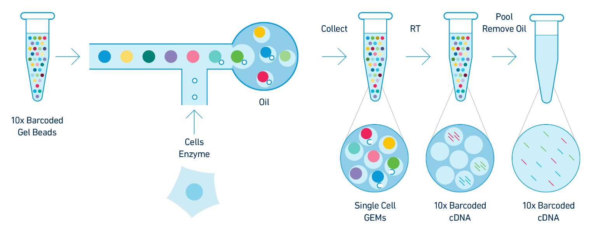
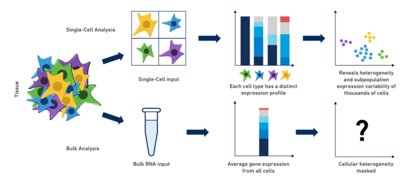

## Brief overview of single cell transcriptomics technology 

Single cell RNA-sequencing (scRNA-Seq) is a method of quantifying transcript expression levels in individual cells. scRNA-Seq technology can take on many different forms and this area of research is rapidly evolving. In 2022, the most widely used systems for performing scRNA-Seq involve separating cells and introducing them into a microfluidic system which performs the chemistry on each cell individually (droplet-based scRNA-Seq).

In this workshop we will primarily focus on the 10X Genomics technology. 10X Genomics is a market leader in the single cell space and was among the first technologies that made it feasible to profile thousands of cells simultaneously. Single cell technology is changing rapidly and it is not clear whether any other companies will be able to successfully challenge 10X's dominance in this space. 

The steps in droplet scRNA-Seq are:

1.  Cell isolation: 
    * If the cells are part of a tissue, the cells are disaggregated using collagenase or other reagents. The specifics of this protocol can vary greatly due to differences between tissues that are biological in nature. If the cells are in culture or suspension, they may be used as is.
2. Assess cell viability.
    * If scRNA-Seq is being performed on fresh tissue, the cells are usually checked for viability. We want "happy" cells loaded into the machine. We might hope for >90% viable and set a minimum threshold of >70%, although these numbers can vary depending on the experiment.
3. Droplet formation inside instrument:
    * Using a microfluidic system, each cell is suspended in a nanoliter-size droplet along with a barcoded primer bead. The cells are kept separate from each other in an oil/water emulsion.
4. Cell lysis, generating complementary DNA (cDNA):
    * The cells are lysed in each droplet. Each cell was already encapsulated with a barcoded primer bead which has a primer specific to that cell. Often a poly-d(T) primer is used to prime the poly(A) tail of mRNA. Transcribe cDNA and add correct primers for Illumina sequencing.
7. Library generation:
    * Remove oil to destroy droplets and homogenize the mixture. Amplify cDNA by PCR. Sequence on any Illumina machine. Sequencing should be paired-end -- one read contains cell and molecule barcodes, while the other read contains the target transcript that was captured.
    
> DMG: Add figure from 10X.

## What is scRNA-Seq useful for? 

Single cell RNA-Seq is a new technology and its uses are limited only by your imagination! A few examples of problems that have been addressed using scRNA-Seq include:
 * developmental studies & studies of cellular trajectories.
 * detailed tissue atlases.
 * characterization of tumor clonality.
 * definition of cell-type specific transcriptional responses (e.g. T-cell response to infection)
 * profiling of changes in cell state (i.e. homeostasis vs. response state)
 * a variety of different types of CRISPR screens

> DMG: May need to make our own figure.

## Comparing and contrasting scRNA-Seq with bulk RNA-Seq 

Bulk RNA-Seq and single cell RNA-Seq are related in that they both assess transcription levels by sequencing short reads, but these two technologies have a variety of differences. Neither technology is always better. The approach that one might use should depend upon the information one hopes to gather.

Consider the following points when assessing the differences between the technologies and choosing which to utilize for your own experiment:
 * Tissues are heterogeneous mixtures of diverse cell types. Bulk RNA-Seq data consists of average measures of transcripts expressed across many different cell types, while scRNA-Seq data is cell-type resolved.
 * Bulk RNA-Seq data may not be able to distinguish between changes in gene expression or tissue cell composition.
 * Bulk RNA-Seq allows for much higher sequencing coverage for each gene and often captures more total genes.
 * Bulk RNA-Seq allows for better isoform detection due to the higher sequencing depth and relatively uniform coverage across transcripts (vs. a typical 3' bias in scRNA-Seq).
 * Genes without poly-A tail (e.g. some noncoding RNAs) might not be detected in scRNA-Seq, but can be reliably assessed using bulk RNA-Seq.
 
> DMG - make or find a figure for bulk vs SC 

https://www.10xgenomics.com/blog/single-cell-rna-seq-an-introductory-overview-and-tools-for-getting-started
> DMG: May need to make our own figure.

> ## Challenge
> For each of these scenarios, choose between using bulk RNA-Seq and scRNA-Seq to address your problem.
>
> Differentiation of embryonic stem cells to another cell type
> > ## Solution
> > You would likely find single cell RNA-Seq most powerful in this situation since the cells are differentiating along a continuous transcriptional gradient.
> {: .solution}
> 
> Aging and *Cdkn2a*
> > ## Solution
> > Since you are interested in the expression of a single gene (*Cdkn2a*), bulk RNA-seq may be a better choice because of the greater sequencing depth and the potenial to identify isoforms.
> {: .solution}
> 
> PBMCs -- 
> > ## Solution
> > Since you may be interested in the expression of specific cell types, single cell RNA-seq may be a better choice because you will be able to quantify cell proportions and cell-specific gene expression.
> {: .solution}
> 
> New non-model species
> > ## Solution
> > Non-model organsms may not have a well-developed reference genome and transcript annotation. Thus, you may need to use tools which perform de-novo transcript assembly and then align your reads to that custom transcriptome. De-novo transcript assembly requires greater sequencing depth, which single-cell RNA-seq may not provide. So we would recommend using bulk RNA-seq in this situation.
> {: .solution}
> 
> Studying miRNAs
> > ## Solution
> > MicroRNAs are not currently assayed by most scRNA-seq technologies. So bulk RNA-seq, with an enrichment for small RNAs, would be the better choice here.
> {: .solution}
> 
> eQTL mapping
> > ## Solution
> > You may want good estimates of transcript abundance in your tissue of interest, so bulkd RNA-seq may be a good choice here. However, you may be able to aggregate scRNA-seq expression for each cell type and perform eQTL mapping. So both could be informative!
> {: .solution}
{: .challenge}

## Single cell data modalities

There are several different modalities by which one can gather data on the molecular properties of single cells. 10X Genomics currently offers the following reliable assays:

* RNA-seq - assess gene expression in single cells. A sub-group of single cell gene expression is single nucleus gene expression, which is often used on frozen samples or for tissues where preparing a single cell suspension is difficult or impossible (e.g. brain).
* ATAC-seq - assess chromatin accessibility in single cells
* "Multiome" - RNA + ATAC in the same single cells
* Immune repertoire profiling - assess clonality and antigen specificity of adaptive immune cells (B and T cells)
* CITE-Seq - assess cell surface protein levels
* Spatial transcriptomics/proteomics - assess gene expression and/or protein abundance with near-single cell resolution

## Focus of this course: 10X Genomics mouse scRNA-Seq

While there are several commercially available scRNA-seq technologies, this course will focus on data generated by the 10X Genomics platform. This technology is widely used at JAX, and it is flexible, reliable, and relatively cost-efficient. We will focus on a mouse data set, although most of the techniques that you will learn in this workshop apply equally well to other species. Each data modality has its own strengths and weaknesses; in this course we will focus on transcriptomics.

## Brief overview of instrumentation and library preparation choices available from 10X Genomics

10X Genomics offers a variety of options for profiling single cells. Here we give a brief overview of some of their offerings to illustrate what is available.

To profile gene expression, users can choose from several options:
 * 3' gene expression -- the "usual" option, amplifies from the 3' end of transcripts
 * 5' gene expression -- another option for 
 * "targeted" gene expression -- focus on a smaller number of genes that are of particular interest

One can also choose to profile gene expression on different instruments. The "workhorse" **10X Chromium** machine is used for profiling gene expression of up to eight samples totaling 25k-100k cells. The newer Chromium X is a higher throughput instrument which can profile up to 16 samples and up to one million cells. More information is available from [10X Genomics](https://www.10xgenomics.com/products/single-cell-gene-expression).

10X Genomics also produces a suite of other instrumentation for applications such as spatial transcriptomics (Visium) or in situ profiling (Xenium), which we will not cover in this course.



