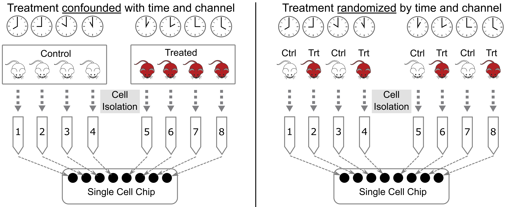

---
# Please do not edit this file directly; it is auto generated.
# Instead, please edit 02-Experimental-Considerations.md in _episodes_rmd/
source: Rmd
title: "Experimental Considerations"
teaching: 30
exercises: 10
questions:
- "How do I design a rigorous and reproducible single cell RNAseq experiment?"
objectives:
- "Understand the importance of biological replication for rigor and reproducibility."
- "Understand how one could pool biological specimens for scRNA-Seq."
- "Understand why confounding experimental batch with the variable of interest makes it impossible to disentangle the two."
- "Understand the different data modalities in single-cell sequencing and be able to select a modality to answer an experimental question."
keypoints:
- "Due to the high variance in single-cell data sets, a well-powered study with adequate biological replication is essential for rigor & reproducibility."
- "Do not confound experimental batch with any technical aspect of the experiment, i.e. sample pooling or flow cell assignment."
---

In this lesson we will discuss several key factors you should keep in mind when designing and executing your single cell study. Single cell transcriptomics is in many ways more customizable than bulk transcriptomics. This can be an advantage but can also complicate study design.

## Doublets - a ubiquitous property of droplet single cell assays

what are doublets
software for identifying doublets (in QC lesson)
correlation between cell number and doublet rate

> DAS: Find figure of correlation between cells vs doublet rate.

## How to decide on the parameters of the experiment

There are a number of parameters in a typical scRNA-Seq experiment that are customizable according to the particular details of each study. 

### Number of cells

Distinguish between cells *loaded* vs cells *captured*
A typical number of captured cells would be 6,000 cells on standard 10X Chromium, or 
"Overloading" or "Superloading"

### Sequencing depth

### Number of samples

Discuss economy of running more samples vs less.

## Biological replication  

Proper biological replication is the cornerstone of a statistically well-powered experiment. This is recognized across nearly all of biology. In the early days of single cell RNA-Seq, the main focus of many investigations was demonstrating the technology and often biological replication was missing. As scRNA-Seq has matured, we believe it has become increasingly important to ensure the presence of biological replication in order to have confidence that our findings are statistically robust.

Note that the tens of thousands of cells sequenced in a typical sample do *not* constitute biological replication. In order to show a biologically meaningful change in cell composition, the emergence of a particular cell subset, or difference in gene expression we need samples harvested from multiple individuals.

In a strict sense, biological replication would entail independently rearing multiple genetically identical animals, subjecting them to identical conditions, and harvesting cells in an identical manner. This is one strength of working in the mouse that we can leverage at JAX. However, there are also instances where we can attain truly useful biological replication without meeting these strict requirements. For example, a disease study in humans may profile single cells collected from affected and unaffected individuals, and could provide insights as long as the groups are not systematically different. Turning to the mouse, a fine-grained timecourse may not require biological replication at every timepoint because -- depending on the questions investigators wish to ask -- cells from different individual mice collected at different timepoints might be analyzed together to attain robust results.

How many biological replicates should one collect? This question is difficult to answer with a "one size fits all" approach but we recommend an absolute minimum of three biological replicates per experimental group. More is almost always better, but there are obviously tradeoffs with respect to budget and the time it takes to harvest samples. There are many studies that have attempted to model the power of single cell RNA-Seq experiments, including differential gene expression and differences in cell composition. We will not discuss these studies in detail in this course, but some may be useful for your own work:
 * Schmid et al. 2021. scPower accelerates and optimizes the design of multi-sample single cell transcriptomic studies.  <https://doi.org/10.1038/s41467-021-26779-7>
 * Svensson et al. 2017. Power analysis of single-cell RNA-sequencing experiments. <https://doi.org/10.1038/nmeth.4220>
 * Davis et al. 2019. SCOPIT: sample size calculations for single-cell sequencing experiments. <https://doi.org/10.1186/s12859-019-3167-9>
 * Zimmerman et al. 2021. Hierarchicell: an R-package for estimating power for tests of differential expression with single-cell data. <https://doi.org/10.1186%2Fs12864-021-07635-w>
 * Vieth et al. 2017. powsimR: power analysis for bulk and single cell RNA-seq experiments. <https://doi.org/10.1093/bioinformatics/btx435j>
 * Su et al. 2020. Simulation, power evaluation and sample size recommendation for single-cell RNA-seq. <https://doi.org/10.1093/bioinformatics/btaa607>

## Pooling options  

Given the relatively high expense of each scRNA-Seq sample and the importance of proper biological replication laid out above, the opportunity to pool samples and run them together is a powerful tool in the single cell enthusiast's toolkit. 
In pooled single cell genomics, there are two primary methods of tracking the sample to which each individual cell belongs. First, one can attach a unique barcode ("hashtag") to all cells of each sample, typically using an oligonucleotide-tagged antibody to a ubiquitous cell surface protein or an alternative (e.g. lipid-reactive) reagent (Figure?). This approach was pioneered by Smibert et al (link). The hashtag is read out in a dedicated library processing step and used to demultiplex samples based on knowledge of the pre-pooling barcoding strategy. This is the basis of the techniques known as "cell hashing", "lipid hashing", and the recently introduced 10X Genomics CellPlex multiplexing system. The hashtagging approach is accurate, however it is important to note that the extra experimental steps may impose obstacles. Hashtagged multiplexing requires extra sample preparation steps for barcoding, which can affect the viability and quality of cell preparations, may be less effective for certain tissues and cell types, and the increased sample handling may itself impose a significant burden in large projects.

A second, alternative, approach is to use natural genetic variation as a built-in barcode and demultiplex cells using SNVs and indels unique to each sample (Figure?). This approach was pioneered by Kang et al (link). In contrast to the hashtagging approach, genetic demultiplexing requires no special reagents or additional steps, and can be used for any tissue or cell type. However, the genetic demultiplexing approach requires that the samples being pooled are sufficiently genetically distinct for them to be distinguishable using transcribed genetic variation. This condition is typically met in human studies or in studies of genetically diverse mice. Of course, this approach would not suffice for a study of a single inbred mouse strain profiled under multiple conditions.
[DAS note advantage of genetic demuxxing is we can filter out mixed background doublets]

## Avoid Confounding Batch with Experimental Variables

When designing an experiment, it is tempting to lay samples out in some order that is easy to remember. If you are performing a dose-response experiment, you might order your samples from the lowest dose to the highest dose. If you are assaying transcript levels in different tissues, you might sort the samples by tissue. However, if you maintain this order, you risk confounding RNA-seq batches with your experimental batches. This is called "confounding" and it makes it impossible to statistically disentangle the batch effect from your experimental question.

Let's look at an example. Suppose that you have analyzed cells from kidney, liver, spleen, and heart. In the lab, you would process each tissue type independently because each tissue is distinct. If you maintain the tissues separately as you perform library preparation and sequencing, you will be unable to determine whether the differences that you observe are due to tissue differences or RNA-seq batch differences. 

In order to reduce the effect of batch structure on your experiment is it crucial to employ **randomization**. This involves randomizing tissues across library preparation and sequencing batches. The figure below shows examples of poor and good batch design. In the left panel, the library from each tissue is placed in a separate flow cell. This means that, if there are differences between flow cells, there will be no way to distinguish or correct these differences. On the right, we show the recommended flow cell design. The library from each tissue should be distributed evenly across each flow cell. The reads for each tissue can be combined from each flow cell using the cell bar codes after sequencing.

> ## Recommended Reading
>
> - Review(s) with best-practices or advice on experimental design?
>
{: .checklist }

## Session Info

~~~
sessionInfo()
~~~
{: .language-r}

~~~
R version 4.1.2 (2021-11-01)
Platform: x86_64-w64-mingw32/x64 (64-bit)
Running under: Windows 10 x64 (build 19042)

Matrix products: default

locale:
[1] LC_COLLATE=English_United States.1252 
[2] LC_CTYPE=English_United States.1252   
[3] LC_MONETARY=English_United States.1252
[4] LC_NUMERIC=C                          
[5] LC_TIME=English_United States.1252    

attached base packages:
[1] stats     graphics  grDevices utils     datasets  methods   base     

other attached packages:
[1] knitr_1.40

loaded via a namespace (and not attached):
[1] compiler_4.1.2 magrittr_2.0.3 tools_4.1.2    stringi_1.7.8  stringr_1.4.1 
[6] xfun_0.33      evaluate_0.16 
~~~
{: .output}
