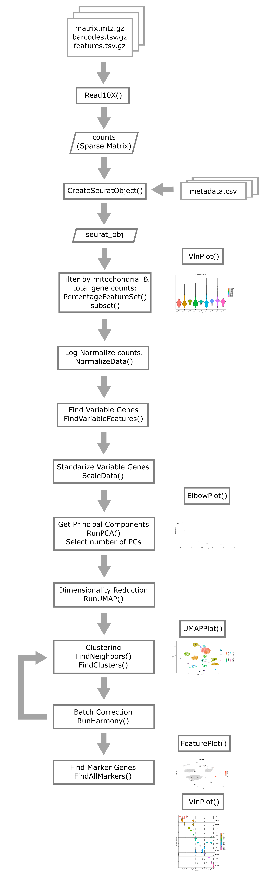
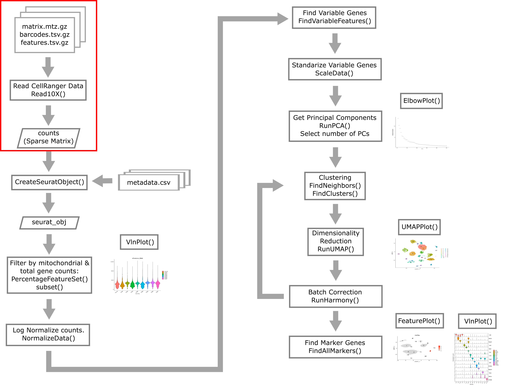
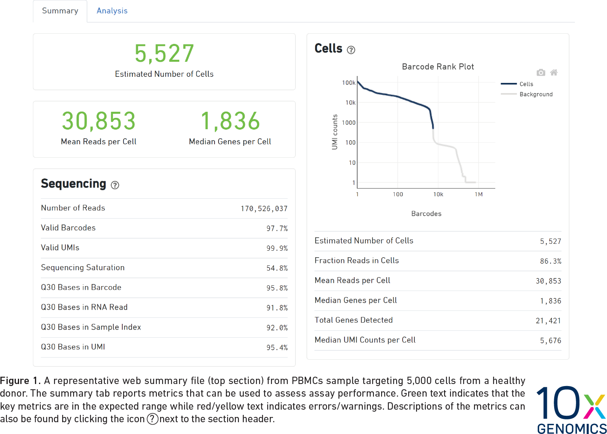
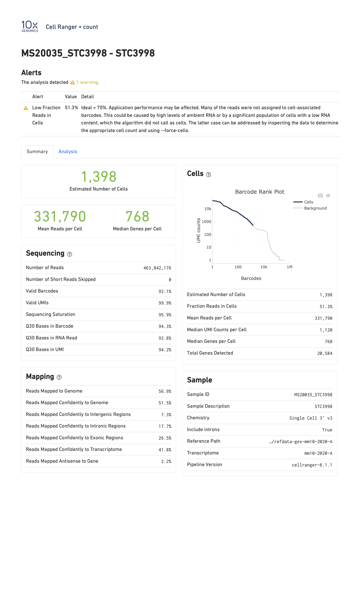
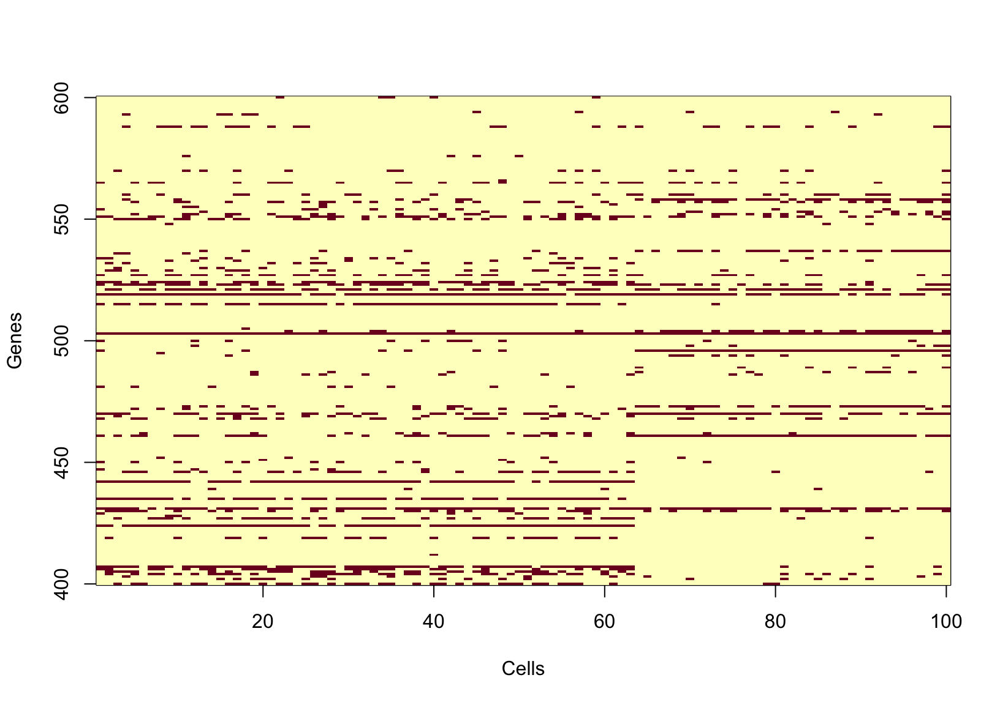
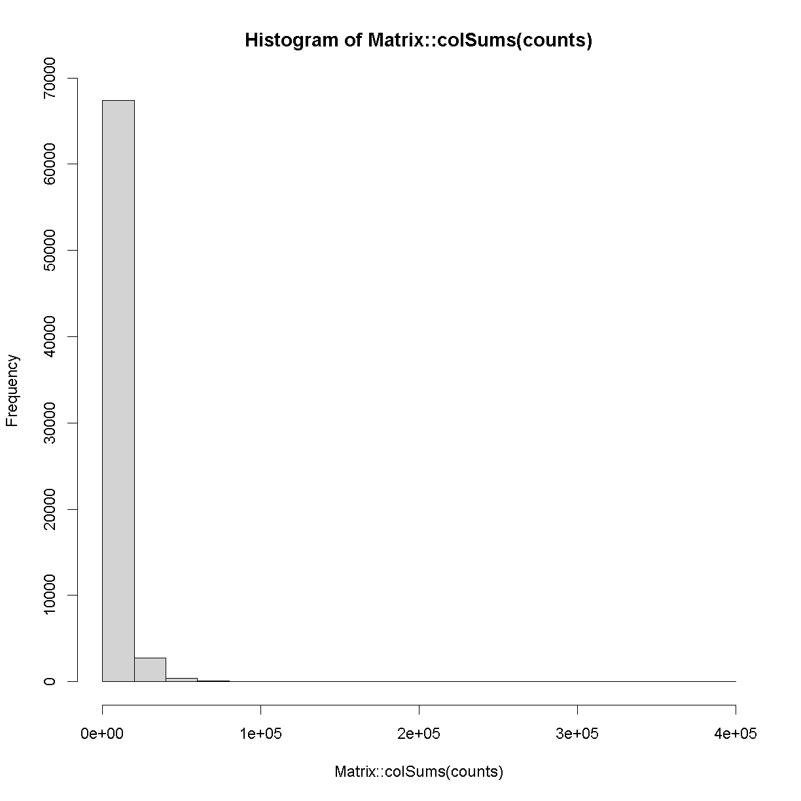
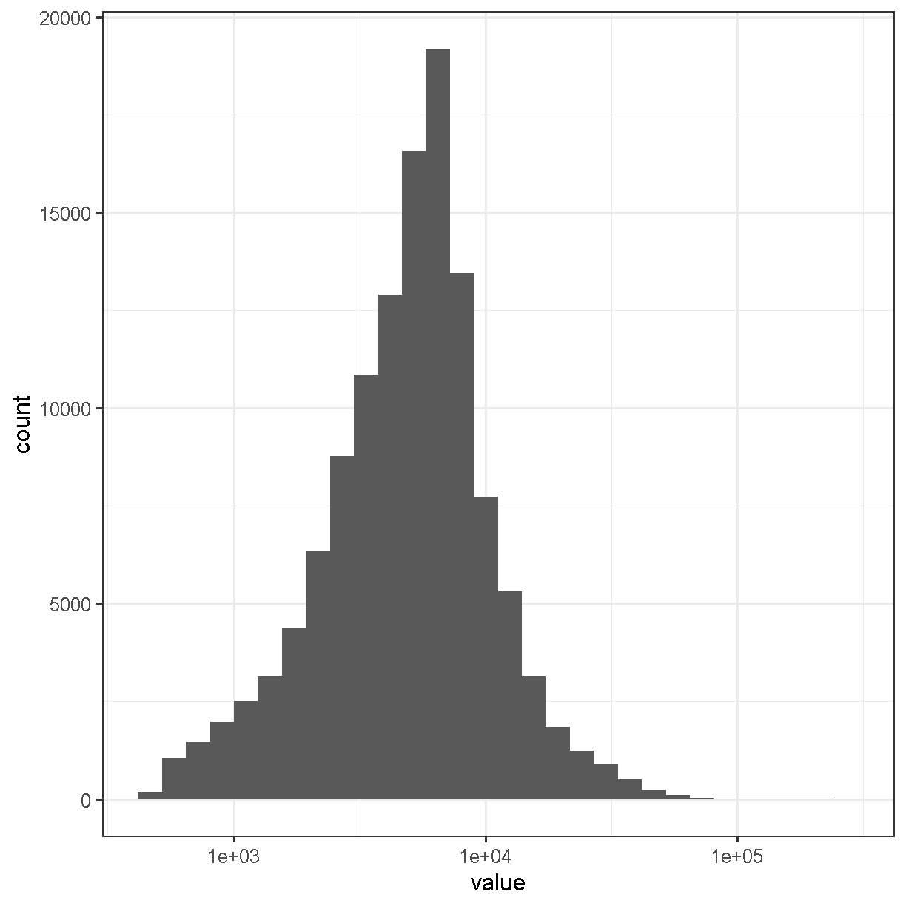

---
# Please do not edit this file directly; it is auto generated.
# Instead, please edit 03-Overview-scRNA-seq-Data.md in _episodes_rmd/
source: Rmd
title: "Overview of scRNA-seq Data"
teaching: 90
exercises: 30
questions:
- "What does single cell RNA-Seq data look like?"
objectives:
- "Understand the types of files provided by CellRanger."
- "Understand the structure of files provided by CellRanger."
- "Describe a sparse matrix and explain why it is useful."
- "Read in a count matrix using Seurat."
keypoints:
- "CellRanger produces a gene expression count matrix that can be read in using Seurat."
- "The count matrix is stored as a sparse matrix with features in rows and cells in columns."
---

~~~
suppressPackageStartupMessages(library(tidyverse))
suppressPackageStartupMessages(library(Seurat))

data_dir <- '../data'
~~~
{: .language-r}

## Overview of Single Cell Analysis Process

## Open Project File

In the Setup section of this workshop, you created an RStudio Project. 
Open this project now, by:

1. selecting File --> Open Project... from the Menu
2. choosing "scRNA.Rproj"
3. opening the project file.

## What do raw scRNA-Seq data look like?

The raw data for an scRNA-Seq experiment typically consists of two FASTQ files.
One file contains the sequences of the cell barcode and molecular
barcode (UMI), while the other file contains the sequences derived from
the transcript. The reads in file one are approximately 28bp long 
(16bp cell barcode, 12bp UMI), while the reads in file two are 
approximately 90bp long.

The Single Cell Biology Laboratory at JAX additionally provides output
of running the 
[10X CellRanger pipeline](https://support.10xgenomics.com/single-cell-gene-expression/software/pipelines/latest/what-is-cell-ranger) 
(see below). 

## Typical pre-processing pipeline

### 10X CellRanger

[10X CellRanger](https://support.10xgenomics.com/single-cell-gene-expression/software/pipelines/latest/what-is-cell-ranger) 
is "a set of analysis pipelines that process Chromium single cell 
data to align reads, generate feature-barcode matrices" and perform
various other downstream analyses.
In this course we will work with data that has been preprocessed 
using CellRanger.
All you need to remember is that we used CellRanger to obtain
gene expression counts for each gene within each cell.

### CellRanger alternatives

There are several alternatives to CellRanger. Each of these alternatives
has appealing properties that we encourage you to read about but do not
have the time to discuss in this course. Alternatives include:

 * `alevin` [Srivastava et al. 2019](https://genomebiology.biomedcentral.com/articles/10.1186/s13059-019-1670-y), 
 from the developers of the `salmon` aligner
 * `kallisto | bustools` [Melsted et al. 2021](https://doi.org/10.1038/s41587-021-00870-2), 
 from the developers of the `kallisto` aligner
 * `STARsolo` [Kaminow et al 2021](https://doi.org/10.1101/2021.05.05.442755), 
 from the developers of the `STAR` aligner

While you should be aware that these alternatives
exist and in some cases there may be very compelling reasons to use them,
broadly speaking CellRanger is the most widely used tool for 
processing 10X Chromium scRNA-Seq data. 

## Introduction to two major single cell analysis ecosystems: 

At the time that this workshop was created, there were many different software 
packages designed for analyzing scRNA-seq data in a variety of scenarios. The 
two scRNA-seq software "ecosystems" that were most widely in use were:

* R/Seurat : The Seurat ecosystem is the tool of choice for this workshop. The 
biggest strength of Seurat is its straightforward vignettes and ease of 
visualization/exploration. 
    * [Seurat](https://www.nature.com/articles/nbt.3192) was released in 2015 
    by the [Regev lab](https://biology.mit.edu/profile/aviv-regev/).
    * The first author, Rahul Satija, now has a faculty position and has 
    maintained and improved Seurat.
    * Currently at [version 4](https://www.cell.com/cell/fulltext/S0092-8674(21)00583-3).
    * Source code available on [Github](https://www.github.com/satijalab/seurat).
    * Each version of Seurat adds new functionality:
        * Seurat v1: Infers cellular localization by integrating scRNA-seq 
        with *in situ* hybridization.
        * Seurat v2: Integrates multiple scRNA-seq data sets using shared 
        correlation structure.
        * Seurat v3: Integrates data from multiple technologies, i.e. scRNA-seq, 
        scATAC-seq, proteomics, *in situ* hybridization.
        * Seurat v4: Integrative multimodal analysis and mapping of user data 
        sets to cell identity reference database.

* Python/[scanpy](https://scanpy.readthedocs.io/en/stable/) and [anndata](https://anndata.readthedocs.io/en/latest/)
    * Scanpy is a python toolkit for analyzing single-cell gene expression data.
    * Scanpy is built jointly with anndata, which is a file format specification 
    and accompanying API for efficiently storing and accessing single cell data.
    * Like Seurat, scanpy is under active development as well. Scanpy has an 
    advantage of being a somewhat larger and more diverse community than
    Seurat, where developement is centered around a single lab group.
    * This software has been used in a very large number of single cell projects. We 
    encourage you to check it out and consider using it for your own work. 
    
For this course we will not use scanpy because we view R/Seurat as 
having a slight edge over scanpy when it comes to visualization and 
interactive exploration of single cell data.

## Reading in CellRanger Data

As described above,
[CellRanger](https://support.10xgenomics.com/single-cell-gene-expression/software/pipelines/latest/what-is-cell-ranger) 
is software which preprocesses Chromium single cell data to 
align reads, generate feature-bar code matrices, and perform other downstream 
analyses. 
We will not be using any of CellRanger's downstream analyses,
but we *will* be using the feature-barcode matrix produced by CellRanger.
A feature-barcode matrix -- in the context of scRNA-Seq -- is a
matrix that gives gene expression counts for each gene in each single cell.
In a feature-barcode matrix, the 
genes (rows) are the features, and the cells (columns) are each identified
by a barcode.
The name feature-barcode matrix is a generalized term for the
gene expression matrix. For example, feature-barcode could also refer
to a matrix of single cell protein expression or single cell
chromatin accessibility.
In this workshop, we will read in the 
feature-barcode matrix produced by CellRanger and will perform the downstream 
analysis using Seurat.

### Liver Atlas

#### Cell Ranger Files

In this lesson, we will read in a subset of data from the 
[Liver Atlas](https://livercellatlas.org/index.php), which is described in their 
[Cell paper](https://www.cell.com/cell/fulltext/S0092-8674(21)01481-1). 
Briefly, the authors performed scRNASeq on liver cells from mice and humans, 
identified cell types, clustered them, and made the data publicly available. 
We will be working with a subset of the *mouse* liver data. 
We split the data into two sets, one to use in the lesson and one for 
you to work with independently as a challenge. 

Before the workshop, you should have downloaded the data from 
Box and placed it in your `data` directory. 
Go to the [Setup](../setup) page for instructions on how to download the data 
files.

Open a file browser and look in the `data` subdirectory `mouseStSt_invivo` and 
you should see three files. Each file ends with 'gz', which indicates that it 
has been compressed (or 'zipped') using 
[gzip](https://www.gnu.org/software/gzip/). You **don't** need to unzip them; 
the software that we use will uncompress the files as it reads them in. The 
files are:

 * matrix.mtx.gz: The feature-barcode matrix, i.e. a two-dimensional 
 matrix containing the counts for each gene in each cell.
    * Genes are in rows and cells are in columns.
    * This file is in a special sparse matrix format which reduces disk space 
    and memory usage.
 * barcodes.tsv.gz: DNA barcodes for each cell. Used as column names in counts matrix.
 * features.tsv.gz: Gene symbols for each gene. Used as row names in counts matrix.

> ## Challenge 1
> 1). R has a function called [file.size](https://stat.ethz.ch/R-manual/R-devel/library/base/html/file.info.html). 
Look at the help for this function and get the size of each of the files in 
the `mouseStSt_invivo` directory.  Which one is the largest?  
>
> > ## Solution to Challenge 1
> >
> > 1). `file.size(file.path(data_dir, 'mouseStSt_invivo', 'barcodes.tsv.gz'))`  
> >     584346 bytes  
> >     `file.size(file.path(data_dir, 'mouseStSt_invivo', 'features.tsv.gz'))`  
> >     113733 bytes  
> >     `file.size(file.path(data_dir, 'mouseStSt_invivo', 'matrix.mtx.gz'))`  
> >     603248953 bytes  
> >     'matrix.mtx.gz' is the largest file.     
> {: .solution}
{: .challenge}

#### CellRanger Quality Control Report

CellRanger also produces a Quality Control (QC) report as an HTML
document. It produces one report for each sample we run (each
channel of the 10X chip). We do not have
the QC report from the Liver Atlas study, but the figure below shows an 
example report. The report highlights three numbers:

1. Estimated Number of Cells: This indicates the number of cells recovered
in your experiment. As we previously discussed this will be less than the
number of cells you loaded. The number of cells recovered
will almost never be the exact number of cells you had hoped to recover,
but we might like to see a number within approximately +/-20% of your goal.
1. Mean Reads per Cell: This indicates the number of reads in each cell. 
This will be a function of how deeply you choose to sequence your library.
1. Median Genes per Cell: This indicates the median number of genes detected
in each cell. Note that this is much lower than in bulk RNA-Seq. This 
number will also be lower for single nucleus than for single cell
RNA-Seq, and is also likely to vary between cell types.

When you run a sample that has a problem of some kind, the CellRanger 
report might be able to detect something anomalous about your data and
present you with a warning. Here are two examples of reports with
warning flags highlighted.

In the report below, CellRanger notes that a low fraction of reads are within
cells. This might be caused by, for example, very high levels of ambient
RNA.

In the report below, CellRanger notes that a low fraction of reads are 
confidently mapped to the transcriptome, and a high fraction of reads map
antisense to genes. Note that in this sample we are seeing only 249 genes
per cell despite a mean of over 90,000 reads per cell. This likely indicates
a poor quality library.

### Reading a CellRanger Gene Expression Count Matrix using Seurat

In order to read these files into memory, we will use the 
[Seurat::Read10X()](https://satijalab.org/seurat/reference/read10x) function. 
This function searches for the three files mentioned above in the directory that
you pass in. Once it verifies that all three files are present, it reads them 
in to create a counts matrix with genes in rows and cells in columns.

We will use the `gene.column = 1` argument to tell Seurat to use the first 
column in 'features.tsv.gz' as the gene identifier.

Run the following command. This may take up to three minutes to complete.

~~~
# uses the Seurat function Read10X()
counts <- Read10X(file.path(data_dir, 'mouseStSt_invivo'), gene.column = 1)
~~~
{: .language-r}

`counts` now contains the sequencing read counts for each gene and cell.

How many rows and columns are there in `counts`?

~~~
dim(counts)
~~~
{: .language-r}

~~~
[1] 31053 47743
~~~
{: .output}

In the `counts` matrix, genes are in rows and cells are in columns. Let's look 
at the first few gene names.

~~~
head(rownames(counts), n = 10)
~~~
{: .language-r}

~~~
 [1] "Xkr4"    "Gm1992"  "Gm37381" "Rp1"     "Sox17"   "Gm37323" "Mrpl15" 
 [8] "Lypla1"  "Gm37988" "Tcea1"  
~~~
{: .output}

As you can see, the gene names are gene symbols. There is some risk that these 
may not be unique. Let's check whether any of the gene symbols are duplicated. 
We will sum the number of duplicated gene symbols.

~~~
sum(duplicated(rownames(counts)))
~~~
{: .language-r}

~~~
[1] 0
~~~
{: .output}

The sum equals zero, so there are no duplicated gene symbols, which is good.
As it turns out, the reference genome/annotation files that are prepared for
use by CellRanger have already been filtered to ensure no duplicated gene
symbols. 

Let's look at the cell identifiers in the column names.

~~~
head(colnames(counts), n = 10)
~~~
{: .language-r}

~~~
 [1] "AAACGAATCCACTTCG-2" "AAAGGTACAGGAAGTC-2" "AACTTCTGTCATGGCC-2"
 [4] "AATGGCTCAACGGTAG-2" "ACACTGAAGTGCAGGT-2" "ACCACAACAGTCTCTC-2"
 [7] "ACGATGTAGTGGTTCT-2" "ACGCACGCACTAACCA-2" "ACTGCAATCAACTCTT-2"
[10] "ACTGCAATCGTCACCT-2"
~~~
{: .output}

Each of these barcodes identifies one cell. They should all be unique. Once 
again, let's verify this.

~~~
sum(duplicated(colnames(counts)))
~~~
{: .language-r}

~~~
[1] 0
~~~
{: .output}

The sum of duplicated values equals zero, so all of the barcodes are unique.
The barcode sequence is the actual sequence of the oligonucleotide tag that
was attached to the GEM (barcoded bead) that went into each droplet. In early
versions of 10X technology there were approximately 
[750,000 barcodes](https://kb.10xgenomics.com/hc/en-us/articles/115004506263-What-is-a-barcode-whitelist-) 
per run while in the current chemistry there are 
[>3 million barcodes](https://kb.10xgenomics.com/hc/en-us/articles/360031133451-Why-is-there-a-discrepancy-in-the-3M-february-2018-txt-barcode-whitelist-).
CellRanger attempts to correct sequencing errors in the barcodes
and uses a "whitelist" of known barcodes (in the 10X chemistry) to help.

Next, let's look at the values in `counts`.

~~~
counts[1:10, 1:20]
~~~
{: .language-r}

~~~
10 x 20 sparse Matrix of class "dgCMatrix"
~~~
{: .output}

~~~
  [[ suppressing 20 column names 'AAACGAATCCACTTCG-2', 'AAAGGTACAGGAAGTC-2', 'AACTTCTGTCATGGCC-2' ... ]]
~~~
{: .output}

~~~
                                               
Xkr4    . . . . . . . . . . . . . . . . . . . .
Gm1992  . . . . . . . . . . . . . . . . . . . .
Gm37381 . . . . . . . . . . . . . . . . . . . .
Rp1     . . . . . . . . . . . . . . . . . . . .
Sox17   . . 2 4 . . . 1 . 1 1 . . 2 . . 1 8 1 .
Gm37323 . . . . . . . . . . . . . . . . . . . .
Mrpl15  . . . 1 1 . . . 1 . 2 . . . . 1 . 1 1 .
Lypla1  . . 2 1 . 1 1 . . . 1 1 2 . 1 1 1 . . .
Gm37988 . . . . . . . . . . . . . . . . . . . .
Tcea1   . . 2 . 2 2 . . 1 2 . 2 2 . . 2 1 1 2 .
~~~
{: .output}

We can see the gene symbols in rows along the left. The barcodes are not shown 
to make the values easier to read. Each of the periods represents a zero. The 
'1' values represent a single read for a gene in one cell.

Although `counts` looks like a matrix and you can use many matrix functions on 
it, `counts` is actually a *different* type of object. In scRNASeq, the read 
depth in each cell is quite low. So you many only get counts for a small number 
of genes in each cell. The `counts` matrix has 31053 rows and 
47743 columns, and includes 1.4825634 &times; 109 
entries. However, most of these entries 
(92.4930544%) are 
zeros because every gene is not detected in every cell. It would be wasteful 
to store all of these zeros in memory. It would also make it difficult to 
store all of the data in memory. So `counts` is a 'sparse matrix', which only 
stores the positions of non-zero values in memory.

Look at the structure of the `counts` matrix using [str](https://stat.ethz.ch/R-manual/R-devel/library/utils/html/str.html). 

~~~
str(counts)
~~~
{: .language-r}

~~~
Formal class 'dgCMatrix' [package "Matrix"] with 6 slots
  ..@ i       : int [1:111295227] 15 19 36 38 40 61 66 67 70 93 ...
  ..@ p       : int [1:47744] 0 3264 6449 9729 13446 16990 20054 23142 26419 29563 ...
  ..@ Dim     : int [1:2] 31053 47743
  ..@ Dimnames:List of 2
  .. ..$ : chr [1:31053] "Xkr4" "Gm1992" "Gm37381" "Rp1" ...
  .. ..$ : chr [1:47743] "AAACGAATCCACTTCG-2" "AAAGGTACAGGAAGTC-2" "AACTTCTGTCATGGCC-2" "AATGGCTCAACGGTAG-2" ...
  ..@ x       : num [1:111295227] 1 1 1 2 1 6 1 1 2 1 ...
  ..@ factors : list()
~~~
{: .output}

We can see that the formal class name is a "dgCMatrix". There are two long 
vectors of integers which encode the positions of non-zero values. The gene 
names and cell barcodes are stored in character vectors and the non-zero values 
are an integer vector. This class saves space by not allocating memory to store 
all of the zero values.

Let's look at small portion of `counts`. We will create a tile plot indicating 
which values are non-zero for the first 100 cells and genes in rows 400 to 600. 
For historical reasons, R plots the rows along the X-axis and columns along the 
Y-axis. We will transpose the matrix so that genes are on the Y-axis, which 
reflects the way in which we normally look at this matrix.

~~~
image(1:100, 400:600, t(as.matrix(counts[400:600,1:100]) > 0), 
      xlab = 'Cells', ylab = 'Genes')
~~~
{: .language-r}

plot of chunk counts_image

In the tile plot above, each row represents one gene and each column represents 
one cell. Red indicates non-zero values and yellow indicates zero values.  As 
you can see, most of the matrix consists of zeros (yellow tiles) and hence is 
called 'sparse'. You can also see that some genes are expressed in most cells, 
indicated by the horizontal red lines, and that some genes are expressed in 
very few cells.

What proportion of genes have zero counts in all samples? 

~~~
gene_sums <- data.frame(gene_id = rownames(counts),
                        sums    = Matrix::rowSums(counts))
sum(gene_sums$sums == 0)
~~~
{: .language-r}

~~~
[1] 7322
~~~
{: .output}

We can see that 7322 (24%) 
genes have no reads at all associated with them. In the next lesson, we will 
remove genes that have no counts in any cells.

Next, let's look at the number of counts in each cell.

~~~
hist(Matrix::colSums(counts))
~~~
{: .language-r}

plot of chunk cell_counts

~~~
Matrix::colSums(counts) %>% enframe() %>%
  ggplot(aes(value)) + geom_histogram(bins = 30) + 
  theme_bw(base_size = 16) + scale_x_log10()
~~~
{: .language-r}

plot of chunk cell_counts

The range of counts covers several orders of magnitude, from 
500 to 3.32592 &times; 105. We will need
to normalize for this large difference in sequencing depth,
which we will cover in the next lesson.

### Sample Metadata

Sample metadata refers to information about your samples that is not the 
"data", i.e. the gene counts. This might include information such as sex, 
tissue, or treatment. In the case of the liver atlas data, the authors provided 
a metadata file for their samples.

The sample metadata file is a comma-separated variable (CSV) file, We will read 
it in using the readr 
[read_csv](https://readr.tidyverse.org/reference/read_delim.html) function.

~~~
metadata <- read_csv(file.path(data_dir, 'mouseStSt_invivo', 'annot_metadata_first.csv'))
~~~
{: .language-r}

~~~
Rows: 47743 Columns: 4
── Column specification ────────────────────────────────────────────────────────
Delimiter: ","
chr (4): sample, cell, digest, typeSample

ℹ Use `spec()` to retrieve the full column specification for this data.
ℹ Specify the column types or set `show_col_types = FALSE` to quiet this message.
~~~
{: .output}

Let's look at the top of the metadata.

~~~
head(metadata)
~~~
{: .language-r}

~~~
# A tibble: 6 × 4
  sample cell               digest typeSample
  <chr>  <chr>              <chr>  <chr>     
1 CS48   AAACGAATCCACTTCG-2 inVivo scRnaSeq  
2 CS48   AAAGGTACAGGAAGTC-2 inVivo scRnaSeq  
3 CS48   AACTTCTGTCATGGCC-2 inVivo scRnaSeq  
4 CS48   AATGGCTCAACGGTAG-2 inVivo scRnaSeq  
5 CS48   ACACTGAAGTGCAGGT-2 inVivo scRnaSeq  
6 CS48   ACCACAACAGTCTCTC-2 inVivo scRnaSeq  
~~~
{: .output}

In the table above, you can see that there are four columns:

1. sample: mouse identifier from which cell was derived;
1. cell: the DNA bar code used to identify the cell;
1. digest: cells for this liver atlas were harvested using either an *in vivo* 
or an *ex vivo* procedure. In this subset of the data we are looking only 
at *in vivo* samples;
1. typeSample: the type of library preparation protocol, either single cell 
RNA-seq (scRnaSeq) or nuclear sequencing (nucSeq). In this subset of the data 
we are looking only at scRnaSeq samples.

Let's confirm that we are only looking at scRnaSeq samples from *in vivo* 
digest cells:

~~~
dplyr::count(metadata, digest, typeSample)
~~~
{: .language-r}

~~~
# A tibble: 1 × 3
  digest typeSample     n
  <chr>  <chr>      <int>
1 inVivo scRnaSeq   47743
~~~
{: .output}

We're going to explore the data further using a series of Challenges. 
You will be asked to look at the contents of some of the columns to see 
how the data are 
distributed.

> ## Challenge 2
> How many mice were used to produce this data? The "sample" column contains 
the mouse identifier for each cell.  
>
> > ## Solution to Challenge 2
> >
> > count(metadata, sample) %>% summarize(total = n())     
> {: .solution}
{: .challenge}

> ## Challenge 3
> How many cells are there from each mouse? 
>
> > ## Solution to Challenge 3
> >
> > count(metadata, sample)
> {: .solution}
{: .challenge}

In this workshop, we will attempt to reproduce some of the results of the 
[Liver Atlas](https://livercellatlas.org/index.php) using Seurat. We will 
analyze the *in-vivo* single **cell** RNA-Seq 
together.

### Save Data for Next Lesson

We will use the *in-vivo* data in the next lesson. Save it now and we will 
load it at the beginning of the next lesson. We will use R's [save](https://stat.ethz.ch/R-manual/R-devel/library/base/html/save.html) 
command to save the objects in compressed, binary format. The `save` command is 
useful when you want to save multiple objects in one file.

> ## Challenge 5
> In the lesson above, you read in the scRNASeq data. There is 
another dataset which was created using an *ex vivo* digest in the 
`mouseStSt_exvivo` 
directory. Delete the `counts` and `metadata` objects from your environment. 
Then read in the counts and metadata from the `mouseStSt_exvivo` 
directory and save them to a file called 'lesson03_challenge.Rdata'.
>
> > ## Solution to Challenge 5
> >
> > `# Remove exising counts and metadata.`  
> > `rm(counts, metadata)`
> > `# Read in new counts.`  
> > `counts <- Seurat::Read10X(file.path(data_dir, 'mouseStSt_exvivo'), gene.column = 1)`  
> > `# Read in new metadata.`  
> > `metadata <- read_csv(file.path(data_dir, 'mouseStSt_exvivo', 'annot_metadata.csv'))`  
> > `# Save data for next lesson.`  
> > `save(counts, metadata, file = file.path(data_dir, 'lesson03_challenge.Rdata'))`  
> {: .solution}
{: .challenge}

### Session Info

~~~
sessionInfo()
~~~
{: .language-r}

~~~
R version 4.2.3 (2023-03-15 ucrt)
Platform: x86_64-w64-mingw32/x64 (64-bit)
Running under: Windows 10 x64 (build 19045)

Matrix products: default

locale:
[1] LC_COLLATE=English_United States.utf8 
[2] LC_CTYPE=en_US.UTF-8                  
[3] LC_MONETARY=English_United States.utf8
[4] LC_NUMERIC=C                          
[5] LC_TIME=English_United States.utf8    

attached base packages:
[1] stats     graphics  grDevices utils     datasets  methods   base     

other attached packages:
 [1] SeuratObject_4.1.3 Seurat_4.3.0.1     lubridate_1.9.2    forcats_1.0.0     
 [5] stringr_1.5.0      dplyr_1.1.3        purrr_1.0.2        readr_2.1.4       
 [9] tidyr_1.3.0        tibble_3.2.1       ggplot2_3.4.3      tidyverse_2.0.0   
[13] knitr_1.44        

loaded via a namespace (and not attached):
  [1] Rtsne_0.16             colorspace_2.1-0       deldir_1.0-9          
  [4] ellipsis_0.3.2         ggridges_0.5.4         spatstat.data_3.0-1   
  [7] farver_2.1.1           leiden_0.4.3           listenv_0.9.0         
 [10] bit64_4.0.5            ggrepel_0.9.3          fansi_1.0.4           
 [13] codetools_0.2-19       splines_4.2.3          polyclip_1.10-4       
 [16] jsonlite_1.8.7         ica_1.0-3              cluster_2.1.4         
 [19] png_0.1-8              uwot_0.1.16            shiny_1.7.5           
 [22] sctransform_0.3.5      spatstat.sparse_3.0-2  compiler_4.2.3        
 [25] httr_1.4.7             Matrix_1.6-0           fastmap_1.1.1         
 [28] lazyeval_0.2.2         cli_3.6.1              later_1.3.1           
 [31] htmltools_0.5.6        tools_4.2.3            igraph_1.5.1          
 [34] gtable_0.3.4           glue_1.6.2             RANN_2.6.1            
 [37] reshape2_1.4.4         Rcpp_1.0.11            scattermore_1.2       
 [40] vctrs_0.6.3            nlme_3.1-162           spatstat.explore_3.2-3
 [43] progressr_0.14.0       lmtest_0.9-40          spatstat.random_3.1-6 
 [46] xfun_0.40              globals_0.16.2         timechange_0.2.0      
 [49] mime_0.12              miniUI_0.1.1.1         lifecycle_1.0.3       
 [52] irlba_2.3.5.1          goftest_1.2-3          future_1.33.0         
 [55] MASS_7.3-60            zoo_1.8-12             scales_1.2.1          
 [58] vroom_1.6.3            hms_1.1.3              promises_1.2.1        
 [61] spatstat.utils_3.0-3   parallel_4.2.3         RColorBrewer_1.1-3    
 [64] reticulate_1.32.0      pbapply_1.7-2          gridExtra_2.3         
 [67] stringi_1.7.12         rlang_1.1.1            pkgconfig_2.0.3       
 [70] matrixStats_1.0.0      evaluate_0.21          lattice_0.21-8        
 [73] ROCR_1.0-11            tensor_1.5             labeling_0.4.3        
 [76] patchwork_1.1.3        htmlwidgets_1.6.2      bit_4.0.5             
 [79] cowplot_1.1.1          tidyselect_1.2.0       parallelly_1.36.0     
 [82] RcppAnnoy_0.0.21       plyr_1.8.8             magrittr_2.0.3        
 [85] R6_2.5.1               generics_0.1.3         pillar_1.9.0          
 [88] withr_2.5.0            fitdistrplus_1.1-11    survival_3.5-5        
 [91] abind_1.4-5            sp_2.0-0               future.apply_1.11.0   
 [94] crayon_1.5.2           KernSmooth_2.23-22     utf8_1.2.3            
 [97] spatstat.geom_3.2-5    plotly_4.10.2          tzdb_0.4.0            
[100] grid_4.2.3             data.table_1.14.8      digest_0.6.33         
[103] xtable_1.8-4           httpuv_1.6.11          munsell_0.5.0         
[106] viridisLite_0.4.2     
~~~
{: .output}

