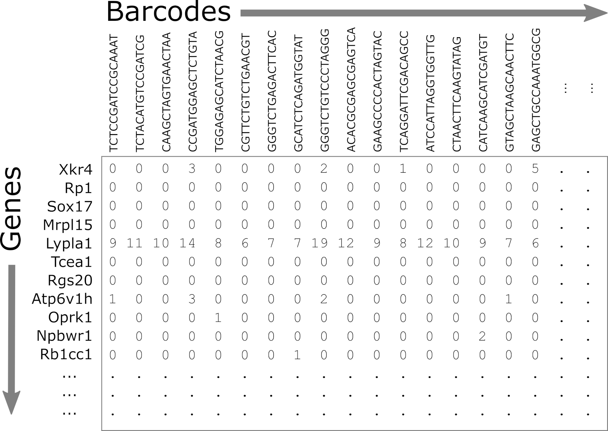
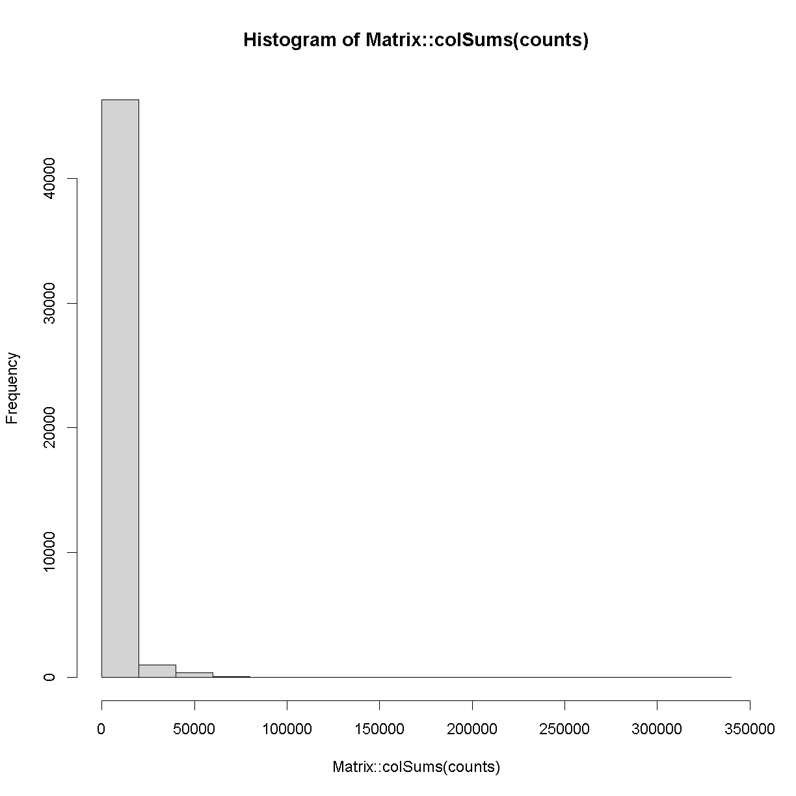

---
# Please do not edit this file directly; it is auto generated.
# Instead, please edit 03-Overview-scRNA-seq-Data.md in _episodes_rmd/
source: Rmd
title: "Overview of scRNA-seq Data"
teaching: 10
exercises: 2
questions:
- "What does single cell RNAseq data look like?"
objectives:
- "Understand the types of files provided by CellRanger."
- "Understand the structure of files provided by CellRanger."
- "Describe a sparse matrix and explain why it is useful."
- "Read in a feature-barcode matrix using Seurat."
keypoints:
- "CellRanger produces a feature-barcode matrix that can be read in using Seurat."
- "The feature-barcode matrix is stored as a sparse matrix with features in rows and cells in columns."
---

## What files are delivered? Details of FASTQ, etc.

> TBD: DAS to fill in.

## Typical pre-processing pipeline -- 10X CellRanger 

* Aligned by CellRanger (???).
* Produces gene counts for each cell.

## Intro to two major single cell ecosystems: 

At the time that this workshop was created, there were two major software packages designed for use in scRNA-seq:

* R/Seurat : Focus of this workshop. Biggest strength is straightforward vignettes and ease of visualization/exploration. 
    * [Seurat](https://www.nature.com/articles/nbt.3192) was released in 2015 by the [Regev lab](https://biology.mit.edu/profile/aviv-regev/).
    * The first author, Rahul Satija, now has a faculty position and has maintained and improved Seurat.
    * Currently at [version 4](https://www.cell.com/cell/fulltext/S0092-8674(21)00583-3).
    * Source code available on [Github](https://www.github.com/satijalab/seurat).
    * Seurat v1: Infers cellular localization by integrating scRNA-seq with *in situ* hybridization.
    * Seurat v2: Integrates multiple scRNA-seq data sets using shared correlation structure.
    * Seurat v3: Integrates data from multiple technologies, i.e. scRNA-seq, scATAC-seq, proteomics, *in situ* hybridization.
    * Seurat v4: Integrative multimodal analysis and mapping of user data sets to cell identity reference database.

* Python/scanpy
    * TBD: Expand on this.

## Reading in CellRanger Data

[CellRanger](https://support.10xgenomics.com/single-cell-gene-expression/software/pipelines/latest/what-is-cell-ranger) software which analyzes Chromium single cell data to align reads, generates feature-bar code matrices, and performs other downstream analyses. CellRanger is provided by 10X Genomics. In this workshop, we will read in the feature-bar code matrix produced by CellRanger and will perform the downstream analysis using Seurat.

### Liver Atlas

In this lesson, we will read in a subset of data from the [Liver Atlas](https://livercellatlas.org/index.php), which is described in their [Cell paper](https://www.cell.com/cell/fulltext/S0092-8674(21)01481-1). Briefly, the authors performed scRNASeq on liver cells from mice and humans, identified cell types, clustered them, and made the data publicly available. We split the data into two sets, one to use in the lesson and one for the challenges. We have also sub-sampled each subset to contain 75% of the cells to reduce memory usage and speed up the analysis time for this workshop.

We will be working with a subset of the mouse liver data. Before the workshop, you should have downloaded the data from <NEED TO FILL THIS IN> and placed it in your `data` directory. Go to the [Setup](../setup) page for instructions on how to download the data files.

> TBD: Not sure where to host the files. Maybe on Box with a public link. Can't figure out how to grab using RCurl yet.

Open a file browser and look in the `mouseStSt_scrnaseq_75pct` directory and you should see three files. Each file ends with 'gz', which indicates that it has been compressed (or 'zipped') using [gzip](https://www.gnu.org/software/gzip/). You **don't** need to unzip them; the software that we use will uncompress the files as it reads them in. The files are:

* matrix.mtx.gz: Two-dimensional matrix containing the counts for each gene in each cell.
    * Genes are in rows and cells are in columns.
    * This file is in a special sparse matrix format which reduces memory usage.
* barcodes.tsv.gz: DNA barcodes for each cell. Used as column names in counts matrix.
* features.tsv.gz: Gene symbols for each gene. Used as row names in counts matrix.

> ## Challenge 1
> 1). R has a function called [file.size](https://stat.ethz.ch/R-manual/R-devel/library/base/html/file.info.html). Look at the help for this function and get the size of each of the files in the `mouseStSt_scrnaseq_75pct` directory.  Which one is the largest?  
>
> > ## Solution to Challenge 1
> >
> > 1). `file.size(file.path(data_dir, 'mouseStSt_scrnaseq_75pct', 'barcodes.tsv.gz'))`  
> >     584346 bytes  
> >     `file.size(file.path(data_dir, 'mouseStSt_scrnaseq_75pct', 'features.tsv.gz'))`  
> >     113733 bytes  
> >     `file.size(file.path(data_dir, 'mouseStSt_scrnaseq_75pct', 'matrix.mtx.gz'))`  
> >     603248953 bytes  
> >     'matrix.mtx.gz' is the largest file.     
> {: .solution}
{: .challenge}

### Reading a CellRanger Feature-Barcode Matrix using Seurat

In order to read these files into memory, we will use the [Seurat::Read10X()](https://satijalab.org/seurat/reference/read10x) function. This function searches for the three files mentioned above in the directory that you pass in. Once it verifies that all three files are present, it reads them in to create a counts matrix with genes in rows and cells in columns.

We will use the `gene.column = 1` argument to tell Seurat to use the first column in 'features.tsv.gz' as the gene identifier.

Run the following command. This may take up to 3 minutes to complete.

~~~
counts = Seurat::Read10X(file.path(data_dir, 'mouseStSt_scrnaseq_75pct'), gene.column = 1)
~~~
{: .language-r}

`counts` now contains the sequencing read counts for each gene and cell.

How many rows and columns are there in `counts`?

~~~
dim(counts)
~~~
{: .language-r}

~~~
[1]  31053 109232
~~~
{: .output}

In the `counts` matrix, genes are in rows and cells are in columns. Let's look at the first few gene names.

~~~
head(rownames(counts), n = 10)
~~~
{: .language-r}

~~~
 [1] "Xkr4"    "Gm1992"  "Gm37381" "Rp1"     "Sox17"   "Gm37323" "Mrpl15" 
 [8] "Lypla1"  "Gm37988" "Tcea1"  
~~~
{: .output}

As you can see, the gene names are gene symbols. There is some risk that these may not be unique. Let's check whether any of the gene symbols are duplicated. We will sum the number of duplicated gene symbols.

~~~
sum(duplicated(rownames(counts)))
~~~
{: .language-r}

~~~
[1] 0
~~~
{: .output}

The sum equals zero, so there are no duplicated gene symbols, which is good.

Let's look at the cell identifiers in the column names.

~~~
head(colnames(counts), n = 10)
~~~
{: .language-r}

~~~
 [1] "GCACGGTTCAGCGGAA-16" "GATTTCTAGCAAACAT-6"  "TCTTTGAAGGACGCTA-4" 
 [4] "GACCGTGCATGGGATG-4"  "TTGGGATGTGGATTTC-14" "TCAGTGATCCCATAAG-4" 
 [7] "AGGTCATTCATGAAAG-8"  "CGAAGGAAGGGCGAAG-4"  "GTAGTACCAATAACCC-8" 
[10] "ACGATCAGTCTGATCA-8" 
~~~
{: .output}

Each of these barcodes identifies one cell. They should all be unique. Once again, let's verify this.

~~~
sum(duplicated(colnames(counts)))
~~~
{: .language-r}

~~~
[1] 0
~~~
{: .output}

The sum of duplicated values equals zero, so all of the barcodes are unique.

Next, let's look at the values in `counts`.

~~~
counts[1:10, 1:20]
~~~
{: .language-r}

~~~
10 x 20 sparse Matrix of class "dgCMatrix"
~~~
{: .output}

~~~
   [[ suppressing 20 column names 'GCACGGTTCAGCGGAA-16', 'GATTTCTAGCAAACAT-6', 'TCTTTGAAGGACGCTA-4' ... ]]
~~~
{: .output}

~~~
                                               
Xkr4    . . . . . . . . . . . . . . . . . . . .
Gm1992  . . . . . . . . . . . . . . . . . . . .
Gm37381 . . . . . . . . . . . . . . . . . . . .
Rp1     . . . . . . . . . . . . . . . . . . . .
Sox17   . . . . . . . . . . . . . . . . . . . .
Gm37323 . . . . . . . . . . . . . . . . . . . .
Mrpl15  . . . . . . . . 1 . . . . . . . . . . .
Lypla1  . . . . . . . . . . 1 . 1 . . . . . . .
Gm37988 . . . . . . . . . . . . . . . . . . . .
Tcea1   1 . . . 1 . . 2 . 1 . . . . . 1 . . . 2
~~~
{: .output}

We can see the gene symbols in rows along the left. The barcodes are not shown to make the values easier to read. Each of the periods represents a zero. The '1' values represent a single read for a gene in one cell.

Although `counts` looks like a matrix and you can use many matrix functions on it, `counts` is actually a different type of object. In scRNASeq, the read depth in each cell is quite low. So you many only get counts for a small number of genes in each cell. The `counts` matrix has 31053 rows and 109232, and includes 3.3919813 &times; 109 entries. However, most of these entries (92.7049724%) are zeros because every gene is not detected in every cell. It would be wasteful to store all of these zeros in memory. It would also make it difficult to store all of the data in memory. So `counts` is a 'sparse matrix', which only stores the positions of non-zero values in memory.

Look at the structure of the `counts` matrix using [str](https://stat.ethz.ch/R-manual/R-devel/library/utils/html/str.html). 

~~~
str(counts)
~~~
{: .language-r}

~~~
Formal class 'dgCMatrix' [package "Matrix"] with 6 slots
  ..@ i       : int [1:247445971] 9 19 28 36 37 38 50 61 112 128 ...
  ..@ p       : int [1:109233] 0 1431 2532 3573 4239 5467 6424 8212 9482 10696 ...
  ..@ Dim     : int [1:2] 31053 109232
  ..@ Dimnames:List of 2
  .. ..$ : chr [1:31053] "Xkr4" "Gm1992" "Gm37381" "Rp1" ...
  .. ..$ : chr [1:109232] "GCACGGTTCAGCGGAA-16" "GATTTCTAGCAAACAT-6" "TCTTTGAAGGACGCTA-4" "GACCGTGCATGGGATG-4" ...
  ..@ x       : num [1:247445971] 1 1 2 2 2 2 1 6 1 1 ...
  ..@ factors : list()
~~~
{: .output}

We can see that the formal class name is a "dgCMatrix". There are two long vectors of integers which encode the positions of non-zero values. The gene names and cell barcodes are stored in character vectors and the non-zero values are an integer vector. This class saves space by not allocating memory to store all of the zero values.

Let's look at small portion of `counts`. We will create a tile plot indicating which values are non-zero for the first 100 cells and genes in rows 400 to 600. For historical reasons, R plots the rows along the X-axis and columns along the Y-axis. We will transpose the matrix so that genes are on the Y-axis, which reflects the way in which we normally look at this matrix.

~~~
image(1:100, 400:600, t(as.matrix(counts[400:600,1:100]) > 0), xlab = 'Cells', ylab = 'Genes')
~~~
{: .language-r}

In the tile plot above, each row represents one gene and each column represents one cell. Red indicates non-zero values and yellow indicates zero values.  As you can see, most of the matrix consists of zeros (yellow tiles) and hence is called 'sparse'. You can also see that some genes are expressed in most cells, indicated by the horizontal red lines, and that some genes are expressed in very few cells.

What proportion of genes have zero counts in all samples? To answer this question, we will get the mean of the number of zeros in the first 10,000 cells. We will no

~~~
gene_sums = data.frame(gene_id = rownames(counts),
                       sums    = rowSums(counts))
sum(gene_sums$sums == 0)
~~~
{: .language-r}

~~~
[1] 4618
~~~
{: .output}

We can see that 4618 (0.1487135%) genes have no reads associated with them. In the next lesson, we will remove genes that have no counts in any cells.

Next, let's look at the number of counts in each cell.

~~~
hist(colSums(counts))
~~~
{: .language-r}

The range of counts covers several orders of magnitude, from 500 to 2.73151 &times; 105. 

TBD: What do we say here? How does scRNAseq handle coverage?

### Sample Metadata

Sample metadata refers to information about your samples that is not the "data", i.e. the gene counts. This might include information such as sex, tissue, or treatment. In the case of the liver atlas data, the authors provided a metadata file for their samples.

The sample metadata file is a comma-separated variable (CSV) file, We will read it in using the readr [read_csv](https://readr.tidyverse.org/reference/read_delim.html) function.

> TBD: Use a metadata file that does NOT have cell identities & UMAP coordinates here? Then reveal the full one later.

~~~
metadata = read_csv(file.path(data_dir, 'mouseStSt_scrnaseq_75pct', 'annot_metadata.csv'))
~~~
{: .language-r}

~~~
Rows: 109232 Columns: 8
-- Column specification ------------------------------------------------------------------------------------------------
Delimiter: ","
chr (5): annot, sample, cell, digest, typeSample
dbl (3): UMAP_1, UMAP_2, cluster

i Use `spec()` to retrieve the full column specification for this data.
i Specify the column types or set `show_col_types = FALSE` to quiet this message.
~~~
{: .output}

Let's look at the top of the metadata.

~~~
head(metadata)
~~~
{: .language-r}

~~~
# A tibble: 6 x 8
  UMAP_1 UMAP_2 cluster annot   sample cell                digest typeSample
   <dbl>  <dbl>   <dbl> <chr>   <chr>  <chr>               <chr>  <chr>     
1  -4.60  -7.03      10 B cells CS99   GCACGGTTCAGCGGAA-16 exVivo scRnaSeq  
2  -5.77  -7.14      10 B cells CS89   GATTTCTAGCAAACAT-6  inVivo scRnaSeq  
3  -4.77  -8.28      10 B cells CS53   TCTTTGAAGGACGCTA-4  inVivo scRnaSeq  
4  -5.52  -7.24      10 B cells CS53   GACCGTGCATGGGATG-4  inVivo scRnaSeq  
5  -5.66  -7.31      10 B cells CS97   TTGGGATGTGGATTTC-14 inVivo scRnaSeq  
6  -3.85  -7.60      10 B cells CS53   TCAGTGATCCCATAAG-4  inVivo scRnaSeq  
~~~
{: .output}

In the table above, you can see that there are four columns:

1. sample: mouse identifier from which cell was derived;
1. cell: the DNA bar code used to identify the cell;
1. digest: either "inVivo" or "exVivo". whether the cells were harvested *in vivo* or *ex vivo*,
1. typeSample: either "scRnaSeq" or "nucSeq". The type of library preparation protocol, either single cell RNA-seq or nuclear sequencing.

We're going to explore the data using a series of Challenges. You will be asked to look at the contents of some of the columns to see how the data is distributed.

> ## Challenge 2
> How many mice were used to produce this data? The "sample" column contains the mouse identifier for each cell.  
>
> > ## Solution to Challenge 2
> >
> > count(metadata, sample) %>% summarize(total = n())     
> {: .solution}
{: .challenge}

> ## Challenge 3
> There were two digests, inVivo and exVivo. How many cells are there from each mouse in each digestion? 
>
> > ## Solution to Challenge 3
> >
> > count(metadata, sample, digest)  
> > From this, we can see that each mouse was used for only one type of digestion, either inVivo or exVivo.
> {: .solution}
{: .challenge}

> ## Challenge 4
> There were also two types of library preparation, indicated by the "typeSample" column. How many cells were derived from each digestion and library preparation protocol?
>
> > ## Solution to Challenge 4
> >
> > count(metadata, digest, typeSample)  
> > From this, we can see that ther are between 15 and 75 thousand cells in each class.
> {: .solution}
{: .challenge}

> TBD: Use a treemap to look at the proportion of samples from each digest/protocol? It's not required, but could be fun.

In this workshop, we will attempt to reproduce the results of the [Liver Atlas](https://livercellatlas.org/index.php) using Seurat. We will analyze the *scRNASeq* and *nucSeq* data together and you will analyze the *citeSeq* data during Challenges.

### Save Data for Next Lesson

We will use the *in vivo* and *ex vivo* in the next lesson. Save it now and we will load it at the beginning of the next lesson. We will use R's [save](https://stat.ethz.ch/R-manual/R-devel/library/base/html/save.html) command to save the objects in compressed, binary format. The `save` command is useful when you want to save multiple objects in one file.

~~~
save(counts, metadata, file = file.path(data_dir, 'lesson03.Rdata'))
~~~
{: .language-r}

> ## Challenge 5
> In the lesson above, you read in the scRNASeq and nucSeq data. There is another dataset which was created using "citeSeq" in the `mouseStSt_citeseq_75pct` directory. Delete the `counts` and `metadata` objects from your environment. Then read in the counts and metadata from the `mouseStSt_citeseq_75pct` directory and save them to a file called 'lesson03_challenge.Rdata'.
>
> > ## Solution to Challenge 5
> >
> > `# Remove exising counts and metadata.`  
> > `rm(counts, metadata)`
> > `# Read in new counts.`  
> > `counts = Seurat::Read10X(file.path(data_dir, 'mouseStSt_citeseq_75pct'), gene.column = 1)`  
> > `# Read in new metadata.`  
> > `metadata = read_csv(file.path(data_dir, 'mouseStSt_citeseq_75pct', 'annot_metadata.csv'))`  
> > `# Save data for next lesson.`  
> > `save(counts, metadata, file = file.path(data_dir, 'lesson03_challenge.Rdata'))`  
> {: .solution}
{: .challenge}

### Session Info

~~~
sessionInfo()
~~~
{: .language-r}

~~~
R version 4.1.2 (2021-11-01)
Platform: x86_64-w64-mingw32/x64 (64-bit)
Running under: Windows 10 x64 (build 19042)

Matrix products: default

locale:
[1] LC_COLLATE=English_United States.1252 
[2] LC_CTYPE=English_United States.1252   
[3] LC_MONETARY=English_United States.1252
[4] LC_NUMERIC=C                          
[5] LC_TIME=English_United States.1252    

attached base packages:
[1] stats     graphics  grDevices utils     datasets  methods   base     

other attached packages:
 [1] sp_1.5-0           SeuratObject_4.1.0 Seurat_4.1.1       forcats_0.5.1     
 [5] stringr_1.4.0      dplyr_1.0.9        purrr_0.3.4        readr_2.1.2       
 [9] tidyr_1.2.0        tibble_3.1.7       ggplot2_3.3.6      tidyverse_1.3.2   
[13] knitr_1.39        

loaded via a namespace (and not attached):
  [1] googledrive_2.0.0     Rtsne_0.16            colorspace_2.0-3     
  [4] deldir_1.0-6          ellipsis_0.3.2        ggridges_0.5.3       
  [7] fs_1.5.2              spatstat.data_2.2-0   leiden_0.4.2         
 [10] listenv_0.8.0         bit64_4.0.5           ggrepel_0.9.1        
 [13] fansi_1.0.3           lubridate_1.8.0       xml2_1.3.3           
 [16] codetools_0.2-18      splines_4.1.2         polyclip_1.10-0      
 [19] jsonlite_1.8.0        broom_1.0.0           ica_1.0-3            
 [22] cluster_2.1.3         dbplyr_2.2.1          png_0.1-7            
 [25] rgeos_0.5-9           uwot_0.1.11           spatstat.sparse_2.1-1
 [28] sctransform_0.3.3     shiny_1.7.2           compiler_4.1.2       
 [31] httr_1.4.3            backports_1.4.1       lazyeval_0.2.2       
 [34] assertthat_0.2.1      Matrix_1.4-1          fastmap_1.1.0        
 [37] gargle_1.2.0          cli_3.3.0             later_1.3.0          
 [40] htmltools_0.5.2       tools_4.1.2           igraph_1.3.2         
 [43] gtable_0.3.0          glue_1.6.2            reshape2_1.4.4       
 [46] RANN_2.6.1            Rcpp_1.0.9            scattermore_0.8      
 [49] cellranger_1.1.0      vctrs_0.4.1           nlme_3.1-158         
 [52] progressr_0.10.1      lmtest_0.9-40         spatstat.random_2.2-0
 [55] xfun_0.31             globals_0.16.0        rvest_1.0.2          
 [58] mime_0.12             miniUI_0.1.1.1        lifecycle_1.0.1      
 [61] irlba_2.3.5           goftest_1.2-3         googlesheets4_1.0.0  
 [64] future_1.27.0         MASS_7.3-57           zoo_1.8-10           
 [67] scales_1.2.0          vroom_1.5.7           spatstat.core_2.4-4  
 [70] spatstat.utils_2.3-1  hms_1.1.1             promises_1.2.0.1     
 [73] parallel_4.1.2        RColorBrewer_1.1-3    gridExtra_2.3        
 [76] reticulate_1.25       pbapply_1.5-0         rpart_4.1.16         
 [79] stringi_1.7.6         highr_0.9             rlang_1.0.3          
 [82] pkgconfig_2.0.3       matrixStats_0.62.0    evaluate_0.15        
 [85] lattice_0.20-45       tensor_1.5            ROCR_1.0-11          
 [88] htmlwidgets_1.5.4     patchwork_1.1.1       bit_4.0.4            
 [91] cowplot_1.1.1         tidyselect_1.1.2      parallelly_1.32.1    
 [94] RcppAnnoy_0.0.19      plyr_1.8.7            magrittr_2.0.3       
 [97] R6_2.5.1              generics_0.1.3        DBI_1.1.3            
[100] mgcv_1.8-40           pillar_1.8.0          haven_2.5.0          
[103] withr_2.5.0           fitdistrplus_1.1-8    abind_1.4-5          
[106] survival_3.3-1        future.apply_1.9.0    modelr_0.1.8         
[109] crayon_1.5.1          KernSmooth_2.23-20    utf8_1.2.2           
[112] spatstat.geom_2.4-0   plotly_4.10.0         tzdb_0.3.0           
[115] grid_4.1.2            readxl_1.4.0          data.table_1.14.2    
[118] reprex_2.0.1          digest_0.6.29         xtable_1.8-4         
[121] httpuv_1.6.5          munsell_0.5.0         viridisLite_0.4.0    
~~~
{: .output}

