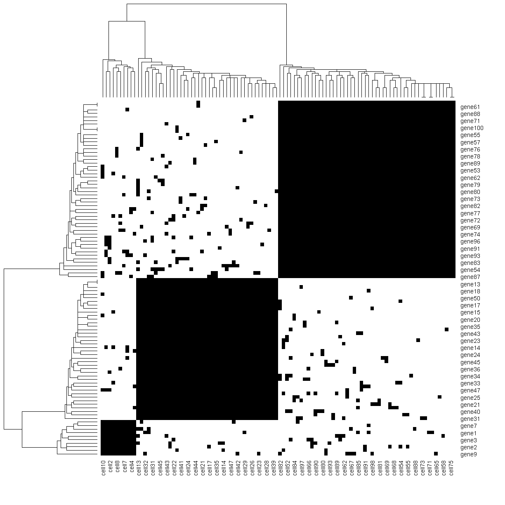
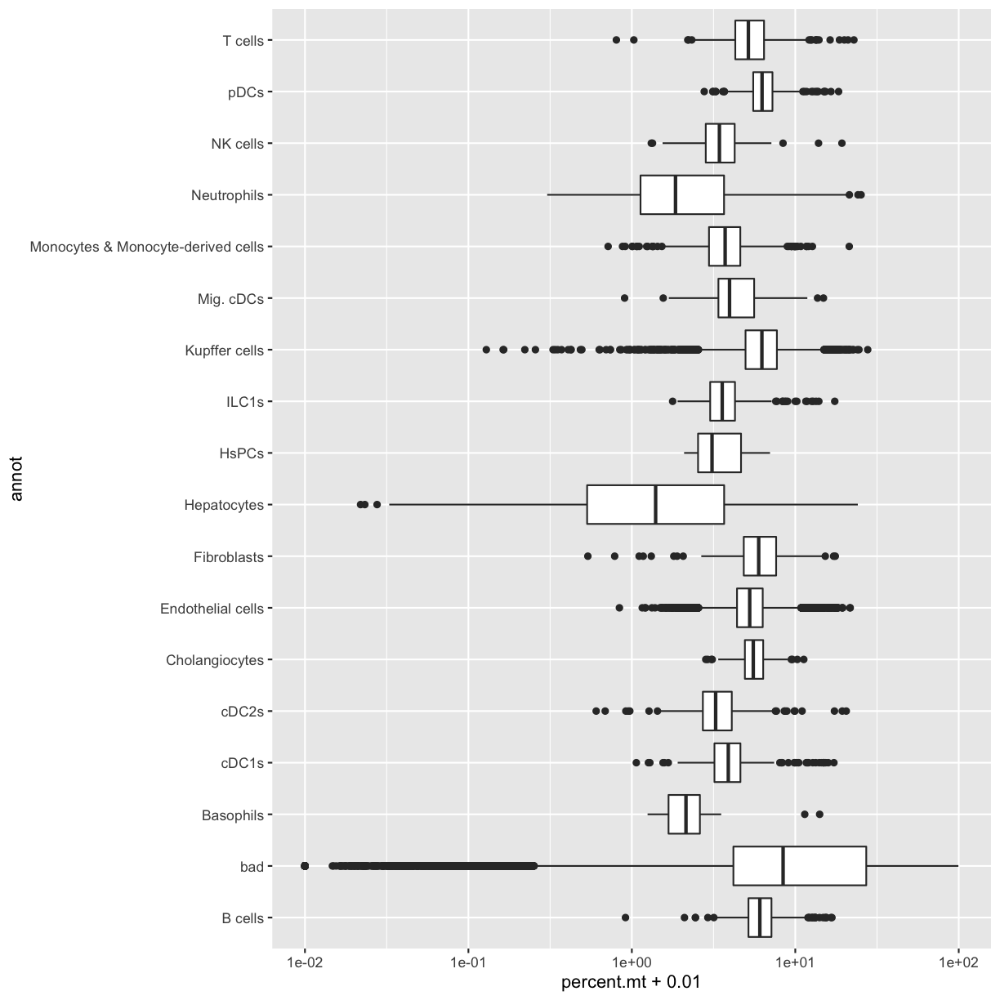

---
# Please do not edit this file directly; it is auto generated.
# Instead, please edit 04-Quality-Control.md in _episodes_rmd/
source: Rmd
title: "Quality Control"
teaching: 30
exercises: 10
questions:
- "How do I deterimine if my single cell RNA-seq experiment data is good?"
- "What are the common quality control metrics that I should check in my scRNA-seq data?"
objectives:
- "Critically examine scRNA-seq data to identify potential technical issues."
- "Apply filters to remove cells that may not provide high quality data."
- "Understand the implications of different filtering steps on the data."
keypoints:
- "?????"
- "?????"
---


~~~
library(tidyverse)
~~~
{: .language-r}


~~~
Warning: package 'tidyverse' was built under R version 4.1.3
~~~
{: .warning}


~~~
-- Attaching packages ------------------------------------------------------------------------------- tidyverse 1.3.2 --
v ggplot2 3.3.6      v purrr   0.3.4 
v tibble  3.1.8      v dplyr   1.0.10
v tidyr   1.2.1      v stringr 1.4.1 
v readr   2.1.3      v forcats 0.5.2 
~~~
{: .output}


~~~
Warning: package 'tibble' was built under R version 4.1.3
~~~
{: .warning}


~~~
Warning: package 'tidyr' was built under R version 4.1.3
~~~
{: .warning}


~~~
Warning: package 'readr' was built under R version 4.1.3
~~~
{: .warning}


~~~
Warning: package 'dplyr' was built under R version 4.1.3
~~~
{: .warning}


~~~
Warning: package 'stringr' was built under R version 4.1.3
~~~
{: .warning}


~~~
Warning: package 'forcats' was built under R version 4.1.3
~~~
{: .warning}


~~~
-- Conflicts ---------------------------------------------------------------------------------- tidyverse_conflicts() --
x dplyr::filter() masks stats::filter()
x dplyr::lag()    masks stats::lag()
~~~
{: .output}


~~~
library(Matrix)
~~~
{: .language-r}


~~~
Warning: package 'Matrix' was built under R version 4.1.3
~~~
{: .warning}


~~~

Attaching package: 'Matrix'

The following objects are masked from 'package:tidyr':

    expand, pack, unpack
~~~
{: .output}


~~~
library(Seurat)
~~~
{: .language-r}


~~~
Warning: package 'Seurat' was built under R version 4.1.3
~~~
{: .warning}


~~~
Attaching SeuratObject
Attaching sp
~~~
{: .output}


~~~
data_dir <- '../data'
~~~
{: .language-r}


## Read Data from Previous Lesson


~~~
load(file.path(data_dir, 'lesson03.Rdata'))
~~~
{: .language-r}

## Issues in scRNA-seq

There are many technical reasons why cells produced by an scRNA-seq protocol might not be of high quality. The goal of the quality control steps are to assure that only single, live cells are included in the final data set. Failure to do this may adversely impact cell type identification, clustering, and interpretation of the data. 

Some technical questions that you might ask include:

1. What happens to make mitochondrial expression higher?
1. Why do we check for ribosomal gene content?
1. What is UMI, what happens to make it bad, and why to we check UMI?
1. What happens to make gene counts low in a cell and how do we use gene counts per cell to fix it?

### Filtering Genes by Counts

As mentioned in an earlier lesson, the counts matrix is sparse and may contain rows (genes) or columns (cells) with low overall counts. In the case of genes, we may wish to exclude genes with zeros counts in most cells. Let's see how many genes have zeros counts across all cells. Note that the [Matrix package](https://cran.r-project.org/web/packages/Matrix/index.html) has a special implementation of [rowSums](https://rdrr.io/rforge/Matrix/man/colSums.html) which works with sparse matrices.


~~~
gene_counts <- Matrix::rowSums(counts, na.rm = TRUE)
sum(gene_counts == 0)
~~~
{: .language-r}


~~~
[1] 4618
~~~
{: .output}

Of the 31053 genes, 4618 have zero counts across all cells. These genes do not inform us about the mean, variance, or covariance of any of the other genes and we could remove them before proceeding with further analysis.


~~~
counts <- counts[gene_counts > 0,]
~~~
{: .language-r}

This leaves 26435 genes in the counts matrix.

We could also set some other threshold for filtering genes. Perhaps we should look at the number of genes that have different numbers of counts. We will use a histogram to look at the distribution of overall gene counts. Note that, since we just resized the counts matrix, we need to recalculate the gene_counts.

We will count the number of cells in which each gene was detected. Because `counts` is a sparse matrix, we have to be careful not to perform operations that would convert the entire matrix into a non-sparse matrix. This might happen if we wrote code like:

```{}
gene_counts <- rowSums(counts > 0)
```

The expression `counts > 0` would create a logical matrix that takes up much more memory than the sparse matrix. We might be tempted to try `rowSums(counts == 0)`, but this would also result in a non-sparse matrix because most of the values would be `TRUE`. However, if we evaluate `rowSums(counts != 0)`, then most of the values would be `FALSE`, which can be stored as 0 and so the matrix would still be sparse. The `Matrix` package has an implementation of 'rowSums()' that is efficient, but you may have to specify that you want to used the `Matrix` version of 'rowSums()' explicitly.


~~~
gene_counts <- Matrix::rowSums(counts > 0)

tibble(gene_id = names(gene_counts), counts = gene_counts) %>% 
  ggplot(aes(counts)) +
    geom_histogram(bins = 100) +
    labs(title = 'Number of Cells in which Gene was Detected',
         x     = 'Number of Genes',
         y     = 'Histogram of Number of Cells in which Gene was Detected')
~~~
{: .language-r}


~~~
hist(gene_counts, breaks = 1000, las = 1, xlab = 'Number of Cells in which Gene was Detected', 
     ylab = 'Number of Genes', main = 'Histogram of Number of Cells in which Gene was Detected')
~~~
{: .language-r}


As you can see, the number of cells in which each gene is detected spans several orders of magnitude and this makes it difficult to interpret the plot. Some genes are detected in all cells while others are detected in only one cell. Let's zoom in on the part with lower gene counts.


~~~
hist(gene_counts, breaks = -1:max(gene_counts), freq = TRUE, xlim = c(0, 100), las = 1, 
     xlab = 'Number of Cells in which Gene was Detected', 
     ylab = 'Number of Genes', main = 'Histogram of Number of Cells in which Gene was Detected')
text(2, 1180, labels = paste(sum(gene_counts == 1), 'genes were detected in only one cell'), adj = c(0, 0.5))
text(3,  800, labels = paste(sum(gene_counts == 2), 'genes were detected in two cells'),     adj = c(0, 0.5))
~~~
{: .language-r}


In the plot above, we can see that there are 1186 genes that were detected in only one cell, 783 genes detected in two cells, etc.

Selecting the number of cells in which a gene must be detected can be tricky. If you retain all genes, you may consume more computational resources and add noise to your analysis. If you discard too many genes, you may miss rare but important cells types.

Consider this example: You have a total of 10,000 cells in your scRNA-seq results. There is a rare cell population consisting of 100 cells that expresses 20 genes which are not expressed in any other cell type. If you only retain genes that are detected in more than 100 cells, you will miss this cell population.


> TDB: How many cells do I need to see a gene in for it to be informative? Discuss effects of a gene detected in 100 cells vs gene detected in 1000 cells. What are the effects of retaining too many genes?

> TBD: Can we use a plot like the one below to help explain the issues?


~~~
ngenes = 100
ncells = 100
tmp = matrix(rbinom(ngenes * ncells, 1, prob = 5e-2), ngenes, ncells,
             dimnames = list(paste0('gene', 1:ngenes), paste0('cell', 1:ncells)))
tmp[1:10, 1:10]   = 1
tmp[11:50, 11:50] = 1
tmp[51:100,51:100]  = 1
heatmap(tmp, breaks = c(-0.5, 0.5, 10), col = c('white', 'black'))
~~~
{: .language-r}




> ## Challenge 1
> What total count threshold would you choose to filter genes? You may want to remake the plot above to include more cells on the X-axis. Remember that there are 109232 cells.
>
> > ## Solution to Challenge 1
> >
> > **TBD: Need DAS. to provide rationale. **
> {: .solution}
{: .challenge}


> ## Challenge 2
> How would filtering genes too strictly affect your results? How would this affect your ability to discriminate between cell types? 
>
> > ## Solution to Challenge 1
> >
> > **TBD: Need DAS. to provide rationale. **
> {: .solution}
{: .challenge}

### Filtering Cells by Counts

Next we will look at the number of genes expressed in each cell. If the cell processing does not go well, the total number of reads in a cell may be low, which leads to lower gene counts. Filtering out these cells is a quality control step that should improve your final results.

We will explicitly use the `Matrix` package's implementation of 'colSums()'.


~~~
cell_counts = Matrix::colSums(counts > 0)
hist(cell_counts, breaks = 1000, las = 1, xlab = 'Number of Genes with Counts > 0', 
     ylab = 'Number of Cells')
~~~
{: .language-r}


> TBD: Can you have too many genes expressed? Are those doublets? 

### Creating the Seurat Object

In order to use Seurat, we must take the sample metadata and gene counts and create a [Seurat Object](https://rdrr.io/cran/SeuratObject/man/Seurat-class.html). This is a data structure which organizes the data and metadata and will store aspects of the analysis as we progress through the workshop.

Below, we will create a Seurat object for the liver data. We must first convert the cell metadata into a data.frame and place the bar codes in rownames. The we will pass the counts and metadata into the [CreateSeuratObject](https://search.r-project.org/CRAN/refmans/SeuratObject/html/CreateSeuratObject.html) function to create the Seurat object. 

In the section above, we examined the counts across genes and cells and proposed filtering by different threshold.  The CreateSeuratObject function contains two arguments, 'min.cells' and 'min.features', that allow us to filter the genes and cells by counts.

> TBD: DAS to provide rationale and values for cell and feature filtering. Also, do we want to do it here or follow the Seurat tutorial and do it after creating the object? It seems like a good idea to look at the plots before filtering. But maybe there is some basic filtering that makes sense.


~~~
metadata = as.data.frame(metadata) %>%
              column_to_rownames('cell')
liver = CreateSeuratObject(counts       = counts, 
                           project      = 'liver: sc & nuc RNAseq',
                           meta.data    = metadata,
                           min.cells    = 100,
                           min.features = 100)
~~~
{: .language-r}


## Typical filters for cell quality - %MT, ribosomal, number UMI, number genes 

> Briefly review filters and reasons for them.

### Filtering by Mitochondrial Gene Content

During apoptosis, the cell membrane may break and release transcripts into the surrounding media. However, the mitochondrial transcripts will remain inside of the mitochondria. This will lead to an apparent, but spurious, increase in mitochondrial gene expression. As a result, we use the percentage of mitochondrial-encoded reads to filter out cells that were not healthy during sample processing. 

> TBD: Mention that different cell types may have different levels of mitochondrial RNA content and how we handle this.


~~~
liver <- liver %>% 
              PercentageFeatureSet(pattern = "^mt-", col.name = "percent.mt")
~~~
{: .language-r}

> TBD: Seurat uses a 5% threshold for MT content.


~~~
VlnPlot(liver, features = c("nFeature_RNA", "nCount_RNA", "percent.mt"), ncol = 3)
~~~
{: .language-r}


> TBD: I made the plot below to see if there are mitochondrial expression differences by annotated cell type. The students won't have this file at this stage of the analysis. But how do we discuss these differences? Since we're looking for high values, it may not be too important.


~~~
liver[[c('annot', 'percent.mt')]] %>% 
    ggplot(aes(annot, percent.mt + 0.01)) +
      geom_boxplot() +
      scale_y_log10() +
      coord_flip()
~~~
{: .language-r}



> TBD: What threshold do we use? And provide rationale.


~~~
liver <- subset(liver, subset = percent.mt < 15)
~~~
{: .language-r}


### Filtering Cells by Ribosomal Transcript Content


### Filtering Cells by UMI

> Define what UMI is. (Do we need a glossary?)
> Where do we get these from? Are they in the cell bar code?


### Filtering Cells by Total Gene Counts

> TBD: Didn't we do this when we created the Seurat object?


> ## Challenge 2
> List three technical issues that can lead to poor scRNA-seq data quality and which filters we use to detect each one. 
>
> > ## Solution to Challenge 2
> >
> > 1 ). Cells may enter apoptosis during the disassociation protocol, which is indicated by high mitochondrial gene expression (why?).  
> > 2 ). Etc. etc. DAS to help fill in.
> {: .solution}
{: .challenge}

## Differences between tissues and datatypes (single cell vs single nucleus, etc) 

> TBD: DAS to fill in.

## Cell cycle assignment 

> TBD: DAS to fill in.

## Doublet detection 

> TBD: DAS to fill in.

## Batch correction

> TBD: We will correct between in vivo, ex vivo, & nuc seq. Students will correct between in vivo & ex vivo.
> The Seurat v2 paper (Butler et al, 2018) claims to have a batch normalization method that beats ComBat & limma. Do we use that?

### Save Data for Next Lesson

We will use the Seurat object in the next lesson. Save it now and we will load it at the beginning of the next lesson. We will use R's [saveRDS](https://stat.ethz.ch/R-manual/R-devel/library/base/html/readRDS.html) command to save the Seurat object in compressed, binary format. The `saveRDS` function is useful when you want to save one object in compressed, binary format.


~~~
saveRDS(liver, file = file.path(data_dir, 'lesson04.rds'))
~~~
{: .language-r}

> ## Challenge 3
> Delete the existing counts and metadata objects. Read in the  *citeSeq* data that you saved at the end of Lesson 03 (lesson03_challenge.Rdata) and create a Seurat object called 'liver_2'. Use the same cell and feature filters that were used to create the Seurat object above.
>
> > ## Solution to Challenge 3  
> > `# Remove the existing counts and metadata.`  
> > `rm(counts, metadata)`  
> > `# Read in citeseq counts & metadata.`  
> > `load(file = file.path(data_dir, 'lesson03_challenge.Rdata'))`  
> > `# Create Seurat object.`  
> > `metadata = as.data.frame(metadata) %>%`  
> > `             column_to_rownames('cell')`  
> > `liver_2 = CreateSeuratObject(count        = counts, `  
> > `                             project      = 'liver: citeSeq',`  
> > `                             meta.data    = metadata,`  
> > `                             min.cells    = 100,`  
> > `                             min.features = 100)`  
> {: .solution}
{: .challenge}

> ## Challenge 4
> Estimate the proportion of mitochondrial genes. Create plots of the proportion of features, cells, and mitochondrial genes. Filter the Seurat object by mitochon.
>
> > ## Solution to Challenge 4  
> > `liver_2 = liver_2 %>%`  
> > `            PercentageFeatureSet(pattern = "^mt-", col.name = "percent.mt")`  
> > `VlnPlot(liver_2, features = c("nFeature_RNA", "nCount_RNA", "percent.mt"), ncol = 3)`  
> > `liver_2 = subset(liver_2, subset = percent.mt < 10)`  
> {: .solution}
{: .challenge}

> ## Challenge 5
> TBD: Do more of the steps above.
>
> > ## Solution to Challenge 5   
> >      
> {: .solution}
{: .challenge}

### Session Info


~~~
sessionInfo()
~~~
{: .language-r}


~~~
R version 4.1.2 (2021-11-01)
Platform: x86_64-w64-mingw32/x64 (64-bit)
Running under: Windows 10 x64 (build 19042)

Matrix products: default

locale:
[1] LC_COLLATE=English_United States.1252 
[2] LC_CTYPE=English_United States.1252   
[3] LC_MONETARY=English_United States.1252
[4] LC_NUMERIC=C                          
[5] LC_TIME=English_United States.1252    

attached base packages:
[1] stats     graphics  grDevices utils     datasets  methods   base     

other attached packages:
 [1] sp_1.5-0           SeuratObject_4.1.2 Seurat_4.2.0       Matrix_1.5-1      
 [5] forcats_0.5.2      stringr_1.4.1      dplyr_1.0.10       purrr_0.3.4       
 [9] readr_2.1.3        tidyr_1.2.1        tibble_3.1.8       ggplot2_3.3.6     
[13] tidyverse_1.3.2    knitr_1.40        

loaded via a namespace (and not attached):
  [1] googledrive_2.0.0     Rtsne_0.16            colorspace_2.0-3     
  [4] deldir_1.0-6          ellipsis_0.3.2        ggridges_0.5.4       
  [7] fs_1.5.2              spatstat.data_2.2-0   farver_2.1.1         
 [10] leiden_0.4.3          listenv_0.8.0         ggrepel_0.9.1        
 [13] fansi_1.0.3           lubridate_1.8.0       xml2_1.3.3           
 [16] codetools_0.2-18      splines_4.1.2         polyclip_1.10-0      
 [19] jsonlite_1.8.2        broom_1.0.1           ica_1.0-3            
 [22] cluster_2.1.4         dbplyr_2.2.1          png_0.1-7            
 [25] rgeos_0.5-9           uwot_0.1.14           spatstat.sparse_2.1-1
 [28] sctransform_0.3.5     shiny_1.7.2           compiler_4.1.2       
 [31] httr_1.4.4            backports_1.4.1       lazyeval_0.2.2       
 [34] assertthat_0.2.1      fastmap_1.1.0         gargle_1.2.1         
 [37] cli_3.3.0             later_1.3.0           htmltools_0.5.3      
 [40] tools_4.1.2           igraph_1.3.5          gtable_0.3.1         
 [43] glue_1.6.2            reshape2_1.4.4        RANN_2.6.1           
 [46] Rcpp_1.0.9            scattermore_0.8       cellranger_1.1.0     
 [49] vctrs_0.4.2           nlme_3.1-159          progressr_0.11.0     
 [52] lmtest_0.9-40         spatstat.random_2.2-0 xfun_0.33            
 [55] globals_0.16.1        rvest_1.0.3           mime_0.12            
 [58] miniUI_0.1.1.1        lifecycle_1.0.3       irlba_2.3.5.1        
 [61] goftest_1.2-3         googlesheets4_1.0.1   future_1.28.0        
 [64] MASS_7.3-58.1         zoo_1.8-11            scales_1.2.1         
 [67] spatstat.core_2.4-4   spatstat.utils_2.3-1  hms_1.1.2            
 [70] promises_1.2.0.1      parallel_4.1.2        RColorBrewer_1.1-3   
 [73] gridExtra_2.3         reticulate_1.26       pbapply_1.5-0        
 [76] rpart_4.1.16          stringi_1.7.8         highr_0.9            
 [79] rlang_1.0.6           pkgconfig_2.0.3       matrixStats_0.62.0   
 [82] evaluate_0.17         lattice_0.20-45       tensor_1.5           
 [85] ROCR_1.0-11           labeling_0.4.2        htmlwidgets_1.5.4    
 [88] patchwork_1.1.2       cowplot_1.1.1         tidyselect_1.2.0     
 [91] parallelly_1.32.1     RcppAnnoy_0.0.19      plyr_1.8.7           
 [94] magrittr_2.0.3        R6_2.5.1              generics_0.1.3       
 [97] DBI_1.1.3             mgcv_1.8-40           pillar_1.8.1         
[100] haven_2.5.1           withr_2.5.0           fitdistrplus_1.1-8   
[103] abind_1.4-5           survival_3.4-0        future.apply_1.9.1   
[106] modelr_0.1.9          crayon_1.5.2          KernSmooth_2.23-20   
[109] utf8_1.2.2            spatstat.geom_2.4-0   plotly_4.10.0        
[112] tzdb_0.3.0            grid_4.1.2            readxl_1.4.1         
[115] data.table_1.14.2     reprex_2.0.2          digest_0.6.29        
[118] xtable_1.8-4          httpuv_1.6.6          munsell_0.5.0        
[121] viridisLite_0.4.1    
~~~
{: .output}
