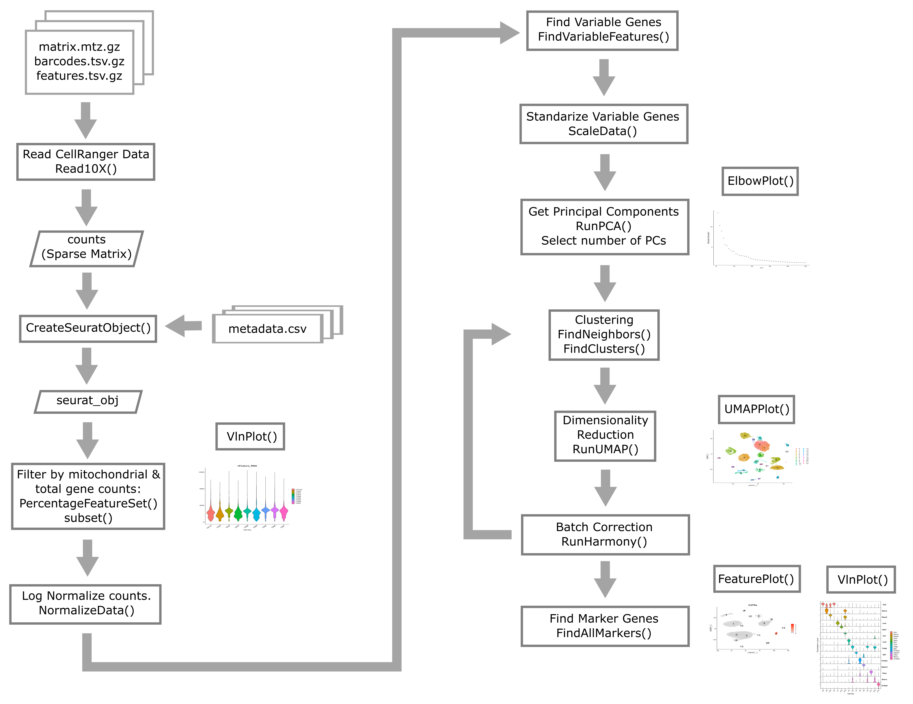
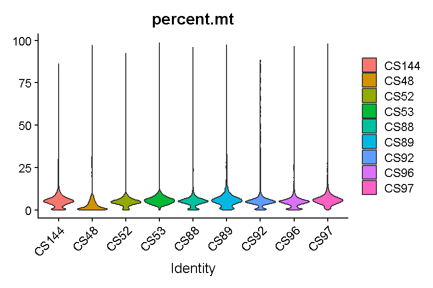

    suppressPackageStartupMessages(library(tidyverse))
    suppressPackageStartupMessages(library(Matrix))
    suppressPackageStartupMessages(library(SingleCellExperiment))
    suppressPackageStartupMessages(library(scds))
    suppressPackageStartupMessages(library(Seurat))

{: .language-r}

## Quality control in scRNA-seq

There are many technical reasons why cells produced by an scRNA-seq
protocol might not be of high quality. The goal of the quality control
steps are to assure that only single, live cells are included in the
final data set. Ultimately some multiplets and poor quality cells will
likely escape your detection and make it into your final dataset;
however, these quality control steps aim to reduce the chance of this
happening. Failure to undertake quality control is likely to adversely
impact cell type identification, clustering, and interpretation of the
data.

Some technical questions that you might ask include:

1.  Why is mitochondrial gene expression high in some cells?
2.  What is a unique molecular identifier (UMI), and why do we check
    numbers of UMI?
3.  What happens to make gene counts low in a cell?

## Doublet detection

We will begin by discussing doublets. We have already discussed the
concept of the doublet. Now we will try running one computational
doublet-detection approach and track predictions of doublets.

We will use the scds method. scds contains two methods for predicting
doublets. Method cxds is based on co-expression of gene pairs, while
method bcds uses the full count information and a binary classification
approach using in silico doublets. Method cxds\_bcds\_hybrid combines
both approaches. We will use the combined approach. See [Bais and Kostka
2020](https://academic.oup.com/bioinformatics/article/36/4/1150/5566507)
for more details.

Because this doublet prediction method takes some time and is a bit
memory-intensive, we will run it only on cells from one mouse. We will
return to the doublet predictions later in this lesson.

    cell_ids <- filter(metadata, sample == 'CS52') %>% pull(cell)
    sce      <- SingleCellExperiment(list(counts = counts[, cell_ids]))
    sce      <- cxds_bcds_hybrid(sce)
    doublet_preds <- colData(sce)

{: .language-r}

                used   (Mb) gc trigger   (Mb) limit (Mb)   max used   (Mb)
    Ncells   8641273  461.5   12568895  671.3         NA   12568895  671.3
    Vcells 182791127 1394.6  746650068 5696.5      16384 1137399190 8677.7

{: .output}

## High-level overview of quality control and filtering

First we will walk through some of the typical quantities one examines
when conducting quality control of scRNA-Seq data.

### Filtering Genes by Counts

As mentioned in an earlier lesson, the counts matrix is sparse and may
contain rows (genes) or columns (cells) with low overall counts. In the
case of genes, we likely wish to exclude genes with zeros counts in most
cells. Let’s see how many genes have zeros counts across all cells. Note
that the [Matrix
package](https://cran.r-project.org/web/packages/Matrix/index.html) has
a special implementation of
[rowSums](https://rdrr.io/rforge/Matrix/man/colSums.html) which works
with sparse matrices.

    gene_counts <- Matrix::rowSums(counts)
    sum(gene_counts == 0)

{: .language-r}

    [1] 7322

{: .output}

Of the 31053 genes, 7322 have zero counts across all cells. These genes
do not inform us about the mean, variance, or covariance of any of the
other genes and we will remove them before proceeding with further
analysis.

    counts <- counts[gene_counts > 0,]

{: .language-r}

This leaves 23731 genes in the counts matrix.

We could also set some other threshold for filtering genes. Perhaps we
should look at the number of genes that have different numbers of
counts. We will use a histogram to look at the distribution of overall
gene counts. Note that, since we just resized the counts matrix, we need
to recalculate `gene_counts`.

We will count the number of cells in which each gene was detected.
Because `counts` is a sparse matrix, we have to be careful not to
perform operations that would convert the entire matrix into a
non-sparse matrix. This might happen if we wrote code like:

    gene_counts <- rowSums(counts > 0)

The expression `counts > 0` would create a logical matrix that takes up
much more memory than the sparse matrix. We might be tempted to try
`rowSums(counts == 0)`, but this would also result in a non-sparse
matrix because most of the values would be `TRUE`. However, if we
evaluate `rowSums(counts != 0)`, then most of the values would be
`FALSE`, which can be stored as 0 and so the matrix would still be
sparse. The `Matrix` package has an implementation of ‘rowSums()’ that
is efficient, but you may have to specify that you want to used the
`Matrix` version of ‘rowSums()’ explicitly.

The number of cells in which each gene is detected spans several orders
of magnitude and this makes it difficult to interpret the plot. Some
genes are detected in all cells while others are detected in only one
cell. Let’s zoom in on the part with lower gene counts.

    gene_counts <- tibble(counts  = Matrix::rowSums(counts > 0))

    gene_counts %>% 
      dplyr::count(counts) %>%
      ggplot(aes(counts, n)) +
        geom_col() +
        labs(title = 'Histogram of Number of Cells in which Gene was Detected',
             x     = 'Number of Genes',
             y     = 'Number of Cells in which Gene was Detected') +
        lims(x = c(0, 50)) +
        theme_bw(base_size = 14) +
        annotate('text', x = 2, y = 1596, hjust = 0,
                 label = str_c(sum(gene_counts == 1), ' genes were detected in only one cell')) +
        annotate('text', x = 3, y = 924, hjust = 0,
                 label = str_c(sum(gene_counts == 2), ' genes were detected in two cells'))

{: .language-r}

    Warning: Removed 9335 rows containing missing values or values outside the scale range
    (`geom_col()`).

{: .warning}

In the plot above, we can see that there are 1596 genes that were
detected in only one cell, 924 genes detected in two cells, etc.

Making a decision to keep or remove a gene based on its expression being
detected in a certain number of cells can be tricky. If you retain all
genes, you may consume more computational resources and add noise to
your analysis. If you discard too many genes, you may miss rare but
important cell types.

Consider this example: You have a total of 10,000 cells in your
scRNA-seq results. There is a rare cell population consisting of 100
cells that expresses 20 genes which are not expressed in any other cell
type. If you only retain genes that are detected in more than 100 cells,
you will miss this cell population.

> ## Challenge 1
>
> How would filtering genes too strictly affect your results? How would
> this affect your ability to discriminate between cell types?
>
> > ## Solution to Challenge 1
> >
> > Filtering too strictly would make it more difficult to distinguish
> > between cell types. The degree to which this problem affects your
> > analyses depends on the degree of strictness of your filtering.
> > Let’s take the situation to its logical extreme – what if we keep
> > only genes expressed in at least 95% of cells. If we did this, we
> > would end up with only 41 genes! By definition these genes will be
> > highly expressed in all cell types, therefore eliminating our
> > ability to clearly distinguish between cell types. {: .solution} {:
> > .challenge}

> ## Challenge 2
>
> What total count threshold would you choose to filter genes? Remember
> that there are 47,743 cells.
>
> > ## Solution to Challenge 2
> >
> > This is a question that has a somewhat imprecise answer. Following
> > from challenge one, we do not want to be *too* strict in our
> > filtering. However, we do want to remove genes that will not provide
> > much information about gene expression variability among the cells
> > in our dataset. Our recommendation would be to filter genes
> > expressed in &lt; 5 cells, but one could reasonably justify a
> > threshold between, say, 3 and 20 cells. {: .solution} {: .challenge}

### Filtering Cells by Counts

Next we will look at the number of genes expressed in each cell. If a
cell lyses and leaks RNA,the total number of reads in a cell may be low,
which leads to lower gene counts. Furthermore, each single cell
suspension likely contains some amount of so-called “ambient” RNA from
damaged/dead/dying cells. This ambient RNA comes along for the ride in
every droplet. Therefore even droplets that do not contain cells (empty
droplets) can have some reads mapping to transcripts that look like gene
expression. Filtering out these kinds of cells is a quality control step
that should improve your final results.

We will explicitly use the `Matrix` package’s implementation of
‘colSums()’.

    tibble(counts  = Matrix::colSums(counts > 0)) %>%
      ggplot(aes(counts)) +
        geom_histogram(bins = 500) +
        labs(title = 'Histogram of Number of Genes per Cell',
             x     = 'Number of Genes with Counts > 0',
             y     = 'Number of Cells')

{: .language-r}

Cells with way more genes expressed than the typical cell might be
doublets/multiplets and should also be removed.

### Creating the Seurat Object

In order to use Seurat, we must take the sample metadata and gene counts
and create a [Seurat
Object](https://rdrr.io/cran/SeuratObject/man/Seurat-class.html). This
is a data structure which organizes the data and metadata and will store
aspects of the analysis as we progress through the workshop.

Below, we will create a Seurat object for the liver data. We must first
convert the cell metadata into a data.frame and place the barcodes in
rownames. The we will pass the counts and metadata into the
[CreateSeuratObject](https://search.r-project.org/CRAN/refmans/SeuratObject/html/CreateSeuratObject.html)
function to create the Seurat object.

In the section above, we examined the counts across genes and cells and
proposed filtering using thresholds. The CreateSeuratObject function
contains two arguments, ‘min.cells’ and ‘min.features’, that allow us to
filter the genes and cells by counts. Although we might use these
arguments for convenience in a typical analysis, for this course we will
look more closely at these quantities on a per-library basis to decide
on our filtering thresholds. We will us the ‘min.cells’ argument to
filter out genes that occur in less than 5 cells.

    # set a seed for reproducibility in case any randomness used below
    set.seed(1418)

{: .language-r}

    metadata <- as.data.frame(metadata) %>%
                  column_to_rownames('cell')
    liver <- CreateSeuratObject(counts    = counts, 
                                project   = 'liver: scRNA-Seq',
                                meta.data = metadata,
                                min.cells = 5)

{: .language-r}

We now have a Seurat object with 20,120 genes and 47,743 cells.

We will remove the counts object to save some memory because it is now
stored inside of the Seurat object.

    rm(counts)
    gc()

{: .language-r}

                used   (Mb) gc trigger   (Mb) limit (Mb)   max used   (Mb)
    Ncells   8663357  462.7   12568895  671.3         NA   12568895  671.3
    Vcells 183145832 1397.3  716848065 5469.2      16384 1137399190 8677.7

{: .output}

Add on doublet predictions that we did earlier in this lesson.

    liver <- AddMetaData(liver, as.data.frame(doublet_preds))

{: .language-r}

Let’s briefly look at the structure of the Seurat object. The counts are
stored as an [assay](https://github.com/satijalab/seurat/wiki/Assay),
which we can query using the `Assays()` function.

    Seurat::Assays(liver)

{: .language-r}

    [1] "RNA"

{: .output}

The output of this function tells us that we have data in an “RNA assay.
We can access this using the
[GetAssayData](https://mojaveazure.github.io/seurat-object/reference/AssayData.html)
function.

    tmp <- GetAssayData(object = liver, layer = 'counts')
    tmp[1:5,1:5]

{: .language-r}

    5 x 5 sparse Matrix of class "dgCMatrix"
           AAACGAATCCACTTCG-2 AAAGGTACAGGAAGTC-2 AACTTCTGTCATGGCC-2 AATGGCTCAACGGTAG-2
    Xkr4                    .                  .                  .                  .
    Rp1                     .                  .                  .                  .
    Sox17                   .                  .                  2                  4
    Mrpl15                  .                  .                  .                  1
    Lypla1                  .                  .                  2                  1
           ACACTGAAGTGCAGGT-2
    Xkr4                    .
    Rp1                     .
    Sox17                   .
    Mrpl15                  1
    Lypla1                  .

{: .output}

As you can see the data that we retrieved is a sparse matrix, just like
the counts that we provided to the Seurat object.

What about the metadata? We can access the metadata as follows:

    head(liver)

{: .language-r}

                             orig.ident nCount_RNA nFeature_RNA sample digest
    AAACGAATCCACTTCG-2 liver: scRNA-Seq       8476         3264   CS48 inVivo
    AAAGGTACAGGAAGTC-2 liver: scRNA-Seq       8150         3185   CS48 inVivo
    AACTTCTGTCATGGCC-2 liver: scRNA-Seq       8139         3280   CS48 inVivo
    AATGGCTCAACGGTAG-2 liver: scRNA-Seq      10083         3716   CS48 inVivo
    ACACTGAAGTGCAGGT-2 liver: scRNA-Seq       9517         3543   CS48 inVivo
    ACCACAACAGTCTCTC-2 liver: scRNA-Seq       7189         3064   CS48 inVivo
    ACGATGTAGTGGTTCT-2 liver: scRNA-Seq       7437         3088   CS48 inVivo
    ACGCACGCACTAACCA-2 liver: scRNA-Seq       8162         3277   CS48 inVivo
    ACTGCAATCAACTCTT-2 liver: scRNA-Seq       7278         3144   CS48 inVivo
    ACTGCAATCGTCACCT-2 liver: scRNA-Seq       9584         3511   CS48 inVivo
                       typeSample cxds_score bcds_score hybrid_score
    AAACGAATCCACTTCG-2   scRnaSeq         NA         NA           NA
    AAAGGTACAGGAAGTC-2   scRnaSeq         NA         NA           NA
    AACTTCTGTCATGGCC-2   scRnaSeq         NA         NA           NA
    AATGGCTCAACGGTAG-2   scRnaSeq         NA         NA           NA
    ACACTGAAGTGCAGGT-2   scRnaSeq         NA         NA           NA
    ACCACAACAGTCTCTC-2   scRnaSeq         NA         NA           NA
    ACGATGTAGTGGTTCT-2   scRnaSeq         NA         NA           NA
    ACGCACGCACTAACCA-2   scRnaSeq         NA         NA           NA
    ACTGCAATCAACTCTT-2   scRnaSeq         NA         NA           NA
    ACTGCAATCGTCACCT-2   scRnaSeq         NA         NA           NA

{: .output}

Notice that there are some columns that were not in our original
metadata file; specifically the ‘nCount\_RNA’ and ‘nFeature\_RNA’
columns.

-   *nCount\_RNA* is the total counts for each cell.
-   *nFeature\_RNA* is the number of genes with counts &gt; 0 in each
    cell.

These were calculated by Seurat when the Seurat object was created. We
will use these later in the lesson.

## Typical filters for cell quality

Here we briefly review these filters and decide what thresholds we will
use for these data.

### Filtering by Mitochondrial Gene Content

During apoptosis, the cell membrane may break and release transcripts
into the surrounding media. However, the mitochondrial transcripts may
remain inside of the mitochondria. This will lead to an apparent, but
spurious, increase in mitochondrial gene expression. As a result, we use
the percentage of mitochondrial-encoded reads to filter out cells that
were not healthy during sample processing. See [this
link](https://kb.10xgenomics.com/hc/en-us/articles/360001086611) from
10X Genomics for additional information.

First we compute the percentage mitochondrial gene expression in each
cell.

    liver <- liver %>% 
                  PercentageFeatureSet(pattern = "^mt-", col.name = "percent.mt")

{: .language-r}

Different cell types may have different levels of mitochondrial RNA
content. Therefore we must use our knowledge of the particular
biological system that we are profiling in order to choose an
appropriate threshold. If we are profiling single nuclei instead of
single cells we might consider a very low threshold for MT content. If
we are profiling a tissue where we anticipate broad variability in
levels of mitochondrial RNA content between cell types, we might use a
very lenient threshold to start and then return to filter out additional
cells after we obtain tentative cell type labels that we have obtained
by carrying out normalization and clustering. In this course we will
filter only once

    VlnPlot(liver, features = "percent.mt", group.by = 'sample')

{: .language-r}

    Warning: Default search for "data" layer in "RNA" assay yielded no results;
    utilizing "counts" layer instead.

{: .warning}

It is hard to see with so many dots! Let’s try another version where we
just plot the violins:

    VlnPlot(liver, features = "percent.mt", group.by = 'sample', pt.size = 0)

{: .language-r}

    Warning: Default search for "data" layer in "RNA" assay yielded no results;
    utilizing "counts" layer instead.

{: .warning}

Library “CS89” (and maybe CS144) have a “long tail” of cells with high
mitochondrial gene expression. We may wish to monitor these libraries
throughout QC and decide whether it has problems worth ditching the
sample.

In most cases it would be ideal to determine separate filtering
thresholds on each scRNA-Seq sample. This would account for the fact
that the characteristics of each sample might vary (for many possible
reasons) even if the same tissue is profiled. However, in this course we
will see if we can find a single threshold that works decently well
across all samples. As you can see, the samples we are examining do not
look drastically different so this may not be such an unrealistic
simplification.

We will use a threshold of 14% mitochondrial gene expression which will
remove the “long tail” of cells with high `percent.mt` values. We could
also perhaps justify going as low as 10% to be more conservative, but we
likely would not want to go down to 5%, which would remove around half
the cells.

    # Don't run yet, we will filter based on several criteria below
    #liver <- subset(liver, subset = percent.mt < 14)

{: .language-r}

### Filtering Cells by Total Gene Counts

Let’s look at how many genes are expressed in each cell. Again we’ll
split by the mouse ID so we can see if there are particular samples that
are very different from the rest. Again we will show only the violins
for clarity.

    VlnPlot(liver, 'nFeature_RNA', group.by = 'sample', pt.size = 0)

{: .language-r}

    Warning: Default search for "data" layer in "RNA" assay yielded no results;
    utilizing "counts" layer instead.

{: .warning}

Like with the mitochondrial expression percentage, we will strive to
find a threshold that works reasonably well across all samples. For the
number of genes expressed we will want to filter out both cells that
express to *few* genes and cells that express too *many* genes. As noted
above, damaged or dying cells may leak RNA, resulting in a low number of
genes expressed, and we want to filter out these cells to ignore their
“damaged” transcriptomes. On the other hand, cells with way more genes
expressed than the typical cell might be doublets/multiplets and should
also be removed.

It looks like filtering out cells that express less than 400 or greater
than 5,000 genes is a reasonable compromise across our samples. (Note
the log scale in this plot, which is necessary for seeing the violin
densities at low numbers of genes expressed).

    VlnPlot(liver, 'nFeature_RNA', group.by = 'sample', pt.size = 0) +
      scale_y_log10() + 
      geom_hline(yintercept = 600) + 
      geom_hline(yintercept = 5000)

{: .language-r}

    Warning: Default search for "data" layer in "RNA" assay yielded no results;
    utilizing "counts" layer instead.

{: .warning}

    Scale for y is already present.
    Adding another scale for y, which will replace the existing scale.

{: .output}

    #liver <- subset(liver, nFeature_RNA > 600 & nFeature_RNA < 5000)

{: .language-r}

### Filtering Cells by UMI

A UMI – unique molecular identifier – is like a molecular barcode for
each RNA molecule in the cell. UMIs are short, distinct oligonucleotides
attached during the initial preparation of cDNA from RNA. Therefore each
UMI is unique to a single RNA molecule.

Why are UMI useful? The amount of RNA in a single cell is quite low
(approximately 10-30pg according to [this
link](https://bionumbers.hms.harvard.edu/bionumber.aspx?id=111205&ver=2&trm=amount+of+rna+per+cell&org=)).
Thus single cell transcriptomics profiling usually includes a PCR
amplification step. PCR amplification is fairly “noisy” because small
stochastic sampling differences can propagate through exponential
amplification. Using UMIs, we can throw out all copies of the molecule
except one (the copies we throw out are called “PCR duplicates”).

<figure>

<figcaption aria-hidden="true">UMI</figcaption>
</figure>

[Image
credit](https://www.lexogen.com/rna-lexicon-what-are-unique-molecular-identifiers-umis-and-why-do-we-need-them/)

Several papers (e.g. [Islam et al](https://doi.org/10.1038/nmeth.2772))
have demonstrated that UMIs reduce amplification noise in single cell
transcriptomics and thereby increase data fidelity. The only downside of
UMIs is that they cause us to throw away a lot of our data (perhaps as
high as 90% of our sequenced reads). Nevertheless, we don’t want those
reads if they are not giving us new information about gene expression,
so we tolerate this inefficiency.

CellRanger will automatically process your UMIs and the feature-barcode
matrix it produces will be free from PCR duplicates. Thus, we can think
of the number of UMIs as the sequencing depth of each cell.

Typically the number of genes and number of UMI are highly correlated
and this is mostly the case in our liver dataset:

    ggplot(liver@meta.data, aes(x = nCount_RNA, y = nFeature_RNA)) +
      geom_point() +
      theme_bw(base_size = 16) +
      xlab("nUMI") + ylab("nGenes") +
      scale_x_log10() + scale_y_log10()

{: .language-r}

    VlnPlot(liver, 'nCount_RNA', group.by = 'sample', pt.size = 0) +
      scale_y_log10() + 
      geom_hline(yintercept = 900) + 
      geom_hline(yintercept = 25000)

{: .language-r}

    Warning: Default search for "data" layer in "RNA" assay yielded no results;
    utilizing "counts" layer instead.

{: .warning}

    Scale for y is already present.
    Adding another scale for y, which will replace the existing scale.

{: .output}

    # Don't run yet, we will filter based on several criteria below
    #liver <- subset(liver, nCount_RNA > 900 & nCount_RNA < 25000)

{: .language-r}

Again we try to select thresholds that remove most of the strongest
outliers in all samples.

> ## Challenge 2
>
> List two technical issues that can lead to poor scRNA-seq data quality
> and which filters we use to detect each one.
>
> > ## Solution to Challenge 2
> >
> > 1 ). Cell membranes may rupture during the disassociation protocol,
> > which is indicated by high mitochondrial gene expression because the
> > mitochondrial transcripts are contained within the mitochondria,
> > while other transcripts in the cytoplasm may leak out. Use the
> > mitochondrial percentage filter to try to remove these cells.  
> > 2 ). Cells may be doublets of two different cell types. In this case
> > they might express many more genes than either cell type alone. Use
> > the “number of genes expressed” filter to try to remove these
> > cells.  
> > {: .solution} {: .challenge}

## Doublet detection revisited

Let’s go back to our doublet predictions. How many of the cells that are
going to be filtered out of our data were predicted to be doublets by
scds?

    liver$keep <- liver$percent.mt   < 14 & 
                  liver$nFeature_RNA > 600 &
                  liver$nFeature_RNA < 5000 & 
                  liver$nCount_RNA   > 900 & 
                  liver$nCount_RNA   < 25000

{: .language-r}

Using the scds hybrid\_score method, the scores range between 0 and 2.
Higher scores should be more likely to be doublets.

    ggplot(mutate(liver[[]], class = ifelse(keep, 'QC singlet', 'QC doublet')),
      aes(x = class, y = hybrid_score)) + 
      geom_violin() + 
      theme_bw(base_size = 18) +
      xlab("") + 
      ylab("SCDS hybrid score")

{: .language-r}

    Warning: Removed 42388 rows containing non-finite outside the scale range
    (`stat_ydensity()`).

{: .warning}

Somewhat unsatisfyingly, the scds hybrid scores aren’t wildly different
between the cells we’ve used QC thresholds to call as doublets vs
singlets. There does seem to be an enrichment of cells with score
&gt;0.75 among the QC doublets. If we had run scds doublet prediction on
all cells we might compare results with *no* scds score filtering to
those with an scds score cutoff of, say, 1.0. One characteristic of the
presence of doublet cells is a cell cluster located between two large
and well-defined clusters that expresses markers of both of them (don’t
worry, we will learn how to cluster and visualize data soon). Returning
to the scds doublet scores, we could cluster our cells with and without
doublet score filtering, and see if we note any putative doublet
clusters.

## Subset based on %MT, number of genes, and number of UMI thresholds

    liver <- subset(liver, subset = percent.mt   < 14 & 
                                    nFeature_RNA > 600 &
                                    nFeature_RNA < 5000 & 
                                    nCount_RNA   > 900 & 
                                    nCount_RNA   < 25000)

{: .language-r}

## Batch correction

We might want to correct for batch effects. This can be difficult to do
because batch effects are complicated (in general), and may affect
different cell types in different ways. Although correcting for batch
effects is an important aspect of quality control, we will discuss this
procedure in lesson 06 with some biological context.

> ## Challenge 3
>
> Delete the existing counts and metadata objects. Read in the *ex-vivo*
> data that you saved at the end of Lesson 03
> (lesson03\_challenge.Rdata) and create a Seurat object called
> ‘liver\_2’. Look at the filtering quantities and decide whether you
> can use the same cell and feature filters that were used to create the
> Seurat object above.
>
> > ## Solution to Challenge 3
> >
> > `# Remove the existing counts and metadata.`  
> > `rm(counts, metadata)`  
> > `# Read in citeseq counts & metadata.`  
> > `load(file = file.path(data_dir, 'lesson03_challenge.Rdata'))`  
> > `# Create Seurat object.`  
> > `metadata = as.data.frame(metadata) %>%`  
> > `column_to_rownames('cell')`  
> > `liver_2 = CreateSeuratObject(count        = counts,`  
> > `project      = 'liver: ex-vivo',`  
> > `meta.data    = metadata)`  
> > \`\` {: .solution} {: .challenge}

> ## Challenge 4
>
> Estimate the proportion of mitochondrial genes. Create plots of the
> proportion of features, cells, and mitochondrial genes. Filter the
> Seurat object by mitochondrial gene expression.
>
> > ## Solution to Challenge 4
> >
> > `liver_2 = liver_2 %>%`
> > `PercentageFeatureSet(pattern = "^mt-", col.name = "percent.mt")`  
> > `VlnPlot(liver_2, features = c("nFeature_RNA", "nCount_RNA", "percent.mt"), ncol = 3)`  
> > `liver_2 = subset(liver_2, subset = percent.mt < 10)`  
> > {: .solution} {: .challenge}

## Session Info

    sessionInfo()

{: .language-r}

    R version 4.4.1 (2024-06-14)
    Platform: x86_64-apple-darwin20
    Running under: macOS 15.0.1

    Matrix products: default
    BLAS:   /System/Library/Frameworks/Accelerate.framework/Versions/A/Frameworks/vecLib.framework/Versions/A/libBLAS.dylib 
    LAPACK: /Library/Frameworks/R.framework/Versions/4.4-x86_64/Resources/lib/libRlapack.dylib;  LAPACK version 3.12.0

    locale:
    [1] en_US.UTF-8/en_US.UTF-8/en_US.UTF-8/C/en_US.UTF-8/en_US.UTF-8

    time zone: America/New_York
    tzcode source: internal

    attached base packages:
    [1] stats4    stats     graphics  grDevices utils     datasets  methods   base     

    other attached packages:
     [1] scds_1.20.0                 SingleCellExperiment_1.26.0
     [3] SummarizedExperiment_1.34.0 Biobase_2.64.0             
     [5] GenomicRanges_1.56.2        GenomeInfoDb_1.40.1        
     [7] IRanges_2.38.1              S4Vectors_0.42.1           
     [9] BiocGenerics_0.50.0         MatrixGenerics_1.16.0      
    [11] matrixStats_1.4.1           Matrix_1.7-0               
    [13] Seurat_5.1.0                SeuratObject_5.0.2         
    [15] sp_2.1-4                    lubridate_1.9.3            
    [17] forcats_1.0.0               stringr_1.5.1              
    [19] dplyr_1.1.4                 purrr_1.0.2                
    [21] readr_2.1.5                 tidyr_1.3.1                
    [23] tibble_3.2.1                ggplot2_3.5.1              
    [25] tidyverse_2.0.0             knitr_1.48                 
    [27] rmarkdown_2.28             

    loaded via a namespace (and not attached):
      [1] RcppAnnoy_0.0.22        splines_4.4.1           later_1.3.2            
      [4] R.oo_1.26.0             polyclip_1.10-7         pROC_1.18.5            
      [7] fastDummies_1.7.4       lifecycle_1.0.4         globals_0.16.3         
     [10] lattice_0.22-6          vroom_1.6.5             MASS_7.3-60.2          
     [13] magrittr_2.0.3          plotly_4.10.4           yaml_2.3.10            
     [16] httpuv_1.6.15           sctransform_0.4.1       spam_2.11-0            
     [19] spatstat.sparse_3.1-0   reticulate_1.39.0       cowplot_1.1.3          
     [22] pbapply_1.7-2           RColorBrewer_1.1-3      abind_1.4-8            
     [25] zlibbioc_1.50.0         Rtsne_0.17              R.utils_2.12.3         
     [28] GenomeInfoDbData_1.2.12 ggrepel_0.9.6           irlba_2.3.5.1          
     [31] listenv_0.9.1           spatstat.utils_3.1-0    goftest_1.2-3          
     [34] RSpectra_0.16-2         spatstat.random_3.3-2   fitdistrplus_1.2-1     
     [37] parallelly_1.38.0       leiden_0.4.3.1          codetools_0.2-20       
     [40] DelayedArray_0.30.1     tidyselect_1.2.1        UCSC.utils_1.0.0       
     [43] farver_2.1.2            spatstat.explore_3.3-2  jsonlite_1.8.9         
     [46] progressr_0.14.0        ggridges_0.5.6          survival_3.6-4         
     [49] tools_4.4.1             ica_1.0-3               Rcpp_1.0.13            
     [52] glue_1.8.0              gridExtra_2.3           SparseArray_1.4.8      
     [55] xfun_0.48               withr_3.0.1             fastmap_1.2.0          
     [58] fansi_1.0.6             digest_0.6.37           timechange_0.3.0       
     [61] R6_2.5.1                mime_0.12               colorspace_2.1-1       
     [64] scattermore_1.2         tensor_1.5              spatstat.data_3.1-2    
     [67] R.methodsS3_1.8.2       utf8_1.2.4              generics_0.1.3         
     [70] data.table_1.16.2       httr_1.4.7              htmlwidgets_1.6.4      
     [73] S4Arrays_1.4.1          uwot_0.2.2              pkgconfig_2.0.3        
     [76] gtable_0.3.5            lmtest_0.9-40           XVector_0.44.0         
     [79] htmltools_0.5.8.1       dotCall64_1.2           scales_1.3.0           
     [82] png_0.1-8               spatstat.univar_3.0-1   rstudioapi_0.16.0      
     [85] tzdb_0.4.0              reshape2_1.4.4          nlme_3.1-164           
     [88] zoo_1.8-12              KernSmooth_2.23-24      vipor_0.4.7            
     [91] parallel_4.4.1          miniUI_0.1.1.1          ggrastr_1.0.2          
     [94] pillar_1.9.0            grid_4.4.1              vctrs_0.6.5            
     [97] RANN_2.6.2              promises_1.3.0          xtable_1.8-4           
    [100] cluster_2.1.6           beeswarm_0.4.0          evaluate_1.0.1         
    [103] cli_3.6.3               compiler_4.4.1          rlang_1.1.4            
    [106] crayon_1.5.3            future.apply_1.11.2     labeling_0.4.3         
    [109] plyr_1.8.9              ggbeeswarm_0.7.2        stringi_1.8.4          
    [112] viridisLite_0.4.2       deldir_2.0-4            munsell_0.5.1          
    [115] lazyeval_0.2.2          spatstat.geom_3.3-3     RcppHNSW_0.6.0         
    [118] hms_1.1.3               patchwork_1.3.0         bit64_4.5.2            
    [121] future_1.34.0           shiny_1.9.1             highr_0.11             
    [124] ROCR_1.0-11             igraph_2.0.3            bit_4.5.0              
    [127] xgboost_1.7.8.1        

{: .output}
