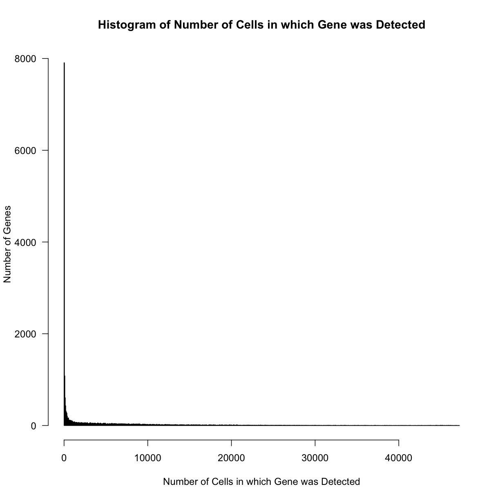
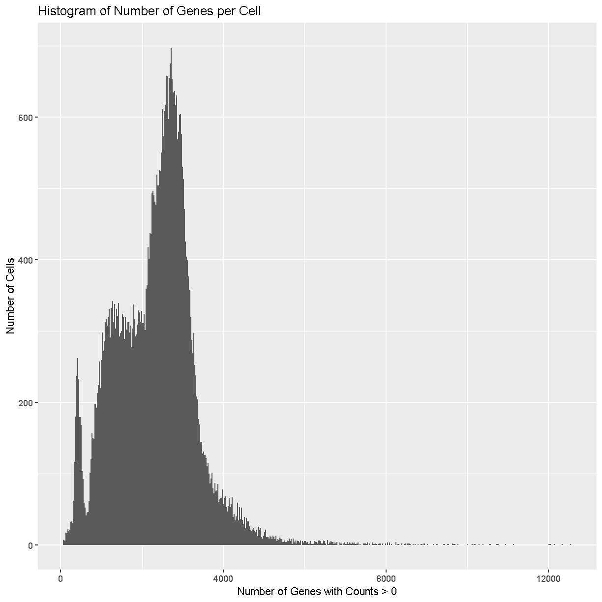
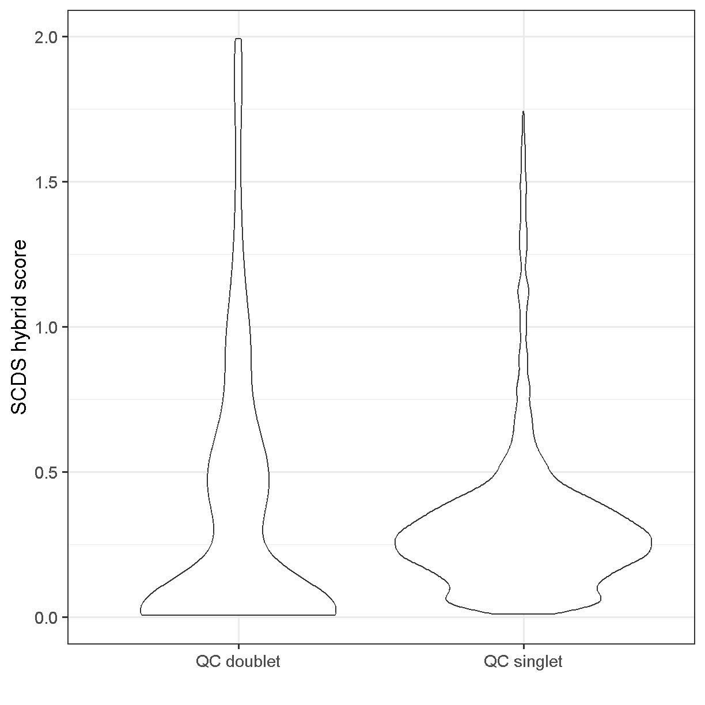

---
# Please do not edit this file directly; it is auto generated.
# Instead, please edit 04-Quality-Control.md in _episodes_rmd/
source: Rmd
title: "Quality Control of scRNA-Seq Data"
teaching: 30
exercises: 10
questions:
- "How do I determine if my single cell RNA-seq experiment data is high quality?"
- "What are the common quality control metrics that I should check in my scRNA-seq data?"
objectives:
- "Critically examine scRNA-seq data to identify potential technical issues."
- "Apply filters to remove cells that are largely poor quality/dead cells."
- "Understand the implications of different filtering steps on the data."
keypoints:
- "It is essential to filter based on criteria including mitochondrial gene expression and number of genes expressed in a cell."
- "Determining your filtering thresholds should be done separately for each experiment, and these values can vary dramatically in different settings."
---


~~~
library(tidyverse)
~~~
{: .language-r}


~~~
── Attaching packages ─────────────────────────────────────────────────────────────────────────────── tidyverse 1.3.2 ──
✔ ggplot2 3.3.6      ✔ purrr   0.3.5 
✔ tibble  3.1.8      ✔ dplyr   1.0.10
✔ tidyr   1.2.1      ✔ stringr 1.4.1 
✔ readr   2.1.3      ✔ forcats 0.5.2 
── Conflicts ────────────────────────────────────────────────────────────────────────────────── tidyverse_conflicts() ──
✖ dplyr::filter() masks stats::filter()
✖ dplyr::lag()    masks stats::lag()
~~~
{: .output}


~~~
library(Matrix)
~~~
{: .language-r}


~~~

Attaching package: 'Matrix'

The following objects are masked from 'package:tidyr':

    expand, pack, unpack
~~~
{: .output}


~~~
library(Seurat)
~~~
{: .language-r}


~~~
Attaching SeuratObject
Attaching sp
~~~
{: .output}


~~~
library(SingleCellExperiment)
~~~
{: .language-r}


~~~
Loading required package: SummarizedExperiment
Loading required package: MatrixGenerics
Loading required package: matrixStats

Attaching package: 'matrixStats'

The following object is masked from 'package:dplyr':

    count


Attaching package: 'MatrixGenerics'

The following objects are masked from 'package:matrixStats':

    colAlls, colAnyNAs, colAnys, colAvgsPerRowSet, colCollapse,
    colCounts, colCummaxs, colCummins, colCumprods, colCumsums,
    colDiffs, colIQRDiffs, colIQRs, colLogSumExps, colMadDiffs,
    colMads, colMaxs, colMeans2, colMedians, colMins, colOrderStats,
    colProds, colQuantiles, colRanges, colRanks, colSdDiffs, colSds,
    colSums2, colTabulates, colVarDiffs, colVars, colWeightedMads,
    colWeightedMeans, colWeightedMedians, colWeightedSds,
    colWeightedVars, rowAlls, rowAnyNAs, rowAnys, rowAvgsPerColSet,
    rowCollapse, rowCounts, rowCummaxs, rowCummins, rowCumprods,
    rowCumsums, rowDiffs, rowIQRDiffs, rowIQRs, rowLogSumExps,
    rowMadDiffs, rowMads, rowMaxs, rowMeans2, rowMedians, rowMins,
    rowOrderStats, rowProds, rowQuantiles, rowRanges, rowRanks,
    rowSdDiffs, rowSds, rowSums2, rowTabulates, rowVarDiffs, rowVars,
    rowWeightedMads, rowWeightedMeans, rowWeightedMedians,
    rowWeightedSds, rowWeightedVars

Loading required package: GenomicRanges
Loading required package: stats4
Loading required package: BiocGenerics
Loading required package: parallel

Attaching package: 'BiocGenerics'

The following objects are masked from 'package:parallel':

    clusterApply, clusterApplyLB, clusterCall, clusterEvalQ,
    clusterExport, clusterMap, parApply, parCapply, parLapply,
    parLapplyLB, parRapply, parSapply, parSapplyLB

The following objects are masked from 'package:dplyr':

    combine, intersect, setdiff, union

The following objects are masked from 'package:stats':

    IQR, mad, sd, var, xtabs

The following objects are masked from 'package:base':

    anyDuplicated, append, as.data.frame, basename, cbind, colnames,
    dirname, do.call, duplicated, eval, evalq, Filter, Find, get, grep,
    grepl, intersect, is.unsorted, lapply, Map, mapply, match, mget,
    order, paste, pmax, pmax.int, pmin, pmin.int, Position, rank,
    rbind, Reduce, rownames, sapply, setdiff, sort, table, tapply,
    union, unique, unsplit, which.max, which.min

Loading required package: S4Vectors

Attaching package: 'S4Vectors'

The following objects are masked from 'package:Matrix':

    expand, unname

The following objects are masked from 'package:dplyr':

    first, rename

The following object is masked from 'package:tidyr':

    expand

The following objects are masked from 'package:base':

    expand.grid, I, unname

Loading required package: IRanges

Attaching package: 'IRanges'

The following object is masked from 'package:sp':

    %over%

The following objects are masked from 'package:dplyr':

    collapse, desc, slice

The following object is masked from 'package:purrr':

    reduce

Loading required package: GenomeInfoDb
Loading required package: Biobase
Welcome to Bioconductor

    Vignettes contain introductory material; view with
    'browseVignettes()'. To cite Bioconductor, see
    'citation("Biobase")', and for packages 'citation("pkgname")'.


Attaching package: 'Biobase'

The following object is masked from 'package:MatrixGenerics':

    rowMedians

The following objects are masked from 'package:matrixStats':

    anyMissing, rowMedians


Attaching package: 'SummarizedExperiment'

The following object is masked from 'package:SeuratObject':

    Assays

The following object is masked from 'package:Seurat':

    Assays
~~~
{: .output}


~~~
library(scds)

data_dir <- '../data'
~~~
{: .language-r}


## Quality control in scRNA-seq

There are many technical reasons why cells produced by an scRNA-seq protocol 
might not be of high quality. The goal of the quality control steps are to 
assure that only single, live cells are included in the final data set. 
Ultimately some multiplets and poor quality cells will likely escape your
detection and make it into your final dataset; however, these quality
control steps aim to reduce the chance of this happening.
Failure to undertake quality control is likely to adversely impact cell type 
identification, clustering, and interpretation of the data. 

Some technical questions that you might ask include:

1. Why is mitochondrial gene expression high in some cells?
1. What is UMI, and why do we check numbers of UMI?
1. What happens to make gene counts low in a cell?

<!-- DASremoved ribosomal point here. Often we don't filter based on ribo, not clearly associated with poor quality cells -->

## Doublet detection 

We will begin by discussing doublets. We have already discussed the 
concept of the doublet. Now we will try running one computational
doublet-detection approach and track predictions of doublets.

We will use the scds method. scds contains two methods for predicting
doublets. Method cxds is based on co-expression of gene pairs, while 
method bcds uses the full count information and a binary classification 
approach using in silico doublets. 
Method cxds_bcds_hybrid combines both approaches. We will use the combined
approach. See 
[Bais and Kostka 2020](https://academic.oup.com/bioinformatics/article/36/4/1150/5566507)
for more details.


~~~
counts <- Read10X(file.path(data_dir, 'mouseStSt_invivo'), gene.column = 1)
sce <- SingleCellExperiment(list(counts = counts))
sce <- cxds_bcds_hybrid(sce)
~~~
{: .language-r}


~~~
Warning in asMethod(object): sparse->dense coercion: allocating vector of size
6.6 GiB
~~~
{: .warning}


~~~
doublet_preds <- colData(sce)
~~~
{: .language-r}


~~~
           used  (Mb) gc trigger    (Mb) limit (Mb)   max used    (Mb)
Ncells  7386868 394.6   12707271   678.7         NA    9081870   485.1
Vcells 13343645 101.9 2764338348 21090.3      32768 3427825896 26152.3
~~~
{: .output}

## Read Data from Previous Lesson


~~~
load(file.path(data_dir, 'lesson03.Rdata'))
~~~
{: .language-r}

We waited to load the lesson 3 data until just now for memory efficiency.


## High-level overview of quality control and filtering

First we will walk through some of the typical quantities one 
examines when conducting quality control of scRNA-Seq data.


### Filtering Genes by Counts

As mentioned in an earlier lesson, the counts matrix is sparse and may contain 
rows (genes) or columns (cells) with low overall counts. In the case of genes, 
we likely wish to exclude genes with zeros counts in most cells. Let's see how 
many genes have zeros counts across all cells. Note that the 
[Matrix package](https://cran.r-project.org/web/packages/Matrix/index.html) 
has a special implementation of 
[rowSums](https://rdrr.io/rforge/Matrix/man/colSums.html) which works with 
sparse matrices.


~~~
gene_counts <- Matrix::rowSums(counts, na.rm = TRUE)
sum(gene_counts == 0)
~~~
{: .language-r}


~~~
[1] 6315
~~~
{: .output}

Of the 31053 genes, 6315 have zero counts across 
all cells. These genes do not inform us about the mean, variance, or covariance 
of any of the other genes and we will remove them before proceeding with 
further analysis.


~~~
counts <- counts[gene_counts > 0,]
~~~
{: .language-r}

This leaves 24738 genes in the counts matrix.

We could also set some other threshold for filtering genes. Perhaps we should 
look at the number of genes that have different numbers of counts. We will use 
a histogram to look at the distribution of overall gene counts. Note that, since 
we just resized the counts matrix, we need to recalculate `gene_counts`.

We will count the number of cells in which each gene was detected. Because 
`counts` is a sparse matrix, we have to be careful not to perform operations 
that would convert the entire matrix into a non-sparse matrix. This might 
happen if we wrote code like:

```{}
gene_counts <- rowSums(counts > 0)
```

The expression `counts > 0` would create a logical matrix that takes up much 
more memory than the sparse matrix. We might be tempted to try 
`rowSums(counts == 0)`, but this would also result in a non-sparse matrix 
because most of the values would be `TRUE`. However, if we evaluate 
`rowSums(counts != 0)`, then most of the values would be `FALSE`, which can be 
stored as 0 and so the matrix would still be sparse. The `Matrix` package has 
an implementation of 'rowSums()' that is efficient, but you may have to specify 
that you want to used the `Matrix` version of 'rowSums()' explicitly.


~~~
gene_counts <- Matrix::rowSums(counts > 0)

tibble(gene_id = names(gene_counts), counts = gene_counts) %>% 
  ggplot(aes(counts)) +
    geom_histogram(bins = 100) +
    labs(title = 'Number of Cells in which Gene was Detected',
         x     = 'Number of Genes',
         y     = 'Histogram of Number of Cells in which Gene was Detected') +
  theme_bw(base_size = 14) #+ scale_x_log10()
~~~
{: .language-r}


~~~
hist(gene_counts, breaks = 1000, las = 1, xlab = 'Number of Cells in which Gene was Detected', 
     ylab = 'Number of Genes', main = 'Histogram of Number of Cells in which Gene was Detected')
~~~
{: .language-r}



As you can see, the number of cells in which each gene is detected spans several 
orders of magnitude and this makes it difficult to interpret the plot. Some 
genes are detected in all cells while others are detected in only one cell. 
Let's zoom in on the part with lower gene counts.


~~~
hist(gene_counts, breaks = -1:max(gene_counts), freq = TRUE, 
     xlim = c(0, 100), las = 1, 
     xlab = 'Number of Cells in which Gene was Detected', 
     ylab = 'Number of Genes', 
     main = 'Histogram of Number of Cells in which Gene was Detected')
text(2, 1180, labels = paste(sum(gene_counts == 1), 
  'genes were detected in only one cell'), adj = c(0, 0.5))
text(3,  800, labels = paste(sum(gene_counts == 2), 
  'genes were detected in two cells'), adj = c(0, 0.5))
~~~
{: .language-r}


In the plot above, we can see that there are 1530 
genes that were detected in only one cell, 873 
genes detected in two cells, etc.

Making a decision to keep or remove a gene based on its expression being
detected in a certain
number of cells can be tricky. 
If you retain all genes, you may consume more computational resources and add 
noise to your analysis. If you discard too many genes, you may miss rare 
but important cell types.

Consider this example: You have a total of 10,000 cells in your scRNA-seq 
results. There is a rare cell population consisting of 100 cells that 
expresses 20 genes which are not expressed in any other cell type. If you 
only retain genes that are detected in more than 100 cells, you will miss 
this cell population.


> ## Challenge 1
> How would filtering genes too strictly affect your results? 
How would this affect your ability to discriminate between cell types? 
>
> > ## Solution to Challenge 1
> > 
> > Filtering too strictly would make it more difficult to distinguish between
cell types. The degree to which this problem affects your analyses depends on
the degree of strictness of your filtering. Let's take the situation to its
logical extreme -- what if we keep only genes expressed in at least 95% of cells.
If we did this, we would end up with only 11
genes! By definition these genes will be highly expressed in all cell types,
therefore eliminating our ability to clearly distinguish between cell types.
> {: .solution}
{: .challenge}


> ## Challenge 2
> What total count threshold would you choose to filter genes? Remember that 
there are 70388 cells.
>
> > ## Solution to Challenge 1
> >
> > This is a question that has a somewhat imprecise answer. Following from
challenge one, we do not want to be *too* strict in our filtering. However,
we do want to remove genes that will not provide much information about
gene expression variability among the cells in our dataset. Our recommendation
would be to filter genes expressed in <5 cells, but one could reasonably
justify a threshold between, say, 3 and 20 cells.
> {: .solution}
{: .challenge}


### Filtering Cells by Counts

Next we will look at the number of genes expressed in each cell. 
If a cell lyses and leaks RNA,the total number of reads in a 
cell may be low, which leads to lower gene counts. Furthermore, each
single cell suspension likely contains some amount of so-called "ambient"
RNA from damaged/dead/dying cells. This ambient RNA comes along for the ride
in every droplet. Therefore even droplets that do not contain cells
(empty droplets) can have some reads mapping to transcripts that look
like gene expression.
Filtering out these kinds of cells is a quality control step that 
should improve your final results.

We will explicitly use the `Matrix` package's implementation of 'colSums()'.


~~~
cell_counts <- Matrix::colSums(counts > 0)
hist(cell_counts, breaks = 1000, las = 1, xlab = 'Number of Genes with Counts > 0', 
     ylab = 'Number of Cells')
~~~
{: .language-r}



Cells with way more genes expressed than the typical cell might be
doublets/multiplets and should also be removed.


### Creating the Seurat Object

In order to use Seurat, we must take the sample metadata and gene counts and 
create a 
[Seurat Object](https://rdrr.io/cran/SeuratObject/man/Seurat-class.html). 
This is a data structure which organizes the data and metadata and will 
store aspects of the analysis as we progress through the workshop.

Below, we will create a Seurat object for the liver data. We must first 
convert the cell metadata into a data.frame and place the barcodes 
in rownames. The we will pass the counts and metadata into the
[CreateSeuratObject](https://search.r-project.org/CRAN/refmans/SeuratObject/html/CreateSeuratObject.html) 
function to create the Seurat object. 

In the section above, we examined the counts across genes and cells and 
proposed filtering using thresholds.  The CreateSeuratObject function 
contains two arguments, 'min.cells' and 'min.features', that allow us to 
filter the genes and cells by counts. Although we might use these arguments
for convenience in a typical analysis, for this course we will look more
closely at these quantities on a per-library basis to decide on
our filtering thresholds.


~~~
metadata <- as.data.frame(metadata) %>%
              column_to_rownames('cell')
liver <- CreateSeuratObject(counts    = counts, 
                            project   = 'liver: scRNA-Seq',
                            meta.data = metadata)
~~~
{: .language-r}

Add on doublet predictions that we did earlier in this lesson.

~~~
liver <- AddMetaData(liver, as.data.frame(doublet_preds))
~~~
{: .language-r}


## Typical filters for cell quality

Here we briefly review these filters and decide what thresholds we will
use for these data.


### Filtering by Mitochondrial Gene Content

During apoptosis, the cell membrane may break and release transcripts into 
the surrounding media. However, the mitochondrial transcripts may remain inside 
of the mitochondria. This will lead to an apparent, but spurious, increase in 
mitochondrial gene expression. As a result, we use the percentage of 
mitochondrial-encoded reads to filter out cells that were not healthy during 
sample processing. See 
[this link](https://kb.10xgenomics.com/hc/en-us/articles/360001086611) 
from 10X Genomics for additional information.

First we compute the percentage mitochondrial gene expression in each cell.


~~~
liver <- liver %>% 
              PercentageFeatureSet(pattern = "^mt-", col.name = "percent.mt")
~~~
{: .language-r}

Different cell types may have different levels of mitochondrial RNA content.
Therefore we must use our knowledge of the particular biological system
that we are profiling in order to choose an appropriate threshold.
If we are profiling single nuclei instead of single cells we might 
consider a very low threshold for MT content. If we are profiling a tissue
where we anticipate broad variability in levels of mitochondrial RNA
content between cell types, we might use a very lenient threshold
to start and then return to filter out additional cells after we 
obtain tentative cell type labels that we have obtained by carrying
out normalization and clustering. In this course we will filter only once


~~~
VlnPlot(liver, features = "percent.mt", group.by = 'sample')
~~~
{: .language-r}


It is hard to see with so many dots! Let's try another version where we just
plot the violins:


~~~
VlnPlot(liver, features = "percent.mt", group.by = 'sample', pt.size = 0)
~~~
{: .language-r}


In most cases it would be ideal to determine separate filtering 
thresholds on each scRNA-Seq sample. This would account for the fact
that the characteristics of each sample might vary 
(for many possible reasons) even if the
same tissue is profiled. However, in this course we will see if we can
find a single threshold that works decently well across all samples.
As you can see, the samples we are examining do not look 
drastically different so this may not be such an unrealistic simplification.

We will use a threshold of 15% mitochondrial gene expression which will 
remove the "long tail" of cells with high `percent.mt` values. We could
also perhaps justify going as low as 10% to be more conservative,
but we likely would not want to go down to 5%, which would 
remove around half the cells.


~~~
#liver <- subset(liver, subset = percent.mt < 15)
~~~
{: .language-r}


### Filtering Cells by Total Gene Counts

Let's look at how many genes are expressed in each cell. 
Again we'll split by
the mouse ID so we can see if there are particular samples that are 
very different from the rest.
Again we will show only the violins for clarity.


~~~
VlnPlot(liver, 'nFeature_RNA', group.by = 'sample', pt.size = 0)
~~~
{: .language-r}


Like with the mitochondrial expression percentage, we will strive
to find a threshold that works reasonably well across all samples.
For the number of genes expressed we will want to filter out both cells
that express to *few* genes and cells that express too *many* genes. 
As noted above, damaged or dying cells may leak RNA, resulting in a low
number of genes expressed, and we want to filter out these cells to 
ignore their "damaged" transcriptomes. On the other hand, cells with way 
more genes expressed than the typical cell might be
doublets/multiplets and should also be removed.

It looks like filtering out cells that express less than 400 or 
greater than 5,000 genes is a reasonable compromise across our samples.
(Note the log scale in this plot, which is necessary for seeing the violin
densities at low numbers of genes expressed).


~~~
VlnPlot(liver, 'nFeature_RNA', group.by = 'sample', pt.size = 0) +
  scale_y_log10() + 
  geom_hline(yintercept = 400) + 
  geom_hline(yintercept = 5000)
~~~
{: .language-r}


~~~
Scale for 'y' is already present. Adding another scale for 'y', which will
replace the existing scale.
~~~
{: .output}


~~~
#liver <- subset(liver, nFeature_RNA > 400 & nFeature_RNA < 5000)
~~~
{: .language-r}


### Filtering Cells by UMI

A UMI -- unique molecular identifier -- is like a molecular barcode for
each RNA molecule in the cell. UMIs are short, distinct oligonucleotides
attached during the initial 
preparation of cDNA from RNA. Therefore each UMI is unique to a single RNA
molecule. 

Why are UMI useful? The amount of RNA in a single cell is quite low 
(approximately 10-30pg according to 
[this link](https://bionumbers.hms.harvard.edu/bionumber.aspx?id=111205&ver=2&trm=amount+of+rna+per+cell&org=)).
Thus single cell transcriptomics profiling usually includes a PCR 
amplification step. PCR amplification is fairly "noisy" because small 
stochastic sampling differences can propagate through exponential 
amplification. Using UMIs, we can throw out all copies of the molecule
except one (the copies we throw out are called "PCR duplicates").


> Note, not sure about permissions for this figure ...

Several papers (e.g. [Islam et al](https://doi.org/10.1038/nmeth.2772))
have demonstrated that UMIs reduce amplification noise in single cell
transcriptomics and thereby increase data fidelity. The only downside of
UMIs is that they cause us to throw away a lot of our data
(perhaps as high as 90% of our sequenced reads). Nevertheless, we don't
want those reads if they are not giving us new information about gene 
expression, so we tolerate this inefficiency.

CellRanger will automatically process your UMIs and the feature-barcode
matrix it produces will be free from PCR duplicates.
Thus, we can think of the number of UMIs as the sequencing depth of 
each cell.

Typically the number of genes and number of UMI are highly correlated
and this is mostly the case in our liver dataset:

~~~
ggplot(liver@meta.data, aes(x = nCount_RNA, y = nFeature_RNA)) +
  geom_point() +
  theme_bw(base_size = 16) +
  xlab("nUMI") + ylab("nGenes") +
  scale_x_log10() + scale_y_log10()
~~~
{: .language-r}


It turns out that the cloud of cells that have unusually low gene counts
for the number of UMIs sequenced were nearly all filtered out by the authors of 
the liver cell atlas publication. 


~~~
VlnPlot(liver, 'nCount_RNA', group.by = 'sample', pt.size = 0) +
  scale_y_log10() + 
  geom_hline(yintercept = 700) + 
  geom_hline(yintercept = 30000)
~~~
{: .language-r}


~~~
Scale for 'y' is already present. Adding another scale for 'y', which will
replace the existing scale.
~~~
{: .output}


~~~
#liver <- subset(liver, nCount_RNA > 700 & nCount_RNA < 30000)
~~~
{: .language-r}

Again we try to select thresholds that remove most of the strongest outliers
in all samples. 


> ## Challenge 2
> List two technical issues that can lead to poor scRNA-seq data quality and which filters we use to detect each one. 
>
> > ## Solution to Challenge 2
> >
> > 1 ). Cell membranes may rupture during the disassociation protocol, 
which is indicated 
by high mitochondrial gene expression because the mitochondrial 
transcripts are contained within the mitochondria, while other transcripts
in the cytoplasm may leak out. Use the mitochondrial percentage filter to 
try to remove these cells.
> > 2 ). Cells may be doublets of two different cell types. In this case
they might express many more genes than either cell type alone. Use the
"number of genes expressed" filter to try to remove these cells.
> > 3 ). Cells 
> {: .solution}
{: .challenge}


## Doublet detection revisited

Let's go back to our doublet predictions. How many of the cells that
are going to be filtered out of our data were predicted to be doublets
by scds?


~~~
liver$keep <- with(liver@meta.data, percent.mt < 15 & nFeature_RNA > 400 &
  nFeature_RNA < 5000 & nCount_RNA > 700 & nCount_RNA < 30000)
~~~
{: .language-r}

Using the scds hybrid_score method, the scores range between 0 and 2.
Higher scores should be more likely to be doublets.


~~~
ggplot(liver@meta.data, aes(x = keep, y = hybrid_score)) + 
  geom_violin() + theme_bw(base_size = 18)
~~~
{: .language-r}



Somewhat unsatisfyingly, we don't really get much clear enrichment of
cells with high scds hybrid scores. Nevertheless let's filter
out those cells with a hybrid_score > 1.5.

## Subset based on %MT, number of genes, and number of UMI thresholds


~~~
liver <- subset(liver, subset = percent.mt < 15 & nFeature_RNA > 400 &
  nFeature_RNA < 5000 & nCount_RNA > 700 & nCount_RNA < 30000 & 
    hybrid_score < 1.5)
~~~
{: .language-r}


<!-- Discuss batch correction here? -->
<!-- it might be interesting to do batch correction across in vivo + nuc seq -->
<!-- DAS recommends using harmony if we want to do batch correction -->

## Save Data for Next Lesson

We will use the Seurat object in the next lesson. Save it now and we will 
load it at the beginning of the next lesson. We will use R's
[saveRDS](https://stat.ethz.ch/R-manual/R-devel/library/base/html/readRDS.html)
command to save the Seurat object. 
The `saveRDS` function is useful when you want to save one object in 
compressed, binary format.


~~~
saveRDS(liver, file = file.path(data_dir, 'lesson04.rds'))
~~~
{: .language-r}

> ## Challenge 3
> Delete the existing counts and metadata objects. Read in the  *ex-vivo* data 
that you saved at the end of Lesson 03 (lesson03_challenge.Rdata) and create 
a Seurat object called 'liver_2'. Look at the filtering quantities and
decide whether you can use the same cell and feature filters 
that were used to create the Seurat object above.
>
> > ## Solution to Challenge 3  
> > `# Remove the existing counts and metadata.`  
> > `rm(counts, metadata)`  
> > `# Read in citeseq counts & metadata.`  
> > `load(file = file.path(data_dir, 'lesson03_challenge.Rdata'))`  
> > `# Create Seurat object.`  
> > `metadata = as.data.frame(metadata) %>%`  
> > `             column_to_rownames('cell')`  
> > `liver_2 = CreateSeuratObject(count        = counts, `  
> > `                             project      = 'liver: ex-vivo',`  
> > `                             meta.data    = metadata)`  
> > ``
> {: .solution}
{: .challenge}

> ## Challenge 4
> Estimate the proportion of mitochondrial genes. 
Create plots of the proportion of features, cells, and mitochondrial genes. 
Filter the Seurat object by mitochondrial gene expression.
>
> > ## Solution to Challenge 4  
> > `liver_2 = liver_2 %>%`  
> > `            PercentageFeatureSet(pattern = "^mt-", col.name = "percent.mt")`  
> > `VlnPlot(liver_2, features = c("nFeature_RNA", "nCount_RNA", "percent.mt"), ncol = 3)`  
> > `liver_2 = subset(liver_2, subset = percent.mt < 10)`  
> {: .solution}
{: .challenge}


## Session Info


~~~
sessionInfo()
~~~
{: .language-r}


~~~
R version 4.1.0 (2021-05-18)
Platform: x86_64-apple-darwin17.0 (64-bit)
Running under: macOS Big Sur 10.16

Matrix products: default
BLAS:   /Library/Frameworks/R.framework/Versions/4.1/Resources/lib/libRblas.dylib
LAPACK: /Library/Frameworks/R.framework/Versions/4.1/Resources/lib/libRlapack.dylib

locale:
[1] en_US.UTF-8/en_US.UTF-8/en_US.UTF-8/C/en_US.UTF-8/en_US.UTF-8

attached base packages:
[1] parallel  stats4    stats     graphics  grDevices utils     datasets 
[8] methods   base     

other attached packages:
 [1] scds_1.8.0                  SingleCellExperiment_1.14.1
 [3] SummarizedExperiment_1.22.0 Biobase_2.52.0             
 [5] GenomicRanges_1.44.0        GenomeInfoDb_1.28.4        
 [7] IRanges_2.26.0              S4Vectors_0.30.2           
 [9] BiocGenerics_0.38.0         MatrixGenerics_1.4.3       
[11] matrixStats_0.62.0          sp_1.5-0                   
[13] SeuratObject_4.1.2          Seurat_4.2.0               
[15] Matrix_1.5-1                forcats_0.5.2              
[17] stringr_1.4.1               dplyr_1.0.10               
[19] purrr_0.3.5                 readr_2.1.3                
[21] tidyr_1.2.1                 tibble_3.1.8               
[23] ggplot2_3.3.6               tidyverse_1.3.2            
[25] knitr_1.40                 

loaded via a namespace (and not attached):
  [1] readxl_1.4.1           backports_1.4.1        plyr_1.8.7            
  [4] igraph_1.3.5           lazyeval_0.2.2         splines_4.1.0         
  [7] listenv_0.8.0          scattermore_0.8        digest_0.6.30         
 [10] htmltools_0.5.3        fansi_1.0.3            magrittr_2.0.3        
 [13] tensor_1.5             googlesheets4_1.0.1    cluster_2.1.2         
 [16] ROCR_1.0-11            tzdb_0.3.0             globals_0.16.1        
 [19] modelr_0.1.9           spatstat.sparse_3.0-0  colorspace_2.0-3      
 [22] rvest_1.0.3            ggrepel_0.9.1          haven_2.5.1           
 [25] xfun_0.34              RCurl_1.98-1.9         crayon_1.5.2          
 [28] jsonlite_1.8.3         progressr_0.11.0       spatstat.data_3.0-0   
 [31] survival_3.2-11        zoo_1.8-11             glue_1.6.2            
 [34] polyclip_1.10-4        gtable_0.3.1           gargle_1.2.1          
 [37] zlibbioc_1.38.0        XVector_0.32.0         leiden_0.4.3          
 [40] DelayedArray_0.18.0    future.apply_1.9.1     abind_1.4-5           
 [43] scales_1.2.1           DBI_1.1.3              spatstat.random_3.0-0 
 [46] miniUI_0.1.1.1         Rcpp_1.0.9             viridisLite_0.4.1     
 [49] xtable_1.8-4           reticulate_1.26        spatstat.core_2.4-4   
 [52] htmlwidgets_1.5.4      httr_1.4.4             RColorBrewer_1.1-3    
 [55] ellipsis_0.3.2         ica_1.0-3              farver_2.1.1          
 [58] pkgconfig_2.0.3        uwot_0.1.14            dbplyr_2.2.1          
 [61] deldir_1.0-6           utf8_1.2.2             labeling_0.4.2        
 [64] tidyselect_1.2.0       rlang_1.0.6            reshape2_1.4.4        
 [67] later_1.3.0            munsell_0.5.0          cellranger_1.1.0      
 [70] tools_4.1.0            xgboost_1.6.0.1        cli_3.4.1             
 [73] generics_0.1.3         broom_1.0.1            ggridges_0.5.4        
 [76] evaluate_0.17          fastmap_1.1.0          goftest_1.2-3         
 [79] fs_1.5.2               fitdistrplus_1.1-8     RANN_2.6.1            
 [82] pbapply_1.5-0          future_1.28.0          nlme_3.1-152          
 [85] mime_0.12              xml2_1.3.3             compiler_4.1.0        
 [88] plotly_4.10.0          png_0.1-7              spatstat.utils_3.0-1  
 [91] reprex_2.0.2           stringi_1.7.8          highr_0.9             
 [94] rgeos_0.5-9            lattice_0.20-44        vctrs_0.5.0           
 [97] pillar_1.8.1           lifecycle_1.0.3        spatstat.geom_3.0-3   
[100] lmtest_0.9-40          RcppAnnoy_0.0.20       bitops_1.0-7          
[103] data.table_1.14.4      cowplot_1.1.1          irlba_2.3.5.1         
[106] httpuv_1.6.6           patchwork_1.1.2        R6_2.5.1              
[109] promises_1.2.0.1       KernSmooth_2.23-20     gridExtra_2.3         
[112] parallelly_1.32.1      codetools_0.2-18       MASS_7.3-54           
[115] assertthat_0.2.1       withr_2.5.0            sctransform_0.3.5     
[118] GenomeInfoDbData_1.2.6 mgcv_1.8-35            hms_1.1.2             
[121] grid_4.1.0             rpart_4.1-15           googledrive_2.0.0     
[124] Rtsne_0.16             pROC_1.18.0            shiny_1.7.3           
[127] lubridate_1.8.0       
~~~
{: .output}
