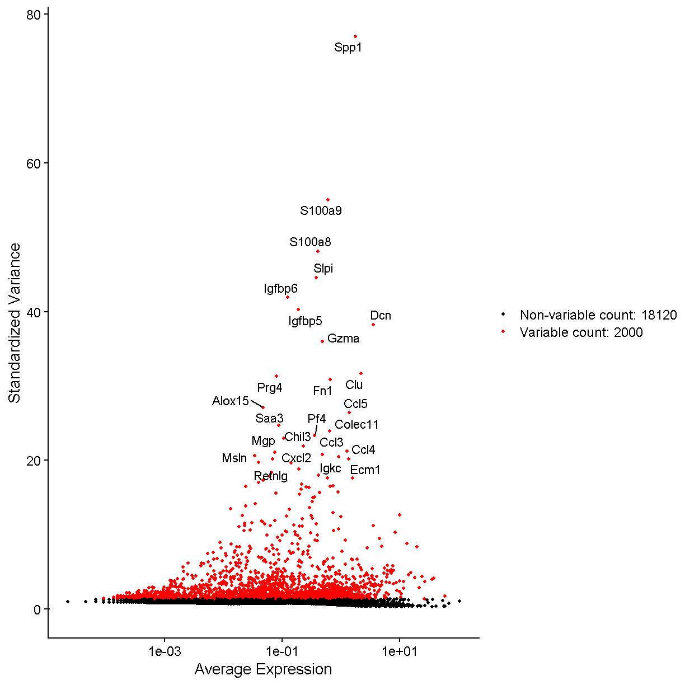
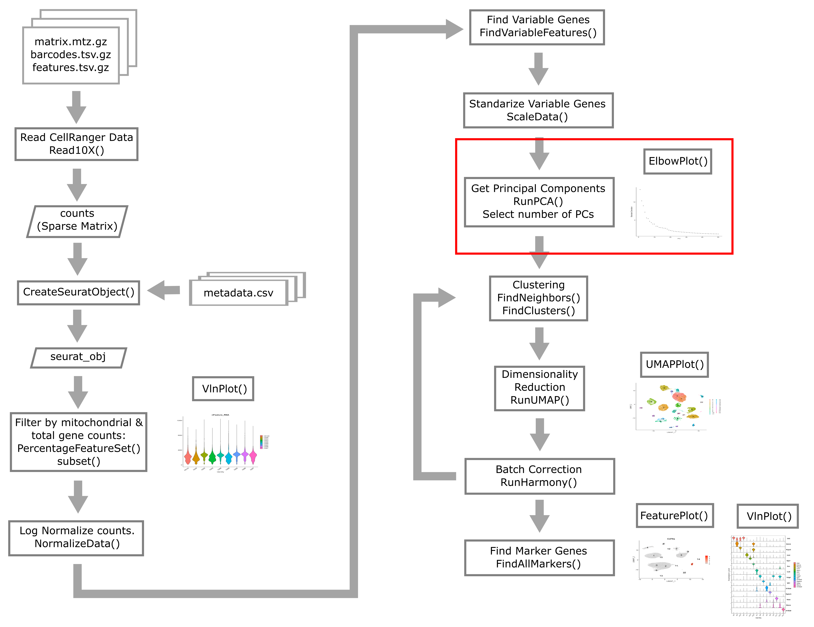
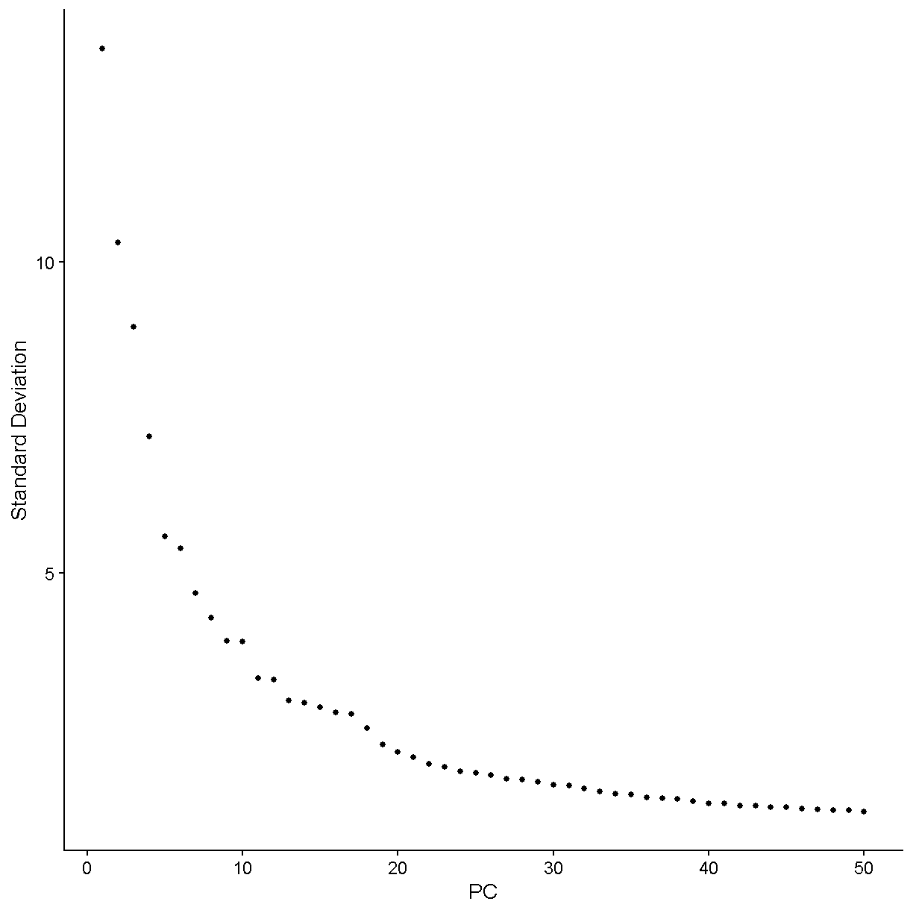
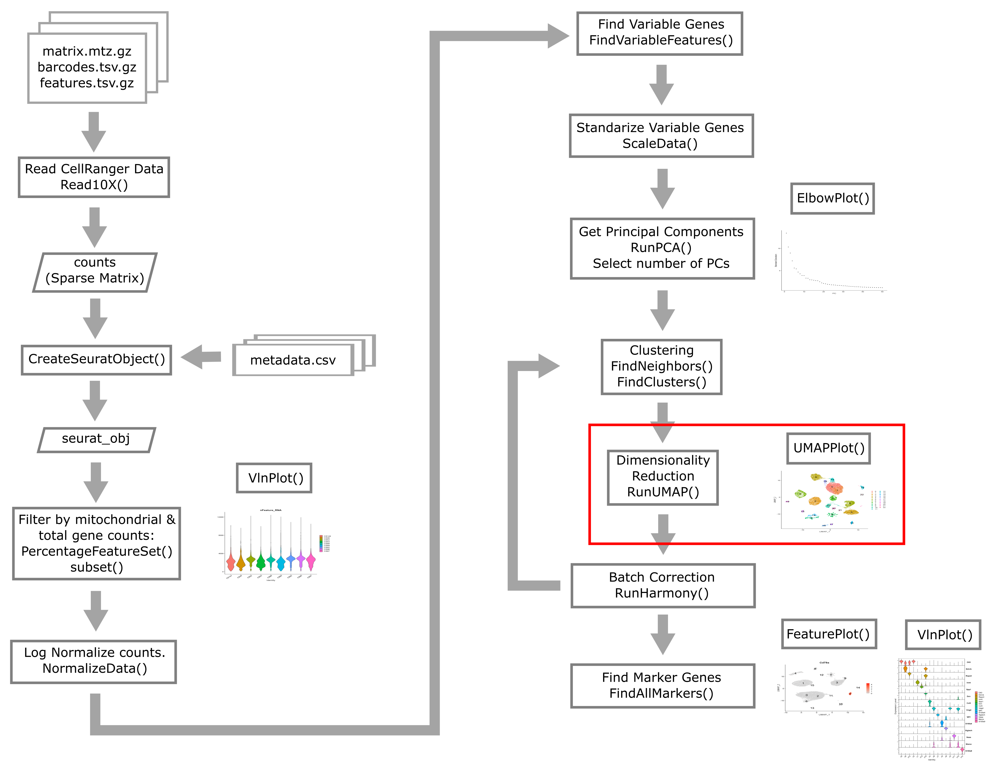

---
# Please do not edit this file directly; it is auto generated.
# Instead, please edit 05-Common-Analyses.md in _episodes_rmd/
source: Rmd
title: "Common Analyses"
teaching: 90
exercises: 10
questions:
- "What are the most common single cell RNA-Seq analyses?"
objectives:
- "Explain how to use RMarkdown with the new lesson template."
- "Demonstrate how to include pieces of code, figures, and challenges."
keypoints:
- "Edit the .Rmd files not the .md files"
- "Run `make serve` to knit documents and preview lesson website locally"
---


~~~
source("../bin/chunk-options.R")
knitr_fig_path("05-")

suppressPackageStartupMessages(library(tidyverse))
~~~
{: .language-r}


~~~
## Warning: package 'tidyverse' was built under R version 4.1.3
~~~
{: .warning}


~~~
## Warning: package 'tibble' was built under R version 4.1.3
~~~
{: .warning}


~~~
## Warning: package 'tidyr' was built under R version 4.1.3
~~~
{: .warning}


~~~
## Warning: package 'readr' was built under R version 4.1.3
~~~
{: .warning}


~~~
## Warning: package 'purrr' was built under R version 4.1.3
~~~
{: .warning}


~~~
## Warning: package 'dplyr' was built under R version 4.1.3
~~~
{: .warning}


~~~
## Warning: package 'forcats' was built under R version 4.1.3
~~~
{: .warning}


~~~
suppressPackageStartupMessages(library(Seurat))

data_dir <- '../data'
~~~
{: .language-r}


~~~
# set a seed for reproducibility in case any randomness used below
set.seed(1418)
~~~
{: .language-r}


## Read Data from Previous Lesson


## A Note on Seurat Functions

The Seurat package is set up so that we primarily work with a 
Seurat object containing our single cell data and metadata.
Let's say we are working with our Seurat object `liver`. 
The usual way we might call a function to do something with our
data looks like:
```
liver <- DoSomething(liver, param1 = TRUE, param2 = 0.3)
```

However, since the `DoSomething()` function returns the modified
Seurat object, we can also pipe together multiple commands to do
multiple things to our object. That could look something like:
```
liver <- DoSomething(liver, param1 = TRUE, param2 = 0.3) %>%
    DoSomethingElse(param1 = 3) %>%
    DoAThirdThing(param1 = c(1, 4, 6))
```

We can just as well use the piping operator `%>%` even if 
we are calling only one function:
```
liver <- liver %>%
    DoSomething(param1 = TRUE, param2 = 0.3)
```

In this lesson (and elsewhere in the course) we may alternate between
these slightly different coding styles. Please ask us for clarification
if you are having difficulty seeing how our example code is 
doing what it is supposed to do.

> DMG: Overall process figure.

### Normalization


Instead of working with raw count data measured across cells
that were sequenced to highly variable depths, we conduct
normalization to try to make gene expression values follow
a more stable distribution as well as being more comparable
between cells.

Single cell gene expression
count data is usually approximately log-normally distributed. 
Many statistical methods work best when the data is normally distributed. 
We also would like to correct for variability in sequencing depth 
between cells, the nature of which is purely technical.
Log normalization will give us normalized gene expression which represents
the log of the number of counts per 10,000 reads.


~~~
liver <- liver %>%
            NormalizeData(normalization.method = "LogNormalize")
~~~
{: .language-r}

This method of normalizing is pretty simple. The way it works is
to follow a simple formula like
`norm_count = log((count + 1)/total_counts) * 10000`
where `total_counts` is the total number of reads in each cell.

There are other normalization methods that are more complicated and
may outperform the log normalization method. Two examples are:

 * Normalization based on multinomial methods as outlined by
 [Townes et al. 2019](https://pubmed.ncbi.nlm.nih.gov/31870412/)
 * Normalization using regularized negative binomial regression
 [Hafemeister and Satija 2019](https://genomebiology.biomedcentral.com/articles/10.1186/s13059-019-1874-1), 
 with a [Seurat vignette here](https://satijalab.org/seurat/articles/sctransform_vignette.html)
 
However, no normalization method has been demonstrated to be universally
and unambiguously better than simple log normalization.

> Show what just changed in the Seurat Object.

### Finding Variable Features


Next we will find a subset of features showing high cell-to-cell variation 
in the dataset (that is, they are highly expressed in some cells and lowly
expressed in others). 


~~~
liver <- liver %>% 
              FindVariableFeatures(nfeatures = 2000)

# Identify the 25 most highly variable genes
top25 <- head(VariableFeatures(liver), 25)

plot1 <- VariableFeaturePlot(liver)
LabelPoints(plot = plot1, points = top25, xnudge = 0, 
            ynudge = 0, repel = TRUE)
~~~
{: .language-r}



> Show what just changed in the Seurat Object.

## Cell Cycle Assignment 

We will also show how to predict cell cycle state.
This approach is outlined in the Seurat vignette at
[this link](https://satijalab.org/seurat/articles/cell_cycle_vignette.html).


~~~
cc.genes <- readLines(file.path(data_dir,
  'regev_lab_cell_cycle_genes_mm.fixed.txt'))
s.genes   <- cc.genes[1:43]
g2m.genes <- cc.genes[44:98]

liver <- CellCycleScoring(liver, 
                          s.features   = s.genes, 
                          g2m.features = g2m.genes, 
                          set.ident    = FALSE)
~~~
{: .language-r}

Seurat will provide a quantitative estimate of the cell's chance of being
in different phases of the cell cycle `S.Score` and `G2M.Score`, as well as
a categorical prediction of which phase the cell is in 
(`Phase` -- G1, G2M, S).

> Show what just changed in the Seurat Object.

### Scale Data


Now we apply a linear transformation that is often used in initial 
scRNA-Seq processing. This transformation standardizes the expression of
each gene, setting the mean across cells to 0 and variance to 1. 
This helps all genes to contribute to the inferred variability rather
than just the highly-expressed genes.

We will "regress out" the signals of technical confounders including
%MT and the number of genes expressed. We might also choose to regress out
other variables such as cell cycle stage (if we wish to examine 
cellular heterogeneity independent of cell cycle), number of UMIs,
etc.


~~~
liver <- liver %>%
    ScaleData(vars.to.regress = c("percent.mt", "nFeature_RNA"))
~~~
{: .language-r}

> Show what just changed in the Seurat Object.

### Principal Component Analysis



Next we reduce the dimensionality of the data. You have probably heard
of PCA as a technique for summarizing major axes of variation in a dataset.
Here, we perform PCA on the single cell gene expression data in order to
place each cell in a multidimensional space with lower dimension (say 20-40)
than the complete expression matrix (~20,000 genes).


~~~
liver <- liver %>%
              RunPCA(verbose = FALSE, npcs = 100)
~~~
{: .language-r}

It is usually not very useful to view the raw PCs themselves.
There's nothing obvious that we can glean from the following PC plot:


~~~
DimPlot(liver, reduction = "pca")
~~~
{: .language-r}


Instead we will take some of the PCs and use them for a further
summarization of the data. Namely, we will use the PCs as input to the
UMAP (or t-SNE) algorithm which projects our cells onto a 2D space
(the computer screen). 

A significant challenge in scRNA-Seq is deciding how many PCs to use.
You can think of each PC as capturing pathway-level transcriptional variation
across the cells in your dataset. Thus even if the transcriptome is sparse
within each cell (it is), you can still compare different cells across major
axes of variation. We don't want to use too *few* PCs, otherwise we 
might miss significant axes of variation (e.g. a cell subtype or minor cell 
type). We also don't want to use too *many* PCs since, as you go out in PC-space,
the PCs increasingly represent more noise and less biological reality.

We will use a very simple method to choose the number of PCs: the elbow
method. Using this method we look for where the elbow plot stops dropping
precipitously.

~~~
ElbowPlot(liver, ndims = 100)
~~~
{: .language-r}


Let's zoom in more and see what things like under 50 PCs.

~~~
ElbowPlot(liver, ndims = 50)
~~~
{: .language-r}



We would say that the standard deviation in PCs really starts to stablize
around N = 24 PCs. Let's use this value moving forward.
For a more in-depth analysis we would try a variety of values and 
attempt to decide which value gives us the results that are most 
biologically sensible. 

There is also a function in Seurat, `JackStraw()`, that one may use
to try to determine the statistical significance of principal 
component scores. Specifically, it randomly permutes a subset of data, 
and calculates projected PCA scores for these random genes. Then it
compares the PCA scores for the random genes with the observed PCA scores 
to determine statistical signifance. We are not using this function here
because it is a bit slow and because it often does not give any better 
results than the simple method of looking at an elbow plot.

All this said, the major question here -- how many PCs to select in order
to capture the important variation within your scRNA-Seq data in a
reduced dimension space -- is still unresolved and your best bet is 
to explore different values and see what they give you!


~~~
num_pc <- 24
ElbowPlot(liver, ndims = 40) + geom_vline(xintercept = num_pc)
~~~
{: .language-r}


<!-- Do we need to do batch correction with Harmony? The authors of the
liver cell atlas did it ...
See https://github.com/guilliottslab/scripts_GuilliamsEtAll_Cell2022/blob/main/3b_Harmony.R
-->

> Show what just changed in the Seurat Object.

## Dimensionality reduction (UMAP, tSNE, etc) 


As mentioned above, dimensionality reduction allows you to actually 
visualize your data! The two methods below are widely used in the
single cell community.

> Uniform Manifold Approximation and Projection (UMAP) [van der Maaten & Hinton, 2008](https://www.jmlr.org/papers/volume9/vandermaaten08a/vandermaaten08a.pdf).

> t-Distributed Stochastic Neighbor Embedding (t-SNE) [McUnnes et al](https://arxiv.org/abs/1802.03426) 

These methods generally do a very effective job of putting similar points near each other in the reduced-dimensionality space. Thus cells from 
the same clusters are likely to be placed in the same region of the UMAP/t-SNE.

UMAP is more widely used the t-SNE at the current time.
Note that you should caution yourself not to overinterpret UMAP plots.
Although UMAP does optimize both local and global similarity for points
being projected onto a 2D space, UMAP contains no guarantee that similar points
must be near each other.


~~~
liver <- RunUMAP(liver, reduction = 'pca', dims = 1:num_pc, 
    verbose = FALSE)
~~~
{: .language-r}

## Clustering 



Seurat uses a graph-based approach to cluster cells with similar
transcriptomic profiles. 
We start by constructing the shared nearest-neighbor graph. This
computes a distance metric between the cells (in PC-space) and 
constructs the shared nearest-neighbor graph by calculating the
neighborhood overlap (Jaccard index) between every cell and its 
20 (by default) nearest neighbors.
Then the shared nearest-neighbor graph is used to identify
cell clusters using a modularity optimization based clustering
algorithm. 
The Seurat help pages for the functions below,
[FindNeighbors](https://satijalab.org/seurat/reference/findneighbors)
and 
[FindClusters](https://satijalab.org/seurat/reference/findclusters),
provide some references if you are interested in digging into
further details of this clustering procedure.


~~~
liver <- FindNeighbors(liver, reduction = 'pca', 
                       dims = 1:num_pc, verbose = FALSE) %>%
           FindClusters(verbose = FALSE, resolution = 0.3)
UMAPPlot(liver, label = TRUE, label.size = 6)
~~~
{: .language-r}


> Show what just changed in the Seurat Object.

Note that we are using the principal components computed from 
normalized gene expression to compute UMAP
dimensionality reduction and we are also using the principal 
components to compute a shared nearest neighbor graph and 
find clusters. These two tasks are independent and could be done in
either order. Very often the points that are near each other in
UMAP space are also near neighbors and belong to the same cluster,
but this is not always the case.


## Saving

We will again use the Seurat object in the next lesson. Save it now and we will 
load it at the beginning of the next lesson. 


~~~
saveRDS(liver, file = file.path(data_dir, 'lesson05.rds'))
~~~
{: .language-r}


## Session Info


~~~
sessionInfo()
~~~
{: .language-r}


~~~
R version 4.1.2 (2021-11-01)
Platform: x86_64-w64-mingw32/x64 (64-bit)
Running under: Windows 10 x64 (build 19042)

Matrix products: default

locale:
[1] LC_COLLATE=English_United States.1252 
[2] LC_CTYPE=English_United States.1252   
[3] LC_MONETARY=English_United States.1252
[4] LC_NUMERIC=C                          
[5] LC_TIME=English_United States.1252    

attached base packages:
[1] stats     graphics  grDevices utils     datasets  methods   base     

other attached packages:
 [1] SeuratObject_4.1.3 Seurat_4.3.0       forcats_0.5.2      stringr_1.5.0     
 [5] dplyr_1.0.10       purrr_0.3.5        readr_2.1.3        tidyr_1.2.1       
 [9] tibble_3.1.8       ggplot2_3.4.0      tidyverse_1.3.2    knitr_1.41        

loaded via a namespace (and not attached):
  [1] googledrive_2.0.0      Rtsne_0.16             colorspace_2.0-3      
  [4] deldir_1.0-6           ellipsis_0.3.2         ggridges_0.5.4        
  [7] fs_1.5.2               spatstat.data_3.0-0    farver_2.1.1          
 [10] leiden_0.4.3           listenv_0.8.0          ggrepel_0.9.2         
 [13] fansi_1.0.3            lubridate_1.9.0        xml2_1.3.3            
 [16] codetools_0.2-18       splines_4.1.2          polyclip_1.10-4       
 [19] jsonlite_1.8.3         broom_1.0.1            ica_1.0-3             
 [22] cluster_2.1.4          dbplyr_2.2.1           png_0.1-8             
 [25] uwot_0.1.14            spatstat.sparse_3.0-0  sctransform_0.3.5     
 [28] shiny_1.7.3            compiler_4.1.2         httr_1.4.4            
 [31] backports_1.4.1        lazyeval_0.2.2         assertthat_0.2.1      
 [34] Matrix_1.5-3           fastmap_1.1.0          gargle_1.2.1          
 [37] cli_3.4.1              later_1.3.0            htmltools_0.5.3       
 [40] tools_4.1.2            igraph_1.3.5           gtable_0.3.1          
 [43] glue_1.6.2             reshape2_1.4.4         RANN_2.6.1            
 [46] Rcpp_1.0.9             scattermore_0.8        cellranger_1.1.0      
 [49] vctrs_0.5.1            nlme_3.1-160           spatstat.explore_3.0-5
 [52] progressr_0.11.0       lmtest_0.9-40          spatstat.random_3.0-1 
 [55] xfun_0.35              globals_0.16.2         rvest_1.0.3           
 [58] timechange_0.1.1       mime_0.12              miniUI_0.1.1.1        
 [61] lifecycle_1.0.3        irlba_2.3.5.1          goftest_1.2-3         
 [64] googlesheets4_1.0.1    future_1.29.0          MASS_7.3-58.1         
 [67] zoo_1.8-11             scales_1.2.1           spatstat.utils_3.0-1  
 [70] hms_1.1.2              promises_1.2.0.1       parallel_4.1.2        
 [73] RColorBrewer_1.1-3     gridExtra_2.3          reticulate_1.26       
 [76] pbapply_1.6-0          stringi_1.7.8          highr_0.9             
 [79] rlang_1.0.6            pkgconfig_2.0.3        matrixStats_0.63.0    
 [82] evaluate_0.18          lattice_0.20-45        tensor_1.5            
 [85] ROCR_1.0-11            labeling_0.4.2         patchwork_1.1.2       
 [88] htmlwidgets_1.5.4      cowplot_1.1.1          tidyselect_1.2.0      
 [91] parallelly_1.32.1      RcppAnnoy_0.0.20       plyr_1.8.8            
 [94] magrittr_2.0.3         R6_2.5.1               generics_0.1.3        
 [97] DBI_1.1.3              pillar_1.8.1           haven_2.5.1           
[100] withr_2.5.0            fitdistrplus_1.1-8     abind_1.4-5           
[103] survival_3.4-0         sp_1.5-1               future.apply_1.10.0   
[106] modelr_0.1.10          crayon_1.5.2           KernSmooth_2.23-20    
[109] utf8_1.2.2             spatstat.geom_3.0-3    plotly_4.10.1         
[112] tzdb_0.3.0             grid_4.1.2             readxl_1.4.1          
[115] data.table_1.14.6      reprex_2.0.2           digest_0.6.30         
[118] xtable_1.8-4           httpuv_1.6.6           munsell_0.5.0         
[121] viridisLite_0.4.1     
~~~
{: .output}
