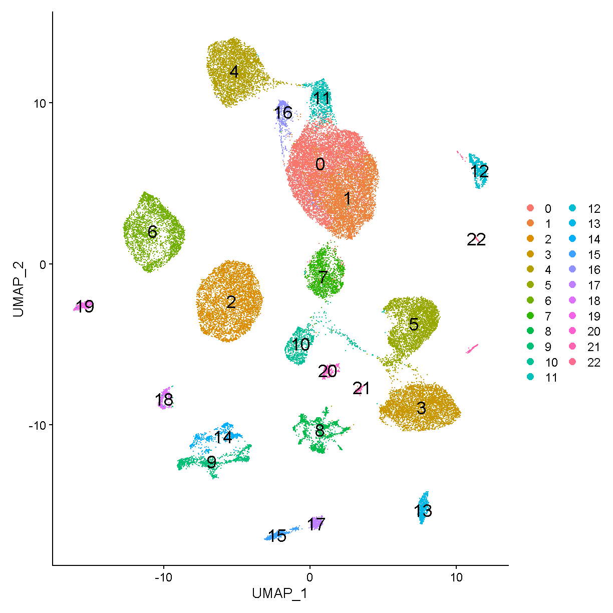

---
# Please do not edit this file directly; it is auto generated.
# Instead, please edit 05-Common-Analyses.md in _episodes_rmd/
source: Rmd
title: "Common Analyses"
teaching: 10
exercises: 2
questions:
- "What are the most common single cell RNAseq analyses?"
objectives:
- "Explain how to use RMarkdown with the new lesson template."
- "Demonstrate how to include pieces of code, figures, and challenges."
keypoints:
- "Edit the .Rmd files not the .md files"
- "Run `make serve` to knit documents and preview lesson website locally"
---

## Read Data from Previous Lesson

~~~
liver = readRDS(file.path(data_dir, 'lesson04.rds'))
~~~
{: .language-r}

## Normalization (log and more specialized) 

### Log Normalization

> TBD: How do we show a histogram of the unnormalized and normalized values?

The count data is usually log-normally distributed. Many statistical methods work best when the data is normally distributed. 

~~~
liver <- liver %>%
              NormalizeData(normalization.method = "LogNormalize")
~~~
{: .language-r}

### Finding Variable Features

~~~
liver <- liver %>% 
              FindVariableFeatures(nfeatures = 2000)
~~~
{: .language-r}

### Scale Data

~~~
liver <- liver %>%
              ScaleData(vars.to.regress = c("percent.mt", "nCount_RNA"))
~~~
{: .language-r}

### Principal Component Analysis

~~~
liver <- liver %>%
              RunPCA(verbose = FALSE, npcs = 100)
~~~
{: .language-r}

## Dimensionality reduction (UMAP, tSNE, etc) 

> Uniform Manifold Approximation and Projection (UMAP) [van der Maaten & Hinton, 2008](https://www.jmlr.org/papers/volume9/vandermaaten08a/vandermaaten08a.pdf).
> t-Distributed Stochastic Neighbor Embedding (t-SNE) [McUnnes et al](https://arxiv.org/abs/1802.03426) 

## Clustering 

~~~
ElbowPlot(liver, ndims = 100) + geom_vline(xintercept = 27)
~~~
{: .language-r}

~~~
num_pc <- 27
liver <- FindNeighbors(liver, reduction = 'pca', 
                       dims = 1:num_pc, verbose = FALSE) %>%
           FindClusters(verbose = FALSE, resolution = 0.8) %>%
           RunUMAP(reduction = 'pca', dims = 1:num_pc, verbose = FALSE)
~~~
{: .language-r}

~~~
Warning: The default method for RunUMAP has changed from calling Python UMAP via reticulate to the R-native UWOT using the cosine metric
To use Python UMAP via reticulate, set umap.method to 'umap-learn' and metric to 'correlation'
This message will be shown once per session
~~~
{: .warning}

## Annotating cell types (+ automated options e.g. SingleR) 

## Finding marker genes 

## Discussion of data visualization, sample of common plots

