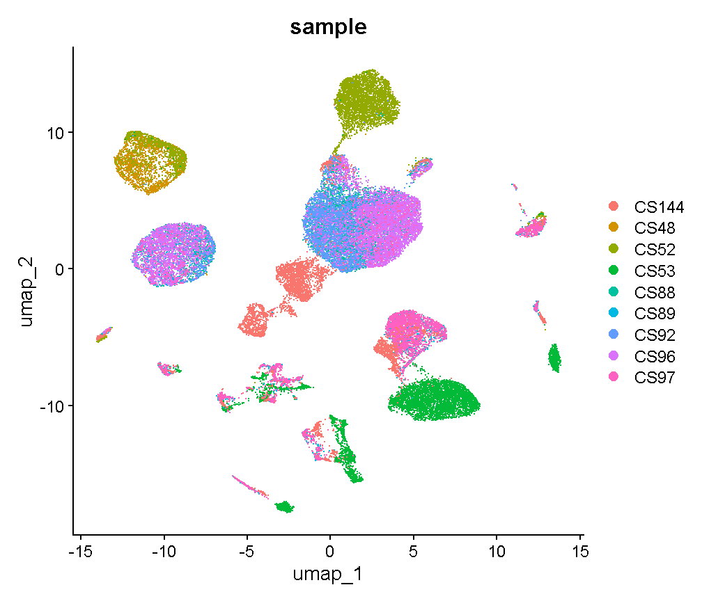
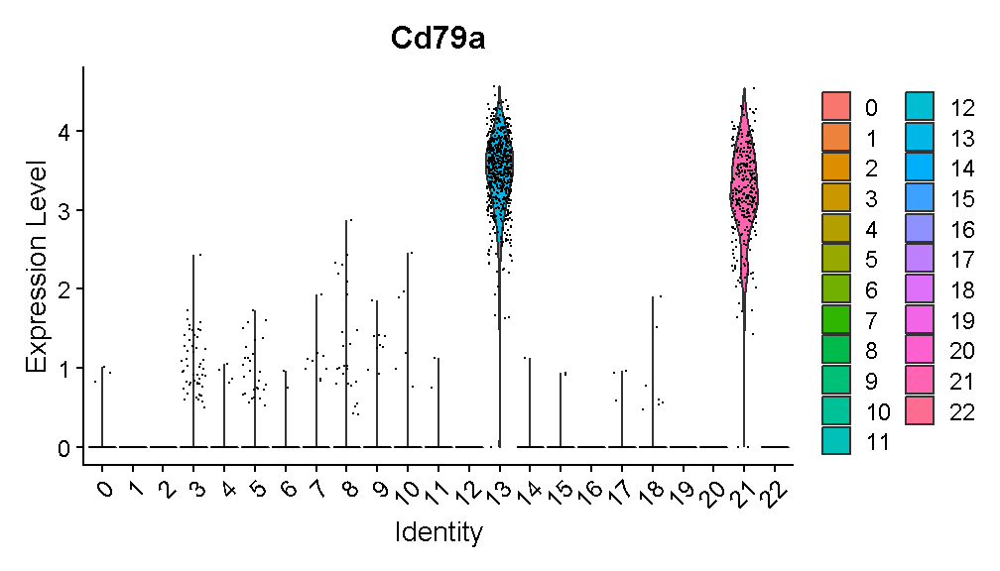
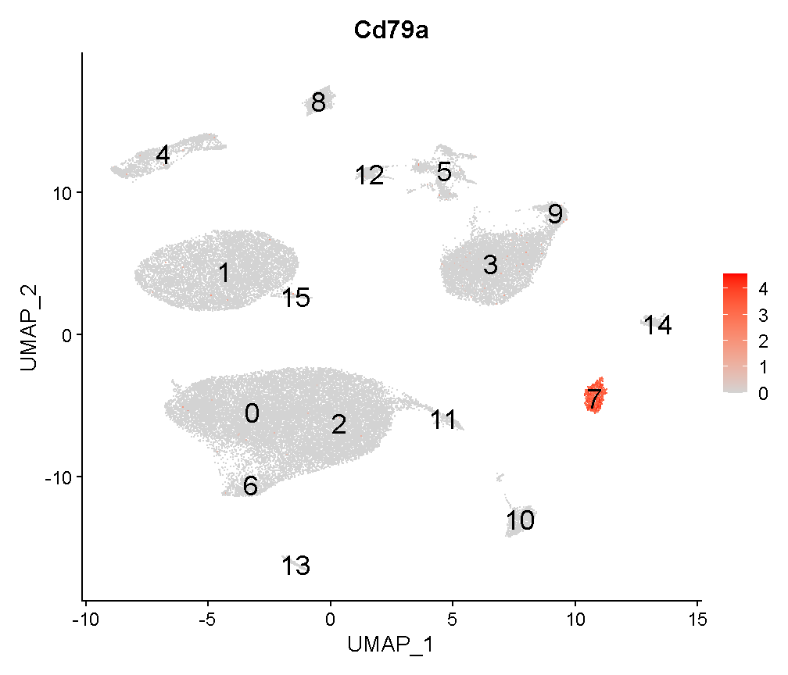
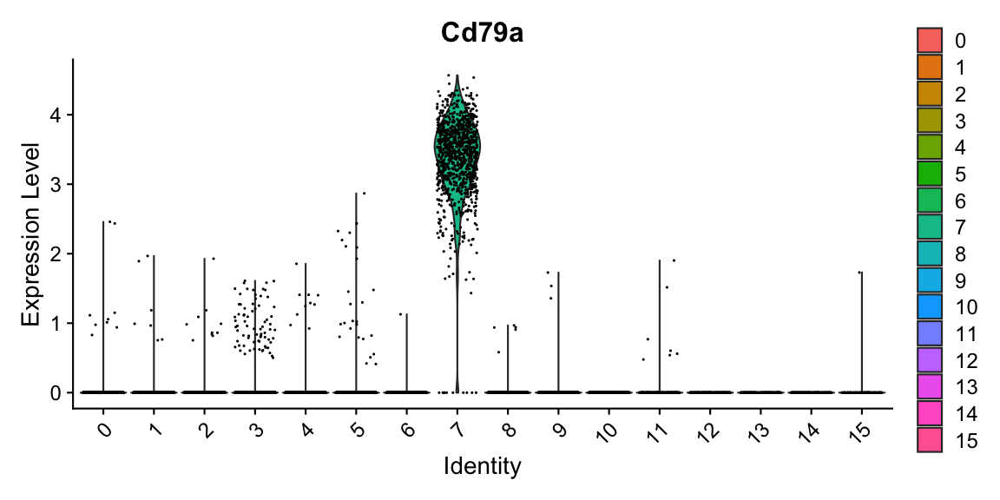
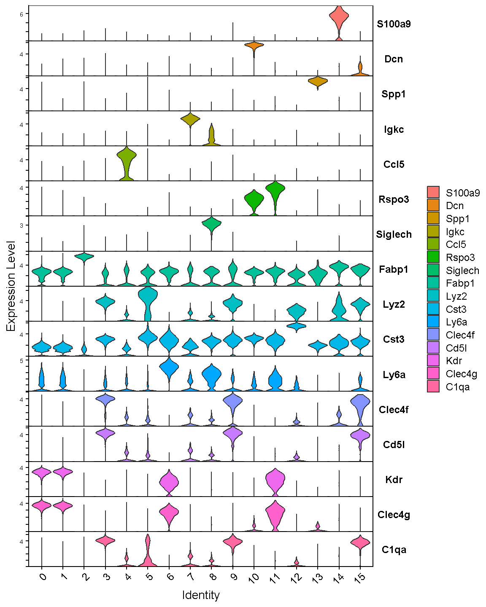
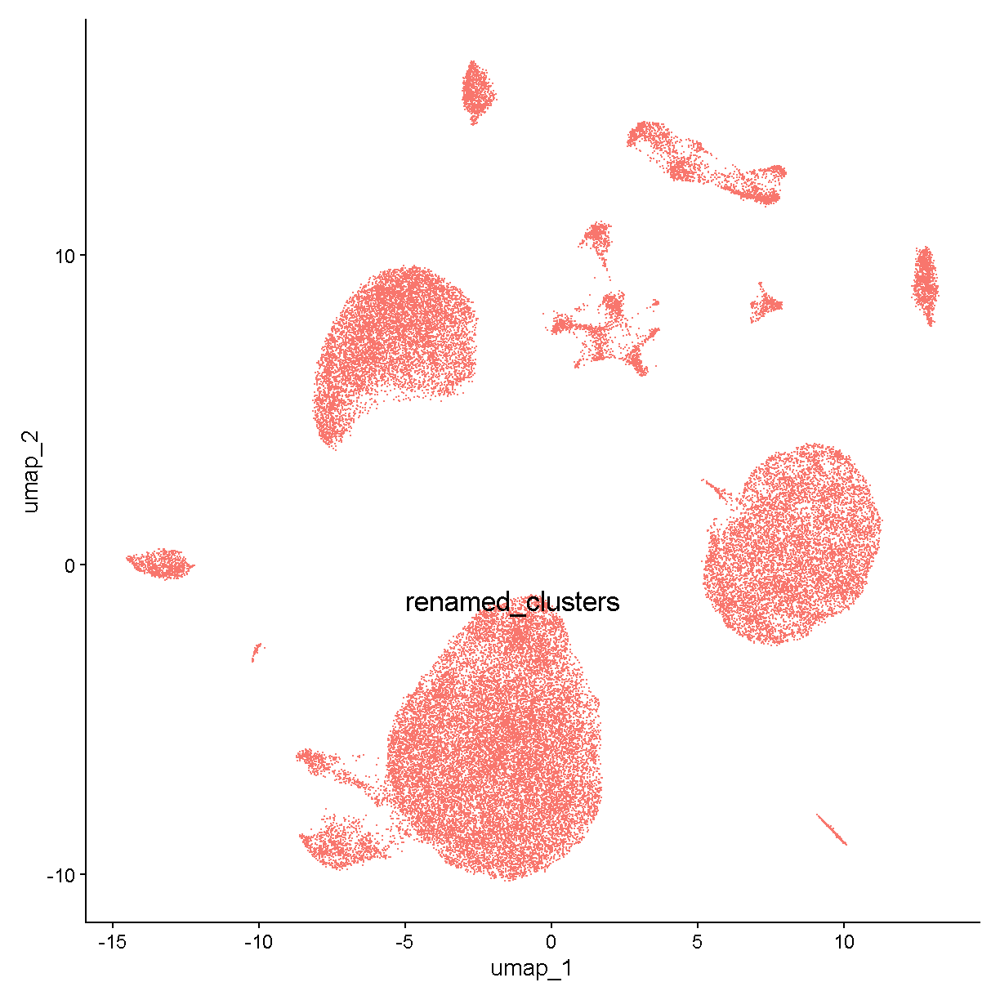
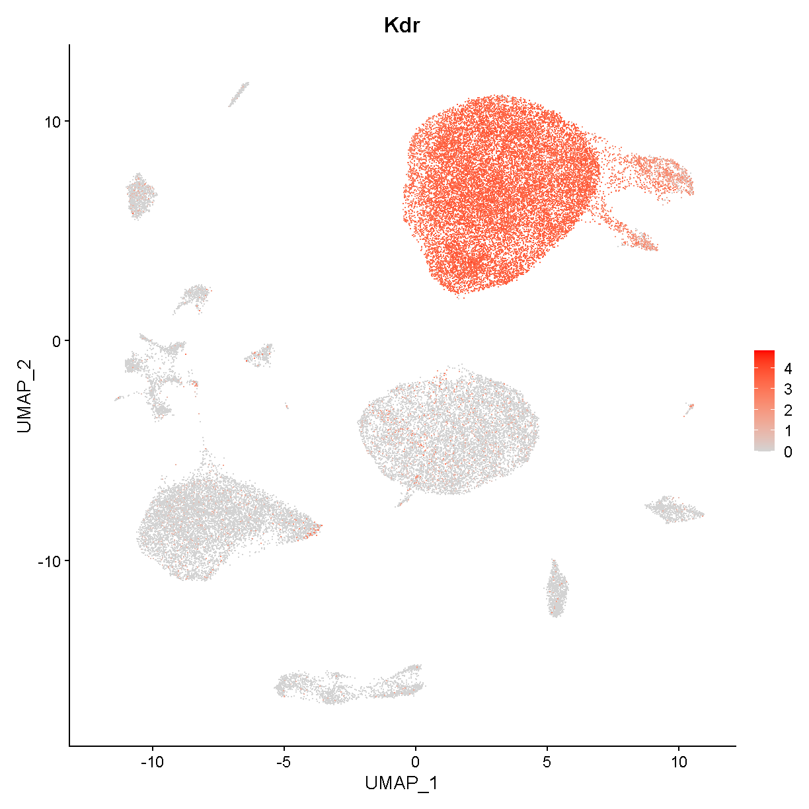
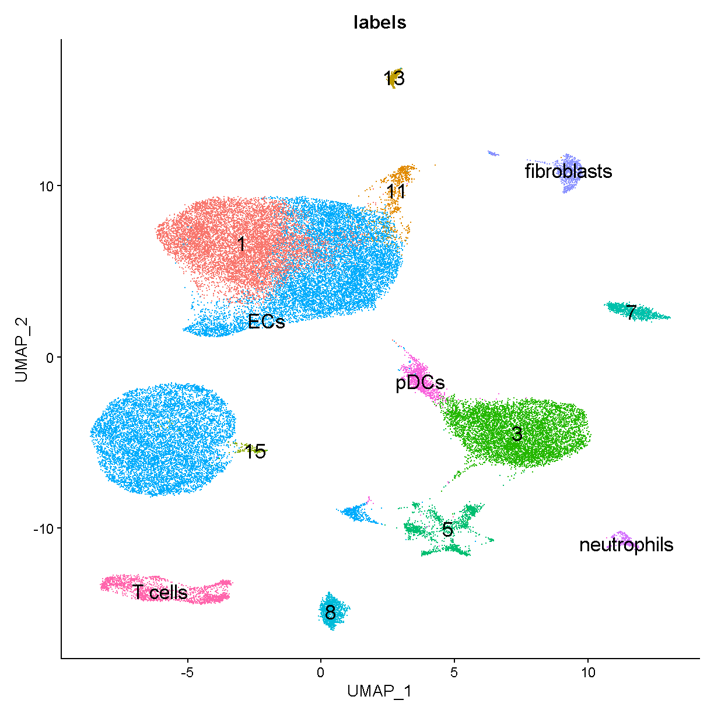

---
# Please do not edit this file directly; it is auto generated.
# Instead, please edit 06-Biology-Driven-Analyses.md in _episodes_rmd/
source: Rmd
title: "Biology Driven Analyses of scRNA-Seq"
teaching: 10
exercises: 2
questions:
- "What are some scRNA-Seq analyses that might provide me with biological insight?"
objectives:
- "Understand the ability (and limitations) of scRNA-Seq data for quantifying differences in gene expression and tissue cell composition."
- "Be able to articulate the concept of pseudotime."
- "Have basic ability to be able to conduct enrichment analyses of gene expression and look at how cells interact in scRNA-Seq"
keypoints:
- "ADD"
- "ADD"
---

## Read Data from Previous Lesson

~~~
liver <- readRDS(file.path(data_dir, 'lesson05.rds'))
~~~
{: .language-r}

## Batch correction

In bulk RNA-Seq experiments, it is usually vital that we apply a
correction for samples profiled in different batches. In single cell
RNA-Seq experiments the situation is a bit more nuanced. We certainly
want to take into consideration if our samples have been profiled in
different batches, but the point at which we do so can vary.

Consider this example. 
Distinguishing between cell types is a robust process, in fact
we can do a fairly good job distinguishing major cell types
with just a few dozen genes.
We might expect that batch effects are small enough that they would
not strongly impede our ability to identify cell types.
We could do clustering and cell type identification, then when
we are doing differential expression testing we could include a covariate
for batch.
This is an example where we would be appropriately considering batch,
but not at *every* step in the analysis.

In contrast, in these liver data, we are going to show an 
example of why batch correction earlier in the analytical
process can be helpful.
The reason this section is included in the lesson on
"biology-driven" analyses is that we will bring in some understanding
of biology to show a specific example of cells that were separated
(in UMAP space and in different clusters)
by an unknown batch-related factor when they should have been 
clustering together as the same cell type.

We don't know much about when these liver samples were profiled
and what differences in the mice, equipment, or operators there 
could have been. 
There are 9 mice that were profiled
in the data we are looking at.
Let's start by looking at whether specific cell clusters in our 
clustering + UMAP are derived largely from one or a few samples.

~~~
table(liver$sample, liver$seurat_clusters)
~~~
{: .language-r}

~~~
       
           0    1    2    3    4    5    6    7    8    9   10   11   12   13
  CS144   73    9    1   20  866    4    2 1739   78    7  135  860   35    0
  CS48     2    0   12    0    0   49 2026    2    0    0    8    0    0    0
  CS52     1    0    1    0    0 3815  941    0    1    5   46    0   86   24
  CS53     0    0    1 4294    4    5    8    0  657 1161    0    0    8  632
  CS88  3854  218 1154    0    4    8    1    1    5    0  207    0    4    0
  CS89   152  116  381    2  691    0    0    0  200    0   13    1  155    0
  CS92  3589  111  980    1    4   10    6    2    1    0  195    0    4    0
  CS96   346 4298 1965    0    3    0    1    0    4    0  310    0    3    0
  CS97   107  276  309   10 2322    0    1    0  576    1   20    1  434    0
       
          14   15   16   17   18   19   20   21   22
  CS144  275   74   51    0   34   87   31  162   12
  CS48     0    0    5    0    0   10    0    0    0
  CS52     0    0   35    0    0   71    0    1    8
  CS53     0    2    0  402  161    0   51    1    0
  CS88     0    0  125    0    0   39    2    0   24
  CS89   125  143    6    0   57    4   75   57    3
  CS92     0    0  105    0    0   36    1    0   16
  CS96     0    0  197    0    1   73    2    0   37
  CS97   246  330    9    0  141    7  153   90    1
~~~
{: .output}

Notice cluster 13. Most of the cells are derived from mouse CS53.
Let's look into this a little further.
First we plot the cells in UMAP space colored by mouse of origin,
demonstrating some fairly clear batch effects -- indicated by

 * cell clusters that contain dots of only one or a few colors
 * clusters of different colors that are near each other but not overlapping

~~~
UMAPPlot(liver, group.by = 'sample', pt.size = 0.1)
~~~
{: .language-r}

Digging into cluster 13, let's see what genes this cluster
expresses

~~~
markers13 <- FindMarkers(liver, '13', only.pos = TRUE, logfc.threshold = 1,
                         max.cells.per.ident = 500)
head(markers13, 6)
~~~
{: .language-r}

~~~
              p_val avg_log2FC pct.1 pct.2     p_val_adj
Cd79a 1.522095e-182   4.872052 0.998 0.011 3.612083e-178
Ighm  9.665832e-180   4.590161 0.998 0.088 2.293798e-175
Cd79b 4.198574e-177   4.266749 0.989 0.060 9.963636e-173
Ebf1  2.315879e-175   3.988633 0.968 0.010 5.495813e-171
Igkc  1.606549e-172   6.285021 0.974 0.058 3.812501e-168
Iglc2 3.423270e-164   4.173198 0.939 0.015 8.123761e-160
~~~
{: .output}

We'll talk in detail about the information in this type of table later.
For now, just be aware that these are genes that are expressed much more
highly in cluster 13 than in the other cells.

Look at the genes we are finding. These genes are expressed in almost
all cells of cluster 13 (column `pct.1`) and in few of the cells in other
clusters (column `pct.2`). 
An immunologist would likely recognize these as B cell genes. The gene 
Cd79a is very frequently captured well in single cell transcriptomics and
is highly specific to B cells. Let's look at where Cd79a is expressed.

~~~
VlnPlot(liver, 'Cd79a')
~~~
{: .language-r}

Expression of this gene is very clearly **ON** in clusters 13 and 21, 
and **OFF** in all other clusters. Let's look at where clusters 13 and 21
are:

~~~
FeaturePlot(liver, "Cd79a", cols = c('lightgrey', 'red'), 
            label = TRUE, label.size = 6)
~~~
{: .language-r}

Interesting. Clusters 13 and 21 are right next to each other. Recall that
we saw that cluster 13 cells are largely derived from a single mouse.
Looking at cluster 21:

~~~
table(liver$sample[liver$seurat_clusters == '21'])
~~~
{: .language-r}

~~~

CS144  CS52  CS53  CS89  CS97 
  162     1     1    57    90 
~~~
{: .output}

we can see that this cluster contains cells from several mice. 
Both clusters 13 and 21 are B cells -- you can verify this on your own by 
looking at expression of other B cell marker genes. 
It is unlikely that there would be heterogeneous types of B cells that
segregate almost perfectly between different batches. Rather, it seems that
there is some batch-driven pattern in gene expression that is causing
these cells to cluster separately when they should cluster 
together.

In the liver cell atlas paper 
[Guilliams et al](https://www.cell.com/cell/fulltext/S0092-8674(21)01481-1)
from which we obtained these data, the authors applied a batch
correction across samples. They used a method called harmony. 
We will run harmony on the subset of data that we are working with. 
We expect that a successful batch correction algorithm will bring the cells
in clusters 13 and 21 together into a single cluster.

Harmony is an algorithm that projects cells into a shared low-dimensional embedding.
In an iterative process, harmony learns cell-specific linear adjustment
factors in order to integrate datasets in a way that favors clusters 
containing cells from multiple datasets. At the same time, the method has
features that allow it to maintain separation of cell clusters that are
unique to particular datasets. 
The harmony method is described in 
[Korsunsky et al. 2019](https://www.nature.com/articles/s41592-019-0619-0)
and has a website at [this link](https://portals.broadinstitute.org/harmony/).
The following animation, available from 
[this link](https://slowkow.com/notes/harmony-animation/)
in a beautiful and comprehensive workup by 
[Kamil Slowikowski](https://slowkow.com/), shows in a visual manner
how cells from different donors are integrated together 

<!--  -->

Let's run harmony on the liver data. Harmony itself returns a
low-dimensional embedding of the cells, much like the reduced dimensional
embedding of cells that we previously produced in PC-space.
Recall that we performed clustering and projection to two dimensions with 
UMAP all using the PCA dimension reduction. We will now redo those 
steps but use the *harmony* reduction instead.
Note that harmony has several parameters that could be tweaked. The most
important may be theta. Higher values of theta force more mixing across 
batches. We will use the same values of each parameter that the authors
of the liver cell atlas used -- their code is available at 
[this link](https://github.com/guilliottslab/scripts_GuilliamsEtAll_Cell2022/blob/main/3b_Harmony.R).

After we run harmony using the same parameters the authors used, we will
look at the harmony components and decide how many to use -- in a way
analogous to deciding how many PCs to use for UMAP and clustering.

~~~
# Store old UMAP and old clusters
liver$before_harmony_clusters <- liver$seurat_clusters
liver@misc$noharmony_umap <- liver@reductions$umap

# Run harmony
liver <- RunHarmony(liver, 'sample', assay.use='RNA',
           theta=1, dims.use=1:40, max.iter.harmony=100)
ElbowPlot(liver, reduction = 'harmony', ndims = 40)
~~~
{: .language-r}

Let's again pick 24 dimensions, just like we looked at 24 dimensions
in PC space.

~~~
liver <- FindNeighbors(liver, reduction='harmony', dims=1:24) %>%
    FindClusters(verbose=FALSE, resolution=0.3) %>%
    RunUMAP(dims=1:24, reduction='harmony')
~~~
{: .language-r}

~~~
Computing nearest neighbor graph
~~~
{: .output}

~~~
Computing SNN
~~~
{: .output}

~~~
Warning: The default method for RunUMAP has changed from calling Python UMAP via reticulate to the R-native UWOT using the cosine metric
To use Python UMAP via reticulate, set umap.method to 'umap-learn' and metric to 'correlation'
This message will be shown once per session
~~~
{: .warning}

~~~
14:12:03 UMAP embedding parameters a = 0.9922 b = 1.112
~~~
{: .output}

~~~
14:12:03 Read 44253 rows and found 24 numeric columns
~~~
{: .output}

~~~
14:12:03 Using Annoy for neighbor search, n_neighbors = 30
~~~
{: .output}

~~~
14:12:03 Building Annoy index with metric = cosine, n_trees = 50
~~~
{: .output}

~~~
0%   10   20   30   40   50   60   70   80   90   100%
~~~
{: .output}

~~~
[----|----|----|----|----|----|----|----|----|----|
~~~
{: .output}

~~~
**************************************************|
14:12:07 Writing NN index file to temp file C:\Users\c-dgatti\AppData\Local\Temp\Rtmp6dONFV\filee6c7e1f840
14:12:07 Searching Annoy index using 1 thread, search_k = 3000
14:12:17 Annoy recall = 100%
14:12:18 Commencing smooth kNN distance calibration using 1 thread with target n_neighbors = 30
14:12:20 Initializing from normalized Laplacian + noise (using irlba)
14:12:28 Commencing optimization for 200 epochs, with 1893320 positive edges
14:13:04 Optimization finished
~~~
{: .output}

~~~
liver$after_harmony_clusters <- liver$seurat_clusters
~~~
{: .language-r}

Now let's see where the cells from the former
clusters 13 and 21 appear in our new clustering.

~~~
table(liver$before_harmony_clusters, 
      liver$after_harmony_clusters)[c('13', '21'), ]
~~~
{: .language-r}

~~~
    
       0   1   2   3   4   5   6   7   8   9  10  11  12  13  14  15
  13   0   0   0   0   0   0   0 656   0   0   0   0   0   0   0   0
  21   0   0   0   0   0   1   0 310   0   0   0   0   0   0   0   0
~~~
{: .output}

These cells are *all* in the new cluster 8. This cluster
exclusively expresses the B cell gene Cd79a, suggesting that the
harmony batch correction has accomplished the task that we had hoped.

~~~
FeaturePlot(liver, 'Cd79a', cols = c('lightgrey', 'red'), label = T, 
            label.size = 6)
~~~
{: .language-r}

~~~
VlnPlot(liver, 'Cd79a')
~~~
{: .language-r}

We will work with the harmony clusters from this point forward.
In a real analysis we should spend more time trying different
parameters and verifying that our results are robust to a variety of
different choices. We might also examine other cell clusters that 
were specific to one batch in an effort to determine whether they
are like this B cell example and *should* be better aligned between 
batches, or whether the cells are truly unique to that batch and 
*should not* be aligned with cells present in other batches.

## Finding marker genes 

Now we will find marker genes for our clusters. Finding marker genes takes a
while so we will downsample our data to speed up the process.
The `downsample` argument to the `subset()` function means that Seurat
will take a random 300 (maximum) cells from each cluster in our
`liver_mini` object.
Even with the downsampled data this marker-finding will take a few minutes.

~~~
liver_mini <- subset(liver, downsample = 300)
markers <- FindAllMarkers(liver_mini, only.pos = TRUE, 
    logfc.threshold	= log2(1.25), min.pct = 0.2) 
~~~
{: .language-r}

These cluster marker genes are very useful. By definition, the 
marker genes vary in expression between the cells in our dataset.
Therefore each gene is helping to capture some aspect of the 
cellular heterogeneity found within the liver tissue we profiled.

The most important task we will carry out using our marker genes is
the identification of cell type labels for each cluster.
One approach to obtaining cell type labels is to use an automated
method like `SingleR`, which was introduced in 
[Aran et al. 2019](https://doi.org/10.1038/s41590-018-0276-y)
and has a companion Bioconductor package
[here](https://bioconductor.org/packages/release/bioc/html/SingleR.html).
This method 
> performs unbiased cell type recognition from single-cell RNA sequencing 
> data, by leveraging reference transcriptomic datasets of pure cell 
> types to infer the cell of origin of each single cell independently.

A method like `SingleR` is a great option for taking a first look at your
data and getting a sanity check for what cell types are present.
However, we find that the reference cell type data are often insufficient
to categorize the full cellular diversity in many datasets. 
An automated method might be a great way to initially identify 
T cells, macrophages, or fibroblasts -- but might struggle with 
categorizing more detailed subsets like inflammatory macrophages or
activated fibroblasts.

The "classic" way to identify cell types in your scRNA-Seq data
is by looking at the marker genes and manually labelling each cell type.
This manual method has been used ever since the first single cell 
transcriptomic studies of tissue cellular heterogeneity. 
There are both advantages and disadvantages to the manual approach.
The advantages include:

 * The ability to utilize considerable subjective judgement -- after all, you
 should be familiar with the tissue you are looking at and you can label
 cells with arbitrary levels of precision and descriptiveness
 * The possibility to identify cells that are not well represented in 
 existing data/databases like that used by `SingleR`
 
Disadvantages include:

 * This method can be slow and tedious
 * Your biological knowledge of the tissue might cause you to mislabel cells

We will show an example of this type of cell type identification
below.

One could also integrate your data with other existing datasets
that have cell labels, and do label transfer. There is more information
on this topic in lesson 7 where you will have the opportunity to
(potentially) try out this approach on your own data.
This is a very useful approach that is likely to become 
increasingly useful as the scientific community accumulates more
and more scRNA-Seq datasets.

## Identifying cell types

Let's plot the expression of some of the major cell type
markers. Look at the data.frame `markers` for a summary of the
markers we found above. We'll massage the `markers` data.frame into a
more tidy format:

~~~
old_markers <- markers
markers <- as_tibble(markers) %>% 
  select(cluster, gene, avg_log2FC, pct.1, pct.2, p_val_adj)
head(markers, 6)
~~~
{: .language-r}

~~~
# A tibble: 6 x 6
  cluster gene    avg_log2FC pct.1 pct.2 p_val_adj
  <fct>   <chr>        <dbl> <dbl> <dbl>     <dbl>
1 0       Oit3          2.31 0.99  0.184 7.13e-253
2 0       Adam23        2.17 0.93  0.16  4.57e-238
3 0       Flt4          2.11 0.973 0.187 5.57e-236
4 0       Fam167b       2.29 0.987 0.214 2.68e-228
5 0       Cldn5         2.17 0.977 0.182 5.90e-227
6 0       Stab2         2.44 0.973 0.22  2.58e-226
~~~
{: .output}

In the `markers` tibble, the columns have the following meanings:

 * cluster -- the cluster in which expression of the marker gene is enriched
 * gene -- the gene that has high expression in this cluster
 * avg_log2FC -- the log2 fold change difference in expression of the gene
 between this cluster compared to *all* the rest of the cells
 * pct.1 -- the fraction of cells in this cluster that express the gene 
 (expression is just quantified as a nonzero count for this gene)
 * pct.2 -- the fraction of cells *not* in this cluster (i.e. all other cells)
 that express the gene 
 * p_val_adj -- a multiple testing corrected p-value (Bonferroni 
 corrected) for the marker indicating
 the significance of expression enrichment in this cluster compared to all
 other cells
 
You should be aware of one weakness of finding cell types using this approach. 
As mentioned above, this marker gene-finding function compares expression
of a gene in cluster X to expression of the gene in all other cells. But 
what if a gene is highly expressed in cluster X and in some other tiny 
cluster, cluster Y? If we compare cluster X to all other cells, it will look 
like the gene is specific to cluster X, when really the gene is
specific to both clusters X and Y. One could modify the marker gene-finding
function to compare all clusters in a pairwise fashion and then unify
the results in order to get around this issue.
Dan Skelly has some code available 
[here](https://gist.github.com/daskelly/09c1d2ae8dc3b1de1fe2ec2dbd0dd44d)
that implements such an approach in the Seurat framework, should you
wish to try it.
For this course we will not get into such a level of detail.

Let's look at the top 3 markers for each cluster:

~~~
group_by(markers, cluster) %>% arrange(desc(avg_log2FC)) %>%
  mutate(rank = 1:n()) %>%
  filter(rank <= 3) %>%
  pivot_wider(-c(avg_log2FC, pct.1, pct.2, p_val_adj), 
              names_from = 'rank', values_from = 'gene') %>%
  arrange(cluster)
~~~
{: .language-r}

~~~
# A tibble: 16 x 4
# Groups:   cluster [16]
   cluster `1`     `2`    `3`    
   <fct>   <chr>   <chr>  <chr>  
 1 0       Clec4g  Bmp2   Fcgr2b 
 2 1       Kdr     Clec4g Bmp2   
 3 2       Fabp1   Aldob  Gnmt   
 4 3       Clec4f  Cd5l   C1qb   
 5 4       Ccl5    Gzma   Nkg7   
 6 5       Lyz2    S100a4 Chil3  
 7 6       Ly6a    Efnb1  Tm4sf1 
 8 7       Igkc    Cd79a  Iglc2  
 9 8       Siglech Klk1   Ly6d   
10 9       Cd5l    Lgmn   Hmox1  
11 10      Dcn     Ecm1   Colec11
12 11      Rspo3   Fabp4  Vwf    
13 12      Cst3    H2-Ab1 Naaa   
14 13      Spp1    Clu    Tm4sf4 
15 14      S100a9  S100a8 Il1b   
16 15      C1qa    Cd5l   Slc40a1
~~~
{: .output}

Recognizing these genes might be a big challenge if you are not 
used to looking at single cell gene expression. Let's check out expression of 
the very top genes in each cell cluster:

~~~
top_markers <- group_by(markers, cluster) %>% 
  arrange(desc(avg_log2FC)) %>%
  top_n(1, avg_log2FC) %>% pull(gene)
VlnPlot(liver, features = top_markers, stack = TRUE, flip = TRUE)
~~~
{: .language-r}

What does this tell us? Well, there are some genes here that are quite
specific to one cluster (e.g. S100a9, Spp1, Ccl5, Siglech),
but there are a few markers that are not very good markers at all
(e.g. Fabp1, Cst3) and some that are not very specific 
(e.g. Clec4f, Cd5l, Kdr, Clec4g).

Let's look at one of these markers -- Kdr. Our violin plot above
shows that this gene is expressed in clusters 0, 2, 6, and 12.
If we look at a UMAP plot

~~~
UMAPPlot(liver, label = TRUE, label.size = 6) + NoLegend()
~~~
{: .language-r}

we see that these clusters are smaller bits of a large cloud of points
in UMAP space. This is probably a relatively heterogenous cell type or
or a continuum of cells (e.g. differentiating cells or cells being
activated by some stimulus). Nevertheless it is fairly clear that
these cells all express Kdr:

~~~
FeaturePlot(liver, "Kdr", cols = c('lightgrey', 'red'))
~~~
{: .language-r}

If we do some digging, we see that Kdr encodes
[vascular endothelial growth factor receptor 2](https://www.uniprot.org/uniprotkb/P35968).
In the liver, we would expect endothelial cells to be fairly 
abundant. Therefore we can already say with relatively high
confidence that clusters 0, 2, 6, and 12 are endothelial cells.

Looking again at the violin plot above, there are some genes that
are often seen in scRNA-Seq data and are excellent markers:

 * *S100a9* is a marker for neutrophils (or the broader category of granulocytes)
 * *Dcn* is a marker for fibroblasts
 * *Ccl5* (which encodes RANTES) is a marker for T cells. The T cell cluster might also include some other related immune cell types (natural killer [NK] cells and innate lymphoid cells [ILCs])
 * *Siglech* is a marker for plasmacytoid dendritic cells

We have now identified (at least tentative) cell types for clusters
0, 2, 4, 6, 9, 10, 12, and 14. Let's store our labels and look at
what remains unidentified.

~~~
labels <- tibble(cluster_num = unique(liver$after_harmony_clusters)) %>%
  mutate(cluster_num = as.character(cluster_num)) %>%
  mutate(cluster_name = case_when(
    cluster_num %in% c('0', '2', '6', '12') ~ 'ECs',   # endothelial cells
    cluster_num == '4' ~ 'T cells',
    cluster_num == '9' ~ 'pDCs',               # plasmacytoid dendritic cells
    cluster_num == '10' ~ 'fibroblasts',
    cluster_num == '14' ~ 'neutrophils',
    TRUE ~ cluster_num))

liver$labels <- deframe(labels)[as.character(liver$after_harmony_clusters)]
UMAPPlot(liver, label = TRUE, label.size = 6, group.by = 'labels') + NoLegend()
~~~
{: .language-r}

We could go through a somewhat similar exercise for the remaining
clusters. We might do some more targeted comparisons between cell
populations if we wanted to dig into differences.

In order to save time we will use annotations from the original liver
cell atlas to fill in our remaining unannotated cell populations.
These labels are:

 * clusters 0, 2, 7 are endothelial cells (Pecam1) cluster 11 is also pos
 * cluster 8 is B cells (Cd79a)
 * cluster 10 is fibroblasts (Pdgfra)
 * cluster 14 neutrophils (Retnlg, S100a8)
 * cluster 13 is cholangiocytes
 * cluster 9 is pDCs (Siglech)
 * cluster 12 is cDC1s (Xcr1)
 * cluster 4 is T, NK, ILC

## Differential expression 

Looking for differential expression can be thought of as a problem that
is related to finding cell type marker genes. Marker genes are, by definition,
genes that vary significantly between cell types. Often we are most interested
in the expression of genes that specifically mark particular cell types 
that we are interested in, but there can also be value in using broader
markers (e.g. CD45 - encoded by the gene *Ptprc* - marks all immune cells).

In scRNA-Seq, differential expression usually refers to differences
*within* a given cell type rather than *between* cell types.
For example, maybe we administer a drug and wish to see how gene 
expression of control group hepatocytes differs from
treatment group hepatocytes.

Because the liver dataset we are working with is a *cell atlas*, there is
no convenient experimental factor to use in our differential expression
comparison. Nevertheless, we will illustrate how a differential expression
test could look by making up a fake experimental factor.

~~~
libraries <- unique(liver$sample)
grp <- setNames(c(rep('control', 5), rep('drug', 4)), libraries)
~~~
{: .language-r}

We will look for differential expression between the groups defined
by this fake drug/control factor.

<!-- What do we look for differential expression between??? -->

## Pathway enrichment 

We may wish to look for enrichment of biological pathways 
in a list of genes. Here we will show two examples of completing this 
task. There are many ways to do enrichment tests, and they are
typically not conducted in a way that is unique to single cell data
thus you have a wide range of options.

 * test for enrichment of biological function for neutrophil markers,
 endothelial cell markers, hepatocyte markers
 * test for enrichment for DE genes between in vivo and ex vivo

## Differences in cell composition

Single cell transcriptomics is a very powerful method for identifying
differences in tissue cell composition. This sort of question was 
usually addressed using methods like flow cytometry in the past, but flow
cytometry requires knowing what you want to look for before you can
quantify it. In scRNA-Seq we can take an entirely unbiased view of cell
composition, and we can define cell subsets with more subtle changes in
gene expression as opposed to only looking at broad classes of cell types.

scCODA
linear modeling
propeller

## Cell-cell communication 

An analysis of possible cell-cell communication is one output that
can be inferred from scRNA-Seq data. The basic idea is that we can 
use databases of known receptor-ligand interactions in order to 
predict cells that interact. Specifically, if cell type A expresses ligand X,
and cell type B expresses the cognate receptor for ligand X, we can infer
the possibility of communication between these two cell types.
Of course scRNA-Seq data is not telling us whether that 
receptor-ligand link is actually *active* at any particular moment in time,
but it may be useful to understand which cells are communicating
most/least and how lines of communication change in, say, a 
drug-treated vs control condition.

cellchat, cellphoneDB, etc.

## Pseudotime and velocity

What is pseudotime

*slingshot*

There are many, many algorithms and software packages for inferring 
pseudotime. For a very nice list check out
[Anthony Gitter's github list](https://github.com/agitter/single-cell-pseudotime).

What is RNA velocity?

monocle
RNA velocity
scvelo

