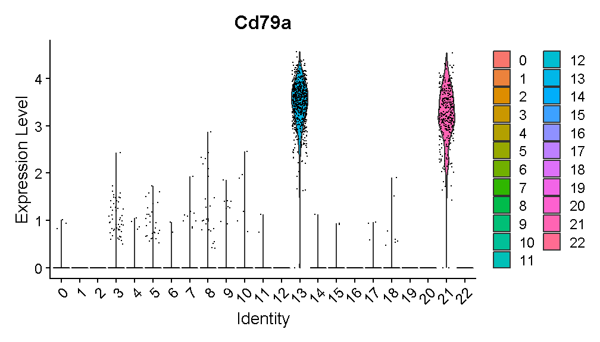
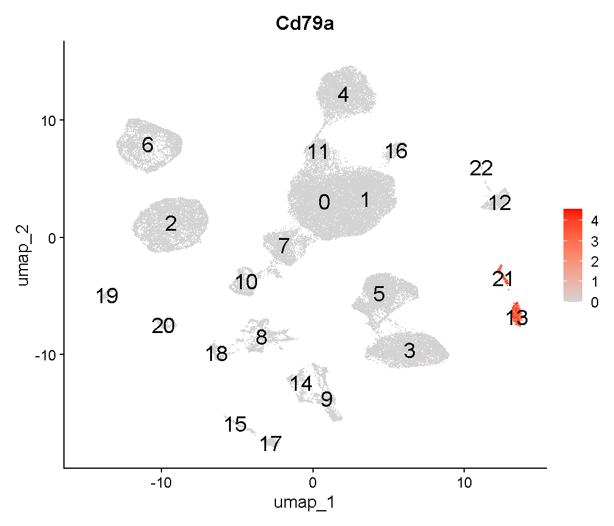
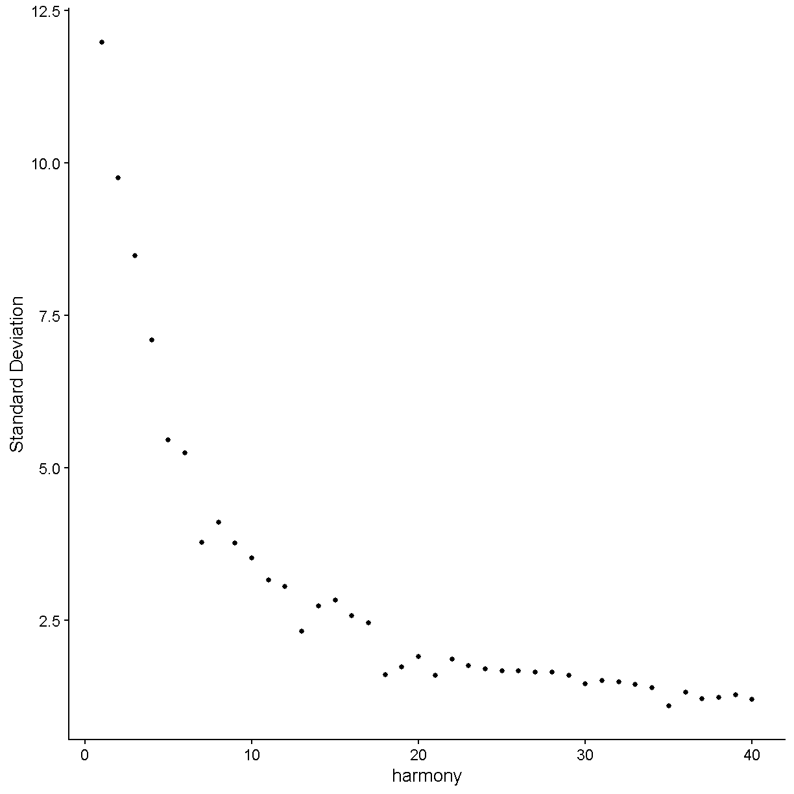

---
# Please do not edit this file directly; it is auto generated.
# Instead, please edit 06-Biology-Driven-Analyses.md in _episodes_rmd/
source: Rmd
title: "Biology Driven Analyses of scRNA-Seq"
teaching: 10
exercises: 2
questions:
- "What are some scRNA-Seq analyses that might provide me with biological insight?"
objectives:
- "Gain an understanding of some of the important caveats for identifying major cell types in scRNA-Seq."
- "Understand the ability (and limitations) of scRNA-Seq data for quantifying differences in gene expression."
- "Have basic ability to be able to conduct enrichment analyses of gene expression in scRNA-Seq."
keypoints:
- "Identifying cell types is a major objective in scRNA-Seq and can be present challenges that are unique to each dataset."
- "Statistically minded experimental design enables you to perform differential gene expression analyses that are likely to result in meaningful biological results."

---

## Read Data from Previous Lesson

~~~
liver <- readRDS(file.path(data_dir, 'lesson05.rds'))
~~~
{: .language-r}

## Batch correction

In bulk RNA-Seq experiments, it is usually vital that we apply a
correction for samples profiled in different batches. In single cell
RNA-Seq experiments the situation is a bit more nuanced. We certainly
want to take into consideration if our samples have been profiled in
different batches, but the point at which we do so can vary.

Consider this example. 
Distinguishing between cell types is a robust process, in fact
we can do a fairly good job distinguishing major cell types
with just a few dozen genes.
We might expect that batch effects are small enough that they would
not strongly impede our ability to identify cell types.
We could do clustering and cell type identification, then when
we are doing differential expression testing we could include a covariate
for batch.
This is an example where we would be appropriately considering batch,
but not at *every* step in the analysis.

In contrast, in these liver data, we are going to show an 
example of why batch correction earlier in the analytical
process can be helpful.
The reason this section is included in the lesson on
"biology-driven" analyses is that we will bring in some understanding
of biology to show a specific example of cells that were separated
(in UMAP space and in different clusters)
by an unknown batch-related factor when they should have been 
clustering together as the same cell type.

We don't know much about when these liver samples were profiled
and what differences in the mice, equipment, or operators there 
could have been. 
There are 9 mice that were profiled
in the data we are looking at.
Let's start by looking at whether specific cell clusters in our 
clustering + UMAP are derived largely from one or a few samples.

~~~
table(liver$sample, liver$seurat_clusters)
~~~
{: .language-r}

~~~
       
           0    1    2    3    4    5    6    7    8    9   10   11   12   13
  CS144   73    9    1   20  866    4    2 1739   78    7  135  860   35    0
  CS48     2    0   12    0    0   49 2026    2    0    0    8    0    0    0
  CS52     1    0    1    0    0 3815  941    0    1    5   46    0   86   24
  CS53     0    0    1 4294    4    5    8    0  657 1161    0    0    8  632
  CS88  3854  218 1154    0    4    8    1    1    5    0  207    0    4    0
  CS89   152  116  381    2  691    0    0    0  200    0   13    1  155    0
  CS92  3589  111  980    1    4   10    6    2    1    0  195    0    4    0
  CS96   346 4298 1965    0    3    0    1    0    4    0  310    0    3    0
  CS97   107  276  309   10 2322    0    1    0  576    1   20    1  434    0
       
          14   15   16   17   18   19   20   21   22
  CS144  275   74   51    0   34   87   31  162   12
  CS48     0    0    5    0    0   10    0    0    0
  CS52     0    0   35    0    0   71    0    1    8
  CS53     0    2    0  402  161    0   51    1    0
  CS88     0    0  125    0    0   39    2    0   24
  CS89   125  143    6    0   57    4   75   57    3
  CS92     0    0  105    0    0   36    1    0   16
  CS96     0    0  197    0    1   73    2    0   37
  CS97   246  330    9    0  141    7  153   90    1
~~~
{: .output}

Notice cluster 13. Most of the cells are derived from mouse CS53.
Let's look into this a little further.
First we plot the cells in UMAP space colored by mouse of origin,
demonstrating some fairly clear batch effects -- indicated by

 * cell clusters that contain dots of only one or a few colors
 * clusters of different colors that are near each other but not overlapping

~~~
UMAPPlot(liver, group.by = 'sample', pt.size = 0.1)
~~~
{: .language-r}

Digging into cluster 13, let's see what genes this cluster
expresses

~~~
markers13 <- FindMarkers(liver, '13', only.pos = TRUE, logfc.threshold = 1,
                         max.cells.per.ident = 500)
head(markers13, 6)
~~~
{: .language-r}

~~~
              p_val avg_log2FC pct.1 pct.2     p_val_adj
Cd79a 1.522095e-182   4.872052 0.998 0.011 3.612083e-178
Ighm  9.665832e-180   4.590161 0.998 0.088 2.293798e-175
Cd79b 4.198574e-177   4.266749 0.989 0.060 9.963636e-173
Ebf1  2.315879e-175   3.988633 0.968 0.010 5.495813e-171
Igkc  1.606549e-172   6.285021 0.974 0.058 3.812501e-168
Iglc2 3.423270e-164   4.173198 0.939 0.015 8.123761e-160
~~~
{: .output}

We'll talk in detail about the information in this type of table later.
For now, just be aware that these are genes that are expressed much more
highly in cluster 13 than in the other cells.

Look at the genes we are finding. These genes are expressed in almost
all cells of cluster 13 (column `pct.1`) and in few of the cells in other
clusters (column `pct.2`). 
An immunologist would likely recognize these as B cell genes. The gene 
Cd79a is very frequently captured well in single cell transcriptomics and
is highly specific to B cells. Let's look at where Cd79a is expressed.

~~~
VlnPlot(liver, 'Cd79a')
~~~
{: .language-r}

Expression of this gene is very clearly **ON** in clusters 13 and 21, 
and **OFF** in all other clusters. Let's look at where clusters 13 and 21
are:

~~~
FeaturePlot(liver, "Cd79a", cols = c('lightgrey', 'red'), 
            label = TRUE, label.size = 6)
~~~
{: .language-r}

Interesting. Clusters 13 and 21 are right next to each other. Recall that
we saw that cluster 13 cells are largely derived from a single mouse.
Looking at cluster 21:

~~~
table(liver$sample[liver$seurat_clusters == '21'])
~~~
{: .language-r}

~~~

CS144  CS52  CS53  CS89  CS97 
  162     1     1    57    90 
~~~
{: .output}

we can see that this cluster contains cells from several mice. 
Both clusters 13 and 21 are B cells -- you can verify this on your own by 
looking at expression of other B cell marker genes. 
It is unlikely that there would be heterogeneous types of B cells that
segregate almost perfectly between different batches. Rather, it seems that
there is some batch-driven pattern in gene expression that is causing
these cells to cluster separately when they should cluster 
together.

In the liver cell atlas paper 
[Guilliams et al](https://www.cell.com/cell/fulltext/S0092-8674(21)01481-1)
from which we obtained these data, the authors applied a batch
correction across samples. They used a method called harmony. 
We will run harmony on the subset of data that we are working with. 
We expect that a successful batch correction algorithm will bring the cells
in clusters 13 and 21 together into a single cluster.

Harmony is an algorithm that projects cells into a shared low-dimensional embedding.
In an iterative process, harmony learns cell-specific linear adjustment
factors in order to integrate datasets in a way that favors clusters 
containing cells from multiple datasets. At the same time, the method has
features that allow it to maintain separation of cell clusters that are
unique to particular datasets. 
The harmony method is described in 
[Korsunsky et al. 2019](https://www.nature.com/articles/s41592-019-0619-0)
and has a website at [this link](https://portals.broadinstitute.org/harmony/).
The following animation, available from 
[this link](https://slowkow.com/notes/harmony-animation/)
in a beautiful and comprehensive workup by 
[Kamil Slowikowski](https://slowkow.com/), shows in a visual manner
how cells from different donors are integrated together 

<!--  -->

Let's run harmony on the liver data. Harmony itself returns a
low-dimensional embedding of the cells, much like the reduced dimensional
embedding of cells that we previously produced in PC-space.
Recall that we performed clustering and projection to two dimensions with 
UMAP all using the PCA dimension reduction. We will now redo those 
steps but use the *harmony* reduction instead.
Note that harmony has several parameters that could be tweaked. The most
important may be theta. Higher values of theta force more mixing across 
batches. We will use the same values of each parameter that the authors
of the liver cell atlas used -- their code is available at 
[this link](https://github.com/guilliottslab/scripts_GuilliamsEtAll_Cell2022/blob/main/3b_Harmony.R).

After we run harmony using the same parameters the authors used, we will
look at the harmony components and decide how many to use -- in a way
analogous to deciding how many PCs to use for UMAP and clustering.

~~~
# Store old UMAP and old clusters
liver$before_harmony_clusters <- liver$seurat_clusters
liver@misc$noharmony_umap <- liver@reductions$umap

# Run harmony
liver <- RunHarmony(liver, 'sample', assay.use='RNA',
           theta=1, dims.use=1:40, max.iter.harmony=100)
ElbowPlot(liver, reduction = 'harmony', ndims = 40)
~~~
{: .language-r}

Let's again pick 24 dimensions, just like we looked at 24 dimensions
in PC space.

~~~
liver <- FindNeighbors(liver, reduction='harmony', dims=1:24) %>%
    FindClusters(verbose=FALSE, resolution=0.3) %>%
    RunUMAP(dims=1:24, reduction='harmony')
~~~
{: .language-r}

~~~
Computing nearest neighbor graph
~~~
{: .output}

~~~
Computing SNN
~~~
{: .output}

~~~
07:23:12 UMAP embedding parameters a = 0.9922 b = 1.112
~~~
{: .output}

~~~
07:23:12 Read 44253 rows and found 24 numeric columns
~~~
{: .output}

~~~
07:23:12 Using Annoy for neighbor search, n_neighbors = 30
~~~
{: .output}

~~~
07:23:12 Building Annoy index with metric = cosine, n_trees = 50
~~~
{: .output}

~~~
0%   10   20   30   40   50   60   70   80   90   100%
~~~
{: .output}

~~~
[----|----|----|----|----|----|----|----|----|----|
~~~
{: .output}

~~~
**************************************************|
07:23:17 Writing NN index file to temp file C:\Users\c-dgatti\AppData\Local\Temp\Rtmp2D9H65\file35e862294b6a
07:23:17 Searching Annoy index using 1 thread, search_k = 3000
07:23:31 Annoy recall = 100%
07:23:32 Commencing smooth kNN distance calibration using 1 thread with target n_neighbors = 30
07:23:35 Initializing from normalized Laplacian + noise (using irlba)
07:23:46 Commencing optimization for 200 epochs, with 1893320 positive edges
07:24:33 Optimization finished
~~~
{: .output}

~~~
liver$after_harmony_clusters <- liver$seurat_clusters
~~~
{: .language-r}

Now let's see where the cells from the former
clusters 13 and 21 appear in our new clustering.

~~~
table(liver$before_harmony_clusters, 
      liver$after_harmony_clusters)[c('13', '21'), ]
~~~
{: .language-r}

~~~
    
       0   1   2   3   4   5   6   7   8   9  10  11  12  13  14  15
  13   0   0   0   0   0   0   0 656   0   0   0   0   0   0   0   0
  21   0   0   0   0   0   1   0 310   0   0   0   0   0   0   0   0
~~~
{: .output}

These cells are *all* in the new cluster 8. This cluster
exclusively expresses the B cell gene Cd79a, suggesting that the
harmony batch correction has accomplished the task that we had hoped.

~~~
FeaturePlot(liver, 'Cd79a', cols = c('lightgrey', 'red'), label = T, 
            label.size = 6)
~~~
{: .language-r}

~~~
VlnPlot(liver, 'Cd79a')
~~~
{: .language-r}

We will work with the harmony clusters from this point forward.
In a real analysis we should spend more time trying different
parameters and verifying that our results are robust to a variety of
different choices. We might also examine other cell clusters that 
were specific to one batch in an effort to determine whether they
are like this B cell example and *should* be better aligned between 
batches, or whether the cells are truly unique to that batch and 
*should not* be aligned with cells present in other batches.

## Finding marker genes 

Now we will find marker genes for our clusters. Finding marker genes takes a
while so we will downsample our data to speed up the process.
The `downsample` argument to the `subset()` function means that Seurat
will take a random 300 (maximum) cells from each cluster in our
`liver_mini` object.
Even with the downsampled data this marker-finding will take a few minutes.

~~~
liver_mini <- subset(liver, downsample = 300)
markers <- FindAllMarkers(liver_mini, only.pos = TRUE, 
    logfc.threshold	= log2(1.25), min.pct = 0.2) 
~~~
{: .language-r}

These cluster marker genes are very useful. By definition, the 
marker genes vary in expression between the cells in our dataset.
Therefore each gene is helping to capture some aspect of the 
cellular heterogeneity found within the liver tissue we profiled.

The most important task we will carry out using our marker genes is
the identification of cell type labels for each cluster.
One approach to obtaining cell type labels is to use an automated
method like `SingleR`, which was introduced in 
[Aran et al. 2019](https://doi.org/10.1038/s41590-018-0276-y)
and has a companion Bioconductor package
[here](https://bioconductor.org/packages/release/bioc/html/SingleR.html).
This method 
> performs unbiased cell type recognition from single-cell RNA sequencing 
> data, by leveraging reference transcriptomic datasets of pure cell 
> types to infer the cell of origin of each single cell independently.

A method like `SingleR` is a great option for taking a first look at your
data and getting a sanity check for what cell types are present.
However, we find that the reference cell type data are often insufficient
to categorize the full cellular diversity in many datasets. 
An automated method might be a great way to initially identify 
T cells, macrophages, or fibroblasts -- but might struggle with 
categorizing more detailed subsets like inflammatory macrophages or
activated fibroblasts.

The "classic" way to identify cell types in your scRNA-Seq data
is by looking at the marker genes and manually labelling each cell type.
This manual method has been used ever since the first single cell 
transcriptomic studies of tissue cellular heterogeneity. 
There are both advantages and disadvantages to the manual approach.
The advantages include:

 * The ability to utilize considerable subjective judgement -- after all, you
 should be familiar with the tissue you are looking at and you can label
 cells with arbitrary levels of precision and descriptiveness
 * The possibility to identify cells that are not well represented in 
 existing data/databases like that used by `SingleR`
 
Disadvantages include:

 * This method can be slow and tedious
 * Your biological knowledge of the tissue might cause you to mislabel cells

We will show an example of this type of cell type identification
below.

One could also integrate your data with other existing datasets
that have cell labels, and do label transfer. There is more information
on this topic in lesson 7 where you will have the opportunity to
(potentially) try out this approach on your own data.
This is a very useful approach that is likely to become 
increasingly useful as the scientific community accumulates more
and more scRNA-Seq datasets.

## Identifying cell types

Let's plot the expression of some of the major cell type
markers. Look at the data.frame `markers` for a summary of the
markers we found above. We'll massage the `markers` data.frame into a
more tidy format:

~~~
old_markers <- markers
markers <- as_tibble(markers) %>% 
  select(cluster, gene, avg_log2FC, pct.1, pct.2, p_val_adj)
head(markers, 6)
~~~
{: .language-r}

~~~
# A tibble: 6 × 6
  cluster gene   avg_log2FC pct.1 pct.2 p_val_adj
  <fct>   <chr>       <dbl> <dbl> <dbl>     <dbl>
1 0       Oit3         2.40 0.99  0.176 2.08e-268
2 0       Cyp4b1       2.15 0.977 0.168 7.00e-256
3 0       Flt4         2.21 0.96  0.169 4.69e-255
4 0       Stab2        2.50 0.987 0.194 1.60e-253
5 0       Adam23       2.17 0.927 0.15  1.70e-245
6 0       Cldn5        2.21 0.973 0.165 1.49e-241
~~~
{: .output}

In the `markers` tibble, the columns have the following meanings:

 * cluster -- the cluster in which expression of the marker gene is enriched
 * gene -- the gene that has high expression in this cluster
 * avg_log2FC -- the log2 fold change difference in expression of the gene
 between this cluster compared to *all* the rest of the cells
 * pct.1 -- the fraction of cells in this cluster that express the gene 
 (expression is just quantified as a nonzero count for this gene)
 * pct.2 -- the fraction of cells *not* in this cluster (i.e. all other cells)
 that express the gene 
 * p_val_adj -- a multiple testing corrected p-value (Bonferroni 
 corrected) for the marker indicating
 the significance of expression enrichment in this cluster compared to all
 other cells
 
You should be aware of one weakness of finding cell types using this approach. 
As mentioned above, this marker gene-finding function compares expression
of a gene in cluster X to expression of the gene in all other cells. But 
what if a gene is highly expressed in cluster X and in some other tiny 
cluster, cluster Y? If we compare cluster X to all other cells, it will look 
like the gene is specific to cluster X, when really the gene is
specific to both clusters X and Y. One could modify the marker gene-finding
function to compare all clusters in a pairwise fashion and then unify
the results in order to get around this issue.
Dan Skelly has some code available 
[here](https://gist.github.com/daskelly/09c1d2ae8dc3b1de1fe2ec2dbd0dd44d)
that implements such an approach in the Seurat framework, should you
wish to try it.
For this course we will not get into such a level of detail.

Let's look at the top 3 markers for each cluster:

~~~
group_by(markers, cluster) %>% 
  top_n(3, avg_log2FC) %>%
  pivot_wider(-c(avg_log2FC, pct.1, pct.2, p_val_adj), 
              names_from = 'rank', values_from = 'gene') %>%
  arrange(cluster)
~~~
{: .language-r}

~~~
Error in `build_wider_spec()`:
! Can't subset columns that don't exist.
✖ Column `rank` doesn't exist.
~~~
{: .error}

Recognizing these genes might be a big challenge if you are not 
used to looking at single cell gene expression. Let's check out expression of 
the very top genes in each cell cluster:

~~~
top_markers <- group_by(markers, cluster) %>% 
  arrange(desc(avg_log2FC)) %>%
  top_n(1, avg_log2FC) %>% pull(gene)
VlnPlot(liver, features = top_markers, stack = TRUE, flip = TRUE)
~~~
{: .language-r}

What does this tell us? Well, there are some genes here that are quite
specific to one cluster (e.g. S100a9, Spp1, Ccl5, Siglech),
but there are a few markers that are not very good markers at all
(e.g. Fabp1, Cst3) and some that are not very specific 
(e.g. Clec4f, Cd5l, Kdr, Clec4g).

Let's look at one of these last kinds of markers -- Kdr. Our violin plot above
shows that this gene is expressed in clusters 0, 2, 6, and 12.
If we look at a UMAP plot

~~~
UMAPPlot(liver, label = TRUE, label.size = 6) + NoLegend()
~~~
{: .language-r}

we see that these clusters are smaller bits of a large cloud of points
in UMAP space. This is probably a relatively heterogenous cell type or
or a continuum of cells (e.g. differentiating cells or cells being
activated by some stimulus). Nevertheless it is fairly clear that
these cells all express Kdr:

~~~
FeaturePlot(liver, "Kdr", cols = c('lightgrey', 'red'))
~~~
{: .language-r}

If we do some digging, we see that Kdr encodes
[vascular endothelial growth factor receptor 2](https://www.uniprot.org/uniprotkb/P35968).
In the liver, we would expect endothelial cells to be fairly 
abundant. Therefore we can already say with relatively high
confidence that clusters 0, 2, 6, and 12 are endothelial cells.

Looking again at the violin plot above, there are some genes that
are often seen in scRNA-Seq data and are excellent markers:

 * *S100a9* is a marker for neutrophils (or the broader category of granulocytes)
 * *Ccl5* (which encodes RANTES) is a marker for T cells. The T cell cluster might also include some other related immune cell types (natural killer [NK] cells and innate lymphoid cells [ILCs])
 * *Siglech* is a marker for plasmacytoid dendritic cells

We have now identified (at least tentative) cell types for clusters
0, 2, 4, 6, 9, 12, and 14. 

Let's turn to those markers that seemed to be expressed across
all or almost all cell types (recall Cst3 and Fabp1). 
Let's focus on cluster 1. This is a pretty large cluster.
In our violin plot cluster 1 is marked only by Fabp1, which is much
higher in cluster 1 than in any other cluster, but still has high background
in ALL clusters. 

Doing a bit of sleuthing, we find that Fabp1 is expressed in
hepatocytes. For example,
[this reference](https://www.ncbi.nlm.nih.gov/pmc/articles/PMC4655993/) 
says that Fabp1 is found abundantly in the cytoplasm of hepatocytes.
It also makes sense that cluster 1 is hepatocytes because this cluster 
is large and we expect a lot of hepatocytes in the liver.

However, why do we see high background levels of Fabp1?
The reason might be due to ambient RNA. If a liver cell lyses and releases 
its contents into the "soup", the cell's RNA molecules could tag along
for the ride in any droplet with any other cell type.
This ambient RNA would act as noise in the transcriptome of
each cell. The problem of ambient RNA can vary considerably between
samples. A recent paper by 
[Caglayan et al](https://pubmed.ncbi.nlm.nih.gov/36240767/) gives a nice
case study and examines the phenomenology of ambient RNA in single
nucleus RNA-Seq.
There are several methods to correct for high levels of
ambient RNA, with [CellBender](https://cellbender.readthedocs.io/en/latest/)
showing good performance in multiple studies. 

To examine whether these data show evidence of a hepatocyte
ambient RNA signature, we start by looking at our non-specific marker
Fabp1:

~~~
FeaturePlot(liver, "Fabp1", cols = c('lightgrey', 'red'))
~~~
{: .language-r}

This seems consistent with our expectations based on what we know about
ambient RNA. Let's look at another hepatocyte marker:

~~~
FeaturePlot(liver, "Serpina1a", cols = c('lightgrey', 'red'))
~~~
{: .language-r}

Very similar. We tentatively conclude that this dataset has a noticeable
amount of hepatocyte ambient RNA contributing to all cell transcriptomes.
Let's label cluster 1 as hepatocytes.

Because of *Fabp1* and other noisy markers in our cluster-specific
gene expression data.frame, 
we'll try filtering our markers to grab only
those that are not expressed too highly (on average) in
all the other cells:

~~~
specific_markers <- group_by(markers, cluster) %>% 
  arrange(desc(avg_log2FC)) %>%
  filter(pct.2 < 0.2) %>%
  arrange(cluster) %>%
  top_n(1, avg_log2FC) %>% pull(gene)
VlnPlot(liver, features = specific_markers, stack = TRUE, flip = TRUE)
~~~
{: .language-r}

This looks better -- the markers are more specific.
We do have a marker for the hepatocytes (cluster 1) that looks better
than before. However, this gene -- *Inmt* -- does not seem to be a very
good hepatocyte marker according to the literature. Thus our filter
to remove non-specific markers may have gotten rid of most of the 
strongly hepatocyte-specific gene expression. 

In this violin plot we do have
some instances where a marker seems to be specific to two or three cell
clusters (e.g. Vsig4, Stab2, etc).

Stab2 is marking the endothelial cells we already identified (or at least
some of them). Let's look at Vsig4:

~~~
FeaturePlot(liver, "Vsig4", cols = c('lightgrey', 'red'), label = TRUE,
            label.size = 6)
~~~
{: .language-r}

This is marking clusters 3, 8, and 15.
Clusters 3 and 8 are very near each other. Vsig4 is an immune
protein (V-set and immunoglobulin domain containing 4).
The protein
[is expressed](https://www.proteinatlas.org/ENSG00000155659-VSIG4/tissue)
selectively in -- among other cell types -- Kupffer cells,
which are the macrophages of the liver. Clusters 3 and 8 may be
Kupffer cells. Let's check a famous macrophage marker,
F4/80 (gene name Adgre1):

~~~
FeaturePlot(liver, "Adgre1", cols = c('lightgrey', 'red'), label = TRUE,
            label.size = 6)
~~~
{: .language-r}

Cluster 15 expresses *Adgre1* but is near the hepatocyte cluster
we just discussed. In fact it is located between the hepatocyte and
Kupffer cell clusters. Cluster 15 might represent hepatocyte-Kupffer cell
doublets. Consistent with this theory, cluster 15 has intermediate expression
of Kupffer cell-specific *Adgre1* and hepatocyte-specific *Fabp1*.

~~~
VlnPlot(liver, c("Adgre1", "Fabp1"), idents = c('3', '15', '1'), sort = T)
~~~
{: .language-r}

Let's store our labels and look at
what remains unidentified.

~~~
labels <- tibble(cluster_num = unique(liver$after_harmony_clusters)) %>%
  mutate(cluster_num = as.character(cluster_num)) %>%
  mutate(cluster_name = case_when(
    cluster_num %in% c('0', '2', '6', '12') ~ 'ECs',   # endothelial cells
    cluster_num == '1' ~ 'hepatocytes',
    cluster_num %in% c('3', '8') ~ 'Kupffer cells',
    cluster_num == '4' ~ 'T cells',
    cluster_num == '9' ~ 'pDCs',               # plasmacytoid dendritic cells
    cluster_num == '14' ~ 'neutrophils',
    cluster_num == '15' ~ 'KH doub.',          # Kupffer-hepatocyte doublets
    TRUE ~ cluster_num))

liver$labels <- deframe(labels)[as.character(liver$after_harmony_clusters)]
UMAPPlot(liver, label = TRUE, label.size = 6, group.by = 'labels') + NoLegend()
~~~
{: .language-r}

> Exercise -- have students identify cell types
> Might direct them to the Panglao database at https://panglaodb.se/index.html
> They could ask: is it an immune cell? If yes it likely expresses
> CD45 (Ptprc)

## Differential expression 

Looking for differential expression can be thought of as a problem that
is related to finding cell type marker genes. Marker genes are, by definition,
genes that vary significantly between cell types. Often we are most interested
in the expression of genes that specifically mark particular cell types 
that we are interested in, but there can also be value in using broader
markers (e.g. CD45 - encoded by the gene *Ptprc* - marks all immune cells).

In scRNA-Seq, differential expression usually refers to differences
*within* a given cell type rather than *between* cell types.
For example, maybe we administer a drug and wish to see how gene 
expression of control group hepatocytes differs from
treatment group hepatocytes.

Because the liver dataset we are working with is a *cell atlas*, there is
no convenient experimental factor to use in our differential expression
comparison. Nevertheless, we will illustrate how a differential expression
test could look by making up a fake experimental factor.

~~~
libraries <- unique(liver$sample)
treatment_group <- setNames(c(rep('control', 5), rep('drug', 4)), libraries)
liver$trt <- treatment_group[liver$sample]

hepatocytes <- subset(liver, labels == "hepatocytes")
Idents(hepatocytes) <- "trt"
UMAPPlot(hepatocytes, split.by = 'trt', group.by = 'labels', label = T,
         label.size = 6)
~~~
{: .language-r}

We will look for differential expression between the 
control and drug administration groups defined
by this fake drug/control factor.
The differentially expressed genes (DEGs) can inform our understanding
of how the drug affects the biology of cells in the tissue profiled.
One quick and easy way to look for DEGs is to 
use the marker gene-finding function in Seurat, because as discussed above
the problem of differential expression is related to finding cell type 
marker genes. 

~~~
deg1 <- FindMarkers(hepatocytes, ident.1 = 'drug', ident.2 = 'control',
                    logfc.threshold = 0.2, only.pos = FALSE)
~~~
{: .language-r}

However this approach is not ideal. It may work OK if we only have on
mouse sample from each treatment group, with thousands of cells profiled
per mouse. However, when we have multiple mice, we are failing to 
take into account
the fact that cells from a single mouse are not fully independent.
For example, if cells from one mouse are contributing the 
majority of drug-treated hepatocyte cells, and this one mouse is an outlier
that happened to have only minimal response to the drug, then we might
be fooled into thinking that the drug does not perturb hepatocytes
when in actuality the response is minimal only in that particular mouse.

Let's look at our results:

~~~
head(deg1, 10)
~~~
{: .language-r}

~~~
                 p_val avg_log2FC pct.1 pct.2     p_val_adj
Uox       0.000000e+00 -0.8535298 0.955 0.981  0.000000e+00
Cyp3a11   0.000000e+00 -2.4063893 0.278 0.643  0.000000e+00
Rpl36al   0.000000e+00 -0.8487476 0.701 0.898  0.000000e+00
Gm42418   0.000000e+00  1.7097734 0.979 0.974  0.000000e+00
AY036118  0.000000e+00  1.5513296 0.811 0.421  0.000000e+00
Malat1    0.000000e+00  1.2907213 0.750 0.342  0.000000e+00
Gstm1    6.966145e-290 -0.8142940 0.952 0.977 1.653136e-285
Car3     7.153127e-268 -0.7219298 0.978 0.994 1.697508e-263
Nme2     5.294664e-261 -1.0555592 0.046 0.338 1.256477e-256
C3       4.252427e-251  0.8984725 0.909 0.717 1.009143e-246
~~~
{: .output}

Wow! We have a lot of genes with apparently very strong statistically
significant differences between the control and drug administered
groups. Does this make sense? No, we just made up the control and drug
groups!
In fact, the results above are an indication of the caution that should be
applied when applying a test that does not consider biological
replicates.
What are we finding here? The second top gene, *Cyp3a11*, is 
a cytochrome P450-family gene and its transcript is higher in the 
fake control mice than the fake drug treated mice. Maybe there is some
biological meaning that could be extracted from this if we had more
detailed information on the conditions under which the fake control and
fake drug administered mouse groups were reared.

Nevertheless, let's consider a more statistically robust approach
to differential expression in scRNA-Seq. 
This approach is to collapse all cells from
each biological replicate to form a "pseudobulk" sample. Then one can
use tools developed for bulk RNA-Seq samples (e.g. DESeq2 or edgeR)
to identify DEGs.
This could look like the following:

~~~
# Make pseudobulks.
pseudobulk <- AggregateExpression(hepatocytes, slot = 'counts', 
                                  group.by = 'sample')
dim(pseudobulk)
~~~
{: .language-r}

~~~
NULL
~~~
{: .output}

~~~
head(pseudobulk, 6)
~~~
{: .language-r}

~~~
$RNA
               CS144   CS48   CS52 CS53   CS88  CS89   CS92   CS96  CS97
Xkr4               0      0      0    0      0     0      0      0     0
Rp1                0      0      0    0      0     0      0      0     0
Sox17             11      1      5    0     11     2      7     34     0
Gm37323            0      0      0    0      0     0      0      0     0
Mrpl15           811   3053   1480   11   1595   228   1367   2752   203
Lypla1           456   2157    826    3    622   164    536   1068   209
Gm37988            1      8      8    0      1     0      2      3     1
Tcea1            220   1117    383    8    495    90    442    764    98
Rgs20              0      0      0    0      0     0      0      0     0
Gm16041            0      0      0    0      0     0      0      0     0
Atp6v1h          119    663    255    5    183    40    144    294    56
Oprk1              0      0      0    0      0     0      0      0     0
Rb1cc1            86    500    151    1    253    42    171    387    49
4732440D04Rik      3      1      1    1      4     0      2      4     1
Alkal1             0      0      0    0      0     0      0      0     0
St18               0      0      0    0      0     0      0      0     0
Pcmtd1           312   1460    549    5    710   136    510   1099   165
Gm26901            1      6      0    0      1     0      1      2     0
Gm30414            0      0      0    0      0     0      0      0     0
Sntg1              0      0      0    0      1     0      0      0     0
Rrs1              83    606    211    6    336    36    218    426    45
Adhfe1           216   2059    755    6    564   102    455    849   107
3110035E14Rik      0      0      0    0      0     0      0      1     0
Mybl1              0      0      0    0      1     0      0      1     0
Vcpip1            66    237     90    7    136    41     86    218    38
1700034P13Rik      9     24      5    0      9     1     15     22     3
Sgk3              23     94     41    2     45    13     35     80     9
Mcmdc2             0      0      0    0      1     0      0      0     0
Snhg6             95    575    164    1    228    56    197    334    43
Tcf24             24     12      9    0      3     2      1      5     2
Ppp1r42           11     16     10    0      3     1      0      3     0
Gm15818            0      0      0    0      0     0      0      0     0
Cops5            262   1804    760    7    632    93    584   1238    87
Cspp1             25    125     43    0     82    15     79    138    23
Arfgef1          107    579    198    4    238    62    171    434    60
Cpa6               0      0      0    0      0     0      0      0     0
Prex2             22     15      7    0     28     3     17     69     1
A830018L16Rik      0      0      0    0      0     0      0      0     0
Sulf1              1      0      0    0      0     1      0      0     0
Slco5a1            1      0      0    0      0     0      0      0     0
Gm29283            0      0      0    0      0     0      0      0     0
Prdm14             0      1      0    0      0     0      0      0     0
Ncoa2             30     89     21    2     47    23     53     97    22
Gm29570            0      0      0    0      0     0      0      0     0
Tram1            274   1527    717   12    439   131    414    901   180
Lactb2           669   4509   1600   14   1462   258   1258   2356   300
Xkr9              24    116     41    0     60     8     40     84     8
Eya1               0      0      0    0      0     0      0      0     0
Gm9947             0      0      0    0      0     0      0      0     0
Msc                0      0      0    0      0     0      0      0     0
Trpa1              0      0      0    0      0     0      0      0     0
Kcnb2              0      0      0    0      0     0      0      0     0
Terf1             28    183     57    2     54    10     47     84    11
Sbspon             0      0      0    0      0     0      0      2     0
4930444P10Rik      0      0      0    0      0     0      1      0     0
Rpl7            2910  11792   5724   79   6924  1288   6180  11859  1332
Rdh10             58    196     69    0     49    18     51    105    24
Gm28095            0      0      0    0      0     0      0      0     0
Stau2             15     69     24    0     22     7     25     51    10
Gm7568             0      0      0    0      0     0      0      0     0
Ube2w            108    440    244    3    177    38    143    263    44
Eloc             530   2192    961    9    938   172    921   1643   211
D030040B21Rik      0      0      0    0      1     0      0      0     0
Tmem70           212    956    469    6    417    74    324    672    82
Ly96              38     90     41    2     40    14     40    123    16
Gm28376            0      0      0    0      0     0      0      0     0
Jph1               3      6      5    0      1     0      2      3     0
Pi15               0      0      0    0      0     0      0      0     0
Gm16070            0      0      0    0      0     0      0      0     0
Crispld1           0      0      0    0      0     1      0      0     0
Gm28153            0      0      0    0      0     0      0      0     0
Crisp4             0      0      0    0      0     0      0      0     0
Tfap2d             0      0      0    0      0     0      0      0     0
Pkhd1              9     10      3    0     17     4      9     18     1
4930486I03Rik      0      0      0    0      0     0      0      0     0
Il17a              0      0      0    0      0     0      0      0     0
Il17f              0      0      0    0      0     0      0      0     0
Mcm3              14     23      9    2     16     7     10     23     3
6720483E21Rik      0      0      0    0      0     0      0      0     0
Paqr8              1      0      1    0      0     0      0      4     0
Efhc1              0      0      0    0      1     0      0      1     0
Tram2              8     42     17    0     10     4     18     30     5
Gm28287            0      0      0    0      0     0      0      0     0
Tmem14a           48    212     84    1     49    14     48    118    15
Gsta3          13040  85402  29322  202  26520  4356  23020  42970  3991
Gm28836            0      0      0    0      0     0      0      0     0
Khdc1a             0      0      0    0      1     0      0      0     0
Khdc1c             0      0      0    0      0     0      0      0     0
Khdc1b             0      0      0    0      0     0      0      0     0
Kcnq5              0      0      0    0      0     0      0      0     0
Gm26580            0      0      0    0      0     0      0      0     0
Rims1              0      0      0    0      0     0      0      1     1
Gm27028            0      0      0    0      0     0      0      0     0
Gm29107            0      1      1    0      2     1      1      6     1
Ogfrl1            55    251    113    3    205    30    156    278    41
B3gat2             4      2      1    0      4     0      3      5     1
Smap1            192    795    324    1    469    69    414    839    68
Sdhaf4           461   1274    666    5    819   137    692   1277   152
Fam135a           30    114     30    0     50    10     29     72    16
Col19a1            0      0      0    0      0     0      0      0     0
Lmbrd1            46    252    104    2     99    26     85    230    48
Adgrb3             0      0      0    0      0     0      0      0     0
Gm5524            30    101     44    0     51    14     40     77    22
Gm9898             0      0      0    0      0     0      0      0     0
Phf3             116    483    225    1    230    46    176    399    67
Ptp4a1           601   1558    586    6    513   147    413    797   179
Gm29669            2      1      4    0      1     1      1      1     0
Gm28644            1      2      0    0      0     0      0      3     0
4931428L18Rik      0      0      0    0      0     0      0      0     0
Gm29128            0      0      0    0      0     0      0      0     0
Lgsn               0      0      0    0      0     0      0      0     0
Khdrbs2            0      0      0    0      0     0      0      0     0
Gm37724            0      0      0    0      0     0      0      0     0
Prim2              4     40      6    0     13     0     11     10     3
Rab23             16     42     25    0     24     8     23     41     8
Bag2              22    114     40    0     27     4     21     57     5
Zfp451            17     65     19    0     50    10     39     60    16
Bend6              2      0      0    0      0     0      0      0     1
Dst               62    255     52    2    142    26    118    233    46
Gm37233            2      0      0    0      0     0      0      0     0
Ccdc115           41    225     91    3    139    17     91    209    30
Gm28306            0      0      0    0      0     0      0      0     0
Imp4             105    589    261    1    298    50    271    482    53
Ptpn18            35      0      7    5      3     4      2     10    12
4930568A12Rik      0      0      0    0      0     0      0      0     0
Prss39             0      0      0    0      0     0      0      0     0
Arhgef4            0      0      0    0      0     0      0      1     0
Gm38336            0      0      0    0      0     0      0      0     0
Fam168b           75    184     71    6     87    26     73    155    40
Plekhb2           37     95     45    6     35     5     31     62    18
1110002O04Rik      0      0      0    0      0     0      0      0     0
Gm33222            1      0      0    0      0     0      0      0     0
Hs6st1           100    313     98    7     92    47    117    211    71
Gm37335            0      0      1    0      0     0      0      1     0
Gm33280            2      0      0    0      0     0      0      0     0
Uggt1             24     80     53    0     67    20     53    150    27
Neurl3            24      2      7    6     15     5     10     33    11
Arid5a             2      8      3    0      8     2      4     12     3
4930403P22Rik      0      0      0    0      0     0      0      0     0
Kansl3            27     96     40    3     55    23     44     87    15
Fer1l5             0      0      0    0      0     0      0      0     0
Lman2l            19     48     15    2     24     8     26     61    10
Cnnm4              4      4      1    0      4     1      1      2     4
Cnnm3             13     28      3    2     18     3     15     43     9
Gm38033            0      0      0    0      0     0      0      0     0
Ankrd23            0      0      0    0      1     0      0      0     1
Gm42417            0      1      0    0      0     0      0      0     0
Ankrd39           16    100     36    2     59     8     51     79     4
Sema4c            17      0      4    5     11     0      4     21     4
Fam178b            1      0      0    0      0     0      0      0     0
Cox5b           4068  15826   6873   43   6599  1342   6200  11503  1442
Actr1b            78    282    128    3    117    27     87    174    40
4933424G06Rik      0      0      0    0      1     0      0      0     0
Gm33533            0      0      0    0      0     0      0      0     0
Zap70            267    489    359    4    382    73    340    684    70
Tmem131           12     32     11    1     17    14     20     75    16
Vwa3b              2      9      6    0      4     1      1     11     1
Cnga3              0      0      0    0      0     0      0      0     0
Inpp4a            20     62     29    0     12     7     12     25     8
4930439A04Rik      0      0      0    0      0     0      0      0     0
Coa5             177    642    303    2    338    90    272    627   118
Unc50             92    445    188    3    174    30    159    343    34
Mgat4a             0      0      0    2      0     1      0      1     2
2010300C02Rik      0      0      0    0      0     0      0      0     0
4930556I23Rik      0      0      0    0      0     0      0      0     0
Tsga10             7     15      5    0      7     1      9     17     1
Gm26805            0      0      0    0      0     0      0      0     0
Lipt1             27    191     53    0     84    20     71    145    14
Mitd1             81    253     69    0    135    22    121    270    27
Mrpl30          1072   3534   1992   10   1996   387   1729   3289   401
Lyg2               0      0      0    0      0     0      0      0     0
Gm15457            0      0      0    0      0     0      0      0     0
Txndc9           337   1292    572    5    666   100    556   1094   120
Eif5b            454   1709    565    8   1004   159    807   1706   209
Rev1              22     32     14    0     27     5     13     42     8
Gm5099             0      0      0    0      0     0      0      0     0
Aff3               0      0      0    0      0     1      0      0     0
Gm16150            0      0      0    0      0     0      0      0     0
Gm16151            0      0      0    0      0     0      0      0     0
Gm16152            0      0      0    0      0     0      0      0     0
Lonrf2             0      0      0    0      0     0      0      0     0
Chst10             2      0      0    0      0     0      0      0     0
Pdcl3            154    538    299    3    317    56    222    435    46
Npas2              7      0      1    0     15     5     16     15     5
Rpl31           1196   5131   2070   24   2501   515   2252   4283   585
Tbc1d8            14     55     14    1     16     4     11     21    10
Cnot11            40    138     79    1     58    14     66    120    15
Rnf149           165    794    329    6    297    69    242    550   155
Creg2              0      0      0    0      0     0      0      0     0
D930019O06Rik      0      0      0    0      0     0      0      0     0
Rfx8               1      0      0    0      0     0      0      0     0
Map4k4            21     33     25    0     18     1     13     42     5
Il1r2              0      0      0    0      0     0      0      2     0
Gm16894            0      0      0    0      0     0      0      0     0
Il1r1             13     36     13    0     38    17     43     82    10
Il1rl2             0      0      0    0      0     0      0      0     3
Il1rl1             0      0      0    0      0     0      0      0     0
Il18r1             0      0      0    0      0     0      0      0     0
Il18rap            0      0      0    0      0     0      0      0     0
Slc9a4             0      0      0    0      0     0      0      0     0
Slc9a2             0      0      0    0      0     0      0      0     0
Gm37915            0      0      0    0      0     0      0      0     0
Mfsd9              3      4      5    0      2     1      2      6     2
Gm28634            0      0      0    0      0     0      0      0     0
Gm29260            0      0      0    0      0     0      0      0     0
Mrps9             84    590    265    4    230    41    191    430    40
Gpr45              0      0      0    0      0     0      0      0     0
Tgfbrap1          38     66     38    0     56    14     57    113    30
Gm28782            0      0      0    0      0     0      0      0     0
8430432A02Rik      0      1      2    0      0     0      2      0     0
AI597479          16     51     29    0     29     5     28     55     5
Fhl2               0      0      0    0      0     0      0      0     0
Gm29040            0      0      0    0      0     0      0      0     0
Nck2               5     13     15    0      1     1      2      4     3
1500015O10Rik      0      0      0    0      0     0      0      0     0
Gm29155            0      3      1    0      0     0      0      1     0
Gm29156            0      0      0    0      0     0      0      1     0
Uxs1              19     50     29    2     14     7     21     51     7
Tpp2              62    388    136    1    162    34    144    253    48
Mettl21c           0      0      0    0      0     0      0      0     0
Gm8251             0      0      0    0      0     0      0      0     0
Tex30             22    160     86    1     85    12     59    113    11
Kdelc1            11     14      7    1     19     4     12     21     2
Bivm              17     73     27    1     35    13     24     62     9
Ercc5             12     80     29    0     50     8     42     89    13
Mettl21e           0      0      0    0      0     0      0      0     0
Gulp1              0      0      1    0      2     1      0      0     0
Col3a1             0      0      3    0      2     0      2      9     4
Col5a2             4      0      2    0      3     5      3     11     0
Wdr75             44    191     75    1     86    13     64    139    21
Gm5269             0      0      0    0      0     0      0      0     0
Slc40a1          214    359    148   80    210   103    157    369   190
Dnah7b             0      0      0    0      0     1      0      0     0
Dnah7c             0      0      0    0      0     0      0      0     0
Slc39a10           1      8      5    1      8     1      7     11     4
Gm28151            0      0      0    0      1     0      1      2     0
Gm28826            0      0      0    0      0     0      0      0     0
C230029F24Rik      0      0      0    0      0     0      0      0     0
4933411E06Rik      0      0      0    0      0     0      1      1     0
Tmeff2             2      0      0    0      0     0      1      0     0
Gm29325            0      0      0    0      0     0      0      0     0
9330175M20Rik      0      0      0    0      0     0      0      0     0
Cavin2            50      8     37    2     63     3     55    203     3
1700072G22Rik      0      0      0    0      0     0      0      0     0
Nabp1             18     35     12    4     43     8     39     79    15
Gm17767            0      0      0    0      1     0      0      1     0
Gm28055            0      0      0    0      0     0      0      0     0
Myo1b            340   1823    752    7    831   182    704   1299   191
Stat4              0      0      0    0      0     0      0      0     0
Gm31812           11     18      9    0     18    10     10     28     1
Stat1            114    211     73   18    170    42    151    255    58
Gls               17      6     10    1     23    12     15     40    10
Nab1             246   1196    527    7    505    79    392    747   129
Gm553              0      0      0    0      0     0      0      0     0
Nemp2              1      0      0    0      1     0      0      1     0
Mfsd6              9     42     23    0     18     5     13     40     5
Inpp1             32    181     81    1     88     8     72    170    18
Hibch            249   1775    748    3    815   123    617   1280   107
1700019D03Rik      0      0      0    0      0     0      0      0     0
1700019A02Rik      0      0      2    0      0     0      0      0     0
Pms1               3     35      8    0     29     2     14     20     3
Gm28777            0      0      0    0      1     0      2      1     0
Ormdl1            54    274    141    0    131    18    109    198    29
Gm28778            0      0      0    0      0     0      0      0     0
Osgepl1           70    363    140    1    167    30    131    295    44
Gm28551            0      0      0    0      0     0      0      0     0
Asnsd1           112    550    253    2    220    34    240    462    66
Dnah7a             0      0      0    0      0     0      0      0     0
Stk17b            15     23      4    6     12     5      8     14    21
Hecw2             17      1      6    0     12     0      8     34     1
Ccdc150            0      0      0    0      0     0      1      1     0
Gtf3c3            20     77     23    1     44     8     34     69    11
Pgap1              6     33     17    1     15     7     11     30     6
Ankrd44           21      1      4    0     14     2      6     29     8
4930444A19Rik      0      0      0    0      0     0      0      0     0
Sf3b1            230   1248    393    3    598   107    431    981   109
Coq10b           125    582    251    7    191    43    170    284    42
Hspd1           2126  12785   4631   30   5948   824   4756   9406   971
Hspe1           5446  15161   6322   40   9295  1694   7836  14728  1884
Mob4             137    648    287    1    327    50    259    512    68
Rftn2              2      0      0    0      1     0      1      2     1
Gm10561            0      0      0    0      0     0      0      0     0
Mars2              3     23     11    0      8     6      7     15     7
Boll               0      0      0    0      0     0      1      1     0
Plcl1              1      0      2    0      2     0      0      1     0
Satb2              2      1      0    0      1     1      0      2     0
4930558J18Rik      0      1      0    0      0     0      1      0     0
1700066M21Rik     30    158     68    0     79    18     68    141    29
Tyw5              62    361    151    1    208    40    162    324    48
Maip1             82    380    141    0    189    39    142    236    30
Spats2l            7      0      2    0      5     0      3     10     0
Kctd18             8     18     10    0     21     1      8     25     2
Sgo2a              1      1      0    0      1     1      0      5     1
Aox1              20    517    148    0    120    28    104    208    30
Aox3             111   4413   1844    9   5942   859   4319   8258   871
Aox4               0      0      0    0      0     0      0      0     0
Gm15759            0      0      0    0      0     0      0      0     0
Aox2               0      2      2    0      2     0      1      2     0
Bzw1             407   1946    781    4    907   140    668   1369   166
Clk1              65    250     69    2    115    18     74    201    52
Ppil3             97    368    195    1    164    33    145    280    32
Nif3l1            39    218     86    1     82    17     71    125    22
Orc2               8     83     37    1     46     6     30     53     2
Gm15834            0      0      0    0      0     0      0      0     0
Fam126b           50    139     37    1    103    37     96    207    38
Ndufb3          1177   5046   2246   14   2716   529   2388   4548   605
Als2cr12           1      2      3    0      5     0      1      1     0
Cflar            152    517    226    8    324    82    266    484   109
Casp8             83    403    141    7    234    35    187    366    37
Trak2             20     57     20    1     26     7     15     51    10
Stradb            59    293    149    1    165    34    123    209    30
Gm29018            0      0      0    0      0     0      0      0     0
Tmem237            8     37     20    3     21     1     18     28     3
G730003C15Rik      3      3      1    0      3     2      2      7     1
Mpp4               0      3      0    0      5     1      1      1     0
Gm29017            0      0      0    0      0     0      0      0     0
Als2              15     65     23    0    116    24     52    103    13
Cdk15              3      0      2    0      0     2      0      4     0
Gm29016            2      0      0    0      0     0      0      0     0
Fzd7               8     57     15    0     11     8     15     28     6
Gm26813            0      0      0    0      0     0      0      0     0
Gm973              0      0      0    0      0     0      0      0     0
Gm28411            0      0      0    0      0     0      0      0     0
Sumo1            343   1478    732   10    678   131    600   1131   120
Nop58            108    471    201    3    232    36    214    378    54
Bmpr2             45     54     25    4     62    11     44    157    24
Fam117b           18     30     32    1     19     4     11     37     6
Ica1l              0      0      0    0      1     0      0      1     0
Wdr12             52    349    155    1    183    31    136    248    21
Carf               3     18      8    1     11     2      8     17     2
Nbeal1            74    292    119    1    192    40    134    312    74
Cyp20a1           16    105     58    1     39    11     29     90    11
Abi2              10      7      6    0      5     0      2     23     1
Raph1            122    274    111    1    147    42    115    238    42
Cd28               2      0      0    1      0     0      0      0     0
Gm11579            0      0      0    0      0     0      0      0     1
2310016D23Rik      0      0      0    0      0     0      0      0     0
Ctla4              0      0      0    0      0     0      0      0     0
Icos               3      0      0    0      0     0      1      1     4
9530026F06Rik      0      0      0    0      0     0      0      0     0
Gm11588            0      0      0    0      0     0      0      0     0
Gm28449            0      0      0    0      0     0      0      0     0
Pard3b             5     50     25    0     33     6     17     48     5
Pard3bos1          0      0      0    0      0     0      0      0     0
Pard3bos2          0      0      0    0      0     0      0      0     0
Pard3bos3          1      5      1    0      1     1      0      2     0
Gm29084            0      0      0    0      0     0      0      0     0
Nrp2              22      9     11    0     34     2     23     88     3
Gm29083            0      0      0    0      0     0      0      0     0
Gm4208             2      0      2    0      1     0      0      0     0
Ino80d            20     47     13    2     29     6     32     66    11
Ino80dos           0      1      2    0      0     1      2      3     0
Gm20342            0      1      0    0      1     0      2      5     2
Ndufs1           244   1824    651    5    612   101    540    975   114
Eef1b2          1790   6234   2935   32   4364   852   3982   7542   964
Gpr1               0      0      0    0      0     0      0      0     0
Zdbf2              0      0      0    0      0     0      0      0     0
Adam23            57      3     29    0     69     2     38    184     3
Mdh1b              0      1      0    0      0     0      0      0     0
Fastkd2           28    173     50    0     67     9     51     93    11
4933402D24Rik      0      0      0    0      0     0      0      0     0
Klf7              36     14     18    5     29     6     30     71     9
Gm26649            2      0      0    0      0     0      0      0     0
Gm13748            0      0      0    0      0     0      0      0     0
Gm28981            0      0      0    0      0     0      0      0     0
Creb1             34     78     41    0     56    12     43     74    23
Mettl21a          10     63     23    2     32     4     18     38     7
Gm28982            0      0      0    0      0     0      0      0     0
Ccnyl1             4     38     14    0     13     1     11     24     1
Fzd5               4     17      2    1     15     0      7     19     3
Plekhm3            1      3      1    2      1     1      2      7     0
Akr1cl             0      0      0    0      0     0      0      0     0
Cryge              0      0      0    0      0     0      0      0     0
Cryga              0      0      0    0      0     0      0      0     0
D630023F18Rik      0      0      0    0      1     0      2      0     0
Idh1            1268   8741   2708   25   1949   378   1659   3120   412
Pikfyve           24     65     24    3     45    15     45     81    14
Pth2r              0      0      0    0      0     0      0      0     0
Map2               1      0      0    0      1     0      0      1     0
Gm10558            0      0      0    0      0     0      0      0     0
Unc80              0      0      0    0      0     0      0      0     0
Rpe               97    378    186    1    218    32    173    343    57
Kansl1l           20     46     19    1     26     4     25     51    12
Acadl            860   5059   2006   12   1859   268   1508   3026   237
Myl1               0      0      0    0      0     0      0      0     0
Lancl1            42    238    124    0    112    19    106    177    29
Cps1            1454   4884   1119    9   3246  1154   2742   6448  1464
Gm15668            0      0      0    0      0     0      0      0     0
Erbb4              1      6      2    0      2     1      3      4     2
Gm29113            0      0      0    0      0     0      0      0     0
Gm29114            0      0      0    0      0     0      0      0     0
Ikzf2              2      0      0    0      0     0      0      3     0
Spag16             0      0      0    0      0     0      0      0     0
Vwc2l              0      0      0    0      0     0      0      0     0
Bard1              1      0      0    0      0     0      0      1     0
Abca12             0      0      0    0      0     0      0      0     0
Atic              65    221    106    0    119    25     97    184    31
Fn1              400    612    328    2    564   281    509   1494   374
Apol7d             1     13      5    0      3     1      2      3     0
Gm8883           256    409    201    2    364    51    285    504    48
Gm28818            0      0      0    0      0     0      3      3     0
4933417E11Rik      0      0      0    0      0     0      0      0     0
Gm4319             0      0      0    0      0     0      0      0     0
Mreg             108    375    127    1    215    27    125    224    32
D230017M19Rik      0      2      0    0      0     0      1      2     0
Pecr            1448   8278   3679   21   3612   489   3081   5891   522
Tmem169            0      3      1    0      1     0      1      0     0
Xrcc5             68    301    106    1    148    23    113    246    28
March4             0      0      0    0      0     0      0      0     0
Smarcal1          19     43      5    1     20     6     11     42     8
Gm39662            0      0      0    0      0     0      1      0     0
Ankar              0      0      0    0      0     0      0      0     0
Rpl37a          3444  17097   4766  110   7543  1809   6487  13116  2021
Igfbp2           671   3807   1746   22   1753   250   1376   3290   334
Igfbp5            15     10      3    0     23     5      8     27     5
1700027A15Rik      0      0      0    0      0     0      0      0     0
Gm29185            0      0      0    0      0     0      0      0     0
C530043A13Rik      0      0      0    0      0     0      0      0     0
6030407O03Rik      2      0      0    0      0     0      1      0     0
Tns1              54    157     57    0    136    32    106    236    48
Rufy4              1      1      0    0      0     0      0      1     0
Cxcr2              0      0      0    0      0     0      0      0     0
Cxcr1              0      0      0    0      0     0      0      0     0
Arpc2            896   3738   1979   33   1877   321   1522   2825   383
Gpbar1             0      0      0    0      0     0      0      0     0
Aamp             322   2401    925    7    778   120    712   1410   142
Gm28364            0      0      0    0      0     0      0      0     0
Pnkd             418   1348    626    5    682   146    570   1118   206
Tmbim1            25     88     49    4     47    14     38    118    14
Catip              1      0      0    0      0     0      0      0     0
Slc11a1           16      1      2    4      2     6      3      3    11
Ctdsp1           146    569    230    3    249    59    244    423    82
Vil1               0      1      0    0      3     0      0      1     1
Usp37             16     50     19    0     15     3     16     31     3
Cnot9             16     65     20    1     37     8     20     48    18
Plcd4              0      0      0    0      0     0      0      0     0
Zfp142            10     22      6    2     10     2     11     23    10
Bcs1l             37    164     65    0     83    13     89    163    13
Rnf25             31    155     33    1     35     9     27     38    12
Stk36              0      0      1    0      1     1      2      0     0
Ttll4             11     20      7    0     18     1     14     29     7
Cyp27a1          387   2847    834    8    940   198    797   1852   245
Prkag3             1      0      0    0      0     0      0      0     0
Wnt6               0      0      0    0      0     0      0      0     0
Gm29539            0      0      0    0      0     0      0      0     0
Wnt10a             0      0      0    0      0     0      0      0     0
Fev                0      0      0    0      0     0      0      0     0
Cfap65             0      0      0    0      0     0      0      0     0
Ihh                1     29      9    0      9     2      7     17     4
Nhej1             10     69     30    0     38     7     24     50     7
Slc23a3            0      0      0    0      0     0      0      0     0
Cnppd1            30    144     57    2     43    20     45    109    19
Retreg2          141    992    417    5    264    61    220    450    62
Zfand2b          142    597    279    0    328    61    255    554    56
Abcb6             36    315    121    2     97    28     94    183    40
Atg9a             27     92     30    1     38    16     34     90    25
Ankzf1            18    124     21    0     59     9     48     95    10
Glb1l              0      2      1    1      1     0      1      4     1
Stk16            249   1351    667    4    892   113    664   1361   111
Tuba4a          1058   4622   1795   10   2078   311   1729   3251   338
A630095N17Rik      0      0      0    0      0     0      0      0     0
Dnajb2           132    698    254    1    294    53    236    549    70
Ptprn              2      1      3    0      0     0      0      0     0
Resp18             0      0      0    0      0     0      0      0     0
Dnpep            143    732    323    2    305    60    279    528    62
Des                0      0      0    0      1     1      0      1     1
Gm15179            0      0      0    0      0     0      0      0     0
Speg               0      0      0    0      0     0      0      0     0
Gm15178            0      0      0    0      0     0      0      0     0
Gmppa             45    276    106    1     75    16     51    109    22
Chpf               3      0      2    0      1     0      0      1     0
Obsl1              0      2      1    0      0     0      1      0     0
Tmem198            1      0      0    0      0     0      0      0     0
Inha               0      0      0    0      0     0      0      0     0
Stk11ip            2      2      1    1      3     0      3      9     3
Slc4a3             0      0      1    0      0     0      0      0     0
Gm29069            0      0      0    0      0     0      0      0     0
Epha4              0      0      0    0      0     0      0      0     0
Pax3               0      0      0    0      0     0      0      0     0
Sgpp2              0      0      0    0      0     0      0      0     0
Gm28410            0      0      0    0      0     0      0      0     0
Farsb            119    571    194    2    241    49    171    320    37
BC035947           0      0      0    0      0     0      0      0     0
Mogat1             4      5      3    0      6     2      5     12     1
5730419F03Rik      0      0      0    0      0     0      0      0     0
Acsl3             35    123     55    0     63    13     80    110    14
Utp14b            28     88     24    0     37     5     31     60    11
Gm29536            0      0      0    0      0     0      0      0     0
Kcne4              0      0      0    0      0     0      0      0     0
Ap1s3              8     10      8    0      3     1      3      7     2
Wdfy1             81     33     12    1    107    20     89    128    21
Mrpl44           109    427    177    2    221    31    195    355    45
Serpine2           1     20      5    0     14     0     15     23     7
Fam124b            0      0      0    0      0     0      0      0     0
2310015K22Rik      0      0      0    0      0     0      0      0     0
Cul3             142    840    336    4    433    78    332    623    82
Gm29125            0      0      0    0      0     0      0      0     0
1700016L21Rik      1      0      0    0      1     0      1      2     0
Dock10            25      0      0   10      0     7      0      2    16
Nyap2              0      0      0    0      0     0      0      0     0
Irs1              18     87     24    0     26     9     18     48    12
Gm9747             0      1      0    0      0     0      0      0     0
Rhbdd1             4     26     10    0     17     2     11     36     9
Gm28940            0      0      0    0      0     0      0      0     0
Col4a4             0      0      1    0      0     0      0      1     0
Col4a3             0      0      0    0      0     0      0      0     0
Mff              148    749    374    3    329    46    241    522    59
Tm4sf20            0      0      0    0      0     0      0      0     0
Gm47791            0      0      0    0      0     0      0      0     0
Gm28942            0      0      0    0      0     0      0      0     0
Agfg1             50    195     83    2     96    18     67    141    19
A030005L19Rik      0      0      0    0      2     0      0      3     0
A030014E15Rik      0      0      0    0      0     0      0      0     0
Gm6217             1      0      0    0      0     0      0      0     0
A030003K21Rik      0      0      0    0      1     0      0      2     0
Gm47955            0      0      0    0      0     0      0      0     0
Slc19a3            0      0      0    0      0     0      0      0     0
Krtap28-13         0      0      0    0      0     0      0      0     0
Ccl20              0      0      0    0      0     0      0      0     0
Daw1               0      0      0    0      0     0      0      0     0
Sphkap             0      0      0    0      0     0      0      0     0
4933436I20Rik      0      0      0    0      0     0      0      0     0
Pid1             192    589    221    3    525   112    432    822   127
Dner               0      0      0    0      0     0      0      0     0
Trip12           135    364    117    9    280    77    187    420   100
Fbxo36            55    266     98    2     98    20     87    208     8
Slc16a14           0      0      0    0      0     0      0      0     0
C130026I21Rik      1      0      0    0      1     0      0      0     0
A530032D15Rik      1      0      0    0      0     0      1      0     1
A530040E14Rik      1      0      0    0      0     0      0      0     0
Gm16028            0      0      0    0      0     0      0      0     0
Gm16025            0      0      0    0      0     0      0      0     0
Gm16092            0      0      0    0      0     0      0      0     0
G530012D18Rik      1      0      0    0      0     0      1      0     0
Sp110             11      0      4    4      6     2      3     12     5
Gm16094            0      0      0    0      0     0      0      0     0
Sp140              9     39     19    0     10     1      7     25     5
Gm10552            0      0      0    0      0     0      0      0     0
Gm17017            0      0      0    0      0     0      0      0     1
Sp100             25      1      5    8     31     6     10     76    15
A630001G21Rik      3      0      2    0      1     0      0      5     1
Cab39             90    318    138    1    214    44    152    325    51
Itm2c             47    139    112   23     61    13     44     99    39
4933407L21Rik      0      0      0    0      0     0      0      0     0
Gm28884            0      0      0    0      0     0      0      0     0
Gpr55              0      0      0    1      0     0      0      0     1
Gm28100            0      0      0    0      0     0      0      0     0
Spata3             0      0      0    0      0     0      0      0     0
2810459M11Rik     82    593    277    2    300    44    239    458    76
Psmd1            214   1600    470    7    489   112    427    837    87
Htr2b              0      0      0    0      0     0      0      0     0
Gm21972            0      0      0    0      0     0      0      0     0
Armc9              5     23      5    0     18     2     24     29     2
Gm16341            0      0      0    0      0     0      0      0     0
B3gnt7             0      0      0    0      0     0      0      0     0
Gm28626            0      0      0    0      0     0      0      0     0
Ncl              505   3165   1281   14   1525   201   1306   2562   233
Nmur1              0      0      0    0      0     0      0      0     0
Ptma            2948   7754   4308   65   5653   850   4528   9238   981
Pde6d             32    144     75    2     84     8     64     91    11
Cops7b             6     35      6    0     14     9     11     20     4
Nppc               0      0      0    0      1     0      0      0     0
Dis3l2            18     97     41    0     74    12     59    120    22
Gm28375            0      0      0    0      0     0      0      0     0
Ecel1              0      0      0    0      0     0      0      0     0
Prss56             0      0      0    0      0     0      0      0     0
Chrng              0      0      0    0      0     0      0      0     0
Eif4e2           273   1512    716    3    809   106    673   1313   135
Efhd1              1      2      1    0      0     0      0      2     0
Gigyf2            58    227    100    1    146    24    128    202    33
Kcnj13             0      0      0    0      0     0      0      0     0
3110079O15Rik      3      0      0    0      0     0      0      1     0
Ngef              29    162     62    1     52    14     54     81    13
Neu2              12     17      6    0      8     3      8     16     1
Inpp5d            14      0      1    7      5     3      2      7    11
Atg16l1           25    165     60    2     61    23     44    120    22
Sag                0      0      0    0      0     0      0      0     0
Dgkd              18     60     19    1     26     6     17     53     9
Gm19582            0      0      0    0      0     0      0      0     0
Usp40             28    121     54    0     75    23     61    137    35
Ugt1a10            0      0      0    0      0     0      0      0     0
Ugt1a9             2      2      1    0      1     0      2      4     0
Ugt1a8             0      0      0    0      0     0      0      0     0
Ugt1a7c            1     12      6    0      1     2      2      7     0
Ugt1a6b            1      3      4    0      5     1      2      4     1
Ugt1a6a            3      3      2    0      1     2      0      2     1
Ugt1a5             4      4      1    0      1     0      5      6     0
Ugt1a2             0      0      0    0      0     0      1      0     0
Dnajb3             0      0      0    0      0     0      0      0     0
Ugt1a1             2     30      4    0     11     1     13     34     2
Mroh2a             2     19      5    0      8     2      3     10     2
Hjurp             69    226     63    1     78    21     67    109    32
Trpm8              0      0      0    0      0     0      0      0     0
Spp2             629   1814   1006    8    858   186    720   1729   204
Gm28888            0      0      0    0      0     0      0      0     0
Glrp1              0      0      0    0      0     0      0      0     0
Gm19589            0      0      0    0      0     0      0      0     0
Gm29336            0      0      0    0      0     0      0      0     0
Arl4c              5      1      2    1      1     1      0      6     5
Sh3bp4             2      6      4    0      3     1      1      2     1
Agap1             21     27     11    0     24     5     15     26     9
Gbx2               0      0      0    0      0     0      0      0     0
Asb18              0      0      0    0      1     0      0      0     0
Iqca               0      0      0    0      0     0      0      0     0
Ackr3              1      0      1    0      0     0      0      3     0
Gm28723            0      0      0    0      0     0      0      0     0
Gm28722            0      0      0    0      0     0      0      0     0
Cops8             93    424    209    3    221    35    200    380    45
Gm9991             0      0      0    0      0     0      0      0     0
Col6a3             0      0      0    0      0     0      0      2     1
Mlph               0      0      0    0      1     0      0      0     0
Rab17             68    318    114    0    181    21    151    265    18
Lrrfip1          118    378    184    3    263    32    184    325    41
Rbm44              0      0      0    0      0     0      0      0     0
Ramp1              6      0      2    0      0     1      0      1     3
Ube2f            252   1089    518    5    508    86    425    823    96
Gm26683            0      0      0    0      1     0      0      0     0
Scly             202    860    343    2    239    44    221    414    80
Gm17090            0      1      0    0      0     0      0      0     0
Espnl              0      0      0    0      0     0      0      0     0
Klhl30             0      0      0    0      0     0      0      0     0
Erfe               0      0      0    0      0     0      0      0     0
Ilkap            189    768    397    4    310    62    314    574    66
1700020N18Rik      0      0      0    0      0     0      0      0     0
Hes6             609   3125   1662    4   1698   281   1490   2927   313
Per2              35    111     37    0     29    12     22     43     7
Gm28382            0      0      0    0      0     0      0      0     0
Traf3ip1          16     66     20    0     40    10     35     57     8
Asb1               7     23      9    1     11     1     12     23     2
Gm28380            0      0      0    0      0     0      0      0     0
Gm29100            0      0      0    0      0     0      0      0     0
Twist2             0      0      0    0      0     0      0      0     0
Hdac4             14     27      6    2     26     5     14     26     4
Gm26720            0      0      0    0      0     0      0      0     0
Ndufa10         1079   5414   2429   16   2187   351   1975   3769   401
Olfr1416           0      0      0    0      0     0      0      0     0
Olfr12             0      0      0    0      0     0      0      0     0
Cops9            798   3201   1151   15   1303   282   1175   2297   324
Otos               0      0      0    0      0     0      0      0     0
Gpc1               5     14     17    0      9     3      7     21     1
Gm29480            0      0      0    0      0     0      0      0     0
Ankmy1             1      1      0    0      0     0      0      1     0
Dusp28            45    166     97    3     75    11     63    126    17
5033417F24Rik      5      3      1    0      2     2      3     10     3
Rnpepl1          105    337    134    4    157    53    161    321    57
9430060I03Rik      0      0      0    0      0     0      0      0     0
Capn10            47    219     92    0    114    25    114    195    21
Gpr35              1      0      0    0      0     0      0      1     1
Aqp12              0      0      0    0      0     0      0      0     0
Kif1a              0      0      0    0      0     0      0      0     0
Gm28086            7     35     14    0      6     1      6     15     1
Agxt            1043   3686   1935    8   3104   485   2690   5183   509
2310007B03Rik      2      0      1    0      1     0      0      1     0
Sned1              6      4      3    0      9     2      6     13     4
Mterf4            43    232     96    0    122    24    115    211    23
Gm28535            0      0      0    0      0     0      0      0     0
Pask               0      0      0    0      0     0      0      2     0
Ppp1r7           114    567    275    6    275    44    234    480    40
Ano7               0      0      0    0      0     0      0      0     0
Hdlbp            520   3974   1410   15   1943   313   1499   2964   400
Sept2              5     14      2    0     18     5     13     23     1
Farp2             14     65     18    0     21     5     22     41     7
Stk25             53    347    158    4    163    30    145    241    43
Gm28536            0      0      2    0      0     0      0      0     0
Bok               16    105     69    0    157    23     94    188    15
Thap4             17    140     57    0     29     7     33     65    11
Gm10550            0      0      0    0      0     0      0      0     0
Atg4b             42    239     85    0     71    12     63    169    21
Dtymk            199    641    266    1    365    91    275    646    70
Ing5              14     66     32    2     39    12     30     62     7
D2hgdh            27    150     29    2     55    12     39     76    19
Gal3st2            0      0      0    0      0     0      0      0     0
Gal3st2b           0      0      0    0      0     0      0      0     0
Gal3st2c           0      0      0    0      0     0      0      0     0
Pdcd1              0      0      0    0      0     0      0      0     0
Fam174a           95    319    155    4    162    32    115    212    44
St8sia4           14      0      0    1      0     1      1      1     2
4930598F16Rik      0      0      0    0      0     0      0      0     0
1700063A18Rik      0      0      0    0      0     0      0      0     0
4930533P14Rik      0      0      0    0      0     0      0      0     0
Slco4c1            0      0      0    0      0     0      0      0     0
Panct2             0      0      0    0      2     0      0      0     0
Gm28901            0      0      0    0      0     0      0      0     0
Slco6c1            0      0      0    0      0     0      0      0     0
D1Ertd622e        39    161     90    4     43    13     37     78    18
Ppip5k2           53    217     56    2    128    20    120    209    39
Gin1              26    116     33    0     64    20     60    141     9
Pam               14      6      8    0     11     2      4     17     9
1810006J02Rik      0      0      0    0      0     0      0      0     0
Slco6d1            0      0      0    0      0     0      0      0     0
Gm7967             0      1      0    0      1     0      0      3     0
Cntnap5b           0      0      0    0      0     0      0      0     0
Gm28187            0      0      0    0      0     0      0      0     0
Cdh20              0      0      0    0      0     0      0      0     0
Gm29012            0      0      0    0      0     0      0      0     0
Rnf152            41     83     29    0     34    16     50     91    25
Gm17634           80    326     90    0    173    24    145    315    32
Pign               4     12      4    1      9     3      4     16     6
2310035C23Rik     33    121     22    0     52    15     31     83    12
Tnfrsf11a          2      0      2    3      0     0      0      1     5
Gm7160            18     55     23    0     18     4     20     23     4
Zcchc2            40    126     28    0     85    17     70    143    28
Gm20753            0      0      0    0      2     0      0      0     0
Phlpp1            27     60     22    1     38    16     29     70    17
A530053M12Rik      0      0      0    0      0     0      0      0     0
Bcl2               3      1      0    0      2     1      0      5     1
D630008O14Rik      0      0      0    0      0     0      0      0     0
Kdsr              33    131     52    0     61    10     37     89    19
Vps4b            119    503    179    6    330    52    209    422    58
Serpinb5           0      0      0    0      0     0      0      0     0
Serpinb12          0      0      0    0      0     0      0      0     0
Serpinb3b          0      0      0    0      0     0      0      0     0
Serpinb7           0      0      0    0      0     0      0      0     2
Serpinb2           2      0      0    0      0     0      0      0     0
Serpinb8          12     24      4    0      6     1     11     16     3
D830032E09Rik      0      5      4    0      4     1      4      5     1
Cdh7               0      0      0    0      0     0      0      0     0
Cdh19              0      0      0    0      0     0      0      0     0
Gm29088            0      0      0    0      0     0      0      0     0
Dsel               2      0      0    0      2     2      2      3     0
9330185C12Rik      0      0      0    0      0     0      0      0     0
Cntnap5a           0      0      0    0      0     0      0      0     0
Gm28168            0      0      0    0      0     0      0      0     0
Tsn              235   1021    455    1    527    97    421    868   103
Nifk             108    579    252    3    305    51    254    490    47
Clasp1            20     59      9    1     35     8     18     52    12
2900060B14Rik      0      1      0    0      0     0      2      1     0
Tfcp2l1            3     12      6    0     14     5     12     16     4
Gli2               0      0      0    0      0     0      0      0     0
Gm29455            0      0      0    0      0     0      0      0     0
Inhbb              2      0      1    0      4     0      1      7     0
Ralb              30     66     35    2     68    12     52    104    13
Gm27184            7     11      7    0      7     1      4     11     2
Tmem185b          15     62     22    2     18     6     14     42    15
3830432H09Rik      0      0      0    0      0     0      0      0     0
Epb41l5           73    536    242    3    175    37    130    288    28
Ptpn4              7     28     16    0     21     6     20     30    12
Gm28209            0      0      0    0      0     0      0      0     0
Tmem177           18     53     19    0     29     4     33     58     7
Cfap221            0      0      0    0      0     0      0      0     0
Sctr               0      0      0    0      0     0      0      0     0
Tmem37           549   1371    736    4    836   129    701   1565   136
Dbi            23451  81909  37504  245  37129  7233  32707  62789  8079
3110009E18Rik     12     40     11    0     14     1     18     34     5
Steap3            24     82     28    0     41    12     40     81    16
Marco             62      1      0   20      0     7      1      0    25
2610027F03Rik      0      0      0    0      0     0      0      0     0
Celrr              0      0      0    0      0     0      0      0     0
Insig2           611   2689   1522   13   1660   296   1366   2700   304
2210011K15Rik      0      0      0    0      0     0      0      0     0
Ccdc93             7     32     16    2     28     4     21     37     5
Htr5b              0      0      0    0      0     0      0      0     0
Ddx18             54    281     82    2    168    36    138    239    24
Dpp10              0      0      0    0      0     0      0      0     0
Gm28928            0      0      0    0      0     0      0      0     0
1700121L03Rik      0      0      0    0      0     0      0      0     0
Actr3            188    699    282   17    268    67    218    481    90
Gm28706            0      0      0    0      0     0      0      0     0
Slc35f5           36    302    107    4     79    16     64    112    22
Gpr39              4      7      3    0      7     1      2     13     6
Lypd1              0      1      0    0      0     0      0      0     0
Nckap5             0      0      0    0      0     0      0      1     0
Mgat5              5     20      6    0     19     9     11     39     8
Tmem163            0      0      1    0      1     0      1      1     0
Acmsd             93    168     91    1    236    58    196    349    67
2900009J06Rik     12     31     13    0     14     1     36     52     8
Ccnt2             14     32     13    6     28     9     21     56    19
Map3k19            0      0      0    0      0     0      0      0     0
Rab3gap1          37    194     60    2     93    24     60    166    38
Zranb3             2     15      3    0      9     2      7     16     3
Gm28800            0      0      0    0      0     0      0      0     0
R3hdm1            48    147     65    4    106    22     77    194    23
Ubxn4            226   2178    794   11    848   143    663   1230   138
Lct                0      0      0    0      0     0      0      0     0
Mcm6              15     34     11    2     25     2     16     45     9
Dars             165    989    363    4    284    65    253    462    69
Cxcr4              1      0      0    0      0     0      0      1     3
Thsd7b             0      0      0    0      0     0      0      0     0
Cd55b              0      0      0    0      0     0      0      1     0
Gm15674            0      0      0    0      0     0      0      0     0
Gm15675            8      1      6    0     12     0      6     48     0
Cd55              44      2     42    0     80     2     68    205     5
Gm16083            0      0      0    0      0     0      0      0     0
C4bp             574   3610   1461   10   1818   429   1547   3425   475
Gm29427            6     24     11    0     11     1     11     18     4
Pfkfb2             3      9      3    0      7     4      7     21     4
Yod1              18    199     89    0     71    14     50     88    20
AA986860           2      4      0    0      3     0      1      2     1
Gm28857            0      0      0    0      0     0      0      0     0
Gm28856            0      0      0    0      0     0      0      0     0
Fcamr              0      0      0    0      0     0      0      0     0
Gm15848            0      1      0    0      0     0      0      4     0
Pigr             753   3492   2113   20   1540   423   1489   3508   651
Fcmr               0      0      0    0      1     0      0      0     0
Il19               0      0      0    0      0     0      0      0     0
Il10               2      0      0    0      0     1      0      0     2
Mapkapk2          84    375    184    3    173    54    137    291    50
Dyrk3              3     22      6    0      3     0      1      3     0
Eif2d             61    358    136    1    120    22    102    210    27
Rassf5            16     63     25    4     27     4      9     38    17
Ikbke             21     90     34    0     32     6     23     65     8
Gm28913            0      2      0    0      0     0      0      3     0
Srgap2            27     43     13    3     36     6     19     68    22
Fam72a             4     46     12    1      9     1      6     10     2
Ctse               0      0      0    0      0     0      0      0     0
Rab7b              2      0      0    1      0     2      0      0     2
Pm20d1            49    137     60    1     80    26     62    176    34
Slc41a1            5     10      5    0      9     4      4     13     5
Rab29             25     92     42    0     64     8     44     89    14
Nucks1           374   1412    585   14   1138   220    896   1927   241
Slc45a3           11     92     33    0     40    14     36     86    26
Elk4              51    166     57    4     75    27     89    143    36
Mfsd4a             7     17      3    0     32     5     26     64     4
Gm26892            0      0      0    0      0     0      0      0     0
Cdk18             22    144     64    0     54    11     36     89    19
Gm29629            1      2      0    0      1     0      1      2     1
Lemd1              0      0      0    0      0     0      0      0     0
Klhdc8a            7     33     11    1     25     3     21     31     8
Nuak2             14     95     35    0     39    15     34     68     9
F730311O21Rik      0      0      0    0      0     0      0      1     0
Tmcc2              3      1     10    0     16     2     13     39     0
Gm15849            0      0      0    0      0     0      0      0     0
Dstyk              9     32     15    3     41     5     25     55     9
Rbbp5             17     40     12    3     20     5     15     55    11
Tmem81             0      4      2    0      1     1      5      8     1
Cntn2              0      1      0    0      0     0      1      2     0
Nfasc              0      0      0    0      0     0      1      1     2
Lrrn2              0      0      0    0      0     0      0      0     0
Mdm4              32    121     45    3    101    25     64    142    28
Pik3c2b           10     35     13    0     25     4     11     42     8
Gm28609            0      0      0    0      0     0      0      0     0
Ppp1r15b         113    419    114    3    179    48    119    294    69
Plekha6           35     81     32    0     41    18     33     78     8
Gm19461            0      0      0    0      1     0      0      0     1
Golt1a             6     11      7    0     11     1      4     12     5
Ren1               0      0      0    0      0     1      0      1     0
Etnk2            306   1767    856    8    659   147    595   1170   178
Sox13              3     14      8    0     10     2      6     11     3
Snrpe            540   2088   1002   14   1114   194    994   1921   236
Gm26706            0      1      0    0      1     0      0      0     0
Zc3h11a            1      6      3    0      4     1      3      8     3
Gm38394            1      0      0    0      2     0      0      3     0
Lax1               0      0      0    0      0     0      0      0     0
Atp2b4            10      0      7    2     15     1     12     53     1
Gm28441            0      0      0    0      0     0      0      0     0
Optc               1      1      0    0      1     0      0      1     1
Gm15851            0      0      0    0      0     0      0      0     0
Prelp             11      1      3    0     13     2      6     15     8
Gm1627             0      0      0    0      0     0      0      1     0
Fmod               1      0      0    0      1     0      0      1     0
Btg2             206    654    203    2    379   127    260    564   110
Chit1              0      0      0    0      0     0      0      0     0
Chil1              0      0      0    0      1     0      0      1     0
Mybph              0      0      0    0      0     0      0      0     0
Adora1             6     46     17    0     18     1     14     24     4
Ppfia4             2      0      0    2      1     1      0      0     5
Tmem183a         361   1824    947    6   1076   154    894   1778   185
Cyb5r1             9     32     15    4     17     5      9     26     6
Adipor1          184    859    418    6    332    70    306    561    94
Platr1             0      0      0    0      0     0      0      0     0
Klhl12            22    100     51    0     36     9     29     40     7
Rabif             42    210     90    0     95    16     81    144    23
Mgat4e             0      0      0    0      0     0      0      0     0
Kdm5b             31    103     39    0    122    21    104    209    28
Syt2               0      0      0    0      0     0      0      0     0
Ppp1r12b           7      4      4    0     12     1      7      8     1
Gm28892            0      0      0    0      0     0      0      0     0
Ube2t              4     13      2    0      6     1      4     20     2
Lgr6               0      0      0    0      0     0      0      0     0
Ptpn7              0      0      0    0      0     0      0      0     1
Arl8a             37    123     70    3     50     8     28     63    15
Gm15445            1      0      0    0      0     0      0      0     0
Gpr37l1            0      0      0    0      0     0      0      0     1
Gm26642            0      0      0    0      0     0      0      0     0
Elf3               5      9      3    0      4     1      5      8     1
Rnpep             67    444    139    6    151    22    108    230    46
Timm17a          295   1042    554    8    655    98    534   1016   112
Lmod1              0      0      0    0      0     0      0      0     0
Shisa4             0      1      0    0      0     0      0      0     0
Ipo9              18     75     15    0     35     9     20     52    18
Nav1              12      0      8    0     27     0     17     57     3
Gm4793             0      0      0    0      0     0      0      0     0
Gm38399            1      0      0    0      0     0      0      0     0
Csrp1             23     16      8    0     13     1     10     27     2
Phlda3             2      1      2    0      5     2      4      3     0
Tnni1              0      0      0    0      0     0      0      0     0
Lad1               7     67     19    0     36     8     36     51     9
Tnnt2              0      0      0    0      1     1      0      0     0
Pkp1               0      0      0    0      0     0      0      0     0
Igfn1              0      0      0    0      0     0      0      0     0
Tmem9             29    170     98    1     50    13     58    111    15
Cacna1s            0      0      0    0      0     0      0      0     0
Gm37759            0      0      0    0      0     0      0      0     0
Kif21b             2      0      0    4      0     2      1      0     0
Mroh3              0      0      0    0      0     0      0      0     0
5730559C18Rik      0      0      1    0      0     0      0      0     0
Gm26781            1      0      0    0      0     0      0      0     0
Camsap2           29     70     27    1     35     9     19     48     8
Ddx59              8     33     22    0     21     1     13     35     3
Kif14              0      0      0    0      0     0      0      1     0
Gm37799            0      0      0    0      0     0      1      0     0
Gm33994            0      0      0    0      0     0      0      0     0
Platr23            0      0      0    0      0     0      0      0     0
Zfp281            28    148     50    3     73    13     40    110    13
Gm19705            8     45     15    0      9     1     14     24     3
Platr22            3      3      0    0      7     0      5      5     0
Nr5a2             80    296     64    2    125    34    109    227    42
Gm26936            0      0      0    0      0     0      0      0     0
A430106G13Rik      1      0      0    0      0     0      0      0     0
Ptprc             37      0      0   12      1     6      0      2    27
Gm28556            0      0      0    0      0     0      0      0     0
Atp6v1g3           0      0      0    0      0     0      0      0     0
Nek7             126    473    216    6    278    48    219    412    92
Gm28501            0      0      0    0      0     0      0      0     0
Gm5833             0      0      0    0      0     0      0      0     0
Lhx9               0      0      0    0      0     0      0      0     0
2310009B15Rik    103    389    186    3    191    40    178    376    47
Dennd1b           35     73     19    0     46    18     46    100    28
Crb1               0      0      0    0      0     0      0      0     0
Zbtb41            24     87     28    0     34     9     28     86    17
Aspm               0      0      0    0      5     0      0      2     0
F13b             169    645    247    1    298    93    218    547   119
Cfhr1            187    757    317    2    346   100    307    751   165
Gm4788           191    647    339    4    452   171    377    902   187
Cfhr2            808   3897   1969   12   1602   438   1494   3147   539
Cfh              514   1286    645   13    865   368    756   2040   462
Kcnt2              3      4      2    0      7     4      2      3     4
4930590L20Rik      0      0      0    0      0     0      0      0     0
Cdc73             40    180    103    3     90    24     78    156    25
B3galt2            0      0      0    0      0     0      0      0     0
Glrx2            322    991    516    3    654    98    493   1037   103
Trove2            16     30     11    0     17     3      9     29     3
Uchl5             90    541    267    4    225    36    161    330    38
Rgs2              24      0      2   11      7    13      1      8    27
Rgs13              0      0      0    0      0     0      0      0     0
Rgs1              55      0      0    4      0     8      0      5    29
Rgs21              0      0      0    0      0     0      0      0     0
Rgs18              1      0      0    0      0     0      0      0     0
Gm29514            0      0      0    0      0     0      0      0     0
Brinp3             0      0      0    0      0     0      0      0     0
Gm15584            0      0      0    0      0     0      0      0     0
Pla2g4a            4      0      0    3      0     2      0      0     6
Ptgs2              1      0      0    0      0     0      0      0     0
Ptgs2os2           0      0      0    0      0     0      0      0     0
Pdc                0      0      0    0      0     0      0      0     0
2310030A07Rik      0      0      0    0      0     0      0      0     0
BC003331          61    363    153    2    189    29    159    355    43
Tpr              187   1066    343    6    739    92    540   1082    90
Prg4              33     97     46    1     31    12     27     74    18
Hmcn1              1      0      3    0      7     0      1     12     2
Gm20631            0      0      0    0      0     0      0      0     0
C730036E19Rik      1      3      4    0      3     4     11     15    12
Gm10138            9     21     15    0     12     3     17     23     5
Ivns1abp         153    539    236    6    285    52    208    415    72
Swt1              74    367    136    3    234    31    195    313    40
Trmt1l            28    117     37    2     52     9     42     85    12
Rnf2              34    223     98    0     86    16     53    114    16
Fam129a           11      0      0    2      0     2      0      0     9
2810414N06Rik      8     13      6    0     11     1     10     23     4
Edem3             12     34      9    0     18    11     23     56     8
1700025G04Rik      2      0      1    0      3     1      5     14     1
Tsen15            37    135     58    1     70    10     65    113    12
Colgalt2           0      2      1    0      1     0      1      3     0
Rgl1              41      0     17    6     32     5     20     77    16
Apobec4            0      0      0    0      0     0      0      0     0
Arpc5            386   1438    667   18    787   154    627   1172   143
Ncf2               8      0      0    2      0     1      0      0     3
Smg7              33     93     36    1     48    12     31     81    22
Nmnat2             0      3      0    0      1     0      0      0     0
Gm28960            0      0      0    0      0     0      0      0     0
Lamc2              0      0      0    0      0     0      0      0     0
Lamc1              4      9      7    0      8     5      3     18     4
Shcbp1l            0      0      0    0      0     0      0      0     0
Dhx9              53    267    101    4    142    27    118    208    29
Npl                1      2      6    1      9     0      7     22     0
Rgs8               0      0      0    0      0     0      0      0     0
Gm29529            0      1      0    0      0     0      0      0     0
C230024C17Rik      0      0      0    0      0     0      0      0     0
Rgs16             78    218     62    0      4     4      0     10     3
Gm28513            0      0      0    0      0     0      0      0     0
Rnasel             3      0      0    3      0     1      5      6     4
Rgsl1              0      0      0    0      0     0      0      0     0
Teddm2             0     19      5    0     11     1      3     14     1
Teddm1b            0      0      0    0      0     0      0      0     0
Glul            1360   1843    321    9   1231   339   1011   1882   444
Gm29290            0      0      0    0      0     0      0      0     0
Gm29291            0      0      0    0      0     0      0      0     0
A830008E24Rik      0      0      0    0      1     0      0      1     0
Cacna1e            0      0      0    0      0     0      0      0     1
Gm29282            0      0      0    0      0     0      0      0     0
Gm9530             0      0      0    0      0     0      0      1     0
Ier5              41     73     47    1     39     7     24     70    18
Mr1                9     31     24    1      6     1      6     20     1
Stx6              24     95     47    0     54    10     52     94     9
BC034090           2      0      0    0      0     0      0      0     0
Gm37622            0      0      0    0      0     0      0      0     0
Xpr1              28     64     26    3     20    12     42     66    19
Gm5532             1      3      0    0      0     0      1      1     0
Acbd6            354   1176    559    6    687   108    540   1018   119
Qsox1            262    813    505    4    603   197    492   1307   347
Gm37571            0      0      0    0      0     0      0      0     0
Cep350            19    139     36    2     83    16     46    127    17
Tor1aip1         107    462    161    7    178    36    139    336    65
Tor1aip2         169    497    181    5    296    67    257    518   111
Fam163a            0      0      0    0      0     0      0      0     0
Tdrd5              0      0      0    0      0     0      0      0     0
Nphs2              0      0      0    0      0     0      0      0     0
Axdnd1             0      0      0    0      0     0      0      1     0
Gm2000            34    726    180    2    132    27    163    359    37
Soat1             18      2      0    3      4     4      1      5    12
Gm10031            4     42     17    0     32     2     19     40     3
Abl2               8     11      7    0     21     2      7     17     3
Tor3a             15     60     32    0     25     5     17     41     5
Fam20b            22     46     21    0     21     4     29     62    15
Ralgps2           55    182     71    0    104    17     71    171    13
Angptl1            0      0      0    0      0     0      0      0     0
4930439D14Rik      0      0      0    0      0     0      1      0     0
Gm28694            0      1      0    0      0     0      0      0     0
Tex35              0      0      1    0      0     0      0      0     0
Rasal2            36     65     31    1     79     9     53    132    13
Cryzl2            87    553    282    4    222    24    208    377    33
Gm15486            0      0      0    0      0     0      0      0     0
Sec16b            40    175     59    0     76    25     77    119    32
Brinp2             0      0      0    0      0     0      0      0     0
Astn1              0      0      0    0      0     0      0      0     0
Gm37679            0      0      0    0      0     0      0      0     0
Pappa2             0      0      0    0      3     0      0      0     0
1600012P17Rik      0      0      0    0      0     0      0      0     0
4930562F17Rik      0      0      0    0      0     0      0      0     0
Cop1             100    528    264    5    244    48    212    407    62
Tnr                0      0      0    0      0     0      0      0     0
Gm37294            0      1      0    0      0     0      0      0     1
4930523C07Rik     22     73     24    0     40     7     45     66    12
4930562F07Rik      1      0      0    0      0     0      0      0     0
Mrps14           854   2743   1388   11   1588   312   1375   2779   289
Cacybp           305   1668    789    4    768   115    578   1164    94
Rabgap1l          34    131     47    2     64    17     42    101    19
Gm36975            0      0      0    0      0     0      0      0     0
Gm37083            4      1      1    0      1     0      1      3     1
Gm38060            0      0      0    0      0     0      0      0     0
Rc3h1             46    123     22    1     59    15     42     96    25
Serpinc1        2775  11247   6415   37   4673  1085   3875   9672  1324
Zbtb37             7     23      4    0     18     2     10     30     3
Gm37362            0      0      0    0      0     0      0      0     0
Dars2             27    149     57    1     60    10     53     71     7
Gm37634            0      0      0    0      0     0      0      0     0
Cenpl             12     95     40    0     26     4     34     70     4
Klhl20            10     23      8    1     16     3      9     24     4
Ankrd45            0      0      0    0      0     0      0      0     0
Tex50              0      0      0    0      0     0      0      0     0
Prdx6           3564  22375   9901   51   8810  1367   7254  14067  1363
Tnfsf4             0      0      0    0      0     0      0      0     0
Tnfsf18            0      0      0    0      0     0      0      0     0
Fasl               1      0      0    0      0     0      0      0     0
Suco              30     46     17    1     32     6     24     45     7
4930558K02Rik      0      0      1    0      0     0      0      0     0
Pigc              24     85     32    0     24    13     26     55     6
Gm38304            0      0      0    0      0     0      0      0     0
Dnm3               1      3      0    0      1     1      1      3     0
2810442N19Rik      4      0      0    0      1     0      0      1     0
Dnm3os             0      0      0    0      3     0      0      1     0
Mettl13           16     66     24    0     36     5     21     36     8
Vamp4             82    281    151    0    136    34    101    202    17
Myoc               0      0      0    0      0     0      0      0     0
Prrc2c            96    409    127    7    235    43    187    390    63
Fmo4              37     68     31    0     29     6     24     43     5
Fmo1             663   1644    473    2    758   179    545   1192   178
Fmo2              39     41      6    0     12     3      6     24     2
Fmo6               0      0      0    0      0     0      0      0     0
Fmo3             990      3      0    0      0     1      0      2     0
Gm37273            0      0      0    0      0     0      0      0     0
Mroh9              0      0      0    0      0     0      0      0     0
Prrx1              0      1      0    0      0     0      0      2     0
Gm26523            0      0      0    0      0     0      0      0     0
Gorab             17     51     20    0     23     1     23     48     6
Kifap3            15     37     19    1     48    10     36     94     9
Scyl3             24     90     20    0     49    18     25     72    14
BC055324           0      0      1    0      3     0      2      0     1
Mettl18           18    112     34    1     35     5     27     73    10
Sele               0      0      0    0      2     0      0      4     0
Sell               1      0      0    0      0     0      0      0     1
Selp               0      0      1    0      0     1      4      3     0
Gm16587            0      8      3    0      3     0      4      9     1
Gm16548           85    204    126    1    199    37    167    323    40
F5               131    408    135    1    232    78    231    709   108
Slc19a2           28    102     27    0     65    18     52    119    27
Ccdc181           13     50     18    0     24     7     15     50     9
Blzf1             19    104     49    0     31     7     33     63     9
Nme7              22     85     36    2     58    11     44     86     7
Atp1b1            92    359    210    0    122    29    112    184    33
Gm32391            0      0      0    0      2     0      0      0     0
Gm26685            0      0      0    0      0     0      0      0     0
Gm37754            0      0      0    0      0     0      0      0     0
Gm37853            0      0      0    0      0     0      0      0     0
Gm37184            0      0      0    0      0     0      0      0     0
Gm36945            0      0      0    0      0     0      0      0     0
Dpt                0      0      0    0      0     0      0      1     0
Gm32569            0      0      1    0      1     0      0      0     0
Xcl1               4      0      0    1      0     0      0      0     0
Tbx19              0      0      0    0      0     0      0      0     0
Sft2d2            31    133     72    5     75    22     67    156    20
Tiprl            103    495    231    5    219    34    195    307    26
Gpr161             0      0      0    0      0     0      0      0     0
Dcaf6             32    195     59    2     40     7     40     84    12
Mpc2            4862  12351   6000   32   5616  1042   4893   9544  1044
Adcy10             0      0      0    0      0     0      0      0     0
Mpzl1              5      3      2    1      9     0      4     24     7
Rcsd1              7      0      2    2      9     1      3     17     4
Gm37073            0      0      0    0      0     0      0      0     0
Creg1            728   6202   2412   39   1784   403   1453   3457   509
Cd247              1      0      0    0      0     1      0      0     0
Gm37469            0      0      0    0      0     0      0      0     0
Pou2f1            18     12      3    2     10     9     11     28     8
Gm26665            0      0      0    0      0     0      0      0     0
Dusp27             0      0      0    0      0     0      0      0     0
Gpa33              0      0      1    0      0     0      0      0     0
Mael               0      0      0    0      1     0      0      0     0
Ildr2             26     50     20    0     33     7     12     44    10
Gm15853            0      6      0    0      0     2      0      2     0
Tada1             45    195     71    0     64    15     42     86    13
Pogk               4     13      9    0      8     2      7     19     4
Gm16701            0      0      0    0      0     0      0      0     0
Gm16701.1          0      1      0    0      0     0      0      0     0
Fam78b             0      0      0    0      0     0      0      2     0
Uck2              25     72     37    0     40     2     22     68    10
Gm37982            0      0      0    0      0     0      0      0     0
Gm2453             0      0      0    0      0     0      0      0     0
Tmco1            376   1481    644    6    586   125    492   1015   164
Aldh9a1          359   2651    950    5    884   170    770   1658   192
Mgst3            196    610    317    1     73    13     69    125    18
Lrrc52             0      0      0    0      0     0      0      0     0
Rxrg              25     86     43    1     41     6     29     63    11
Lmx1a              0      0      0    0      0     0      0      0     0
Gm20711            0      0      0    0      0     0      0      0     0
Pbx1              54     78     32    2     34    19     39     81    13
Nuf2               1      0      0    0      1     0      1      4     0
Rgs5               5      1      5    0      0     1      2      3     6
Rgs4               0      0      1    0      0     0      0      0     0
Ccdc190            0      0      0    0      0     0      0      0     0
Hsd17b7           97    373    103    1    245    57    247    489    92
3110045C21Rik     24     43      9    0     72    22     51    110     7
Ddr2               2      0      0    0      2     0      0      1     0
Uap1             110    941    354    5    298    41    246    408    51
Gm37748            0      0      0    0      0     0      0      0     0
Gm37502            0      0      0    0      0     0      0      0     0
Uhmk1             58    135     58    5     86    26     72    156    36
4930500M09Rik      0      2      1    0      0     0      3      1     0
Sh2d1b1            0      0      0    0      0     0      0      0     0
Gm7694             5     12      3    0      7     3      6     13     1
Nos1ap             8     15      9    0     13     0     18     29     6
Olfml2b            0      0      0    0      0     0      0      0     0
Atf6              31    123     34    1     60    19     46    105    21
Dusp12            81    343    174    3    237    34    164    376    36
Gm26620            0      8      2    0      8     6      9     10     2
Fcrlb              0      0      0    0      0     0      0      0     0
Fcrla              2      0      0    0      1     1      0      2     1
Fcgr2b           168      8    120    3    236     7    135    512    12
Gm38204            0      0      0    0      0     0      0      0     0
Gm10522            1      0      0    0      0     1      0      1     0
Fcgr4             19      0      0   10      0     5      0      0    13
Fcgr3             20      0      0    6      0     5      0      2     6
Cfap126           19     48      7    1     21     1     11     38     4
Sdhc             978   4158   2100   20   1368   220   1142   2165   319
Mpz                2      3      1    0      1     1      3      0     0
Pcp4l1            29    101     13    0     12     7     12     21     8
Nr1i3            232   1570    381    1    381    66    306    712    74
Tomm40l           22     77     52    0     79    16     67    118    18
Apoa2          82739 246957 104981  642 101652 25429  95804 198236 29195
Fcer1g           136      2      6   57     13    20      8     16    61
Ndufs2           980   5624   2547   15   2250   318   1971   4012   425
Adamts4            0      1      0    0      0     0      0      2     0
B4galt3           14     75     17    2     23     3     13     37     8
Ppox              32    196     70    1     59    14     54    101    11
Usp21              9     30     11    3      7     3     13     27     8
Ufc1             628   3455   1732    6   1780   287   1544   2863   309
Gm20045            0      0      0    0      0     0      1      2     1
Dedd              45    259     98    2     80    18     95    192    24
Nit1             394   1819    806    7   1026   140    848   1670   198
Pfdn2            549   1897    926    8    874   179    765   1364   189
Klhdc9             0      1      0    0      5     1      0      2     2
Nectin4            0      0      0    0      0     0      0      0     1
Arhgap30          14      0      0    7      1     2      0      1     7
Usf1              60    222    113    1    102    15     67    144    24
Tstd1            286   1676   1355    9    619   120    698   1380   177
Gm26641            3      3      4    0      2     0      3      4     0
F11r              80    310    209    2    134    30    106    302    44
B930036N10Rik      1      9      3    0     10     1      7     31     5
Alyref2           31    122     54    0     63     6     43     91    13
Itln1              0      0      0    0      0     0      0      0     0
Cd244              0      0      0    0      0     0      0      0     0
Ly9                3      0      0    0      0     0      0      0     9
Slamf7             3      0      0    1      0     0      0      0     1
Gm37787            0      0      0    0      0     0      0      0     0
Cd48              14      0      0    1      0     5      1      0    14
Slamf1             0      1      0    0      1     0      0      1     0
Cd84              14      0      2    8      9     1      3     29     8
Gm10521            0      0      1    0      0     0      0      2     1
Gm37065            0      0      0    0      0     0      0      0     0
Slamf6             2      0      0    1      0     0      0      0     1
Vangl2             0      1      1    1      0     0      0      2     0
Ncstn             33     38     25    2     30    13     18     66    12
Copa             129    555    140    4    231    68    202    416    90
Gm37756            1      0      0    0      1     0      0      0     0
Pex19            176    955    391    4    365    81    332    577   109
Dcaf8            187    993    410    5    438    73    350    719    95
Pea15a            22     30     21    6     49     6     26     96    10
Casq1              1      0      0    0      0     0      0      0     0
Gm17224            0      0      0    0      0     0      0      0     0
Atp1a4             0      0      0    0      0     0      0      0     1
Igsf8              6     45     32    0      5     1      7     22     3
Atp1a2             0      0      0    0      0     0      0      2     0
Kcnj9              0      0      0    0      0     0      0      0     0
Gm36937            0      0      0    0      0     0      0      0     0
Kcnj10             0      0      0    0      0     0      0      0     5
Pigm               3     10      6    0     12     1      7     17     3
Slamf9             2      0      1    1      0     0      1      0     1
Igsf9              0      0      0    0      1     0      0      0     1
Tagln2            87     72     78    2     48    11     34    132    11
Cfap45             0      0      0    0      0     0      0      0     0
Vsig8              0      1      0    0      0     0      0      0     0
Slamf8             4      0      0    0      1     0      0      1     1
Fcrl6              0      0      0    0      0     0      0      0     0
Dusp23            93    404    197    0    233    29    185    419    39
Crp              503   1442    603    4    657   191    643   1404   227
Apcs             362    892    386    2    637   144    488   1160   136
Olfr16             0      0      0    0      1     0      0      1     0
Olfr1406           0      0      0    0      0     0      0      0     0
Fcer1a             0      0      0    0      0     0      0      0     0
Ackr1              2      0      0    0      3     0      5      8     0
Cadm3              1      0      1    0      1     1      0      2     1
Aim2               4      1      1    1      0     1      2      2     3
Ifi206             4      0      0    1      0     1      0      5     4
Ifi214             0      0      0    1      0     1      0      0     0
Ifi213             3      0      0    0      0     3      0      4     2
Ifi209             5      0      0    2      0     3      1      1     2
Ifi208             2      0      0    0      0     1      0      0     0
Ifi207            10      0      0    5     12     4      4     16     7
Ifi204            28      1      6   11     18     7      8     33    19
Mndal             54      2     14    8     24     7     21     73    27
Ifi211             6      0      0    3      1     2      0      2     5
Ifi203            37      1      9   10     40    10     20     90    22
Ifi205             6      0      0    0      0     0      0      0     5
Olfr433            0      0      0    0      0     0      0      0     0
Olfr432            0      0      0    0      0     0      0      0     0
Spta1              0      0      0    0      0     0      0      0     0
Olfr414            0      0      0    0      0     0      0      0     0
Olfr220            0      0      0    0      0     0      0      0     0
Fmn2               3      3      2    0     14     3     14     24     4
Grem2              3      9      1    0     20     7     12     26    12
Rgs7               0      1      0    0      1     0      1      2     0
Fh1              686   4636   2194   14   1759   246   1610   3020   269
Kmo              299   1285    571    7    709   171    626   1211   211
Opn3               0      4      2    0      3     0      1      2     0
Chml               3      8      8    1      0     0      3      7     2
Wdr64              0      0      0    0      0     0      0      0     0
Exo1               2      0      0    0      1     0      0      1     0
Pld5               0      0      0    0      0     0      0      0     0
Rbm8a2             1     33     21    0     15     2      4     20     1
Cep170            17     31     20    2     27     5     17     36     8
Gm36992            0      0      0    0      0     0      0      0     0
Sdccag8           14     91     40    0     66     4     55     90    11
Gm15423            0      0      0    0      0     0      0      0     0
Akt3               2      0      0    0      3     1      2      3     1
Gm26801            0      0      1    0      0     0      0      0     0
Zbtb18            21     70     19    2     40    14     26     64    15
Gm37306            0      0      0    0      0     0      0      0     0
2310043L19Rik      0      0      0    0      0     0      0      0     0
1700016C15Rik      0      0      0    0      0     0      1      0     0
Adss             117    611    247    1    299    61    238    476    54
Catspere2          0      0      0    0      0     1      0      2     0
Desi2            110    541    337    1    347    51    274    574    74
B230369F24Rik      4     12      3    0     14     3      6     22     0
Cox20            650   2425    961    7   1092   203   1069   1982   203
Hnrnpu           382   1866    720   10    955   163    662   1296   176
Efcab2            18     67     33    1     26     2     29     66    14
Kif26b             1      0      0    0      0     0      0      1     1
Gm16564            0      0      0    0      0     0      0      0     0
Smyd3              8     73     42    0     44     4     22     38     4
Tfb2m            106    497    244    2    229    37    181    331    41
Cnst               6     30      6    0     14     2     12     22     8
Sccpdh             7     26     12    1      6     2      7     16     2
Kif28              0      0      0    0      0     0      0      0     0
Ahctf1            66    241     78    1    140    32     93    219    48
Gm10518            0      0      0    0      0     0      0      0     0
Cdc42bpa          25    114     38    1     62    12     47    110    15
Coq8a            725   2590    981   12   1218   263   1000   2120   289
Gm37336           26     74     40    0     18     1     21     61     9
Psen2           3327   8670   4203   18   4788   815   4287   8224   932
Gm31728            1      0      1    0      4     0      2      4     1
Itpkb             23      0      9    1     43     0     20    110     2
Stum               0      0      0    0      0     0      0      0     0
Gm37267            0      0      0    0      0     0      0      0     0
Parp1             52    291     93    4    168    34    127    212    41
Lin9               7     25      7    0     16     4     13     20     2
Mixl1              0      0      0    0      0     0      0      0     0
Acbd3             58    288    164    4    269    34    160    313    37
Gm37768            1      0      0    0      2     0      0      0     0
Gm38293            0      0      0    0      0     0      0      0     0
H3f3a           2740  10106   5006   53   5087   829   4173   8042   833
Gm17275            2      3      0    0      1     1      1      5     0
H3f3aos            0      0      0    0      0     0      1      1     0
Sde2              65    208    104    3    134    13    106    191    15
Lefty2             0      0      0    0      0     0      0      0     0
Pycr2             29    158     73    1     66     8     59    129    13
Lefty1             1     16     11    1     11     0      4     16     1
Tmem63a           17     26     12    4     24     5     11     46    10
2210411M09Rik      0      0      0    0      0     0      0      0     0
Ephx1            165   1363    536    8    244    47    230    425    79
9130409I23Rik     16    317    120    2     52    19     36     82     8
Gm37406            0      0      0    0      0     0      0      0     0
Nvl               29    160     49    0     72    15     58    117    20
Cnih4             85    267    138    1    144    34    123    304    27
Wdr26            144    975    366    9    436    86    332    720   120
A430110L20Rik      1      0      0    0      0     0      0      0     0
Cnih3              0      0      0    0      0     0      0      0     0
Dnah14             0      0      0    0      0     0      0      0     0
Lbr               27     49     23    0     25     8     21     57    13
Gm5533             0      0      0    0      0     0      0      0     0
Enah               1      1      0    0      1     0      0      2     3
Srp9            1209   5836   2947   32   2766   472   2315   4424   494
Degs1            107    282    182    1    179    49    164    440    50
1700047M11Rik      1      0      6    0     11     0      3     15     0
Fbxo28            27    112     45    1     52     4     38     75     7
Trp53bp2          18     57     28    0     47    10     30     63    17
Capn2             79    428    189    1    246    36    249    435    31
Gm37885            0      0      0    0      0     0      0      0     0
Capn8              1     16      9    0     23     2     11     31     1
Susd4              0    188     28    0     39    21     45     84    16
Tlr5               0      6      1    0      1     0      6      7     0
Gm38079            0      1      0    0      0     0      0      0     1
Disp1              4      7      7    0      9     1      4      2     1
Brox              48    135     59    0     79    20     63    104    19
Aida              25     44     27    0     49    10     34     52     4
Mia3              61    305    108    5    117    41    120    303    81
Taf1a              5     57     22    0     17     2     15     28    10
Gm37986            0      0      0    0      0     0      0      0     0
Hhipl2             0      2      2    0      0     0      1      0     1
Gm33973            0      0      0    0      0     0      0      0     0
Gm34068            0      0      0    0      0     0      0      0     0
Dusp10             7     33     15    1     10     7      8     15     2
1700056E22Rik      8     24      8    0     12     1     14     27     3
Gm37223            0      0      0    0      0     0      0      0     0
1700112H15Rik      0      0      0    0      0     0      0      0     0
Gm37800            0      0      0    0      0     0      0      0     0
Hlx               11      1      2    1     17     0      4     26     1
Gm34342            0      0      0    0      0     0      1      2     1
Marc1            810   4551   2298   16   1982   331   1593   3443   373
Marc2           1246   6174   2525    9   2553   488   2069   4277   521
C130074G19Rik    260    767    330    4    508   123    380    837   191
Mark1              2      0      0    0      0     0      0      0     0
Gm38251            0      0      0    0      0     0      0      0     0
Rab3gap2          15     75     27    2     26     2     17     32     7
Gm34882            0      0      0    0      0     0      0      0     0
Iars2             46    224     65    3     86    19     60    143    22
2010103J01Rik      0      0      0    0      0     0      0      0     0
Bpnt1            136    649    266    3    297    64    272    548    98
4930532G15Rik      0      0      0    0      2     0      0      0     0
Eprs             243   1879    704    6   1056   144    717   1524   187
9630028B13Rik      0      0      0    0      0     0      0      0     0
Gm2061             3      5      0    0      3     0      5      4     2
Slc30a10          54    196    119    0    113    33    114    246    32
Lyplal1          109    640    306    2    273    40    201    453    33
A730004F24Rik      0      0      0    0      0     0      0      0     0
Tgfb2              0      0      0    0      1     0      0      2     0
Gm29491            0      0      0    0      0     0      0      0     0
Rrp15             99    461    196    2    206    44    166    345    30
A430105J06Rik      0      2      2    0      0     0      0      0     0
D1Pas1             0      0      0    0      0     0      0      0     0
Spata17            1      5      0    0      3     1      1      5     0
Gpatch2           21     79     46    2     70    11     48     99    15
Gm38155            0      0      0    0      0     0      0      0     0
Gm37896            0      0      0    0      0     0      0      0     0
Esrrg              0      3      1    0      0     0      1      2     0
Gm36388            0      0      0    0      0     0      0      0     0
Ush2a              0      0      0    0      1     0      0      0     0
Kctd3             12     51     19    0     25     6     14     31     5
Kcnk2              0      0      0    0      0     0      0      0     0
A430027H14Rik      0      0      0    0      0     0      0      0     0
Cenpf              2      2      0    0      3     0      0     12     3
Ptpn14             3      0      2    0      4     0      1      7     1
Gm26574            0      0      0    0      0     0      0      0     0
Gm37422            0      0      0    0      0     0      0      1     0
Smyd2             74    394    188    0    191    14    157    338    50
Prox1            140    647    189    3    260    60    179    404    69
Gm28172            0     10      2    0      5     0      3      5     0
Prox1os          126    208    129    0    201    46    155    309    40
Rps6kc1            8     23     13    0     17     4      8     21     1
Angel2            48    182     76    3     85    13     60    103    23
Vash2              0      0      0    0      0     0      0      0     0
Flvcr1             8      9      2    2      4     3      4      7     5
A230020J21Rik      0      0      0    0      0     0      0      1     0
Spata45            0      0      0    0      0     0      0      0     0
Tatdn3            27    115     51    1     60    13     38     80     8
Nsl1               1      1      0    0      0     0      0      1     0
Batf3             16      0      0    2      0     1      0      1     8
Fam71a             0      0      0    0      1     0      0      0     0
Atf3             118    529    122    2    158    45     93    220    31
D730003I15Rik     39     79     50    1     48    12     52    116    12
Gm37168            0      0      0    0      0     0      0      0     0
Nenf             134    531    314    6    205    48    165    379    41
Tmem206            1      8      5    0      3     0      2      6     0
Ppp2r5a          442   1778    721    7    813   182    642   1294   223
Gm32200            0      0      0    0      0     0      0      0     0
Gm37432            0      0      0    0      0     0      0      0     0
Dtl                1      3      1    0      0     0      0      3     0
Ints7             28     65     30    2     33    15     18     61    11
Lpgat1           219    712    324    4    463   111    384    902   114
Gm38037            0      1      1    0      0     0      1      0     0
Nek2               0     10     10    0      8     0      5      9     1
1700034H15Rik      0      0      0    0      0     0      0      0     1
Slc30a1           23    137     41    1     37    15     44     72    16
Rd3                3     29     11    0     16     1      9     21     3
Gm26670            2     18      5    0      4     1      7     11     0
Traf5              8    116     43    0     38     5     22     46     7
Gm26879            3      4      0    0      1     0      1      3     0
Rcor3             10     50     20    0     26     6     26     57     7
Gm10516            2      7      2    0      2     1      3      4     0
Kcnh1              0      0      0    0      0     0      0      0     0
Hhat               0      4      1    0      3     0      1      1     2
Sertad4            0      3      1    0      0     0      0      1     0
Gm15867            0      0      0    0      0     0      0      0     0
Syt14              0      0      1    0      1     0      0      0     0
Gm31406            0      0      0    0      0     0      0      0     0
Diexf             11     41      8    1     28     1     12     30    10
Irf6              90    225     94    1    119    27     83    179    40
A130010J15Rik     21    114     59    1     43     7     30     63     5
Traf3ip3           3      0      0    0      0     1      0      0     0
Gm15872            0      0      0    0      0     0      0      0     0
4930570N18Rik      1      0      0    0      2     0      0      0     0
Lamb3              4     12      6    0      9     1      8     23     1
Hsd11b1         1084   4462   2556   14   1670   362   1411   3209   430
G0s2             378   8808   3014    9   1172   226   1100   2044   205
Camk1g             0      0      0    0      0     0      0      0     0
4631405K08Rik      0      0      0    0      0     0      0      0     0
Plxna2            20     27     21    1     46    11     32     91    18
Cd34               2      0      2    0      4     0      1      9     0
Gm16897            0      1      0    0      0     0      0      1     0
Gm32250            0      0      0    0      0     0      0      0     0
Gm37027            3      3      1    0      0     0      2      0     1
Cd46               0      0      0    0      2     0      0      3     0
Cr1l              71    260    126    2    118    43     98    280    32
Cr2                2      0      0    0      0     0      1      0     0
Fam171a1           8      0      4    0     11     0      7     33     0
Nmt2              44    272     70    3     68    12     61    129    25
Rpp38             39    104     37    0     68     6     49    105    11
Acbd7              0      1      0    0      0     0      0      1     0
Olah               0      0      0    0      0     0      0      0     0
Meig1              5     37      2    0      0     0      4      3     0
Dclre1c            4     23      9    0     11     3     10     25     1
Suv39h2            3     16      3    0      9     0      7     12     4
Gm13184            0      0      0    0      0     0      0      0     0
Hspa14            52    344    142    2    156    10    129    256    23
Gm45902            2      2      1    0      3     0      5      3     1
Cdnf               1      2      1    0      1     0      1      1     0
Fam107b           73    278     67    1    132    22    100    171    39
Gm13185            0      0      0    0      0     0      0      0     0
Gm13180            0      0      0    0      0     0      0      0     0
Frmd4a            13      2      2    3      7     5     10     30     3
Gm13179            0      0      0    0      1     0      1      0     0
Prpf18            31    185     66    3     85    17     54    118    30
Bend7             21    117     50    1     45     8     34     67    14
Sephs1            30    247     88    2    105    21     81    172    30
Phyh            6400  49530  19458  106  19245  3172  15949  29467  2955
Ucma               0      0      0    0      0     0      0      0     0
Mcm10             53    546    184    2    346    76    351    631    70
Optn             124    641    259    1    362    45    347    578    47
4930551O13Rik      0      0      0    0      0     0      1      0     2
Gm26776            0      0      0    0      0     0      0      0     0
Ccdc3              0      0      0    0      0     1      0      0     0
Camk1d           177    355    101    6    243    71    196    428    88
Cdc123           175    787    393    4    393    68    285    589    68
Nudt5            127    449    204    2    213    37    161    317    34
Gm13199            0      0      0    0      0     0      0      1     0
Sec61a2            7     29     13    1     10     2      3     18     4
Gm13267            0      0      0    0      0     0      0      0     0
Dhtkd1            25     66     19    0     26     8     33     71    18
Upf2              31    149     58    1    107    22     86    185    23
Proser2           61    415    194    0    150    25    115    247    23
Gm10857            0      0      0    0      0     0      0      0     0
Echdc3           423   2003    930    6    780   130    687   1222   110
A230108P19Rik      0      0      0    0      0     0      0      0     0
Gm13383            0      0      0    0      0     0      0      0     0
Usp6nl            39     88     33    1     40    11     35     83    11
Gm13391            0      0      0    0      0     0      0      0     1
Celf2             26    107     14    9     28    21     31     63    30
Gm26565            0      0      0    0      0     0      0      0     0
Gm13211            0      0      0    0      0     0      0      0     0
Gm13219            0      0      0    0      0     0      0      0     0
Gata3              1      0      0    0      0     0      0      0     0
Gm13256            0      0      0    0      0     0      0      0     0
Gm13262            0      1      0    0      0     0      0      0     0
Taf3              22    124     47    0     43     9     34     48    14
Atp5c1          2697  12105   6083   43   5585   815   4751   9447   940
Kin               53    279    101    1    114    13    108    218    25
Itih2            580   2261   1002    3   1257   298   1048   2393   417
Itih5             12     64     37    0     28     9     19     44     8
Sfmbt2             0      1      0    0      0     0      0      0     0
Prkcq              2      0      2    0      4     0      0      8     2
8030442B05Rik      0      0      0    0      0     0      0      0     0
Gm13293            0      0      0    0      0     0      0      0     0
Pfkfb3             6     29      4    0     24    11     20     48    10
Gm10851            1      0      0    0      0     0      0      0     0
Rbm17            175    691    394   11    284    51    249    497    47
Il2ra              0      0      0    0      0     0      0      1     0
Il15ra            50    231     77    1     62    22     80    133    19
Fbxo18            25    144     48    2     73     7     43    105    17
Ankrd16           10     44     14    0     13     2     14     26     8
Itga8              2      0      1    0      7     1      4     14     0
E030013I19Rik      0      0      0    0      0     0      0      3     0
Mindy3            51    472    243    1    190    38    150    313    32
Pter             412   1759    788    5    770   136    638   1215   134
C1ql3              2      1      0    0      0     0      0      2     0
Rsu1              63    396    196    3    161    26    135    302    28
Cubn               0      0      0    0      0     0      0      0     0
Trdmt1             5     34      7    0      4     1      6     14     1
Vim               37      5     17    1     31    12     13     83    10
St8sia6            0      0      0    0      0     0      0      0     0
Hacd1            103    383    187    2    174    40    158    341    34
Stam              15     69     25    0     43    19     30     86    25
Tmem236            0      0      0    0      0     0      0      0     0
Mrc1             148      6     67   15    182    10     92    418    70
Slc39a12           2      0      0    0      0     0      0      0     0
Cacnb2             0      0      1    0      0     0      0      0     0
Gm10848            0      0      0    0      0     0      0      0     0
Gm13269            0      0      0    0      0     0      0      0     0
Nsun6              7     31     13    0     15     1     23     39     2
Arl5b             34     63      8    0     23    15     27     56    17
Malrd1             0      0      0    0      0     0      0      0     0
Plxdc2             0      0      0    0      1     0      0      0     0
Nebl               0      0      0    0      0     2      0      0     0
A930004D18Rik      1      3      0    0      6     2      3      9     2
Skida1             1      2      1    0      0     0      0      3     0
Mllt10            39    270     84    1    150    16    126    238    32
Dnajc1            46    259    106    0    162    26    112    257    31
Commd3           627   1942   1027   15   1171   200    993   1967   220
Bmi1              36    154     88    0     70     7     67    103    27
Spag6              0      0      0    0      0     0      0      0     0
Carlr              0      0      0    0      0     0      0      0     0
Pip4k2a            7      2      3    6      7     4      6     20     8
4930426L09Rik      0      0      0    0      0     0      0      0     0
Armc3              0      0      1    0      1     0      0      1     0
4930447M23Rik      0      0      0    0      0     0      0      0     0
Msrb2             54    390    192    2    205    31    171    334    34
Gm33940            0      0      0    0      0     0      0      0     0
4921504E06Rik      0      0      0    0      0     0      0      0     0
Gm13348            0      0      0    0      0     0      0      0     0
Otud1              9     85     47    0     28     3     20     31     7
Etl4              11     25      2    0     12     6      6     26     5
Gm13335            0      0      0    0      0     0      0      0     0
Gm13362            0      0      0    0      0     0      0      0     0
Arhgap21          29    104     20    2     40    22     40     77    12
Gm13375            1      5      1    0      8     0      2      6     0
Enkur              1      0      0    0      0     0      0      1     0
Thnsl1             8     27     10    0     13     0     13     21     2
Gm13327            0      0      0    0      0     0      0      0     0
Gpr158             0      0      0    0      0     0      0      0     0
Myo3a              0      0      0    0      0     0      0      0     0
Gad2               0      0      0    0      0     0      0      0     0
Apbb1ip            6      0      0    4      0     1      0      0     3
Pdss1              9     42     14    0     12     1     14     35     3
Abi1              78    121     44    5     93    20     80    183    36
Acbd5            339   2243    834   10   1305   246   1066   2057   254
Mastl              0      4      2    0      3     0      4      6     1
Yme1l1            94    400    120    2    153    41    140    306    53
4931423N10Rik      0      0      0    0      0     0      0      0     0
Nxph2              0      0      0    0      0     0      0      0     0
Spopl             32     49     30    1     31    11     29     65    12
Hnmt              47    446    219    3     74    16     66    111    17
Tbpl2              0      0      0    0      0     0      0      0     0
Il1f9              0      0      0    0      0     0      1      1     0
Il1rn             18     11      2    0      3     1      2      9     3
Psd4               6      3      2    0      0     0      1      2     2
Pax8               0      0      0    0      0     0      0      1     0
Cacna1b            0      0      0    0      0     0      0      0     0
Ehmt1             33    136     54    2     99    26     85    159    18
Arrdc1             4     14      4    1      6     1      3      7     4
Zmynd19           38    124     46    0     56     9     54     84    14
Dph7               6     48     19    0     26     3     17     36     4
Mrpl41           279    882    410    6    597    85    507    956   101
Pnpla7          1514   4862   3061   18   4160   704   3750   7314   823
Nsmf              76    318    136    1    148    42    136    280    61
Entpd8            54    341    122    3    157    35     96    275    38
Noxa1              0      0      0    0      0     0      0      0     0
Gm13387            0      0      0    0      1     0      1      0     0
Nrarp              2      0      1    0      3     1      2      4     0
Gm38287            0      0      0    0      0     0      0      0     0
Tor4a              0      4      0    0      3     0      0      3     1
Nelfb             38    222     91    5     97    17     94    157     8
Fam166a            0      0      0    0      1     0      0      0     0
Tubb4b           628   5168   1649    7   1812   295   1567   2982   237
Rnf208             2      0      0    0      0     0      0      0     0
AL732309.1         0      1      1    0      0     0      0      0     0
Ndor1              2     25      6    0      6     1      8     11     0
Tmem203           41    185     87    1    116    30    117    229    22
Tprn               7     30      9    0      9     1      7      9     0
Ssna1            185    696    324    2    358    60    275    521    60
Anapc2            27    164     48    1     74    13     49    120    20
Lrrc26             0      0      0    0      0     0      0      0     0
Grin1              0      0      0    0      0     0      0      0     0
Grin1os            0      0      0    0      0     0      0      0     0
AA543186           1      6      4    0      1     3      2      4     0
Man1b1            13     47     24    1     13     7     19     52    20
Dpp7              34     95     37    1     33    13     40     99    16
Uap1l1            10     49     24    2     17     1     19     43    11
Sapcd2             0      0      0    0      1     0      0      0     0
Entpd2             3     10      9    0      7     3      2      9     1
Npdc1              9      5     12    0     12     1     16     34     3
Fut7               2      0      0    0      0     0      0      0     1
Abca2             18     25     14    1     10     7      9     31    13
Paxx             363    947    607    5    647   105    593   1118   107
Clic3             13      1      6    0     15     1      2     17     0
Ptgds            200      5     46    0     39     4     14     23     5
Lcn12              2      1      1    0      0     1      1      3     1
C8g             2428   7314   4197   22   4448  1030   3999   8376  1146
Fbxw5             49    237    103    5     99    17     88    177    29
Traf2             29    179     74    1     51     7     49     83    12
Edf1            2446   7970   3736   19   4549   771   3971   7596   769
Mamdc4             0      0      0    0      0     0      2      2     0
Phpt1             86    498    192    0    162    40    146    209    46
Gm996              0      1      0    0      0     0      0      0     0
Gm26702            0      0      0    0      0     0      0      0     0
Rabl6             29    201     99    2     71     8     51    116    21
Fcnaos             8      9      1    0      3     0      5     14     1
Ccdc183            0      0      0    0      0     0      0      0     0
Tmem141          186    452    367    2    308    55    311    571    59
Fcna              61      0      3   29      2    18      4      3    63
Lcn8               0      0      0    0      0     0      0      0     2
Lcn5               0      0      0    0      0     0      0      0     0
Obp2a              0      7     13    0     18     3     22     48     3
A230005M16Rik      0      4      2    0     12     0     11     19     2
Bmyc              39    233    210    1    284    46    214    393    42
Obp2b              0      0      0    0      0     0      0      0     0
Lcn11              0      0      0    0      0     0      0      0     0
Glt6d1             0      0      0    0      0     0      0      0     0
Lcn9               0      0      0    0      0     0      0      0     0
Sohlh1             0      0      0    0      0     0      0      0     0
Kcnt1              0      0      0    0      0     0      0      0     0
Camsap1           12     35     21    0     40     8     20     51    11
Ubac1             66    355    171    2    152    26    148    270    26
Nacc2             37    108     37    4     50    16     49    118    22
Tmem250-ps       157    467    213    2    158    36    181    294    49
1810012K08Rik      1      0      0    0      1     0      0      1     0
Lhx3               0      0      0    0      0     0      0      0     0
Qsox2              5      7      8    1     12     1      5     16     5
Ccdc187            0      0      0    0      0     0      0      0     0
Gpsm1              0      0      2    0      2     0      0      3     0
Dnlz             222    883    540    0    523    82    475    905   102
Card9              0      0      0    0      1     0      0      0     0
Snapc4             8     11      5    1      4     1      8     11     2
Gm13563            0      0      0    0      0     0      0      0     0
Sdccag3          102    410    202    0    184    39    163    321    41
Pmpca            109    743    276    1    269    50    194    417    70
Inpp5e             9     16      8    0     11     3     16     20     4
Sec16a            36    225     54    0    102    41     90    205    61
Notch1            21     10     25    2     36     4     16     91     8
Egfl7             95     26     88    1    157     9     89    363     4
Gm20532            0      0      0    0      0     0      0      0     0
Agpat2          1051   5037   2205    9   1683   323   1463   2961   355
Fam69b             0      1      0    0      0     0      0      0     0
Snhg7os            0      0      1    0      0     0      1      0     0
Lcn4               0      0      0    0      0     0      0      0     0
Abo                0      0      0    0      0     0      0      0     0
Surf6             14     76     30    1     29     7     35     83     9
Med22             16    104     39    0     39    11     34     83     9
Rpl7a           3009  13043   6236   59   5921  1142   5215   9743  1095
Surf1            109    565    280    4    222    48    166    398    37
Surf2             44    292    149    0    159    23    140    242    17
Surf4            205   1078    505    6    403    93    333    756   145
Stkld1             0      0      0    0      0     0      0      0     0
Rexo4             38    233    101    0    106    15     76    175    20
Adamts13           0      0      0    0      0     1      1      0     2
Cacfd1            50    164     73    1     91    16     59    141    26
Slc2a6             0      0      0    0      0     0      0      0     0
Gm13398            0      0      0    0      0     0      0      0     0
Mymk               0      0      0    0      0     0      0      0     0
Adamtsl2           0      0      0    0      0     2      0      1     1
Fam163b            0      0      0    0      0     0      0      0     0
Dbhos              0      0      0    0      0     0      0      0     0
Sardh            594   2660    763    2    903   260    763   1810   400
Sardhos            0      3      0    0      2     0      1      5     0
Vav2              21     80     30    7     54    10     34     77    25
AA645442           1      6      1    0      0     0      3      1     0
Brd3os             1      7      3    0      2     0      1      3     1
Brd3              68    353    144    2    156    31    131    301    63
Wdr5              33    179     91    1     80    15     52    103    26
Rxra             231    693    214   10    403   129    317    720   174
Col5a1             0      0      1    0      1     0      0      0     1
Fcnb               0      0      0    0      1     0      0      0     0
F730016J06Rik      0      0      0    0      0     0      0      0     0
Olfm1              9      0      4    1      5     1      5     31     1
Gm13373            0      0      0    0      0     0      0      0     0
Ppp1r26            0      0      0    0      0     0      0      0     0
1700007K13Rik      0      0      1    0      2     0      2      0     1
Mrps2             84    225     76    0    107    23    106    171    48
Gbgt1              0      0      0    0      0     0      0      0     0
Gm10134            0      0      0    0      0     0      0      0     0
Ralgds             8      1      2    0      3     1      0      6     1
Cel                0      0      0    0      0     0      0      0     0
Gm13381            0      0      0    0      0     0      0      0     0
Gtf3c5             2     16     10    0      4     0      7     18     3
Gfi1b              0      0      0    0      1     0      0      0     0
Tsc1               9     37     18    0     26     3     18     59     6
Spaca9             0      1      0    0      0     0      0      0     0
Ak8                0      0      0    0      0     0      0      0     0
Gtf3c4            17     91     28    0     51    11     44     79    23
Ddx31              6     35     18    0     17     5     15     23     3
Barhl1             1      0      0    0      0     0      0      1     0
Cfap77             0      1      0    0      0     0      0      3     0
Ttf1              17     72     29    2     45     8     37     92    16
Gm13393            0      0      0    0      0     0      0      0     0
Setx              26     89     39    2     63    23     53    115    18
Ntng2              0      0      0    0      0     0      0      1     0
Med27             30     75     36    2     48     9     49     85    12
Gm13402            0      0      0    0      0     0      0      0     0
Rapgef1           15     61     26    0     35     7     31     65    11
Gm13420            0      1      0    0      0     1      0      1     0
Gm13547            0      0      0    0      0     0      0      0     0
Trub2             10     54     24    0     35     4     17     43    10
Coq4              63    214     80    1     93    16     83    158    22
Slc27a4            8     77     27    0     27     9     25     49    13
Urm1              34    132     71    1     58    12     78    144    16
2600006K01Rik      0      0      0    0      0     0      0      0     0
Cercam             0      0      0    0      0     0      0      0     0
Odf2               7     36     14    0     22     1     13     28     3
Gle1              32    170     64    2     64    11     58     96    18
Sptan1            46    153     49    4     79    24     75    189    17
Wdr34             13     53     30    1     21     4     20     44     7
Set              579   2495   1103   14   1270   212    981   2026   236
Pkn3               1      4      1    0      3     0      2      3     0
Zdhhc12           40    187     77    0     95    13     82    185    11
Zer1              13     38     12    0     16     9     19     28     6
Tbc1d13           24     51     26    4     32     6     29     79    19
Endog            645   2724   1363    5   1089   174   1047   2085   190
Spout1            33    134     75    1     70    15     50    128    20
Kyat1            242    713    282    1    253    56    219    450   110
1700084E18Rik      2     12      3    0      4     0      4     20     2
Lrrc8a            29    172     53    0     25     7     33     83    16
Gm28035            2      4      1    0      1     2      3      2     0
Phyhd1            12     52     15    0     52     9     17     51    12
Gm28038            0      0      0    0      0     0      0      0     0
Dolk              18     76     24    0     34    10     39     66     7
Nup188             5     26     17    1     11     0      8     24     2
Sh3glb2           43    254    123    1     93    12     85    182    17
Miga2             16    196     54    0     59    16     42     94    20
Dolpp1             8     42     14    0     18     7     16     34    12
Crat              69    425    121    3    151    18    145    234    26
Ptpa              55    186     76    1    100    22     78    174    42
Ier5l              1      0      3    0      5     1      4     11     1
Cstad              1      0      0    0      0     0      0      0     0
9330198N18Rik      0      0      0    0      0     0      0      0     0
Gm14486            0      0      0    0      0     0      0      0     0
1700001O22Rik      0      0      0    0      0     0      0      0     0
Ntmt1             39    201     96    1     64    13     83    153    14
Asb6               3     62     26    0     17     6     13     25     5
Prrx2              0      0      0    0      0     0      0      0     0
Ptges              0      2      0    0      0     0      1      0     0
Tor1b             14    107     69    3     60    15     54    128    18
Tor1a            113    736    337    5    257    39    240    447    66
BC005624         165    606    287    1    365    68    296    544    70
Usp20              5     19      5    0      5     2      4     11     2
Fnbp1             26     46     22    4     35     8     18     56    15
Gpr107            15     28     11    0     20     6     13     49    10
Gm13405            0      0      0    0      0     0      0      0     0
Ncs1               0      0      0    0      0     0      0      0     0
Hmcn2              6      7      9    0      0     1      2      6     1
Ass1           21426  87473  40226  204  29773  4185  26637  48136  4662
Fubp3             57    164     56    2     64    10     49    109     9
Exosc2            21     77     32    0     48     9     39     66    13
Gm13427            0      0      1    0      0     0      0      1     0
Abl1              16     43     14    4     13    10     20     68    12
Qrfp               0      0      0    0      0     0      0      0     0
Fibcd1             0      0      0    0      0     0      0      0     0
Lamc3              0      0      0    0      1     0      0      0     0
Aif1l              0      0      0    0      0     0      0      0     0
Nup214            10     63     16    1     35     5     20     62     6
Gm13609            0      0      0    0      0     0      0      0     0
Fam78a             1      0      2    0      2     1      0      3     0
Plpp7              0      6      4    0      1     0      2      2     0
Prrc2b            42     87     28    0     62    17     45    126    27
Gm13610            0      4      2    0      0     0      0      0     0
Pomt1              5     11      7    1     17     4      6     34     6
Uck1              56    353    115    0    145    24    114    255    32
Swi5            1712   6303   3310   16   3127   544   2882   5401   634
Golga2            17     75     20    1     46     6     27     74    13
Dnm1               0      0      0    0      0     0      0      0     0
Ciz1              30     76     43    1     41     4     42     57     7
1110008P14Rik    521    997    553    8    733   141    607   1155   146
Lcn2              44    334      9    0     59    15     48     78    26
Ptges2            60    219    113    2    104    12    100    205    16
Slc25a25         196    715    235    4    269    84    226    444   111
Naif1              2     19      6    0      8     3     12     17     5
Gm13412            0      0      0    0      0     0      0      0     0
Fam102a           30    142     46    2     30    12     30     79    18
Dpm2              70    281    146    0    130    21    130    270    32
Pip5kl1            0      0      0    0      0     0      0      0     0
St6galnac4         8      4      5    1      3     1      2      6     3
St6galnac6        56    220    109    1    137    28    102    221    40
Ak1                0      0      1    0      0     0      0      0     0
Eng               88      3     51    0    120     4     78    313     8
Fpgs             223   1040    369    3    565   112    550    870   154
Cdk9             145    577    300    2    257    45    177    409    46
Sh2d3c            28     53     32    0     35     2     24     66     2
6330409D20Rik      0      0      1    0      0     0      0      1     0
Ttc16              0      1      0    0      0     0      0      0     0
Tor2a             52    352    146    3    162    22    154    290    27
Ptrh1              9     19     12    0     14     1      9     18     2
Cfap157            0      0      0    0      0     0      0      0     0
Stxbp1             6      0      6    0     11     0     10     29     2
Gm13524            0      0      0    0      0     0      0      0     0
Gm13523            0      0      0    0      0     0      0      0     0
Fam129b           10     29     22    0      8     4     12     26     2
Lrsam1            12     31     10    0     20     5     15     38     1
Rpl12           2866  13503   7006   63   7107  1355   6773  12547  1473
Slc2a8            11     68     42    0     18     7     22     59     8
Garnl3             0      1      0    0      0     0      0      0     1
Ralgps1           11     22      6    0     10     5     10     14     3
Gm13528            2      0      0    0      5     1      0      2     0
Angptl2            0      0      1    0      0     2      0      0     1
Zbtb34             4     15      3    0      5     0      6     12     0
Zbtb43            24    104     30    1     47     7     41    105    10
Lmx1b              0      0      0    0      0     0      0      0     0
Mvb12b             4     20     23    1      6     1      6     10     5
Nron               0      0      0    0      0     0      0      0     0
Gm13404            0      0      0    0      0     0      0      0     0
C230014O12Rik      0      0      0    0      0     0      0      0     0
Pbx3               6     23     10    0      8     1      9     15     4
C79798             0      0      0    0      0     0      0      0     0
Mapkap1           84    426    158    3    257    33    210    452    54
Gapvd1            43    258     75    2    143    22     85    218    43
Hspa5            478   2833   1541   35   1688   423   1394   3811   602
Rabepk            29    210     96    0     86    20     80    160    19
Fbxw2            102    506    226    4    285    45    207    504    55
Gm34653            0      0      0    0      0     0      0      3     0
Psmd5             99    566    237    4    199    24    164    312    31
Cutal            103    339    134    1    123    28     91    219    31
Phf19              0      2      2    1      3     0      2      2     0
Traf1              5      0      0    0      0     2      1      1     2
Hc               181    754    307    2    615   247    546   1548   275
Gm13449            0      0      0    0      1     0      0      0     0
AI182371         574   2824   1385   11   2457   446   1979   4223   539
Cntrl             16    215     90    1    122    19     96    191    11
Rab14            636   3341   1420   16   1965   272   1588   3020   287
Gsn                3      1      0    0      3     0      0      7     4
Stom              14     75     34    2     33    19     24     61    22
Ggta1              4      0      5    0     11     1      3     14     1
Gm35202            0      0      0    0      0     0      0      0     0
Dab2ip            17     24     14    0     41     2     19     49     4
Ttll11             0      1      0    0      2     0      0      0     1
9030204H09Rik      0      0      0    0      0     0      0      0     0
Ndufa8          1626   6588   3311   24   3443   616   2946   5685   679
Morn5              0      1      0    0      0     0      0      3     0
Lhx6              18     96     37    1     16     3     16     40     4
Rbm18             34    190     78    0     91    19     78    171    21
Mrrf             127    548    268    4    335    56    281    555    57
Gm13431            1      0      0    0      5     1      0      5     1
Ptgs1             34      3     11   23     27    11     13     57    36
Olfr338            0      0      0    0      0     0      0      0     0
Olfr344            0      0      0    0      0     0      0      0     0
Olfr351            0      0      0    0      0     0      0      0     0
Olfr352            0      0      0    0      0     0      0      0     0
Olfr354            0      0      0    0      0     0      1      0     0
Olfr357            0      0      0    0      0     0      0      0     0
Olfr361            0      0      0    0      0     0      0      0     0
Olfr365            0      0      0    0      0     0      0      0     0
Olfr366            0      0      0    0      0     0      0      0     1
Pdcl              54    294    102    1    169    27    121    226    23
Rc3h2             29     81     28    3     58    10     50     90    24
Zbtb6             11     52     16    2     21     8     20     38     6
Zbtb26             5      2      2    0      5     0      1     12     5
Rabgap1           28     93     33    2     54    12     33    100    18
Strbp             82    450    193    1    233    46    153    396    57
Gpr21              0      0      0    0      0     0      0      0     1
Crb2               0      0      0    0      1     0      0      0     0
Dennd1a           28     46     12    2     27     6     10     46    14
Gm13556            0      0      0    0      0     0      0      0     0
Lhx2               3      0      2    0      0     0      1      0     1
Gm27197            0      0      0    0      0     0      0      0     0
Gm13584            0      0      0    0      0     0      0      0     0
Gm13589            0      0      0    0      0     0      0      0     0
Nek6              96    489    264    1    255    39    194    424    76
Psmb7            679   4105   1655   13   1599   254   1474   2679   305
Nr5a1              0      0      0    0      0     0      0      0     0
Nr5a1os            0      0      0    0      0     0      0      0     0
Nr6a1              6     15      6    0     12     4      8     14     5
Nr6a1os            0      0      0    0      0     0      0      0     0
Olfml2a            0      0      0    0      0     1      0      0     0
Gm13496            0      3      0    0      0     0      1      2     0
Wdr38              0      1      1    0      1     0      0      1     0
Rpl35           1417   8513   1973   17   5237  1052   3086   5858   713
Arpc5l           381   1682    839    9    918   150    816   1600   165
Golga1            28    163     69    2     90    13     61    127    14
Scai               3     12      6    1      8     4      4     16     3
Ppp6c            125    909    399    5    260    44    212    427    57
Lrp1b              0      0      0    0      0     0      0      0     0
Kynu             273   1872    788    3    844   133    656   1195   126
Arhgap15           1      0      0    1      0     2      0      0     3
Arhgap15os         0      0      1    0      0     0      0      0     0
Gtdc1              8     43     10    0     22     4      5     24     7
Zeb2              53      2      5   29     18    20     10     38    44
Zeb2os             3      1      0    0      0     0      1      1     1
Gm28643            0      0      0    0      0     0      0      0     0
Gm13479            0      0      0    0      0     0      0      0     0
Gm13465            0      0      0    0      0     0      0      0     0
Gm13470            0      0      0    0      0     0      0      0     1
Gm13481            0      0      0    0      3     0      1      1     0
Acvr2a            16     57     13    2     28     7     19     34    13
Orc4              34    228    103    2    118    20     89    175    22
Mbd5               6     18      8    0     22     2      8     19     5
Epc2              35     74     37    0     59    17     38     99     6
Kif5c              0      0      0    1      0     0      0      0     0
Lypd6b             0      0      0    0      0     0      0      0     0
Lypd6              2      0      0    0      0     0      0      1     0
Mmadhc           163    843    375    2    342    68    281    542    55
Gm13483            1      0      0    0      0     0      1      0     0
Gm48908            0      0      0    0      1     0      0      0     0
Rnd3              44    238     78    0     75    10     65    148    17
Gm13490            0      0      1    0      0     0      0      0     0
Rbm43             11     34     19    0     20     3     18     41     4
Nmi              163    467    227    4    263    43    242    438    36
Tnfaip6            0      1      0    0      0     0      0      0     0
Rif1              19     81     31    0     38    15     46     91    19
Neb               17    104     26    0     72    20     67    158    15
Gm13522           32    119     61    0     86    19     73    121    19
Arl5a            259    504    175    5    428   102    367    756   139
Cacnb4             1      1      1    0      3     0      2      4     0
Stam2             22    135     48    0     42    11     27     74    11
Fmnl2             27     13     10    5     22     3     17     48     7
Gm26603            0      0      0    0      0     0      0      0     0
Prpf40a          222   1153    395    3    480    92    346    752   107
Arl6ip6           27    123     47    0     53    11     44     92    16
Rprm               0      0      0    0      0     0      0      0     0
Galnt13            0      0      0    0      0     0      0      0     0
Gm14033            0      1      0    0      0     0      0      0     0
Kcnj3              0      0      0    0      0     0      0      0     0
Nr4a2              5      1      0    0      0     1      0      0     3
Gpd2              25    254     61    0     65     8     87    143    20
Gm33594            0      0      0    0      0     0      0      0     0
Cytip              4      0      0    1      0     1      0      0     0
Gm13546            0      0      0    0      0     0      0      0     0
Acvr1c             0      0      0    0      0     0      0      0     0
Gm13544            0      0      0    0      0     0      0      0     0
Acvr1              6     34     12    1     33     8     10     48     8
Gm17409            0      0      0    0      0     0      0      0     0
Upp2             500   2761    906    9    930   171    703   1382   192
Ccdc148            2      9      5    0      4     2      3      4     2
Gm11099            0      0      0    0      0     0      0      0     0
Pkp4             132    454    172    2    251    43    187    374    92
Dapl1              0      0      0    0      0     1      0      0     0
Tanc1             16     15     23    3     33     5     20     73     6
Wdsub1             4     36     11    1     18     2     12     31     5
Baz2b             61    201     62    1     94    18     90    206    29
Gm13572            0      0      0    0      0     0      1      0     0
Gm13620            0      1      0    0      1     0      3      0     0
March7            35    172     65    3    115    23     78    162    25
Cd302           1705   6944   3205   21   3025   553   2726   4956   613
Ly75               1      1      6    0      1     0      1      6     4
Gm13571            0      0      0    0      0     0      0      0     0
Gm13580            0      0      0    0      0     0      0      0     0
Pla2r1             1      1      5    0      5     0      1     11     1
Gm13583            0      0      0    0      0     0      0      0     0
Itgb6              0      0      0    0      0     0      0      1     0
Rbms1            108    212    108    6    124    21    110    215    53
Gm13582            0      0      0    0      0     0      0      0     0
Tank              52    174     77    1     94    22     93    158    25
Psmd14           226   1287    472    2    598    89    520    930    75
Tbr1               0      0      0    0      0     0      0      0     0
Slc4a10            0      0      0    0      0     0      0      0     0
Dpp4              85    272    162    1    171    35    116    379    51
Gm13561            0      0      0    0      0     0      0      0     0
Gm13565            0      0      0    0      0     0      0      0     0
Gm13564            0      0      0    0      0     0      0      0     0
Gcg                0      0      0    0      0     0      0      0     0
Fap                0      0      0    0      0     0      0      0     0
Ifih1             78    249     99    5    187    42    132    257    52
Gca               19     82     37    0     43     3     29     79     2
Kcnh7              0      0      0    0      0     0      0      1     0
Fign               7     49     14    0     26     6     18     34     6
Grb14            138    857    374    3    409    69    339    595    76
Cobll1            22    117     31    0     53    14     50     98    19
Gm13594            9     45     10    1     12     3     14     20     2
Slc38a11           0      0      0    0      0     0      0      0     0
Scn3a              0      0      0    0      0     0      0      1     0
Gm13595            0      0      0    0      0     0      0      0     0
Scn2a              0      0      0    0      0     0      0      1     0
Galnt3             0      0      0    2      0     0      0      0     3
Gm28638            0      0      0    0      0     0      0      0     0
Ttc21b            10     25      9    0     24     5      7     19     1
Scn1a              0      0      0    0      0     0      0      0     0
Scn9a              0      0      0    0      0     0      0      0     0
Scn7a              0      0      0    0      0     0      0      0     0
Gm13598            0      0      0    0      0     0      0      0     0
Gm1322             0      0      0    0      0     0      0      0     0
Gm21830            0      0      0    0      0     0      0      0     0
B3galt1           30     47     16    0    144    38     97    241    40
Gm26743            0      0      0    0      0     0      0      0     0
Stk39              7      4      6    0      5     1      3      8     1
Gm13596            0      0      0    0      0     0      0      0     0
4932414N04Rik      0      0      0    0      0     0      0      0     0
Gm36231            0      0      0    0      0     0      0      0     0
Cers6              6     11      4    4      4     7      3     11    11
Nostrin          114    293    159    0    227    30    216    419    40
Spc25             11    188     64    1     51     6     54     81     3
G6pc2              0      0      0    0      0     0      0      0     0
Abcb11           171    501    192    1    381   134    301    780   230
Gm13613            0      0      0    0      0     0      0      0     0
Dhrs9              3     12      7    0      8     0      4     16     0
Lrp2               0      5      0    0      4     3      3      7     1
Bbs5              12     61     24    0     25     2     30     46     5
Klhl41             0      0      0    0      1     0      0      0     0
Fastkd1           24    153     65    0     76    15     51    113    21
Ppig             188    577    331    2    399    66    333    708    91
Ccdc173            2     14      4    0      8     0      8      7     2
Phospho2          78    450    203    1    198    30    161    232    36
Klhl23             0      0      0    0      0     0      0      0     0
Ssb              296   1434    601    7    883   137    676   1309   145
Mettl5           129    529    320    1    271    36    262    459    34
Mettl5os           3      7      3    0      4     0      6      5     2
Ubr3              51    302     76    2    122    43    110    264    47
Myo3b              0      0      0    0      0     0      0      0     0
Sp5                4     18      2    0      4     2      1     11     0
Gad1os             0      0      0    0      0     0      0      0     0
Erich2os           0      0      0    0      0     0      0      0     0
Erich2             0      0      0    0      0     0      0      0     0
Gad1               0      0      0    0      0     0      0      0     0
Gm26558            0      3      3    0      2     2      2      3     0
Gorasp2          131    620    277    5    218    48    215    420    69
Tlk1              90    353    144    2    233    32    175    386    61
Gm13632            0      0      0    0      0     0      0      0     0
Mettl8            17    114     42    1     50    15     26     57     8
Dcaf17            29    158     48    2     83    13     58    124    15
Cybrd1             0      0      0    0      0     0      0      1     0
Dync1i2          170    673    197    5    305    57    335    755    80
Slc25a12          33    145     69    0     49     8     37    110    12
Hat1              36    129     53    3     63     8     50     88    18
Metap1d          104    526    236    2    188    42    175    356    29
Dlx1as             0      0      0    0      0     0      0      0     0
Dlx1               0      0      0    0      0     0      0      0     0
Platr26            0      0      0    0      0     0      0      0     0
Itga6             10      0      8    0      7     1      8     17     2
Pdk1             163    635    256    1    203    45    162    320    68
Rapgef4          100    865    308    1    394    82    310    606   111
Rapgef4os1         0      0      0    0      1     0      1      1     0
Rapgef4os2         0      0      0    0      0     0      0      0     0
Rapgef4os3         0      0      0    0      0     0      0      1     0
Map3k20           12     61     40    0     41    11     29     48    12
Cdca7              9     33      6    0      4     2      6     17     2
8430437L04Rik      0      0      0    0      0     0      0      0     0
6430710C18Rik      0      1      0    0      0     1      1      1     1
Sp3               76    284    108    2    115    28     65    165    39
Gm11084            0      0      0    0      0     0      0      0     0
Sp3os             26     73     38    1     48     5     52     97     9
Ola1             272   1799    763    4    774   102    652   1289   117
Sp9                0      1      0    0      0     0      1      0     0
Cir1             140    476    147    0    314    49    267    565    68
Scrn3             87    396    172    2    222    32    182    305    46
Gpr155            24     54     17    2     37    11     42     97    14
Gm13703            0      0      0    0      0     0      0      0     0
Gm13709            0      0      0    0      0     0      0      0     0
Gm13707            0      0      0    0      0     0      0      0     0
Wipf1             17      0      2    3      3     3      1     10     8
Gm13708            0      0      0    0      0     0      0      0     0
Chrna1             1      0      0    0      0     0      0      0     0
Chrna1os          38    101     45    0     51    17     45    106    10
Chn1os3            1      3      0    0      1     0      2      1     0
Chn1               0      0      1    0      0     0      1      2     0
Atf2              55    150     61    3     91    17     73    151    33
Gm10822            0      0      0    0      0     1      0      0     0
Atp5g3          2029   6817   3066   26   3551   701   3184   6260  1047
Lnpk               9     28      5    0      7     5      6     21     6
Hoxd9              0      0      0    0      0     0      0      0     0
Hoxd3os1           0      0      0    0      0     0      0      0     0
Hoxd8              0      0      0    0      0     0      0      0     0
Mtx2             333   1763    860    6    775   112    623   1168   123
2600014E21Rik      0      0      0    0      0     0      0      0     0
Hnrnpa3          614   1760    833   11   1380   244    961   1909   212
Nfe2l2           139   1303    437    7    207    35    172    385    52
Gm13656            0      0      0    0      0     0      0      0     0
Agps              16     66     23    1     40    13     28     62    14
Ttc30b             8     25      7    0     14     2     12     18     4
Ttc30a2            1      2      0    0      0     0      0      3     0
Ttc30a1            2     11      3    0      4     2      4     13     1
Pde11a             0      0      0    0      0     0      0      0     0
Cyct               0      0      0    0      0     0      0      0     0
Rbm45             11     51     17    0     41     5     25     56     8
Osbpl6             2      1      0    0      0     0      0      0     0
Prkra             91    467    199    5    228    40    194    428    36
Pjvk               0      1      1    0      0     0      0      0     0
Fkbp7              8     23     14    0     15     1      4     27     1
Plekha3           65    204    108    2    138    31    100    241    40
Ttn                0      0      0    0      0     0      0      0     0
Gm13938            0      0      0    0      0     0      0      0     0
Ccdc141           10     59     23    0     43     8     31     51     4
Sestd1             3     19      7    1      4     1      3      6     2
Gm13943            0      0      0    0      0     0      0      0     0
Zfp385b           35    109     41    0     75    13     62    109    23
Gm13944            0      0      0    0      0     0      0      0     0
Cwc22             19     91     24    1     60    10     38     93    15
4930440I19Rik      0      0      0    0      0     0      0      0     0
Ube2e3           202    990    474    5    443    56    343    676    54
Itga4              8      1      0    1      2     7      0      0     3
Cerkl              8     13      2    0      7     0      7     15     2
Ssfa2             32    167     51    3     59    20     35    100    19
Ppp1r1c            0      0      0    0      0     0      0      0     0
Pde1a              0      5      1    0      1     0      2      3     3
Prdx6b             0     18     12    0      7     1      2      4     1
Dnajc10           18     99     41    0     43     7     30     82     7
Frzb               0      0      0    0      0     0      0      1     1
Nckap1            97    476    162    0    234    56    183    419    68
Dusp19            70    159     80    0    116    20     71    184    25
Nup35             28    182     49    0     48     7     45     64    13
Zfp804a            0      0      0    0      0     0      0      0     0
Fsip2              0      0      0    0      0     0      0      0     0
Gm28675            0      0      0    0      0     0      0      0     0
Zc3h15           273   1563    611    1    815   131    671   1237   138
Itgav             17     20      4    2     18    17     10     41    20
Fam171b            0      0      0    0      0     0      0      0     0
Calcrl            18      0     15    1     27     2     12     72     7
Tfpi              27      3     18    0     54     1     29    120     4
Gm13710            5      1      0    0      0     1      5      6     1
Ctnnd1            92    197     63    9    115    39     70    249    58
Gm28635            0      0      0    0      0     0      0      0     0
Btbd18             0      0      1    0      0     0      0      0     0
Selenoh           94    472    194    3    184    24    147    303    40
Tmx2              74    252    113    0    126    38    115    258    41
Med19            101    379    158    2    252    39    184    389    34
Zdhhc5            68    170     59    1     76    32     74    151    32
Clp1              48    454    171    1    124    26    111    191    26
Ypel4              0      0      0    0      0     0      0      0     0
Gm19426           40     33     27    0     39     7     33     82    16
Serping1         899   2566   1267    8   1151   349   1031   2538   463
Ube2l6           241   1010    371    5    299    53    293    549    73
Timm10           317    892    449    6    651   127    609   1133   144
Slc43a1           10     21      9    0      3     4      4     23     3
Rtn4rl2            0      0      0    0      1     0      0      0     0
Slc43a3           28      5     25    1     52     7     31    135     4
Prg2               0      0      0    0      0     0      0      0     0
Prg3               0      0      0    0      0     0      0      0     0
P2rx3              0      2      1    0      1     1      0      1     1
Ssrp1            105    550    244    2    205    40    167    331    53
Tnks1bp1          30    143     49    0     53     9     32     79    18
Aplnr              0      0      0    0      0     0      0      0     0
Gm13713            1      2      2    0      0     0      0      0     1
Lrrc55             0      0      0    0      0     0      0      0     0
Gm13715            0      0      0    0      0     0      0      0     0
Olfr994            0      0      0    0      0     0      0      0     0
4833423E24Rik      0      0      0    0      0     0      0      0     0
Olfr1028           0      0      0    0      0     0      0      0     0
Olfr1029           0      0      0    0      0     0      0      0     0
Olfr1030           0      0      0    0      0     0      0      0     0
Olfr1033           5     18      4    0     35     5     12     28     3
Olfr1034           0      5      1    0      5     2      4     10     1
Olfr1036           0      0      0    0      0     0      0      0     0
Olfr52             0      0      0    0      0     0      0      0     0
Olfr1055           0      0      0    0      0     0      0      0     0
Olfr1090           0      0      0    0      0     0      0      0     0
Olfr259            0      0      0    0      0     0      0      0     0
Olfr1122           0      0      0    0      0     0      0      0     0
Olfr1124           0      0      0    0      0     0      0      0     0
Pramel7            0      0      0    0      0     0      0      0     0
Olfr1137           0      0      0    0      0     0      0      0     0
Olfr152            0      0      0    0      0     0      0      0     0
Olfr1152           0      0      0    0      0     0      0      0     0
Olfr1156           0      0      0    0      0     0      0      0     0
Olfr1160           0      0      0    0      0     0      0      0     0
Olfr73             0      0      0    0      0     0      0      0     0
Olfr1167           0      0      0    0      0     0      0      0     0
Olfr1173           0      0      0    0      0     0      0      0     0
Olfr1175-ps        0      0      0    0      0     0      0      0     0
Olfr1178           0      1      0    0      0     0      0      0     0
Olfr1183           0      0      0    0      0     0      0      0     0
Olfr1186           0      0      0    0      0     0      0      0     0
Olfr1191-ps1       0      0      0    0      0     0      0      0     0
Olfr1192-ps1       0      0      0    0      0     0      0      0     0
Olfr1195           0      0      0    0      0     0      0      0     0
Olfr1196           0      0      0    0      0     0      0      0     0
Olfr1198           0      0      0    0      0     0      0      0     0
Olfr1202           0      0      0    0      0     0      0      0     0
Olfr1204           0      0      0    0      0     0      0      0     0
Olfr1209           0      0      0    0      0     0      0      0     0
Olfr1220           0      0      0    0      0     0      0      0     0
Olfr1223           0      0      0    0      0     0      0      0     0
Olfr1226           0      0      0    0      0     0      0      0     0
Olfr1238           0      1      0    0      0     0      0      0     0
Olfr1247           0      0      0    0      0     0      0      0     0
Olfr1250           0      0      0    0      0     0      0      0     0
Olfr1254           0      0      0    0      0     0      0      0     0
Olfr1256           0      0      0    0      0     0      0      0     0
Olfr48             0      0      0    0      0     0      0      0     0
Olfr1258           0      0      0    0      0     0      0      0     0
Olfr1259           0      0      0    0      0     0      0      0     0
Olfr1260           0      0      0    0      0     0      0      0     0
Olfr1265           0      0      0    0      0     0      0      0     0
Olfr1271           0      0      0    0      0     0      0      0     0
Gm13769            0      0      0    0      0     0      0      0     0
Ptprj             41     51     20    3     39    17     29     65    32
4933423P22Rik      0      0      0    0      0     0      0      0     0
Nup160             2     26      5    0     17     9     10     27     3
Fnbp4             19     44     27    0     49     7     28     78    17
Agbl2              0      0      1    0      0     0      0      0     0
Mtch2            716   3188   1438   14   1056   194    916   1898   215
C1qtnf4            9     25     13    0     18     5     11     26     4
Ndufs3          1303   6393   3168   25   2856   519   2414   4626   449
Kbtbd4            35    157     65    0     61    13     34     71    12
Celf1            138    381    138    6    204    64    184    341    90
Rapsn              0      0      0    0      0     0      0      0     0
Psmc3            423   2656    995   14   1084   181    880   1738   173
Slc39a13          12     44     28    0     24     4     18     28     6
Spi1              35      0      0   10      0     4      0      0    18
Mybpc3             1      1      0    0      0     0      0      0     0
Madd              73    196     90    7    152    21    136    250    41
Nr1h3            408   1340    610   20    816   140    696   1394   195
Acp2              43     62     26    9     42    14     33    108    40
Ddb2               7     44     11    1     10     1      7     18     1
A330069E16Rik     11     27      7    0     14     2     12     32    11
Gm17281            0      1      0    0      0     0      1      3     0
Pacsin3          134    785    304    2    264    57    224    455    59
Arfgap2          132    578    245    1    256    61    223    457   100
1110051M20Rik     10     57     14    0     22     6     17     31     5
Lrp4               6     22      5    0      3     2      3     11     4
Ckap5             22     63     18    1     59    11     24     73     8
F2              1641   6915   3962   26   3074   690   2512   6258   877
Zfp408             3     10      1    0      4     2      4     11     5
Arhgap1           18     33     19    1     21     4     10     48     7
Atg13             41    174     61    0     64    18     43    120    24
Harbi1            21    109     44    2     77    12     61    137    15
Ambra1            18     58     22    0     32     8     31     54     9
Mdk                1      1      0    0      4     0      1      1     1
Dgkz              38     84     43    2     54    13     41     95    16
Gm9821             0      0      0    0      0     0      0      0     0
Creb3l1            4      0      0    0      1     0      1      5     1
Phf21a            15     40     11    0     31     7     31     52    12
Large2             0      0      1    0      0     0      0      1     1
Pex16            318   1059    447    3    507    77    404    863   102
1700029I15Rik      2      6      1    0      1     0      0      3     1
Mapk8ip1           0      3      3    0      1     0      2      1     0
Cry2              31     90     25    0     31     7     30     66    19
Slc35c1           10     29     14    0     13     0     12     26    11
Gm13814            0      0      0    0      0     0      0      0     0
Chst1              0      0      0    0      0     1      0      0     1
Gm13816            0      0      0    0      0     0      0      0     0
Syt13              0      0      0    0      0     0      0      0     0
Prdm11             1      3      0    0      1     1      1      0     0
4631405J19Rik      0      0      0    0      0     0      0      0     0
Trp53i11           3      0      3    0     13     2     10     40     1
Tspan18            5      7      9    0      9     0      9     36     0
Gm13807            0      0      0    0      0     0      0      0     0
Cd82              52    255    121    1     83    32    108    180    48
Gm10804            0      3      0    0      1     0      1      1     0
Alx4               0      0      0    0      0     0      0      0     0
Ext2              26    144     49    3     78    16     56    128    14
Accs               5     16     10    0     15     0      7     10     4
Gm13889            9      0      4    0      5     1      3     21     1
Gm27027            0      0      0    0      0     0      0      0     0
Alkbh3os1          0      0      0    0      0     0      0      0     0
Alkbh3            87    341    167    3    192    27    160    327    32
Hsd17b12         192   1163    457    3    506   100    423   1044   127
Mir670hg           8     13      2    0      2     0      7      7     2
Ttc17             14     34      8    1     17     1     16     33    15
Api5              96    432    155    3    238    50    202    388    49
Lrrc4c             0      0      0    0      0     0      0      0     0
4930445B16Rik      0      0      0    0      0     0      0      0     0
Gm10801            0      0      0    0      0     0      0      0     0
Gm10800            1      0      0    0      4     0      0      2     0
B230118H07Rik    118    547    271    1    335    61    324    580    65
Rag1               0      0      0    0      0     0      0      0     0
Traf6              8     41     11    0     20     6     21     42     9
Prr5l              3      0      4    0      8     0      4     13     3
Commd9           107    448    220    1    248    37    199    397    38
Ldlrad3            8     14      2    0      5     1      2     14     3
Gm13919            0      0      0    0      0     0      0      0     0
Gm13920            0      0      0    0      0     0      0      0     0
Trim44            75    151     98    3    145    26    104    223    34
Fjx1               0      0      0    0      0     0      0      0     0
Pamr1              3      0      1    0      0     0      0      1     0
Slc1a2            67    136      9    1     95    53     63    149    51
Gm13872            0      0      0    0      0     0      0      0     1
Cd44              34      0      0   10      1     6      0      1    25
Pdhx              58    372    178    2    159    24    128    275    27
Apip             193    895    376    4    410    60    347    699    56
Gm13874            0      0      0    0      0     0      0      0     0
Ehf                0      0      0    1      1     0      0      0     0
A930006I01Rik      0      0      0    0      0     0      0      0     0
BC016548           0      0      0    0      0     0      0      0     0
Elf5               0      1      0    0      0     0      0      0     0
Cat             4473  23902   7432   52   9078  2294   7389  14310  2944
Abtb2             15     68     20    0     50    10     27     58     7
Nat10             15     61     24    1     46    10     48     93    15
Caprin1          325   1130    397    4    964   195    673   1363   221
Lmo2              22     12      5    1     19    11     11     30     7
4931422A03Rik      0      0      1    0      0     0      0      1     0
Fbxo3            252   1418    512    5    426    88    376    701   100
Gm10912            0      0      0    0      0     0      0      0     0
Cd59b             58    118     32    1     71     9     65    141    19
Cd59a            155    572    234    1    282    35    226    506    72
A930018P22Rik      4      7      3    0      2     0      2      4     2
D430041D05Rik      0      0      0    0      0     0      0      0     0
Hipk3             55    234    111    4     99    44     92    200    49
Cstf3             53    136     70    2    106    41     71    161    27
Tcp11l1           10     60     33    1     38     3     32     64     8
Pin1rt1            0      0      0    0      3     0      0      1     0
Depdc7           120    910    350    0    409    59    344    576    57
Qser1             21     83     30    1     57    11     34     70    20
Prrg4              2      2      1    0      1     0      1      1     0
Ccdc73            21     37     17    0     10     5     26     49    10
Eif3m            394   2059    917   13    953   159    848   1571   169
Wt1os              0      0      0    0      0     0      0      0     0
Wt1                0      0      0    0      5     0      0      1     0
Them7             63    549    258    2    215    26    169    340    36
Rcn1              18      3     15    0     27     1     16     43     1
Pax6os1            0      0      0    0      0     0      0      0     0
Pax6               0      0      0    0      0     0      0      0     0
Elp4              35    144     69    0    121    18    105    175    15
Immp1l           362   1295    648    5    773   158    637   1241   130
Dnajc24           38    206     84    0    121    32    101    210    29
Mpped2             2      2      2    0      1     1      0      1     1
Arl14ep           16     71     28    0     39     5     41     67     4
Gm13912            0      0      0    0      0     0      0      0     0
Mettl15           17     70     22    0     40     9     31     67     6
Kif18a             2      2      1    0      2     0      1      4     0
Bdnf               1    103     32    0      6     0      8     13     5
Lin7c             58    411    156    2    165    29    144    246    39
Lgr4              49    137     44    0     48    23     61     98    18
Ccdc34            18     63     32    0     36     2     31     82    10
Ccdc34os           0      0      0    0      0     0      0      0     0
Gm13936            0      0      0    0      0     0      0      0     0
Bbox1            450   3418   1176    3    961   157    828   1585   167
Fibin              1      8      1    0      2     0      0      1     0
Slc5a12            0      0      0    0      0     0      0      0     0
Ano3               0      0      0    0      0     0      0      0     0
4930430A15Rik      0      0      0    0      0     0      0      0     0
Olfr1277           0      0      0    0      0     0      0      0     0
Olfr1279           0      0      0    0      0     0      0      0     0
Olfr1280           0      0      0    0      0     0      0      0     0
Olfr1281           0      0      0    0      0     0      0      0     0
Olfr1284           0      0      0    0      0     0      0      0     0
Olfr1293-ps        0      0      0    0      0     0      0      0     0
Olfr1303           0      0      0    0      0     0      0      0     0
Olfr1307           0      0      0    0      0     0      0      0     0
Olfr1310           0      0      0    0      0     0      0      0     0
Olfr1316           0      0      0    0      0     0      0      0     0
Olfr1318           0      0      0    0      0     0      0      0     0
Lpcat4             0      0      0    0      1     0      0      0     1
Nutm1              0      0      0    0      0     0      0      0     0
Nop10           1349   4129   1710   19   2072   434   1829   3452   488
Slc12a6           14      2      3    1     12     5      8     25     9
Gm21985            0      0      0    0      0     0      0      0     0
Emc4             171   1130    487    5    368    65    310    627    71
Katnbl1           16     97     53    0     48     8     20     59    11
Emc7             201    924    441    4    408    81    349    757   111
Aven             109    471    189    1    262    44    270    469    47
Ryr3               0      0      0    0      0     0      0      0     0
Fmn1              11     20     10    0     18     4      9     28     7
Gm13963            0      0      0    0      0     0      0      0     0
Gm13964            0      2      0    0      1     0      1      6     1
4930533B01Rik      0      0      0    0      0     0      0      0     0
Scg5               0      0      0    0      0     0      0      0     0
Arhgap11a          1      1      1    1      1     0      1      4     4
C130080G10Rik      0      1      3    0      0     0      1      1     0
Aqr               31    114     21    3     78    10     76    128    18
Zfp770            27     58     26    1     44     5     53     72     8
Dph6              13     57     27    1     42     7     33     70     4
Gm13974            0      0      0    0      0     0      0      0     0
Gm28494            0      0      0    0      0     0      0      0     0
Gm13977            0      0      0    0      0     0      0      0     0
BC052040          11     33     13    0     11     3      8     20     2
Meis2             21     10      4    0     40     3     22     92     5
2700033N17Rik      4     12      3    0      4     0      9     14     2
G630016G05Rik      0      0      0    0      0     0      0      0     0
D330050G23Rik      0      0      0    0      0     0      0      0     0
Gm29340            1      0      0    0      0     0      0      1     0
Spred1            45     43     30    3     18     8     20     37    14
Fam98b            28    143     45    1    102    11     91    149    19
Rasgrp1            3      0      1    0      0     1      0      1     5
4930412B13Rik      0      0      0    0      0     0      0      0     0
Thbs1              0      0      0    0      0     0      0      1     0
Fsip1              0      0      0    0      0     0      1      3     0
Gpr176             0      0      0    0      0     0      0      0     0
1700054M17Rik      2      2      0    0      0     0      0      3     0
Eif2ak4            9     32     11    0     18     1     17     32     5
Srp14            552   1718    855   14   1001   158    894   1683   200
Bmf               13      6      1    0      5     1      5     14     1
Bub1b              2      0      1    0      3     0      1      3     0
Pak6               1      0      0    0      0     0      0      1     0
Ankrd63            0      0      0    0      0     0      0      0     0
Plcb2              3      0      0    1      0     1      0      1     3
Inafm2            13     45     20    0     25     7     25     34    10
A430105I19Rik      2      1      1    0      3     0      2     15     0
Phgr1              0      0      0    0      0     0      0      0     0
Disp2              0      0      1    0      1     0      1      0     0
Knstrn             0      2      2    0      2     1      2      9     1
Gm14091            0      2      0    0      1     0      0      1     1
Ivd              280   1374    567    2    719   117    495    998   168
Bahd1             17     37     15    0     21    10      9     34     8
Chst14             3      3      1    1      6     0      2      7     0
Ccdc32            33    163     74    1     90    12     65    135    14
Rpusd2             2     11      7    0      8     0      4      9     0
Knl1               0      0      0    0      1     0      0      2     0
Rad51              0      7      8    0      8     0      2      5     1
Rmdn3             78    490    180    1    170    31    161    311    42
Gchfr           2639   6037   3176   18   3539   670   3396   6361   880
Dnajc17           12     70     39    0     52     4     40     94     9
Gm14137            0      0      0    0      0     0      0      0     0
Zfyve19           49    245    129    1    101    17     79    161    19
Ppp1r14d           0      0      0    0      0     0      0      1     0
Spint1             3      0      0    0      0     0      0      1     0
Rhov               0      0      0    0      0     0      0      0     0
Vps18             15     58     18    2     33     8     21     41    12
Dll4              10      2      8    0     18     4     13     34     1
Chac1              8      7      3    0      7     4      9     15     1
Ino80             13     54     21    0     34     7     28     73    12
Exd1               6     14      4    0      6     1      4     10     2
Chp1             405   1810    605    8    637   156    584   1131   230
1700020I14Rik    180    630    339    9    364    74    336    679    93
Oip5               1      6      2    0      3     0      3      1     0
Nusap1             0      0      0    0      4     0      3      3     1
Ndufaf1          165    671    285    1    337    42    287    578    60
Rtf1             152    565    285    1    311    50    274    521    41
Itpka              2     41     17    0      5     0      6     16     0
Ltk                0      0      0    0      0     0      0      0     0
Rpap1              7     33      8    1     23     0     11     25     4
Tyro3              0      1      0    0      1     0      0      1     0
Mga               33     86     36    4     70    20     44    115    29
Mapkbp1            2      7      4    0      5     2      1      8     4
Gm13999            0      0      0    0      0     0      0      0     0
Jmjd7              8     72     26    0      3     2      8     18     4
Gm28042            0      0      0    0      0     0      0      0     0
Pla2g4b            0      0      0    0      0     0      0      0     0
Ehd4              16     50     17    4     30     6     17     50    13
Pla2g4e            0      0      0    0      0     0      0      0     0
Pla2g4d            0      0      0    0      0     0      0      0     0
Pla2g4f            0      0      0    0      0     0      0      0     0
Vps39             13     27      6    1     21     5     19     34     7
Tmem87a            4      7      4    1      8     1      5     14     2
Ganc              16     49     13    1     45    17     42     78    13
Capn3              0      9      2    0      4     0      4      8     1
Zfp106            76    317    159    2    237    47    170    368    45
Gm26899            0      0      0    0      2     0      0      3     0
Snap23            95    490    205    6    265    48    207    381    52
Lrrc57            22    125     38    2     54    13     51     98    12
Haus2             30     95     53    2     65    15     50     85    15
Stard9            10      1      2    2      8     0      5     22     2
Cdan1              0     11      2    0      4     0      2     12     3
Ttbk2              4     16      4    0     12     5      8     28     4
Ubr1              15     74     27    2     35     8     28     62    11
Tmem62            12     62     25    0     28     8     12     62     6
Ccndbp1           49    233    111    4     95    20     74    173    30
Epb42              0      0      0    0      0     0      0      0     0
Tgm5               0      0      0    0      0     0      0      0     0
Tgm7               0      0      0    0      0     0      0      0     0
Lcmt2             14    111     24    0     36     5     35     65     5
Adal              14     88     24    1     24     7     22     44     6
Zscan29           16     73     37    1     31     7     25     65    11
Tubgcp4           21     97     35    1     35    11     34     76    17
Trp53bp1          11     21      6    0     13     0     12     27     7
Map1a              0      0      0    0      0     0      0      0     0
Ppip5k1            8     11      7    1      7     1     11     19     4
Ckmt1              0      0      0    0      0     1      0      1     0
Strc               0      0      0    0      0     0      0      0     0
Catsper2           4     12      6    0      9     5     10     20     1
Pdia3            459   1774    838   14   1065   236    873   2115   309
Ell3               0      2      0    0      0     0      0      0     0
Serinc4            0      0      0    0      0     0      0      0     0
Serf2           4559  12670   6163   63   6227  1246   5409  10577  1462
Hypk             267   1873    535    4    178    48    404    735   121
Mfap1b            30    237    110    1     75    11     60    113    18
Mfap1a            22    146     56    3     48    15     39     81     5
Wdr76              6     27     14    0     10     4     15     19     1
Frmd5              0      0      0    0      0     0      0      0     0
Gm14019            0      0      0    0      0     0      0      0     0
Casc4             10     24     12    0     12     0      9     18     3
Mageb3             0      0      0    0      0     0      0      0     0
Ctdspl2           12     44     16    1     28     5     29     59     8
Eif3j1           414   1542    423    4    723   131    643   1365   124
Spg11              9     59     13    0     35     7     29     54     7
Patl2              0      0      0    0      0     0      0      0     0
B2m             4575  13810   7518  140   7100  1634   6242  12284  2275
Trim69             0      1      0    0      0     0      0      1     0
Terb2              0      0      0    0      0     0      0      0     0
Sord            2137  23886   8811   50   6377  1031   5449  10659  1230
Duox2              0      0      0    0      0     0      0      0     0
Duoxa2             0      0      0    0      0     0      0      0     0
Duoxa1             0      0      0    0      0     0      0      0     0
Duox1              0      0      0    0      0     0      0      0     0
Shf               34    200     63    1     52     6     33     71     7
Slc28a2            1      0      0    2      0     0      0      0     4
Gm14085            0      0      0    0      0     0      0      0     0
Gatm              98      5     38   27     79    12     53    203    30
AA467197           0      0      0    0      0     0      1      1     1
Slc30a4            6     43     15    0     16     9     17     40    12
Bloc1s6os          1      0      1    0      3     0      2      4     0
Bloc1s6           45    157     81    1     94    14     67    128    15
Sqor             753   4697   2220    8   1169   175    976   1816   210
Sema6d            23      0      7    5     13     4      9     24    14
Gm13994            0      0      0    0      0     0      0      0     0
Slc24a5           17     59     35    0     21     4     18     29     4
Myef2             25     99     52    0     55    10     31     73    11
Ctxn2              0      0      0    0      0     0      0      0     0
Gm14002            0      0      0    0      0     0      0      0     0
Dut               92    322    143    0    196    39    144    334    32
Fbn1               3      0      1    0      0     3      1      3     1
Gm9913             0      0      0    0      0     0      0      0     0
Cep152             1      7      2    0      1     0      2      9     0
Shc4               0      1      1    0      1     0      2      3     0
Eid1              58    156     85    3    156    19    110    218    29
Secisbp2l        123    331    103    6    188    38    154    289    41
Cops2            121    704    312    2    257    36    202    417    49
Galk2             42    192     90    3     69    15     87    161    22
Fam227b            0      0      0    0      0     0      0      0     0
Fgf7               0      0      1    0      0     0      0      0     0
Dtwd1             40    214     84    0    125    22     90    141    18
Gm17555            0      0      0    0      0     0      0      0     0
Atp8b4             1      7      5    0      8     0      8     11     2
Gm26697            2      1      0    0      1     0      4      5     0
Slc27a2          500   3439   1254    8   1266   289    940   2069   323
Hdc                6      3      6    0      7     2      5     27     0
Gabpb1            22     66     30    1     48    11     25     82     7
Gm27003            6     16     13    0     16     0     12     32     4
Usp8              82    369    152    2    245    31    174    377    53
Usp50            364   1029    239    3   1115   214    472    956   103
Trpm7             36    130     54    1     80    19     58    130    31
Sppl2a           169    500    221    4    330   128    317    697   146
Ap4e1              2     10      1    0      9     3      8     16     1
Blvra             69    330    174    3    129    23    105    202    27
Ncaph              0      4      4    1      1     1      1      2     0
Itpripl1          11     14     13    2      1     2      4     10     1
1810024B03Rik     46    176     45    1     57    20     70    114    16
Snrnp200          66    208     69    2    123    36    109    221    40
Ciao1            117    794    300    5    308    47    268    510    56
Tmem127           15     90     32    1     42    13     23     89    20
Stard7           182    787    365    5    341    77    279    519    87
Dusp2             10      0      1    1      0     2      0      1     3
Astl               0      0      0    0      0     0      0      0     0
Adra2b             2      0      0    0      0     0      1      0     2
Gpat2              0      0      0    0      0     0      0      0     2
Fahd2a           127    622    324    2    274    38    242    505    59
Kcnip3             0      0      0    0      0     0      0      1     1
Prom2              0      0      0    0      0     0      0      0     0
Zfp661             4     23     12    0     15     3      5     15     3
Mrps5            274   1269    439    4    545    84    427    809    63
Mal                0      1      0    0      0     0      0      0     0
Mall               0      0      0    0      0     0      0      0     0
Nphp1             17     42     24    0     16     3     15     28     5
1500011K16Rik    268   1077    429    5    380    70    359    679    93
Bub1               1      0      0    0      0     0      0      0     0
Acoxl              0      0      0    0      0     0      0      0     0
Bcl2l11           11     26      8    3     16     3      5     22     8
Gm14005            5      0      1    0      2     0      0      6     0
Gm14009            0      0      0    0      0     0      0      0     0
Gm14010            0      0      0    0      0     0      0      0     0
Gm39929            1      1      2    0      0     0      0      0     0
Anapc1            31     78     21    1     33    14     42     96    23
Mertk             31     12      7    7     25     4     10     48    13
Gm14011            0      0      0    0      0     0      0      0     0
Tmem87b            8     57     26    1     32    10     39     64    12
Fbln7              0      0      0    0      0     0      0      2     0
Zc3h8             38    172     68    0     72    11     51     91     8
4933427J07Rik      0      0      0    0      0     0      0      0     0
Gm10762            8     45     18    0     30     2     18     45     3
Zc3h6              2      9      2    0     11     0     10     16     3
Gm14025            0      0      0    0      0     0      0      0     0
Ttl               15     83     22    0     20     4     15     35     8
Polr1b            23    110     34    1     29     2     16     41    12
Chchd5           215    585    230    1    332    66    291    505    75
AI847159           0      0      0    0      0     0      0      0     0
Gm14029            1      0      0    0      0     0      0      0     1
Slc20a1           15     84     35    0     26     6     25     47    14
A730036I17Rik      0      2      1    0      3     1      0      2     0
Gm14024            0      0      0    0      1     0      0      0     0
Ckap2l             2      0      0    0      0     1      0      2     0
Il1a              14      1      8    2     29     0     11     49     2
Il1b              37      0      1    6      1    10      1      4    16
Il1bos             0      0      0    0      0     0      0      0     0
F830045P16Rik      0      0      0    0      0     0      0      0     0
Sirpa             40      3      6   23     15    15     12     52    40
Stk35             15     79     28    2     29     5     29     55    11
Gm28196            0      0      0    0      0     0      0      0     0
Tgm3               0      0      0    0      0     0      0      0     0
Snrpb            437   1886    830   12    761   120    675   1382   158
Tmc2               0      0      0    0      0     0      0      0     0
Nop56             35    209    104    2     74    16     70    135    18
Idh3b            753   4013   1751   12   1282   212   1084   1940   199
Ebf4               0      0      0    0      0     0      0      3     0
Cpxm1              0      0      1    0      0     0      0      0     0
1700020A23Rik      1      0      0    0      0     0      0      0     0
Pced1a            16     36     20    0     20     7     28     48     8
Vps16             31    155     48    0     55     3     42     82    17
Ptpra             31    163     79    4     89    19     50    169    29
4930473A02Rik      0      0      0    0      0     0      0      1     0
Mrps26           140    702    330    1    449    74    393    792    60
Oxt                0      2      0    0      0     0      0      4     0
Ubox5              8     18      2    0     10     2      4     17     3
Fastkd5           11     86     23    1     21     2     22     38     4
Lzts3             15     71     30    0     18     3     22     31     6
Ddrgk1           738   2544   1325    6   1067   209    951   1959   202
Itpa             111    481    238    1    282    51    219    468    51
Slc4a11            0      0      0    0      1     0      0      0     0
4930402H24Rik     42    151     61    0     92    31     67    137    30
Atrn              17     36     12    0     51    18     47    108    22
Gfra4              0      0      0    0      0     0      0      0     0
Adam33             3      0      0    0      1     0      0      0     4
Siglec1            9      0      0    1      0     0      0      0     2
Hspa12b            1      0      0    0      5     0      3     11     0
1700037H04Rik     10     41     28    0     24     3     13     40     7
Gm14232            0      0      0    0      0     0      0      0     0
Spef1              7      2      1    1      3     1      3      8     1
Cenpb            172    830    448    3    464    51    384    731    83
Cdc25b             2      0      1    0      1     0      1      3     0
Ap5s1             76    151     79    1     69     5     44     99     8
Mavs              92    414    132    7    114    36    115    235    47
Pank2             51    224     93    3     88    29     83    166    27
Rnf24              4     11      2    0      4     3      5      7     2
Smox               4     24     10    0      4     1      5      8     1
5330413P13Rik      0      0      0    0      0     0      0      0     0
Erv3               0      0      0    0      0     0      0      0     0
Prnp              19    153     59    0     69    13     67    160    22
Prn                0      0      0    0      0     0      0      0     0
Rassf2             7      0      0    3      1     0      0      0     2
Slc23a2            6     10      2    1      8     3      7     17     4
Gm14051            0      0      0    0      0     0      0      0     0
Tmem230           96    369    182    2    191    34    171    318    37
Pcna              40    138     55    3     65    12     29     95    14
AV099323           8      8      9    0      4     1      7     16     1
Cds2              43    188     91    1     65    14     72    154    22
Prokr2             0      0      0    0      0     0      0      0     0
4921508D12Rik      0      0      0    0      0     0      0      0     0
1700026D11Rik      0      0      0    0      0     0      0      0     0
Gpcpd1            62    251     66    1    210    52    176    294    37
AU019990           0      0      0    0      0     0      0      0     0
1110034G24Rik     19    101     54    0     68     8     59    106    10
Gm14097            1      5      0    0      9     0      6     13     1
Chgb               0      0      0    0      0     0      0      0     0
Trmt6             43    220     89    2    140    27    112    219    33
Mcm8               0     11      5    1      5     2      3      7     1
Gm14104            0      0      0    0      0     0      0      0     0
Crls1            277    954    452    2    357    63    307    539    65
Lrrn4              0      1      0    0      0     0      0      1     0
Fermt1             1      0      0    0      1     2      0      3     0
Gm14102            0      0      0    0      0     0      0      0     0
Bmp2              66      9     39    0    123     3     93    393     7
Hao1             760   7296   2599    8   3971   582   3090   6119   631
Tmx4              12     47     27    0     67    21     50    116    25
Plcb1             18    136     52    0     36     9     36     90    20
4930545L23Rik      0      0      0    0      0     0      0      0     0
9630028H03Rik      0      0      0    0      0     0      0      0     0
Plcb4              5      2      7    3     13     3      7     24     0
Gm14211            0      0      0    0      0     0      0      0     0
Gm14210            0      0      0    0      0     0      0      0     0
Pak7               0      0      0    0      0     0      0      0     0
Ankef1             0      0      0    0      0     0      0      0     0
Snap25             0      0      0    0      0     0      0      0     0
Mkks              58    226    112    0    110    21    114    175    19
Slx4ip             5     10      8    0     18     3     11     23     3
Jag1               2     10      3    0      7     8      4      5     3
Gm14055            0      0      0    0      0     0      0      0     0
Gm14064            0      0      0    0      0     0      0      0     0
Btbd3              9     45      6    1     15     2     13     29     5
Gm14061            0      0      0    0      0     0      0      0     0
Sptlc3             0      0      0    0      0     0      0      0     0
Ism1               0      0      0    0      0     0      0      0     0
Tasp1             15    138     53    0     76    11     54     84     8
Esf1             129    517    190    3    241    43    212    441    35
Ndufaf5           22    151     68    2     52     5     56     80     5
Sel1l2             0      0      0    0      0     0      0      0     0
Macrod2           42    159     98    0     81    14     78    158    15
Flrt3              0      0      0    0      0     0      0      0     0
Macrod2os1         0      0      0    0      0     0      0      0     0
Kif16b            19     99     26    0     38    10     30     57    16
Kif16bos           0      0      0    0      0     0      0      0     0
Snrpb2            82    299     96    2    148    28    125    240    40
Pcsk2os1           0      0      0    0      0     0      0      0     0
Pcsk2              0      0      0    0      0     0      0      0     0
Pcsk2os2           0      0      0    0      0     0      0      0     0
Bfsp1              0      0      0    0      0     0      0      2     0
Dstn             938   3695   1563   13   1645   286   1663   3461   393
Rrbp1            520   1726    683   16    983   204    705   1877   279
Banf2os            0      0      0    0      0     0      0      0     0
Gm5535             0      0      0    0      0     0      0      0     0
4930444E06Rik      0      0      0    0      0     0      0      0     0
Snx5             138    518    246    9    214    35    173    370    53
Mgme1             30    133     59    2     85    10     55    149    15
Ovol2              0      0      0    0      1     0      1      0     0
Kat14             27     94     44    0     39     8     32     76    11
Dzank1             1      1      0    0      0     0      0      0     1
Polr3f            21     67     29    0     39    14     40     83    10
Rbbp9             56    230    105    1    144    25     74    165    20
Sec23b            58    519    160    3    144    52    141    280    50
Smim26           157    777    287    3    270    66    229    469    73
Dtd1              76    349    190    1    181    31    158    354    34
Slc24a3            0      1      0    0      0     0      0      0     0
Rin2              25     49     17   11     50    22     40     94    24
Naa20            113    350    169    1    207    32    191    354    41
Crnkl1            38    246     73    1     85    14     84    138    17
Cfap61             0      0      0    0      1     0      0      0     0
Insm1              0      0      0    0      0     0      0      1     0
Ralgapa2          43     77     30    0     52     8     36    111    15
A930019D19Rik      0      0      0    0      0     0      0      0     0
Kiz               35    238    111    1    131    15     78    177    20
Xrn2             100    565    210    0    297    48    250    509    50
Nkx2-4             0      0      0    0      0     0      0      0     0
Nkx2-2os           0      0      0    0      0     0      0      0     0
6430503K07Rik      0      0      0    0      0     0      0      0     0
AI646519           0      0      0    0      0     0      0      0     0
Pax1               0      0      0    0      0     0      0      0     0
9030622O22Rik     19     85     28    0     88    16     48     87    11
Foxa2            182    378     99    0    177    60    159    332    59
Sstr4              0      0      0    0      0     0      0      0     0
Thbd               9      2     12    1     16     0      6     34     1
Cd93              20      1      5    0     37     6     14     95     2
Gm14120            0      0      0    0      0     0      0      0     0
Nxt1              98    401    189    1    159    24    129    242    20
Gzf1              72    178     92    0    154    37    143    265    36
Napb               4      7      1    0      1     0      3      4     3
Cstl1              0      0      0    0      0     0      0      0     0
Cst8               0      0      0    0      0     0      0      0     0
Cst9               0      0      0    0      0     0      0      0     0
9230104L09Rik      0      0      0    0      0     0      0      0     0
Cst3             897   2517   1156   41    996   297    893   1872   343
Gm14133            0      0      0    0      0     0      0      0     0
Syndig1            0      0      0    0      0     0      0      0     0
Zfp120            22     69     30    1     49    11     39     81    10
Gm14139            0      0      0    0      0     0      0      0     0
Zfp937             5      5      5    0      7     2      4     12     4
Gm21994            0     11      5    0      2     1      1      4     0
3300002I08Rik      0      3      1    0      3     1      3      2     0
Gm10130            0      0      0    0      0     0      0      1     1
Zfp442             2     13      1    0     13     3      2     15     1
Zfp345             0      0      0    0      0     0      0      0     0
Cst7               0      0      0    0      0     0      0      0     0
Apmap             19    143     61    0     36     9     37     87    20
Acss1              0      0      0    1      0     0      0      0     1
Platr15            0      0      0    0      0     0      0      0     0
Gm26681            0      0      0    0      0     0      0      0     0
Entpd6             5     16      8    1     11     2      6     15     3
Pygb              10     13      9    5      3     1      3     19     4
Abhd12            34    149     74    4     72    19     43    110    24
Gins1             14     38     26    0     29     3     18     43     3
Ninl               0      1      0    0      0     0      0      1     0
Nanp               1     10      5    0      0     0      1      2     0
Gm14149            0      0      0    0      0     0      0      0     0
Gm14146            0      0      0    0      0     0      0      0     0
Nsfl1c           170   1103    452    5    418    70    354    643    64
Gm14167            0      6      0    1      6     1      4      8     0
Fkbp1a           433   1294    687    4    560   117    448   1009    95
Sdcbp2             0      1      0    0      0     0      0      1     0
Snph               0      0      0    0      0     0      0      0     0
Rad21l             0      0      0    0      0     0      0      0     0
Tmem74bos          0      0      0    0      0     0      0      0     0
Tmem74b            0      0      0    0      0     0      0      0     0
Psmf1             75    482    194    1    152    22    126    264    35
Angpt4             1      0      0    0      1     0      1      3     0
Gm14154            0      0      0    0      1     1      0      0     0
Fam110a            7    100     41    0     31     4     27     51    11
Slc52a3            0      0      0    0      0     0      1      2     0
Scrt2              0      0      0    0      0     0      0      0     0
Srxn1             56    332    120    2    108    31     85    194    26
Tcf15              0      0      0    0      0     1      0      0     0
Csnk2a1          105    610    215    7    430    93    226    413    85
Tbc1d20           26    143     46    3     62    16     51     95    20
Rbck1             86    419    208    2    216    29    158    341    38
Trib3              4     34      9    0      8     1     11     18     0
Sox12              2     25     13    0      6     2      8     18     6
Zcchc3             2      2      1    0      1     0      0      4     0
6820408C15Rik      0      0      0    0      0     0      0      0     0
Defb29             0      0      0    0      0     0      0      0     0
Gm14161            0      0      0    0      0     0      0      0     0
Defb36             0      0      0    0      0     0      0      0     0
Defb25             1      0      0    0      0     0      0      2     0
Rem1               0      0      0    0      0     0      0      1     1
1700030C14Rik      0      1      1    0      0     0      3      2     1
H13              181    864    420    5    254    85    234    473    97
Mcts2             61    193     79    1    211    30    154    304    31
Gm26841            1      0      0    0      0     0      1      0     0
Id1              195    456    164    7     59    17     54    116    14
Cox4i2             0      0      0    0      0     0      0      0     0
Bcl2l1            51    166     59    1     77    23     62    129    25
Tpx2               1      0      0    0      2     2      0      1     0
Foxs1              0      0      0    0      1     0      0      0     0
Dusp15             0      0      0    0      0     0      0      0     0
Ttll9              0      0      0    0      0     0      0      0     0
Pdrg1             70    340    131    2    164    32    152    271    29
Xkr7               0      0      0    0      0     0      0      0     0
Ccm2l             13     18     21    0     29     0     20     62     2
Hck                8      0      0    8      1     1      0      0    10
Tm9sf4            38     84     36    1     69    19     59    143    32
Tspyl3             0      0      0    0      0     0      0      0     0
Plagl2             3      5      4    1      4     1      3     10     2
Pofut1             9     25     13    0     17     7     16     32    14
Kif3b             14     49     18    0     33     5     30     67     6
Asxl1             14     43     16    2     33    15     17     61    18
Nol4l              3      1      4    0      2     0      3     11     0
4930404H24Rik      0      0      0    0      0     0      0      0     0
Commd7           153    494    229    2    355    47    275    551    71
Dnmt3bos           1      1      0    0      0     1      0      0     0
Dnmt3b             8     22     11    0      9    10     14     39     5
Dnmt3c             0      0      0    0      0     0      0      0     0
Mapre1           111    448    218    6    204    39    151    337    53
Efcab8             0      0      0    0      0     0      0      0     0
Bpifb2             0      0      0    0      0     0      0      0     0
Bpifa6             0      0      0    0      0     0      0      0     0
Bpifb5             0      0      0    0      0     0      0      0     0
Bpifb9b            0      0      0    0      0     0      0      0     0
Cdk5rap1          12     87     33    1     55     9     49    106    15
Snta1             84    394    214    0    133    16    116    186    27
Cbfa2t2           14     54     24    0     19     7     20     40    12
Necab3             0      0      0    0      0     0      1      2     0
1700003F12Rik      1      3      7    0      1     1      1      8     1
Actl10             0      0      0    0      0     0      0      0     0
E2f1               8     32     14    0     15     3      5     29     6
Pxmp4            329    937    418    4    703   161    705   1199   201
4930519P11Rik      0      0      0    0      0     0      0      0     0
Zfp341             4     21      5    0      5     1     12      6     3
Chmp4b           275   1017    462    6    534    99    445    778   110
Gm14216            0      0      0    0      0     0      0      0     0
Gm14214            0      1      0    0      2     0      0      0     0
Raly             222    868    413    5    360    61    325    582    72
a                  0      0      0    0      0     0      0      0     0
Eif2s2          1092   4176   1608   10   2205   355   2011   3801   382
Gm14226            0      0      0    0      0     0      0      2     0
Ahcy             442   2064    725    7   2089   284    890   1753   221
Gm45609           16     24      4    0     25     3     23     37     0
2310005A03Rik      1      1      0    0      0     0      2      2     0
Itch              64    168     65    1    151    39    100    215    46
Dynlrb1          907   2997   1529   15   1734   337   1551   2789   340
Map1lc3a         542   1769    952    6   1004   159    893   1728   192
Pigu              10     26      2    0     12     4     16     34    15
Trp53inp2        190    640    270    5    439   156    402    824   223
Ncoa6             30     54     20    1     37     9     19     85     7
Ggt7               0      0      0    0      0     0      0      1     0
Acss2            494   2271    802    6    568   125    474   1019   184
Acss2os            0      0      0    0      0     0      0      0     0
Gss              129    932    502    3    316    58    262    561    55
Gssos2             0      0      0    0      0     0      0      0     0
Gssos1             0      0      0    0      0     0      0      0     0
Myh7b              0      0      0    0      1     0      1      0     0
Trpc4ap           77    367    127    4    134    30    120    271    53
Edem2             60    646    271    1    170    29    152    318    39
Procr              8      0      0    1      3     0      0      2     0
Mmp24              0      0      0    0      0     0      0      0     0
BC029722          43    127     62    2     94     9     47    113    25
Eif6             390   1862    866    6    711    96    639   1154   109
Gm16098            1      3      0    0      4     2      2      2     0
Fam83c             0      1      0    0      0     0      0      0     0
Uqcc1             31    258    106    1    110    24    104    137    29
Gdf5               0      0      0    0      0     0      0      0     0
Cep250            11     25     10    1     18     2      5     28     6
6430550D23Rik      1     13      4    0      7     4      6     12     1
Ergic3           173    697    349    4    288    48    254    480    54
Spag4              6     18     10    0      6     0      1     15     4
Cpne1              1      1      0    0      0     0      0      1     0
Gm28036            0      0      0    0      0     0      0      0     0
Rbm12             13     35      8    0     11     3     15     39    10
Nfs1             184    879    388    5    518    91    410    800   107
Romo1           1250   5319   1638   19   2321   533   1874   3806   498
Rbm39            526   1675    594   13    969   146    746   1503   155
Phf20             16     94     43    0     54    10     36     77    18
Scand1           432   1120    674   11    595   128    526   1000   142
Cnbd2              0      0      0    0      0     0      0      1     0
Gm14252            0      0      0    0      0     0      0      0     0
2900097C17Rik    122    277    104    4    173    48    129    291    70
Epb41l1            0      0      1    0      1     0      0      1     3
Aar2              28    119     32    3     39    12     25     74    13
Gm14168            0      0      1    0      1     0      0      0     0
Dlgap4            31    165     89    2     64    12     50    125    17
Myl9               1      0      1    1      1     0      0      0     0
Gm14230            0      0      0    0      0     0      0      0     0
Tgif2              2      0      0    0      0     0      0      1     0
4930518I15Rik      0      0      0    0      0     0      0      1     0
1110008F13Rik    730   3875   2069   15   2086   321   1629   3308   364
Sla2               1      4      0    0      1     0      0      3     0
Ndrg3             19    141     57    4     43     9     45     68    18
Dsn1               1      0      3    0      2     0      0      3     0
Soga1              4      0      0    1      2     0      3      3     1
Tldc2              0      0      0    0      0     0      0      0     0
Samhd1            61     97     52   12     52    15     30     97    26
Rbl1               1      3      1    1      3     2      2      2     4
Mroh8              0      0      1    0      0     0      0      0     0
Rpn2             173    912    456   11    293    77    268    652   121
Ghrh               0      0      0    0      1     0      0      0     0
Manbal            19    191     71    1     66    12     53    107     9
Src                2      2      0    0      3     1      0      4     1
Gm14286            0      0      0    0      0     0      0      0     0
Blcap             56    343    160    1    133    30    100    227    39
Nnat               0      0      0    0      0     0      0      0     0
Platr27            0      0      1    0      0     0      0      1     0
Ctnnbl1           37    308    113    0    126    24    113    214    22
Vstm2l             0      0      0    0      0     0      0      1     0
Tti1               7     48     15    0     19     7     17     30     4
Rprd1b            67    211     77    1    150    25    107    229    34
2010009K17Rik      0      0      0    0      0     0      0      0     0
Tgm2             133    190     89    3    138    45     98    267    46
D630003M21Rik      0      1      0    0      0     0      1      1     1
1700060C20Rik      0      0      0    0      0     0      0      0     0
Lbp              103    271    158    2    205    41    148    358    59
Snhg11             0      2      0    0      0     1      0      2     0
Ralgapb            8     32      6    0     25     6     19     36    11
Adig               0      0      0    0      0     0      0      0     0
Arhgap40           0      0      0    0      0     0      0      0     0
Slc32a1            0      0      0    0      0     0      0      0     0
Actr5             14     97     31    0     22     6     20     36    10
Ppp1r16b          12      0      4    0     10     1      4     28     0
Fam83d             0      0      1    0      2     0      1      4     0
Dhx35              5      9      5    0      5     1      5     13     6
Gm14223            0      0      0    0      0     0      0      0     0
9130015L21Rik      0      0      0    0      0     0      0      0     0
Gm826              8     55     36    0     38     9     18     50     6
Mafb             116    364    188   31    191    40    150    292    84
Gm14221            1      0      0    1      0     0      0      0     1
Top1             590   2116    882    7   1403   234    992   2096   199
Plcg1             19     83     30    0     36    15     39     88    16
Gm27206            0      0      0    0      0     0      0      0     0
Zhx3              42    216     74    1    129    26     83    211    39
Gm16751            0      5      1    0      0     0      2      3     1
Lpin3              4     21      6    0      4     1      6     18     4
Emilin3            0      0      0    0      0     0      0      0     0
Gm14228            0      0      0    0      0     0      0      0     0
Chd6              12     51     18    0     45    11     44     84    20
Gm45447            0      1      0    0      0     0      0      0     0
Gm14243            0      0      0    0      0     0      0      0     0
Ptprt              0      0      0    0      0     0      0      0     0
Srsf6            180    864    384    9    354    72    269    629    86
L3mbtl1            0      0      0    0      0     0      0      0     0
Sgk2              53    273    120    0    156    31    124    254    45
Ift52             44    289    150    3    159    33    110    239    38
Mybl2              0      0      1    0      2     0      1      2     0
Gtsf1l             0      0      0    0      0     0      0      0     0
Gm11454            0      1      0    0      1     0      0      1     0
Tox2               3      0      1    0      3     0      2      9     0
Jph2               0      0      0    0      0     0      0      0     0
Oser1             62    374    142    1    185    30    143    292    36
2900093K20Rik     15     31      7    0     14     3     13     26     1
Gdap1l1            0      0      0    0      0     0      0      0     0
Fitm2             30    148     39    1     55    18     49     93    33
2310001K24Rik      0      1      1    0      2     0      1      5     1
R3hdml             0      0      0    0      0     0      0      0     0
Hnf4aos           49    201    110    1     94    24     81    159    22
Hnf4a            497   1819    695    6    828   223    694   1449   324
Ttpal              9     38     17    0     27     6     15     37    13
Serinc3          244    273    202   32    307    60    229    762   124
0610039K10Rik      0      1      1    0      1     0      0      2     0
Pkig             143    487    297    5    348    55    295    543    76
Gm16316            0      0      0    0      0     0      0      0     0
Ada                6      1      5    0      9     0     10     24     1
Wisp2              0      0      0    0      0     0      0      0     0
Rims4              3      1      0    1      0     0      1      1     0
Ywhab            296   1433    629    9    678   112    630   1150   153
Pabpc1l            0      0      0    0      1     0      1      1     0
Tomm34            30    183     68    2     58    10     49     88    15
Stk4              31    106     36    4     53    13     51    103    19
Gm11455            0      0      0    0      0     0      0      0     0
A730032A03Rik      0      0      0    0      0     0      0      0     0
Wfdc12             0      3      2    0      4     1     18     17     5
Wfdc15a            0      0      0    0      0     0      0      0     0
Wfdc15b            0      1      2    0      1     0      0      3     0
Svs5               0      0      0    0      0     0      0      0     0
Slpi              14      5      2    0      8     2      3      9     1
Matn4              0      0      0    0      0     0      0      1     0
Rbpjl              0      0      0    0      0     0      0      0     0
Sdc4             675   1150    498    6    912   226    806   1636   277
Sys1             358   1249    639    8    789   138    680   1351   159
Gm14302            2      5      1    0      4     0      2      4     3
Gm20458            0      0      0    0      0     0      0      0     0
Dbndd2             3     23      5    0      4     3      3      5     2
Pigt              46    165     80    1     64    17     59    165    32
Wfdc2             37     68     56    0     17     3     20     42     8
Wfdc6a             0      0      0    0      0     0      0      0     0
Wfdc8              0      0      0    0      0     0      0      0     0
Wfdc16             0      0      0    0      0     0      0      0     0
Wfdc9              0      0      0    0      0     0      0      0     0
Wfdc10             0      0      0    0      0     0      0      0     0
Spint4             0      0      0    0      0     0      0      0     0
Wfdc3              2      0      1    0      0     0      0      1     0
Dnttip1           71    373    166    5    154    20    129    282    32
Gm11457            0      0      0    0      0     0      0      0     0
Ube2c             11      1      1    0      6     2      2     13     2
Tnnc2              0      0      0    0      0     0      0      0     0
Snx21             21     68     39    1     35     2     28     61     7
Acot8             81    578    188    4    240    38    233    423    37
Zswim3             2     16      3    0      9     1      1      9     1
Zswim1             5     45     18    0     12     2     13     37     6
Spata25            0      0      0    0      0     0      0      0     0
Neurl2             4     37     21    1     32     2     15     38     2
Ctsa             104    366    201   13    133    44     94    277    44
Pltp              65    254     61   11     73    27     49    148    38
Pcif1            126    370    177    2    187    34    168    313    36
Zfp335            11     62     21    0     21     3     18     36    10
Zfp335os           4     17     10    0      3     0      2      5     2
Mmp9               0      0      0    0      1     0      0      0     2
Slc12a5            3      0      6    0      1     0      4     15     3
Ncoa5             16     95     39    0     39    11     25     54    10
Cd40               3      0      0    1      0     1      0      0     2
Cdh22              0      0      0    0      0     0      0      0     0
Slc35c2           46    167     93    1     60    13     49    122    20
Elmo2             13     18      9    0      6     7      8     23     8
Zfp334             1      2      2    0      1     0      1      1     0
Ocstamp            6      8      2    0      8     0      5      8     1
Slc13a3           11      8      1    0      5     5      6     20     4
Gm14437            0      0      0    0      0     0      0      0     0
Trp53rka          22    119     42    0     51     9     38     70     3
Slc2a10            0      0      0    0      0     0      1      0     0
Eya2               0      0      0    0      0     0      0      0     0
Zmynd8            43     96     39    7     62    19     50    127    24
Gm11465            0      0      0    0      0     0      0      0     0
Platr29            0      0      0    0      2     0      3      0     0
Gm11464            0      0      0    0      0     0      0      0     1
Ncoa3             53     77     31    7     52    11     57    118    30
Sulf2             12     15     11    0     11     3      2     16     6
5031425F14Rik      0      0      0    1      0     0      0      0     1
Prex1              5      1      1    4      3     1      2     17     7
Trp53rkb          19    100     39    1     26     5     31     61     4
Arfgef2           44     86     22    2     66    16     29     87    16
Cse1l             22    109     34    3     49    13     39     86    14
Gm17096            0      0      0    0      0     0      0      0     0
Stau1            117    478    162    3    211    34    143    275    47
Ddx27             71    477    176    1    202    32    155    285    33
Znfx1             48    140     39    6     67    16     55    108    27
Kcnb1              1      1      3    0     12     0      8     24     1
Ptgis              1      0      0    1      1     0      0      0     3
Gm14291            0      0      0    0      0     0      0      0     0
B4galt5           18     55     29    2     11     8     19     59    13
Slc9a8            15     26     14    1     11     8     17     37    13
Spata2            11     39     10    0     18     3     10     40     3
Rnf114            96    317    157    2    136    49     96    230    64
Snai1              1      5      5    0      4     0      3      4     1
Ube2v1             8     26      8    0     10     2     10     30     2
Gm20431            0      0      0    0      0     0      0      0     0
Tmem189           15     64     22    1     14    11     14     34    13
Gm14320            0      0      0    0      0     0      0      0     0
Cebpb            957   4076   1276   18   1700   293   1485   2539   332
A530013C23Rik      7     13     11    0      8     2      9     11     1
Gm14321            1      0      0    0      0     0      0      0     0
9230111E07Rik      0      5      4    0      2     0      0      2     0
1200007C13Rik      0      0      0    0      4     0      0      1     1
Gm14319            2      1      0    0      0     0      0      0     0
Ptpn1             57    302    128    4    147    23    119    231    44
Ripor3             1      0      0    0      1     0      2      4     0
Pard6b             6     65     27    0     25     1     17     30     8
Gm14235            0      0      0    0      0     0      0      0     1
E130018N17Rik      0      1      0    0      0     0      0      1     0
Gm20716            0      0      0    0      0     0      0      0     0
Adnp              10     19      4    0     25     5     10     22     1
Dpm1              94    649    210    1     67    18    137    251    42
Mocs3             14     95     41    2     46     3     40     59    12
Kcng1              0      0      0    0      0     0      0      0     0
Gm14262            0      0      0    0      0     0      0      0     0
Nfatc2             0      0      0    0      0     0      0      0     0
Atp9a             18    148     74    0     37    17     53     99    36
Sall4              0      0      0    0      0     0      0      0     0
Zfp64             28    140     70    0     72     8     42    102    22
1700017J07Rik      0      0      0    0      0     0      0      0     0
Gm14260            0      0      0    0      0     0      0      0     0
Gm9873             0      0      0    0      0     0      0      0     0
Gm14258            0      0      0    0      0     0      0      0     0
9430093N23Rik      0      2      1    0      2     1      1      6     0
Tshz2             32     94     52    0     81    13     61    147    11
Gm26883            0      0      0    0      2     1      1      1     0
A630075F10Rik      0      0      0    0      0     0      0      0     0
Zfp217            10     18     15    6     17     7     13     23     7
Gm17619            1      4      1    0      6     0      2      7     0
Bcas1              0      0      0    0      0     0      0      0     0
Pfdn4            115    376    189    1    183    39    151    268    39
Dok5               0      0      0    0      0     0      0      0     0
Gm14266            0      0      0    0      0     0      0      0     0
Fam210b          310    873    418    2    604   134    542   1066   141
Aurka              3      9      8    1      5     2      3      5     1
Cstf1             26    112     31    1     41     5     32     84    13
Cass4              0      0      0    0      0     0      0      1     0
Gm14455            0      0      0    0      0     0      0      0     0
Rtf2             216   1368    563    6    579   105    545   1046   110
Gcnt7              0      0      0    0      0     0      0      0     0
Fam209             0      1      1    0      2     0      0      0     0
Tfap2c             0      0      0    0      0     0      0      0     0
Bmp7               5     15     10    0      3     1      3      7     0
Spo11              0      0      0    0      0     0      0      0     0
Rae1              46    461    191    2    133    33    133    262    25
Rbm38              4     40     11    0      6     1      7     10     3
Gm14453            0      0      0    0      0     0      0      0     0
Ctcfl              0      5      0    1      3     1      0      1     0
Ctcflos            4     13      8    0     38     4     18     20     4
Pck1            1353   3595   2491   15   1709   334   1355   2646   419
Zbp1              89    115     99    3    155    28    139    249    43
Pmepa1            12     26     19    1      4     3      2     10     0
Pmepa1os           1      0      0    0      0     0      0      1     0
Rab22a            86    411    178    4    213    43    154    341    44
1700010B08Rik      0      0      0    0      0     0      0      0     0
Vapb             269   1254    559    3    600    83    437    897   122
Stx16             21     41     22    2     35    10     24     60    23
Npepl1           131    639    251    4    290    41    236    441    51
Gm10714            0      0      0    0      0     0      0      0     0
Nespas             0      0      0    0      0     0      0      0     0
Gnas            1780  11331   5467   37   4184   622   3467   6618   714
Gm20721            3     16      9    0     17     3      6     24     2
Nelfcd            42    434    159    0    154    17    119    264    36
Ctsz             508   2013   1146   12    891   182    758   1735   198
Tubb1              0      0      0    0      0     0      0      0     0
Atp5e           6714  25037   9505   88  10023  2093   8834  16284  2277
Prelid3b         187    933    493    5    411    81    374    679    99
Zfp831             0      0      0    0      0     0      0      0     1
Edn3               0      0      0    0      0     0      0      0     0
Gm14444            0      0      0    0      0     0      0      0     0
Gm14393            0      5      1    0      0     0      1      0     0
Gm14399            2     17     13    0      4     1      3      9     0
Gm14443            0      0      0    0      2     0      1      2     0
Gm14391            1      7      1    0      1     0      1      3     0
Gm14440            0      0      0    0      0     0      0      0     0
Gm4631             3     18      2    0      9     0      6      7     2
Zfp968             8     40     12    0     16     0     24     31     6
Gm4724             3      8      1    0      8     1      6     10     0
Zfp965             0      1      0    0      0     0      0      2     0
Zfp969             0      1      0    0      0     0      0      0     0
Gm14288            0      0      0    0      0     0      1      2     0
Gm6710            11     54     31    0     19     3     20     27     6
Zfp966             1      0      0    0      1     1      0      1     1
Gm2026             0      0      0    0      0     0      0      0     0
Gm11008            0      1      2    0      1     0      1      0     0
Gm2004             0      1      0    0      0     0      0      0     0
2210418O10Rik      0      0      1    0      0     0      0      0     0
Gm14435            0      1      1    0      1     0      0      0     1
Gm14434            0      1      0    0      5     0      0      1     0
Gm14308            0      0      0    0      0     0      0      0     0
Zfp973             3      9      1    0     10     3      4      4     0
Gm14305           13     76     32    1     21     4     11     28     3
Gm14295           15     59     23    0     23     5     22     42     3
Gm14408            0      0      0    0      0     0      0      0     0
Gm14296           10    100     33    0     17     2     20     43     9
Gm14419            6      8      5    0      4     6      4      9     0
Gm14401            0      1      2    0      1     0      0      2     0
Gm14410            2      4      0    0      3     0      4      4     0
Gm14409            0      1      1    0      0     0      0      2     0
Gm14412            0      0      1    0      0     0      1      0     0
Gm14418           13     19      5    0     27    10     11     37     1
Zfp970             2     18      6    0     27     7     16     30     4
Gm14403           88    695    300    2    250    44    314    539    65
Gm14322            4     12      3    0     11     2      7     13     1
Gm14325            4     57      8    1     12     2     15     30     9
Gm14327            6     48     10    0     50     6     27     62     3
Zfp972             0      6      0    0      7     1      2      4     0
Gm14326            5     45     20    0     15     2     10      9     3
Zfp971             2     29     11    0     12     9     10     32     3
Gm26869            0      0      0    0      0     0      0      0     0
Zfp931            26    138     65    0     94    16     49    116    10
Phactr3            1      0      0    0      0     0      0      0     0
Sycp2              0      0      0    0      0     0      0      0     0
Ppp1r3d            1      0      0    0      0     0      1      0     0
Fam217b            0      0      1    0      0     0      0      2     0
Cdh26              0      0      0    0      0     0      0      0     0
Cdh4               0      0      0    0      0     0      0      7     0
Taf4              16     32     16    0     25     8     12     37    13
Lsm14b            43    167     52    1     60     9     52    106    16
Psma7           1215   5698   2558   30   2594   435   2352   4280   448
Ss18l1             3     12      6    0      5     4      8     14     2
Mtg2              60    246    113    2    141    24    136    263    17
Osbpl2            31    150     57    0     59    11     51     85    19
Adrm1            226   1864    628    5    503   101    462    878    97
Lama5              2      2      2    0      4     0      5     17     0
Rps21           3006  15550   4253   63   5110  1157   4523   9138  1319
Cables2           46    142     59    1     76    15     63    118    30
Gata5              0      0      0    0      0     0      0      0     0
Gata5os            0      0      0    0      0     0      0      0     0
B230312C02Rik      0      0      0    0      0     0      1      0     0
Slco4a1            0      0      0    0      0     0      0      0     0
Mrgbp             18     97     37    1     44    10     45     75    13
Ogfr              87    457    193    7    195    25    196    299    38
Col9a3             1      0      0    0      0     0      0      0     1
Tcfl5              0      0      0    0      0     0      0      0     0
Dido1             21    105     34    2     56    14     46     80    20
Gid8             158    490    196    2    242    34    206    297    45
Slc17a9            3      9      7    0      2     3      4     11     1
Gm14340            0      0      0    0      0     0      0      0     0
Ythdf1            57    419    157    6    156    35    132    249    46
Nkain4             0      0      0    0      2     0      0      1     0
Gm14341            0      0      0    0      0     0      0      0     0
Arfgap1           22    151     68    0     62    11     70    122    14
Col20a1            1      0      0    0      0     0      0      0     0
Chrna4            25     16     10    0      9     1      4     13     5
Ppdpf           1203   2685   1387   11   1998   389   1774   3340   390
Ptk6               3      4      1    0     11     5     12     32     1
Srms               1      4      3    0      0     1      1      7     0
Fndc11             0      0      0    0      0     0      0      0     1
Helz2             39    107     18    4     70    26     54    120    49
Gmeb2             13     33      9    0     12     4     17     20    10
Stmn3              0      0      0    0      0     0      0      0     0
Rtel1              3     25      6    0     13     1      7     14     5
Arfrp1           100    278    147    3    191    33    166    326    44
Zgpat             22    146     67    2    100    13     81    155    11
Lime1              0      0      0    0      0     0      0      0     0
Zbtb46            11      8     14    0     18     1     14     47     1
Abhd16b            0      0      0    0      0     0      0      0     0
Tpd52l2          188    736    318    3    318    38    253    495    46
Dnajc5            89    359    135    1    155    28    110    249    41
Uckl1             31    160     72    1     94    16     70    131    16
Uckl1os            0      0      0    0      0     0      0      0     0
Zfp512b           13     52     18    0     32    10     34     63    16
Prpf6             70    370    108    2    227    32    202    387    62
Samd10             6     20      8    0      8     5      7      9     2
Gm29797            0      0      0    0      0     0      0      0     0
Sox18             20      1     16    0     11     2     13     29     2
Tcea2              0      3      1    1      1     0      1      3     0
Rgs19              2      4      6    1      5     1      4      6     2
Oprl1              0      0      0    0      0     0      0      0     0
Pcmtd2            39    178     62    0     90    20     73    143    19
Polr3k           136    473    246    4    265    48    227    429    55
Nudt11             1      1      1    0      1     0      0      0     0
Nudt10             1      2      0    0      0     0      0      0     0
Bmp15              0      0      0    0      0     0      0      0     0
Shroom4            2      0      0    0      4     0      0      6     0
Dgkk               0      0      0    0      0     0      0      0     0
Ccnb3              0      0      0    0      0     0      0      0     0
Clcn5              3      6      0    1      3     2      7     18     4
Usp27x             0      6      1    0      4     0      0      1     0
Ppp1r3f            0      1      3    0      0     2      2      1     1
Flicr              3      3      1    0      2     1      3      2     0
Foxp3              0      0      0    0      0     0      0      0     0
Ccdc22            33    132     40    3     45     8     34     74    12
Cacna1f            1      0      0    0      0     0      0      0     0
Syp                2      0      1    0      0     0      2      1     1
Gm14703            5      0      5    0      2     0      4      1     0
Prickle3          10     24      8    0     13     3      8     14     4
Plp2               5      1      4    0      0     1      0      1     0
Magix             75    290    134    2    155    25    121    243    27
Gpkow             23     71     32    0     31    11     23     70    10
Wdr45             68    502    211    2    145    29    140    259    41
Praf2              8     23     17    0     11     2      4      9     0
Ccdc120            1      2      0    0      0     2      1      4     1
Tfe3              31     79     31    4     30    10     28     60    16
Gripap1           26    128     76    0    117    17     68    190    19
Kcnd1              1      0      0    0      0     0      0      0     0
Otud5             44    118     40    3     68    10     34    111    27
Pim2               8     19      8    0      6     2      4     19     2
Slc35a2            8     55     25    1     17     4     19     37     2
Pqbp1             76    460    178    3    208    37    169    319    46
Timm17b          394   1206    602    4    585   107    500    948   113
Gm10490            0      0      0    0      0     0      1      0     0
Hdac6             16     51     15    0     24     7     23     55     7
Gata1              0      0      0    0      0     0      0      0     0
Glod5              1      0      0    0      0     0      0      1     0
Gm14820            0      0      0    0      0     0      0      0     0
Suv39h1            5     15     10    0     17     3      7     18     1
Was                2      0      0    2      0     0      0      1     1
Wdr13             23     71     19    1     50    13     36     76    19
Rbm3             154   1721    797   15    265    47    231    485    74
Rbm3os             1      2      0    0      0     0      1      2     0
Tbc1d25            8     32      6    0      6     2      4      6     1
Ebp             1156   4050   2053   14   2165   390   1842   3994   422
Porcn              2      8      1    0      3     0      4      8     1
Ftsj1             36    155     55    0     46     8     35     70     9
Slc38a5            1      0      0    0      0     2      0      1     0
B630019K06Rik      2     20      6    0      3     0      2      1     3
Lancl3             0      0      0    0      0     0      0      0     0
Gm14862            0      0      0    0      0     0      0      0     0
Xk                 9     13     12    0      9     4     13     16     3
H2al1m             1      4      0    0      0     0      0      2     0
Cybb              45      1      0   31      3    10      1      2    70
Dynlt3           365   1541    860    1    763   110    580   1168   125
Hypm               0      0      1    0      0     0      0      0     0
H2al3              0      0      0    0      0     0      0      0     0
Sytl5              3      0      0    0      1     0      1      2     0
Srpx               0      0      0    0      0     0      0      2     0
Rpgr               1     10      7    0      8     3      4     12     3
Otc             3090  16835   7631   48   9455  1445   7661  14853  1496
Tspan7            64      8     50    0     86     7     57    204     4
Gm10489            0      0      0    0      0     0      1      0     2
Mid1ip1          714   4330   1547   12    744   118    525    994   103
Gm14493            0      1      0    0      1     0      0      0     0
Bcor              74     63     34    5     42    11     39     83    10
Gm14635            0      0      0    0      0     0      0      0     0
Atp6ap2           75    242    120    4     89    18     77    211    33
1810030O07Rik     13     39     18    1     20     3     18     38    10
Med14             16     53     16    1     24    11     27     47    10
Usp9x            132    491    158    5    288   105    236    499    87
2010308F09Rik      2      4      2    0      1     0      5      2     1
Ddx3x            415    812    279    8    416   131    332    768   196
Nyx                0      0      0    0      0     0      0      1     0
Cask              17     83     25    1     29     9     17     42     6
Gpr34              0      0      0    0      0     0      0      0     0
Gpr82              0      0      0    0      0     0      0      0     0
Gm14505            0      0      0    0      0     0      0      0     0
Drr1               0      0      0    0      0     0      0      0     0
Maoa              30    202     92    0     46     8     33     57     4
Maob             449   1144    472    4    568    98    455    901   130
Efhc2              0      0      0    0      0     0      0      0     0
Fundc1            40    147     70    4     36    14     38     88    10
Kdm6a             29     47     10    1     33    16     29     55    10
4930578C19Rik      0      0      0    0      0     0      0      0     0
Gm26652            0      0      0    0      1     0      0      1     0
Chst7              2      0      6    0      9     1      4     11     0
Slc9a7             0      1      0    0      2     0      0      1     0
Rp2               12     51     22    4     19     3     23     39    15
Jade3              2     21      4    0      6     4      3     13     1
Rgn             6074  31673   4697   34   8694  1530   7367  13215  1117
Ndufb11         2083   7420   3675   29   3668   755   3277   6464   772
Rbm10             31    202     66    1    103    23    101    146    22
Uba1             158    682    219    4    274    67    225    453   108
Cdk16             22     88     34    3     44    11     26     72    17
Usp11              0      0      0    0      0     0      1      2     2
Araf              46    272    101    5     91    22     64    183    40
Syn1               5      0      0    0      0     1      0      0     1
Timp1              1      0      0    0      0     0      0      0     0
Cfp              100      2      1   30      2    16      0      5    46
Elk1              10     19      6    0     15     2      9     21     0
Uxt              175    732    347    2    386    64    335    699    80
Zfp182             4     17      8    1     10     2      5     15     3
Zfp300             0      1      0    0      0     0      0      0     0
Gm6938             0      0      0    0      0     0      0      0     0
Slc6a14            0      0      0    0      0     0      0      0     0
Gm28268            0      0      0    0      0     0      0      0     0
Klhl13            15     47     13    0     25     3     12     39     8
Wdr44              9     44     16    0     10     4     18     17     6
Gm4907             0      0      0    0      0     0      0      0     0
Gm5934             0      0      0    0      0     0      0      0     0
E330010L02Rik      0      0      0    0      0     0      0      0     0
Gm2012             0      0      0    0      0     0      0      0     0
Gm14525            0      0      0    0      0     0      0      0     0
Gm2117             0      0      0    0      0     0      0      0     0
Gm2200             0      0      0    0      0     0      0      0     0
Gm26818            0      0      0    0      0     0      0      0     0
Gm3669             0      0      0    0      0     0      0      0     0
Gm7437             0      0      0    0      0     0      0      0     0
Dock11             2      0      0    1      1     0      0      3     3
Il13ra1           32     65     39    4     45    17     38     90    21
Zcchc12            0      0      1    0      0     0      0      0     0
Lonrf3             6     28      8    0     15     2     12     23     2
Gm14569            0      0      0    0      0     0      0      0     0
Pgrmc1          1361  11616   4818   35   4255   777   3467   7325   904
Akap17b            9     74     47    0     38     4     37     66     8
Slc25a43           0      0      0    0      0     0      0      0     0
Slc25a5         3579  17149   8143   54   7001  1086   5887  11428  1178
Mdrl               0      1      2    0      0     0      0      1     0
C330007P06Rik     66    314    102    1    159    34    128    273    50
Ube2a            336   1232    612    6    657   112    516   1041   130
Nkrf               4     19      7    0      6     3      5     14     3
Sept6             11      7      5    0      2     2      1      5     0
Sowahd             0      0      0    0      0     0      0      0     0
Rpl39           3235  18881   5429   70   6047  1274   5079  10306  1347
Upf3b             63    458    204    3    213    37    171    390    31
Nkap              56    213     68    1    169    22     95    231    15
Akap14             2      1      0    0      1     0      0      0     0
Ndufa1          1144   4898   1762   11   1772   435   1708   3241   472
Rnf113a1           7     68     23    1     23     2     25     33     4
Rhox5              1      0      1    0      1     0      2      7     0
Rhox6              0      0      0    0      0     0      0      0     0
Rhox8              0      0      0    0      0     0      0      0     0
Rhox7b             0      0      0    0      0     0      0      0     0
Zbtb33            26     96     39    1     68    17     64    106    15
Tmem255a           0      3      0    0      0     1      0      4     0
Atp1b4             0      0      0    0      0     0      0      0     0
Lamp2            772   2563   1277   29   1352   304   1168   2862   390
Gm7598             0      1      0    0      0     0      0      0     0
Cul4b             33    308     98    1    123    22    111    178    18
Mcts1            371   1319    598   11    626   107    473    975   123
C1galt1c1         23    170     67    2     52     7     36    105    17
Gm14565            0      0      0    0      0     0      0      0     0
6030498E09Rik      0      1      1    0      0     0      1      2     0
Gria3              0      3      2    0      2     3      1      7     2
Thoc2             78    272     98    1    157    28    155    281    33
Xiap             159    551    161    6    412   114    388    735   133
Stag2             48    271     66    9    138    34    132    241    48
Sh2d1a             3      0      0    0      0     0      0      0     0
Tenm1              0      0      0    0      0     0      0      0     0
Dcaf12l2           0      0      0    0      0     0      0      0     0
Dcaf12l1          13     52     30    0     24     5     22     38     8
4930515L19Rik      0      0      0    0      0     0      0      0     0
Gm29242            0      0      0    0      0     0      0      0     0
Smarca1            0      0      0    0      0     0      0      0     0
Ocrl               5      8      8    1     17     5      9     27     6
Apln               0      0      0    0      0     0      0      0     0
Xpnpep2            0      0      0    0      0     0      0      0     0
Sash3              6      0      0    0      0     0      0      0     1
Zdhhc9            59    196     57    3     75    28    103    176    61
Utp14a            31    193     66    1    105    14     80    146    12
9530027J09Rik      0      0      0    0      0     0      0      0     0
Bcorl1            14     54     13    1     18     5     15     33     2
Elf4               4      0      0    1      1     0      0      1     4
Aifm1            212   1584    507    1    640    90    556   1073    85
Rab33a             0      0      0    0      0     0      0      1     0
Zfp280c            4     12     11    0     15     2      3     14     1
Slc25a14          10     39     25    0     16     2     11     25     2
Gpr119             0      0      0    0      0     0      0      0     0
Rbmx2              7     31     14    0     35     5     20     35     0
Gm595              0      0      0    0      0     0      0      0     0
Enox2             32     89     34    4     47     6     45     92    14
Gm14697            0      0      0    0      0     0      0      0     0
Arhgap36           0      1      1    0      1     0      0      1     0
Olfr1320           0      0      0    0      0     0      0      0     0
Igsf1              0      1      0    0      0     0      0      0     0
Olfr1322           0      0      0    0      0     0      0      0     0
Stk26              0      0      0    0      1     0      0      0     0
Rap2c             79    222     85    3    130    32    103    216    54
Mbnl3              1      1      0    0      3     1      2      4     0
Hs6st2             0      0      0    0      0     0      0      0     0
Usp26              0      0      0    0      0     0      0      0     0
Gpc4              33    100     71    0     60    14     45    137    22
Gpc3               0      0      0    0      2     0      0      1     0
Gm14582            0      0      0    0      0     0      0      0     0
A630012P03Rik      0      0      0    0      0     0      0      0     0
Ccdc160            0      0      0    0      2     0      3      5     0
Phf6              19     52     31    0     37    13     27     69     7
Hprt             321   2140    849   10    673   115    603   1109   139
Gm28730            0      0      0    0      0     0      0      0     0
Plac1              0      0      0    0      0     0      0      0     0
Fam122b            3      6      1    0      6     1      8      7     4
Mospd1            42    212    102    1     66     5     60    123    11
Etd                0      0      0    0      0     0      0      0     0
Gm14597            0      0      0    0      0     0      0      3     0
Rtl8c              0      0      0    0      0     0      0      0     0
Rtl8a             59    111     51    0     49     5     33     88    12
Rtl8b             50     71     25    0     28     4     24     38     2
4930502E18Rik      0      0      0    0      0     0      0      0     0
1700013H16Rik      1      0      0    0      0     0      0      0     0
Zfp36l3            0      0      0    0      0     0      0      0     0
Xlr                4      1      0    0      1     0      0      2     1
3830403N18Rik      0      0      0    0      0     0      0      0     0
Zfp449             0      6      1    0      1     0      2      5     2
Gm2155             0      0      0    0      0     0      0      0     0
Smim10l2a          0      0      0    0      0     0      0      0     0
Gm2174             0      0      0    0      0     0      0      1     0
Ints6l             4      1      3    0     11     0      4      9     1
Gm648              0      0      0    0      0     0      0      1     0
Mmgt1             32     65     18    0     38    12     28     65    13
Slc9a6             9     29     14    0     18     2      6     19     9
Fhl1               1      0      2    0      0     1      0      0     1
Map7d3             0      0      0    0      0     0      0      0     0
Adgrg4             0      0      0    0      0     0      0      0     0
Htatsf1           92    415    208    5    216    33    157    293    54
Gm14718            0      0      0    0      0     0      0      0     0
Cd40lg             0      0      0    0      0     0      0      0     0
Arhgef6            1      0      3    1      2     0      1      3     1
Rbmx              40    158     61    0     62    10     40     77    10
Gm364              0      0      0    0      0     0      0      0     0
4930550L24Rik      0      0      0    0      0     0      0      0     0
Fgf13              0      0      0    0      0     0      0      0     0
F9               172    463    206    3    247    81    263    578    99
Mcf2               0      0      0    0      0     0      0      0     0
Atp11c            45    293     79    2    170    66    171    406    91
Gm14661            0      0      0    0      0     0      0      0     0
Gm14664            0      0      0    0      0     0      0      0     0
C230004F18Rik      0      0      0    0      0     0      0      2     0
Ldoc1              0      0      0    0      0     0      0      0     0
Slitrk4            0      0      0    0      0     0      0      0     0
Slitrk2            0      0      0    0      0     0      0      0     0
Fmr1os             0      0      0    0      0     0      0      0     0
Fmr1              53    193     70    3    108    20     75    169    32
Fmr1nb             7      2      0    0      0     2      3     18     1
Gm14698            0      3      0    0      2     1      0      2     0
Aff2               0      0      0    0      0     0      0      0     0
1700111N16Rik      0      0      0    0      0     0      0      0     0
Ids               17     30      8    3     17     5     14     56    13
1110012L19Rik    123    346    152    4    145    25    144    262    25
Tmem185a          22     78     28    0     30     8     20     29    14
Mamld1             0      0      0    0      0     0      2      2     1
Mtm1              21     67     22    2     32    11     27     50    12
Mtmr1             31    129     40    2     87    17     68    123    28
Cd99l2            29     77     32    0     48    14     36     93    11
Gm16189            0      0      0    0      0     0      0      0     0
Hmgb3             89    477    175    0    174    22    136    262    23
Vma21            179    834    373    3    327    70    258    522    80
Gm1141             0      0      0    0      0     0      0      0     0
Prrg3              1      0      1    0      0     0      0      4     0
Fate1              0      0      0    0      0     0      0      0     0
Cnga2              0      0      0    0      0     0      0      0     0
Gabre              0      0      0    0      0     1      0      1     0
Gabra3             0      0      0    0      1     0      0      0     0
Gabrq              0      0      0    0      0     0      0      0     0
Cetn2            181    483    246    3    283    40    261    576    44
Nsdhl            173   1249    455    1    446    81    417    816    89
Zfp185             0      0      0    0      0     0      0      0     0
Xlr4a              1      0      0    0     11     0     14     23     5
Xlr3a             14     90     54    0     28     3     54    102     7
Xlr5a              0      0      0    0      0     0      0      0     0
Gm14685            0      0      0    0      0     0      0      0     0
DXBay18            0      0      0    0      0     0      0      0     0
Xlr3b              1      1      1    0      0     0      0      0     0
Xlr4b              1     11      2    0      1     0      0      0     0
F8a               19     79     34    1     38    10     38     82    19
Xlr4c              0      1      1    0      0     0      0      0     0
Xlr3c              0      0      0    0      0     0      0      0     0
Zfp275             8     27      4    0     16     4     10     15     5
Zfp92              0      0      0    0      0     0      0      0     0
Trex2              0      0      0    0      0     0      0      0     0
Haus7             71    327    131    3    133    17     97    207    19
Bgn               35      1     17    0     22     1     13     82    15
Dusp9              0      0      0    0      0     0      0      0     0
Pnck               0      0      0    0      0     0      0      0     0
Slc6a8             1     16      6    0      2     2      8      8     1
Bcap31           352   1336    650    7    579   129    444   1061   122
Abcd1             10     44      5    2     12     3     15     34     7
Plxnb3             0      0      0    0      0     0      0      0     0
Srpk3              0      0      0    0      0     0      0      0     1
Idh3g            266    973    445    8    475    76    418    776    80
Ssr4            1286   4389   2227   24   2421   509   2073   4143   514
Pdzd4              0      0      0    0      0     0      0      0     0
L1cam              0      0      0    0      0     0      0      0     0
Arhgap4            8      2      4    2      4     2      2      0     3
Avpr2              0      0      0    0      0     0      0      0     0
Naa10            321   1208    526    2    464    90    439    838   102
Renbp             16      8     11    2      8     0      3     12     3
Hcfc1             35    122     47    4     49    21     53    100    14
Irak1            100    569    221    4    249    45    213    398    77
Mecp2             22    109     34    2     45     9     34     59     9
Tktl1              0      0      0    0      0     0      0      0     0
Flna              26      2      3    3      2     3      3     14    13
Emd               55    313    147    3    125    19     87    214    33
Rpl10           5093  24061   9713   83   9522  1724   8527  15916  1824
Dnase1l1          10     22     11    2      9     2      8     15     1
Taz               33    133     69    0     65    14     70    115    20
Atp6ap1           68    136    113   10     57    16     62    177    42
Gdi1              52    164     66    5     54    14     54    110    22
Fam50a           155    446    193    3    204    38    162    347    33
Plxna3             0      0      0    0      1     0      0      0     1
Lage3            227    807    449    4    431   101    391    790    68
Ubl4a            232   1032    531    5    472    81    427    876    93
Slc10a3            6     11      1    0      2     1      7      8     3
Fam3a             27    142     38    0     53    10     39     78    13
Ikbkg             58    323    111    0    137    24    100    208    50
G6pdx             43     24      9    2      6     1      3      8     5
Gab3               0      1      0    1      0     1      0      1     1
Dkc1              63    291    116    1    150    20    116    194    13
Mpp1              81    638    229    4    221    33    172    373    33
Smim9              0      0      0    0      0     0      0      0     0
F8                38     26     38    0     62     7     42    189     2
Fundc2            47     79     49    2     67     5     55    129    16
Cmc4              41    139     81    1     86    24     84    173    16
Mtcp1              2      9      1    0      4     1      3      9     0
Brcc3            138    595    285    3    291    44    216    406    35
Vbp1              65    264    124    3    151    27    117    206    27
Rab39b             0      0      0    0      0     0      0      0     0
Gm15063            0      0      0    0      0     0      0      0     0
Pls3              89    795    165    1    162    42    143    326    37
Gm14715            0      0      0    0      0     0      0      0     0
Gm14717            0      0      0    0      0     0      0      0     0
Cldn34d            0      0      0    0      0     0      0      0     0
Tbl1x            128    581    263    2    333    45    254    463    70
Prkx              14     24     14    0      6     2      9     22     6
Gm14742            0      0      0    0      0     0      0      0     0
Pbsn               0      0      0    0      0     0      0      0     0
Prrg1              0      0      4    0      3     0      2      6     0
Gm7173             0      0      0    0      0     0      0      0     0
Mageb16            0      0      0    0      0     0      0      0     0
Gm26775            0      0      0    0      0     0      0      0     0
Tmem47             2      0      0    0      9     1      6     20     2
4930595M18Rik      0      0      0    0      0     0      0      0     0
Dmd               33     85     33    1     61     9     39    113    19
Fthl17a            0      0      0    0      0     0      0      0     0
Tab3               9     17     11    1     19     4     16     19     6
Gk               206    896    331    3    438    97    316    670   147
Gm14764            0      0      0    0      0     0      1      0     0
Gm14762            0      0      0    0      0     0      0      0     0
5430427O19Rik      1      0      0    1      0     1      0      0     0
Il1rapl1           0      0      0    0      0     0      0      0     0
1700084M14Rik      0      1      0    0      0     0      0      0     0
Mageb18            0      0      0    0      0     0      0      0     0
1700003E24Rik      0      1      0    0      0     0      0      0     0
Arx                0      0      0    0      0     0      0      0     0
Pola1             13     17     12    1     13     3      8     13     3
Pcyt1b             1      0      0    0      0     0      0      0     0
Pdk3               2      1      1    0      0     0      1      1     1
AU015836           0      0      0    0      0     0      0      0     0
Gm14798            0      0      0    0      1     0      0      0     0
Zfx               34    110     42    1     73    19     60    115    13
Eif2s3x          172    386    117    3    182    47    152    269    64
Klhl15             6     22      2    0     11     2     17     18     3
Fam90a1b           0      0      0    0      0     0      0      0     0
Apoo             244   1080    469    0    368    60    303    586    63
Gm14827            0      0      0    0      0     0      0      0     0
Maged1           105    565    176    0    250    59    191    386    64
Gspt2              3      0      1    0      1     0      3      0     0
Zxdb               4     50     20    0     15     2      7     39     3
Gm39526            0      0      0    0      0     0      0      0     0
Gm26617            0      0      0    0      1     0      1      2     0
Spin4              2      4      1    0      2     0      0      5     0
Arhgef9            6     19      2    0     10     2     13     17     5
Amer1              9     54     14    0     24     1     17     32     5
Asb12              0      0      0    0      0     0      0      0     0
Zc4h2              4      5      1    0      5     0      6      4     0
Zc3h12b            0      1      1    0      0     0      0      0     0
Las1l             88    561    188    2    195    40    144    310    34
Msn               39      1     17   13     31     9     16     76    22
F630028O10Rik      8      0      0    5      0     1      0      1     1
Vsig4            120      0      1   74      3    22      0      3    91
Hsf3               0      0      0    0      0     0      0      0     0
Heph               1      0      1    0      5     0      1      7     0
Eda2r              0      0      0    0      0     0      0      1     0
Ar                20     45      4    0     13     3     17     18     4
Ophn1              2      7      1    0      6     0      5     17     0
Yipf6             46    248     83    3     75    21     72    168    17
Stard8            16     10      7    1     30     2      9     50     3
Efnb1             23     69     19    1     27     7     25     85    18
Gm14812            0      0      0    0      0     0      0      0     0
Pja1             123    787    280    2    276    43    203    390    52
Tmem28             0      0      0    0      0     0      0      0     0
Eda                0      1      0    0      0     0      0      2     0
Awat2              3     13      2    0      2     2      6      3     0
Igbp1            138    542    263    6    354    46    276    547    58
Dgat2l6            0      0      0    0      0     0      0      0     0
Awat1              0      0      0    0      0     0      0      0     0
P2ry4              0      0      0    0      2     0      4      4     1
Arr3               0      0      0    0      0     0      0      0     0
Pdzd11           134    624    264    2    385    60    323    634    58
Kif4               1      1      1    0      2     0      0      2     1
Gdpd2              0      0      0    0      0     0      0      0     0
Gm14902            0      0      0    0      0     0      0      0     0
Dlg3              23     89     30    1     48    10     51     93    15
Tex11              0      0      0    0      0     0      1      0     0
Slc7a3             0      0      0    0      0     0      0      0     0
Snx12             30    123     57    3     35    12     28     85    17
Foxo4             27     61     27    2     24     6     23     42    10
Gm614              0      0      0    0      0     0      0      0     0
Il2rg              5      0      0    1      3     0      1     11     3
Med12             15     41     10    0     15     7     13     26     5
Nlgn3              0      0      0    0      1     0      0      0     0
Gjb1             520   2419   1008    9   1051   257    980   2188   318
Zmym3             12     33     15    3     21     2     25     40     3
Nono             183    792    318    9    356    68    340    594    86
Itgb1bp2           0      0      0    0      0     1      0      0     1
Taf1              24     96     33    2     61    10     46     85    15
Ogt               40     24      9    9     49    14     30    103    26
Cxcr3              2      0      0    0      0     0      0      0     1
Gm4779             0      1      0    0      0     0      0      0     0
8030474K03Rik      0      0      0    0      0     0      0      0     0
Nhsl2              6      0      1    0      3     2      1     14     1
Rtl5               0      0      0    0      1     0      0      0     1
Pin4             392   1371    547    6    683   136    648   1197   117
Ercc6l             0      0      0    1      0     0      0      0     0
Rps4x           4240  16542   8386  107   8051  1452   6921  13305  1638
Cited1             0      0      0    0      1     0      0      1     0
Hdac8             10     47     25    0     24     4     11     37     5
Phka1              1     16      6    1      9     3      5     13     8
Dmrtc1b            0      0      0    0      0     0      0      0     0
Dmrtc1a            0      0      0    0      0     0      0      0     0
Nap1l2             0      0      0    0      0     0      0      0     0
Cdx4               7      0      0    0      1     0      0      3     0
Chic1             27     13      1    0     56    19     45     72     7
Gm26952            0      0      0    0      0     0      0      0     0
Tsx                0      0      0    0      0     0      0      0     0
Tsix               2      0      0    0      0     0      0      0     1
Xist             172      0      0    0      0     0      0      0     0
Jpx               10     34      9    0     21     6     21     42     7
Ftx                1      7      3    0      5     0      3      8     0
Zcchc13            0      0      0    0      0     0      0      0     0
Slc16a2           75    252     78    0    194    61    173    479    91
Rlim              34    100     33    1     68    12     39    101    19
Nexmif             0      1      0    0      0     0      0      0     0
Abcb7             23    127     32    2     46    20     40    124    25
Uprt               0      2      1    0      7     0      0      6     0
Zdhhc15            0      0      0    0      0     0      0      0     0
1700121L16Rik      0      0      0    0      0     0      0      0     0
Magee2             0      0      0    0      0     0      0      0     0
Pbdc1            139    351    164    3    184    28    147    308    33
Magee1             2     25      5    0      5     2      4     13     4
5330434G04Rik      0      0      0    0      1     0      0      0     0
Fgf16              0      0      0    0      0     0      0      0     0
Atrx             107    441    213    7    325    56    208    465    68
Magt1            134    459    180    6    300    59    234    555   109
Cox7b           4619  15011   7677   62   8282  1630   7692  14485  1699
Atp7a              3      7      3    0      2     2      8     13     2
Tlr13              2      0      0    1      0     0      0      0     2
Pgk1            1418   7921   3486   32   3138   510   2531   5025   574
Taf9b              2      1      0    0      1     0      2      2     0
Fnd3c2             0      0      0    0      0     0      0      0     0
Fndc3c1            0      0      0    0      0     0      0      0     0
Cysltr1            3      0      1    0      0     0      0      0     1
Gm5127             0      0      0    0      0     0      0      0     0
Rtl3               0      0      0    0      0     0      0      0     0
Lpar4              0      0      0    0      0     0      0      1     0
P2ry10             0      0      0    0      0     0      0      0     1
P2ry10b            1      0      0    2      0     2      0      6     2
Gpr174             0      0      0    0      0     0      0      0     0
Itm2a              0      0      0    0      0     0      1      1     1
2610002M06Rik     70    290    127    2    139    24     97    219    32
Fam46d             0      0      0    0      0     0      0      0     0
Gm379             11      5      2    0     17     9     16     27     2
Brwd3             24     98     38    0     66    20     58     98    24
Hmgn5            295   1272    552    6    865   123    767   1453   122
Sh3bgrl          417   1620    710   13    821   142    678   1260   177
Gm6377             5      0      2    1      0     1      1      0     4
Cylc1              0      0      0    0      0     0      0      0     0
Rps6ka6            0      1      0    0      0     0      0      0     0
Hdx                0      0      0    0      1     0      0      1     0
Gm45194            0      0      0    0      0     0      0      0     0
Tex16              0      0      0    0      0     0      0      0     0
4933403O08Rik      0      0      0    0      0     0      0      0     0
Apool            132    798    374    4    373    70    305    575    62
2010106E10Rik      0      0      0    0      0     0      0      0     0
Zfp711             0      0      0    0      0     0      0      0     0
Pof1b              0      0      0    0      0     0      0      0     0
Gm14936            0      0      0    0      0     0      0      0     0
Chm               30    107     33    1     47    16     51     92    18
Dach2              0      0      0    0      0     0      0      0     0
Klhl4              4      0      2    0      4     0      2     13     0
Ube2dnl1           0      0      0    0      0     0      0      0     0
Cpxcr1             0      0      0    0      0     0      0      0     0
Pabpc5             0      0      0    0      0     0      0      0     0
Pcdh11x            0      0      0    0      0     0      0      1     0
Nap1l3            12     12      8    0     12     1      7     11     2
Cldn34c1           2      5      3    0      4     1      2      6     1
Gm14951            0      0      0    0      0     0      0      0     0
Cldn34c2           0      0      0    0      0     0      0      0     0
Gm382              0      0      0    0      0     0      0      0     0
Diaph2            18    151     39    1     91    24     67    134    19
Pcdh19             0      0      0    0      0     0      0      0     0
Gm26851            0      0      0    0      0     0      0      0     0
Tnmd               0      0      0    0      0     0      0      0     0
Tspan6             0      0      1    0      0     0      1      1     0
Srpx2              0      0      0    0      0     0      0      0     1
Sytl4              4     19      5    0      4     1      5     11     2
Cstf2             18     68     25    0     23    10     20     52    12
Nox1               1      0      0    0      1     0      2      1     1
Xkrx               0      1      1    0      0     0      1      0     0
Arl13a             0      0      0    0      0     0      0      0     0
Trmt2b            34    232    103    1     79    21     95    163    34
Tmem35a            0      0      0    0      0     0      0      2     0
Cenpi              0      0      0    0      1     0      0      1     0
Drp2               0      0      0    0      0     0      0      0     0
Timm8a1          469   2266   1018   14    986   160    894   1663   164
Btk                4      0      0    2      0     0      1      0     3
Rpl36a          1712  10004   3114   42   4006   828   3119   6068   809
Gla                5     18     13    1     11     1     13     31     0
Hnrnph2          144    590    239    1    281    58    219    399    53
Armcx4             5      0      2    0      6     0      3     12     0
Armcx1             5      2      6    0      9     0      2     22     1
Armcx6             1      1      0    0      4     1      1      7     0
Armcx3            18     64     33    1     25     5     17     48     6
Armcx2             2      0      2    0      4     0      1      7     0
Nxf2               0      0      0    0      0     0      0      0     0
Zmat1             19     51     17    0     24     7     13     36     4
Nxf7               0      0      0    0      0     0      0      0     0
Prame              0      0      0    0      0     0      0      0     0
Tcp11x2            0      0      0    0      0     0      0      0     0
Tmsb15a            0      0      0    0      0     0      0      0     0
Gprasp1           12     42     15    0     18     8     22     35     4
Armcx5             9     23     17    0     24     4     22     38     3
Bhlhb9             5     26      7    0     11     1      8     15     0
Gprasp2            0      0      0    0      0     0      0      0     0
Arxes2             0      0      0    0      0     1      0      0     1
Arxes1             0      0      0    0      0     0      0      0     0
Bex2               0      1      3    0      0     1      1      3     0
Bex4              11      2      3    0     10     5      8      6     2
Tceal8           348    595    341    4    403    57    336    623    64
Tceal5             2      0      0    0      0     0      0      0     0
Bex1               3      0      1    0      0     0      0      2     0
Tceal7             0      0      0    0      0     0      0      0     0
Tceal9           170    365    245    3    266    37    206    441    61
Bex3               6      3      5    0      3     0      3     16     1
Kir3dl2            0      0      0    0      0     0      0      0     0
Kir3dl1            0      0      0    0      0     0      0      0     0
Tceal3             0      0      0    0      0     0      0      0     0
Tceal1            13     14     12    1     11     2      7     14     1
Morf4l2          309   1205    498    7    670   112    560   1018   100
Glra4              0      0      0    0      0     0      0      0     0
Plp1               1      0      0    0      2     1      5      3     0
Tmsb15l            1      1      2    0      0     0      1      1     0
Tmsb15b2           0      1      0    0      0     0      0      0     0
Tmsb15b1           3     60     19    0      3     0     11     15     1
Slc25a53           0      0      0    0      2     2      0      5     0
Zcchc18            0      0      0    0      0     0      0      0     0
Fam199x           27     73     20    1     60     4     26     74    17
Il1rapl2           0      0      0    0      0     0      0      0     0
Nrk                0      0      0    0      0     0      0      0     0
Serpina7          13    171     11    0     26     3     19     35     3
4930513O06Rik      0      4      1    0      3     0      0      2     0
Mum1l1             1      0      0    0      1     0      0      0     0
Trap1a             1      0      0    0      0     0      0      0     0
D330045A20Rik      0      1      0    0      1     0      0      0     0
Rnf128            92    293    136    0    121    45     99    238    55
Tbc1d8b            8     64     21    1     38     7     21     54    10
Gm15013            0      3      8    0     16     0      3     15     3
Ripply1            2      0      0    0      1     0      0      0     1
Cldn2             53    141     26    0    107    20     75    197    42
Morc4             18     12      6    0     12     3      6     10     2
Rbm41              2      9      4    0      4     3      5      9     0
Nup62cl            7      4      3    0      6     0      1      4     1
Pih1h3b            0      0      0    0      0     0      0      0     0
Gm15046            0      0      0    0      0     0      0      0     0
Frmpd3             0      0      0    0      0     0      0      0     0
Prps1            120    501    241    6    146    34    140    264    38
Tsc22d3          242    985    420   13    259    56    243    437    63
Mid2              13     14      7    1     14     2      8     20     1
Eif2c5             0      0      0    0      0     0      0      0     0
Vsig1              0      0      0    0      0     0      0      0     0
Psmd10            67    320    156    1    203    39    185    304    34
Atg4a             26    171     68    0     48     9     69    101    18
Col4a6             0      0      0    0      0     0      0      0     0
Col4a5             2      2      0    0      0     0      1      0     0
Gm15294            0      0      0    0      4     1      0      0     0
Gm15298            0      0      0    0      0     0      0      0     0
Gucy2f             0      0      0    0      0     0      0      0     0
Nxt2              77    409    198    3    135    27    127    238    28
Kcne1l             0      0      0    0      0     0      0      0     0
Acsl4            186    657    205    6    406    95    357    679   115
Tmem164            4     10      7    1      5     3      5     13     6
Ammecr1            4     26      8    0     13     3     13     19     8
Rtl9               0      1      0    0      0     0      0      0     0
Chrdl1             0      0      0    0      0     0      0      1     0
Pak3               0      0      0    0      0     0      0      0     0
Capn6              0      0      0    0      0     0      0      0     0
Dcx                0      0      1    0      0     0      0      0     0
A730046J19Rik      0      0      0    0      0     0      0      0     0
Alg13             38    134     61    0     78     6     49    104    11
Trpc5              0      0      0    0      0     0      0      0     0
Trpc5os            0      0      0    0      0     0      0      0     0
Rtl4               0      0      0    0      0     0      0      0     0
Lhfpl1             0      0      0    0      0     0      0      0     0
Amot              10     18      6    0     30     4      7     26     1
Htr2c              0      0      0    0      0     0      0      0     0
Il13ra2            3      1      2    0      5     0      1      3     0
Lrch2              0      0      1    0      1     0      0      1     0
Gm15114            0      0      0    0      0     0      0      0     0
Gm10439            0      0      0    0      0     0      0      0     0
Gm15097            0      0      0    0      0     0      0      0     0
Gm15091            0      0      0    0      0     0      0      0     0
Tmem29            86    315    168    0    192    23    148    246    26
Apex2             10     59     17    0     33     4     33     48    12
Alas2             27   1550    630    3    739   108    669   1322   176
Pfkfb1            26    368     91    1    105    17     93    190    19
Tro                0      0      0    0      0     0      0      1     0
Maged2             9     31     11    1     13     1     15     31     1
Gnl3l             35    101     52    1     44    16     52    106    15
Fgd1               2      7      1    0      4     0      4      4     0
Tsr2              26    100     59    0     46     9     52    107     8
Gm15138            0      0      0    0      0     0      0      0     0
Wnk3               0      0      0    0      1     0      0      0     0
A230072E10Rik      2      2      5    0      3     1      7      9     0
Fam120c            3      2      1    0      6     2      5      9     1
Phf8              27     42     15    0     37    12     25     69    13
Huwe1            109    504    142    3    266    60    217    410    81
Hsd17b10         991   5872   2345   17   2702   513   2445   4631   450
Ribc1              4     27     10    0     16     2     11     39     2
Smc1a             68    522    113    1    263    40    189    421    52
Iqsec2            22    115     37    1     37     6     22     59     6
Kdm5c             32     90     36    0     49    15     30     91    17
Kantr              4      6      1    0      3     1      2      5     1
Tspyl2            10     34     15    0     10     2      8     22     3
Gpr173             0      0      0    0      0     0      0      0     0
Shroom2           22     47     10    0     39     8     32     60    13
Gpr143             0      0      0    0      0     0      1      0     0
Usp51              0      0      1    0      0     0      0      0     0
Mageh1            11     31     23    0     26     2     14     36     3
Rragb              0      0      0    0      0     0      0      1     0
Klf8               0      0      0    0      0     0      0      0     0
Ubqln2            46    203     73    3     84    15     60    128    29
Kctd12b            7      1      0    0      4     2      6     24     2
Gm45022            0      0      0    0      0     0      0      0     0
Nbdy              34     43     21    1     36    10     31     53     7
Spin2c             4      5      3    0      3     0      0      6     1
Magea2             0      0      0    0      0     0      0      0     0
Cldn34b2           0      0      0    0      0     0      0      0     0
Sat1             438   1460    774   45    612   138    525   1007   206
Acot9              9     45     29    5     27     2     22     40     9
Prdx4            440   1560    881    8    686   161    663   1414   149
Ptchd1             0      0      0    0      0     1      0      0     0
Gm15155            0      0      0    0      0     0      0      0     0
Phex               0      0      0    0      0     0      0      0     0
Sms               49    160     69    0     82    13     52    122    19
Mbtps2            12     15      7    1     10     4      5     16    10
Smpx               0      0      0    0      0     0      0      0     0
Gm15169            0      0      0    0      0     0      0      0     0
Cnksr2             0      0      0    0      0     0      0      0     0
Rps6ka3           17     30     15    3     27     3     16     57    19
Eif1ax           341   1110    595    2    621   102    549   1017   108
Map7d2             0      0      0    0      0     0      0      0     0
Bclaf3             9     38      9    0     18     1     19     18     3
Sh3kbp1            5      0      3    4      4     0      2      2     8
Map3k15            0      0      0    0      2     0      0      2     2
Pdha1            220   1384    627    6    525   106    423    844   118
Adgrg2             0      0      0    0      0     0      0      0     0
Gm15241            0      0      0    0      0     0      0      0     0
Phka2             14     45     12    0     20     6     15     36    17
Gm15243            0      0      0    0      0     0      0      0     0
Ppef1              0      0      0    0      0     0      0      0     0
Rs1                0      0      0    0      0     0      0      0     0
Cdkl5              6     32      7    2     12     5     13     26     6
Gja6               0      0      0    0      0     0      0      0     0
Scml2              0      0      0    0      0     0      0      0     0
Gm15262            0      0      0    0      0     0      0      0     0
Rai2               6      6      5    0      4     1      2      3     0
Gm15205            0      0      0    0      0     0      0      0     0
Nhs                1      0      0    0      0     0      0      0     0
Reps2             46    113     40    0     72    31     61    119    35
Rbbp7            171    866    337    4    349    52    271    490    59
Txlng             47    397    149    0    264    23    181    392    32
Syap1             96    527    181    1    355    62    241    406    36
Ctps2             26    108     38    0     41     2     33     64     9
S100g              2      2      0    0      5     0      0      9     0
Rnf138rt1          0      0      0    0      0     0      0      0     0
Ap1s2              2      2      1    3      8     4      6     12     3
Zrsr2             65    205    106    2    135    25    123    236    21
Car5b              4     32     18    0     23     5     12     31     4
Siah1b             4      7      2    0     10     1      5      9     1
Tmem27             0      0      0    0      0     1      0      0     0
Ace2               0      0      0    0      0     0      0      0     0
Bmx                0      0      0    0      0     0      0      2     0
Pir               87    836    323    1    181    30    152    291    30
Vegfd              0      1      0    0      0     0      1      0     0
Piga               7     26     12    0     10     5     17     24     3
Asb11              0      0      0    0      0     0      0      0     0
Mospd2            83    348    132    4    174    36    154    266    31
Fancb              1      2      0    0      1     1      1      1     1
Glra2              0      0      0    0      0     0      0      0     0
Gemin8            11     28     14    0      9     1     14     23     3
Gpm6b              0      0      1    0      0     1      1      0     0
Ofd1              12     34     16    0     15     0     17     30     2
Trappc2           34    130     72    0     65    18     52    128    11
Rab9             393   1975    873    2    911   129    744   1376   153
Tceanc             5     12      6    0      5     2      8     11     2
Egfl6              0      0      0    0      0     0      0      0     0
Gm1720             0      0      0    0      0     0      0      0     0
Gm8817             0      0      0    0      0     0      0      0     0
Gm15232            0      0      0    0      0     0      0      0     0
Gm15228            0      0      0    0      0     0      0      0     0
Tmsb4x          1745     89    290  588    497   398    261    972   805
Tlr8               0      0      0    0      0     0      0      0     1
Tlr7               0      0      0    1      1     4      0      0     3
Prps2             23    109     43    0     41     6     32     59    15
Gm15239            0      0      0    0      0     0      0      0     0
Frmpd4             0      0      0    0      0     0      0      0     0
Msl3              76    368    134    4    155    29    176    331    34
Arhgap6           24     23      9    0     18     1      8     24     5
Gm15261            2      0      0    0      0     0      1      1     0
Amelx              0      0      0    0      0     0      0      0     0
Hccs              50    221     67    1     78    15     57    111    14
Gm15245            0      0      0    0      0     0      0      0     0
Mid1               2      3      4    2     15     1      6     18     0
4933400A11Rik      0      0      0    0      0     0      0      0     0
Gm15726            0      0      0    0      0     0      0      0     0
Gm15247            2      2      1    0      2     0      1      3     0
Gm21887            5      5      1    0      0     0      1      0     0
Asmt               0      0      0    0      0     0      0      0     0
Hnf4g              2      0      0    0      0     0      0      1     0
Gm17308            0      0      0    0      0     0      0      0     0
2700069I18Rik      1      0      1    0      0     0      1      4     0
Zfhx4             27     49     12    0     39     8     23     55    19
Pex2             139    842    367    2    419    75    324    622    70
Gm8797            10     85     27    0     61     9     18     23     9
Gm37350            0      0      0    0      0     0      0      0     0
Pkia               0      0      0    0      1     0      0      0     0
Zc2hc1a            8      3      3    0      8     2      5      4     1
Il7                1      2      0    0      1     0      1      3     0
Gm16685            0      0      0    0      0     0      0      0     0
1700010I02Rik      0      0      0    0      0     0      0      0     0
Stmn2              0      0      0    0      0     3      0      0     0
Hey1               1      1      1    0      1     4      0      1     2
Mrps28           366   2016    951    8    635   110    635   1023   122
Tpd52             93    389    174    5    166    27    147    267    34
4930539M17Rik      0      0      0    0      0     0      0      0     0
Zbtb10             7     10      0    0     10     3     11     10     3
C030034L19Rik      0      0      0    0      0     0      0      0     0
Zfp704             5     27      5    0     11     1      7     20     5
Pag1              15      9      1    1      3     1      3     13     2
Gm16337            0      0      0    0      0     0      0      0     0
Fabp5           4674   4583   2415   23   4407   658   3791   7141   746
Gm38335            0      0      0    0      1     0      0      0     0
Gm9833             0      2      2    0      4     0      3      4     0
Fabp9              0      0      0    0      0     0      0      0     0
Fabp4             90     14     49    1    123     7     63    240     4
Fabp12             4      6      3    0      5     2      4     10     2
Impa1             92    402    187    6    261    51    246    430    93
Gm38303            1      1      0    0      1     0      0      0     0
Slc10a5            6     35     15    0     33     7     20     50     9
Zfand1            85    388    191    1    211    29    152    307    34
Chmp4c            12      9     10    0      6     3      5     12     2
Snx16             22     99     32    0     45     8     39     73     6
Ralyl              0      0      0    0      0     0      0      0     0
Lrrcc1             7      5      1    0     11     0      8     10     2
E2f5              35     82     50    0     44     6     28     76    12
1810022K09Rik    190   1495    522    3    770   126    678   1249   108
Car13              0      0      0    0      0     0      1      0     0
Car1              21    163     90    0     55    11     56     96     7
Car3            5696  92890  30814  157  29213  4419  23904  44390  4355
Car2              53    149     79    2    109    25     86    157    25
A930001A20Rik      0      0      0    0      0     0      0      0     0
Gm33819            0      0      0    0      0     0      1      0     0
Gm9733             0      0      0    0      0     0      0      0     0
Sirpb1a            0      0      0    0      0     0      0      0     0
Sirpb1b            1      0      0    0      0     0      0      0     0
Gm37468            0      0      0    0      0     0      0      0     0
Sirpb1c            3      0      0    0      0     0      0      0     0
Gm5150             3      0      1    2      0     1      1      0     5
Ythdf3            76    440    162    5    203    52    150    351    57
Mir124-2hg         0      0      0    0      0     0      0      0     0
Bhlhe22            0      0      0    0      0     0      0      1     0
Cyp7b1            18   1068    370    4   1336   376   1174   3048   398
Gm30667            0      0      0    0      0     0      0      0     0
Armc1            194   1111    551    4    571    85    453    942    96
Mtfr1            184   1159    569    4    482    71    379    726    85
Pde7a              7     28      5    0     10     2      4     12     4
Gm16093            0      0      0    0      0     0      0      0     0
Dnajc5b            0      0      0    0      0     0      0      1     0
1700064H15Rik      0      0      0    0      0     0      0      0     0
Trim55             0      0      0    0      0     0      0      0     0
4632415L05Rik     22     36     12    0     36     4     18     55     7
Cp               544   1301    689    4    962   408    905   2629   534
Hps3              10     28      4    0      9     5     12     22     6
Hltf               7     89     31    3     63     9     38     94    13
Gyg               16     65     20    1     24     4     32     46     6
Cpa3               0      0      0    0      0     0      0      0     0
Cpb1               0      0      0    0      0     0      0      0     0
Gm43674            0      0      0    0      0     0      0      0     0
Gm43672           27     38     24    0     35     8     37     66     7
Tbl1xr1           54    129     44    3    114    21     91    169    36
Gm38324            0      0      0    0      0     0      0      0     0
4930412E21Rik      0      0      0    0      0     0      0      0     0
Naaladl2           2     23     13    0     12     1      7      9     5
Nlgn1              0      0      0    0      1     0      0      0     0
Spata16            0      0      0    0      0     0      0      0     0
Ect2               2      8      2    0      5     1      6     14     2
1700125G22Rik      0      0      0    0      0     0      0      0     0
Nceh1             29    161     66    1    111    20     83    193    37
Tnfsf10            7      3      5    0     20     2      9     31     4
Ghsr               0      0      0    0      0     0      0      0     0
Fndc3b            35     59     25    3     62    18     61    110    17
Tmem212            0      0      0    0      0     0      0      1     0
Pld1              10     14      7    0     16     2     13     27    12
Tnik               6      2      8    0      2     1      3     17     0
Slc2a2           161    979    536    2    262    82    222    542   114
1700112D23Rik      0      0      0    0      0     0      0      0     0
Eif5a2             0      0      0    2      0     0      1      1     0
Gm32950            1      1      0    0      1     0      0      3     0
Rpl22l1          883   7015   2924   27   3131   683   2399   4776   667
Gm33051            1      4      0    0      1     0      0      6     0
Egfem1             0      0      1    0      0     0      0      1     0
Gm33206            0      0      0    0      0     0      0      0     0
Mannr              0      0      0    0      0     0      0      0     0
Mecom              2      0      6    0      8     2      3     20     0
Mecomos            0      0      0    0      0     0      0      0     0
Actrt3             0      0      0    0      0     0      0      0     0
Mynn              21     81     30    1     25     2     25     39    12
Lrrc34             0      0      0    0      0     0      0      0     0
Lrrc31             0      0      0    0      0     0      0      0     0
Gm15462            0      0      0    0      0     0      0      0     0
4933429H19Rik      2      2      3    0      3     0      0      7     0
Sec62            473   2680    829    7   1074   199    870   2093   223
Gpr160             1      1      0    1      1     0      0      0     0
Phc3              18     27     15    1     25    14     33     70    17
Prkci             10     55     17    2     30     7     19     45     7
Skil              79    116     53    6     52    19     45    111    30
Cldn11             0      0      0    0      0     0      0      0     0
Slc7a14            2      3      0    0      0     0      1      3     0
Gm38025            0      0      0    0      0     0      0      0     0
Kcnmb2             0      0      0    0      0     0      0      0     0
Zmat3             11     28      8    0     18     3     17     27     3
Pik3ca            39    144     46    1     71    15     62    147    23
Zfp639            60    298    114    2    134    26    108    219    32
Gm37592            0      0      0    0      0     0      0      0     0
Mfn1              45    260    100    2    129    19     75    162    22
Gnb4               6      1      2    0      7     0      0     13     2
Gm37640            0      0      0    0      0     0      0      0     0
Actl6a            66    365    165    2    164    37    139    244    25
Mrpl47            62    181    107    1    116    20     93    187    18
Ndufb5          1186   4543   2249   15   2372   469   2060   4100   466
Usp13              0      0      0    0      0     0      0      0     0
Gm37459            0      0      0    0      0     0      0      0     0
Pex5l              0      0      0    0      0     0      0      0     0
4930419G24Rik      0      0      0    0      0     0      0      0     0
Gm43666            0      0      0    0      0     0      0      0     0
Ttc14             28     82     38    1     55    10     40    139    25
Ccdc39             0      0      0    0      0     0      0      0     0
Gm43140            0      0      0    0      0     0      0      0     0
Gm43077            0      1      0    0      0     0      0      1     0
Fxr1             137    742    283    1    316    49    273    559    54
Dnajc19          950   4489   2230   18   1745   291   1653   3163   346
Gm29135            1      0      2    0      0     0      0      0     0
Gm3143             0      0      0    0      0     0      0      0     0
Gm38509            0      0      0    0      0     0      0      0     0
Gm21388            0      0      0    0      0     0      0      0     0
Atp11b            25    107     46    0     77    16     44    105    15
Dcun1d1          110    417    112    2    226    44    160    301    54
Gm15952           16     72     26    0     21     5     28     52     5
Mccc1             94    664    229    1    239    37    189    351    43
Mccc1os            0      1      0    0      0     0      1      1     0
Ccdc144b           0      0      0    0      0     0      0      0     0
Acad9             59    248     81    3    124    20    105    195    15
Gm43079            0      0      0    0      0     0      0      0     0
D3Ertd254e         5     26      8    0      8     2     11     22     4
Gm43255            0      0      0    0      1     0      0      0     0
Anxa5            345   1847   1017   18    758   137    621   1251   144
1810062G17Rik      8     26      8    0     12     0      7     11     2
Gm11549            0      0      0    0      0     0      0      0     0
Exosc9            49    230     89    1    104    19     83    197    14
Ccna2              1      0      0    0      2     0      0      1     0
Bbs7              11     41     20    1     24     2     15     33     3
Trpc3              1      0      0    0      2     0      1      3     0
4932438A13Rik     60    175     45    1    109    31     94    200    51
Gm12531            0      0      0    0      0     0      0      0     0
Adad1              0      0      0    0      0     0      0      0     0
Il2                3     32      8    0      1     0      3      2     1
Il21               0      0      0    0      0     0      0      0     0
Cetn4              2      0      2    0      2     1      2      0     0
Bbs12              0      2      0    0      1     0      1      2     1
Fgf2os             0      0      0    0      0     0      0      0     0
Fgf2               0      0      1    1      0     0      0      0     0
Nudt6             82    290    128    1    112    26    116    229    14
Spata5             9     76     21    0     37     4     21     46    10
Spry1              2      6      7    0      9     0      7     13     1
Gm5148             1      1      4    0      5     1      1      5     0
Gm42921            0      0      0    0      0     0      0      0     0
Gm20755            0      0      0    0      0     0      0      0     0
Gm43821            0      0      0    0      0     0      1      0     0
5430434I15Rik      0      0      0    0      0     0      0      0     0
Gm36823            0      0      0    0      0     0      0      0     0
Ankrd50            7     19     11    0     17     6     13     22     4
C230034O21Rik      0      0      0    0      0     0      0      0     0
Fat4               7      0      1    0      2     0      4      8     0
Gm43539            0      0      0    0      0     0      0      0     0
1700017G19Rik      0      0      0    0      0     0      0      0     0
Intu               7     28      8    0     14     1      9     19     3
Slc25a31           2      0      0    1      0     0      1      2     0
Hspa4l            87    296     94    4    193    29    145    249    32
Plk4               1      9      0    0      4     0      3      5     0
Mfsd8             12     30     14    1     16     6     15     34     6
Abhd18            47    188     49    0     93    26     72    147    26
1700034I23Rik      0      0      0    0      0     0      0      0     0
Larp1b           436   2501   1103    5   1307   179   1247   2351   247
Pgrmc2           144    352    173    1    197    53    140    346    48
1700052H01Rik      0      0      0    0      0     0      0      0     0
Gm40040            8     37     21    0     16     2     17     42     4
Platr4             0      3      6    0     10     1      5     15     0
2400006E01Rik      0      0      0    0      0     0      0      0     0
Jade1             30    191     76    1    123    20     87    174    25
Gm31266            0      0      0    0      0     0      0      0     0
Sclt1             23    105     32    1     39    11     39     65    14
D3Ertd751e        20    105     42    0     42    11     54    103    12
Pcdh10             0      0      0    0      0     0      0      0     0
Pabpc4l            3      0      1    0      2     0      4     12     2
Gm31415            0      0      0    0      0     0      0      0     0
Gm20557            0      0      0    0      0     0      0      0     0
Pcdh18             0      0      0    0      0     0      0      0     1
Slc7a11            1      0      0    0      0     0      0      0     0
Gm37854            0      0      0    0      0     0      0      0     0
Noct              25    349    120    2     28     6     14     32     7
Elf2              76    190     71    2    109    13     91    171    22
Gm5103             1      5      3    0      1     0      1      4     0
Mgarp              1      0      0    0      0     0      0      0     0
Ndufc1          2404   8786   3596   27   4102   815   3680   6956   867
Naa15             84    380    118    1    193    35    153    315    33
Rab33b            12     56     24    0     20    10     21     42     8
Setd7             12     20     10    1     17     3      7     24     4
Mgst2              0      1      0    0      1     0      0      0     0
Maml3              5      5      4    0      2     3      3      8     1
Gm37229            0      0      0    0      0     0      0      0     0
Gm20089            0      0      0    0      0     0      0      0     0
Gm37202            0      0      0    0      0     0      0      0     0
Gm30074            0      0      0    0      1     0      0      0     0
Gm37170            0      0      0    0      0     0      0      0     0
Foxo1             51    143     35    0     75    26     61    137    26
Gm20402            0      0      0    0      0     0      0      0     0
Gm30173            0      0      0    0      0     0      0      0     0
Gm2447             0      0      0    0      0     0      0      0     0
Gm20750            0      0      0    0      0     0      0      0     0
Cog6              31    189     57    0     73    15     62    106    25
Gm42901            0      0      0    0      0     0      0      0     0
Lhfp               2      0      1    0      0     0      0      3     1
Gm43803            0      0      0    0      0     0      0      0     0
Nhlrc3             9     21     12    0     18     4     14     30     9
Gm16206            1      0      0    0      0     0      0      0     0
Proser1           12     13      8    1     17     7     17     35     6
Stoml3             0      0      0    0      0     0      0      0     0
Frem2              0      0      0    0      0     0      0      0     0
Ufm1             407   1894    880    4    924   145    778   1520   172
Trpc4              0      0      0    0      0     0      0      0     0
Postn              0      0      0    0      0     1      1      1     1
Supt20            20     74     20    1     42    16     34     62    10
Gm21958            0      0      0    0      0     0      0      0     0
Exosc8            49    274    129    3    111    14     88    190    15
Alg5              94    531    234    2    192    42    173    375    35
Smad9             13     28      8    0     23     5     14     34    10
Rfxap             94    448    240    1    175    34    170    321    35
Spg20             58    270    101    3    133    39     87    176    37
Ccdc169            0      2      0    0      1     0      1      0     0
Dclk1              0      0      1    0      0     0      0      0     0
Gm42609            0      0      0    0      0     0      0      0     0
Gm43549            0      0      0    0      0     0      0      0     0
Nbea               4      3      2    0      2     1      1     12     0
Mab21l1            0      0      0    0      0     0      0      0     0
Gm43376            0      0      0    0      0     0      0      0     0
Tm4sf1            71     45     41    0     93    16     52    168     5
Tm4sf4           304    867    553    3    276    58    245    541    67
Wwtr1             41    100     40    0     54     6     35    102     7
Commd2           130    645    267    3    327    55    307    498    63
Ankub1             0      4      1    0      2     0      1      7     0
Rnf13            176    901    344   10    260    51    223    470   101
Pfn2               8     44     15    0     17     4     15     41     6
Gm40055            0      0      0    0      0     0      0      0     0
4921539H07Rik      0      0      0    0      0     0      0      0     0
1700007F19Rik      0      0      0    0      0     0      0      0     0
Tsc22d2           53     98     25    0     62    13     34     86    19
Serp1           1116   7188   3480   30   2584   538   2112   3995   638
Eif2a             91    633    203    4    243    42    173    348    31
Selenot          182    998    378    5    351    95    311    726   122
Erich6             0      0      1    0      0     0      0      0     0
Siah2             64    417    181    3    129    13    111    189    29
4930593A02Rik      1      0      0    0      0     0      0      0     0
Clrn1              0      0      0    0      0     0      0      0     0
Gm43570            0      0      0    0      0     0      0      0     0
Med12l             1     12      5    0      9     1     10     11     6
Gpr171             3      0      0    0      0     0      0      0     1
P2ry14             7      0      1    1      0     1      0      2     1
Gpr87              0      0      0    0      0     0      0      0     0
P2ry13             5      0      0    2      0     1      0      0     3
P2ry12             2      0      1    2      0     0      0      0     6
Igsf10             0      0      0    0      0     0      1      1     0
Gm38186            0      0      0    0      0     0      0      0     0
Aadac            864   4605   2389   14   1512   326   1238   2906   363
Sucnr1            22    274    111    1    128    26     83    191    43
Mbnl1            191    374    124   14    220    82    187    402   122
Gm37035            0      0      0    0      0     0      0      0     0
P2ry1             12     34     13    0     15     4     20     45     2
Gm37696            0      0      0    1      0     0      0      0     0
Rap2b             11     11      3    3      7     4      8     15     0
B430305J03Rik      0      0      0    0      0     0      0      0     0
9330121J05Rik     17     61     15    1     34     7     27     44     4
Arhgef26          48     99     37    0     61    11     62    103    21
Dhx36            122    528    190    2    366    63    260    599    56
Gpr149             0      0      0    0      0     0      0      0     0
Mme               52    131     48    0     54    12     29     85    10
Gm34240            0      0      0    0      0     0      0      0     0
Plch1              0      0      0    0      0     0      0      0     0
E130311K13Rik     14     65     27    0     44     9     32     76     6
Slc33a1           51    376    128    5    139    51    100    248    46
Gm26850            1      3      2    0      3     0      1      4     0
Gmps             108   1129    457    3    385    57    305    566    46
Vmn2r1             0      0      0    0      0     0      0      0     0
Vmn2r3             0      0      0    0      0     0      0      0     0
Vmn2r7.1           0      0      0    0      0     0      0      0     0
Kcnab1             0      7      0    0      1     0      0      0     0
A330015K06Rik      0      0      1    0      0     0      0      0     0
A730090N16Rik      0      0      0    0      0     0      0      0     0
Ssr3             225   1421    483   18    518   152    373    863   144
Tiparp            19     77     24    1     45     5     36     90    14
Lekr1              0      1      4    0      1     0      0      3     0
Gm37359            0      0      0    0      0     0      0      0     0
Ccnl1             43    108     44    2     66    23     50    134    32
Gm37305            0      7      0    0      1     2      0      5     1
Veph1              1      2      0    0      1     0      0      1     0
Ptx3               0      0      0    0      0     0      0      0     0
Shox2              0      0      0    0      0     0      0      0     0
Rsrc1             83    388    146    1    208    35    173    330    34
Mlf1               0      0      0    0      1     0      0      1     0
Gfm1             122    994    351    2    314    57    276    482    65
Lxn                4      1      5    0      5     0      3      6     0
Rarres1           58    624    229    1    535   111    393    828    95
Mfsd1             69    213    119    7    121    39    104    222    39
Schip1             0      0      0    0      0     0      0      5     0
Il12a              0      0      0    0      0     0      0      0     0
4930535E02Rik      0      0      0    0      0     0      0      0     0
1110032F04Rik      0      0      0    0      0     0      0      0     0
Ift80              5     25      4    0      6     4      8     16     0
Smc4              41     94     39    2     59    14     50     83    11
Trim59             0      0      0    0      2     1      0      4     0
Kpna4             59    328    113    3    210    44    160    303    42
Gm1647             0      0      0    0      0     0      0      0     0
Arl14              0      0      0    0      0     0      0      0     0
Ppm1l              9     56     12    0     17     8     11     36     7
B3galnt1           1      1      0    1      0     1      0      0     0
Nmd3             103    503    192    1    213    36    177    344    29
Sptssb             0      0      0    0      0     0      0      0     0
Otol1              0      0      0    0      0     0      0      0     0
Gm6634             0      0      0    0      0     0      0      0     0
Gm20754            1      0      0    0      0     0      0      0     0
4930509J09Rik      0      0      0    0      0     0      0      0     0
Bche              92    205     83    0     93    34     78    218    52
Zbbx               0      0      0    0      0     0      0      0     0
Wdr49              0      0      0    0      0     0      0      0     0
Pdcd10           203    726    359    2    426    97    380    681    74
Serpini1           1      0      0    0      0     0      0      0     0
Platr10            0      0      0    0      0     0      0      0     0
Golim4            71    440    128    0    150    31    118    270    46
Gm37256            0      0      0    0      0     0      0      0     0
Fstl5              0      0      0    0      0     0      0      0     0
Rapgef2           15     47     19    2     41    13     31     81    12
4921511C10Rik      0      0      0    0      0     0      0      0     0
6430573P05Rik      5      5      5    0      6     1      8     10     2
Gm17359            0      0      0    0      0     0      0      0     0
Fnip2             19     62     16    1     24     3     16     37     9
4930589L23Rik      0      0      0    0      0     0      0      0     1
Ppid             157   1069    451    3    522    75    393    719    69
Etfdh            231   1871    724   11    558    93    488    831   129
4930579G24Rik      3     20      6    0      7     0      4     11     1
Rxfp1              0      0      0    0      0     0      0      0     0
Tmem144            7     16      7    0      8     1     11     25     9
Gm36569            0      0      0    0      0     0      0      0     0
Fam198b            3      1      0    0      2     1      2      1     0
A330069K06Rik      0      0      0    0      0     0      0      0     0
Gria2              0      0      0    0      0     0      0      0     0
Glrb               0      0      0    0      0     0      0      0     0
Pdgfc              9     15      3    4     16     3     14     23     6
Gm16000            0      0      0    0      0     0      0      0     0
Ctso              69    261    102    2    120    28     79    196    37
Tdo2            2963  22838   8992   65  11411  1848   9222  18248  1822
Asic5              4     61     19    0     38     5     25     41    11
Gucy1b1            1      0      2    0      1     0      2      6     2
Gucy1a1            2      0      0    0      3     1      0      0     0
Map9               2     15      4    0      9     1      4      9     0
Gm43348            0      0      0    0      0     0      0      0     0
Rbm46              0      0      0    0      0     0      0      0     0
Rbm46os            0      0      0    0      0     0      0      0     0
Lrat               3      0      0    0      1     3      1      8     9
Gm30097            0      0      1    0      0     0      0      0     0
Fgg             6264  16542   9113   51  11984  2409   9702  23230  2767
Fga             2084   6361   2400   11   4622  1222   3596   8592  1508
Fgb             6079  18908  10354   66  14871  3173  12370  29196  3495
Plrg1             35    269     99    1     94    17    110    162    17
Gm10710            0      0      0    0      0     0      0      0     0
Dchs2              0      0      0    0      0     0      0      0     0
Sfrp2              0      0      0    0      0     0      0      0     0
Gm26771            0      0      0    0      0     0      0      0     0
Tlr2               8      1      2    1      6     2      0      9     5
Tmem131l          11     20     11    1     17     5     11     27     8
Mnd1              56    283    110    1    120    22    100    198    19
Trim2             79    191     79    0    153    28    100    217    41
Gm6525             0      4      1    0      2     0      2      5     1
4930565D16Rik      0      0      0    0      0     0      0      0     0
Fhdc1              0      0      0    0      0     0      2      4     0
Arfip1            36    196     68    1     75    14     65    171    26
Gm37240            0      1      0    0      0     0      0      2     0
Tigd4              0      0      0    0      0     0      0      0     0
Tmem154            0      0      0    0      1     0      0      0     0
Fbxw7             19     78     34    1     60     8     42     67    12
1700036G14Rik      0      0      0    0      0     0      0      0     0
Gm42812            0      0      0    0      0     0      0      0     0
Gatb              89    621    225    3    203    39    147    282    32
Fam160a1           4     14      6    0     11     2      5     17     4
Glt28d2           20    101     42    0     47    12     35     67    10
Sh3d19            83    318    119    1    163    30    103    221    45
Prss48             0      0      0    0      0     0      0      0     0
Rps3a1          5026  19094   8576   92  10454  1890   8449  16210  1733
Gm37933            0      0      0    0      0     0      0      0     0
Lrba              19     90     25    0     64    15     32     93    18
Mab21l2            9     24     11    1     10     1      4     15     3
Gm37876            0      0      0    0      0     0      0      0     0
Dclk2              3      0      2    0      2     1      0      7     2
Cd1d1            266   1441    680    9    550   108    409    864   117
Kirrel             1      0      0    0      0     0      0      0     0
Gm37855            0      0      0    0      0     0      0      0     0
Fcrls              0      0      0    0      0     0      0      0     0
Cd5l             190      2      2  162      3    45      0      4   181
Fcrl1              0      0      0    0      0     0      0      0     1
Fcrl5              0      0      0    0      0     0      0      0     0
Etv3              19     32     12    4     28     8     26     43    12
Arhgef11          14     32     15    0     14     4     16     27     7
Lrrc71             0      0      0    0      0     0      0      0     0
Pear1              7      0     11    0     10     1      4     30     1
Ntrk1              1      1      0    0      1     0      0      0     0
Insrr              0      0      0    0      0     0      0      0     0
Sh2d2a             1      0      0    0      0     0      0      0     0
Prcc              39    150     60    1     53     6     40     94    18
Hdgf             736   3549   1605   12   1518   229   1353   2608   304
Mrpl24           537   2098   1035   13   1100   188   1018   1893   191
Rrnad1             2     35     11    0     20     4      9     24     9
Isg20l2           30    117     55    1     41     8     25     54    16
Crabp2             0      0      0    0      0     0      0      0     0
Nes                4      1      4    0     10     0      8     23     0
Bcan               0      0      0    0      0     0      0      0     0
Gpatch4          111    305    152    0    210    36    143    342    33
Naxe             206   1014    559    6    345    57    266    663    75
Iqgap3             0      0      0    0      1     0      1      3     1
Mef2d             29    119     31    3     38    11     29     84    21
1700113A16Rik     35     83     38    0     56    14     55    105    11
AI849053           0      0      0    0      0     0      0      0     0
Gm3764             0      0      0    0      0     0      0      0     0
Rhbg               9     12      2    0     15     6     10     31    11
Gm38392            0      0      0    0      0     0      0      0     0
Tsacc             16    111     33    1     42    13     38     56     7
Cct3             321   1855    675    8    950   121    770   1477   133
Glmp              80    375    214    3    102    26     83    236    40
Tmem79             4     17      2    0      5     2      3     10     3
Smg5              13     51     23    1     33     9     23     47     8
Paqr6              0      0      0    0      0     0      0      0     0
Bglap3             0     24      2    0      4     0      0      5     0
Bglap2             0      0      0    0      0     0      0      0     0
Bglap              0      0      0    0      0     0      0      0     0
Pmf1             200    569    293    1    298    38    249    440    58
Slc25a44          78    391    116    0    134    25    106    232    50
Sema4a            54    223    108    2     90    21     63    152    23
Lmna             133    674    268    1    272    51    253    473    55
Gm37584            0      0      0    0      0     0      0      0     0
Mex3a              0      0      1    0      0     0      0      2     0
Rab25              1      1      0    0      0     0      0      0     0
Lamtor2         1477   4893   2369   19   2292   402   2159   4117   488
Ubqln4            53    121     58    2     35    24     43     91    24
Ssr2             263   1017    575    5    418    77    377    756    88
Arhgef2           10      1      2    1      7     2      3     22     9
Gm20652            0      0      0    0      0     0      0      0     0
Gm43714            7     23     11    0      9     1      7     19     1
2810403A07Rik     20     80     21    1     29    12     20     45    23
Rit1              58    190    104    6     90    18     79    179    23
Gm17146            0      0      0    0      0     0      0      1     0
Syt11              9      5      2    0      7     2      3     12     5
Gon4l             30    148     65    0     88    11     81    168    14
Gm43713            0      0      0    0      0     0      0      0     0
Msto1             14     78     33    0     35     7     26     56    12
Dap3             131    929    330    5    296    60    257    542    58
Ash1l            101    229     74    3    158    38    116    240    52
Gm43738            0      1      0    0      0     0      0      0     0
Rusc1              7     46     18    1      8     1     11     22     2
Fdps            1913   8897   2545   15   4690   798   3932   7620   637
Pklr             373   2383    704    2    337    82    250    515   102
Hcn3              31     19     12    0     12     5     11     21     2
Clk2               6     32     15    0     20     3      8     29     3
Scamp3           119    530    217    4    186    52    136    321    51
Gm16069            0      0      0    0      0     0      0      0     0
Fam189b            1      1      1    0      1     0      1      1     0
Gba               12     52     24    5     16    12     21     51    14
Mtx1             158    636    277    3    320    63    257    543    60
Thbs3              0      0      0    0      0     0      0      0     0
Muc1               0      1      0    0      0     0      0      0     0
Trim46             0      0      0    0      0     0      0      0     1
Krtcap2          770   2851   1253   16   1305   295   1251   2423   337
Dpm3             304   1423    409    6    575   149    470   1014   144
Slc50a1           44    173    114    1     79    24     64    146    21
Efna1             79    220     71    0    151    45    139    287    60
Efna3              0      0      1    0      0     0      0      1     0
Gm15998            0      7      3    0      6     2      5     13     1
Efna4              1      2      0    0      0     0      0      0     0
4731419I09Rik      0      0      0    0      0     0      0      0     0
Adam15             1      1      9    2      4     0      4     16     3
Dcst1              0      0      0    0      0     0      0      0     0
Dcst2              0      0      0    0      0     0      0      0     0
Zbtb7b            60    214     81    1    114    27    113    204    52
Gm15417           85    505    211    2    226    53    203    447    52
Lenep              1      0      0    0      0     0      0      0     0
Flad1             74    610    261    0    246    33    224    415    55
Cks1b             51    441    251    2    149    24    118    215    29
Shc1              62    293    108    0    125    31    119    206    33
Pygo2             14     44     10    1     20     6     11     29     6
Pbxip1             4     28     14    0     22     2      9     34     7
Pmvk            1932   3545   1805   10   2061   352   1798   3546   368
Kcnn3              0      0      0    0      0     1      0      0     0
Adar              31     33     13    2     33     6     24     66    11
Chrnb2             0      1      0    0      0     1      1      2     2
4632404H12Rik      7     15      4    1     10     1      5     18     4
Ube2q1            91    404    159    2    183    39    155    314    43
She                9      0      6    0     21     3      7     38     3
Il6ra             16     55     19    4     25     8     20     71    19
Gm42809            0      0      0    0      0     0      0      0     0
Atp8b2             1      0      1    1      2     0      1      2     0
Hax1             194    955    401    2    310    51    248    484    48
Gm19710            0      5      3    0      1     0      2      3     0
Ubap2l            86    331     99    8    227    35    178    365    42
4933434E20Rik    118    440    214    3    204    48    201    353    51
Tpm3             205    921    369   17    483    85    432    833    93
Nup210l            0      0      0    0      0     0      0      0     0
Rps27           1636   8614   2127   32   3732   872   3410   6550   910
Rab13             43    106     72    2    111    19     61    152     7
Jtb              342   1756    908    3    945   143    760   1614   150
Creb3l4            0      0      1    0      0     1      0      5     1
Slc39a1          115    400    154    1     60    21     91    170    39
Crtc2             25     59     13    2     27    11     31     64     9
Dennd4b           12      3      7    1      3     2      2     12     6
4930537H20Rik      0      1      0    0      0     0      0      0     0
Gatad2b           45    100     38    4     73    18     60    100    29
Slc27a3            0      2      0    0      3     0      0      6     1
Ints3             16     55     21    1     38    10     21     63    14
Npr1              16      3     27    0     39     2     27    107     0
Gm16048            0      0      0    0      0     0      0      0     0
Ilf2              45    228     88    0     87    14     45    129    20
Snapin            44    181     77    3    114    23     73    173    33
Chtop            112    479    244    3    228    47    180    370    54
S100a1          2054   5924   3293   20   3235   624   2984   5486   701
S100a13          659   2355   1002   17   1025   228   1066   1959   259
S100a14            0      0      0    0      0     0      0      0     0
S100a16          201    635    320    3    362    69    278    570    55
S100a3             0      0      0    0      0     0      0      0     0
S100a2             0      0      0    0      0     0      0      0     0
S100a4             6      1      0    0      0     0      0      1     4
S100a5             0      0      0    0      0     0      0      0     0
S100a6            10      3      2    1      2     7      0      3     3
S100a7a            0      1      0    0      0     0      0      0     0
S100a8             7      0      0    0      2     0      0      0     4
S100a9             7      2      0    0      3     3      0      1     8
Pglyrp4            0      0      0    0      0     0      0      0     0
Pglyrp3            0      0      0    0      0     0      0      0     0
Lor               12     62     16    0     11     1     10     16     0
Gm35439            0      0      0    0      0     0      0      1     0
Sprr2a1            0      0      0    0      0     0      0      0     0
Sprr2a2            0      0      0    0      0     0      0      0     1
Sprr2a3            0      0      0    0      0     0      0      0     0
Sprr2b             0      0      0    0      0     0      0      0     0
Gm9774             4    153     48    0     23     5     16     39     1
Sprr1b             0      0      0    0      0     0      0      0     0
Sprr1a             0      0      0    0      1     0      0      0     0
Ivl                0      0      0    0      0     0      0      0     0
Smcp               0      2      0    0      0     0      0      1     0
2210017I01Rik      0      0      0    0      0     0      0      0     0
Lce6a              0      0      0    0      0     0      0      0     0
Gm37245            0      0      0    0      0     0      0      0     0
Tchh               4      3      1    0      2     0      2      5     0
S100a11           48     66     49    0     34    15     39     93     7
S100a10         2230   5327   2926   13   4198   785   3749   7099   772
Tdpoz1             0      0      0    0      0     0      0      0     0
Them4             76    652    292    2    244    34    206    428    34
Them5              0      2      2    0      3     1      3      4     0
C2cd4d            10     91     31    0     52     7     34     62     4
Gm38411            0      0      0    0      0     0      0      0     0
Rorc             262   1052    460    1    283    43    241    430    51
Gm43401            0      0      0    0      0     0      0      0     0
Lingo4            12     55     16    0      3     4      7     11     2
1700040D17Rik      1      1      1    0      1     0      3      0     0
Tdrkh             20     93     40    0     41     2     29     71     3
Oaz3               2      2      2    0      2     1      1      6     0
Mrpl9            150    970    463    2    398    56    288    625    61
Riiad1             0      0      0    0      0     0      0      0     0
Celf3              0      0      0    0      0     0      0      0     0
Snx27             42    126     48    0     80    31     58    108    29
Tuft1             10     15      7    0     15     2     10     24     5
Gm15234            0      1      0    0      0     0      0      0     0
Selenbp2         238  14478   6783   25  20395  2846  18694  36180  2964
Cgn               44     92     32    0     69    11     77    128    18
Pogz              15     31     13    1     23     7     16     39     6
Psmb4            982   5464   2464   20   2235   386   1828   3650   438
Selenbp1        1250  11592   4197   13   2254   301   2069   3785   319
Rfx5               7     22      8    0     12     4     10     22     4
B230398E01Rik      1      6      2    0      1     1      1      6     0
Pi4kb             15    107     47    0     40     5     26     59     7
A730011C13Rik      0      0      0    0      0     0      0      1     0
Gm15265            0      0      0    0      0     0      1      1     1
Zfp687             9     30     13    0     11     2     15     28     2
Psmd4            584   3143   1236   13   1461   213   1284   2503   212
Pip5k1a           20     90     37    1     38    12     46     83    17
Vps72             48    291     97    0     97    16    115    211    24
Tmod4              0      0      0    0      0     0      0      1     0
Scnm1             93    335    139    4    130    20    109    228    27
Lysmd1            14     68     28    1     33     8     27     67    17
Tnfaip8l2          9      1      0    5      0     1      1      3     2
Sema6c             0      0      0    0      0     0      0      0     1
Gabpb2            33     71     47    1     50     7     46     76    15
Gm16740           10     59     37    1     35     5     24     54     8
Mllt11             7     15      6    0      2     0      6     12     1
Cdc42se1          34    132     50    5     47    16     47     84    13
Gm128              0      1      0    0      0     0      0      0     0
Bnipl              0      0      0    0      0     0      0      0     0
Prune1            19     94     48    0     22    14     23     38     7
Mindy1           104    445    127    2    146    38    147    307    63
Anxa9              2      3      4    0      2     1      2      4     1
6330562C20Rik      1      6      2    0      4     0      2      7     2
Cers2            318   1377    723    2    605   158    542   1302   208
Setdb1            24     87     27    2     50    13     54     99    19
4930558C23Rik      0      0      0    0      0     0      0      0     0
Gm4349             0      1      1    0      1     0      0      0     0
Arnt              53    138     44    1     61    19     57    120    26
Ctsk               0      2      0    0      0     1      0      1     0
Ctss             117      2      3   57      2    23      1      6   108
Hormad1            0      0      0    0      0     0      0      0     0
Golph3l            9     65     30    0     27     9     37     58     7
Ensa              81    378    219    6    152    29    127    252    39
Mcl1             163    847    354   17    423    91    313    709   119
Adamtsl4           1      0      1    0      0     0      0      1     0
Ecm1              38      2     28    0     11     7      8     14    41
Tars2             47    182     61    0    101    18     83    195    13
Rprd2             36    111     35    0     61    14     40     93    18
Prpf3             16     74     24    1     38     3     21     41     7
Gm26594            0      0      0    0      0     0      1      0     0
Mrps21           914   3308   1337   11   1529   325   1377   2644   353
C920021L13Rik     18     42     13    0     17     5     11     29     2
Ciart              2     18     12    0      2     2      2     11     2
BC028528           7      1      2    1      4     2      6     14     2
Aph1a             91    447    227    2    171    42    175    325    56
Car14             70    308    179    1    166    50    125    337    57
Anp32e            98    356    143    1    187    28    140    262    41
Plekho1           21      0      4    8     13     4      9     41     9
Vps45             27    104     29    0     43     9     33     70     3
Otud7b            40    132     80    0     96    13     62    130    13
Mtmr11             9     12      8    0      7     2      6      3     2
Gm17690            0      0      1    0      6     2      1      5     0
Sf3b4             98    380    131    2     72    21     88    166    23
Sv2a               0      0      0    0      0     0      0      0     0
Bola1            460   1404    600    5    815   167    722   1390   168
Gm15444            0      0      0    0      1     0      0      0     0
Hist2h2ab          0      0      1    1      1     0      0      1     0
Hist2h2ac          1     27      3    0     18     1     12     27     2
Hist2h2be          7     14      2    2      3     3     11     15     1
Hist2h3c2         14     37      9    1     25     6     10     39     9
Gm20632            2      6      1    0      3     1      1      3     0
Hist2h2aa2         1     23      1    0      5     0      4      5     4
Gm20633            0      0      0    0      1     0      2      1     0
Hist2h2aa1        24     22      4    0    805   129     13     36     5
Hist2h3c1         19     23     12    0     22     7     10     27     8
Hist2h4            1      2      0    0      0     0      0      2     1
Gm20628            0      0      0    0      0     0      0      0     0
Hist2h3b           0      2      1    0      2     0      1      1     1
Gm42743            0      0      0    0      0     0      0      0     0
Hist2h2bb          0      0      0    0      0     0      1      1     0
Fcgr1             14      0      0    5      0     0      0      0     5
BC107364           0      0      0    0      0     0      0      0     0
Gm10685            0      0      0    0      0     0      0      0     0
Hfe2              88    356    119    0    182    61    156    331    62
Gm15441            0      8      3    0      1     0      0      3     0
Txnip            144    536    166    7    137    29     82    257    50
Gm16253            0      0      0    0      0     0      0      0     0
Polr3gl           35    114     72    1     71    14     52     87    13
Ankrd34a           0      0      0    0      0     0      0      0     0
Lix1l             11     20     20    0     14     2     15     17     2
Rbm8a            361   1524    716    6    834   164    669   1310   140
Pex11b            65    395    164    2    145    21    147    243    39
Gm42957            0      0      0    0      0     0      0      0     0
Itga10             2      0      3    0      3     0      0      2     1
Ankrd35            0      0      0    0      0     0      1      0     0
Pias3              8     33     10    0     10     2      5     22     6
Nudt17             2      6      3    0      2     0      0      2     0
Polr3c            48    302    141    3    103    20     95    182    20
Rnf115           124    610    245    4    214    36    152    362    49
Cd160              1      0      0    0      0     0      0      0     0
Pdzk1            127    675    240    1    206    44    190    361    36
Gpr89             47    268     94    0    116    23     85    191    24
Gja5               0      0      0    0      0     5      0      0     0
4930573H18Rik      0      0      0    0      0     0      0      0     0
Acp6              42    258    121    0     87    16     65    133    19
Bcl9               8     11      3    0      3     2      9      7     4
Chd1l              8     60     12    0     15     7     12     42     7
Fmo5            1778  14287   5445   29   4613   758   3831   7614   891
Prkab2             3      8      7    0      2     1      0      5     2
Pde4dip           80    282     77    0    178    37    112    294    50
Gm31305            0      0      0    0      0     0      0      0     0
Gm15999            0      0      0    0      0     0      0      0     0
Sec22b           144    885    404    3    419    61    336    716    92
Gm5544             1      1      3    0      0     1      0      1     0
Notch2            22     47     31    1      9     9      6     33    11
Adam30             0      0      0    0      0     0      0      0     0
Reg4               0      3      1    0      0     0      0      1     0
Hmgcs2          2815  23147   7832   37   7478  1520   6582  12551  1944
Phgdh              0      0      1    0      2     0      0      1     0
Zfp697             5     14      3    0     11     0      9     13     1
Hsd3b4             0      0      0    0      0     0      1      0     0
Gm10681            0      0      0    0      0     0      0      0     0
Hsd3b5            18   1871    302    1   1264   211    972   1969   216
Hsd3b2            38    454    140    2    140    25    108    213    30
Hsd3b3           299   2617    952    4    968   181    908   1618   225
Hsd3b6             0      0      1    0      0     1      0      1     0
Hsd3b1             6      0      0    0      0     0      0      0     0
Hao2             101      0      0    0      0     0      2      0     0
Wars2              4     32      9    0     14     1      4     14     2
Tbx15              0      0      0    0      0     1      0      0     0
Gm43120            0      0      0    0      0     0      0      0     0
Spag17             0      0      0    0      0     0      0      0     0
Wdr3              19    133     50    5     49     4     33     66    14
Gdap2             47    266    101    2     82    17     89    158    17
Fam46c            29     69     37    0     21     5     20     37     6
Gm12474            0      0      0    0      0     0      0      0     0
Man1a2            52    314    110    0    134    25    118    215    32
Gm43464            0      0      0    0      0     0      0      0     0
Vtcn1              0      4      2    0      1     0      0      2     0
Trim45             3      5      5    0      3     2      5     19     0
Ttf2               7     16      4    0     19     1     11     23     3
Cd101              0      0      0    0      0     0      0      0     0
Ptgfrn             0      3      1    0      1     0      2      4     2
Cd2                2      0      0    0      0     0      0      0     0
Igsf3              3      0      0    0      1     0      3      7     0
Gm42538            0      0      0    0      0     0      0      0     0
Atp1a1           178    428    295   18    212    70    176    496   112
Mab21l3            0      0      0    0      0     0      0      1     0
Slc22a15          46    138     60    0    113    24     80    161    30
Casq2              0      0      0    0      0     0      0      1     0
Vangl1             2     21      8    0     15     4     12     35     4
Gm16160            0      1      0    0      1     0      1      1     0
A230001M10Rik      0      0      0    0      0     0      1      0     0
Gm43242            0      0      0    0      0     0      0      0     0
Ngf                4      0      1    0      0     0      0      0     1
Tspan2os           0      0      0    0      0     0      0      0     0
Tspan2             5      1      2    0      9     0      2     13     0
Tshb               0      0      0    0      0     0      0      0     0
Gm42681            0      0      0    0      0     0      0      0     0
Sycp1              0      0      0    0      0     0      0      0     0
Nr1h5              1      0      0    0      0     1      0      1     0
Sike1             58    153     83    2     88    26     77    173    10
Csde1            441   1341    461    7    811   209    648   1357   267
Nras              81    257    103    5    130    24    116    234    47
Gm43062            0      0      0    0      0     0      2      0     0
Ampd1              1      0      0    0      0     0      0      0     0
Dennd2c            1      0      2    0      7     1      0     10     0
Bcas2            315   1194    604   11    660   120    586   1111   114
Trim33            41    147     71    1     97    20     72    127    11
Syt6               0      0      0    0      0     0      1      0     0
Atg4a-ps           0      0      0    0      2     0      0      2     0
Olfml3             1      0      0    0      1     0      0      1     0
Gm10964            0      0      0    0      0     0      0      0     0
Hipk1             91    198     67    5    130    33    118    204    30
Gm15886            0      0      0    0      0     0      0      0     0
Dclre1b            8     19      3    1      8     2     11     21     3
Ap4b1             23    132     42    0     37     6     39     83    11
Gm43064            0      0      0    0      0     0      0      0     0
Bcl2l15            0      0      0    0      0     0      0      0     0
Ptpn22             4      0      0    0      0     1      0      0     1
Rsbn1             17     36     12    1     34     5     22     71     4
Phtf1os            1      2      1    0      0     0      2      0     1
Phtf1              4     32     12    1     15     4     13     29     3
Magi3             28    100     52    0     88    15     61    113    22
Gm5546             0      0      0    0      0     0      0      0     0
Lrig2              7      3      2    0      3     2     11     20     1
Slc16a1           37    129     61    1     70    27     60    130    35
Fam19a3            0      0      1    0      0     0      0      0     0
Ppm1j              1      0      0    0      0     0      0      5     0
Rhoc              61    171    125    3     71    11     47    115    14
Mov10             20     97     43    0     32    11     27     50    13
Capza1            61    196     84    6    111    35     96    206    40
St7l              27    150     71    0     75    17     62    137    16
Wnt2b              0      0      0    0      1     0      0      0     0
Gm40117            0      0      0    0      0     0      0      0     0
Cttnbp2nl          9      7      4    2      5     4      4     17     5
Kcnd3os            0      0      0    0      0     0      0      0     0
Kcnd3              0      0      0    0      0     0      0      0     0
Ddx20             12    123     51    0     45     5     29     65     5
Fam212b            1      1      0    0      0     0      0      0     0
Gm43848            0      5      3    0      6     1      2      6     3
Rap1a            555   2319   1169    9   1191   173   1006   1892   202
Gm5547             0      0      0    0      0     1      0      0     2
Adora3             0      0      0    0      0     0      0      0     0
Tmigd3             0      0      0    0      0     0      1      0     0
I830077J02Rik      2      2      2    1      1     1      0      0     1
Atp5f1          2966  15545   7297   52   7516  1139   6422  12173  1198
Wdr77             33    262    110    2     93    18     78    135    28
Ovgp1              1      0      0    0      0     0      0      0     0
Pifo               0      0      0    0      0     0      0      0     0
Gm42722            0      0      0    0      0     0      0      0     0
Chil5              0      0      0    0      0     0      0      0     0
Chia1              0      0      0    0      0     0      0      0     0
Chil3              0      0      1    0      0     0      0      0     1
Chil4              0      0      0    0      0     0      0      0     0
Chil6              0      0      0    0      0     0      0      0     0
Dennd2d           10     35     13    2     21     0     10     22     5
Cept1             77    269    143   10    142    36    112    256    58
Dram2             79    354    150   10    174    37    131    288    66
Lrif1             41    165     69    3     77    19     59    126    23
Cd53              25      0      0   11      1     8      0      0    31
Gm35507            0      0      0    0      0     0      0      0     0
Gm27008            0      0      0    0      0     0      0      0     0
Kcna3              0      0      0    0      0     0      0      0     0
AI504432           0      0      0    0      0     0      0      1     0
A930002I21Rik      0      0      0    0      0     0      0      0     0
Kcna2              7      0      0    5      0     7      0      0    13
Cym                4      3      1    0      3     1      3      3     1
A630076J17Rik      0      0      0    0      0     0      0      1     0
Prok1             18     16     13    0     49     8     43     98     9
Lamtor5          475   1323    678    6    889   156    753   1529   163
Slc16a4            0      0      0    0      0     0      0      0     0
Rbm15             48    179     41    1     42    10     43     70    12
Kcnc4              0      0      0    0      0     0      0      0     0
Slc6a17            0      0      0    0      0     0      0      0     0
Ubl4b              0      0      0    0      0     0      0      0     0
Alx3               0      0      0    0      0     0      0      0     0
Strip1            11     50     10    0     17    10     18     40    17
Ahcyl1           119    466    182    1    220    51    177    349    74
Csf1              18     15     11    0     20     1      8     52     4
Gm36211            0      0      0    0      0     0      0      0     0
Eps8l3             0      0      0    0      0     0      0      0     0
4933431E20Rik     11     14      9    0      8     6      6     13     4
Gstm5             91    318    201    2    115    34    112    232    24
Gstm7            228    907    451    2    416    89    374    750   100
Gstm6            370   2103    668    3    674   140    555   1074   105
Gstm3             83   1327    442    3    109    24    101    195    18
Gstm2            186    798    193    1    233    52    180    390    69
Gstm1           8175  47174  19118  122   8389  1569   7295  13522  1664
Gm12498            0      0      0    0      0     0      0      1     0
Gstm4            115    800    373    0    167    23    149    318    46
Ampd2             23    116     52    0     29     4     33     65    11
Gm12500            1      4      1    0      0     0      1      2     0
Gnat2              5     20     19    0      6     1      7     21     5
Gnai3            156    799    325    4    436    74    305    621    84
Gpr61              0      0      0    0      0     0      0      0     0
Gm12524            0      1      0    0      0     0      0      0     0
Amigo1             4     26      6    0      6     4      1      6     1
Cyb561d1           2      9      4    1      4     2      6      6     0
Atxn7l2            3      8      1    0      1     1      0      6     0
Sypl2              0      0      0    0      0     0      0      0     0
Gm40123            0      0      0    0      0     0      0      0     0
1700010K24Rik      0      0      0    0      0     0      0      0     0
Psma5            428   2605   1001    6   1118   188   1018   1796   177
Gm12523            0      0      0    0      0     0      0      0     0
Sort1              3     16      4    0     17     6     10     31     0
Gm12525            0      0      0    0      0     0      0      0     0
Mybphl             0      0      0    0      0     0      0      0     0
Psrc1              0      0      0    0      1     0      0      0     0
Celsr2             0      0      0    0      0     0      0      0     0
Sars             155   1025    351    4    290    39    263    551    59
5330417C22Rik      1      1      1    0      2     0      0      1     0
1700013F07Rik      0      0      0    0      0     0      0      0     0
Tmem167b          37    153     60    2     90     9     61    105    16
Taf13            100    456    211    2    245    43    219    411    54
Wdr47              2      1      2    0      6     1      1      9     0
Clcc1             37    187     76    3     78    19     72    176    19
Gpsm2             18    144     41    0     66     5     37     80     7
Aknad1             0      1      2    0      1     0      0      0     0
Stxbp3            62    445    161    1    149    21    140    262    25
Fndc7              0      0      0    0      0     0      0      0     0
Prpf38b           47    286    122    2    108    33     88    199    29
Henmt1             0      0      0    0      0     0      0      0     0
Gm9857             0      0      0    0      0     0      0      0     0
Fam102b            9      2      3    3      1     2      2     12     4
Gm43221            0      0      0    0      0     0      0      0     0
Slc25a24           3      0      1    1      4     0      0      6     0
Vav3               0      1      3    0      8     0      5     14     1
Ntng1              0      0      0    0      0     0      0      0     0
Prmt6             15     62     25    3     50     8     38     80    10
C130013H08Rik      5      8      5    0     10     0      6     17     3
Gm6602             0      0      0    0      0     0      0      0     0
Amy2a2             0      1      0    0      0     0      0      0     0
Amy1             272   1282    473    3    675   126    520   1241   112
Rnpc3             20     63     17    0     34     4     28     55     1
Col11a1            0      0      0    0      0     0      0      0     0
Olfm3              3     21     10    0      6     4      7     15     3
S1pr1             51    191     48    3    131    40     90    249    53
Gm9889             1      0      0    0      2     0      0      1     0
Dph5              37    198    108    2    111    10     85    183    21
Slc30a7           10     44     20    2     27     6     22     43     4
Extl2              9     51     26    0     19     3     17     33     6
Vcam1             29      2      4   10     10     5     11     32    20
Gm43109            0      0      0    0      0     0      0      0     0
Gm26544            0      0      0    0      0     0      0      0     0
Gm31651            0      0      0    0      0     0      0      0     0
Gpr88              0      0      0    0      0     0      0      0     0
Cdc14a             7      1      5    0      9     3      0     10     0
Gm29151            0      0      0    0      0     0      0      0     0
Rtca              17    114     47    1     49     7     45    100     6
Gm26530            0      0      0    0      0     0      0      0     0
Dbt              195    797    286    3    416    97    348    724   130
Lrrc39             2      7      3    0      1     0      0      1     1
Trmt13            11     30     17    0     21     5     20     30     4
Sass6              3     15      5    1      8     3      7     15     4
Gm42893            0      1      0    0      0     0      0      0     0
Mfsd14a           41    160     52    0     69    19     54    120    16
Gm42457            0      0      0    0      0     0      0      1     0
Gm43191            0      0      0    0      0     0      0      0     0
Slc35a3           34    135     47    0     67    25     55    112    33
Agl               38    154     65    1     73    16     45    118    19
Frrs1             34    154     69    0     67    14     51    166    32
Palmd            136    740    254    2    295    51    217    442    48
4930455H04Rik      0      1      0    0      1     0      0      0     0
1700061I17Rik     16     15      7    0      9     1      5     12     0
Plppr4             1      0      0    0      0     0      0      0     0
Plppr5             0      0      0    0      1     0      0      2     0
Snx7              68    470    213    2    173    28    126    201    42
Gm9916             0      0      0    0      0     0      0      0     0
Dpyd             452   1642    575    3    981   203    785   1562   240
Ptbp2             11     95     31    3     19     4     11     47    13
6530403H02Rik      0      0      0    0      0     0      0      0     0
Rwdd3             21     83     41    0     37     4     38     46     4
Tmem56           180    718    297    3    351   112    287    613   152
Alg14             86    260    140    1    163    20    127    216    17
Cnn3             410   2216    904    4    605    96    474    917   127
Slc44a3            6     43     23    0     20     5     19     28     7
A530020G20Rik      0      0      0    0      2     0      0      0     0
A730020M07Rik      0      1      0    0      0     0      0      1     0
Gm43608            0      0      0    0      0     0      0      0     0
F3                 5     20     10    0     11     3     13     29     2
Abcd3            626   5360   1393   13   1552   341   1300   2830   476
Arhgap29         116    366    120    0    325    70    280    476    81
Abca4              1      0      0    0      0     0      0      1     0
Gclm            1402   7126   3098   23   3298   492   2517   4954   557
Dnttip2           96    498    206    1    225    35    210    382    35
Gm40190            0      0      0    0      0     0      0      0     0
Bcar3             50    437    148    0    148    26    130    257    48
Gm4610             0      0      0    0      0     0      0      0     0
Gm42836            0      0      0    0      0     0      0      0     0
Fnbp1l            36    137     40    3    100    23     85    171    27
Gm43569            0      5      3    0      3     1      8     10     1
Gm43568            5     19     11    0      7     0      3     16     3
Pde5a              3      0      0    0      2     2      3      8     1
4933405D12Rik      0      7      2    1      3     0      1      4     2
Fabp2            848   6230   2936   19   2697   530   2411   4766   448
1810037I17Rik    502   1427    667   15    765   146    675   1250   148
Usp53             10     36     17    0     26     7     18     40    14
Synpo2             1      0      0    0      0     1      0      1     0
Sec24d            50    343    102    0    124    47     79    188    43
Mettl14           10     26      8    0     27     1     16     25     7
Gm35065            0      0      0    0      0     0      0      0     0
Prss12             0      0      0    0      0     0      0      0     0
Ndst3              0      0      0    0      0     0      0      1     0
Gm43731            0      0      0    0      0     0      0      0     0
Tram1l1            0      0      0    0      0     0      0      0     0
Gm42825            0      0      0    0      0     0      0      0     0
Ndst4              0      0      0    0      0     0      0      0     0
Ugt8a              1      0      0    0      0     0      0      0     0
Arsj               0      0      0    0      0     0      0      0     0
Camk2d            19     24     17    4     22    10     13     38    24
Gm15551            2     14      4    0      0     0      1      2     1
Ank2               5      4      1    0      8     1      6     11     1
Gm16958            0      0      0    0      1     0      0      0     0
Larp7             66    211     76    1    104    16     79    164    19
Zgrf1              2      2      0    0      0     0      2      3     0
Alpk1              0      0      0    0      1     0      0      3     2
Tifa              49    104     40    1     70    20     50     91    16
Ap1ar             41    245     77    3    116    31     83    165    35
Gm43653            0      0      0    0      0     0      0      1     0
Gm35585            0      0      0    0      0     0      0      0     0
Fam241a           47    134     45    0     49    16     42     79     8
9830132P13Rik      0      0      0    0      0     0      0      0     0
Gm43824            0      0      0    0      0     0      0      0     0
Pitx2              0      0      0    0      0     0      0      0     0
Enpep             69    138     84    0     70     6     58    156    26
Gm35986          316    757    373    2    194    33    192    412    41
Elovl6           250    750    260    6    122    42    111    231    38
Egf                0      0      0    0      2     0      1      1     0
Gm42697            0      0      0    0      0     0      0      0     0
Rrh                0      0      0    0      0     0      0      0     1
Gar1              98    290    149    1    157    20    128    223    24
Cfi              674   2818   1780   11   1569   317   1183   2978   365
Pla2g12a          33    154     65    2     78    13     62    107    13
Casp6             82    374    127    2    167    27    121    247    33
Mcub               0      0      0    0      1     0      1      0     1
Sec24b            23     67     23    2     37    13     40     86    15
Col25a1            1      0      1    0      3     0      0      1     0
Etnppl           432   1299    643    4    734   169    606   1213   248
Ostc             339   1653    810    8    656   123    579   1170   111
Rpl34           3050  14127   5101   55   5578  1184   5031   9839  1349
Gm42997            0      0      0    0      0     0      0      0     0
Gm43522            0      0      0    0      0     0      0      0     0
Gm36520            1      0      0    0      0     0      0      0     0
Gm43352            0      0      0    0      0     0      0      0     0
Lef1               3      0      0    0      0     0      0      0     0
Hadh            1307   7941   3129   14   2014   314   1720   3351   356
Cyp2u1            36    541    224    0    212    63    185    376    62
4930534D22Rik      0      0      0    0      3     0      0      0     0
Sgms2             58    171     75    0     90    30     72    138    28
Papss1            43    207     98    3    131    12     57    178    17
Gm29865            0      0      0    0      0     0      0      0     0
Dkk2               0      0      0    0      0     4      0      0     0
Gimd1             34     43     28    0     41     9     44     79     6
Aimp1            277   1101    455    5    474    92    473    964   120
Tbck              39    157     46    0     92    18     50    114    17
Gm29811            0      0      0    0      0     0      0      0     0
Npnt               0      1      0    0      2     0      0      4     1
Gstcd             10     21      9    0     14     3     16     15     3
Ints12             9     85     29    1     34     5     22     50     4
Arhgef38           0      0      0    0      0     0      0      0     0
Gm43254            1      3      0    0      2     0      2      7     0
Ppa2             376   2125    945    1    831   136    702   1353   144
Tet2              19     10      3    1     24     9     23     49    16
Gm42567            0      1      0    0      0     0      0      0     0
Gm40153            0      0      0    0      0     0      0      0     0
Gm6135           101     21      5    0     36     6      6      7     2
Gm30484            1      0      1    0      0     0      0      1     0
Gm26691            0      1      0    0      0     0      0      0     0
Gm43192            0      0      0    0      0     0      0      1     0
Gm30648            0      0      0    0      1     0      1      1     0
Cxxc4              2      0      0    0      0     1      1      3     0
Gm26820            0      0      0    0      0     0      0      0     0
Tacr3              0      0      0    0      0     0      0      0     0
Cenpe              2      2      0    0      1     0      0      2     0
Bdh2             154    679    432    4    290    44    268    508    56
Slc9b2             0      2      2    0      1     1      2      1     1
Slc9b1             0      0      0    0      0     0      0      0     0
Cisd2            206    617    307    6    296    71    251    484    73
4930539J05Rik      1      6      3    0      4     0      7      7     1
Ube2d3          1108   5916   2854   24   2092   399   1836   3443   428
Manba             13     23     15    2     10     8     12     39     9
Nfkb1             47     75     45    4     53    20     38    110    19
Slc39a8           27    133     61    0     64     5     38    161     3
Gm31243            0      0      0    0      0     1      0      0     1
Bank1             11      0      0    5      0     2      0      0    11
Ppp3ca           127    363    140    6    141    38    118    268    48
Gm43357            0      0      0    0      0     0      0      0     0
Emcn              18      1      9    0     31     2     14     45     2
Gm4861             0      0      0    0      0     0      0      0     0
Ddit4l             8     17     10    0      3     2      5      9     0
Gm21962            0      0      0    0      0     0      0      0     0
Gm43403            0      0      0    0      0     0      0      1     0
H2afz            917   3278   1797   21   1715   319   1325   2694   305
Dnajb14           61    240    102    3    116    26     86    218    25
Gm40155            0      0      0    0      0     0      0      0     0
Gm43689            0      0      0    0      0     0      2      1     0
Lamtor3           88    348    140    4    199    33    179    341    34
Dapp1              2      0      1    1      0     0      0      3     1
Gm19708            0      0      0    0      0     0      0      0     0
Gm5105             0      0      0    0      0     0      0      0     0
1110002E22Rik      0      0      0    0      0     0      0      0     0
Mttp             116    522    190    1    233    95    216    585    91
Gm43691            0      0      0    0      0     0      0      0     0
Trmt10a           12     82     29    0     46    12     43     91     6
4930579F01Rik      0      1      0    0      0     0      1      0     0
0610031O16Rik    133    569    256    4    395    78    287    653    58
Adh7              35    125     65    0     68    18     61    118    13
Adh1            6418  25442   9695   73   5302  1018   4575   8275  1256
Gm16559            2      5      0    0      0     0      1      0     0
Adh6a              0      0      1    0      0     0      0      0     0
Adh6b              0      0      0    0      0     0      0      3     0
Adh4             136   1785    674    4   1312   141   1011   1828   138
Adh5            2037  16707   7147   36   6451   828   5284   9831   769
Metap1            66    416    149    0    124    23    119    272    37
Eif4e            247   1113    488   14    510    87    434    777    93
Tspan5             0      3      1    0      2     0      0      7     0
Rap1gds1          20     79     46    1     41     9     37     88    20
Stpg2              0      2      0    0      0     0      0      0     0
Gm43049            0      0      0    0      0     0      0      0     0
Unc5c              0      0      0    0      0     0      0      0     0
Bmpr1b             0      0      0    0      1     0      0      0     0
Pdlim5            91    221     83    3    141    28     90    211    32
Gbp5              10      0      1    1      1     2      1      4     1
Gbp7              43     44     21    2     45    15     36     81    14
Gbp3              14     28     15    1     14     5     13     17     8
Gbp2b             12      0      0    6      0     1      0      0     5
Gbp2              21      3      5    3      8     4      6     18     2
Kyat3            661   5962   2552   14   1962   259   1629   3088   365
Gm15540            0      1      3    0      0     1      0      1     1
Gtf2b             95    702    289    5    284    40    202    389    37
Pkn2             115    424    148    1    278    48    206    408    45
9530052C20Rik      0      0      0    0      0     0      0      0     0
Gm43614            0      0      0    0      0     0      0      0     0
A830019L24Rik      0      0      0    0      0     0      0      0     0
Gm42705            0      0      0    0      0     0      0      0     0
Gm42707            0      0      0    0      0     0      0      0     0
Gm34078            0      0      0    0      0     0      0      0     0
Lmo4              86    384    130    3    105    17    122    268    35
Hs2st1             5     35     22    0     30     9     28     40     8
Selenof          604   3967   1838   15   1510   247   1249   2336   264
Sh3glb1          410   1701    897   24    834   138    625   1437   164
Clca3a1            3      0      1    0      5     1      2     11     2
Gm34866            0      0      0    0      0     0      0      0     0
Clca3a2            0      0      0    0      0     0      0      0     0
Clca3b             0      0      0    0      0     0      0      0     0
Clca4b             0      0      0    0      0     0      0      0     0
Clca1              0      0      0    0      0     0      0      0     0
Clca2              0      0      0    0      0     0      0      0     0
Odf2l             15     71     27    0     33     9     28     63     8
Col24a1            0      0      0    0      0     0      0      0     0
Znhit6            51    294    127    3    145    15    126    231    19
Cyr61             49    335     76    0     53    24     72    133    24
Gm17501            0      0      0    0      2     0      0      0     0
Ddah1            490   2377   1217    9   1154   195    967   1924   208
Bcl10             70    257     92    2    141    19    110    199    26
2410004B18Rik     47    210     96    1    112    16     92    184    27
Syde2              6     17     15    1      4     4     12     11     2
Wdr63              0      1      0    0      0     0      0      1     0
Mcoln3             1      0      0    0      0     0      0      0     0
Mcoln2             0      0      0    0      0     0      0      0     0
Lpar3              0      0      0    0      0     0      0      0     0
Gm10636            0      0      0    0      0     0      0      0     0
Ssx2ip            27    137     68    1     72     9     61    116    10
Ctbs              13     61     30    2     22     2     18     58    10
Spata1             6     18      7    0      6     3      7     13     1
Gng5            3539  10503   5472   66   4792  1127   4661   8952  1106
Rpf1              98    489    173    3    149    26    164    307    29
Uox             6155  47027  20922  116  10479  1438   8706  15838  1615
Dnase2b           39    233    101    1    126    21     89    214    27
Gm16325            0      0      0    0      0     0      0      0     0
Samd13             0      0      0    0      0     0      0      0     0
Prkacb            64    187     87    2    102    25     83    191    41
Ttll7              1      0      4    0      1     0      2     11     0
Gm36888            0      0      0    0      0     0      0      0     0
Adgrl2            41     58     27    0     61    14     44    141    29
Gm43573           24     75     41    0     41     7     43     84     5
Gm10287            0      0      0    0      0     0      0      0     0
Gm30382            0      0      0    0      0     0      0      0     0
Gm5149             0      0      0    0      0     0      0      0     0
Gm31121            0      2      0    0      1     1      0      4     0
4930555A03Rik      0      0      0    0      2     0      2      2     0
Gm42949            0      0      0    0      0     0      0      0     0
Adgrl4            27      1     29    2     57     2     29    147     2
Ifi44             19     27     10    0     17     3     28     51     7
Ptgfr              0      0      0    0      0     0      0      0     0
Gipc2              0      1      0    0      0     0      0      0     0
Gm31881            0      0      0    0      0     0      0      0     0
Dnajb4            91    552    161    1    158    31    110    251    40
Fubp1             67    192     90    3    176    30    121    329    33
Nexn               3      1      1    0      3     0      2     22     0
Miga1              0      5      1    0      0     0      1      4     0
Usp33             31    148     30    3     48    19     45     79    20
Zzz3              38    137     41    1     82    15     54    103    21
Ak5                0      0      0    0      1     0      0      0     0
Pigk              47    174     69    1     90    16     83    188    23
St6galnac5         0      0      0    0      0     0      0      0     0
Gm16213            0      0      0    0      0     0      0      0     0
1700094M23Rik      0      0      0    0      0     0      0      0     0
St6galnac3         2      0      2    0      2     0      3      8     0
5730460C07Rik      0      0      0    0      0     0      0      0     0
Asb17os            0      0      0    0      0     0      0      0     0
Msh4               0      1      0    0      0     0      0      0     0
Rabggtb          133    544    232    2    284    47    225    456    56
Gm43400            0      0      0    0      0     0      0      0     0
Acadm            852   5961   2456   14   2558   392   2077   3891   430
Slc44a5            0      0      0    0      0     0      0      0     0
Tyw3               7     29     12    0     14     2      7     26     3
Cryz             220   1322    541    4    566    72    420    871   111
Erich3             0      0      0    0      0     0      0      0     0
Tnni3k             0      0      0    0      0     0      0      0     0
Fpgt              22    139     38    0     39    10     33     67     7
Lrriq3             5     34     15    1     17     1      8     24     3
4930570G19Rik      0      0      0    0      0     0      0      0     0
Negr1              0      0      0    0      0     0      0      0     0
4930592C13Rik      3      3      3    0      5     2      4      6     1
Zranb2           120    595    263    3    445    89    393    742    98
Ptger3             0      0      0    0      0     0      0      0     0
Gm33466            0      0      0    0      2     0      2      0     0
Cth             1662  10394   4374   21   5048   714   4105   7454   790
1810013D15Rik      3      5      2    0      7     0      8     11     3
Ankrd13c          61    234    113    1    110    30     89    178    36
Srsf11           148    490    203    3    268    53    234    499    64
Lrrc40            17     89     27    1     24     2     18     41     9
B230334C09Rik      0      0      0    0      0     0      0      0     0
Lrrc7              0      0      0    0      0     0      0      0     0
Gm20752            0      0      0    0      0     0      0      0     0
Depdc1a            0      0      0    0      0     0      0      1     0
Rpe65              0      0      0    0      0     0      0      0     0
Wls               14      2      7    3      5     1     10     30     5
Vmn1r3             0      0      0    0      0     0      0      0     0
AI838599           0      2      0    0      1     0      2      0     1
Tmem68             9     46     10    1     14     5     18     35     5
Tgs1              56    202     55    1    118    19     80    201    29
2210414B05Rik      0      0      0    0      0     0      0      0     0
Lyn               37    105     44   12     40    17     36     86    21
Gm26857            0      1      0    0      0     0      0      0     0
Rps20           4881  18776   8353   96   9101  1867   8142  15085  2071
Plag1              1      0      0    0      0     0      0      0     0
Chchd7           464   1228    673    5    655   116    492   1021   125
Gm11808          186   3479    764    5    725   166    667   1499   198
Sdr16c5            0      6      9    0      5     1     14     13     2
Penk               0      0      0    0      0     0      0      0     0
Impad1            48    168     46    1     63     8     81    155    43
Fam110b            1      1      1    1      2     1      1      4     0
Ubxn2b            17     70     21    1     28     7     18     42     6
Cyp7a1           102    365     39    0    293    99    259    677   135
4930430E12Rik      0      0      0    0      0     0      0      0     0
Sdcbp            187    617    244   25    299    59    215    483    94
Nsmaf             23     63     32    0     40    12     25     52    10
Tox               14     16      1    0      5     0      5      7     2
Gm11802            0      0      0    0      0     0      0      0     0
Car8             440   2084    885    8    712   150    686   1216   142
Rab2a            433   1914    922   11   1056   171    846   1700   179
Chd7              28    106     24    3     55     7     45     69    17
Clvs1              0      0      0    0      0     0      0      0     0
Gm11817            0      0      0    0      0     0      0      0     0
Asph              17    115     59    2     48    16     44     96    16
Gdf6               0      0      0    0      0     0      0      0     0
1700123O12Rik      0      0      0    0      0     0      0      0     0
Gm11815            0      0      0    0      0     0      0      0     0
2610301B20Rik     11     59     26    0     41     7     31     59     7
Plekhf2           35    243    107    1     76    15     60    134    19
Ndufaf6          173    825    355    3    379    58    309    520    49
Gm11827            2      0      1    0      1     1      0      3     0
Trp53inp1         57     92     24    1     71    12     50    104    28
Ccne2              2     11      1    0      4     0      6      9     1
Ints8             19    136     46    1     48    15     49     96    10
Dpy19l4           21     22     12    1     32     5     21     77    10
Gm26663            0      0      0    0      0     0      0      0     0
Esrp1              1      0      0    0      0     0      0      0     0
Virma             22     92     40    1     54     9     47     92    17
Gm11831            0      0      0    0      0     0      0      0     0
Rad54b             4      8      3    0      2     0      1      8     1
Fsbp               1      1      0    0      2     0      2      1     0
Gm11832            4     20     13    0     23     7     25     41     7
Gem                1      0      0    0      2     0      0      1     1
Cdh17              0      0      0    0      0     0      0      0     0
Pdp1               2      7      1    0      3     0      0      6     2
Gm10604            0      0      0    0      0     0      0      0     0
Gm26895            0      0      0    0      0     0      0      0     0
Gm11842            0      0      0    0      0     0      0      0     0
Tmem67             4      4      1    0      8     1     10      9     3
Rbm12b2            6     25     12    0      5     1      3     14     0
Rbm12b1           11     54     18    0     17     2     22     30     6
Fam92a           113    558    248    3    220    33    195    351    37
Gm11846            0      0      0    0      0     0      0      0     0
Triqk              0      0      0    0      2     0      0      0     0
Runx1t1            0      0      0    0      0     0      0      1     0
Gm11823            0      0      0    0      0     0      0      0     0
1700120G11Rik      0      0      0    0      0     0      0      0     0
Slc26a7            0      0      0    0      0     0      0      0     0
Lrrc69             0      0      0    0      0     0      0      0     0
Otud6b            76    359    147    2    165    34    145    314    46
Tmem55a           48    245    117    2     81    18     79    126    24
Gm11837          105    164    124    0     64    14     52    104    11
Necab1            90    369    187    2    291    53    189    428    66
Gm11844            2      3      2    0      3     0      1      2     0
Tmem64            70    195     74    3     81    20     72    164    23
Calb1              0      0      0    0      0     0      0      2     0
Decr1            645   4072   1694   16   1707   264   1361   2847   333
Nbn               18    118     36    0     69    20     51     72    15
Osgin2             8     20     10    0     13     4      9     33     2
Ripk2              6     57     24    1     30     5     12     33     1
Gm11851            0      0      0    0      0     0      0      0     0
Mmp16              0      0      0    0      0     0      0      0     0
Cnbd1              0      0      0    0      0     0      0      0     0
Cngb3              0      0      0    0      0     0      0      0     0
Cpne3            199    656    277    7    391    70    286    547   104
Rmdn1            213   1274    636    5    513    85    394    860    80
Gm12353            0      0      0    0      0     0      0      0     0
Wwp1             268    940    407    1    569   108    455    940   144
Gm12354           19     36     13    0     25     6     40     49     6
Slc7a13            0      0      0    0      0     0      0      0     0
Atp6v0d2           6     14      5    0      5     2      3      7     1
4930480G23Rik     13     30     12    0     28     5     15     49     2
Ttpa             760   4611   2354    8   1750   359   1296   2678   434
4930598A11Rik      0      0      0    0      0     0      0      0     0
Ggh               63    127     68    8     68    16     61    101    11
Nkain3             0      0      0    0      0     0      0      0     0
Ccnc              47    222     73    0     76    15     82    112    22
Tstd3            159    705    316    0    458    68    395    732    61
Usp45             22     61     22    1     51    13     31     75    15
Pnisr             60    170     59    3    135    19     98    178    32
Coq3             113    419    184    1    232    51    217    410    43
Faxc               0      0      0    0      0     0      0      0     0
Fbxl4             23     96     32    2     26    10     22     43     9
Gm11884            0      0      0    0      0     0      0      0     0
Gm28448            0      0      0    0      0     0      0      0     0
Mms22l             2      3      1    1      2     2      3     13     0
Klhl32             1      0      0    0      0     0      0      0     0
Gm11899            0      0      0    0      0     0      0      0     0
Ndufaf4          308   1225    580    1    562    94    418    852   118
Gpr63              0      0      0    0      0     0      0      0     0
Fhl5               0      0      0    0      0     0      0      0     0
Ufl1              39    294     96    1     98    20     73    175    21
Fut9               0      0      0    0      0     0      0      0     0
Manea             15     50     21    0     20     8     17     50    21
4930548K13Rik      0      0      0    0      0     0      0      0     0
Epha7              0      1      0    0      0     0      0      0     0
Gm11915            0      0      0    0      0     0      0      0     0
4930556G01Rik      0      0      0    0      0     0      0      0     0
Map3k7            56    202     78    1    112    27     87    159    25
Bach2             16     11      4    0      3     3      6     12     1
Bach2os            4     13      4    0      4     0      4     11     2
Gja10              0      0      0    0      0     0      0      0     0
Casp8ap2          22     93     29    0     64     5     44     84    12
Mdn1              11     42     15    1     26     6     25     36     9
Lyrm2            102    399    168    1    267    41    200    411    71
Ankrd6             0      0      0    0      0     0      0      0     0
Rragd              1      0      2    0      1     0      1      1     0
Ube2j1            87    459    205    1    176    28    122    274    53
Gabrr2             0      0      0    0      0     0      0      1     0
Gabrr1             0      0      0    0      0     0      0      0     0
Pm20d2             0     13      7    0      7     0      7      8     3
Srsf12             0      0      0    0      0     0      0      1     0
Pnrc1            715   1680    740    7   1474   224   1072   2003   220
Rngtt             28    117     49    1     57     7     36     89    17
Cnr1               0      0      0    0      0     0      0      0     0
Spaca1             0      0      1    0      0     0      0      0     0
Akirin2          107    571    242    5    343    48    239    429    48
Orc3              39    165     61    1     79    13     51    134    18
Rars2             33    171     38    3     86    18     56    127    15
Slc35a1           80    262    157    1    133    31     96    207    21
Cfap206            0      0      0    0      0     0      0      0     0
Gm136              0      0      0    0      0     0      0      0     0
Smim8            155    546    255    5    339    73    317    635    72
Zfp292            31     53     15    0     57    11     35     96    20
Cga                2      0      0    0      0     0      0      0     0
Mob3b             68    170     50    0     82    33     81    164    44
Gm12364            0      0      0    0      0     0      0      0     0
Ifnk               0      0      0    0      0     0      0      1     0
3110043O21Rik      9     47     14    2     27     6     16     44    14
Lingo2             0      0      0    0      0     0      0      0     0
Gm12374            0      0      0    0      0     0      0      0     0
Gm12381            0      0      0    0      0     0      0      0     0
1700009N14Rik      0      0      0    0      0     0      0      0     0
Aco1             381   2213    627    6    742   173    615   1254   234
Ddx58             50     83     42    1     91    20     53    127    27
Topors            53    318    131    1    165    36    102    221    23
Smim27           227    707    203    2    265    65    274    563    64
Ndufb6          1740   5982   2967   18   2360   460   2237   4382   518
Tmem215            0      0      0    0      0     0      0      0     0
Aptx              39    165     66    0     79     7     51    100    18
Gm6297             0      4      0    0      2     0      1      1     1
Dnaja1          1168   9776   3685   26   3789   565   3284   6192   476
Smu1             140    922    385    2    337    57    222    508    63
B4galt1           69    122     32    2     61    25     47    122    26
Spink4             0      0      0    0      0     0      0      0     0
Bag1            1037   3640   2245   17   2266   323   1827   3589   357
Chmp5            480   1742    716   10    834   142    775   1438   156
Nfx1              44    257     83    1     94    18    101    163    30
Aqp7               0      1      0    0      0     0      0      0     0
Aqp3               0      0      0    0      0     0      0      0     0
Nol6              13     54     16    0     26     7     29     49     9
Ube2r2           407   2120    957    7   1030   156    784   1519   200
Ubap2             41    117     39    1     78    16     68    129    14
Dcaf12            51    304    128    4     97    29     89    159    37
Ubap1             46    401    151    2    126    22     92    201    40
Kif24              0      0      0    0      0     0      0      0     0
Nudt2            190    579    295    1    377    58    349    671    50
AI464131           6     37      9    0     13     6     14     37    13
1110017D15Rik      0      0      0    0      0     0      0      0     0
Fam219aos          0      0      0    0      0     0      0      0     0
Fam219a            6     14      3    0     13     3      8     17     3
Dnaic1             4      1      1    0     12     0      2      8     1
Enho             196    656    268    1    637   108    518    980   105
Gm12406            0      0      0    0      0     0      0      0     0
Gm12405            0      1      0    0      0     0      0      0     0
Cntfr              1      0      2    0      9     0      7     13     1
Il11ra1           85    391    182    0    145    24    149    278    37
Rpp25l           289    898    433    5    561   103    427    854    78
Dctn3            420   1508    793    7    850   161    774   1449   133
Sigmar1          356   1215    584    5    541   109    521   1043   134
Galt             235    969    436    2    478    82    386    768    74
Ccl27a           111    424    191    1    101    23    137    271    31
Gm13307            0      0      0    0      0     0      0      0     0
Gm21541            0      0      0    0      0     0      0      0     0
Gm20878            0      0      0    0      0     0      0      0     0
Gm3892             0      0      0    0      0     0      0      0     0
Gm13299            0      0      0    0      0     0      0      0     0
Gm13306            0      0      0    0      1     0      0      1     0
Gm13305            0      1      1    0      1     0      0      1     0
Gm10600            0      0      0    0      2     0      1      6     1
Gm2163             0      0      0    0      0     0      0      0     0
Gm2564             0      0      0    0      0     0      0      0     0
4930578G10Rik      0      0      0    0      0     0      0      0     0
Gm12395            0      0      0    0      0     0      0      0     0
Ccl19              0      0      0    0      0     0      0      0     0
Ccl21a             0      0      0    0      0     0      0      1     0
Gm12394            0      0      0    0      0     0      0      0     0
Phf24              0      0      0    0      0     0      0      1     0
Dnajb5             2     17      4    0      3     1      4     19     1
1700022I11Rik      1      2      1    0      1     0      0      4     0
Vcp              514   5014   1443   14   1589   303   1304   2527   357
Fancg              2     15      5    1      1     5      3      8     1
Pigo               8     20      6    0     11     5      5     21    10
Stoml2           277   1474    661    3    661    98    521    991    99
Gm26643            0      0      0    0      0     0      0      0     0
Fam214b           16     36     11    0     28     7     26     33     8
Gm26881           11     23      7    1     17     2     15     37     2
Unc13b             3     15      2    0      9     0     12     17     2
Atp8b5             1      0      2    1      2     1      2      1     0
Rusc2             19     59     21    0     13     4     13     36     4
Fam166b            0      0      0    0      0     0      0      0     0
Tesk1             25    196     79    1     79    13     59    118    22
Cd72              11      1      0    6      0     4      0      1    10
Sit1               0      0      0    0      0     0      0      0     0
AL732506.1         0      1      0    0      0     0      0      0     0
Ccdc107          251    827    358    2    368    83    298    713    82
Arhgef39           1      0      0    0      0     0      0      0     0
Gm12454            0      7      0    0      2     0      2      2     0
Car9               0      0      1    0      0     0      0      2     0
Tpm2              17     98     20    1     28     3     25     45     8
Tln1              65    281     75    2    155    24    117    261    30
Creb3             38    387    119    1    115    17     94    176    28
Gba2               4     18      7    0     17     0      8     18     2
Rgp1              15     45     16    0     33    11     29     53    10
Msmp               0      0      0    0      0     0      0      4     0
Gm12472            0      0      0    0      0     0      0      1     0
Gm12473            0      0      0    0      0     0      0      0     0
Npr2               5     46      4    0     17     6     13     31     8
Spag8              0      0      0    0      0     0      0      1     0
Hint2           1505   6295   2884   19   2496   519   2338   4598   513
Fam221b            5      5     10    0     10     2      5     16     3
Tmem8b             0      0      1    0      3     0      2      3     0
Olfr71             0      0      0    0      0     0      0      0     0
Hrct1              0      0      0    0      0     0      0      0     1
Spaar              0      0      0    0      0     0      0      0     0
Olfr156            0      0      0    0      0     0      0      0     0
Olfr157            0      0      0    0      0     0      0      0     0
Reck               2      5      1    0      1     0      1      3     1
Glipr2             2      0      1    0      3     0      3      2     0
Ccin               0      0      0    0      0     0      0      0     0
Clta             883   3232   1628   28   1736   269   1392   2702   306
Gne              107   1065    291    3    248    51    249    429    60
Rnf38             11     19      6    2     13     4     10     25     8
Melk               0      0      0    0      0     0      0      0     0
Pax5               0      0      0    0      0     0      0      0     0
Gm12462            0      0      0    0      0     0      0      0     0
Zcchc7            34    140     31    1     75    15     53    144    20
Gm12493            0      0      0    0      0     0      0      0     0
Gm12679            2      2      2    0      4     1      3     10     1
Grhpr            897   7076   3259   15   4067   605   3503   6853   656
Zbtb5             13     41     18    0     29     9     27     50     3
1700055D18Rik      1     10      1    0      7     2      1      5     1
Polr1e            16     89     37    0     44     6     39     55     7
Fbxo10             0      0      0    0      0     0      0      2     0
Tomm5            476   1422    783    8    849   151    781   1380   147
Frmpd1             0      0      0    0      0     0      0      0     0
Trmt10b           23     69     33    3     35    10     41     78    10
Exosc3           127    612    296    4    324    56    323    467    48
Dcaf10            48    228     71    1     85    23     59    120    42
Slc25a51          70    259    152    4    117    19     93    194    30
Shb               59    506    264    1    169    24    168    340    39
Gm829              0      0      0    0      0     0      0      0     0
Gm12410            0      0      0    0      0     0      0      0     0
Aldh1b1          403    819    799    3    595    86    504    956   118
Igfbpl1            0      0      0    0      0     0      0      0     0
Stra6l            60    168     85    1    156    54    120    316    46
Ccdc180            2      0      0    0      0     1      0      0     0
Tdrd7             36    184     67    2     84    19     65    133    32
Tmod1              1      5      2    0      4     0      3      4     2
Tstd2             19     88     20    1     40     5     30     65    12
Ncbp1             26    115     41    2     58     8     45     96    17
Xpa              160    547    258    1    282    52    269    470    46
Gm12446            0      0      0    0      0     0      0      0     0
Foxe1              0      0      0    0      0     0      0      1     0
Trmo              12     36     16    0     18     3     18     33     4
Hemgn              0      0      0    0      0     0      0      0     0
Anp32b           466   1741    957   13   1080   140    836   1706   155
Nans              91    426    221    1    197    22    156    321    30
Trim14             4      8      4    1     18     6     13     38     3
Coro2a             2      0      0    1      0     1      0      0     2
Tbc1d2             0      5      1    0      1     1      1      3     0
Gabbr2            42     82     13    1     24     6     28     45     5
Gm568              0      0      0    0      0     0      0      0     0
Anks6              0      1      0    0      0     0      0      1     0
Galnt12            1      0      0    0      0     0      0      0     0
Gm12426            0      0      0    0      0     0      0      0     0
Col15a1           15     30     13    0     22     3      9     24     6
Tgfbr1            20     51     18    3     22    11     17     35    11
Alg2               9     61     25    1     25     6     16     49     5
Sec61b          2097  10368   4836   42   3644   720   3247   6087   825
Nr4a3              2      0      0    0      0     0      1      0     2
Stx17             69    281    141    1    155    25    136    262    29
Erp44            231   1009    501    7    363    65    301    607    82
Invs              15     32     15    0     33    11     23     46     7
Tex10             11     34     12    0     14     5     10     29     6
Msantd3            0      0      0    0      5     0      0      3     0
Tmeff1             0      0      0    1      0     0      0      0     0
Cavin4             0      0      0    0      0     0      0      0     0
Plppr1             0      0      0    0      1     0      0      0     0
Acnat2            93    136     56    1     48     7     40     64    10
Acnat1            25    150     59    0     79     9     77    142    17
Baat             625   4736   1669   10   1664   282   1461   2643   349
Mrpl50           338   1623    842    9    870   147    738   1347   145
Zfp189             8     57     16    0     22     3     12     22     5
Aldob          20417 107772  59821  355  33940  4563  28746  55478  5155
Tmem246            0      1      0    0      0     0      1      2     0
Rnf20             26    233    121    2    132    20     70    194    27
Grin3a             0      0      0    0      0     0      0      0     0
Ppp3r2             0      0      0    0      0     0      0      0     0
Cylc2              0      0      0    0      0     0      0      0     0
C630028M04Rik      0      0      0    0      0     0      0      0     0
Smc2os             3      2      1    0      2     0      1      9     0
Smc2               4     35     17    0     40     2     15     55     5
Vma21-ps           0      1      4    0      1     0      1      8     0
Olfr275            0      0      0    0      0     0      0      0     0
Nipsnap3b        437   2493   1092    9    991   171    783   1362   167
Abca1             74    144     58   10    127    54     92    294    95
4930522O17Rik      0      0      0    0      0     0      0      0     0
AI427809           0      2      0    0      0     0      0      1     0
Gm12496            0      0      0    0      0     0      0      0     0
Slc44a1           54    161     52    1     77    20     71    165    20
1700060J05Rik      0      0      0    0      0     0      0      0     0
Fsd1l              3      4      0    0      2     0      2      5     0
Fktn              19     42     20    0     33     8     18     56     6
Tal2               0      0      0    0      0     0      0      0     0
Tmem38b          164    854    401    1    310    53    238    470    71
Gm12484            0      0      0    0      0     0      0      0     0
Gm12478            0      0      0    0      0     0      0      0     0
Zfp462             0      0      0    0      0     0      0      4     2
Gm12514            0      0      0    0      0     0      0      0     0
Rad23b           350   1777    746    6    665   169    599   1194   207
Gm12505            0      0      0    0      0     0      0      0     0
Klf4              23      2      9    4     25     4     17     77     2
Gm12511            0      0      0    0      0     0      0      0     0
Gm12506            0      0      0    0      0     0      0      0     0
Actl7b             0      0      0    0      0     0      0      0     0
Ikbkap            23     81     23    0     22     6     31     54    12
Fam206a            9     21      5    0     25     1     12     27     3
Ctnnal1            5     37     15    0     18     4     15     33     1
Tmem245            8     26      7    0     28     5     23     54    14
Frrs1l             0      0      0    0      0     0      0      0     0
Epb41l4b         110    602    220    2    324    68    286    614    84
Ptpn3             37    115     38    2     78    25     50    137    29
Gm12536            0      0      0    0      0     0      0      0     0
Palm2              0      0      0    0      0     0      0      0     0
Pakap              0      0      0    0      0     0      0      0     0
Akap2              0      5      4    0      0     0      0     10     0
D630039A03Rik      6     18      7    0     19     7      9     33     7
Txn1            3182  14706   6872   72   7494  1430   6791  12781  1588
Svep1              0      0      0    0      0     0      0      0     0
Gm26889            0      0      0    0      0     0      0      0     0
Musk               0      0      0    0      0     0      0      0     0
Lpar1              0      1      0    0      0     0      0      1     1
Olfr267            0      0      0    0      0     0      0      0     0
AI314180          65    347    110    1    172    50    113    307    53
Ptgr1             21    151     81    0     37     4     30     66    12
Dnajc25          116    489    211    2    167    35    161    356    41
Gm20503            0      0      0    0      0     0      0      0     0
Gng10              0      6      1    0      3     1      1      0     1
AI481877           0      0      0    0      0     0      0      0     0
Ugcg              31     39     15    2     20     5     21     50    13
Gm12596            0      0      0    0      0     0      0      0     0
Susd1             45    124     57    1     56    10     60     95    15
Ptbp3            159    239     75    6    157    54    145    366    75
Hsdl2            319   1919    610    1    761   114    606   1184   107
E130308A19Rik      8     24      5    0     18     3      5     22     4
Inip               9     18      7    0     14     4     12     42     5
Snx30             15     38     17    4     22     6     20     37     8
Slc46a2            0      0      0    0      0     0      0      0     0
Mup4               0    202     43    0    118    13     52    181    13
Mup6               2    255     81    0    137    29     77    213    19
Mup7               3  11189   2561   11  11929  1431   3119   4972   964
Mup2               9     58     14    0    102     8     57    147    12
Mup8               1     49     21    0    116    33     39     64    24
Mup9              15    981    222    0    209    53    357    752   102
Mup1               4   3486    780    4   1123   215   1974   3692   518
Mup10             27    358    104    2    142    19     88    165    14
Mup11             86  42291   6980   77   3530   894   9531  19305  2312
Mup12              6   1595    546    4    281    56    400    798   134
Gm21320            0      9      2    0    113     8      5     10     0
Mup13              0     25      6    0    282    12      4     35     3
Mup14             17    510    178    0   4406   531    335    608    95
Mup15              0     74     15    0     22     3     18     32     9
Mup16             37   1573    445    1    511    78    600    985   184
Mup17             39  13187   1922    3   4748  1524   6759  15206  1493
Mup18              0    220     52    0     64     7    108    208    30
Mup19              0     36     18    0     26     2      4     26     1
Mup5               1    297     61    0    219    32    123    276    15
Mup20           1443 148887 125252  520  89290 19931  78463 164368 20909
Mup3           28676 182168 111155  688 106296 22538  95590 199306 22566
Gm12909            3     25      7    0     15     1     11     16     5
Gm12910            0      0      0    0      0     0      0      0     0
Mup21             37   3532   1571    9   4951  1201   4295   9527  1165
Zfp37              0      0      0    0      2     0      1      5     0
Slc31a2           16     56     33    0     39     9     19     75     6
Fkbp15            20     60     14    5     62    13     34     76    22
Slc31a1          314   1424    560    3    504   113    446    917   147
Cdc26            349   1241    606    7    590   109    517   1021   118
Prpf4             38    184     77    2    101    10     64    142    20
Wdr31              0      2      0    0      1     0      0      1     0
Bspry              1      0      1    0      0     0      0      0     0
Hdhd3            200    771    352    2    493    77    448    796    71
Alad             677   3646   1381    9   1240   226   1051   2131   248
Pole3            140    426    250    3    255    36    244    508    56
4933430I17Rik      0      1      0    0      0     0      0      0     0
Rgs3             117    170     83    1    241    32    203    412    42
Gm11209            0      0      0    0      0     0      0      0     0
Gm11210            0      0      0    0      0     0      0      0     0
Zfp618             3      4      6    0      3     0      6      8     1
Ambp            2504   8047   4968   40   4532  1143   4067  10066  1458
Kif12              2      0      0    0      0     0      0      0     0
Col27a1           19    105     25    0     29    14     29     52    20
Orm1            6706  17331   9253   66  12228  2442  10534  22382  2588
Orm3              43     11      9    0     15     5     18     18     6
Orm2             166    266     61    0    117    29    107    203    30
Akna               8      0      1    0      1     1      1      1     3
Aknaos             0      0      0    0      0     0      0      0     0
Whrn               0      2      3    0      2     0      1      2     0
Atp6v1g1        1659   4094   2170   24   2250   356   1917   3717   441
Tmem268           12     33     14    3     15     5     20     39    22
Gm11213            0      0      0    0      0     0      0      0     0
Gm11214            0      5      0    0      0     1      2      0     0
Tnfsf15            0      0      0    0      0     0      0      0     0
Tnfsf8             0      0      0    0      0     0      0      0     1
Tnc                0      0      0    0      0     0      0      0     0
Gm11217            0      0      0    0      0     0      0      0     0
Pappa              0      0      0    0      0     0      0      0     0
Astn2              1      0      0    0      1     1      1      1     1
Trim32            12     64     18    1     19     6     12     45     9
Tlr4               3      0      1    2      1     0      1      5     2
Gm11751            0      0      0    0      0     0      0      0     0
Brinp1             0      0      0    0      0     0      0      0     0
Cdk5rap2           4     20      5    1     17     2     13     28     3
Megf9             26     55     19    0     30    15     27     53    18
Gm11228            0      0      0    0      0     0      0      0     0
Tle1             114    433    130    0    300    44    205    359    64
Gm11250            0      0      0    0      0     0      0      0     0
Aldoart1           0      0      0    0      2     0      0      0     0
Gm11238            0      0      0    0      0     0      0      0     0
Rasef              0      0      0    0      0     0      0      0     0
Frmd3              0      0      0    0      0     0      0      0     0
Kdm4c              3     32      9    0     34     4     19     36    12
A230083N12Rik      0      2      1    0      0     0      0      8     0
Dmac1            274    772    380    4    571   105    464    931   113
Ptprd             53    254     57    1    128    58    110    334    66
Gm42303            0      0      0    0      0     0      0      0     0
Gm11261            0      0      0    0      0     0      0      0     0
Lurap1l          187    647    290    4    353    58    283    546    74
Mpdz              27     85     31    0     56    13     45    115    15
Gm11412            0      0      0    0      0     0      0      0     0
Gm11264            0      0      0    0      0     0      0      0     0
Gm5860             0      1      0    0      0     0      0      0     0
Nfib             299    887    256    2    461   113    396    841   163
Gm11266            6      7      6    0      9     1      7     10     2
Zdhhc21           18     28     10    3     30     8     23     55    10
Cer1               0      0      0    0      0     0      0      0     0
Frem1              0      0      0    0      0     0      0      0     0
Ttc39b            26    109     27    2     60    20     49    101    21
Gm11413            0      0      0    0      0     0      0      0     0
Snapc3             5     52     14    0     18     5      7     30     8
Psip1            113    548    209    0    230    33    183    311    37
Ccdc171            2     16     11    0     11     2      9     20     3
Bnc2               0      0      0    0      0     0      0      0     0
Cntln              5      1      2    0      5     3      3     15     1
Sh3gl2             0      0      0    0      0     0      0      0     0
Adamtsl1           2      3     20    0      1     0      3      2     1
Saxo1              0      0      0    0      0     0      0      0     0
Rraga            197   1159    409    4    423    64    397    706    72
Haus6              7     20      6    0     14     3      6     28     2
Plin2           1633   8134   3193   15   4191   572   3465   6846   655
Dennd4c           22     91     28    0     54    20     36     94    24
Rps6            2146  11481   5979   60   6458  1144   5514  10831  1325
Acer2             17      5      8    0     43     1     19     86     3
Slc24a2            0      0      0    0      0     0      0      0     0
Mllt3              8     18     19    0     10     2     11     21     4
Focad              7     29     12    0     21     6     20     29    11
Hacd4              5      0      0    3      2     1      0      0     3
Ifnb1              0      0      0    0      0     0      0      0     0
Ifna2              0      0      0    0      0     0      0      0     0
Klhl9             74    357    121    3    155    43    124    261    57
Gm26566            0      1      0    0      0     0      0      3     0
Gm13274            0      0      0    0      0     0      0      0     0
Gm13283            0      0      0    0      0     0      0      0     0
Gm13272            0      0      0    0      0     0      0      0     0
Ifnz               0      0      0    0      0     0      0      0     0
Gm26525            0      0      0    0      0     0      0      0     0
Gm26867            0      0      0    0      0     0      0      0     0
Gm13285            0      0      0    0      0     0      0      0     0
Gm13288            0      0      0    0      0     0      0      0     0
4930553M12Rik      0      0      0    0      0     0      0      0     0
Mtap              69    372    194    5    179    31    143    258    36
Gm12606            0      0      0    0      0     0      0      0     0
Cdkn2a             1      0      0    0      1     0      0      1     0
Cdkn2b             3     13      7    0      2     1      4      2     0
Dmrta1             0      7      3    0      0     1      2      1     0
Elavl2             0      0      0    0      0     0      0      0     0
Gm12666            0      0      0    0      1     0      0      0     0
Gm12637            0      0      0    0      0     0      0      0     0
Tusc1             19     68     22    2     19     4     19     35     1
Gm12649            0      0      0    0      0     0      0      0     0
Gm12648            0      0      0    0      0     0      0      0     0
Caap1             19    107     37    2     75    13     48     96     8
Gm10306            0      0      0    0      0     0      0      1     0
Plaa              77    494    259    3    185    35    125    316    41
Ift74             17     76     46    0     58     8     37     92     5
Lrrc19             0      0      0    0      0     0      0      0     0
Tek               32      2     23    1     40     3     35    111     2
Eqtn               0      0      0    0      0     0      0      0     0
Mysm1             34     93     49    0     78    13     58    134    12
Gm12694            0      0      0    0      0     0      0      0     0
Jun              431   2916    663    7   1136   192    782   1627   243
Junos              5     14     19    0      6     4     10     19     0
4930551L18Rik      0      0      0    0      0     0      0      0     0
Gm12708            0      0      0    0      0     0      0      0     0
Fggy             279   1753    715    2    683   100    582   1182   102
Hook1             44    430    111    2    250    48    196    338    46
Cyp2j13            0      0      0    0      0     0      0      0     0
Cyp2j12            0      0      0    0      0     0      0      0     0
Cyp2j7             0      0      0    0      0     0      0      0     0
Cyp2j11            0      0      0    0      0     0      0      0     0
Cyp2j8             0      0      0    0      0     0      0      0     0
Cyp2j6            48    389    180    0    221    53    205    403    64
Cyp2j9             2      7      3    0      2     1      2      7     2
Cyp2j5           484   3177   1294    5   1259   279    997   2242   262
E130114P18Rik      0      0      0    0      0     0      0      0     0
Nfia             447    642    188    2    311   116    286    645   127
0610025J13Rik      2      3      0    0      4     2      3      4     0
Tm2d1            121    522    290    5    222    35    184    384    52
Patj               7     20      6    0     12     6      7     29     2
L1td1              0      0      0    0      0     0      0      0     0
Kank4              0      0      0    0      0     0      0      0     0
Kank4os            0      0      0    0      0     0      0      0     0
Usp1              52    196     85    2    112    20     82    191    17
Dock7             19     40     19    1     18     6     12     42     7
Angptl3         2338   9253   4651   22   4971   844   4014   8798   850
Gm12705            0      0      0    0      0     0      0      0     0
Gm12681            0      0      0    0      0     0      0      0     0
Atg4c             30    154     73    0     46     9     41     82     9
Gm12689            1      0      0    0      0     1      0      1     2
Gm12682            0      0      0    0      0     0      0      0     0
Alg6               9     52     27    3     25     2     18     52     7
Itgb3bp           55    187    110    2     94    21     89    167    14
Efcab7             0      1      2    0      3     0      1      3     0
Pgm2             307   2404    812    4    632   101    534    977   131
Ror1               2      3      1    0      4     3      4      9     3
Ube2u             48    123     48    0    111    23     80    170    16
Cachd1             0      0      0    0      1     0      1      2     0
Raver2             2      0      0    0      0     0      0      0     0
Jak1             198    706    294    7    483    62    365    819    92
Gm12796            0      0      0    0      0     0      0      0     0
E130102H24Rik      0      1      0    0      3     0      3      6     0
0610043K17Rik     16     64     12    0     30     2     20     44     5
Gm12798            0      0      0    0      0     0      0      0     0
Ak4              102    435    211    1    201    39    116    244    45
Dnajc6             0      0      0    0      0     0      0      1     0
Leprot            23     64     38    7     40     5     16     68    12
Lepr               6      7      7    0      4     0      4      6     1
C130073F10Rik      0      0      0    0      0     0      0      0     0
Gm12790            0      0      0    0      0     0      0      0     0
Pde4b             47     88     24    0     26    13     28     50    12
Sgip1              0      6      4    0      2     0      4      2     0
Gm12709            0      0      0    0      1     0      0      1     0
Insl5              0      0      0    0      0     0      0      0     0
Wdr78              2      1      3    0      5     0      5      6     2
Mier1            155    435    181    4    258    44    211    442    43
Slc35d1           72    344     77    0    188    76    169    378    93
Gm44037            0      0      0    0      0     0      0      0     0
4921539E11Rik      0      0      0    0      0     0      0      0     0
Oma1              35    166     74    1     97    17     68    162    26
Gm12718            0     61     29    0     54    17     49     90     9
Dab1               0      0      2    0      0     0      1      1     0
C8b              242   1927   1036    7   1594   326   1272   2995   355
C8a              208   1670    902    8    860   286    802   1848   330
Gm17662            0      0      0    0      0     0      0      0     0
Fyb2               9     72     33    0     42     4     45     66     6
Prkaa2           100    397    113    1    161    57    140    292    71
Plpp3            215    603    201    5    299    56    297    861    78
Gm12728            0      7      4    0     20     1      1     12     0
Usp24             48    197     54    1    166    34    100    226    44
Pcsk9             30     81     59    1     43    16     40     94    30
Dhcr24           323    807    248    1    465   206    428    983   340
Gm12744            2      0      0    0      1     0      0      1     0
Lexm               0      0      0    0      0     0      0      0     0
Ttc22              0      0      0    0      0     0      0      0     0
Pars2              5     21      7    0      9     2      7     19     4
Ttc4              57    250     83    0    125    19    106    213    19
Mroh7              0      0      1    0      1     0      0      2     0
Fam151a            0      0      0    0      0     0      0      0     0
Acot11             5     25      6    0      8     1      8      8     0
Gm12746            0      0      0    0      0     0      0      0     0
Ssbp3            131    551    221    2    199    43    153    315    53
Gm12786            1      5      0    0      2     1      2      7     0
Mrpl37            96    386    176    3    143    21    118    211    43
Cyb5rl            19    150     55    0     81    21     64    141    15
Gm12802            1     14      3    0      1     0      2      4     0
Tceanc2           30    125     44    0     61    16     77    116    13
Tmem59           601   2166   1132   10   1038   220    884   1910   223
Ldlrad1            0      1      0    0      0     0      0      1     0
Lrrc42            60    399    160    3    156    25    131    237    31
Hspb11            70    237     99    0    143    31    155    236    33
Dio1             243    780    234    2    452    95    377    831    99
Yipf1             78    541    225    4    241    43    183    459    55
Gm12869            0      0      0    0      0     0      0      0     0
Ndc1               7     17      6    0      9     1      9     21     5
Glis1              0      0      0    0      0     0      0      0     0
Dmrtb1             0      0      0    0      0     0      0      0     0
1700047F07Rik      0      0      0    0      0     0      0      0     0
4933424M12Rik      0      0      0    0      0     0      0      0     0
Lrp8               0      0      0    0      0     0      0      0     2
Lrp8os2            0      0      0    0      0     0      0      0     0
Magoh            230    906    404    4    446    79    356    753    81
0610037L13Rik    178    764    340    3    398    51    344    584    53
Cpt2             422   1982    600    5    861   176    748   1428   194
Slc1a7             0      0      0    0      0     0      0      0     0
Podn               0      5      3    0      0     2      6      6     1
Scp2           16577  81873  37440  233  47375  8047  38567  73299  9237
Echdc2           308   2337   1213    4   1081   164    917   1746   175
Zyg11a             1      8      5    0      7     0      5      7     1
Zyg11b            57    140     42    3     90    36     90    167    44
Coa7             125    690    329    5    338    47    339    672    43
Fam159a            0      1      0    0      0     0      0      1     0
Gpx7              10     19      6    0      8     2      4      9     4
Zcchc11           53    197     64    1     95    26     66    157    31
Prpf38a           53    229     99    2    143    14     95    198    22
Orc1               0      0      0    0      0     0      0      0     0
Cc2d1b            21     64     24    3     26     9     28     44    10
Gm17354            2      9      3    0      7     0      3     10     1
Zfyve9            29    169     58    0     81    19     61    133    24
3110021N24Rik      0      2      0    0      5     0      1      1     0
Btf3l4            60    279     89    0    177    26     66    163    22
Txndc12           59    242    126    3     98    23     79    168    25
A730015C16Rik      0      0      0    0      1     1      2      1     0
Kti12             95    543    214    2    200    30    164    347    36
Rab3b              4      0      0    0      2     0      0     13     0
8030443G20Rik      0      0      0    0      0     0      0      0     0
Nrd1              90    436    214    3    230    46    181    347    55
Osbpl9           253   1732    672    5    711   119    550   1123   132
Calr4              0      0      0    0      0     0      0      0     0
Eps15             46    280    118    4    148    20    100    239    37
Ttc39aos1          0      0      0    0      0     0      0      0     0
Ttc39a             0      8      5    0      0     0      1      2     1
Rnf11            288   1613    767    5    729   132    558   1049   129
Cdkn2c            57    180     56    1     76    13     49     84    17
Faf1              79    534    225    4    248    37    185    395    44
Dmrta2             0      0      0    0      0     0      0      0     0
Elavl4             0      0      0    0      0     0      0      0     0
Agbl4              0      0      0    0      0     0      0      0     0
Bend5              0      0      0    0      0     0      0      0     0
Spata6             4      1      1    0      1     1      1      7     0
Slc5a9             0      0      0    0      0     0      0      0     0
Skint8             0      0      0    0      0     0      0      0     0
Skint7             0      0      0    0      0     0      0      0     0
Skint1             0      0      0    0      0     0      0      0     0
Skint4             0      0      0    0      0     0      0      0     0
Skint3             0      0      0    0      0     0      0      0     0
Skint9             0      0      0    0      0     0      0      0     0
Skint2             0      0      0    0      0     0      0      0     0
Skint10            0      0      0    0      0     0      0      0     0
Skint6             0      0      0    0      0     0      0      0     0
Gm12823            0      0      0    0      0     0      0      0     0
Skint5             0      0      0    0      0     0      0      0     0
Skint11            0      0      0    0      0     0      0      0     0
Trabd2b            0      0      0    0      0     0      0      0     0
Gm12829            0      0      0    0      0     0      0      0     0
Gm12830            0      0      0    0      0     0      0      0     0
Foxd2              2      0      1    0      0     0      0      0     0
Cmpk1            662   3179   1573   14   1607   254   1252   2396   246
Stil               1      1      0    0      1     0      0      0     0
Tal1               1      1      4    0      6     0      1     14     0
Pdzk1ip1          58    150     72    2     28     6     34     57     8
Cyp4x1             0      0      0    0      0     0      0      0     0
Cyp4a12a           0   1213    320    0    587   147    433   1014   224
Cyp4a12b           0    596    164    1    256    74    232    485    90
Cyp4a30b           0      0      0    0      0     0      0      0     0
Cyp4a14          152   1619    426    1     60    29     59    147    41
Cyp4a10          255   3796    949    3    454   133    401   1003   211
Cyp4a31            6     42     14    0      9     2      3     25     3
Cyp4a32            0     14      5    0     14     9      5      9     2
Cyp4b1            27      4     43    1     92     2     45    176     8
Efcab14           32    113     41    1     75    19     56    125    15
Tex38              0      0      0    0      2     0      0      0     0
Atpaf1            46    217     91    0    128    26    119    185    16
Gm12847            0      0      0    0      0     0      0      0     0
Mob3c             19     65     26    1     29    10     31     61     6
Mknk1             12     68     30    3     31     7     27     32     9
Kncn               0      0      0    0      0     0      0      0     0
Faah              64    354    150    0    106    47    111    297    65
Nsun4             30    134     46    1     58    12     53     85    13
Uqcrh           4477  13066   6923   61   8041  1648   7497  14611  1888
Lrrc41            49    174     56    2     55    14     46    108    27
Rad54l             2      0      0    0      0     0      0      4     0
Pomgnt1           17     97     54    1     30     5     21     67     3
Lurap1             2      2      3    0      1     1      1      0     0
Tspan1             0      0      0    0      0     0      0      0     0
Gm49337            0      0      0    0      0     0      0      0     0
Gm12951            0      0      0    0      0     0      0      0     0
Pik3r3             3      7      5    0      7     2      8     14     0
Mast2             10     33      7    0     21     4     11     29     5
Ipp               13    101     34    0     48     0     35     63    11
Tmem69            18     71     27    1     30     5     29     35     5
Gm12953            0      0      0    0      0     0      0      1     0
Gpbp1l1           64    289     96    2    156    27    125    260    36
Ccdc17             7     18      5    0     12     3      9     15     3
Nasp              52    450    148    2    168    23    131    265    27
Akr1a1          1703  10430   4313   43   3488   572   2861   5395   564
Prdx1          11449  50903  20657  182  17326  3314  14687  27468  3085
Mmachc            16     65     40    0     23    10     27     53     6
Ccdc163           12     32     17    0     17     0     20     37     8
Tesk2             18     74     28    0     38     6     25     47     7
Toe1               4     89     38    1     45     7     22     72     8
Mutyh              0      4      0    0      0     1      5      0     0
Hpdl               1      2      0    0      0     0      1      3     0
Gm12996            3     10      3    0      7     1      8     13     3
Zswim5             2     12      5    0      2     0      4      6     2
Urod             275   1635    672    5    636   119    526    962    89
Hectd3            37    142     49    3     57    11     60     92    12
1700021J08Rik      0      0      0    0      0     0      0      0     0
Eif2b3            32    239     94    2     85    15    104    128    16
Ptch2              1      0      2    0      2     0      5     11     0
Btbd19             1      5      2    0      2     0      0      7     0
Tctex1d4           0      0      0    0      0     0      0      0     0
Plk3              61    208    105    1     98    21     70    139    35
Rps8            7472  26786  11190  126  13606  2701  11758  22387  2807
Kif2c              1      0      0    0      3     0      0      1     0
Armh1              0      0      0    0      0     0      0      0     0
Tmem53            98    278    133    0    153    27    122    279    36
Rnf220            34    117     46    3     54    11     41     80    13
Gm12843            0      3      0    0      1     0      0      1     0
Gm12828            0      0      0    0      0     0      0      0     0
Gm12827            0      0      0    0      0     0      0      0     0
Eri3              58    310    144    1     80    13     64    147    15
Dmap1             35    178     54    0     88    12     68    139    18
Gm12840            7      0      3    0      5     0      2     24     2
Slc6a9            12     40     25    0      8     7     16     36     5
Ccdc24             1      0      0    0      1     0      0      2     0
B4galt2            0      0      0    0      0     0      0      0     0
Gm12841            0      0      0    0      0     0      0      0     0
Atp6v0b          304   1303    594   20    531   124    396    953   137
Dph2               2     28     14    0     10     2      5     21     4
Ipo13              6     30     22    0     17     4     12     32     8
Artn               0      0      0    0      0     0      0      0     0
St3gal3           53    185     74    1     89    37    101    160    45
9530034E10Rik      3      5      1    0      1     0      3      4     0
Kdm4a             38     91     41    0     62    13     58    111    23
Ptprf             65    178     49    2    145    56     95    291    79
Szt2               1     16      2    0     14     6     12     20     4
Med8             297   1204    569    3    860   119    732   1407   143
Elovl1           101    248    105    4    112    40    115    233    46
Cdc20              1      2      2    0      4     1      2     14     3
Mpl                0      0      0    0      0     0      0      0     0
Tie1              19      4     25    0     43     1     17     94     3
2610528J11Rik     59    179     87    0    113    11    100    162    12
Tmem125            9     37     13    0     25     3     19     35     6
Cfap57             0      0      0    0      0     0      0      0     0
Ebna1bp2         175    769    323    4    339    39    288    573    63
Olfr1342           0      0      0    0      0     0      0      0     0
Olfr1341           0      0      0    0      0     0      0      0     0
Olfr1330           0      0      0    0      0     0      0      0     0
Olfr1328           0      0      0    0      0     0      0      0     0
Gm12863            0      0      0    0      0     0      0      0     0
Gm12865            0      0      0    0      0     0      0      0     0
Gm12862            0      0      0    0      0     0      0      0     0
Gm12866            0      0      0    0      0     0      0      0     0
Slc2a1             8     33     12    1     12     3      9     19     2
Gm12867            0      0      0    0      0     0      0      0     0
Gm12868            0      0      0    0      0     0      0      0     0
Zfp691            30     82     21    0     17     7     27     37     3
Ermap              0      0      0    0      0     0      0      0     0
Svbp             116    377    210    4    205    36    187    361    54
AU022252         274    757    340    3    464    76    381    778   103
Tmem269            0      0      0    0      0     0      0      0     0
P3h1               6     39     20    0     10     4      8     23     1
Gm12927            0      0      0    0      0     0      0      0     0
Cldn19             0      0      0    0      0     0      0      0     0
Ybx1            2248   9085   5039   43   6489   842   5169  10336   911
Ppih              68    249    115    2     98     9     80    161    14
Ccdc30            18    138     65    0     75     8     70    137     9
Ppcs             167   1019    435    5    424    59    314    637    65
Zmynd12            3      1      1    0      0     0      0      2     0
Rimkla             0      0      0    0      0     0      0      0     0
Frg2f1            10     35     14    1     29     3     12     27     5
Foxj3             11     23     10    1     21     4      7     43     8
Guca2a             0      0      0    0      0     0      0      0     0
Guca2b             0      0      0    0      0     0      0      0     0
Hivep3            11      1      4    0      4     0      3     11     1
Edn2               0      0      0    0      0     0      0      0     0
Foxo6              0      0      0    0      1     0      0      0     0
Foxo6os            0      0      0    0      0     0      0      0     0
Scmh1             17     29     11    0     21     4     12     41     3
Slfnl1             0      0      0    0      0     0      0      0     0
Ctps               3     84     20    0     29     3     23     42     8
Gm8439             0      0      0    0      0     0      0      0     0
Gm45579            0      0      0    0      0     0      0      0     0
Cited4             3      9      5    0      5     0      1      4     1
Kcnq4              0      0      0    0      0     0      0      0     0
Nfyc              44    172     82    1     57    17     57     99    15
Rims3              2      0      0    1      0     0      0      0     1
Exo5               4      9      5    0      8     0     10     13     3
Zfp69              1      2      0    0      3     0      3      5     0
Smap2            162    480    234    4    271    38    209    473    37
Col9a2             0      0      0    0      0     0      0      0     0
Zmpste24          43    197     75    3     83    33     79    180    42
Rlf               24     47     18    0     52    17     36     70    12
Ppt1              27    104     48    5     30    12     25     74    11
Cap1              74    325    124    3    137    11    105    193    28
Mfsd2a            35    108    104    1      6     2      3     11     5
Mycl              10     46     15    0     28     5     13     41     3
Trit1             18    114     46    0     76    14     77    131    11
Bmp8b              1      0      0    0      0     0      0      0     0
Ppie              82    321    126    1    131    20    104    223    29
Hpcal4             0      0      0    0      0     0      0      0     0
Heyl               4      0      0    0      0     0      0      0     1
Pabpc4            59    188     82    2     84    17     61    131    30
Bmp8a              0      0      0    0      0     0      0      0     0
Macf1             59    203     63    7    132    26    104    290    40
Gm12925            0      2      0    0      0     0      0      1     0
Ndufs5          1896   7075   3217   19   3774   691   3477   6632   774
Akirin1          102    487    260    4    337    56    257    434    47
Rhbdl2             0      0      0    0      0     0      0      0     0
1700121C08Rik      0      0      0    0      0     0      0      0     0
Gm26606            0      0      1    0      0     1      0      1     0
Mycbp            236    806    309    1    262    54    266    543    69
Gm12905            2      0      0    0      0     0      0      0     0
Rragc             84    463    204    3    188    39    153    341    31
4930535I16Rik      0      0      0    0      0     0      0      1     0
4933435F18Rik      0      0      0    0      0     0      0      0     0
1700057H15Rik      0      0      0    0      0     0      0      0     0
Gm2164             0      0      0    0      0     0      0      0     0
3100002H09Rik      0      0      0    0      0     0      0      0     0
Pou3f1             1      1      0    0      1     0      0      0     0
Utp11            148    644    286    4    268    61    257    541    59
Fhl3               3      0      0    0      1     0      0      3     3
Sf3a3             85    388    157    1    136    22    137    224    25
Inpp5b            20    124     53    2     61    12     34     95    22
Mtf1              53    202     97    1    121    16     67    151    26
1110065P20Rik    173    889    464    6    440    98    446    798    89
Yrdc              80    575    290    1    249    41    207    377    59
Maneal             0      0      0    0      0     0      0      0     0
Epha10             0      0      0    0      0     0      0      0     0
Cdca8              2     20     10    1     13     0     12     23     2
9930104L06Rik      3     13      3    0      8     3      6     12     4
Gm12930            0      0      0    0      0     0      0      0     0
Rspo1              0      0      0    0      0     0      0      1     0
Gnl2              44    366    124    0    134    21    118    235    23
Dnali1             0      3      1    0      0     0      0      0     0
Snip1             25    155     50    1     65     4     37     91    12
Gm12932            0      0      0    0      1     0      0      0     0
Meaf6             53    205    108    3     89    14     80    128    15
Zc3h12a            4     16      4    0     17     1     11     13     2
Grik3              0      0      0    0      0     0      0      0     0
2610028E06Rik      0      0      0    0      0     0      0      0     0
Csf3r              3      0      0    2      0     0      0      0     2
Mrps15           478   1698    932    1    854   133    671   1323   123
Oscp1              0      0      1    0      0     0      0      0     0
Lsm10            128    614    283    1    271    53    233    496    47
Stk40             41    169     64    2     68     9     54    109    23
Gm12946            0      0      0    0      0     0      0      0     0
Eva1b             21      3      9    1     28     1     14     57     4
Sh3d21             0      4      2    0      1     0      1      5     0
Thrap3            92    592    217    3    306    45    242    501    63
Map7d1            67    216     72    2    101    16     97    174    37
Trappc3          102    446    188    2    225    30    154    344    36
Col8a2             0      0      0    0      0     0      0      0     0
Adprhl2           54    264    106    0    103    16     86    161    16
Tekt2              0      0      0    0      1     0      0      1     0
Ago3              31     31     18    0     37    10     23     79    11
Ago1              18     55     18    0     36     5     36     60    12
Ago4              12     11      6    2      7     3      3     13     7
Clspn              0      0      0    0      2     2      1      4     0
5730409E04Rik     15     41     18    2     17     5     16     37    11
Psmb2            785   4003   1821   16   1521   287   1339   2575   255
Tfap2e             0      0      0    0      0     0      0      0     0
Ncdn               7     38     23    0     14     6     11     26     3
AU040320          17     33     26    1     14     8      9     47     8
Zmym4             17     59     16    0     33     3     22     51    10
Sfpq             193   1129    450    9    264    55    249    476    82
Zmym1             12     38     22    0     25     2     20     32     3
Zmym6              4      5      3    1      4     0      4      5     1
Tmem35b           23     50     24    0     15     2     21     36     5
Dlgap3             1      2      0    0      0     1      0      0     0
Smim12           107    409    191    1    203    38    125    297    35
Gja4               7      0     12    0     15     7     17     40     0
Gjb3               0      0      0    0      0     0      0      0     0
Gjb4               0      0      0    0      0     0      0      0     0
Gjb5               0      0      0    0      0     0      0      0     0
4930471C06Rik      0      0      0    0      0     0      0      0     0
1700080G11Rik      5     59      4    0      9     1     10     25     3
Csmd2              0      0      0    0      0     0      0      0     0
Csmd2os            0      0      0    0      0     0      0      0     0
Zscan20            2     13      6    1      2     0      5      4     2
Tlr12             14     22      6    0     12     8     10     21     7
Phc2              45    214     96    0     86    13     66    152    17
A3galt2            0      0      0    0      0     0      0      0     0
Zfp362             2     21      5    1     11     3     10     35     8
Gm12968            0      0      0    0      0     0      0      0     0
Trim62             3      4      1    0      2     0      0      1     0
Azin2              1      5      3    0      0     1      2      4     1
Ak2             1164   7448   3504   19   2981   400   2340   4576   458
1700086P04Rik      2      0      0    0      3     0      3      5     1
Rnf19b            33    124     46    3     76    16     62    128    37
Tmem54             0      2      4    0      0     0      1      4     1
Hpca               0      0      0    0      0     0      0      0     0
Fndc5              0      1      2    0      3     0      1      3     1
S100pbp           16     55     14    1     19    10     26     42     8
Yars              40    295    121    1     89     9     77    138    21
C77080            33    165     47    0     70    19     68    133    27
Gm12976            0      5      0    0      1     0      1      1     1
Sync               1      1      0    0      0     0      0      0     0
Rbbp4            265   1503    578    7    615   111    584   1042   126
Gm26722            3      6      2    0      4     1     11     23     3
Zbtb8os          308   1548    702    6    874   141    796   1438   116
Zbtb8a             4     36     19    1      9     4      3     20     2
Zbtb8b             0      0      0    0      0     0      0      0     0
Bsdc1             71    216     65    1     96    25     72    151    39
Tssk3              0      0      0    0      0     0      0      0     0
Fam229a            0      2      0    0      0     0      0      0     1
Gm12979            0      0      0    0      0     0      0      0     0
Marcksl1          62      2     24    6     27     8     19     70    13
Hdac1             66    268    112    1    131    18    102    217    16
Lck                2      0      0    0      1     0      0      0     2
Fam167b           66      4     49    1     81     1     51    211     4
Eif3i            644   3679   1654   11   1536   227   1449   2551   264
Tmem234          250   1074    534    7    652    96    538   1091   110
Dcdc2b             2      6      2    0      2     1      0      5     2
Iqcc              26    105     49    1     57    19     61    117    13
Ccdc28b           45    170     84    0    102    14     82    146    17
Txlna             34    157     60    2     99    12     73    131    10
Kpna6             40    196     71    2     78    31     76    165    24
Tmem39b            4     42      9    0     10     4      2     20     3
Khdrbs1           79    343    139    6    163    36    139    252    31
Ptp4a2           419   1555    664   34    798   191    643   1394   253
E330017L17Rik      0      1      0    0      1     0      0      0     0
Spocd1             0      0      0    0      0     0      0      0     0
Adgrb2             0      0      0    0      0     0      0      0     0
Gm12963            0      0      0    0      0     0      0      0     0
Col16a1            1      0      0    0      0     1      0      0     1
Pef1              90    498    196    1    174    28    139    265    42
Hcrtr1             0      0      1    0      0     0      0      0     0
Tinagl1           57      6     58    1    113     5     65    262     6
Serinc2            1     35     15    0      8     4     12     21     7
Gm10570            0      0      0    0      0     0      0      0     0
Fabp3              0      0      0    0      0     0      0      0     1
Zcchc17          200    595    274    3    414    78    350    768    72
Snrnp40           55    217    105    0    145    29    100    199    18
Nkain1             0      0      0    0      0     0      0      0     0
Pum1              95    319    104    3    202    53    137    357    63
Gm26516            0      0      0    0      0     0      0      0     0
Gm12972            0      0      0    0      0     0      0      0     0
Sdc3             136      1      3   91     24    36      4     29   117
Gm12970            0      0      0    0      0     0      0      0     0
Gm26716            1      0      0    0      0     1      0      0     0
Laptm5            72      0      0   37      3    12      0      2    65
Matn1              0      0      0    0      0     0      0      0     0
Gm12962            0      0      0    0      0     0      0      0     0
Ptpru              0      0      0    0      1     0      0      3     0
Mecr             183    890    353    1    457    54    393    755    63
Srsf4             57    343    131    3    124    22     87    195    26
Tmem200b           0      0      0    0      0     0      0      0     0
Epb41             81    227     84    0    157    29    156    245    67
Gm13063            0      0      0    0      0     0      0      0     0
Gm10300            1      0      0    0      0     0      0      2     0
Oprd1              0      0      0    0      0     0      0      0     0
Ythdf2            91    490    164    1    198    34    147    297    45
Gmeb1              9     47     17    0     18     1     18     41    12
Gm28874            0      0      0    0      0     0      0      0     1
Taf12            124    551    225    2    278    40    224    446    61
Rab42              0      2      2    0      1     0      0      3     0
Snhg12            37    110     64    1    102    23     88    193    23
Trnau1ap         100    467    231    1    231    31    184    388    43
Rcc1              16     61     24    0     17     5     10     27     6
Gm17300            0      0      0    0      0     0      0      1     0
Phactr4           55    163     51    2     65    17     80    166    21
Med18             12     41     11    0      9     0      9     11     0
Sesn2              9     16     11    0      5     3      5     15     2
Gm12981            0      0      0    0      0     0      0      0     0
Atpif1           478   1348    707   15    550   102    501    998   136
Gm12999            0      2      0    0      0     0      0      0     0
Dnajc8           169    559    232    5    356    46    295    581    62
Ptafr              5      0      0    1      0     0      0      0     3
Eya3               9     62     19    0     28     8     22     43    12
Xkr8               6     27     10    0     11     3      5     17     3
Smpdl3b            2      4      1    0      1     0      2      2     1
Rpa2              20    126     52    1     42     7     32     63     5
Themis2            9      0      0    4      0     4      0      0     8
Ppp1r8            19     67     39    2     48     6     23     60    12
Stx12             51    280    122    2     91    22     83    169    10
Fam76a            67    188     72    3    101    19     81    153    20
Fgr                6      1      0    2      2     1      0      1     4
Ahdc1             10     39      8    0      7     6     10     16     5
Gm26615            0      1      0    0      0     0      0      0     0
Wasf2             41    129     63    2    102    25     82    186    24
Cd164l2            0      1      0    0      0     0      0      0     0
Map3k6             2      4      1    0      0     0      1      1     0
Sytl1             13     78     37    0     29     8     16     35     6
Tmem222           48    226    112    0     71    17     76    144    19
Wdtc1             77    354    145    1    185    29    157    268    55
Slc9a1             6     10      7    1      8     3      5     25     2
Fam46b             0      0      0    0      0     0      0      0     0
Trnp1              0      1      0    0      0     0      0      0     0
Kdf1              22     51     27    0     18     2     11     37     1
Nudc             472   1891    828    6   1168   159    971   1897   163
Nr0b2            207    511    256    1    359    74    279    612    65
Gpatch3            8     34     17    0     17     6     25     31     4
Gpn2              23    139     62    0     49    13     62    107    16
Sfn                4      4      3    0      4     0      2      7     0
Zdhhc18           36    104     56    2     46    16     26    101    18
Pigv              13     30     17    0     18     6     23     33     4
Arid1a            82    140     43    4    100    28     64    138    34
Gm12974            0      0      0    0      0     0      0      0     0
Rps6ka1           16     72     28    2     20     5     14     34    11
Hmgn2             99    361    110    1    222    38    126    264    45
Dhdds             42    141     61    0     63    13     51    101    20
Lin28a             0      0      0    0      0     0      0      0     0
Zfp683             0      0      0    0      0     0      0      0     0
Crybg2             1      2      2    0      1     0      3      0     0
Cd52             108      1      2   12      2    11      0      3    45
Ubxn11             0      0      0    0      0     0      0      0     0
Sh3bgrl3         105     40     39    9     30    17     20     67    27
Cep85             54    199     73    1    152    26    138    273    25
Gm7534             0      0      0    0      0     0      0      0     0
Catsper4           0      0      0    0      0     0      0      0     0
Cnksr1             0      0      1    0      0     0      0      0     0
Zfp593            99    258    147    0    146    32    139    217    32
E130218I03Rik      0      0      0    0      1     0      0      0     0
Grrp1              0      0      0    0      0     1      0      2     0
Pdik1l            17     98     24    0     44    10     20     61    18
Trim63             0      0      0    0      0     0      0      0     0
Slc30a2            0      0      0    0      0     0      0      0     0
Extl1              2     16      5    0      4     2      0      3     4
Pafah2           138    648    215    1    347   112    295    575   124
Stmn1             55    158     77    1    133    29    102    196    26
Paqr7             14    156     46    0     47    14     41    108    22
Aunip              1      0      0    0      0     1      0      1     0
Mtfr1l           253   1450    727    6    895   104    684   1373   158
Selenon            2      0      1    0      5     1      0      8     2
Man1c1             6      1      2    0      6     0      7     10     3
Ldlrap1           44    187     93    0     99    17     84    186    39
Tmem57            50    199    103    2    107    26     77    181    36
Rhd                0      0      0    0      0     0      1      0     0
Tmem50a          234    970    443   18    351    88    335    657    92
Rsrp1            447   2148    772   26    907   128    784   1496   192
Syf2             265   1222    538    3    490    91    506    908    84
Gm16225            0      0      0    0      0     0      0      0     0
Runx3              2      0      0    0      0     0      0      0     0
Gm16224            0      0      0    0      0     0      0      0     0
Clic4             91    217     87    1    141    44    102    298    56
Srrm1            190    738    261    2    399    63    306    574    75
Ncmap              3      0      0    0      2     0      0      1     0
Rcan3              1      1      1    1      3     1      2     10     0
Nipal3             5     33      7    0     18     3     18     32     5
Stpg1              0      1      0    0      0     0      0      1     0
Grhl3              0      0      0    0      0     0      0      0     0
Ifnlr1             0      0      0    0      0     0      0      0     0
Il22ra1            0      3      1    0      1     0      1      1     1
Myom3              0      1      2    0      3     0      0      3     1
Srsf10           117    594    273    3    313    58    251    458    53
Pnrc2             79    356    115    0    150    27    134    259    27
Cnr2               3      0      2    0     10     1      3     20     0
Fuca1            164    838    436    5    425    77    406    833   103
Hmgcl            743   5481   2198   20   1788   255   1586   2842   296
Gale             105    405    152    1    235    45    228    432    41
Lypla2            86    307    122    7    139    34    108    251    37
Pithd1            77    356    175    4    191    25    149    252    42
Eloa              67    272    112    4    155    41    134    223    35
Gm13008            0      0      0    0      1     0      0      0     0
Rpl11           4327  19365   8409   78   9032  1781   7845  15096  1748
Id3             1567   5507   1824   27   3065   481   2588   5113   529
E2f2               2     16      5    0      3     1      2      8     1
Asap3              9     28      9    0     12     2     14     14     2
Tcea3            850   3657   1687   13   1536   268   1342   2654   303
Zfp46              3     13     10    0      8     4      7     13     2
Hnrnpr           103    295    137    3    243    39    222    432    37
Gm27022            0      0      0    0      0     0      0      0     0
6030445D17Rik      0      0      0    0      0     0      2      0     0
Luzp1             52    142     56    2     86    15     72    167    17
Kdm1a             59    162     67    2     81    10     72    126    19
Lactbl1            0      0      0    0      0     0      0      0     0
Ephb2              0      0      0    0      0     0      0      1     0
C1qb             301      2      1   62      2    43      2      9   119
C1qc             203      2      1   84      3    37      3      3   147
C1qa             332      0      1  119      6    39      4      2   229
Zbtb40             6     19      5    0     10     2      6     17     4
Gm13003            0      0      0    0      0     0      0      0     0
Wnt4               1      0      0    0      1     0      0      5     1
Cdc42            839   3671   1709   46   1611   253   1354   2553   332
2810405F17Rik      0      6      2    0      1     0      2      3     0
Cela3a             0      0      0    0      0     0      0      0     0
Cela3b             0      0      1    0      0     0      0      0     0
Gm13010            0      0      0    0      0     0      0      0     0
Hspg2             31      5     23    0     54     2     43    175     4
Ldlrad2            0      0      0    0      0     0      0      0     0
Usp48             30    230     74    1     74    16     65    117    19
Rap1gap            8     16     15    0     18     4      9     25     4
Rap1gapos          5      4      6    0      3     0      1      4     1
Alpl              13     48     29    0     15     3     13     26     3
Ece1             122    274    131    3    161    54    142    389    95
Gm13012            0      0      0    0      0     0      0      0     0
Eif4g3            47    136     40    4    104    34     83    160    44
1700095J12Rik      0      0      0    0      0     0      0      0     0
2310026L22Rik      0      0      0    0      0     0      0      0     0
Hp1bp3           154    495    215    2    329    72    262    551    84
Sh2d5              0      0      0    0      0     0      0      0     0
Kif17              0      0      0    0      0     0      0      0     0
Ddost            134    849    460    5    301    49    226    468    79
Pink1            314   1929    956    5    719   121    559   1052   144
Cda              224    430    172    1    370    54    297    568    65
AB041806           0      0      0    0      0     0      0      0     0
Mul1              72    315    194    2    172    34    155    294    35
Camk2n1          715   2888   1529    6   1638   202   1209   2370   235
Vwa5b1             0      0      0    0      0     0      0      0     0
Ubxn10             0      0      0    0      0     0      0      0     0
Pla2g2c            0      0      0    0      0     0      0      0     0
Pla2g2d            0      0      0    0      0     0      0      0     0
Pla2g5             0      0      0    0      0     0      0      0     0
Gm13030            0      0      0    0      0     0      0      0     0
Pla2g2e            0      0      0    0      0     0      0      0     0
Otud3             11    116     63    0     45     7     45     74     5
Rnf186            24    188     36    0     20     0     15     37     5
Tmco4             11     43     15    0     22     3     12     24    10
Htr6               0      0      0    0      0     0      0      0     0
Nbl1               0      0      0    0      2     0      0      2     0
Minos1           961   3141   1434   15   2054   396   1866   3602   466
Gm16287            0      0      0    0      0     0      0      0     1
Capzb            391   1674    761   24    671   136    578   1068   130
Pqlc2             15     44     36    0     22     2     26     37     6
Akr7a5          1052   6238   2825   19   2368   379   2146   4180   422
Mrto4            140    741    292    2    289    56    294    546    53
Emc1              24     39     26    0     29     6     22     74    22
Ubr4              48    209     62    3    112    23     82    196    36
2700016F22Rik      1      4      1    0      1     0      0      3     0
Iffo2              9    135     33    0     38     6     20     39    13
Gm21969            0      0      0    0      0     0      0      1     0
Aldh4a1          265   1224    366    1    430   112    350    780   165
Tas1r2             0      0      0    0      0     0      0      0     0
Pax7               0      0      0    0      0     0      0      0     0
Gm13028            0      0      0    0      0     0      0      0     0
Klhdc7a            1     15      2    0      4     0      1      8     2
Igsf21             0      0      0    0      0     0      0      0     0
Gm13016            0      0      0    0      0     0      0      0     0
Gm13017            0      1      2    0      1     0      0      0     0
Gm13021            4     26      5    0      6     0      7      8     2
Gm13026            0      0      0    0      0     0      0      0     0
Arhgef10l         22     85     21    1     54    11     49     78    11
Gm13025            0      0      0    0      0     0      0      0     0
Rcc2              32    174     76    1     84    22     59    114    22
Padi6              0      0      0    0      0     0      0      0     0
Padi4              0      0      0    0      0     0      0      0     0
Padi3              0      0      0    0      0     0      0      0     0
Padi1              0      0      0    0      0     0      0      0     0
Padi2              0      0      0    0      0     0      0      0     1
Gm13031            0      0      0    0      0     0      0      0     0
Sdhb            2050  10415   4832   22   3397   541   3130   5938   525
Atp13a2           17     37     18    2     13     3     10     19    14
Mfap2              0      0      0    0      0     0      0      0     0
Crocc              2      2      0    0      1     0      1      5     2
Necap2            25     75     33    0     34     7     24     69     8
Spata21            0      0      0    0      0     0      0      0     0
Szrd1            224    735    347    5    286    54    281    574    92
4921514A10Rik      0      0      0    0      2     0      0      0     0
Fbxo42            10     47     25    1     18     4     19     31    10
Rsg1               0      1      0    0      0     0      1      1     0
Arhgef19          57    269     77    0    148    26    104    208    51
Gm13055            0      0      0    0      0     0      0      0     0
Gm13056            5      6     13    0     12     5     15     19     3
Epha2              4     25     11    0      9     2     10     28     4
Gm13074            0      0      0    0      0     0      0      0     0
Fam131c           14     94     65    0     44     3     43     78     8
Gm13075            0      0      0    0      0     0      0      0     0
Hspb7              0      0      0    0      0     0      0      0     0
Srarp              0      0      0    0      0     0      0      0     0
Zbtb17             8     30     18    0     27     2     13     35     5
Spen              25    108     27    1     64    13     36     80    23
Fblim1             2      0      0    0      0     0      0      0     2
Tmem82            25    140     67    0     67    14     53    149    20
AI507597           0      0      0    0      0     0      0      0     0
Slc25a34           2      8      0    0      4     1      4      7     2
Plekhm2            6     48     22    1     15     4     13     22     8
Ddi2             210    740    235    8    348   118    303    649   152
Agmat            649   3767   1622   11   1695   257   1424   2945   245
Dnajc16            6     13      2    0     13     3      9     23     8
Casp9             21     61     22    0     31     9     30     81    10
Cela2a             5     11      7    0     14     3      8     15     0
Ctrc               0      0      0    0      0     0      0      0     0
Ctrcos             0      0      0    0      0     0      0      0     0
Efhd2            105    362    157   11    144    20    102    265    62
Gm29367            0      0      0    0      0     0      0      0     0
Fhad1os2           0      0      0    0      0     0      0      0     0
Fhad1             30     94     33    0     34     8     44     90    13
4930455G09Rik      2      0      0    0      0     0      0      0     1
Tmem51            14     14     14    5      2     1      4     20     5
Tmem51os1          0      0      1    0      0     0      0      2     0
Kazn               1      0      1    0      2     0      1      7     0
Gm13062            0      0      0    0      0     0      0      0     0
Gm13052            0      0      0    0      0     0      0      0     0
Prdm2             21     90     33    0     81    27     61    147    21
Pdpn               0      0      0    0      1     0      0      0     0
Lrrc38             0      0      0    0      0     0      0      0     0
Pramef8           17     24      8    0     14     4      9     22     5
Gm13103            0      0      0    0      0     0      0      0     0
Oog3               0      0      0    0      0     0      0      0     0
Gm13119            0      0      0    0      0     0      0      0     0
Pramef12           0      0      0    0      0     0      0      0     0
Gm13178            0      0      0    0      0     0      0      0     0
Dhrs3            363    939    368    6    623   134    514   1129   139
Vps13d            48    165     52    1     88    16     81    127    31
Tnfrsf1b          15     28      3    3      2     5     12      8    16
Tnfrsf8            0      0      0    0      0     0      0      0     1
Zfp990             0      0      0    0      0     0      0      0     0
Gm13212            0      0      0    2      0     0      0      0     0
Gm26763            0      0      0    0      0     0      0      0     0
Zfp980             0      0      0    0      0     0      0      0     0
Zfp987             0      0      0    0      0     0      0      0     0
Gm26573            0      0      0    0      0     0      0      0     0
Zfp600             0      0      0    0      0     0      0      0     0
Gm13166            0      2      0    0      0     0      0      0     0
Zfp992             9    117     37    0     10     2      8     17     4
Zfp981             0      0      0    0      0     0      0      0     0
Gm26880            0      0      0    0      0     0      0      1     0
1700095A21Rik      0      0      0    0      0     0      0      1     0
Zfp993             0      0      1    0      3     0      0      1     0
Gm21411            0      0      0    0      0     0      0      0     0
Zfp989             0      0      0    0      0     0      0      0     0
C230088H06Rik      0      0      0    0      0     0      0      0     0
4933438K21Rik      0      1      0    0      0     0      0      4     0
Zfp991             0      2      0    1      2     0      0      3     2
Gm26624            0      0      1    0      0     0      0      2     1
Zfp988             0      0      0    0      0     0      0      0     0
Zfp982             2     69     25    0     14     4     16     29     7
Gm16503            0      0      0    0      0     0      0      0     0
Zfp985             0      0      2    0      0     0      1      0     0
Zfp979             0     16      1    0      1     2      1      0     0
Gm16211            0      0      0    0      0     0      0      0     0
Zfp984             5     13      9    0      7     2      6     12     3
Gm20707            2      1      1    0      0     1      2      1     0
Zfp933            11     66     29    0     30     1     23     44    12
Miip              10     79     42    2     51    14     38     68    14
Fv1                0      1      0    0      0     0      1      0     0
Mfn2              91    428    147    1    186    42    177    327    54
Plod1             40     50     27    0     48    15     35     89    29
2510039O18Rik     30    118     51    1     41    12     23     55    19
Nppa               0      0      0    0      0     0      0      0     0
Gm13054            0      0      0    0      0     0      0      0     0
Clcn6              7      5      2    0      8     2      3     10     5
Mthfr             13     20      6    0     31     7     13     43    16
Gm13201            0      0      0    0      0     0      0      0     0
Agtrap             7      2      4    1      7     0      5     21     9
Draxin             0      0      0    0      0     0      0      0     0
Mad2l2           107    197    113    1    129    16    103    225    23
Fbxo6            112    360    210    0    191    42    177    345    42
Fbxo44             6     26      8    0      9     4      9     20     6
Fbxo2              3      6      3    0      5     0      1      6     0
Disp3              0      0      0    0      0     0      0      0     0
Ubiad1             5     14      8    0      8     1     13     21     5
Mtor              27    152     46    0     60    12     41    120    16
Angptl7            0      0      0    0      0     0      0      0     0
Exosc10           32     75     30    0     45     5     31     84    10
Srm              146   1005    531    5    339    47    226    512    49
Masp2            592   2201   1239    7   1226   251   1070   2189   280
Tardbp           150    467    186   13    322    74    244    479   104
Gm572              0      0      0    0      0     0      0      0     0
Gm13203           22     24     23    1      8     3     17     33     7
Casz1              1      2      0    0      0     0      2      2     0
Gm13205            0      3      0    0      0     0      2      6     1
Gm17029            0      0      0    0      1     0      0      0     0
Pex14             57    489    173    1    137    22    135    256    38
Dffa              13     59     14    0     29     8     25     46    14
Cort               0      0      0    0      0     0      0      0     0
Cenps              2      4      4    0      4     1      5      7     1
Pgd               97    299    136    0     96    28     81    175    40
Kif1b            111    567    175    1    267    50    203    423    76
Ube4b             55    214     96    1     86    28     95    179    29
Ube4bos1           0      0      0    0      0     0      0      1     0
Rbp7               0      1      0    0      1     0      0      0     0
Nmnat1            50    234    102    1    130    23    103    180    22
Gm13097            0      0      0    0      0     0      0      0     0
Lzic              15     84     28    1     46     5     28     57     7
Ctnnbip1         200    684    570    3    402    66    307    604    79
Clstn1             2      0      1    1      0     0      0      1     0
Pik3cd             8      0      0    6      0     0      0      0    10
Tmem201            8     23      7    0     12     4     17     19     7
Slc25a33          89    540    201    1    236    36    184    413    48
Gm16188            0      0      0    0      0     0      0      0     0
Gm13073            1      1      0    0      1     0      0      0     0
Spsb1              0      0      0    0      1     0      0      3     2
Gm13070            0      0      0    0      0     0      0      0     0
H6pd              76    199     54    0    152    68    147    371    93
Gm13067            0      0      0    0      0     0      0      0     0
Gpr157             2     11      5    0      6     2      6     12     5
Gm13093            0      0      0    0      0     0      0      0     0
Slc2a5             1     29     12    0     10     2     10     20     4
Slc2a7             0      0      0    0      0     0      0      0     0
Car6               0      0      0    0      0     0      0      0     0
Eno1            1791   9673   3044   17   3056   437   1976   3641   299
Rere              29     59     22    3     55     8     29     94     8
Gm13091            0      0      0    0      0     0      0      1     0
Slc45a1            0      0      0    0      0     0      0      0     0
Gm13049            0      0      0    0      0     0      0      0     0
1700045H11Rik      0      0      0    0      0     0      2      0     0
Errfi1          1366   3731   1914   12   2017   542   1727   3460   676
Park7           2342   9873   4818   33   5303   908   4613   8898   890
Tnfrsf9            0      0      0    0      0     0      0      0     0
Camta1            64    210    121    1    119    22    103    174    40
Per3              11     49     14    2      6     2      5      5     0
Vamp3             29    104     38    2     50     6     44     92     8
Dnajc11           60    417    174    2    168    36    127    294    58
Thap3             45    218    105    0    105    16     87    200    21
Phf13              3     11      3    0      4     1      5      7     2
Klhl21            20     74     27    1     32     7     31     48    20
Zbtb48             8     64     14    0     32     3     18     42     4
Tas1r1             0      0      0    0      0     0      0      0     0
Nol9              26     86     28    0     50     5     43     71     8
Plekhg5            1     13      4    1      7     2      1     12     0
Tnfrsf25           1      0      0    0      0     0      0      0     0
Espn              10     17      4    1      8     2      0      6     1
Hes2               0      0      0    0      0     0      0      0     0
Acot7             91    495    187    0    120    15     95    212    27
Gpr153             0      0      0    0      0     0      0      0     0
Hes3               0      0      0    0      0     0      0      0     0
Icmt              22     50     25    1     32     6     21     59    19
Rnf207             0      0      0    0      0     0      0      0     0
Rpl22           2141   8756   3486   55   3801   777   3373   6429   915
Chd5               0      0      0    0      0     0      0      0     0
Kcnab2             1      0      0    1      0     0      0      0     1
Nphp4              0      0      0    0      0     0      0      0     0
Ajap1              0      0      0    0      0     0      1      0     0
BC039966           0      0      0    0      0     0      0      0     0
A430005L14Rik    242   1069    493    4    557    82    423    792    72
Dffb               3     33      9    0      7     1      9      9     2
Cep104             8     37     20    0     19     2     13     27     3
Lrrc47            33    135     54    2     56    14     54     90    30
Smim1            108    313    181    2    123    24    100    243    29
Ccdc27             0      0      0    0      0     0      0      0     0
Trp73              0      0      0    0      0     0      0      0     0
Wrap73            31    133     75    1     50    11     47    114    12
Tprgl            163    740    428    0    398    76    314    588    76
Megf6              0      0      0    0      0     0      0      0     0
Arhgef16          22     88     48    0     45     5     28     63    10
Prdm16             1      0      1    0      1     1      0      4     1
Gm13133            0      0      0    0      0     0      0      0     0
Gm13134            0      0      0    0      0     0      0      0     0
Gm13111            0      0      0    0      0     0      0      0     0
Ttc34              0      0      1    0      0     0      0      0     0
Gm13112            0      0      0    0      0     0      0      0     0
Mmel1              0      0      0    0      0     0      1      0     0
Fam213b          217    752    501    6    411    62    288    637    74
Tnfrsf14           0      1      2    0      1     0      1      0     0
Hes5               0      0      0    0      0     0      0      0     0
Pank4              8     67     26    0     18     4     11     38     6
Plch2              0      1      2    0      0     0      0      0     0
Pex10              3     33     12    0     13     3     11     26     1
Rer1             502   2549   1260    5   1033   204    874   1857   189
Morn1              3     23      7    0      7     0      8     12     4
Ski               47    113     31    1     62    14     37    110    21
Faap20            98    259    133    4    171    31    156    309    39
Prkcz             40    270    112    0    156    28    135    252    36
Gm27200            0      0      0    0      0     0      0      0     0
Gabrd              0      0      0    0      0     0      0      0     0
Cfap74             0      0      0    1      1     0      1      0     0
Tmem52             0      2      0    0      0     0      0      0     0
Gnb1             265    838    450   16    327    69    236    520    89
Nadk             383   1524    630    3    595   110    577   1109   189
Slc35e2           44    106     32    1     68    26     59    125    33
Gm10563            0      0      0    0      0     0      0      0     0
Cdk11b            84    380    160    4    248    52    212    408    49
Mmp23              0      0      0    0      1     0      0      2     0
Mib2              12     61     26    0     25     2     18     51    11
Fndc10             0      0      2    0      0     0      0      0     0
Ssu72            520   1635    818    7   1122   188    962   1751   166
1500002C15Rik      0      3      1    0      0     0      1      2     2
Tmem240            0      0      0    0      0     0      0      1     0
Atad3a           105    554    187    2    136    24    108    301    53
Atad3aos           4     11      2    0      5     0      4      9     1
Vwa1               0      5      1    0      1     0      1      1     0
Gm26840            0      0      0    0      0     0      0      0     0
Tmem88b            2      1      0    0      2     0      3      1     0
Mrpl20           707   2827   1386   17   1657   315   1454   2868   324
Ccnl2             94    389    200    5    275    52    224    459    56
Aurkaip1         861   3401   1841   16   1715   321   1546   2948   294
Mxra8os            0      0      0    0      0     0      0      0     0
Mxra8              9      3      3    0      4     0      3     21     1
Dvl1              42    312    123    2     98    27     76    164    36
Tas1r3             1      0      0    0      0     0      0      1     0
Cptp              42    200     96    1     66     9     39     93    21
Ints11            49    306    117    1    120    19    102    179    20
Pusl1             25    175    109    2     89    12     54    131     8
Acap3              8     15      3    1      6     2      6     16     2
Ube2j2           107    691    335    5    323    59    292    529    74
C1qtnf12           0      5      4    0      4     2      0      3     0
B3galt6            5     26      7    0     19     3     19     24     3
Sdf4             162    898    430    5    374    65    293    615    82
Tnfrsf4            0      0      0    0      0     1      1      0     0
Gm16008            0      1      1    0      0     0      0      3     0
Tnfrsf18           1      0      0    0      0     0      0      0     0
Ttll10             0      0      0    0      0     0      0      0     0
9430015G10Rik      4      5      3    0      4     0      2      5     3
Rnf223             0      0      0    0      0     0      0      0     0
Agrn               5      6      3    0     17     3      6     40     3
Isg15            311    351    182    2    538    71    531   1024   275
AW011738           5     13      6    1     13     2     13     28     8
Perm1              0      0      0    0      1     0      0      0     0
Plekhn1            5     32     12    1     12     1     13     21     2
Noc2l             49    178     72    2     84    21     54    146    21
Samd11             0      1      0    0      0     0      0      1     0
Cdk6              37    186     59    1     74    21     64     99    32
Gm17590            0      0      0    0      0     0      0      0     0
Gm42435            0      0      0    0      0     0      0      0     0
Fam133b           64    258     92    1    120    22     88    243    22
1700109H08Rik      0      1      0    0      0     0      0      2     2
Rbm48             25    119     31    0     69     9     51     96    11
2510017J16Rik      0      0      0    0      0     1      0      0     0
Pex1              35    124     35    0     62    14     45    104    24
Gm43825            0      0      0    0      1     0      0      0     0
4833413G10Rik      3      9      0    0      2     2      2      5     0
Gatad1           343   1221    571    7    636    93    573   1059   131
Tmbim7             0      0      0    0      0     0      0      0     0
Ankib1            25     79     38    2     44    23     42     84    18
Krit1             29     80     39    2     56    14     35     92    20
Lrrd1              2     11      1    0      1     1      3      3     1
Mterf1a            2     20      6    0      6     1      3     11     1
Akap9             19    232     27    0    112    24     78    223    40
Cyp51            212    874    350    1    563   126    473   1112   133
Mterf1b            0      4      3    0      3     2      3      1     2
Fzd1               6     25      3    0     10     2      7     11     1
Cdk14              3      0      0    0      0     1      0      0     0
1700015F17Rik      0      0      0    0      0     0      0      0     0
Cldn12            55    197     80    0     60    23     66    123    32
Gtpbp10           48    201     67    2     77    20     66    135    11
Gm8773             0      0      0    0      0     0      0      0     0
Cfap69             1      0      1    0      1     0      0      0     0
Steap2            16     33     17    0      5     4      4     12     4
Steap1             0      1      1    0      2     0      0      0     0
Gm26825            3     13      5    0     12     2      4     17     2
Gm40263            0      0      0    0      0     0      0      0     0
Zfp804b            0      0      0    0      0     0      0      0     0
Gm30835            0      0      0    0      1     0      0      0     0
Steap4            28    119     32    1     70    33     45    140    47
Gm15731            0      0      0    0      0     0      0      0     0
Sri              251    958    445    7    542    81    464    881   111
Adam22             0      0      0    0      0     0      0      0     0
Dbf4               3     61     20    2      9     3     10     24     4
Slc25a40          11     18      7    1     10     1      8     20     6
Rundc3b            2      0      1    0      2     1      0      0     0
Abcb1a             2      9      1    0      1     0      1      2     1
Gm5106             0      0      0    0      0     0      1      0     0
Abcb1b             1      3      1    0      2     1      4      7     0
Abcb4             76    502    200    0    195    58    177    417    85
Crot            1032   5315   1700    3   3140   545   2524   4881   654
Gm15611            1      4      0    0     27     7     12     23     2
Gm40264           19     46     18    0     40     5     33     65     5
Tmem243          416   2521   1088    6    896   179    719   1259   164
Dmtf1             19     71     26    1     62     7     41     89    12
9330182L06Rik      0      1      0    0      0     0      0      1     0
Grm3               0      0      0    0      0     0      0      0     0
Gm10482            0      0      0    0      0     0      0      0     0
Gm31831            0      0      0    0      0     0      0      0     0
Gm8871             0      0      0    0      0     0      0      0     0
Gm8879             0      0      0    0      0     0      0      0     0
Gm32554            0      0      0    0      0     0      0      0     0
Gm5861             0      0      0    0      0     0      0      0     0
1700003C15Rik      0      0      0    0      0     0      0      0     0
Gm8953             0      0      0    0      0     0      0      0     0
Sema3d             1      0      1    0      1     0      1      6     2
Sema3a             0      0      0    0      1     0      0      0     0
4930568A13Rik      0      0      0    0      0     0      0      0     0
Speer3             0      0      0    0      0     0      0      0     0
Sema3e             0      0      0    0      0     0      0      0     0
Gm4128             0      0      0    0      0     0      0      0     0
Pclo               3      5      1    1      6     0      3      8     3
Gm26918            0      0      0    0      0     0      0      0     0
Gm26954            0      0      0    0      0     0      0      0     0
Speer4e            0      0      0    0      0     0      0      0     0
Gm43391            0      0      0    0      0     0      0      0     0
Gm21847            0      0      0    0      0     0      0      0     0
Gm30613            0      0      0    0      0     0      0      0     0
Speer4d            0      0      0    0      0     0      0      0     0
Speer4cos          0      0      0    0      0     0      0      0     0
Gm3510             0      0      0    0      0     0      0      0     0
Cacna2d1           0      0      0    0      0     0      0      0     0
Gm43000            0      0      0    0      0     0      0      0     0
Hgf                9      1      1    0      7     0      5     29     3
Sema3c             0      0      0    0      1     0      0      0     0
Cd36              53     84     35    2     50     8     37    165    11
Gnat3              0      0      0    0      0     0      0      0     0
Gnai1              0      1      1    0      0     0      2      1     0
4921504A21Rik      0      0      0    0      0     0      0      0     0
Magi2              0      0      0    0      0     0      0      1     1
Phtf2             13     30     13    0     22     5      9     23     5
Tmem60           115    383    191    1    190    33    150    273    40
Rsbn1l            53    142     53    0    112    20     82    169    18
A630072M18Rik     11     50     21    0     30     3     24     31     4
Ptpn12            30    100     28    1     40    10     32     87    13
Gsap              73    329    135    0    217    30    150    280    42
Ccdc146            0      0      0    0      1     1      0      0     0
Fgl2               8      0      0    4      1     0      0      0     6
Fam185a           14     37     15    0     19     5     20     35     5
Fbxl13             0      0      0    0      0     0      0      0     0
Lrrc17             0      0      0    0      0     0      0      0     0
Armc10            13     34     17    0     13     2     12     18     4
Napepld            0     12      8    0      6     1      2     11     1
Pmpcb            404   2647   1017    5    951   155    804   1577   157
Dnajc2           161    553    296    3    367    53    274    583    45
Psmc2            349   2788    986    3   1149   162    930   1812   129
Slc26a5            0      0      0    0      0     0      0      0     0
Reln               2      3      5    0      3     0      2      4     7
Gm10475            0      0      0    0      0     0      0      0     0
Gm16110            0      0      0    0      0     0      0      0     0
Orc5              15     54     15    0     24     7     14     31    10
6030443J06Rik      3      6      2    0      9     2      2     10     2
Lhfpl3             0      0      0    0      0     0      0      0     0
Gm42948            0      0      0    0      0     0      0      0     0
5031425E22Rik     26     68     31    0     40     7     31     54     5
4930580E04Rik      0      0      0    0      0     0      0      0     0
Kmt2e             92    276     99    0    186    49    147    313    48
Srpk2             54    169     74    2     78    14     72    170    26
Pus7              21    104     28    1     60    12     27     66    10
Rint1             30    184     72    0     69    12     55    133    13
Tomm7            995   4580   1282   21   1851   402   1571   3082   421
2700038G22Rik      2      4      2    0      0     0      0      1     2
Fam126a           18     22      4    2     14     3     12     29     1
Klhl7             11     59     24    0     18     4     20     39     9
Nupl2              5     28     14    0     16     4     15     34     4
Kcnh2              0      0      0    0      0     0      0      0     0
Nos3              28     20     12    0     58     8     45     93     6
Gm15587            0      0      0    0      0     0      0      0     0
Atg9b              1      0      3    0      2     0      0      0     0
Abcb8             16    117     46    0     35    14     32     90    14
Asic3              0      0      0    0      0     0      0      0     0
Cdk5              69    224    111    2    108    16    108    211    22
Slc4a2            11     69     32    1     33     3     14     50     8
Fastk             80    340    182    6    145    32    129    203    29
Tmub1             16     46     22    0     31     4     26     37     4
2310074N15Rik      2      2      1    0      3     0      1      3     0
Agap3             44    173     92    1     59     6     55    103    20
Asb10              0      0      0    1      0     0      0      0     1
Abcf2             73    404    188    1    173    13    142    270    34
Chpf2              9     21      9    0     11     1      7     24     1
Smarcd3            5     12      7    0      1     0      4      3     2
Nub1              68    289     85    0    164    32    118    245    35
Gm26648            0      1      0    0      0     0      0      0     0
Wdr86              0      0      0    0      0     0      0      0     1
Crygn              5     86     66    0     46     7     44     84    13
Rheb             437   1950    871    6    923   156    787   1427   125
Prkag2            32    112     47    0     62    14     45    111    20
Prkag2os2          0      0      0    0      0     0      0      0     0
Prkag2os1          0      0      0    0      0     0      0      0     0
1500035N22Rik      0      0      0    0      0     0      0      1     0
Galnt11           13     57     29    2     44     9     32     58     9
E130116L18Rik      0      0      0    0      0     0      0      0     0
Kmt2c             30     97     30    2     59    20     51    136    19
4831440E17Rik      1      4      1    0      1     1      3      6     1
Cct8l1             0      0      0    0      0     0      0      0     0
1700096K18Rik     20     48     23    0     39    11     19     59     7
Gm10062            0      0      0    0      0     0      0      0     0
Gm43972            0      0      0    0      0     0      0      0     0
Xrcc2              3      6      2    0      4     2      4      4     1
Actr3b             0      0      0    0      0     0      0      0     0
Dpp6               0      0      0    0      0     0      0      0     0
Paxip1            21     50     20    0     27     6     22     57    16
Gm26608            2      8      4    0     13     4      8     17     3
Insig1           830   2070    813    6    833   203    647   1275   273
En2                1      0      0    0      0     0      0      0     0
Cnpy1              0      0      0    0      0     0      0      0     0
Rbm33             37    198     94    1     85     8     92    161    27
Shh                0     12      2    0      0     0      1      3     0
9530036O11Rik      0      0      0    0      0     0      0      0     0
Gm26894            0      0      1    0      0     0      1      0     0
Rnf32              1      5      5    0      0     0      2      2     0
Lmbr1              7     34     14    0     19     4     13     20     3
4632411P08Rik      0      1      1    0      1     0      2      3     0
Nom1              41    212     95    2    108    23    101    223    33
Ube3c             39    143     46    2     71    16     50    120    29
Gm5129             0      1      0    0      0     0      0      0     0
Dnajb6           460   2579   1037    8   1079   152    929   1699   219
Gm42450            0      0      0    0      0     0      0      0     0
A230098N10Rik      0      0      0    0      0     0      0      0     0
Il6                0      0      0    0      0     1      0      0     0
Tyms              58    273    128    2    104    13     90    192    19
Gm4961             0      0      0    0      0     0      0      0     0
Hadha            521   3241   1009    6   1200   201    887   1739   231
Hadhb            468   3482   1111    0   1052   186    943   1738   177
Adgrf3             0      0      0    0      0     0      0      0     0
Selenoi           31    100     27    1     54    18     66    133    30
Drc1               5     11      3    0      8     3     12     17     0
Otof               0      0      0    0      0     0      0      0     0
1700001C02Rik      0      0      0    0      0     0      0      1     0
Gm42765            0      0      0    0      0     0      0      0     0
Kcnk3              0      0      0    0      0     0      0      0     0
Slc35f6           12     44     19    3     20     6     11     47     6
Cenpa             24     85     54    1     38     8     47     75     7
Dpysl5             0      1      0    0      0     0      0      0     0
Mapre3            48    393    150    4    122    23     87    198    24
Gm15461            0      0      0    0      0     0      0      0     0
Tmem214           33    227     88    3     65    14     57    150    25
Agbl5              4      9      5    0      7     2      5     14     4
Ost4            1037   4828   2053   15   1448   304   1366   2313   348
Emilin1           34      4     16    2     34     1     11     96     0
Khk             1289   6285   3658   24   2788   476   2392   5145   554
Cgref1             0      7      9    0      1     1      1      2     0
Preb             135   1041    463    6    306    54    223    470    81
Tcf23              0      0      0    0      0     0      0      0     0
Slc5a6             0     14      6    0      5     3      5     13     1
Atraid           263   1063    553    4    637   120    489   1133   131
Cad                5     34     12    0     20     7     11     33     5
Slc30a3            0      4      0    0      0     0      1      0     1
Ucn                0      0      0    0      0     0      0      0     0
Mpv17             83    493    201    3    158    30    149    262    37
Gm29609            0      0      0    0      0     0      0      0     1
Gtf3c2            32    138     42    1     57    21     65    130    43
Eif2b4           110    396    129    2    149    31    121    276    39
Snx17             60    204     83    3     84    15     86    153    26
Zfp513            14     87     31    0     34     5     18     43     7
Ppm1g             63    709    295    5    159    24    126    267    21
Gm9970             0      0      0    0      0     0      1      0     0
Nrbp1            123    588    234    1    255    34    178    393    40
Krtcap3            2      0      4    0      1     2      1      2     1
Ift172             6     32     11    2     20     4     17     35     5
Fndc4            117    419    283    3    223    31    185    354    38
Gckr             200   1373    505    3    303    60    287    560    91
Zfp512            12     33     16    2     26     7     19     39     9
4930548H24Rik      0      0      0    0      0     0      0      0     0
4930566F21Rik      0      0      0    0      0     0      0      0     0
Gpn1              59    237     86    0    103    10     81    161    18
Supt7l            16     49     17    1     22     9     16     43     6
Slc4a1ap          33    129     58    2     80    16     63    117    18
Gm43660            0      0      0    0      0     0      0      0     0
AI839979           0      0      0    0      0     0      0      1     0
Mrpl33           492   2158    801    7    986   207    865   1781   228
Rbks             109    375    195    0    148    25    149    246    19
Babam2           119    481    218    1    192    37    126    257    34
Gm17130            0      0      0    0      0     0      0      0     0
Fosl2             26     61     12    0     15     6     17     29     8
Plb1               0      0      0    0      1     0      1      1     0
Gm7596             0      0      0    0      0     0      0      0     0
Ppp1cb           229    921    383    4    408    89    344    728   121
Gm15614            0      0      0    0      0     0      0      0     0
Yes1              28    106     43    0     69    11     38    112     9
Pisd              38    175     71    1     43     9     55    100    13
Gm20671            0      0      0    0      0     0      0      0     0
Prr14l            24     87     18    0     39     7     34     72    12
Depdc5             9     33     10    0     20     3      9     24     7
Ywhah            288    982    438   21    436    93    333    688   109
Slc5a1             2      0      0    0      1     0      0      1     0
Spon2              6     38     19    1     24     8     23     41    13
Ctbp1             62    403    161    3    126    19    109    206    42
Gm20465            0      0      0    0      0     0      0      0     0
Maea              59    337    123    2    118    21     94    200    24
Uvssa             13     56     22    0     32     1     12     26     7
Nkx1-1             0      1      0    0      0     0      0      0     0
Fam53a            65    395    170    1    169    31    157    266    37
Gm9903             0      0      1    0      0     0      0      0     0
Slbp             108    345    153    5    145    26    102    190    30
Tmem129           14     93     44    0     33     6     35     71    13
Tacc3              0      8      1    0      6     2      2      5     0
Fgfr3             22     37     11    0     17    10     16     37     8
Letm1             91    540    192    1    186    41    193    398    70
Nsd2              28     92     26    0     79    18     52     83    23
Nelfa             32    166     52    0     48    10     39     68    13
Gm42849            0      0      0    0      0     0      0      0     0
Gm42851            0      0      0    0      0     0      0      0     0
Gm1673             4      1      4    0      6     0      2      5     0
Nat8l              0      0      0    0      0     0      0      0     0
Poln               0      0      0    0      0     0      0      3     0
4930557J02Rik      0      0      0    0      0     0      0      0     0
Haus3             14     46     35    1     29     3     15     30     4
Mxd4             110    560    272    3    339    46    264    547    80
Gm42846            0      0      0    0      0     0      0      3     0
Zfyve28            0      0      0    0      0     0      0      0     0
Gm42848            0      0      0    0      0     0      0      0     0
Cfap99             0      0      0    0      0     0      0      0     0
Gm43458            0      0      0    0      0     0      0      0     0
Rnf4             106    361    157    1    178    41    167    295    64
Fam193a           23     68     25    2     37    11     35     69    17
Tnip2              7     23      5    0      7     4     11     22     3
Sh3bp2            12     22      8    1     15     5      8     23    12
Add1              21     70     26    3     62    15     53    116    14
Mfsd10             3      7      2    0      8     1      3     10     5
Nop14             62    367    196    1    180    31    127    249    17
Gm15522            0      0      0    0      0     0      0      0     0
Grk4               7     10      3    0      3     1      6     16     1
Gm42560            0      0      0    0      0     0      0      0     0
Htt               11     34      7    1     32     9     25     52    13
Msantd1            0      0      0    0      1     0      0      1     0
Rgs12              8     34     14    1     10     2     14     24     3
Gm43791            0      0      0    0      0     0      0      0     0
Hgfac            208    996    614    1    299    66    279    624   105
Dok7               0      0      0    0      0     1      0      0     0
Lrpap1            60    368    189    0    180    43    142    342    36
Adra2c             0      0      0    0      0     0      0      0     0
4930478P22Rik      0      0      0    0      0     0      0      0     0
Hmx1               0      0      1    0      0     0      0      0     0
Cpz                0      0      0    0      0     0      0      1     0
Trmt44             5     29      8    0      8     2      8     12     1
4931431C16Rik      0      0      0    0      0     0      0      0     0
Acox3             13     54     21    1     22     9     25     29    13
Htra3              0      3      1    0      0     0      0      0     0
Sh3tc1             7      2      7    0     24     0     12     41     0
Gm15650            0      0      0    0      0     0      0      0     0
Ablim2             3     14      8    0      5     0      3      7     0
Afap1              0      0      0    0      2     0      0      0     0
Sorcs2             0      0      0    0      0     0      0      0     0
2210406O10Rik      0      8      3    0      3     1      8      5     3
Grpel1          1165   6987   3055   17   3108   480   2648   4852   445
Tada2b            35    197     81    1     78    14     67    127    16
Ccdc96             0      4      0    0      4     0      1      3     1
Tbc1d14           25     36     11    2     24    11     14     54    13
D5Ertd579e        54    202    119    5    114    25     78    179    35
Bloc1s4          119    572    293    3    209    42    186    353    43
Gm43701            0      0      0    0      0     0      0      0     0
Mrfap1          1074   3668   1819   13   1999   329   1717   3228   402
Man2b2            14     63     27    2      8     4     21     34     8
Ppp2r2c            0      0      0    0      0     0      0      0     0
Wfs1               8     32     18    1     10     1      7     28     3
Jakmip1            1      0      0    0      0     0      0      0     0
Crmp1              0      0      0    0      0     0      0      0     0
Evc                4      6      2    0      0     0      0      1     0
Evc2               0      3      0    0      1     0      0      3     0
Stk32b             0      0      0    0      0     0      0      0     0
Cytl1              0      0      0    0      0     2      0      0     0
Msx1               1      4      1    0      1     1      2      1     0
Stx18             55    349    162    1    181    27    162    331    38
Nsg1               0      0      1    0      0     0      1      3     0
Zbtb49             6      5      2    0      6     2      6     11     0
Lyar             104    529    250    2    270    39    214    450    48
Tmem128           92    286    144    4    144    17    139    214    22
Otop1              0      0      0    0      0     0      0      0     0
Slc2a9            22     80     33    1     30    21     32     90    29
Wdr1              89    258    105    8     81    25     67    152    38
Zfp518b            2      5      2    0      6     1      3     13     2
Clnk               0      0      0    0      0     0      0      0     0
Gm40293            0      0      0    0      0     0      0      0     0
4930513D17Rik      0      0      0    0      0     0      0      0     0
Hs3st1             0      0      1    0      1     4      0      1     0
Rab28             78    277    143    1    141    32    118    262    24
Bod1l             52    301    104    2    179    32    164    330    49
Gm16223            0      0      0    0      1     0      0      0     0
Gm43700            0      0      0    0      0     0      0      0     0
Gm7854             1     11      6    0      2     0      3      6     1
Cpeb2             28     96     21    3     57    24     49    109    20
Gm43020            0      0      0    0      1     0      0      1     0
Gm43699            0      0      0    0      2     0      1      1     0
C1qtnf7            1      0      0    0      0     0      0      1     0
Gm15866            0      0      0    0      0     0      0      0     0
Cc2d2a            10     11      2    0      9     0      4     19     3
Fbxl5             56    231     90    0     62    21     56     80    21
Gm42555            0      0      0    0      0     0      0      0     0
Bst1               1      0      0    1      0     1      0      0     1
Cd38              50      1     23   16     97     5     35    189    12
Gm16015            0      0      0    0      0     0      0      0     0
Gm7879             1      2      4    0     12     4      2      4     0
Fgfbp1             0      0      0    0      0     0      0      0     0
Prom1              1      0      0    0      0     1      0      1     0
Tapt1             27    106     45    1     61    20     51     98    19
Gm42982            0      0      0    0      0     0      0      0     0
Gm42984            0      2      1    0      1     0      0      1     1
Ldb2               7      2      7    0      7     4      3     22     2
Gm43507            0      0      0    0      0     0      0      0     0
D5Ertd615e         0      0      0    0      1     0      0      0     0
Gm43303            0      0      0    0      0     0      0      0     0
Qdpr            2977  10775   5417   39   4854   780   3864   7690   826
Gm42413            2      2      0    0      0     1      2      2     1
Lap3            1403   9831   4263   15   4165   608   3281   6705   608
Med28            231    666    341    7    401    76    278    588    67
Fam184b            2      6      1    0      1     0      2      3     1
9630001P10Rik      0      0      0    0      0     0      0      0     0
Ncapg              2      0      0    0      0     0      0      1     0
Lcorl             26     97     35    1     58    20     48    100    17
Slit2              0      0      0    0      0     0      0      1     0
5730480H06Rik     21    103     40    0     39     6     48     89     9
Kcnip4             0      0      0    0      0     0      0      0     0
Adgra3            23    144     19    0     51    11     30     81    13
4930448I18Rik      0      0      0    0      0     0      0      0     0
Gm43016            0      0      0    0      0     0      0      0     0
Ppargc1a          18     39     24    0     26     3     20     45     7
Dhx15             84    457    125    3    160    40    133    260    54
C130083M11Rik      0      0      0    0      0     0      0      0     0
Sod3               9      0      1    0      1     0      1      0     3
Ccdc149            2     11      5    0      4     0      9     13     0
Gm3519             0      0      0    0      0     0      0      0     0
Lgi2               0      0      0    0      0     0      0      0     0
8030423F21Rik      0      0      0    0      0     0      0      0     0
Sepsecs           56    223     80    0    128    33    100    228    38
Pi4k2b            59    366    140    1    194    36    162    251    25
Zcchc4             6     17      9    0     16     3      6     19     1
Anapc4            31    169     57    0     72    10     58    130    14
Gm30301            0      0      0    0      0     0      0      0     0
Slc34a2            8      4      1    0      7     2      6      9     2
Gm17182            1      0      0    0      0     0      0      1     0
Sel1l3             5     25     10    0     12     5     10     22     8
Smim20           205    721    381    5    393    60    309    683    77
Gm45495            2      0      0    0      3     1      2      4     2
Rbpj              24     87     20    3     77     8     42    110    13
Gm10441            0      0      0    0      0     0      0      0     0
Gm40304            0      0      0    0      0     0      0      0     0
Cckar              0      0      0    0      0     0      0      0     0
Tbc1d19            5     20     11    0      6     1      5     12     0
Stim2             22     90     28    2     47    10     31    100    15
Gm10440            0      0      0    0      1     0      0      0     0
Pcdh7              0      0      0    0      1     0      0      0     1
Gm43042            0      0      0    0      0     0      0      0     0
4933402J10Rik      0      0      0    0      0     0      0      0     0
G6pd2              0      0      0    0      0     0      0      0     0
Arap2             33    156     65    2     66    19     52    115    21
Dthd1              0      0      0    0      0     0      0      0     0
Nwd2               3      4      1    0      1     0      0      3     0
0610040J01Rik     43    355    130    2    102    11     78    168    18
Rell1             20     40     22    1     16     4     18     59     6
5830416I19Rik      0      0      0    0      0     0      0      0     0
Pgm1              11     64     19    0     23     4     16     41     6
Tbc1d1            12      1      3    1      9     3      4     16     8
Gm43838            0      0      0    0      0     0      0      0     0
Gm43837            0      0      0    0      0     0      0      0     0
Gm31363            0      0      0    0      0     0      0      0     0
1700027F09Rik      0      0      0    0      0     0      0      0     0
C030018K13Rik      0      0      0    0      0     0      0      0     0
Gm3716             0      0      0    1      0     0      0      0     0
Gm26761            0      0      0    0      0     0      0      0     0
Klf3             137    531    231    7    252    37    149    327    53
Tlr1               0      0      0    0      0     0      0      0     1
Tlr6               2      0      0    0      0     1      0      0     0
Fam114a1          26    151     67    1    109    27     88    191    20
Tmem156            1      0      0    0      0     1      0      0     0
Klhl5             52    148     71    1     90     9     63    151    21
Wdr19              3      8      1    0      9     2      4      9     4
Rfc1              56    296    112    2    191    38    155    269    29
Klb                7     24      8    0     10     3      7     28     6
Rpl9            3934  15075   7025   90   6750  1372   6179  11656  1433
Lias             123    672    237    4    268    45    249    475    48
Ugdh             219   2454    745    7    573   108    475    826   125
Gm43552            0      0      0    0      0     0      0      0     0
Smim14           400   1943    985    4    788   132    703   1265   150
Ube2k            308   1415    745    9    726   112    638   1104   139
Gm42726            1      4      2    0      0     1      0      2     0
Pds5a             72    155     45    4    104    27     63    196    42
N4bp2             21     96     24    0     75    12     45    101    25
Rhoh               4      0      0    1      0     2      0      1     9
Chrna9             0      0      0    0      0     0      0      0     0
9130230L23Rik      1      0      0    0      1     0      0      0     0
Rbm47            172    643    155    4    249    80    204    415   109
Gm26725            0      2      1    0      0     0      1      1     0
1700126H18Rik      0      0      0    0      0     0      0      0     0
Nsun7              0      2      0    0      3     0      2      1     0
Apbb2             21     66     30    1     47    18     39     94    13
Uchl1os            0      0      0    0      0     0      0      0     0
Uchl1              1      0      0    0      0     0      0      0     0
Limch1             1      0      0    0      0     0      3      7     0
Gm42670            7     16     13    1      7     3      6     12     1
Tmem33           211    783    356    4    377    75    296    694    86
Slc30a9          103    423    215    8    241    44    191    338    48
Gm43698            0      0      0    0      0     0      0      0     0
Bend4              2      1      0    1      1     0      1      8     0
Gm26756            0      0      0    0      0     0      0      0     0
Shisa3             0      0      0    0      0     0      0      0     0
Atp8a1            15      0      5    6      8     2      4      9     7
Gm15478            0      0      0    0      0     0      0      0     0
Gm15477            0      0      0    0      0     0      0      0     0
4930425K10Rik      0      0      0    0      0     0      0      0     0
Gm5108             0      0      0    0      0     0      0      0     0
Grxcr1             0      0      0    0      0     0      0      0     0
Kctd8              0      0      0    0      0     0      0      0     0
Yipf7              0      0      0    0      0     0      0      0     0
Guf1              24    180     79    1     81    10     67    140    17
Gnpda2            16     37     15    1     17     4     10     36     6
Gabrg1             0      0      0    0      0     0      0      0     0
Gabra2             0      0      0    0      0     0      0      1     0
Cox7b2             0      0      0    0      0     0      0      0     0
Gabra4             0      0      0    0      0     0      0      0     0
Gabrb1             0      0      0    0      0     0      0      0     0
Commd8           111    440    230    4    237    39    222    416    51
Corin              0      0      0    0      0     1      0      0     1
Gm20647            1      0      0    0      0     1      0      0     0
Nfxl1             13     87     39    6     37     4     25     68    10
Cnga1              0      0      0    0      0     0      0      1     0
Nipal1            15     19     17    0      2     0      2      7     4
Txk                2      0      0    0      1     0      0      0     1
Tec               52    237     71    0     86    11     85    131    22
Slain2            67    345    145    0    191    34    120    269    45
Gm10135            0      0      0    0      0     0      1      1     0
Slc10a4            0      1      0    0      0     0      0      0     0
Fryl              22     28     14    2     35    15     18     46    11
1700071G01Rik      0      0      0    0      0     0      0      0     0
Gm34411            0      0      0    0      0     0      0      0     0
Ociad1           137    721    265    5    202    45    173    336    49
Ociad2            75    995    546    5    350    74    304    649    92
Cwh43              0      0      0    0      0     0      0      0     0
Dcun1d4           15    146     50    0     66    10     51    104    15
Lrrc66             0      0      0    0      0     0      0      0     0
Sgcb               4      7      7    1      2     0      3      5     3
Spata18            0      0      0    0      0     0      0      0     0
Usp46             42    151     71    1    102    31     79    160    24
Usp46os1           0      0      0    0      0     0      0      0     0
Rasl11b           10     44     18    1     12     2     14     32     4
Scfd2              9     32     13    0     23     4     12     21     2
Fip1l1            86    444    171    1    230    57    175    391    48
Lnx1               0      2      2    1      1     1      3      1     0
Gm6116             0      0      0    0      0     0      0      0     0
Chic2            102    321    201    2    199    39    151    303    44
Gm19583            0      0      0    0      0     0      0      0     0
Pdgfra             0      0      0    0      0     0      0      0     1
Kit               12      0      6    0     15     0     12     49     0
Gm43101            0      0      0    0      0     0      0      0     0
Gm19590            0      0      0    0      1     0      0      1     0
Kdr              104      4     47    0    152     4    103    481     7
Gm32780            0      0      0    0      0     0      0      0     0
Srd5a3            13     68     32    0     23     4     20     33     6
Tmem165           21     89     51    0     34    10     24     63     6
Clock             64    138     58    2    173    46    126    301    48
Gm7467             4      3      3    0      3     1      5      5     1
Gm7271             0      0      0    0      0     0      0      0     0
Exoc1             24    151     47    2     51    14     51     91    17
Cep135             6     14     10    0     16     2     11     33     6
C530008M17Rik      0      0      0    0      0     0      0      0     0
Aasdh              9     20     14    0     30     6     14     30     5
Ppat              60    354    155    1    153    24     79    210    21
2310040G07Rik      0      0      0    0      0     0      0      0     0
Paics            449   2742   1027    8   1035   164    773   1528   179
Srp72            259   1387    533    4    661   104    473   1026   120
Arl9               0      0      0    0      0     0      0      0     0
1700112J05Rik      0      0      0    0      0     0      0      0     0
Thegl              0      0      0    0      0     0      0      0     0
Hopx             319   1433    668    1    365    88    469    830   123
Hopxos             3      3      0    0      0     0      3      4     2
Chaer1             0      0      0    0      0     0      0      0     0
Spink2             0      0      0    0      0     0      0      0     0
Rest              66    319    106    3    146    24    109    266    35
Noa1              16    223     70    1     68     9     57    109     9
Polr2b            70    377    107    0    133    37     93    221    39
Igfbp7           229     27    222    1    374    14    220    952    23
Gm34648            0      0      0    0      0     0      0      0     0
Gm34728            0      0      0    0      0     0      0      0     0
Adgrl3             0      0      0    0      0     3      0      0     0
Epha5              0      0      0    0      0     0      0      0     0
Gm43567            0      0      0    0      0     0      0      0     0
Cenpc1            14     20      5    1     18     2     15     23     4
Stap1             10     36     21    1     24    10     27     59     7
Uba6              24     51      3    3     26     7     20     51     8
Gnrhr              0      0      0    0      0     0      0      0     0
Tmprss11c          0      0      0    0      0     0      0      0     0
Tmprss11d          0      0      0    0      0     0      0      0     0
Tmprss11a          0      0      0    0      0     0      0      0     0
Tmprss11f          0      0      0    0      0     0      0      0     0
Tmprss11e          0      0      0    0      0     0      0      1     0
Gm43055            0      0      0    0      0     0      0      0     0
Gm43057            0      0      0    0      0     0      0      0     0
Ythdc1           135    410    153    7    289    59    203    429    49
Ugt2b34          216   1240    530    5    560   201    431   1225   220
Ugt2b1           176   1295    372    2    997   305    792   1961   384
Ugt2b35           38    397    132    1    132    66    104    363    71
Ugt2b36          807   5235   2242   14   1698   413   1461   3586   488
Ugt2b5           903   7892   3959   31   2334   580   1953   4818   592
Ugt2b37           37     11     12    1     26    12     11     49     7
Ugt2a3           357   1625    838    6    585   136    511   1191   165
Ugt2b38           14     76     79    0    250    62    206    455    75
Sult1b1          146    644    242    1    346    67    270    533    64
Sult1d1          679   2649   1000   10   1252   216    967   1921   190
Sult1e1            0      1      0    0      7     0      2     16     0
Csn1s2b            0      0      0    0      0     0      0      0     0
Prr27              0      0      0    0      0     0      0      0     0
Csn3               0      0      0    0      0     0      0      0     0
Enam               0      0      0    0      0     0      0      0     0
Jchain             0      3      1    1      0     0      0      1     1
Utp3             158   1109    411    1    501    61    367    794    56
Rufy3             62    323    128    7    174    30    132    245    39
Grsf1            138    593    271    2    331    47    218    448    80
Mob1b             67    367    135    6    243    49    169    346    60
Dck               12     28      8    5     12     9     11     19     8
Gm42912            0      0      0    0      0     0      0      0     0
Slc4a4            57    120     42    1    107    29     77    194    55
Gc              7115  20799  11574   72  10149  2687   8414  18548  3236
Npffr2             0      0      0    0      0     0      0      0     0
Adamts3            0      0      0    0      1     0      0      0     0
Cox18             56    337    155    1    214    33    157    307    24
Ankrd17           83    254     67    1    149    48     97    279    40
Gm9958             3      2      0    0      0     1      0      2     1
Alb            85800 265751 174409 1197  89255 25257  79831 193004 32051
Afp                7      8      4    0      4     1      7      6     0
Gm43449           23     56     16    0      2     0      8     10     0
Afm              316   1095    664    2    401   106    340    880   114
5830473C10Rik     84    175     90    1    158    27    123    211    27
Rassf6            20     90     37    0     39     6     24     45     8
Cxcl5              0      0      0    0      0     0      0      0     0
Ppbp               0      0      0    0      0     0      0      0     0
Pf4               11      0      0    3      1     1      0      4     8
Cxcl3              0      0      0    0      0     0      0      0     0
Cxcl1             76    346    182    2     72    15     54    113    17
Cxcl2             17      1      2    1      1     4      1      6     7
Mthfd2l           57    153    105    1     82    13     56    126    11
Epgn               0      0      0    0      0     0      0      0     0
Gm19610            0      0      0    0      0     0      0      0     0
Ereg               0      0      0    0      0     0      0      0     0
Areg               0      2      0    0      0     0      0      0     0
Gm19619           11     40     36    1     17     0     18     40     1
Btc                2      6      2    0     11     0      9     12     4
Parm1              0      0      0    0      1     0      0      0     0
Rchy1            125    569    273    4    207    36    178    343    55
Cdkl2             16     56     25    0     54    10     49     71    11
Gm26582            1      2      0    0      2     0      0      7     0
G3bp2            166    893    351    8    552   106    418    948   154
Uso1              60    500    164    7    190    53    169    350    81
Ppef2              0      1      0    0      1     0      1      0     0
Naaa              19      7      3    3      2     4      6     14     5
Sdad1              8     97     38    0     58     5     19     66     9
Gm43599            0      0      0    0      0     0      0      0     0
Cxcl9            301     81     99    0    289    18    144    324    92
Art3               0      0      1    0      2     0      2      8     1
Cxcl10            44     50     72    0     81     8    165    195    60
Nup54             39    340    138    2    114    20    100    182    20
Scarb2           108    369    183   11    183    55    169    423    91
Fam47e           159    634    275    2    384    68    288    547    43
Stbd1             27    837    335    3    263    44    206    403    47
Ccdc158            3      2      2    0      1     1      1      2     0
Shroom3            6     19      7    0     23     6     13     18     7
4932430I15Rik      0      0      0    0      0     0      0      1     0
Sowahb            10     72     19    0     24     9      6     33     8
Sept11            33     67     39    1     77    14     52    120    12
Ccni             169    536    236    6    411    84    296    628   111
2010109A12Rik      6      1      2    0      2     0      4      8     0
Ccng2             43     53     25    1     59    17     45    105    22
Gm16427            0      0      0    0      0     0      0      0     0
C87414             0      0      0    0      0     0      0      0     0
AA792892           0      0      0    0      0     0      0      0     0
Gm6509             0      0      0    0      0     0      0      1     0
Gm6205             0      0      0    0      0     0      0      0     0
Cxcl13            33      0      3    2      2     1      0      2     9
Cnot6l           104    370    144    2    222    51    120    336    64
Mrpl1            218    874    376    1    378    69    322    699    71
Fras1              2     11      3    0      3     1      7      2     0
Gm33050            0      0      1    0      0     0      0      0     0
Gm42604            5      5      4    0     13     2      2      5     3
Anxa3             21      2     10    3     13     5      7     41    10
1700016F12Rik      0      0      1    0      0     0      0      0     0
Gm42601            0      0      0    0      0     0      0      0     0
Gm33370           11     16      7    0      6     1      2      7     0
Gm8013             0      0      0    0      0     0      0      0     0
Gm9484             0      2      0    0      2     1      0      0     0
Bmp2k             16     49     20    1     23     5     11     38     4
Paqr3              6     23     18    1      8     1      7     15     2
Gm33969            0      0      0    0      0     0      0      0     0
Naa11              0      0      0    0      0     0      0      0     0
4930467D21Rik      0      0      0    0      0     0      0      0     0
Antxr2            20     64     41    0     36    16     44     91    22
Prdm8              0      0      0    0      0     0      0      0     0
A730035I17Rik      0      0      0    0      0     0      0      0     0
1700007G11Rik      0      1      0    0      0     0      0      0     0
Bmp3               0      0      0    0      0     0      0      0     0
Prkg2              0      0      0    0      0     0      0      0     0
Gm43251            0      0      0    0      0     0      0      0     0
Rasgef1b          25      5      7    3      3     5      4     25    12
Gm35394            0      0      0    0      0     0      0      0     0
Gm35172            0      0      0    0      0     0      0      1     0
4930405H06Rik      0      0      0    0      0     0      0      0     0
Gm35911            0      0      0    0      0     0      0      0     0
Hnrnpd           221    560    250    0    360    52    286    582    60
Gm17092            3      7      5    0      5     0      4      6     0
4930524J08Rik      2      6      2    0      1     0      4      0     0
Hnrnpdl          112    407    193    6    226    37    191    363    51
Enoph1            11     58     26    0     18     3     18     22     3
Tmem150c           0      0      0    0      0     0      0      0     1
Gm9932             0      0      0    0      0     0      0      0     0
2310034O05Rik      5      3      3    0      2     0      0      4     0
Sec31a           177    802    275    6    363    80    257    524   108
5430416N02Rik     48    111     53    0     85    16     92    129    15
Lin54             13     52     17    0     15     3     25     36     8
Cops4            175    928    419    4    546    71    423    792    87
Plac8             59     75     37    7     50    22     42     88    18
Coq2             107    611    281    4    266    51    222    419    54
Gm15777            0      0      0    0      0     0      0      0     0
Hpse               4      0      2    0      3     0      3     10     1
Helq               3     21      8    0      8     0     11     16     3
Mrps18c          468   1868    902    5    995   166    870   1663   174
Abraxas1           4     80     28    1     16     2     11     29     4
4930458D05Rik      2      4      1    0      0     0      1      0     0
Gpat3              6     23     12    0      6     0      6     11     0
Nkx6-1             0      0      0    0      0     0      0      0     0
Gm42133            0      0      4    0      0     0      1      1     1
9430085M18Rik      5     17      8    0      8     1      6      6     2
Cds1               2      0      0    1      0     0      0      0     2
Wdfy3             23     50     20    8     37     8     32     74    30
Gm20548            0      0      0    0      0     0      0      0     0
Gm29707            1      0      0    0      0     0      0      0     0
Arhgap24          14     50     21    0     26     6     23     42    11
Mapk10             0      0      0    0      0     0      0      0     0
4930429D17Rik      0      0      0    0      0     0      0      0     0
5430427N15Rik      1      2      0    0      0     1      0      2     1
Ptpn13             0      1      1    0      2     0      0      3     0
Gm42620            0      0      0    0      0     0      0      0     0
Slc10a6            0      0      1    0      0     0      0      0     0
1700016H13Rik      0      0      0    0      0     0      0      0     0
Aff1              29     73     31    0     57    19     53     90    27
Klhl8              4     17     16    0     12     0      6     23     2
Hsd17b13         432   2856   2566   15    958   214    779   1720   219
Hsd17b11         118    920    280    8    228    73    249    616    90
Nudt9            141    741    337    5    326    58    266    493    50
Sparcl1            1      0      0    0      0     2      0      1     0
Gm26703            0      0      0    0      0     0      0      0     0
Spp1             136     60     48    0    248    24    121    278    73
Pkd2              12     17     12    0     15     4      8     36     4
BC005561          34    147     62    0     64    18     51    115    14
D930016D06Rik     12     16      7    0     21     3     10     30     8
Zfp951             3     11      3    0      9     1      3     15     1
Abcg3             11      0      1    3      1     1      0      1     8
Gbp8               9      1      1    8      3     3      1      2     8
Gbp9               4      2      3    1     11     0      3     19     2
Gbp4              10      1      7    2     19     3     13     48     6
Gm43302            0      0      0    0      0     0      0      0     0
Gbp10              6      5      2    0     21     2     10     23     3
Gbp6               6      6      0    0     34     0      9     13     0
Gm26519            0      0      0    0      0     0      0      1     0
Gm32051            0      0      0    0      0     0      0      0     0
Lrrc8b             0      0      1    0      1     0      0      4     0
Lrrc8c            12      0      7    2     20     0      9     38     3
Lrrc8d            32     48     17    0     44     8     50     98    21
Lrrc8dos           0      0      0    0      0     0      0      1     0
Zfp326            79    316    183    2    250    20    184    328    39
Gm32921            0      0      0    0      0     0      1      0     0
Barhl2             0      0      0    0      0     0      0      0     0
Gm28050            7     25     16    0      4     1      6     18     3
Zfp644            62    148     62    2     90    16     66    165    27
Hfm1               0      0      0    0      0     0      0      0     0
Cdc7               1      0      0    0      0     0      0      0     0
Gm33474            0      0      0    0      0     0      0      0     0
Tgfbr3             5      1     10    0     12     0     13     49     3
Brdt              21     46     23    0     16     4     16     33     3
Gm42902            0      0      0    0      0     0      0      0     0
Ephx4              0      0      0    0      0     1      1      0     0
Gm17202            0      0      0    0      0     0      0      0     0
A830010M20Rik      2      9      7    0      9     0      3     15     0
Gm42669            0      0      0    0      0     0      0      0     0
1700028K03Rik      1      2      0    0      1     0      2      0     0
Glmn              20     83     49    0     41     7     24     60     7
Rpap2             20    171     56    0     74    13     62    114    11
A930041C12Rik      1      0      0    0      0     0      0      0     0
Gm26692            0      0      0    0      0     0      0      0     0
4930428O21Rik      0      0      0    0      0     0      0      0     0
Gfi1               0      0      0    0      0     0      0      0     0
Evi5             435   1766    717    7   1057   177    792   1617   193
Ube2d2b            0      0      0    0      0     0      0      0     0
Rpl5            1929   8578   4014   35   5626  1023   4536   8989  1016
Fam69a            12    132     58    1     47     8     26     76     6
Mtf2              15     89     30    0     41     6     20     74     9
Tmed5            106   1007    342    5    391    77    343    686   103
Ccdc18             1      3      1    0      4     1      0      6     2
Dr1               42    220     74    4     89    12     57    124    28
Pigg              10     14      8    0      9     6      6     34     3
9330198I05Rik      0      0      0    0      0     0      0      0     0
Gm42517            0      1      0    0      0     0      0      0     0
Gm10419            0      0      0    0      0     0      0      0     0
Pde6b              0      0      0    0      0     0      0      0     0
Atp5k           3225  13510   3733   34   4421  1053   5324  11174  1347
Mfsd7a             2      7      3    0      2     1      1      5     0
Pcgf3             29    127     43    3     62    21     46     94    35
Cplx1              0      0      0    0      0     0      0      0     0
Gak               46    158     41    2     86    34     66    155    32
Tmem175           15     50     12    0     19     2     11     27     6
Dgkq               6     35     15    0     22     3     18     34    13
Idua               4      7      4    0      1     0      5     14     1
Slc26a1           82    298    124    4    137    52    133    368    84
Fgfrl1            20    226     74    0     41    11     22     67    11
Rnf212             0      1      0    0      0     0      0      0     0
Tmed11             0      0      0    0      0     0      0      0     0
Gm20629            0      0      0    0      0     0      0      0     0
Vmn2r11            0      0      0    0      0     0      0      0     0
Vmn2r13            0      0      0    0      0     0      0      0     0
Vmn2r15            0      0      0    0      0     0      0      0     0
Vmn2r16            0      0      0    0      0     0      0      0     0
Crlf2             22     68     44    0     25     6     24     56     7
5430403G16Rik      4     31     13    0      6     7     13     26     3
4930522L14Rik     13     59     19    1     22     3     19     28     9
A430073D23Rik      0      0      1    0      2     0      1      1     0
Gm26779            0      1      0    0      0     0      0      0     0
Gm26808           11     17      8    0      6     0     11     14     1
Gm15446            9     48     16    1     19     3     20     34     2
1010001B22Rik     16     19      5    0     14     0     12     16     1
Zfp932            27    141     43    0     47     6     34     72    13
Gm17655            4     22      8    1      7     0      5     10     0
Gm35315            4     25     15    0      5     2      8     19     1
Plcxd1             1      5      2    0      1     0      0      1     1
Gtpbp6            42    226    122    0     62    10     67    119    16
Zfp605             8     27     17    0     23     3      9     25     2
Chfr              26     94     37    0     55    14     37     74    15
Gm43136            1      3      0    0      0     1      0      1     0
Golga3            24     91     35    2     54    20     42     87    18
Gm43137            2      8      4    0      0     0      2      1     0
Ankle2            13     66     21    1     20     8     22     57    10
Pgam5             30    163     93    0     50    10     45    100    15
Gm26718            0      0      0    0      0     0      0      1     1
Gm15788            1      0      0    0      0     0      1      0     0
Pxmp2           1082   4348   2314   19   2407   425   2183   4273   443
Pole               2      7      4    0      3     1      3      6     0
P2rx2              0      0      0    0      0     0      0      0     0
Fbrsl1            17     59     24    1     26     9     26     42    10
Gm26711            0      0      0    0      0     0      0      0     0
Gm42596            0      0      0    0      0     0      0      0     0
A630023P12Rik      0      0      0    0      0     0      0      0     0
Galnt9             0      0      0    0      0     0      0      0     0
Noc4l             30    181     61    1     45     9     47     97     7
Ddx51              5     41     17    0     21     3     17     28     7
Gm42595            1      3      1    0      1     1      1      3     3
Ep400             22    122     29    1     63    21     57    124    27
Gm15559            0      0      0    0      0     0      0      0     0
Pus1              73    351    139    2    116    15     90    169    16
Gm26515            4     11      6    0      8     0      6      8     1
Ulk1              62    167     60    0     46    26     51     88    26
Hscb              39     97     45    1     63    11     54    114    11
Chek2              4     20      5    0      6     1      6     14     1
Ttc28              5      0      1    0      5     3      5     17     1
Pitpnb           181   1115    515    7    564    72    431    826    86
Gm43118            0      2      0    0      2     1      0      3     0
Mn1               10    107     18    1     22     7     18     39     8
C130026L21Rik      0      0      0    0      0     0      0      0     0
Gm36535            0      0      0    0      0     0      0      0     0
Gm42488            0      0      0    0      0     0      0      0     0
Miat               0      0      0    0      0     0      0      0     0
Cryba4             1      0      0    1      0     1      0      0     3
Crybb1             0      0      0    0      0     0      0      0     0
Tpst2             50    421    215    2    167    17    116    241    36
Tfip11            16    113     37    0     38    12     41     86    16
Srrd              32    128     57    2     53     9     38    111    15
Hps4              17     33     11    1     42     9     17     62    15
Gm6583             0      0      0    0      0     0      0      0     0
Gm20636            0      0      0    0      0     0      0      0     0
Asphd2             0      0      0    0      0     0      0      0     0
Sez6l              0      0      0    0      0     0      0      0     0
Myo18b             0      0      0    0      0     0      0      0     0
Grk3               6      7      3    0      2     1      1      8     6
Crybb3            10     11      7    0     15     4     13     29     3
2900026A02Rik     50    291     86    2    108    22     74    182    31
Gm42161            0      0      0    0      0     0      0      0     0
Sgsm1              8     15      3    0     18     1      7     24     0
Wscd2              0      0      0    0      0     0      0      0     0
Cmklr1             6      0      0    3      0     1      0      0     2
Gm15736            0      0      0    0      0     0      0      0     0
1700069L16Rik      0      0      0    0      0     0      0      0     0
Ficd               5     50     18    0     16     9      8     33     1
Sart3             17     99     46    0     46    11     27     68     7
Iscu            1086   4193   2068   11   1758   321   1541   2844   280
Tmem119            0      0      0    0      0     0      0      0     0
Selplg            11      0      0    1      0     2      0      0     2
Coro1c            28     85     37    0     35    10     32     96    15
Gm17122            0      0      0    0      0     0      0      0     0
Gm42797            0      0      0    0      0     0      0      0     0
Ssh1              10     35     14    0     19     4     22     43    13
Dao                0      0      0    0      0     0      0      0     0
Svop               0      0      0    0      0     0      0      0     0
Usp30              9     32     16    2     14     2     10     19     3
Alkbh2            22    126     69    0     60     8     59    102    12
Ung                7     42     18    0     27     3     26     32     3
Acacb            101    264     59    0     90    31     85    191    56
Myo1h              1      1      0    0      0     0      0      1     0
Kctd10            19     42     21    0     31     7     22     49     6
Ube3b             33    105     33    1     57    13     46    115    37
Mmab              57    216    100    1    163    26    158    315    36
Mvk               60    204     85    0    212    40    176    307    39
Gm13790            0      0      0    0      0     0      0      0     0
Fam222a           13     25      7    0     25     8     35     70    16
Trpv4              1      0      0    1      0     0      0      0     3
Gltp              17      1      5    7      7     1      3      9    10
Tchp               4     12      0    0     11     0      1     16     0
Git2              21     33      3    3     26     8     15     47    16
4930515G01Rik      2      8      0    0      6     0      3      7     2
Ankrd13a          23     78     30    0     49    12     36     74    24
1500011B03Rik      3     13      1    1      3     1      1     11     0
Gm20499            0      0      0    0      0     0      0      0     0
2610524H06Rik      1      2      0    0      1     1      3      5     0
4930519G04Rik      0      0      0    0      0     0      0      0     0
Oasl2             17      1      2    5     11     4      7     19    11
Gm13822            2      7      1    0      1     0      3      5     2
Oasl1             58    144     69    1    152    27    107    207    49
2210016L21Rik     56    194     89    0    109    18     77    172    19
Hnf1a             41     83     38    0     42    12     40     96    19
Hnf1aos1          34    227    103    1     93    18    100    175    22
Hnf1aos2           0      0      0    0      0     0      0      0     0
Sppl3             33    110     34    1     39    11     32     75    20
Gm10401            0      0      0    0      0     0      0      0     0
Acads            728   5722   2477   13   2220   310   1940   3593   313
Unc119b           17    103     42    0     64    13     47     90    18
Mlec              60    475    220    4    244    58    195    399    43
Cabp1              0      0      0    0      0     0      0      0     0
Pop5             429   1305    676    4    828   162    718   1391   149
Rnf10            185   1292    536    8    601   122    510    902   134
Coq5              63    540    232    2    228    42    220    420    51
Dynll1           623   1997    896   26    917   184    648   1441   194
Gm13830            0      0      0    0      0     0      0      0     0
Srsf9            258    948    497   10    461    67    373    671    83
Gatc              48    197    102    1     94    20     88    169    23
Triap1           125    474    243    0    297    48    244    478    50
Cox6a1          1799   5930   2748   22   2749   611   2665   5256   776
Gm42903            5      1      1    0      1     0      1      2     1
Gm13832            0      0      0    0      0     0      0      0     0
Msi1               1      0      0    0      0     0      1      1     0
Pla2g1b            0      0      0    0      0     0      0      0     0
Sirt4             16    125     49    1     42    10     47     84    10
Pxn               42    162     54    2     89    17     58    125    27
Rplp0           3675  19042  10297   85  11518  1781   9898  19409  1937
Gcn1l1            24     59     19    1     59    21     31     91    39
1110006O24Rik     14     21      4    0     13     2      9     17     0
Rab35             40    180     86    1     65    11     51    131    15
Bicdl1             2     11      1    0      6     0      4      6     3
Cit                2      0      1    0      0     0      1      5     0
Gm14508            0      0      0    0      0     0      0      0     0
Prkab1            35    142     71    1     58    14     40    102    13
Gm13842            0      0      0    0      0     0      0      0     0
Tmem233            0      0      0    0      0     0      0      0     0
C330018A13Rik      0      0      0    0      0     0      0      0     0
Ccdc60             0      0      0    0      0     0      0      0     0
Hspb8            316   1985    761    7    639   104    501    983   130
Srrm4os            6     42     13    0      6     3     19     26     4
Srrm4              2      0      0    0      3     0      4      3     0
Gm43122            0      0      0    0      0     0      0      0     0
Suds3            291   1685    923    6    886   121    698   1419   148
9530046B11Rik      0      0      1    0      0     1      0      1     0
Taok3             97    696    267    2    261    59    183    417    81
Pebp1           1112   7214   3128   20   2934   481   2466   4888   484
BC051077           0      0      0    0      0     0      0      0     0
Gm10399            0      0      1    0      0     0      0      0     0
Vsig10             4      3      2    0      4     0      2      3     0
Wsb2              69    448    237    3    213    30    170    354    54
Rfc5              38    120     73    0     78    17     60    144     7
Gm15728            0      0      0    0      0     0      0      0     0
Ksr2               2      0      0    1      0     0      1      0     1
Nos1               0      0      0    0      0     1      0      0     0
Fbxo21            22    370     88    0    100    27     85    214    33
Tesc               0      0      0    0      0     0      0      0     0
Fbxw8             40    151     47    1     40    22     42    104    25
Gm9754             0      1      0    0      0     0      1      0     0
Hrk                1      2      2    0      0     0      0      0     0
Rnft2              0      2      0    0      0     0      0      0     0
2410131K14Rik     17     84     42    0     39     9     18     68     5
Med13l            15     39     11    0     22    10     20     44     9
Tbx3os1            1      8      4    0     11     3      9     17     1
Gm16063            0      0      1    0      0     0      0      0     0
Gm16064            0      0      0    0      0     0      0      0     0
Tbx3              25    239     18    0     30    11     44     81     9
Tbx3os2            1      0      0    0      0     0      0      0     0
Gm43050            0      0      0    0      0     0      0      0     0
Tbx5               0      0      0    0      0     0      0      0     0
Rbm19             19     66     22    0     38     7     25     59     5
Gm10390            1      0      1    0      0     0      0      1     0
Lhx5               0      0      0    0      0     0      0      0     0
Sdsl             154    381    298    0    362    50    311    571    53
Sds             1933   4433   3431   14   2728   363   2425   4472   431
Gm15690            1      1      0    0      1     0      0      0     0
Plbd2             64    308    196    2    115    26    105    204    45
Slc8b1            21     42     21    5     15    10     21     38    12
Tpcn1             38     74     28    0     51    24     42    104    21
Iqcd               0      5      3    0      2     0      3      6     0
Rita1             26     59     30    0     45     6     35     74     4
Ddx54             95    557    203    1    235    37    190    369    54
Gm43579            0      1      0    0      1     1      0      2     0
Rasal1             1      0      0    0      1     0      0      0     0
Dtx1               0      1      1    0      0     0      0      0     0
Oas2               8      0      0    3      1     4      0      1     9
Oas3               3      0      0    2      0     0      0      1     3
Gm43069            0      0      0    0      0     0      0      0     0
Oas1e              0      0      0    0      0     0      0      0     0
Oas1c              4     14      3    0      6     0      3      7     1
Oas1f              0      0      0    0      0     0      0      0     0
Oas1g              1      3      1    0      1     1      0      2     1
Oas1a              7     12      4    0     10     0      5      4     3
Ptpn11            85    383    180    3    257    54    194    392    72
Rpl6            4334  17504   6588   77   7002  1344   6905  13113  1487
Hectd4            15     45     13    0     29     3     22     45     6
Trafd1            94    378    136    8    102    23    100    214    47
Gm42917            1      0      0    0      0     0      0      0     0
Gm42918            3      2      2    0      0     1      0      2     0
Naa25             10    141     46    0     59     9     35     83    20
Erp29            234    620    359   15    499    79    417    916   115
Tmem116            0      0      1    0      0     0      0      1     0
Adam1b             0      0      0    0      0     0      0      0     0
Adam1a             0      0      0    0      0     0      0      0     0
Mapkapk5          17     59     19    0     22     5     28     33     9
Aldh2           5513  25548   7599   57   8463  1354   7357  14582  1484
Acad12             9     67     19    1     24     5     18     51    11
Acad10            17     53     17    0     18     7     14     50    13
Brap             192    920    404    4    395    87    313    638   108
Atxn2             62    259     69    3    158    31    112    220    52
Gm16552            0      0      0    0      0     0      0      0     0
Sh2b3             10     60     27    5     27     6     29     66    12
1700008B11Rik      0      0      0    0      0     0      0      0     0
Fam109a            7     28     11    0     22     2     22     34     4
Cux2              30      0      1    0      1     0      0      3     0
Gm3970             0      0      0    0      0     0      0      0     0
Gm15637            0      0      0    0      0     0      0      0     0
Myl2               0      0      0    0      0     0      0      0     0
Ccdc63             0      0      0    0      0     0      0      0     0
Ppp1cc           132    976    452    2    315    32    265    547    54
Hvcn1              1      0      1    0      6     0      2      9     0
Tctn1              1      4      6    0      2     0      2      3     1
Pptc7             18     53     25    1     31     6     36     58    12
Rad9b              3      2      2    0      3     0      1      6     1
Vps29            399   1526    719    6    787   114    641   1192   113
Fam216a           11     51     37    0     27     1     18     35     2
Gpn3              46    276     97    1    105    19     85    160    21
Arpc3            669   2546   1205   15   1308   219   1173   2184   247
Anapc7            15    128     51    0     56     6     45     93    18
Atp2a2           120    267    140    3    255   100    173    492   132
Ift81             10     32     14    0     15     3     16     37     3
Gm43301            0      0      0    0      0     0      0      0     0
P2rx7              3      0      1    1      4     1      3     10     3
P2rx4             37    262    142    1    109    23     85    182    29
Camkk2            28     41     25    0     56     6     53    111    14
Anapc5           118    645    255    2    294    52    236    514    44
Rnf34             17    128     50    2     62     8     58    118    12
Kdm2b              6     53     23    1     23     7     14     39     8
A930024E05Rik      0      0      1    0      0     2      0      0     0
Gm2479             0      1      0    0      0     0      0      1     0
Orai1             37    212    100    4     58    19     64    115    12
Morn3              0      0      0    0      0     0      0      0     0
Gm26745            0      0      0    0      0     0      0      0     0
Tmem120b           7     26     14    1     11     3      5     28     4
Rhof               1      3      0    0      0     2      0      1     0
AI480526           2      7      3    0      3     1      7      7     1
Gm38102            0      0      0    0      0     0      0      0     0
4932422M17Rik      1     11      2    0      4     1      3      6     0
Setd1b            32     91     41    3     43    18     39     94    22
Psmd9            268   1120    482    3    560    83    486    888    91
Hpd             7539  30390  11080   65  12026  2038  11141  21253  2245
Gm43409            0      1      0    0      0     0      0      1     0
Wdr66              1      1      0    0      0     0      0      1     0
Gm15860            4     20      7    0      4     0      9     14     2
Bcl7a              7     58      8    0     24     7     16     55    15
Gm15747            0      0      0    0      0     0      0      0     0
Mlxip              3      3      7    2     10     3      9     21     2
Lrrc43             0      0      0    0      0     0      0      0     0
Diablo            58    246    122    0     75    12     79    139    25
B3gnt4             0      0      0    0      0     0      0      0     0
Gm49027            0      0      0    0      0     0      0      1     0
Vps33a            36    173     74    1     71    13     48    151    16
Clip1             32    350     84    0     92    12     97    197    28
Zcchc8            37    122     35    2     50    12     37    104    12
Rsrc2            166    445    191    2    409    58    405    745    77
Kntc1              2      0      0    0      2     0      0      1     0
Hcar2              1      0      1    0      0     1      1      0     2
Hcar1              0      0      0    0      0     0      0      0     0
Denr             468   1644    726   11    802   165    727   1408   161
Gm43518            0      0      0    0      0     0      0      0     0
Ccdc62            10     33     13    0     17     3      7     16     4
Hip1r             14    108     16    0     35     5     27     61    10
Vps37b            63    215     64    3     87    22     94    131    28
Gm34086            0      0      0    0      0     0      0      0     0
Gm43661            0      0      0    0      0     0      0      0     0
Abcb9              0      8      0    0      5     1      4      2     0
Gm16001            0      0      0    0      0     0      1      0     0
Ogfod2            79    431    205    1    140    27    156    235    40
Arl6ip4          223    920    522    4    374    72    322    628    60
Pitpnm2           14     55     20    0     39     3     20     75    10
Pitpnm2os2         0      0      0    0      0     0      0      0     0
Pitpnm2os1         0      1      0    0      0     0      0      1     0
Mphosph9           0      5      6    0      4     1     10      9     5
2810006K23Rik     51    155     98    1    114    18    113    217    33
Cdk2ap1           92    626    253    2     41     5    131    251    35
Sbno1            122    565    216    3    286    49    196    393    48
Kmt5a            127    788    381    1    409    75    319    715    63
Rilpl2            54    182     76    1     83    15     73    155    12
Snrnp35           34    117     45    0    100    12     65    135     9
Rilpl1            11     35     18    0     18     0      8     26     2
Tmed2            574   3198   1525   15   1098   222    815   1716   204
Ddx55             17     60     33    1     30     6     35     52     6
Eif2b1            57    395    184    2    172    29    151    264    30
Gtf2h3            37    203     67    2     75    15     70    116    13
Atp6v0a2          25    127     42    0     48    10     50     96    16
4930404A12Rik      0      0      0    0      0     0      0      0     0
Dnah10             0      0      0    0      0     0      0      0     0
Ccdc92             0      1      0    0      1     0      0      0     0
Zfp664            56    151     63    2     89    16     83    164    24
Rflna              1      0      0    0      0     0      1      2     0
Ncor2             39    112     33    0     87    24     53    144    29
Gm42838            0      0      0    0      0     0      0      0     0
Gm32585            0      0      0    0      0     0      0      0     0
Scarb1            69    290    131    4    117    43    108    266    49
Gm40323            0      0      0    0      0     0      0      0     0
Ubc             2948  28538   7836   48  11809  1535   8908  17911  1586
Gm10382            0      0      0    0      0     0      0      1     0
Dhx37             16     50     18    0     19     8     16     35    11
Bri3bp            59    218     99    0     87    21     97    175    26
Aacs             249    667    189    1    163    49    126    268    47
Tmem132b           0      0      0    0      0     0      0      0     0
4930572K03Rik      0      0      0    0      0     0      0      0     0
Tmem132c           0      0      0    0      0     0      0      0     0
Slc15a4           14     80     38    3     23     5     23     41     8
Glt1d1            26    148     43    1     46    10     29     70    11
Tmem132d           0      0      0    0      0     0      0      0     0
Gm42500            0      0      0    0      0     0      0      0     0
5930412G12Rik      0      0      0    0      0     0      0      0     0
Fzd10              0      0      0    0      0     0      0      0     0
Rimbp2             0      0      0    0      0     0      0      0     0
Stx2              25     63     40    0     54     5     47    106     7
Ran             1011   4565   1960   15   2230   360   1852   3596   379
Adgrd1             1      0      0    0      1     0      0      0     0
Sfswap            30     99     26    3     57    18     38     91    10
Mmp17              1      0      0    0      0     0      0      0     0
Zfp11              4      8      6    0      3     0      3     12     2
Sept14             0      0      0    0      0     0      0      0     0
Mrps17           454   1696    807    7    997   153    844   1628   166
Nipsnap2          26     97     38    0     38     5     31     69     8
Psph              63    246    130    1     86    13     77    151    14
Sumf2             13     73     28    0     34     3     27     54    10
Phkg1              0      0      0    0      0     0      0      0     0
Chchd2         11773  45391  21718  167  13408  2733  19937  37637  4471
Zbed5              3     17      9    0     37     3     15     31     2
Nupr1l             8     11      3    0     11     1     10     15     1
Vkorc1l1          91    413    222    2    146    31    108    274    36
Gusb              34    111     89    4     59    13     47     98    18
Asl             3013  12132   5949   22   5757   771   5349  10277   970
Crcp              74    458    277    0    219    32    167    327    41
Tpst1             40    295    141    1     73    15     68    135    12
Kctd7              4     15      5    0      3     1      6     12     2
Rabgef1           21    143     34    1     51     7     39     80    14
Tmem248           97    733    338    4    249    54    198    409    72
Gm6598             2      2      3    0      3     0      1      5     0
Sbds             226   1326    610    3    529    94    420    776    62
Tyw1              11     65     27    0     33     5     19     49    11
Caln1             35    177     97    1     65     7     58    104    14
Galnt17            0      0      0    0      0     0      0      0     0
Gm29681            0      0      0    0      0     0      0      0     0
Auts2              1      0      0    0      1     0      1      8     1
2810432F15Rik      0      0      0    0      0     0      0      0     0
Gm42439            0      0      0    0      0     0      0      0     0
Gm36667            0      0      0    0      0     0      0      0     0
Gm15627            0      4      0    0      0     0      2      0     0
Gatsl2             3      5      0    1      3     3      5     11     2
Rcc1l             23    182     83    0     86    17     89    149    11
Gtf2ird2           2     18      3    0      3     2      7     13     0
Ncf1              14      0      0    2      0     5      0      1    14
Gtf2i            108    377    123    3    158    42    147    311    52
Gtf2ird1          24    100     24    1     36     7     31     54     7
Gm42882            0      1      0    0      0     0      0      0     0
Clip2              4      2      1    0      6     1      1      9     4
Gm42884            0      0      0    0      0     0      0      0     0
Syna               0      0      0    0      0     0      0      0     0
Rfc2              99    379    188    1    182    38    185    347    46
Lat2               2      2      0    0      0     0      0      1     2
Eif4h            213   1452    660    6    660   110    525   1150   122
Limk1              3      6      1    0      5     0      1      9     0
Gm10369            1      0      0    0      0     0      1      0     0
Eln                1      0      0    0      2     6      2      5     1
Gm30003            0      0      0    0      0     0      0      0     0
Mettl27           40    200     78    0     73    16     70    127    10
Cldn4              0      0      0    0      0     0      0      0     0
Cldn3            259   1126    555    7    556   100    440   1024   101
Wbscr25            1      0      0    0      0     0      0      0     0
Abhd11           190    997    470    2    437    70    391    730    60
Stx1a              3      0      6    0      1     0      2      8     0
Bud23            143    574    256    1    314    54    248    507    46
Dnajc30          178    383    180    1    340    67    279    582    50
Vps37d             1      3      1    0      3     0      3      1     1
Mlxipl           125    267     75    1    173    38    161    298    58
Gm43500            0      0      0    0      0     0      0      0     0
Tbl2               7     43     18    1     17     2     15     40     7
Bcl7b            136    521    249    1    232    52    178    402    46
Baz1b             73    452    197    5    245    40    197    384    41
Fzd9               0      0      0    0      0     0      0      0     0
Fkbp6              0      0      0    0      0     0      0      0     0
Trim50             0      0      0    0      0     0      0      0     0
Nsun5             16     68     58    1     37     9     32     56     6
Pom121             8     45     12    2     25     3     13     43     8
Hip1              16      1      5    1     11     4      7     27     8
Ccl24             41      1      0   14      0     5      0      0    18
Rhbdd2            19    102     43    0     30     2     36     61     7
Gm43091            0      0      0    0      0     0      0      0     0
Por              172   1247    313    2    171    69    171    397    89
Tmem120a         109    689    317    4    225    49    188    371    60
Styxl1             0      4      1    0      3     0      1      1     0
Mdh2            1261   6482   2928   28   2329   376   2039   3823   408
Srrm3              0      0      0    0      0     0      0      0     0
Hspb1            617   1658    458    2    677    97    506   1051    99
Ywhag            143    689    208    5    320    73    241    540    77
Ssc4d              7     28      7    0     28     5     23     52     3
Zp3                0      0      0    0      0     0      0      0     0
Dtx2               8     45     15    0     18     4      8     28     6
Upk3b              0      0      0    0      1     0      0      4     0
Rasa4              3      0      0    3      0     1      1      6     4
Polr2j           423   1260    627    8    820   140    700   1372   153
Gm43604            0      0      0    0      0     0      0      0     0
Lrwd1             13     75     29    0     28     6     32     46     7
Alkbh4            11     41     16    1      9     4     11     23     2
Orai2              0      0      0    0      1     0      1      5     0
Prkrip1           44    222     78    1    123    24    123    199    20
Sh2b2             12     14      5    0      8     1      3     14     0
Cux1              44    280    108    2    155    23    120    217    28
Gm16599            0      0      0    0      0     0      0      0     0
Myl10              0      0      0    0      0     0      0      0     0
Col26a1            0      0      0    0      0     0      0      0     0
Ift22             29     76     44    1     56     7     44     72    10
4933404O12Rik      5     16      9    0     19     3     14     29     4
Fis1             713   2608   1358   13   1356   237   1225   2313   272
Cldn15             0      0      0    0      3     0      1      2     0
Znhit1           519   1564    755    4    743   140    711   1280   154
Plod3             16     42     20    1     24     6     22     52     9
Vgf                0      0      0    0      0     0      0      0     0
Ap1s1            106    553    260    7    251    40    223    402    45
Serpine1           1      0      0    0      0     0      0      0     1
Trim56            41     48     24    0     50    13     46     97    29
Muc3               0      0      0    0      0     0      0      0     0
Gm3054             0      0      0    0      0     0      0      0     0
Muc3a              0      0      0    0      0     0      0      0     0
Gm42456            0      0      0    0      0     0      0      0     0
Ache               0      0      0    0      0     0      1      0     0
Ufsp1             20    139     45    0     64    14     60    107    11
Srrt              47    276    112    3    144    25     86    218    21
Trip6             39    153     99    0     54    16     46     81    19
Slc12a9            3      3      4    0      4     0      6     18     2
Ephb4             23     24     26    0     28     2     19     54     4
Zan                0      0      0    0      0     0      0      0     0
Epo                0      0      0    0      0     0      0      0     0
Pop7              93    252    149    5    195    24    170    329    48
9130604C24Rik      1      2      2    0      3     0      4      2     0
Gm8066             0      0      0    0      2     0      0      0     0
Gigyf1            18     46     12    1     31    13     21     53    20
Gnb2             540   2422   1101   25    884   129    730   1399   173
Gm17112            0      0      0    0      0     0      0      0     0
Tfr2             147    624    319    3    229    90    173    493   122
Mospd3           140    436    223    2    219    28    177    302    57
Pcolce             6      6      7    0      3     1      1      9     0
Fbxo24             0      1      0    0      0     0      1      0     0
Gm36266            1      1      0    0      1     0      0      2     1
Lrch4              1      0      0    0      0     0      0      0     1
Gm20605            1      1      0    0      0     0      0      0     0
Sap25              0      0      0    0      0     0      0      0     0
Irs3               1      1      1    0      1     0      0      0     0
Agfg2             58    304    128    0    174    30    136    235    26
Gm15498            0      0      0    0      0     0      0      0     0
Nyap1              0      0      0    0      0     0      0      1     0
Tsc22d4           59    139     58    7     68    10     53    107    16
Ppp1r35          122    467    223    2    216    31    174    380    36
Mepce             28     87     35    1     59    20     47     99    28
Zcwpw1            21     47      7    1     24     3     20     46     6
Pilra             13      0      0    8      1     4      0      0    14
Pilrb1             9      0      0    8      0     1      0      0     8
Gm36551            0      0      0    0      0     0      0      0     0
Pilrb2            10      0      0    9      0     4      0      0     9
Cyp3a13          155    725    283    1    303    65    218    549    70
Gjc3               3      8      9    0      8     2      8     15     0
Azgp1           2317  12576   6485   28   5589  1095   4715  10109  1119
Smok3c             0      0      0    0      0     0      0      0     0
Zkscan1           42    126     49    0    102    19     73    141    25
Zscan21           24     94     31    0     16     8     28     57    10
Zfp113            21     33     16    0     24     2     14     41     6
Cops6            450   2857   1401   10   1208   179   1129   1972   180
Mcm7              29    131     40    0     83     8     41     97     9
Ap4m1             14     39     17    0     23     4     21     34     1
Taf6              24     76     25    1     30    15     28     43    13
Cnpy4             11     19     20    0      9     2      6     19     2
Mblac1             7     19      9    0      7     0     11     21     2
Gm454              0      0      0    0      0     0      0      0     0
Nxpe5              0      0      0    0      0     0      0      0     0
Lamtor4          952   3580   1684   18   1681   362   1628   3171   418
BC037034          14     36     15    2     21     3     24     24     9
6330418K02Rik     22     28     14    1     33     8     27     59     4
Gpc2               0      0      0    0      0     0      0      0     0
Stag3              0      0      0    0      0     0      0      0     0
Pvrig              0      0      0    0      0     0      0      0     0
Gm10874            3      7      2    0     12     2      8     21     5
Zfp157             9     36     12    1      9     4      5     22     1
1700123K08Rik      0      0      0    0      0     0      0      0     0
Zfp68             26    231     87    0     95    18     67    141    22
A430033K04Rik      6     26      5    0      7     1      6     14     5
Fam20c            48    329    130    0     70    27     61    136    32
Gm5294             0      0      0    0      0     0      0      0     0
Pdgfa             20    164    120    2     61    11     26     80     7
6330403L08Rik      3      2      1    0      1     0      0      4     0
Prkar1b            1      0      0    1      0     0      0      0     0
Dnaaf5            13     38     18    0     17     2      9     22     6
Sun1               7     10     10    0     10     7      9     30     4
4930520M14Rik      0      0      0    0      0     0      0      0     0
Get4              36    278    131    1     66    17     56    102    27
Adap1              4      0      0    1      1     0      0      0     4
Cox19            327   1398    683    4    745   117    674   1241   131
3110082I17Rik     14     37     18    1     24     5     25     33     8
Gpr146           104    276    121    2    146    35    114    278    51
C130050O18Rik      3      0      0    0      0     0      0      1     0
Gper1              0      0      0    0      0     1      0      0     0
Zfand2a            9     51     14    1     17     9     10     23     6
4930500L23Rik      0      0      0    0      0     0      0      0     0
Micall2            8      1      0    0      9     0      4     23     3
Ints1             18     47     18    1     31     8     28     49    19
Mafk              11     32     19    1     24     4     16     32     8
Tmem184a           2     41     12    0     19     8     17     42     3
Psmg3            146    521    204    1    241    52    227    453    51
Elfn1              0      0      0    0      0     0      0      0     0
Mad1l1            30     99     35    0     49     8     24     59     7
Gm16122            0      0      0    0      0     0      0      0     0
Gm16121            4      1      2    0      3     0      4      4     1
Gm16120            0      0      2    1      0     0      0      0     0
Nudt1            119    386    206    3    287    63    285    567    48
Mrm2              58    266    130    0    152    24    140    283    21
Snx8              20    117     63    0     58     7     34     76    14
Eif3b            194   1040    389    3    415    79    328    679   132
Gm4869             0      0      0    0      0     0      0      0     0
Chst12             2      0      0    0      3     1      3      4     2
Grifin             0      0      0    0      0     0      0      0     0
Gm43703            0      0      0    0      0     0      0      0     0
Lfng               4      0      3    1      3     2      2     11    10
Ttyh3             11     11      7    2      6     0      3     13     5
Iqce               6     18      5    1     11     2     11     18     1
Brat1              8     29     12    0     13     2     10     26     6
Amz1               0      1      0    0      0     1      0      0     0
Gna12             59    469    170    4    178    53    140    266    76
Card11             0      0      0    0      0     0      0      0     0
Sdk1               0      0      0    0      0     0      0      0     1
Gm16035            3     27      3    0     16     4      9     17     1
Gm16036            0      0      0    0      0     0      0      0     0
Foxk1             16     20     11    1     24     2     20     33    11
Ap5z1              9     28     22    0     15     6     12     21     7
Radil              0      0      0    0      0     0      0      0     0
Papolb             0      0      0    0      1     0      0      0     1
Mmd2              32     19     28    0     16     1      6     22    10
Wipi2             89    479    210    1    191    37    164    334    60
Slc29a4            0      0      0    0      0     0      0      0     0
Tnrc18            30     62     18    4     30     5     21     52    18
Fbxl18             6     24     13    0     19     3     12     31     6
Actb            6530  16531   6989  255   7999  1457   7047  13887  1950
Fscn1             12      0      7    0      3     1      4     19     1
Rnf216            41    100     38    3     58    17     45    118    22
Olfr718-ps1        0      0      0    0      0     0      0      0     0
Rbakdn             0      1      0    0      0     0      0      0     0
Rbak               4     27      7    0     11     4      6      9     1
Spdye4b            0      0      0    0      0     0      0      0     0
Zfp12              8     32      6    0      8     0     10     16     6
Zfp316             2     15      2    0      8     1      7      8     1
BC030343           0      1      1    0      0     0      0      1     0
Zfp853             0      0      0    0      0     0      0      0     0
E130309D02Rik     29    160     85    0     38     6     36     67    14
Zdhhc4            63    229    127    1    126    25    108    212    27
0610040B10Rik     24     72     26    0     48     8     30     83    10
Grid2ip            0      0      0    0      0     0      0      0     0
Gm20635            2      0      0    0      1     0      2      0     0
Gm42504            0      0      0    0      0     0      0      0     0
Kdelr2           298   1115    484    6    349    85    317    645   104
Daglb             15    115     48    1     36    13     41     79    16
Rac1             321   1275    590   13    546   112    444    932   129
Fam220a           47    283    127    2    116    20    105    186    22
Cyth3              7      7      4    0     10     4      6     21     7
Usp42              6     27      9    0     14     9      9     33     6
D130017N08Rik      3      3      2    0      2     3      4      1     0
Eif2ak1           33    154     52    0     64    12     47    130    18
Ankrd61            0      0      0    0      0     0      0      0     0
Aimp2             65    304    119    2    128    24    101    194    19
Pms2               5      8      5    0      7     0      3     15     1
Gm17135            0      0      0    0      0     0      0      0     0
Gm42421            0      0      0    0      0     0      0      0     0
Rsph10b            0      0      0    0      0     0      3      0     1
Ccz1             129    701    317    3    311    44    242    530    39
Lmtk2             11     22      3    0     13     3      8     23    11
Bhlha15            0     13      9    0      1     0      0      0     0
Tecpr1             8     18     11    1     21     4      5     33    11
2900089D17Rik      2     21      8    0      1     0      3      4     1
Bri3            1360   4899   2785   19   1920   336   1744   3277   403
Baiap2l1          64    258     80    0     97    13     89    157    20
Nptx2              0      0      0    0      0     0      0      0     0
Tmem130            0      0      0    0      0     0      0      0     0
Trrap             19     74     13    0     37     8     25     62    13
Smurf1            15     79     42    0     25     7     16     39     8
Kpna7              0      0      0    0      0     0      0      0     0
Arpc1a           273   1388    693    4    774   114    546   1117    89
Arpc1b           191    940    443    9    356    52    270    555    64
Pdap1            373   1756    762    2   1006   148    910   1856   158
Bud31            296   1000    463    2    532    92    508    940   100
Ptcd1             15     73     19    0     29     3     22     39     8
Cpsf4             30    159     77    1     58    12     49     80    13
Atp5j2          4333  17759   7154   47   7419  1468   6885  13026  1643
Zkscan14          16     51     17    1     39    10     30     57     7
Zkscan5           16     59     26    0     69     9     77    106    11
Zfp655           102    199     89    1    221    46    181    361    42
Zscan25            0      0      0    0      0     0      0      2     0
Cyp3a57            0      1      0    0      0     0      0      0     0
Cyp3a16            1      0      0    0      0     0      0      0     0
Cyp3a41b           0      0      0    0      0     0      0      0     0
Cyp3a41a           3      1      0    0      0     0      0      0     0
Cyp3a44          104      0      0    0      0     0      0      1     0
Cyp3a11          864  27012   7842   32    516   198    445   1097   265
Cyp3a25          264   2776   1111    7    387    89    310    748   120
Cyp3a59           10    121     51    0      8     1      7     20     3
1700001J03Rik      0      0      0    0      0     0      0      0     0
B230303O12Rik      2      0      0    0      0     0      1      0     0
Gm43625            0      0      0    0      0     0      0      0     0
Rnf6              95    522    154    3    240    44    178    372    42
Cdk8              51    267    120    1    110    23     67    151    21
Wasf3              0      0      0    0      0     0      0      0     0
Gpr12              0      2      1    0      2     1      0      0     0
Gm34333            8      9     10    0     23     5      9     22     1
4930573C15Rik      0      0      0    0      0     0      0      0     1
Usp12             53    126     48    6     69    13     50    108    34
1700041I07Rik      0      0      0    0      0     0      0      0     0
Rpl21           4524  16637   7331   85   6288  1184   6843  12772  1467
Rasl11a            0      1      1    0      5     1      4      5     0
Gtf3a             63    378    202    2    204    37    150    298    40
Mtif3             67    315    173    1    203    26    182    320    29
Lnx2              22     73     32    0     46    12     29     69     9
Polr1d           700   2553   1333   16   1503   280   1243   2431   259
Plut               0      0      0    0      0     0      0      0     0
Pdx1               0      0      0    0      0     0      0      0     0
Gm27033            0      0      0    0      0     0      0      0     0
Urad             107    290    151    2    430    68    254    533    54
Flt3               0      0      0    0      0     1      0      0     1
Gm26597            0      0      0    0      0     0      0      0     0
D5Ertd605e         1      0      1    0      2     0      1      0     1
Pan3              24     45     14    4     18     3     16     60    19
Flt1              46      0     17    1     63     6     35    168     4
Gm43156            0      0      0    0      0     0      0      0     0
Pomp            2000   8257   3709   33   4407   740   3860   7092   776
Slc46a3           34    184     80    1     59    21     50    147    35
Gm15721            0      0      0    0      0     0      0      0     0
Mtus2              7     71     26    0     17     2     22     40     5
Slc7a1             1      0      0    0      1     0      0      1     0
Ubl3             204    604    243    4    236    53    170    408    83
Gm36186            0      0      0    0      0     0      0      0     0
2210417A02Rik     21     53     18    0     18     1     22     34     3
Katnal1           14     28     23    0     27     5     23     36     5
Gm42791            0      0      0    0      0     0      0      0     0
Gm15410            0      0      0    0      0     0      0      0     0
Gm15406            1     11      1    0      1     0      1      2     0
Gm15409            0      5      0    0      0     0      2      7     0
5930430L01Rik      6      9      4    0      8     3     14     31     1
Gm15408            4     38     15    0     13     3      3     10     1
Hmgb1           1474   5622   1850   10   2258   335   1969   3716   355
5730422E09Rik      1      3      1    0      1     1      0      4     1
Gm42787            0      0      0    0      0     0      0      0     0
Gm42788            0      0      0    0      1     0      0      0     0
Gm43332            0      0      0    0      0     0      0      0     0
Uspl1             21     84     25    0     43    13     33     72    17
2310047D07Rik      0      0      0    0      2     0      0      0     0
Gm29264            0      0      0    0      0     0      0      0     0
Alox5ap           23      1      0    5      0     6      0      1    10
Gm19719            0      0      0    0      0     0      0      0     0
BC028471           0      0      0    0      0     0      0      0     0
Medag              0      0      0    0      0     0      0      2     0
Gm43150            0      0      0    0      0     0      0      0     0
Gm15997            0      0      0    0      0     0      0      0     0
Wdr95              0      0      0    0      0     0      0      0     0
Hsph1            102    699    234    3    204    38    182    341    53
Gm20005            0      0      0    0      0     0      0      0     0
B3glct             2      8      4    1      8     5      4     11     1
Rxfp2              0      0      0    0      0     0      0      0     0
Fry                0      1      2    0      1     1      0      8     1
Gm42556            0      0      0    0      0     0      0      0     0
Gm5                0      0      0    0      0     0      0      0     0
Brca2              5     20      4    0      9     0      7     10     2
Gm42529            0      0      0    0      0     0      0      0     0
Gm43690            0      0      0    0      0     0      0      0     0
N4bp2l1          126    518    252    2    256    32    197    386    49
Gm43598            0      0      0    0      0     0      0      0     0
Gm43597            1      5      0    0      2     1      1      5     1
N4bp2l2          142    370    169    2    318    52    229    507    77
Pds5b             25     82     28    0     44    14     53     82    15
Gm36447            0      0      0    0      0     0      0      0     0
Gm43298            0      0      0    0      0     0      0      0     0
Kl                 0      0      0    0      0     0      0      0     0
Stard13           11     38     11    0     28     6     23     47    13
Gm42906            0      0      0    0      0     0      0      0     0
D730045B01Rik      5     10     13    0     18     1     16     30     0
Vmn2r18            0      0      0    0      0     0      0      0     0
Rfc3              35    166     43    0     69     6     41    142    18
Gm43129            0      0      0    0      0     0      0      0     0
Gm8579             0      0      0    0      0     0      0      0     0
Samd9l            52     57     24    1     60    19     46    131    21
Hepacam2           2      0      0    0      0     0      1      0     0
Vps50              9     44     20    0     19     5     18     30     6
Calcr              0      0      0    0      0     0      0      0     0
Tfpi2            384   1607    638    5    960   171    677   1322   207
Gngt1             28     63     16    0     11     1     16     31    11
Gng11            218    171    136    1    112     3     69    250     9
Bet1             632   3186   1354   10   1203   221   1078   1882   234
Col1a2             2      0      1    0      1     0      1      3     5
Casd1             25     87     45    1     67    19     51    128    25
Sgce               7     17     25    0      7     2      8     18     1
Peg10              2      1      4    0      1     0      2      1     0
Ppp1r9a            7     24     17    1     14     3      6     37     7
Pon1            1608   5808   1479   14   2312   496   1960   4844   463
Pon3              45    224    105    0    100    34     78    193    25
Pon2             139    571    335    2    275    31    194    470    56
Asb4               1      0      0    0      3     0      1      4     0
Pdk4              15     47     12    0     13     5     14     30     3
Dync1i1            0      0      0    0      0     0      0      0     0
1700019G24Rik      0      0      0    0      0     0      0      0     0
Slc25a13         381   2846    965    7    933   182    718   1484   210
Gm20619            0      0      1    0      0     0      0      0     0
Gm20685            0      0      0    0      0     0      0      0     0
Sem1            1254   5411   2098   29   2374   509   1940   3827   557
Gm20618            0      0      0    0      0     0      0      0     0
Dlx6os1            0      0      0    0      0     0      0      0     0
Dlx6               0      0      0    0      0     0      0      0     0
Dlx5               0      1      0    0      0     0      0      0     0
Gm26774            0      0      0    0      0     0      0      0     0
Sdhaf3           115    382    197    0    192    43    140    318    48
Gm19272            0      0      0    0      0     0      0      0     0
Tac1               0      0      0    0      0     0      0      0     0
Asns               1     88     24    0     33     9     42     62     4
1700012J15Rik      0      0      0    0      0     0      0      0     0
C1galt1           60    227     90    2     90    25     70    179    30
Col28a1            0      0      0    0      0     0      0      0     0
Mios              15    112     43    0     56     9     41     82     8
Rpa3              87    289    110    1     97    11    127    187    18
Umad1             49    235     94    2     74    23     66    114    31
Gm45062            0      0      0    0      0     0      0      0     0
Gm16055            0      0      0    0      0     0      0      0     0
Gm16043            0      0      0    0      0     0      0      0     0
Glcci1             0      9      0    0      1     0      1      3     1
Ica1               3      8      6    0     10     1      5     21     2
Nxph1              0      0      0    0      0     0      0      0     0
Gm35822            0      0      0    0      0     0      0      0     0
AA545190           0      0      0    0      0     0      0      0     0
Ndufa4          7029  29300  12959   82  14624  2833  11917  22787  2925
Phf14             44    285     86    2    124    20     81    188    33
Thsd7a             0      0      0    0      0     3      0      3     0
Gm44129            0      0      0    0      0     0      0      0     0
Tmem106b         136    607    187    6    242    78    194    401    72
Vwde               0      0      0    0      0     0      0      0     0
Tmem168           17     45     17    3     25    10     16     48    12
Bmt2              13    110     42    4     55    13     33     53    14
Gpr85              0      0      0    0      0     0      0      0     0
2610001J05Rik     85    252    155    3    201    44    186    330    42
1110019D14Rik     34    100     23    1     39    15     40     92    10
Ppp1r3a            0      0      0    0      0     0      0      0     0
Foxp2              6     26      1    0      8     4     11     13     4
Mdfic             34     82     40    1     59    19     46    120    23
Gm36503            0      0      0    0      0     0      0      0     0
Tfec              10      1      6    4      4     3      3     14     7
Gm15473            0      0      0    0      0     0      0      0     0
Gm4876             0      1      2    0      0     1      6      4     0
Tes                7      4      0    0      6     0      5     15     4
D830026I12Rik      0      0      0    0      1     0      0      1     0
Gm15581            0      0      0    0      0     0      0      0     0
Cav2              13     10     21    1     13     7      6     32     1
Cav1               5      8      0    0      6     4      1     23     0
Met               29    101     18    0     52    20     39     93    20
Capza2           379   1548    740   29    799   141    600   1238   156
St7                9     79     25    0     15     6     17     45     4
Wnt2              15      0      6    0     23     0     12     52     0
Asz1               0      0      0    0      0     0      0      0     0
Cftr               0      0      0    0      0     0      0      0     0
Gm15592            0      0      0    0      0     0      0      0     0
Cttnbp2            3      0      1    0      0     0      1      0     0
Gm15594            0      0      0    0      0     0      0      0     0
Gm26809            0      1      3    0      4     1      3      4     0
Gm20186            5     14     10    1      8     1      3     16     0
Lsm8             100    279    140    2    150    28    122    233    32
Ankrd7             0      0      0    0      0     0      0      0     0
4930524B17Rik      0      0      0    0      0     0      0      0     0
Kcnd2              0      0      0    0      0     0      0      0     0
Tspan12          233   1827    677    8    551   104    417    738   129
Gm30270            0      4      1    0      2     0      0      0     0
Gm3289             0      0      0    0      0     0      0      0     0
Ing3              12     92     35    0     30     5     45     61    15
Gm26719            0      0      0    0      0     0      1      0     0
Cped1             27    112     46    0     60    16     49    122    27
Wnt16              0      0      0    0      0     0      0      0     0
Fam3c             53    259    157    4    168    35    153    301    46
Ptprz1             0      0      0    0      0     0      0      0     0
Aass             279    929    290    3    492   106    390    821   135
Fezf1              0      0      0    0      0     0      0      0     0
Cadps2            30    106     61    1     58     6     44     81    14
Rnf133             0      0      0    0      0     0      0      0     0
Rnf148             0      0      0    0      0     0      0      0     0
Slc13a1            0      0      0    0      0     0      0      0     0
Iqub               0      0      0    0      0     0      0      0     0
Ndufa5          1807   7921   3008   22   3283   623   2834   5674   664
Asb15              0      0      0    0      0     0      0      0     0
Lmod2              0      4      2    0      1     0      0      3     0
Wasl             238    902    364    2    543    77    375    777    98
Hyal6              0      0      0    0      0     0      0      0     0
Hyal4              0      0      0    0      0     0      0      0     1
Spam1              0      0      0    0      0     0      0      0     0
Hyal5              0      0      0    0      0     0      0      0     0
Tmem229a           5      0      3    4      0     1      0      1     0
Gpr37              0      0      0    0      0     0      0      0     0
Pot1a              9     23      7    2      9     3      3     15     2
Gm20756            0      0      0    0      0     0      0      0     0
Grm8               0      5      6    0      0     1      0      5     1
6530409C15Rik      0      0      0    0      0     0      0      0     0
Zfp800            48    145     47    2    105    13     63    135    14
Gcc1              16    132     46    0     29    13     27     57    11
Arf5            1066   3788   1711   20   1566   329   1324   2600   329
Fscn3              0      0      0    0      0     0      0      0     0
Snd1              66    545    154    1    112    35     94    231    38
Lrrc4              0      0      0    0      0     0      0      0     0
Gm3294             0      1      0    0      0     0      0      0     0
Rbm28             72    307    109    1    198    32    150    289    38
Prrt4              0      0      0    0      0     0      0      0     0
Impdh1             7     19     21    2     17     0     10     20     1
Hilpda            23     72     27    0     50    12     22     76     7
Fam71f2            0      0      0    0      0     0      1      0     0
Fam71f1            0      0      0    0      0     0      0      0     0
Calu              50    187     88    4     99    24     87    214    42
Opn1sw             0      2      0    0      0     0      0      2     0
Ccdc136            0      0      0    0      0     0      0      0     0
Flnc               0      0      0    0      0     0      0      0     0
Atp6v1f          953   2612   1364   13   1812   344   1457   2775   378
Gm9047             0      0      0    0      0     0      0      0     0
Kcp                3     10      8    0      9     1      4      8     0
Gm26627            0      0      0    0      0     0      1      0     0
Irf5              71    129     92    3    110    15     71    155    25
Tnpo3             58    290    112    1    162    29    122    248    46
Tspan33           32    145     71    0     74    10     57    104    11
Smo                1     14      7    0     10     1      5     12     1
Ahcyl2            26     88     34    6    115    19     92    186    35
Strip2             0      0      0    0      0     0      0      0     0
Smkr-ps            0      0      0    0      0     0      0      0     0
Nrf1              13     89     33    1     20     4     14     56     8
Rncr4              0      0      0    0      0     0      0      0     0
Ube2h            191    584    212    2    350    59    258    532    95
1700095J07Rik      0      0      0    0      0     0      0      0     0
Zc3hc1            29    108     48    0     44     9     36     70    14
Klhdc10           61    231    101    1    102    28    100    172    40
1700012C14Rik      0      0      0    0      0     0      0      0     0
Tmem209            9     11      9    2     12     2     10     17     4
Ssmem1             1      2      0    0      0     0      0      1     0
Cpa2               0      0      0    0      0     0      0      0     0
Cpa4               0      0      0    0      0     0      0      0     0
Cpa1               0      0      0    0      0     0      0      0     0
Cep41              6     29      8    0     16     3      6     22     3
Gm13782            0      0      0    0      0     0      0      0     0
Mest               0      0      3    0      6     0      4     16     0
Gm44296            0      0      0    0      0     0      0      0     0
Copg2             28    153     48    1     46    11     38    124    13
4930412F09Rik      0      0      0    0      0     0      0      0     0
Tsga13             0      0      0    0      0     0      0      0     0
Gm27019            0      0      0    0      0     0      0      0     0
Lncpint            3      2      4    0      2     1      2      6     1
Gm13833            0      0      0    0      0     0      0      0     0
Gm14532            0      0      0    0      0     0      0      0     0
Mkln1os            5      5      5    0      7     0      6      4     1
Gm13844            0      0      0    0      0     0      0      0     0
Mkln1            103    630    222    4    190    53    204    379    57
Podxl             16      1     12    0     29     4     14     92     0
Gm6117             0      0      0    0      0     0      0      0     0
Gm43154            0      0      0    0      0     0      0      0     0
Gm13848            0      0      0    0      0     0      0      0     0
Gm43293            0      0      0    0      0     0      0      0     0
Plxna4             0      0      0    0      2     0      2      6     0
Plxna4os3          0      0      0    0      0     0      0      0     0
Plxna4os2          0      0      0    0      0     0      0      0     0
Plxna4os1          1      0      1    1      1     0      1      4     4
BC049739           0      0      0    0      0     0      0      0     0
Chchd3           383   2306   1100    8   1043   165    913   1712   175
Gm14540            0      0      0    0      0     0      0      1     0
Exoc4             24     65     16    5     36    19     26     83    16
Lrguk              0      0      0    0      0     0      0      0     0
Gm13856            0      0      0    0      0     0      0      0     0
Slc35b4           21     79     20    1     31    10     30     59    10
Gm13855            5      0      0    0      0     0      2      2     0
Gm14546            0      0      0    0      0     0      0      0     0
Akr1b3            34    170     80    9     66    11     48    130    15
Akr1b8            13      1     13    2      9     0      5     26     2
Akr1b10            8      1      3    1      5     1      3      3     3
Akr1b7             1     13      1    0      0     0      2      1     0
Bpgm              45    193    111    2    129    20    115    197    23
Cald1           1105   3613   1567    6   2911   443   2073   4163   478
Gm13861            0      2      0    0      0     0      0      0     0
Gm14547            0      0      0    0      0     0      0      0     0
Agbl3             17     57     25    0     41     5     32     48    10
Tmem140           32    131     42    1    101    18     64    148    15
3110062M04Rik     26     39     18    0     46     5     32     74     9
Wdr91              9     70     22    0     29     6     27     58     7
Stra8              0      0      0    0      0     0      0      0     0
Slc23a4            0      0      0    0      0     0      0      0     0
Cnot4             69    231     81    2    149    29    112    219    28
Nup205             5     30      5    0     13     4     12     29     8
1810058I24Rik    990   2884    918    5   1054   235    960   1853   225
Slc13a4            0      0      0    0      0     0      0      0     0
Fam180a            0      0      0    0      0     0      0      0     0
Mtpn             234    735    317    6    470    93    392    799   136
9330158H04Rik      0      0      0    0      0     0      0      0     0
Chrm2              0      0      0    0      0     0      0      0     0
Ptn                0      0      0    0      0     0      1      0     0
Dgki               0      0      0    0      0     0      0      0     0
1700111E14Rik      0      0      0    0      0     0      0      0     0
Creb3l2           13     73     29    2     50     7     27     88    12
Akr1d1           547   3962   1428    5    843   182    678   1503   227
Trim24            43     51     16    0     52     7     22     84    12
Svopl              0      0      0    0      0     0      0      0     0
Atp6v0a4           0      0      0    0      1     0      0      0     0
Tmem213            0      0      0    0      0     0      0      0     0
D630045J12Rik      3      2      0    0      1     1      0      3     0
Zc3hav1l           1      1      0    0      1     0      0      2     0
Zc3hav1           99    407    107    3    174    39    123    296    55
Ttc26              0      1      0    0      0     0      2      1     0
Ubn2              34    143     43    3     93    14     73    142    32
Fmc1             708   3059   1202    5   1317   221   1234   2416   283
Luc7l2           126    586    259   10    303    66    235    498    89
Gm26699            2      0      0    0      1     0      2      4     0
Klrg2              0      0      0    0      0     0      0      1     0
Clec2l             0      0      0    0      0     0      0      0     0
Hipk2             52    221     62    0    158    29    111    225    32
Tbxas1            13      0      0    4      2     1      0      0     2
Gm42962            0      0      0    0      0     0      0      0     0
1700025N23Rik      0      0      0    0      0     0      0      0     0
Parp12            51    222     80    1    104    26     78    177    32
4930599N23Rik      1      1      4    0      3     0      3      6     1
Kdm7a             54    119     29    2     50    17     64    110    22
Gm43479            0      0      0    0      0     0      0      0     0
Slc37a3            7     38     20    1     17     1     18     35     5
Rab19              1      0      1    1      0     0      0      0     0
Mkrn1            105    387    181    3    210    40    195    408    37
Gm10244            0      2      0    0      1     0      1      0     0
Dennd2a            2      0      1    1      0     1      3     11     2
Adck2              4     35     12    1     10     1      7     13     5
Gm16272            0      0      0    0      3     0      0      0     0
Gm42420            0      0      0    0      1     0      0      0     0
Ndufb2          1243   6684   2386   22   2324   410   2164   3908   499
Braf              32     71     22    1     36    13     48     68    17
Mrps33           668   2238   1110    5   1343   252   1086   2118   278
Tmem178b           0      0      0    0      0     0      0      0     0
Gm26807            0      0      0    0      0     0      0      0     0
Agk               15     84     32    0     21     3     23     50     8
E330009J07Rik     12     43      9    0     12     5     10     21     5
Wee2               0      0      0    0      0     0      0      0     0
Ssbp1            366   1340    567    1    742   128    643   1254   137
Tas2r137           0      0      0    0      0     0      0      0     0
Olfr461            0      0      0    0      0     0      0      0     1
Clec5a             0      0      0    0      0     0      0      0     0
Tas2r138           0      0      0    0      0     0      0      0     0
Mgam              56    182     64    0    113    26    112    212    37
Trbv1              0      0      0    0      0     0      0      0     0
Gm4744             0      0      0    0      0     0      0      0     0
2210010C04Rik      0      0      0    0      0     0      0      0     0
Trbv2              0      0      0    0      0     0      0      0     0
Trbv3              0      0      0    0      0     0      0      0     0
5830405F06Rik      0      0      0    0      0     0      0      0     0
Trbv4              0      0      0    0      0     0      0      0     0
Trbv12-1           0      0      0    0      0     0      0      0     0
Trbv13-1           0      0      0    0      0     0      0      0     0
Trbv12-2           0      0      0    0      0     0      0      0     0
Trbv13-2           0      0      0    0      0     0      0      0     0
Trbv13-3           0      0      0    0      0     0      0      0     0
Trbv15             0      0      0    0      0     0      0      0     0
Trbv16             0      0      0    0      0     0      0      0     0
Trbv17             0      0      0    0      0     0      0      0     0
Trbv20             0      0      0    0      0     0      0      0     0
Trbv23             0      0      0    0      0     0      0      0     0
Trbv26             0      0      0    0      0     0      0      0     0
Trbv29             0      0      0    0      0     0      0      0     0
Try4               0      0      0    0      0     0      0      0     0
Try5               0      0      0    0      0     0      0      0     0
Try10              0      0      0    0      0     0      0      0     0
Prss2              0      0      0    0      0     0      0      0     0
Trbc1              6      0      0    0      0     0      0      0     1
Trbc2              9      1      2    0      0     1      0      2     5
Trbv31             0      0      0    0      0     0      0      0     0
Ephb6              3      0      0    0      0     0      0      0     0
Trpv6              0      0      0    0      0     0      0      0     0
Olfr459            0      0      0    0      0     0      0      0     0
Gstk1            353    935    497    2    455    84    343    764   100
Tmem139            1      2      1    0      2     0      1      3     0
Casp2              6     12      5    0      6     1     10     11     6
Clcn1              0      0      0    0      0     0      0      0     0
Fam131b            0      0      0    0      0     0      0      0     0
Gm44284            0      0      0    0      0     0      0      0     0
Zyx              102    240     96    3     95    25     64    145    28
Epha1             12    100     40    0     30    10     18     81     7
2010310C07Rik      0      0      0    0      0     0      0      0     0
Tas2r143           0      0      0    0      0     0      0      0     0
Tas2r135           0      0      0    0      0     0      0      0     0
Tas2r126           0      0      0    0      0     0      0      0     0
Olfr457            0      0      0    0      0     0      0      0     0
Tcaf2              1      2      2    0      0     0      1      3     1
Tcaf1              5     10      4    0      8     2      3      8     2
Olfr452            0      0      0    0      0     0      0      0     0
Olfr444            0      0      0    0      0     0      0      0     0
Gm44731            0      0      0    0      0     0      0      0     0
Arhgef5           33    117     54    1     81    19     70    167    16
Tpk1              25    198     79    2     78    23     74    131    21
9430018G01Rik      0      0      0    0      0     0      0      0     0
Cntnap2            0      0      0    0      0     0      0      0     0
Cul1             132    794    288    3    407    61    331    634    84
Ezh2              12     66     31    1     31     5     25     43     8
Gm26625            0      0      0    0      1     0      0      0     0
Pdia4            151    660    294    4    356    89    296    654   125
Zfp786             1      2      3    0      2     1      0      1     1
Zfp398            10     13      9    2     14     5      9     18     6
Zfp282             6     19      8    0      5     1      4     16     3
Zfp212            15     68     24    0     38     8     30     50     6
Zfp956             2      4      1    0      2     0      2      4     0
Zfp777            10     40     13    0     16     6     13     45     9
Zfp746            20    138     36    1     56    12     50    116    16
Gm44696            0      0      0    0      0     0      0      0     0
Krba1              3     31      6    0      8     2     11     16     3
Zfp467           119    413    200    4    197    44    187    338    43
Sspo               0      0      0    0      0     0      0      1     1
Atp6v0e2           2      0      2    1      0     0      1      2     0
Lrrc61            12     19      2    0      8     2      9     18     2
Rarres2         1898   6516   3657   18   3651   814   3267   6960   923
Gm5111             0      7      2    0      1     0      1      3     0
Gm45021            0      0      0    0      0     0      0      0     0
Repin1            66    257     92    1     62    19     63    119    28
Zfp775             6     26     12    0     21     3     17     35     3
Gm38804            0      0      0    0      0     0      0      0     0
AI854703           0      0      0    0      0     0      0      0     0
Gimap8            31      7      8    2      9     1     11     26     1
Gimap9           108    402    183    1    207    20    169    317    37
Gimap4            39      6     17    3     63     2     31    115     4
Gimap6            30      2     15    0     39     5     14    107     4
Gm28053            0      0      0    0      0     0      0      0     0
Gimap7             0      0      0    1      0     0      0      0     0
Gimap1            13      8      7    1     15     0      9     49     3
Gimap5             7      0      2    0     11     1      5     13     1
Gm44226            0      0      0    0      0     0      0      0     0
4833403J16Rik      4      0      0    0      6     0      0      9     1
Gimap3             3      0      0    0      0     1      0      0     0
Tmem176b         757   2623   1333   22   1163   214    966   2087   236
Tmem176a         438   1749   1008    7    988   217    785   1951   215
Gm7932             0      0      0    0      0     0      0      0     0
Aoc1               0      0      0    0      0     0      0      0     0
Gpnmb              0      0      0    0      0     0      0      0     4
Malsu1           312   1077    600    5    676   148    565   1092   113
Igf2bp3            0      4      1    0      3     0      1      1     1
Tra2a             73    121     61    6    111    23     81    163    31
Ccdc126            4     12      5    0      8     1      5     15     1
Fam221a            2      3      1    0      0     0      1      4     0
Stk31              0      0      0    0      0     0      0      0     0
Npy                0      0      0    0      0     0      0      0     0
Gm3455             0      0      0    0      0     0      0      0     0
Mpp6             589   2482   1410    8   1787   235   1440   2674   233
Gsdme             45    207     69    1    130    17    121    238    22
Osbpl3             2     13      5    0      0     0      1      1     2
Cycs            2511  10915   4690   37   3606   691   3589   6558   840
5430402O13Rik      8     15     20    1     24     9     27     39     4
4921507P07Rik      0      5      2    0      0     0      0      2     0
C530044C16Rik      0      0      0    0      0     0      0      0     0
Gm44109            0      0      0    0      0     0      0      0     0
G930045G22Rik      0      0      0    0      0     0      0      0     0
Gm26677            0      0      0    0      0     0      0      0     0
Gm6559             0      0      0    0      0     0      0      0     0
0610033M10Rik      0      0      0    0      0     0      0      1     0
Nfe2l3             0      0      0    0      1     0      0      0     0
Hnrnpa2b1       1089   4138   1811   28   1868   376   1495   2853   431
Cbx3             399   1413    603   10    361    67    341    613   111
Snx10             78    303    152    2    164    24    120    289    36
Gm38811            1      0      0    0      0     0      0      0     0
Skap2             59    417    164    3    195    37    157    287    26
Gm44077            0      0      0    0      0     0      0      0     0
Halr1              0      0      0    0      0     0      0      0     0
Hoxa1              0      0      0    0      0     0      0      3     0
Hotairm1           4      1      1    0      4     1      3      9     0
Hoxa2              1      0      0    0      2     1      0      3     0
Gm28308            0      0      0    0      0     0      0      0     0
Hoxa3              0      0      0    0      1     0      0      2     0
Gm15050            0      0      1    0      1     0      0      2     0
Hoxaas3            1      0      0    0      2     0      3      3     1
5730596B20Rik      0      0      0    0      2     0      1      0     0
Gm29430            0      0      0    0      0     0      0      1     0
Hoxa4              0      0      0    0      1     0      1      4     0
Hoxa5              4      1      2    0     10     1      2     10     0
Hoxa6              0      0      0    0      0     0      0      0     0
Hoxa7              0      0      0    0      0     0      0      0     0
Hoxa9              0      0      0    0      0     0      0      0     0
Hoxa13             0      0      0    0      0     0      0      0     0
Hibadh          1430   8713   3326   20   3550   517   2851   5544   533
Tax1bp1          465   2437    917   15   1381   272   1013   2031   228
Jazf1              1      6      6    0      5     0      2      5     0
Creb5              1      0      0    0      0     0      0      0     0
Tril               0      0      0    0      0     0      0      0     0
Gm16499            0      0      0    0      0     0      0      0     0
Gm16499.1          0      0      0    0      0     0      0      0     0
Cpvl               0      0      0    0      0     0      0      0     0
Chn2              74    273    127    1    129    29    133    196    38
9530036M11Rik      0      0      0    0      0     0      0      0     0
Prr15              0      0      0    0      0     0      0      0     1
Wipf3              6     16      6    0     10     1     16     20     4
Gm44026            0      0      0    0      0     0      0      0     0
Scrn1              0      0      0    0      0     0      0      0     0
Fkbp14             9     35     12    0     13     6     14     18     4
Plekha8           79    514    260    0    263    39    232    435    39
Gm28402            0      0      0    0      0     0      0      1     0
Mturn              3     15      8    0      7     1     12      3     0
Znrf2            118    274    148    5    244    54    206    393    97
Nod1              13     33     12    1     13     8     11     39     7
Ggct             112    348    160    5    277    48    238    455    46
Gars             105    673    256    2    199    29    175    329    37
Crhr2              0      0      0    0      0     0      0      1     0
Inmt            3192  22356   8129   58   3833   667   3424   6850   774
Mindy4            13     35     10    0      7     2      9     18     5
Gm44073            0      0      0    0      0     0      0      0     0
Aqp1             176     11    145    4    358     7    210    857    12
Ghrhr              0      0      0    0      0     0      0      0     0
6430584L05Rik      0      0      0    0      0     0      0      0     0
Adcyap1r1          0      0      0    0      0     0      0      0     0
Gm3279             0      0      0    0      0     0      0      0     0
Ccdc129            0      0      0    0      0     0      0      0     0
Pde1c              0      0      0    0      1     0      1      1     0
Gm8239             0      0      0    0      0     0      0      0     0
Lsm5             150    576    278    1    256    37    181    390    67
Avl9              16     20     13    1     22     6     15     43    15
Kbtbd2            30     71     27    1     44     9     39     78    14
Fkbp9             18     98     43    0     43     7     36     99     7
Nt5c3             57    342    135    1    112    20     78    172    21
Vmn1r4             5      4      2    1      5     0      2      5     0
Vmn1r5             0      0      0    0      0     0      0      0     0
Vmn1r6             0      0      0    0      0     0      0      0     0
Vmn1r9             0      0      0    0      0     0      0      0     0
Vmn1r12            0      1      1    0      0     0      0      0     0
Vmn1r13            0      0      0    0      0     0      0      0     0
Vmn1r15            0      0      0    0      0     0      0      0     0
Vmn1r16            0      0      0    0      0     0      0      0     0
Vmn1r18            0      0      0    0      0     0      0      0     0
Vmn1r20            0      0      0    0      0     0      0      0     0
4930533I22Rik      0      0      0    0      0     0      0      0     0
Ppm1k            134    353    105    1    220    54    197    374    85
Herc6             32     74     28    0     48     9     46     84    14
Pyurf            452   1332    737    4    940   140    837   1651   160
Lancl2            19     63     22    0     29     7     19     51    13
Vopp1              3      2      3    1      5     0      3      9     1
Vmn1r21            0      0      0    0      0     0      0      0     0
Vmn1r24            0      0      0    0      0     0      0      0     0
Gm43994            0      0      0    0      0     0      0      0     0
Vmn1r28            0      1      0    0      0     0      0      0     0
Gm35077            0      0      0    0      0     0      0      0     0
Abcg2             75   1328    397    3    358    86    314    720    95
Herc3              4     25      9    1      7     3      6      8     4
Nap1l5             0      0      0    0      0     0      0      0     0
Fam13a            34     90     28    2     47     4     30     52    12
Gm45060            0      1      0    0      0     0      0      0     0
BB365896           0      0      0    0      0     0      0      0     0
Tigd2             63    211    100    1    136    23     94    188    26
Gprin3            43    196     61    0    101    22     78    156    32
Gm5570             0      0      0    0      0     0      0      0     0
Snca               0      0      1    0      0     1      0      0     0
Mmrn1              0      0      0    0      0     0      0      0     0
Ccser1             0      0      0    0      0     0      0      0     0
Grid2              0      0      0    0      0     0      0      0     0
Gm44071            0      0      0    0      0     0      0      0     0
Smarcad1          29     93     53    2     69    14     61    104    24
Hpgds              2      0      0    3      0     0      0      0     3
C130060K24Rik      0      0      0    0      0     0      0      0     0
Tnip3              4      0      0    0      0     1      0      0     0
Ndnf               1      0      0    0      0     0      0      0     0
Prdm5              0      0      0    0      0     0      0      0     0
2610300M13Rik      0      0      0    0      0     0      0      0     0
Mad2l1             5     24     12    0     14     2      7     16     2
Vmn1r38            0      0      0    0      0     0      0      0     0
Vmn1r39            0      0      0    0      0     0      0      0     0
Gng12            294    956    533    4    482    98    379    790   119
Gm36816            0      0      0    0      0     0      0      0     0
Gadd45a           31    319    130    2     53    10     30     72    17
Gm38825            0      0      0    0      0     0      0      0     0
Serbp1           820   3710   1520   19   1915   308   1697   3309   379
Il12rb2            0      0      0    0      0     0      0      0     0
Il23r              0      0      0    0      0     0      0      0     0
Tacstd2            0      0      0    0      0     0      0      0     0
Igkv2-137          0      0      0    0      0     0      0      0     0
Igkv1-135          0      0      0    0      0     0      0      0     0
Igkv17-127         0      0      0    0      0     0      0      0     0
Igkv14-126         0      0      0    0      0     0      0      0     0
Igkv1-122          0      0      0    0      0     0      0      0     0
Igkv17-121         0      0      0    0      0     0      0      0     0
Igkv9-120          0      0      0    0      0     0      0      0     0
Igkv1-117          0      0      0    0      0     0      0      0     0
Igkv14-111         0      0      0    0      0     0      0      0     0
Igkv1-110          0      0      0    0      0     0      0      0     0
Igkv2-109          0      0      0    0      0     0      0      0     0
Igkv2-107          0      0      0    0      0     0      0      0     0
Igkv16-104         0      0      0    0      0     0      0      0     0
Igkv15-103         0      0      0    0      0     0      0      0     0
Igkv14-100         0      0      0    0      0     0      0      0     0
Igkv1-99           0      0      0    0      0     0      0      0     0
Igkv12-98          0      0      0    0      0     0      0      0     0
Igkv10-96          0      0      0    0      0     0      0      0     0
Igkv10-95          0      0      0    0      0     0      0      0     0
Igkv10-94          0      0      0    0      0     0      0      0     0
Igkv19-93          0      0      0    0      0     0      0      0     0
Igkv4-92           0      0      0    0      0     0      0      0     0
Igkv12-89          0      0      0    0      0     0      0      0     0
Igkv1-88           0      0      0    0      0     0      0      0     0
Igkv13-84          0      0      0    0      0     0      0      0     0
Igkv4-83           0      0      0    0      0     0      0      0     0
Igkv4-79           0      0      0    0      0     0      0      0     0
Igkv4-70           0      0      0    0      0     0      0      0     0
Igkv4-63           0      0      0    0      0     0      0      0     0
Igkv4-51           0      0      0    0      0     0      0      0     0
Igkv4-50           0      0      0    0      0     0      0      0     0
Igkv5-48           0      0      0    0      0     0      0      0     0
Igkv12-46          0      0      0    0      0     0      0      0     0
Igkv12-44          0      0      0    0      0     0      0      0     0
Igkv12-41          0      0      0    0      0     0      0      0     0
Igkv5-39           0      0      0    0      0     0      0      0     0
Igkv18-36          0      0      0    0      0     0      0      0     0
Igkv6-32           0      0      0    0      0     0      0      0     0
Igkv6-29           0      0      0    0      0     0      0      0     0
Igkv8-27           0      0      0    0      0     0      0      0     0
Igkv6-25           0      0      0    0      0     0      0      0     0
Igkv8-24           0      0      0    0      0     0      0      0     0
Igkv6-17           0      0      0    0      0     0      0      0     0
Igkv6-15           0      0      0    0      0     0      0      0     0
Igkv6-13           0      0      0    0      0     0      0      0     0
Igkv3-12           0      0      0    0      0     0      0      0     0
Igkv3-10           0      0      0    0      0     0      0      0     0
Igkv3-7            0      0      0    0      0     0      0      0     0
Igkv3-5            0      0      0    0      0     0      0      0     0
Igkv3-4            0      0      0    0      0     0      0      0     0
Igkv3-2            0      0      0    0      0     0      0      0     0
Igkv3-1            0      0      0    0      0     0      0      0     0
Gm30211            0      0      0    0      0     0      0      0     0
Igkc              20      0      2    3      6     4      0      0    15
Rpia              28    169     62    1     24     9     30     47    10
Eif2ak3           10     39     13    2     17     2     20     27    13
Thnsl2           112    805    300    2    177    24    143    322    32
Gm44427            0      3      0    0      4     0      0      0     0
Fabp1          78390 456233 187832 1104 187074 34935 166098 320648 37913
Smyd1              5     16      5    0     11     3     12     23     4
Krcc1            452   1660    895    4    764   146    665   1323   127
Gm1070             0      0      0    0      0     0      0      0     0
Cd8b1              1      0      0    0      0     0      0      0     0
Gm44110            0      0      0    0      0     0      0      0     0
Gm44174            0      0      0    0      0     0      0      0     0
Gm44175            0      0      0    0      0     0      0      1     0
Cd8a               4      0      0    0      0     0      0      0     0
Rmnd5a           201    469    175    0    263    50    176    401   109
Rnf103            86    314     73    0    115    43     87    202    52
1700040L08Rik      0      0      0    0      0     0      0      1     0
Chmp3            243   1205    543    3    603   114    518   1029   103
Kdm3a              9     24     18    0     19     8     12     33    11
Reep1              0      0      2    0      4     0      2      5     0
Mrpl35           373   1431    689    7    788   133    618   1191   131
Immt             290   1658    615   11    802   105    658   1160   125
Ptcd3             70    349    144    1    146    27    118    248    30
Polr1a            11     66     23    1     27    11     24     57    14
9130221F21Rik      0      0      0    0      0     0      0      0     0
St3gal5          263   1210    473   20    381    72    298    646   143
4933431G14Rik      0      0      0    0      0     0      0      0     0
Gm38832            5      2      5    0      9     2      9     16     2
Atoh8             34    108     49    0     20     7     25     52     7
Sftpb              0      0      0    0      0     0      0      0     0
Usp39             51    343    125    3    126    14     92    205    26
Gm45051          135    486    263    4    212    43    178    353    36
0610030E20Rik     90    197     96    0    189    46    168    263    46
Tmem150a         385   1760    815    5    672   133    651   1165   173
Rnf181           180    977    440    6    331    68    276    594    89
Vamp5            208    568    384    2    327    76    321    683    83
Vamp8           1925   4758   2682   28   2799   523   2555   5062   665
Ggcx              34    108     52    2     31    12     25     70    18
Mat2a             94    863    236    8    268    44    227    421    57
Sh2d6              0      0      0    0      0     0      0      0     0
Capg               8      1      3    0      0     1      0      1     4
Elmod3            28    181     56    1     73    12     69    134    13
Retsat           143   2172   1182    6    373    98    290    742   204
Tgoln1            95    399    171    3    276    54    202    496    94
Tcf7l1            15     39     35    1     32     5     30     60     8
Gm15401            2     10      2    0     12     1     10     19     3
Gm15402            0      0      0    0      0     0      0      0     0
Kcmf1            211   1206    596    5    476    73    419    848    79
Gm26640            0      0      0    0      0     0      0      0     0
Tmsb10            87     14     11    2     26    11     10     28     6
Gm20560            0      0      0    0      0     0      0      0     0
Dnah6              0      0      0    0      0     0      0      0     0
Suclg1          1611  10036   4711   31   4763   640   4116   7859   682
1700065L07Rik      0      0      0    0      0     0      0      0     0
Gm31747            0      0      0    0      0     0      0      0     0
Gm9008             0      4      0    0      1     0      1      0     0
Ctnna2             0      0      0    0      0     0      0      1     0
Lrrtm1             0      0      0    0      0     0      0      0     0
Reg2               0      1      0    0      0     0      0      0     0
Reg1               0      0      0    0      0     0      0      4     0
Gm20362            0      0      0    0      0     0      0      0     0
Gm44271            0      0      0    0      0     0      0      0     0
Gm20594            0      0      0    0      1     0      0      0     0
Gm4409             0      0      0    0      0     0      0      0     0
Lrrtm4             0      0      0    0      0     0      0      0     0
1700009C05Rik      0      0      0    0      0     0      0      0     0
Gcfc2              3     14     13    0     11     3      4     22     2
Mrpl19            95    369    133    2    230    24    186    365    34
Gm20383            2      0      0    0      1     0      1      3     0
Gm44202            6      5      8    0     11     2      5     15     2
Eva1a            128   1069    442    8    493    59    397    742    86
Gm15864            0      0      0    0      0     0      0      0     0
Tacr1              0      0      0    0      0     0      0      0     0
Pole4            303   1123    604    9    545   111    492    954   102
Hk2                8      0      0    2      1     2      0      1     3
Gm17034            0      0      0    0      0     0      0      0     0
Gm38843            0      0      0    0      0     1      0      0     1
Gm32591            0      0      0    0      0     0      0      0     0
Sema4f             0      1      0    0      0     0      0      0     0
M1ap               0      0      0    0      0     0      0      0     0
Dok1               2      2      3    0      4     0      6      5     1
Loxl3              3      0      3    0      3     1      2      8     2
Htra2             39    141     71    0     60    10     65    125    13
Aup1             245    920    422    5    382    91    313    602   108
Dqx1               6     22      7    0      5     2      7     13     1
Tlx2               0      0      1    0      0     0      0      0     0
Pcgf1             27     76     32    0     49     6     28     70     5
Lbx2               3      1      0    0      3     0      0      7     0
Ccdc142            0      0      0    0      0     0      0      0     0
Gm42688            0      0      0    0      2     0      0      1     0
Ccdc142os          4     13      4    1     10     1     13     20     3
Mrpl53             4      4      2    0     43     6      4     10     0
Mogs              27    162     64    3     75    21     58    131    26
Wbp1              77    447    253    1    246    41    174    407    41
Ino80b            91    386    163    2    176    17    136    325    25
Gm44287            0      1      0    0      0     0      0      0     0
Rtkn              16     77     33    0     29     5     20     40     7
Wdr54              0      3      3    0      4     0      3      2     1
1700003E16Rik      0     16      5    0      5     0      5     10     1
Dctn1             41    121     31    0     73    10     51    108    22
Gm15624            0      0      0    0      0     0      0      0     0
Slc4a5             0      1      0    0      0     0      0      1     0
Mthfd2             9     40     15    0     13     1     16     35     5
Mob1a             89    122     47    7    106    29     94    162    41
Bola3           1468   4428   2569   20   2551   487   2230   4131   499
Tet3              20     46     13    1     28     6     15     48    14
Dguok            122    453    218    7    218    38    162    389    38
Actg2              0      0      0    0      0     0      0      0     0
Stambp            43    196     76    0     98    22     73    147    22
Gm21284            0      0      0    0      0     0      0      0     0
Clec4f            20      0      1  102      3    50      1      5   242
Cd207             14      0      0   17      1     1      0      1    13
Vax2os             0      0      0    0      0     0      0      0     0
Vax2               0      0      0    0      0     0      0      0     0
Atp6v1b1           0      1      0    0      0     0      0      0     0
1700124L16Rik      0      0      0    0      0     0      0      0     0
Tex261           177    827    420    2    456    67    365    737    79
Nagk              76    256    119    1    122    19    102    204    29
Paip2b            32     86     40    0     73    15     69    178    25
Zfp638            72    295     90    5    171    53    123    230    39
Dysf               2      0      4    2     10     1      8     26     2
Gm15475            0      0      0    0      0     0      0      0     0
Gm44127            0      0      0    0      0     0      0      0     0
Cyp26b1           39      1      5    0    279     6    164    718    12
Exoc6b             4     26      6    2     21     6     10     38     6
Gm5878             0      0      0    0      0     0      0      0     0
Spr              858   4004   1995   13   1510   240   1318   2661   263
Sfxn5             70    266     95    2     77    17     58    118    19
Rab11fip5          0      4      1    0      0     1      0      2     0
Noto               0      0      0    0      0     0      0      0     0
Smyd5             13     37     13    0      9     5      9     35     5
Pradc1            37    169     78    1     89    13     81    139    19
Cct7             372   2198    852    7    862   122    713   1397   149
Fbxo41             0      0      0    0      0     0      0      0     0
Egr4               0      0      0    0      0     0      0      0     0
Alms1              0      2      0    1      2     1      4      4     1
Nat8f7             0      2      0    0      2     0      0      1     0
Nat8f3             0      0      0    0      0     0      0      1     0
Nat8f6             0     20      5    0      4     1      2     14     0
Nat8f5             0    482    183    0    222    49    197    405    49
Nat8               5    708    315    4    261    67    221    482    83
Nat8f2           575   3215    868    4   1834   503   1655   3251   612
Nat8f4             6     30     12    0     12     1     16     26     9
Nat8f1          1088   4217   2000   12   2264   409   1938   4384   476
Tprkb            313   1622    674    4   1022   156    846   1702   204
Dusp11           113    609    258    4    279    49    229    437    51
Gm19265            1      2      0    0      0     1      0      0     0
4930553P18Rik      0      0      0    0      0     0      0      0     0
Add2               0      0      0    0      0     0      0      0     0
Tgfa               4     53     17    1     31     4     23     66     7
Fam136a          344   1450    685    4   1099   157    839   1633   149
Snrpg            302   1145    272    4    680   122    345    658    83
Gm44941            0      0      0    0      0     0      0      0     0
Pcyox1            64    287    104    2    124    47    118    258    65
Tia1              21     31     15    3     18     6     19     36    11
Gm44790            0      0      0    0      0     0      0      0     0
C87436            41    140     64    0     76    14     59    119    17
A430078I02Rik      0      0      0    0      0     0      0      0     0
2310040G24Rik     54    162     84    0     98    21     75    167    17
Gm43936            5      1      3    0      2     0      2      6     0
Gm44386            0      6      2    0      1     0      3      3     0
Pcbp1            636   2859   1010   14   1110   214    797   1561   276
1600020E01Rik     48    149     75    1    116    22     96    162    30
Asprv1             0      0      0    0      1     0      0      0     1
Mxd1               4      8      3    1     13     2     12     17     6
Snrnp27          202    646    290    4    336    43    317    653    65
Gm44214            0      0      0    0      0     0      0      0     0
Gmcl1             25    127     57    2     53    18     42    102    12
Gm44036            0      0      0    0      0     0      1      0     0
Anxa4            157    845    381    4    236    36    214    377    42
Aak1              10     41      9    0     31     4     25     54     9
Nfu1             310   1358    659    5    560    95    523    992   102
Gfpt1             25    172     63    5     71    19     53    126    22
D6Ertd527e         0      0      0    0      0     0      1      0     0
Antxr1             0      0      0    0      2     1      0      0     0
Gm44418            0      0      0    0      0     0      0      0     0
Gkn1               0      0      0    0      0     0      0      0     0
Gkn3               0      0      0    0      0     4      0      0     0
Bmp10              1      0      0    0      0     0      0      0     0
Arhgap25           3      0      0    1      2     1      0      3     4
Prokr1             0      0      0    0      0     0      0      0     0
Gm34312            0      0      0    0      0     0      0      0     0
Aplf              10     43     26    0     21     2     19     28     4
1810020O05Rik      0      0      0    0      0     0      0      0     0
Gm44210            0      0      0    0      0     0      0      0     0
Efcc1              0      0      0    0      0     0      0      2     0
Gp9                0      0      0    0      0     0      0      0     0
Rab43              5     13      3    4      5     1      3      7     2
Gm45140            0      0      0    0      0     0      0      0     0
Isy1              69    207     81    1     94    12     72    142    18
Cnbp            1267   6605   2854   29   2490   351   1725   3598   394
Copg1             86    516    152    3    167    35    119    246    38
Gm26636            0      0      0    0      0     0      1      0     0
Hmces             23    129     58    0     60    10     46     81    10
H1fx               3     14      6    0      8     0      5     15     0
Gm5577             0      0      1    0      2     0      0      1     0
Rab7             358   1625    746    9    861   155    672   1427   199
Rpn1             168    437    242   12    222    85    230    563   140
Gata2              2      0      2    0      7     2      0     20     0
Eefsec            65    309    139    1     97    14     78    166    23
Gm44264            0      0      0    0      0     0      0      0     0
Ruvbl1            67    467    174    3    184    32    159    297    21
Sec61a1           81    202     96    3    117    47    104    305    85
Gm44170            0      1      0    0      0     0      0      2     0
Kbtbd12            0      3      0    0      4     0      2      6     1
Gm26588           20     76     31    0     36     2     24     39    10
Mgll             412   2335    770    2   1297   165   1009   2130   229
Abtb1             46    255    100    1     80    18     89    162    28
Podxl2             0      0      0    0      0     0      0      0     0
Gm15612            0      0      0    0      0     0      0      0     0
Mcm2               8     10      7    1      9     4     13     19     4
Tpra1             19     50     27    1     30     9     14     33     8
4933427D06Rik      0      0      0    0      0     0      0      0     0
Gm1965             0      0      0    0      0     0      0      0     0
Gm839              1      1      2    0      0     1      0      1     0
Gm44204            0      0      0    0      0     0      0      0     0
4930512J16Rik      0      0      0    0      0     0      0      0     0
Gm26811            0      0      0    0      0     0      0      0     0
Plxna1             4      2      3    0      4     0      2      3     3
Chchd6            29    118     55    0     30     9     22     44     6
Txnrd3            16    136     45    0     45     8     45     67    10
Vmn1r40            0      0      0    0      0     0      0      0     0
Vmn1r43            0      0      0    0      0     0      1      1     0
Vmn1r46            0      0      0    0      0     0      0      0     0
Vmn1r47            0      0      0    0      0     0      0      0     0
Vmn1r49            0      0      0    0      0     0      0      0     0
Vmn1r52            0      0      0    0      0     0      0      0     0
Vmn1r53            0      3      0    0      1     0      0      1     1
BC048671           0      1      0    0      0     1      0      1     0
Chst13             9     97     32    0     22     7     25     57     8
Uroc1            752   2437   1108    5    922   159    799   1556   256
Zxdc              21    103     27    1     27     2     26     54     6
Cfap100            1      3      9    0      4     0      3      5     1
Gm44117            1      0      0    0      0     0      0      0     0
Klf15            102   1050    402    3    389    76    328    621    88
Gm44421            4     16      6    0      3     1      6     15     1
Gm45901            0      0      1    0      2     0      1      3     0
Aldh1l1         2221  13929   5486   27   3699   694   3139   6203   939
Gm15756            0      1      0    0      0     0      1      0     1
Slc41a3            2      9      6    1      1     1      2      5     1
Iqsec1            38    119     39    1     57     9     37    103    21
Gm44123            0      0      0    0      0     0      0      0     0
Nup210            11      7      4    0      9     9     10     19    10
Hdac11            50    323    145    1     90    22     92    172    28
Fbln2              1      0      0    0      1     8      1      4     0
Wnt7a              0      0      0    0      0     0      0      0     0
4930471M09Rik      0      0      0    0      0     0      0      0     0
1810044D09Rik     41    144     36    0     65    23     69    127    18
Chchd4           120    525    246    2    230    44    197    416    44
Tmem43             5     24     10    1     14     3      5     11     7
Xpc               35    126     30    0     62    14     59     96    11
Lsm3              94    258    117    2    138    19    115    207    18
Gm45218            0      1      0    0      0     0      0      0     0
Slc6a6           106    397    177    5    210    58    144    341    66
Grip2              0      0      0    0      0     0      0      0     0
Ccdc174           66    235    100    1    127    14    101    220    30
4930590J08Rik      0      0      0    0      2     0      0      2     0
Fgd5              12      1      3    1     16     2     12     38     3
4930466I24Rik      0      0      0    0      0     0      0      0     0
Nr2c2             21     45     27    1     27     4     22     66    12
Mrps25           196    682    363    5    357    64    346    669    69
Rbsn               7     37     20    1     43     6     31     41     8
Trh                0      0      0    0      0     0      0      0     0
Prickle2           5      0      2    0      2     0      3      7     1
Adamts9            2      0      0    0      1     3      3      4     0
A730049H05Rik      0      0      1    0      0     0      0      0     0
Gm15737            0      0      0    0      0     0      0      0     0
9530026P05Rik      0      0      1    0      0     0      0      1     0
Magi1             30    125     20    0     58    15     49    125    17
Slc25a26          20    115     65    1     48    12     49     72     7
Lrig1              5     24      6    0     14     8     13     19     8
4930511E03Rik      0      0      0    0      0     0      0      0     0
Kbtbd8             1     15      4    0      7     0      6     13     4
Suclg2           595   4027   1526    9   1085   197   1005   1993   270
Fam19a1            0      0      0    0      0     0      0      0     0
Fam19a4            0      0      0    0      0     0      0      0     0
Eogt               5     14      3    0     10     2      4     13     4
Tmf1             101    641    248    3    269    47    218    373    50
Uba3              48    230     76    2     95    24     89    173    30
Arl6ip5           82    292    151    5    114    25    106    226    22
Lmod3              3      2      3    0      0     0      0      3     1
Frmd4b            86    155     60   10     51    26     52     95    39
Mitf               8     23      8    2     24     8     15     33    10
Gm32592            0      0      0    0      0     0      0      0     0
Gm765              1      2      0    0      3     2      0      6     0
Gm44196            0      0      0    0      0     0      0      0     0
Foxp1             71    139     36    2    108    32     75    159    45
Gm20696            0      0      0    0      2     0      4      1     1
Eif4e3            14     27     17    4     24     1     18     24     8
Gpr27              0      0      0    0      0     0      0      0     0
Prok2              0      0      0    0      0     0      0      0     0
Gm26748            0      0      0    0      0     0      0      0     0
Rybp              38     66     34    0     78    21     76    134    22
Shq1              13    106     25    0     28     5     29     46     1
Gxylt2             0      0      0    0      0     0      0      0     0
Ppp4r2           149    782    315    4    391    60    235    568    78
Gm43948            0      0      0    0      0     0      0      0     0
Pdzrn3             1     10      3    0      1     1      1      2     2
Gm26911            0      0      0    0      0     0      0      0     0
Gm44169            0      0      0    0      0     0      0      0     0
Cntn3              0      0      0    0      0     0      0      0     0
4930587E11Rik      0      0      0    0      0     0      0      0     0
Chl1               0      0      0    0      0     0      0      0     0
Cntn6              0      0      0    0      0     0      0      0     0
Gm19757            0      0      0    0      0     0      0      0     0
Cntn4              0      0      0    0      0     0      0      0     0
Il5ra              0      0      0    0      0     0      0      0     0
Trnt1             40    224     98    0    142    19    113    213    18
Crbn              33    250    107    1    144    22    114    189    20
Gm34933            0      0      0    0      0     0      0      0     0
Lrrn1              0      0      0    0      0     0      1      0     0
4933431M02Rik      0      0      0    0      0     0      0      0     0
Setmar             6     15      8    0      9     4     12     18     0
Sumf1             20     67     30    1     28     8     23     73    17
Itpr1             38    121     19    1     46    22     39    102    27
Gm44040            0      2      0    0      0     0      1      0     0
0610040F04Rik      1      2      0    0      4     0      2      3     0
Bhlhe40          262   1363    355    8    137    58    143    284    64
Arl8b             83    239    111    1    140    33     94    238    48
Edem1            130    755    291    6    287    82    261    570   107
Grm7               0      0      0    0      0     0      0      0     0
Lmcd1              0      0      0    0      0     1      0      4     0
5031434C07Rik      0      0      0    0      0     0      0      0     0
Ssu2               0      0      0    0      0     0      0      0     0
Rad18              2     17      5    0     13     1      2     15     1
Gm26799            0      0      0    0      0     0      0      0     0
Srgap3             1     25      3    0     12     2     12     14     3
Gm44081            0      0      0    0      0     0      0      0     0
Thumpd3           42    312    163    1    138    27    104    263    25
Gt(ROSA)26Sor     69    137    100    2    106    19     99    168    17
Setd5             40    141     59    3     72    16     68    136    21
Lhfpl4             0      0      0    0      0     0      0      0     0
Mtmr14            38    220    102    1     99    15     92    142    13
Gm16161            0      0      0    0      0     0      0      0     0
Cpne9              0      0      0    0      0     0      0      1     0
Brpf1             12     28     10    0     16     4      9     31     6
Gm15492            7     20      9    0      7     0      6     15     3
Ogg1              15     86     24    1     12     5     14     30     4
Camk1             46    164    107    7     60     5     56    104    13
Tada3             32    133     44    0     59    14     60    141    10
Arpc4            126    471    202    8    213    40    129    248    51
Ttll3              0      1      0    1      1     2      0      3     1
Rpusd3           103    403    195    2    172    36    151    351    36
Cidec              0     19      5    0      3     2      1      2     0
Jagn1             81    443    265    0    206    43    172    417    38
Il17re             0      1      1    0      4     0      0      1     0
Il17rc            36    247    119    0     78    17     67    117    27
Creld1            37    182     63    0     95    18     79    169    26
Prrt3              1      0      0    0      0     1      0      0     0
Emc3              60    356    187    3    163    45    119    321    45
Fancd2             0      0      0    0      0     0      0      1     0
Fancd2os           0      0      0    0      0     0      0      0     0
Brk1             400   1170    637   10    699   129    615   1248   143
Gm44199            0      0      0    0      0     0      0      0     0
Vhl               12     89     44    2     33    10     37     74     9
1700015O11Rik      0      1      0    0      1     0      0      0     0
Irak2             51    312    135    2     74    19     77    156    16
Gm43964            0      0      0    0      0     0      0      0     0
Tatdn2            37    196     78    2     55    14     48    105    18
Gm26982            2      5      1    0      0     3      0      5     2
Ghrl               0      0      0    0      0     0      0      0     0
Gm44053            2      0      0    0      0     0      0      1     0
Sec13            220   1167    478    7    396    81    317    612    81
Atp2b2             7      3      4    0      4     2      4      7     2
Slc6a1             0      0      0    0      0     0      0      0     0
Hrh1               1      0      0    0      0     1      0      0     0
Atg7              57    256     86    0    110    19     77    173    26
Vgll4             72    182     71    1    206    28    159    342    35
Tamm41            11     64     26    0     14     3     15     25     1
Syn2               0      0      0    0      0     0      0      0     0
Timp4              0      0      0    0      0     0      0      2     0
Pparg             12    117     10    0     24     5     23     32     3
Gm36355            0      1      0    0      0     0      0      0     0
Tsen2             15    106     30    0     42     5     34     66     5
Mkrn2os          211    687    387    0    423    61    328    667    57
Mkrn2             32    144     85    1     79    21     71    136    18
Raf1             111    611    222    3    181    36    177    317    63
Tmem40             1      0      0    0      0     0      0      1     0
Cand2              1      0      0    0      0     0      0      1     0
Rpl32           5033  22812  10155  105  11163  2152   9986  18633  2531
Efcab12            1      0      0    0      0     0      0      1     0
Gm44206            0      0      0    0      0     0      0      0     0
Mbd4               5      4      2    3      3     0     10     10     2
Ift122             3      7      2    0      5     0     13     22     1
Rho                0      0      0    0      0     0      0      0     0
H1foo              0      0      0    0      0     0      0      0     0
Plxnd1            47      0     19    1     42     5     28    124     1
Tmcc1             44    509    156    4     96    32     85    178    41
Gm20404            0      0      0    0      0     0      0      0     0
Washc2            49    290     93    3    116    26     66    184    39
Zfand4            36    255    122    2    148    26    116    238    32
March8            80    350    138    3    199    55    173    292    72
Alox5              0      0      0    0      0     0      0      0     0
Olfr212            0      0      0    0      0     0      0      0     0
Gm5580             0      0      0    0      4     1      0      1     0
Zfp422            63    203     62    0    127    15     88    209    14
Rassf4            12      5      1    3      1     2      1      2     4
8430408G22Rik    293    732    197    4    548   119    466    941   126
Tmem72             0      0      0    0      0     0      0      0     0
Cxcl12           288   1203    513    4    474   116    376    812   176
Gm4640             0      0      0    0      0     0      0      0     0
Gm9946             0      0      0    0      0     0      0      0     0
Gm45083           23     31     17    0      7     3     15     22     3
1700030F04Rik      0      0      0    0      0     0      0      0     0
Gm7292             0      0      0    0      0     0      0      0     0
Zfp637           113    371    223    2    224    42    191    359    42
Zfp239             0      0      0    0      0     0      0      0     1
Hnrnpf           720   4221   1743   20   2053   275   1506   3039   327
Fxyd4              0      0      0    0      0     0      0      0     0
Rasgef1a           0      0      0    0      0     0      0      0     0
Csgalnact2        21     50     22    0     23     5     13     42     4
Ret                0      0      0    0      0     0      0      0     0
Bms1              42    226     67    0    101    14     95    166    32
Zfp248             0     10      2    0      1     1      3      4     0
Zfp9               3     27      6    1      7     1      2      5     5
Ankrd26           18    105     26    0     39     3     35     61     8
Cacna1c            0      0      0    0      0     0      0      0     0
Dcp1b              7      7      2    0      9     1      5     12     1
Cacna2d4           0      0      0    0      0     0      0      0     0
Lrtm2              0      0      0    0      0     0      0      0     0
Adipor2          369   1955    767   10    980   220    801   1764   324
Wnt5b             28     50     28    0     60    12     37    107    17
Fbxl14            18     72     25    1     22     4     21     26    10
Erc1              45    255     72    3    111    18    107    214    20
Gm44317            1      0      0    0      0     0      0      0     1
4930540M05Rik      0      1      0    0      0     0      0      1     0
Rad52              4     24     11    0     16     3     23     32     3
Wnk1             135    277    120   11    225    67    188    372   100
Ninj2              0      0      0    0      0     0      0      0     0
B4galnt3           0      0      0    0      1     0      0      2     0
D330020A13Rik      0      0      0    0      0     0      0      0     0
Ccdc77             5     38      5    0     19     1     16     25     3
Kdm5a             43    181     57    2     97    20     96    169    34
Il17ra            15     28     13    1     17     2      5     23    14
Tmem121b           0      0      0    0      0     0      0      0     0
Hdhd5             32    136     62    1     34     8     44     74    11
Gm20692            0      0      0    0      0     0      0      0     0
1700072O05Rik      0      0      0    0      0     0      0      0     0
Cecr2              9     49     15    0     26     3     15     47     4
Slc25a18           0      0      0    0      0     0      0      0     0
Atp6v1e1         641   2493   1092   17   1053   180    996   1968   191
Bcl2l13           24    110     28    1     37    11     34     65    15
Bid               28    161     54    3     76    18     52     89    17
Mical3             7     84     13    0     44    16     25     56    11
Gm43915            0      0      0    0      0     1      0      0     0
Pex26             21    114     40    0     41    10     50     79    12
Tuba8             14     18      3    0     12     4      6     17     0
Gm15856            0      0      0    0      0     0      0      0     0
Usp18             45     58     20    0     40     9     57     89    29
Gm44148            2     11      9    0      6     1      2      8     3
Slc6a13          298   1209    670    4    518   130    495   1013   131
Slc6a12           60    212     95    0    101    31     95    234    48
Iqsec3             0      0      0    0      0     0      0      0     0
A2m                0      0      0    0      1     0      0      0     0
Gm7298             0      2      0    0      5     0      0      2     0
Mug1             668   2583   1290    7   1938   843   1841   6265  1095
Mug2             255    596    334    2    382   141    304    853   159
Klrg1              0      0      0    0      0     0      0      0     0
M6pr             117    424    164   15    149    41    127    243    46
Phc1               3      8      6    0      5     1      0      5     0
1700063H04Rik      0      0      0    0      0     0      0      0     0
Rimklb             0      0      0    1      0     0      0      0     0
Mfap5              0      0      0    0      0     0      0      0     0
Aicda              0      0      0    0      0     0      0      0     0
Apobec1           22     60     18    4     69     5     45     79    17
Gdf3               0      0      0    0      0     0      0      0     0
Dppa3              0      0      0    0      1     0      0      0     0
Slc2a3             0      0      0    0      0     0      0      0     1
Gm26826            0      0      0    0      0     0      0      0     0
Foxj2             14     12      3    2     14     2      7     18     6
C3ar1              3      0      0    2      0     2      0      1     6
Necap1            41    233     83    0     96    20     68    171    39
Clec4a1           16      0      0    6      1     3      0      0    16
Clec4a3            9      1      0   10      0     2      0      0    14
Clec4a4            0      0      0    0      0     0      0      0     0
Clec4b1            2      0      0    0      0     0      0      0     2
Clec4a2            9      0      0    0      0     1      0      1     5
Clec4b2            0      0      0    0      0     0      0      0     0
Clec4n             9      0      0    8      0     1      0      0     8
Clec4d             0      0      0    0      0     0      0      0     0
Clec4e             2      0      0    0      0     0      0      0     0
Vmn2r19            0      0      0    0      0     0      0      0     0
Vmn2r20            0      0      0    0      0     0      0      0     0
Vmn2r23            0      0      0    0      0     0      0      0     0
Vmn2r24            0      0      0    0      0     0      0      0     0
Vmn2r25            0      0      0    0      0     0      0      0     0
Vmn2r26            0      0      0    0      0     0      0      0     0
Gm43971            0      0      0    0      0     0      0      0     0
Cd163             19      0      0   16      0     6      0      1    30
1700013D24Rik      0      0      0    0      0     0      0      0     0
Pex5             148   1274    435    1    436    73    288    552    87
Clstn3            15    155     28    0     31     3     18     47     8
Gm44096           32    179     84    1     48    15     80    119    18
C1rl             105    714    355    1    273    59    225    601    67
C1ra             123    881    351    2    368    91    225    599    94
C1s1             140    609    266    0    331   111    270    623   170
Gm16567            0      0      0    0      0     0      0      1     0
C1rb               0      1      0    0      1     0      0      1     1
C1s2               0      0      0    0      1     0      0      0     0
Lpcat3           110    421    217    1    122    31    118    325    48
Emg1             412   1398    685    7    818   152    680   1351   133
Phb2             873   3982   1927   14   1533   248   1337   2669   259
Gm15884            0      0      0    0      0     0      0      0     0
Ptpn6             67    172     67    9     91    19     82    136    37
Gm20531            0      0      0    0      0     0      0      0     0
Grcc10           183    637    147    6    927   148    184    360    43
Gm45234            0      0      0    0      0     0      0      0     0
Atn1              18     73     20    0     22     4     10     56    12
Eno2               0      0      0    0      0     0      0      0     0
Lrrc23             0      0      0    0      0     0      0      0     0
Spsb2             83    344    177    0    179    32    145    298    27
Tpi1            2312   9847   4630   25   4218   608   3490   6575   714
Usp5              59    354    127    1    103    25    104    209    42
Cdca3              2      6      4    0      7     0      8     15     0
Gnb3               0      0      0    0      0     0      0      0     0
P3h3               0      0      3    0      1     0      0      4     2
Gpr162             0      3      0    0      5     1      0      7     0
Cd4                3      7      2    0      9     1      5     11     4
Lag3               8     45     30    0     40     6     49    136    16
Ptms            5603  14010   6528   33   6678  1185   6535  12005  1504
A230083G16Rik      0      1      1    0      0     0      3      1     0
Mlf2             607   2120   1037    7    959   176    826   1588   200
Cops7a           146    698    325    1    253    35    209    396    57
Pianp              0      0      0    3      0     0      0      0     0
Zfp384            18     58     22    0     11     4     21     28     6
4930557K07Rik      0      0      0    0      0     0      0      0     0
Ing4              55    265     94    3    178    28    148    256    22
Acrbp              0      1      0    0      5     0      1      4     3
Lpar5              0      0      1    0      0     0      0      0     0
Chd4             161    674    233    4    406    69    290    576   101
Nop2              30    177     64    0     53    15     51     99    13
Iffo1              5     13      7    0      7     0      4      8     2
Gapdh          10605  52212  25310  136  10216  1798  11738  21891  2390
Ncapd2             2      9      1    0      3     1      2      6     1
Mrpl51           888   3090   1703   17   1858   335   1647   3150   344
Vamp1              3      6      2    1      3     0      5      9     0
Tapbpl            21    136     53    3     39     8     38     94    15
Cd27               2      0      0    1      1     0      0      1     0
Ltbr              45    286    120    4     86    29     71    153    45
Scnn1a            30     92     31    1     56    12     50     96    23
Tnfrsf1a         106    502    181    4    138    35    113    261    40
Plekhg6           14    100     35    0     28     6     23     47     9
Cd9               80    182    118    0    108    24     89    159    28
Gm28809            0      0      0    0      0     0      0      1     0
Vwf                4      0      0    0      2     2      2     12     0
Ano2               0      0      1    0      0     0      0      0     0
Ntf3               2      0      1    0      3     0      1      6     0
Gm29009            0      0      0    0      0     0      0      0     0
Kcna5              0      0      0    0      0     0      0      0     0
Gm45869            0      0      0    0      0     0      0      0     0
Kcna6              0      0      1    0      0     0      0      0     0
Ndufa9           472   2106    929   12   1066   161    931   1868   161
1700018A23Rik      0      0      0    0      0     0      0      0     0
Akap3              0      0      0    0      0     0      0      0     0
Dyrk4              0      0      0    0      0     0      0      0     0
Rad51ap1           0      1      0    1      2     0      0      0     0
D6Wsu163e          8     62     19    0     35     3     33     42     5
Fgf23              0      0      0    0      0     0      0      0     0
Tigar             19    126     41    2     41     5     31     80    14
Platr31            0      0      0    0      0     0      0      0     0
Gm43126            0      0      0    0      0     0      0      0     0
Ccnd2             33      4     13    2     31     2     18     87     4
9330179D12Rik      0      0      0    0      0     0      0      0     0
Gm38404            0      0      0    0      0     0      0      0     0
Parp11            13      8      5    1     11     3     12     19     7
Cracr2a            0      0      0    0      0     0      0      0     0
Tspan11            0      0      0    0      0     0      0      0     0
Tspan9            26     41     13    1     38    10     26     62    15
9330102E08Rik      0      1      0    0      0     1      0      1     0
Gm10010            0      0      1    0      0     1      0      2     0
Tead4              1      0      0    0      4     0      3      3     0
Tulp3              2      0      0    0      3     0      0      6     0
Gm26770            0      0      0    0      0     0      0      1     0
Rhno1             17     43     23    0     16     3     14     23     6
Foxm1              0      0      0    0      0     0      0      2     0
Tex52              0      0      0    0      0     0      0      0     0
Gm44596            0      0      0    0      0     0      0      0     0
Nrip2              0      1      0    0      0     0      0      0     0
Itfg2             14    119     28    0     29     5     29     59     9
Fkbp4            906   4005   1672   16   1960   278   1616   3093   325
Gm10069            0      6      1    0      8     2      4      7     0
Pzp             1118   3325   1752    8   2053   708   1688   4899   795
A2ml1            326   2535   1004    8    618   133    500   1036   141
Klrb1a             0      0      0    0      0     0      0      0     0
Clec2h            20     29     21    0     87     9     46    114    15
Klrb1              0      0      0    0      0     0      0      0     0
Klrb1c             0      0      0    0      0     0      0      0     1
Gm44511            0      0      0    0      0     0      0      0     0
Klrb1b             1      0      0    0      0     0      0      0     0
Gm44066            0      0      0    0      1     0      1      3     0
Gm26656            0      0      0    0      0     0      0      0     0
Gm44067            0      0      0    0      0     0      0      0     0
BC035044           2      0      0    0      0     3      0      0     5
Clec2i             1      0      0    0      0     3      0      0     2
Clec2g             0      0      0    0      0     0      1      0     0
Gm15987            0      0      0    0      0     0      0      0     0
Klrb1f             1      0      0    0      0     0      0      1     0
Gm44000            0      0      0    0      0     0      0      0     0
Clec2e             0      0      0    0      0     0      0      0     0
Clec2d           287   1196    334    4    818   189    739   1601   248
2310001H17Rik    233    549    245    3    499   105    442    793   103
Gm47861            0      0      0    0      0     0      0      0     0
Cd69               3      0      0    0      0     1      1      0     2
4922502D21Rik      0      0      0    0      0     0      0      0     0
Clec12a           12      0      0   11      0     5      1      0    13
Clec12b            0      0      0    0      0     0      1      0     0
Clec1b            20      2      9   15     27     6     10     53    24
Clec9a             3      1      2    0      1     1      3      8     1
Clec1a             4      1      3    1      8     0      8     30     1
Olr1               0      0      0    0      0     0      0      0     0
Tmem52b            0      0      0    0      0     0      0      0     0
Gabarapl1        337   1711    700    7    768   157    718   1560   240
Klre1              1      0      0    1      0     0      0      0     0
Klrd1              3      0      0    1      0     0      0      0     0
Klrk1              7      0      0    0      0     1      0      0     3
Klrc3              1      0      0    0      0     0      0      0     0
Klrc2              0      0      0    0      0     0      0      0     1
Klrc1              0      0      0    2      0     0      0      0     0
Klri1              0      0      0    0      0     0      0      0     0
Klri2              0      0      0    0      0     0      0      0     0
Gm156              0      0      0    0      0     0      0      0     0
Klra17             0      0      0    0      0     0      0      0     1
Klra5              0      0      0    0      0     0      0      0     0
Klra6              0      0      0    0      0     0      0      0     0
Klra4              1      0      0    0      0     0      0      0     0
Klra8              0      0      0    0      0     0      0      0     0
Klra9              2      0      0    0      0     0      0      0     1
Klra7              1      0      0    0      0     0      0      0     0
Klra10             0      0      0    0      0     0      0      0     0
Klra3              1      0      0    0      0     0      0      0     0
Klra1              0      0      0    0      0     0      0      0     0
Klra2             11      0      0    6      0     2      0      0    12
Magohb            47    115     59    0     75    13     51    116    11
Styk1              0      0      0    0      0     0      0      0     0
Ybx3             187    662    405    1    366    48    281    568    66
5430401F13Rik      0      0      0    0      0     0      0      0     0
A630073D07Rik      0      0      0    0      0     0      0      0     0
Smim10l1         501   2342   1202   11   1231   215   1014   2169   224
Etv6              35     65     35    3     41    12     36     59    11
Gm17088            8     20     11    0     16     1     12     23     3
Gm17089            0      0      0    0      0     0      0      0     0
4933406J09Rik      0      0      0    0      0     0      0      0     0
Bcl2l14            1      1      3    0      2     1      0      5     2
Lrp6              87    214     93    4    126    30    122    274    50
Gm38910            0      0      0    0      2     0      2      3     0
Mansc1             1      2      3    0     10     0      0     12     1
Borcs5            40    195     84    0    122    12     82    167    18
Dusp16            50    136     50    2     84    27     44    129    27
Gm36328            0      0      0    0      0     0      0      0     0
Crebl2            87    329    117    1    117    31     81    188    42
Gpr19              8     33      9    0     16     4      7     23     2
2810454H06Rik      1      1      1    0      2     0      0      2     0
Cdkn1b            28    125     53    3     74     8     74    138    14
Gm44238            0      0      0    0      0     0      0      0     0
Lockd              1      4      0    0      3     0      1      7     0
Apold1             5      0      2    0     24     1     11     45     0
Ddx47             50    211     77    0     86    16     78    165    25
Gprc5a             0      0      0    0      0     0      0      1     0
Gprc5d             0      0      0    0      0     0      0      0     0
Hebp1           2027   9337   4100   35   3379   618   3195   5928   667
Gm19434            0      0      0    0      0     0      0      0     0
Fam234b           13     22     17    0     16     5     11     40     8
Gsg1               1      0      0    0      0     0      0      0     0
Gm36640            0      0      0    0      0     0      0      0     0
Gm44275            0      0      0    0      0     0      0      0     0
Emp1               0      0      0    0      0     1      0      1     0
Grin2b             0      0      0    0      0     0      0      0     0
Gm14329            0      0      0    0      0     0      0      0     0
Gm8994             0      0      0    0      0     0      1      3     0
E330021D16Rik      0      0      0    0      0     0      0      0     0
Atf7ip            34     46     12    2     46    14     46    110    19
Plbd1             70    138     23    8     53    21     40    104    35
Gucy2c             0      0      0    0      0     0      0      0     0
Hist4h4            2      1      0    0      0     1      0      0     1
H2afj            756   2683   1078    6   1405   278   1204   2349   340
Wbp11             83    426    129    1    206    48    188    341    56
BC049715           0      1      0    0      5     0      0      1     0
Smco3              0      0      0    0      0     0      0      1     0
Art4               0      0      0    0      1     1      1      2     0
Mgp                1      0      1    0      2    51      0      4     0
Erp27              1      2      0    0      5     1      6      8     0
Arhgdib           36      0     10    7     17     6     11     57    20
Pde6h              0      0      0    0      1     0      2      4     0
Rerg               0      0      1    0      4     0      0      3     1
Ptpro              0      0      0    1      0     0      1      0     2
Eps8               3      0      0    0      0     1      0      1     2
Strap            268   1848    885    4    718   107    557   1086   120
Dera             209   1158    480    2    463    74    399    859    81
Slc15a5            2     36     11    0     14     5     18     29     2
Mgst1          11587  95634  37291  211  34417  6646  30008  63774  6725
Lmo3               0      0      0    0      0     0      0      0     0
Pik3c2g            7     17     14    0     11     3     14     10     3
Plekha5           43    222     77    1    103    19     73    168    30
Aebp2             44    143     51    5     54    17     34     83    24
Gm11077            0      0      0    0      0     0      0      0     0
Gm30524            0      0      0    0      0     0      0      0     0
Gm28523            0      0      0    0      0     0      0      0     0
Pde3a              0      0      1    0      0     0      0      1     1
Slco1c1            0      0      0    0      0     0      0      1     0
Slco1b2          539   1935    305    2   1134   501   1059   3039   614
Gm5724             0      0      0    0      0     0      0      0     0
Slco1a4           19    111     79    0      7     2      6     20     2
Gm30784            2     43      7    0      1     0      4      9     1
Slco1a1          144   1809    589    3    828   257    722   1731   316
Gm6614             0      0      0    0      0     0      0      0     0
Slco1a6            0      0      0    0      0     0      0      0     0
Gm20400            1      0      0    0      0     0      0      0     0
Slco1a5            0      0      0    0      0     0      0      0     0
Pyroxd1           46    186     69    1     80    15     73    131    15
Recql             12     26      6    0     27     3     20     37     4
Golt1b            10     70     29    5     24     2     15     35     4
Spx                0      0      0    0      0     0      0      0     0
Gys2             172   1581    475    1    289    59    221    427    65
Ldhb               9     24     12    0      8     1     18     34     0
Kcnj8              0      0      0    0      0     1      0      3     1
Abcc9              6      0      3    0      0     0      3      6     3
5330439B14Rik      0      0      0    0      0     0      0      0     0
Cmas              95    693    276    3    272    59    217    461    56
St8sia1            1      2      1    0      0     0      1      0     0
C2cd5              5     11      6    1      4     0      5     28     3
Gm31108            0      0      0    0      0     0      0      0     0
Etnk1             59    197     83    5    116    41    102    169    38
1700126G02Rik      0      0      0    0      0     0      0      0     0
D6Ertd474e         0      0      0    0      0     0      0      0     0
1700060C16Rik      0      0      0    0      0     0      0      0     0
Sox5              42     78     21    0     76    20     64    131    16
Sox5os2            0      0      0    0      0     0      0      0     0
Sox5os3            0      0      0    0      0     0      0      0     0
Sox5os4            5     14      5    0      6     0      5     15     0
Bcat1              0      0      0    0      0     0      0      0     0
Lrmp               4      0      0    0      6     0      2      8     2
Casc1              0      0      0    0      0     0      0      1     0
Gm15543            0      0      0    0      0     0      0      0     0
Etfrf1           304    972    455    3    469   100    416    761    77
Kras             200    651    360    7    413    48    332    685    70
Gm15706            6     19     16    0     15     5     11     26     4
2010013B24Rik      1      0      0    0      0     0      0      1     0
Lmntd1             0      0      0    0      0     0      0      0     0
Tuba3b             0      0      0    0      0     0      0      0     0
Gm15704            0      0      0    0      0     0      0      0     0
Rassf8            61    168     62    1    108    37    106    220    54
Bhlhe41            1     13      5    1      2     0      2      6     1
Sspn               2      0      1    0      2     2      0      4     1
Itpr2             31    128     34    2     93    27     76    186    25
Ints13            33    174     55    0     66    12     54     95    22
Fgfr1op2         242    948    494    4    565    76    470    903   113
Tm7sf3            97    560    275    1    224    41    165    365    55
Med21            310   1005    473    5    463    82    391    653    68
4930479D17Rik      0      0      0    0      0     0      0      0     0
Stk38l            38    104     29    1     45    12     25     76    14
Arntl2             1      1      0    0      0     0      2      1     0
Ppfibp1           25    119     53    1     66    18     53    110    17
1700034J05Rik      0      0      0    0      0     0      0      0     0
Rep15              0      2      0    0      0     0      0      0     0
Mrps35           214    911    489    4    358    74    270    599    71
Mansc4             1      1      0    0      0     0      0      4     1
Klhl42            15     62     31    0     29     9     20     42    13
Pthlh              0      0      0    0      0     1      0      0     0
Gm6288             0      1      0    0      2     0      3      1     0
Ccdc91            78    305    175    1    175    27    155    267    21
1700049E15Rik      0      1      0    0      0     0      0      0     0
Far2os2            0      0      0    0      0     0      0      0     0
Far2               0      0      0    0      1     0      2      1     0
Ergic2           173    932    454    1    509    77    381    803    86
Gm17216            0      0      0    0      0     0      0      0     0
Tmtc1              0      0      0    0      0     0      0      1     4
Gm44020            0      0      0    0      0     0      0      0     0
Ipo8              57    143     60    2    140    28    109    191    40
Caprin2            1      5      2    0      2     0      3      4     3
Gm43913            0      0      0    0      0     0      0      0     0
Fam60a             3     16      7    1     12     1      4     11     1
3010003L21Rik      2     25      3    0      1     0      1      9     2
Dennd5b          134    666    222    1    312    71    250    516    91
Gm26540            2      6      0    0     19     2      6      2     1
Gm10203            0      0      0    0      0     0      0      0     0
Etfbkmt           56    672    272    0    401    81    322    609    87
Amn1              22     77     48    0     45     8     41     72     7
1700003I16Rik      0      1      0    0      1     0      0      1     0
2810474O19Rik     36    150     34    2     94    31     75    145    37
Bicd1              1      0      1    0      2     0      0      0     0
Gm21814            0      0      0    0      0     0      0      0     0
Speer9-ps1         0      0      0    0      0     0      0      0     0
AU018091           0      0      0    0      0     0      0      0     0
Nlrp12           111    762    357    1    955   153    773   1595   160
Myadm             26     30     11    2     13     4     11     24    11
Prkcg              0      0      0    0      0     0      0      0     0
Cacng7             0      2      0    0      0     0      0      3     0
Gm44257            0      0      0    0      0     0      0      0     0
Cacng8             0      0      0    0      0     0      0      0     0
Gm44151            0      0      0    0      0     0      0      0     0
3300002P13Rik      0      0      0    0      0     0      0      0     0
Cacng6             0      0      0    0      0     0      0      0     0
Gm35037            0      0      0    0      0     0      0      0     0
Tarm1              0      0      0    0      0     0      0      0     0
Gm44920            0      0      0    0      0     0      0      0     0
Oscar              0      0      0    0      0     0      0      0     0
Ndufa3          1346   4915   1459    9   1452   374   1509   2907   449
Tfpt              69    233    108    0    109    15     76    150    15
Prpf31            54    185     82    0    128    20    116    178    13
Cnot3             43    165     46    5     55    10     44    128    22
Leng1             60    264    123    2    211    30    188    392    46
Tmc4               1      0      0    0      2     0      3      4     0
Gm15929            0      0      0    0      0     0      0      0     0
Mboat7            16     92     41    0     24    10     17     39    10
Tsen34           167    751    361    5    330    56    290    477    51
Rps9            3662  14011   7233  103   7938  1471   6780  12946  1694
Pirb              16      0      0    3      0     5      0      1     7
Gm15448            1      0      0    0      0     0      0      0     0
Pira2              8      0      0    7      2     1      0      1     5
Gm14548            0      0      0    0      0     0      0      0     0
Lilra6             0      0      0    0      0     0      0      0     0
Gm44581            0      0      0    0      0     0      0      0     0
Lair1             12      0      0   11      0     4      0      0    17
9430041J12Rik      0      0      0    0      0     0      0      0     0
Ttyh1              1      1      2    0      1     0      3      4     0
D030047H15Rik      0      0      0    0      0     0      0      0     0
Leng8             23     20     20    3     39     6     13     47    10
Leng9             16     70     22    0     27     4     23     44     5
Cdc42ep5          14     46     30    0     34     6     30     57     7
Lilra5             9      0      0    3      0     5      0      2    10
Ncr1               0      0      0    0      0     0      0      0     0
Gp6                0      0      0    0      0     0      0      0     0
Rdh13              3     25     11    0     16     3     20     19     9
Gm15494            0      0      0    0      0     0      0      0     0
Eps8l1             3      1      0    0      2     1      0      5     2
Ppp1r12c          41    134     73    3     93     8     47    144    13
Tnnt1             37     61     33    0     35     0     24     49     6
Tnni3              0      0      0    0      1     0      1      1     0
Dnaaf3             0      0      0    0      0     0      0      2     0
Gm15873            0      0      0    0      0     0      0      0     0
Syt5               0      0      0    0      0     0      0      0     0
Ptprh              0      0      0    0      0     0      0      0     0
Gm44877            0      0      0    0      0     0      0      0     0
Tmem86b          268   1055    492    1    408   101    350    663   106
Ppp6r1            58    182     66    1     89    17     85    148    37
Hspbp1            89    257    112    1    118    20     98    182    18
Brsk1              0      0      0    0      0     0      0      0     0
Tmem150b           0      0      0    1      0     0      0      0     0
Kmt5c             31     39     19    1     45     6     19     45    11
Cox6b2             3     12     13    0      6     1      8     11     1
Il11               0      0      0    0      0     0      0      0     0
Tmem190            0      0      0    0      0     0      0      0     0
Tmem238          379   1024    510    3    657   150    587   1212   151
Rpl28           6051  22565   9295  111  10605  2319   9962  18877  2514
Ube2s            276   1075    553    4    579    98    485    897    90
Shisa7             0      0      0    0      1     0      0      0     0
Isoc2b           142    417    162    2    305    54    271    467    66
Isoc2a           130   1062    306    2    275    51    278    519    65
Gm36210            1      1      0    0      0     0      0      0     0
Zfp628             8     33      8    0     12     3     12     24     6
Nat14              2      5      1    0      2     0      2      4     0
Ssc5d              0      0      0    0      0     0      0      0     0
Sbk2               0      0      0    0      0     0      0      0     0
Sbk3               0      0      0    0      0     0      0      0     0
Zfp579            18     27     23    0     19     3     22     43     3
Fiz1              25     97     38    0     36    10     31     67    12
Zfp524           105    261    135    2    122    19    123    252    26
Gm44973            0      0      0    0      0     0      0      0     0
Zfp865            15     46     13    0     21     4     20     35     2
Ccdc106            1      0      0    0      0     0      0      0     1
Zfp784             4     14      5    0     10     2      5     14     3
Gm15510            2      4      0    0      1     0      2      7     1
Zfp580             7     14     12    0      3     1      4     15     3
U2af2             89    312    110    4    135    38    132    241    38
Epn1             225   1113    562    7    383    68    352    720   120
Rasl2-9            9     12      8    1     18     1     11     20     1
Vmn1r58            0      0      0    0      0     0      0      0     0
Vmn2r28            0      0      0    0      0     0      0      0     0
Vmn1r65            0      0      0    0      0     0      0      0     0
Zfp787           138    656    249    0    254    44    174    392    61
Zfp444            48    254    111    3     98    13     86    148    14
Galp               0      0      0    0      0     0      0      0     0
Epp13              0      0      0    0      0     0      0      0     0
Gm45069            0      0      0    0      0     1      0      0     0
Zfp667            18     31     24    0     33     2     24     42     6
Zfp583             0      1      0    0      0     0      0      1     0
Gm38944            0      0      0    0      0     0      0      0     0
Gm3854             0      0      0    0      0     0      0      0     0
Zfp78              3      8      4    1      2     0      1      8     1
Zfp28              2      4      1    0      4     1      1      7     0
Smim17             0      0      0    0      0     0      0      0     0
Gm20715            0      0      0    0      0     0      0      0     0
Olfr1344           0      0      0    0      0     0      0      0     0
Olfr1336           0      0      0    0      0     0      0      0     0
Olfr5              0      0      0    0      0     0      0      0     0
Olfr1348           0      0      0    0      0     0      0      0     0
Zim1               0      0      0    0      0     0      0      0     0
Peg3              15      9      7    0      2     0      5     12     0
Usp29              0      0      0    0      0     0      0      0     0
Aurkc              1      0      0    0      0     0      0      0     0
Zfp954            14     66     18    0     22     6     19     40     8
Zfp773             4     11      3    1      3     2      1     16     0
Zfp418             3      7      2    0      3     0      1      4     0
Zfp772             4     10      4    0      3     1      4      2     1
Gm45844            2     17      2    0     12     1      4     16     2
Vmn2r29            0      0      0    0      0     0      0      0     0
Clcn4             37    190     84    1     83    13     69    175    25
Vmn2r30            0      0      0    0      0     0      0      0     0
Gm45783            0      0      0    0      0     0      0      0     0
Vmn2r31            0      0      0    0      0     0      0      0     0
Vmn2r34            0      0      0    0      0     0      0      0     0
Vmn2r35            0      0      0    0      0     0      0      0     0
Vmn2r36            0      0      0    0      0     0      0      0     0
Vmn2r44            0      0      0    0      0     0      0      0     0
Vmn2r45            0      0      0    0      0     0      0      0     0
Vmn2r39            0      0      0    0      0     0      0      0     0
Vmn2r38            0      0      0    0      0     0      0      0     0
Vmn2r46            0      0      0    0      0     0      0      0     0
Gm45351            2     10      2    0      7     0      5      8     2
Vmn2r51            0      0      0    0      0     0      0      0     0
Zik1               0      3      0    0      1     0      0      2     2
Vmn1r69            0      0      0    0      0     0      0      0     0
Nlrp4b             0      0      0    0      0     0      0      0     0
Vmn1r72            0      0      0    0      0     0      0      0     0
Vmn1r73            0      0      0    0      0     0      0      0     0
Vmn1r76            0      0      0    0      0     0      0      0     0
Vmn1r78            0      0      0    0      0     0      0      0     0
Vmn1r80            0      0      0    0      0     0      0      0     0
Vmn1r81            0      0      0    0      0     0      0      0     0
Vmn1r83            0      0      0    0      0     0      0      0     0
Vmn1r84            0      0      0    0      0     0      0      0     0
Zfp551             2      5      1    0      1     0      4     10     0
Zfp606            12     88     33    0     30     5     17     50     2
2900092C05Rik      0      0      0    0      0     0      0      0     0
Vmn2r53            0      0      0    0      0     0      0      0     0
Vmn2r55            0      0      0    0      0     0      0      0     0
Vmn2r56            0      0      0    0      0     0      0      0     0
Zscan18            1      0      0    0      0     0      0      0     0
Zfp329            16     36     13    0     30     7     24     58    10
Zfp110            37    236     87    4     86    28     52    114    20
Zfp128             1     15      4    0      8     0      1      4     2
Zscan22            5     20     13    0     14     5     12     28     5
Rps5            3622  13078   6377   74   7364  1448   6230  12151  1607
Rnf225             0      0      1    0      0     0      3      1     0
1810019N24Rik      0      1      0    0      0     0      0      2     0
Zfp324             3     30     14    1     24     5     19     46     6
Zfp446             1     10      4    1      5     3      2      8     4
Slc27a5          542   2022    966    6    762   230    763   1852   306
Trim28            70    423    114    2    106    30     94    168    38
Zbtb45             7     21     13    1      6     3      1      9     3
Chmp2a           859   3509   1586   12   1589   290   1497   2871   296
Ube2m            490   2304   1039   11   1004   136    839   1524   157
Mzf1               2      0      0    0      0     0      0      1     0
Gm45436            0      0      0    0      0     0      0      0     0
Vmn1r86            0      0      0    0      0     0      0      1     0
Vmn1r87            0      0      0    0      0     0      0      0     0
Gm38947            0      0      0    0      0     0      0      0     0
Zswim9             6     18      8    0     10     1      3      9     1
Lig1               5     29     13    0     14     5      7     29     4
Pla2g4c            0      0      0    0      0     0      0      0     0
Cabp5              0      0      0    0      0     0      0      0     0
Sult2a5           19      0      0    0      0     0      0      0     0
Sult2a2          647      1      0    0      2     0      1      0     0
Sult2a1          164      0      0    0      0     0      0      0     0
Sult2a4            0      0      0    0      0     0      0      0     0
Sult2a3            1      0      0    0      0     0      0      0     0
Obox8              1      0      0    0      0     0      0      0     0
Sult2a8         1264  16405   4519   24   6754  1315   5473  10532  1337
Sult2a7           11     41     16    0     19     3      7     27     2
Vmn1r90            0      0      0    0      0     0      0      1     0
Obox1              0      0      0    0      0     0      0      0     0
Obox3              0      0      0    0      0     0      0      0     0
Obox6              0      0      0    0      0     0      0      0     0
Crx                0      0      0    0      0     0      0      0     0
Crxos              0      0      0    0      0     0      0      0     0
Selenow         1672   3853   2042   30   2287   445   2080   3694   429
Nop53            151    683    292    5    459    79    392    742    96
Ehd2               0      0      1    0      1     0      0      0     0
Bicra              7     18      4    0     11     3     12     12     5
Gm38948            0      0      1    0      0     0      2      2     0
Zfp541             0      0      0    0      0     0      0      0     0
Napa             279   1393    662    5    457    79    394    778    81
Kptn              53    254    101    1     96    17     74    154    15
Slc8a2             0      0      0    0      0     0      0      0     0
Meis3              1      0      0    2      0     0      0      0     1
Dhx34              7     25      6    0     11    10      5     25     4
C5ar2              7      0      3    3     11     2      9     25     3
C5ar1              1      0      0    0      0     0      0      0     5
Inafm1            20     36     27    1     20     2     12     22     6
Ccdc9             43    137     58    0     64     4     57     91     9
Bbc3              39    142     52    1    124    19    107    197    24
Sae1              51    370    162    4    172    16    150    272    33
Zc3h4             35     50     24    0     28    10     19     50    11
Gm45509            1      0      0    0      0     0      0      0     0
Gm45510            0      0      0    0      0     0      0      0     0
Tmem160          401   1206    642    8    583   113    572   1171   148
Npas1              0      0      0    0      0     0      0      0     0
Arhgap35          63    242    103    1    134    37    107    216    41
Gm29443            0      0      0    0      0     0      0      0     0
Ceacam15           0      0      0    0      0     0      0      0     0
Ceacam9            0      0      0    0      0     0      0      0     0
Ap2s1            463   1235    682    9    706   137    663   1196   144
Slc1a5             2      4      1    1      1     0      1      1     2
Fkrp              11     72     20    0     36     6     24     67     6
Strn4             35    132     74    3     65    11     50    135    15
Prkd2              8     31      9    0     17     3     13     30     3
9330104G04Rik      1      1      2    0      4     0      1      2     2
Dact3              0      0      0    0      0     0      0      0     0
Gng8               0      0      0    0      0     0      0      0     0
Ptgir              0      0      0    0      0     0      0      0     0
Calm3            224    944    491    3    439   103    401    705    92
Pnmal2             1      0      0    0      0     0      0      0     0
Pnmal1             0      0      0    0      0     0      0      0     0
Gm42372            0      0      0    0      0     0      1      0     0
Ccdc8              3      1      6    0      2     1      1      7     0
Ppp5c             92    475    234    2    148    24    121    229    24
Hif3a              0      0      0    0      0     0      0      0     0
Psg16              0      0      0    0      0     0      0      0     0
Ceacam3            0      0      0    0      0     0      0      0     0
Gm32772            0      0      0    0      0     0      0      0     0
Gm32846            0      0      0    0      0     0      0      0     0
Gm44613            0      0      0    0      0     0      0      0     0
Mill1              0      0      0    0      0     0      0      1     0
Psg21              0      0      0    0      0     0      0      0     0
Psg20              0      0      0    0      0     0      0      0     0
Psg22              0      0      0    0      0     0      0      0     0
Psg17              0      0      0    0      0     0      0      0     0
Mill2              0      0      0    0      0     1      0      1     0
Pglyrp1            1      0      0    0      0     0      0      0     0
Ccdc61            14     66     30    0     32     3     34     43     8
Nova2             10      1      0    0      5     0      7     12     1
Gm26821            0      0      0    0      0     0      0      1     0
Nanos2             0      0      0    0      0     0      0      0     0
Gm45058            0      0      0    0      0     0      0      0     0
Mypop              5     43     20    0      6     2      8     16     2
Mypopos            2      0      0    0      0     0      0      2     0
Irf2bp1           41    222     85    0     71    13     62    133    21
Foxa3            252   1115    468    5    463    82    359    783   101
Sympk             57    145     46    1     54    23     60    148    27
Dmwd              42    125     53    2     54    15     40     84    27
Dmpk              35      3      3   19      9     5      5     21    50
Six5               7      8      2    0      7     1      5     12     1
Gm4969             0      0      0    0      0     0      1      0     0
Fbxo46            16     38     13    0     15     1     11     20     5
Qpctl              9     60     23    1     27     5     28     40     5
Snrpd2           749   2360   1150    6   1162   254   1171   2142   277
Gipr               0      0      0    0      0     0      0      0     0
Eml2              27     83     34    0     32     4     19     62     2
Gpr4               4      1      2    0      2     0      7     18     0
Opa3              65    363    137    1    133    38    112    210    45
Vasp              42    148     71    4     50    17     44     89    21
1700058P15Rik      0      0      0    0      0     0      0      0     0
Ppm1n              0      0      0    0      0     0      0      0     0
Rtn2               2      1      1    0      0     0      2      2     0
Gm26802            1      0      0    0      0     0      0      0     0
Fosb              38     11     10    2     36     5     15     71    13
D830036C21Rik      0      0      0    0      0     0      0      0     0
Gm44698            0      0      0    0      0     0      0      0     0
Ercc1             29     68     52    0     42    11     32     85    11
Cd3eap            28    134     68    1     97    17     64    109     7
Ppp1r13l           4     14      5    0      2     2      3      9     3
Ercc2             12     31     16    0     11    11     12     22     5
Gm26852            0      0      0    0      0     0      0      0     0
Klc3               0      1      0    0      0     0      0      0     0
Ckm                0      0      0    0      0     0      0      0     0
A930016O22Rik      0      0      0    0      0     0      0      0     0
Mark4             16     63     32    0     35     9     23     78     9
Exoc3l2            8      0      6    0     20     2     11     56     3
Bloc1s3           19     81     43    1     39     7     41     62    14
Trappc6a         191    811    418    4    343    82    366    719    62
Nkpd1              0      0      0    0      0     0      0      0     0
Ppp1r37           76    559    244    1    242    41    198    377    57
Gemin7           207    651    307    2    465    97    359    679    63
Zfp296             2      0      0    0      1     0      0      1     0
Clasrp            10     41     15    0     22     1     21     33     3
Gm26890            1      0      0    0      0     1      0      1     2
Relb               5      5      1    0      3     0      1      9     3
Clptm1            84    283    198    5    115    28     93    226    57
Apoc2             17     58     45    0      1     1      8     10     4
Gm44805            0      1      0    0     26     5      1      1     0
Apoc4           9453  39891  16595   97  10420  2615  13491  27590  4214
Apoc1          56354 179283  66198  442  82955 19763  76269 149493 21808
Apoe           45445 123826  67999  663  94900 20430  79201 190354 21728
Tomm40           130    791    353    1    324    57    255    544    49
Gm20512            2      4      1    0      2     0      2      1     2
Nectin2           59    233    139    2    153    33    121    321    39
Bcam               2      0      3    0      4     2      1     11     0
Cblc              38    222    123    0    138    15    123    198    18
Bcl3              99    348    133    1     75    23     69    131    28
Gm16175            0      0      0    0      0     0      0      0     0
Gm16174           25     50     16    0     27     7     32     52    11
Gm44658            1      3      3    0      4     1      4      4     0
Gm19345            1      0      2    0      0     0      0      1     0
Ceacam16           0      0      0    0      0     0      0      0     0
Gm44659            0      0      0    0      0     0      0      0     0
Ceacam19           0      0      0    0      0     0      0      0     0
Pvr                0      4      5    0      5     1      1     11     1
Gm16251            0      0      0    0      0     0      0      0     0
Igsf23             5      0      3    0      3     0      2      5     0
Ceacam20           0      0      0    0      0     0      0      0     0
Nlrp9b             0      0      0    0      0     0      0      0     0
Vmn1r139           0      0      0    0      0     0      0      0     0
Nlrp4e             0      0      0    0      0     0      0      0     0
Nlrp5              0      0      0    0      0     0      0      0     0
Vmn1r175           0      0      0    0      0     0      0      0     0
Vmn1r180           0      0      0    0      0     0      0      0     0
Gm36694            0      0      0    0      0     0      0      0     0
Zfp180            13     37     17    0     19     7     17     47     9
Zfp112             1      2      1    0      1     0      3      5     1
Gm44793            0      0      0    0      0     0      0      0     0
Zfp235            11     48     25    0     32     4     19     25     5
Zfp114             0      1      0    0      0     0      0      1     1
Zfp111             4     26      3    0     16     3     15     35     1
Zfp109             1      9      0    0      2     0      0      6     0
Zfp108             2      8      3    0      7     0      2      2     2
Zfp93              4     21     13    0      8     4      7     13     2
Zfp61              1      2      1    0      0     0      0      1     0
Zfp94              6     11      7    0      9     3      7     14     2
Tescl              0      0      0    0      0     0      0      0     0
Kcnn4              0      0      0    0      0     1      0      0     1
Smg9              10     56     18    0     14     7     15     25     5
Irgc1              0      0      0    0      0     0      0      0     0
Gm36159            0      0      0    0      0     0      0      0     0
Plaur              2      0      1    1      0     0      0      1     3
Cadm4              5     42     19    0      9     3     15     25     7
Zfp428            18     40     23    2     39     6     18     58     6
Irgq              28     83     25    0     39    11     40     84    13
Pinlyp             0      0      0    0      0     0      0      1     0
Xrcc1             16    100     35    0     34     1     22     59     5
Zfp575             0      4      0    0      1     0      0      6     0
Ethe1           1932   2830   1678    8   2584   415   2229   4261   443
Phldb3            12    131     49    0     33     7     33     66     1
Gm26550            0      0      0    0      0     0      0      0     0
Gm4598             0      0      0    0      0     0      0      0     0
Cd177              0      0      0    0      0     1      0      0     0
Ceacam10           0      0      0    0      0     0      0      0     0
Gm9844             0      0      0    0      1     0      0      0     0
Rps19           2238  13097   5577   62   6019  1228   5588  10875  1392
Cd79a              5      0      2    0      0     0      0      0     0
Arhgef1           35    142     44    1     49    11     36     76    18
Rabac1           311   1337    626    8    633   114    580   1187   157
Atp1a3             1      0      0    0      0     0      0      0     1
Grik5              2      8      0    0      2     2      4      7     1
Zfp574            14     56     13    0     27     5     19     47     7
Pou2f2            24      0      0    6      0     6      0      4    14
D930028M14Rik      0      0      0    0      0     0      0      0     0
Dedd2             19    155     66    0     56     9     56     88     9
4933430L12Rik      0      0      0    0      0     0      0      0     0
Zfp526             0     11      5    0      5     1      1      3     2
Gsk3a            101    384    139    3    104    26     74    174    34
9130221H12Rik      5      7      1    0      7     0      8      9     3
Erf               31     62     37    0     38    10     30     75    10
Cic               18     27     13    2     12     4     14     40    13
Pafah1b3          22    119     77    2     49     6     36     60     9
Prr19              0      0      0    0      0     0      0      0     0
Tmem145            0      0      0    0      0     0      0      0     0
Megf8              4     12      5    1      8     2      9      6     1
4732471J01Rik      1      2      0    0      1     0      0      4     2
Lipe              14     74     23    2     39     7     31     80    15
Cxcl17             0      0      0    0      0     0      0      0     0
Ceacam1           34    243    111    1    164    29    124    296    40
Ceacam2            0      0      1    0      1     0      1      1     0
Gm38569            0      0      0    0      0     0      0      0     0
Erich4             0      0      0    0      0     0      0      0     0
Dmac2             41    218     92    0     83     8     55    110    20
B3gnt8             0      7      3    0      5     0      2      5     0
Bckdha           597   3248   1291    5   1155   198    945   1826   251
Exosc5           255    893    403    4    380    73    328    620    77
Tmem91             0      0      0    0      0     0      0      0     1
B9d2              44    156     66    1     72    17     57     99     6
Tgfb1             45     47     21   10     34     6     28     81    12
Ccdc97            33     71     26    1     44     9     29     74    15
Hnrnpul1          98    261     89    4    116    26    117    204    47
Axl               41      1      1   24      1     4      1      3    34
Cyp2s1             0      0      0    0      0     0      0      0     0
Gm26707            0      0      0    0      0     0      0      0     0
Gm30146            0      0      0    0      0     0      0      0     0
Cyp2b10           19     23     25    1      7     0      6     13     2
BC026762           1      1      0    0      0     0      0      0     0
Cyp2b13           90      0      0    0      0     0      0      0     0
Cyp2b9           188      0      2    0      0     0      0      0     0
Vmn1r184           0      0      0    0      0     0      0      0     0
Gm42375           12      4      0    0      1     0      1      3     0
Cyp2a4          1437      5      2    0      2     0      8      2     1
Nlrp9c             0      0      0    0      0     0      0      0     0
Nlrp9a             0      0      0    0      0     0      0      0     0
Vmn1r185           0      0      0    0      0     0      0      0     0
Cyp2g1             3     20      4    0      0     3      2      2     0
Cyp2a5           371   4038    310    0    266    86    313    550    48
Cyp2a22           16     21      4    0      6     1      0      4     0
Cyp2a12          654   4191   2323   16   1478   286   1316   3124   354
Cyp2f2           631   3181   2267   15   2581   746   2307   5247  1042
Gm15883           20     22     11    0     10     2      8     24     0
Cyp2t4             0      0      0    0      0     0      0      0     0
Egln2            166    867    426    1    397    64    319    690    89
Rab4b              1      6      2    1      3     0      0      2     0
Mia                3      1      0    0      0     0      2      1     0
Snrpa            157    372    152    0    211    36    182    294    46
BC024978          16     51     18    0     24     9     17     32     7
Itpkc             10     30     20    1     20     4     13     24     6
Coq8b             45    283    125    2     96    17     68    149    28
Gm15567            0      0      0    0      0     0      0      0     0
Numbl              1      1      0    0      1     0      0      2     0
Ltbp4             40      2     37    0     90    14     51    251     2
Shkbp1            29     71     36    0     48     3     30     63     5
Gm20479            0      0      0    0      0     0      0      0     0
Sptbn4             1      0      0    0      0     0      0      0     0
Blvrb           1252   7332   2072   21   1897   392   1754   3339   326
Sertad3           13    166     74    0     58     4     41     65     9
Sertad1           34    172     92    0     70    16     47     91     4
Prx                1      1      0    0      0     0      0      1     0
Gm15541            0      0      0    0      0     0      0      0     0
Hipk4              0      0      0    0      0     0      0      0     0
Pld3              24     65     25    0     17     5     21     41    15
2310022A10Rik     13     59     22    0     11     2     15     26     2
Akt2             106    507    200    4    184    51    157    306    75
Ttc9b              0      1      0    0      0     0      0      0     0
Map3k10           25    214     95    1    123    21     99    181    17
Zfp607b            3     12      4    0      2     0      6     14     1
Zfp60              8     29     11    0     17     5     13     32     5
Zfp626             5      9      3    0      8     6      5     14     1
Zfp59              1      3      0    0      2     1      4      1     0
Zfp607a            6     18      9    0      7     0      4     11     2
Zfp974             3     23      7    1      6     2      4     11     1
Gm26891            0      0      0    0      0     0      0      0     0
Zfp780b           13     80     30    0     36     7     23     46    10
Zfp850             2      0      0    0      0     0      0      1     0
Psmc4            436   2611   1083    8   1167   183    967   1849   140
Gm44744            5     17      7    0      6     2      9      6     1
Fcgbp              1      0      0    0      0     0      0      0     0
9530053A07Rik      0      0      0    0      0     0      0      0     0
Fbl              226    880    410   10    401    65    335    642    68
Dyrk1b            11     26      5    0     13     4     13     24     3
Eid2               4      6      2    0      1     0      2      8     0
Eid2b             31     64     23    0     38     7     34    102     6
Dll3               1      0      0    0      0     0      0      0     0
Timm50           100    523    220    2    181    41    155    320    40
Supt5             98    316     80    2    128    26     99    250    48
Gm44709            0      0      0    0      0     0      0      0     0
Rps16           4959  19416   9167  111   8171  1828   8559  16324  2306
Plekhg2            3      6      4    0      6     1      4     10     5
Zfp36            427   1047    283    6    761   219    559   1226   237
Gm44710            0      0      0    0      0     0      0      0     0
Med29            361   1093    553    5    579   116    559    997   145
Paf1              52    158     51    1     80    26     61    151    21
Samd4b            32     81     23    0     37     7     33     90    19
Gmfg             105    137    113    4    101    20    106    196    29
Lrfn1              0      5      2    0      1     0      0      2     0
Sycn               0      0      0    0      0     0      0      1     0
Nccrp1             0      0      0    0      0     0      0      0     0
Pak4              20     87     37    0     29     9     31     54     6
Acp7               0      0      0    0      0     0      0      0     0
Gm44618            0      0      0    0      0     0      0      0     0
Fbxo27             0      0      0    0      0     0      0      0     0
Fbxo17             7     28     21    1     18     1     12     19     2
Mrps12           615   2063    994    9   1151   215    961   1961   217
Sars2             32     85     41    1     30     0     19     45     3
Ccer2              0      0      0    0      0     0      0      0     0
Nfkbib           104    337    152    2    133    30    130    244    29
Sirt2            133    699    333    2    324    54    262    531    54
Rinl               3      2      0    1      4     1      1      5     2
Hnrnpl            63    247     74    3    107    25     85    149    31
Gm44702            0      1      0    1      2     1      1      4     0
Ech1            1791  13647   5760   31   4569   651   3874   7477   618
Lgals4             3     17      7    0      6     3      6     11     2
Gm10648            0      0      0    0      0     0      0      0     0
Lgals7             0      0      0    0      1     0      0      1     0
Capn12             3      8      1    0      1     0      0      4     0
Gm44700            0      0      0    0      0     0      0      0     0
Actn4            148    641    136    6    225    51    205    473    86
Eif3k            521   1884    855   18    968   199    754   1605   181
Map4k1             2      0      0    0      0     0      2      2     2
Ryr1               2      0      0    0      0     0      0      0     1
Gm38979            0      0      0    0      0     0      0      0     0
Gm26604            0      0      0    0      0     0      0      0     0
Rasgrp4            1      1      0    0      0     1      1      3     2
Gm16282            0      0      0    0      0     0      0      0     0
Fam98c            18    185     99    1     75    16     59    137    10
1110035H17Rik      0      3      1    0      1     0      3      0     0
Spred3             2      0      0    0      0     1      0      1     1
Ggn                0      1      0    0      0     0      0      0     0
Psmd8            787   3802   1887   19   1909   283   1612   3042   308
Catsperg1          0      0      0    0      0     1      0      2     0
Kcnk6              3      0      0    2     13     1      3     32     3
Yif1b            166    895    361    4    212    43    217    467    44
2200002D01Rik    210    955    307    1    466    96    463    852   101
Spint2           164    959    441    4    322    63    273    575    82
Ppp1r14a           9     32     24    0     22     6     31     67     8
Dpf1               0      0      0    0      0     0      0      0     1
Sipa1l3            7     22      7    0     13     2     11     14     3
A330087D11Rik      0      0      0    0      0     0      0      0     0
Catsperg2          0      0      0    0      0     0      0      0     0
Zfp84              9     64     30    0     32    10     14     46     5
Zfp30              6     65     41    0     47     8     33     60    10
Zfp790             8     42     20    1     24     1      8     27     3
Zfp940             2      4      3    0      2     1      2      6     1
Gm26554            0      0      0    0      0     0      0      0     0
Zfp420             5     27     15    0     15     1      8     16     4
Zfp27              4     46     11    0     22     3      8     40     6
Zfp383             4     37     12    0     17     1      7     18     4
Zfp74             10     69     17    0     20     3     13     36     9
Zfp568             8     39     13    0     24    10     25     45     9
Zfp14              0      1      0    0      0     0      0      3     1
Zfp82              0      0      0    0      1     0      0      1     0
Gm26920            0      0      0    0      0     0      0      0     0
Zfp566             1      8      9    0      3     2      3      8     2
Zfp260            45    161     53    1     66    16     48    100    25
Zfp382             0      1      1    0      0     0      0      0     0
Zfp146             5     21     10    0     26     1     22     31     0
Gm5113             8     16      7    0      8     0      1     13     2
Cox7a1            84    190     77    0     57     8     55    107    12
Capns1           427   1758    829   14    682   123    556   1125   148
Gm26810            0      0      0    0      0     0      1      0     0
Tbcb             246    810    421    5    677   102    595   1084   118
Polr2i           404   1890    806   12    816   200    759   1363   215
Ovol3             10     33      4    0     10     5     18     22     4
Wdr62              0      1      0    0      1     0      1      5     4
Thap8              0      0      0    0      1     0      0      0     0
Clip3              0      0      0    0      0     0      0      0     0
Alkbh6            69    265    110    3     88    20     77    177    22
Syne4             13     22     28    0     12     3     21     25     4
Sdhaf1           158    601    314    2    416    72    351    647    87
E130208F15Rik      0      1      3    0      1     1      2      0     0
Lrfn3             43    223    108    0    197    26    125    313    37
Tyrobp           171      4      0   27      4    24      1      4    80
Hcst               6      1      1    0      1     1      0      0     4
Nfkbid             5      0      0    0      2     1      2      5     0
Aplp1              2      2      1    0      1     0      0      2     1
Kirrel2            0      0      0    0      0     0      0      0     0
Nphs1              1      1      0    0     12     0      1      5     2
Prodh2           246   1102    575    4    514    86    472    926   147
Arhgap33os         0      0      0    0      0     0      0      0     0
Arhgap33           1      0      2    0      3     0      2      2     0
Proser3            6     23      3    0      6     1      2      6     4
Hspb6             25    269     99    1     49    13     51     82    13
Lin37             67    312    120    1    110    14     91    175    24
Psenen           481   1519    794    6    765   170    709   1326   156
U2af1l4            2      8      4    0      8     3      6      9     0
Gm49396            0      0      0    0      0     0      0      0     0
Igflr1             0      1      0    0      0     0      0      0     0
Kmt2b             28     57     22    2     42     8     37     76    12
Zbtb32             2      9      6    0      9     4      7      9     0
Upk1a              0      1      0    0      0     0      0      0     0
Cox6b1          4049  15798   6875   61   7421  1503   6820  12825  1638
Etv2               0      0      0    0      0     0      0      0     0
Rbm42            162    737    313    2    282    43    238    434    52
Gm26610            1      2      2    0      2     0      2      5     0
Haus5              7     42     24    0     13     3     18     31     2
2200002J24Rik      0      0      0    0      0     1      0      0     0
Atp4a             11     12      7    0     24     2     11     46     4
Tmem147          477   1694    934    4   1183   244    999   2092   246
Tmem147os          4      9      2    0      6     1      4     10     1
Gapdhs             8     15     16    0     10     3      8     25     2
Gm26935            0      0      0    0      0     0      1      0     0
Sbsn               0      5      6    0      1     0      2      7     1
Dmkn               0      0      0    0      0     0      0      0     0
Krtdap             0      0      0    0      0     0      0      0     0
Ffar2              0      0      0    0      0     0      0      0     0
Ffar3              0      0      0    0      0     0      0      0     0
Ffar1              0      0      0    0      0     0      0      0     0
Cd22               2      0      0    0      0     3      0      0     2
D7Ertd128e         0      0      0    1      0     1      0      0     1
Mag                1      1      0    0      0     0      0      0     1
Gm44662            0      0      0    0      0     0      0      0     0
Hamp2           6757   1001    482    0    411   139    409    883    82
Hamp           20600  79321  20092  206  24616  4947  22453  43831  5182
Usf2             269   1221    552    7    466    69    383    738   101
Gm17077            0      0      0    0      0     0      0      0     0
Gm4673            16     41      5    0     16     3      9     25     4
Lsr              291   1033    462    4    309    76    270    585   129
Fam187b           39    134     72    0    100    18     77    179    10
Fxyd5             21      2     12    2     10     4      4     40    11
Fxyd7              0      2      2    0      0     0      1      1     0
Fxyd1           2432   6194   3135   17   2808   607   2836   5633   720
Lgi4               0      2      0    0      0     1      1      2     0
Fxyd3              3      1      0    0      2     0      0      2     1
Hpn              458   2344   1104    9    985   162    779   1461   201
Scn1b             13     12     25    2      8     3      3     25     6
Gramd1a            5     46     16    1     16     4     14     24    12
G630030J09Rik      0      0      0    0      1     0      0      0     0
Gm10640            0      0      0    0      0     0      0      0     0
Scgb2b21           1      0      0    0      0     0      0      0     0
Gm12763            0      0      0    0      0     0      0      0     0
Wtip               3      3      8    0      9     0      2     13     0
Uba2              57    430    153    4    158    21    121    244    19
Pdcd2l            47    253     94    2     92    15     80    135    19
Gpi1             631   4661   2132   16    948   146    834   1652   190
Gm26762            0      1      0    0      0     0      0      0     0
Gm12762            0      4      0    0      1     0      1      0     0
Gm12758            1      2      3    0      1     1      1      5     1
4931406P16Rik     29     17     17    1     33     5     28     77     1
Gm6096             0      0      0    0      1     0      0      0     0
Lsm14a            61    258    139    1    125    17     93    183    33
Gm12764            0      1      0    0      2     0      0      0     0
Gm12766            0      0      0    0      0     0      0      0     0
Gm44837            0      2      0    0      0     0      0      1     0
Kctd15             3     35      9    0     14     6     10     25     7
Gm12781            6     10      4    0     11     3      4     13     1
Chst8              0      0      1    0      0     0      0      0     0
Pepd             149   1067    442    4    389    58    337    659    53
Cebpg            203   1003    464    4    420    64    337    690    87
Gm45096            0      0      0    0      0     0      0      0     0
Gm35611            1      8      1    0      5     2     10     11     0
Gm45091            0      0      0    0      2     0      0      0     0
Cebpa            667   4212   1491    5   1556   291   1337   2477   397
Gm35665            0      0      1    0      0     0      0      0     0
Slc7a10            0      0      0    0      0     0      0      0     0
Lrp3              11     74     18    1     21     8     28     48     7
Gpatch1           23     87     36    0     61     3     34     76    11
Rhpn2              6     52     23    0     27     9     15     41     7
Faap24             9     39     15    0     29     1     21     36     4
Cep89             12     57     29    0     31     2     25     70     7
Slc7a9             0      0      0    0      0     0      0      0     0
Tdrd12             0      1      0    0      0     0      1      0     0
Nudt19           248   1350    698    5    417    60    323    644    68
B230322F03Rik      2     13      6    0      6     4      8     17     6
Rgs9bp             0      0      0    0      0     0      1      0     0
Ankrd27           25    133     57    0     58    17     40     79    19
Pdcd5            700   2595   1537   16   1645   282   1518   2893   323
Dpy19l3            6      9      6    0      7     5      5     16     5
Zfp507            15     22      4    0     21    10     19     37     6
Gm26790            0      0      0    0      0     0      0      0     0
E130304I02Rik      0      0      0    0      0     0      0      0     0
Tshz3              3      0      0    0      4     0      3     15     0
Gm28076            0      0      0    0      0     0      0      0     0
Gm28075            0      0      0    0      0     0      0      0     0
Gm45768            0      0      0    0      0     0      0      0     0
Zfp536             0      0      0    0      0     0      0      0     0
Uri1              90    598    260    2    208    42    177    404    39
Ccne1              0     12      3    0      4     0      3      5     1
D530033B14Rik      0      0      0    0      0     0      0      0     0
1600014C10Rik    123    580    210    5    236    55    181    386    78
Plekhf1            9     75     36    0     23     3     25     39     5
Pop4              58    203     89    0    112    12     98    193    15
Gm44767            0      0      0    0      0     0      0      0     0
Zfp619             1      1      1    0      4     1      1      3     1
Gm37494           27     71     25    0     54     9     33     66    18
Gm26526           14     79     15    0     59     5     48     94     8
4930435C17Rik      0      0      0    0      0     0      0      0     0
4930558N11Rik      0      0      0    0      0     0      0      0     0
Gm44992            0      0      0    0      0     0      0      0     0
Gm28807            0      0      0    0      0     0      0      0     0
4933402C06Rik      0      0      0    0      0     0      0      0     0
A230077H06Rik      0      0      0    0      0     0      0      0     0
Vstm2b             0      0      0    0      0     0      0      0     0
Gm44748            0      0      0    0      0     0      0      0     0
Gm5592             0      0      0    0      0     0      0      0     0
AI987944          28    183     68    1     76    12     69    149    13
Gm17102            6     17     10    0     14     3      9     22     0
Gm20449            1      0      0    0      0     0      0      1     0
Vmn2r57            0      0      0    0      0     0      0      0     0
AW146154           9     73     21    1     19     3     10     35     5
Gm6871             0      2      0    0      0     0      0      0     0
2610021A01Rik     12     30      8    0     18     1     11     28    10
Zfp788             7     27     14    1      9     2      8     10     2
Vmn2r58            0      0      0    0      0     0      0      0     0
Vmn2r59            0      0      0    0      0     0      0      0     0
Vmn2r60            0      0      0    0      0     0      0      0     0
Zfp141             4     68     26    0     33     5     28     33     9
Gm21028            0      0      0    0      0     0      1      0     0
Zfp977             0      7      3    0      3     0      2      3     0
Zfp976             6     29      7    0     12     3     13     20     2
Zfp975             8     50     14    0     15     6     17     29     2
Gm17067            0      0      0    0      0     0      0      0     0
Gm2381             0      0      0    0      0     0      0      0     0
Gm9268             0      0      0    0      0     0      0      0     0
Zfp936             0      0      0    0      0     0      0      0     0
Zfp715             8     36     11    1     23     3     24     46     6
Siglecf            0      0      0    0      0     0      0      0     1
Siglecg            2      0      2    0      0     0      0      0     0
Lim2               0      0      0    0      0     0      0      0     0
Nkg7              11      1      1    0      0     0      0      0     0
Cldnd2             0      0      0    0      0     0      0      0     0
Etfb            4195  18563   8026   48   3738   818   7287  13348  1556
Gm45233            0      2      2    0      2     0      2      1     0
Vsig10l            3      0      0    0      2     0      0      0     0
Iglon5             0      0      0    0      0     0      0      0     0
Gm2511             0      0      0    0      0     0      0      0     0
Cd33               2      0      0    2      1     0      0      0     3
Zfp658             1      3      2    0      1     0      0      3     0
Zfp719             7     30     10    1      8     3     13     15     3
Zfp819             0      0      0    0      0     0      0      0     0
Ceacam18           0      0      0    0      0     0      0      0     0
Siglece           12      0      0   13      0     2      1      0    15
Gm36546            0      0      0    0      0     0      0      0     0
Ctu1               7     37      8    1      2     4      7     21     5
Klk14              0      0      0    0      0     0      0      0     0
Klk13              0      0      0    0      0     0      0      0     0
Klk11              0      0      0    0      0     0      0      0     0
Klk8               0      0      0    0      2     0      0      2     0
Klk7               0      0      0    0      0     0      0      0     0
Gm44756            0      0      0    0      0     0      0      0     0
Klk1b8             0      0      0    0      0     0      0      0     0
Klk1b1             0      0      0    0      0     0      0      0     0
Klk1b9             0      0      0    0      0     0      0      0     0
Klk1b11            0      0      0    0      0     0      0      0     0
Klk1b26            0      0      0    0      0     0      0      0     0
Klk1b27            0      0      0    0      0     0      0      0     0
Klk1b16            0      0      0    0      0     0      0      0     0
Klk1b3             0      0      0    0      0     0      0      0     0
Klk1b4            18    131     83    0     31     2     33     67     7
Klk1b5             0      0      1    0      0     0      0      0     0
Klk1               6      0      0    0      0     1      0      0     3
1700028J19Rik      2      8      8    0      3     0      0      2     1
Gm36864            0      0      0    0      0     0      0      0     0
2410002F23Rik      6     40     14    0      8     5      8     26     6
Acp4               0      0      0    0      0     0      0      0     0
Gm15517            0      0      0    0      0     0      0      0     0
Clec11a           23     69     32    0     35    10     29     56     6
Shank1             0      0      0    0      0     0      0      0     0
1700008O03Rik      1      2      1    0      2     0      1      3     0
Gm44780            0      0      0    0      0     0      0      0     0
Syt3               1     15      6    2      3     1      1      2     1
Lrrc4b             0      0      0    0      0     0      0      0     0
Aspdh            726   2527   1256    6   1227   213   1239   2368   207
Josd2             79    281    129    1    144    25    135    215    27
5430431A17Rik      0      0      0    0      0     1      0      1     0
Emc10            172    645    335    9    300    52    224    495    79
Fam71e1            9     19      5    0      8     2      7     15     5
Mybpc2             0      0      0    0      0     0      0      0     0
Spib               1      0      0    0      1     0      0      0     1
Pold1             14      7      2    0     11     0      4     12     1
Nr1h2             84    356    169    2    126    22    126    223    30
Napsa              5      0      1    0      0     2      0      0     2
Gm15396            0      0      0    0      0     0      0      0     0
Kcnc3              4     15      3    0      3     1      8     13     2
Gm44832            0      0      0    0      0     0      0      1     0
Myh14             16     43     17    0     29     6     24     41     6
2310016G11Rik      3      4      1    0      2     0      2      2     0
Zfp473             0      0      0    0      0     0      0      0     0
Vrk3              46    288    105    1     83    23     83    179    24
Atf5            1070   4137   2134   12   2154   428   1951   3562   537
Nup62             21     98     41    1     33    12     35     80    14
Il4i1              1      2      1    0      4     0      2      6     2
Tbc1d17           57    282    121    0     95    20     60    156    27
Akt1s1           126    657    290    1    295    48    240    512    62
Pnkp              66    346    127    1    201    18    161    349    29
Ptov1            157    838    323    3    303    59    256    454    55
Med25             39    302    125    2     80    19     75    158    26
Fuz               17     85     38    0     24     1     18     61     4
Ap2a1             21    129     40    0     63     8     43     83    14
Tsks               0      1      0    0      0     0      2      0     0
Cpt1c              0      0      1    0      0     0      0      0     0
6530437J22Rik      0      0      0    0      0     0      0      0     0
Prmt1             78    406    212    2    147    27    155    271    36
Gm15545            4     35     17    1     12     0     10     22     3
Bcl2l12           43    149     56    0     73    11     47     79    16
Irf3             122    410    169    0    194    36    184    388    50
Scaf1             37    118     30    1     51    16     57    108    23
Rras             180    712    424    5    300    43    275    572    48
Prr12             15     31     19    0     14     5      8     47     8
Prrg2             48    311    126    1    139    25    125    238    24
Nosip             43    256    131    3    113    23     99    189    20
Rcn3               3      1      4    0      9     0      6     18     1
Gm45669            0      0      0    0      0     0      0      0     0
Fcgrt            269   1212    593   13    443    81    359    907   108
Gm45552            0      0      0    0      0     0      0      0     0
Rps11           4431  16804   7971   62   8311  1655   7472  14069  1823
Rpl13a           470   2246    730    5   1759   278   1019   1866   244
Gm45713            0      0      0    0      0     0      0      0     0
Flt3l             10     39      9    0     11     2      7     14     3
Aldh16a1          62    318    137    2    123    20    110    204    32
Pih1d1           161    644    343    4    326    70    294    592    72
Slc17a7            0      0      0    0      0     0      0      0     0
Ccdc155            0      0      0    0      0     0      0      0     0
Dkkl1              0      0      0    0      0     0      0      0     0
Tead2              1      1      0    0      4     0      2      8     0
Cd37               3      0      0    0      2     2      0      4     5
Slc6a16            0     13      3    0      1     0      5      9     2
Slc6a21            0      0      1    0      0     0      0      0     0
Trpm4              2      2      0    0      1     0      1      2     0
Hrc                0      0      0    0      0     0      0      0     0
Ppfia3             0      0      0    0      0     0      0      0     0
Mtag2              0      0      0    0      0     0      0      0     0
Lin7b              0      0      0    0      0     0      0      0     0
Snrnp70           99    488    191    4    233    36    146    344    61
Ntf5               0      0      0    0      0     0      0      0     0
Ruvbl2            36    139     67    0     77    18     69    124    19
Gys1               5      5      3    0      4     0      3     13     3
Ftl1           51057 183265 102370  728  93640 15284  91131 181286 17754
Bax              215    691    349    1    383    73    286    638    83
Gm45808            0      0      0    0      0     0      0      0     0
Dhdh             262    995    390    3    336    96    312    674   134
Tulp2              2      2      4    0      3     0      5      8     1
Nucb1            104    418    203    3    166    37    147    369    49
Ppp1r15a          39    104     27    1     57    12     40    116    25
Plekha4            0      4      1    0      1     0      0      1     0
Hsd17b14           0      0      0    0      0     0      0      0     0
0610005C13Rik   1037   3822   1827   10   2208   360   1716   3318   377
Bcat2             32    122     35    1     53    13     51    104    16
Gm31479            0      0      0    0      0     0      0      0     0
Fgf21             15     54     15    0      2     0      8      4     2
Fut1               0      0      0    0      0     0      0      0     0
Izumo1             0      0      0    0      0     0      0      0     0
Rasip1            26      3     13    0     43     3     25     90     1
Gm45437            0      0      0    0      0     0      0      0     0
A030001D20Rik      2      0      1    0      0     0      2      4     1
Mamstr             0      0      1    0      1     1      0      1     0
Fut2               0      0      0    0      0     0      0      0     0
Sec1               0      0      0    0      0     0      0      0     0
Ntn5               0      0      0    0      0     0      0      1     0
Car11              0      0      1    0      2     0      4      2     1
Dbp               38    121     41    0     46     9     44     96    11
Sphk2             64    246     82    1    117    29     85    239    28
Rpl18           2510   7229   3766   39   4718   987   4131   8278  1021
Fam83e             0      0      0    0      0     0      0      1     0
Sult2b1            0      0      0    1      1     1      0      0     0
Gm31597            0      0      0    0      0     0      0      0     0
Lmtk3              0      1      1    0      0     0      1      2     0
Cyth2             71    327    154    1    148    20    127    212    23
Kcnj14             0      1      0    0      0     0      0      0     0
Grwd1             32    203     82    1     64    10     59    113     7
Gm45441            0      0      1    0      1     0      0      1     0
Grin2d             0      0      0    0      0     0      1      0     0
Kdelr1           252   1016    447    2    431    77    346    702    78
Syngr4             0      0      0    0      1     0      1      1     1
Tmem143           16    107     44    1     36     8     30     51     5
Emp3              23      1      5    4      3     4      4     11    17
Gm45442            0      0      0    0      0     0      0      0     0
Ccdc114            0      1      2    0      0     0      0      0     0
Abcc6             26     76     30    0     31    15     27     73    32
Nomo1             20     59     23    1     54    16     25     88    33
Kcnj11             0      0      0    0      0     0      0      0     0
Abcc8              0      0      0    0      0     0      0      0     0
Ush1c              0      0      0    0      0     0      0      0     0
Kcnc1              0      0      0    0      0     0      0      0     0
Sergef            23     86     43    2     35     6     32     69     8
Gm15700            0      0      0    0      0     0      0      0     0
Tph1               0      0      0    0      0     0      0      0     0
Saal1             14     64     25    1     13     3     21     48     7
Saa3              34    281     21    0     58    14     47     94    81
Saa4             260   1413    575    6   1111   241    934   1946   279
Saa1             333   1675    343    0   2633   487   2316   4610   627
Saa2             327   1482    121    0    984    81    299    855   154
Hps5               9     38     13    0     26     4     14     34     9
Gtf2h1            59    418    207    4    175    34    132    296    30
Ldha            1754   7393   3678   28   3418   585   3134   6044   683
Ldhc               0      0      0    0      0     0      0      0     0
Tsg101           176    826    384    4    373    71    300    566    60
Uevld             17     69     28    0     34     8     24     48    13
C86187             0      0      0    0      0     0      0      0     0
Gm9999             0      0      0    0      0     0      0      0     0
Spty2d1           35    147     79    2     83    15     50    137    12
Gm45474            0      0      0    0      0     0      1      0     0
Tmem86a           17     10      5    4      3     3      1      8     6
Ptpn5              0      0      0    0      0     0      0      0     0
Mrgpra1            0      0      0    0      0     0      0      0     0
Mrgpra2a           0      0      0    0      0     0      0      0     0
Mrgpra2b           0      0      0    0      0     0      0      0     0
Mrgprx1            0      0      0    0      0     0      0      0     0
Mrgprb1            0      0      0    0      0     0      0      0     0
Mrgprb2            0      0      0    0      0     0      0      0     0
Mrgprb3            0      0      0    0      0     0      0      0     0
Gm45086            2      3      0    0      3     0      3      7     3
Zdhhc13           10     20      6    1     24     3      5     23     1
Csrp3            235    676    229    0    799   125    623   1256    97
E2f8               8      6      3    0     33     8     34     75     4
Gm45282            0      0      0    0      0     0      0      0     0
Nav2              35    136     31    1     85    21     83    142    30
Gm32849            0      0      0    0      0     0      0      0     0
Htatip2          213   1451    571    7    388    74    321    709    62
Prmt3             21    139     63    1     45     6     25     72    12
Slc6a5             0      0      0    0      0     0      0      0     0
Nell1              0      0      0    0      0     0      0      0     0
Nell1os            0      0      0    0      0     0      0      0     0
Ano5               0      0      0    0      0     0      0      0     0
Slc17a6            0      0      0    0      0     0      0      0     0
Gm29296            0      0      0    0      0     0      0      0     0
Fancf             12     70     17    0     14     3     24     28     6
Gas2             145    712    386    2    398    59    329    664    70
Svip             178    527    223    0    222    40    208    422    44
Luzp2              0      0      0    0      0     0      0      0     0
Siglech            6      0      0    0      0     1      0      0     0
Tubgcp5            7     27      9    1     17     3      7     26     4
Cyfip1            76    327    109    7    180    30    138    263    61
Nipa2             60    297    120    1    137    33    103    232    27
Nipa1              4      7      1    1      1     1      3      8     2
Herc2             30    146     35    0     69    27     54    120    19
Oca2               0      0      0    0      0     0      0      0     0
Gabrg3             0      0      0    0      0     0      0      0     0
Gm9962             0      0      0    0      0     0      0      0     0
Gabrb3             0      2      1    0      2     0      0      1     0
Atp10a             0      2      1    0      0     0      1      0     1
Ube3a            175    904    395    4    527   110    433    886   125
Gm38393            0      0      0    0      0     0      0      0     0
Snrpn             50    366    142    2     64    12     71    147    18
Gm44643            0      0      0    0      0     0      0      0     0
A230006K03Rik      0      0      0    0      0     0      0      0     0
A230057D06Rik      0      0      0    0      0     0      0      0     0
Gm9801             0      0      0    0      0     0      0      0     0
Gm32061            0      0      0    0      0     0      0      0     0
Ndn                2      0      0    0      0     0      0      0     0
Mkrn3              0      3      0    0      1     1      0      0     0
Peg12              0      0      0    0      0     0      0      0     0
Chrna7             0      2      0    0      0     0      0      0     1
4930554H23Rik      0      0      0    0      0     0      0      0     0
Otud7a             0      0      0    0      0     0      0      0     0
Klf13            100    443    161    1    186    34    123    270    33
E030018B13Rik      0      8     10    0     35    11     30     52     5
Gm45052            0      0      0    0      0     0      0      0     0
Gm32633            0      0      0    0      0     0      0      0     0
Trpm1              0      1      1    0      0     0      1      1     0
Mtmr10            24    120     37    1     43    14     31     65    20
Gm20457            0      2      0    0      1     0      1      0     0
Fan1               1     11      6    0     12     3     10     17     1
Mphosph10         60    388    189    0    181    31    169    276    22
Mcee             873   3267   1609   10   1675   293   1499   2825   287
Apba2              0      1      1    0      2     0      0      2     0
Fam189a1           0      0      0    0      2     0      1      0     0
Nsmce3            67    444    159    2    163    25    135    238    16
Tjp1              41     99     22    1    102    20     55    167    24
BC046251           0      0      0    0      0     0      0      0     0
Tarsl2            21     78     26    0     52     6     31     63    13
Tm2d3             91    439    233    1    206    43    164    324    49
1810008I18Rik   1191   4387   2109   18   2196   306   1957   3631   387
Pcsk6             35    103     36    1     69    24     52    120    37
Gm45213            0      0      0    0      0     0      0      0     0
Snrpa1           146    563    284    4    353    43    282    492    56
Gm45081            0      0      0    0      0     0      0      0     0
Selenos          204   1382    606    8    502   111    485    983   106
Gm26827            0      0      0    0      0     0      0      0     0
Chsy1              2      1      1    0      2     1      4     12     4
Lrrk1             11     40     16    1     19    12     12     26    11
Gm44752            1      0      0    0      0     0      0      0     0
Gm10974            0      0      0    0      0     0      0      0     0
Aldh1a3            0      1      0    0      0     0      0      0     2
Gm33570            0      0      0    0      0     0      0      1     0
Asb7              22     40     16    1     42    13     32     48     7
Lins1              6     21     14    1      5     1      6     17     2
Cers3              0      1      0    0      0     0      0      0     0
Adamts17           0      0      0    0      0     0      0      0     0
1700112J16Rik      0      3      0    0      0     0      0      3     0
Lysmd4             6     39     16    0     25     5     20     37     6
Mef2a             59    142     48    8    105    21     69    135    51
Gm33926            0      0      0    0      0     0      0      0     0
Lrrc28           124    674    320    4    153    31    135    252    32
Ttc23            195   1001    439    4    379    52    284    601    69
Synm               0      0      0    0      1     0      0      0     0
4833412C05Rik      0      0      0    0      0     0      0      0     0
Gm39027            0      0      0    0      0     0      0      0     0
Igf1r              5      0      3    0      6     0      3     17     0
Pgpep1l            4      4      2    0      1     1      1      8     0
Gm16157          248    770    354    2    336    73    337    631    69
Fam169b           22    122     48    0     37    11     25     53     9
Gm16158            0      0      0    0      0     0      0      0     0
Arrdc4            67    116     89    0     53     7     36     68     6
Gm34664            0      0      0    0      0     0      0      0     0
Gm44691            0      0      0    0      0     0      0      0     0
Gm34838            0      0      0    0      0     0      0      0     0
4930402F11Rik      0      0      0    0      0     0      0      0     0
Gm29683            0      0      0    0      1     0      0      0     0
Gm44946            0      0      0    0      0     0      0      1     0
Gm44948            0      0      0    0      0     0      0      0     0
Nr2f2            145    314    153    0    146    28    122    303    31
Gm28258            0      0      0    0      0     0      0      0     0
Gm44532            0      0      0    0      0     0      0      0     0
Gm35842            0      0      0    0      0     0      0      0     0
Gm44812            0      2      1    0      2     2      0      2     0
Gm42397            0      0      0    0      0     0      0      1     0
Gm36011            0      0      1    0      1     0      0      2     0
Gm39033            0      0      0    0      0     0      0      0     0
6030442E23Rik      0      0      0    0      0     0      0      0     0
Gm29328            0      0      0    0      0     0      0      0     0
Gm29295            0      0      0    0      0     0      0      0     0
Gm44689            0      0      0    0      0     0      0      0     0
4930441H08Rik      0      0      0    0      0     0      0      0     0
1700011C11Rik      0      0      0    0      0     0      0      0     0
Mctp2              8     45     18    0     15     4     15     30     9
Gm36696            0      0      0    0      0     0      0      0     0
A730056A06Rik      0      0      0    0      0     0      0      0     0
Rgma               0      0      0    0      0     0      0      0     0
Chd2              39    194     65    0    104    23     72    169    21
Gm44686            0      0      0    0      0     0      0      0     0
Gm44734            0      0      0    0      0     0      0      0     0
Gm44737            0      0      0    0      0     0      0      0     0
Gm44739            0      0      0    0      0     0      0      0     0
Fam174b            4      0      2    0     14     0     12     27     0
Gm21269            0      0      0    0      0     0      0      0     0
St8sia2            0      0      0    0      0     0      0      0     0
Slco3a1            3      3      4    0      5     1      1     12     1
Gm7580             0      0      0    0      0     0      0      0     0
0610006L08Rik      0      0      0    0      0     0      0      0     0
4930533N22Rik      0      0      0    0      0     0      0      0     0
Sv2b               0      0      0    0      0     0      0      0     0
Akap13            75    359    122    2    135    38    113    233    45
AU020206           7      1      2    3     13     1      2     11     2
Klhl25            18     88     39    0     21    11     23     48    13
Agbl1              0      0      0    0      0     0      0      0     0
Ntrk3              1      0      0    0      0     0      0      0     0
Gm9885             0      0      0    0      0     0      0      0     0
Mrpl46           177    739    351    4    454    65    370    723    78
Mrps11           139    614    291    3    301    52    268    497    42
5330411O13Rik      0      0      0    0      0     0      0      0     0
Det1              30     78     25    0     39     9     27     61     4
1700011D18Rik      0      2      0    0      0     0      0      0     0
Aen               54    253    115    0    120    16    111    188    20
Isg20             19     49     37    1     50     2     46     66     9
Hapln3             0      0      0    0      0     0      0      0     0
Mfge8             18     13     24    0     20     2      7     33     3
Abhd2            109    157     67    2     44    10     52    108    32
Rlbp1              0      0      0    0      0     1      0      0     0
Fanci              0      0      0    0      1     1      0      0     0
Polg              29    144     57    3     62    11     49     90    20
Mir9-3hg           0      0      0    0      0     0      0      0     0
Gm35040            0      0      0    0      0     0      0      0     0
Gm45168            0      0      0    0      0     0      0      0     0
Rhcg               0      0      0    0      0     0      0      0     0
Ticrr              0      0      0    0      0     0      0      0     0
Kif7               0      0      0    0      0     1      0      0     0
9330171B17Rik      0      0      0    0      0     0      0      0     0
Plin1              0      0      0    0      0     0      0      0     0
Pex11a           114   1227    297    1    392    76    347    639    83
Gm44706            0      0      0    0      0     0      0      0     0
Wdr93              3     11      3    0      5     0      7     10     2
Mesp1              2      4      2    0      0     0      0      1     0
Mesp2              1      3      0    0      0     0      2      1     0
Anpep             36    145     52    0     52    22     56    119    30
Ap3s2             60    310    122    1    128    22    109    224    32
Gm26646            0      0      0    0      0     0      0      0     0
Arpin              9     39     28    0     25     4     20     40     4
Zfp710            26     49     21    5     28     6     19     50     7
Gm21057            1      0      0    0      0     0      0      0     0
Gm44949            0      0      0    0      0     1      0      0     0
Idh2             521   3147   1261   11    707   108    648   1165   133
Sema4b             4      4      0    1      5     1      3     10     3
Cib1             616   1874    897    8   1101   203    936   1748   192
Gdpgp1            27     95     27    0     57     7     47     67     8
Ttll13             4      5      4    0      0     0      4      4     1
Ngrn              82    454    219    2    202    21    176    281    35
Vps33b            14     61     25    2     26     2     15     38     6
Rccd1              0      4      1    0      4     1      0      2     0
Prc1               0      0      0    0      6     2      0      7     1
6330403N20Rik      0      0      0    0      0     0      0      0     0
Unc45a            22     88     33    1     40     9     49     55     6
Hddc3             18     30     19    0     27     7     29     41     4
Man2a2            10     23      6    0     14    11     22     43    17
Fes               11     12      6    2      6     0      2     11     5
Furin            128    574    163    1    185    66    158    357    90
Gm44851            0      0      0    0      0     0      0      0     0
Blm               10     15      5    0      6     1      9     12     2
Crtc3             23     52     18    0     83    16     55    126    22
Gm15880            0      0      0    0      0     0      0      1     0
Iqgap1            37     18      8   10      4    13      4     15    29
Gm44649            0      0      0    0      0     0      0      0     0
Zscan2             7     34      5    0     14     0     15     26     3
Wdr73             33    202     63    1     65     5     58    124    19
Nmb                0      0      0    0      1     0      0      1     0
Sec11a           174    770    434    2    429    91    361    780    88
Gm44899            0      0      1    0      0     0      0      0     0
Zfp592            24     84     27    3     40    15     31     77    18
Alpk3              0      0      0    0      0     0      0      0     0
Slc28a1            1      2      1    0      1     1      1      1     1
Pde8a             58    265    107    4    135    28     92    199    29
Rps17           1761   8300   3166   35   4673   956   4130   7928  1072
Cpeb1              1      8      2    0      4     0      2      1     1
Ap3b2              0      0      0    0      0     0      0      0     0
2900076A07Rik      7     27     17    0     20     6     15     21     4
Fsd2               0      0      0    0      0     0      1      0     1
Whamm             73    495    241    1    287    31    220    504    59
Homer2           193    790    356    1    333    54    264    536    62
Gm44570            0      0      0    0      2     0      0      0     0
Fam103a1         229   1230    515    2    539   108    425    773    91
3110040N11Rik     80    278    122    2    326    54    174    348    48
Gm45016            0      0      0    0      0     0      0      0     0
Btbd1            109    615    314    5    317    53    255    457    45
Gm10160            0      0      0    0      0     0      0      0     0
Tm6sf1             9      0      0   10      0     5      0      1     8
Gm45014            0      0      0    0      0     0      0      0     0
Hdgfl3             3      0      4    0      3     1      2     12     0
Bnc1               0      0      0    0      1     0      0      0     0
Gm20744            0      0      0    0      0     0      0      0     0
Gm32850            0      0      0    0      0     0      0      0     0
Sh3gl3             0      0      0    0      0     0      2      0     0
Adamtsl3           0      0      0    0      0     0      0      0     0
Saxo2              3     16      7    0      6     3      4      8     3
Efl1              24     86     34    0     44     4     44     71     6
4933406J10Rik      0      0      0    0      0     0      0      0     0
Gm36584            0      0      0    0      0     0      0      0     0
Mex3b              2      8      0    0      0     1      0      2     0
A530021J07Rik      0      0      0    0      0     0      0      0     0
Gm10610            0      0      0    0      0     0      0      1     0
Tmc3               0      0      0    0      0     0      0      0     0
Gm16638            1      2      0    0      5     0      0      3     2
Stard5           201   1152    442    7    331    56    282    512   104
Il16              10      0      2    0      7     1      4     15     2
Cfap161            0      0      0    0      0     0      0      0     0
Gm39043            0      0      0    0      0     0      0      0     0
Tlnrd1            17     67     24    2     13     1      8     30     5
Mesd              42    179     94    1     73    22     45    154    11
Cemip              0      0      0    0      0     0      0      0     0
Abhd17c          173    407    174    1    162    34    108    216    64
Arnt2              0      0      0    0      0     0      0      0     0
Gm30873            0      0      0    0      1     0      0      0     0
Gm2115             0      0      0    0      0     0      0      0     0
Fah             1518   7853   2979   27   2631   523   2470   4763   639
Zfand6           615   3120   1381    6   1493   223   1185   2265   222
2610206C17Rik      0      1      0    0      0     0      0      0     0
Vmn2r65            0      0      0    0      0     0      0      0     0
Vmn2r71            0      0      0    0      0     0      0      0     0
Vmn2r76            0      0      0    0      0     0      0      0     0
Olfr305            0      0      0    0      0     0      0      0     0
Olfr303            0      0      0    0      0     0      0      0     0
Folh1              0      0      0    0      0     0      0      0     0
Vmn2r78            0      0      0    0      0     0      0      0     0
Nox4               5    112     36    1     48    14     46     80    18
Tyr                0      0      0    0      0     0      0      0     0
Grm5               0      0      0    0      0     0      0      0     0
Ctsc             263    244    203   42     97    47    106    215   116
Gm26522            1      0      0    0      0     3      0      0     0
Gm44751            0      0      1    0      0     1      0      0     2
Rab38              9     16      7    0      2     1      6     13     0
Tmem135          110    400    127    1    134    47    125    275    80
Gm44995            0      0      0    0      0     0      0      0     0
Fzd4              18     61     18    0     31     6     35     71     6
AI314278           0      0      0    0      0     0      0      0     0
Prss23             0      0      2    0      1     0      1      1     4
Prss23os           0      0      0    0      0     0      0      0     0
A230065N10Rik      0      0      0    0      0     0      0      0     0
Me3                0      2      0    0      0     0      1      0     0
Ccdc81             0      0      0    0      0     0      0      0     0
Hikeshi          230    657    361    2    462    68    345    690    63
Eed               66    328    146    3    117    24     80    199    31
Picalm           145    344    145   10    182    55    142    280    73
Ccdc83             0      0      0    0      0     0      0      0     0
Sytl2              0      0      0    0      0     0      0      0     0
Ccdc89             1      1      1    0      3     0      4      4     0
Crebzf            23     92     33    0     61    10     57     98    15
Tmem126a         550   2215   1201    9   1102   166    949   1866   187
Tmem126b          71    380    164    1    141    28    127    224    25
Dlg2               6     11      2    0      5     1      2      5     2
Gm45159            0      0      0    0      0     0      0      0     0
4930567K12Rik      0      0      0    0      0     0      0      0     0
Ccdc90b           66    210    136    2    138    18     93    218    24
Ankrd42            0      7      1    0      5     1      2      4     1
Gm26944            0      0      0    0      1     0      0      0     0
Pcf11             37     88     33    2     50    16     34     91    19
Gm26981            0      0      0    0      0     0      0      0     0
Rab30             33     77     36    1     26     1     17     44     3
Ddias              1      6      2    0      1     1      2      3     2
Prcp              19     25     15    2     15     4     12     41    11
Fam181b            0      0      0    0      0     1      1      0     0
Gm32647            0      0      0    0      0     0      0      0     0
Tenm4              0      0      0    0      0     0      0      0     0
Nars2             24    280     93    0     96    18     74    160    31
Gab2               3      0      1    2      1     1      1      3     1
Usp35              1      1      0    1      3     0      0      1     0
Kctd21             6     41     13    1     14     0      8     25     6
Alg8              17     47     14    0     10     4      7     21     4
Ndufc2          1288   4523   2252   17   2000   431   1776   3453   441
Thrsp           6560  41934  19374  187   8997  1283   7729  15456  1394
Kctd14             0      1      1    0      0     0      0      0     0
Ints4             15     93     26    1     38    10     29     39    14
Aamdc            301   1055    541    8    468    83    466    873    95
Rsf1              32    177     63    4     88     8     78    125     8
Rsf1os1            0      0      0    0      0     0      0      0     0
Rsf1os2            0      0      0    0      0     0      0      0     0
Clns1a           145    640    320    3    293    42    254    521    50
Aqp11             82    307    154    3    143    27    125    286    28
Pak1              10     14     17    1      4     3      1      8     2
Myo7a             10      8      6    2     33     5     20     83     4
Capn5              1      3      1    0      4     0      6      7     1
Omp                1      0      0    0      1     0      0      1     0
B3gnt6             0      0      0    0      0     0      0      1     0
Acer3             34     54     14    3     30     8     29     63    14
Tsku               9    318     41    1     33    17     31     58    20
Gm44507            0      0      0    0      0     0      0      0     0
Gucy2d             0      0      0    0      0     0      0      0     0
Lrrc32            10      0      9    0     30     1     19     75     2
A630091E08Rik      0      0      0    0      0     0      0      0     0
Emsy              23     50     20    3     39    10     32     52    12
Thap12            59    244     92    2    170    27    140    268    38
Gm19656            0      0      0    0      0     0      0      0     0
Wnt11              1      0      0    0      1     0      0      0     0
Uvrag             28    183     74    3    103    19     65    158    29
Gm45188            0      0      0    0      1     0      0      0     0
Gm45187            0      0      0    0      0     0      0      0     0
Dgat2            447   2346    860    7    579   174    545   1130   200
Gm45012            0      0      0    0      0     0      0      0     0
Mogat2             0      2      1    0      0     0      0      0     1
Gm26705            0      0      0    0      0     0      0      0     0
Map6               0      0      0    0      0     0      0      0     0
Serpinh1           3      0     10    0     11     0      4     22     1
Gdpd5              2      0      0    1      0     0      0      2     0
Klhl35             0      0      0    0      0     0      0      0     0
Rps3            2860  12250   5950   50   5942  1142   5606  10948  1268
Arrb1             17      0      5    0     13     1     11     43     7
Tpbgl             25      1     21    0     29     0     21     88     1
Gm10605            2      1      7    0     14     1      9     52     0
Slco2b1           46    195     99    2    111    43     89    242    60
Gm15635            0      0      1    0      0     0      1      0     0
Gm34280            2      8      0    0      5     1      2      6     1
F730035P03Rik      0      0      0    0      0     0      0      0     0
Neu3               5     10      2    0      4     3     11     18     2
Spcs2            526   3247   1612   15   1266   213   1042   2123   237
Xrra1              0      0      0    0      0     0      0      0     0
Gm38405            0      0      0    0      0     0      0      0     0
Rnf169            24     94     35    0     88    19     70    143    24
Chrdl2             4      1      2    0      0     0      1      1     2
Pold3             28    106     37    0     52    12     34     70    10
Lipt2             32     81     57    0     40     6     27     65     5
Gm34821            0      0      0    0      0     0      0      0     0
Kcne3              1      1      0    0      1     2      0      2     0
Pgm2l1            12     30     10    2     10     3     11     13    11
P4ha3              0      0      0    0      0     0      0      0     0
Ppme1             38    108     43    1     51    12     45     97    13
C2cd3             12     31      9    0     19     9      9     22     9
Gm10603            0      0      0    0      0     0      0      0     0
Ucp3               0      0      0    0      0     0      0      0     0
Ucp2              97     93     36   17     44    11     38    112    58
Dnajb13            2      0      0    1      0     0      0      0     0
Coa4              76    202     97    4    172    28    132    286    32
Gm39059            0      0      0    0      0     0      0      0     0
Mrpl48           233    887    371    1    375    65    328    581    83
Rab6a            213    774    351    6    356    76    265    518    79
Plekhb1           32    153     79    2     47     5     30     77    13
Gm35082            0      0      0    0      0     0      0      0     0
Fam168a           35    104     35    0     68    19     66    113    28
Relt               0      0      0    0      1     0      0      0     0
Arhgef17           0      0      2    0      0     0      0      0     1
P2ry6              8      1      0    0      0     2      0      0     5
P2ry2             11     50     20    0     12     2     11     28     7
Fchsd2            33    101     43    2     48    15     46     81    14
Atg16l2           12    134     35    0     50    13     53     74     9
Stard10         5855  25912  13251   82  12837  1900  10383  19844  2310
Gm20476            0      0      0    0      0     0      0      0     0
Gm45620            2      8      5    0      1     0      2      3     2
Arap1             45    120     39    9     67    24     48    112    30
Gm45837            0      0      0    0      0     0      0      0     0
Pde2a              0      0      0    0      4     0      1      2     0
Gm35363            0      0      0    0      0     0      0      0     0
Art2b              1      0      0    1      0     1      0      0     0
Clpb              58    421    154    1    138    30    116    245    30
Phox2a             0      0      0    0      0     0      0      0     0
Inppl1            41    106     52    3     67    18     44     88    27
Gm10602            8     12      3    0      8     1      8     24     1
Folr2             57      0      0   43      2     6      0      1    39
Folr1              2      0      0    0      0     0      0      2     0
Anapc15           79    197    132    2    187    34    164    293    45
Tomt               1      0      0    0      0     0      0      1     1
Lamtor1          511   1534    837    6   1075   175    977   1833   157
Lrrc51            22     20     27    0     25     2     19     58     8
Numa1             27     94     14    3     39    16     36     85    19
Il18bp            36     36     26    8     20    14     11     30    35
Rnf121            23    108     41    0     67    11     51    105    12
Xndc1              7      7      6    0      4     2      4     14     3
Xntrpc             1      1      0    0      0     1      0      1     0
Art5               0      0      0    0      0     0      0      0     0
Art1               0      0      0    0      0     0      0      0     0
Chrna10            0      0      1    0      0     0      0      0     0
Nup98             32    158     47    2     47     9     42     75    14
Pgap2             75    408    217    1    256    41    249    419    55
Rhog              62     98     59    5     41     9     30     72    19
Stim1             17     60     27    0     29    13     23     52    14
Rrm1              23     68     19    2     33     6     21     59    12
Olfr543            0      0      0    0      0     0      0      0     0
Olfr545            0      0      0    0      0     0      0      0     0
Trim21            13     35      4    1     25     4     15     17     5
Olfr550            0      0      0    0      0     0      0      0     0
Olfr552            0      0      0    0      0     0      0      0     0
Trim68             2     10      6    0      3     0      4      6     0
Olfr558            0      0      0    0      0     0      0      0     0
Olfr78             0      0      0    0      0     0      0      0     0
Olfr561            0      0      0    0      0     0      0      0     0
Olfr566            0      0      0    0      0     0      0      0     0
Olfr569            0      0      0    0      0     0      0      0     0
Olfr571            0      1      0    0      1     0      0      3     0
Olfr588-ps1        0      0      0    0      0     0      0      0     0
Olfr613            0      0      0    0      0     0      0      0     0
Olfr620            0      0      0    0      0     0      0      0     0
Olfr624            0      0      0    0      0     0      0      0     0
Olfr243            0      0      0    0      0     0      0      0     0
Olfr628            0      0      0    0      0     0      0      0     0
Hbb-bt             3     11     11    0      1     2      5      1     1
Hbb-bs            23     47     61    0     15    15     40      5     5
Olfr66             0      0      0    0      0     0      0      0     0
Olfr633            0      0      0    0      0     0      0      0     0
Olfr635            0      0      1    0      1     0      0      1     1
Olfr643            0      0      0    0      0     0      0      0     0
Olfr639            0      0      0    0      0     0      0      0     0
Olfr646            0      0      0    0      0     0      0      0     0
Olfr648            0      0      0    0      0     0      0      0     0
Trim6              1      0      0    0      0     0      0      0     1
Trim34a           21     15      6    1     26     3     16     41     6
Gm47248            0      0      0    0      0     0      0      0     0
Trim5              4      6      2    2      3     0      3      9     6
Trim12a           29     45     23    6     46     9     40     85    11
Gm15133            0      1      1    0      2     0      1      1     0
Trim34b            0      0      0    1      0     0      0      0     0
Trim12c           43     46     16    4     67    18     43    105    18
Trim30b            0      0      0    0      1     2      0      0     1
Trim30c            1      0      0    0      0     1      0      0     1
Trim30a           36      3      7   12     22     7     16     48    18
Trim30d           15     17      9    2     21     6     15     33     9
Olfr655            0      0      0    0      0     0      0      3     0
Olfr657            0      0      0    0      0     0      0      0     0
Olfr658            0      0      0    0      0     0      0      0     0
Olfr671            0      0      0    0      0     0      0      0     0
Olfr675            0      0      0    0      0     0      0      0     0
Olfr677            0      0      0    0      0     0      0      0     0
Olfr678            0      0      0    0      0     0      0      0     0
Olfr679            0      0      0    0      0     0      0      0     0
Olfr686            0      0      0    0      0     0      0      0     0
Olfr690            0      0      0    0      0     0      0      0     0
Olfr691            0      0      0    0      0     0      0      0     0
Fam160a2          19     50     17    1     27     3     21     37     9
Gm5901             0      0      0    0      1     0      0      0     0
Cckbr              0      0      0    0      0     0      0      0     0
Cavin3             1      1      0    0      0     2      0      3     0
Smpd1             41    219     93    0     51    17     50    158    27
Apbb1              1      8      0    0      0     1      1      3     1
Hpx             5708  20892  16734   80  12158  2812  10840  25564  3572
Trim3             15     32     16    0     15     1      8     33     2
Arfip2            12    115     59    4     44     5     35     66    11
Timm10b          401   1561    625    5    398    88    508    978   140
Gm45799            0      6      0    0      1     0      3      2     1
Dnhd1              0      1      0    0      0     0      0      1     0
Rrp8              59    239    115    1    122    14    102    202    16
Ilk              111    542    214    5    203    32    144    317    43
Taf10            864   3201   1767    8   1738   284   1560   3043   329
Tpp1              67    188     94    6    105    25     65    227    56
Dchs1              5      1      1    0      5     0      3     20     0
Mrpl17           674   2456   1125   10   1106   214    998   1844   180
Gm4070             0      4      0    0     17     1      3      3     0
Gm20663            0      0      1    0      0     0      0      1     0
Gvin1              1      3      2    0      4     1      9      4     2
Olfr695            0      0      0    0      0     0      0      0     0
Olfr697            0      0      0    0      0     0      0      0     0
Olfr700            0      0      0    0      0     0      0      0     0
Olfr701            1      0      0    0      1     0      1      0     0
Olfr707            0      0      0    0      0     0      0      0     0
Olfr709-ps1        0      0      0    0      0     0      0      0     0
Olfr710            0      0      0    0      0     0      0      0     0
Olfr2              0      0      0    0      0     0      0      0     0
Olfr714            0      0      0    0      0     0      0      0     0
Olfr715b           0      0      0    0      0     0      0      0     0
Gm45868            0      0      0    0      0     0      0      0     0
Nlrp14             0      0      0    0      0     0      0      0     0
Rbmxl2             0      0      0    0      1     0      0      0     0
Platr28            0      0      0    0      0     0      0      0     0
Syt9               1      0      0    0      0     0      0      0     0
Olfml1             5     80     41    0     32     5     30     58     9
Gm44773            0      0      0    0      0     0      0      0     0
Ppfibp2           26    154     65    2    126    28    100    192    28
Cyb5r2             0      0      0    0      0     0      0      1     0
Gm45040            0      0      0    0      0     0      0      0     0
Olfr472            0      0      0    0      0     0      0      0     0
Olfr477            0      0      0    0      0     0      0      0     0
Olfr481            0      0      0    0      0     0      0      0     0
Olfr482            0      7      3    0      1     0      2      3     0
Olfr509            0      0      0    0      0     0      0      0     0
Nlrp10             0      0      0    0      0     0      0      1     0
Eif3f            577   2752   1140   13   1048   180    874   1651   198
Tub                0      0      0    0      0     0      0      0     0
Gm26599            0      0      0    0      0     0      0      0     0
Ric3               1      0      0    0      0     0      0      0     0
Lmo1               0      0      0    0      0     1      0      0     0
Gm45024            0      0      0    0      0     0      0      0     0
Stk33              0      0      0    0      0     0      0      0     0
1700095J03Rik      0      0      0    0      0     0      0      0     0
Trim66             0      0      0    0      0     0      0      0     0
Rpl27a          5535  21412   9665   97  12588  2568  10806  21474  2821
St5               74    114     37    1    132    29    118    202    33
Akip1            152    485    219    1    181    26    146    284    39
BC051019           0      0      0    0      0     0      0      0     0
Ascl3              0      0      0    0      0     0      0      0     0
Tmem9b            65    181     83    3     71    19     55    136    15
Nrip3              0      0      0    0      0     0      0      1     0
Scube2             0      0      0    0      0     0      0      0     0
Dennd5a           48     57     38    2     49    13     31     70    19
Tmem41b           31    147     60    2     49    19     36    106    23
1600010M07Rik      3      0      0    0      0     0      0      0     1
Ipo7              73    267     84    0    145    41    134    254    43
Zfp143            13     54     21    0     23     1     26     40     3
Wee1               7     77     21    0     15     1     14     20     3
Swap70            16     41     19    1     18     7     13     43     9
Sbf2              37     77     38    1     54    13     37    107    23
Gm28863            0      0      0    0      0     0      0      0     0
Adm                0      8      1    0      6     0      3      7     5
Gm21123            0      0      0    0      0     0      0      0     0
Ampd3              3      0      2    0      4     0      1      1     1
Rnf141           105    246     88    8    145    40    140    231    61
Lyve1              8      0      8    0     43     1     28    117     2
Mrvi1              1      1      0    0      1     2      1      2     1
Ctr9              43    251     69    1     96    28     89    185    16
Eif4g2           605   3443   1205   17   1567   341   1210   2466   415
Galnt18            4      0      2    0     10     2      4     18     1
Usp47             99    591    190    4    245    44    169    404    45
Dkk3               1      0      0    0      0     0      0      2     0
Mical2            13     48     24    0     53     6     39     63    10
Gm49324            0      0      0    0      0     0      0      0     0
Micalcl            0      1      1    0      0     0      0      0     0
Parva            126    432    211    1    235    57    201    400    59
Parvaos            0      0      0    0      0     0      0      0     0
Tead1             18     21      5    1     13     3     12     24     6
Rassf10            1      0      0    0      0     0      0      0     0
Gm33586            0      0      0    0      0     0      0      0     0
Arntl             60    141     51    1    103    17     65    158    22
Btbd10            15     38     19    1     12     6     15     37     3
Pth                0      0      0    0      0     0      0      0     0
Far1               4      1      2    5      8     1      4     16     2
Far1os             0      0      0    0      0     0      0      0     0
Gm5600             0      0      0    0      0     0      0      0     0
Spon1              0      0      0    0      1     0      1      1     0
Rras2             47    159     78    2     67    12     39     80    21
Gm45615            0      0      0    0      0     0      0      0     0
Copb1             72    542    158    2    212    43    161    348    60
Psma1            490   2967   1225    9   1427   243   1222   2315   186
4933406I18Rik      0      0      1    0      2     0      2      3     0
Pde3b             64    362    106    1     97    31     83    175    48
Cyp2r1            54    212     97    2     83     7     58    111     9
Calca              0      0      0    0      0     0      0      0     0
Calcb              0      0      0    0      0     0      0      0     0
Insc              46    485    204    2    211    36    174    303    31
Gm45017            0      0      0    0      0     0      0      0     0
Gm34225            0      0      0    0      0     0      0      0     0
Sox6              22     60     25    0     33     7     22     50    11
Sox6os            44     92     51    0     53    11     32     93    15
1110004F10Rik    314   1257    606    7    606   110    598   1171   114
Gm4353             0      0      1    0      4     0      2      1     0
Plekha7            3     16      8    0     13     4      5     21     7
Rps13           3498  13917   6430   56   7508  1433   6482  12031  1471
Gm44777            0      4      1    0      1     1      0      2     0
Pik3c2a           50    185     71    3     95    27    103    205    30
Nucb2             10     71     44    1     21     5     23     59     9
Gm45151            0      0      0    0      1     0      1      0     0
4732496C06Rik      1      0      3    0      1     0      0      1     0
Gm39075            0      0      0    0      0     0      0      0     0
Xylt1              0      0      0    0      0     0      0      0     0
Rps15a          2290  10995   4284   67   5166  1017   4410   8646  1179
Arl6ip1          333   1824    777   11    866   174    649   1414   205
Smg1              38     81     26    4     52    18     34    100    28
Gm45155            0      2      0    0      0     0      0      0     0
Syt17              0      0      0    0      0     0      0      0     0
Itpripl2          15      0      3    6      3     2      2     12     3
Coq7             309   1710    896    4    789   126    719   1397   132
Tmc7               1     10      0    0      2     1      1      3     1
B230311B06Rik      0      0      0    0      0     0      0      0     0
Tmc5               0      0      0    0      0     0      0      0     0
Gde1             110   1059    400    5    407    66    366    755    65
Ccp110             9     10      5    0     12     3      6     21     2
9030624J02Rik     34    142     51    3     60    11     49     97    13
Knop1            178    785    237    2    304    46    342    684    71
Iqck               0      0      1    0      1     0      1      2     0
Gm44763            0      0      0    0      0     0      0      0     0
Gprc5b             0      0      0    0      1     0      1      0     0
Gpr139             0      0      0    0      0     0      0      0     0
Umod               0      0      0    0      0     0      0      0     0
Pdilt             14     59     22    0     39    12     46     96    10
Acsm5             88    667    201    1    279    50    219    471    64
Acsm2              3     12      2    0      4     2      4     11     3
Gm39078            0      0      0    0      0     0      0      0     0
Acsm1            549   4699   1320   15   1227   216   1014   2144   263
Gm19950           80    280    111    0    190    44    152    304    40
Gm45792            0     35     11    0     38    13     32     58    11
Thumpd1           50    224    118    0    151    20    108    218    17
Acsm3             74    664    193    1    292    52    250    440    65
Eri2               2     18      9    1     10     5      5     15     1
Rexo5              2     20      5    0     14     0      9     10     2
Dcun1d3           15    101     37    0     24     8     25     44    10
Lyrm1             36     94     36    0     76    16     51     97    13
Dnah3              0      0      0    0      0     0      0      0     0
Tmem159            8     27     25    0      6     2      9     19     1
Anks4b           172   1219    557    1    428    61    374    638    55
Crym               7     25     21    0      7     0      9     16     1
Abca14             1      1      1    1      0     0      0      2     0
Abca15             0      0      0    0      0     0      0      0     0
Abca16             0      0      0    0      0     0      0      0     0
Gm32916            0      0      0    0      0     0      0      0     0
Uqcrc2           832   5397   2327   13   1851   250   1559   3220   302
Pdzd9              4      4      1    0      1     0      0      3     1
4930588G17Rik      0      0      0    0      0     0      0      0     0
Mosmo             70    231    127    1    125    15    108    228    27
Vwa3a              0      0      0    0      0     0      0      0     0
Gm5737             0      0      0    0      0     0      0      0     0
Eef2k             16     77     31    0     41     8     10     47     7
Gm15774            0      0      0    0      0     0      0      0     0
Polr3e            12     74     39    2     29     7     19     40    10
Cdr2               0      2      1    0      0     1      0      2     0
Mfsd13b            0      0      0    0      0     0      0      0     0
Mettl9           195   1078    531    5    436    78    356    743    86
Igsf6              2      0      1    3      0     1      0      0     6
Otoa               0      0      0    0      0     0      0      0     0
Gm45079            0      0      0    0      0     0      0      0     0
Hs3st2             0      0      0    0      0     0      0      0     0
4933432K03Rik      0      0      0    0      0     0      0      0     0
Usp31              1     17      8    1      4     2      6      8     1
1700069B07Rik      0      0      0    0      0     0      1      0     0
Scnn1g             0      0      0    0      0     0      0      0     0
Scnn1b             0      0      0    0      0     0      0      0     0
Cog7              32    193     50    3     55    20     41    125    16
Gm44987            0      0      0    0      0     0      0      1     0
Gga2              52    131     41    0     42     9     40     70     8
Ears2             30    162     77    1     64    12     81    133    17
Ubfd1             91    471    200    8    220    38    190    375    56
Ndufab1         2338   8095   4382   46   4759   800   4068   7420   825
Palb2              1      3      1    0      3     1      1      4     0
Dctn5             63    158     80    2     64    11     62    128    23
Gm15489            0      0      0    0      0     0      0      0     0
Plk1               1      0      0    0      1     1      1      2     0
Ern2               0      0      0    0      0     0      0      0     0
Chp2               6      0      1    0      2     3      2      3     3
Prkcb              8      0      1    6      3     0      1      6     6
Cacng3             0      0      0    0      0     0      0      0     0
Rbbp6            142    498    180    0    193    35    167    375    40
Gm45846            0      0      0    0      0     0      0      0     0
Gm45847            0      2      3    1      0     0      0      0     0
Tnrc6a            64    239     47    4     86    24    109    229    44
Slc5a11            0      0      1    0      0     0      0      0     0
Arhgap17          17     62     11    2     28    10     24     59    15
Lcmt1             88    285    138    0    162    30    155    251    24
Aqp8             660   1470    841   11    746   121    645   1421   168
Zkscan2            0      0      0    0      0     0      0      1     0
Hs3st4             0      0      0    0      0     0      0      0     0
3100003L05Rik      0      0      0    0      0     0      0      0     0
4933440M02Rik      0      0      0    0      0     0      0      0     0
Kdm8               2     24      2    0      3     1      2      4     1
Nsmce1            74    362    140    2    193    35    131    328    35
Il4ra             12     43     10    3     18     6     22     46    16
Il21r              1      0      0    0      0     0      0      0     0
Gtf3c1            13     71     30    2     55    15     55     98    23
D430042O09Rik      8     20      6    0     15     7     10     25     8
Gsg1l              0      0      0    0      0     0      0      0     0
Xpo6              25     80     26    3     36    15     33     55    22
1700123J17Rik      0      0      0    0      0     0      0      0     0
Sbk1               5     69     19    0     13     0     14     17     5
Lat                0      0      0    0      1     0      0      1     1
Spns1             22    164     60    1     39    12     40     89    14
Nfatc2ip           9     29     13    1     27     3     14     30     1
Cd19               1      0      0    0      0     0      1      0     0
Rabep2            14    101     39    1     31     6     26     56     3
Atp2a1             1      0      0    0      0     0      0      0     0
Sh2b1             27    118     68    0     42    17     48     96    13
Tufm             328   1361    611    8    404    61    402    675   125
Atxn2l            29    109     41    3     35    10     38     72    21
Eif3c            304   1585    540    6    861   132    691   1372   142
Cln3              26     73     31    0     20     4     16     46    12
Apobr              5      0      1    0      0     0      0      0     2
Il27               1      0      0    1      0     1      0      0     0
Nupr1             32     15     10    0     12     0     10     17     4
2510046G10Rik     32     67     35    0     41    14     41     97     9
Sgf29             92    444    184    1    135    26    147    273    23
Sult1a1         1947   6218   3634   17   2302   378   1994   3903   434
Slx1b             11     38     19    2     17     3     19     21    15
Bola2            356   1589    511    4    648   146    561   1215   178
Coro1a            23      0      1    4      1     1      0      2    12
4930448A20Rik      0      0      0    0      0     0      0      0     0
Mapk3             98    265    132    4    121    29    101    232    38
Gdpd3              1      0      0    0      0     0      1      1     0
Ypel3            330   1211    561    8    417    84    367    712    79
Tbx6               0      0      0    0      0     0      0      1     0
Ppp4c             98    409    170    5     80    19     68    134    23
Aldoa            351   2752   1137   11    743   107    647   1208   142
Fam57b             0      0      0    0      0     0      0      2     0
Aldoa.1            0      0      0    0      0     0      0      0     0
Doc2a              0      0      0    0      0     0      0      1     0
Ino80e            38    143     59    1     45     8     40     92    14
Hirip3             8     29     13    0     22     2     10     36     7
Taok2             26     33      9    2     26    10     16     66     7
Tmem219           90    519    273    3    215    43    171    322    55
Kctd13            11     44     14    0     19     4     11     27     5
Asphd1             0      0      0    0      0     0      0      1     0
Sez6l2             1      0      1    0      1     1      0      0     0
Cdiptos            1      1      3    1      0     0      3      2     0
Cdipt             72    251    106    7     81    26     97    202    44
Mvp               39    445    136    0     89    20     65    117    14
Pagr1b             0      0      0    0      0     0      0      0     0
Pagr1a             0      2      1    0      2     0      0      1     0
Gm42742            0      0      0    0      1     0      0      0     0
Prrt2              0      0      0    0      0     0      0      0     0
Maz               88    413    153    3    108    25    108    191    34
Kif22              6      7      2    0     10     1      8     18     2
Gm31749            0      0      0    0      0     0      0      0     0
Zg16               0      0      0    0      0     0      0      0     0
Gm44939            0      0      0    0      0     0      0      0     0
AI467606           3      1      0    0      0     1      0      0     0
Qprt             579   3589   1746   11   1439   205   1317   2409   237
Spn                0      0      0    0      0     4      0      0     0
Cd2bp2            47    143     93    0    116    19    105    157    18
Tbc1d10b          22     73     30    4     25     6     23     44    11
Mylpf             16     33     20    0     17     4     19     36     2
Sept1             13     18     12    0      1     1      5     20     1
Zfp553             5     61     13    0     27     3     24     44     5
Zfp771           133    769    339    2    393    61    317    608    76
Dctpp1           369   1561    779    7    829   154    782   1551   186
Sephs2          3216  18613   7376   41   5499   838   4978   9145  1088
Gm31897            0      0      0    0      0     0      0      0     0
Itgal             61      0      1   15      1    14      0      2    38
Zfp768            42    347    149    1    147    29    111    236    27
Zfp747             8     27     12    0      8     4      8     18     2
9130019O22Rik      1     17      4    0      3     0      0      6     2
E430018J23Rik      6     45     15    0     25     3     21     32     3
Zfp764             6     10      6    0      0     0      3      8     1
Zfp688            22     66     39    0     36     9     29     53     5
Gm45184            1      0      0    0      0     0      0      0     0
Zfp689             1     16      9    0      9     0      2      6     2
Prr14             30     89     33    0     53    15     43     94    14
Fbrs              19     66     20    2     36     7     20     57    14
1700008J07Rik     15     32     10    0     27     7     34     45     9
Srcap              9     12      6    0      2     3      3     16     3
Gm42715            1     15      3    1      4     0      0      6     1
Gm28198            0      0      0    0      0     0      0      0     0
Tmem265            0      0      0    0      0     0      0      0     0
Phkg2             22    186     83    2     49     8     61     98    30
Ccdc189            4     21      9    0     16     0     17     21     2
Rnf40             23     87     28    2     38     8     27     49     9
Gm44759            0      0      0    0      0     0      0      0     0
1700120K04Rik      0      2      1    0      0     0      0      2     0
Zfp629             5     17      4    0      7     5      9     30     3
Bcl7c            225    540    248    1    323    86    337    653    96
Gm39090            0      0      0    0      0     0      0      0     0
Ctf1              32    163     60    0     66    12     46    106     9
Ctf2               0      0      0    0      0     0      0      0     0
Fbxl19             6     13      3    1      9     2      4      3     0
Orai3             42    192     78    1     71     8     52    123    16
Setd1a            10     28     11    1     18     6     14     20     9
Hsd3b7             0      2      0    0      4     0      0      4     0
Stx1b              3      5      1    0      3     1      5     14     4
Stx4a            192    301    177    4    294    66    221    454    64
Zfp668             4     22      5    0      7     0      7     13     2
Zfp646            17     40     16    2     28    11     22     42     8
Prss53             3      8      7    1      5     2      2      5     1
Gm21974            0      0      0    0      0     0      0      0     0
Vkorc1           861   2469   1183    6    543   130    766   1511   190
Bckdk             27    100     37    2     61    10     45     95    18
Kat8              63    290    148    1    140    13    100    197    34
Prss8              4     37     10    0      5     5     10     18     2
Prss36            17     96     40    0     63     8     53    105     6
Fus              156    240    132    7    259    52    210    501    76
Gm26690            0      0      0    0      0     1      0      1     0
Pycard            10     11      6    3     10     4      8     17     7
Trim72             0      0      0    0      0     0      1      0     0
Itgam              3      0      0    1      0     0      0      0     2
Gm49368            0      2      0    0      1     0      0      1     0
Itgax              0      0      0    1      0     0      0      0     0
Itgad              0      0      0    0      0     0      0      0     0
Gm39091            0      0      0    0      0     0      0      0     0
Cox6a2             5      0      0    0      1     0      1      1     1
Gm44850            0      0      0    0      0     0      0      0     0
9130023H24Rik      3     12      7    0     10     2      7     20     4
Armc5             13     27     13    0     16     9     15     33     4
Tgfb1i1            2      0      2    0      5     0      2     10     0
Slc5a2             0      0      0    0      0     0      0      0     0
BC017158           6     20     21    0     13     0     16     31     7
Rgs10             18      0      0    3      1     2      2      9     3
Tial1            115    416    181    5    193    36    117    285    47
Gm40457            0      2      0    0      0     0      0      0     0
Bag3              65    466    154    3     92    25     93    189    48
Inpp5f            52    257    103    2    151    28     92    238    31
Mcmbp             47    169     55    2     49     8     49     87    24
Gm44674            0      0      0    0      0     0      0      0     0
Gm44672            3     13      8    0      3     2      1      5     0
Sec23ip           30    198     51    0     67    22     63    102    31
Gm32884            0      0      0    0      0     0      0      0     0
Plpp4              0      0      0    0      0     0      0      0     0
Gm33027            0      1      0    0      0     0      0      0     0
Wdr11             37    110     62    1     85    20     70    135    21
Gm39094            0      0      0    0      0     0      0      0     0
Gm44778            0      0      0    0      0     0      0      0     0
Gm4265             0      0      0    0      0     0      0      0     0
Fgfr2              5     24     17    0     19     6     11     34     8
Ate1              31    180     84    2    139    24     98    231    25
Gm44647            0      0      0    0      1     0      0      1     0
Nsmce4a          206   1148    541    4    537    85    403    805    77
Tacc2             31     65     21    1     44     4     29     55    20
Etos1              0      0      0    0      0     0      0      0     0
Btbd16             0      0      0    0      0     0      0      0     0
Gm5602             0      1      0    0      1     0      0      1     0
Plekha1           16     54     23    1     39     3     26     68    13
Htra1              1      1      1    0      2     1      1      5     0
Dmbt1              0      0      0    0      1     0      0      4     0
5430419D17Rik      0      0      0    0      0     0      0      0     0
Cuzd1              0      0      0    0      0     0      0      0     0
Fam24b             0      0      0    0      0     0      0      0     0
Fam24a             0      0      0    0      0     0      0      0     0
2310057M21Rik     10     66     11    0     23     2     18     36     1
Pstk              55    227    109    3    109    15    107    177    20
Gm44623            0      0      0    0      0     0      0      4     1
Ikzf5             16     49      8    1     19     3     17     52    11
Acadsb           244   1383    522    4    803   145    585   1150   171
Hmx3               0      0      0    0      0     0      0      0     0
Hmx2               0      0      0    0      0     0      0      0     0
Bub3             148    737    313    5    294    40    219    506    58
Gm44546            0      0      0    0      0     0      0      0     0
Gpr26              0      0      0    0      0     0      0      0     0
Cpxm2              0      0      0    0      0     0      0      0     0
Chst15            20      4     13    1     30     1     24    120     2
Gm10584            0      0      0    0      0     0      0      0     0
Gm44892            0      0      0    0      0     0      0      0     0
Gm34908            0      0      0    0      0     0      0      0     0
Gm44893            0      0      0    0      0     0      0      0     0
Gm35147            0      0      0    0      0     0      0      0     0
Oat             1128   4480    430    6   2187   702   1988   3623   602
Gm16764            0      0      0    0      0     0      0      0     0
Lhpp              49    142     13    1     55    19     58     96    18
Gm15582            0      0      0    0      0     0      0      0     0
Fam53b            14     31     10    0     30     3     16     58    17
Eef1akmt2         39     85     57    0     66     7     41     79     9
Abraxas2          46    249    116    1    129    30     80    183    35
Gm45502            0      0      0    0      0     0      0      0     0
Zranb1            70    600    228    1    225    52    161    398    64
Gm15718            0      0      0    0      0     0      0      0     0
Ctbp2              3      1      0    0      2     0      0      8     1
4930483O08Rik      0      0      0    0      0     0      0      0     0
Edrf1             13     95     34    1     48     5     41     73    13
Mmp21              0      0      0    0      0     0      0      0     0
Uros              60    194     80    1     89    15     77    137    13
Bccip            457   2197   1044    7    843   125    684   1276   155
Dhx32             45    373    120    1    166    23     96    250    45
Gm45670            0      0      0    0      0     0      0      0     0
Fank1              0      0      0    0      0     0      0      0     0
Adam12             1      0      1    0      2     0      1      0     1
D7Ertd443e         0      0      0    0      0     0      0      0     0
Gm4593             0      0      0    0      0     0      0      0     0
Dock1             22     75     34    1     38     9     29     74    19
Fam196a            0      0      0    0      0     0      0      0     0
1700120G07Rik      0      0      0    0      0     0      0      0     0
Nps                0      0      0    0      0     0      0      0     0
Clrn3              0      0      0    0      0     0      0      0     0
Ptpre              8      2      2    2      2     5      5     10     6
5830432E09Rik      0      0      0    0      0     0      0      0     0
Mki67              6      0      0    0      2     2      0      6     1
Gm36431            0      0      0    0      0     0      0      0     0
C030029H02Rik      0      0      0    0      0     0      0      0     0
Mgmt             231    945    455    2    346    61    327    527    62
Ebf3               0      0      0    0      0     0      0      0     0
Gm45278            0      0      0    0      0     0      0      0     0
Gm10578            0      0      0    0      0     0      0      0     0
9430038I01Rik     78    211     92    1    106    18     95    183    21
Glrx3            564   2814   1305   11   1100   155    985   1953   157
Tcerg1l            0      0      0    0      0     0      0      0     0
Mapk1ip1          13     66     25    0     39     3     27     52     6
Ppp2r2d          103    464    175    1    226    34    154    343    38
Bnip3            866   5151   1989   11   1208   206   1013   1931   210
Gm45507            0      2      0    0      0     0      0      0     0
Gm45613            1      0      0    0      0     0      0      0     0
Dpysl4             0      0      0    0      0     0      0      0     0
Stk32c             0      1      0    0      2     0      1      2     0
Lrrc27             0      2      0    0      3     0      1      2     0
Pwwp2b             9     21     12    1      6     4      5     12     3
Gm32486            0      0      0    0      0     0      0      0     0
Inpp5a            30     66     26    0     30     6     16     72     5
Nkx6-2             0      0      0    0      0     0      0      0     0
Cfap46             0      0      0    0      0     0      0      1     0
Kndc1              0      0      0    0      0     0      0      0     0
Utf1               0      0      0    0      0     0      0      0     0
Gm2044             0      0      0    0      0     0      0      0     0
6430531B16Rik      0      0      0    0      0     0      0      0     0
Adam8              0      0      0    0      0     0      0      1     1
Tubgcp2           14     95     38    0     46     8     39     57    11
Zfp511            35    169     97    1     87     9     63     98    15
Caly               1      2      2    0      0     0      4      1     0
Prap1              0      0      0    0      0     0      0      0     0
Fuom             738   1423    841    8   1010   190    852   1644   190
Echs1           1456   8754   3934   32   3413   535   3020   5583   517
Paox             265   1004    427    5    478    89    390    789    93
Mtg1              56    368    142    1    130    24    108    220    25
Sprn               0      0      0    0      0     0      0      0     0
Olfr524            0      0      0    0      0     0      0      0     0
Cd163l1            0      0      0    0      0     0      0      0     0
5830411N06Rik      0      0      0    0      0     0      0      0     0
Olfr60             0      0      0    0      0     0      0      0     0
Olfr530            0      0      0    0      0     0      0      0     0
Olfr532            0      0      0    0      0     0      0      0     0
Olfr46             0      0      0    0      0     1      0      0     0
Olfr539            0      0      0    0      0     0      0      0     0
Olfr45             0      0      0    0      0     0      0      0     0
Olfr541            0      0      0    0      0     0      0      0     0
Cyp2e1          2242   9415    636    0   4452  1663   4122  10447  1929
Syce1              0      0      0    0      0     0      0      0     0
Zfp941             1      5      1    0      4     0      6      8     1
Gm45785            0      0      0    0      0     0      0      0     0
Urah            5294  13857   6777   51   7504  1472   6986  13145  1559
C330022C24Rik      0      0      0    0      0     0      0      1     0
Scgb1c1            1      4      2    0      2     0      1      0     0
Bet1l             54    527    177    1    112    22    137    311    31
Ric8a             29    179     84    0     62    16     61    107    13
Sirt3            249   1958    847    7    618   106    580   1093   107
Psmd13           317   2291    933   10    904   149    719   1394   136
Cox8b              0      1      0    0      0     0      0      0     0
Nlrp6             74    266     92    2    151    49    136    283    59
Pgghg             19     65     33    1     37     9     35     76    13
Ifitm5             1      0      1    0      1     0      1      8     0
Gm45717            0      0      0    0      0     0      0      0     0
Ifitm2          2748   5447   3006   34   2239   404   2355   4556   506
Ifitm1            15      2      7    1     17     5      7     27    11
Ifitm3          6895  22863  12552  123   9666  1805   8978  17490  2111
Ifitm6             1      0      0    1      0     2      0      0     3
Gm17387            0      0      0    0      0     0      0      0     0
B4galnt4           0      2      0    0      0     0      0      0     0
Pkp3               1     13      3    0      2     1      3      6     0
Sigirr            53    149     81    0     57    12     53     95    15
Ano9               0      0      0    0      0     0      0      0     0
Ptdss2             4     77     40    1     24     7     19     64    11
Rnh1             355   2319   1060    6    797   116    699   1383   104
Hras             544   2120   1158    9   1349   197   1154   2333   211
Lrrc56             1     19     10    0      0     0      3      8     2
Lmntd2             0      0      1    0      2     0      2      2     1
Rassf7            94    365    150    0    126    21     91    206    19
Phrf1             25     90     26    0     37     7     34     77    10
Irf7             153    790    525    5    315    47    234    499    76
Cdhr5             46    291     94    0     96    35    101    226    47
Sct                0      0      1    0      0     0      0      0     0
Drd4               0      0      0    0      0     0      0      0     0
Deaf1             24    119     43    0     36     8     32     67    12
Tmem80            45    137     65    2     98    21     83    187    23
Eps8l2            67    399    135    1    232    44    207    377    55
Taldo1           866   4667   2023   21   1842   299   1639   3169   294
Gatd1             92    267    137    2     83    19     73    172    27
Cend1              0      0      0    0      0     0      1      0     0
Slc25a22         148    577    211    1    126    49    135    262    81
Pidd1              4      5      1    0      6     1      4      1     2
Rplp2           2860  12723   4697   66   5420  1122   4929   9791  1500
Pnpla2            78    577    242    3    178    32    171    301    50
Cracr2b            8      0      9    1      8     1      5     23     2
Cd151             40    228     88    0     67    12     65    136    19
Polr2l           238   1522    257    5    308    75    375    806    94
Tspan4           172    543    262    4    223    34    168    364    63
Chid1             57    382    171    2    171    35    151    301    35
Ap2a2            141    424    170    9    161    42    175    462    70
Gm16982            0      0      0    0      0     0      0      0     0
Muc6               0      0      0    0      0     0      0      0     0
Muc2               0      0      0    0      0     0      0      0     0
Muc5ac             0      0      0    0      0     0      0      0     0
Tollip            54    243     91    0    108    41     80    176    36
Brsk2              0      0      0    0      0     0      0      0     0
Mob2              63    255    123    0     99    15    105    234    29
Dusp8              1      6      6    0      2     0      0      3     0
Ifitm10            1      0      2    0      2     0      1      2     2
Ctsd             365   1313    720   43    424   138    374   1058   234
Syt8               0      0      0    0      0     0      0      0     0
Tnni2              1      0      1    0      0     0      0      0     1
Lsp1              13      0      0    0      0     3      0      2     7
Prr33              0      0      0    0      0     0      0      0     0
Tnnt3              0      0      0    0      0     0      0      0     0
Mrpl23           627   2162    964    8    919   164    876   1596   238
H19                2      0      0    0      0     0      0      0     0
 [ reached getOption("max.print") -- omitted 12620 rows ]
~~~
{: .output}

~~~
# Run DESeq2
pseudobulk_metadata <- hepatocytes[[c("sample", "trt")]] %>%
  as_tibble() %>% distinct() %>% as.data.frame() %>%
  column_to_rownames('sample') %>%
  mutate(trt = as.factor(trt))
pseudobulk_metadata <- pseudobulk_metadata[colnames(pseudobulk), , drop = F]
dds <- DESeqDataSetFromMatrix(pseudobulk, 
                              colData = pseudobulk_metadata, 
                              design = ~ trt)
~~~
{: .language-r}

~~~
Error in validObject(.Object): invalid class "SummarizedExperiment" object: 
    nb of cols in 'assay' (1) must equal nb of rows in 'colData' (0)
~~~
{: .error}

~~~
trt <- DESeq(dds, test = "LRT", reduced = ~ 1)
~~~
{: .language-r}

~~~
Error in is(object, "DESeqDataSet"): object 'dds' not found
~~~
{: .error}

~~~
res1 <- results(trt)
~~~
{: .language-r}

~~~
Error in is(object, "DESeqDataSet"): object 'trt' not found
~~~
{: .error}

~~~
head(res1)
~~~
{: .language-r}

~~~
Error in h(simpleError(msg, call)): error in evaluating the argument 'x' in selecting a method for function 'head': object 'res1' not found
~~~
{: .error}

~~~
sum(!is.na(res1$padj) & res1$padj < 0.05)
~~~
{: .language-r}

~~~
Error in eval(expr, envir, enclos): object 'res1' not found
~~~
{: .error}

No genes are significantly differentially expressed using this 
pseudobulk + DESeq2 approach.

## Pathway enrichment 

We may wish to look for enrichment of biological pathways 
in a list of genes. Here we will show one example of completing this 
task. There are many ways to do enrichment tests, and they are
typically not conducted in a way that is unique to single cell data
thus you have a wide range of options.

Here we will test for enrichment of biological function using our
neutrophil markers (our original cluster 14). 
We could do this with any cell type but we
pick neutrophils in the hope that they give a clear and interpretable
answer. We will query three databases: KEGG, Gene Ontology biological 
process, and MSigDB Hallmark pathways:

~~~
db_names <- c("KEGG"='KEGG_2019_Mouse',
              "GO"='GO_Biological_Process_2021',
              "MsigDB"='MSigDB_Hallmark_2020')
genes <- filter(markers, cluster == '14') %>%
  top_n(100, avg_log2FC) %>% pull(gene)
enrich_genes <- enrichr(genes, databases = db_names)
~~~
{: .language-r}

~~~
Server error: (502) Bad Gateway
~~~
{: .output}

~~~
names(enrich_genes) <- names(db_names)
~~~
{: .language-r}

~~~
Error in names(enrich_genes) <- names(db_names): attempt to set an attribute on NULL
~~~
{: .error}

~~~
e <- bind_rows(enrich_genes, .id = 'database') %>%
  mutate(Term = paste0(database, ': ', Term))
~~~
{: .language-r}

~~~
Error in `mutate()`:
! Problem while computing `Term = paste0(database, ": ", Term)`.
Caused by error in `paste0()`:
! object 'Term' not found
~~~
{: .error}

~~~
plotEnrich(e, title = "Neutrophil pathway enrichment", 
           showTerms = 15, numChar = 50)
~~~
{: .language-r}

~~~
Error in is.data.frame(df): object 'e' not found
~~~
{: .error}

OK, these results look appropriate for neutrophil biological function!

