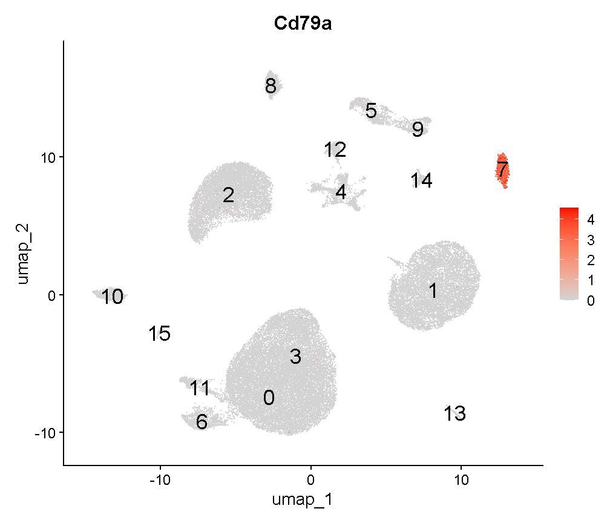
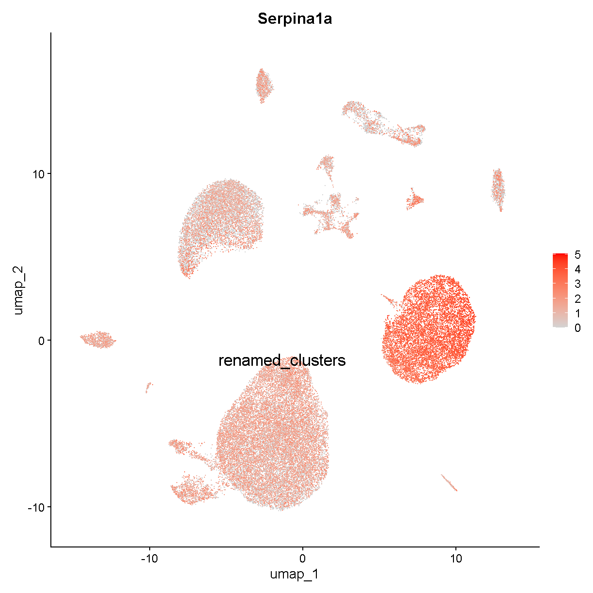
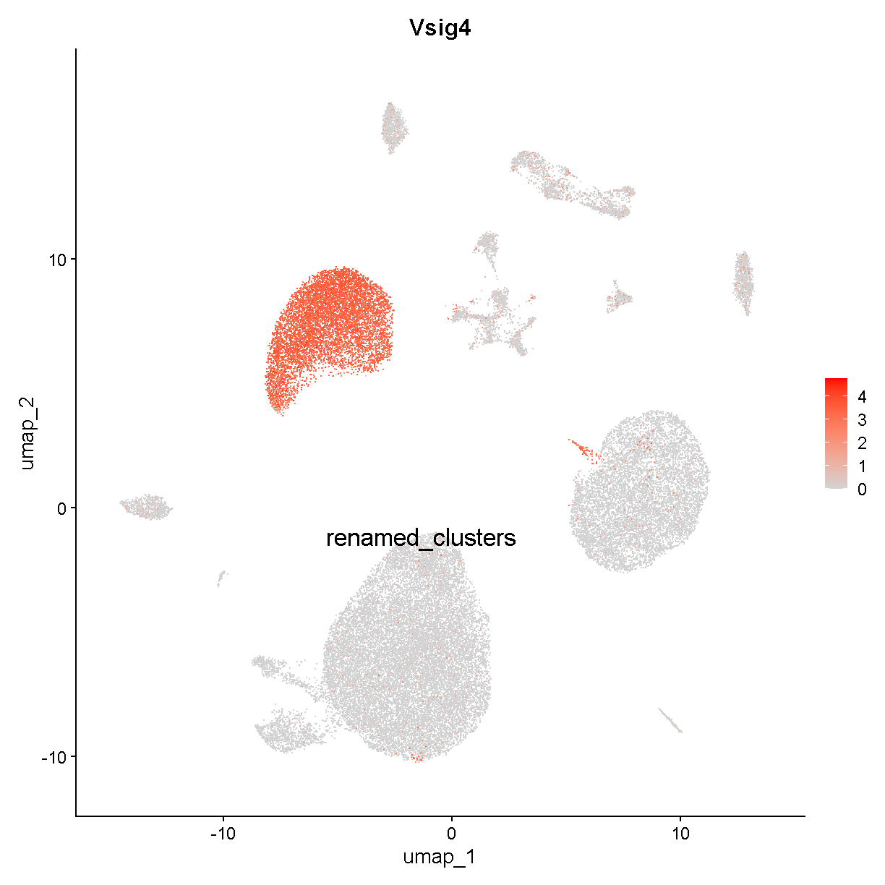

---
# Please do not edit this file directly; it is auto generated.
# Instead, please edit 06-Biology-Driven-Analyses.md in _episodes_rmd/
source: Rmd
title: "Biology Driven Analyses of scRNA-Seq"
teaching: 10
exercises: 2
questions:
- "What are some scRNA-Seq analyses that might provide me with biological insight?"
objectives:
- "Gain an understanding of some of the important caveats for identifying major cell types in scRNA-Seq."
- "Understand the ability (and limitations) of scRNA-Seq data for quantifying differences in gene expression."
- "Have basic ability to be able to conduct enrichment analyses of gene expression in scRNA-Seq."
keypoints:
- "Identifying cell types is a major objective in scRNA-Seq and can be present challenges that are unique to each dataset."
- "Statistically minded experimental design enables you to perform differential gene expression analyses that are likely to result in meaningful biological results."

---

## Read Data from Previous Lesson

~~~
liver <- readRDS(file.path(data_dir, 'lesson05.rds'))
~~~
{: .language-r}

## Batch correction

In bulk RNA-Seq experiments, it is usually vital that we apply a
correction for samples profiled in different batches. In single cell
RNA-Seq experiments the situation is a bit more nuanced. We certainly
want to take into consideration if our samples have been profiled in
different batches, but the point at which we do so can vary.

Consider this example. 
Distinguishing between cell types is a robust process, in fact
we can do a fairly good job distinguishing major cell types
with just a few dozen genes.
We might expect that batch effects are small enough that they would
not strongly impede our ability to identify cell types.
We could do clustering and cell type identification, then when
we are doing differential expression testing we could include a covariate
for batch.
This is an example where we would be appropriately considering batch,
but not at *every* step in the analysis.

In contrast, in these liver data, we are going to show an 
example of why batch correction earlier in the analytical
process can be helpful.
The reason this section is included in the lesson on
"biology-driven" analyses is that we will bring in some understanding
of biology to show a specific example of cells that were separated
(in UMAP space and in different clusters)
by an unknown batch-related factor when they should have been 
clustering together as the same cell type.

We don't know much about when these liver samples were profiled
and what differences in the mice, equipment, or operators there 
could have been. 
There are 9 mice that were profiled
in the data we are looking at.
Let's start by looking at whether specific cell clusters in our 
clustering + UMAP are derived largely from one or a few samples.

~~~
table(liver$sample, liver$seurat_clusters)
~~~
{: .language-r}

~~~
       
           0    1    2    3    4    5    6    7    8    9   10   11   12   13
  CS144   73    9    1   20  866    4    2 1739   78    7  135  860   35    0
  CS48     2    0   12    0    0   49 2026    2    0    0    8    0    0    0
  CS52     1    0    1    0    0 3815  941    0    1    5   46    0   86   24
  CS53     0    0    1 4294    4    5    8    0  657 1161    0    0    8  632
  CS88  3854  218 1154    0    4    8    1    1    5    0  207    0    4    0
  CS89   152  116  381    2  691    0    0    0  200    0   13    1  155    0
  CS92  3589  111  980    1    4   10    6    2    1    0  195    0    4    0
  CS96   346 4298 1965    0    3    0    1    0    4    0  310    0    3    0
  CS97   107  276  309   10 2322    0    1    0  576    1   20    1  434    0
       
          14   15   16   17   18   19   20   21   22
  CS144  275   74   51    0   34   87   31  162   12
  CS48     0    0    5    0    0   10    0    0    0
  CS52     0    0   35    0    0   71    0    1    8
  CS53     0    2    0  402  161    0   51    1    0
  CS88     0    0  125    0    0   39    2    0   24
  CS89   125  143    6    0   57    4   75   57    3
  CS92     0    0  105    0    0   36    1    0   16
  CS96     0    0  197    0    1   73    2    0   37
  CS97   246  330    9    0  141    7  153   90    1
~~~
{: .output}

Notice cluster 13. Most of the cells are derived from mouse CS53.
Let's look into this a little further.
First we plot the cells in UMAP space colored by mouse of origin,
demonstrating some fairly clear batch effects -- indicated by

 * cell clusters that contain dots of only one or a few colors
 * clusters of different colors that are near each other but not overlapping

~~~
UMAPPlot(liver, group.by = 'sample', pt.size = 0.1)
~~~
{: .language-r}

Digging into cluster 13, let's see what genes this cluster
expresses

~~~
markers13 <- FindMarkers(liver, '13', only.pos = TRUE, logfc.threshold = 1,
                         max.cells.per.ident = 500)
head(markers13, 6)
~~~
{: .language-r}

~~~
              p_val avg_log2FC pct.1 pct.2     p_val_adj
Cd79a 1.522095e-182   4.872052 0.998 0.011 3.612083e-178
Ighm  9.665832e-180   4.590161 0.998 0.088 2.293798e-175
Cd79b 4.198574e-177   4.266749 0.989 0.060 9.963636e-173
Ebf1  2.315879e-175   3.988633 0.968 0.010 5.495813e-171
Igkc  1.606549e-172   6.285021 0.974 0.058 3.812501e-168
Iglc2 3.423270e-164   4.173198 0.939 0.015 8.123761e-160
~~~
{: .output}

We'll talk in detail about the information in this type of table later.
For now, just be aware that these are genes that are expressed much more
highly in cluster 13 than in the other cells.

Look at the genes we are finding. These genes are expressed in almost
all cells of cluster 13 (column `pct.1`) and in few of the cells in other
clusters (column `pct.2`). 
An immunologist would likely recognize these as B cell genes. The gene 
Cd79a is very frequently captured well in single cell transcriptomics and
is highly specific to B cells. Let's look at where Cd79a is expressed.

~~~
VlnPlot(liver, 'Cd79a')
~~~
{: .language-r}

Expression of this gene is very clearly **ON** in clusters 13 and 21, 
and **OFF** in all other clusters. Let's look at where clusters 13 and 21
are:

~~~
FeaturePlot(liver, "Cd79a", cols = c('lightgrey', 'red'), 
            label = TRUE, label.size = 6)
~~~
{: .language-r}

Interesting. Clusters 13 and 21 are right next to each other. Recall that
we saw that cluster 13 cells are largely derived from a single mouse.
Looking at cluster 21:

~~~
table(liver$sample[liver$seurat_clusters == '21'])
~~~
{: .language-r}

~~~

CS144  CS52  CS53  CS89  CS97 
  162     1     1    57    90 
~~~
{: .output}

we can see that this cluster contains cells from several mice. 
Both clusters 13 and 21 are B cells -- you can verify this on your own by 
looking at expression of other B cell marker genes. 
It is unlikely that there would be heterogeneous types of B cells that
segregate almost perfectly between different batches. Rather, it seems that
there is some batch-driven pattern in gene expression that is causing
these cells to cluster separately when they should cluster 
together.

In the liver cell atlas paper 
[Guilliams et al](https://www.cell.com/cell/fulltext/S0092-8674(21)01481-1)
from which we obtained these data, the authors applied a batch
correction across samples. They used a method called harmony. 
We will run harmony on the subset of data that we are working with. 
We expect that a successful batch correction algorithm will bring the cells
in clusters 13 and 21 together into a single cluster.

Harmony is an algorithm that projects cells into a shared low-dimensional embedding.
In an iterative process, harmony learns cell-specific linear adjustment
factors in order to integrate datasets in a way that favors clusters 
containing cells from multiple datasets. At the same time, the method has
features that allow it to maintain separation of cell clusters that are
unique to particular datasets. 
The harmony method is described in 
[Korsunsky et al. 2019](https://www.nature.com/articles/s41592-019-0619-0)
and has a website at [this link](https://portals.broadinstitute.org/harmony/).
The following animation, available from 
[this link](https://slowkow.com/notes/harmony-animation/)
in a beautiful and comprehensive workup by 
[Kamil Slowikowski](https://slowkow.com/), shows in a visual manner
how cells from different donors are integrated together 

<!--  -->

Let's run harmony on the liver data. Harmony itself returns a
low-dimensional embedding of the cells, much like the reduced dimensional
embedding of cells that we previously produced in PC-space.
Recall that we performed clustering and projection to two dimensions with 
UMAP all using the PCA dimension reduction. We will now redo those 
steps but use the *harmony* reduction instead.
Note that harmony has several parameters that could be tweaked. The most
important may be theta. Higher values of theta force more mixing across 
batches. We will use the same values of each parameter that the authors
of the liver cell atlas used -- their code is available at 
[this link](https://github.com/guilliottslab/scripts_GuilliamsEtAll_Cell2022/blob/main/3b_Harmony.R).

After we run harmony using the same parameters the authors used, we will
look at the harmony components and decide how many to use -- in a way
analogous to deciding how many PCs to use for UMAP and clustering.

~~~
# Store old UMAP and old clusters
liver$before_harmony_clusters <- liver$seurat_clusters
liver@misc$noharmony_umap <- liver@reductions$umap

# Run harmony
liver <- RunHarmony(liver, 'sample', assay.use='RNA',
           theta=1, dims.use=1:40, max.iter.harmony=100)
ElbowPlot(liver, reduction = 'harmony', ndims = 40)
~~~
{: .language-r}

Let's again pick 24 dimensions, just like we looked at 24 dimensions
in PC space.

~~~
liver <- FindNeighbors(liver, reduction='harmony', dims=1:24) %>%
    FindClusters(verbose=FALSE, resolution=0.3) %>%
    RunUMAP(dims=1:24, reduction='harmony')
~~~
{: .language-r}

~~~
Computing nearest neighbor graph
~~~
{: .output}

~~~
Computing SNN
~~~
{: .output}

~~~
08:43:09 UMAP embedding parameters a = 0.9922 b = 1.112
~~~
{: .output}

~~~
08:43:09 Read 44253 rows and found 24 numeric columns
~~~
{: .output}

~~~
08:43:09 Using Annoy for neighbor search, n_neighbors = 30
~~~
{: .output}

~~~
08:43:09 Building Annoy index with metric = cosine, n_trees = 50
~~~
{: .output}

~~~
0%   10   20   30   40   50   60   70   80   90   100%
~~~
{: .output}

~~~
[----|----|----|----|----|----|----|----|----|----|
~~~
{: .output}

~~~
**************************************************|
08:43:13 Writing NN index file to temp file C:\Users\c-dgatti\AppData\Local\Temp\RtmpumL5Ph\file3db864f72e9
08:43:13 Searching Annoy index using 1 thread, search_k = 3000
08:43:24 Annoy recall = 100%
08:43:24 Commencing smooth kNN distance calibration using 1 thread with target n_neighbors = 30
08:43:27 Initializing from normalized Laplacian + noise (using irlba)
08:43:35 Commencing optimization for 200 epochs, with 1893320 positive edges
08:44:10 Optimization finished
~~~
{: .output}

~~~
liver$after_harmony_clusters <- liver$seurat_clusters
~~~
{: .language-r}

Now let's see where the cells from the former
clusters 13 and 21 appear in our new clustering.

~~~
table(liver$before_harmony_clusters, 
      liver$after_harmony_clusters)[c('13', '21'), ]
~~~
{: .language-r}

~~~
    
       0   1   2   3   4   5   6   7   8   9  10  11  12  13  14  15
  13   0   0   0   0   0   0   0 656   0   0   0   0   0   0   0   0
  21   0   0   0   0   0   1   0 310   0   0   0   0   0   0   0   0
~~~
{: .output}

These cells are *all* in the new cluster 8. This cluster
exclusively expresses the B cell gene Cd79a, suggesting that the
harmony batch correction has accomplished the task that we had hoped.

~~~
FeaturePlot(liver, 'Cd79a', cols = c('lightgrey', 'red'), label = T, 
            label.size = 6)
~~~
{: .language-r}

~~~
VlnPlot(liver, 'Cd79a')
~~~
{: .language-r}

We will work with the harmony clusters from this point forward.
In a real analysis we should spend more time trying different
parameters and verifying that our results are robust to a variety of
different choices. We might also examine other cell clusters that 
were specific to one batch in an effort to determine whether they
are like this B cell example and *should* be better aligned between 
batches, or whether the cells are truly unique to that batch and 
*should not* be aligned with cells present in other batches.

## Finding marker genes 

Now we will find marker genes for our clusters. Finding marker genes takes a
while so we will downsample our data to speed up the process.
The `downsample` argument to the `subset()` function means that Seurat
will take a random 300 (maximum) cells from each cluster in our
`liver_mini` object.
Even with the downsampled data this marker-finding will take a few minutes.

~~~
liver_mini <- subset(liver, downsample = 300)
markers <- FindAllMarkers(liver_mini, only.pos = TRUE, 
    logfc.threshold	= log2(1.25), min.pct = 0.2) 
~~~
{: .language-r}

These cluster marker genes are very useful. By definition, the 
marker genes vary in expression between the cells in our dataset.
Therefore each gene is helping to capture some aspect of the 
cellular heterogeneity found within the liver tissue we profiled.

The most important task we will carry out using our marker genes is
the identification of cell type labels for each cluster.
One approach to obtaining cell type labels is to use an automated
method like `SingleR`, which was introduced in 
[Aran et al. 2019](https://doi.org/10.1038/s41590-018-0276-y)
and has a companion Bioconductor package
[here](https://bioconductor.org/packages/release/bioc/html/SingleR.html).
This method 
> performs unbiased cell type recognition from single-cell RNA sequencing 
> data, by leveraging reference transcriptomic datasets of pure cell 
> types to infer the cell of origin of each single cell independently.

A method like `SingleR` is a great option for taking a first look at your
data and getting a sanity check for what cell types are present.
However, we find that the reference cell type data are often insufficient
to categorize the full cellular diversity in many datasets. 
An automated method might be a great way to initially identify 
T cells, macrophages, or fibroblasts -- but might struggle with 
categorizing more detailed subsets like inflammatory macrophages or
activated fibroblasts.

The "classic" way to identify cell types in your scRNA-Seq data
is by looking at the marker genes and manually labelling each cell type.
This manual method has been used ever since the first single cell 
transcriptomic studies of tissue cellular heterogeneity. 
There are both advantages and disadvantages to the manual approach.
The advantages include:

 * The ability to utilize considerable subjective judgement -- after all, you
 should be familiar with the tissue you are looking at and you can label
 cells with arbitrary levels of precision and descriptiveness
 * The possibility to identify cells that are not well represented in 
 existing data/databases like that used by `SingleR`
 
Disadvantages include:

 * This method can be slow and tedious
 * Your biological knowledge of the tissue might cause you to mislabel cells

We will show an example of this type of cell type identification
below.

One could also integrate your data with other existing datasets
that have cell labels, and do label transfer. There is more information
on this topic in lesson 7 where you will have the opportunity to
(potentially) try out this approach on your own data.
This is a very useful approach that is likely to become 
increasingly useful as the scientific community accumulates more
and more scRNA-Seq datasets.

## Identifying cell types

Let's plot the expression of some of the major cell type
markers. Look at the data.frame `markers` for a summary of the
markers we found above. We'll massage the `markers` data.frame into a
more tidy format:

~~~
old_markers <- markers
markers <- as_tibble(markers) %>% 
  select(cluster, gene, avg_log2FC, pct.1, pct.2, p_val_adj)
head(markers, 6)
~~~
{: .language-r}

~~~
# A tibble: 6 x 6
  cluster gene    avg_log2FC pct.1 pct.2 p_val_adj
  <fct>   <chr>        <dbl> <dbl> <dbl>     <dbl>
1 0       Oit3          2.31 0.99  0.184 7.13e-253
2 0       Adam23        2.17 0.93  0.16  4.57e-238
3 0       Flt4          2.11 0.973 0.187 5.57e-236
4 0       Fam167b       2.29 0.987 0.214 2.68e-228
5 0       Cldn5         2.17 0.977 0.182 5.90e-227
6 0       Stab2         2.44 0.973 0.22  2.58e-226
~~~
{: .output}

In the `markers` tibble, the columns have the following meanings:

 * cluster -- the cluster in which expression of the marker gene is enriched
 * gene -- the gene that has high expression in this cluster
 * avg_log2FC -- the log2 fold change difference in expression of the gene
 between this cluster compared to *all* the rest of the cells
 * pct.1 -- the fraction of cells in this cluster that express the gene 
 (expression is just quantified as a nonzero count for this gene)
 * pct.2 -- the fraction of cells *not* in this cluster (i.e. all other cells)
 that express the gene 
 * p_val_adj -- a multiple testing corrected p-value (Bonferroni 
 corrected) for the marker indicating
 the significance of expression enrichment in this cluster compared to all
 other cells
 
You should be aware of one weakness of finding cell types using this approach. 
As mentioned above, this marker gene-finding function compares expression
of a gene in cluster X to expression of the gene in all other cells. But 
what if a gene is highly expressed in cluster X and in some other tiny 
cluster, cluster Y? If we compare cluster X to all other cells, it will look 
like the gene is specific to cluster X, when really the gene is
specific to both clusters X and Y. One could modify the marker gene-finding
function to compare all clusters in a pairwise fashion and then unify
the results in order to get around this issue.
Dan Skelly has some code available 
[here](https://gist.github.com/daskelly/09c1d2ae8dc3b1de1fe2ec2dbd0dd44d)
that implements such an approach in the Seurat framework, should you
wish to try it.
For this course we will not get into such a level of detail.

Let's look at the top 3 markers for each cluster:

~~~
group_by(markers, cluster) %>% 
  top_n(3, avg_log2FC) %>%
  pivot_wider(-c(avg_log2FC, pct.1, pct.2, p_val_adj), 
              names_from = 'rank', values_from = 'gene') %>%
  arrange(cluster)
~~~
{: .language-r}

~~~
Error in `build_wider_spec()`:
! Can't subset columns that don't exist.
x Column `rank` doesn't exist.
~~~
{: .error}

Recognizing these genes might be a big challenge if you are not 
used to looking at single cell gene expression. Let's check out expression of 
the very top genes in each cell cluster:

~~~
top_markers <- group_by(markers, cluster) %>% 
  arrange(desc(avg_log2FC)) %>%
  top_n(1, avg_log2FC) %>% pull(gene)
VlnPlot(liver, features = top_markers, stack = TRUE, flip = TRUE)
~~~
{: .language-r}

What does this tell us? Well, there are some genes here that are quite
specific to one cluster (e.g. S100a9, Spp1, Ccl5, Siglech),
but there are a few markers that are not very good markers at all
(e.g. Fabp1, Cst3) and some that are not very specific 
(e.g. Clec4f, Cd5l, Kdr, Clec4g).

Let's look at one of these last kinds of markers -- Kdr. Our violin plot above
shows that this gene is expressed in clusters 0, 2, 6, and 12.
If we look at a UMAP plot

~~~
UMAPPlot(liver, label = TRUE, label.size = 6) + NoLegend()
~~~
{: .language-r}

we see that these clusters are smaller bits of a large cloud of points
in UMAP space. This is probably a relatively heterogenous cell type or
or a continuum of cells (e.g. differentiating cells or cells being
activated by some stimulus). Nevertheless it is fairly clear that
these cells all express Kdr:

~~~
FeaturePlot(liver, "Kdr", cols = c('lightgrey', 'red'))
~~~
{: .language-r}

If we do some digging, we see that Kdr encodes
[vascular endothelial growth factor receptor 2](https://www.uniprot.org/uniprotkb/P35968).
In the liver, we would expect endothelial cells to be fairly 
abundant. Therefore we can already say with relatively high
confidence that clusters 0, 2, 6, and 12 are endothelial cells.

Looking again at the violin plot above, there are some genes that
are often seen in scRNA-Seq data and are excellent markers:

 * *S100a9* is a marker for neutrophils (or the broader category of granulocytes)
 * *Ccl5* (which encodes RANTES) is a marker for T cells. The T cell cluster might also include some other related immune cell types (natural killer [NK] cells and innate lymphoid cells [ILCs])
 * *Siglech* is a marker for plasmacytoid dendritic cells

We have now identified (at least tentative) cell types for clusters
0, 2, 4, 6, 9, 12, and 14. 

Let's turn to those markers that seemed to be expressed across
all or almost all cell types (recall Cst3 and Fabp1). 
Let's focus on cluster 1. This is a pretty large cluster.
In our violin plot cluster 1 is marked only by Fabp1, which is much
higher in cluster 1 than in any other cluster, but still has high background
in ALL clusters. 

Doing a bit of sleuthing, we find that Fabp1 is expressed in
hepatocytes. For example,
[this reference](https://www.ncbi.nlm.nih.gov/pmc/articles/PMC4655993/) 
says that Fabp1 is found abundantly in the cytoplasm of hepatocytes.
It also makes sense that cluster 1 is hepatocytes because this cluster 
is large and we expect a lot of hepatocytes in the liver.

However, why do we see high background levels of Fabp1?
The reason might be due to ambient RNA. If a liver cell lyses and releases 
its contents into the "soup", the cell's RNA molecules could tag along
for the ride in any droplet with any other cell type.
This ambient RNA would act as noise in the transcriptome of
each cell. The problem of ambient RNA can vary considerably between
samples. A recent paper by 
[Caglayan et al](https://pubmed.ncbi.nlm.nih.gov/36240767/) gives a nice
case study and examines the phenomenology of ambient RNA in single
nucleus RNA-Seq.
There are several methods to correct for high levels of
ambient RNA, with [CellBender](https://cellbender.readthedocs.io/en/latest/)
showing good performance in multiple studies. 

To examine whether these data show evidence of a hepatocyte
ambient RNA signature, we start by looking at our non-specific marker
Fabp1:

~~~
FeaturePlot(liver, "Fabp1", cols = c('lightgrey', 'red'))
~~~
{: .language-r}

This seems consistent with our expectations based on what we know about
ambient RNA. Let's look at another hepatocyte marker:

~~~
FeaturePlot(liver, "Serpina1a", cols = c('lightgrey', 'red'))
~~~
{: .language-r}

Very similar. We tentatively conclude that this dataset has a noticeable
amount of hepatocyte ambient RNA contributing to all cell transcriptomes.
Let's label cluster 1 as hepatocytes.

Because of *Fabp1* and other noisy markers in our cluster-specific
gene expression data.frame, 
we'll try filtering our markers to grab only
those that are not expressed too highly (on average) in
all the other cells:

~~~
specific_markers <- group_by(markers, cluster) %>% 
  arrange(desc(avg_log2FC)) %>%
  filter(pct.2 < 0.2) %>%
  arrange(cluster) %>%
  top_n(1, avg_log2FC) %>% pull(gene)
VlnPlot(liver, features = specific_markers, stack = TRUE, flip = TRUE)
~~~
{: .language-r}

This looks better -- the markers are more specific.
We do have a marker for the hepatocytes (cluster 1) that looks better
than before. However, this gene -- *Inmt* -- does not seem to be a very
good hepatocyte marker according to the literature. Thus our filter
to remove non-specific markers may have gotten rid of most of the 
strongly hepatocyte-specific gene expression. 

In this violin plot we do have
some instances where a marker seems to be specific to two or three cell
clusters (e.g. Vsig4, Stab2, etc).

Stab2 is marking the endothelial cells we already identified (or at least
some of them). Let's look at Vsig4:

~~~
FeaturePlot(liver, "Vsig4", cols = c('lightgrey', 'red'), label = TRUE,
            label.size = 6)
~~~
{: .language-r}

This is marking clusters 3, 8, and 15.
Clusters 3 and 8 are very near each other. Vsig4 is an immune
protein (V-set and immunoglobulin domain containing 4).
The protein
[is expressed](https://www.proteinatlas.org/ENSG00000155659-VSIG4/tissue)
selectively in -- among other cell types -- Kupffer cells,
which are the macrophages of the liver. Clusters 3 and 8 may be
Kupffer cells. Let's check a famous macrophage marker,
F4/80 (gene name Adgre1):

~~~
FeaturePlot(liver, "Adgre1", cols = c('lightgrey', 'red'), label = TRUE,
            label.size = 6)
~~~
{: .language-r}

Cluster 15 expresses *Adgre1* but is near the hepatocyte cluster
we just discussed. In fact it is located between the hepatocyte and
Kupffer cell clusters. Cluster 15 might represent hepatocyte-Kupffer cell
doublets. Consistent with this theory, cluster 15 has intermediate expression
of Kupffer cell-specific *Adgre1* and hepatocyte-specific *Fabp1*.

~~~
VlnPlot(liver, c("Adgre1", "Fabp1"), idents = c('3', '15', '1'), sort = T)
~~~
{: .language-r}

Let's store our labels and look at
what remains unidentified.

~~~
labels <- tibble(cluster_num = unique(liver$after_harmony_clusters)) %>%
  mutate(cluster_num = as.character(cluster_num)) %>%
  mutate(cluster_name = case_when(
    cluster_num %in% c('0', '2', '6', '12') ~ 'ECs',   # endothelial cells
    cluster_num == '1' ~ 'hepatocytes',
    cluster_num %in% c('3', '8') ~ 'Kupffer cells',
    cluster_num == '4' ~ 'T cells',
    cluster_num == '9' ~ 'pDCs',               # plasmacytoid dendritic cells
    cluster_num == '14' ~ 'neutrophils',
    cluster_num == '15' ~ 'KH doub.',          # Kupffer-hepatocyte doublets
    TRUE ~ cluster_num))

liver$labels <- deframe(labels)[as.character(liver$after_harmony_clusters)]
UMAPPlot(liver, label = TRUE, label.size = 6, group.by = 'labels') + NoLegend()
~~~
{: .language-r}

> Exercise -- have students identify cell types
> Might direct them to the Panglao database at https://panglaodb.se/index.html
> They could ask: is it an immune cell? If yes it likely expresses
> CD45 (Ptprc)

## Differential expression 

Looking for differential expression can be thought of as a problem that
is related to finding cell type marker genes. Marker genes are, by definition,
genes that vary significantly between cell types. Often we are most interested
in the expression of genes that specifically mark particular cell types 
that we are interested in, but there can also be value in using broader
markers (e.g. CD45 - encoded by the gene *Ptprc* - marks all immune cells).

In scRNA-Seq, differential expression usually refers to differences
*within* a given cell type rather than *between* cell types.
For example, maybe we administer a drug and wish to see how gene 
expression of control group hepatocytes differs from
treatment group hepatocytes.

Because the liver dataset we are working with is a *cell atlas*, there is
no convenient experimental factor to use in our differential expression
comparison. Nevertheless, we will illustrate how a differential expression
test could look by making up a fake experimental factor.

~~~
libraries <- unique(liver$sample)
treatment_group <- setNames(c(rep('control', 5), rep('drug', 4)), libraries)
liver$trt <- treatment_group[liver$sample]

hepatocytes <- subset(liver, labels == "hepatocytes")
Idents(hepatocytes) <- "trt"
UMAPPlot(hepatocytes, split.by = 'trt', group.by = 'labels', label = T,
         label.size = 6)
~~~
{: .language-r}

We will look for differential expression between the 
control and drug administration groups defined
by this fake drug/control factor.
The differentially expressed genes (DEGs) can inform our understanding
of how the drug affects the biology of cells in the tissue profiled.
One quick and easy way to look for DEGs is to 
use the marker gene-finding function in Seurat, because as discussed above
the problem of differential expression is related to finding cell type 
marker genes. 

~~~
deg1 <- FindMarkers(hepatocytes, ident.1 = 'drug', ident.2 = 'control',
                    logfc.threshold = 0.2, only.pos = FALSE)
~~~
{: .language-r}

However this approach is not ideal. It may work OK if we only have on
mouse sample from each treatment group, with thousands of cells profiled
per mouse. However, when we have multiple mice, we are failing to 
take into account
the fact that cells from a single mouse are not fully independent.
For example, if cells from one mouse are contributing the 
majority of drug-treated hepatocyte cells, and this one mouse is an outlier
that happened to have only minimal response to the drug, then we might
be fooled into thinking that the drug does not perturb hepatocytes
when in actuality the response is minimal only in that particular mouse.

Let's look at our results:

~~~
head(deg1, 10)
~~~
{: .language-r}

~~~
                  p_val avg_log2FC pct.1 pct.2     p_val_adj
Mup11      0.000000e+00  0.9115065 0.745 0.401  0.000000e+00
Alb        0.000000e+00  1.0699864 1.000 0.941  0.000000e+00
Uba52      0.000000e+00 -1.8838544 0.347 0.678  0.000000e+00
Apoa1      0.000000e+00  0.7824844 0.997 0.773  0.000000e+00
Trf        0.000000e+00  1.1300583 0.962 0.638  0.000000e+00
Rps29      0.000000e+00  0.5240102 0.999 0.994  0.000000e+00
Serpina3k  0.000000e+00  0.9359763 0.993 0.727  0.000000e+00
Gm42418    0.000000e+00  0.9349904 1.000 0.997  0.000000e+00
C3         0.000000e+00  0.8374410 0.861 0.491  0.000000e+00
Apoa2     2.582976e-286  0.6409389 1.000 0.843 6.129659e-282
~~~
{: .output}

Wow! We have a lot of genes with apparently very strong statistically
significant differences between the control and drug administered
groups. Does this make sense? No, we just made up the control and drug
groups!
In fact, the results above are an indication of the caution that should be
applied when applying a test that does not consider biological
replicates.
What are we finding here? The second top gene, *Cyp3a11*, is 
a cytochrome P450-family gene and its transcript is higher in the 
fake control mice than the fake drug treated mice. Maybe there is some
biological meaning that could be extracted from this if we had more
detailed information on the conditions under which the fake control and
fake drug administered mouse groups were reared.

Nevertheless, let's consider a more statistically robust approach
to differential expression in scRNA-Seq. 
This approach is to collapse all cells from
each biological replicate to form a "pseudobulk" sample. Then one can
use tools developed for bulk RNA-Seq samples (e.g. DESeq2 or edgeR)
to identify DEGs.
This could look like the following:

~~~
# Make pseudobulks.
pseudobulk <- AggregateExpression(hepatocytes, slot = 'counts', 
                                  group.by = 'sample')
dim(pseudobulk)
~~~
{: .language-r}

~~~
NULL
~~~
{: .output}

~~~
head(pseudobulk, 6)
~~~
{: .language-r}

~~~
$RNA
               CS144 CS48   CS52 CS53   CS88 CS89   CS92   CS96  CS97
Xkr4               0    0      0    0      0    0      0      1     0
Rp1                0    0      0    0      0    0      0      0     0
Sox17            474    3    839    0    985   56    948   1639   111
Gm37323            0    0      0    0      0    0      0      1     0
Mrpl15           250   18    567    0    740   44    622   1171    85
Lypla1           354    9    611    1    927   62    883   1561   137
Gm37988            1    0      2    0      1    0      4      6     2
Tcea1            426   18    673    0   1198   52   1113   1906   109
Rgs20              0    0      0    0      0    0      0      0     0
Gm16041            0    0      0    0      0    0      0      0     0
Atp6v1h          315    2    576    0    697   47    671   1137    98
Oprk1              0    0      0    0      0    0      0      0     0
Rb1cc1           406    9    808    0   1704   79   1597   2897   203
4732440D04Rik     18    1     33    0     54    1     57     93     5
Alkal1             0    0      0    0      0    0      0      0     0
St18               0    0      0    0      0    0      0      0     0
Pcmtd1           906   15   1223    0   2371  129   2256   4067   325
Gm26901            5    0      3    0      7    0      3     12     2
Gm30414            0    0      0    0      0    0      0      0     0
Sntg1              0    0      1    0      0    0      0      0     0
Rrs1              86    3    180    0    271    9    236    405    27
Adhfe1            16    8      7    0     92    2     55    178    10
3110035E14Rik      0    0      0    0      0    0      0      1     0
Mybl1              7    0     14    0     21    0     13     25     1
Vcpip1           437    4    613    0   1093   65   1029   1781   148
1700034P13Rik      1    0      0    0      4    0      4      2     2
Sgk3             299    3    504    0    917   43    803   1328   109
Mcmdc2             2    0      1    0      7    1      5      6     1
Snhg6             96    3    165    0    256   15    217    317    48
Tcf24              2    0      1    0      0    0      4      0     0
Ppp1r42            0    0      1    0      0    0      0      0     0
Gm15818            0    0      0    0      0    0      0      0     0
Cops5            219   10    440    0    630   23    545    929    64
Cspp1            243    8    377    0    659   26    635   1127    80
Arfgef1          402    4    756    1   1166   71   1115   2007   157
Cpa6               0    0      0    0      0    0      0      0     0
Prex2           1454   14   2712    0   4197  223   4047   6991   541
A830018L16Rik      0    0      1    0      0    0      0      0     0
Sulf1              6    0      9    0     11    2      8     23     2
Slco5a1            0    0      0    0      0    0      0      0     0
Gm29283            0    0      0    0      0    0      0      0     0
Prdm14             0    0      1    0      0    0      0      0     0
Ncoa2            248    3    458    0    641   43    648   1065    80
Gm29570            0    0      1    0      0    0      0      0     0
Tram1            750    7   1198    2   1809   95   1824   3249   250
Lactb2           145   18    186    0    462   27    427    851    60
Xkr9               5    1      1    0     15    0     19     43     5
Eya1               0    0      0    0      0    0      0      0     0
Gm9947             1    0      0    0      0    0      1      1     0
Msc                0    0      1    0      0    0      0      1     1
Trpa1              0    0      0    0      0    0      0      0     0
Kcnb2              0    0      0    0      0    0      0      0     0
Terf1            140    5    279    0    405   21    358    581    38
Sbspon             0    0      0    0      0    0      0      1     0
4930444P10Rik      0    0      0    0      3    0      0      1     0
Rpl7            4607   74   9007    3  13976  816  12959  22104  1651
Rdh10             61    1    108    1    142    4    101    221    21
Gm28095            0    0      0    0      0    0      0      0     0
Stau2              3    1      9    0     10    1     11     29     4
Gm7568             0    0      0    0      0    0      0      0     0
Ube2w            144    1    334    0    397   25    334    600    40
Eloc             609   19   1350    0   1426   67   1395   2312   195
D030040B21Rik      0    0      0    0      2    0      5      7     0
Tmem70           139    1    302    0    371   14    369    627    49
Ly96             641    6   1403    0   1288   63   1272   1955   175
Gm28376            0    0      0    0      0    0      0      0     0
Jph1               0    0      0    0      5    0      1      1     0
Pi15               0    0      0    0      0    0      0      0     0
Gm16070            0    0      0    0      0    0      0      0     0
Crispld1           0    0      0    0      0    0      0      0     0
Gm28153            0    0      0    0      0    0      0      0     0
Crisp4             0    0      0    0      0    0      0      0     0
Tfap2d             0    0      0    0      0    0      0      0     0
Pkhd1              3    0      0    0      3    0      1      6     0
4930486I03Rik      0    0      0    0      0    0      0      0     0
Il17a              0    0      0    0      0    0      0      0     0
Il17f              0    0      0    0      1    0      1      0     0
Mcm3             334    4    690    0   1044   40    974   1662   115
6720483E21Rik      0    0      0    0      2    0      3      0     0
Paqr8            138    1    206    0    357   27    343    595    38
Efhc1              4    0     11    0      9    0     20     14     0
Tram2            127    4    208    0    262   10    227    438    34
Gm28287            0    0      0    0      0    0      0      0     0
Tmem14a           28    3     85    0     77    4     79    137    11
Gsta3            670  466    294    0   3474  189   1760   5362   314
Gm28836            0    0      0    0      0    0      0      0     0
Khdc1a             0    0      0    0      0    0      0      0     0
Khdc1c             0    0      0    0      0    0      0      0     0
Khdc1b             0    0      0    0      0    0      0      0     0
Kcnq5              0    0      0    0      0    0      0      0     0
Gm26580            0    0      0    0      0    0      0      0     0
Rims1              0    0      0    0      0    0      0      0     0
Gm27028            0    0      0    0      1    1      2      3     0
Gm29107           31    0     79    0     54    2     75    156    19
Ogfrl1           108    1    189    2    315   19    290    481    47
B3gat2             4    0      1    0     16    2      6     23     1
Smap1            701    8   1493    0   1950  118   2051   3444   245
Sdhaf4           251    6    567    0    669   38    586    958    69
Fam135a          120    1    196    0    336   15    279    516    32
Col19a1            0    0      0    0      0    0      0      0     0
Lmbrd1           478    5    978    1   1268   75   1318   2304   191
Adgrb3             0    0      0    0      0    0      0      0     0
Gm5524             0    1      3    0     20    5     12     31     3
Gm9898             0    0      0    0      0    0      0      0     0
Phf3             439    5    933    2   1423   75   1280   2320   155
Ptp4a1           353    7    679    0   1114   49    926   1701   146
Gm29669            0    0      0    0      1    0      0      0     0
Gm28644            0    0      0    0      0    0      0      0     0
4931428L18Rik      0    0      0    0      0    0      0      0     0
Gm29128            0    0      0    0      0    0      0      0     0
Lgsn               0    0      0    0      0    0      0      0     0
Khdrbs2            0    0      0    0      0    0      0      0     0
Gm37724            0    0      0    0      0    0      0      0     0
Prim2             32    0     55    0     90    2     83    123    13
Rab23             48    0    115    0    159    7    148    272    22
Bag2               3    0      1    0      7    0      6      8     2
Zfp451           309    1    444    0    653   32    602   1049    75
Bend6              1    0      0    0      0    0      1      0     0
Dst              234    8    450    0    803   25    745   1329    95
Gm37233           17    0     44    0     55    2     48     92     6
Ccdc115          168    1    413    1    469   17    405    763    59
Gm28306            0    0      0    0      0    0      0      0     0
Imp4             220    4    468    1    632   36    529    933    63
Ptpn18           229    2    415    1    428   27    412    702    60
4930568A12Rik      0    0      0    0      0    0      0      0     0
Prss39             0    0      0    0      0    0      0      0     0
Arhgef4            1    0      4    0      3    0      4      2     1
Gm38336            4    0     18    0     22    1     11     24     1
Fam168b          431    1    957    1   1398   80   1335   2159   173
Plekhb2          158    3    323    0    406   19    378    657    53
1110002O04Rik      0    0      0    0      0    0      1      0     0
Gm33222            0    0      0    0      0    0      0      0     0
Hs6st1           234    4    412    0    923   53   1107   1807   146
Gm37335            0    0      0    0      0    0      4      0     1
Gm33280            1    0      0    0      2    0      2      5     1
Uggt1            287    2    492    0    846   41    853   1549   113
Neurl3           545    5   1063    2   1732   84   1714   2768   209
Arid5a            25    0     34    0     99    5     88    204     8
4930403P22Rik      1    0      0    0      3    0      3      1     0
Kansl3           163    2    381    0    598   35    573   1008    71
Fer1l5             0    0      0    0      0    0      0      0     0
Lman2l            47    1    120    0    101   10    123    207    24
Cnnm4             20    0     28    0     23    2     26     50     5
Cnnm3             85    1    132    0    211   11    203    375    24
Gm38033            0    0      0    0      0    0      0      1     0
Ankrd23            0    0      1    0      2    0      2      2     0
Gm42417            0    0      0    0      0    0      1      1     1
Ankrd39           74    2    106    0    130    9    134    223    12
Sema4c           501    1    653    1    997   48   1094   1720   150
Fam178b            0    0      0    0      3    0      2      3     0
Cox5b           1731   79   3245    0   3587  223   3444   5612   459
Actr1b           242    1    486    0    640   26    663   1132   103
4933424G06Rik      0    0      1    0      0    0      0      0     0
Gm33533            0    0      0    0      0    0      0      0     0
Zap70             24    0      6    0     37    1     25     74    10
Tmem131          330    3    625    1   1115   69   1088   1788   148
Vwa3b              0    0      0    0      0    0      1      3     0
Cnga3              0    0      0    0      0    0      0      0     0
Inpp4a            87    2    142    0    173   11    173    277    24
4930439A04Rik      0    0      0    0      0    0      0      0     0
Coa5             214    7    359    0    606   41    568    949    83
Unc50            332    6    896    0   1016   49    956   1602   112
Mgat4a             4    0      6    0     17    1      8     21     4
2010300C02Rik      0    0      0    0      0    0      0      0     0
4930556I23Rik      0    0      0    0      0    0      0      0     0
Tsga10            27    0     58    0     67    1     58    131     6
Gm26805            0    0      0    0      0    0      0      0     0
Lipt1              6    0      5    0     19    0     13     43     3
Mitd1            205    3    316    0    422   29    489    871    62
Mrpl30           445   20    710    0   1014   47    938   1615   104
Lyg2               0    0      0    0      0    0      0      0     0
Gm15457            0    0      0    0      0    0      0      0     0
Txndc9           361    7    686    0    870   52    764   1376    99
Eif5b            749   17   1357    2   2643  124   2613   4614   309
Rev1             152    1    257    1    316   19    251    488    31
Gm5099             0    0      0    0      0    0      0      0     0
Aff3               0    0      1    0      0    0      3      2     0
Gm16150            0    0      0    0      0    0      0      0     0
Gm16151            0    0      0    0      0    0      0      0     0
Gm16152            0    0      0    0      1    0      1      3     0
Lonrf2             0    0      0    0      0    0      0      0     0
Chst10             0    0      0    0      2    0      0      0     0
Pdcl3            395    8    917    0   1051   49    962   1513   127
Npas2              2    0      0    0      7    0      7     11     0
Rpl31           1704   34   2675    1   4886  256   4872   8166   599
Tbc1d8            39    1     92    0    129    8     92    152    14
Cnot11           109    1    213    0    235    8    236    433    34
Rnf149            50    1     20    4    117   18     95    319    31
Creg2              0    0      1    0      0    0      0      0     0
D930019O06Rik      0    0      0    0      0    0      0      1     0
Rfx8               5    0      3    0      4    0      7      9     1
Map4k4           765    5   1360    0   2085  114   1986   3396   225
Il1r2              4    0      1    0      4    0      4      3     2
Gm16894            0    0      0    0      0    0      1      0     0
Il1r1            234    3    404    0    449   28    436    627    46
Il1rl2             6    0     11    0      5    0      3      5     0
Il1rl1             0    0      0    0      0    0      0      0     0
Il18r1             2    0      0    0      0    0      0      0     0
Il18rap            2    0      0    0      0    0      0      0     2
Slc9a4             0    0      0    0      0    0      0      0     0
Slc9a2             0    0      0    0      0    0      0      0     0
Gm37915            0    0      0    0      0    0      0      0     0
Mfsd9             11    1     29    0     45    4     49     85    10
Gm28634            0    0      0    0      0    0      0      0     0
Gm29260            0    0      0    0      0    0      0      0     0
Mrps9            148    3    250    0    420   19    362    625    50
Gpr45              0    0      0    0      0    0      0      0     0
Tgfbrap1         359    4    672    0    854   49    863   1475   125
Gm28782            0    0      0    0      0    0      0      0     0
8430432A02Rik      0    0      5    0      0    0      5      3     0
AI597479          47    1     86    0    143   12    145    261    31
Fhl2               0    0      0    0      0    0      1      0     0
Gm29040            0    0      0    0      0    0      0      0     0
Nck2               5    0     12    0      9    0     12     37     2
1500015O10Rik      0    0      0    0      0    0      0      0     0
Gm29155            1    0      2    0      0    0      2      2     1
Gm29156            1    0      0    0      0    0      2      1     0
Uxs1             128    1    282    0    263   19    272    504    49
Tpp2             426    2    697    0   1128   53   1178   2036   164
Mettl21c           0    0      0    0      0    0      0      1     0
Gm8251             1    0      0    0      2    0      4      5     0
Tex30             58    2    151    1    137    5    122    212    14
Kdelc1            71    0    119    0    200   11    137    274    25
Bivm              35    1     67    0    102    4     94    190    14
Ercc5             71    0    132    0    252   14    255    386    20
Mettl21e           0    0      0    0      0    0      0      0     0
Gulp1              9    0     15    0     29    0     20     37     5
Col3a1             4    0      7    0     16    0     22     23     5
Col5a2           163    2    214    0    203   11    242    351    42
Wdr75             84    1    169    0    243   10    216    348    19
Gm5269             0    0      0    0      0    0      0      0     0
Slc40a1         1125    9   2588   13   2475  149   2388   4363   440
Dnah7b             0    0      0    0      0    0      0      0     0
Dnah7c             0    0      0    0      0    0      0      0     0
Slc39a10         156    2    314    0    483   46    459    739    67
Gm28151            9    0     33    0     34    2     30     49     6
Gm28826            0    0      1    0      0    0      0      1     0
C230029F24Rik      0    0      0    0      0    0      0      0     0
4933411E06Rik      2    0      0    0      1    0      1      0     0
Tmeff2             1    0      0    0      0    0      1      1     0
Gm29325            0    0      0    0      0    0      0      0     0
9330175M20Rik      0    0      0    0      0    0      1      1     1
Cavin2          4240   36   8358    0  14059  676  12958  21910  1604
1700072G22Rik      0    0      0    0      0    0      1      0     0
Nabp1             21    0     23    0     62    1     55    110    11
Gm17767            0    0      0    0      0    0      0      2     1
Gm28055            0    0      0    0      0    0      0      0     0
Myo1b             40   12     20    0    229   19    127    337    30
Stat4              0    0      0    0      0    0      1      0     2
Gm31812            1    0      1    0      4    0      3     12     1
Stat1            486    5    867    1   1395   81   1436   2518   191
Gls              674    4   1227    0   1760   94   1723   2833   237
Nab1             411   10    790    0   1164   49   1138   1750   123
Gm553              0    0      0    0      1    0      0      2     0
Nemp2             27    0     30    0     41    0     47     68     4
Mfsd6             20    0     67    0    109   10     87    152    13
Inpp1            102    3    166    0    243   15    284    415    41
Hibch             63    9     98    0    193   12    151    322    33
1700019D03Rik      0    0      0    0      0    0      0      0     0
1700019A02Rik      0    0      0    0      0    0      0      0     0
Pms1              10    0     16    0     21    1     23     44     2
Gm28777            0    0      0    0      0    0      0      0     0
Ormdl1            47    3     90    0    121    9    109    240    21
Gm28778            0    0      0    0      0    0      0      0     0
Osgepl1           21    3     38    0     81    2     87    127     7
Gm28551            0    0      1    0      0    0      1      2     0
Asnsd1            79    5    135    0    175   10    212    414    19
Dnah7a             0    0      0    0      0    0      0      0     0
Stk17b            72    2     69    0     96    6     90    199    25
Hecw2           1062    8   1353    0   2442  132   2346   4100   323
Ccdc150            4    0      4    0      7    0      8      9     1
Gtf3c3            82    0    174    0    263   16    281    471    34
Pgap1             30    0     29    0     65    5     43    102     9
Ankrd44          813    6   1075    0   2156  124   2053   3790   299
4930444A19Rik      0    0      0    0      0    0      1      0     0
Sf3b1            871   17   2012    0   2554  141   2352   4093   302
Coq10b           182    3    396    0    521   23    477    856    68
Hspd1            549   74   1117    0   2002  112   1565   3372   294
Hspe1           1039   64   1911    0   3296  198   2601   4879   405
Mob4             669    9   1245    0   1709   96   1536   2743   261
Rftn2             47    0    106    0    152   14    139    247    17
Gm10561            3    0      8    0     15    0      6     26     1
Mars2             31    1     58    0     66    6     52    108     9
Boll               0    0      0    0      0    0      0      0     0
Plcl1              0    0      1    0      1    0      0      0     0
Satb2              5    0     10    0     20    0      9     29     0
4930558J18Rik      0    0      0    0      0    0      0      0     0
1700066M21Rik     63    0    119    1    195   13    152    288    28
Tyw5              43    1     90    0    140    4    132    222    10
Maip1            134    3    292    0    360   25    314    554    37
Spats2l          249    1    418    0    585   26    605    968    81
Kctd18            92    4    183    0    210    9    192    373    16
Sgo2a              2    0     11    0     18    1     10     17     2
Aox1              51    4    139    0    147    9    136    251    17
Aox3              16   13     20    0    715   58    508   1345   106
Aox4               0    0      0    0      0    0      0      0     0
Gm15759            0    0      0    0      0    0      0      0     0
Aox2               0    0      0    0      0    0      0      0     0
Bzw1             805   13   1751    1   2406  130   2153   3708   259
Clk1             507    6    938    1   1391   63   1403   2770   210
Ppil3            145    2    282    0    328   21    319    521    48
Nif3l1            82    1    178    0    256   13    273    453    41
Orc2              51    1    149    0    239    7    182    360    17
Gm15834            0    0      1    0      3    0      1      7     1
Fam126b          209    1    369    1    615   33    623   1050    80
Ndufb3           938   20   1710    2   2279  134   1942   3392   289
Als2cr12           1    0      0    0      1    0      0      0     0
Cflar           1320   21   2302    1   3344  166   3104   5309   409
Casp8            681    1   1137    0   1623   60   1455   2622   209
Trak2            181    1    317    0    534   27    532    834    69
Stradb            30    0     72    0     90    9     83    184    18
Gm29018            0    0      0    0      0    0      0      0     0
Tmem237           66    0    155    0    178   12    155    300    18
G730003C15Rik      4    0      4    0      3    0      2      7     0
Mpp4               2    0      1    0      1    1      1      8     2
Gm29017            0    0      0    0      0    0      0      0     0
Als2              23    0     59    0    156    4     92    205     8
Cdk15              0    0      0    0      0    0      0      0     0
Gm29016            0    0      0    0      0    0      0      0     0
Fzd7               6    0      1    0     19    1     17     28     4
Gm26813            0    0      0    0      0    0      0      0     0
Gm973              0    0      0    0      0    0      0      0     0
Gm28411            0    0      0    0      0    0      0      0     0
Sumo1            810   14   1768    1   1750  111   1697   2713   238
Nop58            149    5    233    0    370   18    347    634    48
Bmpr2           2236    9   4207    1   6664  370   6400  10957   855
Fam117b          530    6    909    0   1458   82   1332   2312   192
Ica1l              0    0      0    0     12    1      6     13     0
Wdr12             59    0    143    0    190   10    180    290    19
Carf              48    1     80    0    115    9    140    221    17
Nbeal1           635    8   1089    0   1642   90   1614   2778   233
Cyp20a1          234    3    621    0    638   39    654   1175    88
Abi2             428    5    706    0   1008   68    893   1518   129
Raph1           2170   24   3762    0   4704  307   4745   8304   663
Cd28               3    0      0    0      0    0      0      0     0
Gm11579            0    0      0    0      0    0      0      0     0
2310016D23Rik      0    0      0    0      0    0      0      0     0
Ctla4              3    0      0    0      0    0      0      0     0
Icos              14    0     18    0     34    1     18     43     5
9530026F06Rik      1    0      0    0      1    0      0      0     0
Gm11588            0    0      0    0      0    0      0      0     0
Gm28449            0    0      0    0      0    0      0      0     0
Pard3b           308    7    579    0    861   41    846   1364    89
Pard3bos1          0    0      0    0      8    0      3      4     0
Pard3bos2          0    0      0    0      0    0      0      0     0
Pard3bos3          0    0      0    0      0    0      0      1     0
Gm29084            0    0      0    0      2    0      1      0     0
Nrp2            2175   13   4118    0   5811  301   5841  10245   735
Gm29083            0    0      0    0      0    0      0      0     0
Gm4208             0    0      0    0      0    0      0      0     0
Ino80d           399    5    696    0   1148   70   1024   1880   158
Ino80dos           7    0      9    0     17    1     16     22     2
Gm20342           67    0    130    0    143    8    163    286    19
Ndufs1           200   10    422    0    663   25    595   1106   100
Eef1b2          1959   28   4003    1   6075  320   5558   9672   723
Gpr1               0    0      0    0      0    0      0      0     0
Zdbf2              0    0      0    0      0    0      0      0     0
Adam23          4536   30   7335    0   9728  465  10412  17155  1292
Mdh1b              0    0      0    0      0    0      0      0     0
Fastkd2           25    0     72    0     78    6     78    166    12
4933402D24Rik      0    0      0    0      0    0      0      0     0
Klf7            3162   29   5280    0   6748  365   6520  11342   894
Gm26649            2    0      6    0     14    1     22     32     4
Gm13748            0    0      0    0      0    0      0      0     0
Gm28981            0    0      0    0      0    0      0      0     0
Creb1            406    4    710    0   1052   53   1000   1767   164
Mettl21a          30    0     75    0     64    4     73    127    10
Gm28982            0    0      0    0      0    0      0      0     0
Ccnyl1           119    1    257    0    272   16    257    442    32
Fzd5              21    0     48    0     72    3     68    126    18
Plekhm3           96    0    135    0    233    8    225    335    31
Akr1cl             0    0      0    0      0    0      0      0     0
Cryge              0    0      0    0      0    0      0      0     0
Cryga              0    0      0    0      0    0      0      0     0
D630023F18Rik      0    0      0    0      0    0      0      0     0
Idh1             445   44    660    0   1170   72    986   1855   134
Pikfyve          246    2    341    0    635   28    592   1089    90
Pth2r              0    0      0    0      0    0      0      0     0
Map2               1    0      0    0      1    0      0      1     0
Gm10558            0    0      0    0      0    0      0      0     0
Unc80              0    0      0    0      0    0      0      0     0
Rpe              169    4    268    0    429   25    427    686    54
Kansl1l          139    1    239    0    259   23    243    393    24
Acadl            324   23    680    0    967   48    874   1669   118
Myl1               0    0      0    0      0    0      0      0     0
Lancl1            71    3    156    0    183    6    187    320    27
Cps1             508   18     83    0   1588  192   1294   4828   398
Gm15668            0    0      0    0      0    0      0      0     0
Erbb4              1    0      2    0      1    1      3      4     0
Gm29113            0    0      0    0      0    0      1      0     0
Gm29114            0    0      0    0      0    0      0      0     0
Ikzf2            108    0    154    0    229   16    227    343    28
Spag16             0    0      0    0      0    0      0      0     0
Vwc2l              0    0      0    0      0    0      0      0     0
Bard1             13    0     21    0     28    1     38     45     1
Abca12             0    0      1    0      1    0      0      0     0
Atic              57    2    124    0    173    7    167    279    22
Fn1              171    2     34    0    441   60    392   1400   115
Apol7d             0    0      0    0      0    0      0      2     0
Gm8883            13    1      1    0     32    2     17     39     2
Gm28818            0    0      0    0      2    0      1      1     0
4933417E11Rik      0    0      0    0      0    0      0      0     0
Gm4319             0    0      0    0      0    0      0      0     0
Mreg               8    0      4    0     48    4     12     26     5
D230017M19Rik      1    0      3    0      2    0      0     11     0
Pecr              65   36     25    0    271   21    183    561    43
Tmem169            0    0      0    0      0    0      0      0     0
Xrcc5              4    6      5    0     12    0     10     49     2
March4             0    0      0    0      0    0      0      0     0
Smarcal1          46    1    131    0    173    8    193    294    13
Gm39662            0    0      0    0      0    0      0      0     0
Ankar              0    0      0    0      0    0      0      0     0
Rpl37a          9532  137  11595   11  23686 1524  22156  37288  2870
Igfbp2           133   12     20    0    341   28    204   1116    64
Igfbp5            22    0      2    0     23    8     63     83     1
1700027A15Rik      0    0      0    0      0    0      0      0     0
Gm29185            0    0      0    0      0    0      0      0     0
C530043A13Rik      0    0      0    0      0    0      0      0     0
6030407O03Rik      0    0      0    0      0    0      0      0     0
Tns1            1064   12   2345    0   3533  147   3645   6307   417
Rufy4              0    0      0    0      0    0      0      0     0
Cxcr2              2    0      6    0      2    1      2      6     0
Cxcr1              0    0      0    0      0    0      0      0     0
Arpc2           2281   31   4683    4   5700  284   5151   9013   706
Gpbar1             0    0      0    0      0    0      0      0     0
Aamp             605   12   1241    2   1608   75   1561   2807   191
Gm28364            0    0      0    0      0    0      0      0     0
Pnkd             546   11    756    0   1065   63    946   1716   117
Tmbim1           678   11   1311    1   1655   87   1675   2673   239
Catip              0    0      0    0      0    0      1      1     1
Slc11a1           14    0      1    0      3    4      0      6     3
Ctdsp1           402    5    709    1    876   47    927   1547   130
Vil1               0    0      1    0      2    0      0      2     0
Usp37            141    1    210    0    313   15    330    516    44
Cnot9             93    0    193    0    224   17    212    404    33
Plcd4              0    0      0    0      2    0      0      1     0
Zfp142            67    0    165    0    196   14    172    289    32
Bcs1l             47    0     79    0    122    3    126    208    16
Rnf25             96    0    177    0    189   15    185    327    28
Stk36              4    0      6    0     11    0      7     11     2
Ttll4             50    1     86    0    114    3    111    214    10
Cyp27a1           90   17     56    0    308   26    192    785    41
Prkag3             0    0      0    0      0    0      0      0     0
Wnt6               0    0      0    0      1    0      0      0     0
Gm29539            0    0      0    0      0    0      0      0     0
Wnt10a             0    0      0    0      0    0      0      0     0
Fev               11    0     13    0     15    0      7     14     0
Cfap65             0    0      0    0      0    0      0      0     0
Ihh                1    0      0    0      4    0      4      4     0
Nhej1              9    0     18    0     18    0     15     34     4
Slc23a3            0    0      0    0      1    0      1      0     0
Cnppd1           180    1    486    0    670   42    607   1097    63
Retreg2          378    9    654    0    804   50    801   1517   124
Zfand2b          114    5    176    0    266   18    253    390    36
Abcb6             19    5     32    0     72    7     50    171    13
Atg9a            118    0    214    0    324   10    346    648    55
Ankzf1            27    0     64    1    134    9    131    177    14
Glb1l             24    0     57    0     69    4     65    130    12
Stk16            144    8    370    0    524   27    474    811    62
Tuba4a            85   20     45    0    307   31    193    549    33
A630095N17Rik      0    0      0    0      0    0      0      0     0
Dnajb2           106    6    195    0    270   12    281    477    38
Ptprn              0    0      1    0      0    0      1      0     0
Resp18             0    0      0    0      0    0      0      0     0
Dnpep            163    5    348    0    468   26    483    889    49
Des                7    0      9    0     15    1     15     20     5
Gm15179            0    0      0    0      0    0      0      0     0
Speg              11    0     15    0     23    1     25     46     1
Gm15178            0    0      0    0      0    0      0      0     0
Gmppa             77    2    133    0    159    5    163    262    23
Chpf               2    0      0    0      1    0      1      1     1
Obsl1              3    0      7    0     28    2     32     49     2
Tmem198            0    0      0    0      0    0      0      0     0
Inha               0    0      1    0      1    1      2      1     0
Stk11ip           12    0     17    0     20    1     27     38     5
Slc4a3             0    0      0    0      1    0      0      0     0
Gm29069            0    0      0    0      0    0      0      0     0
Epha4              1    0      4    0      5    0      9     16     3
Pax3               0    0      0    0      0    0      0      0     0
Sgpp2              0    0      0    0      0    0      0      0     0
Gm28410            0    0      0    0      0    0      0      0     0
Farsb            142    3    255    0    359   21    295    554    52
BC035947           0    0      0    0      0    0      0      0     0
Mogat1             1    0      0    0      1    0      0      0     0
5730419F03Rik      0    0      0    0      0    0      0      0     0
Acsl3             77    0     74    0    159   10    165    277    18
Utp14b            29    2     33    0     64    5     84    132    13
Gm29536            0    0      0    0      0    0      0      0     0
Kcne4              0    0      0    0      1    0      0      0     0
Ap1s3              1    0      0    0      0    0      2      3     1
Wdfy1            171    1    119    0    300   18    287    536    38
Mrpl44            98    1    233    0    305   24    268    537    48
Serpine2           0    0      0    0      4    0      5     16     2
Fam124b            0    0      0    0      0    0      0      0     1
2310015K22Rik      0    0      0    0      0    0      0      0     0
Cul3             445    8    846    0   1264   77   1168   2105   156
Gm29125            0    0      0    0      0    0      0      0     0
1700016L21Rik      0    0      0    0      0    0      0      0     0
Dock10             6    0      0    3      4    2      2      1    12
Nyap2              0    0      0    0      0    0      0      0     0
Irs1               4    0      1    0     12    0      7     20     4
Gm9747             0    0      0    0      0    0      0      0     0
Rhbdd1            50    0    126    0    164   10    154    220    19
Gm28940            0    0      0    0      0    0      0      1     0
Col4a4            13    0     95    0     48    1     45     96     1
Col4a3             6    0     70    0     23    1     27     36     5
Mff              525   10   1063    0   1258   54   1087   1918   140
Tm4sf20            0    0      0    0      3    0      0      0     0
Gm47791            0    0      0    0      0    0      0      0     0
Gm28942            0    0      0    0      0    0      0      0     0
Agfg1            474    8    922    0   1798  105   1616   2752   230
A030005L19Rik     10    0     17    0     49    3     32     70     8
A030014E15Rik      0    0      1    0      2    0      5     10     2
Gm6217             2    0      1    0     17    0     16     33     1
A030003K21Rik      2    0      3    0     53    8     57    131     8
Gm47955            0    0      0    0      1    0      0      0     0
Slc19a3            1    0      0    0      1    0      1      0     0
Krtap28-13         1    0      0    0      0    0      0      2     1
Ccl20              1    0      1    0      9    2      3      4     0
Daw1               0    0      0    0      0    0      0      0     0
Sphkap             0    0      0    0      0    0      0      0     0
4933436I20Rik      0    0      0    0      0    0      0      0     0
Pid1              17    1      3    0     98    6     89    203    25
Dner               0    0      0    0      0    0      1      0     0
Trip12           922    7   1529    0   2613  160   2502   4527   346
Fbxo36             8    2     15    0     23    0     19     40     3
Slc16a14           0    0      0    0      0    0      0      0     0
C130026I21Rik      1    0      6    0      5    0      3     11     2
A530032D15Rik      1    0      2    0      0    0      1      3     0
A530040E14Rik      0    0      0    0      2    0      4      7     0
Gm16028            0    0      1    0      2    0      1      7     0
Gm16025            3    0      9    0     19    0      9     15     1
Gm16092            0    0      0    0      2    0      1      4     0
G530012D18Rik      2    0      1    0      2    1      0      4     0
Sp110            274    5    488    1    602   33    702   1177   105
Gm16094            0    0      1    0      0    0      0      1     0
Sp140             79    3    132    0    212   12    222    362    26
Gm10552            0    0      0    0      0    0      0      0     0
Gm17017            3    0      1    0      4    0      6     10     2
Sp100           1412    8   2290    2   3297  170   3249   5524   432
A630001G21Rik     55    0    107    0    122    7    100    212    13
Cab39            535    4   1078    0   1678   96   1477   2424   192
Itm2c            945    5   1270    4   2251   93   2178   3486   256
4933407L21Rik      0    0      0    0      0    0      0      0     0
Gm28884            0    0      0    0      0    0      0      0     0
Gpr55              1    0      0    0      0    0      0      1     0
Gm28100            0    0      0    0      0    0      0      0     0
Spata3             0    0      0    0      0    0      0      0     0
2810459M11Rik      7    3      1    0     38    1     34     81     7
Psmd1            489   13    941    0   1280   74   1273   2384   164
Htr2b              0    0      0    0      0    0      0      0     0
Gm21972            0    0      0    0      6    0      0      1     0
Armc9             24    1     51    0     49    0     38     66     4
Gm16341            0    0      0    0      0    0      0      0     0
B3gnt7             0    0      1    0      2    1      0      1     0
Gm28626            0    0      0    0      0    0      0      0     0
Ncl              973   25   2022    0   3357  142   3225   5561   370
Nmur1              0    0      0    0      0    0      0      0     0
Ptma            6503   80  12024   17  15031  792  13944  23527  1864
Pde6d            184    6    413    0    514   20    450    749    47
Cops7b            60    2    102    0    202    8    198    305    21
Nppc               0    0      0    0      0    0      0      1     0
Dis3l2           108    2    174    0    249   17    272    479    36
Gm28375            0    0      0    0      0    0      0      0     0
Ecel1              0    0      0    0      0    0      0      0     0
Prss56             0    0      0    0      0    0      0      0     0
Chrng              0    0      0    0      0    0      0      0     0
Eif4e2           255   10    541    0    697   26    616   1124    91
Efhd1              0    0      0    0      0    0      1      0     0
Gigyf2           298    5    575    0    982   61    908   1487   115
Kcnj13             0    0      1    0      3    1      1      3     0
3110079O15Rik      0    0      0    0      0    0      2      1     0
Ngef               6    0      0    0     17    0      6      9     1
Neu2               0    0      0    0      0    0      2      2     0
Inpp5d           195    3    366    1    538   25    489    876    68
Atg16l1          172    0    284    0    422   22    408    699    55
Sag                5    0      6    0     10    0     11     19     4
Dgkd             116    0    178    0    276   14    252    429    30
Gm19582            0    0      0    0      0    0      0      0     0
Usp40            162    2    269    0    467   22    487    873    53
Ugt1a10            0    0      0    0      0    0      0      0     0
Ugt1a9             0    0      0    0      0    0      1      0     0
Ugt1a8             0    0      0    0      0    0      0      0     0
Ugt1a7c            1    0      0    0      0    0      0      2     1
Ugt1a6b            0    0      0    0      0    0      0      2     0
Ugt1a6a            0    0      0    0      3    0      0      0     0
Ugt1a5             1    0      0    0      1    1      1      0     0
Ugt1a2             0    0      0    0      0    0      0      0     0
Dnajb3             0    0      0    0      0    0      0      0     0
Ugt1a1             1    0      0    0      3    0      4     19     0
Mroh2a             0    0      0    0      1    0      0      3     0
Hjurp            195    2    425    0    486   32    475    787    49
Trpm8              0    0      0    0      0    0      0      0     0
Spp2             109    5      6    0    240   22    126    618    36
Gm28888            0    0      0    0      0    0      0      0     0
Glrp1              0    0      0    0      1    0      1      1     0
Gm19589            0    0      0    0      0    0      0      0     0
Gm29336            1    0      0    0      0    0      1      0     0
Arl4c            113    1    299    2    299   12    255    450    38
Sh3bp4             7    0     14    0     27    0     22     25     2
Agap1            304    3    564    0    708   33    717   1253    66
Gbx2               0    0      0    0      0    0      0      0     0
Asb18              0    0      0    0      0    0      0      1     0
Iqca               0    0      0    0      0    0      0      0     0
Ackr3            104    5     58    0     62    2     61     82     9
Gm28723            1    0      0    0      1    0      0      1     0
Gm28722            0    0      0    0      0    0      0      0     0
Cops8            270    9    610    0    740   40    736   1228    94
Gm9991             0    0      0    0      2    0      2      1     0
Col6a3             0    0      4    0      5    0      2      3     0
Mlph               5    0     15    0     20    2     20     39     2
Rab17              5    0      1    0     28    2     10     27     7
Lrrfip1          169    2    508    0    594   29    552    926    69
Rbm44              0    0      1    0      2    0      0      1     0
Ramp1              7    0      7    0      8    1      8     19     8
Ube2f            200   10    504    0    512   33    446    828    54
Gm26683            0    0      0    0      0    0      0      0     0
Scly             244    5    526    0    621   38    598   1017    86
Gm17090            0    0      0    0      0    0      0      0     0
Espnl              0    0      0    0      0    0      0      0     0
Klhl30             0    0      1    0      0    0      0      0     0
Erfe               0    0      0    0      0    0      0      1     0
Ilkap            304    9    685    0    763   33    767   1365    98
1700020N18Rik      0    0      0    0      0    0      0      0     0
Hes6             110   10    138    0    395   17    274    573    44
Per2              76    2    206    0     89    5     78    136    17
Gm28382            1    0      2    0      4    0      1      6     0
Traf3ip1          42    0     99    0    115    5    142    208    22
Asb1              80    0     66    0    118    7    118    194    16
Gm28380            0    0      0    0      0    0      0      0     0
Gm29100            0    0      0    0      0    0      0      0     0
Twist2             0    0      0    0      0    0      0      0     0
Hdac4            161    3    305    1    438   22    411    734    51
Gm26720            0    0      1    0      0    0      2      4     0
Ndufa10          440   19    776    0   1220   62   1067   2117   134
Olfr1416           0    0      0    0      0    0      0      0     0
Olfr12             0    0      0    0      0    0      0      0     0
Cops9            904   17   1278    0   1841  109   1690   2896   222
Otos               3    0      2    0      2    1      3      5     0
Gpc1             229    5    245    0    422   17    481    882    61
Gm29480            0    0      0    0      0    0      0      0     0
Ankmy1             1    0      3    0      6    0      4     11     1
Dusp28            13    0     48    0     62    0     51    107     4
5033417F24Rik      1    0      1    0      6    0      6      5     0
Rnpepl1          450    5    827    0   1019   53   1124   1900   141
9430060I03Rik      1    0      4    0      1    0      1      5     0
Capn10            26    1     76    0    106    6     96    165    10
Gpr35              3    0     12    0     19    3     22     20     1
Aqp12              0    0      0    0      0    0      0      0     0
Kif1a              0    0      0    0      0    0      0      0     0
Gm28086           10    0     20    0     12    0     12     25     1
Agxt              76   15     12    0    349   21    182    588    46
2310007B03Rik      0    0      0    0      0    0      0      0     0
Sned1             20    0     40    0     81    1    106    139     9
Mterf4            52    1     93    0    148    5    117    263    17
Gm28535            0    0      1    0      0    0      0      0     0
Pask               1    0      3    0      6    0      1     11     0
Ppp1r7           196    3    428    0    608   36    597   1042    78
Ano7               0    0      0    0      0    0      0      1     0
Hdlbp            621   25   1240    0   2347  119   2154   3686   247
Sept2             28    0     56    0    101    7    116    167    10
Farp2             10    1     17    0     34    1     33     56     8
Stk25            395    5    904    1   1309   65   1089   1832   144
Gm28536            0    0      1    0      0    0      0      0     0
Bok              370    1    845    0   1020   47   1097   1820   123
Thap4             95    3    209    0    219    9    265    414    33
Gm10550            0    0      0    0      0    0      0      0     0
Atg4b            396    6    790    0    891   43    886   1577   124
Dtymk            122    2    305    0    343   16    281    549    43
Ing5             110    0    186    0    248   18    183    342    31
D2hgdh            32    2     68    0     95    4    108    177    12
Gal3st2            0    0      0    0      0    0      0      0     0
Gal3st2b           0    0      0    0      0    0      0      0     0
Gal3st2c           0    0      0    0      0    0      0      1     0
Pdcd1              0    0      0    0      0    0      0      1     0
Fam174a          460    7   1017    2   1172   60   1037   1574   122
St8sia4           81    0     98    0    120    7    133    230    13
4930598F16Rik      0    0      0    0      0    0      0      0     0
1700063A18Rik      0    0      0    0      0    0      0      0     0
4930533P14Rik      0    0      0    0      0    0      0      0     0
Slco4c1            0    0      0    0      0    0      0      0     0
Panct2             0    0      0    0      0    0      0      0     0
Gm28901            0    0      0    0      1    0      0      0     0
Slco6c1            0    0      0    0      0    0      0      0     0
D1Ertd622e       105    2    194    0    186    7    170    295    20
Ppip5k2          110    0    187    0    285   25    332    516    37
Gin1              33    2     79    0    110    5    113    169    16
Pam              429    6    704    1    836   38    922   1528    98
1810006J02Rik      0    0      0    0      0    0      0      0     0
Slco6d1            0    0      0    0      0    0      0      0     0
Gm7967             1    0      1    0      8    1      2     10     0
Cntnap5b           0    0      0    0      0    0      0      0     0
Gm28187            0    0      0    0      0    0      0      2     0
Cdh20              0    0      0    0      0    0      0      0     0
Gm29012            0    0      0    0      0    0      0      0     0
Rnf152             8    2      5    0     24    0     17     48     2
Gm17634            2    0      0    0     31    4     18     42     2
Pign              63    1    104    0    185    6    169    333    30
2310035C23Rik    228    1    321    0    500   31    474    826    61
Tnfrsf11a          2    0      6    0      5    1      4      7     2
Gm7160            27    0     54    0     46    2     47     73     1
Zcchc2           150    0    261    0    356   20    351    689    60
Gm20753            0    0      2    0      1    0      0      1     0
Phlpp1           170    1    376    0    493   24    518    804    56
A530053M12Rik      0    0      0    0      0    0      0      1     0
Bcl2             194    0    213    0    394   23    370    685    49
D630008O14Rik      0    0      0    0      0    0      0      0     0
Kdsr             176    1    247    0    363   21    365    690    49
Vps4b            465    2    691    0   1145   68   1050   1792   125
Serpinb5           0    0      0    0      0    0      0      0     0
Serpinb12          0    0      0    0      0    0      0      0     0
Serpinb3b          0    0      0    0      0    0      0      0     0
Serpinb7           0    0      0    0      0    0      1      0     0
Serpinb2           0    0      0    0      0    0      0      0     0
Serpinb8           1    0      1    0      2    1      3      4     0
D830032E09Rik      0    0      0    0      0    0      1      0     0
Cdh7               0    0      0    0      0    0      0      0     0
Cdh19              0    0      8    0      2    0      2      1     0
Gm29088            0    0      0    0      0    0      0      0     0
Dsel              68    1    178    0    238   11    209    404    32
9330185C12Rik      0    0      0    0      0    0      0      0     0
Cntnap5a           0    0      0    0      0    0      0      0     0
Gm28168            0    0      0    0      0    0      0      0     0
Tsn              668    7   1291    1   1716   96   1630   2732   207
Nifk             123    4    242    1    362   15    327    585    40
Clasp1           187    4    348    0    552   32    541    997    73
2900060B14Rik      1    0      5    0      4    0      8     20     1
Tfcp2l1            1    0      0    0      3    0      2      9     0
Gli2               0    0      0    0      0    0      0      0     0
Gm29455            0    0      1    0      0    0      1      0     0
Inhbb            265    2    243    0    510   32    482    828    60
Ralb            1021   13   2102    0   2503  147   2550   4376   337
Gm27184            0    0      4    0      3    1      4      7     1
Tmem185b          96    0    205    1    226   12    232    348    32
3830432H09Rik      0    0      0    0      0    0      0      0     0
Epb41l5           12    4      9    0     30    2     28     71     8
Ptpn4             30    0     55    0    109    6     93    158    13
Gm28209            0    0      0    0      0    0      0      0     0
Tmem177           29    0     43    0    102    4     76    143     9
Cfap221            0    0      0    0      0    0      0      0     0
Sctr               0    0      1    0      2    0      0      1     0
Tmem37           184    8    253    0    357   23    341    753    43
Dbi             2555  356   2500    0   7314  445   5115  12035   892
3110009E18Rik     11    0     26    0     26    2     39     51     5
Steap3             7    1      4    0     18    3      7     41     2
Marco             46    0      1    1      2    4      1     15    13
2610027F03Rik      0    0      0    0      0    0      0      0     0
Celrr              0    0      0    0      0    0      0      0     0
Insig2           327    9    506    0    979   66    866   1745   141
2210011K15Rik      0    0      0    0      0    0      0      0     0
Ccdc93           111    0    234    0    323   16    273    540    40
Htr5b              0    0      0    0      0    0      0      0     0
Ddx18            251    2    481    0    854   53    796   1392    82
Dpp10              0    0      0    0      0    0      0      0     0
Gm28928            0    0      0    0      0    0      0      0     0
1700121L03Rik      0    0      0    0      0    0      0      0     0
Actr3            660    5   1353    4   1667   88   1456   2476   201
Gm28706            0    0      0    0      0    0      0      0     0
Slc35f5          160    2    313    0    382   20    388    627    50
Gpr39              0    0      0    0      3    0      6     12     2
Lypd1              0    0      1    0      1    0      0      1     0
Nckap5             1    0      0    0      1    0      2      3     1
Mgat5            199    0    365    0    551   32    521    886    73
Tmem163            0    0      0    0      0    0      0      0     0
Acmsd             10    0      1    0     44    2     27     73     6
2900009J06Rik      7    0      2    0     11    2      7     19     5
Ccnt2            473    5    824    0   1346   80   1217   2114   176
Map3k19            0    0      0    0      0    0      0      1     0
Rab3gap1         214    1    388    0    567   42    577    994    67
Zranb3             2    0     10    0     19    1     13     20     0
Gm28800            0    0      0    0      0    0      0      0     0
R3hdm1           500    6    969    0   1317   79   1203   2215   157
Ubxn4            443   31   1034    0   1519   73   1335   2543   152
Lct                0    0      0    0      1    0      0      1     0
Mcm6              86    1    276    0    356   16    307    562    48
Dars             246    5    472    0    654   27    585   1042    62
Cxcr4              6    0      3    1      7    0      1      5     3
Thsd7b             0    0      0    0      0    0      0      0     0
Cd55b              6    0      5    0     12    1     14     18     1
Gm15674            0    0      1    0      2    0      3      1     0
Gm15675          525    2   1045    0    980   57   1009   1801   142
Cd55            5130   32  10137    2  13213  700  12511  20535  1622
Gm16083            5    0      6    0     11    0      9     15     1
C4bp             141    9     31    0    602   46    419   1751   111
Gm29427            0    0      0    0      2    0      0      2     0
Pfkfb2            19    0     44    0     58    3     55     91     8
Yod1             138    3    207    0    331   24    288    534    58
AA986860           4    0      8    0     11    0     15     23     2
Gm28857            0    0      0    0      3    0      0      1     0
Gm28856            0    0      0    0      1    0      0      0     0
Fcamr              0    0      0    0      0    0      0      0     0
Gm15848            0    0      0    0      1    0      0      1     0
Pigr             251   21    101    0    950   78   1020   3104   225
Fcmr               0    0      0    0      0    0      0      0     0
Il19               0    0      0    0      0    0      0      0     0
Il10               1    0      0    0      0    0      0      0     2
Mapkapk2         226    3    437    0    575   40    641   1099    84
Dyrk3              0    0      2    0      0    0      1      0     0
Eif2d             59    3    115    0    175    9    150    259    24
Rassf5             8    1     12    1     12    3     14     30     5
Ikbke             11    0      0    0      8    0      9     25     0
Gm28913            0    0      0    0      0    0      0      0     0
Srgap2           635    4   1322    0   2030  100   2001   3448   247
Fam72a            13    0     39    0     36    0     50     92    10
Ctse               0    0      0    0      0    0      0      1     0
Rab7b              7    0      1    0      1    1      2      2     1
Pm20d1            12    0      1    0     47    1     41    142    15
Slc41a1          104    1    196    0    318   15    331    507    33
Rab29            112    0    210    0    248   13    271    440    24
Nucks1           872   17   1546    0   2642  113   2502   4255   299
Slc45a3            9    1     21    0     37    2     44     91     8
Elk4             510    8   1034    0   1357   68   1333   2170   168
Mfsd4a            37    0     35    0    122    6    143    318    13
Gm26892            0    0      0    0      1    0      3      1     1
Cdk18             70    1     99    0    338   16    284    547    35
Gm29629            0    0      0    0      1    0      0      0     0
Lemd1              0    0      0    0      0    0      0      0     0
Klhdc8a           10    0     28    0     47    4     51     78     4
Nuak2            129    0    285    0    445   26    396    703    49
F730311O21Rik      2    0      2    0     18    2      8     30     1
Tmcc2            621   10   1691    0   1663  100   1766   2993   235
Gm15849            0    0      0    0      1    0      0      0     0
Dstyk            223    3    471    0    727   32    687   1284    76
Rbbp5             95    0    157    1    230   13    223    381    31
Tmem81            21    0     45    0     67    8     67    100     9
Cntn2              0    0      1    0      0    0      0      3     0
Nfasc              0    0      0    0      0    0      0      0     0
Lrrn2              0    0      0    0      0    0      0      0     0
Mdm4             276    4    505    0    714   30    700   1258    93
Pik3c2b          513    0    840    0   1035   55   1059   1966   137
Gm28609            1    0      0    0      0    0      1      1     0
Ppp1r15b         445    8    794    0   1094   70   1082   1799   148
Plekha6           10    0     23    0     25    1     35     51     1
Gm19461           49    2    133    0    223    6    194    306    23
Golt1a             1    0      0    0      2    0      2      6     1
Ren1               0    0      0    0      0    0      0      0     0
Etnk2             13   11      7    0    120    9     71    205    19
Sox13             70    2    122    0    124    3    121    235    17
Snrpe            656   16   1339    3   1660  106   1532   2446   200
Gm26706            0    0      0    0      0    0      0      0     0
Zc3h11a           20    0     46    0     79    4     61    116     7
Gm38394            9    1     23    0     44    4     42     81    11
Lax1               4    0      0    0      3    1      5      2     0
Atp2b4          1026   12   1974    1   3354  169   3312   5573   395
Gm28441            0    0      0    0      0    0      0      0     0
Optc               1    0      0    0      0    0      0      2     0
Gm15851            0    0      0    0      0    0      1      0     0
Prelp            287    1    879    0   1053   58   1109   1890   158
Gm1627             0    0      0    0      2    0      2      2     0
Fmod               0    0      0    0      2    0      1      5     0
Btg2             736    2    714    0   2554  149   2102   4162   290
Chit1              0    0      0    0      0    0      0      0     0
Chil1              0    0      0    0      0    0      0      0     0
Mybph              0    0      0    0      0    0      0      0     0
Adora1             1    0      3    0      7    0      3      4     0
Ppfia4             2    0      0    0      1    0      2      2     2
Tmem183a         199   11    299    0    520   31    442    820    70
Cyb5r1           240    3    487    1    576   28    493    967    87
Adipor1         1428   13   2331    1   3538  205   3396   5524   450
Platr1             0    0      1    0      1    0      3      3     1
Klhl12            83    2    136    0    188   16    233    303    29
Rabif             75    2    147    0    213   10    178    389    19
Mgat4e             0    0      0    0      0    0      0      0     0
Kdm5b            197    3    362    0    600   29    597   1033    82
Syt2               0    0      0    0      0    0      1      0     0
Ppp1r12b          39    0     73    0    125    4    117    200    13
Gm28892            0    0      0    0      0    0      0      0     0
Ube2t              6    0     18    0     32    1     30     43     2
Lgr6               0    0      0    0      0    0      0      0     0
Ptpn7              0    0      2    0      2    0      2      2     1
Arl8a            321    2    548    0    523   26    536    919    61
Gm15445            4    0      9    0     28    0      8     19     2
Gpr37l1            0    0      0    0      0    0      0      0     0
Gm26642            0    0      0    0      0    0      1      0     0
Elf3               1    0      0    0      1    0      0      1     0
Rnpep            487    2    825    0   1225   71   1218   2137   161
Timm17a          293    9    613    2    781   36    699   1147    88
Lmod1              0    0      0    0      0    0      0      0     0
Shisa4             1    0      2    0      0    0      3      3     0
Ipo9             151    0    288    0    420   23    370    582    45
Nav1            1319   16   2740    0   4995  277   4710   8530   567
Gm4793             0    0      0    0      1    1      0      0     0
Gm38399           93    1    178    0    247   14    205    405    35
Csrp1            541    6   1141    0   1238   58   1272   2181   152
Phlda3            78    0    149    0    219    5    189    392    24
Tnni1              0    0      0    0      0    0      0      1     0
Lad1               0    0      0    0      3    0      7      8     1
Tnnt2              0    0      0    0      0    0      1      1     0
Pkp1               0    0      0    0      0    0      1      0     0
Igfn1              0    0      0    0      0    0      0      0     0
Tmem9            108    0    240    0    230   16    226    368    35
Cacna1s            1    0      1    0      0    0      0      0     0
Gm37759            0    0      0    0      0    0      0      0     0
Kif21b             3    0      0    0      6    1      2      0     2
Mroh3              0    0      0    0      0    0      0      0     0
5730559C18Rik      0    0      0    0      0    0      0      0     0
Gm26781            0    0      0    0      0    0      0      0     0
Camsap2          358    2    553    0    985   45    911   1539   122
Ddx59             11    4     42    0     62    4     59     91     8
Kif14              0    0      0    0      0    0      0      1     0
Gm37799            0    0      0    0      0    1      0      0     0
Gm33994            0    0      0    0      0    0      0      0     0
Platr23            0    0      0    0      0    0      1      1     0
Zfp281           159    0    349    0    539   38    498    969    78
Gm19705            0    0      6    0      2    0      8      6     1
Platr22            1    0      1    0      0    0      0      0     0
Nr5a2            341    5    525    0    850   39    804   1381   126
Gm26936            0    0      0    0      0    0      0      0     0
A430106G13Rik      0    1      4    0      9    1      7      9     1
Ptprc             43    1      1    1     10    9      1      6    20
Gm28556            0    0      0    0      0    0      0      0     0
Atp6v1g3           0    0      0    0      0    0      0      0     0
Nek7             447    8    730    0   1138   56   1169   1879   151
Gm28501            0    0      0    0      0    0      0      0     0
Gm5833             0    0      0    0      0    0      0      0     0
Lhx9               0    0      1    0      0    0      0      0     0
2310009B15Rik    118    3    267    0    330   21    344    533    26
Dennd1b          118    2    176    0    301   20    302    593    46
Crb1               0    0      0    0      0    0      0      0     0
Zbtb41           141    2    244    0    383   21    364    544    54
Aspm               2    0      0    0      4    0      6      3     0
F13b              50    3      8    0    144   18    113    410    24
Cfhr1             42    1      7    0    193   22    127    496    25
Gm4788            67    0     13    0    230   34    201    695    85
Cfhr2            186    5     39    0    591   52    456   1657   141
Cfh             1442   10   1498    0   2645  172   2504   5165   526
Kcnt2              0    0      0    0      3    0      1      4     0
4930590L20Rik      0    0      0    0      0    0      0      0     0
Cdc73            348    4    579    0    975   60    938   1515   124
B3galt2            0    0      2    0      1    0      0      3     0
Glrx2            354    5    632    0    876   46    751   1271    96
Trove2           452    4    762    0   1232   69   1160   1954   150
Uchl5            150    3    336    0    377   13    342    622    44
Rgs2             119    0     82    0    263   22    229    440    42
Rgs13              0    0      0    0      0    0      0      0     0
Rgs1              29    0      2    1      1    1      1      3    37
Rgs21              0    0      0    0      0    0      0      0     0
Rgs18              0    0      0    0      0    0      1      1     1
Gm29514            0    0      0    0      2    0      0      0     0
Brinp3             0    0      0    0      0    0      0      0     0
Gm15584            0    0      1    0      0    0      0      1     0
Pla2g4a            5    0      1    0      1    0      1      1     3
Ptgs2              1    0      0    0      0    0      0      0     0
Ptgs2os2           0    0      0    0      0    0      0      0     0
Pdc                0    0      0    0      0    0      0      0     0
2310030A07Rik      0    0      0    0      0    0      1      0     0
BC003331         175    3    410    0    747   39    694   1274   103
Tpr              837   18   1819    0   3419  137   3101   5282   334
Prg4              12    0      2    0     26    2     14     66     4
Hmcn1            196    0    340    0    548   22    586   1032    58
Gm20631            1    0      0    0      0    0      0      1     0
C730036E19Rik      1    0      1    0      2    0      3      8     2
Gm10138           28    0     54    0     90    5     80    138    10
Ivns1abp         744    9   1474    0   1945  137   1789   3146   254
Swt1             236    3    561    0    711   44    684   1152   103
Trmt1l           205    2    322    0    424   30    527    855    63
Rnf2             134    0    306    0    486   26    376    695    63
Fam129a           16    0     15    0     19    0     23     45     7
2810414N06Rik      1    0      4    0      4    0      8     13     0
Edem3            155    1    251    0    474   32    396    701    67
1700025G04Rik    280    2    514    0    735   41    698   1250    80
Tsen15           156    0    345    0    374   23    355    594    51
Colgalt2          68    2    132    0    156    9    150    231    14
Rgl1            1836   13   2976    0   4896  293   5162   8358   652
Apobec4            0    0      0    0      0    0      0      0     0
Arpc5            966   13   1894    4   2500  121   2198   3638   274
Ncf2              11    0     14    1     21    3     34     34     9
Smg7             230    1    384    0    600   22    600   1011    80
Nmnat2             0    0      0    0      2    0      0      0     0
Gm28960            0    0      0    0      0    0      0      0     0
Lamc2              0    0      0    0      0    0      0      0     0
Lamc1            163    0    336    0    614   36    506    921    73
Shcbp1l            0    0      0    0      0    0      0      0     0
Dhx9             302    6    506    0    927   54    888   1544   122
Npl              435    9   1548    0   1158   63   1155   1784   163
Rgs8               1    0      0    0      0    0      0      0     0
Gm29529            0    0      0    0      0    0      0      0     0
C230024C17Rik      0    0      0    0      0    0      0      0     0
Rgs16             12    0      1    0      0    0      2      6     0
Gm28513            0    0      0    0      1    0      0      0     0
Rnasel           309    1    464    0    723   32    736   1308    90
Rgsl1              0    0      0    0      0    0      0      0     0
Teddm2             2    0      5    0      7    0      6      8     0
Teddm1b            0    0      0    0      0    0      0      0     0
Glul            1408   14   2194    2   3091  155   3034   5268   456
Gm29290            0    0      0    0      0    0      0      1     0
Gm29291            0    0      0    0      0    0      0      0     0
A830008E24Rik      0    0      0    0      0    0      0      3     0
Cacna1e            0    0      0    0      0    0      0      0     0
Gm29282            0    0      0    0      0    0      0      0     0
Gm9530             4    0      4    0      1    0      9     19     2
Ier5             663   14   1816    0   1424   70   1346   2381   211
Mr1               90    0    218    0    269   18    244    488    29
Stx6             226    1    458    0    511   25    495    861    71
BC034090           2    0      3    0      5    1      5      7     0
Gm37622            0    0      0    0      0    0      0      0     0
Xpr1             241    4    385    0    662   36    587   1166    79
Gm5532             0    0      0    0      0    0      0      1     0
Acbd6            257   18    482    0    697   33    668   1072    73
Qsox1            469    4    634    0   1120   75   1082   2364   191
Gm37571            0    0      0    0      0    0      0      0     0
Cep350           261    4    476    0    907   49    877   1449    94
Tor1aip1         728   10   1231    1   2047  104   1962   3451   268
Tor1aip2         288    7    535    0    859   43    743   1314   138
Fam163a            0    0      0    0      0    0      0      0     0
Tdrd5              0    0      0    0      0    0      0      0     0
Nphs2              0    0      0    0      0    0      0      0     0
Axdnd1             2    0      3    0      1    0      2      8     0
Gm2000            56    7    300    0    192   12    276    551    36
Soat1            236    1    411    2    579   43    568    874    69
Gm10031            7    1     22    0     52    1     34     77     2
Abl2             166    2    227    0    421   25    417    740    41
Tor3a            243    2    493    0    674   35    679   1155   102
Fam20b           113    1    221    0    328   16    317    631    45
Ralgps2          511    6    906    0   1954   95   1830   2953   199
Angptl1            1    0      0    0      0    1      0      0     0
4930439D14Rik      0    0      1    0      0    0      2      0     1
Gm28694            0    0      0    0      0    0      1      0     0
Tex35             12    0     12    0     13    2     19     29     3
Rasal2          1510   13   3090    0   4184  238   3953   6925   486
Cryzl2            62    2    108    0    190   16    167    312    23
Gm15486            0    0      0    0      0    0      0      0     0
Sec16b            13    1      3    0     61    7     22     65     9
Brinp2             0    0      0    0      0    0      0      0     0
Astn1              1    0      0    0      1    0      3      3     0
Gm37679            0    0      0    0      0    0      0      0     0
Pappa2             0    0      0    0      0    0      0      0     0
1600012P17Rik      0    0      0    0      0    0      0      0     0
4930562F17Rik      0    0      0    0      0    0      0      0     0
Cop1             280    2    522    0    741   32    771   1265   112
Tnr                0    0      0    0      0    0      0      1     0
Gm37294            0    0      0    0      0    0      0      1     0
4930523C07Rik    188    2    324    0    438   14    411    691    46
4930562F07Rik      0    0      1    0      1    0      0      0     0
Mrps14           592   15   1290    0   1577   97   1342   2372   149
Cacybp           332   14   1371    0   1051   48    928   1546   117
Rabgap1l         103    1    221    0    372   17    310    611    41
Gm36975            0    0      0    0      0    0      0      0     0
Gm37083            0    0      0    0      1    0      0      0     0
Gm38060            0    0      0    0      0    0      0      0     0
Rc3h1            514    2    590    0   1161   57   1136   1916   152
Serpinc1         647   23    124    0   1404  129    953   4761   269
Zbtb37           131    2    208    0    305    6    315    539    34
Gm37362            1    0      0    0      2    0      0      0     0
Dars2             39    0     59    0    123    8     95    153    18
Gm37634            0    0      0    0      0    0      1      1     0
Cenpl             31    2     54    0     73    7     72    122    11
Klhl20           236    0    414    0    609   33    540    891    74
Ankrd45            0    0      0    0      0    0      0      0     0
Tex50              0    0      0    0      0    0      0      0     0
Prdx6            408  108    754    0   1605   97   1060   2343   154
Tnfsf4             0    0      0    0      0    0      0      0     0
Tnfsf18            0    0      1    0      0    0      0      0     0
Fasl               4    0      1    0      1    0      1      1     0
Suco             200    1    264    0    499   33    468    795    52
4930558K02Rik      0    0      1    0      0    0      0      0     0
Pigc             123    1    229    0    282   15    282    474    32
Gm38304            0    0      0    0      0    0      0      0     0
Dnm3               0    0      0    0      3    0      0      3     0
2810442N19Rik      0    0      4    0      7    1      5     10     1
Dnm3os            31    0     48    0    113    3    104    200    11
Mettl13           28    1     65    0     77    2     93    148    10
Vamp4            214    6    427    0    600   27    530    924    59
Myoc               0    0      0    0      1    0      0      0     0
Prrc2c          1030   12   2141    2   3424  151   3451   5850   395
Fmo4              10    1      6    0     13    1      9     17     1
Fmo1             506   10   1304    0   1627  102   1469   2717   194
Fmo2               5    0      1    0     12    0      4     19     0
Fmo6               0    0      1    0      0    0      0      0     0
Fmo3              93    0      0    0      0    0      0      0     0
Gm37273            0    0      0    0      0    0      0      0     0
Mroh9              0    0      0    0      0    0      0      0     0
Prrx1              0    0      0    0      0    0      0      0     0
Gm26523            0    0      0    0      0    0      0      0     0
Gorab             45    0     75    0    141    8    130    233    19
Kifap3           167    2    386    0    593   28    541    936    60
Scyl3             57    1    146    0    207    6    171    353    21
BC055324           2    0     12    0      8    1     10     12     1
Mettl18           28    2     60    0    109    4     84    153    12
Sele              14    0      1    0     62    0     76    128    17
Sell               5    0      1    0      1    0      0      0     2
Selp              10    0     16    0     18    3     21     37     0
Gm16587            0    0      0    0      0    0      1      0     1
Gm16548            9    1      3    0     19    0     13     19     4
F5                50    5     12    0    167   20    152    588    27
Slc19a2           29    1     30    0     67    7     45    157    13
Ccdc181           11    2     19    0     35    2     29     45     4
Blzf1             71    1    138    0    175   10    179    321    21
Nme7              45    1     70    0    119    8    119    197    20
Atp1b1            28    2      4    0     51    4     35    103    15
Gm32391            0    0      0    0      0    0      0      0     0
Gm26685            0    0      0    0      0    0      0      0     0
Gm37754            0    0      0    0      0    0      0      0     0
Gm37853            0    0      0    0      0    0      0      0     0
Gm37184            0    0      0    0      0    0      0      0     0
Gm36945            0    0      0    0      0    0      0      0     0
Dpt                0    0      0    0      2    0      0      1     0
Gm32569            0    0      0    0      0    0      0      0     0
Xcl1               2    0      0    0      0    0      0      0     1
Tbx19              0    0      0    0      0    0      1      0     0
Sft2d2           415    5    724    0   1052   51    935   1649   130
Tiprl            247    3    500    0    593   39    555    904    70
Gpr161             0    0      1    0      0    0      0      0     1
Dcaf6             61    2    136    0    179    8    178    268    25
Mpc2             729   55   1192    0   2018  122   1533   3109   204
Adcy10             1    0      0    0      2    0      0      1     0
Mpzl1            141    1    243    0    481   23    458    801    55
Rcsd1            214    1    487    0    666   33    710   1138    75
Gm37073            0    0      0    0      0    0      0      0     0
Creg1            220   18    196   10    692   59    498   1634   115
Cd247              3    0      0    0      1    0      1      1     0
Gm37469            0    0      0    0      0    0      0      0     0
Pou2f1           158    2    229    0    408   27    383    672    37
Gm26665            0    0      0    0      0    0      0      0     0
Dusp27             0    0      0    0      0    0      0      0     0
Gpa33              0    0      0    0      0    0      0      0     0
Mael               0    0      0    0      0    0      0      0     0
Ildr2              8    0      1    0      7    0      7     38     2
Gm15853            2    0      5    0      9    1      4      8     0
Tada1            163    4    247    0    270   16    278    442    38
Pogk              60    0    132    0    176    8    164    301    23
Gm16701            0    0      0    0      1    0      1      1     0
Gm16701.1          3    0     12    0     15    0     10     20     0
Fam78b            24    1     62    0     64    4     69     97     6
Uck2               4    0      1    0      9    0      4     16     2
Gm37982            0    0      0    0      0    0      0      0     0
Gm2453             0    0      0    0      0    0      0      0     0
Tmco1            803   14   1413    0   1844   90   1824   3265   248
Aldh9a1          120   14    263    0    483   25    406    849    67
Mgst3            173    4    443    0    350   17    333    537    43
Lrrc52             0    0      0    0      0    0      0      0     0
Rxrg              14    1     17    0     39    0     48     73     4
Lmx1a              0    0      0    0      0    0      0      0     0
Gm20711            0    0      0    0      0    0      0      0     0
Pbx1             471    7    806    0   1190   74   1214   2160   180
Nuf2               2    0      0    0      3    0      3      6     0
Rgs5              30    0     93    0    116   12    130    179    24
Rgs4               0    0      0    0      1    0      0      1     0
Ccdc190            0    0      0    0      0    0      0      0     0
Hsd17b7           53    2     43    0    123    9    125    335    26
3110045C21Rik      1    0      0    0      8    0     11     21     1
Ddr2               6    0     10    0     16    3     20     47     3
Uap1             130    6    412    1    502   22    431    837    66
Gm37748            0    0      1    0      0    0      1      0     0
Gm37502            0    0      0    0      0    0      1      1     0
Uhmk1            540    8    988    0   1350   68   1336   2224   224
4930500M09Rik      0    0      4    0      5    0      1      2     0
Sh2d1b1            0    0      0    0      0    0      0      0     0
Gm7694             3    0      0    0      7    0      5      7     4
Nos1ap             5    0      7    0     11    0     10     17     2
Olfml2b            0    0      0    0      0    0      0      0     0
Atf6             263    3    452    0    821   55    830   1418   114
Dusp12            63    2    137    1    223   12    185    332    19
Gm26620            1    0      1    0      1    0      1      5     0
Fcrlb              1    0      3    0      4    0      5      7     0
Fcrla             28    0     48    0     60    4     65    113     5
Fcgr2b         12420  108  26370    5  29603 1598  29391  48539  4148
Gm38204            1    0      0    0      1    0      0      3     0
Gm10522           14    0     13    0     17    2     25     27     3
Fcgr4             12    0      0    1      3    1      0      4     7
Fcgr3              9    0      2    0      8    3      3      2     5
Cfap126            1    0      3    0      3    0      5     10     1
Sdhc             483   19    919    1   1137   46   1034   1906   140
Mpz                0    0      0    0      0    0      0      0     0
Pcp4l1             6    0     11    0      8    0      5     24     0
Nr1i3             22    6      8    0     88    3     42    155    12
Tomm40l           93    0    184    0    257   11    224    363    37
Apoa2           9112  972   1283    0  21297 1673  13632  52832  3154
Fcer1g          1268    0   1802    6   1916  101   1777   2755   255
Ndufs2           667   24   1256    0   1819   92   1655   3101   246
Adamts4           47    1     47    0    123    9    139    267     9
B4galt3          205    3    324    0    314   30    344    559    43
Ppox              55    2    124    0    167   10    136    250    18
Usp21             77    2    163    0    186   11    177    359    27
Ufc1             414   14    859    0   1075   56   1000   1700   132
Gm20045            8    0     10    0     37    1     36     73     2
Dedd             123    3    196    0    202   10    258    408    26
Nit1             106    0    143    0    321   21    253    554    50
Pfdn2            410    6    722    1   1033   46    834   1394   114
Klhdc9             0    0      0    0      0    0      0      0     0
Nectin4            2    0      0    0      0    0      1      0     0
Arhgap30           7    0      2    0      5    2      3      3     7
Usf1             183    2    341    0    367   21    391    578    41
Tstd1             21    2     17    0     65    7     38     80     9
Gm26641            9    0     25    0     18    0     20     35     3
F11r            1134   16   1870    1   2758  131   2549   4634   336
B930036N10Rik      2    0     10    0     14    0     30     36     5
Alyref2           29    0     83    0     81    1     58    122     9
Itln1              0    0      0    0      0    0      0      0     0
Cd244              1    0      0    0      2    0      0      0     0
Ly9                3    0      0    0      1    0      1      1     3
Slamf7             1    0      0    0      0    0      0      0     0
Gm37787            1    0      0    0      0    0      0      0     0
Cd48              14    0      0    1      5    3      0      1     7
Slamf1             5    0      8    0      3    0      4      7     1
Cd84             754    5   1598    0   2023  108   2046   3281   268
Gm10521           19    0     32    0     57    2     52     97     4
Gm37065            0    0      2    0      1    0      0      0     0
Slamf6             1    0      2    0      0    0      0      1     0
Vangl2            95    0    217    0    229   13    232    389    41
Ncstn            634    6   1115    1   1204   59   1146   1927   154
Copa             748    7   1361    0   2025  102   1942   3305   272
Gm37756            2    0      1    0      0    0      0      0     0
Pex19            210   10    386    0    543   35    565    964    86
Dcaf8            491    7    834    0   1359   80   1402   2336   188
Pea15a          1363    9   2085    0   3936  194   4060   6711   520
Casq1              2    0      3    0      5    0      4     14     0
Gm17224            0    0      0    0      0    0      1      0     0
Atp1a4             1    0      0    0     16    0     11     31     0
Igsf8             29    2    105    0     80    4     98    171    19
Atp1a2             0    0      0    0      0    0      0      0     0
Kcnj9              0    0      0    0      0    0      0      0     0
Gm36937            0    0      0    0      0    0      0      0     0
Kcnj10             2    0      0    0      0    1      0      0     3
Pigm             130    2    288    0    439   27    412    698    78
Slamf9             1    0      0    0      0    0      0      1     0
Igsf9              0    0      1    0      1    0      2      2     0
Tagln2          2862   24   5101    0   5764  347   5826   9856   744
Cfap45            13    0     35    0     56    2     52     76     3
Vsig8              0    0      0    0      0    0      0      0     0
Slamf8             2    0      0    1      1    2      0      1     1
Fcrl6              0    0      0    0      0    0      0      0     0
Dusp23            88    3    234    0    332   15    357    570    31
Crp               97    0     13    0    257   30    211    839    57
Apcs              38    2      3    0    170   11    102    455    27
Olfr16             0    0      0    0      0    0      0      0     0
Olfr1406           0    0      0    0      0    0      0      0     0
Fcer1a             0    0      0    0      0    0      0      0     0
Ackr1            331    3    381    0    656   32    673   1036    68
Cadm3             12    0     54    0     54    4     49     92     9
Aim2              52    1     43    0     60    3     58    111    13
Ifi206           101    0     52    0    122    9    145    273    26
Ifi214             0    0      0    0      0    0      0      0     0
Ifi213            77    1     87    0    117    4    123    215    21
Ifi209             3    0      1    0      3    1      3      7     2
Ifi208           101    0    208    0      5    0      2      2     0
Ifi207           313    0    537    1   1108   45   1051   1871   152
Ifi204           864    3   1409    0   1957  125   2010   3469   292
Mndal           1655   14   3213    0   4333  219   4967   8081   659
Ifi211            47    0     69    0    125    2    102    184    18
Ifi203          1937   16   2921    0   4662  268   4929   8169   602
Ifi205             1    0      1    0      6    0      2      4     2
Olfr433            0    0      0    0      0    0      0      0     0
Olfr432            0    0      0    0      0    0      0      0     0
Spta1              0    0      0    0      0    1      1      0     0
Olfr414            0    0      0    0      0    0      0      0     0
Olfr220            0    0      0    0      0    0      0      0     0
Fmn2               0    0      0    0      4    0      0      2     0
Grem2              0    0      0    0     10    3      4     22     3
Rgs7               0    0      1    0      0    0      0      0     0
Fh1              138   19    348    0    579   35    527   1064    57
Kmo               29    5      7    0    161   14    119    322    26
Opn3               2    0      4    0      6    0      5      7     1
Chml              40    0     87    0    123    6    107    186    18
Wdr64              0    0      0    0      0    0      0      1     0
Exo1               2    0      6    0     10    0      4     19     1
Pld5               0    0      0    0      0    0      0      0     0
Rbm8a2             3    0     24    0     27    1     22     32     1
Cep170           362    2    713    0    815   43    760   1280    97
Gm36992            0    0      0    0      0    0      0      0     0
Sdccag8           95    2    184    0    323   17    308    532    37
Gm15423            0    0      0    0      0    0      0      0     0
Akt3             148    1    223    0    353   24    374    638    46
Gm26801            0    0      0    0      0    0      0      0     0
Zbtb18           100    2    169    0    265   19    240    391    28
Gm37306            0    0      0    0      0    0      0      0     0
2310043L19Rik      0    0      0    0      0    0      0      0     0
1700016C15Rik      0    0      0    0      0    0      0      1     0
Adss             283    4    528    1    949   44    794   1396   103
Catspere2          6    0     16    0     25    0     12     32     3
Desi2            363    7    848    0   1074   48    994   1757   118
B230369F24Rik      8    0     11    0     20    1     17     23     0
Cox20            233   15    455    0    596   31    570   1077    93
Hnrnpu          1159   20   2538    0   4025  202   3592   6144   435
Efcab2            24    0     69    0     89    8     83    140    14
Kif26b             0    0      0    0      1    0      1      0     0
Gm16564            0    0      0    0      0    0      0      0     0
Smyd3             69    1    108    0    154    4    131    263    16
Tfb2m             68    5    157    0    269   10    233    411    39
Cnst             101    0    222    0    383   14    304    515    38
Sccpdh           195    2    435    0    371   22    343    596    60
Kif28              0    0      0    0      0    0      0      0     0
Ahctf1           213    5    423    0    576   31    525    992    61
Gm10518            0    0      0    0      0    0      0      0     0
Cdc42bpa         514    6    991    0   1568   71   1539   2670   186
Coq8a             96   10     22    0    329   20    216    684    54
Gm37336            5    0      4    0     18    2     21     40     4
Psen2           1052   35   1347    0   2417  128   2400   4625   334
Gm31728            1    0      0    0      5    1      1      0     0
Itpkb           1923   12   3603    1   6108  334   6119  10797   706
Stum               0    0      0    0      0    0      0      0     0
Gm37267            0    0      0    0      0    0      0      0     0
Parp1            140    1    354    1    482   36    496    892    72
Lin9              22    0     51    0     65    6     79     98     4
Mixl1              0    0      0    0      0    0      0      0     0
Acbd3            288    1    538    0    833   39    738   1286    87
Gm37768            2    0      1    0      5    0      5      3     1
Gm38293            0    0      0    0      0    0      0      0     0
H3f3a           2996   72   7262    0   7275  387   6674  11010   842
Gm17275            3    0      5    0      5    1      6     14     0
H3f3aos            3    0      0    0      3    0      1      3     0
Sde2             237    6    534    0    772   36    702   1235    72
Lefty2             0    0      0    0      0    0      0      0     0
Pycr2            156    0    284    1    349   12    368    556    37
Lefty1            92    1    224    0    207   14    198    326    32
Tmem63a          392    7    817    0    908   49   1004   1756   146
2210411M09Rik      0    0      0    0      0    0      0      2     0
Ephx1             74    4     94    0    144   14    130    317    27
9130409I23Rik      1    1      2    0      7    1      3     27     1
Gm37406            0    0      0    0      0    0      0      0     0
Nvl              142    1    246    0    422   26    397    645    29
Cnih4            437    5    962    0   1226   72   1238   2029   160
Wdr26            793   13   1361    0   2116  124   1932   3571   249
A430110L20Rik     14    0     28    0     19    0     29     55     3
Cnih3              0    0      0    0      0    0      0      0     0
Dnah14             0    0      0    0      1    0      0      3     0
Lbr              536    1    844    2   1302   76   1321   2255   167
Gm5533             0    0      0    0      0    0      1      0     0
Enah               3    1      2    0      3    0      4      7     1
Srp9             802   24   1508    1   2290  136   1828   3285   206
Degs1           4128   37   8707    2   9853  579  10126  16949  1520
1700047M11Rik    223    2    427    0    396   22    534    930    63
Fbxo28           278    3    437    0    654   42    646   1164    89
Trp53bp2          62    1     96    0    195    9    167    315    34
Capn2            621   15   1577    0   2532  119   2338   4186   299
Gm37885            1    0      0    0      0    0      0      0     0
Capn8              0    0      0    0      1    0      4      6     1
Susd4              2    3     22    0     38    2     29     72     3
Tlr5               0    0      0    0      3    0      2      6     0
Gm38079            0    0      0    0      0    0      0      3     0
Disp1             16    0     11    0     18    0     13     33     0
Brox             338    1    575    0    837   46    865   1481   118
Aida             430    6    840    0   1174   71   1204   2065   146
Mia3             434    7    835    0   1337   77   1353   2464   177
Taf1a             21    0     41    0     85    6     71    128     8
Gm37986            4    0      4    0      3    0      2     11     1
Hhipl2             1    0      0    0      1    0      0      0     0
Gm33973            0    0      0    0      0    0      0      0     0
Gm34068            0    0      0    0      0    0      0      0     0
Dusp10            81    1    133    0    505   28    553    799    52
1700056E22Rik     11    0     15    0     41    1     40     61     6
Gm37223            0    0      0    0      0    0      0      0     0
1700112H15Rik      0    0      0    0      0    0      0      0     0
Gm37800            0    0      0    0      0    0      0      0     0
Hlx              783    2    821    0   1716   88   1653   2831   209
Gm34342            8    0     19    0      7    1     19     30     1
Marc1            127   21     19    0    373   37    215    996    63
Marc2            939   29   2022    1   2582  138   2267   4544   309
C130074G19Rik     52    8     76    0    169   15    160    303    20
Mark1              1    0      4    0      0    0      3      3     0
Gm38251            3    0      6    0     11    1      9     18     3
Rab3gap2         224    3    483    0    662   36    665   1078    77
Gm34882            0    0      0    0      0    0      0      0     0
Iars2            177    3    389    0    527   23    595    964    57
2010103J01Rik      0    0      0    0      1    0      0      0     0
Bpnt1            130    6    243    0    327   26    324    568    54
4930532G15Rik      0    0      3    0      3    0      2      3     0
Eprs             327   17    750    1   1312   76   1243   2144   151
9630028B13Rik      0    0      0    0      0    0      0      0     0
Gm2061             1    0      0    0      1    0      0      4     1
Slc30a10           6    1      4    0     52    5     36    116    13
Lyplal1           15    3     15    0     43    2     21     66     6
A730004F24Rik      0    0      0    0      0    0      0      0     0
Tgfb2              1    0      0    0      7    1      6     11     0
Gm29491            0    0      0    0      0    0      0      0     0
Rrp15             83    2    186    0    243   10    146    312    25
A430105J06Rik      6    0      9    0     20    0     14     20     0
D1Pas1             0    0      0    0      0    0      0      0     0
Spata17            1    0      0    0      0    0      1      1     0
Gpatch2          208    1    446    0    773   31    705   1207    76
Gm38155            0    0      0    0      0    0      0      0     0
Gm37896           16    0     23    0     29    1     34     49     2
Esrrg              4    0      5    0     16    1      9     18     1
Gm36388            0    0      0    0      0    0      0      0     0
Ush2a              0    0      0    0      0    0      0      0     0
Kctd3             70    0    137    0    185   12    167    297    21
Kcnk2              0    0      0    0      1    0      0      0     0
A430027H14Rik      0    0      0    0      0    0      0      0     0
Cenpf              3    0      0    0     13    0      9     27     5
Ptpn14           119    1    314    0    513   28    492    809    50
Gm26574            0    0      0    0      0    0      0      0     0
Gm37422            0    0      0    0      0    0      0      3     0
Smyd2             56    4    167    0    221   12    164    312    25
Prox1             35    3     26    0     96    5     79    214    14
Gm28172            0    0      0    0      0    0      1      1     0
Prox1os            6    1      1    0     22    1     14     35     3
Rps6kc1           29    0     85    0    122    6    111    193     8
Angel2           288    2    529    0    776   37    679   1250   101
Vash2              1    0      1    0      1    0      0      2     0
Flvcr1            65    0    107    0    148    4    148    208    20
A230020J21Rik      0    0      0    0      1    0      0      0     0
Spata45            0    0      0    0      0    0      0      0     0
Tatdn3            52    1    109    0    115    8    128    224    25
Nsl1              15    0     16    0     54    0     50     62     6
Batf3             15    0     11    0     27    4     22     55     8
Fam71a             0    0      4    0      8    1      5     17     4
Atf3              98    1     96    0    400   11    341    724    58
D730003I15Rik     49    0    100    0     98    7     86    187    14
Gm37168            0    0      0    0      0    0      0      0     0
Nenf             919   11   1902    0   1637   91   1615   2780   181
Tmem206           33    0     61    0    101    7     79    124     8
Ppp2r5a         1054   11   2214    0   3191  200   2996   5153   383
Gm32200            0    0      0    0      0    0      1      1     0
Gm37432            0    0      0    0      0    0      0      0     0
Dtl                4    0      7    0     30    0      8     25     0
Ints7             85    0    157    0    189   13    171    332    25
Lpgat1           432   14    589    0   1256   92   1175   2155   162
Gm38037            0    0      0    0      0    0      0      0     0
Nek2               0    0      1    0      9    0      1     11     0
1700034H15Rik      1    0      0    0      1    0      2      0     1
Slc30a1          238    4    418    0    508   24    463    806    70
Rd3               14    0      4    0     25    0     18     41     0
Gm26670            0    0      2    0      1    0      2      4     0
Traf5             13    2     24    0     52    2     45     72     5
Gm26879            8    0      7    0      0    0      1      5     2
Rcor3            184    4    350    0    439   15    387    765    64
Gm10516            2    0      8    0      9    1      6     11     2
Kcnh1              0    0      0    0      0    0      0      0     0
Hhat              17    0     27    0     25    0     22     42     4
Sertad4            0    0      0    0      0    0      1      0     1
Gm15867            0    0      0    0      0    0      0      0     0
Syt14              0    0      0    0      0    0      0      0     0
Gm31406            0    0      0    0      0    0      0      0     0
Diexf             57    1    107    0    147    9    126    246    25
Irf6               7    0      3    0     19    3     18     50     4
A130010J15Rik     37    1     41    0     73    4     70    125     5
Traf3ip3           6    0      0    0      0    0      0      0     1
Gm15872            0    0      0    0      1    0      0      1     0
4930570N18Rik      0    0      0    0      0    0      0      0     0
Lamb3              1    0      0    0      2    0      1      8     0
Hsd11b1          227    8     42    0    482   48    369   1496   101
G0s2              34   47     57    0    196   15    113    315    26
Camk1g             0    0      0    0      0    0      0      0     0
4631405K08Rik      0    0      0    0      0    0      0      0     0
Plxna2           821    5   1723    0   2544  128   2497   4350   303
Cd34             110    0    205    0    261   21    315    465    34
Gm16897            1    0      0    0      3    0      5      3     0
Gm32250            3    1      3    0      7    0      4      3     1
Gm37027            0    0      0    0      1    0      1      2     0
Cd46              19    0     23    0     60    1     63    107     9
Cr1l             481    9   1103    0   1546   82   1490   2639   211
Cr2                1    0      1    0      1    0      0      7     0
Fam171a1         836    5   1475    0   2156  111   2164   3763   300
Nmt2              72    1    144    1    164   11    198    333    21
Rpp38             19    0     31    0     43    1     50     80     5
Acbd7              0    0      0    0      0    0      2      1     0
Olah               0    0      0    0      0    0      0      0     0
Meig1              0    0      0    0      3    0      0      2     0
Dclre1c           15    0     32    0     84    5     70    117     9
Suv39h2            2    0     12    0      3    0      7     13     0
Gm13184            0    0      0    0      0    0      0      0     0
Hspa14           163    3    412    0    438   26    468    792    61
Gm45902           13    0     19    0     45    2     49     80     7
Cdnf               1    0      0    0      4    0      1      6     1
Fam107b          203    2    582    0    708   26    622   1033    97
Gm13185            0    0      0    0      0    0      0      0     0
Gm13180            0    0      0    0      1    0      0      0     0
Frmd4a           447    3    836    0   1618   78   1612   2828   179
Gm13179            8    0     18    0     20    0     22     38     4
Prpf18           249    1    349    0    547   30    545   1032    76
Bend7             79    0    139    0    222   12    227    333    32
Sephs1            88    1    142    0    239    6    207    373    25
Phyh             399  216    376    0   2592  153   1617   4452   341
Ucma               0    0      0    0      0    0      0      0     0
Mcm10              8    4      8    0     75    3     48    132    17
Optn             207    2    381    0    589   30    596    964    77
4930551O13Rik      0    0      1    0      0    1      1      1     0
Gm26776            0    0      0    0      0    0      0      0     0
Ccdc3              0    0      1    0      1    0      2      4     0
Camk1d            48    3     35    1    105    5     95    214    24
Cdc123           178    5    354    0    496   21    470    802    61
Nudt5            159    4    375    1    415   18    445    663    64
Gm13199            2    0      7    0      1    0      5      9     0
Sec61a2          117    0    201    0    284   16    261    457    33
Gm13267            0    0      0    0      0    0      0      1     0
Dhtkd1             6    2      7    0     21    1     27     39     5
Upf2             114    1    272    0    490   29    466    778    63
Proser2            5    2      1    0     26    1      9     39     1
Gm10857            0    0      0    0      0    0      0      0     0
Echdc3            26    6      7    0     78    0     32    118     5
A230108P19Rik      0    0      0    0      0    0      0      0     0
Gm13383            0    0      0    0      0    0      0      0     0
Usp6nl           166    3    248    0    320   14    360    524    49
Gm13391            0    0      0    0      0    0      0      0     0
Celf2             12    1      1    0     14    1     14     31     8
Gm26565            0    0      0    0      0    0      0      0     0
Gm13211            0    0      0    0      0    0      0      0     0
Gm13219            0    0      0    0      0    0      0      0     0
Gata3              0    0      1    0      0    0      1      0     1
Gm13256            0    0      0    0      0    0      0      0     0
Gm13262            0    0      0    0      0    0      0      1     0
Taf3             179    7    349    0    555   30    501    878    57
Atp5c1          1006   50   2056    0   2802  133   2499   4392   302
Kin              120    2    266    0    370   19    359    616    50
Itih2            148    4     32    0    396   40    309   1244    88
Itih5              2    0      2    0      8    2      8     27     2
Sfmbt2             1    0      1    0      0    0      2      0     0
Prkcq            196    3    416    0    723   47    636   1194    85
8030442B05Rik      0    0      0    0      0    0      0      0     0
Gm13293            0    0      0    0      0    0      0      0     0
Pfkfb3            80    1    276    0    354   18    324    511    40
Gm10851            0    0      0    0      0    0      2      1     0
Rbm17            425    9    795    1    984   49    937   1474   139
Il2ra              0    0      0    0      0    0      1      0     1
Il15ra            49    2    107    0    106    8    131    204    17
Fbxo18           191    2    334    0    432   24    513    818    61
Ankrd16           47    0    115    0    183    6    174    297    23
Itga8            175    1    268    0   1105   50   1008   1749   116
E030013I19Rik      9    0      9    0     68    3     64     97    12
Mindy3           378    6    657    0   1038   67    959   1615   129
Pter              61    9     68    0    220   19    161    335    23
C1ql3              0    0      0    0      5    0      3      1     2
Rsu1             816   11   1864    0   2195  109   1988   3460   276
Cubn               0    0      0    0      0    0      1      0     0
Trdmt1            35    0     67    0    105    6     91    136     6
Vim             1190   23   4246    2   4457  211   4153   7022   487
St8sia6            0    0      0    0      0    0      0      0     1
Hacd1             24    1     54    0     97    4     59    133    10
Stam              96    2    208    0    308   23    289    485    32
Tmem236            0    0      2    0      0    0      0      2     0
Mrc1            8215   94  16824    4  25142 1362  24401  40925  3040
Slc39a12          41    0     21    0     37    2     31     69     9
Cacnb2             0    0      0    0      0    0      0      0     1
Gm10848            0    0      0    0      0    0      0      0     0
Gm13269            0    0      0    0      0    0      0      0     0
Nsun6             48    1     64    0    104    3    114    203    12
Arl5b            180    1    268    0    428   24    366    690    58
Malrd1             0    0      0    0      0    0      0      0     0
Plxdc2             0    0      0    0      0    0      2      1     2
Nebl               1    0      0    0      1    0      0      0     0
A930004D18Rik     29    0     39    0     77    3     82     99     9
Skida1             9    1     17    0     29    1     20     50     2
Mllt10           332    2    677    1    930   43    880   1529   141
Dnajc1           396    7    836    0   1155   52   1065   1997   113
Commd3           460    8    893    0   1241   79   1094   1854   154
Bmi1             226    4    401    0    626   39    564    933    77
Spag6              2    0      2    0      1    1      1      1     0
Carlr              0    0      0    0      0    0      0      0     0
Pip4k2a          439    4    831    2   1305   53   1197   2072   142
4930426L09Rik      6    0      3    0      1    1      8     14     1
Armc3             29    0     55    0     60    3     57     96     7
4930447M23Rik      0    0      0    0      0    0      0      0     0
Msrb2             99    0    227    0    239   13    197    401    25
Gm33940            0    0      0    0      0    0      0      0     0
4921504E06Rik      0    0      0    0      0    0      0      0     0
Gm13348            0    0      0    0      0    0      0      0     0
Otud1             73    1    137    0    178    6    150    278    21
Etl4             182    3    316    0    517   25    449    888    60
Gm13335            0    0      0    0      0    0      0      0     0
Gm13362            0    0      1    0      0    0      0      0     0
Arhgap21         108    4    229    0    409    9    337    654    51
Gm13375            0    0      0    0      3    0      1      2     0
Enkur              0    0      2    0      2    0      1      0     0
Thnsl1            14    0     20    0     31    0     23     54     2
Gm13327            0    0      0    0      0    0      0      0     0
Gpr158             0    0      0    0      0    0      0      0     0
Myo3a              0    0      0    0      0    0      0      0     0
Gad2               0    0      1    0      0    0      0      1     0
Apbb1ip            6    0      1    0      2    1      0      7     3
Pdss1             11    0     39    0     61    2     50     96     5
Abi1             645   10    906    1   1532   88   1346   2538   184
Acbd5            242   16    391    0    853   46    749   1365    92
Mastl              0    0      4    0      3    1      2     13     0
Yme1l1           289    2    603    0    927   57    882   1655   128
4931423N10Rik      0    0      0    0      0    0      0      0     0
Nxph2              0    0      0    0      0    0      0      0     0
Spopl            208    0    414    0    699   46    618   1078    84
Hnmt              10    0     10    0     20    0     18     47     4
Tbpl2              0    0      0    0      0    0      0      0     0
Il1f9              0    0      0    0      0    0      0      0     0
Il1rn              3    0      0    1      0    1      0      1     1
Psd4               6    0      0    0      1    0      0      2     3
Pax8               0    0      0    0      0    0      0      0     0
Cacna1b            0    0      0    0      0    0      0      0     0
Ehmt1            233    4    446    0    778   40    635   1141    89
Arrdc1           154    1    250    0    296   12    323    555    47
Zmynd19           32    2     67    0     87    3     81    142    13
Dph7              31    0     75    0     93    6     75    145    13
Mrpl41           223    8    451    0    599   28    554    868    77
Pnpla7            99   23    104    0    509   33    354    834    49
Nsmf              65    2    103    0    164    9    156    291    22
Entpd8            10    0      4    0     47    3     29    108    16
Noxa1              0    0      0    0      0    0      1      0     0
Gm13387            4    0      5    0     16    1      6      9     0
Nrarp            144    0    271    0    267   13    242    403    32
Gm38287            3    0      1    0      2    0      5      9     0
Tor4a             54    1    131    0    339   14    254    384    27
Nelfb            176    4    437    0    536   39    518    867    72
Fam166a            0    0      0    0      1    0      1      2     0
Tubb4b          1274   37   3350    0   3096  137   2905   5242   334
Rnf208             2    0      0    0      0    0      0      0     0
AL732309.1         0    0      1    0      0    0      1      0     0
Ndor1              7    0     24    0     26    0     32     57     6
Tmem203          122    1    192    0    294   14    289    470    34
Tprn              27    0     58    0     69    5     79    107    11
Ssna1            257    7    593    0    568   34    550    932    59
Anapc2           156    2    368    1    475   22    523    903    64
Lrrc26             0    0      0    0      0    0      0      0     0
Grin1              0    0      0    0      0    0      0      0     0
Grin1os            0    0      0    0      0    0      0      0     0
AA543186           1    1      1    0      3    0      3     12     1
Man1b1           231    1    452    0    502   24    548    935    65
Dpp7             160    1    426    0    379   12    428    725    56
Uap1l1           213    4    659    0    518   20    519    892    78
Sapcd2             0    0      0    0      0    0      0      2     0
Entpd2             0    0      2    0      8    0      5     16     1
Npdc1            585    8   1442    0   1513   83   1425   2435   153
Fut7               1    0      0    0      0    0      0      0     0
Abca2             15    1     21    0     28    2     34     71     6
Paxx              74    5    123    0    164   12    141    280    30
Clic3              2    0      0    0      0    0      0      1     1
Ptgds             17    0      0    0      3    1      0      6     2
Lcn12              0    0      0    0      0    0      0      0     0
C8g              308   12     54    0    953   82    616   2526   149
Fbxw5            111    3    225    0    299   19    315    583    39
Traf2             97    2    190    0    202   13    232    409    33
Edf1            1264   51   2141    0   2712  143   2497   4189   273
Mamdc4             1    0      7    0      9    0      2     12     0
Phpt1             39    7    138    0    117   11    104    174    21
Gm996              0    0      1    0      0    0      0      0     0
Gm26702            0    0      0    0      0    0      0      0     0
Rabl6            338    3    542    0    773   38    794   1382    77
Fcnaos             0    0      0    0      0    0      4      8     0
Ccdc183            0    0      0    0      0    0      0      1     0
Tmem141           27    2     21    2     93    6     76    188    16
Fcna              85    0      9    4     61    6     49     91    27
Lcn8               0    0      1    0      0    0      2      1     1
Lcn5               0    0      0    0      0    0      0      0     0
Obp2a              0    0      0    0      1    0      3      5     3
A230005M16Rik      0    0      0    0      2    0      0      3     0
Bmyc             136    1    309    0    649   39    561    983    56
Obp2b              0    0      0    0      0    0      0      0     0
Lcn11              0    0      0    0      0    0      0      0     0
Glt6d1             0    0      0    0      0    0      0      0     0
Lcn9               0    0      0    0      0    0      0      0     0
Sohlh1             0    0      0    0      0    0      0      0     0
Kcnt1              0    0      0    0      0    0      0      0     0
Camsap1           77    1    163    0    214    9    176    350    24
Ubac1            106    4    200    0    314   20    260    490    28
Nacc2            199    1    499    0    650   38    698   1181    94
Tmem250-ps       283    0    461    0    590   33    560   1006    91
1810012K08Rik      0    0      0    0      1    0      2      1     0
Lhx3               0    0      0    0      0    0      0      0     0
Qsox2             89    3    256    0    283   12    274    483    32
Ccdc187            0    0      0    0      0    0      0      0     0
Gpsm1             18    0     43    0     62    1     58    111     3
Dnlz             296    4    550    0    572   28    642   1055    69
Card9              1    0      0    0      0    0      0      0     0
Snapc4            20    0     52    0     55    3     76    110     9
Gm13563            0    0      1    0      3    0      0      5     0
Sdccag3          225    2    424    0    584   39    527    895    77
Pmpca            130    2    246    0    375   16    300    555    48
Inpp5e            39    0     69    0    112    4     90    191    19
Sec16a           160    3    373    0    585   22    608    975    81
Notch1          1977   15   3735    0   5073  273   4594   7871   626
Egfl7           6638   73  12433    0  14341  729  14472  25247  1695
Gm20532            0    0      0    0      0    0      0      0     0
Agpat2           107   23     39    0    302   27    210    700    46
Fam69b             0    0      0    0      0    0      0      2     0
Snhg7os            0    0      0    0      0    0      0      1     0
Lcn4               0    0      0    0      0    0      0      0     0
Abo                0    0      0    0      0    0      0      0     0
Surf6             31    1     45    0     65    2     81    152     9
Med22             78    2    150    0    194   14    226    366    31
Rpl7a           2802   73   6119    2   6846  359   6946  10813   806
Surf1            185    5    405    0    433   21    427    820    50
Surf2             65    0    162    0    169    6    142    275    18
Surf4            382   11    702    2   1060   48   1016   1902   156
Stkld1             0    0      1    0      0    0      0      0     0
Rexo4            109    7    226    1    304   10    262    500    34
Adamts13           0    0      2    0      2    1      3      2     0
Cacfd1            22    3     25    0     48    5     40     89     6
Slc2a6             0    0      0    0      0    0      0      0     1
Gm13398            0    0      0    0      0    0      0      0     0
Mymk               0    0      0    0      0    0      0      0     0
Adamtsl2           3    0      5    0      5    0      4     13     2
Fam163b            0    0      0    0      0    0      0      0     0
Dbhos              0    0      0    0      0    0      0      0     0
Sardh            126   15     80    0    393   35    321   1105    72
Sardhos            0    0      0    0      0    0      0      1     0
Vav2              62    1    123    0    257   13    251    452    29
AA645442           0    0      0    0      0    0      0      0     0
Brd3os             1    0     10    0      3    0     14      8     0
Brd3             457    6   1088    0   1621   76   1755   2820   191
Wdr5             168    0    321    0    499   19    433    797    67
Rxra             437    4    847    0   1339   65   1228   2260   161
Col5a1             6    0      4    0      6    0      4     13     3
Fcnb               0    0      0    0      0    0      0      0     0
F730016J06Rik      0    0      0    0      0    0      0      0     0
Olfm1            557    2    927    0   1407   74   1277   2365   141
Gm13373            0    0      0    0      0    0      0      0     0
Ppp1r26            0    0      0    0      0    0      0      2     0
1700007K13Rik      0    0      0    0      0    0      0      1     0
Mrps2             59    2    109    0    190    9    164    315    26
Gbgt1              0    0      0    0      1    0      0      0     1
Gm10134            0    0      0    0      0    0      0      0     0
Ralgds           130    3    231    0    365   16    382    693    51
Cel                1    0      0    0      0    0      0      0     0
Gm13381            0    0      0    0      0    0      0      0     0
Gtf3c5            48    0     64    0     71    3     84    158    12
Gfi1b              0    0      0    0      0    0      0      0     0
Tsc1             120    1    234    0    350   19    391    684    57
Spaca9             3    0      0    0      0    0      0      1     0
Ak8                0    0      0    0      0    0      0      0     0
Gtf3c4            76    0    114    0    185    6    192    318    34
Ddx31             32    0     61    0     67    4     73    139     6
Barhl1             0    0      0    0      0    0      0      0     0
Cfap77             2    0      1    0      0    0      2      2     0
Ttf1             100    1    201    0    412   21    377    609    26
Gm13393            0    0      0    0      0    0      0      0     0
Setx             339    4    597    0   1053   52    992   1778   154
Ntng2              8    0     16    0     21    1     17     39     2
Med27             95    4    200    0    215    8    230    411    34
Gm13402            0    0      0    0      0    0      0      0     0
Rapgef1          360    2    728    0    973   47   1136   1861   142
Gm13420            0    0      0    0      0    0      0      0     0
Gm13547            0    0      0    0      0    0      1      0     0
Trub2             59    0    127    0    202   10    163    282    23
Coq4              36    1     88    0     92    3    101    157    14
Slc27a4           66    1    118    0    164   12    162    304    22
Urm1             129    1    259    0    266   18    331    490    36
2600006K01Rik      0    0      0    0      0    0      0      0     0
Cercam             0    0      0    0      0    0      0      0     0
Odf2             155    0    244    0    318   14    297    530    38
Gle1             367    5    605    0    838   59    796   1405   109
Sptan1           965   14   1769    0   3260  159   3350   5744   377
Wdr34              7    0     27    0     30    1     20     50     5
Set             1053   13   1904    0   2798  155   2513   4549   365
Pkn3              27    0     60    0     63    2     66    124     8
Zdhhc12           43    2    167    0    182   10    199    382    24
Zer1              61    0     85    0    131    9    135    244    14
Tbc1d13          131    2    182    0    278   15    303    523    36
Endog            102   13    143    0    232   17    186    459    37
Spout1            71    1    110    0    156    9    147    237    18
Kyat1             62    0     61    0    160   12    137    320    28
1700084E18Rik     14    0     29    0     37    2     25     61     2
Lrrc8a           658    8   1271    0   1348   76   1563   2712   211
Gm28035            1    1      4    0      2    1      1      4     0
Phyhd1             1    1      5    0     22    1     11      9     0
Gm28038            0    0      0    0      0    0      0      0     0
Dolk              93    2    264    0    316    9    300    520    43
Nup188            33    1    101    0    125    5    128    199    21
Sh3glb2          359    2    789    0    996   54   1092   1812   124
Miga2             45    0     75    0    124    7    122    230    16
Dolpp1            51    1     96    0    131   14    113    185    14
Crat              76    3    191    0    241   14    243    445    37
Ptpa             461    4    966    1   1211   68   1184   2095   171
Ier5l            294    3    871    0    914   40    950   1552   108
Cstad              8    0     11    0      6    1     11      9     0
9330198N18Rik      1    0      4    0      0    0      6      3     0
Gm14486            0    0      0    0     20    0      1      3     0
1700001O22Rik      0    0      0    0      0    0      0      0     0
Ntmt1             44    1    104    0    122    4    127    187    21
Asb6              56    1    154    0    158    7    147    280    31
Prrx2              0    0      0    0      0    0      0      0     0
Ptges              0    0      0    0      0    0      1      3     0
Tor1b            221    0    354    0    614   29    543   1010    64
Tor1a            147    3    326    1    476   35    435    792    61
BC005624         322    7    677    1    830   42    785   1370   102
Usp20             32    0     41    0     57    0     67     84    10
Fnbp1            436    6    819    0   1292   73   1180   2102   139
Gpr107           287    3    628    0    805   42    873   1455   103
Gm13405            0    0      0    0      0    0      0      0     0
Ncs1               0    0      0    0      1    0      0      0     1
Hmcn2              0    0      0    0      0    0      0      1     0
Ass1            1065  242    239    0   2484  193   1662   4845   376
Fubp3            204    1    391    0    516   29    487    759    77
Exosc2            48    0    102    0    120    4    110    262    12
Gm13427            0    0      0    0      0    0      0      0     0
Abl1             299    3    743    0   1021   52    994   1752   110
Qrfp               0    0      0    0      0    0      1      0     0
Fibcd1             0    0      0    0      0    0      0      0     0
Lamc3              2    0      0    0      0    0      0      2     0
Aif1l              0    0      0    0      0    0      0      0     0
Nup214           126    2    276    0    412   20    357    692    47
Gm13609            0    0      0    0      1    0      0      0     0
Fam78a            60    0    165    0    223   11    197    323    25
Plpp7             17    0     24    0     35    2     33     53     3
Prrc2b           929    8   1815    0   2876  133   2739   4575   340
Gm13610            1    0      1    0      1    0      0      1     0
Pomt1             26    2     75    0     94    3     81    157     8
Uck1              52    3    116    0    142    5    170    315    22
Swi5             863   36   1750    0   2056  114   1969   3546   247
Golga2           118    2    216    0    359   17    382    624    33
Dnm1               0    0      0    0      0    0      0      0     0
Ciz1             134    3    308    0    440   24    464    716    54
1110008P14Rik     58    2     86    0    151   12    125    213    16
Lcn2               2    0      1    0     10    2      9     18     3
Ptges2            49    1    101    0    124    2     97    198    11
Slc25a25          87    1    101    0    209   22    143    352    27
Naif1             21    1     29    0     67    1     45     97     4
Gm13412            0    0      0    0      0    0      0      0     0
Fam102a          208    7    688    0    610   34    548    913    72
Dpm2             180    2    353    0    355   14    386    658    32
Pip5kl1            0    0      0    0      0    0      0      0     1
St6galnac4        31    1     83    2     85    8     71    158    12
St6galnac6        16    2     23    0     47    1     43    118     8
Ak1                2    0      1    0      3    1      3      8     0
Eng             7375   60  16870    0  22014 1127  24361  40396  2881
Fpgs              58   12     79    0    201   13    175    350    26
Cdk9             329    8    633    2    777   36    681   1155    85
Sh2d3c           368    4    819    0    987   44    983   1716   107
6330409D20Rik     13    0     32    0     33    3     35     57     5
Ttc16              0    0      0    0      1    0      0      2     0
Tor2a             90    0    216    0    253   12    224    402    24
Ptrh1              1    0      6    0      8    0      6     22     3
Cfap157            0    0      0    0      1    0      0      1     0
Stxbp1           506    6    890    0   1152   60   1121   2027   146
Gm13524            3    0      4    0      7    1      1      6     0
Gm13523            1    0      2    0      2    0      5      4     0
Fam129b          107    4    401    0    380   16    380    695    51
Lrsam1            44    1     65    1     79    2     77    164    14
Rpl12           3005   75   6483    2   9795  595   9371  15128  1099
Slc2a8           103    1    228    0    314   13    310    549    32
Garnl3             0    0      2    0      2    0      0      9     0
Ralgps1           12    2     26    0     36    1     27     59     4
Gm13528            0    0      0    0      0    0      0      0     0
Angptl2            0    0      6    0      6    0      4     10     3
Zbtb34           114    2    191    0    264    8    243    434    32
Zbtb43            56    2    110    0    197    8    192    343    33
Lmx1b              0    0      0    0      0    0      0      0     0
Mvb12b            72    1    189    0    238   15    221    420    24
Nron               0    0      0    0      0    0      0      0     0
Gm13404            0    0      0    0      0    0      0      0     0
C230014O12Rik      0    0      0    0      0    0      0      2     0
Pbx3             131    3    200    0    304   20    282    522    39
C79798             0    0      0    0      0    0      0      0     0
Mapkap1          204    2    410    0    708   36    622   1061    59
Gapvd1           486    3   1062    1   1722   86   1551   2861   185
Hspa5           2913   29   7605    2   7421  405   7532  14479  1011
Rabepk            64    0    114    0    129   12    130    248    13
Fbxw2            313    4    713    0    831   48    835   1410    99
Gm34653            1    0      1    0      0    0      0      0     0
Psmd5            104    3    277    0    338   23    314    609    35
Cutal              8    1      5    0     38    3     25     98     8
Phf19             13    0     21    0     24    3     19     35     5
Traf1             22    0     40    0     49    1     45    103     8
Hc                83    2     78    0    459   31    408   1386    93
Gm13449            0    0      0    0      0    0      0      0     0
AI182371         107    4     22    0    501   50    371   1311    87
Cntrl             92    1    176    0    322   15    303    532    36
Rab14           1439   22   3157    0   4405  200   3969   6975   497
Gsn                2    1     12    0     11    0     14     38     3
Stom             100    0    206    0    229   12    252    423    42
Ggta1            350    0    825    0   1165   55   1099   1838   127
Gm35202            0    0      0    0      0    0      0      0     0
Dab2ip           572    7   1240    0   2209   95   2157   3733   265
Ttll11             0    0      1    0      6    0      9      6     1
9030204H09Rik      0    0      0    0      0    0      0      0     0
Ndufa8           949   37   1891    0   2852  155   2408   4241   295
Morn5              1    0      3    0      5    0      1      2     1
Lhx6              86    5    152    0    337   22    308    535    43
Rbm18            245    4    490    0    838   61    752   1373   107
Mrrf             164    1    283    0    435   31    394    743    47
Gm13431           33    0     46    0     78    5     80    171    14
Ptgs1           1360   15   2689    1   3856  216   3728   6609   470
Olfr338            0    0      1    0      0    0      2      0     0
Olfr344            1    0      1    0      0    0      0      2     0
Olfr351            0    0      0    0      0    0      1      0     0
Olfr352            0    0      0    0      0    0      0      0     0
Olfr354            0    0      1    0      0    0      0      0     0
Olfr357            0    0      0    0      0    0      0      0     0
Olfr361            0    0      0    0      0    0      0      0     0
Olfr365            4    0      4    0      2    0      4      2     1
Olfr366            0    0      0    0      0    0      0      1     0
Pdcl             223    3    459    0    684   28    616   1062    93
Rc3h2            528    2    858    0   1091   64   1182   1919   162
Zbtb6             81    1    156    0    220    9    209    334    37
Zbtb26            31    0     70    0     96    8     77    155    12
Rabgap1          327    2    567    0    815   40    783   1311    99
Strbp             73    4    111    0    203    9    189    341    20
Gpr21              8    0     22    0     39    2     22     58     8
Crb2               0    0      0    0      0    0      0      1     0
Dennd1a          157    1    274    0    383   28    385    662    58
Gm13556            0    0      0    0      0    0      0      1     0
Lhx2               2    0      3    0     17    2      9     10     0
Gm27197            0    0      0    0      0    0      0      0     0
Gm13584            0    0      0    0      0    0      0      0     0
Gm13589            0    0      0    0      0    0      0      1     0
Nek6              22    1     24    0     79    3     76    147     9
Psmb7            507   27    879    0   1155   69   1158   2068   157
Nr5a1              0    0      0    0      1    0      0      2     0
Nr5a1os            0    0      0    0      0    0      0      0     0
Nr6a1             16    0     32    0     50    2     53    104     3
Nr6a1os            0    0      1    0      0    0      0      0     0
Olfml2a            0    0      0    0      0    0      0      0     0
Gm13496            1    0      0    0      0    0      0      0     0
Wdr38              3    0      2    0      3    0      0      4     0
Rpl35           1872   70   2909    0   9698  557   5628   9262   634
Arpc5l           348   14    756    0    894   33    798   1345   109
Golga1            99    1    228    0    356   17    299    620    37
Scai              71    0    150    0    191   12    212    321    34
Ppp6c            347    5    650    0    823   51    770   1229   108
Lrp1b              0    0      0    0      0    0      0      0     0
Kynu              19    3     14    0    149    9     67    282    24
Arhgap15           3    0      1    0      1    1      0      1     0
Arhgap15os         0    0      0    0      0    0      0      0     0
Gtdc1             62    1     87    0    139   10    132    246    19
Zeb2            1286    4   2199    1   3579  190   3543   5871   460
Zeb2os            38    0     54    0     57    4     84    114    13
Gm28643            0    0      0    0      0    0      0      0     0
Gm13479            0    0      0    0      0    0      0      0     0
Gm13465            1    0      0    0      1    0      2      1     1
Gm13470            0    0      0    0      0    0      0      0     0
Gm13481            0    0      0    0      0    0      0      0     0
Acvr2a            98    0    117    0    206    7    205    348    24
Orc4             153    3    278    0    381   21    364    585    50
Mbd5             117    1    184    0    328   15    309    585    57
Epc2             197    5    353    0    513   28    503    912    73
Kif5c              0    0      0    0      0    0      0      0     0
Lypd6b             0    0      0    0      0    0      0      0     0
Lypd6             72    2     51    0     77    4     71    137    12
Mmadhc           269   11    450    0    659   43    639   1154    96
Gm13483            1    0      5    0      5    0      4     13     1
Gm48908            0    0      0    0      3    0      1      1     0
Rnd3             200    0    339    0    982   60    966   1884   131
Gm13490            0    0      0    0      0    0      0      0     0
Rbm43            125    3    279    1    438   24    398    636    42
Nmi              282    1    618    0    695   33    666   1076    62
Tnfaip6            0    0      0    0      0    0      0      1     0
Rif1             153    0    296    0    599   36    501    975    60
Neb                6    0     17    0     53    2     40     84     6
Gm13522            3    1      1    0      5    0      6     12     2
Arl5a            302   11    410    0    895   45    732   1409   100
Cacnb4             0    0      0    0      0    0      0      6     0
Stam2            162    1    276    0    437   22    341    667    34
Fmnl2            616    1   1031    0   1677   85   1642   2742   238
Gm26603            0    0      1    0      2    0      0      9     0
Prpf40a          557    9    980    1   1493   87   1359   2664   180
Arl6ip6          167    1    277    0    426   23    408    627    50
Rprm               0    0      0    0      0    0      0      0     0
Galnt13            0    0      0    0      0    0      0      0     0
Gm14033            0    0      0    0      0    0      0      0     0
Kcnj3              0    0      0    0      0    0      0      0     0
Nr4a2             58    0     80    0    189    6    149    284    19
Gpd2             137    4    299    0    394   23    408    658    56
Gm33594            0    0      0    0      0    0      0      0     0
Cytip              1    0      0    0      3    0      2      0     1
Gm13546            0    0      0    0      0    0      0      0     0
Acvr1c             0    0      0    0      4    0      0      1     0
Gm13544            0    0      0    0      0    0      0      0     0
Acvr1            263    0    454    0    665   32    623    987    89
Gm17409            0    0      0    0      0    0      0      0     0
Upp2             135   20    225    0    394   27    329    602    43
Ccdc148            2    0      2    0      2    0      4      5     5
Gm11099            0    0      0    0      0    0      0      0     0
Pkp4             111    4    209    0    277   20    262    504    50
Dapl1              0    0      0    0      1    0      0      0     0
Tanc1           1020   10   2181    0   3117  146   2895   5051   383
Wdsub1            98    2    278    0    258   12    246    390    25
Baz2b            327    6    677    0   1122   65   1118   1934   120
Gm13572            0    0      0    0      0    0      0      1     0
Gm13620            0    0      3    0     17    0      7     11     1
March7           405    6    663    0   1214   63   1176   2076   172
Cd302            877   28   1919    0   2093  122   2051   3481   278
Ly75               0    0      0    0      0    0      2     10     0
Gm13571            0    0      0    0      0    0      0      0     0
Gm13580            0    0      0    0      0    0      0      0     0
Pla2r1           340    4   1001    0   1085   59   1123   2011   132
Gm13583            0    0      1    0      0    0      0      0     0
Itgb6              0    0      0    0      0    0      0      0     0
Rbms1           4039   30   6846    2   9880  586   9377  16136  1265
Gm13582            1    0      0    0      0    1      2      1     2
Tank              90    1    185    0    299   13    287    477    37
Psmd14           246   11    569    0    665   30    548    974    66
Tbr1               0    0      0    0      0    0      0      0     0
Slc4a10            1    0      0    0      0    0      0      0     0
Dpp4            2839   28   5761    0   8628  452   7881  13815  1003
Gm13561            2    0      1    0      1    0      0      2     0
Gm13565            0    0      0    0      0    0      1      0     0
Gm13564            0    0      0    0      0    0      0      0     0
Gcg                0    0      0    0      0    0      0      0     0
Fap                3    0      6    0      6    0     12     11     1
Ifih1            235    4    369    0    751   43    700   1216    87
Gca                2    0      0    0      7    0      8      8     1
Kcnh7              0    0      0    0      1    0      0      0     0
Fign             139    0    281    0    363   13    299    547    38
Grb14             10    5     13    0     50    5     28    113     4
Cobll1             8    1      1    0     24    1     17     46     1
Gm13594            1    0      0    0      4    0      0      0     2
Slc38a11           0    0      0    0      0    0      0      0     0
Scn3a              0    0      4    0      2    0      0      3     0
Gm13595            0    0      0    0      0    0      0      0     0
Scn2a              0    0      0    0      0    0      0      0     1
Galnt3             0    0      0    0      0    0      0      0     0
Gm28638            0    0      0    0      0    0      0      0     0
Ttc21b            57    0    130    0    216    9    196    304    24
Scn1a              0    0      0    0      0    0      0      0     0
Scn9a              0    0      0    0      0    0      0      0     0
Scn7a              0    0      0    0      0    0      1      0     0
Gm13598            0    0      0    0      0    0      0      0     0
Gm1322             0    0      0    0      0    0      1      0     0
Gm21830            0    0      0    0      0    0      0      0     0
B3galt1          114    0    126    0    300   15    257    549    48
Gm26743            0    0      1    0      0    0      0      0     0
Stk39             84    0    212    0    308   11    259    535    33
Gm13596            0    0      0    0      1    0      0      0     0
4932414N04Rik      0    0      0    0      0    0      0      0     0
Gm36231            0    0      0    0      0    0      0      0     0
Cers6              5    0      2    0      7    2      6     18     4
Nostrin         1179    8   2097    0   2765  129   2668   4382   308
Spc25              4    0      7    0     16    1     20     19     1
G6pc2              0    0      0    0      0    0      0      0     0
Abcb11            70    3      9    0    250   22    214    716    52
Gm13613            0    0      0    0      0    0      0      1     0
Dhrs9              1    0      1    0      4    1      6     11     0
Lrp2               0    1      0    0      2    0      1      2     0
Bbs5              25    1     50    0     57    6     51     72    12
Klhl41             2    0      2    0      0    0      5      1     0
Fastkd1           43    0     79    0     97    7     80    169    13
Ppig             689    9   1174    0   1880  111   1786   3121   187
Ccdc173            3    0     13    0     21    1     14     62     2
Phospho2          72    2    184    0    200   12    234    408    30
Klhl23             4    0     23    0     24    0     17     36     5
Ssb              820   15   1776    2   2630  129   2284   4011   277
Mettl5            78    5    161    0    262   16    227    414    21
Mettl5os           2    0      2    0     10    0     10     21     2
Ubr3             275    7    531    0    877   43    781   1541   104
Myo3b              0    0      0    0      0    0      0      0     0
Sp5                0    0      0    0      1    0      0      3     0
Gad1os             0    0      0    0      0    0      0      0     0
Erich2os           0    0      0    0      0    0      0      1     0
Erich2             1    0      2    0      1    0      0      1     0
Gad1               0    0      0    0      0    0      0      0     1
Gm26558            3    0      1    0      1    1      5      4     1
Gorasp2          348    9    776    0   1077   61   1039   1891   142
Tlk1             274    4    468    0    824   46    746   1261    96
Gm13632            0    0      0    0      0    0      0      0     0
Mettl8            22    2     58    0    112    8     90    172    11
Dcaf17           139    3    227    0    487   31    420    744    55
Cybrd1             1    0      0    0      0    0      0      0     0
Dync1i2          987   12   1509    0   1975  104   2332   4434   304
Slc25a12         161    6    306    0    448   23    400    729    60
Hat1              84    1    222    1    240   10    189    372    33
Metap1d           41    5     98    0    149    6    120    260    19
Dlx1as             0    0      0    0      0    0      0      0     0
Dlx1               0    0      0    0      0    0      0      1     0
Platr26            0    0      0    0      0    0      0      0     0
Itga6            230    3    636    0   1079   67   1001   1744   147
Pdk1             125    5    190    0    341   11    319    589    65
Rapgef4           17    8      7    0    101    9     59    174    16
Rapgef4os1         0    0      0    0      1    0      0      0     0
Rapgef4os2         0    0      0    0      0    0      0      0     0
Rapgef4os3         0    0      0    0      0    0      0      1     0
Map3k20          106    2    173    0    282   20    267    455    35
Cdca7             14    0     33    0     39    3     21     47     2
8430437L04Rik      0    0      0    0      0    0      0      0     0
6430710C18Rik      0    0      0    0      0    0      0      0     0
Sp3              344    5    668    0    888   48    840   1402   102
Gm11084            0    0      0    0      0    0      0      0     0
Sp3os             43    5     69    0     97    6     70    158    13
Ola1              91    8    192    0    331   11    214    462    32
Sp9                0    0      0    0      0    0      0      0     0
Cir1             232    4    370    0    727   30    734   1377    93
Scrn3             74    3    117    0    195   13    183    346    30
Gpr155           531    2    920    0   1429   90   1573   2663   205
Gm13703            0    0      0    0      0    0      0      1     0
Gm13709            0    0      0    0      0    0      0      0     0
Gm13707            0    0      0    0      0    0      1      0     0
Wipf1            322    5    569    0   1051   50    986   1630   135
Gm13708            0    0      0    0      0    0      0      1     0
Chrna1             0    0      0    0      0    0      0      0     1
Chrna1os           3    0      1    0      4    0      7     13     2
Chn1os3            0    0      1    0      0    0      0      1     0
Chn1               0    0      0    0      0    0      0      0     0
Atf2             251    3    453    0    679   43    681   1136    99
Gm10822            0    0      2    0      1    0      0      0     0
Atp5g3          1077   46   1943    3   2734  156   2573   4833   398
Lnpk              93    2    167    0    216   16    233    404    25
Hoxd9              0    0      0    0      0    0      0      0     0
Hoxd3os1           0    0      0    0      0    0      0      0     0
Hoxd8              0    0      0    0      2    0      0      2     0
Mtx2             106    9    232    0    255   18    249    436    35
2600014E21Rik      0    0      0    0      0    0      0      1     0
Hnrnpa3         1737   29   3713    1   5780  326   4899   8449   635
Nfe2l2           845   18   2002    1   2679  134   2669   4731   375
Gm13656            0    0      0    0      0    0      0      0     0
Agps             165    2    388    0    558   27    517    807    79
Ttc30b            30    0     54    0     69    4     68    136    11
Ttc30a2            4    0      6    0     16    0     22     25     6
Ttc30a1           30    0     47    0     74    8     74    142    14
Pde11a             0    0      1    0      0    0      0      0     0
Cyct               0    0      0    0      0    0      0      0     0
Rbm45             32    0     24    0     53    2     65     99    13
Osbpl6             0    0      0    0      0    0      0      0     0
Prkra            127    2    255    0    321   24    264    465    25
Pjvk               0    0      1    0      0    0      0      0     0
Fkbp7            282    4    671    0    646   37    657   1006    71
Plekha3          325    4    641    0    789   43    709   1244   109
Ttn                0    0      0    0      1    0      0      0     0
Gm13938            0    0      0    0      0    0      0      0     0
Ccdc141            1    0      0    0      9    0      7     11     0
Sestd1             8    1     12    0      9    0     19     24     0
Gm13943            0    0      0    0      0    0      0      0     0
Zfp385b            3    0      0    0      7    0      3     22     1
Gm13944            0    0      0    0      0    0      0      0     0
Cwc22             75    2    142    1    244   18    272    448    33
4930440I19Rik      0    0      0    0      0    0      0      0     0
Ube2e3           455    7   1014    0   1228   54   1023   1809   156
Itga4              6    0      0    0      2    2      1      0     4
Cerkl              1    0      3    0      4    0      1      4     0
Ssfa2            376    2    658    0    917   66    849   1378   115
Ppp1r1c            0    0      0    0      0    0      0      1     0
Pde1a              1    0      3    0      2    0      6      5     0
Prdx6b             0    0      1    0      0    0      0      0     0
Dnajc10          562    6   1150    0   1368   68   1445   2397   152
Frzb               0    0      0    0      1    0      2      2     1
Nckap1           853   10   1842    0   2770  175   2684   4528   328
Dusp19            84    1    130    0    181   15    167    299    21
Nup35             48    1    104    0     99    6     84    162    10
Zfp804a            0    0      0    0      0    0      0      0     0
Fsip2              0    0      0    0      0    0      0      0     0
Gm28675            0    0      0    0      0    0      0      0     0
Zc3h15           310    7    554    0    813   50    796   1532   107
Itgav            103    1    196    1    305   13    273    490    38
Fam171b            0    0      2    0      0    1      2      2     1
Calcrl          2026   12   3828    0   5535  319   5304   8686   770
Tfpi            1793   10   3168    0   5465  297   5253   9168   728
Gm13710            0    0      0    0      0    0      0      1     0
Ctnnd1          1360   15   2449    1   3068  167   2954   4901   445
Gm28635            0    0      0    0      0    0      0      0     0
Btbd18             4    0      4    0      8    0      5     11     0
Selenoh          506    5   1242    0   1036   45   1016   1729   123
Tmx2             227    3    436    0    488   42    554    983    75
Med19            195    5    354    0    480   23    475    778    58
Zdhhc5           288    2    450    0    707   26    702   1235    90
Clp1              68    4    116    0    178    7    148    249    20
Ypel4              0    0      0    0      0    0      0      0     0
Gm19426            2    1      2    0      8    2      3     19     0
Serping1         170    3     24    0    479   47    350   1628    64
Ube2l6           141    3    174    0    264   15    257    408    39
Timm10           115    2    203    0    277   13    253    467    38
Slc43a1            0    0      5    0      3    0      1     10     0
Rtn4rl2            0    0      0    0      0    0      0      0     0
Slc43a3         2486   29   5698    0   7038  319   6793  11826   837
Prg2               1    0      1    0      2    0      1      3     0
Prg3               0    0      0    0      0    0      0      0     0
P2rx3              1    0      0    0      0    0      1      0     0
Ssrp1            347    7    717    0   1149   61   1104   1959   139
Tnks1bp1         176    5    459    0    637   31    614   1023    88
Aplnr              0    0      0    0      0    0      0      4     1
Gm13713            0    0      0    0      0    0      0      0     0
Lrrc55             0    0      0    0      0    0      0      0     0
Gm13715            1    0      0    0      0    0      0      0     0
Olfr994            0    0      0    0      0    0      0      0     0
4833423E24Rik      0    0      0    0      0    0      0      0     0
Olfr1028           0    0      0    0      0    0      0      0     0
Olfr1029           0    0      0    0      0    0      0      0     0
Olfr1030           0    0      0    0      0    0      0      0     0
Olfr1033           3    1      2    0     13    1      7     28     2
Olfr1034           0    0      1    0      4    1      1      7     0
Olfr1036           0    0      0    0      0    0      0      0     0
Olfr52             0    0      0    0      0    0      1      0     0
Olfr1055           0    0      0    0      0    0      0      0     0
Olfr1090           0    0      0    0      0    0      0      0     0
Olfr259            0    0      0    0      0    0      0      0     0
Olfr1122           0    0      0    0      0    0      0      1     0
Olfr1124           0    0      0    0      1    0      0      0     0
Pramel7            0    0      1    0      0    0      0      0     0
Olfr1137           0    0      0    0      0    0      0      0     0
Olfr152            0    0      0    0      1    0      1      0     0
Olfr1152           0    0      0    0      0    0      0      0     0
Olfr1156           0    0      1    0      0    0      1      3     0
Olfr1160           0    0      3    0      0    0      2      3     0
Olfr73             0    0      0    0      1    0      1      0     0
Olfr1167           6    0      2    0      9    1     14     18     2
Olfr1173           0    0      0    0      0    0      1      1     0
Olfr1175-ps        0    0      0    0      0    0      1      2     0
Olfr1178           0    0      0    0      0    0      0      0     0
Olfr1183           0    0      0    0      0    0      0      0     1
Olfr1186           0    0      0    0      0    0      0      1     0
Olfr1191-ps1       0    0      0    0      0    0      0      0     0
Olfr1192-ps1       0    0      0    0      0    0      0      0     0
Olfr1195           0    0      0    0      1    0      0      0     0
Olfr1196           0    0      0    0      1    0      0      0     0
Olfr1198           0    0      0    0      0    0      0      0     0
Olfr1202           0    0      0    0      0    0      0      0     0
Olfr1204           0    0      0    0      0    0      0      0     0
Olfr1209           0    0      0    0      0    0      0      1     0
Olfr1220           0    0      0    0      0    0      0      0     0
Olfr1223           0    0      0    0      0    0      0      0     0
Olfr1226           0    0      0    0      1    0      0      0     0
Olfr1238           1    0      0    0      1    0      2      2     0
Olfr1247           0    0      0    0      0    0      0      0     0
Olfr1250           0    0      0    0      0    0      0      1     0
Olfr1254           0    0      0    0      0    0      0      0     0
Olfr1256           0    0      0    0      0    0      0      0     0
Olfr48             0    0      0    0      0    0      0      0     0
Olfr1258           0    0      0    0      0    0      0      0     0
Olfr1259           0    0      0    0      0    0      0      0     0
Olfr1260           0    0      0    0      0    0      0      1     0
Olfr1265           0    0      0    0      0    0      0      0     0
Olfr1271           0    0      0    0      0    0      0      1     0
Gm13769            0    0      0    0      0    0      0      0     0
Ptprj             23    0      3    1     23    4     16     64    12
4933423P22Rik      0    0      0    0      0    0      0      0     0
Nup160            52    0    142    0    160    7    151    242    20
Fnbp4            165    3    238    1    450   22    410    701    49
Agbl2              0    0      0    0      0    0      0      0     0
Mtch2            433   14    895    1   1017   58    947   1736   135
C1qtnf4            1    0      0    0      2    0      5      6     0
Ndufs3           482   31    916    1   1242   60   1031   2002   143
Kbtbd4            69    1    129    0    249   14    197    358    25
Celf1           1165    7   1799    1   2808  167   2636   4617   359
Rapsn              0    0      0    0      0    0      0      1     0
Psmc3            603   21   1236    3   1713   92   1556   2704   187
Slc39a13          77    1    158    0    190    9    200    298    21
Spi1              18    0      5    1      9    3      7     13     7
Mybpc3             0    0      0    0      0    0      0      0     0
Madd             138    2    205    0    325   17    259    504    51
Nr1h3             61    3     17    1    130   13     72    210    31
Acp2             143    1    252    0    375   19    387    698    69
Ddb2              15    0     34    0     44    1     36     72     4
A330069E16Rik      3    0     10    0     11    0     11     30     2
Gm17281            0    0      0    0      0    0      0      1     0
Pacsin3           16    4      7    0     46    1     25     87     4
Arfgap2          178    5    397    0    564   26    578   1065    97
1110051M20Rik      2    1     17    0     15    0     17     19     1
Lrp4               3    1     10    0      8    0      7     29     3
Ckap5            247    0    462    0    786   37    731   1176    89
F2               363   16    102    0    976  107    767   3296   204
Zfp408            27    0     68    0    130    5    100    151    15
Arhgap1          433    4    898    0   1101   58   1132   1836   143
Atg13             67    2    162    0    263   14    305    445    30
Harbi1            17    1     51    0     80    6     78    144     6
Ambra1            89    0    210    0    278   11    263    464    36
Mdk               20    0     18    0     29    3     36     67    10
Dgkz             512    2   1053    0   1441   74   1505   2493   175
Gm9821             0    0      1    0      0    0      2      1     0
Creb3l1          126    5    190    0    292   15    254    440    38
Phf21a           393    3    695    0   1129   47   1111   1957   108
Large2             0    0      0    0      0    0      0      2     0
Pex16            129    2    159    0    296   16    260    483    39
1700029I15Rik      2    0      5    0      5    0      3     13     3
Mapk8ip1           3    0      2    0      1    0      4      3     0
Cry2              42    0     68    0     46    4     47     79     6
Slc35c1           40    0     78    0     96    7    109    177    16
Gm13814            0    0      0    0      0    0      0      0     0
Chst1              1    0      5    0     24    0     19     21     1
Gm13816            1    0      1    0      3    0      1      5     0
Syt13              0    0      1    0      0    0      0      0     0
Prdm11            26    0     69    0     86    1     89    162    13
4631405J19Rik      0    0      0    0      0    0      0      2     1
Trp53i11         393    2    625    0   2010   90   2030   3464   250
Tspan18          547    4    978    0   1641   94   1785   2949   211
Gm13807            0    0      0    0      0    0      0      0     0
Cd82             132    1    470    0    567   29    611   1091    87
Gm10804            0    0      0    0      0    0      0      1     0
Alx4               0    0      0    0      0    0      0      0     0
Ext2             374    7    830    1    979   58   1091   1717   120
Accs              80    1    156    0    198   20    250    449    30
Gm13889          489    2   1265    0   1138   54   1153   1984   154
Gm27027            0    0      0    0      0    0      0      0     0
Alkbh3os1          0    0      0    0      0    0      0      0     0
Alkbh3            99    5    166    0    248   14    224    425    31
Hsd17b12         277    8    468    1    662   44    663   1411   106
Mir670hg           0    0      0    0      0    0      0      1     0
Ttc17            104    2    207    0    261   16    296    468    32
Api5             438    2    765    0   1236   71   1163   1937   166
Lrrc4c             0    0      1    0      3    1      1      1     0
4930445B16Rik      0    0      0    0      0    0      0      0     0
Gm10801            1    0      6    0     17    0     13     23     3
Gm10800            5    0     26    0     53    0     60    111    17
B230118H07Rik     63    1    164    0    219   13    181    340    33
Rag1               0    0      0    0      0    0      0      0     0
Traf6            100    1    172    0    250   13    221    409    28
Prr5l            369    1    622    0    953   51    948   1672   125
Commd9           136    4    229    0    259    9    286    543    48
Ldlrad3            8    0     24    0     30    0     24     47     5
Gm13919            0    0      0    0      0    0      0      0     0
Gm13920            0    0      0    0      0    0      0      0     0
Trim44           244    4    540    0    841   49    741   1285    95
Fjx1               0    0      0    0      0    0      0      1     0
Pamr1              3    0      1    0      2    0      1      3     1
Slc1a2             9    0      0    0     59    7     33    128     9
Gm13872            0    0      0    0      0    0      0      0     0
Cd44              18    0      1    2      6    2      1      7    13
Pdhx              60    2    123    0    224    8    170    341    23
Apip             101    4    252    0    324   19    288    523    23
Gm13874            0    0      0    0      0    0      0      0     0
Ehf                1    0      0    0      1    0      0      1     0
A930006I01Rik      0    0      0    0      0    0      0      0     0
BC016548           0    0      0    0      0    0      0      0     0
Elf5               0    0      0    0      0    0      0      0     0
Cat              881  137    922    0   3739  297   2697   6378   622
Abtb2              1    1      2    0      5    1      8     28     1
Nat10             36    0     98    0    132    5     95    215    15
Caprin1          724   11   1451    1   2355  124   2070   3461   297
Lmo2             567    8   1308    0   1569   92   1519   2461   210
4931422A03Rik      0    0      0    0      1    0      1      2     0
Fbxo3            360    7    607    0    793   57    837   1470   117
Gm10912            0    0      3    0      2    0      0      1     0
Cd59b              7    1      5    0      9    1      8     26     3
Cd59a           2113   19   4055    0   5164  238   5096   8849   594
A930018P22Rik      1    0      1    0      2    0      0      3     0
D430041D05Rik      0    0      0    0      0    0      0      0     0
Hipk3            487    3   1012    0   1571   81   1282   2309   202
Cstf3            113    1    195    0    389   17    323    544    41
Tcp11l1           27    2     47    0     49    3     56    106     7
Pin1rt1            0    0      0    0      1    0      0      0     0
Depdc7            14    3      6    0     44    2     30     88     9
Qser1            210    1    409    0    627   37    615   1022    85
Prrg4              1    0      0    0      0    0      1      2     1
Ccdc73             3    0      7    0     20    1     17     56     3
Eif3m            490   17   1124    0   1477   68   1265   2181   175
Wt1os              0    0      0    0      0    0      0      0     0
Wt1                0    0      0    0      1    0      0      2     0
Them7              2    1      4    0     28    0     11     42     6
Rcn1            1168   15   1840    0   2617  130   2270   3909   261
Pax6os1            0    0      0    0      0    0      0      0     0
Pax6               0    0      0    0      0    0      0      1     0
Elp4              47    1     93    0    121    3    103    189    25
Immp1l           252    7    546    0    654   36    535    952    59
Dnajc24          107    3    266    0    293   12    219    401    27
Mpped2             1    0      0    0      1    0      0      0     0
Arl14ep           94    2    179    0    288    7    243    420    33
Gm13912            0    0      0    0      0    0      0      0     0
Mettl15           18    0     22    0     36    2     32     67     1
Kif18a             3    0      6    0     11    0      5     15     1
Bdnf               2    3      1    0      2    0      2      9     1
Lin7c            250    6    465    0    733   41    581   1085   103
Lgr4              15    0     19    0     59    3     46    131     6
Ccdc34           113    1    282    0    357   10    327    505    36
Ccdc34os           0    0      0    0      0    0      0      0     0
Gm13936            0    0      0    0      0    0      0      0     0
Bbox1             35   13     13    0    137    5     86    235    26
Fibin              0    0      0    0      1    0      1      0     0
Slc5a12            0    0      0    0      0    0      0      0     0
Ano3               0    0      0    0      0    0      0      0     0
4930430A15Rik      0    0      0    0      0    0      0      0     0
Olfr1277           0    0      0    0      0    0      0      1     0
Olfr1279           0    0      0    0      0    0      0      0     0
Olfr1280           0    0      0    0      0    0      0      0     0
Olfr1281           0    0      0    0      0    0      0      0     0
Olfr1284           0    0      0    0      0    0      1      1     0
Olfr1293-ps        0    0      0    0      0    0      0      0     0
Olfr1303           0    0      0    0      0    0      0      1     0
Olfr1307           1    0      2    0      4    0      4      3     1
Olfr1310           0    0      0    0      0    0      1      1     0
Olfr1316           0    0      0    0      0    0      0      0     0
Olfr1318           0    0      0    0      0    0      0      2     0
Lpcat4            19    0     31    0     13    0     18     37     7
Nutm1              0    0      0    0      0    0      0      0     0
Nop10            742   26   1186    5   1414   90   1330   2261   165
Slc12a6          449    4    656    0   1101   64   1126   1858   176
Gm21985            0    0      0    0      0    0      0      0     0
Emc4             201    4    520    0    571   31    535    945    63
Katnbl1          124    0    231    0    351   18    345    584    40
Emc7             795    6   1597    0   2267  114   2056   3506   246
Aven              57    3    130    0    164   14    138    271    16
Ryr3               0    0      0    0      0    0      0      0     0
Fmn1              89    0    159    0    350   23    293    508    37
Gm13963            0    0      0    0      4    0      5      3     0
Gm13964            0    0      0    0      0    0      0      1     1
4930533B01Rik      0    0      0    0      0    0      0      0     0
Scg5               0    0      0    0      1    0      0      0     0
Arhgap11a         12    0     17    0     29    2     23     41     8
C130080G10Rik      0    0      0    0      1    0      0      0     0
Aqr              156    0    325    1    517   31    555    961    64
Zfp770            46    0     89    0    139    3    135    206    19
Dph6             150    3    296    0    432   22    402    768    50
Gm13974            0    0      0    0      0    0      0      0     0
Gm28494            0    0      0    0      0    0      0      0     0
Gm13977            1    0      0    0      0    0      0      1     0
BC052040          11    0     18    0     39    3     41     56     6
Meis2           2598   21   4765    0   8610  460   8086  14498  1033
2700033N17Rik     50    0     74    0    135    3    149    230    17
G630016G05Rik      2    0      5    0      2    0      3      5     2
D330050G23Rik      0    0      1    0      0    0      0      1     0
Gm29340            4    0      5    0      0    0      4      4     0
Spred1           402    2    618    0    911   40    831   1445   114
Fam98b            61    1    112    0    194    9    187    349    26
Rasgrp1            5    0      0    0      0    0      1      1     0
4930412B13Rik      0    0      0    0      0    0      0      0     0
Thbs1              0    0      1    0      3    0      0      0     0
Fsip1              0    0      0    0      0    0      0      0     0
Gpr176             0    0      0    0      0    0      0      0     0
1700054M17Rik      0    0      0    0      0    0      0      0     0
Eif2ak4           38    1     91    0    144    7    124    243    19
Srp14            880   18   1775    0   2121  135   1993   3381   257
Bmf               16    0     45    0     58    3     82    140    11
Bub1b             40    0     55    0    100    6     87    158     9
Pak6               0    0      0    0      1    0      0      0     1
Ankrd63            0    0      0    0      0    0      0      0     0
Plcb2              4    0      1    0      1    1      0      0     5
Inafm2           255    2    552    0    457   29    396    720    61
A430105I19Rik    195    2    481    0    555   24    522    969    57
Phgr1              0    0      0    0      0    0      0      0     0
Disp2             24    0     42    0     35    1     51     99     5
Knstrn             6    0     14    0     16    0     29     28     4
Gm14091            0    0      0    0      0    0      0      0     0
Ivd               97   10    228    0    345   21    276    569    47
Bahd1            256    4    510    0    596   40    576    877    75
Chst14           174    3    404    0    504   28    549    901    70
Ccdc32           167    4    375    0    485   28    491    783    54
Rpusd2             2    0      4    0     11    1     18     24     0
Knl1               1    0      0    0      0    0      4      7     1
Rad51              5    0      8    0      9    0      4     19     0
Rmdn3            161    5    292    0    521   24    478    820    65
Gchfr            594   24   1073    0   1450  104   1297   2429   161
Dnajc17           51    2    120    0    157    4    152    267    18
Gm14137            0    0      0    0      4    1      2      3     2
Zfyve19           44    0    120    0    155    6    159    268    14
Ppp1r14d           0    0      0    0      0    0      0      0     0
Spint1             0    0      0    0      0    0      0      2     0
Rhov               0    0      0    0      0    0      0      0     0
Vps18             65    4    196    1    267    9    297    508    31
Dll4             583    0   1163    0   1615   90   1769   2905   201
Chac1             15    0     15    0     27    1     25     52     2
Ino80            117    2    229    0    359   14    363    585    44
Exd1               7    0     11    0     13    0     12     25     1
Chp1             358   12    551    0    872   64    758   1366   121
1700020I14Rik   1762   13   2698    1   4614  234   4289   7220   561
Oip5               3    0      6    0      2    0      5      4     1
Nusap1             1    0      5    0      9    1      3      7     1
Ndufaf1           38    4     96    0    154    7    127    257    19
Rtf1             621   10   1111    0   1883   79   1716   3050   185
Itpka              1    0      0    0      1    0      1      3     0
Ltk                0    0      0    0      0    0      0      0     0
Rpap1             64    2     78    0    123   11    153    266    17
Tyro3             17    0     16    0     23    1     22     44     3
Mga              537    3    837    0   1287   72   1303   2202   185
Mapkbp1           28    1     57    0     92    6     93    167    12
Gm13999            0    0      0    0      0    0      0      0     0
Jmjd7              0    1      8    0      2    0      6      3     3
Gm28042            0    0      0    0      0    0      0      0     0
Pla2g4b            0    0      0    0      0    0      0      1     0
Ehd4             240    5    510    0    700   32    715   1202    71
Pla2g4e            0    0      0    0      0    0      0      0     0
Pla2g4d            0    0      0    0      0    0      0      0     0
Pla2g4f            0    0      0    0      0    0      0      0     0
Vps39             80    1    149    0    249    9    292    451    29
Tmem87a           77    0    113    0    188   10    205    366    32
Ganc              78    0    161    0    278   17    267    488    36
Capn3             14    0     17    0     38    1     32     69    11
Zfp106           307    6    557    0   1055   50   1019   1740    82
Gm26899            2    0      2    0      2    0      2      6     0
Snap23           580    2   1230    2   1632   81   1556   2587   208
Lrrc57           139    3    319    0    268   11    269    428    35
Haus2             73    0    133    0    241   15    242    392    34
Stard9           237    2    593    0    705   31    681   1150    82
Cdan1             88    0    228    0    266   15    265    412    22
Ttbk2            161    0    275    0    384   24    391    687    47
Ubr1             214    1    470    0    686   44    708   1258    93
Tmem62            21    0     43    0     46    2     44     91    11
Ccndbp1          113    3    206    0    246   15    240    434    35
Epb42              0    0      0    0      0    0      0      0     0
Tgm5               0    0      0    0      0    0      0      0     0
Tgm7               0    0      0    0      0    0      0      0     0
Lcmt2             32    0     57    0     94    3     97    161    14
Adal              29    0     46    0     90    5     76    146     9
Zscan29           67    1    140    0    191   10    145    300    23
Tubgcp4          103    3    224    0    247   11    229    449    47
Trp53bp1          95    1    179    0    263   11    260    444    32
Map1a              0    0      0    0      1    0      1      0     0
Ppip5k1           71    2    151    0    167    9    181    269    26
Ckmt1              0    0      0    0      1    0      0      0     0
Strc               0    0      0    0      0    0      0      0     0
Catsper2           2    0      5    0     16    1     11     14     1
Pdia3           3458   31   5305    2   8654  474   8087  13823  1022
Ell3               0    0      2    0      0    0      0      0     0
Serinc4            1    0      1    0      1    0      1      5     0
Serf2           8314  128  13563    1  15192  842  14492  23738  1717
Hypk             144   14    392    1    165   11    296    489    39
Mfap1b           168    3    383    0    520   24    510    848    69
Mfap1a           177    4    319    0    543   32    528    959    71
Wdr76             58    0     98    0    130   12    135    261    15
Frmd5              2    0      5    0      7    1      3      6     0
Gm14019            0    0      0    0      0    0      0      0     0
Casc4              0    1      2    0      7    1      9      5     0
Mageb3             0    0      0    0      0    0      0      0     0
Ctdspl2          190    2    347    0    541   32    472    827    59
Eif3j1           547    7    611    1   1046   56   1067   2033   119
Spg11             39    0    124    0    140   14    160    274    11
Patl2              0    0      2    0      2    0      1      1     0
B2m            18476  118  25784   10  37412 2065  38698  63922  5752
Trim69             0    0      0    0      1    0      0      5     1
Terb2              0    0      0    0      0    0      0      0     0
Sord             370  120    614    0   1535  112   1271   2975   197
Duox2              0    0      0    0      0    0      0      0     0
Duoxa2             0    0      0    0      0    0      0      0     0
Duoxa1             1    0      0    0      0    0      0      0     0
Duox1              0    0      0    0      0    0      0      0     0
Shf               50    1     93    0     95    4     94    142     9
Slc28a2            3    0      0    0      2    0      0      0     1
Gm14085            0    0      0    0      0    0      0      0     0
Gatm            7580   37  11579    3  15284  900  14621  24199  2189
AA467197           0    0      0    0      2    0      1      0     0
Slc30a4           83    0    153    0    189    8    200    336    33
Bloc1s6os          0    0      0    0      1    0      3      2     0
Bloc1s6          146    0    290    0    419   21    416    692    61
Sqor             241   13    515    0    676   53    567   1005    95
Sema6d           812   12   1237    0   1435   75   1313   2428   179
Gm13994            0    0      0    0      0    0      0      0     0
Slc24a5          216    6    679    0    521   44    577    918    77
Myef2            172    2    322    0    360   24    372    581    47
Ctxn2              1    0      1    0      0    0      2      1     0
Gm14002            0    0      0    0      0    0      0      0     1
Dut              187    3    452    3    681   33    692   1102    90
Fbn1              38    0     41    0     60    6     70    102     7
Gm9913             1    0      0    0      1    0      0      3     1
Cep152            20    0     46    0     60    3     60    103    13
Shc4               2    0      2    0      2    1      0      2     0
Eid1            1104    7   1856    1   3127  150   2596   4496   334
Secisbp2l        398    5    677    0   1133   50   1024   1911   141
Cops2            225    5    505    0    743   39    646   1195   111
Galk2            168    2    390    1    486   23    487    906    61
Fam227b            0    0      0    0      0    0      0      2     0
Fgf7               0    0      0    0      1    0      3      4     0
Dtwd1             33    0     67    0     97    4     88    150    20
Gm17555            0    0      0    0      0    0      0      0     0
Atp8b4             0    0      0    0      2    1      1      2     1
Gm26697            0    0      0    0      0    0      1      1     0
Slc27a2          106   11     28    0    405   48    246    988    83
Hdc              448    4    721    0   1256   76   1107   1836   139
Gabpb1           118    4    236    0    351   13    301    573    54
Gm27003           12    0     25    0     23    1     30     57     2
Usp8             275    6    531    0    803   36    747   1202    96
Usp50            102    4     87    0    478   23    182    355    17
Trpm7            361    5    714    1    998   61    932   1682   155
Sppl2a           615    3    965    0   1691   97   1460   2690   209
Ap4e1             55    0    105    0    150    4    149    249    19
Blvra            171    1    336    1    333   23    295    566    53
Ncaph              7    0      5    0     10    0      9     19     0
Itpripl1          38    0     70    0     69    5     77    134    14
1810024B03Rik     15    3     31    0     53    2     46     82     8
Snrnp200         220    4    557    0    756   33    829   1250    86
Ciao1            154    3    362    0    463   26    424    844    61
Tmem127          195    3    383    0    584   23    598   1042    76
Stard7           198    4    330    2    500   30    451    808    61
Dusp2             16    0      1    0      2    0      9      4     5
Astl               0    0      0    0      0    0      0      0     0
Adra2b             1    0      1    0      5    0      5      4     1
Gpat2              0    0      1    0      0    0      1      1     0
Fahd2a             9    1      3    0     37    2     22     54     8
Kcnip3             1    0      1    0      1    0      0      1     0
Prom2              0    0      0    0      0    0      0      0     0
Zfp661            11    0     15    0     20    2     33     53     5
Mrps5            212   12    348    0    579   32    510    859    51
Mal               14    0     36    0     32    0     32     43     4
Mall               0    0      0    0      0    0      0      0     0
Nphp1             12    0     23    0     16    0     21     33     3
1500011K16Rik    210    4    427    0    552   29    459    853    66
Bub1               0    0      0    0      1    0      1      3     0
Acoxl              0    0      0    0      0    0      0      0     0
Bcl2l11          207    1    257    0    599   39    588   1015   100
Gm14005          178    1    336    1    249   11    234    379    25
Gm14009            0    0      0    0      0    0      0      0     0
Gm14010            0    0      1    0      1    0      4      3     0
Gm39929            1    0      2    0      3    0      2      3     0
Anapc1           250    3    573    0    853   43    755   1326   108
Mertk           1356   11   2300    1   3540  189   3697   6313   509
Gm14011            0    0      0    0      0    0      1      0     0
Tmem87b          278    3    611    1    683   31    704   1157    96
Fbln7              0    0      0    0      0    0      0      0     0
Zc3h8             56    3    127    0    155    9    130    301    20
4933427J07Rik      0    0      0    0      1    0      0      0     0
Gm10762           11    0     15    0     41    2     29     52     4
Zc3h6             21    1     39    0     90    9     90    150    11
Gm14025            0    0      0    0      0    0      0      0     0
Ttl               76    1    147    0    189   11    185    299    21
Polr1b            32    1     85    0    104    6     98    185    15
Chchd5            91    6    123    0    226   14    188    349    22
AI847159           0    0      0    0      0    0      1      1     0
Gm14029            0    0      0    0      0    0      0      0     0
Slc20a1          145    0    253    0    283   18    305    579    46
A730036I17Rik      0    0      0    0      2    0      0      0     0
Gm14024            0    0      0    0      0    0      0      0     0
Ckap2l             1    0      5    0      6    0      4     22     2
Il1a             981    3   1015    0   1597   96   1531   2621   199
Il1b              36    0      3    0      3    2      1      3    14
Il1bos             3    0      3    0      3    0      3      3     0
F830045P16Rik      0    0      0    0      0    0      0      0     0
Sirpa            705    9   1748    1   2689  145   2709   4389   306
Stk35             51    0    102    0    111    1    103    178    14
Gm28196            0    0      0    0      0    0      1      1     0
Tgm3               0    0      0    0      0    0      0      0     0
Snrpb           1220   13   2569    0   2782  162   2894   4602   342
Tmc2               0    0      0    0      0    0      0      0     0
Nop56            154    1    292    0    423   29    403    776    47
Idh3b            359   23    693    0    850   42    779   1443   106
Ebf4               2    0      8    0     20    1     15     13     0
Cpxm1              1    0      0    0      2    0      1      4     0
1700020A23Rik      0    0      0    0      0    0      0      0     0
Pced1a            26    0     39    0     82    6     60    100    11
Vps16            111    3    175    0    254    9    231    413    24
Ptpra            714    2   1366    0   1926   98   2022   3217   246
4930473A02Rik      0    0      0    0      0    0      0      0     0
Mrps26           175    4    406    0    488   25    446    733    47
Oxt                0    0      2    0      0    0      1      1     0
Ubox5             11    0     25    0     36    2     34     64     1
Fastkd5           31    1     56    0     78    6     73    123    10
Lzts3              8    0     23    0     10    1     25     26     3
Ddrgk1           703   26   1260    0   1308   76   1285   2504   149
Itpa             190    4    355    0    403   27    411    692    56
Slc4a11            3    0      2    0      0    0      1      2     0
4930402H24Rik    373    4    796    1   1330   66   1278   2195   155
Atrn             231    5    521    0    695   36    729   1245   105
Gfra4              0    0      0    0      0    0      0      0     1
Adam33             3    0      0    0      0    0      0      3     1
Siglec1            8    0      0    0      0    2      0      1     0
Hspa12b          122    1    333    0    386   19    363    565    43
1700037H04Rik     49    0     85    0     87    6     76    132    11
Gm14232            0    0      0    0      0    0      1      1     0
Spef1            126    0    181    0    290    9    318    471    31
Cenpb            625    8   1149    1   1438   53   1384   2408   159
Cdc25b            22    0     44    0     35    2     43     79     6
Ap5s1             59    0     91    0    110    7    147    255    19
Mavs             146    2    359    1    522   24    516    843    67
Pank2            250    5    443    0    666   34    632   1063    97
Rnf24             54    0     92    0    106    6     94    176    17
Smox              57    0    120    0    101    5    125    217    17
5330413P13Rik      0    0      0    0      0    0      0      0     0
Erv3               0    0      0    0      0    0      0      0     0
Prnp              13    0     18    0     48    6     27     92     9
Prn                0    0      0    0      0    0      0      0     0
Rassf2             3    0      0    1      0    0      0      0     1
Slc23a2          161    1    315    0    446   29    399    748    49
Gm14051            0    0      0    0      0    0      0      0     0
Tmem230           92    2    223    0    289   10    251    451    31
Pcna             163    3    379    0    606   28    399    697    59
AV099323           3    0     11    0      9    0     13     28     2
Cds2             845    9   1673    0   2275   93   2332   3908   292
Prokr2             0    0      0    0      1    0      0      3     2
4921508D12Rik      0    0      0    0      0    0      0      0     0
1700026D11Rik      0    0      0    0      0    0      0      0     0
Gpcpd1            92    4    206    0    377   21    351    683    43
AU019990           0    0      0    0      0    0      0      2     0
1110034G24Rik     64    0    110    0    157    5    168    252    16
Gm14097            0    0      0    0      1    0      2      2     0
Chgb               0    0      0    0      0    0      0      0     0
Trmt6            111    0    168    0    290   13    247    414    29
Mcm8               4    0     11    0     17    0      6     14     3
Gm14104            0    0      0    0      0    0      0      0     0
Crls1            112    5    223    0    290   17    247    434    44
Lrrn4              0    0      0    0      0    0      3      1     0
Fermt1             0    0      0    0      1    0      0      0     0
Gm14102            0    0      0    0      0    0      0      0     0
Bmp2            6582   29  11535    1  26966 1525  26014  46900  3493
Hao1              39   40     30    0    386   30    276    732    71
Tmx4             134    3    198    0    350   15    324    575    42
Plcb1            175    3    168    0    430   30    355    643    62
4930545L23Rik      0    0      0    0      0    0      0      0     0
9630028H03Rik      0    0      0    0      0    0      0      0     0
Plcb4            642    4   1320    0   2186  118   2078   3256   263
Gm14211            0    0      0    0      0    0      0      0     0
Gm14210            0    0      0    0      0    0      0      0     0
Pak7               0    0      0    0      1    0      0      2     1
Ankef1             0    0      0    0      0    0      0      0     0
Snap25             0    0      0    0      0    0      0      0     0
Mkks              59    0     91    1    105    3    122    221    17
Slx4ip            33    1     54    0    108    7     91    147    13
Jag1              64    1    109    0    129    7    152    232    21
Gm14055            0    0      0    0      0    0      0      0     0
Gm14064            0    0      0    0      0    0      0      0     0
Btbd3            119    1    218    0    371   27    266    578    35
Gm14061            0    0      0    0      0    0      0      0     0
Sptlc3             0    0      0    0      0    0      0      0     0
Ism1               0    0      0    0      1    0      1      2     0
Tasp1             19    0     61    1     68    3     61     94     4
Esf1             307    2    522    0    861   45    870   1447    93
Ndufaf5           45    0     93    0    109    6     89    188    13
Sel1l2             0    0      0    0      0    0      0      0     0
Macrod2           68    1    148    0    177    8    139    271    15
Flrt3              5    0      3    0     13    2     11     24     0
Macrod2os1         0    0      0    0      1    0      0      0     0
Kif16b            86    3    211    0    328   15    290    474    47
Kif16bos           0    0      0    0      0    0      0      0     0
Snrpb2           384    4    588    0    792   48    769   1430   100
Pcsk2os1           0    0      0    0      0    0      0      0     0
Pcsk2              0    0      0    0      0    0      0      0     0
Pcsk2os2           0    0      0    0      0    0      0      0     0
Bfsp1              2    1      8    0     11    2     14     18     4
Dstn            1365   26   2537    0   3368  177   3292   5990   465
Rrbp1           1954   14   3542    0   7272  319   6328  11516   614
Banf2os            0    0      0    0      0    0      0      0     0
Gm5535             0    0      1    0      0    0      1      0     0
4930444E06Rik      0    0      0    0      0    0      0      0     0
Snx5            1341   17   3006    0   3438  180   3135   5292   377
Mgme1            181    2    423    0    553   27    520    822    51
Ovol2              1    0      0    0      0    0      0      1     0
Kat14             98    2    220    0    326   18    309    540    39
Dzank1             5    0      4    0      7    2      9     17     1
Polr3f           181    0    287    0    439   27    460    753    49
Rbbp9            286    1    603    0    840   50    813   1487   112
Sec23b           210    5    435    0    645   34    598   1050    66
Smim26           234    5    409    0    514   26    444    678    62
Dtd1              96    2    271    0    275   10    256    440    38
Slc24a3            0    0      0    0      0    0      0      1     0
Rin2             719    9   1224    0   1661   85   1631   2786   229
Naa20            357    2    998    0   1037   56   1077   1651   127
Crnkl1           141    2    220    0    380   19    325    649    42
Cfap61             0    0      0    0      0    0      0      0     0
Insm1              0    0      0    0      0    0      0      0     0
Ralgapa2        1672   15   3063    0   4734  262   4078   7662   554
A930019D19Rik      1    0      0    0      1    0      1      1     0
Kiz               26    0     35    0     74    2     66    115    17
Xrn2             280    4    436    0    733   59    642   1197    74
Nkx2-4             0    0      0    0      0    0      0      0     0
Nkx2-2os           0    0      0    0      0    0      0      0     0
6430503K07Rik      0    0      0    0      0    0      0      0     0
AI646519           0    0      0    0      0    0      0      0     0
Pax1               0    0      0    0      0    0      0      0     0
9030622O22Rik      0    0      0    0      7    0      2     18     0
Foxa2             20    1      3    0     64    3     46    157     8
Sstr4              0    0      0    0      0    0      0      0     0
Thbd             587   48   1400    0   1637   93   1487   2985   215
Cd93            1917   19   2711    0   6228  327   6164  10641   840
Gm14120            1    0      0    0      0    0      0      1     1
Nxt1             137    2    279    0    309   16    277    532    48
Gzf1              82    3    145    1    264   17    230    422    36
Napb              26    0     68    0     81    4     94    188    11
Cstl1              0    0      0    0      0    0      0      0     0
Cst8               0    0      0    0      0    0      0      0     0
Cst9               0    0      0    0      0    0      0      0     0
9230104L09Rik      0    0      0    0      0    0      0      0     0
Cst3            2257   34   4491    4   4274  261   4166   7010   568
Gm14133            0    0      0    0      0    0      0      0     0
Syndig1            0    0      0    0      0    0      0      0     0
Zfp120            81    1    133    0    255   21    238    417    41
Gm14139            0    0      0    0      0    0      0      0     0
Zfp937            21    0     32    0     75    4     59     93     3
Gm21994            0    0      3    0      3    0      4     10     0
3300002I08Rik      3    0      5    0     21    0      7     16     1
Gm10130            0    0      0    0      1    0      0      1     0
Zfp442            13    1     29    0     55    3     52     85     8
Zfp345             1    0      0    0      0    0      2      0     0
Cst7               0    0      0    0      0    0      0      0     0
Apmap            133    1    318    0    334   18    346    580    40
Acss1              0    0      0    0      1    0      0      1     0
Platr15            0    0      0    0      0    0      0      0     0
Gm26681            0    0      0    0      0    0      0      0     0
Entpd6            25    0     43    0     56    1     45    109     9
Pygb             130    1    329    0    435   29    439    753    57
Abhd12           128    1    278    1    362   17    293    563    44
Gins1              7    0     14    1     44    2     16     45     2
Ninl               2    0      0    0      0    0      0      3     0
Nanp               2    0      0    0      2    0      0      4     0
Gm14149            0    0      0    0      1    0      0      0     0
Gm14146            0    0      0    0      0    0      0      0     0
Nsfl1c           281    8    599    1    626   22    651   1109    82
Gm14167            0    0      1    0      0    0      0      3     0
Fkbp1a          5243   43   8820    0   9610  534   9129  15781  1251
Sdcbp2             5    0      5    0      9    1     16     10     0
Snph               0    0      0    0      0    0      0      0     0
Rad21l             0    0      0    0      0    0      0      0     0
Tmem74bos          0    0      1    0      0    0      0      0     0
Tmem74b            0    0      0    0      1    0      0      0     0
Psmf1            115    7    210    0    224    8    261    438    30
Angpt4             0    0      0    0      1    0      0      0     0
Gm14154            1    0      1    0      1    1      0      4     0
Fam110a          167    4    374    0    416   24    402    692    49
Slc52a3           24    2     40    0     44    0     36     78     5
Scrt2              0    0      0    0      0    0      0      0     0
Srxn1             84    1    197    0    280   13    227    427    35
Tcf15              2    0      4    0      6    0      3      4     0
Csnk2a1          386    4    801    0   1226   66   1046   1815   136
Tbc1d20          334    4    667    0   1001   45    913   1513   101
Rbck1            373    4    787    0    966   49    999   1615   111
Trib3              8    0     47    0     50    2     56     93     6
Sox12            102    0    143    0    247   13    204    323    19
Zcchc3            39    1     62    0     79    1     87    137    10
6820408C15Rik      0    0      0    0      1    0      0      0     0
Defb29             0    0      0    0      0    0      0      0     0
Gm14161            0    0      0    0      0    0      0      0     0
Defb36             0    0      0    0      0    0      0      0     0
Defb25            17    0     21    0     13    2     28     71     2
Rem1               2    0      0    0      1    0      0      1     0
1700030C14Rik      0    0      0    0      0    0      1      0     0
H13              375    7    654    0    926   46    888   1615   110
Mcts2             80    0    118    0    147   12    145    235     9
Gm26841            0    0      0    0      0    0      0      0     0
Id1              931   19   2752    1   1864   94   1836   2905   271
Cox4i2             0    0      1    0      0    0      0      1     0
Bcl2l1           320    2    450    0    625   29    577    978    85
Tpx2              12    0     30    0     38    0     22     49     2
Foxs1              0    0      0    0      0    0      1      1     0
Dusp15             0    0      0    0      0    0      0      0     0
Ttll9              0    0      0    0      0    0      0      0     0
Pdrg1            264    4    625    0    648   34    619   1042    73
Xkr7               0    0      0    0      0    0      0      0     0
Ccm2l            436    6    930    0    874   41    932   1558   113
Hck               16    0      0    0      4    1      1      1    10
Tm9sf4           202    2    339    0    670   29    639   1084    78
Tspyl3            21    0     26    0     39    4     38     74     3
Plagl2            70    0    145    0    208   17    213    376    30
Pofut1           180    1    340    0    506   24    466    801    56
Kif3b            104    0    161    0    280   12    234    436    34
Asxl1            227    3    368    0    543   22    550    961    69
Nol4l            101    1    236    0    351   22    355    626    39
4930404H24Rik      0    0      0    0      0    0      0      0     1
Commd7           304    2    692    0    805   43    701   1294    89
Dnmt3bos           1    0      0    0      0    0      0      1     0
Dnmt3b            39    1     56    0     78    5     74    113     9
Dnmt3c             0    0      0    0      1    0      1      0     0
Mapre1          1059   13   1979    2   2712  148   2432   4367   359
Efcab8             0    0      0    0      0    0      1      1     0
Bpifb2             0    0      0    0      0    0      0      0     0
Bpifa6             0    0      0    0      0    0      0      0     0
Bpifb5             0    0      0    0      0    0      0      0     0
Bpifb9b            0    0      0    0      0    0      0      0     0
Cdk5rap1          14    1     37    0    108    7     91    177    13
Snta1             10    3     16    0     37    2     31     54     9
Cbfa2t2           85    0    148    0    228   14    253    396    33
Necab3             0    0      0    0      1    0      0      1     0
1700003F12Rik      0    0      1    0      1    0      1      1     0
Actl10             0    0      0    0      0    0      0      1     0
E2f1              22    0     29    0     52    1     64    104     7
Pxmp4            171    6    225    0    472   19    417    852    65
4930519P11Rik      0    0      0    0      1    0      0      1     0
Zfp341             9    0     23    0     36    1     46     50     1
Chmp4b           607   15   1091    0   1491   81   1463   2346   159
Gm14216            0    0      0    0      0    0      0      0     0
Gm14214            0    0      0    0      0    0      0      2     0
Raly             800   10   1598    0   1753   79   1682   2824   221
a                  0    0      0    0      0    0      0      0     0
Eif2s2          1524   36   2398    0   3757  196   3548   6275   434
Gm14226           33    0     16    0    121    5     86    100     4
Ahcy              59    8     19    0    287   16    128    418    29
Gm45609            1    0      0    0      2    0      1      3     0
2310005A03Rik      0    0      0    0      1    0      0      0     0
Itch             516    1    706    1   1466   77   1421   2511   221
Dynlrb1         1034   23   1852    1   2218  122   2019   3558   268
Map1lc3a         331   13    572    0    670   42    583   1041    81
Pigu             114    0    198    0    273   15    301    475    45
Trp53inp2        162    3    241    0    552   34    539   1004    73
Ncoa6            200    0    408    0    568   30    579    915    91
Ggt7               1    0      0    0      0    0      0      0     0
Acss2            127   14     67    0    252   22    193    539    33
Acss2os            0    0      0    0      0    0      0      0     0
Gss               42    7     86    0    130    5    133    253    15
Gssos2             0    0      0    0      0    0      0      0     0
Gssos1             0    0      0    0      0    0      0      0     0
Myh7b              0    0      0    0      0    0      0      0     0
Trpc4ap          349    4    663    1    934   54    898   1660   126
Edem2            114    4    261    1    304   11    324    565    34
Procr             25    1     58    0     78    2     81    130     5
Mmp24              0    0      0    0      0    0      0      3     0
BC029722         124    3    231    0    274    8    273    459    43
Eif6             354   11    743    0    828   31    760   1346    91
Gm16098            0    0      0    0      0    0      0      0     0
Fam83c             0    0      0    0      0    0      0      0     0
Uqcc1             49    0     99    1    148   13    159    309    16
Gdf5               0    0      0    0      0    0      0      1     0
Cep250           119    5    261    0    477   15    419    748    46
6430550D23Rik      0    0      0    0      2    0      3      2     0
Ergic3           267    5    547    0    642   30    627   1107    65
Spag4              0    0      2    0     10    0      2      3     0
Cpne1              1    0      2    0      6    0      1      3     0
Gm28036            0    0      0    0      0    0      0      0     0
Rbm12            118    1    272    0    305   19    278    480    44
Nfs1             117    4    249    0    352   30    317    591    40
Romo1            763   31   1165    0   1930  101   1482   2707   182
Rbm39           2316   20   4083    3   5798  288   5257   8930   638
Phf20            267    0    503    0    987   57    849   1469   119
Scand1           910   12   1412    1   1561   85   1518   2451   193
Cnbd2              5    1     22    0     35    1     38     54     1
Gm14252            0    0      0    0      0    1      0      0     0
2900097C17Rik    833    4   1467    0   2236  124   2135   3730   324
Epb41l1            8    0     10    0      6    0     11     12     0
Aar2             142    3    204    0    308   20    328    553    36
Gm14168            3    0      4    0      5    0      8     10     0
Dlgap4           337    5    742    0   1005   35    953   1691   128
Myl9               1    0      2    0      4    1      2      7     1
Gm14230            0    0      0    0      0    0      0      0     0
Tgif2              6    0      4    0     11    0     17     31     1
4930518I15Rik     12    0     15    0     16    1     26     48     2
1110008F13Rik    495   24   1128    1   1503   70   1216   2257   154
Sla2               1    0      0    0      0    0      0      2     1
Ndrg3            154    1    356    0    541   35    548   1012    64
Dsn1               4    0     10    0      4    0      9     18     1
Soga1             81    1    211    0    221   15    268    408    32
Tldc2              0    0      0    0      0    0      1      0     0
Samhd1           534    8    935    3   1207   85   1256   2211   176
Rbl1              56    0    135    0    167    8    133    302    19
Mroh8              1    0      0    0      0    0      1      0     0
Rpn2             932   14   1861    1   2529  138   2469   4376   360
Ghrh               0    0      0    0      0    0      0      0     0
Manbal           105    0    272    0    302   12    320    527    38
Src                1    0      3    0      0    0      2      4     1
Gm14286            8    0     13    0      9    0     24     35     1
Blcap             90    2    217    0    293   14    274    462    32
Nnat               1    0      0    0      0    1      0      4     0
Platr27            1    0      2    0      1    0      2      3     0
Ctnnbl1           84    2    217    0    260   11    311    500    38
Vstm2l             0    0      0    0      0    0      1      0     0
Tti1              43    0     91    0    152    7    143    285    21
Rprd1b           211    2    419    0    632   37    584   1021    73
2010009K17Rik      0    0      0    0      0    0      0      0     0
Tgm2            1214   13   1818    1   3719  175   3675   6312   473
D630003M21Rik      0    0      0    0      0    0      0      1     0
1700060C20Rik      0    0      0    0      0    0      0      0     0
Lbp              396    7    864    0   1022   54   1008   1928   130
Snhg11             0    0      1    0      2    0      2      3     2
Ralgapb          177    2    411    0    484   22    488    844    71
Adig               0    0      0    0      0    0      0      0     0
Arhgap40           0    0      0    0      0    0      0      0     0
Slc32a1            0    0      0    0      0    0      0      0     0
Actr5             49    1    116    0    152   12    151    259    17
Ppp1r16b         896    5   1365    2   1762  100   1679   2938   215
Fam83d            13    0     18    0     65    6     57     92    11
Dhx35             59    1     76    0    139    8    142    235    17
Gm14223            0    0      0    0      0    0      0      0     0
9130015L21Rik      0    0      0    0      0    0      0      0     0
Gm826              0    0      1    0      1    0      2      3     1
Mafb             112    0    148    1    310   20    285    455    43
Gm14221            0    0      1    0      3    1      2      3     0
Top1            1355   27   2200    0   3867  187   3728   6269   443
Plcg1            397    6    719    0    923   63    944   1614   114
Gm27206            0    0      1    0      0    0      0      2     0
Zhx3             175    4    376    0    669   36    622   1073    79
Gm16751            5    0     12    0     15    3     14     45     2
Lpin3             22    2    105    0    160    8    149    254    13
Emilin3            0    0      0    0      0    0      0      0     0
Gm14228            0    0      0    0      0    0      0      1     0
Chd6             250    3    411    0    762   25    735   1267   104
Gm45447            0    0      4    0      1    0      2      4     0
Gm14243            0    0      0    0      0    0      0      0     0
Ptprt              0    0      1    0      2    0      2      3     0
Srsf6            690   10   1292    0   1815  103   1638   2944   222
L3mbtl1            0    0      0    0      0    0      2      0     0
Sgk2               2    3      1    0     45    3     20     63     3
Ift52             85    0    163    0    292   20    266    430    25
Mybl2              2    0      2    0      6    0      7     21     2
Gtsf1l             0    0      0    0      1    0      0      0     0
Gm11454            0    0      0    0      0    0      0      0     0
Tox2             122    0    147    0    339   16    336    524    55
Jph2               0    0      0    0      2    0      0      1     0
Oser1            212    4    488    0    600   36    528    994    66
2900093K20Rik     38    1     69    0     76    4     92    133     7
Gdap1l1            0    0      1    0      0    0      0      0     0
Fitm2             42    1     65    0    111   10    114    224    18
2310001K24Rik      0    0      0    0      0    0      0      0     0
R3hdml             0    0      0    0      0    0      0      0     0
Hnf4aos            2    1      1    0      9    0      1     12     0
Hnf4a             55   10     28    0    228   18    161    453    39
Ttpal            152    0    276    0    426   19    406    697    58
Serinc3        10845   52  19596    5  24148 1370  24972  41224  3454
0610039K10Rik      1    0      4    0      3    0      5      9     0
Pkig             131    1    248    0    279   18    253    421    35
Gm16316            0    0      0    0      1    0      0      0     0
Ada              334    2    563    0   1118   52   1041   1749   113
Wisp2              0    0      0    0      0    0      1      0     0
Rims4              1    0      0    0      0    0      0      1     1
Ywhab           2098   28   4411    2   5748  300   5658   9768   768
Pabpc1l            0    0      7    0      4    0      4      8     0
Tomm34           205    2    374    0    397   27    387    698    56
Stk4              74    0    176    0    236   16    199    336    30
Gm11455            0    0      0    0      1    1      1      2     0
A730032A03Rik      0    0      0    0      0    0      0      0     0
Wfdc12             0    0      0    0      0    0      0      1     0
Wfdc15a            0    0      0    0      0    0      0      0     0
Wfdc15b            0    0      0    0      1    0      0      0     0
Svs5               0    0      0    0      0    0      0      0     0
Slpi               3    0      1    0     13    0      6     12     0
Matn4              1    0      0    0      0    0      2      0     0
Rbpjl              0    0      0    0      0    0      0      0     0
Sdc4             270    1    271    0    588   40    522   1284    92
Sys1             342    6    821    0    907   55    939   1664   115
Gm14302            0    0      2    0      1    0      0      1     0
Gm20458            0    0      0    0      0    0      0      0     0
Dbndd2            63    3    141    1    166    7    186    290    25
Pigt             388    6    563    0    959   55   1044   1764   153
Wfdc2              6    0      1    0      5    0      3     10     2
Wfdc6a             0    0      0    0      0    0      0      0     0
Wfdc8              0    0      0    0      0    0      0      0     0
Wfdc16             0    0      0    0      0    0      0      0     0
Wfdc9              0    0      1    0      1    0      0      0     0
Wfdc10             0    0      0    0      0    0      0      1     0
Spint4             0    0      0    0      0    0      0      0     0
Wfdc3              0    0      0    0      0    0      0      1     0
Dnttip1          190    4    398    0    508   17    512    826    59
Gm11457            0    0      0    0      1    0      2      2     0
Ube2c              8    0      4    0     11    1      6     17     3
Tnnc2              0    0      0    0      0    0      0      0     0
Snx21            249    1    469    0    727   47    732   1241    69
Acot8             80    3    162    0    243   11    218    365    25
Zswim3            14    0     34    0     58    1     63    102    12
Zswim1            58    1     98    0    128    7    103    211    14
Spata25            0    0      0    0      1    0      0      0     0
Neurl2            10    1     14    0     24    1     22     40     7
Ctsa             437    5    980    1   1098   52   1125   1989   158
Pltp              67    4     24    0     46    5     22    127    11
Pcif1            263    2    457    0    622   34    638   1147    72
Zfp335            68    1    166    0    146    4    145    258    26
Zfp335os          14    0     25    0     28    0     15     35     1
Mmp9               1    0      0    0      0    0      1      0     1
Slc12a5          223    1    451    0    528   24    479    760    61
Ncoa5            103    2    200    0    285   15    275    464    36
Cd40              12    0     44    0     34    1     31     57     6
Cdh22              0    0      0    0      0    0      0      0     0
Slc35c2           45    0     70    0     93    8     97    181    14
Elmo2             89    1    205    0    320   12    296    517    46
Zfp334            35    0     61    0    123    2    123    177    11
Ocstamp            1    0      0    0      2    0      0      4     0
Slc13a3            3    0      1    0      6    0      8     10     0
Gm14437            0    0      0    0      0    0      0      0     0
Trp53rka          65    0    171    0    169    8    199    338    28
Slc2a10            3    0      4    0      5    1      3     13     1
Eya2               0    0      0    0      0    0      1      0     0
Zmynd8           522    4    881    0   1681   87   1660   2918   202
Gm11465            0    0      0    0      0    0      1      0     0
Platr29            0    0      0    0      1    0      0      2     0
Gm11464            1    0      9    0      5    0      6     13     2
Ncoa3           1035    7   2607    2   3129  157   2999   5249   402
Sulf2              1    0      2    0      7    1      6     11     1
5031425F14Rik      0    0      0    0      0    1      0      0     0
Prex1            207    0    347    1    715   31    783   1230   105
Trp53rkb          33    1     73    0     98    3     88    136    11
Arfgef2          112    3    197    1    378   10    352    550    44
Cse1l            151    3    216    1    259   22    314    535    46
Gm17096            0    0      0    0      2    1      0      2     0
Stau1            192    5    315    0    483   24    460    823    71
Ddx27             95    4    248    0    403   25    354    614    39
Znfx1            554    7   1041    4   1477   67   1623   2504   206
Kcnb1            585    3   1120    0   2316  120   2175   4006   243
Ptgis              8    0     19    0     10    1      6      9     2
Gm14291            0    0      0    0      0    0      0      0     0
B4galt5          185    0    387    0    422   35    382    726    60
Slc9a8            47    1     85    0    156   13    143    293    31
Spata2            94    5    202    0    298   10    314    564    39
Rnf114           328    6    511    0    906   54    852   1548   130
Snai1             42    2    192    0    194    5    283    471    23
Ube2v1             8    0     20    0     33    2     22     46     4
Gm20431            0    0      0    0      0    0      0      0     0
Tmem189          165    5    297    1    361   21    377    661    42
Gm14320            2    0      1    0      0    0      4      1     0
Cebpb            211   15    225    2    807   52    671   1307   103
A530013C23Rik      0    0      0    0      1    0      0      2     0
Gm14321            0    0      0    0      2    0      0      1     0
9230111E07Rik      1    1      1    0      1    0      4      3     0
1200007C13Rik      0    0      1    0      5    0      8     17     0
Gm14319            0    0      0    0      1    0      0      2     0
Ptpn1            327    4    780    0   1151   53   1112   1914   115
Ripor3            38    0     30    0     83    3     79    130     9
Pard6b             1    0      0    0      5    0      2      6     0
Gm14235            0    0      0    0      0    0      0      0     0
E130018N17Rik      0    0      0    0      0    0      0      0     0
Gm20716            0    0      0    0      0    0      0      0     0
Adnp              38    0     29    0    115    5     77    127     8
Dpm1             180    5    434    0    320   20    384    716    59
Mocs3             27    0     55    0     78    3     80    136     8
Kcng1              0    0      0    0      0    0      0      0     0
Gm14262            0    0      0    0      0    0      0      0     0
Nfatc2             2    0      0    0      1    0      0      1     0
Atp9a            115    0    206    0    364   13    402    675    55
Sall4              0    0      0    0      0    0      0      0     0
Zfp64             44    1     86    0    150    7    143    271    11
1700017J07Rik      0    0      0    0      0    0      0      0     0
Gm14260            0    0      0    0      0    0      0      0     0
Gm9873             1    0      0    0      2    0      7     10     1
Gm14258            0    0      0    0      0    0      0      0     0
9430093N23Rik      0    0      0    0      0    0      0      0     0
Tshz2           1088   16   1779    0   2954  178   2948   5129   302
Gm26883            3    0      0    0     13    0     11     24     1
A630075F10Rik      0    0      2    0      0    0      0      0     0
Zfp217           214    1    399    1    517   32    529    872    62
Gm17619           21    0     20    0     28    2     33     63     5
Bcas1              0    0      0    0      0    0      0      0     0
Pfdn4            205    3    380    0    467   28    437    616    72
Dok5               0    0      0    0      0    0      0      0     0
Gm14266            0    0      0    0      0    0      0      0     0
Fam210b          108    4    198    0    342   16    289    594    42
Aurka              7    0     10    0     18    0      6     21     1
Cstf1             66    0    164    0    214    7    244    373    27
Cass4              4    0     19    0     18    0     11     19     3
Gm14455            0    0      0    0      1    0      0      0     0
Rtf2             279   18    555    0    777   47    749   1271    95
Gcnt7              0    0      0    0      0    0      0      0     0
Fam209             0    0      0    0      0    0      1      1     0
Tfap2c             0    0      0    0      0    0      0      0     0
Bmp7               1    0      0    0      2    0      0      3     1
Spo11              0    0      0    0      0    0      0      0     0
Rae1             137    1    306    0    385   16    323    562    42
Rbm38             10    0     27    0     18    1     33     35     5
Gm14453            0    0      0    0      0    0      0      0     0
Ctcfl              0    0      0    0      0    0      1      1     0
Ctcflos            0    0      0    0      3    0      2      4     0
Pck1             133    6     37    0    305   37    267    531    99
Zbp1              24    0     20    0     51    6     39    122    13
Pmepa1           199    3    434    0    434   22    448    727    35
Pmepa1os           0    0      0    0      0    0      0      0     0
Rab22a           418    6    878    1   1280   62   1196   2008   142
1700010B08Rik      0    0      0    0      0    0      0      0     0
Vapb             570   16   1131    1   1664   86   1655   2721   181
Stx16            241    3    407    0    510   21    540    981    66
Npepl1           225    6    473    0    534   27    525    908    66
Gm10714            0    0      0    0      0    0      0      0     0
Nespas             0    0      0    0      0    0      0      0     0
Gnas            4641  118  11550    0  15592  709  14434  24138  1745
Gm20721            7    1     12    0     31    4     32     64     4
Nelfcd           131    1    260    0    351   13    345    635    38
Ctsz             645    8   1567    3   1796   98   1704   3190   244
Tubb1              0    0      0    0      0    0      0      0     0
Atp5e           2416  105   3513    1   5014  254   4154   6953   515
Prelid3b         156    8    279    0    421   17    337    568    47
Zfp831             1    0      0    0      0    0      0      0     0
Edn3               0    0      0    0      0    0      0      0     0
Gm14444            0    0      0    0      0    0      0      0     0
Gm14393            1    0      0    0      2    0      1      1     0
Gm14399            4    2      4    0     15    0     16     24     2
Gm14443            1    0      2    0      7    0     13     10     1
Gm14391            4    0     10    0     10    1     12     13     2
Gm14440            0    0      0    0      0    0      1      0     0
Gm4631            23    0     56    0     33    1     51     91     7
Zfp968             8    0     21    0     10    2     19     31     5
Gm4724             3    0      4    0      7    1      5     12     3
Zfp965             0    0      8    0      4    0      4      7     0
Zfp969             0    0      0    0      0    0      0      0     0
Gm14288            1    0      0    0      1    0      0      0     0
Gm6710             9    0     28    0     25    0     31     52     3
Zfp966             2    0      8    0      9    0     12     17     1
Gm2026             0    0      0    0      0    0      0      0     0
Gm11008            0    0      0    0      4    0      3      3     0
Gm2004             0    0      0    0      0    0      0      0     0
2210418O10Rik      0    0      2    0      1    0      0      0     0
Gm14435            0    0      2    0      0    0      1      1     0
Gm14434            0    0      0    0      5    0      0      0     0
Gm14308            2    0      0    0      7    0      3      0     0
Zfp973             1    0      4    0     44    0      8     12     0
Gm14305           18    2     41    0     35    6     40     70     8
Gm14295           15    0     31    0     24    2     38     61     5
Gm14408            0    0      0    0      0    0      0      0     0
Gm14296           28    0     76    0     74    4     76    128    14
Gm14419            3    0      6    0      9    0      8      7     1
Gm14401            1    0      0    0      0    0      0      1     0
Gm14410            3    0      0    0      5    0      4     13     1
Gm14409            1    0      1    0      2    0      0      1     0
Gm14412            0    0      0    0      3    0      1      2     1
Gm14418            6    0     12    0     25    1     21     33     3
Zfp970            10    0      6    0     24    5     19     34     4
Gm14403           24    3     43    0     86    2     52    172    13
Gm14322            1    0      0    0     16    1      3     13     0
Gm14325            2    0     16    0     22    0     16     28     2
Gm14327            2    0      3    0     15    0     10     11     1
Zfp972             0    0      1    0      4    0      1      1     0
Gm14326           13    0     20    0     36    4     31     48     3
Zfp971            17    0     38    0     94    2     59    103     9
Gm26869            0    0      3    0      2    0      0      1     0
Zfp931            77    2    169    0    249   10    188    340    39
Phactr3            0    0      0    0      0    0      0      0     0
Sycp2              0    0      1    0      0    0      1      3     0
Ppp1r3d           17    0     24    0     26    2     39     56     2
Fam217b           68    0    116    0    173   10    158    292    25
Cdh26              0    0      0    0      0    0      0      0     0
Cdh4             101    0    192    0    338   17    338    551    40
Taf4             112    1    221    1    274   12    280    481    32
Lsm14b            94    0    175    0    238    8    282    469    34
Psma7           1453   44   2646    2   3447  197   3024   5189   348
Ss18l1            14    0     24    0     37    1     24     55     4
Mtg2              77    3    120    0    183    9    157    286    13
Osbpl2            98    1    226    0    319   16    319    559    41
Adrm1            269    8    585    0    709   30    626   1176    94
Lama5            109    3    343    0    308    9    321    538    48
Rps21           6795  118   9789    3  16090  902  15651  26968  1874
Cables2           99    1    142    1    209    9    214    400    29
Gata5              0    0      0    0      0    0      0      0     0
Gata5os            0    0      0    0      0    0      0      0     0
B230312C02Rik      0    0      0    0      1    0      0      2     0
Slco4a1            0    0      0    0      1    0      0      0     0
Mrgbp             48    1    136    0    158   11    152    304    26
Ogfr             227    3    382    0    625   33    631   1083    70
Col9a3             1    0      4    0      4    1      7      7     0
Tcfl5              0    0      0    0      0    0      0      0     0
Dido1            207    6    436    0    763   43    739   1148    92
Gid8             214    5    398    0    461   19    414    735    60
Slc17a9           29    0     39    0     76    2     61    112     7
Gm14340            0    0      0    0      0    0      0      0     0
Ythdf1           359    8    657    0    993   65    918   1562   123
Nkain4             1    0      1    0      1    0      4      1     0
Gm14341            0    0      0    0      0    0      0      0     0
Arfgap1          141    6    254    0    331   18    329    647    44
Col20a1            3    1      1    0      2    0      4      3     0
Chrna4            10    0      1    0      1    1      1      7     0
Ppdpf            333   13    473    0    781   41    633   1126    93
Ptk6               0    1      0    0      2    0      3      3     0
Srms               0    0      1    0      2    0      2      1     0
Fndc11             0    0      0    0      0    0      0      1     0
Helz2            155    3    227    0    471   32    438    781    74
Gmeb2             77    1    124    0    163   10    179    276    28
Stmn3              0    0      2    0      1    0      1      1     0
Rtel1             13    0     31    0     51    1     47     71     6
Arfrp1           186    4    390    0    474   38    434    778    68
Zgpat             48    0    107    0    165    8    164    250    21
Lime1              0    0      0    0      2    0      3      1     0
Zbtb46           772    8   1665    0   1587   97   1539   2619   195
Abhd16b            0    0      0    0      0    0      0      0     0
Tpd52l2          373    4    897    0    970   46    916   1482   114
Dnajc5           431    7    919    0   1310   84   1239   2176   149
Uckl1             99    2    206    0    262   17    278    482    31
Uckl1os            0    0      1    0      1    0      0      1     0
Zfp512b           41    0     63    0    121    7    132    224    22
Prpf6            138    3    256    0    468   20    467    896    61
Samd10            18    0     24    0     38    4     35     62     5
Gm29797            1    0      0    0      1    0      2      3     0
Sox18           2179   16   4799    0   2726  162   3749   4036   515
Tcea2             18    1     35    0     29    1     41     61     3
Rgs19             83    1    220    0    227    8    210    413    29
Oprl1              0    0      0    0      0    0      0      0     0
Pcmtd2           296    1    385    1    772   43    693   1205    99
Polr3k           158    1    353    0    379   12    354    636    46
Nudt11             0    0      0    0      1    0      0      0     0
Nudt10             0    0      0    0      0    0      0      0     0
Bmp15              0    0      1    0      2    0      3      4     0
Shroom4          112    0    185    0    321   11    261    413    41
Dgkk               0    0      0    0      0    0      0      0     0
Ccnb3              0    0      0    0      0    0      0      0     0
Clcn5             88    0    186    0    237    8    253    489    31
Usp27x             7    0     11    0     45    4     34     58     2
Ppp1r3f            5    0      9    0     16    2     17     33     1
Flicr              2    0      3    0      2    0      2      2     0
Foxp3              0    0      0    0      0    0      0      1     0
Ccdc22           100    1    223    0    299   19    292    507    51
Cacna1f            2    0      0    0      0    0      0      0     0
Syp                3    0      3    0      6    0      7     14     0
Gm14703            1    0      1    0      2    0      0      4     0
Prickle3          33    0     74    0     80    4    101    146    16
Plp2              12    1     22    0     17    1     22     36     4
Magix             10    4     17    0     25    2     34     45     6
Gpkow             89    2    180    0    263   14    259    406    29
Wdr45             91    6    132    0    194   15    205    385    26
Praf2             84    3    200    0    213    7    199    329    20
Ccdc120            7    0     16    0     23    0     15     39     1
Tfe3             349    4    470    1    599   31    634   1125    75
Gripap1          165    3    329    0    530   21    548    816    52
Kcnd1              1    0      3    0      2    0      3      4     1
Otud5            132    0    288    0    432   23    418    702    60
Pim2               7    0      2    0     12    2     10     20     2
Slc35a2          112    0    192    0    278   20    284    499    34
Pqbp1            204    0    295    0    393   29    413    615    65
Timm17b          277    8    354    0    422   26    417    762    57
Gm10490            0    0      0    0      0    0      0      0     0
Hdac6             30    0     49    0     54    1     73    133     4
Gata1              0    0      0    0      0    0      0      0     0
Glod5              0    0      0    0      0    0      0      0     0
Gm14820            0    0      0    0      0    0      0      0     0
Suv39h1           36    0     69    0     76    1     62    126     7
Was                8    0      7    0     28    0     19     24     6
Wdr13            106    2    179    0    290   13    241    480    31
Rbm3             387   21   2308    3   1116   58   1074   1739   122
Rbm3os             3    0      2    0      3    0      3      4     0
Tbc1d25           15    0     29    0     37    0     33     50     8
Ebp              365   12    576    0    962   50    799   2084   108
Porcn             37    2     47    0     62    3     59     96    11
Ftsj1             53    3    100    0    109    9    134    205    11
Slc38a5            0    0      0    0      0    0      0      0     0
B630019K06Rik      7    0      4    0     12    0      8     13     0
Lancl3             1    0      0    0      3    0      3      4     0
Gm14862            0    0      0    0      1    0      0      0     0
Xk                12    0     29    0     33    4     41     49     8
H2al1m             1    0      1    0      1    0      0      1     0
Cybb              34    0      3    2      9    3      7     10    15
Dynlt3           503   10    792    0   1347   80   1199   1980   162
Hypm               0    0      0    0      0    0      0      1     0
H2al3              0    0      0    0      0    0      0      0     0
Sytl5              0    0      0    0      0    0      0      0     0
Srpx               0    0      0    0      0    0      0      0     0
Rpgr              18    0     14    0     35    2     33     50     5
Otc              166   78     79    0    972   63    551   1768   131
Tspan7          6611   49  12152    0  16664  981  15925  25232  2150
Gm10489            0    0      0    0      0    0      1      1     0
Mid1ip1           64   16    117    0    161    9    110    255    17
Gm14493            0    0      0    0      0    0      0      0     0
Bcor             161    1    351    0    400   20    400    693    47
Gm14635            0    0      0    0      0    0      0      0     0
Atp6ap2          478   12   1148    0   1284   58   1276   2031   158
1810030O07Rik    149    1    284    0    348   28    405    615    42
Med14             53    2    116    0    168   14    179    265    23
Usp9x            512    8   1072    1   1728   96   1585   2820   288
2010308F09Rik      0    0      1    0      1    0      1      1     0
Ddx3x           1859   14   2006    0   3600  198   3387   6269   520
Nyx                0    0      1    0      0    0      0      1     0
Cask              88    1    116    0    230   11    210    365    24
Gpr34              0    0      0    0      0    0      0      0     0
Gpr82              0    0      0    0      1    0      0      1     0
Gm14505            0    0      0    0      0    0      0      0     0
Drr1               0    0      1    0      0    0      0      0     0
Maoa              13    1     42    0     38    3     34     66     5
Maob              53    8     10    0    111   14     84    208    24
Efhc2              0    0      0    0      1    0      0      1     0
Fundc1           137    1    255    0    321   25    283    515    48
Kdm6a            200    3    256    1    367   29    334    644    40
4930578C19Rik      0    0      0    0      0    0      0      0     0
Gm26652            1    0      4    0      3    0      1      3     0
Chst7            413    4    949    0   1166   55   1081   1835   126
Slc9a7             8    0      8    0     14    0     12     18     1
Rp2               84    0    159    2    196    9    187    347    23
Jade3             31    1     62    0     72    3     68    119     9
Rgn              397  252     76    0   1311   90    616   2342   117
Ndufb11         1381   33   2357    0   2910  180   2784   4786   389
Rbm10             95    3    288    0    463   23    476    811    50
Uba1             659    4    973    0   1483   79   1510   2628   206
Cdk16            328    2    537    0    780   29    778   1237   102
Usp11              8    0     12    0     20    1     23     48     1
Araf             294    3    598    0    748   55    815   1388   106
Syn1               0    0      0    0      0    0      0      0     0
Timp1              2    0      5    0      9    0      7     10     1
Cfp               84    0     32    0     44    9     39     75    38
Elk1              54    1     72    0    113    4    103    221    11
Uxt              103    6    179    0    272   17    188    389    32
Zfp182            40    0     71    0    175   11    121    202    19
Zfp300            13    0     26    0     27    3     28     45     5
Gm6938             0    0      0    0      0    0      0      0     0
Slc6a14            0    0      1    0      0    0      0      0     0
Gm28268            0    0      0    0      0    0      0      1     0
Klhl13            85    1    192    0    244   14    253    399    31
Wdr44             86    0    223    0    329   22    292    441    28
Gm4907             0    0      0    0      0    0      0      1     0
Gm5934             0    0      0    0      0    0      0      0     0
E330010L02Rik      0    0      0    0      0    0      0      0     0
Gm2012             0    0      0    0      0    0      0      0     0
Gm14525            0    0      0    0      0    0      0      0     0
Gm2117             0    0      0    0      0    0      0      0     0
Gm2200             0    0      0    0      0    0      0      0     0
Gm26818            0    0      0    0      0    0      0      0     0
Gm3669             0    0      0    0      0    0      0      0     0
Gm7437             0    0      0    0      0    0      0      0     0
Dock11             5    0      2    0      1    1      1      0     1
Il13ra1          563   10   1044    1   1596  102   1672   2787   238
Zcchc12            0    0      0    0      0    0      0      0     0
Lonrf3             3    0      0    0      5    0      0      7     0
Gm14569            0    0      0    0      0    0      0      0     0
Pgrmc1           562   37    941    0   2244  144   1659   3962   314
Akap17b           18    0     19    0     45    3     48     83     3
Slc25a43           0    0      1    0      0    0      0      0     0
Slc25a5         1096   90   2346    3   3386  164   2867   5299   427
Mdrl               1    0      2    0      2    0      1      2     0
C330007P06Rik    368    5    615    0    999   56    845   1433   118
Ube2a            346   10    875    0    946   40    776   1313   117
Nkrf              19    1     28    0     59    3     52    108     8
Sept6              8    1     19    0     26    1     25     26     2
Sowahd             0    0      0    0      0    0      0      0     0
Rpl39           4466  134   7630    2  11243  751  10296  18135  1319
Upf3b            221    4    475    0    635   35    627   1029    63
Nkap             264    2    457    1    769   38    705   1155   117
Akap14             0    0      0    0      0    0      0      0     0
Ndufa1           744   32   1399    0   1634   88   1510   2653   207
Rnf113a1           7    0     22    0     31    3     28     36     4
Rhox5             11    0     36    0     38    0     43     61     2
Rhox6              0    0      0    0      1    0      1      0     0
Rhox8              0    0      1    0      0    0      0      0     0
Rhox7b             0    0      0    0      0    0      0      0     0
Zbtb33            82    2    144    0    257   20    238    403    35
Tmem255a          12    0     12    0     33    4     35     45     1
Atp1b4             0    0      0    0      0    0      0      0     0
Lamp2           5182   63  10035    1  13889  813  12270  21959  1775
Gm7598             0    0      3    0      1    0      6      7     0
Cul4b             78    1     88    0    241   17    212    424    27
Mcts1            238   11    394    0    533   28    498    810    66
C1galt1c1        182    2    353    0    406   21    387    620    55
Gm14565            0    0      0    0      0    0      0      0     0
6030498E09Rik     41    0     63    0     98    6     83    128    14
Gria3              2    0      0    0      0    0      1      1     2
Thoc2            558    8   1018    0   1719   88   1727   2988   224
Xiap            2428   23   4063    1   6811  364   6501  10915   913
Stag2            573    5    906    0   1715   92   1615   2951   221
Sh2d1a             1    0      0    0      0    0      0      0     1
Tenm1             18    0      7    0     25    2     31     58     4
Dcaf12l2           0    0      0    0      0    0      0      0     0
Dcaf12l1           3    0      2    0      7    2      9     16     1
4930515L19Rik      0    0      0    0      1    0      2      3     1
Gm29242            0    0      0    0      0    0      0      0     0
Smarca1            0    0      0    0      1    0      0      0     0
Ocrl             207    2    350    0    459   23    457    747    65
Apln               1    0      2    0      8    0      5     16     0
Xpnpep2            0    0      0    0      0    0      0      2     0
Sash3              3    0      1    0      1    0      1      1     3
Zdhhc9            63    1     81    1    181   10    124    341    23
Utp14a           113    3    228    0    337   18    337    493    33
9530027J09Rik      1    0      0    0      0    0      0      0     0
Bcorl1           132    2    276    0    331   19    337    572    28
Elf4              44    0     60    0     75    1     81    134     9
Aifm1             76   14    137    0    286   18    274    587    38
Rab33a             0    0      0    0      0    0      2      0     0
Zfp280c           49    0     96    0    144   11    140    216    25
Slc25a14          30    0     62    0     59    2     51    102     5
Gpr119             0    0      0    0      0    0      0      0     0
Rbmx2             71    0    132    0    172    8    145    251    17
Gm595              0    0      1    0      0    0      0      1     0
Enox2            298    2    480    0    708   38    734   1160   100
Gm14697            0    0      0    0      0    0      0      0     0
Arhgap36           1    0      0    0      0    0      0      0     0
Olfr1320           0    0      0    0      0    0      0      0     0
Igsf1              0    0      0    0      0    0      0      0     0
Olfr1322           0    0      1    0      0    0      1      4     0
Stk26              2    0      0    0      1    0      0      1     0
Rap2c            199    6    351    0    606   32    529    971    86
Mbnl3             70    1    115    0    218    8    252    391    27
Hs6st2             0    0      0    0      0    0      0      0     0
Usp26              0    0      0    0      0    0      0      0     0
Gpc4              20    1     43    0     62    2     44    139     9
Gpc3               0    0      0    0      3    0      1      1     0
Gm14582            0    0      0    0      1    0      2      0     0
A630012P03Rik      0    0      0    0      0    0      0      0     0
Ccdc160           34    0    114    0    165    8    151    250    17
Phf6             109    1    199    0    328   18    271    468    32
Hprt             726   18   1771    0   1608  101   1555   2520   254
Gm28730            1    0      2    0      2    1      3      7     1
Plac1              0    0      0    0      0    0      0      0     0
Fam122b           42    0     85    0    114    3    121    206    23
Mospd1           174    1    319    0    342   22    388    662    51
Etd                0    0      0    0      0    0      0      0     0
Gm14597            0    0      1    0      5    0      6     17     0
Rtl8c              2    0      3    0     59    0      5      5     0
Rtl8a            374    3    614    0    453   29    631   1011    81
Rtl8b            169    3    276    0    270   17    296    538    42
4930502E18Rik      0    0      0    0      0    0      0      0     0
1700013H16Rik      0    0      0    0      0    0      0      0     0
Zfp36l3            0    0      0    0      0    0      0      0     0
Xlr               43    0     50    0     48    5     63    102     9
3830403N18Rik     14    0      6    0      9    1     15     28     2
Zfp449            16    0     36    0     52    2     52     94    11
Gm2155             0    0      0    0      0    0      0      0     0
Smim10l2a          0    0      1    0      0    0      0      0     0
Gm2174             0    0      0    0      0    0      0      0     0
Ints6l           159    0    260    0    324   21    397    677    60
Gm648              0    0      0    0      0    0      1      0     0
Mmgt1             97    0    174    0    217   13    244    454    38
Slc9a6            77    0    142    0    174   14    171    300    31
Fhl1               2    0      4    0      3    0      5      7     1
Map7d3             1    0      0    0      0    0      0      0     0
Adgrg4             0    0      0    0      0    0      0      0     0
Htatsf1          136    2    323    0    507   22    458    780    51
Gm14718            0    0      0    0      0    0      0      0     0
Cd40lg             0    0      0    0      0    0      0      0     0
Arhgef6           76    3    144    0    209    9    184    320    31
Rbmx             114    1    252    0    414   21    283    560    32
Gm364              0    0      0    0      0    0      0      0     0
4930550L24Rik      0    0      2    0      1    0      0      0     0
Fgf13              0    0      0    0      1    0      0      0     0
F9                37    0     11    0    108   10    113    348    32
Mcf2               0    0      0    0      0    0      0      0     0
Atp11c           283    4    472    0    898   54    757   1473   117
Gm14661            0    0      0    0      0    0      0      0     0
Gm14664            0    0      0    0      0    0      0      0     0
C230004F18Rik      0    0      0    0      1    0      0      5     0
Ldoc1              0    0      0    0      0    0      0      0     0
Slitrk4            0    0      0    0      0    0      0      0     0
Slitrk2            0    0      0    0      0    0      0      0     0
Fmr1os             0    0      1    0      0    0      0      0     0
Fmr1             199    4    351    0    584   23    561    933    58
Fmr1nb             8    1     13    0      9    1      8      8     0
Gm14698            4    0     11    0     36    2     21     27     3
Aff2               0    0      0    0      0    0      0      1     0
1700111N16Rik      0    0      0    0      0    0      0      0     0
Ids              295    4    502    0    689   51    688   1170   105
1110012L19Rik     88    1    174    0    230   15    206    372    26
Tmem185a          98    2    180    0    244    9    282    430    25
Mamld1            40    0     70    0     66    5     67    115    13
Mtm1              93    0    179    0    304   21    299    444    40
Mtmr1            122    1    182    0    310   18    258    422    45
Cd99l2           246    4    541    0    722   36    703   1195    83
Gm16189            0    0      0    0      0    0      0      0     0
Hmgb3             38    2    131    0    135    9    104    162    10
Vma21            238    8    448    2    604   35    533    933    69
Gm1141             0    0      1    0      0    0      0      0     1
Prrg3             95    0    151    0    183    4    155    293    35
Fate1              0    0      0    0      0    0      0      0     0
Cnga2              0    0      0    0      1    0      0      0     0
Gabre              0    0      0    0      0    0      0      0     0
Gabra3             1    0      0    0      1    0      1      7     0
Gabrq              0    0      0    0      0    0      0      0     0
Cetn2            271    5    540    0    692   33    658   1121    72
Nsdhl             49    8     82    0    173   11    127    320    17
Zfp185             0    0      0    0      1    0      0      0     0
Xlr4a              0    0      1    0      3    0      0      6     0
Xlr3a              0    0      1    0      1    0      4     11     0
Xlr5a              0    0      0    0      0    0      0      0     0
Gm14685            0    0      0    0      0    0      0      0     0
DXBay18            0    0      0    0      0    0      0      0     0
Xlr3b              3    0     23    0      5    0     10     27     2
Xlr4b              4    0      4    0      1    0      4      2     0
F8a               49    1    100    0    129   11    109    211    20
Xlr4c              0    0      1    0      2    0      1      0     0
Xlr3c              0    0      0    0      0    0      0      1     0
Zfp275           119    1    183    0    226   12    236    383    34
Zfp92              0    0      0    0      0    0      0      0     0
Trex2              0    0      0    0      0    0      0      0     0
Haus7             53    2    114    0    123    4    128    235    16
Bgn             1860   19   4645    0   4643  294   5034   9112   635
Dusp9              0    0      0    0      0    0      0      0     0
Pnck               0    0      0    0      0    0      0      0     0
Slc6a8            38    0     89    0    109    8    124    202    20
Bcap31           820   11   1426    0   1886  102   1721   3080   213
Abcd1            103    2    148    0    182   12    189    361    23
Plxnb3             0    0      0    0      4    0      3      5     0
Srpk3              0    0      1    0      0    0      1      0     0
Idh3g            251    5    446    0    615   36    603   1086    84
Ssr4             995   31   1618    2   2239  125   1945   3481   242
Pdzd4              1    0      2    0      1    0      0      1     1
L1cam              0    0      3    0      2    0      1      3     0
Arhgap4            8    0      9    0     10    0      9     13     6
Avpr2              0    0      0    0      0    0      0      0     1
Naa10            126    7    250    0    280   26    260    491    43
Renbp            351    2    798    0    746   33    787   1302   101
Hcfc1            227    1    472    1    652   47    663   1095    89
Irak1            365    8    689    1   1050   59    985   1733   161
Mecp2            277    2    477    0    601   41    615   1017    89
Tktl1              0    0      0    0      0    0      0      0     0
Flna             149    1    364    0    367   23    384    672    47
Emd              202    7    427    0    476   28    501    768    52
Rpl10           4847  117   8115    1  11172  654  10902  17461  1278
Dnase1l1          97    2    242    0    198    7    199    329    22
Taz              185    1    363    0    459   28    471    828    65
Atp6ap1         1310   10   2343    1   2673  132   2694   4421   356
Gdi1             449    3    647    0    750   37    793   1224    96
Fam50a           207    4    474    1    571   19    548    989    67
Plxna3             2    0      0    0      0    0      0      6     0
Lage3            181    3    409    1    505   18    411    784    36
Ubl4a            155   13    334    0    389   18    324    543    34
Slc10a3           60    0    104    0    114    6    119    230    15
Fam3a            165    1    297    0    333   22    346    600    40
Ikbkg             81    2    143    0    255   15    242    393    32
G6pdx             39    0     64    0     79    3     77    127    18
Gab3              38    1     69    0    104    7     97    210    14
Dkc1              64    1    189    1    282   18    219    428    34
Mpp1             549   11   1417    0   2048  116   1822   3136   244
Smim9              9    0     19    0     23    1     30     50     3
F8              3709   36   8392    0  12953  676  13226  23103  1598
Fundc2           799   12   1528    0   1734   88   1639   2711   224
Cmc4             139    1    346    0    331   25    351    626    48
Mtcp1             42    0     82    0    148    9    151    197    13
Brcc3            158    5    343    0    494   22    485    755    52
Vbp1             305    6    653    1    778   49    735   1194   102
Rab39b             0    0      0    0      0    0      0      0     0
Gm15063            0    0      2    0      0    0      0      1     0
Pls3             377    5    912    0   1137   59   1040   1826   149
Gm14715            0    0      0    0      0    0      0      0     0
Gm14717            0    0      0    0      0    0      0      0     0
Cldn34d            0    0      0    0      0    0      0      0     0
Tbl1x            747   10   1447    2   2196  113   1941   3423   268
Prkx             229    2    420    0    633   25    577   1050    73
Gm14742            0    0      0    0      0    0      0      0     0
Pbsn               0    0      0    0      0    0      0      0     0
Prrg1            220    1    324    0    461   23    411    721    45
Gm7173             0    0      0    0      0    0      0      0     0
Mageb16            0    0      0    0      0    0      0      0     0
Gm26775            0    0      1    0      4    0      0      0     0
Tmem47           433    1    744    0   1139   68   1049   1691   127
4930595M18Rik      0    0      0    0      0    0      0      0     0
Dmd              541    4    851    0   1528   82   1578   2662   198
Fthl17a            0    0      0    0      0    0      0      0     0
Tab3              46    0     81    0    125    5    131    249    15
Gk                47    3     22    0    129    8    116    280    23
Gm14764            0    0      0    0      0    0      0      0     0
Gm14762            0    0      1    0      0    0      3      5     0
5430427O19Rik      1    0      0    0      0    0      0      2     1
Il1rapl1           0    0      0    0      0    0      0      0     0
1700084M14Rik      0    0      0    0      0    0      0      0     0
Mageb18            0    0      0    0      0    0      0      0     0
1700003E24Rik      0    0      0    0      0    0      0      0     0
Arx                0    0      0    0      0    0      0      0     0
Pola1             35    1     68    0    105    4    101    146    10
Pcyt1b             0    0      0    0      0    0      0      0     0
Pdk3              30    0     54    0     74    7     74    111     8
AU015836           0    0      0    0      0    0      0      0     0
Gm14798            0    0      0    0      0    0      0      0     0
Zfx              288    2    526    1    738   38    691   1274   113
Eif2s3x          436    3    484    0    695   56    634   1045    87
Klhl15            39    0     70    0    111    7     82    146    18
Fam90a1b           0    0      0    0      0    0      0      0     0
Apoo              66    6    153    0    178   12    156    307    28
Gm14827            1    0      0    0      0    0      1      5     0
Maged1           317    3    665    0    991   55    931   1757   108
Gspt2              0    0      0    0      0    0      1      1     0
Zxdb              74    0    190    0    271   14    222    383    37
Gm39526            1    0      0    0      1    0      0      5     0
Gm26617            2    0      0    0      4    0      2      4     1
Spin4             14    1     37    0     52    5     44     63     8
Arhgef9            6    0      5    0     19    1     10     25     3
Amer1             70    1    120    0    215   13    225    322    22
Asb12              0    0      0    0      0    0      0      0     0
Zc4h2             28    1     50    0     61    7     54     88    10
Zc3h12b            3    0      4    0      6    0      4     12     0
Las1l            131    3    210    0    319   15    327    605    38
Msn             2140   22   3475    1   4808  269   4612   7837   596
F630028O10Rik      7    0      0    0      2    1      1      2     0
Vsig4             89    0     11    7     38   12     17     37    58
Hsf3               1    0      0    0      1    0      0      3     0
Heph             127    0    204    0    374   23    326    578    59
Eda2r             26    1     32    0     63    5     52    142    12
Ar                16    0     14    0     10    1     12     39     4
Ophn1            211    2    326    0    617   38    601    987    62
Yipf6            195    3    366    0    535   37    529    921    97
Stard8          1274    9   2354    0   3919  234   3935   6878   507
Efnb1           1326    8   2876    0   3909  200   4352   7101   493
Gm14812            0    0      0    0      0    0      0      0     0
Pja1             104    6    241    0    379   21    305    551    44
Tmem28             0    0      1    0      0    0      0      0     0
Eda                2    0      0    0      0    0      0      1     0
Awat2              0    0      0    0      1    0      1      1     0
Igbp1            248    6    488    0    662   37    666   1080    88
Dgat2l6            0    0      1    0      0    0      1      0     1
Awat1              0    0      0    0      0    0      0      0     0
P2ry4              0    0      0    0      3    0      0      0     0
Arr3               0    0      0    0      0    0      0      0     0
Pdzd11           195    6    366    0    433   23    405    709    41
Kif4              21    0     57    0     66    3     79    102    14
Gdpd2              0    0      0    0      0    0      0      0     0
Gm14902            0    0      0    0      0    0      0      0     0
Dlg3               2    1      3    0     23    1     14     42     5
Tex11              0    0      1    0      0    0      0      0     0
Slc7a3             0    0      0    0      1    0      0      3     0
Snx12            123    2    216    0    302   20    300    451    47
Foxo4             52    0     58    0    109    8    121    192    15
Gm614              0    0      0    0      0    0      0      0     0
Il2rg            128    1    105    0    227    9    215    367    33
Med12             74    1    143    0    174   10    161    312    28
Nlgn3              0    0      1    0      1    0      0      0     0
Gjb1              94   13     15    0    346   21    242    960    64
Zmym3             57    1    104    0    156    6    134    230    14
Nono             534    9   1085    0   1510   99   1429   2523   207
Itgb1bp2           0    0      2    0      0    0      0      5     0
Taf1             260    4    455    0    725   43    664   1165    79
Ogt              642    8   1272    1   1721   99   1501   2892   240
Cxcr3              1    0      3    0      0    0      0      4     0
Gm4779             0    0      0    0      0    0      0      0     0
8030474K03Rik      0    0      0    0      0    0      0      0     0
Nhsl2            405    4    636    0    949   51    970   1645   121
Rtl5               2    0     13    0     11    0     15     32     2
Pin4             319    7    554    0    749   42    754   1245    76
Ercc6l             2    0      5    0      9    1     14     14     0
Rps4x           7040  121  14031    0  18139 1093  16832  28341  2109
Cited1             0    0      0    0      0    0      0      0     0
Hdac8             40    0     90    0     86    3    120    159    11
Phka1             55    0    114    0    139    6    150    259    16
Dmrtc1b            0    0      0    0      0    0      0      0     0
Dmrtc1a            0    0      0    0      0    0      0      0     0
Nap1l2             0    0      0    0      0    0      0      0     0
Cdx4               1    0      0    0      0    0      0      0     0
Chic1             80    1    133    0    224   15    265    435    25
Gm26952            0    0      0    0      1    0      1      0     0
Tsx                0    0      1    0      3    1      3     10     0
Tsix              26    0      0    0      1    0      0      0     0
Xist            3871    0      0    0      1    0      0      0     0
Jpx               15    0     22    0     44    4     47     96     7
Ftx               10    0     25    0     25    2     20     32     1
Zcchc13            0    0      1    0      0    0      0      0     0
Slc16a2          360    4    820    0   1237   76   1207   2311   169
Rlim             283    3    369    0    782   49    705   1352   110
Nexmif             0    0      0    0      0    0      0      0     0
Abcb7             70    3    166    0    309   13    260    468    42
Uprt               2    0      4    0     10    1      8     18     0
Zdhhc15            3    0     14    0     20    5     18     33     5
1700121L16Rik      0    0      0    0      0    0      0      0     0
Magee2             0    0      0    0      0    0      0      0     0
Pbdc1            128    7    231    0    293   14    304    449    40
Magee1            20    1     59    0     63    6     48    106     8
5330434G04Rik      0    0      0    0      0    0      0      0     0
Fgf16              0    0      0    0      0    0      0      0     0
Atrx            1602    9   3176    0   6236  325   5703   9838   716
Magt1            762    5   1037    1   1890  115   1713   3445   280
Cox7b            919   55   1677    1   2661  152   2208   4319   308
Atp7a            124    2    225    0    334   25    330    641    38
Tlr13              2    0      0    0      0    0      1      0     2
Pgk1             564   30   1081    1   1610   94   1352   2632   196
Taf9b             84    0    180    0    193   12    218    351    34
Fnd3c2             0    0      0    0      0    0      0      0     0
Fndc3c1            0    0      0    0      0    0      0      0     0
Cysltr1            8    0      7    0      8    1      4     20     1
Gm5127             0    0      0    0      0    0      0      0     0
Rtl3               0    0      0    0      0    0      0      0     0
Lpar4             40    0     59    0    116    7    114    207    17
P2ry10             3    0      0    0      0    0      0      0     0
P2ry10b           58    0     75    0    128   15    127    239    18
Gpr174             0    0      0    0      1    0      0      1     1
Itm2a              1    0      0    0      0    0      2      0     1
2610002M06Rik    138    2    256    0    340    8    325    618    55
Fam46d             0    0      0    0      0    0      0      0     0
Gm379              0    0      0    0      1    0      1      2     0
Brwd3            107    2    128    0    292   15    266    450    34
Hmgn5            103    8    154    0    357   16    319    560    36
Sh3bgrl          604    8    950    1   1650   84   1411   2644   194
Gm6377             7    0      1    0      2    0      1      4     6
Cylc1              0    0      0    0      0    0      0      0     0
Rps6ka6            0    0      0    0      0    0      0      1     0
Hdx               11    0     24    0     41    3     34     63     3
Gm45194            0    0      0    0      0    0      0      0     0
Tex16              0    0      0    0      0    0      0      0     0
4933403O08Rik      0    0      0    0      0    0      0      0     0
Apool             97    2    181    0    282   19    261    433    40
2010106E10Rik      0    0      0    0      1    0      0      1     0
Zfp711             1    0      2    0      9    1      3      8     0
Pof1b              0    0      0    0      0    0      0      1     0
Gm14936            0    0      0    0      0    0      0      0     0
Chm              216    0    368    0    545   29    584    978    83
Dach2              0    0      0    0      0    0      0      0     0
Klhl4            218    0    355    0    492   23    462    787    63
Ube2dnl1           0    0      0    0      0    0      0      0     0
Cpxcr1             0    0      0    0      0    0      0      0     0
Pabpc5             0    0      0    0      0    0      0      0     0
Pcdh11x            0    0      0    0      0    0      0      0     0
Nap1l3             7    0      9    0      9    0     18     25     3
Cldn34c1          49    1     86    0    148    9    122    202    22
Gm14951            0    0      0    0      0    0      0      0     0
Cldn34c2           0    0      0    0      0    0      0      0     0
Gm382              0    0      0    0      0    0      0      0     0
Diaph2            81    2    133    0    229   12    223    418    31
Pcdh19             0    0      0    0      0    0      0      0     0
Gm26851            0    0      0    0      0    0      0      0     0
Tnmd               0    0      0    0      0    0      0      0     0
Tspan6            40    0     51    0     75    7     73    131     5
Srpx2              0    0      2    0      0    0      0      3     2
Sytl4             14    0     30    0     28    0     23     47     3
Cstf2             62    1    141    0    216   10    212    325    25
Nox1               1    0      0    0      0    0      1      6     0
Xkrx               0    0      0    0      4    0      4      5     0
Arl13a             0    0      0    0      0    0      0      0     0
Trmt2b            86    1    238    0    250   12    325    550    37
Tmem35a           19    0     36    0     53    0     50     68     8
Cenpi              1    0      5    0      3    0      1     10     0
Drp2               0    0      0    0      1    0      0      1     0
Timm8a1           68   10    136    0    194   17    154    385    25
Btk                1    0      1    0      3    0      1      4     2
Rpl36a          2387   68   4580    1   7878  410   6433  10676   789
Gla               71    2     97    0    167   17    167    255    20
Hnrnph2          613    7   1084    0   1663   85   1393   2393   183
Armcx4           361    3    285    0    475   17    509    853    68
Armcx1           534    5    783    0    961   52    954   1568   121
Armcx6           135    2    265    0    275    4    273    459    42
Armcx3           622    5   1126    0   1306   62   1231   2072   160
Armcx2           219    1    369    0    558   32    580    928    74
Nxf2               2    0      2    0      4    1      5      7     0
Zmat1             65    0     96    0    208   11    217    386    28
Nxf7               0    0      0    0      0    0      0      0     0
Prame              0    0      0    0      0    0      0      0     0
Tcp11x2            0    0      0    0      0    0      0      0     0
Tmsb15a            0    0      0    0      0    0      0      0     0
Gprasp1           61    0    136    0    194   11    200    337    29
Armcx5            32    0     68    0     76    4     79    121     2
Bhlhb9            10    1     14    0     19    2     14     29     3
Gprasp2            0    0      0    0      0    0      0      0     0
Arxes2             0    0      1    0      3    0      1      1     0
Arxes1             0    0      0    0      0    0      0      0     0
Bex2               0    0      0    0      0    0      0      0     0
Bex4               0    0      0    0      0    0      3      4     0
Tceal8           334    6    859    0    856   39    815   1343    88
Tceal5             0    0      0    0      0    0      0      0     0
Bex1               0    0      0    0      1    0      2      2     0
Tceal7             0    0      0    0      0    0      0      0     0
Tceal9          1387    9   2586    0   3316  154   3283   5625   437
Bex3             145    2    353    0    341   19    307    494    35
Kir3dl2            0    0      0    0      0    0      0      0     0
Kir3dl1            0    0      0    0      0    0      0      0     0
Tceal3             0    0      0    0      0    0      0      0     0
Tceal1           110    2    197    0    259   17    227    364    36
Morf4l2          547    6   1010    0   1392   86   1210   2095   170
Glra4              0    0      0    0      0    0      0      0     0
Plp1               2    0     14    0     20    1     10     21     2
Tmsb15l            0    0      0    0      0    0      0      0     0
Tmsb15b2           0    0      0    0      0    0      0      0     0
Tmsb15b1           2    0      0    0      1    0      0      2     1
Slc25a53          25    0     38    0     73    2     56     98     9
Zcchc18            1    0      0    0      0    0      0      0     0
Fam199x          144    3    246    0    376   18    334    585    49
Il1rapl2           0    0      0    0      0    0      0      0     0
Nrk                0    0      0    0      0    0      0      0     0
Serpina7           3    2      3    0     17    1      8     16     0
4930513O06Rik      0    0      0    0      0    0      0      0     0
Mum1l1             3    0      0    0      6    1      0      9     1
Trap1a            11    0     19    0     22    3     26     14     1
D330045A20Rik      0    0      0    0      0    0      0      0     0
Rnf128            25    1      6    1     62   10     67    216    21
Tbc1d8b           65    0     97    0    185   14    153    295    20
Gm15013            5    0     11    0     43    3      9     26     0
Ripply1            0    0      0    0      0    0      0      0     0
Cldn2             15    1      0    0     57    6     44    166     6
Morc4             97    0    193    0    292   21    255    496    34
Rbm41             15    0     29    0     54    5     44     88     4
Nup62cl            0    0      0    0      2    0      0      0     0
Pih1h3b            0    0      0    0      0    0      0      0     0
Gm15046            0    0      0    0      0    0      0      0     0
Frmpd3             0    0      0    0      0    0      0      0     0
Prps1             35    4     62    1    114    7     91    194    21
Tsc22d3          880   18   1667    1   1170   71   1103   1909   178
Mid2             320    4    575    0    834   50    786   1254   106
Eif2c5             0    0      0    0      0    0      0      0     0
Vsig1              0    0      0    0      0    0      0      0     0
Psmd10           144    2    290    0    379   18    329    559    49
Atg4a             59    0    141    0    100    6    137    191    22
Col4a6             0    0      0    0      0    0      0      0     0
Col4a5             0    0      0    0      1    0      0      3     0
Gm15294            0    0      0    0      1    0      0      0     0
Gm15298            0    0      0    0      0    0      1      0     0
Gucy2f             0    0      0    0      0    0      0      0     0
Nxt2              28    1     57    0     89    2     46    128     6
Kcne1l             0    0      0    0      0    0      0      0     0
Acsl4            229    3    252    0    472   21    387    736    59
Tmem164          188    2    296    0    617   32    549    857    62
Ammecr1           56    1    107    0    131    5    149    244    22
Rtl9               0    0      0    0      0    0      0      0     0
Chrdl1             0    0      0    0      0    0      0      0     0
Pak3               0    0      0    0      0    0      0      0     0
Capn6              1    0      0    0      0    0      0      1     0
Dcx                0    0      1    0      0    0      0      0     0
A730046J19Rik      0    0      0    0      0    0      0      0     0
Alg13             27    1     52    0     72    6     54    109    13
Trpc5              0    0      0    0      0    0      0      0     0
Trpc5os            0    0      0    0      0    0      0      1     0
Rtl4               0    0      0    0      0    0      0      0     0
Lhfpl1             0    0      1    0      0    0      0      0     0
Amot             174    2    371    0    537   32    559    867    70
Htr2c              0    0      0    0      0    0      0      0     0
Il13ra2          334    8    351    0    469   23    423    705    76
Lrch2             11    0     24    0     24    2     19     35     2
Gm15114            0    0      0    0      0    0      0      0     0
Gm10439            0    0      0    0      0    0      0      0     0
Gm15097            0    0      0    0      0    0      0      0     0
Gm15091            0    0      0    0      0    0      0      0     0
Tmem29            70    4    118    0    185    7    137    251    24
Apex2             37    0     84    0     95    3    105    172    11
Alas2              3   11     10    0     71    3     57    155    15
Pfkfb1            11    2     10    0     30    2     14     60     2
Tro                0    0      0    0      0    0      2      1     0
Maged2           279    3    566    0    836   37    810   1349    81
Gnl3l            122    1    204    1    282   14    253    467    50
Fgd1              27    0     33    0     68    2     62    116     7
Tsr2              55    6    178    0    205   10    191    334    31
Gm15138            0    0      0    0      0    0      0      1     0
Wnk3               0    0      0    0      1    0      0      0     0
A230072E10Rik      0    0      1    0      0    0      1      0     0
Fam120c           16    1     27    0     65    1     52     92    12
Phf8             134    2    253    0    376   13    373    549    46
Huwe1            461    7    732    0   1353   71   1309   2240   166
Hsd17b10         317   35    549    0   1029   48    864   1749   114
Ribc1              1    0      3    0     10    1     10      9     0
Smc1a            505    7   1065    0   2061   87   1959   3302   207
Iqsec2           208    3    322    0    358   23    384    671    42
Kdm5c            313    3    335    0    490   19    486    920    62
Kantr             51    1     87    0    116   10    133    205    12
Tspyl2            41    0    112    0    127    4    119    231    17
Gpr173             0    0      0    0      2    0      0      0     0
Shroom2          340    6    527    1    801   49    757   1385   116
Gpr143             4    0     31    0     15    0     10     27     1
Usp51              0    0      1    0      0    0      0      0     0
Mageh1           105    1    313    0    342   12    306    480    29
Rragb              0    0      0    0      0    0      0      0     0
Klf8               0    0      0    0      0    0      0      1     0
Ubqln2           233    2    459    0    583   44    554    944    73
Kctd12b          487    3    597    0   1551   83   1438   2467   193
Gm45022            0    0      0    0      0    0      1      2     0
Nbdy             311    3    734    0    727   37    709   1181    95
Spin2c             1    0      0    0      2    0      1      1     1
Magea2             0    0      0    0      0    0      0      0     0
Cldn34b2           0    0      0    0      0    0      0      0     0
Sat1             616    6   1089    3   1735   67   1488   2456   256
Acot9            132    1    323    1    381   19    338    568    52
Prdx4            368   11   1288    0   1071   72    983   1908   111
Ptchd1             0    0      0    0      0    0      0      0     0
Gm15155            0    0      0    0      0    0      0      0     0
Phex               0    0      0    0      0    0      1      1     0
Sms              100    2    140    0    245   10    209    340    17
Mbtps2           111    1    205    0    356   21    311    516    33
Smpx               0    0      0    0      0    0      0      0     0
Gm15169            1    0      1    0      1    0      0      0     0
Cnksr2             0    0      0    0      0    0      0      0     0
Rps6ka3          411    2    698    0    914   43    891   1536   150
Eif1ax           284   13    688    0    887   55    788   1413    99
Map7d2             0    0      0    0      0    0      0      0     0
Bclaf3            18    1     67    0     99    5     86    123    11
Sh3kbp1          111    0    172    0    293   18    275    422    48
Map3k15            1    0      3    0      6    1      8     17     3
Pdha1            202    8    522    0    749   36    683   1204   105
Adgrg2             0    0      0    0      0    0      0      0     0
Gm15241            0    0      0    0      0    0      0      0     0
Phka2             21    1     64    0     70    3     71    121    10
Gm15243            0    0      0    0      0    0      0      0     0
Ppef1              0    0      0    0      0    0      0      0     0
Rs1                0    0      0    0      0    0      0      0     0
Cdkl5             12    0     26    0     44    3     55     88     7
Gja6               0    0      1    0      1    0      4      5     0
Scml2              0    0      2    0      0    0      0      1     0
Gm15262            0    0      0    0      0    0      0      0     0
Rai2              24    0     34    0     99    7     88    153     8
Gm15205            0    0      0    0      0    0      0      0     0
Nhs               13    0     14    0     64    4     54     71     3
Reps2              7    0      4    0     29    1     28     62     9
Rbbp7            310    7    740    0    878   40    791   1428   121
Txlng             64    3    151    0    314   15    281    496    33
Syap1            172    2    245    0    766   43    480    862    54
Ctps2             86    1    248    0    248   15    257    424    34
S100g              0    0      0    0      1    0      0      4     0
Rnf138rt1          0    0      0    0      0    0      0      0     0
Ap1s2            265    2    383    0    551   25    509    943    78
Zrsr2            239    3    417    0    604   34    559    971    73
Car5b             11    0     26    0     24    0     36     49     2
Siah1b            18    0     46    0     59    5     38     76     7
Tmem27             0    0      0    0      0    0      0      0     0
Ace2               0    0      0    0      0    0      0      0     0
Bmx                0    0      0    0      0    0      1      2     0
Pir               11    3     23    0     28    0     15     49     1
Vegfd              1    0      3    0      2    0      0      0     0
Piga              34    1    107    0     62    1     78    121    12
Asb11              0    0      0    0      0    0      0      0     0
Mospd2           125    2    204    0    307   31    278    492    39
Fancb              3    0      4    0      8    0      9     22     1
Glra2              0    0      0    0      0    0      0      0     0
Gemin8            19    0     36    0     59    2     53     73    12
Gpm6b              0    0      0    0      2    0      0      2     1
Ofd1              33    0     76    0    142    7     96    243     9
Trappc2          174    2    304    0    361   19    336    517    48
Rab9             183    8    405    0    576   28    486    901    59
Tceanc             9    1      7    0     26    3     19     60     5
Egfl6              4    0      4    0      4    0      2      8     0
Gm1720             0    0      0    0      0    0      0      0     0
Gm8817             1    0      0    0      0    0      0      0     0
Gm15232            0    0      0    0      0    0      0      0     0
Gm15228            0    0      0    0      0    0      0      0     0
Tmsb4x         25077  220  57948   32  63953 3392  57073  90887  7303
Tlr8               0    0      0    0      0    0      0      0     0
Tlr7               3    0      0    1      0    0      0      2     2
Prps2             60    0    180    0    228   12    221    380    28
Gm15239            0    0      0    0      0    0      0      0     0
Frmpd4             0    0      0    0      0    0      0      0     0
Msl3             154    0    256    0    413   14    376    647    43
Arhgap6            4    0      1    0      4    1      3     11     1
Gm15261            0    0      0    0      0    0      0      2     0
Amelx              0    0      0    0      0    0      0      0     0
Hccs             119    1    222    1    280   11    253    440    41
Gm15245            0    0      0    0      0    0      0      0     0
Mid1             208    4    663    0    924   54    983   1578   110
4933400A11Rik      0    0      0    0      0    0      0      0     0
Gm15726            0    0      0    0      0    0      0      0     0
Gm15247            3    0      0    0      3    0      2      2     0
Gm21887            5    0      6    0      0    0      2      2     0
Asmt               0    0      0    0      0    0      0      0     0
Hnf4g              0    0      0    0      0    0      0      0     0
Gm17308            0    0      0    0      0    0      0      0     0
2700069I18Rik      0    0      0    0      0    0      0      0     0
Zfhx4              3    0      2    0     13    1     11     25     2
Pex2              92    3    259    0    400   24    370    574    41
Gm8797            18    1     62    0    129    0     33     72     6
Gm37350            0    0      0    0      1    0      2      1     0
Pkia               0    0      1    0      3    0      1      2     1
Zc2hc1a           91    0    183    0    284   13    242    423    35
Il7                2    0      1    0      3    0      1      1     0
Gm16685            0    0      0    0      1    0      0      0     0
1700010I02Rik      0    0      0    0      0    0      0      0     0
Stmn2              0    0      0    0      0    0      0      0     0
Hey1              11    1     22    0     28    1     25     35     4
Mrps28           153    9    319    0    343   11    358    493    48
Tpd52            204    0    556    3    686   37    672   1096   102
4930539M17Rik      0    0      0    0      0    0      0      0     0
Zbtb10            82    1    145    0    233   21    215    371    39
C030034L19Rik      0    0      0    0      0    0      0      0     0
Zfp704           129    1    262    0    518   24    511    903    61
Pag1               6    1      8    1      9    0      4     10     4
Gm16337            0    0      0    0      0    0      0      0     0
Fabp5           2978   29   4171    0   8389  457   7948  12727   913
Gm38335            0    0      0    0      1    0      0      2     0
Gm9833             1    0      2    0      4    0      3      7     0
Fabp9              0    0      0    0      0    0      0      0     0
Fabp4           4928  102   9470    0  16319 1086  14377  24118  1747
Fabp12             0    0      0    0      0    0      1      1     0
Impa1            165    6    337    0    486   35    460    811    60
Gm38303            0    0      0    0      0    0      0      0     0
Slc10a5            3    1      2    0     20    1     17     34     3
Zfand1            21    2     37    0     87    3     81    159    13
Chmp4c             3    0      1    0      2    0      1      1     0
Snx16             70    1    152    0    204   10    171    319    28
Ralyl              0    0      0    0      0    0      0      0     0
Lrrcc1           105    3    267    0    483   23    395    729    54
E2f5              93    1    130    0    162    8    161    271    24
1810022K09Rik    155    9    446    0    712   43    618   1035    77
Car13             15    0     15    0     22    3     24     36     4
Car1               0    3      1    0      7    0      7     19     0
Car3             311  496    276    0   3680  241   2285   6635   405
Car2             116    1    245    1    276    7    274    494    39
A930001A20Rik      0    0      0    0      0    0      0      0     0
Gm33819            0    0      0    0      0    0      0      0     0
Gm9733             0    0      0    0      0    0      0      0     0
Sirpb1a            0    0      0    0      0    0      0      0     0
Sirpb1b            0    0      0    0      0    0      0      0     0
Gm37468            0    0      0    0      0    0      0      0     0
Sirpb1c            0    0      0    0      0    0      0      0     0
Gm5150             2    0      0    0      0    0      0      1     2
Ythdf3           291    8    510    0    794   41    779   1343   111
Mir124-2hg         0    0      0    0      0    0      0      0     0
Bhlhe22           11    0     11    0     12    0     16     30     2
Cyp7b1            32    3     31    0    518   59    434   1908   127
Gm30667            0    0      0    0      0    0      0      0     0
Armc1            306    4    687    0    927   50    834   1492   126
Mtfr1             63    3    114    0    211   16    187    331    33
Pde7a             54    2     89    0    112    8    110    218    19
Gm16093            0    0      0    0      0    0      0      0     0
Dnajc5b            0    0      0    0      0    0      0      0     0
1700064H15Rik      0    0      0    0      0    0      0      2     0
Trim55             0    0      0    0      0    0      0      0     0
4632415L05Rik     41    1     96    0    144    8    182    284    14
Cp               230    3     57    0    685   89    670   2415   222
Hps3              90    0    135    1    223   14    198    356    37
Hltf             153    0    280    0    444   28    408    752    51
Gyg              180    1    377    0    396   28    415    694    60
Cpa3               0    0      0    0      0    0      0      0     0
Cpb1               1    0      0    0      0    0      0      0     0
Gm43674            0    0      0    0      0    0      0      0     0
Gm43672            3    0      2    0      4    0      7     12     0
Tbl1xr1           87    0    126    0    169   11    181    340    30
Gm38324            0    0      0    0      0    0      0      0     0
4930412E21Rik      0    0      0    0      0    0      0      0     0
Naaladl2           2    0      1    0      6    1      4     16     3
Nlgn1              0    0      0    0      0    0      0      0     0
Spata16            0    0      0    0      0    0      0      0     0
Ect2               2    0     11    0     31    0     19     26     0
1700125G22Rik      0    0      0    0      0    0      0      0     0
Nceh1             88    2    263    0    407   17    355    675    55
Tnfsf10          593    5   1053    0   1920   99   1668   2897   214
Ghsr               0    0      1    0      0    0      0      0     0
Fndc3b           558    3    886    0   1754   74   1679   2925   247
Tmem212            0    0      0    0      0    0      0      0     0
Pld1              70    0    140    0    257   19    218    373    37
Tnik             187    2    430    0    676   33    702   1123    91
Slc2a2            41    6     14    0    109   14     97    398    33
1700112D23Rik      0    0      0    0      0    0      0      0     0
Eif5a2            10    0     35    0     49    4     54     44     3
Gm32950            0    0      0    0      0    0      0      0     0
Rpl22l1          816   56   2167    1   2922  183   2195   3855   286
Gm33051            0    0      1    0      3    0      0      8     1
Egfem1             3    0      5    0     15    0     19     28     3
Gm33206            0    0      0    0      0    0      0      0     0
Mannr              0    0      0    0      0    0      0      0     0
Mecom            363    1    667    0   1346   54   1346   2210   195
Mecomos            3    0      4    0      6    0      9     14     2
Actrt3             0    0      0    0      0    0      0      0     0
Mynn             115    2    251    0    319   21    322    478    56
Lrrc34             0    0      0    0      0    0      0      0     0
Lrrc31             0    0      0    0      0    0      0      0     0
Gm15462            0    0      0    0      0    0      0      1     0
4933429H19Rik      0    1      2    0      2    1      4      8     0
Sec62           1773   33   3060    1   4968  256   4700   8168   534
Gpr160             4    0     12    0      6    1      8     12     0
Phc3             529    2    797    0   1189   57   1135   2143   169
Prkci            113    4    218    0    290   14    325    542    39
Skil             337    7    517    1   1024   57   1001   1717   134
Cldn11             0    0      0    0      0    0      0      0     0
Slc7a14            2    0      8    0      2    0      9     10     2
Gm38025            0    0      0    0      1    0      0      1     0
Kcnmb2             0    0      0    0      0    0      0      0     0
Zmat3            136    2    243    0    327   20    278    557    56
Pik3ca           299    2    573    0    863   57    907   1521   108
Zfp639           165    2    305    0    483   32    436    827    66
Gm37592            0    0      0    0      0    0      0      0     0
Mfn1             177    2    315    0    407   23    435    732    65
Gnb4             432    2    849    0   1349   76   1249   2375   144
Gm37640            0    0      1    0      0    0      0      0     0
Actl6a           302    2    633    1    891   34    816   1298   116
Mrpl47            96    0    127    0    191    6    177    360    26
Ndufb5          1077   33   2025    1   2575  155   2390   4238   336
Usp13              0    0      0    0      0    0      0      0     0
Gm37459            0    0      0    0      0    0      0      0     0
Pex5l              0    0      0    0      0    0      0      0     0
4930419G24Rik      0    0      0    0      0    0      0      0     0
Gm43666            0    0      0    0      0    0      0      0     0
Ttc14            553    9   1153    0   1614   86   1555   2646   200
Ccdc39             3    0      2    0      1    0      3      2     3
Gm43140            0    0      0    0      0    0      0      0     0
Gm43077            0    0      0    0      0    0      0      0     0
Fxr1             354   12    721    0    998   58    875   1559   100
Dnajc19          277   15    609    0    815   52    721   1323   101
Gm29135            0    0      0    0      0    0      0      0     0
Gm3143             0    0      0    0      0    0      0      0     0
Gm38509            0    0      0    0      0    0      0      0     0
Gm21388            0    0      0    0      0    0      0      0     0
Atp11b           203    3    264    0    516   18    472    786    69
Dcun1d1          187    2    324    0    509   41    482    779    77
Gm15952           14    0     21    0     30    0     27     44     1
Mccc1             77    1    173    0    279   11    227    457    36
Mccc1os            0    0      0    0      1    0      4      5     0
Ccdc144b           0    0      0    0      0    0      0      0     0
Acad9             64    1    143    0    291   19    227    387    29
Gm43079            0    0      0    0      0    0      0      0     0
D3Ertd254e        56    0     77    0    154    5    151    262    16
Gm43255            0    0      0    0      0    0      0      0     0
Anxa5           2394   27   5264    2   7416  413   6686  11382   863
1810062G17Rik      2    0      1    0      4    0      6      7     0
Gm11549            0    0      0    0      0    0      0      0     0
Exosc9           108    1    278    0    296   13    301    531    39
Ccna2              2    0      4    0      7    0      5     17     0
Bbs7              43    0     99    0     97    2     82    163    11
Trpc3             73    0    143    0    230   11    195    372    30
4932438A13Rik    572    5    864    0   1779   93   1599   3076   208
Gm12531            0    0      0    0      1    0      0      0     0
Adad1              0    0      0    0      0    0      0      0     0
Il2                9    1     19    0      5    0      9     14     1
Il21               0    0      1    0      0    0      0      0     0
Cetn4              5    0      4    0      4    0      5     12     0
Bbs12              1    0      3    0      8    1      6     13     2
Fgf2os             0    0      0    0      0    0      0      0     0
Fgf2               0    1      0    0      4    0      4      4     0
Nudt6             30    0     50    0     74    8     61    141     4
Spata5            27    0     62    0     97    3     77    146    12
Spry1            108    0    233    0    589   35    553   1004    74
Gm5148             2    0      1    0     18    0      0      5     1
Gm42921            0    0      0    0      0    0      0      0     0
Gm20755            0    0      0    0      0    0      0      0     0
Gm43821            0    0      0    0      0    0      0      0     0
5430434I15Rik      0    0      0    0      0    0      0      0     0
Gm36823            0    0      0    0      0    0      0      0     0
Ankrd50          298    6    513    0    841   52    798   1364   103
C230034O21Rik      1    0      1    0      0    0      1      1     0
Fat4             250    2    416    0    693   35    590   1004    71
Gm43539            0    0      0    0      0    0      1      0     0
1700017G19Rik      0    0      0    0      0    0      0      0     0
Intu              16    1     33    0     40    7     42     72     7
Slc25a31           0    0      1    0      1    0      0      0     1
Hspa4l            76    4    228    0    239   16    216    398    30
Plk4              33    0     44    0     59    2     53    115     6
Mfsd8             92    3    145    0    207    9    211    417    32
Abhd18            63    1    122    0    258   23    241    440    38
1700034I23Rik      0    0      0    0      0    0      0      2     0
Larp1b           107   12    183    0    501   36    409    816    43
Pgrmc2           232    4    461    1    786   40    760   1257    73
1700052H01Rik      0    0      0    0      1    0      1      0     0
Gm40040            3    0      0    0      3    0      0      0     0
Platr4             0    0      0    0      0    0      0      2     0
2400006E01Rik      0    0      0    0      0    0      0      0     0
Jade1            192    3    372    0    530   29    491    823    55
Gm31266            0    0      0    0      0    0      0      0     0
Sclt1            101    0    207    0    283   20    306    505    28
D3Ertd751e        30    0     77    0    134    5    109    210    15
Pcdh10             0    0      0    0      0    0      0      0     0
Pabpc4l          267    0    425    0    698   38    665   1132    90
Gm31415            0    0      0    0      0    0      0      0     0
Gm20557            0    0      0    0      0    0      0      0     0
Pcdh18             1    0      0    0      1    0      2      2     1
Slc7a11            1    0      1    0      1    0      0      2     0
Gm37854            0    0      0    0      0    0      0      0     0
Noct              31    1     60    0     78    6     73    129    13
Elf2             596    1    912    0   1392   76   1349   2139   159
Gm5103             0    0      0    0      0    1      1      4     1
Mgarp              1    0      1    0      0    0      2      5     0
Ndufc1           942   50   1704    1   2388  160   2123   3691   261
Naa15            312    3    587    0    883   47    775   1324    80
Rab33b           110    0    173    0    266   15    241    372    26
Setd7            203    2    439    0    617   40    575   1044    78
Mgst2              4    0      9    0     11    0     20     14     1
Maml3            150    0    323    0    515   26    546    898    64
Gm37229            0    0      0    0      0    0      1      0     0
Gm20089            1    0      0    0      0    0      1      1     0
Gm37202            0    0      0    0      0    0      0      0     0
Gm30074            0    0      0    0      0    0      3      0     0
Gm37170            1    0      3    0      4    1      4     11     3
Foxo1            469    2    962    0   1849   86   1898   3281   235
Gm20402            0    0      0    0      0    0      0      0     0
Gm30173            0    0      0    0      0    0      0      0     0
Gm2447             0    0      0    0      0    0      0      0     0
Gm20750            0    0      0    0      1    0      0      0     0
Cog6              67    0    159    0    226   13    240    427    37
Gm42901            0    0      0    0      0    0      0      0     0
Lhfp              24    1     57    0     47    1     68     92     9
Gm43803            0    0      0    0      1    0      0      0     0
Nhlrc3           202    6    451    0    562   32    540    899    91
Gm16206            0    0      0    0      0    0      0      0     0
Proser1          216    1    433    0    560   31    546   1026    85
Stoml3             0    0      0    0      1    0      1      1     1
Frem2              0    0      0    0      0    0      0      0     0
Ufm1             287    7    564    0    729   30    614   1142    83
Trpc4              0    0      0    0      0    0      0      0     0
Postn              2    0      2    0      2    0      5     11     7
Supt20           165    1    391    0    532   24    515    874    65
Gm21958            0    0      0    0      0    0      0      1     0
Exosc8           103    2    279    1    321   16    320    534    39
Alg5             191    4    405    0    450   20    437    792    51
Smad9              1    0      6    0      9    0     13     16     2
Rfxap            120    2    281    0    298    7    270    454    29
Spg20            120    1    201    0    328   18    365    659    58
Ccdc169            2    0      2    0      1    0      1      3     1
Dclk1              0    0      0    0      0    0      0      0     0
Gm42609            0    0      0    0      0    0      0      0     0
Gm43549            0    0      0    0      0    0      0      1     0
Nbea             314    1    470    0    891   54    812   1439   110
Mab21l1            0    0      1    0      0    0      0      0     0
Gm43376            0    0      0    0      0    0      0      0     0
Tm4sf1          3876   26   7642    0   8479  390   8027  13240  1046
Tm4sf4            45    2      5    0     64    4     44    153    14
Wwtr1            883    1   1342    0   2353  125   2321   3907   287
Commd2           190    4    384    0    419   32    424    696    44
Ankub1             0    0      0    0      1    0      1      1     0
Rnf13            462   13    807    3   1181   78   1113   2104   159
Pfn2               8    0     13    0     27    1     18     33     7
Gm40055            0    0      0    0      0    0      0      0     0
4921539H07Rik      1    0      0    0      2    0      1      0     0
1700007F19Rik      0    0      0    0      0    0      0      0     0
Tsc22d2          314    4    477    0    845   42    793   1437   113
Serp1            472   31    970    2   1497  103   1240   2359   206
Eif2a            202    5    412    0    611   24    608   1012    81
Selenot          831   14   1449    0   2303  159   2116   3664   301
Erich6             0    0      1    0      2    0      0      0     0
Siah2             75    3    137    1    170    5    152    261    16
4930593A02Rik      0    0      0    0      0    0      0      0     0
Clrn1              0    0      0    0      0    0      1      0     0
Gm43570            0    0      0    0      1    0      0      0     0
Med12l             2    0      0    0      4    0      8     15     1
Gpr171             2    0      0    0      1    0      0      0     0
P2ry14             2    0      2    0      2    0      0      1     2
Gpr87              0    0      0    0      0    0      0      0     0
P2ry13             3    0      0    0      2    2      0      1     1
P2ry12             3    0      2    0      6    0      3     11     3
Igsf10            17    0     12    0     17    1     23     31     3
Gm38186            0    0      0    0      1    0      0      1     0
Aadac            159    9     49    0    401   38    255   1378    75
Sucnr1             8    1      3    0     46    4     40    151    11
Mbnl1           1259   10   2064    3   3388  195   3137   5643   498
Gm37035            8    0     11    0     16    1     24     33     1
P2ry1            499    7    917    0   1178   58   1127   1942   156
Gm37696            0    0      0    0      2    0      1      1     0
Rap2b            179    1    284    0    339   10    280    465    28
B430305J03Rik      0    0      1    0      1    0      0      2     0
9330121J05Rik      1    1      0    0      5    0      4      4     0
Arhgef26           9    2      1    0     16    1      4     15     5
Dhx36            330    8    568    0   1058   53    883   1656   113
Gpr149             0    0      0    0      0    0      0      0     0
Mme               11    1      2    0     20    3     18     67     4
Gm34240            0    0      0    0      0    0      0      0     0
Plch1              0    0      0    0      0    0      0      0     1
E130311K13Rik     49    0    113    0    163    6    125    252     7
Slc33a1          132    0    231    0    401   20    345    620    66
Gm26850            0    0      0    0      1    0      0      1     0
Gmps             201    4    368    0    562   40    532    937    69
Vmn2r1             0    0      0    0      0    0      0      0     0
Vmn2r3             0    0      0    0      0    0      0      0     0
Vmn2r7.1           0    0      0    0      0    0      0      0     0
Kcnab1             0    0      4    0      1    0      3      4     0
A330015K06Rik      0    0      0    0      0    0      0      0     0
A730090N16Rik      0    0      0    0      2    1      1      1     0
Ssr3             884   16   1597    1   2526  145   2273   4052   347
Tiparp            91    1    174    0    440   23    422    773    52
Lekr1             22    0     27    0     43    4     42     68     4
Gm37359            0    0      0    0      0    0      0      0     0
Ccnl1            414    2    876    0   1468   66   1371   2638   161
Gm37305           24    0     33    0     33    0     26     78     8
Veph1              1    0      0    0      1    0      0      1     0
Ptx3               0    0      0    0      0    0      0      0     0
Shox2              0    0      0    0      0    0      0      0     0
Rsrc1            170    1    281    1    491   37    458    709    36
Mlf1              14    0     70    0    114    2     83    174     7
Gfm1             114    3    226    0    290   21    282    526    38
Lxn              350    4    645    0    653   47    603   1000    75
Rarres1            6    1      2    0    123   13     81    284    18
Mfsd1            467    4    868    0   1138   63   1105   1934   156
Schip1            74    0    127    0    221   12    177    351    21
Il12a              0    0      0    0      0    0      0      0     0
4930535E02Rik      0    0      0    0      0    0      0      0     0
1110032F04Rik      0    0      0    0      0    0      0      0     0
Ift80             22    0     48    0     65    7     64    122     9
Smc4             261    4    607    0    885   50    934   1582   109
Trim59             7    0     21    0     28    3     45     70    11
Kpna4            428    7    764    0   1187   69   1044   1918   146
Gm1647             0    0      0    0      0    0      0      0     0
Arl14              0    0      0    0      0    0      0      0     0
Ppm1l             16    1     28    0     48    3     28     83     8
B3galnt1           1    0      1    0      0    1      0      1     2
Nmd3              41    3     80    0    110   10    135    215    20
Sptssb             0    0      1    0      1    0      0      0     0
Otol1              0    0      0    0      0    0      0      0     0
Gm6634             0    0      0    0      0    0      0      0     0
Gm20754            0    0      0    0      0    0      0      0     0
4930509J09Rik      0    0      0    0      0    0      0      0     0
Bche              31    0      9    0     58    4     67    160    10
Zbbx               0    0      0    0      0    0      0      0     0
Wdr49              0    0      0    0      1    0      0      0     0
Pdcd10           445    7    988    2   1325   75   1141   1959   155
Serpini1           1    0      2    0      1    0      2      4     0
Platr10            0    0      0    0      0    0      0      0     0
Golim4           209    5    411    0    721   33    711   1244    94
Gm37256            0    0      0    0      0    0      0      0     0
Fstl5              0    0      0    0      0    0      0      0     0
Rapgef2          478    7    990    0   1241   62   1325   2229   163
4921511C10Rik      0    0      1    0      3    0      1      4     1
6430573P05Rik     11    0     15    0     20    2     18     44     2
Gm17359            0    0      0    0      0    0      0      0     0
Fnip2            144    2    338    0    416   17    332    586    54
4930589L23Rik      3    0      1    0      1    0      2      3     0
Ppid             203   11    489    1    501   30    514    789    68
Etfdh             96    7    187    0    286   15    258    528    39
4930579G24Rik      9    0     20    0     18    1     12     17     0
Rxfp1              0    0      0    0      0    0      0      0     0
Tmem144           11    1     12    0     16    1     18     32     0
Gm36569            0    0      0    0      1    0      0      0     0
Fam198b           48    0     71    0     90    3     76    159    12
A330069K06Rik      0    0      0    0      0    0      0      0     0
Gria2              0    0      0    0      0    0      0      0     0
Glrb               0    0      0    0      0    0      0      0     0
Pdgfc              1    0      0    0      6    0      7     11     2
Gm16000            0    0      0    0      0    0      0      0     0
Ctso             454    2    822    1   1165   70   1107   1913   169
Tdo2             301   83    114    0   1711  119    983   3558   250
Asic5              1    0      0    0      4    0      2      9     1
Gucy1b1           35    0     71    0    135    1    131    206    20
Gucy1a1            3    0      8    0      6    1      8     19     1
Map9               0    0      0    0      1    0      3      3     0
Gm43348            0    0      0    0      0    0      0      0     0
Rbm46              0    0      2    0      3    0      1      2     0
Rbm46os            0    0      0    0      0    0      0      0     0
Lrat              14    1     32    0     57    8     78    131    15
Gm30097            0    0      0    0      0    0      0      0     0
Fgg             1337   42    202    0   3324  306   2203   9942   624
Fga              698    7     94    0   2226  242   1515   6229   412
Fgb             1382   33    225    0   4149  380   2959  12996   732
Plrg1             81    3    176    0    245   13    272    417    32
Gm10710            0    0      0    0      0    0      0      0     0
Dchs2              0    0      0    0      0    0      0      0     0
Sfrp2              0    0      0    0      0    0      0      1     0
Gm26771            0    0      0    0      0    0      0      0     0
Tlr2             131    2    223    1    289   21    324    537    54
Tmem131l         185    2    292    0    443   19    424    715    65
Mnd1              13    5     18    0     39    2     35     72     1
Trim2            205    1    355    0    563   33    569    996    96
Gm6525             2    0      3    0      0    0      1      7     0
4930565D16Rik      0    0      0    0      0    0      0      0     0
Fhdc1             14    0     79    0    172    7    132    284    23
Arfip1           241    6    515    0    638   39    654   1143    87
Gm37240            0    0      0    0      0    0      1      1     0
Tigd4              0    0      0    0      0    0      0      2     0
Tmem154            0    0      1    0      1    0      3      3     0
Fbxw7            180    1    313    0    497   18    456    726    60
1700036G14Rik      0    0      0    0      0    0      0      0     0
Gm42812            0    0      0    0      0    0      0      0     0
Gatb              50    3     76    0    101    7     77    148    11
Fam160a1           2    0      1    0      4    2      5     13     1
Glt28d2            0    0      1    0      2    0      4     10     2
Sh3d19           146    3    271    0    475   33    436    791    67
Prss48             1    0      0    0      0    0      0      1     0
Rps3a1          8394  136  15408    7  22346 1242  20052  32895  2556
Gm37933            0    0      0    0      0    0      0      0     0
Lrba             130    3    203    0    369   21    388    620    60
Mab21l2            1    1      0    0      1    0      0      0     0
Gm37876            1    0      1    0      4    0      2      5     1
Dclk2             44    0     67    0     78    5    105    182    12
Cd1d1             67    4     73    0    193   15    135    410    25
Kirrel             0    0      0    0      0    0      0      0     0
Gm37855            0    0      0    0      0    0      0      0     0
Fcrls              0    0      0    0      0    0      0      0     0
Cd5l             142    0     14    9     29   17     20     39    69
Fcrl1              0    0      0    0      0    0      0      0     0
Fcrl5              0    0      0    0      0    0      0      0     0
Etv3             264    3    507    0    827   43    829   1411   125
Arhgef11         111    4    292    0    244   17    299    439    42
Lrrc71             6    0      3    0      8    0      6     15     0
Pear1            442    2   1046    0   1217   61   1196   2117   134
Ntrk1              0    0      0    0      0    0      0      0     0
Insrr              0    0      0    0      0    0      0      0     0
Sh2d2a             2    0      1    0      0    0      0      0     0
Prcc             139    1    238    0    314   14    270    446    30
Hdgf             519   23   1049    0   1524   84   1404   2544   197
Mrpl24           343   14    676    0    830   44    756   1484   108
Rrnad1            53    2    141    0    139   11    198    355    19
Isg20l2          120    3    206    0    274   16    253    422    36
Crabp2             0    0      0    0      0    0      0      0     0
Nes              297    3    808    0   1162   55   1085   1998   147
Bcan               0    0      0    0      0    0      0      0     0
Gpatch4           69    2    121    0    177   12    158    298    22
Naxe             285    7    703    1    669   29    620   1100    68
Iqgap3             0    0      1    0      2    0      2      4     1
Mef2d            421    4    727    2   1038   50    965   1653   133
1700113A16Rik     13    0     32    0     32    3     36     67     4
AI849053           0    0      0    0      0    0      0      0     0
Gm3764             0    0      0    0      0    0      0      0     0
Rhbg               2    0      1    0      5    0      1     19     0
Gm38392            0    0      0    0      0    0      0      0     0
Tsacc              9    0     14    0     14    0     13     28     0
Cct3             460   13    992    1   1365   56   1243   2337   169
Glmp             649    8   1429    0   1386   53   1417   2393   181
Tmem79             2    0      6    0     10    0     12     13     1
Smg5             172    1    290    0    445   20    393    679    55
Paqr6              0    0      0    0      0    0      0      0     0
Bglap3             0    0      0    0      0    0      0      0     0
Bglap2             0    0      0    0      0    0      0      0     0
Bglap              0    0      0    0      0    0      0      1     0
Pmf1              54    3     71    0    111    6     82    169     6
Slc25a44          72    4    181    0    270   17    244    478    22
Sema4a            21    3     10    0     62    4     48    115    12
Lmna              35    3     61    0    114    0     92    168    15
Gm37584            0    0      1    0      1    0      2      3     0
Mex3a              7    0      5    0      5    0      9     28     1
Rab25              1    0      1    0      0    0      0      4     0
Lamtor2          847   24   1488    0   1935  116   1880   3297   223
Ubqln4           148    1    276    0    399   24    385    676    56
Ssr2             453    8    944    0   1030   45    978   1557   133
Arhgef2          256    1    514    1    773   31    780   1357    98
Gm20652            0    0      0    0      0    0      1      0     0
Gm43714            0    0      1    0      2    0      3      2     0
2810403A07Rik    220    4    520    0    614   44    637   1016    91
Rit1             305    8    634    1    783   33    704   1213    87
Gm17146            3    0     11    0      9    0     11     17     1
Syt11             20    1     62    0     84    4     84    139    13
Gon4l            167    1    391    0    632   24    537   1003    52
Gm43713            0    0      0    0      1    0      0      5     0
Msto1             66    0    130    0    142    6    142    209     8
Dap3             122    5    266    0    339   20    308    626    51
Ash1l            886    5   1621    0   2608  128   2402   4056   285
Gm43738            0    0      0    0      0    0      0      0     0
Rusc1             84    1    115    0    157    7    180    282    21
Fdps             284   39    150    0    837   47    496   1467    80
Pklr              41   13     17    0     80    1     45    122     4
Hcn3               2    0      0    0      8    0      2      7     0
Clk2              87    1    159    0    203    8    185    324    23
Scamp3           295    6    597    0    725   35    725   1207    86
Gm16069            0    0      0    0      0    0      0      0     0
Fam189b           21    1     58    0     60    4     55    100     6
Gba              112    2    204    0    253   16    271    457    31
Mtx1             131    8    261    0    344   22    364    604    46
Thbs3              0    0      1    0      0    0      3      3     0
Muc1               0    0      0    0      0    0      3      1     0
Trim46             3    0      3    0      2    0      1      6     1
Krtcap2         1084   25   2298    0   2665  164   2619   4518   334
Dpm3             680   18   1030    0   1401   69   1169   2064   135
Slc50a1          601    5   1212    1   1363   70   1344   2206   165
Efna1            341    6    970    0   1423   77   1436   2421   180
Efna3              0    0      0    0      0    0      0      0     0
Gm15998            0    0      0    0      0    0      1      4     0
Efna4              0    0      0    0      0    0      0      0     0
4731419I09Rik      0    0      0    0      1    0      0      0     0
Adam15           375    8    563    0    735   41    831   1422   100
Dcst1              9    0     13    0     19    1     26     27     3
Dcst2              0    0      1    0      6    0      0      1     0
Zbtb7b            62    1    105    0    176    9    199    294    25
Gm15417           29    1     28    0     71    4     66    139    10
Lenep              0    0      0    0      0    0      0      2     0
Flad1             38    3     55    0     95    2     78    161    11
Cks1b              6    1     31    0     44    3     31     48     9
Shc1             183    1    327    0    432   22    399    738    59
Pygo2            129    4    205    2    232   11    276    413    37
Pbxip1           241    2    512    0    720   35    706   1300    92
Pmvk             205   18    167    0    430   26    301    654    55
Kcnn3              0    0      0    0      0    0      0      0     0
Adar             246    2    362    1    619   27    562    985    85
Chrnb2             2    0      5    0      5    0      5      7     0
4632404H12Rik     27    0     43    0     57    0     49     84     4
Ube2q1           356    6    711    1    958   49   1055   1624   148
She              791    5   1652    0   2256  124   2285   3940   290
Il6ra             10    1     30    0     53    5     49     83     4
Gm42809            0    0      0    0      0    0      0      0     0
Atp8b2            84    1    188    0    124    8    169    222    26
Hax1             142    4    271    0    374   20    288    576    48
Gm19710            1    0      0    0      0    0      1      1     0
Ubap2l           672   11   1301    0   1808   99   1880   3174   226
4933434E20Rik    295    6    614    0    773   39    726   1269   114
Tpm3            1725   26   3299    4   3913  185   4285   7236   576
Nup210l            1    0      2    0      9    0      5     17     1
Rps27           6165   91   8306    0  16486 1058  16299  26949  1951
Rab13            434    2    753    0   1163   55   1202   2039   131
Jtb              333   13    864    0   1112   50    951   1580    96
Creb3l4            7    1      8    0     26    0     24     29     3
Slc39a1          871   11   1307    1   1070   65   1352   2316   209
Crtc2            155    2    371    0    377   24    413    620    52
Dennd4b           87    2    226    0    243   15    247    452    42
4930537H20Rik      0    0      0    0      2    0      0      3     0
Gatad2b          595   11   1117    0   1560  101   1577   2763   213
Slc27a3           15    0     52    0     50    1     72     85     8
Ints3            221    2    408    0    618   32    536   1014    68
Npr1            1963   18   4119    0   4183  239   4978   8194   616
Gm16048            0    0      1    0      2    0      0      0     0
Ilf2             206    5    431    0    566   35    501    903    72
Snapin           176    6    414    0    456   31    428    750    64
Chtop            390    5    800    0   1077   66   1053   1808   126
S100a1          1693   40   2289    0   2725  160   2658   4489   334
S100a13         2754   24   4297    0   4559  276   5123   7966   623
S100a14            1    0      2    0      2    0      4      2     1
S100a16         2199   11   3588    1   4446  212   4234   7030   559
S100a3             0    0      0    0      0    0      0      1     0
S100a2             0    0      0    0      0    0      0      0     0
S100a4             5    0      1    0      0    0      0      0     1
S100a5             0    0      0    0      0    0      0      0     0
S100a6            13    0      9    0      8    1      7     21     6
S100a7a            0    0      0    0      2    0      0      2     0
S100a8            10    0      0    0      6    0      0      2     2
S100a9            12    0      0    0     15    0      0      2     4
Pglyrp4            0    0      0    0      0    0      0      0     0
Pglyrp3            0    0      0    0      0    0      0      0     0
Lor                3    0     13    0     11    1      6     16     1
Gm35439            0    0      2    0      0    0      5      6     2
Sprr2a1            0    0      0    0      0    0      0      0     0
Sprr2a2            0    0      0    0      0    0      0      0     0
Sprr2a3            0    0      0    0      0    0      0      0     0
Sprr2b             0    0      0    0      0    0      0      0     0
Gm9774             7    0     51    0     22    0     20     41     5
Sprr1b             0    0      0    0      0    0      0      0     0
Sprr1a             0    0      0    0      0    0      0      0     0
Ivl                0    0      0    0      0    0      0      0     0
Smcp               0    0      0    0      0    0      0      0     0
2210017I01Rik      0    0      0    0      0    0      0      0     0
Lce6a              1    0      0    0      0    0      0      0     0
Gm37245            0    0      0    0      1    0      0      0     0
Tchh               0    0      0    0      2    0      3      8     0
S100a11          522    7   1018    0   1050   43    989   1646   139
S100a10         2036   65   4781    0   4761  242   4238   7093   517
Tdpoz1             0    0      0    0      0    0      0      0     0
Them4             39    2     77    0    129    3    134    244    14
Them5              0    0      0    0      0    0      0      2     0
C2cd4d             0    1      1    0     10    0      2      7     2
Gm38411            0    0      0    0      0    0      0      0     0
Rorc              18    8      8    0     37    4     20     60     7
Gm43401            0    0      0    0      0    0      0      0     0
Lingo4             4    1      1    0      0    0      2      6     0
1700040D17Rik      0    0      0    0      0    0      0      0     0
Tdrkh              3    0      0    0      8    0      2      9     1
Oaz3               1    0      0    0      1    0      2      1     0
Mrpl9            158    5    375    0    508   23    399    739    40
Riiad1             0    0      0    0      2    1      1      4     1
Celf3              0    0      0    0      1    0      0      0     0
Snx27            299    6    510    0    785   33    692   1202    85
Tuft1              0    0      0    0      6    1      5     11     2
Gm15234            0    0      0    0      0    0      0      0     0
Selenbp2          18   31     38    0   1835  127   1158   3620   246
Cgn                5    0      2    0     17    3     26     47     5
Pogz             112    1    207    0    300   17    303    494    39
Psmb4           1080   54   1908    1   2625  168   2439   4321   375
Selenbp1         100   52     47    0    253   10    143    361    27
Rfx5              77    0    116    0    214   10    181    329    28
B230398E01Rik      1    0      0    0      1    0      4      3     1
Pi4kb             70    0    119    0    116    6    147    208    16
A730011C13Rik      0    0      2    0      3    0      2      7     0
Gm15265            0    0      3    0      3    0      4      3     0
Zfp687            43    0    117    0    130   10    135    227    14
Psmd4            549   24    993    0   1536   85   1477   2475   139
Pip5k1a          294    6    477    0    768   28    772   1386    95
Vps72            178    2    333    0    434   20    443    728    44
Tmod4              0    0      1    0      3    1      1      4     0
Scnm1            140    2    236    0    307   14    334    529    36
Lysmd1            63    0     96    1    259   20    222    405    38
Tnfaip8l2          3    0      0    0      1    0      0      1     1
Sema6c             1    0      0    0      4    1      2      6     1
Gabpb2           124    0    248    0    400   15    347    660    52
Gm16740           16    0     17    0     52    2     46     68     7
Mllt11            14    0     26    0     19    0     17     30     3
Cdc42se1         104    2    214    0    209   14    183    340    29
Gm128              0    0      1    0      0    0      0      0     0
Bnipl              0    0      0    0      0    0      0      0     0
Prune1            35    4     59    0     79    5     61    148    11
Mindy1           313    5    531    0    700   41    723   1274    94
Anxa9              1    0      4    0      5    0      5      8     0
6330562C20Rik      5    0      4    0      9    0     11     14     7
Cers2            481    4    930    1   1328   80   1347   2583   204
Setdb1           122    3    255    0    312   18    344    585    59
4930558C23Rik      0    0      0    0      0    0      0      0     0
Gm4349             0    0      2    0      1    0      2      0     0
Arnt             321    4    571    1    696   44    717   1196    93
Ctsk              18    0     61    0     29    1     32     57     4
Ctss             106    0     17    8     36   14     21     47    38
Hormad1            0    0      0    0      0    0      0      0     0
Golph3l           69    0    182    0    279   14    271    471    35
Ensa             268    4    589    1    682   33    769   1180    92
Mcl1             981   16   1943    2   2469  135   2387   4209   330
Adamtsl4           1    0      4    0      3    0      5      7     1
Ecm1             338    9    766    0    820   49    856   1369   142
Tars2             66    0    135    0    176   10    192    386    18
Rprd2            262    3    431    0    654   34    618   1108    92
Prpf3             75    0    142    0    152    6    148    278    20
Gm26594            0    0      0    0      0    0      0      1     0
Mrps21           660   18    964    0   1279   60   1221   2023   138
C920021L13Rik      4    0      7    0      3    2     10     27     1
Ciart              4    0     13    0      8    1      5     20     1
BC028528         369    5    814    0    752   44    825   1109    97
Aph1a            343    5    719    1    950   48    930   1741   154
Car14             16    1      2    0     64    7     38    138     8
Anp32e           219    3    386    0    481   27    486    780    68
Plekho1         1285    7   1941    0   2885  110   2868   4514   285
Vps45            199    1    250    0    310   15    329    540    42
Otud7b           232    2    335    0    663   25    607   1031    69
Mtmr11            58    1     93    0    125    4    120    195    17
Gm17690            3    0      2    0     12    0     10     22     1
Sf3b4            228    7    444    0    520   34    478    867    61
Sv2a               0    0      0    0      3    0      0      2     0
Bola1            126    2    161    0    298   23    231    516    36
Gm15444            0    0      0    0      0    0      0      0     0
Hist2h2ab          2    0      2    0      2    0      1      3     0
Hist2h2ac          9    1     15    0     22    1     34     48     2
Hist2h2be         28    0     21    0     56    2     48     80    11
Hist2h3c2         14    0      8    0     31    1     21     54     2
Gm20632            6    0     11    0     22    0     25     25     3
Hist2h2aa2         0    0      1    0      1    0      0      2     0
Gm20633            0    0      5    0      5    0      6      8     1
Hist2h2aa1        10    0      2    0    247   14     13     18     3
Hist2h3c1         19    0     25    0     48    1     38     76     7
Hist2h4            1    0      3    0      4    0      3      8     2
Gm20628            0    0      1    0      1    0      2      3     0
Hist2h3b           1    0      0    0      2    0      3      1     0
Gm42743            0    0      0    0      0    0      0      0     0
Hist2h2bb          0    0      0    0      0    0      2      3     0
Fcgr1              7    0      1    0      1    0      1      1     5
BC107364           0    0      0    0      0    0      0      0     0
Gm10685            0    0      0    0      0    0      0      0     0
Hfe2              11    2      5    0     90    9     40    155     8
Gm15441           11    1     10    0     24    1     10     38     1
Txnip           4034   59  11658   13  12514  710  12302  19726  1689
Gm16253            3    0      2    0      3    0      3     10     0
Polr3gl          194    2    461    0    465   36    458    675    66
Ankrd34a           0    0      1    0      1    0      0      0     0
Lix1l            272    4    514    0    595   38    558    909    80
Rbm8a            654   14   1221    0   1495   78   1359   2268   178
Pex11b           114    2    242    0    279   17    256    502    29
Gm42957            8    0      3    0      4    0      8     12     0
Itga10             6    0     17    0     24    1     21     42     3
Ankrd35            0    0      0    0      0    0      0      0     0
Pias3             86    3    186    0    186    5    205    345    27
Nudt17             0    0      0    0      0    0      1      3     0
Polr3c            88    1    200    0    287   11    305    391    28
Rnf115           447   10    887    0   1105   60    973   1607   129
Cd160              3    0      0    0      0    0      1      1     0
Pdzk1              8    6      3    0     34    3     22     59     3
Gpr89            122    3    213    0    327   13    332    585    31
Gja5              11    0      2    0      2    0      3      2     0
4930573H18Rik      0    0      0    0      0    0      0      0     0
Acp6              42    4    111    0    109    5    120    233    20
Bcl9              50    1     91    0    159    8    149    271    31
Chd1l             40    0     85    0    106    4    100    180    21
Fmo5             226   55    249    0    946   63    679   1702   136
Prkab2            64    1    121    0    144    6    153    247    18
Pde4dip           61    2    132    0    219   12    210    363    27
Gm31305            0    0      1    0      0    0      0      0     0
Gm15999            0    0      0    0      0    0      0      0     0
Sec22b           338    4    711    0    873   53    876   1412   122
Gm5544             1    0      0    0      0    0      0      1     0
Notch2            19    0     48    0     33    5     31     59    10
Adam30             0    0      0    0      0    0      0      0     0
Reg4               0    0      0    0      0    0      0      1     0
Hmgcs2           275  129    100    0   1479  131    820   2787   187
Phgdh              1    0      0    0      1    0      0      0     1
Zfp697            72    0    167    0    196    1    165    301    21
Hsd3b4             0    0      0    0      0    0      0      0     0
Gm10681            0    0      0    0      0    0      0      0     0
Hsd3b5             5    8      8    0    172   18    166    475    27
Hsd3b2             6    1      3    0     28    4     20     42     4
Hsd3b3            36    7     14    0    194   20    127    433    23
Hsd3b6             0    0      0    0      0    0      1      0     0
Hsd3b1             0    0      0    0      0    0      0      0     0
Hao2               9    0      0    0      0    0      0      0     0
Wars2             36    2     60    0     85    2     73    174     9
Tbx15              0    0      1    0      0    0      1      2     0
Gm43120            0    0      0    0      0    0      0      0     0
Spag17             0    0      0    0      0    0      0      1     0
Wdr3              74    1    104    0    179   10    161    319    24
Gdap2             58    3    123    0    172    5    163    304    24
Fam46c             2    0      8    0     16    1     15     18     3
Gm12474            0    0      0    0      0    0      0      0     0
Man1a2           230    5    501    0    806   44    750   1274    84
Gm43464            0    0      0    0      1    0      0      2     0
Vtcn1              0    0      0    0      0    0      0      0     0
Trim45            13    0     21    0     31    2     34     66     2
Ttf2              38    1     90    0    151    7    133    270    18
Cd101              0    0      0    0      0    0      0      0     0
Ptgfrn            18    0     34    0     44    0     35     69     3
Cd2                4    0      0    0      1    0      0      0     0
Igsf3            139    2    195    0    529   28    606    883    56
Gm42538            0    0      0    0      0    0      0      0     0
Atp1a1          1221    9   2397    3   4025  201   4294   7404   498
Mab21l3            0    0      0    0      0    0      1      0     0
Slc22a15         118    3    278    0    324   19    310    588    34
Casq2              1    0      0    0      5    0      2      5     0
Vangl1           383    2    667    0    817   42    840   1412   102
Gm16160            0    0      0    0      1    0      0      0     0
A230001M10Rik      0    0      0    0      0    0      1      1     0
Gm43242            0    0      0    0      0    0      0      0     0
Ngf                4    0      2    0      3    0      1      5     2
Tspan2os           1    0      0    0      0    0      1      1     0
Tspan2           405    1    705    0   1044   60    936   1558   132
Tshb               0    0      0    0      0    0      1      2     0
Gm42681            0    0      0    0      1    0      1      1     0
Sycp1              0    0      0    0      0    0      0      0     0
Nr1h5              0    0      5    0      3    0      1      2     2
Sike1            362    9    765    0   1011   68   1025   1733   143
Csde1           1425   18   2309    0   4091  204   3700   6501   517
Nras             854    5   1537    1   1774  104   1946   3273   208
Gm43062            4    0      9    0     11    1      5     26     1
Ampd1              0    0      0    0      0    0      0      0     0
Dennd2c          178    1    290    0    410   22    332    664    46
Bcas2            395   12    979    1   1032   53    864   1489   136
Trim33           136    2    295    0    475   32    446    720    55
Syt6               0    0      0    0      1    0      0      0     0
Atg4a-ps           0    0      2    0      2    0      4      2     0
Olfml3             2    0      0    0      1    0      2      4     2
Gm10964            0    0      0    0      0    0      0      0     0
Hipk1            609    4   1031    0   1819   98   1705   2951   253
Gm15886            0    0      0    0      0    0      1      0     0
Dclre1b           33    0     77    0    117    4    110    207    12
Ap4b1             23    2     53    0     51    4     87    161    14
Gm43064            0    0      0    0      0    0      0      0     0
Bcl2l15            2    0      0    0      0    0      0      0     0
Ptpn22             4    0      2    1      1    0      0      0     3
Rsbn1            196    2    367    0    641   38    647    934    50
Phtf1os            1    0      5    0      6    1      1     10     0
Phtf1             58    1    151    0    227    8    187    311    37
Magi3            226    2    436    0    739   28    697   1169    71
Gm5546             0    0      0    0      0    0      0      0     0
Lrig2            100    1    169    0    298   19    292    531    38
Slc16a1           33    0     65    0    204   27    189    363    31
Fam19a3            5    0     17    0     21    2     31     47     6
Ppm1j             34    0     70    0     96   10    114    187     8
Rhoc            1478   12   2730    2   2980  149   2832   4918   338
Mov10             67    4    107    0    173    6    160    310    22
Capza1           535    4   1018    1   1377   88   1369   2310   187
St7l             173    4    311    0    461   16    396    683    53
Wnt2b              0    0      0    0      1    0      0      0     0
Gm40117            0    0      0    0      0    0      0      0     0
Cttnbp2nl        538    1    981    0   1190   59   1130   1839   146
Kcnd3os            0    0      0    0      0    0      0      0     0
Kcnd3              0    0      0    0      0    0      0      0     0
Ddx20             53    2    118    0    129   10    119    224    25
Fam212b            6    0     16    0     21    0     20     31     5
Gm43848           51    2     87    1    122    9    168    337    22
Rap1a           1159   24   2554    2   3357  193   2992   5074   410
Gm5547             1    0      1    0      0    0      0      4     1
Adora3             0    0      0    0      0    0      0      0     0
Tmigd3             0    0      2    0      0    0      1      0     0
I830077J02Rik      1    0      0    0      1    0      0      5     1
Atp5f1          1066   66   2581    1   3776  208   3137   5788   430
Wdr77             56    2    177    0    238    8    201    331    28
Ovgp1              2    0      1    0      5    0      1      3     1
Pifo               0    0      0    0      0    0      0      0     0
Gm42722            2    0      2    1     11    0     17     16     0
Chil5              0    0      0    0      0    0      0      0     0
Chia1              0    0      0    0      0    0      0      0     0
Chil3              0    0      1    0      0    0      0      0     2
Chil4              0    0      0    0      0    0      0      0     0
Chil6              0    0      0    0      0    0      0      0     0
Dennd2d           86    0    157    0    239   10    244    430    31
Cept1            326    7    755    1   1049   60    945   1641   148
Dram2            486    6    956    1   1397   60   1325   2247   179
Lrif1            253    1    429    0    587   38    588   1029    94
Cd53              25    0      0    2      1    0      0      2     9
Gm35507            0    0      0    0      0    0      0      0     0
Gm27008            0    0      0    0      0    0      0      0     0
Kcna3              0    0      0    0      0    0      0      0     0
AI504432           0    0      0    0      0    0      0      0     0
A930002I21Rik      0    0      0    0      0    0      0      0     0
Kcna2              8    0      1    1      0    0      1      2     6
Cym                0    0      0    0      0    0      2      1     0
A630076J17Rik      0    0      0    0      0    0      0      0     0
Prok1              0    0      0    0      7    1      5     21     2
Lamtor5          527   12   1188    0   1419   79   1314   2276   182
Slc16a4            0    0      0    0      0    0      2      1     0
Rbm15            141    1    219    0    296   22    291    462    51
Kcnc4              0    0      0    0      0    0      0      0     0
Slc6a17            0    0      0    0      0    0      0      0     0
Ubl4b              1    0      0    0      0    0      0      1     0
Alx3               0    0      0    0      0    0      0      0     0
Strip1           138    2    300    0    468   27    429    702    61
Ahcyl1           326    7    603    0    900   47    874   1531   133
Csf1             775    9   1480    0   1948  116   1952   3257   212
Gm36211            0    0      0    0      0    0      0      0     0
Eps8l3             0    0      0    0      0    0      0      0     0
4933431E20Rik      4    0      1    0      3    1      3      9     0
Gstm5             17    1     46    0     60    2     45     91    12
Gstm7             14    5      7    0     64    8     48    158     4
Gstm6             13   10     10    0     63    3     39    174    10
Gstm3              2    8      3    0     23    1      8     38     2
Gstm2            512    7    772    0    901   54   1038   1542   129
Gstm1            872  239   1449    0   1860  100   1597   3410   253
Gm12498            0    0      0    0      0    0      0      2     0
Gstm4             12    4     31    0     53    5     40    120     8
Ampd2             55    1    111    0    162    7    164    268    21
Gm12500            0    0      0    0      2    0      1      4     1
Gnat2              0    0      0    0      0    0      2      4     0
Gnai3            462   11    792    0   1135   75    993   1731   128
Gpr61              0    0      0    0      0    0      0      0     0
Gm12524            0    0      0    0      0    0      0      0     0
Amigo1            40    0    103    0    144    8    124    236    18
Cyb561d1          35    0     87    0    120    5    104    203    19
Atxn7l2           10    0     15    0     32    0     26     35     2
Sypl2              0    0      0    0      0    0      0      0     0
Gm40123            0    0      0    0      0    0      0      0     0
1700010K24Rik      0    0      0    0      0    0      0      0     0
Psma5            466   25   1149    2   1313   77   1268   2143   139
Gm12523            0    0      0    0      0    0      0      0     0
Sort1             63    1    169    0    204   11    232    405    28
Gm12525            0    0      0    0      0    0      0      1     0
Mybphl             0    0      0    0      0    0      0      0     0
Psrc1              0    0      0    0      2    1      1      2     0
Celsr2             0    0      1    0      1    0      1      3     0
Sars             283   13    536    1    674   30    737   1300    90
5330417C22Rik      2    0      0    0      0    0      1      2     0
1700013F07Rik      0    0      0    0      0    0      0      0     0
Tmem167b         126    4    211    0    359   20    309    461    37
Taf13             97    7    194    0    273   23    221    486    31
Wdr47             60    1    133    0    159    5    122    222    26
Clcc1            224    3    382    0    559   31    587   1095    75
Gpsm2              8    2      4    0      9    1      8     21     0
Aknad1             0    0      0    0      0    0      0      0     0
Stxbp3           249    7    399    0    625   37    578    952    72
Fndc7              0    0      0    0      0    0      0      1     1
Prpf38b          470    4    933    0   1401   58   1321   2344   166
Henmt1             0    0      0    0      0    0      0      0     0
Gm9857             0    0      0    0      0    0      0      0     0
Fam102b          367    2    710    0    911   49    851   1550   123
Gm43221            2    0      0    0      2    0      2      1     0
Slc25a24         130    1    325    0    425   17    368    599    45
Vav3             286    5    666    1   1134   54   1109   1914   135
Ntng1              0    0      0    0      0    0      0      0     1
Prmt6             46    0     79    0     92    7     89    151     7
C130013H08Rik      8    0     19    0     32    1     29     51     2
Gm6602             0    0      0    0      0    0      0      0     0
Amy2a2             0    0      0    0      0    0      0      0     0
Amy1              49    4     10    0    145   11    105    531    27
Rnpc3            104    1    180    0    252   20    233    324    25
Col11a1            0    0      0    0      0    0      0      0     0
Olfm3              1    0      0    0      4    0      5      6     0
S1pr1            602    2    850    0   1297   71   1314   2435   185
Gm9889             4    0      4    0     12    1     10     18     0
Dph5              72    0    133    0    183    6    160    280    25
Slc30a7          176    2    362    0    491   32    474    865    67
Extl2             72    0     99    0    145    8    138    232    23
Vcam1            631    1    862    1   1492  127   1359   2281   161
Gm43109            1    0      0    0      5    0      3      3     2
Gm26544            0    0      0    0      0    0      1      0     0
Gm31651            0    0      0    0      0    0      0      0     0
Gpr88              0    0      0    0      0    0      0      1     0
Cdc14a           244    3    392    0    549   26    530    925    74
Gm29151            0    0      0    0      0    0      0      0     0
Rtca              72    1    195    0    216    7    202    398    25
Gm26530            0    0      0    0      1    0      1      2     0
Dbt               83    1    113    0    279   13    250    514    36
Lrrc39             4    0      8    0     15    0      9     22     0
Trmt13            83    1    131    0    200    8    183    343    21
Sass6             34    1     46    1     85    8     66    126    13
Gm42893            0    0      2    0      3    1      2      6     1
Mfsd14a          274    3    548    1    650   30    669   1181   101
Gm42457            0    0      0    0      1    0      0      0     1
Gm43191            0    0      0    0      0    0      0      0     0
Slc35a3          192    3    291    0    500   25    459    782    70
Agl               45    0     87    0    132   13    140    283    27
Frrs1            309    3    405    0    684   43    678   1202    77
Palmd              7    1      4    0     47    2     30     54     2
4930455H04Rik      0    0      0    0      0    0      0      0     0
1700061I17Rik      0    0      0    0      2    0      0      3     0
Plppr4             0    0      0    0      0    0      0      0     0
Plppr5            78    5    147    0    128   13    101    214     6
Snx7             105    3    221    0    256   13    255    407    31
Gm9916             0    0      0    0      0    0      0      0     0
Dpyd              65    5     15    0    295   21    189    535    63
Ptbp2            138    2    204    0    463   32    355    638    52
6530403H02Rik      0    0      0    0      0    0      0      0     0
Rwdd3              2    0      8    0     20    2     16     28     2
Tmem56            56    4     54    0    194   17    143    432    38
Alg14            230    2    417    0    614   33    549    925    67
Cnn3            1386   30   2970    0   3372  209   3165   5105   426
Slc44a3            3    0      1    0      4    0      8     17     0
A530020G20Rik      0    0      0    0      1    0      0      1     0
A730020M07Rik      0    0      0    0      0    0      0      0     0
Gm43608            0    0      0    0      0    0      0      0     0
F3                 0    0      0    0      4    0      5     13     3
Abcd3            248   29    312    0   1037   68    816   2226   147
Arhgap29        1012    5   2040    0   3001  146   2773   5027   355
Abca4              3    1      7    0     15    0      6     22     2
Gclm             416   34    794    0   1465   90   1054   2112   162
Dnttip2          271    9    582    0   1080   47    961   1651   122
Gm40190            0    0      0    0      0    0      0      0     0
Bcar3             26    0     50    0    107    7     97    218    18
Gm4610             0    0      0    0      0    0      0      0     0
Gm42836            0    0      0    0      0    0      0      0     0
Fnbp1l           537    2    802    1   1416   79   1314   2409   156
Gm43569            0    0      0    0      2    0      0      0     0
Gm43568            8    1     10    0     39    0     22     42     3
Pde5a             72    2     82    0    184    8    168    269    25
4933405D12Rik      0    0      0    0      0    0      1      1     0
Fabp2             50   34     23    0    334   19    177    565    38
1810037I17Rik   1230   12   2297    1   2609  161   2576   4070   350
Usp53             17    0     27    0     43    3     47     84     7
Synpo2             0    0      0    0      1    0      2      0     0
Sec24d           149    3    350    0    512   25    450    811    71
Mettl14           55    0    127    0    190    9    201    309    20
Gm35065            0    0      0    0      0    0      0      0     0
Prss12             0    0      0    0      0    0      0      0     0
Ndst3              0    0      0    0      0    0      0      0     0
Gm43731            0    0      0    0      0    0      0      0     0
Tram1l1            0    0      0    0      0    0      0      0     0
Gm42825            0    0      0    0      0    0      0      0     0
Ndst4              0    0      0    0      1    2      1      1     0
Ugt8a              0    0      0    0      0    0      0      1     0
Arsj               0    0      0    0      0    0      0      0     0
Camk2d           687    6   1146    1   1784   94   1583   2816   244
Gm15551            0    0      0    0      1    0      1      0     0
Ank2               1    0      0    0      2    0      2      4     4
Gm16958            0    0      0    0      0    0      0      0     0
Larp7            141    7    258    0    393   21    357    641    40
Zgrf1              9    0     18    0     31    3     19     35     3
Alpk1             28    0     33    0     81    4     71    113     9
Tifa             167    1    324    0    600   32    534    942    51
Ap1ar            122    0    230    0    313   17    296    533    43
Gm43653            0    0      2    0      4    0      1      5     0
Gm35585            0    0      1    0      0    0      0      0     0
Fam241a           38    1     85    0    135   14     92    170    13
9830132P13Rik      0    0      0    0      0    0      0      0     0
Gm43824            0    0      0    0      0    0      0      0     0
Pitx2              0    0      0    0      0    0      0      0     0
Enpep           1050   15   2104    0   3002  157   3024   4711   402
Gm35986           15    5      5    0     22    2     14     47     2
Elovl6            76    2     34    0    108    6     96    255    19
Egf                4    0      9    0     17    0     14     31     0
Gm42697            0    0      1    0      0    0      0      0     0
Rrh                0    0      2    0      1    0      0      4     0
Gar1             172    2    329    0    348   17    329    529    50
Cfi              146    6     46    0    386   33    308   1207    87
Pla2g12a         164    1    332    0    373   24    341    609    35
Casp6            170    6    383    0    406   28    413    676    63
Mcub               0    0      0    0      0    0      1      0     0
Sec24b           268    1    535    2    778   28    690   1187    96
Col25a1            3    0      3    0      6    1      7     16     0
Etnppl            35    0      7    0    133   10     91    244    33
Ostc             683   13   1514    0   1673   85   1464   2473   192
Rpl34           6240  106  10347    0  14752  817  14672  23605  1709
Gm42997            0    0      0    0      0    0      0      4     0
Gm43522            0    0      0    0      0    0      0      0     0
Gm36520            0    0      0    0      0    0      0      0     0
Gm43352            0    0      0    0      0    0      0      0     0
Lef1               1    0      0    0      1    0      0      0     2
Hadh             272   27    448    1    723   38    665   1225    85
Cyp2u1             5    4     26    0    103    3     67    176    21
4930534D22Rik      0    0      0    0      0    0      0      0     0
Sgms2             12    1      1    0     31    1     20     59     8
Papss1           188    3    400    0    530   23    516    865    66
Gm29865            0    0      0    0      0    0      0      0     0
Dkk2               0    0      0    0      0    0      0      0     0
Gimd1              2    0      0    0      2    0      1     13     1
Aimp1            326    7    577    0    782   46    766   1337    74
Tbck              94    1    247    0    349   14    311    554    51
Gm29811            0    0      0    0      0    0      0      0     0
Npnt               0    0      0    0      2    0      2      1     0
Gstcd             26    0     33    0     58    3     44     90     4
Ints12            78    1    104    0    191   10    156    332    17
Arhgef38           0    0      0    0      0    0      0      0     0
Gm43254           15    0     12    0     39    1     31     60     3
Ppa2             177    7    304    0    439   31    364    687    56
Tet2             156    0    274    0    478   33    485    787    65
Gm42567            0    0      0    0      0    0      0      0     0
Gm40153            0    0      0    0      0    0      0      0     0
Gm6135             4    0      0    0      4    1      0      2     0
Gm30484            0    0      0    0      0    0      1      0     0
Gm26691            3    0      0    0      8    0      3     17     0
Gm43192            0    0      0    0      0    0      0      0     0
Gm30648          220    8    264    0    496   29    479    783    58
Cxxc4            138    0    191    0    420   26    402    573    39
Gm26820            0    0      0    0      0    0      0      0     0
Tacr3              0    0      0    0      0    0      0      0     0
Cenpe              2    0      9    0     11    0     11     22     0
Bdh2               3    1      6    0     13    2     14     37     2
Slc9b2             0    0      2    0      0    0      0      2     0
Slc9b1             1    0      9    0      5    0      7      9     1
Cisd2            450    6    805    0   1027   59    975   1593   147
4930539J05Rik      3    0     13    0      3    0      9     15     1
Ube2d3          1806   42   4222    2   5114  301   4652   8410   745
Manba            281    2    747    0    659   30    670   1019    80
Nfkb1            815    6   1538    1   2287  118   2113   3497   282
Slc39a8         1058    3   1744    1   3615  197   3646   6010   469
Gm31243            1    0      0    0      0    0      0      0     1
Bank1              9    0      0    0      1    1      2      2     5
Ppp3ca          1274    7   2457    0   3586  212   3601   6217   513
Gm43357            0    0      0    0      0    0      0      0     0
Emcn            1346   11   2195    2   3164  192   2962   5141   410
Gm4861             0    0      0    0      0    0      0      0     0
Ddit4l             2    0      3    0      1    0      3     10     0
Gm21962            0    0      0    0      1    0      1      1     0
Gm43403            1    0      0    0      5    0      3      3     0
H2afz           3014   38   7975    2   8741  461   7494  12854  1044
Dnajb14          381    4    770    0   1093   65   1006   1747   140
Gm40155            1    0      0    0      1    0      1      0     0
Gm43689            1    0      1    0      2    0      1      1     0
Lamtor3          427    8   1016    0   1181   63    992   1699   137
Dapp1             33    1     74    0     94    7     83    145     9
Gm19708            0    0      0    0      0    0      0      0     0
Gm5105             0    0      0    0      0    0      0      0     0
1110002E22Rik      0    0      0    0      0    0      0      0     0
Mttp              36    2     20    0    164    8    118    425    26
Gm43691            0    0      0    0      0    0      0      0     0
Trmt10a           25    0     39    0    120    2     89    179     9
4930579F01Rik      0    0      0    0      0    0      0      0     0
0610031O16Rik      5    4      1    0     35    2     21     43     6
Adh7               6    3      2    0     10    1      4     17     2
Adh1             496  141    113    1    965   58    630   1996   156
Gm16559            0    0      0    0      0    0      0      0     0
Adh6a              0    0      0    0      0    0      0      0     0
Adh6b             15    0     23    0     29    1     38     68     8
Adh4              18    8      6    0    107    5     60    187    12
Adh5             376   83    755    0   1489   82   1099   2350   153
Metap1           141    1    243    0    329   14    262    527    35
Eif4e            291    3    634    1    716   43    592   1148   115
Tspan5            51    0    115    0    180    8    200    298    24
Rap1gds1         371    3    753    0    987   45    876   1631   113
Stpg2              0    0      0    0      0    0      0      0     0
Gm43049            0    0      0    0      0    0      0      0     0
Unc5c              0    0      0    0      0    0      0      0     0
Bmpr1b             0    0      0    0      0    0      0      0     0
Pdlim5           570    6   1038    0   1385   71   1285   2298   188
Gbp5             118    1    107    0    319   17    274    515    44
Gbp7             532    2    876    1   1776   89   1823   3128   208
Gbp3             121    0    222    0    400   22    389    647    48
Gbp2b              1    0      1    0      3    1      3      5     1
Gbp2             257    1    449    0    628   58    607   1141    90
Kyat3            155   31    218    0    748   44    672   1286    83
Gm15540            0    0      0    0      0    0      0      2     0
Gtf2b            168    6    432    0    594   27    544    940    80
Pkn2             657    4   1087    0   1854   75   1711   2939   174
9530052C20Rik      0    0      2    0      1    0      0      0     0
Gm43614            0    0      0    0      0    0      0      0     0
A830019L24Rik      0    0      0    0      0    0      0      0     0
Gm42705            0    0      0    0      0    0      0      0     0
Gm42707            0    0      0    0      0    0      0      0     0
Gm34078            0    0      0    0      0    0      0      0     0
Lmo4             447    6    657    0    955   56   1154   1965   158
Hs2st1           163    4    292    0    472   17    410    737    78
Selenof         1654   38   4248    2   4861  236   4428   7134   570
Sh3glb1         2130   27   3984    2   5950  273   5502   8972   673
Clca3a1          174    1    316    0    617   28    629   1042    81
Gm34866            0    0      0    0      0    0      0      0     0
Clca3a2            0    0      0    0      0    0      1      1     0
Clca3b             0    0      0    0      0    0      1      0     0
Clca4b             0    0      0    0      0    0      0      0     0
Clca1              0    0      0    0      0    0      0      0     0
Clca2              0    0      0    0      0    0      0      0     0
Odf2l             46    0     60    0    131    3    121    196    11
Col24a1            1    0      0    0      0    0      0      0     0
Znhit6            98    5    164    0    230   10    180    350    28
Cyr61             75    1     90    0    254    8    255    476    46
Gm17501            5    0      8    0     18    1     17     22     2
Ddah1            276    7    535    0    682   40    572   1155    98
Bcl10            320   10    505    0    699   26    687   1131    88
2410004B18Rik    162    2    436    0    449   24    411    639    42
Syde2              1    0      0    0      3    0      2      4     0
Wdr63              0    0      0    0      0    0      0      0     0
Mcoln3             0    0      0    0      0    0      0      0     0
Mcoln2             1    0      0    0      2    0      0      0     1
Lpar3              0    0      0    0      0    0      0      0     0
Gm10636            0    0      0    0      0    0      0      0     0
Ssx2ip           238    0    361    0    907   40    874   1537   114
Ctbs             125    3    351    1    454   18    415    744    58
Spata1            12    0     19    0     28    1     34     69     4
Gng5            2884   65   5258    0   6276  353   6235  10293   780
Rpf1             126    2    280    0    371   16    357    658    50
Uox              341  165    196    0   1201   84    726   1981   137
Dnase2b            6    1      1    0     24    1     23     58     2
Gm16325            0    0      0    0      0    0      0      0     0
Samd13             0    0      0    0      0    0      0      0     0
Prkacb           627    6   1012    1   1641   85   1574   2867   220
Ttll7            406    6    723    0   1095   43    953   1673   104
Gm36888           13    0      7    0     10    0     13     21     2
Adgrl2          1609   10   2788    1   4438  230   4483   7428   539
Gm43573           47    2    110    0    144   10    152    197    12
Gm10287            0    0      0    0      1    0      0      0     0
Gm30382            1    0      1    0      4    0      2      6     1
Gm5149             0    0      0    0      0    0      1      0     0
Gm31121            0    0      0    0      0    0      1      1     0
4930555A03Rik     33    0     45    0    112    5     78    163    11
Gm42949            0    0      0    0      0    0      0      0     0
Adgrl4          3688   20   6366    0   9461  559   9159  15560  1124
Ifi44            774    1    544    1   1643   77   1649   3021   241
Ptgfr              0    0      0    0      0    0      0      0     0
Gipc2              2    0     10    0     27    2     17     27     3
Gm31881            0    0      0    0      0    0      1      0     0
Dnajb4           148    5    329    0    339   14    364    659    51
Fubp1            595    7   1575    1   1984  101   1868   3128   245
Nexn             180    2    372    0    615   25    600   1038    66
Miga1             39    1     79    0     92    6    104    181    10
Usp33            159    0    369    0    574   37    543    882    60
Zzz3             246    2    496    1    692   37    599   1095    93
Ak5                0    0      0    0      0    0      1      1     0
Pigk             348    4    725    0   1070   43   1035   1729   128
St6galnac5         0    0      0    0      0    0      0      0     0
Gm16213            0    0      0    0      0    0      0      0     0
1700094M23Rik      0    0      0    0      2    0      1      0     0
St6galnac3       230    2    259    0    776   37    768   1267    80
5730460C07Rik      0    0      0    0      1    0      0      0     0
Asb17os            0    0      0    0      0    0      0      0     0
Msh4               0    0      0    0      1    0      0      2     0
Rabggtb          157    4    321    0    430   36    420    721    57
Gm43400            0    0      0    0      0    0      0      1     0
Acadm            289   32    507    0   1046   67    864   1672   122
Slc44a5            0    0      0    0      0    0      0      0     0
Tyw3              18    0     46    0     75    4     48    103     9
Cryz              45    7    118    0    177   12    146    300    26
Erich3             0    0      0    0      0    0      0      1     0
Tnni3k             0    0      0    0      0    0      0      0     0
Fpgt              61    2    119    0    217    8    188    308    31
Lrriq3             1    0      2    0     12    0      2      9     0
4930570G19Rik      0    0      0    0      0    0      0      0     0
Negr1              0    0      0    0      0    0      0      0     0
4930592C13Rik      0    0      0    0      2    0      1      1     0
Zranb2           407    8    811    0   1307   66   1102   1958   151
Ptger3             0    0      0    0      0    0      1      0     1
Gm33466            0    0      1    0      0    0      0      0     0
Cth              143   46     58    0    583   53    365    919    91
1810013D15Rik      2    0      1    0      1    0      4      3     2
Ankrd13c         280    3    526    0    776   33    698   1156   103
Srsf11           734    6   1330    0   1690   79   1638   2813   175
Lrrc40            40    0     68    0    103    9    107    195    17
B230334C09Rik      0    0      0    0      0    0      0      0     1
Lrrc7              0    0      0    0      0    0      0      2     0
Gm20752            0    0      0    0      1    0      0      0     0
Depdc1a            1    0      0    0      1    0      0      1     0
Rpe65              0    0      0    0      0    0      0      0     0
Wls              785    8   1363    1   1880   98   1989   3275   239
Vmn1r3             0    0      0    0      0    0      0      0     0
AI838599           1    0      0    0      4    0      2      1     0
Tmem68           104    0    182    0    258   14    231    403    40
Tgs1             280    0    588    0    873   48    828   1353    96
2210414B05Rik      0    0      0    0      0    0      0      0     0
Lyn              627    8   1179    0   1530   88   1613   2607   211
Gm26857            2    0      5    0      8    1      3      6     0
Rps20           7333  140  14577    4  19770 1063  18616  30660  2349
Plag1              8    0     16    0     16    1     20     40     3
Chchd7           443    8    680    1    936   42    802   1346   103
Gm11808          194   26    707    0    816   47    820   1562    99
Sdr16c5            0    0      0    0      3    1      0      2     0
Penk               0    0      0    0      0    0      1      0     0
Impad1           602    5    902    0   1508   87   1401   2615   207
Fam110b            2    0      0    0      0    0      0      2     0
Ubxn2b            64    1    152    0    171   13    154    257    29
Cyp7a1            17    1      8    0    161   12    128    453    30
4930430E12Rik      0    0      2    0      0    0      0      1     1
Sdcbp           1655   13   3202    3   4203  235   3875   6573   566
Nsmaf            122    3    191    0    366   15    360    610    41
Tox                1    0      1    0      2    0      1      4     1
Gm11802            0    0      0    0      0    0      0      0     0
Car8            1708   38   4134    0   3658  203   3438   5843   455
Rab2a           1176   16   2292    1   3428  182   3132   5293   382
Chd7             242    1    567    0    889   40    891   1522    80
Clvs1              0    0      0    0      0    0      0      0     0
Gm11817            0    0      0    0      0    0      0      0     0
Asph              65    1    181    1    254   10    250    389    25
Gdf6               0    0      0    0      2    0      1      0     1
1700123O12Rik      0    0      0    0      0    0      0      0     0
Gm11815            0    0      1    0      4    0      0      0     0
2610301B20Rik     28    1     37    0    105    3     84    125    11
Plekhf2          339    3    633    0    932   57    896   1530   131
Ndufaf6           34    0     91    0    127    6     95    197    18
Gm11827            3    0      4    0      5    0      4     13     0
Trp53inp1        249    4    346    0    786   54    771   1296   118
Ccne2              3    0      2    0      8    0     13      9     1
Ints8             96    3    217    0    248    8    260    415    25
Dpy19l4          618    1   1024    0   2129  125   1863   3132   276
Gm26663            0    0      0    0      3    0      0      0     0
Esrp1              0    0      0    0      0    0      0      0     0
Virma            158    2    378    0    556   28    514    978    86
Gm11831            0    0      0    0      0    0      0      1     0
Rad54b             0    0      0    0      2    0      1      5     0
Fsbp               1    0      2    0      4    0      2      2     0
Gm11832            0    0      0    0      1    0      0      0     0
Gem                9    0     14    0     19    1     14     21     2
Cdh17              0    0      0    0      0    0      0      0     0
Pdp1              38    0     62    0     83    4     80    158    13
Gm10604            0    0      0    0      0    0      0      0     0
Gm26895            0    0      0    0      0    0      0      0     0
Gm11842            0    0      0    0      0    0      0      0     0
Tmem67            28    0     47    0     61    5     67    145     6
Rbm12b2           80    2    138    0    144   17    135    277    26
Rbm12b1           59    2     90    0    102   10     90    159    11
Fam92a           123    3    347    0    450   21    402    709    42
Gm11846            0    0      0    0      0    0      0      0     0
Triqk              5    0     11    0      9    1     12     19     3
Runx1t1            1    0      1    0      1    0      0      5     1
Gm11823            0    0      0    0      0    0      0      0     0
1700120G11Rik      0    0      0    0      0    0      0      0     0
Slc26a7            0    0      0    0      0    0      0      0     0
Lrrc69             0    0      0    0      0    0      0      0     0
Otud6b           160    4    316    0    480   37    453    792    67
Tmem55a          177    5    410    0    617   28    487    871    77
Gm11837            2    0      3    0      8    2      5      7     3
Necab1            13    1      4    0     50    1     25     90     4
Gm11844            0    0      0    0      0    0      0      0     0
Tmem64          1276    8   2163    0   3780  236   3604   6043   489
Calb1              0    0      0    0      0    0      0      0     0
Decr1            143   22    252    0    576   31    430    964    71
Nbn              125    1    267    0    375   20    299    590    42
Osgin2            34    3     76    0     98    7    112    151    13
Ripk2             42    1     69    0    108    8     92    127    14
Gm11851            0    0      1    0      0    0      0      0     0
Mmp16              0    0      0    0      1    0      0      0     0
Cnbd1              0    0      0    0      0    0      0      0     0
Cngb3              0    0      0    0      0    0      0      0     0
Cpne3            632    7   1034    0   1606   96   1551   2554   205
Rmdn1             65    8     67    0    163   16    157    270    11
Gm12353            0    0      1    0      0    0      0      0     0
Wwp1             233    7    360    0    720   33    597   1111    77
Gm12354            0    0      0    0      4    0      3      9     0
Slc7a13            0    0      0    0      0    0      0      0     1
Atp6v0d2           0    1      0    0      0    0      0      5     2
4930480G23Rik      0    0      0    0      2    1      2      3     0
Ttpa              98   18     85    0    386   36    324    820    59
4930598A11Rik      0    0      0    0      0    0      0      0     0
Ggh              495    6   1230    0   1260   54   1151   1831   145
Nkain3             0    0      0    0      1    0      0      0     0
Ccnc              75    2    147    0    206   14    175    273    23
Tstd3             47    1    114    0    177   11    172    310    23
Usp45            146    0    207    0    389   25    344    602    45
Pnisr            596    4   1316    0   2012   97   1855   3151   200
Coq3              33    4     49    0    105    8     93    182    14
Faxc               0    0      0    0      0    0      0      0     0
Fbxl4             59    0     93    0    147    6    148    237    19
Gm11884            0    0      0    0      0    0      0      0     0
Gm28448            0    0      0    0      0    0      0      0     0
Mms22l             8    0     21    0     26    4     24     57     8
Klhl32             6    0     11    0     13    0      7     19     0
Gm11899            0    0      1    0      2    0      0      4     0
Ndufaf4          175    2    365    0    514   29    429    811    67
Gpr63              2    0      3    0     11    0      2      6     2
Fhl5               0    0      0    0      0    0      0      0     0
Ufl1             266    2    528    0    813   36    819   1372   120
Fut9               0    0      0    0      0    0      0      0     0
Manea            170    1    264    0    546   33    479    805    80
4930548K13Rik      0    0      0    0      0    0      0      0     0
Epha7              1    0      0    0      0    0      1      7     1
Gm11915            0    0      0    0      0    0      0      0     0
4930556G01Rik      0    0      0    0      0    0      0      0     0
Map3k7           271    3    438    0    786   42    821   1343   100
Bach2             61    0     76    0    155    6    146    254    17
Bach2os            1    0      0    0      2    0      1      1     0
Gja10              0    0      0    0      0    0      0      0     0
Casp8ap2         231    2    424    0    734   50    729   1245    82
Mdn1              72    1    207    0    281   18    260    505    34
Lyrm2            103    5    228    0    364   19    297    507    38
Ankrd6             1    0      1    0      0    0      2      1     2
Rragd              1    0     14    0     15    1      8      4     0
Ube2j1           166    4    288    0    351   14    343    639    43
Gabrr2             0    0      6    0      4    1      6      6     1
Gabrr1             0    0      0    0      0    0      0      0     0
Pm20d2             0    0      0    0      0    0      0      1     0
Srsf12             0    0      0    0      0    0      0      1     0
Pnrc1            802   15   1058    1   2408  129   1939   3492   251
Rngtt             81    0    157    0    263   24    228    427    27
Cnr1               0    0      1    0      1    0      0      0     0
Spaca1             6    0     10    0     29    1     18     34     1
Akirin2          399    5    781    1    959   42    889   1480   110
Orc3              76    2    168    0    230    6    202    361    29
Rars2             45    2     81    0    161    9    119    223    17
Slc35a1          170    2    374    0    489   19    440    736    54
Cfap206            0    0      0    0      0    0      0      1     0
Gm136              0    0      0    0      0    0      0      1     0
Smim8             62    3     83    0    152    6    108    239    17
Zfp292           267    3    544    0   1039   57   1045   1787   139
Cga                0    0      0    0      0    0      0      0     0
Mob3b             32    0     32    0     78    4     80    127     7
Gm12364            0    0      0    0      0    0      0      0     0
Ifnk               0    0      0    0      0    0      0      0     0
3110043O21Rik     59    1     86    0    158   10    164    296    21
Lingo2             0    0      0    0      0    0      0      0     0
Gm12374            0    0      0    0      0    0      0      0     0
Gm12381            0    0      0    0      0    0      0      0     0
1700009N14Rik      0    0      0    0      0    0      0      0     0
Aco1             124   13    227    0    505   19    393    891    66
Ddx58            377    2    527    0   1003   41    923   1540   127
Topors           194    5    441    0    634   27    592   1039    75
Smim27           149    5    187    0    235   26    274    454    30
Ndufb6           684   24   1240    0   1433   78   1270   2394   183
Tmem215            0    0      0    0      1    0      0      0     0
Aptx              62    3    124    0    147    5    158    231    13
Gm6297             2    0      3    0      2    0      4      9     0
Dnaja1          1776   75   6185    6   5035  257   4592   8151   514
Smu1             241    2    549    0    762   38    648   1202    93
B4galt1          453    8    664    0    722   50    709   1240    94
Spink4             0    0      0    0      0    0      0      1     0
Bag1             598   20   1004    0   1429   62   1306   2260   155
Chmp5            913   15   1576    2   2056   98   2030   3402   263
Nfx1             115    2    243    0    353   17    349    591    36
Aqp7               0    0      0    0      1    0      0      1     0
Aqp3               1    0      1    0      0    0      0      0     0
Nol6              50    2     94    0    173   13    143    273    29
Ube2r2           763   27   1778    0   2347  106   2280   4044   279
Ubap2            113    4    253    0    422   16    387    692    40
Dcaf12           236    3    415    0    579   48    530    877    79
Ubap1            111    2    241    0    328   25    329    629    52
Kif24              1    0      3    0      3    0      1      6     1
Nudt2             53    2    135    0    208   10    172    314    23
AI464131           3    0      1    0      6    0     10     31     6
1110017D15Rik      1    0      2    0      6    0      4      1     0
Fam219aos          0    0      0    0      0    0      0      3     1
Fam219a          314    5    730    1    776   49    808   1342   110
Dnaic1             2    2      5    0      6    0     11      8     0
Enho             265    8    603    0    593   31    512    924    56
Gm12406            0    0      0    0      0    0      0      0     0
Gm12405            0    0      0    0      0    1      0      0     0
Cntfr            224    5    649    0    643   19    658   1253    79
Il11ra1          217    4    436    0    507   25    569   1006    72
Rpp25l           284    7    634    0    824   50    776   1222    92
Dctn3            562   13   1194    0   1411   75   1358   2127   144
Sigmar1          185    4    354    0    461   21    481    964    62
Galt              55    2    100    0    151   10    150    324    20
Ccl27a             8    1      8    0     28    0     22     37     6
Gm13307            1    0      0    0      0    0      0      1     0
Gm21541            0    0      0    0      0    0      0      0     0
Gm20878            0    0      0    0      0    0      0      0     0
Gm3892             0    0      0    0      0    0      0      0     0
Gm13299            0    0      0    0      0    0      0      0     0
Gm13306            0    0      0    0      4    0      1      1     0
Gm13305           56    0     99    0     70    5    112    195    15
Gm10600          237    2    661    0    497   25    829   1350    74
Gm2163             0    0      0    0      2    0      0      0     0
Gm2564             0    0      0    0      0    0      0      0     0
4930578G10Rik      0    0      1    0      6    0      7      7     1
Gm12395            0    0      3    0      6    0      2      2     0
Ccl19              1    0      0    0      2    0      0      0     0
Ccl21a             1    0      1    0      1    0      3      2     0
Gm12394            0    0      0    0      0    0      1      2     0
Phf24              5    0     10    0      6    0      6     14     2
Dnajb5            67    0     91    0    116    1    152    171    25
1700022I11Rik      0    0      0    0      2    0      0      1     0
Vcp             1264   38   2544    2   4060  189   3817   7121   494
Fancg             42    1     92    0     91    7     69    149    14
Pigo              23    0     32    0     63    3     74    113     8
Stoml2           240    6    454    0    547   24    475    826    66
Gm26643            0    0      0    0      0    0      0      2     0
Fam214b           92    1    199    0    253    8    248    417    37
Gm26881           11    0     35    0     42    4     31     71     5
Unc13b            23    0     43    0    101    3     88    149     9
Atp8b5             0    0      0    0      0    0      0      1     0
Rusc2            173    2    472    0    421   17    437    703    51
Fam166b            0    0      0    0      0    0      0      0     0
Tesk1            123    4    291    0    338   21    335    547    36
Cd72              18    0      4    0      3    0      3      2     9
Sit1               0    0      0    0      0    0      0      0     0
AL732506.1         0    0      1    0      2    0      2      6     0
Ccdc107          180    4    237    0    336   30    305    636    40
Arhgef39           0    0      0    0      0    0      0      3     0
Gm12454            0    0      1    0      0    0      1      2     0
Car9               0    0      1    0      1    0      0      1     0
Tpm2              10    1      8    0      9    1      5     17     4
Tln1            1101   18   2509    2   4156  177   4025   6711   394
Creb3            288    4    583    0    603   34    594   1016    72
Gba2              63    1    205    0    300   16    338    613    30
Rgp1             250    2    627    0    892   53    757   1331    86
Msmp              13    0      5    0     22    1     16     32     1
Gm12472            0    0      1    0      2    0      3      4     0
Gm12473            0    0      0    0      0    0      1      0     0
Npr2             101    3    305    0    338   20    367    651    34
Spag8              0    0      1    0      2    0      2      2     0
Hint2            445   40    728    0   1137   71   1017   1886   132
Fam221b            2    0     19    0     18    0     18     40     2
Tmem8b            13    0     23    0     30    2     41     64     3
Olfr71             0    0      0    0      0    0      1      0     0
Hrct1              0    0      0    0      3    0      1      1     1
Spaar              0    0      0    0      0    0      0      1     0
Olfr156            0    0      0    0      0    0      0      0     0
Olfr157            0    0      0    0      0    0      0      1     0
Reck               4    0      3    0     11    0      3     12     6
Glipr2            17    0     19    0     87    5     87    115    10
Ccin               0    0      0    0      0    0      0      0     0
Clta            4168   59   9479    1  10686  523   9515  15798  1102
Gne               84   11    167    0    251   19    247    444    30
Rnf38            199    1    361    2    449   18    469    797    60
Melk               0    0      3    0      2    0      3      3     0
Pax5               0    0      0    0      0    0      0      0     0
Gm12462            0    0      0    0      0    0      0      0     0
Zcchc7           217    5    360    0    581   34    555   1045    86
Gm12493            0    0      0    0      0    0      0      0     0
Gm12679            0    0      0    0      3    0      1      1     0
Grhpr             82   32    106    0    512   27    310    882    51
Zbtb5             65    2    137    0    211    6    205    368    29
1700055D18Rik      7    0      6    0     15    0     10      8     0
Polr1e            24    0     49    0     54    5     57     76     4
Fbxo10            34    0     70    0    136    5    114    174    12
Tomm5            525    6    976    0   1069   62   1077   1754   127
Frmpd1             0    0      0    0      0    0      0      0     0
Trmt10b           29    0     58    0     86    3     89    149    11
Exosc3           129    4    286    0    349   21    328    519    33
Dcaf10           178    2    274    0    424   24    411    675    52
Slc25a51         413    4    675    1   1235   54   1174   2114   153
Shb               95    5    235    0    274   11    256    445    36
Gm829              0    0      0    0      0    0      0      0     0
Gm12410            0    0      0    0      0    0      0      0     0
Aldh1b1           21    1      5    0     51    6     45    120    10
Igfbpl1            0    0      0    0      0    0      0      0     0
Stra6l            17    1      1    0     80    9     52    235    19
Ccdc180            1    0      0    0      0    0      0      1     0
Tdrd7            133    2    356    0    497   23    440    720    73
Tmod1              8    0      7    0      5    1      9      9     2
Tstd2             72    1    132    0    187   10    173    320    14
Ncbp1            134    3    281    0    418   25    320    622    50
Xpa              106    4    198    0    359   20    330    611    44
Gm12446            0    0      0    0      5    0      0      1     1
Foxe1              5    0     10    0     28    3     13     36     2
Trmo              23    1     38    0     43    1     43     64     6
Hemgn              0    0      0    0      0    0      0      0     0
Anp32b           597   12   1236    0   1705   98   1586   2610   172
Nans             182    4    498    0    569   30    489    862    61
Trim14            17    0     44    0     66    4     53     94     6
Coro2a             1    0      1    0      2    0      2      0     3
Tbc1d2             0    0      5    0      3    0      3      6     0
Gabbr2             7    0      2    0     15    0      9     24     0
Gm568              0    0      0    0      0    0      0      0     0
Anks6              7    0     19    0     28    1     30     56     3
Galnt12            0    0      0    0      0    0      0      0     1
Gm12426            0    0      0    0      0    0      0      0     0
Col15a1            2    0      1    0      8    2      4      9     2
Tgfbr1           113    0    205    0    315   22    293    544    49
Alg2              71    0    136    0    196   17    196    359    30
Sec61b          1072   45   2144    1   2621  121   2287   3979   321
Nr4a3              1    0      2    0      4    0     14     23     3
Stx17            166    1    280    0    444   15    412    689    56
Erp44            350    9    749    0    973   64    894   1631   130
Invs             106    0    173    0    211   11    222    357    25
Tex10             72    0    111    1    196   14    158    326    14
Msantd3           58    0    126    0    123    5    130    256    12
Tmeff1             0    0      1    0      0    0      0      1     0
Cavin4             0    0      0    0      0    0      0      0     0
Plppr1             1    0      0    0      0    0      0      0     0
Acnat2             4    0      1    0      8    0      3     13     0
Acnat1             3    0      1    0      9    0      5     16     1
Baat              30   14     19    0    255   20    169    486    35
Mrpl50           152    9    364    0    469   26    429    704    76
Zfp189            37    1     96    0    133    8    122    210    15
Aldob            864  414    490    0   2945  206   1857   5191   360
Tmem246           96    2    234    0    233   12    235    394    30
Rnf20            210    2    377    0    626   37    612    977    63
Grin3a             0    0      0    0      0    0      0      0     0
Ppp3r2             0    0      0    0      0    0      0      0     0
Cylc2              0    0      0    0      0    0      0      0     0
C630028M04Rik      0    0      0    0      0    0      0      0     0
Smc2os             2    0      3    0      2    0      1      4     2
Smc2             100    0    253    0    374   20    346    561    47
Vma21-ps           3    0      3    0      3    0      4      9     0
Olfr275            0    0      0    0      0    0      0      0     0
Nipsnap3b        156   15    312    0    434   27    356    656    51
Abca1            155    3    345    2    439   33    383    881    94
4930522O17Rik      0    0      0    0      0    0      0      0     0
AI427809           0    0      0    0      0    0      0      1     0
Gm12496            0    0      0    0      0    0      0      0     0
Slc44a1          483    1    824    0   1366   73   1342   2283   203
1700060J05Rik      0    0      0    0      0    0      0      0     0
Fsd1l             51    2     93    0    120    8     96    185     8
Fktn             100    2    144    1    273   23    257    456    43
Tal2               0    0      0    0      1    0      1      2     2
Tmem38b           31    3     27    0     81    8     89    158    12
Gm12484            0    0      0    0      0    0      1      0     0
Gm12478            0    0      0    0      0    0      0      0     0
Zfp462            96    2    175    0    359   25    306    538    37
Gm12514            0    0      0    0      0    0      0      0     0
Rad23b           411   17    887    0   1386   62   1250   2298   180
Gm12505            0    0      0    0      0    0      0      0     0
Klf4             941   21   2085    0   3553  150   3451   6862   406
Gm12511            1    0      0    0      4    0      3      2     1
Gm12506            0    0      0    0      0    0      0      0     0
Actl7b             0    0      0    0      0    0      0      1     0
Ikbkap            64    3    142    0    194   15    188    361    23
Fam206a           37    0     60    0     67    1     68    136    12
Ctnnal1           52    1    188    1    176   20    195    323    31
Tmem245          331    2    536    0    931   54    844   1470    95
Frrs1l             0    0      0    0      0    0      0      0     0
Epb41l4b          12    2      2    0     46    4     52     98    10
Ptpn3              9    3      8    0     29    1     17     52     0
Gm12536            0    0      0    0      0    0      0      0     0
Palm2              0    0      0    0      0    0      0      0     0
Pakap              0    0      0    0      0    0      0      0     0
Akap2            249    4    674    0    846   33   1240   1850   102
D630039A03Rik      1    0      0    0      2    0      1     11     0
Txn1            1937   87   4085    1   4845  280   4334   7424   654
Svep1              0    0      0    0      0    0      0      0     0
Gm26889            0    0      0    0      0    0      0      0     0
Musk               0    0      0    0      0    0      0      0     0
Lpar1              5    0     16    0     16    0     19     35     4
Olfr267            0    0      0    0      0    0      0      1     0
AI314180         352    6    725    0   1013   64   1056   1786   135
Ptgr1             37    3     55    0     83    4     82    113     7
Dnajc25           75    0    208    0    220    8    218    452    22
Gm20503            0    0      0    0      0    0      0      0     0
Gng10              4    1      8    0      6    0      6     10     0
AI481877           0    0      0    0      0    0      0      0     0
Ugcg             292    2    558    0    739   44    690   1274   114
Gm12596            0    0      0    0      0    0      0      0     0
Susd1             12    2     35    0     42    3     45     90     9
Ptbp3           2212   12   3113    2   4568  298   4630   8118   628
Hsdl2            118    9    206    0    349   20    274    533    49
E130308A19Rik     45    0     99    0    141   12    153    269    25
Inip             119    4    203    0    297   13    254    487    36
Snx30            104    1    241    0    356   23    305    504    39
Slc46a2            0    0      1    0      0    0      1      1     0
Mup4               0    0      0    0     25    0     12     64     3
Mup6               1    1      2    0     29    2      8     46     4
Mup7               0   24     54    0   2137  126   1013   2541   271
Mup2               0    0      0    0     10    2      2     20     0
Mup8               0    0      0    0     42    5     13     84     4
Mup9               2    2      3    0     68   10     81    303    16
Mup1               2    6     14    0    280   16    342   1237    93
Mup10              2    3      0    0     28    1     14     48     6
Mup11             10  130    144    0   1818  105   2412   9590   472
Mup12              0    5      9    0     87    8     87    319    27
Gm21320            0    0      0    0     14    1      0      2     0
Mup13              0    0      0    0     47    3      3     10     0
Mup14              3    0      1    0    564   31     56    201    15
Mup15              0    0      0    0      1    1      3     13     2
Mup16              4    4     11    0    151   11    124    375    22
Mup17              5   33     54    0   1922  121   1312   6210   255
Mup18              0    0      0    0     41    0     44    103     7
Mup19              0    0      0    0      4    0      1      6     0
Mup5               0    0      0    0     36    4      7     81     3
Mup20             95  176   1105    0  15018 1517  11407  39935  3364
Mup3            3009  415   1262    0  20937 1776  14754  57988  3315
Gm12909            1    0      0    0      7    0      4      3     0
Gm12910            0    0      0    0      0    0      0      0     0
Mup21              5   11     21    0   1081   83    546   2382   148
Zfp37             34    0     82    0    139    6    157    241    16
Slc31a2          564    6   1635    0   1737   93   1718   2831   209
Fkbp15           338    2    660    0    936   46    927   1670   101
Slc31a1          275    9    545    0    823   53    753   1468   110
Cdc26            392    9    783    0    960   43    893   1536   106
Prpf4            139    1    279    0    432   19    389    723    69
Wdr31              0    0      1    0      2    0      0      1     0
Bspry              2    0      1    0      1    0      1      6     0
Hdhd3             28    7     41    0     94    4     77    158     7
Alad             334   26    827    0   1027   51    893   1739   135
Pole3            151    4    268    0    387   14    398    626    44
4933430I17Rik      0    0      1    0      3    0      1      0     0
Rgs3             620    3   1709    0   1911   93   2048   3217   242
Gm11209            0    0      0    0      0    0      0      0     0
Gm11210            0    0      0    0      1    0      0      2     0
Zfp618            12    1     35    0     59    3     43     80     7
Ambp             635   21    115    0   1411  143   1046   4866   332
Kif12              1    0      0    0      1    0      1      1     0
Col27a1          182    3    308    0    475   24    518    797    52
Orm1             645   57     97    0   2089  151   1334   4934   291
Orm3               4    0      0    0      2    1      3     11     0
Orm2              29    1      2    0     22    5     17     53     2
Akna              39    0     56    0     92    4     96    174    12
Aknaos             0    0      0    0      0    0      0      0     0
Whrn               4    0     11    0     32    0     31     38     1
Atp6v1g1        1840   34   3630    1   3943  215   3697   6056   472
Tmem268           23    0     47    0    104    5     90    152    13
Gm11213            0    0      0    0      0    0      0      0     0
Gm11214            0    0      0    0      0    0      0      2     0
Tnfsf15            1    0      1    0      2    0      0      1     0
Tnfsf8             0    0      0    0      0    0      0      0     0
Tnc                0    0      0    0      0    0      0      0     0
Gm11217            0    0      0    0      0    0      0      0     0
Pappa              0    0      0    0      0    0      0      1     0
Astn2              0    0      0    0      0    0      2      0     0
Trim32           109    0    226    0    344   14    312    520    35
Tlr4             100    0    190    0    276   22    260    464    35
Gm11751            0    0      0    0      0    0      0      0     0
Brinp1             0    0      1    0      2    0      2      2     0
Cdk5rap2          34    2    110    0    129    6    168    227    13
Megf9             18    0     50    0     67   10     74    121    13
Gm11228            0    0      0    0      0    0      0      0     0
Tle1             294    4    497    0   1087   62   1052   1795   122
Gm11250            0    0      0    0      0    0      0      0     0
Aldoart1           0    0      0    0      5    0      0      1     0
Gm11238            0    0      0    0      0    0      0      0     0
Rasef              0    0      0    0      0    0      0      0     0
Frmd3              0    0      0    0      0    0      0      0     0
Kdm4c            115    2    222    0    345   26    312    520    44
A230083N12Rik      0    0      1    0      2    0      2      4     0
Dmac1            200    3    338    2    488   43    453    788    75
Ptprd             36    1     10    0    124    8    119    341    21
Gm42303            0    0      0    0      0    0      0      0     0
Gm11261            0    0      0    0      0    0      0      0     0
Lurap1l           12    3      9    0     60    5     27     91     2
Mpdz             195    1    336    0    581   27    576    944    88
Gm11412            0    0      0    0      0    0      0      1     0
Gm11264            0    0      0    0      0    0      0      0     0
Gm5860             0    0      0    0      0    0      0      0     0
Nfib            2545   16   4170    1   6072  361   6022  10470   898
Gm11266            2    0      2    0      7    0      5     15     0
Zdhhc21          172    0    292    0    452   36    442    774    71
Cer1               0    0      0    0      0    0      0      0     0
Frem1              0    0      1    0      0    0      0      0     0
Ttc39b           262    1    358    0    675   32    661   1058    84
Gm11413            0    0      0    0      0    0      0      0     0
Snapc3            85    1    186    0    309   22    289    521    31
Psip1            173    5    357    0    593   25    464    866    57
Ccdc171            4    0     12    0     29    1     20     39     0
Bnc2               0    0      0    0      0    0      0      0     0
Cntln            207    3    489    0    666   19    644   1049    82
Sh3gl2             0    0      0    0      0    0      0      0     0
Adamtsl1           1    0      0    0      1    0      0      1     0
Saxo1              0    0      0    0      0    0      0      0     0
Rraga            296    9    741    0    786   39    781   1364   103
Haus6             39    1     88    0    116   11    113    190     9
Plin2            688   31   1626    2   2077  108   1724   3371   225
Dennd4c          282    2    509    0   1200   63   1055   1722   112
Rps6            4009   73   8968    1  16151  842  15493  25494  1854
Acer2           1140    6   1695    0   3380  176   3632   5977   456
Slc24a2            0    0      0    0      0    0      0      0     0
Mllt3             34    1     80    0    122    8    120    188    18
Focad             25    0     38    0    102    4     77    141     8
Hacd4             63    0    120    0    136    8    152    241    23
Ifnb1              0    0      0    0      0    0      0      0     0
Ifna2              1    0      0    0      0    0      0      0     0
Klhl9            431    4    611    0    972   54    892   1520   151
Gm26566            0    0      0    0      0    0      3      3     0
Gm13274            0    0      0    0      0    0      0      0     0
Gm13283            0    0      0    0      0    0      0      0     0
Gm13272            0    0      0    0      0    0      0      0     0
Ifnz               0    0      0    0      0    0      0      0     0
Gm26525            0    0      0    0      1    0      0      1     0
Gm26867            0    0      0    0      0    0      0      0     0
Gm13285            0    0      0    0      0    0      0      0     0
Gm13288            0    0      0    0      0    0      1      0     0
4930553M12Rik      0    0      0    0      0    0      0      0     0
Mtap              92    3    240    0    307   16    277    472    24
Gm12606            0    0      0    0      0    0      0      0     0
Cdkn2a            21    0     51    0     51    1     55     77     3
Cdkn2b            15    0     17    0     47    1     28     56    10
Dmrta1             0    0      0    0      0    0      0      1     0
Elavl2             0    0      0    0      4    0      0      0     0
Gm12666            0    0      0    0      0    0      1      0     0
Gm12637            0    0      0    0      0    0      0      0     0
Tusc1             49    0     92    0     73    2     76    132    12
Gm12649            0    0      0    0      0    0      0      0     0
Gm12648            2    0      1    0      8    1      3      1     0
Caap1            109    1    182    0    304   13    296    460    39
Gm10306            0    0      0    0      0    0      1      5     2
Plaa             182    3    344    0    593   30    463    769    65
Ift74             23    1     93    0    107    2    101    187    14
Lrrc19             0    0      0    0      0    0      1      0     0
Tek             1895   17   3697    0   5227  264   5184   8577   682
Eqtn               0    0      0    0      2    0      0      2     0
Mysm1            288    1    495    0    902   40    790   1410   103
Gm12694            0    0      0    0      0    0      0      0     0
Jun             2147   12   4700    0  11540  578  10058  19191  1220
Junos              2    0     11    0      6    0     11     17     2
4930551L18Rik      0    0      0    0      0    0      0      0     0
Gm12708            0    0      0    0      0    0      0      0     0
Fggy              42    9    107    0    180    8    137    317    18
Hook1             12    4     11    0     78    7     55    152    13
Cyp2j13            0    0      0    0      0    0      0      0     0
Cyp2j12            0    0      0    0      0    0      0      0     0
Cyp2j7             0    0      0    0      0    0      0      0     0
Cyp2j11            0    0      0    0      0    0      0      0     0
Cyp2j8             0    0      0    0      0    0      0      0     0
Cyp2j6           165    2    309    0    483   37    496    885    62
Cyp2j9            20    0     41    0     45    5     50     94    10
Cyp2j5            68   10     31    0    388   30    258   1078    78
E130114P18Rik      0    0      0    0      1    0      0      2     0
Nfia            1343   16   1875    0   2955  166   2904   5227   423
0610025J13Rik      0    0      0    0      0    0      0      0     0
Tm2d1            318    6    632    0    646   38    652   1132   101
Patj               2    0      1    0      4    2      4     17     1
L1td1              0    0      0    0      0    0      0      1     0
Kank4              0    0      0    0      0    0      0      0     0
Kank4os            0    0      0    0      0    0      0      0     0
Usp1             192    4    363    2    558   37    441    828    65
Dock7            209    1    376    0    567   32    489    896    73
Angptl3          136   31     47    0    706   46    420   1709    79
Gm12705            0    0      1    0      0    0      0      0     1
Gm12681            0    0      0    0      0    0      0      0     0
Atg4c             46    0    117    0    105    9    133    218    24
Gm12689            2    1      5    0      8    0      9     12     2
Gm12682            0    0      0    0      0    0      0      0     0
Alg6             103    1    146    0    225   15    219    373    28
Itgb3bp           71    1    127    1    142   11    135    222    20
Efcab7             3    0      5    0     11    0      7     17     3
Pgm2              54   10     71    0    197   12    154    359    18
Ror1               0    0      1    0      0    0      4     12     2
Ube2u              2    0      0    0     13    1     17     24     2
Cachd1            29    0     70    0    103    4     96    139    12
Raver2             1    0      2    0      3    0      0      0     0
Jak1            4870   19   9253    3  15014  808  14738  25815  1822
Gm12796            0    0      0    0      0    0      0      0     0
E130102H24Rik     17    1     47    0     98    6     94    169     4
0610043K17Rik      4    0      6    0     22    3     18     27     1
Gm12798            0    0      0    0      1    0      0      2     0
Ak4               11    4      4    0     33    2     30     63     4
Dnajc6             0    0      0    0      0    0      1      0     0
Leprot           691   11   1438    2   2157  120   2121   3622   250
Lepr             137    0    280    0    336   22    364    655    49
C130073F10Rik      0    0      0    0      0    0      0      0     0
Gm12790            0    0      0    0      0    0      0      0     0
Pde4b             91    0     90    0    223   18    198    349    26
Sgip1              0    0      1    0      0    0      0      4     0
Gm12709            0    0      0    0      0    0      0      0     0
Insl5              0    0      0    0      0    0      0      0     0
Wdr78              2    0      3    0     14    1      9     26     1
Mier1            783   14   1232    1   2001  113   1832   3062   224
Slc35d1           90    1    105    0    231   27    186    546    37
Gm44037            1    0      3    0      4    0      4      5     0
4921539E11Rik      0    0      0    0      0    0      0      0     0
Oma1              67    2    126    0    185   18    204    355    27
Gm12718            0    0      0    0      7    1      1     10     0
Dab1               0    0      0    0      0    0      1      0     0
C8b               65    1     17    0    426   36    269   1335    88
C8a               35    7     43    0    381   28    302   1110    68
Gm17662            0    0      0    0      0    0      0      0     0
Fyb2               2    0      0    0      8    1      6     11     0
Prkaa2            19    2     12    0     79    5     69    174    19
Plpp3          14488  167  30184    1  32178 1771  35907  58954  4634
Gm12728            0    0      2    0     27    0      5      9     1
Usp24            128    2    259    0    444   25    409    740    63
Pcsk9             14    1      2    0     35    7     21    104    13
Dhcr24           111    3     19    0    345   30    252    929    75
Gm12744            0    0      0    0      0    0      0      1     0
Lexm               0    0      0    0      0    0      0      0     0
Ttc22              0    0      0    0      0    0      0      0     0
Pars2             14    0     25    0     33    3     41     71     2
Ttc4             198    3    500    0    770   33    697   1263    98
Mroh7             32    1     88    0     87    5     97    169    13
Fam151a            0    0      0    0      0    0      0      0     0
Acot11            25    0     57    0     88    1     71    123    10
Gm12746            0    0      0    0      0    0      0      0     0
Ssbp3            255    2    427    0    705   41    636   1089    92
Gm12786            0    0      0    0      1    0      0      0     0
Mrpl37           103    1    202    0    291   13    239    410    34
Cyb5rl            18    0     42    0     57    4     65    112     6
Gm12802            2    0      4    0      4    0      4      8     2
Tceanc2           59    1     90    0    176    6    169    292    24
Tmem59          1780   20   3779    2   4723  240   4330   7494   556
Ldlrad1            0    0      0    0      0    0      1      1     0
Lrrc42            68    4    177    0    217   15    201    325    24
Hspb11            73    2     92    0    171   18    176    306    22
Dio1              22    3      0    0     89   13     77    269    16
Yipf1            242    4    543    0    643   41    686   1216    78
Gm12869            0    0      0    0      0    0      0      0     0
Ndc1              39    1     72    0     93    9    102    166    10
Glis1              0    0      0    0      1    0      0      1     0
Dmrtb1             0    0      0    0      0    0      0      0     0
1700047F07Rik      0    0      0    0      0    0      0      0     0
4933424M12Rik      0    0      0    0      0    0      0      0     0
Lrp8               0    0      0    0      1    0      0      2     0
Lrp8os2            0    0      0    0      0    0      0      0     0
Magoh            382    7    741    0    823   46    849   1285   106
0610037L13Rik    311    2    557    0    596   24    664    966    77
Cpt2              72   16    132    0    287   17    250    608    33
Slc1a7             0    0      0    0      0    0      0      0     0
Podn               0    0      0    0      1    0      1      4     0
Scp2            1647  354   2141    3   8930  593   6277  15590  1323
Echdc2            15   12     17    0     94   18     79    189     7
Zyg11a             1    0      0    0      2    0      0      1     0
Zyg11b           294    5    506    0    834   51    798   1315   108
Coa7              43    3     87    0    150   13    141    257    25
Fam159a            0    0      0    0      0    0      0      0     0
Gpx7              73    2    196    0    186   13    162    261    20
Zcchc11          265    4    603    0   1118   54   1030   1723   135
Prpf38a          181    1    338    0    454   21    389    662    40
Orc1               0    0      4    0      5    0      3      7     0
Cc2d1b           296    3    563    0    648   37    596    996    66
Gm17354           35    0     59    0     81    2     98    153    11
Zfyve9           133    6    238    0    395   21    364    723    53
3110021N24Rik      4    0      9    0      9    2     12     10     2
Btf3l4            62    2    109    0    242   12    162    270    27
Txndc12          500    7    903    0   1110   48    964   1719   127
A730015C16Rik     10    1     19    0     29    0     32     67     4
Kti12            301    5    655    0    655   29    624    931    67
Rab3b            502    8    374    0    512   29    500    874    75
8030443G20Rik      0    0      0    0      9    2      0      0     0
Nrd1             304    7    604    0    951   31    879   1517    89
Osbpl9           568   12   1205    1   1468   82   1404   2422   205
Calr4              1    0      1    0      4    0      0      2     0
Eps15            942    5   1673    0   2350  139   2192   3728   313
Ttc39aos1          0    0      0    0      0    0      0      0     0
Ttc39a             0    0      3    0      3    2      9     11     1
Rnf11            516    9    847    0   1198   78   1128   1888   173
Cdkn2c            73    1    149    0    178    8    168    267    30
Faf1             159    3    300    0    433   20    390    679    57
Dmrta2             1    0      4    0      4    0      5     16     1
Elavl4             0    0      0    0      0    0      0      0     0
Agbl4              0    0      0    0      0    0      0      0     0
Bend5              3    0      3    0      5    0      2      9     2
Spata6           176    1    353    0    450   25    417    706    59
Slc5a9             0    0      0    0      0    0      0      0     0
Skint8             0    0      0    0      1    0      0      0     0
Skint7             0    0      0    0      0    0      0      0     0
Skint1             0    0      0    0      0    0      0      0     0
Skint4             0    0      0    0      0    0      0      0     0
Skint3             0    0      0    1      0    0      0      0     0
Skint9             0    0      0    0      0    0      0      0     0
Skint2             0    0      0    0      0    0      0      0     0
Skint10            0    0      0    0      0    0      0      0     0
Skint6             0    0      0    0      0    0      0      0     0
Gm12823            0    0      0    0      0    0      0      0     0
Skint5             0    0      0    0      0    0      0      0     0
Skint11            0    0      0    0      0    0      0      0     0
Trabd2b            0    0      1    0      0    0      0      0     0
Gm12829            0    0      0    0      0    0      0      0     0
Gm12830            0    0      0    0      0    0      0      0     0
Foxd2             11    0     33    0     35    3     30     41     1
Cmpk1            411   14   1013    0   1168   66    968   1756   125
Stil               0    0      2    0      3    0      2      5     0
Tal1             258    2    436    0    621   39    588    978    68
Pdzk1ip1           4    1      0    0      3    0      8     29     2
Cyp4x1             0    0      1    0      2    0      0      3     0
Cyp4a12a           0    4      7    0    240   22    212    729    59
Cyp4a12b           0    0      2    0    128    9     90    334    19
Cyp4a30b           0    0      0    0      0    0      0      0     0
Cyp4a14           45    8     18    0     63    4     34    133    12
Cyp4a10           66   13     24    0    286   19    188    707    36
Cyp4a31            0    0      0    0     10    0      1     12     2
Cyp4a32            0    1      0    0      1    0      2      1     0
Cyp4b1          2368   13   8733    0   9287  456   9344  15156  1108
Efcab14          602    5   1006    0   1802   97   1597   2962   191
Tex38              0    0      0    0      0    0      0      1     0
Atpaf1            70    1    215    0    263   11    221    415    20
Gm12847            0    0      0    0      0    0      0      0     0
Mob3c            214    1    408    0    679   46    597   1125    60
Mknk1             71    0    158    0    220   12    185    347    27
Kncn               0    0      0    0      0    0      1      0     0
Faah              23    2      3    0     60    4     43    194    16
Nsun4             56    0     99    0    127    3    130    244    24
Uqcrh           2300   47   3384    2   5345  344   5106   8774   673
Lrrc41           201    5    408    0    506   25    529    784    62
Rad54l             7    0     12    0     16    0     12     23     0
Pomgnt1          149    3    327    0    364   17    367    636    48
Lurap1             6    0     19    0     15    1     12     15     1
Tspan1             0    0      0    0      0    0      1      0     0
Gm49337            0    0      0    0      0    0      0      0     0
Gm12951            0    0      0    0      1    0      0      0     0
Pik3r3           101    1    133    0    166    9    162    315    22
Mast2             70    1    141    0    194   22    186    366    30
Ipp               12    0     30    0     35    2     43     74     5
Tmem69            19    5     27    0     60    3     47     94     8
Gm12953            0    0      0    0      0    0      0      1     0
Gpbp1l1          196    2    272    3    410   24    461    738    49
Ccdc17             5    1      7    0     20    0     18     16     1
Nasp             125    7    282    0    405   24    351    603    50
Akr1a1          2099   70   4754    3   4894  264   4600   7715   608
Prdx1           5556  283   9614    8  11732  737  10096  17402  1461
Mmachc             4    0     22    0     36    3     25     49     3
Ccdc163           66    0    113    0    131    9    135    287    11
Tesk2             11    0      8    0     25    4     20     40     3
Toe1              32    1     83    0    120    4    109    167    11
Mutyh              2    0      8    0      5    0      8      8     0
Hpdl               0    0      0    0      0    0      0      0     0
Gm12996            0    0      0    0      1    0      0      0     0
Zswim5             0    0      1    0      2    0      5      5     0
Urod             141   12    307    0    421   26    394    753    45
Hectd3            94    0    203    0    229   13    272    460    40
1700021J08Rik      0    0      0    0      0    0      0      1     0
Eif2b3            66    3    134    0    167    9    150    277    26
Ptch2            225    2    347    0    579   41    519    936    72
Btbd19            24    0     71    0     64    0     63     84     5
Tctex1d4           4    0      2    0      6    0      2      8     1
Plk3              83    2     91    0    146   12    143    243    13
Rps8           10752  162  17220    3  26831 1496  25523  43099  3214
Kif2c              2    0      0    0      0    0      0      1     1
Armh1              0    0      0    0      0    0      0      0     0
Tmem53            21    1      2    0     28    1     16     77     5
Rnf220           213    3    423    0    449   30    447    773    56
Gm12843            1    0      3    0      2    0      2      3     0
Gm12828            0    0      0    0      0    0      0      0     0
Gm12827            0    0      0    0      0    0      1      0     0
Eri3             113    2    182    0    224   12    221    363    32
Dmap1             74    1    127    0    189    9    158    280    28
Gm12840          485    0    405    0    384   21   1042   2047   237
Slc6a9             4    0      0    0     10    1     17     24     3
Ccdc24             2    0      0    0      0    0      0      3     0
B4galt2            6    0     14    0     16    1     11     32     1
Gm12841            0    0      0    0      0    0      0      0     0
Atp6v0b         1160   22   2500    2   2768  143   2543   4207   338
Dph2              15    1     56    0     47    2     49     95     1
Ipo13             45    0    111    0    133    5    122    259    16
Artn               0    0      0    0      0    0      0      0     0
St3gal3           75    0    102    0    185   11    218    379    36
9530034E10Rik      0    0      5    0      1    0      2      2     0
Kdm4a            126    1    272    0    374   20    391    688    50
Ptprf             20    1      5    0     78    8     67    232    18
Szt2              20    1     56    0     74    4     72    142     8
Med8             199   12    514    0    669   31    582   1069    78
Elovl1           274    7    574    0    603   30    619   1161    93
Cdc20             10    0     14    0     18    1     17     22     1
Mpl                1    0      0    0      0    0      0      0     0
Tie1            1690   13   2749    0   3726  165   4086   6545   430
2610528J11Rik      4    1      0    0     15    1     11     30     1
Tmem125            1    0      0    0      7    2      7      6     0
Cfap57             0    0      0    0      0    0      1      0     0
Ebna1bp2         242    3    531    1    576   18    542    878    65
Olfr1342           0    0      0    0      0    0      0      0     0
Olfr1341           0    0      0    0      0    0      0      0     0
Olfr1330           0    0      0    0      0    0      0      0     0
Olfr1328           0    0      0    0      0    0      0      0     0
Gm12863            0    0      0    0      0    0      0      0     0
Gm12865            0    0      0    0      0    0      0      0     0
Gm12862            0    0      0    0      0    0      0      0     0
Gm12866            0    0      0    0      0    0      0      0     0
Slc2a1             7    1     12    0     19    2     19     42     1
Gm12867            0    0      0    0      0    0      0      0     0
Gm12868            0    0      0    0      0    0      0      0     0
Zfp691            28    1     33    0     33    2     40     66     2
Ermap              0    0      0    0      1    0      0      0     0
Svbp             233    9    541    1    673   26    658   1042    76
AU022252         119    9    201    0    295   17    303    579    36
Tmem269            0    0      0    0      1    0      0      0     0
P3h1              40    2    122    0    184    6    161    260    19
Gm12927            0    0      0    0      0    0      0      0     0
Cldn19             0    0      0    0      0    0      0      0     0
Ybx1            3702  105   6688    4   9555  464   8801  14355  1010
Ppih              67    4    205    0    136    9    153    262    17
Ccdc30             0    1      3    0      5    1      6      8     0
Ppcs              77    4    137    0    277   14    228    408    27
Zmynd12            0    0      0    0      0    0      0      1     0
Rimkla             0    0      0    0      0    0      0      0     0
Frg2f1             9    0     21    0     30    2     25     59     5
Foxj3            170    1    302    0    445   23    395    672    54
Guca2a             0    0      0    0      0    0      0      0     0
Guca2b             0    0      0    0      0    0      0      0     0
Hivep3           471    1    766    0    869   32    903   1480   108
Edn2               0    0      0    0      0    0      0      0     0
Foxo6              0    0      0    0      0    0      0      0     0
Foxo6os            0    0      0    0      0    0      0      0     0
Scmh1            138    2    263    0    353   15    344    584    49
Slfnl1             0    0      0    0      0    0      0      0     0
Ctps              23    0     54    0     58    3     48     67    15
Gm8439             0    0      0    0      0    0      0      0     0
Gm45579            0    0      0    0      0    0      0      0     0
Cited4             0    0      1    0      1    0      1      1     0
Kcnq4              0    0      0    0      0    0      0      0     0
Nfyc              92    1    155    0    176   10    210    341    29
Rims3              0    0      0    0      0    0      1      0     1
Exo5              24    0     43    0     75    5     67    102     9
Zfp69             28    0     66    0    132    5    114    175     6
Smap2           1374   16   2643    0   2832  105   2777   4765   336
Col9a2             0    0      1    0      0    0      2      3     0
Zmpste24         326    3    559    0    770   38    737   1352    87
Rlf              176    2    288    0    486   18    506    776    63
Ppt1             302    2    694    0    726   48    819   1530   116
Cap1             317    3    603    1    857   45    731   1095    83
Mfsd2a            10    1      1    0      2    0      3      6     1
Mycl               3    0      1    0      1    0      4     16     0
Trit1             25    1     57    0     93    3     74    142    10
Bmp8b              0    0      0    0      0    0      1      0     0
Ppie             131    1    252    0    283   13    266    469    38
Hpcal4             0    0      0    0      0    0      0      0     0
Heyl               4    0      5    0      7    0      1      5     0
Pabpc4            66    0    133    0    213   17    208    321    26
Bmp8a              0    0      0    0      1    0      0      1     0
Macf1           2028   35   4449    1   8510  373   8013  14078   926
Gm12925            2    0      3    0      4    0      3      7     1
Ndufs5          1037   32   1714    0   2371  129   2155   3836   256
Akirin1          300    3    636    0    956   40    876   1558   114
Rhbdl2             0    1      0    0      0    0      1      0     0
1700121C08Rik      0    0      0    0      0    0      0      0     0
Gm26606            3    1     14    0     20    4     18     46     5
Mycbp             86    3    149    0    190   16    206    371    22
Gm12905            0    0      0    0      2    0      1      0     1
Rragc            370    7    928    0   1050   69    993   1808   130
4930535I16Rik      0    0      0    0      0    0      0      0     0
4933435F18Rik      0    0      0    0      0    0      0      0     0
1700057H15Rik      0    0      0    0      0    0      0      0     0
Gm2164             0    0      0    0      0    0      0      0     0
3100002H09Rik      0    0      0    0      0    0      0      0     0
Pou3f1             1    0      0    0      0    0      2      2     0
Utp11            641   14   1275    0   1638   75   1563   2733   182
Fhl3              48    1     61    0     34    2     55    118    10
Sf3a3            253    3    473    0    659   28    608   1033    71
Inpp5b           307    1    559    0    933   42    889   1458   119
Mtf1             197    1    367    0    461   28    482    837    51
1110065P20Rik    115    2    256    0    263   13    224    404    30
Yrdc             131    4    341    0    459   24    349    668    62
Maneal             0    0      0    0      0    0      1      4     0
Epha10             0    0      1    0      0    0      0      0     0
Cdca8             10    0      9    1     18    1     15     52     0
9930104L06Rik     24    0     67    0    104    4     87    147    16
Gm12930            0    0      0    0      0    0      0      0     0
Rspo1              0    0      0    0      0    0      1      1     0
Gnl2              57    3    153    0    206    7    210    370    20
Dnali1             0    0      1    0      1    0      0      0     0
Snip1             78    2    149    0    219    6    208    382    28
Gm12932            0    0      0    0      0    0      1      0     0
Meaf6            106    0    244    1    254   18    215    408    34
Zc3h12a           33    2     60    0     70    4    110    164    12
Grik3              0    0      1    0      0    0      0      0     0
2610028E06Rik      0    0      0    0      0    0      0      0     0
Csf3r              2    0      1    0      0    0      0      0     3
Mrps15           210   10    492    0    575   47    518    910    71
Oscp1              2    0     10    0      3    0      5     14     1
Lsm10            131    2    293    0    306   16    302    479    37
Stk40            194    0    353    0    439   15    422    749    50
Gm12946            0    0      3    0      1    0      5      8     0
Eva1b           1166    7   2512    0   3222  158   3046   5035   354
Sh3d21            34    0     64    0     78    3     79    151     7
Thrap3           404    8    719    1   1288   62   1295   2157   147
Map7d1           813    5   1737    1   2190  113   2229   3705   236
Trappc3          360    6    904    1    985   41    978   1528    99
Col8a2             0    0      0    0      0    0      0      0     0
Adprhl2          111    2    214    0    232    7    239    398    37
Tekt2             12    0     29    0     17    1     32     56     1
Ago3            1426    1   2519    0   3061  176   3024   5191   380
Ago1             115    0    231    0    339   15    338    520    35
Ago4              59    0     98    0    186    8    166    294    16
Clspn             23    0     34    1     85    3     82    118     2
5730409E04Rik    127    0    194    0    265   12    282    440    30
Psmb2            790   23   1788    1   1767  104   1740   2841   226
Tfap2e             0    0      0    0      0    0      0      0     0
Ncdn              57    0     94    0    146    4    141    204    14
AU040320         111    0    177    0    255   13    260    464    28
Zmym4            222    3    300    0    552   38    560    978    78
Sfpq            1142   21   2680    0   3276  191   3075   5304   406
Zmym1             55    1    110    0    134    7    135    209    19
Zmym6             43    1     90    0    167    8    169    261    14
Tmem35b           51    1    115    0    124    6    111    189    22
Dlgap3             1    0      0    0      0    0      1      0     0
Smim12           253    4    594    0    631   27    661    991    65
Gja4             684   16   2213    0   2610  123   2556   4501   331
Gjb3               0    0      0    0      0    0      0      0     0
Gjb4               0    0      0    0      0    0      0      0     0
Gjb5               0    0      0    0      0    0      0      0     0
4930471C06Rik      0    0      0    0      0    0      0      0     0
1700080G11Rik      1    1      0    0      0    0      3      5     0
Csmd2              0    0      0    0      0    0      0      0     0
Csmd2os            0    0      0    0      0    0      0      0     0
Zscan20           21    0     41    0     45    2     58     85     5
Tlr12              6    0     11    0      9    0      7     36     5
Phc2             478    4    947    0   1271   65   1235   1962   177
A3galt2            2    1      1    0      6    0      3      8     0
Zfp362           131    0    303    0    426   25    377    677    60
Gm12968            0    0      0    0      0    0      0      0     0
Trim62            24    0     55    0     64    1     60    116    13
Azin2              1    0      1    0      0    0      0      0     0
Ak2              278   47    386    0    807   41    688   1329   106
1700086P04Rik      1    0      2    0      3    0      4      3     1
Rnf19b            47    0    137    0    158   12    120    282    22
Tmem54             0    0      0    0      0    0      0      1     0
Hpca               0    0      0    0      0    0      0      1     0
Fndc5              1    0      1    0      0    0      0      1     0
S100pbp          112    2    217    0    286   17    261    483    41
Yars              84    3    215    0    300   11    307    492    40
C77080            15    2     52    0    101    1     56    161     6
Gm12976            1    0      0    0      2    0      1      1     0
Sync               0    0      2    0      0    0      0      0     0
Rbbp4            596   16    936    0   1192   69   1155   2057   178
Gm26722            6    0      4    0      6    1     17     42     3
Zbtb8os          105   14    194    0    287   18    226    489    56
Zbtb8a            66    1    143    1    199    9    184    274    23
Zbtb8b             0    0      0    0      0    0      0      0     0
Bsdc1            214    5    291    0    509   33    485    730    67
Tssk3              0    0      0    0      0    0      0      0     0
Fam229a            0    0      0    0      0    0      0      0     0
Gm12979            0    0      0    0      4    0      1      1     0
Marcksl1        2160   22   4399    1   5182  293   4638   7937   625
Hdac1           1041    5   1981    0   2335  108   2541   4089   276
Lck               25    0     49    0     87    5     93    184    17
Fam167b         5704   44   9844    1  14351  715  14173  23576  1668
Eif3i            395   10   1108    0   1301   73   1147   2041   157
Tmem234         1090   16   2229    0   3238  129   3018   5190   331
Dcdc2b             6    1     17    0     10    0     14     26     4
Iqcc              42    0     71    0    112    8    108    196    15
Ccdc28b          128    2    260    0    307   20    339    556    27
Txlna            213    1    430    1    565   30    630   1067    74
Kpna6            148    1    370    0    453   22    405    752    54
Tmem39b           44    0    100    0    103   10    108    201    15
Khdrbs1          499    5    980    3   1295   81   1198   2087   150
Ptp4a2          1585   22   2739    2   4336  259   4238   7358   622
E330017L17Rik      0    0      0    0      0    0      1      0     0
Spocd1             0    0      0    0      0    0      0      0     0
Adgrb2             0    0      0    0      0    0      0      0     0
Gm12963            0    0      0    0      0    1      0      2     0
Col16a1            2    0      6    0      6    1      8      8     1
Pef1             124    3    244    0    304   15    292    523    31
Hcrtr1             0    0      0    0      2    0      1      0     0
Tinagl1         4413   61  12244    1  14121  692  13836  22419  1534
Serinc2            3    0      0    0      7    0      3      7     0
Gm10570            0    0      0    0      0    0      0      0     0
Fabp3              0    0      2    0      0    0      1      2     0
Zcchc17          329    3    605    0    848   46    792   1348    95
Snrnp40          129    2    295    0    343   19    325    544    38
Nkain1             0    0      0    0      0    0      0      0     0
Pum1             532   11   1023    1   1577   86   1545   2795   207
Gm26516            0    0      0    0      0    0      0      0     0
Gm12972            0    0      0    0      0    0      0      0     0
Sdc3            1160    6   2025    7   2484  147   2459   4003   370
Gm12970            0    0      0    0      0    0      0      0     0
Gm26716            0    0      4    0      0    0      3      7     2
Laptm5            45    0      3    4     11   10      6     11    32
Matn1              0    0      0    0      0    0      0      0     0
Gm12962            0    0      0    0      0    0      0      0     0
Ptpru             26    0     20    0     86    4     82    147     9
Mecr              36    8     49    0    108    5     88    204    14
Srsf4            223    5    512    0    748   45    644   1141    75
Tmem200b           0    0      4    0     14    0      5     12     1
Epb41            137    3    227    0    447   24    447    884    77
Gm13063            0    0      0    0      0    0      0      0     0
Gm10300            0    0      2    0      2    0      3      1     0
Oprd1              0    0      0    0      0    0      0      0     0
Ythdf2           380    4    660    0    686   31    702   1329    82
Gmeb1             86    0    154    0    202   14    247    376    29
Gm28874            2    0      2    0      1    0      2      4     0
Taf12            133    4    269    0    277   22    267    437    29
Rab42              9    1     17    0     27    2     24     69     6
Snhg12            86    0    168    0    327   14    319    509    31
Trnau1ap         162    0    317    0    436   26    389    682    43
Rcc1              32    0     69    0     72    6     80    135    14
Gm17300            1    0      0    0      1    1      0      0     0
Phactr4          266    3    400    0    595   29    672   1138    88
Med18             25    0     46    0     60    2     57     94    10
Sesn2             89    0    135    0    218   10    274    421    29
Gm12981            6    0      5    0     12    1      8     16     0
Atpif1          2267   30   4422    7   4018  253   4270   6796   543
Gm12999            5    0      1    0      7    0      4      2     0
Dnajc8           600    8   1207    1   1687   65   1560   2714   224
Ptafr              0    0      0    0      0    0      1      1     2
Eya3             103    5    191    0    342   14    357    572    46
Xkr8              41    0     90    0    113    3    128    193     9
Smpdl3b            1    0     12    0      4    1      4     13     2
Rpa2              61    3    168    0    155    7    140    252    20
Themis2            6    0      1    0      3    0      3      3     6
Ppp1r8            96    1    213    1    276   17    262    470    34
Stx12            583    7   1239    0   1503   78   1322   2251   180
Fam76a           432    3    919    0   1173   50   1023   1746   104
Fgr                6    0      1    1      1    1      1      0     4
Ahdc1             48    1    104    0    109    3     87    156    13
Gm26615            0    0      0    0      0    0      0      0     0
Wasf2           1011    8   1863    2   2859  117   2695   4579   304
Cd164l2            0    0      0    0      0    0      0      0     0
Map3k6            17    0     49    0     34    0     39     68     5
Sytl1              0    0      2    0      3    2      1      6     0
Tmem222          183    1    378    0    408   29    456    727    68
Wdtc1            129    1    215    0    305   26    288    521    42
Slc9a1           274    5    644    0    797   37    864   1408    86
Fam46b             0    0      0    0      1    0      2      1     1
Trnp1              1    0      1    0      2    0      4      2     0
Kdf1               0    0      0    0      2    0      2      6     0
Nudc             404   10   1001    0   1321   41   1105   2067   116
Nr0b2             21    1      3    0     72    2     26    125     8
Gpatch3           34    0     43    0     72    8     60    101     6
Gpn2              69    2    164    0    163    9    194    274    22
Sfn              116    0    228    0    346   16    379    575    46
Zdhhc18          569    8   1055    0   1246   69   1417   2648   188
Pigv              75    0    121    0    137   14    154    258    17
Arid1a           798    8   1476    0   2284  116   2126   3637   303
Gm12974            0    0      0    0      0    0      0      0     0
Rps6ka1           58    0    114    0    185   13    194    319    27
Hmgn2             94    1    177    0    349   20    257    393    29
Dhdds             95    3    213    0    273   15    234    431    32
Lin28a             0    0      0    0      0    0      0      0     0
Zfp683             0    0      0    0      0    0      0      0     0
Crybg2             0    0      1    0      0    0      0      1     1
Cd52              63    0     10    0     23   11     13     21    30
Ubxn11             1    0      1    0      1    0      1      2     0
Sh3bgrl3        1563   21   3177    0   2675  121   2578   4274   346
Cep85             29    0     66    0    120    9    112    239    24
Gm7534             0    0      0    0      0    0      0      0     0
Catsper4           0    0      0    0      0    0      0      1     0
Cnksr1             0    0      0    0      1    0      0      0     0
Zfp593            62    0     83    0    116    8     94    180    20
E130218I03Rik      0    0      0    0      0    0      0      0     0
Grrp1              2    0      1    0      8    0      2      1     1
Pdik1l            81    1    148    0    244   10    211    401    23
Trim63             0    0      0    0      0    0      0      0     0
Slc30a2            0    0      0    0      0    0      0      0     0
Extl1              0    0      0    0      1    0      0      5     1
Pafah2            36    7     26    0    127    9    103    271    21
Stmn1             89    1    138    2    267    6    196    388    42
Paqr7            139    0    262    0    381   21    412    688    77
Aunip              2    0      1    0      1    0      0      0     0
Mtfr1l           246    7    624    0    780   38    694   1227    81
Selenon          173    2    281    0    360   21    381    684    51
Man1c1           322    2    776    0   1175   66   1150   1998   144
Ldlrap1          100    2    169    0    396   25    370    668    45
Tmem57           198    4    340    0    437   22    388    728    53
Rhd                0    0      0    0      0    0      0      0     0
Tmem50a         1475   15   2495    2   3173  176   2934   5026   381
Rsrp1           1193   30   3929    2   3536  189   3584   5947   488
Syf2             543   12    885    0   1106   49   1058   1758   137
Gm16225            0    0      0    0      0    0      0      0     0
Runx3              2    0      1    0      3    1      1      0     3
Gm16224            0    0      0    0      0    0      0      0     0
Clic4           2977   25   5722    0   7875  423   7867  13548  1047
Srrm1            549    6   1042    0   1433   63   1390   2325   159
Ncmap              0    0      0    0      5    0      1      3     0
Rcan3             89    0    216    1    324   14    278    485    36
Nipal3            47    1    103    0    142    6    132    274    12
Stpg1              1    0      0    0      1    0      2      0     0
Grhl3              0    0      0    0      0    0      0      0     0
Ifnlr1             1    0      0    0      0    0      0      0     0
Il22ra1            0    0      0    0      0    0      0      0     0
Myom3              0    0      0    0      0    0      0      1     0
Srsf10           434    4    764    1   1110   60   1001   1658   127
Pnrc2            434    8    796    0   1073   59   1026   1793   146
Cnr2             275    3    648    0   1309   69   1280   2125   139
Fuca1            384   11    731    0    983   51    989   1725   119
Hmgcl            227   32    467    0    625   31    571   1103    66
Gale              14    2     39    0     58    2     46     93     6
Lypla2           205    4    305    0    395   16    452    739    69
Pithd1            66    2    139    0    186    7    156    244    21
Eloa             196    2    333    1    555   22    535    845    54
Gm13008            0    0      0    0      0    0      1      0     0
Rpl11           4707  126   9878    2  12866  676  12078  19742  1505
Id3             5973  117  17600    1  16220  884  15469  25916  1951
E2f2               0    0      3    0      4    1      8     10     1
Asap3              0    0      1    0      5    1      2     11     0
Tcea3             30   14     24    0    130    7     89    251     9
Zfp46            134    3    251    0    362   19    330    615    38
Hnrnpr           417    6    923    1   1273   77   1268   1928   166
Gm27022            0    0      0    0      1    0      0      0     0
6030445D17Rik      5    0     20    0     36    3     27     37     1
Luzp1           1261   19   2919    1   3700  174   3542   5863   378
Kdm1a            328    1    466    0    635   29    690   1006    84
Lactbl1            0    0      0    0      0    0      0      0     0
Ephb2              0    0      0    0      0    0      0      2     0
C1qb             460    5     58    2    186   16    167    318    92
C1qc             163    1     23    7     61   10     53     86    70
C1qa             342    2     34   11     87   21    118    157    96
Zbtb40            48    0    121    0    173    9    132    253    17
Gm13003            0    0      0    0      0    0      0      0     0
Wnt4               3    0     11    0     15    1      8     29     1
Cdc42           3359   49   6739    2   8892  496   8318  13926  1122
2810405F17Rik      3    0      3    0     12    1     14     13     0
Cela3a             0    0      0    0      0    0      0      0     0
Cela3b             0    0      0    0      0    0      0      0     0
Gm13010            0    0      0    0      0    0      1      1     0
Hspg2           3029   20   5693    1   6720  369   8320  13602   931
Ldlrad2            0    0      0    0      0    0      0      0     0
Usp48            154    3    334    0    488   11    470    810    56
Rap1gap            0    0      1    0      3    0      1      1     0
Rap1gapos          0    0      0    0      0    0      1      0     0
Alpl               2    1      2    0      7    0      4     22     2
Ece1            1518   13   3260    0   4137  207   4195   7173   519
Gm13012            1    0      0    0      0    0      0      1     0
Eif4g3           451    9    956    0   1710   83   1660   2834   197
1700095J12Rik      0    0      0    0      0    0      0      1     0
2310026L22Rik      0    0      0    0      0    0      0      0     0
Hp1bp3           535   10   1004    0   1365   83   1486   2584   186
Sh2d5              1    0      0    0      2    0      2      1     0
Kif17              0    0      0    0      0    0      0      1     0
Ddost            506    7   1076    1   1255   68   1130   2010   139
Pink1            431   13    869    0   1521   84   1392   2450   196
Cda              167    2    317    0    532   32    498    789    54
AB041806           1    0      0    0      0    0      0      0     0
Mul1             108    4    177    0    268   17    247    495    37
Camk2n1          484   18    565    0   1631   75   1522   2520   184
Vwa5b1             0    0      0    0      0    0      0      0     0
Ubxn10             5    0      3    0     20    0      9     22     1
Pla2g2c            0    0      1    0      0    0      0      2     0
Pla2g2d            0    0      0    0      0    0      0      0     0
Pla2g5             0    0      0    0      0    0      0      0     0
Gm13030            0    0      0    0      0    0      0      0     0
Pla2g2e            0    0      0    0      0    0      0      0     0
Otud3              9    1     31    0     48    4     25     70     5
Rnf186             2    2      1    0      5    0      5     13     0
Tmco4             28    0     80    0    135    3    102    182    12
Htr6               0    0      0    0      0    0      0      0     0
Nbl1               1    0      2    0      1    0      2     10     0
Minos1           960   24   1698    0   2536  137   2340   4239   337
Gm16287            2    0      2    0      5    1      5      6     2
Capzb           1377   15   2608    0   3001  162   2845   4756   363
Pqlc2             42    0     84    0     83    6     97    179     9
Akr7a5           171   25    280    0    467   31    383    857    50
Mrto4            133    3    228    0    254   16    252    417    30
Emc1             289    1    605    0    664   42    726   1259   102
Ubr4             247    4    535    0    765   35    795   1404   118
2700016F22Rik     19    0     10    0     14    2     20     41     1
Iffo2            173    2    338    0    456   24    443    727    52
Gm21969            0    0      0    0      0    0      0      0     0
Aldh4a1           75    8    126    0    294   18    238    608    37
Tas1r2             0    0      0    0      0    0      0      0     0
Pax7               0    0      0    0      0    0      0      0     0
Gm13028            0    0      0    0      0    0      0      0     0
Klhdc7a            1    0      1    0      2    0      0     13     0
Igsf21             0    0      1    0      0    0      0      0     0
Gm13016            0    0      0    0      0    0      0      0     0
Gm13017            0    0      0    0      0    0      0      0     0
Gm13021            0    0      0    0      0    0      2      1     0
Gm13026            0    0      0    0      0    0      0      0     0
Arhgef10l        219    2    383    0    559   24    585    881    72
Gm13025            0    0      0    0      0    0      0      0     0
Rcc2             218    2    321    0    677   33    568    980    86
Padi6              0    0      0    0      0    0      0      0     0
Padi4              0    0      0    0      6    0      8     11     1
Padi3              0    0      2    0      5    0      6      9     2
Padi1              1    0      0    0      0    0      1      2     0
Padi2              0    0      0    0      0    0      0      0     0
Gm13031            0    0      0    0      0    0      0      0     0
Sdhb             444   55    921    0   1023   55    965   1760   121
Atp13a2           37    0     71    0    146    8    110    220    16
Mfap2              0    0      1    0      0    0      0      0     0
Crocc             32    0     43    0     52    4     67     93     7
Necap2           323    4    711    0    927   54    969   1623   124
Spata21            0    0      0    0      0    0      0      0     0
Szrd1            484   10    732    0   1000   63    994   1583   118
4921514A10Rik      0    0      0    0      4    0      0      1     0
Fbxo42            83    1    172    0    244    9    231    427    27
Rsg1               0    0      1    0      1    0      1      0     0
Arhgef19           7    1      3    0     42    4     29     63     8
Gm13055            0    0      0    0      0    0      1      0     0
Gm13056           35    1     91    0    106    4    113    185     7
Epha2             72    0    227    0    241   14    237    391    38
Gm13074            0    0      1    0      1    0      1      2     0
Fam131c            0    0      1    0      2    0      1      3     0
Gm13075            0    0      1    0      1    0      0      3     0
Hspb7              0    0      0    0      0    0      0      0     0
Srarp              0    0      0    0      0    0      0      0     0
Zbtb17            46    0     86    0    158    5    124    196    13
Spen             174    3    465    0    642   34    672   1223    75
Fblim1             1    0      1    0      0    1      2      1     1
Tmem82             3    2      2    0     20    1     12     50     2
AI507597           0    0      0    0      0    0      0      0     0
Slc25a34           0    0      0    0      2    0      0      2     0
Plekhm2           62    0    133    1    220   12    236    385    22
Ddi2             385    5    575    0    973   54    872   1601   130
Agmat             57   16     10    0    173   17    101    333    16
Dnajc16           65    0    124    0    195   10    201    329    20
Casp9             68    0    145    0    192    8    189    362    35
Cela2a             0    0      0    0      2    0      0      2     0
Ctrc               0    0      0    0      0    0      0      0     0
Ctrcos             0    0      0    0      0    0      0      0     0
Efhd2            187    3    298    2    368   31    350    546    48
Gm29367            1    0      2    0      0    1      2      3     0
Fhad1os2           0    0      0    0      0    0      0      0     0
Fhad1              4    0      1    0      6    0      7     11     0
4930455G09Rik      0    0      0    1      0    1      1      3     1
Tmem51           313    3    939    0    921   33    920   1484   125
Tmem51os1         47    0     70    0    104    9    122    195    11
Kazn             123    0    282    0    400   19    400    655    36
Gm13062            0    0      0    0      0    0      0      0     0
Gm13052            0    0      0    0      0    0      0      0     0
Prdm2            269    4    488    0   1037   44    947   1561    92
Pdpn               0    0      0    0      2    0      1      0     0
Lrrc38             0    0      0    0      0    0      0      0     0
Pramef8           71    2     91    0    155   10    163    248    23
Gm13103            0    0      0    0      0    0      0      0     0
Oog3               0    0      0    0      0    0      0      0     0
Gm13119            0    0      0    0      0    0      0      0     0
Pramef12           0    0      0    0      0    0      0      0     0
Gm13178            0    0      0    0      0    0      0      0     0
Dhrs3           1910   32   3623    1   7667  369   7116  12408   919
Vps13d           132    2    312    0    543   29    455    912    81
Tnfrsf1b           9    0      0    0      7    1      9     13     5
Tnfrsf8            0    0      0    0      0    0      0      0     0
Zfp990             0    0      0    0      0    0      0      2     0
Gm13212            7    0      6    0     17    2     11     29     3
Gm26763            0    0      0    0      0    0      0      0     0
Zfp980             0    0      0    0      0    0      0      0     0
Zfp987             0    0      0    0      0    0      0      0     0
Gm26573            0    0      0    0      0    0      0      1     0
Zfp600             0    0      0    0      0    0      0      0     0
Gm13166            2    0      0    0      1    0      0      0     0
Zfp992            25    1     42    1     56    6     55     87     2
Zfp981             0    0      1    0      0    0      0      0     0
Gm26880            0    0      0    0      0    0      1      0     0
1700095A21Rik      0    0      0    0      0    0      0      0     0
Zfp993             1    0      1    0      4    1      2      7     0
Gm21411            0    0      0    0      0    0      1      1     0
Zfp989             0    0      0    0      0    0      0      0     0
C230088H06Rik      0    0      0    0      0    0      0      1     0
4933438K21Rik      0    0      0    0      0    0      0      0     0
Zfp991            11    0     29    0     46    2     42     54     4
Gm26624            8    0      3    0     13    0     13     16     2
Zfp988             0    0      0    0      0    0      0      0     0
Zfp982             2    1      3    0     14    0     13     13     0
Gm16503            0    0      1    0      0    0      3      3     0
Zfp985             0    0      0    0      0    0      0      1     0
Zfp979             0    0      0    0      1    0      0      2     0
Gm16211            0    0      0    0      0    0      0      0     0
Zfp984           112    1    211    0    333   15    290    516    47
Gm20707           20    0     20    0     42    3     53     66     6
Zfp933            32    0     52    0    107    7     81    154    15
Miip              38    0     78    1    125    3     99    221    18
Fv1                0    0      0    0      5    0      2      4     0
Mfn2             131    2    287    0    438   24    388    716    57
Plod1            567    4   1375    0   1786   88   1909   3499   239
2510039O18Rik    351    3    714    0    792   41    876   1417   115
Nppa               0    0      0    0      0    0      0      0     0
Gm13054            2    0      4    0      3    0      3      8     0
Clcn6             87    3    153    0    199   13    184    303    29
Mthfr             69    1    189    0    271   15    232    423    23
Gm13201            0    0      0    0      0    0      0      0     0
Agtrap           359    4    814    0   1375   79   1453   2384   171
Draxin             0    0      0    0      1    0      2      4     0
Mad2l2            73    4    145    0    146    9    145    263    24
Fbxo6            190    2    372    0    407   15    371    706    45
Fbxo44             5    0      2    0      8    0      5     16     0
Fbxo2              0    0      0    0      1    0      0      2     0
Disp3              0    0      0    0      0    0      0      1     0
Ubiad1            24    0     44    0     72    3     82    130    11
Mtor              79    1    202    0    319   15    284    476    31
Angptl7            0    0      0    0      2    0      4      2     0
Exosc10          194    2    339    0    509   25    492    810    59
Srm               81    5    254    0    214   18    207    380    30
Masp2             83   12     17    0    254   18    169    691    46
Tardbp           590   12   1196    1   1897   88   1673   3002   229
Gm572              0    0      0    0      0    0      0      0     0
Gm13203            3    0      1    0      1    0      1      4     0
Casz1             65    1    105    0    306   17    270    553    32
Gm13205            9    0     11    0     12    2     32     30     5
Gm17029            0    0      1    0      0    0      0      0     0
Pex14             81    5    156    0    217   10    223    471    35
Dffa              64    1    131    0    198    9    221    316    25
Cort               0    0      1    0      0    0      0      0     0
Cenps             14    0     31    0     26    0     22     54     5
Pgd              169    5    293    1    388   25    408    672    60
Kif1b            385    7    719    1   1155   71   1069   1871   133
Ube4b            173    1    270    0    411   20    409    759    48
Ube4bos1           0    0      1    0      0    0      0      1     0
Rbp7               0    0      0    0      0    0      1      1     0
Nmnat1            32    2     38    0    102    5     81    124     5
Gm13097            0    0      0    0      0    0      0      0     0
Lzic              42    0     88    0    111    6    118    185    18
Ctnnbip1          20    0     46    0     58    4     55     87     3
Clstn1             2    0      1    0      3    0      4      2     0
Pik3cd            20    0      5    1     19    2     28     34     8
Tmem201           38    1    106    0    117    6    114    216    12
Slc25a33          64    7    105    0    125    4    100    194    17
Gm16188            0    0      0    0      0    0      0      0     0
Gm13073            0    0      0    0      0    0      0      0     0
Spsb1             40    0     84    0     98    5    157    208    10
Gm13070            0    0      0    0      0    0      0      0     0
H6pd             103    1    259    0    452   34    439    962    60
Gm13067            0    0      0    0      0    0      0      0     0
Gpr157           137    2    220    0    343   24    299    595    50
Gm13093            0    0      0    0      0    0      0      0     0
Slc2a5             0    0      0    0      3    0      3      5     1
Slc2a7             0    0      0    0      0    0      0      0     0
Car6               0    0      0    0      0    0      0      0     0
Eno1             224   35    344    0    808   53    518   1023    68
Rere             451    2    858    0   1297   65   1242   2060   148
Gm13091            2    0     15    0     12    0     22     36     1
Slc45a1            0    0      0    0      0    0      0      0     0
Gm13049            0    0      0    0      0    0      0      0     0
1700045H11Rik      0    0      0    0      0    0      0      0     0
Errfi1           200   10     80    0    671   74    483   1142   140
Park7            760   58   1534    0   2079   97   1825   3211   212
Tnfrsf9            0    0      0    0      1    0      1      3     0
Camta1           327    4    498    0    660   41    579    958    87
Per3              89    1    323    0    110    6    105    168     6
Vamp3            681    6   1354    0   1645   78   1649   2715   210
Dnajc11          108    2    277    0    350   22    347    652    55
Thap3            192    1    343    0    410   20    395    705    55
Phf13             58    1    103    0    132    9    124    221    20
Klhl21            76    0    105    0    165    6    163    268    19
Zbtb48            29    0     54    0     73    2     84    132     6
Tas1r1             0    0      0    0      0    0      0      0     0
Nol9              55    1    122    0    165    7    128    279    16
Plekhg5          106    1    187    0    232   13    257    405    42
Tnfrsf25           7    0     18    0     17    0      7     34     1
Espn               3    0      1    0      0    0      3      2     0
Hes2               0    0      0    0      0    0      0      0     0
Acot7             32    1     51    0     51    1     67    103     7
Gpr153             0    0      0    0      2    0      0      0     1
Hes3               0    0      0    0      0    0      0      0     0
Icmt             180    2    378    0    574   29    546   1067    82
Rnf207             0    0      0    0      0    0      0      0     0
Rpl22           4189   78   7226    1  10353  582  10101  16087  1342
Chd5               0    0      0    0      0    0      0      0     0
Kcnab2             3    0      1    0      1    0      0      0     0
Nphp4              0    0      1    0      1    0      1      0     1
Ajap1              1    0      1    0      2    0      1      5     0
BC039966           0    0      0    0      0    0      0      0     0
A430005L14Rik    161    8    303    0    387   16    311    612    34
Dffb              25    1     37    0     57    3     68     90     8
Cep104            82    0    163    0    239   10    254    350    20
Lrrc47           144    2    295    0    413   25    423    621    36
Smim1            174    2    253    0    368   21    346    569    40
Ccdc27             0    0      0    0      1    0      0      0     0
Trp73              0    0      0    0      0    0      0      0     0
Wrap73            63    5    155    0    182    7    168    302    33
Tprgl           1279   17   2752    1   2979  155   2828   4719   389
Megf6              2    0     17    0     27    3     30     46     3
Arhgef16           2    0      0    0      2    0      1      1     0
Prdm16            29    1     58    0    120    5    140    204    17
Gm13133            0    0      0    0      0    0      0      0     0
Gm13134            0    0      0    0      0    0      0      0     0
Gm13111            0    0      0    0      0    0      0      0     0
Ttc34              0    0      0    0      0    0      0      0     0
Gm13112            0    0      0    0      0    0      0      1     0
Mmel1              0    0      0    0      0    0      0      0     0
Fam213b           50    5    101    0    136    6    119    173    16
Tnfrsf14           2    0      8    0      5    0      9     10     0
Hes5               0    0      0    0      0    0      0      0     0
Pank4             54    0    140    0    160    8    185    256    18
Plch2              0    0      0    0      1    0      0      0     0
Pex10             15    0     36    0     54    3     55     83     7
Rer1             576   19   1370    0   1496   76   1337   2449   189
Morn1              1    0      5    0      5    0      9      4     0
Ski              557   10   1208    0   1652  101   1565   2736   227
Faap20           136    3    266    0    385   14    350    581    56
Prkcz              5    3      3    0     30    3     17     44     1
Gm27200            0    0      0    0      0    0      0      0     0
Gabrd              0    0      3    0      6    0      5     11     2
Cfap74             3    1      6    0     18    3     16     17     1
Tmem52             0    0      0    0      0    0      0      0     0
Gnb1            2268   31   4499    2   5446  300   5195   8277   667
Nadk             319   11    635    0    951   49    969   1711   130
Slc35e2           71    2    112    0    167    8    163    282    35
Gm10563            0    0      0    0      0    0      0      1     0
Cdk11b           343    4    677    2   1150   52   1005   1761   120
Mmp23              3    0      3    0     11    2     12     24     0
Mib2             111    0    184    0    239   11    262    443    35
Fndc10            11    0     30    0     27    0     24     41     3
Ssu72            615   17   1025    0   1510   82   1334   2242   151
1500002C15Rik      4    0     10    0     25    3     31     42     0
Tmem240            8    0     16    0     21    3     30     59     7
Atad3a            71    3    130    0    213    7    235    380    33
Atad3aos           5    0      4    0      7    0     12     21     0
Vwa1               1    0      1    0      4    1     10     15     0
Gm26840            1    0      0    0      0    0      1      1     0
Tmem88b            0    0      2    0      3    0      2      2     0
Mrpl20           559   21   1089    0   1353   83   1238   2025   138
Ccnl2            342    8    731    0   1080   61    972   1728   122
Aurkaip1         525   21   1193    0   1433   71   1286   2283   151
Mxra8os            0    0      0    0      0    0      0      0     0
Mxra8            308    7    832    0    897   53    910   1470   111
Dvl1             111    2    255    0    314   20    332    612    50
Tas1r3             1    0      5    0      7    0      8     12     0
Cptp              73    3    187    0    177    9    167    306    24
Ints11           120    4    274    0    386   25    379    663    56
Pusl1             33    0    105    0    100    6    101    165    13
Acap3            121    2    217    0    192   11    206    372    17
Ube2j2           256    3    560    1    643   40    639   1001    88
C1qtnf12          30    0    112    0     94    4     96    199     9
B3galt6           43    0     97    0    139    3    124    193    19
Sdf4             930   13   1866    1   2468  119   2350   3927   293
Tnfrsf4            1    0      5    0      3    0      5     13     1
Gm16008            0    0      1    0      0    0      3      3     0
Tnfrsf18           2    0      0    0      1    0      0      1     0
Ttll10             0    0      0    0      0    0      1      0     0
9430015G10Rik     16    0     20    0     45    0     24     64     2
Rnf223             0    0      0    0      2    0      1      0     0
Agrn             191    1    387    0    547   26    649   1141    73
Isg15            542    3    689    0   1623   68   1710   2834   234
AW011738          32    0     38    0     86    9     94    155    12
Perm1              1    0      2    0      6    0      6     10     1
Plekhn1           35    0     97    0    112    8    126    217    18
Noc2l            141    3    257    0    327   11    271    486    44
Samd11             0    0      0    0      1    0      2      3     0
Cdk6              66    1    100    0    177   11    206    399    30
Gm17590            0    0      0    0      0    0      0      2     0
Gm42435            0    0      0    0      0    0      0      0     0
Fam133b          200    6    419    0    585   36    575   1074    66
1700109H08Rik      8    1     17    0     31    2     39     48     5
Rbm48             71    1    119    0    200    7    188    345    23
2510017J16Rik      7    0     20    0     27    1     27     48     0
Pex1              41    0    115    1    192    7    173    307    23
Gm43825            0    0      1    0      3    2      0      2     0
4833413G10Rik     13    0     22    0     49    3     43     58     5
Gatad1           440    5    803    0   1002   44    906   1578   130
Tmbim7             0    0      0    0      0    0      0      0     0
Ankib1           268    3    548    0    884   45    833   1397   116
Krit1            578    4   1045    0   1384   84   1418   2482   196
Lrrd1              9    1      6    0     19    0     14     25     3
Mterf1a           11    0     37    0     32    1     27     48     8
Akap9            237    4    669    0   1202   47   1067   1934   120
Cyp51             83    5     31    0    281   18    178    662    35
Mterf1b            1    0     11    0      4    0      7     14     1
Fzd1              11    1     17    0     27    1     22     44     6
Cdk14              1    0      1    0      3    1      2      3     0
1700015F17Rik      0    0      0    0      0    0      0      0     0
Cldn12            47    1     40    0     88    6     61    148    16
Gtpbp10           53    0     88    0    170   10    151    294    20
Gm8773             0    0      0    0      0    0      0      0     0
Cfap69            26    0     20    0     47    2     66    114     3
Steap2            36    0     20    0     69    8     76    128    11
Steap1             1    0      0    0      2    2      1      3     0
Gm26825            9    0      7    0     33    1     24     56     2
Gm40263            0    0      0    0      0    0      0      0     0
Zfp804b            0    0      0    0      1    0      0      0     0
Gm30835            0    0      0    0      1    0      0      0     0
Steap4            11    0     12    0     41    4     45    116    12
Gm15731            0    0      0    0      0    0      0      0     0
Sri              869   11   2093    0   2303  103   2156   3509   279
Adam22             0    0      1    0      1    0      2      2     0
Dbf4              79    0    182    1    190   12    177    310    24
Slc25a40          56    1    110    0    127   15    116    200    13
Rundc3b            1    0      0    0      0    0      0      1     1
Abcb1a             0    0      0    0      2    0      3      3     0
Gm5106             0    0      0    0      1    0      0      0     0
Abcb1b             5    0     15    0     10    1     16     16     1
Abcb4             18    3      8    0     88    3     70    268    17
Crot             257   17    366    0   1052   73    782   1938   146
Gm15611            0    0      0    0      2    1      0      4     0
Gm40264            1    0      2    0      9    0      3      8     2
Tmem243          114   20    207    0    318   24    283    533    42
Dmtf1            141    2    278    0    417   35    396    751    54
9330182L06Rik      5    0      8    0     14    0     14     15     2
Grm3               0    0      0    0      0    0      0      0     0
Gm10482            0    0      0    0      0    0      1      0     0
Gm31831            0    0      0    0      0    0      0      0     0
Gm8871             0    0      0    0      0    0      0      0     0
Gm8879             0    0      0    0      0    0      0      0     0
Gm32554            0    0      0    0      0    0      0      0     1
Gm5861             0    0      0    0      0    0      0      0     0
1700003C15Rik      0    0      0    0      0    0      0      0     1
Gm8953             0    0      0    0      0    0      0      0     0
Sema3d            74    0    122    0    132    8    125    245    18
Sema3a             1    0      6    0      2    1      3      8     0
4930568A13Rik      0    0      0    0      0    0      0      0     0
Speer3             0    0      0    0      0    0      0      0     0
Sema3e             0    0      1    0      0    0      1      0     0
Gm4128             0    0      0    0      0    0      0      0     0
Pclo               1    0      0    0      1    0      1      2     0
Gm26918            0    0      0    0      0    0      0      0     0
Gm26954            0    0      0    0      0    0      0      0     0
Speer4e            0    0      0    0      0    0      0      0     0
Gm43391            0    0      0    0      0    0      0      0     0
Gm21847            0    0      0    0      0    0      0      0     0
Gm30613            0    0      0    0      0    0      0      0     0
Speer4d            0    0      0    0      0    0      0      0     0
Speer4cos          0    0      0    0      0    0      0      0     0
Gm3510             0    0      0    0      0    0      0      0     0
Cacna2d1           0    0      3    0      0    0      1      6     0
Gm43000            0    0      0    0      0    0      0      0     0
Hgf              687    2    367    0   1507   97   1574   2758   213
Sema3c             0    0      0    0      2    0      1      4     0
Cd36            3388   15   3993    1   9119  553   9143  14533  1221
Gnat3              0    0      0    0      0    0      0      0     0
Gnai1             17    0     31    0     59    1     54     85     6
4921504A21Rik      0    0      0    0      0    0      0      0     0
Magi2              1    0      1    0      0    1      0      0     0
Phtf2              6    0     18    0     13    5     18     33     4
Tmem60           127    4    300    0    337   18    274    505    43
Rsbn1l           369    8    631    0   1177   51   1096   1808    99
A630072M18Rik     80    0    131    0    210    4    201    380    24
Ptpn12           847    5   1337    1   1461   71   1510   2567   182
Gsap              91    0    155    0    216    9    231    385    26
Ccdc146            0    0      2    0      2    0      3      2     0
Fgl2               8    0      0    0      3    1      1      1     7
Fam185a            7    0     19    0     20    2     33     48     3
Fbxl13             0    0      0    0      1    0      0      0     0
Lrrc17             0    0      0    0      0    0      0      0     0
Armc10            67    0    101    0    123   11    130    251    21
Napepld            4    0      4    0      7    0      6     11     0
Pmpcb            170   18    347    0    547   23    468    903    57
Dnajc2           156    3    318    0    424   14    365    670    53
Psmc2            241   20    694    0    854   34    799   1391   104
Slc26a5            0    0      0    0      0    0      0      0     0
Reln              10    0     11    0     16    0      9     15    10
Gm10475            0    0      0    0      0    0      0      0     0
Gm16110            0    0      0    0      0    0      0      0     0
Orc5              75    1    136    0    182    7    162    279    19
6030443J06Rik      5    0     10    0      5    0      4     11     0
Lhfpl3             0    0      0    0      0    0      0      0     0
Gm42948            0    0      0    0      0    0      0      0     0
5031425E22Rik    233    4    433    1    518   27    496    870    63
4930580E04Rik      0    0      0    0      0    0      0      0     0
Kmt2e            959    8   1961    0   2659  166   2707   4705   346
Srpk2            439    1    719    0   1066   61   1132   1793   133
Pus7              19    1     60    0     66    2     74    115     7
Rint1             52    2    165    0    210    7    185    336    19
Tomm7           1452   26   2255    1   3198  182   2926   4725   386
2700038G22Rik      2    0      4    0     15    0     18     38     1
Fam126a          278    5    551    0    882   45    793   1379    97
Klhl7             83    0    176    1    219   16    217    380    33
Nupl2             15    3     54    0     77    4     69    123     4
Kcnh2              0    0      0    0      0    0      0      0     0
Nos3             405   10   1009    0   1459   86   1435   2411   173
Gm15587            1    0      3    0      4    0      2      7     1
Atg9b             14    0     45    0     63    3     65     96    12
Abcb8             28    1     52    0     84    2     72    161     7
Asic3              0    0      0    0      0    0      1      0     0
Cdk5             113    2    215    0    264   15    230    383    31
Slc4a2           155    1    249    0    344   22    348    693    42
Fastk            125    0    210    0    280   14    267    398    28
Tmub1             16    0     38    0     49    1     47     68     6
2310074N15Rik      0    0      0    0      0    0      0      0     0
Agap3            164    2    345    0    396   24    400    720    53
Asb10              0    0      0    0      0    0      0      0     0
Abcf2            141    8    360    0    498   38    437    811    55
Chpf2            142    2    315    0    421   24    391    675    48
Smarcd3           25    0     39    0     40    1     36     64     4
Nub1             163    6    349    0    583   31    523    950    64
Gm26648            0    0      0    0      1    0      1      4     0
Wdr86              0    0      0    0      0    0      3      0     0
Crygn             55    0    178    0    142    7    125    253    22
Rheb             568   20   1432    0   1544   77   1311   2254   160
Prkag2            19    1     38    0     39    3     36     83     5
Prkag2os2          0    0      0    0      0    0      0      0     0
Prkag2os1          0    0      0    0      0    0      0      0     0
1500035N22Rik      0    0      0    0      0    0      0      2     0
Galnt11          110    0    224    0    360   20    352    535    45
E130116L18Rik      0    0      0    0      0    0      0      0     0
Kmt2c            361    3    703    1   1279   74   1232   2160   179
4831440E17Rik      3    0      5    0      7    1     12      9     1
Cct8l1             1    0      1    0      0    0      0      1     0
1700096K18Rik     49    0     75    0    127    7    115    193    12
Gm10062            0    0      0    0      0    0      0      1     2
Gm43972            0    0      0    0      0    0      0      1     0
Xrcc2             37    0     51    0     52   11     58    106     6
Actr3b             0    0      1    0      0    0      0      1     0
Dpp6               0    0      0    0      0    0      0      0     0
Paxip1            94    0    134    0    223   18    202    330    28
Gm26608            0    0      0    0      1    0      2      3     0
Insig1           275    3    179    0    666   45    572   1130   118
En2                0    0      0    0      1    0      0      0     0
Cnpy1              0    0      0    0      0    0      1      0     0
Rbm33            172    4    315    0    550   29    534   1005    77
Shh                0    0      0    0      0    0      0      0     0
9530036O11Rik      0    0      0    0      0    0      0      0     0
Gm26894            0    0      0    0      0    0      0      0     0
Rnf32              0    0      0    0      0    0      0      1     0
Lmbr1             50    1    166    0    185    6    159    324    18
4632411P08Rik      0    0      0    0      1    0      2      4     0
Nom1             114    0    210    0    395   17    353    632    34
Ube3c            245    3    412    0    608   28    605   1038    76
Gm5129             0    0      0    0      2    0      0      0     0
Dnajb6           732    9   1269    0   1783  112   1848   3045   240
Gm42450            0    0      0    0      1    0      0      1     0
A230098N10Rik      0    0      0    0      0    0      0      0     0
Il6                0    0      0    0      0    0      0      0     0
Tyms              51    1    103    0    115    7    119    184    13
Gm4961             0    0      0    0      0    0      1      0     0
Hadha            388   20    691    0   1040   51    956   1845   127
Hadhb            468   21    894    0   1345   69   1217   2172   189
Adgrf3             0    0      0    0      0    0      1      0     0
Selenoi          144    3    215    0    346   22    323    608    49
Drc1               0    0      0    0      0    0      2      2     0
Otof               0    0      0    0      0    0      0      0     0
1700001C02Rik      0    0      0    0      0    0      0      0     0
Gm42765            0    0      0    0      0    0      0      0     0
Kcnk3              0    0      1    0      0    0      1      1     0
Slc35f6          168    5    344    0    523   32    494    908    58
Cenpa            407    1    873    1   1171   70   1170   1925   153
Dpysl5             0    0      0    0      0    0      0      0     0
Mapre3           122    4    207    0    236    9    211    454    29
Gm15461            0    0      0    0      0    0      0      0     0
Tmem214          141    2    351    1    368   24    437    742    51
Agbl5             22    1     49    0     67    6     52     81     3
Ost4            1208   34   2240    0   1973  110   2035   2842   274
Emilin1         2023    5   2899    0   5439  276   5764   9739   633
Khk              400   23    637    0   1204   69    991   2211   161
Cgref1             2    0      2    0      6    0      2      3     0
Preb             169    4    423    0    528   19    491    922    52
Tcf23              1    0      0    0      4    0      2      5     0
Slc5a6            19    0     46    0     53    2     60     84     5
Atraid           644   10   1449    0   1824   85   1601   2900   231
Cad               24    2     77    0     98    5    113    160     9
Slc30a3            0    0      0    0      0    0      0      1     1
Ucn                0    0      0    0      0    0      0      1     0
Mpv17            238    3    509    0    561   35    663    979    89
Gm29609            0    0      3    0      4    0      1      4     0
Gtf3c2           254    4    470    0    609   28    614   1148    85
Eif2b4           125    2    194    0    310   24    254    474    29
Snx17            357    3    774    0    891   41    873   1575   125
Zfp513            91    0    197    0    210   11    231    342    22
Ppm1g            225    5    517    0    615   34    586   1042    77
Gm9970             1    0      0    0      1    0      0      1     1
Nrbp1            398    7    662    0    786   45    828   1312    83
Krtcap3            7    1     11    0     24    0     15     39     2
Ift172            45    0    125    0    107    6    137    221    13
Fndc4              7    5      7    0     27    1     10     53     5
Gckr              20    6     13    0     65    3     38    117    13
Zfp512           112    4    169    0    253   15    253    500    36
4930548H24Rik      0    0      0    0      2    0      3      2     0
4930566F21Rik      0    0      0    0      0    0      0      1     0
Gpn1             122    0    239    0    275   13    260    515    43
Supt7l            76    0    120    0    160    7    216    330    23
Slc4a1ap         121    6    258    0    394   22    370    634    47
Gm43660            3    0      0    0      0    0      2      2     2
AI839979           9    0      7    0      9    0      9     14     1
Mrpl33           485   17    890    0   1107   55   1052   1681   124
Rbks              23    0     30    0     35    2     30     64     4
Babam2           292    4    493    3    644   49    633   1035    84
Gm17130            0    0      0    0      0    0      0      0     0
Fosl2            199    1    218    0    377   31    384    733    55
Plb1               1    0      2    0      1    0      2      6     0
Gm7596             0    0      0    0      0    0      0      0     0
Ppp1cb          1032   10   1855    0   2459  162   2249   3852   326
Gm15614            0    0      0    0      0    0      1      1     0
Yes1             759    5   1287    0   2066  112   2071   3620   308
Pisd             140    3    246    0    313   11    293    562    41
Gm20671            0    0      0    0      0    0      0      0     0
Prr14l            77    2    184    0    297   11    247    487    45
Depdc5            59    2    162    0    202   11    194    367    29
Ywhah           1032   19   2315    2   2351  131   2042   3377   276
Slc5a1             0    0      0    0      1    0      1      2     0
Spon2              1    0      2    0     12    3      8     33     1
Ctbp1            511    7    971    0   1240   61   1156   1994   161
Gm20465            0    0      0    0      0    0      0      0     0
Maea             261    6    674    0    803   37    802   1415   113
Uvssa             96    0    165    0    332   21    303    546    29
Nkx1-1             0    0      0    0      0    0      0      0     0
Fam53a           217    5    594    0    771   29    739   1268    82
Gm9903             0    0      1    0      3    0      5      2     0
Slbp             585    5   1031    0   1427  112   1262   2190   166
Tmem129           53    1    124    0    130    6    180    273    25
Tacc3             13    1     36    0     30    0     23     59     6
Fgfr3             59    3    203    0    138    8    143    247    16
Letm1            178    2    332    0    564   25    595   1098    72
Nsd2             254    4    515    0    770   37    719   1273   105
Nelfa            198    2    308    0    412   26    411    671    60
Gm42849            0    0      0    0      0    0      0      0     0
Gm42851            2    0      5    0      9    1     12     13     3
Gm1673           258    6    474    1    604   39    536    913    65
Nat8l              0    0      0    0      2    1      2      2     0
Poln               0    0      0    0      4    0      2      1     0
4930557J02Rik      0    0      0    0      0    0      0      0     0
Haus3             78    1    175    0    194   13    231    372    27
Mxd4            1893   19   4181    0   5261  239   5419   9330   591
Gm42846            0    0      4    0      5    0      4     17     0
Zfyve28            1    0      2    0      2    0      2      1     1
Gm42848            0    0      0    0      0    0      0      0     0
Cfap99             0    0      0    0      0    0      0      0     0
Gm43458            0    0      0    0      0    0      0      0     0
Rnf4             327    5    611    0    890   46    864   1462   125
Fam193a          208    2    469    0    662   36    699   1175    71
Tnip2             61    3    135    1    143    7    161    231    10
Sh3bp2             7    0     23    0     26    3     18     46     8
Add1             605    9   1144    0   1711   85   1811   3046   203
Mfsd10            93    2    299    0    238   11    289    453    34
Nop14            114    2    253    0    376   13    335    615    37
Gm15522            0    0      0    0      0    0      0      0     0
Grk4               8    0     17    0     26    1     33     63     2
Gm42560            0    0      2    0      1    0      0      0     0
Htt              185    1    363    1    506   33    473    840    50
Msantd1            4    0      6    0     11    0      6     20     3
Rgs12             79    1    110    0    181    9    177    304    26
Gm43791            0    0      1    0      0    0      0      0     0
Hgfac             39    5      9    0     80    3     57    249    15
Dok7               0    0      1    0      0    0      0      0     0
Lrpap1           395   10    930    0   1129   49   1156   1978   114
Adra2c             0    0      0    0      0    0      0      0     0
4930478P22Rik      0    0      0    0      0    0      0      0     0
Hmx1               0    0      0    0      0    0      0      0     0
Cpz                0    0      0    0      0    0      0      0     0
Trmt44            29    0     58    0     67    6     53    114     7
4931431C16Rik      0    0      0    0      0    0      0      0     0
Acox3             90    1    175    0    203   17    209    389    30
Htra3              0    0      0    0      1    0      0      1     0
Sh3tc1           527    3   1459    0   1676   93   1975   3341   217
Gm15650            0    0      0    0      0    0      0      0     0
Ablim2             3    0      6    0      4    0      4      7     2
Afap1             33    0     53    0     74    3     57    109     9
Sorcs2             1    0      2    0      3    0      0      2     0
2210406O10Rik      0    0      1    0      1    0      2      0     0
Grpel1           418   38    929    0   1307   65   1088   1922   122
Tada2b            67    2    128    0    179   13    184    264    17
Ccdc96             0    0      0    0      0    0      0      2     0
Tbc1d14          121    2    254    0    383   20    351    568    41
D5Ertd579e       169    1    371    0    479   28    427    747    67
Bloc1s4          187    2    390    0    406   27    377    609    44
Gm43701            0    0      0    0      0    0      0      0     0
Mrfap1          1239   26   3040    0   3498  171   3211   5458   439
Man2b2            97    1    302    0    280   14    309    502    46
Ppp2r2c            0    0      0    0      0    0      0      1     0
Wfs1              60    0    142    0    180   20    211    352    10
Jakmip1            1    0      0    0      0    0      1      0     0
Crmp1              1    0      2    0      1    0      0      0     0
Evc                2    0      4    0      7    0     13     10     2
Evc2               5    0      8    0     11    0     10     16     1
Stk32b             0    0      0    0      0    0      0      0     0
Cytl1              0    0      0    0      0    0      0      0     0
Msx1               0    0      2    0      0    0      7      6     0
Stx18             96    5    243    0    327   27    291    467    38
Nsg1              26    2     74    0     85    5     77    110    10
Zbtb49            41    0     57    0     80    3     96    159     8
Lyar             276   10    559    0    836   45    773   1268    83
Tmem128          434    8    839    0    818   41    800   1258   130
Otop1              0    0      0    0      0    0      1      0     0
Slc2a9            29    1     65    0     81    6     78    170     9
Wdr1             744   13   1528    1   1579   82   1485   2410   221
Zfp518b           26    0     29    0     72    2     55     97     8
Clnk               0    0      0    0      0    0      0      0     0
Gm40293            0    0      0    0      0    0      0      0     0
4930513D17Rik      0    0      0    0      0    0      0      0     0
Hs3st1             1    0      0    0      2    0      0      2     1
Rab28            206    2    533    0    592   42    530    898    81
Bod1l            345    8    899    0   1743   56   1749   2865   155
Gm16223            0    0      0    0      1    0      0      0     0
Gm43700            0    0      0    0      0    0      0      0     0
Gm7854             2    0      2    0      4    1      3      3     0
Cpeb2            154    1    262    0    251   14    252    431    46
Gm43020            0    0      0    0      0    0      0      0     0
Gm43699            0    0      0    0      1    0      1      0     0
C1qtnf7            6    0      9    0     16    4     16     24     0
Gm15866            0    0      0    0      0    0      0      0     0
Cc2d2a            38    1     89    0    124    9    120    221    13
Fbxl5            195    4    385    0    472   26    529    819    61
Gm42555            0    0      2    0      1    0      1      0     0
Bst1               0    0      0    0      3    0      0      2     0
Cd38            3376   28   5747    3   9529  500   9474  15815  1287
Gm16015            0    0      0    0      0    0      0      0     0
Gm7879             1    0     11    0     14    1     10     18     2
Fgfbp1             0    0      0    0      0    0      0      0     0
Prom1              1    0      0    0      1    1      0      4     0
Tapt1            106    0    171    0    237   18    213    388    47
Gm42982            0    0      0    0      0    0      0      0     0
Gm42984            0    0      0    0      1    0      2      0     0
Ldb2             746    5   1332    1   1844  105   1584   2835   221
Gm43507            0    0      0    0      0    0      1      2     0
D5Ertd615e         0    0      1    0      4    0      2      3     1
Gm43303            0    0      2    0      3    0      0      2     0
Qdpr             386   50    683    0   1251   68    955   2047   157
Gm42413            0    0      0    0      2    0      0      0     0
Lap3             149   40    216    0    715   52    488   1099    84
Med28            673    9   1348    0   1248   85   1256   1934   158
Fam184b            0    0      0    0      0    0      0      1     0
9630001P10Rik      0    0      0    0      0    0      0      0     0
Ncapg              1    0      4    0      1    0      1     10     1
Lcorl            164    1    237    0    392   20    395    701    47
Slit2              0    0      0    0      0    0      2      4     0
5730480H06Rik     52    3    133    0    207   10    194    302    26
Kcnip4             0    0      0    0      0    0      0      0     0
Adgra3           157    0    361    0    629   33    547    916    80
4930448I18Rik      0    0      0    0      0    0      0      0     0
Gm43016            0    0      0    0      0    0      0      0     0
Ppargc1a           4    0      1    0      7    0      6     14     1
Dhx15            479   10    813    0   1044   64   1109   1832   129
C130083M11Rik      0    0      0    0      0    0      0      0     0
Sod3               7    0     14    0     16    0     21     28     7
Ccdc149           15    0     31    0     48    4     61     92     6
Gm3519             1    0      0    0      0    0      0      0     0
Lgi2               0    0      0    0      1    0      0      0     0
8030423F21Rik      1    1      2    0      1    0      1      0     0
Sepsecs           47    0     82    0    160    6    158    238    18
Pi4k2b            42    2    100    0    148   11    127    203    19
Zcchc4            53    0    138    0    191    4    161    306    23
Anapc4           140    2    289    0    419   21    432    732    53
Gm30301            0    0      0    0      0    0      0      0     0
Slc34a2            5    0      0    0      6    0      3     15     0
Gm17182            0    0      0    0      0    0      0      2     0
Sel1l3             0    0      0    0      5    2      4     29     0
Smim20           128    2    238    0    321   12    297    551    38
Gm45495            8    0      7    0     20    2     26     32     1
Rbpj             155    1    328    0    535   32    539    847    68
Gm10441            0    0      0    0      0    0      0      0     0
Gm40304            0    0      0    0      0    0      0      0     0
Cckar              0    0      0    0      0    0      0      0     0
Tbc1d19           39    0     87    0     93    9    106    190     9
Stim2            752    3   1528    0   2174   92   1997   3494   262
Gm10440            0    0      0    0      0    0      0      0     0
Pcdh7              0    0      0    0      1    0      2      0     0
Gm43042            2    0      5    0      7    0     10     18     2
4933402J10Rik      0    0      0    0      0    0      0      0     0
G6pd2              0    0      0    0      0    0      0      0     0
Arap2            143    1    175    0    349   17    311    538    58
Dthd1              0    0      0    0      0    0      0      0     0
Nwd2               0    0      0    0      0    0      0      0     0
0610040J01Rik      4    2      3    0     20    1     14     36     1
Rell1            948    5   1473    0   2212  123   2127   3622   306
5830416I19Rik      0    0      0    0      0    0      0      0     0
Pgm1             275    2    638    0    819   34    791   1175    88
Tbc1d1           278    1    595    0    767   41    780   1327   104
Gm43838            0    0      0    0      0    0      0      0     0
Gm43837            0    0      0    0      0    0      0      0     0
Gm31363            0    0      0    0      0    0      0      0     0
1700027F09Rik      0    0      0    0      0    0      0      0     0
C030018K13Rik      0    0      0    0      0    0      0      0     0
Gm3716             0    0      0    0      1    0      0      1     0
Gm26761            0    0      0    0      0    0      0      0     0
Klf3            1012   25   2353    0   3243  148   2914   5098   391
Tlr1               1    0      0    0      1    0      0      0     2
Tlr6               8    0      5    0     16    0     19     18     5
Fam114a1         121    2    278    0    423   21    397    658    37
Tmem156            1    0      2    1      3    1      2     14     1
Klhl5            691    7   1317    0   2061  123   1877   3149   249
Wdr19             25    0     26    0     93    1     64     88    17
Rfc1             323    3    681    0   1140   46   1102   1741   128
Klb                5    0      3    0      9    3      4     30     2
Rpl9            8349  126  15610    3  18156 1088  18877  29549  2410
Lias             145    3    251    0    336   26    340    592    38
Ugdh             122   12    193    1    298   13    296    448    45
Gm43552            0    0      0    0      0    0      0      0     0
Smim14           371   10    729    0    857   52    734   1243    99
Ube2k            457   12    996    0   1274   66   1090   2113   145
Gm42726            8    0     50    0     14    3     20     48     2
Pds5a            596    5   1153    2   1667  100   1553   2732   194
N4bp2             68    0    111    1    239    7    262    410    24
Rhoh               5    0      0    0      2    0      0      2     4
Chrna9             0    0      0    0      0    0      0      0     0
9130230L23Rik      0    0      0    0      0    0      0      1     0
Rbm47             36    1      9    0    101   18     90    198    38
Gm26725            0    0      0    0      0    0      0      0     0
1700126H18Rik      0    0      0    0      0    0      0      0     0
Nsun7              0    0      0    0      0    0      0      2     0
Apbb2            826    6   1704    0   2618  139   2556   4432   301
Uchl1os            0    0      0    0      0    0      0      0     0
Uchl1              4    0     15    0      7    1      8     12     0
Limch1           155    0    378    0    462   22    475    843    62
Gm42670           21    0     38    0     53    3     57     98     2
Tmem33           338   11    739    1    937   53    864   1573   128
Slc30a9          250    5    449    0    767   45    772   1340    98
Gm43698            0    0      0    0      0    0      1      0     0
Bend4             95    0    251    0    302   12    319    492    34
Gm26756            5    0     11    0     17    0      8     14     0
Shisa3             0    0      0    0      0    0      0      1     1
Atp8a1           334    1    593    0    845   33    807   1452   124
Gm15478            0    0      0    0      1    0      0      0     0
Gm15477            0    0      0    0      1    1      1      1     0
4930425K10Rik      0    0      0    0      0    0      0      1     0
Gm5108             0    0      0    0      0    0      0      0     0
Grxcr1             0    0      0    0      0    0      0      0     0
Kctd8              0    0      0    0      0    0      0      0     0
Yipf7              0    0      0    0      0    0      0      0     0
Guf1              79    3    166    1    236   11    255    389    35
Gnpda2           127    4    350    0    411   15    359    645    55
Gabrg1             0    0      0    0      0    0      0      0     0
Gabra2             0    0      1    0      0    0      0      1     0
Cox7b2             0    0      0    0      0    0      0      0     0
Gabra4             0    0      0    0      0    0      0      0     0
Gabrb1             0    0      0    0      0    0      0      0     0
Commd8           330    7    751    0    995   49    877   1445   120
Corin              0    0      0    0      0    0      0      0     0
Gm20647            0    0      0    0      0    0      0      0     0
Nfxl1            142    2    266    0    348   22    290    495    45
Cnga1              1    0      0    0      0    0      0      0     0
Nipal1             5    0      0    0      2    0      1      2     0
Txk                2    0      0    0      0    0      1      0     0
Tec                2    2      2    0     11    0     13     28     5
Slain2           373    7    603    1   1027   46    961   1490   111
Gm10135            0    0      0    0      0    0      1      0     0
Slc10a4            0    0      0    0      0    0      0      0     0
Fryl             392    5    673    1   1015   61    959   1568   129
1700071G01Rik      0    0      0    0      0    0      0      0     0
Gm34411            0    0      0    0      0    0      0      0     0
Ociad1           470    8    821    0    910   47    867   1444   102
Ociad2             6    5      6    0     69    5     48    147     5
Cwh43              0    0      0    0      0    0      0      0     0
Dcun1d4           57    0     90    0    159   11    182    264    25
Lrrc66             0    0      0    0      0    0      0      0     0
Sgcb             148    2    357    0    434   18    367    630    49
Spata18            0    0      0    0      0    0      0      0     0
Usp46            215    4    327    0    561   29    522    850    62
Usp46os1           0    0      0    0      0    0      0      0     0
Rasl11b           15    1     23    0     67    5     46    112     8
Scfd2             40    0     70    0     85    8    101    163    12
Fip1l1           357    4    581    1    888   48    852   1468   103
Lnx1               2    0      1    0      3    0      4      1     0
Gm6116             0    0      0    0      0    0      1      0     0
Chic2            457    7    801    0   1299   70   1177   2059   155
Gm19583            0    0      0    0      0    0      0      0     0
Pdgfra             0    0      4    0      5    1      2      3     3
Kit             1461   38   2355    0   3238  195   3043   5163   393
Gm43101            0    0      0    0      0    0      0      0     0
Gm19590            4    0     11    0     16    2     20     26     6
Kdr            14979  102  23965    0  37948 1977  37561  66073  4857
Gm32780            0    0      0    0      0    0      0      0     0
Srd5a3           209    1    453    0    463   29    493    876    79
Tmem165          445    7    917    0   1127   59   1015   1744   131
Clock            490    0    762    0   1369   62   1266   2210   190
Gm7467             5    0     11    0     11    1      9     15     0
Gm7271             0    0      0    0      0    0      0      0     0
Exoc1            158    3    322    0    420   24    419    736    47
Cep135            71    0    112    0    181    7    212    300    24
C530008M17Rik      0    0      1    0      1    1      1      0     0
Aasdh             19    0     53    0     77    3     80    108    13
Ppat              86    3    190    0    282   15    203    458    34
2310040G07Rik      0    0      3    0      2    0      4      4     0
Paics            377   15    671    0   1056   52   1014   1803   134
Srp72            426   10    760    0   1325   79   1184   2253   163
Arl9               0    0      0    0      1    0      0      0     0
1700112J05Rik      0    0      0    0      0    0      0      0     0
Thegl              0    0      0    0      0    0      0      0     0
Hopx              24    3     10    0     46    2     38     93     7
Hopxos             0    0      0    0      0    0      0      0     0
Chaer1             0    0      0    0      0    0      0      0     0
Spink2             0    0      0    0      0    0      0      0     0
Rest             298    1    471    0    792   30    700   1146    71
Noa1              28    3     81    0     94    5     94    168    11
Polr2b           118    2    271    0    421   28    379    704    61
Igfbp7         18509  209  48161    1  57167 2487  56146  90159  5678
Gm34648            0    0      0    0      0    0      0      0     0
Gm34728            0    0      0    0      0    0      0      0     0
Adgrl3             0    0      1    0      1    0      0      0     0
Epha5              0    0      1    0      0    0      1      0     0
Gm43567            0    0      0    0      0    0      0      0     0
Cenpc1            77    1    131    0    202   13    233    388    23
Stap1              1    0      0    0      0    0      3      6     2
Uba6             124    4    181    0    313   21    295    502    42
Gnrhr              0    0      0    0      0    0      0      0     0
Tmprss11c          0    0      0    0      0    0      0      0     0
Tmprss11d          0    0      0    0      0    0      0      0     0
Tmprss11a          0    0      0    0      0    0      0      0     0
Tmprss11f          0    0      0    0      0    0      0      0     0
Tmprss11e          0    0      0    0      0    0      0      1     0
Gm43055            0    0      0    0      0    0      0      0     0
Gm43057            0    0      0    0      0    0      0      0     0
Ythdc1           484    7    768    0   1522   89   1391   2358   171
Ugt2b34           75    3     23    0    335   35    216    931    79
Ugt2b1            41    2     12    0    444   50    390   1455   113
Ugt2b35           16    0     10    0     96   12     85    322    19
Ugt2b36          186   15     37    0    530   42    372   1610   108
Ugt2b5           233   14     70    0    696  108    547   2511   167
Ugt2b37            3    0      0    0      8    4      3     22     3
Ugt2a3            79    1     12    0    170   17    130    576    44
Ugt2b38            5    0      2    0     55   15     57    194    21
Sult1b1            8    4      5    0     55    4     36     88     9
Sult1d1           62   10     10    0    173   19    101    305    19
Sult1e1            0    0      0    0      0    0      2      2     0
Csn1s2b            0    0      0    0      0    0      0      0     0
Prr27              0    0      0    0      0    0      0      0     0
Csn3               0    0      7    0      1    0      1      4     1
Enam               0    0      0    0      0    0      0      0     0
Jchain             0    0      1    0      2    0      1      6     0
Utp3             216   11    454    0    673   35    668   1112    73
Rufy3            232    4    479    1    597   33    632   1093    76
Grsf1            129    0    243    1    448   24    383    710    62
Mob1b            323    8    462    0    817   53    778   1261   121
Dck               90    1    105    2    164   11    178    235    26
Gm42912            0    0      0    0      0    0      0      0     0
Slc4a4            18    2      4    0     60    7     44    174    19
Gc              1367   50    256    0   3807  361   2787  11006   811
Npffr2             0    0      0    0      0    0      0      0     0
Adamts3            0    0      1    0      3    0      1      0     0
Cox18             66    1    136    0    172    9    141    263    25
Ankrd17          653    6   1245    0   1903  115   1944   3257   213
Gm9958             6    0      8    0     13    0     11     14     2
Alb            17545  457   3319    2  32865 3718  26289 111206  7709
Afp                2    0      0    0      0    0      0      0     0
Gm43449            1    0      1    0      0    0      0      2     0
Afm               92    3     11    0    129   19    121    481    44
5830473C10Rik     11    0      2    0     20    2     22     67     3
Rassf6             0    1      0    0      5    2      4      5     2
Cxcl5              5    0      0    0      2    0      2      1     0
Ppbp               0    0      2    0      2    0      6      4     0
Pf4               88    0     73    0    204   12    224    320    27
Cxcl3              0    0      0    0      0    0      0      0     0
Cxcl1             73    4     31    0    124   10    131    238    27
Cxcl2             28    0      1    0     34    1     23     39     9
Mthfd2l          146    2    229    1    324   20    291    504    37
Epgn               0    0      0    0      0    0      0      0     0
Gm19610            0    0      0    0      0    0      0      0     0
Ereg               0    0      0    0      0    0      0      0     0
Areg               0    0      0    0      0    0      0      0     0
Gm19619            0    0      1    0      1    0      1      3     0
Btc                1    0      0    0      2    0      4      7     0
Parm1              0    0      0    0      0    0      1      0     0
Rchy1            285    4    530    0    623   41    531    989    86
Cdkl2              6    0     21    0     31    2     19     46     6
Gm26582            3    0      4    0      5    0      9      9     0
G3bp2           1277   10   2098    1   3816  204   3473   6133   519
Uso1             240    1    556    1    811   49    722   1290   115
Ppef2              0    0      0    0      0    0      0      0     0
Naaa              20    1     22    0     25    2     35     64     6
Sdad1             89    0    167    0    243   18    259    421    37
Gm43599            0    0      0    0      1    0      0      0     0
Cxcl9            662    1   1459    0   2804  249   2761   5498   340
Art3             118    1    462    0    500   24    451    824    74
Cxcl10           552    0   1427    0   3612  246   2965   7377   474
Nup54            108    2    215    0    296   13    259    446    32
Scarb2          1688   14   2831    0   4086  210   3834   6469   505
Fam47e             8    2      2    0     37    0     19     72     6
Stbd1             21    1     29    0    146    5    117    282     7
Ccdc158            0    0      2    0      7    0      4     14     0
Shroom3            1    0      1    0      5    0      7     18     2
4932430I15Rik      0    0      0    0      0    0      0      0     0
Sowahb             1    0      0    0      4    0      4     10     0
Sept11           836    3   1557    0   2844  166   2457   4301   350
Ccni             419    4    700    0    974   47   1012   1655   159
2010109A12Rik      2    0      4    0      5    0      4     12     0
Ccng2             77    4    143    0    258   14    237    422    41
Gm16427            0    0      0    0      0    0      0      0     0
C87414             0    0      0    0      0    0      0      0     0
AA792892           0    0      0    0      0    0      0      0     0
Gm6509             0    0      0    0      0    0      0      0     0
Gm6205             0    0      0    0      0    0      0      0     0
Cxcl13            19    0      6    0      1    0      5      5     7
Cnot6l           587    3    949    0   1606   87   1440   2664   216
Mrpl1             74    2    148    0    219   14    191    419    21
Fras1              0    0      1    0      1    1      1      6     0
Gm33050            0    0      0    0      0    0      0      0     0
Gm42604            0    0      0    0      1    0      0      1     0
Anxa3            472    6   1438    2   1620   85   1380   2452   182
1700016F12Rik      0    0      0    0      9    0      1      4     0
Gm42601            0    0      0    0      0    0      0      0     0
Gm33370           12    0     19    0     21    1     25     44     1
Gm8013             0    0      4    0      2    0      2      2     0
Gm9484             1    0      6    0      4    0     11     13     0
Bmp2k            339    4    473    0    620   39    573    829    67
Paqr3              7    0      8    0     14    2     12     35     1
Gm33969            0    0      0    0      0    0      0      0     0
Naa11              0    0      0    0      0    0      0      0     0
4930467D21Rik      0    0      0    0      0    0      0      0     0
Antxr2            29    1     64    0    153    6    115    255    13
Prdm8              1    0      1    0      0    0      0      0     0
A730035I17Rik      0    0      0    0      1    0      0      1     0
1700007G11Rik      1    0      0    0      0    0      0      0     0
Bmp3               0    0      0    0      0    0      0      0     0
Prkg2              0    0      0    0      0    0      0      0     0
Gm43251            0    0      0    0      0    0      0      0     0
Rasgef1b         187    1    268    0    573   35    565    908    59
Gm35394            0    0      0    0      1    0      1      1     0
Gm35172            0    0      0    0      0    0      0      0     0
4930405H06Rik      0    0      0    0      1    0      0      0     0
Gm35911            1    0      0    0      0    0      0      1     0
Hnrnpd           546    8   1045    0   1395   61   1273   2190   161
Gm17092            5    0      6    0      9    1     19     30     1
4930524J08Rik      9    0     17    0     17    0     12     39     2
Hnrnpdl          433    4    761    1    974   58    882   1597   125
Enoph1            35    1    103    0    112    4    117    175    17
Tmem150c           0    0      0    0      1    0      1      0     0
Gm9932             0    0      0    0      0    0      0      0     0
2310034O05Rik      0    0      0    0      0    0      0      0     0
Sec31a           502    9   1015    0   1639   79   1516   2547   206
5430416N02Rik     19    0     43    0     58    5     51    100     8
Lin54            107    1    244    0    275   15    272    458    33
Cops4            259    5    602    0    862   52    726   1308    97
Plac8            109    0     43    0    119    8     97    112    36
Coq2             181    3    380    0    422   20    381    677    53
Gm15777            0    0      0    0      0    0      0      0     0
Hpse             264    3    639    0    581   35    513    927    69
Helq              13    1     48    0     45    2     53     73     3
Mrps18c          467   13    997    0   1134   60   1054   1814   124
Abraxas1          24    0     69    0     96    5     74    145    12
4930458D05Rik      6    0     17    0     23    1      8     36     1
Gpat3             39    1     61    0     98    3     98    161     4
Nkx6-1             0    0      0    0      0    0      0      0     0
Gm42133            0    0      0    0      0    0      0      0     0
9430085M18Rik      0    0      0    0      0    0      0      1     0
Cds1               0    0      0    1      0    0      0      0     0
Wdfy3            424    8    912    0   1452   87   1381   2353   158
Gm20548            0    0      0    0      1    0      0      0     0
Gm29707            2    0      1    0      3    0      2      1     0
Arhgap24           3    0      3    0      6    0      4      7     3
Mapk10             0    0      0    0      0    0      0      0     0
4930429D17Rik      0    0      0    0      0    0      0      0     0
5430427N15Rik      0    0      0    0      0    0      0      0     0
Ptpn13             1    0      1    0      1    0      0      3     0
Gm42620            0    0      0    0      0    0      0      0     0
Slc10a6            1    0     11    0     15    0     11     17     1
1700016H13Rik      0    0      0    0      0    0      0      0     0
Aff1             410    4    795    0   1103   77   1144   1830   169
Klhl8            123    0    202    0    272   12    244    365    30
Hsd17b13          79    3     29    0    208   13    144    488    49
Hsd17b11         280    9    481    0    695   46    785   1535   112
Nudt9            223    4    605    0    669   33    645   1064    63
Sparcl1            1    0      1    0      2    0      4      8     2
Gm26703            0    0      1    0      1    0      1      0     0
Spp1              78    0     56    0    117    3     71    225     8
Pkd2             349    1    678    0   1027   60   1010   1721   123
BC005561         156    9    350    0    623   25    550   1007    72
D930016D06Rik     68    0    142    0    240   13    225    430    34
Zfp951            11    0     18    0     34    1     34     65     7
Abcg3              2    0      1    0      2    0      2      9     8
Gbp8               4    0     11    0     13    1      9     23     5
Gbp9             154    1    360    0    656   36    574   1027    67
Gbp4             394    3    824    0   1456   99   1478   2516   203
Gm43302            0    0      0    0      0    0      0      0     0
Gbp10              0    0      0    0      8    0      2      4     0
Gbp6               9    0      6    0    101    5     47     91     4
Gm26519            0    0      0    0      0    0      0      0     0
Gm32051            0    0      1    0      1    0      0      2     0
Lrrc8b           136    5    215    0    353   26    295    550    46
Lrrc8c          1015    8   1850    0   2835  175   2764   4732   302
Lrrc8d            91    0    170    0    330   17    277    512    51
Lrrc8dos           0    0      0    0      1    0      0      1     0
Zfp326           214    2    507    1    654   36    611   1089    82
Gm32921            0    0      0    0      0    0      0      0     0
Barhl2             0    0      0    0      0    0      0      0     0
Gm28050           10    1      4    0     11    1     13     26     1
Zfp644           393    4    727    0   1144   67   1109   1964   145
Hfm1               0    0      0    0      0    0      0      0     0
Cdc7               8    0     35    0     37    1     24     47     2
Gm33474            0    0      0    0      0    0      0      0     0
Tgfbr3           912    8   1959    0   2506  151   2376   3941   340
Brdt              26    0     26    0     31    2     32     56     2
Gm42902            0    0      0    0      0    0      0      0     0
Ephx4              0    0      0    0      1    0      0      0     0
Gm17202            0    0      0    0      0    0      0      0     0
A830010M20Rik     17    0     46    0     65    5     52    116    14
Gm42669            1    0      0    0      1    0      0      0     0
1700028K03Rik      2    0      2    0      8    1      1     12     0
Glmn              20    0     46    0     79    4     80    119    16
Rpap2             48    1     96    0    160    6    161    273    15
A930041C12Rik      0    0      0    0      0    0      0      0     0
Gm26692            0    0      0    0      0    0      0      0     0
4930428O21Rik      0    0      0    0      0    0      0      0     0
Gfi1               2    0      1    0      0    0      0      1     0
Evi5             494   13   1010    0   1559   82   1484   2610   222
Ube2d2b            0    0      0    0      0    0      0      0     0
Rpl5            3509   62   7517    2  14078  677  12697  21275  1577
Fam69a            23    1     51    0     71    4     55    126     6
Mtf2             166    3    368    0    543   19    466    869    65
Tmed5            627    4   1129    1   1778   95   1712   3009   231
Ccdc18             1    0      4    0      8    0      7     20     1
Dr1              171    3    314    1    424   28    365    626    48
Pigg              52    0    108    0    186   10    176    278    26
9330198I05Rik      0    0      0    0      0    0      0      0     0
Gm42517            0    0      0    0      0    0      0      0     0
Gm10419            0    0      0    0      0    0      0      1     0
Pde6b              0    0      0    0      0    0      0      0     0
Atp5k           1166   60   1213    1   2211  143   2424   4966   352
Mfsd7a             1    0     14    0     12    1      3     18     3
Pcgf3            269    2    456    0    648   29    630   1078    77
Cplx1              0    0      0    0      0    0      0      0     0
Gak              257    4    525    0    813   42    691   1356    92
Tmem175           51    1    138    0    174   12    209    345    19
Dgkq              64    0    117    0    137   12    169    234    22
Idua              83    1    132    0    211    8    203    407    36
Slc26a1           24    2      2    0     93    5     74    338    20
Fgfrl1            12    1     19    0     33    3     30     58     7
Rnf212             0    0      0    0      0    0      0      0     0
Tmed11             0    0      0    0      0    0      0      0     0
Gm20629            0    0      0    0      0    0      0      0     0
Vmn2r11            0    0      0    0      0    0      0      0     0
Vmn2r13            0    0      0    0      0    0      0      0     0
Vmn2r15            0    0      0    0      0    0      0      0     0
Vmn2r16            0    0      0    0      0    0      0      0     0
Crlf2            247    3    617    0    754   32    768   1230    76
5430403G16Rik      3    0      2    0     11    2      5     15     0
4930522L14Rik     24    0     29    0     57    1     47     59     4
A430073D23Rik      2    0      0    0      6    1      7      9     1
Gm26779            0    0      1    0      3    0      1      8     0
Gm26808            1    0      2    0      3    0      2      4     0
Gm15446           24    2     26    0     63    5     55     97     7
1010001B22Rik      3    0      1    0      5    1      9     12     1
Zfp932            34    0     61    0     91    4     76    156    10
Gm17655            8    0     15    0     23    3     25     37     1
Gm35315            1    0      1    0     12    0      2     15     0
Plcxd1             0    0      0    0      1    0      1      3     0
Gtpbp6            81    2    123    0    169    9    186    292    13
Zfp605            11    2     31    0     70    4     63    103     3
Chfr             111    1    265    0    346   20    370    552    50
Gm43136            0    0      1    0      5    0      4      6     1
Golga3           276    2    484    0    921   43    883   1561   111
Gm43137            0    0      0    0      0    0      1      1     0
Ankle2           114    2    213    0    322   13    331    567    30
Pgam5             66    1    148    0    172    9    152    277    21
Gm26718            0    0      0    0      2    1      0      3     0
Gm15788            1    0      0    0      0    0      1      0     0
Pxmp2            100   16     83    0    383   30    235    757    42
Pole               6    0     14    0     25    1     19     44     1
P2rx2              0    0      0    0      0    0      0      1     0
Fbrsl1           141    2    274    0    370   17    362    634    47
Gm26711            0    0      0    0      0    0      0      0     0
Gm42596            1    0      0    0      0    0      0      0     0
A630023P12Rik      1    0      0    0      0    0      0      0     0
Galnt9             0    0      0    0      0    0      0      0     0
Noc4l             51    0    104    0    114    5    113    201    14
Ddx51             26    0     83    0    120    6    128    253    20
Gm42595           13    0     26    0     40    2     34     74    11
Ep400            307    6    717    0   1216   53   1135   1909   154
Gm15559            1    0      4    0      5    0      4      6     1
Pus1              65    3    137    1    135    7    134    235    24
Gm26515            0    0      1    0      0    0      2      4     0
Ulk1             179    4    245    0    383   19    358    617    58
Hscb             103    2    222    0    318   17    290    494    32
Chek2             39    0     96    0    125    8    133    169    14
Ttc28            637    3   1316    0   2156   98   1985   3419   244
Pitpnb           258    9    542    0    895   51    867   1495    92
Gm43118            1    0      1    0      7    0      1      4     0
Mn1               28    1     74    0    102    6     90    136    20
C130026L21Rik      0    0      0    0      1    0      0      0     0
Gm36535            0    0      0    0      0    0      0      0     0
Gm42488            0    0      0    0      0    0      1      0     0
Miat               0    0      0    0      0    0      0      0     0
Cryba4             2    0     11    0     23    2     22     42     2
Crybb1             2    0      5    0      6    3      3      6     0
Tpst2            783   13   2537    2   2973  136   2780   4794   362
Tfip11            89    2    215    0    292   10    292    474    28
Srrd              76    2    138    0    127    6    110    246    24
Hps4             125    3    191    0    259   13    271    460    23
Gm6583             4    0      6    0     10    0      5     11     1
Gm20636            0    0      0    0      0    0      0      1     0
Asphd2             0    0      0    0      0    0      0      0     0
Sez6l              0    0      0    0      0    0      0      0     0
Myo18b             0    0      0    0      0    1      0      0     0
Grk3               5    0      2    0      4    0      1      4     2
Crybb3            40    1     42    0     97    5    109    206    11
2900026A02Rik    191    7    443    0    786   47    738   1350    92
Gm42161            0    0      0    0      0    0      0      0     0
Sgsm1              2    0      0    0      2    1      0      5     1
Wscd2              0    0      0    0      0    0      0      0     0
Cmklr1             7    0      0    0      4    0      3      3     0
Gm15736            0    0      0    0      0    0      0      0     0
1700069L16Rik      2    0      0    0      3    0      0      3     0
Ficd              31    0    114    0    126   11    137    248    21
Sart3             98    3    270    0    357   14    307    515    39
Iscu             573   30   1325    1   1311   73   1132   1999   129
Tmem119            0    0      0    0      2    0      1      1     0
Selplg             7    0      0    1      3    0      0      2     3
Coro1c           778   14   1681    0   2556  146   2397   3986   289
Gm17122            0    0      0    0      0    0      3      0     0
Gm42797            0    0      0    0      1    0      0      2     0
Ssh1             370    5    958    0   1065   61   1005   1679   155
Dao                0    0      1    0      0    0      0      0     0
Svop               0    0      0    0      0    0      0      0     0
Usp30             40    1     74    0    121    4    122    186    11
Alkbh2            11    0     26    0     41    3     36     68     7
Ung                3    0     13    0     14    1      5     30     2
Acacb             46    1     44    0     95    9     81    212    27
Myo1h              2    0      2    0      4    0      5     10     0
Kctd10           616    3   1170    0   1399   73   1432   2436   174
Ube3b            156    2    269    0    391   21    395    688    55
Mmab              31    0     61    0    122    3     86    223    11
Mvk               49    1    102    0    190    5    149    276    13
Gm13790            0    0      0    0      0    0      0      0     0
Fam222a            4    0      3    0     10    1     12     21     2
Trpv4              1    0      0    0      0    0      0      0     0
Gltp             219    4    583    0    536   29    565    953    75
Tchp              36    0     55    0     93    5     75    135    10
Git2             444    3    774    0   1187   73   1141   1947   148
4930515G01Rik      3    0      3    0      2    0      4     11     1
Ankrd13a         226    0    493    1    587   28    631   1086    77
1500011B03Rik     26    0     53    0     57    4     71     97     2
Gm20499            0    0      0    0      0    0      0      0     0
2610524H06Rik     12    0     24    0     10    1     13     22     1
4930519G04Rik      0    0      0    0      0    0      0      0     0
Oasl2            386    1    441    2    820   48    811   1588   145
Gm13822            1    0      2    0      1    0      2      4     0
Oasl1             44    0     29    0    149   11    133    234    23
2210016L21Rik    280    1    535    0    721   41    728   1155    74
Hnf1a              5    1      0    0     17    2     10     32     2
Hnf1aos1           1    1      3    0      7    1      9     18     2
Hnf1aos2           0    0      0    0      0    0      0      0     0
Sppl3            412    7    689    1   1021   64   1082   1707   163
Gm10401            2    0      1    0      1    0      0      1     0
Acads            104   28    203    0    361   20    281    696    47
Unc119b           49    0    109    0    133   12    116    260    15
Mlec              74    4     98    1    179   15    183    324    25
Cabp1              0    0      0    0      0    0      0      0     0
Pop5             315    7    541    0    606   30    526   1035    85
Rnf10            220    6    642    0   1074   48   1109   1725   123
Coq5              96    1    224    0    321   16    298    540    48
Dynll1          2587   39   6690    1   5682  298   5354   8879   626
Gm13830            5    0      6    0      2    0      5      6     1
Srsf9            424    6   1042    0   1110   43   1006   1659   130
Gatc              58    3    125    0    138    4    135    272    16
Triap1           165    6    380    0    444   24    415    695    46
Cox6a1          2225   45   3674    0   4420  252   4579   8028   614
Gm42903            0    0      0    0      1    0      0      1     0
Gm13832            0    0      0    0      0    0      0      0     0
Msi1              21    0     51    0     61    3     77    121    15
Pla2g1b            0    0      0    0      0    0      0      0     0
Sirt4             32    0     82    0     95    9     87    151    19
Pxn              703    4   1417    1   2568  118   2513   4268   315
Rplp0           3405  113   7112    4  10939  574   9986  17630  1194
Gcn1l1           323    3    679    0   1047   56   1012   1717   127
1110006O24Rik     12    0     11    0     22    0      8     18     3
Rab35            268    6    644    0    799   44    776   1301    81
Bicdl1            10    0     43    0     72    6     56     83     4
Cit               51    0     93    0    112    4    126    197    13
Gm14508            0    0      3    0      2    0      4     17     0
Prkab1           100    3    234    0    281   18    262    522    40
Gm13842            0    0      1    0      1    0      1      4     0
Tmem233            0    0      0    0      0    0      0      0     0
C330018A13Rik      5    0      9    0      5    0      3      9     1
Ccdc60             0    0      0    0      0    0      0      0     0
Hspb8             28   12      8    0     77    4     70    196    17
Srrm4os            0    0      0    0      2    0      2      1     1
Srrm4              1    0      0    0      0    0      0      1     0
Gm43122            0    0      0    0      0    0      0      0     0
Suds3            277   15    531    0    765   37    727   1248    93
9530046B11Rik      0    0      1    0      4    0      7     17     2
Taok3            408   10    800    0   1295   68   1337   2297   157
Pebp1            706   48   1540    0   1977  102   1806   3195   229
BC051077           0    0      1    0      2    1      1      1     0
Gm10399            7    0     15    0     26    1     21     32     2
Vsig10            74    2    202    0    277   10    249    445    42
Wsb2             319    5    624    0    825   38    805   1327   115
Rfc5              19    2     44    0     50    3     47    100     4
Gm15728            1    0      0    0      1    0      0      2     1
Ksr2               0    0      0    1      0    0      0      1     2
Nos1               1    0      0    0      2    0      0      2     0
Fbxo21            62    3    128    0    184   10    170    296    25
Tesc               2    0      1    0      0    1      1      2     0
Fbxw8             81    2    139    0    226    7    242    420    34
Gm9754             0    0      1    0      1    0      2      3     0
Hrk                0    0      0    0      0    0      0      0     0
Rnft2              0    0      3    0      3    0      3      5     0
2410131K14Rik     40    2     80    0    101    5    102    175    10
Med13l           427    2    732    0   1051   64   1083   1848   136
Tbx3os1            0    0      1    0      1    0      4      8     0
Gm16063            0    0      0    0      0    0      0      1     0
Gm16064            0    0      0    0      0    0      0      0     0
Tbx3               2    0      2    0      9    2     16     32     2
Tbx3os2            0    0      0    0      0    0      0      0     0
Gm43050            0    0      0    0      0    0      0      0     0
Tbx5               0    0      0    0      0    0      0      0     0
Rbm19             55    0    126    0    155    6    174    267    17
Gm10390            0    0      0    0      0    0      0      0     0
Lhx5               0    0      0    0      1    0      1      0     0
Sdsl               4    0      3    0     21    0     16     41     7
Sds               88    1     18    0    127   16     85    168    12
Gm15690            1    0      4    0      3    0      5      7     0
Plbd2            378    5    797    0    700   45    836   1378   116
Slc8b1           116    1    219    0    303   22    279    430    38
Tpcn1            168    3    442    0    550   29    567    984    66
Iqcd               2    0      4    0      2    0      1      3     0
Rita1             42    0     62    0    100    5     85    157    10
Ddx54            307    4    585    0    832   42    757   1396   102
Gm43579            1    0      1    0      4    0      1      3     0
Rasal1             6    0      7    0      5    0      7      6     0
Dtx1               6    0      0    0      1    0      1      0     2
Oas2              17    0      3    0     14    3     16     18     3
Oas3               1    0      0    0      1    1      0      2     4
Gm43069            0    0      0    0      0    0      0      0     0
Oas1e              0    0      0    0      0    0      0      0     0
Oas1c             15    0     21    0     56    2     32     67     6
Oas1f              0    0      0    0      0    0      0      0     0
Oas1g             26    0      9    0     49    4     19     48     4
Oas1a            118    0     79    0    329   19    169    291    17
Ptpn11           334    5    741    0   1172   51   1086   1872   147
Rpl6            4556  106   7269    2  10186  563  10510  18264  1170
Hectd4            85    1    224    1    340   28    335    504    44
Trafd1           301    4    513    0    783   32    695   1222   122
Gm42917            0    0      0    0      1    0      0      0     0
Gm42918            1    0      2    0      4    0      3      5     0
Naa25             76    1    175    0    239   23    227    439    29
Erp29            598    6   1199    0   1605   76   1450   2680   188
Tmem116            1    0      0    0      4    0      1      2     0
Adam1b             0    0      0    0      0    0      0      0     0
Adam1a             1    0      3    0      1    0      0      6     0
Mapkapk5          19    1     28    0     88    2     60    113     3
Aldh2           2780  156   6092    1   6519  355   6338  12403   829
Acad12            83    1    107    0    203    8    169    320    21
Acad10            12    0     25    0     35    2     39     79     3
Brap             148    7    338    0    462   30    491    838    73
Atxn2            341    7    647    1    905   45    862   1651   129
Gm16552            0    0      1    0      0    0      2      5     1
Sh2b3            472    6   1171    0   1527   93   1367   2440   167
1700008B11Rik      0    0      0    0      0    0      0      0     0
Fam109a           17    0     40    0     45    3     51     76     7
Cux2              50    0     83    0    142    5    108    217    21
Gm3970             0    0      0    0      0    0      0      0     0
Gm15637            1    0      0    0      0    0      0      0     0
Myl2               0    0      0    0      0    0      0      0     0
Ccdc63             2    0      1    0      3    0      5     15     0
Ppp1cc           520    4   1239    0   1364   81   1338   2256   161
Hvcn1            148    1    344    0    357   19    358    543    41
Tctn1             31    0     53    0     61    4     78    103    16
Pptc7            177    1    287    0    400   16    417    660    54
Rad9b              3    0      5    0      6    0      8     14     3
Vps29            832   16   1925    0   2082  108   1909   3160   239
Fam216a           31    0     77    0     77    4     67    152     9
Gpn3              80    3    205    0    233    8    169    291    23
Arpc3           2751   37   5955    2   6396  333   6349  10456   730
Anapc7           142    2    236    0    385   19    373    660    45
Atp2a2           545    5   1278    1   1932  104   1792   3120   272
Ift81              4    2      9    0     20    2     19     27     4
Gm43301            0    0      0    0      0    0      0      0     0
P2rx7            133    0    283    0    309   18    336    526    51
P2rx4            502    9   1180    0   1194   67   1256   2194   150
Camkk2           268    5    503    1    632   52    605   1078    60
Anapc5           333    9    867    0   1006   52   1003   1797   106
Rnf34             72    1    157    0    220   14    240    369    34
Kdm2b             90    0    113    1    205    8    197    371    29
A930024E05Rik      7    0     10    0     18    0      8     20     1
Gm2479             0    0      0    0      1    0      4      4     0
Orai1            396   11    775    0    777   37    781   1326    86
Morn3              0    0      0    0      0    0      0      3     0
Gm26745            1    0      0    0      0    0      1      0     0
Tmem120b          29    0     60    0     69    4     76    108    10
Rhof               4    0      0    0      1    0      6      3     0
AI480526          41    0     95    0     83    4    104    172     8
Gm38102            0    0      1    0      1    0      0      1     0
4932422M17Rik      2    0      0    0      2    1      7     16     2
Setd1b           350    3    721    1    778   46    717   1220    96
Psmd9            229    8    537    0    547   29    449    806    53
Hpd              435  132    105    0   1561   77    995   2914   197
Gm43409            0    0      0    0      0    0      0      0     0
Wdr66              0    0      2    0      8    0      8     15     1
Gm15860            6    0     17    0     10    2     14     34     3
Bcl7a            188    2    437    0    754   48    745   1304   116
Gm15747            1    0      4    0      1    0      4      8     0
Mlxip            354    2    708    0   1081   58    982   1771   120
Lrrc43             0    0      0    0      0    0      0      0     0
Diablo           113    2    270    0    157    7    224    383    24
B3gnt4             0    0      0    0      0    0      0      0     0
Gm49027            0    0      0    0      0    0      0      2     0
Vps33a            86    0    164    0    224   12    209    430    26
Clip1            578    7   1280    0   2028   99   2048   3400   219
Zcchc8           140    2    229    0    369   25    374    614    61
Rsrc2            641    9   1142    1   1977   87   1980   3492   218
Kntc1              0    0      2    0      5    0      2      4     1
Hcar2              1    0      0    0      0    0      0      0     1
Hcar1              0    0      0    0      0    0      0      1     0
Denr             407   10    672    0    916   47    830   1439    93
Gm43518            0    0      0    0      0    0      0      0     1
Ccdc62             7    0     12    0     27    2     31     49    10
Hip1r              1    0      2    0     14    0     20     32     2
Vps37b           202    3    344    0    370   23    398    668    46
Gm34086            0    0      0    0      0    0      0      0     0
Gm43661            0    0      0    0      0    0      0      0     0
Abcb9             12    0     31    0     48    3     41     83     6
Gm16001            0    0      0    0      3    0      0      1     0
Ogfod2            85    1    153    0    171   11    157    287    23
Arl6ip4          218    6    505    0    563   27    516    858    54
Pitpnm2          444    4    754    0   1038   44   1007   1800   118
Pitpnm2os2         0    0      5    0      5    1      6      6     0
Pitpnm2os1         0    0      0    0      0    0      0      0     0
Mphosph9          71    0    157    0    269   23    240    430    42
2810006K23Rik     71    2    143    0    299    7    268    396    22
Cdk2ap1          245    7    680    0    155   13    481    787    66
Sbno1            561    5    979    1   1674   88   1498   2606   184
Kmt5a            182    2    343    0    489   23    412    736    50
Rilpl2            79    5    145    0    190   10    149    300    26
Snrnp35           34    0     46    0     67    5     68     91     8
Rilpl1           282    1    621    0   1009   54    973   1697   104
Tmed2            909   18   2083    2   2344  122   2168   3713   283
Ddx55             73    3    165    1    206   17    221    395    28
Eif2b1            74    4    191    0    212    7    198    381    33
Gtf2h3            45    1     97    0    125    8     86    183     6
Atp6v0a2         499    8    975    0   1411   98   1390   2401   174
4930404A12Rik      0    0      0    0      1    0      2      1     0
Dnah10             0    0      0    0      0    0      0      1     0
Ccdc92             2    0      1    0      3    0      4      5     0
Zfp664           229    3    485    0    722   38    683   1075    75
Rflna             46    0    117    0     79    6     87    143    11
Ncor2            123    2    291    0    508   20    526    872    67
Gm42838            0    0      0    0      0    0      0      0     0
Gm32585            0    0      0    0      0    0      0      0     0
Scarb1           507    8   1195    0   1776   97   1816   3096   208
Gm40323            0    0      0    0      0    0      0      0     0
Ubc             3497  160   7249    0  13032  651  11914  22675  1464
Gm10382            6    0      4    0      9    0      3     15     0
Dhx37             27    0     63    0     89    6     76    101     7
Bri3bp            10    0     11    0     48    2     33     71     3
Aacs              88    3    118    0    228   10    181    339    25
Tmem132b           0    0      0    0      0    0      0      0     0
4930572K03Rik      0    0      0    0      0    0      0      0     0
Tmem132c           0    0      0    0      0    0      0      0     0
Slc15a4           88    1    190    0    209   15    232    433    31
Glt1d1             2    0      0    0      6    0     11     17     0
Tmem132d           0    0      0    0      0    0      0      0     0
Gm42500            0    0      0    0      0    0      0      0     0
5930412G12Rik      0    0      0    0      0    0      0      0     0
Fzd10              0    0      0    0      0    0      0      0     0
Rimbp2             0    0      0    0      0    0      0      0     0
Stx2             613    4   1042    0   1630   87   1632   2812   190
Ran             1216   31   2994    1   3360  164   2973   5104   365
Adgrd1             1    0      4    0      8    1      8     13     1
Sfswap           343    4    689    0    994   54    931   1657   119
Mmp17              0    0      4    0      9    1      5     13     1
Zfp11             32    1     54    0     72    1     82    121    16
Sept14             0    0      0    0      0    0      0      0     0
Mrps17           301   12    610    1    781   56    681   1122    83
Nipsnap2         210    4    426    0    608   34    631    928    73
Psph              43    1    122    0    131    7    137    242    19
Sumf2             67    1    189    0    187   11    204    304    28
Phkg1              1    0      1    0      3    1      4      4     0
Chchd2          4359  187   8801   11   6965  441  10545  19080  1449
Zbed5              3    0     13    0     21    1      8     26     2
Nupr1l             8    0      9    0     19    1     12     17     4
Vkorc1l1         125    2    258    0    331   10    326    571    52
Gusb             229    2    485    0    513   29    532    936    80
Asl              264   28    152    0    683   46    476   1386   112
Crcp              80    1    173    0    188    9    173    364    22
Tpst1             21    3     51    0     67    5     59    105    14
Kctd7              5    0     15    0     24    1     16     25     0
Rabgef1           60    0     97    0    155   15    144    270    21
Tmem248          211    7    372    0    640   28    567    958    82
Gm6598             3    0      8    0     11    0      8     21     0
Sbds             586   11   1402    0   1760   80   1617   2785   198
Tyw1              75    2    169    0    214   11    194    368    23
Caln1              0    2      1    0      6    1      5      7     0
Galnt17            0    0      0    0      0    0      0      0     0
Gm29681            0    0      0    0      0    0      0      0     0
Auts2            188    2    498    0    640   22    614   1031    63
2810432F15Rik      0    0      0    0      0    0      0      0     0
Gm42439            0    0      0    0      0    0      0      0     0
Gm36667            0    0      0    0      0    0      0      0     0
Gm15627            0    0      1    0      0    0      1      0     0
Gatsl2           132    2    201    0    355   12    376    620    32
Rcc1l             48    0    108    0    137    3    115    190    15
Gtf2ird2          20    1     53    0     70    4     68    130     3
Ncf1               8    0      3    0      2    0      2      3     7
Gtf2i            573    6   1161    0   1936  110   1935   3205   235
Gtf2ird1          72    0    123    0    181   15    194    340    24
Gm42882            0    0      0    0      0    0      0      0     0
Clip2            138    0    217    0    341   19    393    649    52
Gm42884            0    0      0    0      1    0      0      0     0
Syna               0    0      0    0      2    0      1      0     0
Rfc2             184    5    308    1    402   21    396    706    48
Lat2               7    0      0    1      2    2      5      8     3
Eif4h            709   17   1788    1   2656  127   2493   4297   299
Limk1            106    1    261    0    312   21    297    555    34
Gm10369           20    0     26    0     39    2     22     51     1
Eln                0    0      3    0      7    0      1      6     0
Gm30003            0    0      0    0      0    0      0      0     0
Mettl27           37    1     37    0     60    5     61    124     4
Cldn4              0    0      0    0      0    0      0      0     0
Cldn3             36    5      8    0    122   16     65    343    27
Wbscr25            0    0      0    0      0    0      1      0     0
Abhd11            43   11     78    0    108    4     79    184    12
Stx1a             72    1    116    0    155   12    136    266    14
Bud23            147    4    338    0    415   18    412    710    43
Dnajc30          120    4    261    0    332   14    304    571    34
Vps37d             2    0      5    0      4    0      8     19     2
Mlxipl            33    2     10    0     97   10     73    189    14
Gm43500            0    0      0    0      0    0      0      0     0
Tbl2              50    1     83    0    127    7    115    235    19
Bcl7b            387    8    653    0    745   49    815   1363   108
Baz1b            653   11   1223    0   2062   94   1808   3216   202
Fzd9               0    0      0    0      0    0      0      0     0
Fkbp6              0    0      2    0      1    0      0      4     0
Trim50             0    0      1    0      0    0      0      0     0
Nsun5             53    0     85    0    103    9    121    196    15
Pom121           235    1    364    0    602   26    558   1010    78
Hip1             564    3   1209    1   2272  111   2126   3664   233
Ccl24             19    1      6    0      6    4      2     11    10
Rhbdd2            58    0    131    0    145   10    181    317    17
Gm43091            0    0      0    0      0    0      0      0     0
Por              199    8    384    1    632   29    708   1341    89
Tmem120a         102    2    155    0    192   10    195    343    32
Styxl1             0    0      1    0      0    0      0      0     0
Mdh2             571   49   1291    1   1710   96   1549   2764   203
Srrm3              0    0      0    0      0    0      0      0     0
Hspb1            217   12    631    0    464   13    400    720    49
Ywhag            316    2    644    0    843   53    815   1456   114
Ssc4d              1    0      2    0      4    1      5      8     0
Zp3                0    0      0    0      0    0      0      0     0
Dtx2              70    0    138    0    176   10    168    271    25
Upk3b              0    0      1    0      2    0      5      5     0
Rasa4             35    0    121    0    145    8    162    300    21
Polr2j           357    8    676    1    837   48    813   1388   105
Gm43604            0    0      0    0      1    0      3      3     0
Lrwd1             38    1     83    0     84    8    116    195    16
Alkbh4            26    1     87    0     88    6     80    141    10
Orai2             33    2     75    0    129   10    140    219    11
Prkrip1          145    1    251    0    361   18    318    548    43
Sh2b2            100    0    163    0    212    5    226    414    31
Cux1             445    4    713    0   1173   61   1088   1934   146
Gm16599            0    0      0    0      0    0      0      0     0
Myl10              0    0      0    0      0    0      0      0     0
Col26a1            0    0      0    0      0    0      1      0     0
Ift22             77    2    118    0    148    5    125    232    18
4933404O12Rik     19    0     26    0     47    5     47     77     3
Fis1            1422   22   2178    0   2805  147   2752   4318   302
Cldn15            10    2     14    0     23    0     28     44     4
Znhit1           468    7    600    0    689   37    756   1282   114
Plod3            279    3    349    0    567   30    586    992    69
Vgf                0    0      0    0      0    0      0      2     0
Ap1s1            344    5    632    0    654   38    782   1245    98
Serpine1           1    0      0    0     15    0      1      0     0
Trim56           586    3    824    0   2074  100   2008   3472   190
Muc3               0    0      0    0      0    0      0      0     0
Gm3054             0    0      0    0      0    0      0      0     0
Muc3a              0    0      0    0      0    0      0      0     0
Gm42456            0    0      0    0      0    0      0      0     0
Ache              10    0     33    0     20    3     32     53     3
Ufsp1              8    1     36    0     55    2     47     76     4
Srrt             212    5    523    0    785   30    758   1253    66
Trip6             40    0    127    0    144    4    176    268    30
Slc12a9          114    2    270    0    326   17    353    569    45
Ephb4           1177   17   2376    0   2920  151   2971   4643   356
Zan                0    0      0    0      0    0      0      0     1
Epo                0    0      0    0      0    0      0      0     0
Pop7             177    2    354    0    410   31    390    649    62
9130604C24Rik      5    0     21    0     26    1     27     38     4
Gm8066             0    0      0    0      2    0      2      0     0
Gigyf1           332    8    648    1    781   54    774   1333   103
Gnb2            2274   26   4688    0   4920  272   4935   8089   623
Gm17112            0    0      0    0      0    0      0      0     0
Tfr2              36    2      6    0    128   17     96    376    27
Mospd3           160    4    325    0    369   18    355    641    49
Pcolce           103    0    390    0    304   22    315    528    40
Fbxo24             0    1      0    0      0    0      0      1     0
Gm36266           14    0     11    0     21    1     18     40     4
Lrch4              0    0      0    0      2    0      1      1     0
Gm20605            1    0      0    0      0    0      0      4     0
Sap25              2    0      4    0      6    0      1      2     0
Irs3               0    0      0    0      0    1      0      0     0
Agfg2            334    7    822    0   1889  102   1870   2997   222
Gm15498            0    0      0    0      0    0      0      0     0
Nyap1              9    0     12    0     30    1     17     43     7
Tsc22d4          670    6   1189    0   1826   77   1848   3275   190
Ppp1r35          135    5    316    0    271   15    240    371    32
Mepce            133    2    272    0    376   24    358    659    60
Zcwpw1             8    1     18    0     29    1     17     49     3
Pilra             16    0      4    0      5    0      4     15     7
Pilrb1            10    0      1    1      2    1      1      4     9
Gm36551            0    0      0    0      0    0      0      0     0
Pilrb2             8    0      1    0      0    2      3      1     2
Cyp3a13           39    0      4    0    101   10     81    338    16
Gjc3               0    0      0    0      2    0      2      2     0
Azgp1            331   39     78    0   1275   94    785   3443   188
Smok3c             0    0      0    0      0    0      0      0     0
Zkscan1          124    1    224    0    421   22    431    728    50
Zscan21           68    1    134    0    182   10    177    313    24
Zfp113            50    0     78    0    131    4    112    214    21
Cops6            333   22    669    0    746   47    748   1353    90
Mcm7              27    4     59    0    134    3    109    175    13
Ap4m1             43    2     79    0    148    7    142    298    19
Taf6              96    0    159    0    249   14    214    412    28
Cnpy4             88    1    206    0    224   10    230    415    33
Mblac1            16    1     36    0     37    3     54     62     5
Gm454              0    0      0    0      0    0      0      0     0
Nxpe5              0    0      0    0      0    0      0      0     0
Lamtor4          584   27   1027    1   1273   59   1184   2120   146
BC037034          63    2    111    0    130    3    147    219    14
6330418K02Rik     14    0     17    0     15    1      8     34     2
Gpc2               0    0      0    0      0    0      0      0     0
Stag3              0    0      0    0      0    0      1      0     0
Pvrig              1    0      0    0      0    0      0      0     0
Gm10874            0    0      0    0      5    0      2      1     0
Zfp157            64    0    121    0    187   11    192    294    25
1700123K08Rik      0    0      0    0      1    0      0      0     0
Zfp68            112    2    267    0    465   21    362    689    39
A430033K04Rik     35    1     48    0     85    3     77    130    15
Fam20c            17    0      1    0     28    3     17     70     3
Gm5294             0    0      0    0      0    0      0      0     0
Pdgfa             34    0     82    0     76    6     85    145    11
6330403L08Rik     24    0     23    0     36    1     23     59     4
Prkar1b            0    0      0    0      0    0      1      1     0
Dnaaf5            22    1     58    0     57    3     90    131     4
Sun1             225    1    539    0    611   32    600   1038    68
4930520M14Rik      0    0      0    0      0    0      0      0     0
Get4             215    1    437    0    512   35    463    874    71
Adap1              2    0      0    0      1    0      1      2     0
Cox19            134    8    336    0    380   16    341    581    53
3110082I17Rik     36    1     40    0     69    5     54     91     7
Gpr146           679    9   1182    0   1218   57   1120   2087   145
C130050O18Rik      1    0      1    0      0    1      0      2     2
Gper1              0    0      0    0      0    0      0      0     0
Zfand2a           52    2    172    0    191    8    134    288    20
4930500L23Rik      0    0      0    0      0    0      0      0     0
Micall2          283    1    587    0   1052   60   1128   1862   128
Ints1            100    0    215    0    228   10    267    538    36
Mafk              80    2    178    0    270   11    236    442    34
Tmem184a           2    0      1    0     10    1      6     22     2
Psmg3            148    5    267    0    346   17    343    563    45
Elfn1              0    0      0    0      0    0      0      0     0
Mad1l1            74    1    109    0    157   12    144    260    25
Gm16122            0    0      0    0      0    0      0      0     0
Gm16121            1    0      0    0      0    0      0      1     0
Gm16120            0    0      1    0      2    0      2      4     0
Nudt1             64    5     78    0    143    9    125    212    20
Mrm2              61    3    123    0    166    6    161    267    17
Snx8             401    4    882    0   1004   53    974   1685   109
Eif3b            475    9    938    0   1413   74   1414   2410   191
Gm4869             0    0      0    0      0    0      0      0     0
Chst12            88    1    267    0    318   15    268    485    32
Grifin             0    0      0    0      0    0      0      0     0
Gm43703            3    0      1    0      2    0      0      3     1
Lfng             140    3    414    0    602   29    504    921    54
Ttyh3            320    3    680    0    731   39    815   1331   121
Iqce              39    0     98    0    121    3    140    239    16
Brat1             27    0     72    0     82    6     95    152     8
Amz1               0    0      2    0      2    0      1      2     1
Gna12            664   11   1216    1   1948   88   1909   3059   249
Card11             3    0      0    0      0    0      0      1     0
Sdk1               0    0      0    0      1    0      2      2     0
Gm16035            0    0      0    0      1    0      0      4     0
Gm16036            0    0      0    0      0    0      0      0     0
Foxk1             96    1    165    0    253   16    260    443    42
Ap5z1             37    0     63    0    108    9    121    190    16
Radil              0    0      0    0      0    0      0      1     0
Papolb             0    0      0    0      0    0      0      0     0
Mmd2               2    0      1    0      3    2      1      5     1
Wipi2            185    4    303    0    516   23    500    894    74
Slc29a4            0    0      1    0      1    0      2      0     0
Tnrc18           493    1    784    1    978   61   1036   1617   112
Fbxl18            62    1    117    0    196   10    203    328    23
Actb           21138  281  41523   21  30326 1552  30285  51532  3734
Fscn1            815    8   1450    0   1458   72   1565   2503   209
Rnf216           266    1    509    0    874   35    803   1337   108
Olfr718-ps1        1    0      2    0      1    0      1      0     1
Rbakdn             2    0      5    0      2    0      0      5     0
Rbak              51    0     97    0    128    5    142    215    21
Spdye4b            0    0      0    0      0    0      0      0     0
Zfp12             48    2     99    0    138    6    133    237    17
Zfp316            19    1     22    0     32    0     34     53     7
BC030343           0    0      0    0      0    0      1      1     0
Zfp853             0    0      1    0      1    0      0      1     0
E130309D02Rik    104    1    219    0    239   10    245    428    30
Zdhhc4            89    2    207    0    230    8    222    379    26
0610040B10Rik      9    0      5    0     21    0     23     56     1
Grid2ip            0    0      1    0      0    0      0      0     0
Gm20635            2    0      7    0      4    0      3     15     1
Gm42504            0    0      1    0      1    0      2      3     0
Kdelr2          1415   11   2485    2   2896  154   3111   5108   398
Daglb             90    2    140    0    151   13    154    294    27
Rac1            2932   29   5875    1   7292  392   6900  11322   897
Fam220a          136    3    291    1    327   15    319    558    35
Cyth3            421    3    706    0   1153   63   1165   2016   155
Usp42            108    0    166    0    285    7    290    460    25
D130017N08Rik      5    0     12    0     15    0     17     27     5
Eif2ak1          158    3    254    0    441   16    425    718    45
Ankrd61            0    0      0    0      1    0      0      0     0
Aimp2             92    5    224    0    236   16    221    384    30
Pms2              65    0    133    0    170   13    200    331    22
Gm17135            0    0      0    0      0    0      0      0     0
Gm42421            0    0      0    0      0    0      0      1     0
Rsph10b            0    0      2    0      3    0      1      5     0
Ccz1             187    5    329    0    476   21    483    821    64
Lmtk2            264    5    515    0    682   35    718   1046    97
Bhlha15            0    0      0    0      0    0      3      2     0
Tecpr1           379    4    813    0   1505   71   1557   2676   169
2900089D17Rik      8    0     15    0      7    1     14      9     3
Bri3            1188   33   2624    0   2747  175   2610   4570   352
Baiap2l1           6    0      1    0     21    3      6     26     0
Nptx2              0    0      0    0      0    0      0      0     0
Tmem130            0    0      0    0      0    0      0      0     0
Trrap            258    2    479    0    748   45    772   1275    81
Smurf1           134    2    329    0    419   19    382    610    67
Kpna7              0    0      0    0      0    0      0      0     0
Arpc1a           406   10   1038    0   1332   71   1228   2039   147
Arpc1b           924   15   2445    2   3378  142   3009   5110   303
Pdap1            395   14    678    2   1122   46   1121   2067   115
Bud31            455   13    769    0    995   57    895   1575   107
Ptcd1             40    1    107    0    149    7    169    276    10
Cpsf4            104    1    208    0    212    6    205    311    28
Atp5j2          2081   87   3140    0   3983  221   3676   6329   485
Zkscan14          41    1     92    0    110    7    115    197    26
Zkscan5           22    2     49    0     82    7     75    155    15
Zfp655           144    3    284    0    425   16    360    654    52
Zscan25            1    0      5    0      2    0      2      7     0
Cyp3a57            0    0      0    0      0    0      0      0     0
Cyp3a16            0    0      0    0      0    0      0      0     0
Cyp3a41b           0    0      0    0      0    0      0      0     0
Cyp3a41a           0    0      0    0      0    0      0      0     0
Cyp3a44           22    0      0    0      2    0      0      0     0
Cyp3a11          253   74    238    0    303   29    196    965    48
Cyp3a25           53    6     28    0    135   17    107    362    35
Cyp3a59            3    0      1    0      3    0      1      6     2
1700001J03Rik      0    0      0    0      0    0      0      1     0
B230303O12Rik      2    1      4    0      7    1     11     27     0
Gm43625            0    0      2    0      4    1      8      9     0
Rnf6             289    1    538    1    914   43    762   1347    83
Cdk8             127    0    325    0    445   21    368    662    53
Wasf3              0    0      0    0      0    0      0      0     0
Gpr12              0    0      0    0      0    0      0      0     0
Gm34333            1    1      0    0      0    0      0      0     0
4930573C15Rik      0    0      0    0      0    0      0      0     0
Usp12            207    3    393    0    539   30    522    884    80
1700041I07Rik      0    0      0    0      0    0      0      0     0
Rpl21           5190  100   9782    0   9047  498  11003  17567  1344
Rasl11a            1    0      3    0      5    2      5      6     1
Gtf3a            104    3    225    0    336   20    315    477    37
Mtif3             56    2    119    0    189    9    139    303    15
Lnx2             322    9    658    0    859   46    863   1452   125
Polr1d          1015   17   2022    0   2336  118   2138   3554   240
Plut               0    0      0    0      0    0      0      0     0
Pdx1               0    0      0    0      0    0      0      0     0
Gm27033            0    0      0    0      0    0      0      0     0
Urad               9    2      0    0     52    2     11     51     1
Flt3               1    0      0    0      0    0      1      0     0
Gm26597            0    0      0    0      0    0      0      0     0
D5Ertd605e        26    0     63    0     56    5     47     94     9
Pan3             625   10    925    1   1285   82   1257   2328   176
Flt1            4269   45   7806    0  13648  634  13730  23394  1619
Gm43156            0    0      0    0      0    0      0      0     0
Pomp            1994   45   3789    4   4678  261   4383   7536   550
Slc46a3           30    2     43    0     80    6     71    155     8
Gm15721            0    0      0    0      0    0      0      1     0
Mtus2             17    0     13    0     21    1     26     41     2
Slc7a1            18    0     31    0     44    7     38     85     8
Ubl3            1238   16   2153    0   3379  202   3293   5730   460
Gm36186            0    0      0    0      0    0      0      0     0
2210417A02Rik      1    0      3    0      6    0      6      4     1
Katnal1           51    1    104    0    148    7    150    283    22
Gm42791            0    0      0    0      0    0      1      0     0
Gm15410            0    0      0    0      0    0      0      0     0
Gm15406            0    0      0    0      0    0      1      1     0
Gm15409            0    1      0    0      0    0      0      0     0
5930430L01Rik     38    0     65    0    103    8     93    182    12
Gm15408            3    0      5    0      9    1     13      8     0
Hmgb1           2296   71   4893    0   6126  292   5778   9486   728
5730422E09Rik      0    0      0    0      0    0      0      3     0
Gm42787            0    0      0    0      0    0      0      0     0
Gm42788            0    0      0    0      0    0      3      2     0
Gm43332            0    0      0    0      0    0      0      0     0
Uspl1            109    2    262    1    262    9    267    467    39
2310047D07Rik      1    0      6    0      2    0      4     11     1
Gm29264            2    0      0    0      0    0      0      1     0
Alox5ap           17    0      4    1      5    4      6     11     9
Gm19719            0    0      0    0      0    0      0      0     0
BC028471           0    0      0    0      0    0      0      0     0
Medag              0    0      0    0      0    0      0      0     0
Gm43150            0    0      0    0      0    0      0      0     0
Gm15997            0    0      0    0      0    0      0      0     0
Wdr95              0    0      0    0      1    0      0      0     1
Hsph1            152    3    672    0    544   29    556    987    61
Gm20005            0    0      0    0      0    0      0      0     0
B3glct            71    1    128    0    199    9    163    312    21
Rxfp2              0    0      0    0      0    0      0      0     0
Fry               20    2     20    1     52    1     44     93     8
Gm42556            0    0      0    0      0    0      1      0     0
Gm5                0    0      0    0      0    0      0      1     0
Brca2             23    1     40    0     70    8     57    121     9
Gm42529            0    0      0    0      0    0      0      4     0
Gm43690            0    0      0    0      1    0      0      1     1
N4bp2l1          193    3    333    0    463   21    463    715    56
Gm43598            5    0      3    0      1    1     17     13     0
Gm43597           10    0     14    0     39    0     22     36     5
N4bp2l2          590    5    968    1   1436   84   1403   2539   199
Pds5b            248    3    455    0    811   42    756   1308    95
Gm36447            0    0      0    0      0    0      0      0     0
Gm43298            0    0      0    0      0    0      0      0     0
Kl                 0    0      0    0      0    0      0      0     0
Stard13            1    0      1    0     10    0     13     26     5
Gm42906            0    0      0    0      0    0      0      0     0
D730045B01Rik      6    0      2    0     16    1     13     24     0
Vmn2r18            0    0      0    0      0    0      0      0     0
Rfc3             114    0    170    0    227   12    228    440    34
Gm43129            0    0      0    0      0    0      0      1     0
Gm8579             0    0      0    0      0    0      0      1     0
Samd9l           285    2    519    0    985   51    862   1463   111
Hepacam2           1    0      0    0      0    0      0      0     0
Vps50            126    0    243    2    259   13    266    487    48
Calcr              0    0      0    0      0    0      0      0     0
Tfpi2            153    8    256    0    479   38    434    722    53
Gngt1              3    1      0    0      3    0      1      6     3
Gng11           5919   69  11681    0  12404  646  12259  19504  1452
Bet1             270   11    632    0    778   30    645   1115    82
Col1a2             2    0      2    0      7    0      7     14     3
Casd1            273    2    384    0    805   51    752   1263   112
Sgce             277    2    478    0    758   40    712   1204    96
Peg10              8    0      5    0     40    4     32     66     6
Ppp1r9a           85    0    130    0    346   21    318    574    51
Pon1             251   26     39    0    671   45    376   2092    94
Pon3             101    1    168    0    268    7    237    438    32
Pon2             635    9   1275    1   1517   86   1513   2453   193
Asb4             162    0     77    0    303   21    269    510    44
Pdk4             144    0    208    0    506   37    537    778    70
Dync1i1            0    0      1    0      0    0      0      0     0
1700019G24Rik      1    0      0    0      0    0      0      0     0
Slc25a13          27   11     21    0    176   16    117    329    21
Gm20619            0    0      0    0      0    0      0      0     0
Gm20685            0    0      0    0      0    0      0      0     0
Sem1            2301   49   4658    3   5333  311   4800   7738   642
Gm20618            0    0      0    0      0    0      0      1     0
Dlx6os1            0    0      0    0      0    0      0      0     0
Dlx6               0    0      0    0      2    0      3      1     0
Dlx5               0    0      0    0      0    0      0      0     0
Gm26774            0    0      0    0      0    0      0      1     0
Sdhaf3            52    1    126    0    185   13    182    249    24
Gm19272            0    0      1    0      0    0      0      0     0
Tac1               0    0      0    0      0    0      0      0     0
Asns               8    0     20    0     36    2     14     37     0
1700012J15Rik      0    0      0    0      0    0      0      0     0
C1galt1          186    1    310    0    580   30    462    800    56
Col28a1            0    0      0    0      0    0      0      0     0
Mios              46    1     73    0    130    7    115    217    15
Rpa3             183    2    377    1    307   18    352    485    51
Umad1             38    5     71    0     85   12     87    183    12
Gm45062            0    0      0    0      0    0      0      0     0
Gm16055            0    0      0    0      0    0      0      0     0
Gm16043            0    0      0    0      0    0      0      0     0
Glcci1             5    0     10    0      5    0     11     11     1
Ica1             252    3    518    0    647   30    623   1117    75
Nxph1              1    0      0    0      0    0      0      0     0
Gm35822            0    0      0    0      0    0      0      0     0
AA545190           0    0      0    0      0    0      0      0     0
Ndufa4          2747  160   5622    5   7730  446   6348  11394   885
Phf14            278    4    566    0    956   44    931   1579   107
Thsd7a             0    0      0    0      0    0      0      1     0
Gm44129            0    0      0    0      0    0      0      0     0
Tmem106b         543    6    888    0   1547   78   1445   2517   215
Vwde               0    0      0    0      0    0      0      0     0
Tmem168          199    1    353    0    481   29    474    838    63
Bmt2             155    1    225    0    366   34    359    667    54
Gpr85              0    0      0    0      0    0      1      0     0
2610001J05Rik    344    4    716    0    828   60    798   1212    98
1110019D14Rik     19    0     14    0     55    4     32     75     5
Ppp1r3a            0    0      6    0      0    0      4      9     0
Foxp2              3    0      0    0      4    2      5     16     2
Mdfic            639    2   1201    0   1651  117   1460   2637   211
Gm36503            1    0      0    0      1    0      0      1     0
Tfec             421    0    641    0    870   44    779   1329    98
Gm15473            1    0      0    0      0    0      1      0     0
Gm4876             2    0      2    0      6    0      4      5     0
Tes               39    0     34    0     57    7     71    108     7
D830026I12Rik      7    0     12    0     28    0     26     44     2
Gm15581            0    0      0    0      0    0      0      0     1
Cav2            1017    4   2171    1   1892  105   2133   3113   286
Cav1             197    0    438    0    414   22    422    765    58
Met                7    0      2    0     34    6     28     84     5
Capza2          1314   18   2705    4   3571  191   3150   5430   442
St7               57    2    125    0    150    5    173    298    24
Wnt2            1315   27   2438    1   4013  227   3595   6367   437
Asz1               1    0      0    0      0    0      0      1     1
Cftr               1    0      0    0      0    0      0      2     0
Gm15592            0    0      0    0      0    0      0      0     0
Cttnbp2            3    0      9    0      5    2      5      7     1
Gm15594            0    0      0    0      0    0      0      0     0
Gm26809            7    0      5    0     24    2     25     42     2
Gm20186          187    0    247    0    464   26    476    795    68
Lsm8             310    4    616    0    719   44    684   1100    88
Ankrd7             0    0      0    0      0    0      0      1     0
4930524B17Rik      0    0      0    0      0    0      0      0     0
Kcnd2              0    0      0    0      0    0      0      0     0
Tspan12          395   13    674    0   1327   65   1164   1994   157
Gm30270            0    0      0    0      2    0      0      1     0
Gm3289             0    0      0    0      0    0      1      0     0
Ing3              85    1    191    1    301   14    286    496    32
Gm26719            0    0      0    0      0    0      0      0     0
Cped1              6    0      3    0     28    3     24     53     5
Wnt16              0    0      0    0      0    0      0      0     0
Fam3c            803    6   1707    0   2160  119   1997   3307   259
Ptprz1             0    0      0    0      0    0      0      1     0
Aass            1211    7   1706    0   2418  160   2381   4122   361
Fezf1              0    0      0    0      0    0      1      0     0
Cadps2           119    7    243    0    358   16    305    526    33
Rnf133             0    0      0    0      0    0      0      0     0
Rnf148             0    0      0    0      0    0      0      0     0
Slc13a1            0    0      0    0      0    0      0      0     0
Iqub               6    0     11    0      9    2     20     18     3
Ndufa5           891   38   1640    0   2308  129   1982   3454   270
Asb15              1    0      0    0      1    0      0      2     1
Lmod2              0    0      1    0      0    0      1      0     0
Wasl             756    5   1595    0   2122  110   1870   3103   238
Hyal6              0    0      0    0      0    0      0      0     0
Hyal4              0    0      0    0      0    0      0      0     0
Spam1              0    0      0    0      0    0      0      0     0
Hyal5              0    0      0    0      0    0      0      0     0
Tmem229a           2    0      1    0      1    0      0      1     0
Gpr37              0    0      0    0      0    0      0      0     0
Pot1a            128    1    153    0    287   10    271    479    37
Gm20756            1    0      0    0      1    0      0      0     0
Grm8               0    0      0    0      1    0      0      1     0
6530409C15Rik      0    0      0    0      0    0      1      1     0
Zfp800           271    3    493    0    747   41    726   1278    76
Gcc1             114    3    207    0    324   16    345    551    42
Arf5            1657   36   3229    2   3612  211   3244   5469   398
Fscn3              0    0      0    0      0    0      1      0     0
Snd1             165    5    283    0    489   23    423    684    63
Lrrc4              2    0      4    0      6    0      8      7     1
Gm3294             3    0      5    0      6    1      3      8     3
Rbm28            261    8    473    0    894   29    791   1363    87
Prrt4              0    0      0    0      0    0      0      1     0
Impdh1           251    2    607    0    683   31    708   1303    92
Hilpda            80    2    213    0    236   18    213    398    35
Fam71f2            0    0      0    0      3    0      3      3     0
Fam71f1            0    0      0    0      0    0      0      0     0
Calu            1016    8   1885    0   3038  167   2864   4883   386
Opn1sw             0    0      0    0      0    0      0      1     0
Ccdc136            0    0      0    0      0    0      1      0     0
Flnc               0    0      0    0      0    0      0      0     0
Atp6v1f         1382   19   2463    0   3242  180   3030   5036   358
Gm9047             0    0      0    0      0    0      0      0     0
Kcp               11    0     10    0     32    1     32     54    13
Gm26627            0    0      0    0      0    0      0      0     0
Irf5              12    0      3    2     13    0     10     29     6
Tnpo3            318   10    626    0    926   56    983   1737   119
Tspan33            5    0      1    0      8    2      6     38     2
Smo               32    2     49    0     84    3     77    156    15
Ahcyl2            96    0    119    0    219   18    217    353    30
Strip2             0    0      1    0      4    0      4     10     1
Smkr-ps            4    0      7    0     12    1      6     21     1
Nrf1             161    2    374    0    524   28    456    805    56
Rncr4              0    0      0    0      0    0      0      0     0
Ube2h            482    7    652    0   1228   83   1238   2159   161
1700095J07Rik      0    0      0    0      0    0      0      0     0
Zc3hc1            68    2    146    0    202   14    203    342    25
Klhdc10          145    3    263    1    433   17    373    553    46
1700012C14Rik      0    0      0    0      0    0      0      1     0
Tmem209           92    0    174    0    254   13    202    398    25
Ssmem1             0    0      0    0      0    0      0      0     0
Cpa2               0    0      0    0      0    0      0      0     0
Cpa4               0    0      0    0      0    0      0      0     0
Cpa1               0    0      0    0      0    0      0      0     0
Cep41             69    0    122    0    149   12    146    294    32
Gm13782            0    0      0    0      0    0      0      0     0
Mest             216    4    414    0    863   32    840   1406   118
Gm44296            1    0      0    0      1    0      1      3     0
Copg2             78    0    175    0    253    9    244    403    29
4930412F09Rik      0    0      0    0      0    0      0      0     0
Tsga13             0    0      0    0      0    0      0      0     0
Gm27019            0    0      1    0      0    0      1      1     0
Lncpint           37    0    105    0    111    6     88    186    15
Gm13833            0    0      0    0      0    0      0      0     0
Gm14532            0    0      0    0      1    0      0      0     0
Mkln1os            3    0     13    0     17    1     16     24     1
Gm13844            0    0      0    0      0    0      0      0     0
Mkln1            888   12   1586    0   2361  141   2317   4066   297
Podxl           1667   35   3551    0   4820  246   4617   7918   564
Gm6117             0    0      0    0      0    0      0      1     0
Gm43154            0    0      0    0      0    0      0      0     0
Gm13848            1    0      1    0      0    0      0      0     1
Gm43293            0    0      0    0      0    0      0      0     0
Plxna4           200    3    425    0    630   34    671    992    67
Plxna4os3          0    0      0    0      0    0      0      0     0
Plxna4os2          0    0      1    0      0    0      0      0     0
Plxna4os1         55    0     57    0     91    5     97    195    10
BC049739           0    0      0    0      0    0      0      1     0
Chchd3           277    9    572    0    830   34    753   1366    94
Gm14540            0    0      1    0      1    0      1      0     0
Exoc4            347    3    811    1   1259   65   1166   2086   126
Lrguk              0    0      0    0      1    0      0      0     0
Gm13856            0    0      0    0      0    0      0      3     0
Slc35b4           89    3    179    0    295   22    286    440    36
Gm13855            0    0      0    0      0    0      0      0     0
Gm14546            0    0      0    0      0    0      0      0     0
Akr1b3           611    8   1293    0   1467   87   1408   2403   192
Akr1b8           991   11   2863    0   2266  109   2263   3696   226
Akr1b10          106    0    316    0    322   18    313    534    36
Akr1b7             0    0      0    0      0    0      0      2     0
Bpgm              73    3    126    0    188   11    169    281    19
Cald1           1115   47   1690    0   3249  155   2838   4876   375
Gm13861            0    0      0    0      0    0      0      0     0
Gm14547            0    0      0    0      0    0      0      0     0
Agbl3             25    1     43    0     57    2     49    101     9
Tmem140          589   10   1545    0   2210  101   2294   3718   242
3110062M04Rik    305    2    811    0    820   35    891   1477    91
Wdr91            158    6    372    0    437   20    414    785    52
Stra8              0    0      0    0      0    0      0      0     0
Slc23a4            1    0      0    0      2    0      0      5     0
Cnot4            386    2    730    0    995   42    867   1557   103
Nup205           100    2    173    0    229   11    227    408    35
1810058I24Rik    414   15    755    0   1023   69    858   1482   127
Slc13a4            0    0      0    0      0    0      0      0     0
Fam180a            0    0      0    0      0    0      1      0     0
Mtpn             833   11   1507    0   2310  114   2101   3613   283
9330158H04Rik      0    0      0    0      0    0      1      0     0
Chrm2              0    0      0    0      0    0      0      1     0
Ptn                0    0      0    0      0    0      0      0     0
Dgki               0    0      0    0      0    0      0      0     0
1700111E14Rik      0    0      0    0      0    0      0      0     0
Creb3l2          570    2    942    0   1880  101   1897   3204   236
Akr1d1            61   24     25    0    247   11    144    395    32
Trim24           370    4    646    0    905   34    914   1533   128
Svopl              1    0      0    0      2    1      0      0     0
Atp6v0a4           0    0      1    0      0    0      2      6     0
Tmem213            0    0      0    0      0    0      0      1     0
D630045J12Rik      0    0      7    0      6    1      5     14     0
Zc3hav1l           5    0     11    0     16    2     10     21     2
Zc3hav1          325    6    553    1    834   37    852   1490   117
Ttc26              0    0      7    0     10    1      8     20     1
Ubn2             583    2   1129    0   1656   85   1598   2855   180
Fmc1             266   16    465    0    575   36    538    912    55
Luc7l2          1455   12   2584    1   3741  220   3544   6224   475
Gm26699           19    0     54    0     34    2     30     58     3
Klrg2              0    0      1    0      0    0      2      5     0
Clec2l             0    0      0    0      1    0      0      0     0
Hipk2           1119   11   1618    0   3552  173   3631   6137   389
Tbxas1            26    0     14    0     31    2     29     71    12
Gm42962            0    0      0    0      0    0      0      0     0
1700025N23Rik      0    0      1    0      4    0      3      5     0
Parp12           232    5    334    0    519   31    491    952    80
4930599N23Rik     11    0     13    0     19    0     14     26     5
Kdm7a            190    1    274    1    470   32    408    741    57
Gm43479            0    0      0    0      0    0      0      0     0
Slc37a3           53    1    172    0    205    9    215    365    29
Rab19              2    0      5    0      5    0      4      6     1
Mkrn1            107    4    222    0    265   14    276    504    32
Gm10244            0    0      0    0      0    0      0      2     0
Dennd2a          177    6    363    0    641   28    595   1024    78
Adck2             36    1     74    0     64    3     74    125     8
Gm16272            0    0      0    0      0    0      0      0     0
Gm42420            0    0      0    0      1    0      0      0     0
Ndufb2           430   45    853    0   1056   54    918   1644   126
Braf             255    3    406    2    674   31    575   1059    86
Mrps33           543   15   1151    0   1537   77   1414   2419   186
Tmem178b           0    0      0    0      0    0      0      0     0
Gm26807            0    0      0    0      0    0      0      0     0
Agk              104    0    232    0    278   16    296    490    39
E330009J07Rik      7    0     20    0     21    0     21     38     1
Wee2               0    0      0    0      0    0      0      0     0
Ssbp1            145    4    279    0    427   20    418    660    47
Tas2r137           0    0      0    0      0    0      0      0     0
Olfr461            0    0      0    0      0    0      2      0     0
Clec5a             0    0      0    0      1    0      0      0     0
Tas2r138           0    0      0    0      0    0      0      0     0
Mgam              13    1      4    0     37    2     23     80    11
Trbv1              0    0      0    0      0    0      0      0     0
Gm4744             0    0      0    0      0    0      0      0     0
2210010C04Rik      0    0      0    0      0    0      1      0     0
Trbv2              0    0      0    0      0    0      0      0     0
Trbv3              0    0      0    0      0    0      0      0     0
5830405F06Rik      0    0      0    0      1    0      0      1     0
Trbv4              0    0      0    0      0    0      0      0     0
Trbv12-1           0    0      0    0      0    0      0      0     0
Trbv13-1           0    0      0    0      0    0      0      0     0
Trbv12-2           0    0      0    0      0    0      0      0     0
Trbv13-2           0    0      0    0      0    0      0      0     0
Trbv13-3           0    0      0    0      0    0      0      0     0
Trbv15             0    0      0    0      0    0      0      0     0
Trbv16             0    0      0    0      0    0      0      0     0
Trbv17             0    0      0    0      0    0      0      0     0
Trbv20             0    0      0    0      0    0      0      0     0
Trbv23             0    0      0    0      0    0      0      0     0
Trbv26             0    0      0    0      0    0      0      0     0
Trbv29             0    0      0    0      0    0      0      0     0
Try4               0    0      0    0      0    0      0      0     0
Try5               0    0      0    0      0    0      0      0     0
Try10              0    0      0    0      0    0      0      0     0
Prss2              0    0      0    0      0    0      0      0     3
Trbc1             10    0      0    0      0    2      0      0     5
Trbc2              3    0      0    0      1    1      0      0     5
Trbv31             0    0      0    0      0    0      0      0     0
Ephb6              1    0      5    0      3    0      5     10     0
Trpv6              0    0      0    0      0    0      0      0     0
Olfr459            0    0      0    0      0    0      0      0     0
Gstk1            384    7    606    0    895   37    888   1510   130
Tmem139            2    0      1    0      4    0      3      4     0
Casp2            110    1    178    0    255   20    267    464    33
Clcn1              0    0      0    0      0    0      0      0     0
Fam131b            0    0      0    0      0    0      0      0     0
Gm44284            0    0      0    0      0    0      0      0     0
Zyx              340    6    619    0    735   46    828   1424    84
Epha1              1    0      1    0     18    0     12     38     0
2010310C07Rik      0    0      0    0      1    0      1      2     0
Tas2r143           1    0      0    0      0    0      0      3     0
Tas2r135           0    0      0    0      0    0      1      0     0
Tas2r126           0    0      0    0      0    0      0      0     0
Olfr457            0    0      0    0      0    0      0      0     0
Tcaf2             42    0    139    0    139    2    143    228    31
Tcaf1            149    1    294    0    502   35    510    887    63
Olfr452            0    0      0    0      0    0      0      0     0
Olfr444            0    0      0    0      0    0      0      0     0
Gm44731            3    0      8    0      1    0      8      4     0
Arhgef5          303    2    694    1   1133   50   1095   1936   121
Tpk1              35    1     71    0    108   12     89    174    17
9430018G01Rik      0    0      0    0      0    0      0      0     0
Cntnap2            0    0      0    0      2    0      2      0     0
Cul1             323    7    665    0   1127   50   1074   1884   145
Ezh2              44    1     67    0     97    7     98    194     7
Gm26625            0    0      0    0      2    0      0      0     1
Pdia4            709    6    887    0   1379   78   1302   2056   168
Zfp786             0    0      3    0      3    0      1      7     0
Zfp398           129    2    265    1    349   16    283    516    47
Zfp282           131    0    192    0    307   11    310    561    36
Zfp212           121    1    208    0    308   16    294    485    30
Zfp956            10    0     28    0     41    2     33     58     5
Zfp777            65    0    140    0    163   14    167    305    25
Zfp746           127    2    308    0    400   21    405    751    51
Gm44696            0    0      0    0      1    0      0      0     0
Krba1              8    0     15    0     14    2     19     31     0
Zfp467           299    8    662    0    771   40    751   1224    86
Sspo               1    0      1    0      2    0      0      2     0
Atp6v0e2          22    0     32    0     25    3     22     50     2
Lrrc61            22    0     23    0     52    1     69    111    12
Rarres2          295   19     55    0    923   74    553   2120   119
Gm5111             0    0      0    0      0    0      0      0     0
Gm45021            0    0      0    0      0    0      0      0     0
Repin1            64    0    108    0    124    9    127    244    13
Zfp775            34    0     53    0     84    3     79    135     7
Gm38804            0    0      0    0      0    0      0      0     0
AI854703           1    0      2    0      2    0      1      4     0
Gimap8           585    5   1203    0   1553   75   1455   2336   215
Gimap9           330    3    611    0    687   40    661   1153    87
Gimap4          3014   26   5051    1   5602  291   5572   9648   726
Gimap6          2388   16   4464    0   5715  264   5693   9699   665
Gm28053            0    0      0    0      1    0      0      0     0
Gimap7             0    0      1    0      0    1      0      2     0
Gimap1           691    5   1571    1   2101   90   1987   3336   231
Gimap5           464    2    908    0   1157   46   1186   2073   143
Gm44226            2    0      0    0      2    0      5      4     1
4833403J16Rik    181    1    290    0    449   27    455    802    70
Gimap3             7    0      3    0      5    1      3      0     4
Tmem176b         601   19    985    0   1375   91   1223   2298   171
Tmem176a         545   14    856    0   1252   65   1072   2251   135
Gm7932             0    0      0    0      0    0      0      0     0
Aoc1               0    0      0    0      0    0      0      1     0
Gpnmb              0    0      0    0      1    0      0      0     0
Malsu1           141    9    323    0    415   22    389    687    46
Igf2bp3            5    0     14    0     11    0     14     32     1
Tra2a            834    4   1575    1   2539  136   2390   4302   318
Ccdc126          157    1    356    0    376   21    358    646    59
Fam221a            9    0     14    0     12    1     18     30     2
Stk31              0    0      0    0      0    0      0      1     0
Npy                0    0      0    0      2    0      0      2     0
Gm3455             0    0      0    0      0    0      0      0     0
Mpp6              35    9     34    0    177   17    133    280    20
Gsdme              2    1      1    0      7    0      5     30     2
Osbpl3             1    0      2    0      1    0      0      2     0
Cycs             600   58   1289    0   1410  100   1378   2415   188
5430402O13Rik      1    0      5    0      6    1      6      6     0
4921507P07Rik      0    0      0    0      4    0      1      5     0
C530044C16Rik      0    0      2    0      2    0      7      1     0
Gm44109            0    0      0    0      0    0      0      1     0
G930045G22Rik      0    0      0    0      0    0      0      0     0
Gm26677            0    0      0    0      0    0      0      0     0
Gm6559             0    0      0    0      0    0      0      0     0
0610033M10Rik      0    0      0    0      1    0      0      0     0
Nfe2l3             0    0      0    0      0    0      0      0     0
Hnrnpa2b1       2040   45   4268    3   5646  319   5633   9341   815
Cbx3             613   14   1314    1   1321   74   1447   2366   203
Snx10             42    4     69    0     93    4    108    182    11
Gm38811            0    0      0    0      1    0      0      0     0
Skap2            515    5    907    0   1402   74   1334   2328   168
Gm44077            0    0      0    0      0    0      0      0     0
Halr1              0    0      0    0      0    0      0      1     0
Hoxa1             24    0     51    0     74    4     61     90     7
Hotairm1         257    2    338    0    720   44    637   1055    78
Hoxa2             50    0     76    0    167    9    154    242    14
Gm28308            0    0      0    0      0    0      0      0     0
Hoxa3             65    0    193    0    226   11    231    366    42
Gm15050           21    1     43    0     65    5     73    132     6
Hoxaas3           73    0     99    0    208   11    261    332    26
5730596B20Rik     10    0     21    0     61    4     64    104     3
Gm29430           10    0     16    0     43    0     36     57     2
Hoxa4             64    1    139    0    182    9    178    282    26
Hoxa5            258    3    440    1    959   77    922   1661   113
Hoxa6              0    0      0    0      0    0      0      0     0
Hoxa7              0    0      0    0      1    0      0      2     0
Hoxa9              0    0      0    0      0    0      0      0     1
Hoxa13             0    0      0    0      0    0      0      0     0
Hibadh           363   44    588    0   1187   80    934   1827   150
Tax1bp1          920   21   1759    1   2963  150   2585   4532   343
Jazf1              4    0      8    0     17    0     18     24     2
Creb5              1    0      1    0      2    0      0      1     0
Tril               0    0      0    0      5    0      2      3     0
Gm16499            0    0      0    0      0    0      0      0     0
Gm16499.1          0    0      0    0      0    0      0      0     0
Cpvl               0    0      0    0      0    0      0      0     0
Chn2              12    1      2    0     39    0     20     55     4
9530036M11Rik      0    0      0    0      0    0      0      0     0
Prr15              0    0      0    0      0    0      0      0     0
Wipf3              0    0      0    0      2    0      3      4     0
Gm44026            0    0      0    0      0    0      0      0     0
Scrn1              1    0      1    0      0    0      3      4     0
Fkbp14            86    1    211    0    284   12    238    501    49
Plekha8           83    4    172    0    267   15    245    379    24
Gm28402            0    0      0    0      0    0      0      0     0
Mturn              8    0     16    0     19    1     20     31     3
Znrf2            292    6    457    0    963   62    857   1554   126
Nod1             330    7    818    1    786   44    905   1524   113
Ggct              36    1     78    1     98    7     80    199    11
Gars             134    2    345    0    480   31    450    805    48
Crhr2              0    0      0    0      0    0      0      0     0
Inmt             222  118     75    0    436   32    260    866    62
Mindy4            91    0    134    0    232   17    241    361    20
Gm44073            0    0      0    0      0    0      0      0     0
Aqp1           17217  207  37010    0  50127 2613  50744  84454  5887
Ghrhr              0    0      0    0      0    0      0      0     0
6430584L05Rik      0    0      0    0      0    0      0      0     0
Adcyap1r1          0    0      4    0      0    0      2      1     0
Gm3279             0    0      0    0      0    0      0      0     0
Ccdc129            0    0      0    0      0    0      0      0     0
Pde1c             51    0    119    0    185    8    196    327    14
Gm8239             0    0      0    0      0    0      0      0     0
Lsm5             251    9    535    1    489   27    459    774    67
Avl9             219    0    308    0    709   41    692   1156    70
Kbtbd2           374    4    603    0    918   49    855   1398   123
Fkbp9            473    3   1170    0   1555   87   1602   2693   218
Nt5c3            420    3    948    0   1106   58   1050   1725   157
Vmn1r4             0    0      0    0      2    0      0      3     0
Vmn1r5             0    0      0    0      0    0      0      0     0
Vmn1r6             0    0      0    0      0    0      0      1     0
Vmn1r9             0    0      0    0      0    0      0      0     0
Vmn1r12            1    0      1    0      0    0      2      3     0
Vmn1r13            0    0      0    0      0    0      0      0     0
Vmn1r15            0    0      1    0      0    0      0      0     0
Vmn1r16            0    0      1    0      0    0      0      0     0
Vmn1r18            0    0      1    0      1    0      0      0     0
Vmn1r20            0    0      0    0      1    0      0      0     0
4930533I22Rik      0    0      0    0      0    0      0      0     0
Ppm1k            194    2    215    0    506   28    466    837    71
Herc6            193    1    353    0    495   34    619    994    65
Pyurf            192   15    380    0    508   22    454    784    46
Lancl2            67    1    113    0    145    6    109    234    21
Vopp1            245    2    377    0    407   12    403    662    50
Vmn1r21            0    0      0    0      0    0      0      0     0
Vmn1r24            0    0      0    0      0    0      0      1     0
Gm43994            0    0      0    0      1    0      0      0     0
Vmn1r28            0    0      0    0      0    0      0      0     0
Gm35077            0    0      0    0      0    0      0      0     0
Abcg2            127    6    300    0    492   29    456    970    82
Herc3             53    0     91    0    190   11    176    277    26
Nap1l5             0    0      0    0      0    0      0      1     0
Fam13a             5    1      6    0     15    1     13     23     1
Gm45060            0    0      0    0      0    0      0      0     0
BB365896           0    0      0    0      0    0      0      0     0
Tigd2            173    3    345    0    408   22    433    714    48
Gprin3             9    0      6    0     25    4     26     58     1
Gm5570             0    0      0    0      2    0      1      1     0
Snca               1    0      0    0      1    0      1      0     0
Mmrn1              0    0      0    0      2    0      0      2     0
Ccser1             1    0      0    0      4    0      6      8     1
Grid2              0    0      0    0      0    0      0      0     0
Gm44071            0    0      0    0      0    0      0      0     0
Smarcad1         187    2    282    0    451   13    418    721    58
Hpgds              1    0      1    0      1    1      0      4     3
C130060K24Rik      0    0      0    0      0    0      0      0     0
Tnip3              1    0      0    0      0    0      0      0     5
Ndnf               1    0      1    0      2    0      3      2     0
Prdm5              0    0      3    0      0    0      0      0     0
2610300M13Rik      0    0      0    0      0    0      0      0     0
Mad2l1            16    0     27    1     53    1     49     68     8
Vmn1r38            0    0      0    0      0    0      0      0     0
Vmn1r39            0    0      0    0      0    0      0      0     0
Gng12            805    3   1361    0   2271  130   2197   3643   323
Gm36816            0    0      0    0      0    0      0      0     0
Gadd45a           46    2     98    0    306    7    215    409    26
Gm38825            0    0      0    0      0    0      0      0     0
Serbp1          1465   21   2986    3   4411  193   4243   7496   572
Il12rb2            0    0      0    0      0    0      1      1     0
Il23r              0    0      0    0      0    0      0      0     0
Tacstd2            0    0      0    0      0    0      0      0     0
Igkv2-137          0    0      0    0      0    0      0      0     0
Igkv1-135          0    0      0    0      0    0      0      0     0
Igkv17-127         0    0      0    0      0    0      0      0     0
Igkv14-126         0    0      0    0      0    0      0      0     0
Igkv1-122          0    0      0    0      0    0      0      0     0
Igkv17-121         0    0      0    0      0    0      0      0     0
Igkv9-120          0    0      0    0      0    0      0      0     0
Igkv1-117          0    0      0    0      0    0      0      0     0
Igkv14-111         0    0      0    0      0    0      0      0     0
Igkv1-110          0    0      0    0      0    0      0      0     0
Igkv2-109          0    0      0    0      0    0      0      0     0
Igkv2-107          0    0      0    0      0    0      0      0     0
Igkv16-104         0    0      0    0      0    0      0      0     0
Igkv15-103         0    0      0    0      0    0      0      0     0
Igkv14-100         0    0      0    0      0    0      0      0     0
Igkv1-99           0    0      0    0      0    0      0      0     0
Igkv12-98          0    0      0    0      0    0      0      0     0
Igkv10-96          0    0      0    0      0    0      0      0     0
Igkv10-95          0    0      0    0      0    0      0      0     0
Igkv10-94          0    0      0    0      0    0      0      0     0
Igkv19-93          0    0      0    0      0    0      0      0     0
Igkv4-92           0    0      0    0      0    0      0      0     0
Igkv12-89          0    0      0    0      0    0      0      0     0
Igkv1-88           0    0      0    0      0    0      0      0     0
Igkv13-84          0    0      0    0      0    0      0      0     0
Igkv4-83           0    0      0    0      0    0      0      0     0
Igkv4-79           0    0      0    0      0    0      0      0     0
Igkv4-70           0    0      0    0      0    0      0      0     0
Igkv4-63           0    0      0    0      0    0      0      0     0
Igkv4-51           0    0      0    0      0    0      0      0     0
Igkv4-50           0    0      0    0      0    0      0      0     0
Igkv5-48           0    0      0    0      0    0      0      0     0
Igkv12-46          0    0      0    0      0    0      0      0     0
Igkv12-44          0    0      0    0      0    0      0      0     0
Igkv12-41          0    0      0    0      0    0      0      0     0
Igkv5-39           0    0      0    0      0    0      0      0     0
Igkv18-36          0    0      0    0      0    0      0      0     0
Igkv6-32           0    0      0    0      0    0      0      0     0
Igkv6-29           0    0      0    0      0    0      0      0     0
Igkv8-27           0    0      0    0      0    0      0      0     0
Igkv6-25           0    0      0    0      0    0      0      0     0
Igkv8-24           0    0      0    0      0    0      0      0     0
Igkv6-17           0    0      0    0      0    0      0      0     0
Igkv6-15           0    0      0    0      0    0      0      0     0
Igkv6-13           0    0      0    0      0    0      0      0     0
Igkv3-12           0    0      0    0      0    0      0      0     0
Igkv3-10           0    0      0    0      0    0      0      0     0
Igkv3-7            0    0      0    0      0    0      0      0     0
Igkv3-5            0    0      0    0      0    0      0      0     0
Igkv3-4            0    0      0    0      0    0      0      0     0
Igkv3-2            0    0      0    0      0    0      0      0     0
Igkv3-1            0    0      0    0      0    1      0      0     0
Gm30211            0    0      0    0      0    0      0      0     0
Igkc              24    0      2    1      5    2      1      5    18
Rpia             153    3    305    0    296   12    307    436    46
Eif2ak3           94    2    216    0    284   15    281    394    37
Thnsl2            20    4     35    0     62    2     50     95    10
Gm44427            0    0      0    0      0    0      0      0     1
Fabp1           4275 2125   1693    0  23208 1409  12784  34526  2179
Smyd1              1    0      0    0      3    0      1      8     0
Krcc1            492    9   1021    0   1497   90   1274   2256   147
Gm1070             0    0      1    0      1    0      1      1     0
Cd8b1              3    0      0    0      0    0      2      1     1
Gm44110            0    0      0    0      0    0      0      0     0
Gm44174            0    0      0    0      0    0      0      0     0
Gm44175            1    0      0    0      4    0      3      3     0
Cd8a               0    0      0    0      0    0      0      0     0
Rmnd5a           279    6    454    0    837   38    809   1307   110
Rnf103           204    4    360    0    586   34    521    953    85
1700040L08Rik      0    0      0    0      0    0      1      0     0
Chmp3            580    7   1207    0   1447   69   1350   2354   197
Kdm3a            143    4    315    1    451   32    413    782    56
Reep1            127    0    356    0    497   28    437    728    53
Mrpl35           167    8    349    0    459   21    434    682    57
Immt             446   14    886    1   1187   47   1078   1885   145
Ptcd3             65    4    146    0    229   11    225    390    31
Polr1a            28    0     81    0    140    9    174    228    15
9130221F21Rik      0    0      0    0      0    0      0      0     0
St3gal5          703   13   1121    3   1659   89   1530   2930   232
4933431G14Rik      0    0      0    0      0    0      0      0     0
Gm38832            4    0      0    0      1    0      5      7     1
Atoh8             14    1     27    0     67    4     70     95     7
Sftpb              0    0      0    0      4    0      3      4     0
Usp39            127    1    281    0    335   15    348    528    39
Gm45051           15    0     12    0     37    0     27     58     5
0610030E20Rik    112    4    259    0    306   12    291    526    37
Tmem150a          91    6    210    0    315   28    260    541    41
Rnf181           184    2    400    0    448   23    488    890    66
Vamp5           2786   14   5089    0   6662  366   6373  10575   828
Vamp8            847   33   1265    1   1461  113   1494   2608   236
Ggcx              95    0    168    0    202    8    226    344    19
Mat2a            928   10   2132    0   2589  153   2436   4641   377
Sh2d6              1    0      0    0      0    0      0      0     0
Capg               6    0      5    1      8    1     18     24     4
Elmod3            19    1     69    0     95    3     86    157     9
Retsat            78    8    119    0    251   24    239    725    59
Tgoln1          1270   16   2108    0   3619  207   3415   6131   425
Tcf7l1           452    6   1000    0   1555   75   1546   2537   187
Gm15401            0    0      0    0      3    0      0      3     0
Gm15402            1    0      0    0      1    0      2      8     0
Kcmf1            475    9    932    2   1310   68   1137   2007   156
Gm26640            0    0      0    0      0    0      0      0     0
Tmsb10           670   13   1590    0   1828   83   1246   1906   150
Gm20560            0    0      0    0      0    0      0      0     0
Dnah6              0    0      0    0      0    0      0      1     0
Suclg1           353   42    710    0   1214   75   1040   1893   156
1700065L07Rik      0    0      0    0      0    0      0      0     0
Gm31747            0    0      0    0      0    0      0      0     0
Gm9008             1    0      3    0      1    1      3      2     0
Ctnna2             0    0      0    0      0    0      0      0     0
Lrrtm1             0    0      0    0      0    0      0      0     0
Reg2               0    0      0    0      0    0      0      0     0
Reg1               0    0      0    0      0    0      0      0     0
Gm20362            0    0      0    0      1    0      0      0     0
Gm44271            0    0      0    0      0    0      0      0     0
Gm20594            0    0      0    0      3    0      1      2     0
Gm4409             0    0      0    0      0    0      0      0     0
Lrrtm4             0    0      0    0      0    0      0      0     0
1700009C05Rik      0    0      0    0      0    0      0      0     0
Gcfc2             37    0     81    0    110    2     74    152    11
Mrpl19           101    1    162    1    238    4    237    399    31
Gm20383            0    0      0    0      0    0      0      0     0
Gm44202            0    0      0    0      0    0      0      1     0
Eva1a             21    6     17    0    140    9    101    179    16
Gm15864            0    0      0    0      0    0      0      0     0
Tacr1              0    0      0    0      0    0      0      0     0
Pole4            223    5    411    1    441   27    434    742    57
Hk2               27    0     23    0     47    4     87    174    15
Gm17034            0    0      0    0      0    0      0      2     0
Gm38843            1    0      0    0      1    0      1      1     0
Gm32591            0    0      0    0      0    0      0      0     0
Sema4f             0    0      0    0      0    0      0      0     0
M1ap               0    0      3    0      4    0      4     12     2
Dok1             175    2    399    0    692   28    639   1064    76
Loxl3            100    0    208    0    291   17    331    606    34
Htra2            129    1    253    0    332   24    340    530    48
Aup1             485    8    730    0   1060   66   1064   1997   159
Dqx1               9    0     19    0     23    2     12     32     2
Tlx2               0    0      0    0      0    0      0      0     0
Pcgf1             34    1     68    0     98    5     67    159     6
Lbx2             120    0    190    0    342   19    313    484    45
Ccdc142            2    0      7    0     10    0      6      7     1
Gm42688            1    0      0    0      6    0      2      6     0
Ccdc142os          1    0      6    0     13    1      7     20     1
Mrpl53             3    0      2    0     40    3      8      5     0
Mogs              96    2    208    0    304   15    301    529    40
Wbp1              96    0    241    0    275   13    268    497    24
Ino80b           124    0    253    0    319    9    308    560    35
Gm44287            0    0      0    0      0    0      0      1     0
Rtkn             135    1    366    0    364   15    367    597    49
Wdr54              4    0      9    0     10    1     10     20     1
1700003E16Rik      0    0      1    0      1    0      2      2     1
Dctn1            446    6    757    0   1165   56   1117   1959   148
Gm15624            0    0      0    0      0    0      0      1     0
Slc4a5             0    0      0    0      0    0      0      0     0
Mthfd2            10    0     32    0     19    2     18     49     3
Mob1a            803    5   1297    2   2142  133   2074   3362   264
Bola3            307   27    449    0    620   42    596   1070    76
Tet3             512    4    935    0   1394   78   1280   2255   169
Dguok            304    7    651    0    717   40    681   1152    83
Actg2              0    0      0    0      0    0      0      0     0
Stambp           111    1    156    0    263   17    242    438    34
Gm21284            0    0      2    0      0    0      0      0     0
Clec4f            31    0      9   10     20   19     23     32   128
Cd207              8    0      1    0      4    1      4      5     3
Vax2os             0    0      0    0      0    0      0      0     0
Vax2               0    0      0    0      0    0      0      0     0
Atp6v1b1           0    0      0    0      0    0      0      0     0
1700124L16Rik      0    0      0    0      1    0      0      1     0
Tex261           482    7   1132    0   1505   69   1501   2475   170
Nagk             334    4    660    1    773   27    831   1488    97
Paip2b           126    1    255    0    352   21    388    660    50
Zfp638           377    4    803    0   1305   65   1211   2090   159
Dysf             413    9    981    0   1409   70   1324   2249   169
Gm15475            0    0      0    0      1    0      0      2     0
Gm44127            0    0      0    0      0    0      0      0     0
Cyp26b1         2763    6    757    0  33778 1848  33545  57611  4674
Exoc6b           263    1    425    0    555   31    591   1065    69
Gm5878             0    0      0    0      0    0      0      0     0
Spr              240   22    462    0    624   30    552   1099    72
Sfxn5             14    4     18    0     31    2     22     63     5
Rab11fip5          3    0     12    0     15    0      8     23     1
Noto               0    0      0    0      0    0      0      0     0
Smyd5             32    2     52    0     55    4     46    111    14
Pradc1            46    0    104    0     97    5     79    162    11
Cct7             502   18   1014    0   1365   65   1283   2281   174
Fbxo41             0    0      0    0      0    0      0      0     0
Egr4               0    0      0    0      0    0      1      0     0
Alms1             12    0     28    0     44    5     46     76     7
Nat8f7             0    0      0    0      0    0      1      0     0
Nat8f3             0    0      0    0      0    0      0      0     0
Nat8f6             0    0      0    0      0    0      0      9     0
Nat8f5             0    2      3    0     56    5     47    189    11
Nat8               0    6      3    0     51    4     36    167    10
Nat8f2            81    7     28    0    607   47    373   1261    80
Nat8f4             0    0      0    0      4    0      4      8     0
Nat8f1           177   14     38    0    464   32    307   1343    81
Tprkb             82    6    131    0    302   14    250    522    35
Dusp11           422    2    727    0   1013   63    901   1569   134
Gm19265            0    0      0    0      3    0      1      4     0
4930553P18Rik      0    0      0    0      1    0      2      3     0
Add2               0    0      0    0      0    0      0      0     0
Tgfa             191    1    380    0    353   23    337    596    54
Fam136a           70    9    100    0    250   11    177    344    31
Snrpg            420   12    613    0   1395   62    831   1233    78
Gm44941            0    0      0    0      0    0      0      0     0
Pcyox1           185    0    284    0    519   38    520    961    75
Tia1             388    2    655    0    875   57    885   1573   110
Gm44790            0    0      0    0      0    0      0      0     0
C87436            87    2    178    0    248    9    266    448    31
A430078I02Rik      0    0      0    0      9    0      3      5     2
2310040G24Rik      5    0     19    0     28    1     37     54     4
Gm43936            4    0      2    0      0    2     21     12     3
Gm44386           22    0     47    0     32    1     37     65     9
Pcbp1           1661   31   3667    2   4345  249   3855   6737   597
1600020E01Rik     57    2     91    0    122    6    118    234    16
Asprv1             1    0      1    0      3    0      2      2     0
Mxd1              97    0    147    0    210   13    205    359    26
Snrnp27          463    7    682    0    813   35    876   1636   139
Gm44214            1    0      1    0      0    0      0      2     0
Gmcl1            124    1    157    1    227   12    192    388    33
Gm44036            0    0      0    0      0    0      0      1     0
Anxa4             93    6    167    0    203   13    218    370    25
Aak1             235    0    485    0    808   37    804   1347    96
Nfu1             214   11    520    0    675   39    543   1047    71
Gfpt1            166    2    389    0    515   28    477    825    94
D6Ertd527e         2    0      1    0      2    0      2      1     0
Antxr1             2    0      2    0      1    0      0      1     0
Gm44418            0    0      0    0      0    0      0      0     0
Gkn1               0    0      0    0      0    0      0      0     0
Gkn3               0    0      0    0      0    0      0      0     0
Bmp10              0    0      0    0      1    0      2      1     1
Arhgap25          99    0    185    1    257   11    260    376    27
Prokr1             0    0      0    0      0    0      0      1     0
Gm34312            0    0      0    0      0    0      0      0     0
Aplf              18    0     43    0     52    2     51     95     9
1810020O05Rik      0    0      0    0      0    0      1      0     0
Gm44210            0    0      0    0      5    0      0      3     0
Efcc1              6    0     26    0    131    5    120    221     9
Gp9                0    0      0    0      0    0      0      2     1
Rab43             60    0     96    0    190    8    196    363    25
Gm45140            0    0      0    0      0    0      0      0     0
Isy1              79    2    145    0    207   11    194    332    16
Cnbp            1231   35   3166    1   4238  221   3615   6199   526
Copg1            284    4    602    0    873   45    893   1410   112
Gm26636            0    0      0    0      1    0      3      1     0
Hmces            101    1    196    0    216   24    212    356    31
H1fx               1    0     11    0      8    0      7     23     0
Gm5577             0    0      0    0      1    0      0      0     0
Rab7            1132   21   2355    0   2849  126   2885   4886   377
Rpn1            1515   10   2517    1   3866  242   3756   6590   517
Gata2            205    2    565    0    751   41    709   1196    84
Eefsec            44    3     72    0    142    8    120    188    15
Gm44264            0    0      1    0      1    0      0      0     0
Ruvbl1           132    4    256    0    360   17    353    598    42
Sec61a1          347    5    781    1   1044   48    984   1847   130
Gm44170            0    0      2    0      2    0      0      1     0
Kbtbd12            0    0      0    0      1    0      0      1     0
Gm26588            6    2      6    0     16    0      9     27     1
Mgll            2139   28   4505    0   7021  322   7035  12469   778
Abtb1             58    1    104    0    219   10    193    420    30
Podxl2             0    0      0    0      0    0      0      0     0
Gm15612            0    0      1    0      0    1      1      2     1
Mcm2              86    2    201    0    273   12    250    425    32
Tpra1            244    2    467    0    557   33    558    982    75
4933427D06Rik      0    0      0    0      0    0      0      0     0
Gm1965             1    0      0    0      0    0      0      0     0
Gm839              0    0      0    0      0    0      0      0     0
Gm44204            0    0      0    0      0    0      0      0     0
4930512J16Rik      0    0      0    0      0    0      0      0     0
Gm26811            1    0      1    0      1    0      1      1     0
Plxna1            63    2    194    0    230   13    230    393    21
Chchd6            22    1     73    0     87    3     62    122     3
Txnrd3            11    0     25    0     42    2     27     62     5
Vmn1r40            0    0      0    0      0    0      0      0     0
Vmn1r43            0    0      6    0      2    0      4     11     2
Vmn1r46            0    0      0    0      0    0      0      0     0
Vmn1r47            0    0      0    0      2    0      0      0     0
Vmn1r49            0    0      0    0      0    0      0      1     0
Vmn1r52            0    0      0    0      0    0      0      0     0
Vmn1r53            0    0      0    0      0    0      0      0     0
BC048671           0    0      0    0      0    0      0      0     1
Chst13             0    1      0    0      4    1      3     15     0
Uroc1             64    9     14    0    140   16    126    288    22
Zxdc              77    1    160    0    222    8    224    384    31
Cfap100            0    0      0    0      0    0      0      1     0
Gm44117            0    0      0    0      0    0      0      0     0
Klf15             23    8     28    0     96    3     79    181    19
Gm44421            2    0      4    0      7    0      6     12     1
Gm45901            0    0      0    0      0    0      0      0     0
Aldh1l1          183   61     65    0    629   46    394   1098   102
Gm15756            0    0      0    0      0    0      0      0     0
Slc41a3           23    0     98    0     63    2     80    138     6
Iqsec1           509    7    948    0   1179   52   1180   2043   148
Gm44123            0    0      0    0      1    0      1      2     0
Nup210             6    0      0    0      8    1      3     20     2
Hdac11             6    2      1    0     13    2     12     45     3
Fbln2             11    0      1    0     20    0     12     21     2
Wnt7a              0    0      0    0      0    0      0      0     0
4930471M09Rik      0    0      0    0      0    0      0      0     0
1810044D09Rik      7    0      5    0     20    1     16     33     2
Chchd4            98    4    223    0    212   10    176    342    21
Tmem43           131    2    294    0    424   22    350    604    54
Xpc              368    2    620    0   1410   72   1273   2288   148
Lsm3             270    3    540    0    529   27    509    784    79
Gm45218            0    0      0    0      0    0      0      0     0
Slc6a6           318    9    438    0    799   57    786   1455   100
Grip2              0    0      0    0      0    0      0      0     0
Ccdc174          208    3    474    0    793   32    709   1231    79
4930590J08Rik      7    0      7    0     18    0     18     33     2
Fgd5             880   10   2209    0   3378  147   3295   5538   383
4930466I24Rik      0    0      0    0      0    0      0      0     0
Nr2c2            243    1    360    0    669   46    687   1176    88
Mrps25           171    4    459    0    510   25    448    740    69
Rbsn             145    4    325    0    499   15    548    909    58
Trh                0    0      0    0      0    0      0      0     0
Prickle2         159    4    269    0    566   32    496    898    78
Adamts9           63    0    117    0    187    9    212    345    23
A730049H05Rik      1    0      0    0      5    1      5     15     0
Gm15737            0    0      0    0      0    0      0      0     0
9530026P05Rik     24    0     34    0     76    3     75    118    10
Magi1            160    1    296    0    575   19    510    872    60
Slc25a26          25    3     44    0     69    5     52    107     6
Lrig1              4    0      9    0     13    4     17     33     5
4930511E03Rik      0    0      0    0      0    0      0      0     0
Kbtbd8             4    0     17    0     15    0     12     24     5
Suclg2           198   16    427    2    713   41    610   1230   110
Fam19a1            0    0      0    0      0    0      0      1     0
Fam19a4            0    0      0    0      0    0      0      0     0
Eogt              98    0    152    0    191   15    225    406    32
Tmf1             379    8    684    0   1205   46   1042   1949   104
Uba3             194    6    371    0    524   27    495    865    69
Arl6ip5          352    3    962    0    967   49    940   1508   107
Lmod3              0    0      1    0      1    0      0      0     0
Frmd4b           616    8    983    0   1548   81   1472   2437   202
Mitf              10    0     21    0     48    0     48     66     5
Gm32592            0    0      0    0      0    0      1      0     0
Gm765              1    0      1    0      0    0      0      4     0
Gm44196            0    0      0    0      0    0      0      0     0
Foxp1            715    3   1281    0   2051  108   2044   3564   300
Gm20696           51    0     37    0     60    5     71    115     4
Eif4e3           190    0    351    0    479   24    518    906    77
Gpr27              0    0      1    0      0    0      1      1     0
Prok2              0    0      0    0      0    0      0      0     0
Gm26748            0    0      0    0      0    0      0      0     0
Rybp             291    0    581    0   1006   54    920   1479   110
Shq1              18    1     35    0     54    0     38     89     9
Gxylt2             0    0      0    0      1    0      0      2     0
Ppp4r2           445    5    890    0   1281   79   1175   1992   143
Gm43948            0    0      0    0      0    0      0      0     0
Pdzrn3             0    0      1    0      1    0      0      3     1
Gm26911            0    0      0    0      0    0      0      0     0
Gm44169            0    0      0    0      0    0      0      0     0
Cntn3              0    0      0    0      0    0      0      0     0
4930587E11Rik      0    0      0    0      0    0      0      0     0
Chl1               0    0      0    0      0    0      0      0     0
Cntn6              0    0      0    0      0    0      0      0     0
Gm19757            0    0      1    0      0    0      0      0     0
Cntn4              0    0      0    0      0    0      0      0     0
Il5ra              0    0      0    0      0    0      0      0     0
Trnt1            163    1    354    0    428   21    439    807    51
Crbn             121    0    229    0    403   16    349    626    48
Gm34933            0    0      0    0      0    0      0      0     0
Lrrn1              4    0      1    0      9    1      7      7     0
4933431M02Rik      0    0      0    0      0    0      0      0     0
Setmar            12    0     17    0     20    1     22     36     5
Sumf1            171    3    340    1    464   25    445    809    77
Itpr1            191    2    403    0    681   30    627   1016    80
Gm44040            2    0      2    0      3    0      5      3     1
0610040F04Rik      1    0      0    0      0    0      1      1     0
Bhlhe40          415    7    818    0   1273   77   1224   2346   217
Arl8b            562   10   1179    0   1672   97   1491   2622   208
Edem1            184    8    274    2    414   26    400    803    63
Grm7               0    0      0    0      0    0      0      0     0
Lmcd1             52    0    157    0    189    8    159    335    15
5031434C07Rik      0    0      0    0      0    0      0      1     0
Ssu2               0    0      0    0      0    0      0      0     0
Rad18             29    1     50    0     86    2     83    164    16
Gm26799            1    0      2    0      7    0      6      7     0
Srgap3             2    0      5    0      8    0      5      9     1
Gm44081            0    0      0    0      0    0      0      0     0
Thumpd3           73    4    191    0    209   11    230    371    38
Gt(ROSA)26Sor    146    5    302    0    363   20    298    506    40
Setd5            400    5    877    0   1321   74   1331   2327   154
Lhfpl4             0    0      1    0      0    0      0      1     0
Mtmr14            67    0    157    0    231   14    199    362    22
Gm16161            0    0      0    0      0    0      0      0     0
Cpne9              0    0      3    0      0    0      0      1     0
Brpf1            141    1    256    0    329   14    335    547    29
Gm15492            0    0      1    0      0    0      1      1     0
Ogg1              24    0     64    0     63    3     55    107     7
Camk1           1020   17   2538    0   2084  107   2088   3309   223
Tada3            113    1    211    0    265   17    231    460    31
Arpc4            441    6    958    1    969   38    783   1272   126
Ttll3             37    0     77    0     84    9    109    186    17
Rpusd3            27    1     35    0     81    6     63    112    10
Cidec              0    0      0    0      0    0      0      1     1
Jagn1            191    3    485    0    536   30    505    909    77
Il17re             0    0      0    0      1    0      0      1     2
Il17rc            99    1    205    0    226   11    220    380    21
Creld1           128    0    240    0    272   16    233    480    28
Prrt3              0    0      1    0      0    0      1      1     0
Emc3             475    6    949    1   1396   70   1256   2281   180
Fancd2             2    0      2    0      2    0      4      3     0
Fancd2os           0    0      0    0      0    0      0      0     0
Brk1            1000    8   1784    1   2325  113   2209   3635   275
Gm44199            0    0      0    0      0    0      0      1     0
Vhl               55    0     96    0    160    6    181    235    23
1700015O11Rik      0    0      0    0      0    0      0      0     0
Irak2             64    0    105    0    162   17    141    219    20
Gm43964            0    0      0    0      0    0      0      0     0
Tatdn2           102    1    165    0    170   11    200    313    27
Gm26982           13    1     28    0     44    5     36     57     6
Ghrl               0    0      0    0      1    0      0      2     0
Gm44053            2    0      3    0      7    1      0     15     1
Sec13            351    5    765    0    952   47    919   1517   110
Atp2b2             1    0      1    0      5    0      2      9     0
Slc6a1             0    0      0    0      0    0      0      0     0
Hrh1               0    0      0    0      0    0      0      0     0
Atg7              62    0    114    0    176    9    179    352    12
Vgll4            485    6   1065    0   1189   69   1133   1858   134
Tamm41            30    2     87    0     75    4     78    146     9
Syn2               6    0     14    0     22    1     21     34     2
Timp4              1    0      0    0      0    0      0      1     0
Pparg              8    1     26    0     54    2     56    105     7
Gm36355            0    0      0    0      0    0      0      0     0
Tsen2             25    1     88    0    110    4    122    194     9
Mkrn2os            5    7      1    0     34    1     24     48     3
Mkrn2             77    2    183    0    209   17    228    414    31
Raf1             228    5    463    0    619   35    642   1023    90
Tmem40             0    0      2    0      1    0      2      2     0
Cand2              5    0      9    0     20    1     11     26     3
Rpl32           5347  144  10630    2  14288  813  13639  21788  1689
Efcab12            0    0      2    0      2    0      5      4     0
Gm44206            0    0      0    0      0    0      1      0     0
Mbd4             172    0    195    0    250   24    227    377    26
Ift122           111    0    227    0    311   11    352    552    44
Rho                4    0      3    0      3    0      3      9     0
H1foo              0    0      0    0      0    0      0      0     0
Plxnd1          3045   26   5856    0   7035  336   7823  12412   861
Tmcc1            464    3    799    0   1057   70    993   1845   156
Gm20404            2    0      1    0      2    0      0      1     0
Washc2           231    3    626    0    812   44    848   1425   120
Zfand4             2    0      1    0     26    3     17     40     4
March8           225    2    364    0    596   32    545    919    75
Alox5              0    0      0    0      0    0      0      0     0
Olfr212            0    0      4    0      0    0      2      0     0
Gm5580             0    0      0    0     15    0      1      3     0
Zfp422            82    3    209    0    274   13    226    431    44
Rassf4             7    0      4    0     15    1     21     28     5
8430408G22Rik     40    3     52    0    324   18    253    523    48
Tmem72             1    0      2    0     10    0      5      9     0
Cxcl12            51    5     59    0    191   16    146    372    46
Gm4640             0    0      0    0      0    0      0      0     0
Gm9946             0    0      0    0      0    0      0      0     0
Gm45083            0    0      0    0      1    0      1      0     0
1700030F04Rik      0    0      0    0      0    0      0      0     0
Gm7292             0    0      0    0      0    0      0      0     0
Zfp637           131    1    295    0    356   15    309    550    33
Zfp239             3    0      4    0      7    1      6      9     1
Hnrnpf          1452   34   3121    3   4285  209   3731   6463   608
Fxyd4              6    0      3    0      2    0      3      4     0
Rasgef1a           3    0     16    0     10    0     11     12     0
Csgalnact2       105    1    153    0    239   11    197    344    24
Ret                0    0      0    0      0    0      0      0     0
Bms1             144    1    272    0    419   27    427    781    39
Zfp248            36    0     68    0     72    3     93    172    15
Zfp9              47    2    123    0    124    6    108    179    17
Ankrd26           73    3    192    0    283   12    253    455    40
Cacna1c            0    0      0    0      0    0      0      0     0
Dcp1b             73    1    149    0    254    7    275    438    21
Cacna2d4           0    0      0    0      0    0      0      1     0
Lrtm2              0    0      0    0      0    0      0      0     0
Adipor2          313   15    459    0   1061   77    973   2077   146
Wnt5b              2    0      2    0      6    1     10     19     1
Fbxl14           122    2    287    1    293   17    290    490    48
Erc1             178    6    419    0    733   26    640   1138    50
Gm44317            0    0      0    0      0    0      0      0     0
4930540M05Rik      0    0      1    0      0    0      1      0     0
Rad52             27    0     77    1    130   10    103    220    13
Wnk1            1379    8   2332    0   4322  225   3893   6853   582
Ninj2              0    0      0    0      0    0      0      0     0
B4galnt3           0    0      0    0      0    1      0      0     0
D330020A13Rik      0    0      0    0      0    0      0      0     0
Ccdc77            48    0    126    1    155   10    141    301    17
Kdm5a            460    7    792    1   1588   74   1455   2577   205
Il17ra            23    0     20    0     45    6     30     97     4
Tmem121b           0    0      0    0      0    0      0      0     0
Hdhd5             28    0     83    0     91    9    101    140     8
Gm20692            0    0      0    0      0    0      0      0     0
1700072O05Rik      0    0      0    0      0    0      0      0     0
Cecr2              9    0      5    0     19    0     29     42     2
Slc25a18           0    0      0    0      0    0      0      0     0
Atp6v1e1         875   17   1416    0   1783   80   1797   3279   210
Bcl2l13          118    0    194    0    306   17    292    538    33
Bid               29    3     68    0     82    9     93    142    14
Mical3           107    2    275    0    441   25    403    722    38
Gm43915            0    0      2    0      2    1      2      5     0
Pex26             49    0     79    0    162   11    134    215    26
Tuba8              1    0      0    0      0    0      1      1     0
Gm15856            0    0      0    0      0    0      3      2     0
Usp18            118    0     97    0    276   17    275    500    45
Gm44148            5    0      8    0      6    0      5      5     2
Slc6a13           57    4     11    1    102    9     89    344    27
Slc6a12           14    0      2    0     52    4     31    137     9
Iqsec3             0    0      0    0      0    0      0      0     0
A2m                0    0      0    0      0    0      0      2     0
Gm7298             0    0      0    0      1    0      0      0     0
Mug1             254    7     66    0   1423  151   1233   5918   395
Mug2              97    4     15    0    207   25    170    727    49
Klrg1              1    0      0    0      0    0      0      0     0
M6pr             441    2    818    2   1014   51   1021   1635   150
Phc1              25    0     61    0     75    4     61    118    11
1700063H04Rik      0    0      0    0      0    0      0      0     0
Rimklb             1    0      0    0      0    0      0      0     0
Mfap5              1    0      0    0      3    0      1      1     0
Aicda              0    0      0    0      0    0      0      0     0
Apobec1           56    1     95    0    232   10    216    374    27
Gdf3               0    0      0    0      0    0      0      0     0
Dppa3              0    0      0    0      0    0      0      2     1
Slc2a3             6    0      9    0     16    4     14      7     1
Gm26826            0    0      1    0      2    0      6      1     0
Foxj2            219    0    270    1    362   21    391    586    45
C3ar1              5    0      4    0      2    0      3      3     7
Necap1            93    7    186    0    310   17    273    480    54
Clec4a1            7    0      2    1      0    1      4      4    11
Clec4a3            7    0      0    0      1    0      1      3     5
Clec4a4            0    0      0    0      0    0      0      0     0
Clec4b1            2    0      0    0      2    1      2      0     1
Clec4a2            4    0      0    0      1    1      1      2     2
Clec4b2            0    0      0    0      0    0      0      0     0
Clec4n             5    0      1    0      0    1      1      1     4
Clec4d             0    0      2    0      0    1      0      0     0
Clec4e             0    0      0    0      0    0      0      0     0
Vmn2r19            0    0      0    0      0    0      0      0     0
Vmn2r20            0    0      0    0      0    0      0      0     0
Vmn2r23            0    0      0    0      0    0      0      0     0
Vmn2r24            0    0      0    0      0    0      0      0     0
Vmn2r25            0    0      0    0      0    0      0      0     0
Vmn2r26            0    0      0    0      0    0      0      0     0
Gm43971            0    0      0    0      0    0      0      0     0
Cd163              8    0      0    0      1    4      2      5    10
1700013D24Rik      0    0      0    0      0    0      0      0     0
Pex5              81    4    155    0    266   23    209    397    36
Clstn3             0    1      2    0      8    0      7      8     2
Gm44096            2    0      1    0      3    0      6      8     2
C1rl              29    3     11    0    106    7     74    315    20
C1ra             178    2    312    0    605   41    474    963    61
C1s1              54    1     19    0    225   15    170    560    47
Gm16567            0    0      0    0      0    0      0      0     0
C1rb               0    0      1    0      3    0      3      6     1
C1s2               0    0      0    0      0    0      0      0     0
Lpcat3           174    3    310    0    481   27    485    923    71
Emg1             512    7    897    0   1185   74   1070   1710   138
Phb2             401   17    977    0   1162   56   1022   1923   134
Gm15884            0    0      0    0      0    0      0      0     0
Ptpn6             28    0      2    2     24    2     15     19    14
Gm20531            0    0      0    0      0    0      0      0     0
Grcc10           159    3    204    0   1187   54    248    425    29
Gm45234            0    0      0    0      1    0      0      0     0
Atn1             224    1    496    0    449   23    547    913    59
Eno2               0    0      0    0      0    0      0      0     0
Lrrc23             0    0      0    0      0    0      0      0     0
Spsb2             49    2     89    0     98    3    105    157    13
Tpi1             357   47    631    0   1091   56    839   1635   113
Usp5             137    6    289    0    403   12    364    623    51
Cdca3              3    0      1    0      7    0      0      9     0
Gnb3               0    0      0    0      0    0      0      0     0
P3h3              15    1     59    0     60    3     87    140    11
Gpr162             0    0      0    0      0    1      0      0     0
Cd4                3    0      0    0      6    0      0      8     0
Lag3               1    0      4    0      5    1      8     18     2
Ptms            2339   98   3127    2   3554  200   3488   6350   469
A230083G16Rik      0    0      0    0      1    0      1      2     0
Mlf2             631   10   1132    3   1230   64   1295   2170   196
Cops7a           235    5    537    0    596   29    563    942    76
Pianp              2    0      0    0      2    0      0      1     2
Zfp384           149    2    316    0    185   13    261    348    53
4930557K07Rik      0    0      0    0      0    0      0      0     0
Ing4             130    1    253    0    401   20    377    688    57
Acrbp             24    0     67    0     59    4     82    145    12
Lpar5              0    0      0    0      0    0      0      0     0
Chd4             602   12   1270    0   2223   94   2160   3647   224
Nop2              60    3    162    0    155    6    174    259    11
Iffo1             93    1    254    0    296   16    290    508    43
Gapdh           2000  235   4481    0   3563  219   4013   7203   524
Ncapd2            28    1     61    0     49    0     60     72     2
Mrpl51           503   21    917    0   1242   65   1117   1967   137
Vamp1             34    0     38    0     72    2     51    109    13
Tapbpl           182    1    355    0    405   24    463    780    54
Cd27              58    0    116    0    146   13    155    279    18
Ltbr             481    7   1135    0   1404   67   1455   2400   195
Scnn1a            12    0     17    0     25    3     38     83    10
Tnfrsf1a        1333   11   3246    0   4071  203   4216   7111   539
Plekhg6            3    0      0    0      2    0      4      8     1
Cd9             1157   21   1566    2   2484  150   2125   3611   322
Gm28809            4    0      4    0     17    1     12     27     0
Vwf               15    0      9    0     31    1     37     45     1
Ano2               0    0      4    0      2    0      2      8     1
Ntf3              85    2    217    0    290   19    224    453    41
Gm29009            0    0      0    0      0    0      0      0     0
Kcna5              0    0      0    0      0    0      0      0     0
Gm45869            0    0      0    0      0    0      0      0     0
Kcna6              0    0      0    0      0    0      0      0     0
Ndufa9           288   13    579    0    688   34    679   1242    88
1700018A23Rik      1    0      0    0      2    0      0      0     0
Akap3              0    0      0    0      0    0      0      0     0
Dyrk4              0    0      0    0      0    0      0      0     0
Rad51ap1           3    0      2    0      7    1      9     15     0
D6Wsu163e         82    0    175    0    255   12    224    309    31
Fgf23              0    0      0    0      2    1      1      0     0
Tigar             14    0     38    0     61    3     54    107     8
Platr31            0    0      0    0      0    0      0      0     0
Gm43126            4    0      5    0      5    0      7     11     1
Ccnd2           3374   41   7160    0   9620  523   9566  16824  1216
9330179D12Rik      0    0      4    0      2    0      3      1     0
Gm38404            0    0      0    0      0    0      0      0     0
Parp11           109    0    146    0    276   19    245    489    44
Cracr2a            4    0     11    0     10    0      8     19     2
Tspan11            0    0      0    0      0    0      0      0     0
Tspan9           573    6    837    1   1560   87   1450   2549   183
9330102E08Rik      0    0      0    0      2    0      0      1     0
Gm10010            0    0      1    0      0    0      0      0     0
Tead4             54    1    144    0    128    8    164    242    25
Tulp3            114    2    179    0    236   10    266    411    36
Gm26770            1    0      0    0      0    0      0      0     0
Rhno1             64    1    126    0    195    5    168    312    27
Foxm1              3    0      2    0      5    1     13     18     0
Tex52              0    0      0    0      0    0      0      0     0
Gm44596            0    0      0    0      0    0      0      0     0
Nrip2              0    0      0    0      0    0      0      1     0
Itfg2             40    3     62    0     80    4     69    137     8
Fkbp4            301   23    784    0    992   45    837   1612   112
Gm10069            1    0      3    0      6    0      3      7     1
Pzp              359    9     81    0   1196  121   1002   3965   261
A2ml1              7    7     12    0     70    5     37     83     9
Klrb1a             0    0      0    0      0    0      0      0     0
Clec2h             1    0      0    0      7    1     11     28     1
Klrb1              0    0      0    0      0    0      0      0     0
Klrb1c             1    0      1    0      0    0      0      0     0
Gm44511            0    0      0    0      0    0      0      0     0
Klrb1b             0    0      0    0      0    0      0      0     0
Gm44066            0    0      0    0      1    0      1      0     0
Gm26656            0    0      0    0      0    0      0      0     0
Gm44067            0    0      0    0      0    0      0      0     0
BC035044           3    0      0    0      0    0      3      0     2
Clec2i             2    0      1    0      0    0      0      0     0
Clec2g             0    0      0    0      0    0      0      0     0
Gm15987            0    0      0    0      1    0      0      0     0
Klrb1f             0    0      0    0      0    0      0      0     0
Gm44000            0    0      0    0      0    0      0      0     0
Clec2e             0    0      0    0      1    0      1      0     0
Clec2d          1937   19   2969    0   5083  261   5100   9095   746
2310001H17Rik    115    3    107    0    203   13    234    421    39
Gm47861            0    0      0    0      0    0      0      0     0
Cd69              17    0      6    0     24    2     18     21     4
4922502D21Rik      0    0      0    0      0    0      0      0     0
Clec12a           14    0      1    1      1    5      3      4     7
Clec12b            5    0      4    0      6    0     10     18     2
Clec1b          1259    8   3236    3   3531  202   3401   5702   390
Clec9a            51    2    123    0    203    7    155    317    33
Clec1a           576    6   1066    0   1661   88   1661   2874   199
Olr1               0    0      0    0      7    0      5     29     2
Tmem52b            0    0      0    0      0    0      0      1     0
Gabarapl1        494   11    902    0   1488   75   1488   2804   206
Klre1              4    0      0    0      0    0      0      0     0
Klrd1              6    0      0    0      0    1      0      0     3
Klrk1              3    0      1    0      0    0      0      1     3
Klrc3              0    0      0    0      0    0      0      0     0
Klrc2              2    0      0    0      0    0      0      0     0
Klrc1              1    0      0    0      0    0      0      0     0
Klri1              0    0      0    0      0    0      0      0     0
Klri2              1    0      0    0      0    0      0      0     0
Gm156              0    0      0    0      0    0      0      0     0
Klra17             1    0      0    0      0    0      0      0     1
Klra5              1    0      0    0      0    0      0      0     0
Klra6              1    0      0    0      0    0      0      0     0
Klra4              1    0      0    0      0    0      0      0     0
Klra8              0    0      0    0      0    0      1      0     0
Klra9              0    0      0    0      0    0      0      0     0
Klra7              0    0      0    0      0    0      0      0     0
Klra10             0    0      0    0      0    0      0      0     0
Klra3              0    0      0    0      1    0      0      0     0
Klra1              0    0      0    0      0    0      0      0     0
Klra2              5    0      0    2      1    0      2      1     7
Magohb           129    2    237    0    251   18    248    389    34
Styk1              0    0      7    0      5    0      4      3     0
Ybx3             777   11   1661    0   2193   91   1939   3069   238
5430401F13Rik      0    0      0    0      0    0      0      0     0
A630073D07Rik      0    0      0    0      0    0      0      0     0
Smim10l1         654   16   1310    1   1554   88   1452   2561   232
Etv6             140    1    232    0    371   16    369    643    43
Gm17088            1    0      1    0      4    0      2      3     0
Gm17089            0    0      0    0      0    0      0      0     0
4933406J09Rik      0    0      0    0      0    0      0      0     0
Bcl2l14            0    0      0    0      0    1      0      0     0
Lrp6             991   14   1705    0   3337  185   3203   5243   362
Gm38910           47    3    110    0    115    5    142    264    18
Mansc1           190    0    450    0    409   29    404    691    69
Borcs5            34    1     63    0     77    8     81    156    10
Dusp16            79    3    109    0    229   13    162    259    25
Gm36328            0    0      1    0      0    0      1      0     0
Crebl2           120    2    218    0    345   17    325    543    48
Gpr19             14    0     10    0     43    0     43     65     2
2810454H06Rik     12    0     17    0     26    1     47     95     8
Cdkn1b           250    2    417    0    692   54    724   1210   107
Gm44238            0    0      0    0      0    0      0      0     0
Lockd              3    0      4    0      2    0      4     11     2
Apold1           637    3    626    0   2298   85   2198   4175   290
Ddx47            201    3    353    1    526   18    476    801    70
Gprc5a             0    0      2    0      9    0      1      4     1
Gprc5d             0    0      0    0      0    0      0      0     0
Hebp1            166   42    149    1    445   26    272    781    58
Gm19434            0    0      0    0      0    0      0      0     0
Fam234b            9    0      5    0     19    3     13     44     8
Gsg1               0    0      0    0      0    0      0      0     0
Gm36640            0    0      0    0      0    0      0      0     0
Gm44275            0    0      0    0      0    0      0      0     0
Emp1               0    0      0    0      0    0      0      4     2
Grin2b             0    0      0    0      0    0      0      0     0
Gm14329            0    0      0    0      0    0      0      0     0
Gm8994             0    0      1    0      3    0      4      5     0
E330021D16Rik      0    0      0    0      0    0      0      0     0
Atf7ip           596    5   1169    1   1972   89   1748   3087   244
Plbd1             20    1      0    0     24    2     18     39    11
Gucy2c             0    0      0    0      0    0      0      0     0
Hist4h4            3    0      8    0      6    0     13     20     1
H2afj            781   11   1255    0   1406   94   1341   2247   199
Wbp11            324    3    619    0    958   37    934   1658    94
BC049715           1    0      3    0      2    0      1      5     0
Smco3              0    0      0    0      1    0      1      3     0
Art4              21    0     20    0    111    8    105    151     9
Mgp                2    0      1    0      6    0      2      8     0
Erp27              2    0      2    0      3    1      3      8     0
Arhgdib         1503   12   2702    0   3248  175   3086   5044   368
Pde6h              1    0      0    0      2    0      2      1     0
Rerg             106    1    252    0    345   17    360    508    43
Ptpro              2    0      0    0      1    0      0      0     1
Eps8               0    0      2    0      3    0      2     10     1
Strap            369    9    893    0   1056   50    960   1577   129
Dera              38    1     69    0    170   10    143    330    31
Slc15a5            0    0      0    0      7    2      3     18     2
Mgst1           1499  422    893    0   7119  592   4123  18161  1036
Lmo3               0    0      0    0      0    0      0      0     0
Pik3c2g            1    0      1    0      3    0      2      7     2
Plekha5           41    4     53    0    103    4     81    196    23
Aebp2            289    4    470    1    700   35    688   1106   102
Gm11077            0    0      0    0      0    0      0      0     0
Gm30524            0    0      0    0      0    0      1      0     0
Gm28523            0    0      0    0      0    0      0      1     0
Pde3a              1    0      3    0      4    1      6      2     0
Slco1c1            0    0      0    0      0    0      0      0     0
Slco1b2          185    6     50    0    959   83    739   3060   210
Gm5724             0    0      0    0      0    0      0      0     0
Slco1a4            3    1      1    0      2    0      3     22     0
Gm30784            0    0      0    0      0    0      0      0     0
Slco1a1           34    4     32    0    371   33    335   1192    84
Gm6614             0    0      0    0      0    0      0      0     0
Slco1a6            0    0      0    0      0    0      0      0     0
Gm20400            0    0      0    0      0    0      0      0     0
Slco1a5            0    0      0    0      0    0      0      0     0
Pyroxd1           47    0     80    0    147    5    144    235    17
Recql             73    1    129    0    200    9    181    314    21
Golt1b           117    0    272    0    277   22    268    433    40
Spx                1    0      3    0      3    1      4      8     0
Gys2              19    8      6    0     70    3     54    165    10
Ldhb             316    2    931    0    866   40    898   1474   114
Kcnj8             10    0     19    0     85    3     91    152    12
Abcc9             36    0    135    0    309   10    248    532    39
5330439B14Rik      0    0      0    0      0    0      0      0     0
Cmas             209    0    345    0    631   38    527   1039    87
St8sia1            0    0      0    0      0    0      0      0     0
C2cd5             61    1    135    0    226   12    221    318    37
Gm31108            0    0      0    0      1    0      0      0     0
Etnk1            792    5   1000    0   1794  101   1757   3130   243
1700126G02Rik      0    0      0    0      0    0      0      0     0
D6Ertd474e         0    0      0    0      0    0      0      0     0
1700060C16Rik      0    0      0    0      0    0      0      0     0
Sox5               8    0      2    0     30    1     32     61     7
Sox5os2            0    0      0    0      0    0      0      0     0
Sox5os3            0    0      0    0      0    0      0      0     0
Sox5os4            0    0      0    0      2    0      0      1     0
Bcat1              1    0      0    0      0    0      0      0     0
Lrmp             212    0    374    0    572   20    534    884    65
Casc1              3    0     11    0      6    0      5     16     2
Gm15543            0    0      0    0      0    0      0      0     0
Etfrf1            62    1     87    1    157   11    128    274    20
Kras             651   15   1435    0   1402   76   1397   2246   163
Gm15706           26    0     46    0     42    5     35     74     7
2010013B24Rik      2    0      2    0      0    0      1      1     0
Lmntd1             0    0      0    0      0    0      0      0     0
Tuba3b             0    0      0    0      0    0      0      1     0
Gm15704            2    0      0    0      1    0      0      2     0
Rassf8            96    4    180    0    332   28    287    540    30
Bhlhe41            3    1     32    0      3    0      2      7     2
Sspn              87    1    186    0    212    5    215    389    27
Itpr2            382    3    667    1   1394   53   1299   2360   138
Ints13            76    2    114    0    202    7    187    336    29
Fgfr1op2         442    9    836    0   1226   66   1160   1899   164
Tm7sf3           215    3    394    0    606   28    550    900    83
Med21            316    8    622    0    707   41    624   1089    91
4930479D17Rik      0    0      0    0      1    0      0      1     0
Stk38l            33    1     39    0     70    3     58    100    14
Arntl2             0    0      0    0      0    0      0      0     0
Ppfibp1          361    6    691    0   1352   63   1351   2273   158
1700034J05Rik      0    0      0    0      0    0      0      0     0
Rep15             11    0     22    0     32    2     35     61     4
Mrps35            91    1    206    0    262   14    269    432    29
Mansc4             0    0      0    0      2    0      0      3     0
Klhl42            80    0    140    0    179   18    167    317    21
Pthlh              0    0      0    0      0    0      0      0     0
Gm6288             0    0      1    0      3    0      0      4     0
Ccdc91            55    2    215    0    267   18    260    409    28
1700049E15Rik      0    0      0    0      0    0      1      1     0
Far2os2            0    0      0    0      0    0      0      0     0
Far2               0    0      0    0      0    0      1      0     0
Ergic2           363   13    633    0    987   53    855   1469   101
Gm17216            0    0      0    0      0    0      0      0     0
Tmtc1              3    0      0    0      0    1      2      3     0
Gm44020            0    0      0    0      0    0      0      0     0
Ipo8             192    2    374    0    568   26    569   1006    69
Caprin2            5    0      7    0     15    0     19     21     4
Gm43913            1    0      0    0      0    0      0      0     0
Fam60a            72    2    140    0    233   18    205    346    25
3010003L21Rik     10    1     11    0     21    2     24     37     1
Dennd5b          397    7    676    1   1137   70   1125   1994   137
Gm26540            1    0      1    0      2    0      2      1     0
Gm10203            0    0      0    0      0    0      0      0     0
Etfbkmt           18    2     35    0    137   11    119    220    21
Amn1              89    1    143    0    209   13    196    404    24
1700003I16Rik      0    0      0    0      0    0      0      0     0
2810474O19Rik    365    3    703    1   1556   96   1549   2741   197
Bicd1              0    0      2    0      1    0      3      4     1
Gm21814            0    0      0    0      0    0      0      0     0
Speer9-ps1         0    0      0    0      0    0      0      0     0
AU018091           0    0      0    0      0    0      0      0     0
Nlrp12             3    7      2    0     89    2     52    164     7
Myadm            555   12    892    0    784   36    994   1437   136
Prkcg              8    0     13    0     15    0     15     15     4
Cacng7             0    0      0    0      0    0      0      0     0
Gm44257            0    0      0    0      0    0      0      0     0
Cacng8             0    0      0    0      0    0      0      0     0
Gm44151            0    0      0    0      0    0      0      0     0
3300002P13Rik      0    0      0    0      0    0      0      0     0
Cacng6             0    0      0    0      0    0      0      0     0
Gm35037            0    0      0    0      0    0      0      0     0
Tarm1              0    0      0    0      0    0      0      0     0
Gm44920            0    0      0    0      0    0      0      0     0
Oscar              1    0      1    0      1    0      0      0     0
Ndufa3          1112   40   1266    0   1664  111   1709   2919   225
Tfpt             100    3    179    0    194   13    161    308    13
Prpf31           107    1    254    0    329   15    294    575    48
Cnot3            301    6    467    0    650   29    720   1344    98
Leng1             85    1    164    0    256   10    201    414    16
Tmc4              17    0     47    0     54    2     41     72     3
Gm15929            1    0      0    0      0    0      0      0     0
Mboat7            75    1    120    0    189   12    170    310    19
Tsen34           530    8   1089    1   1127   69   1129   1953   158
Rps9            6350   88  10631    9  15389  887  14697  24828  1816
Pirb              11    0      1    0      2    2      1      7    10
Gm15448            0    0      0    0      0    0      0      0     0
Pira2             12    0      0    0      2    0      0      1     6
Gm14548            0    0      0    0      0    0      0      0     0
Lilra6             0    0      0    0      0    0      0      0     0
Gm44581            0    0      0    0      0    0      0      0     0
Lair1              8    0      1    1      4    3      0      2    12
9430041J12Rik      0    0      0    0      0    0      0      0     0
Ttyh1              2    0      1    0      2    0      3      1     0
D030047H15Rik      0    0      0    0      0    0      0      0     0
Leng8            379    7    857    0   1015   61    934   1660   129
Leng9             43    2     84    0     90    6     92    133    13
Cdc42ep5         294    4    562    0    524   34    497    824    57
Lilra5            12    0      1    1      3    2      1      3     9
Ncr1               1    0      0    0      0    0      1      0     1
Gp6                0    0      1    0      0    0      0      0     0
Rdh13             28    0     62    0     78    5     86    149     9
Gm15494            0    0      0    0      0    0      0      0     0
Eps8l1            47    0     88    0     87    5    116    185    10
Ppp1r12c         469    6   1031    0   1388   70   1365   2397   184
Tnnt1             45    0    107    0     91    3    101    153    10
Tnni3              4    0      7    0     12    0      9     13     1
Dnaaf3             1    0      4    0      5    0      4     12     1
Gm15873            0    0      0    0      1    0      1      1     0
Syt5               0    0      0    0      0    0      1      0     0
Ptprh              0    0      0    0      0    0      0      0     0
Gm44877            0    0      0    0      0    0      0      0     0
Tmem86b           53    2     32    0    137    6     81    267    23
Ppp6r1           382    4    577    2    740   30    893   1373   120
Hspbp1           123    3    230    1    228   13    204    360    37
Brsk1              2    0      3    0      7    0      7      6     1
Tmem150b           1    0      1    0      1    0      0      0     0
Kmt5c             68    0     98    0    134   12    140    274    17
Cox6b2             4    0      1    0      3    0      2     10     1
Il11               1    0      0    0      0    0      0      0     0
Tmem190            0    0      0    0      0    0      0      0     0
Tmem238           53    3     78    0    210   10    114    306    26
Rpl28           7354  143  11811    2  16585  897  16682  27153  2010
Ube2s            594    6   1193    0   1439   69   1293   2167   158
Shisa7             0    0      0    0      0    0      0      0     0
Isoc2b            19    2     33    0     86    6     67    129    13
Isoc2a            15    2     56    0     70    3     79    121    12
Gm36210            0    0      1    0      0    0      0      0     0
Zfp628            53    2     79    0    117    1    105    170     7
Nat14             14    0     25    0     24    2     24     43     2
Ssc5d              0    0      0    0      0    0      0      0     0
Sbk2               0    0      1    0      5    0      4      7     0
Sbk3               0    0      0    0      0    0      0      0     0
Zfp579            63    1    139    0    170    6    180    360    18
Fiz1              88    0    144    0    221   12    199    376    24
Zfp524            86    2    134    1    153   11    142    242    20
Gm44973            0    0      0    0      0    0      0      0     0
Zfp865           139    4    226    0    288   15    270    491    41
Ccdc106            9    0     15    0     24    1     31     26     1
Zfp784             7    0     10    0     28    2     25     52     5
Gm15510            7    0      5    0     15    0     15     17     0
Zfp580            96    0    148    0    187   15    189    333    23
U2af2            383    3    662    0   1018   42   1011   1753   126
Epn1             595    7   1001    1   1272   61   1287   2218   149
Rasl2-9            6    0      9    0     20    1     18     23     1
Vmn1r58            0    0      0    0      1    0      0      0     0
Vmn2r28            0    0      1    0      0    0      0      3     0
Vmn1r65            0    0      0    0      0    0      1      0     0
Zfp787           125    2    295    0    402   18    383    675    44
Zfp444           111    0    196    0    248   12    208    411    34
Galp               0    0      0    0      0    0      0      0     0
Epp13              0    0      0    0      0    0      0      0     0
Gm45069            0    0      0    0      0    0      0      0     0
Zfp667            47    0    109    0    222    7    171    317    29
Zfp583            19    0     24    0     41    1     42     72     6
Gm38944            0    0      0    0      0    0      0      0     0
Gm3854             1    0      0    0      0    0      1      1     0
Zfp78              9    0     29    0     31    1     26     59     2
Zfp28             26    0     46    0     66    3     77    110     7
Smim17             0    0      0    0      2    0      1      1     1
Gm20715            0    0      0    0      0    0      0      0     0
Olfr1344           0    0      0    0      0    0      0      0     0
Olfr1336           0    0      0    0      0    0      0      1     0
Olfr5              0    0      0    0      0    0      0      0     0
Olfr1348           0    0      0    0      0    0      0      0     0
Zim1               0    0      0    0      0    0      0      0     0
Peg3               5    0     20    0     34    3     28     51     6
Usp29              0    0      0    0      0    0      0      0     0
Aurkc              0    0      0    0      0    0      0      0     0
Zfp954            42    1     78    0    139    6    116    208    14
Zfp773             6    0      2    0      9    0      7     13     1
Zfp418            14    0     15    0     27    3     29     38     1
Zfp772            17    0     42    0     61    1     57     95     8
Gm45844           20    0     37    0     44    5     37     78     7
Vmn2r29            2    0      2    0      4    0      1      6     0
Clcn4            285    5    670    0   1065   47    936   1675   130
Vmn2r30            0    0      0    0      0    0      0      0     0
Gm45783            1    0      0    0      1    0      0      0     0
Vmn2r31            0    0      0    0      1    0      0      0     0
Vmn2r34            0    0      0    0      1    0      0      0     0
Vmn2r35            0    0      0    0      0    0      0      0     0
Vmn2r36            0    0      0    0      0    0      0      0     0
Vmn2r44            0    0      0    0      0    0      0      0     0
Vmn2r45            0    0      0    0      0    0      0      0     0
Vmn2r39            0    0      0    0      0    0      0      0     0
Vmn2r38            0    0      0    0      0    0      0      0     0
Vmn2r46            0    0      1    0      0    0      1      0     0
Gm45351           22    1     28    0     46    2     42     59     5
Vmn2r51            0    0      0    0      0    0      0      0     0
Zik1               6    0     18    0     22    2     15     36     4
Vmn1r69            0    0      0    0      0    0      0      0     0
Nlrp4b             0    0      0    0      0    0      0      0     0
Vmn1r72            0    0      0    0      1    0      0      0     0
Vmn1r73            0    0      0    0      0    0      0      0     0
Vmn1r76            0    0      0    0      1    0      0      1     0
Vmn1r78            0    0      0    0      0    0      0      0     0
Vmn1r80            0    0      0    0      0    0      0      0     0
Vmn1r81            0    0      0    0      2    0      2      2     0
Vmn1r83            0    0      0    0      0    0      0      1     0
Vmn1r84            0    0      1    0      0    0      0      0     0
Zfp551             4    0      8    0      9    0     11     14     1
Zfp606            44    3     91    0    134    5    127    204    15
2900092C05Rik      0    0      0    0      0    0      0      0     0
Vmn2r53            0    0      0    0      0    0      0      0     0
Vmn2r55            0    0      0    0      0    0      0      0     0
Vmn2r56            0    0      0    0      0    0      0      0     0
Zscan18            0    0      8    0     10    0     11     21     1
Zfp329           149    3    295    0    434   27    406    763    51
Zfp110           126    7    283    0    490   25    379    685    59
Zfp128            13    0     15    0     34    0     35     66     4
Zscan22           20    0     82    0     93    7     78    126     9
Rps5            5465   89   8963    2  13791  756  13177  21251  1580
Rnf225             1    0      0    0      0    0      1      1     0
1810019N24Rik      2    0      1    0      7    0      2      3     1
Zfp324            36    0     80    0     76    3     96    114     7
Zfp446            18    0     24    0     39    3     40     62     2
Slc27a5          170    2     21    0    309   29    245   1142    65
Trim28           243    5    408    0    533   32    548    963    75
Zbtb45           106    1    170    0    224    9    202    377    18
Chmp2a          1105   32   2147    1   2353  115   2335   3832   291
Ube2m            457   15    895    0   1068   45    903   1480    77
Mzf1               7    0      5    0     12    0      7     14     0
Gm45436            0    0      0    0      0    0      0      0     0
Vmn1r86            0    0      1    0      1    0      0      1     0
Vmn1r87            0    0      0    0      0    0      0      0     0
Gm38947            1    0      0    0      1    0      2      3     1
Zswim9            32    0     65    0    108    8     73    173    10
Lig1              82    1    190    1    207    9    238    403    20
Pla2g4c            1    0      0    0      2    0      2      3     0
Cabp5              0    0      0    0      0    0      0      0     0
Sult2a5            1    0      0    0      0    0      0      0     0
Sult2a2           44    0      0    0      0    0      0      0     0
Sult2a1            8    0      0    0      0    0      0      0     0
Sult2a4            0    0      0    0      0    0      0      0     0
Sult2a3            0    0      0    0      0    0      0      0     0
Obox8              0    0      0    0      0    0      0      0     0
Sult2a8           97   93     61    0   1141   65    750   1927   141
Sult2a7            2    0      0    0      4    0      0      2     0
Vmn1r90            6    0     12    0     22    0     14     19     5
Obox1              0    0      0    0      0    0      0      0     0
Obox3              0    0      0    0      0    0      0      0     0
Obox6              0    0      0    0      0    0      0      0     0
Crx                0    0      0    0      0    0      0      0     0
Crxos              0    0      0    0      0    0      0      0     0
Selenow         2074   30   3973    0   4063  233   3740   5963   425
Nop53            447    5    742    0   1356   64   1278   2072   141
Ehd2               0    0      1    0      3    0      2      7     1
Bicra            112    3    210    1    266   15    290    476    40
Gm38948            0    0      0    0      0    0      0      2     0
Zfp541             0    0      0    0      0    0      0      0     0
Napa             387    8    763    1    856   53    921   1511   115
Kptn              43    0     97    0    126    4    107    199     9
Slc8a2             0    0      0    0      0    0      0      0     0
Meis3              4    0      3    1      0    0      1      2     0
Dhx34             32    0     62    0     88    7    111    169    14
C5ar2            808    5   1276    2   2230  113   2348   3861   323
C5ar1              7    0     17    0     14    1     12     28     3
Inafm1           145    0    333    0    338   19    356    574    48
Ccdc9             60    0    114    0    169    6    152    239    20
Bbc3              53    3     90    0    126    0    115    226    15
Sae1             201    4    492    0    593   18    574    965    73
Zc3h4            158    2    178    0    392   28    467    670    62
Gm45509            6    0      1    0      6    0      3      6     1
Gm45510            0    0      0    0      0    0      0      0     0
Tmem160          609    9   1158    0   1295   78   1260   2161   164
Npas1              0    0      0    0      0    0      0      0     0
Arhgap35         223    4    465    0    829   41    767   1236    93
Gm29443            0    0      0    0      0    0      0      0     0
Ceacam15           0    0      0    0      0    0      0      0     0
Ceacam9            0    0      0    0      0    0      0      0     0
Ap2s1           2137   15   3460    0   3482  177   3491   5685   422
Slc1a5             7    0      7    0     11    0     10     26     1
Fkrp              98    0    256    0    360   29    308    570    35
Strn4            763    6   1524    0   1711   78   1788   3187   214
Prkd2            494    6   1094    0   1066   46   1097   1613   134
9330104G04Rik      4    0      4    0      3    1      0      5     0
Dact3              3    0     11    0     21    1     14     27     6
Gng8               2    0      1    0      1    0      1      0     0
Ptgir              1    0      1    0      4    0      2      7     0
Calm3            933   16   1788    0   2401  120   2241   3516   290
Pnmal2             0    0      0    0      0    0      0      0     0
Pnmal1             0    0      0    0      0    0      0      0     0
Gm42372            1    0      3    0      4    0      7      6     0
Ccdc8            184    2    624    0    855   43    808   1359   109
Ppp5c            219    3    448    0    555   40    628   1029    63
Hif3a              0    0      0    0      0    0      0      0     0
Psg16              0    0      1    0      2    1      0      0     1
Ceacam3            0    0      0    0      0    0      0      0     0
Gm32772            0    0      0    0      0    0      0      0     0
Gm32846            0    0      0    0      0    0      0      0     0
Gm44613            0    0      0    0      0    0      0      0     0
Mill1              0    0      0    0      0    0      0      0     0
Psg21              0    0      0    0      0    0      0      0     0
Psg20              0    0      0    0      0    0      0      0     0
Psg22              0    0      0    0      0    1      3      4     2
Psg17              0    0      1    0      0    0      0      0     0
Mill2             24    0     42    0     53    2     79    135    10
Pglyrp1            0    0      0    0      1    0      1      0     2
Ccdc61            53    1     92    0    144    5    129    208    14
Nova2            516    3   1077    0   1053   61    959   1712   104
Gm26821            1    0      6    0      9    0      5     12     2
Nanos2             0    0      0    0      0    0      0      1     0
Gm45058            0    0      0    0      0    0      0      0     0
Mypop              1    0      4    0     10    0      6     13     1
Mypopos           53    0     81    0     99    5     88    143    13
Irf2bp1          151    2    288    0    343   19    349    559    30
Foxa3             23    5      4    0     65    6     52    169    10
Sympk            182    1    362    0    494   35    546    866    63
Dmwd             667    2    961    3   1282   61   1302   2409   171
Dmpk             142    2    189    0    259   13    265    548    78
Six5              61    1     86    0    102    3     93    164    18
Gm4969             0    0      0    0      0    0      0      0     0
Fbxo46            20    0     93    0    127    5    104    181    19
Qpctl             32    0     84    0    128    2    118    215     8
Snrpd2           669   15   1048    0   1328   69   1194   2163   148
Gipr               0    0      0    0      0    0      0      0     0
Eml2              46    4     94    0    152    7    128    238    10
Gpr4             340    4    604    0    773   43    880   1323    99
Opa3             103    3    214    0    291   16    239    529    26
Vasp             404    5    875    0    982   57    977   1599   118
1700058P15Rik      0    0      0    0      0    0      1      1     0
Ppm1n              0    0      0    0      0    0      0      0     0
Rtn2              26    0     63    0     33    5     41     66     3
Gm26802            5    0     47    0     67    6     46    156     3
Fosb             590    0    929    0   2185  116   1882   3884   230
D830036C21Rik      0    0      0    0      1    0      0      0     0
Gm44698            0    0      1    0      1    0      1      1     0
Ercc1             92    1    212    0    259    7    228    374    25
Cd3eap            47    1     74    0     99    6     99    179     6
Ppp1r13l           4    0      9    0     13    1     12     21     2
Ercc2             43    0     83    0    129    4    132    227    18
Gm26852            0    0      0    0      0    0      0      0     0
Klc3               0    0      1    0      1    0      0      0     0
Ckm                0    0      0    0      0    0      0      0     0
A930016O22Rik      0    0      0    0      0    0      0      0     0
Mark4            305    4    575    0    829   45    860   1496   111
Exoc3l2          982   13   1793    0   3257  167   3261   5756   380
Bloc1s3           27    0     86    0    104    4    106    174    20
Trappc6a         180    6    462    0    504   27    480    833    41
Nkpd1              0    0      0    0      1    0      0      3     1
Ppp1r37          250    9    516    0    740   46    734   1261    95
Gemin7           464    6    785    0   1083   59    843   1415    90
Zfp296             3    0      6    0      9    0     11      9     0
Clasrp            45    1     90    0    120    3    120    245    20
Gm26890           16    1     45    0     44    4     56    114     5
Relb             172    0    272    0    288   11    280    505    26
Clptm1           468   15    864    0   1208   58   1270   2145   142
Apoc2              2    0      0    0      2    0      2      3     0
Gm44805            0    0      0    0      3    0      1      0     0
Apoc4            972  176    170    0   2278  191   1822   6440   356
Apoc1           3922  684    720    4  15674 1181   9950  26155  1763
Apoe           25037  512  42543   15  79109 4479  69056 157537  9553
Tomm40           171    7    405    0    561   33    554    893    76
Gm20512            2    0      0    0      2    0      0      1     0
Nectin2          476   12   1061    0   1385   83   1537   2682   189
Bcam             191   11    315    0    249   14    275    461    46
Cblc               1    0      2    0     13    0      8     17     3
Bcl3             142    3    183    0    255   11    277    450    34
Gm16175            0    0      0    0      0    0      0      0     0
Gm16174           19    0     15    0     39    1     18     43     4
Gm44658            0    0      0    0      0    0      0      0     0
Gm19345            0    0      0    0      1    0      0      0     0
Ceacam16           0    0      0    0      1    0      0      0     0
Gm44659            0    0      0    0      0    0      0      0     0
Ceacam19           0    0      0    0      0    0      0      0     0
Pvr              127    1    213    0    287   16    297    534    41
Gm16251            3    0      0    0      1    0      5      6     1
Igsf23           201    3    227    0    229   12    256    435    26
Ceacam20           0    0      0    0      0    0      0      0     0
Nlrp9b             0    0      0    0      0    0      0      0     0
Vmn1r139           0    0      0    0      0    0      0      0     0
Nlrp4e             0    0      0    0      0    0      0      0     0
Nlrp5              1    0      2    0      2    0      3      7     0
Vmn1r175           0    0      0    0      0    0      0      0     0
Vmn1r180           1    0      0    0      0    0      0      0     0
Gm36694            0    0      0    0      0    0      0      0     0
Zfp180           161    1    224    0    384   23    372    600    50
Zfp112            11    0     21    0     34    0     40     61     3
Gm44793            0    0      0    0      0    0      0      0     0
Zfp235            44    0     69    0    116    9     97    157    11
Zfp114             0    0      0    0      0    0      1      5     0
Zfp111            54    0     88    0    151    5    129    240    12
Zfp109             3    0      4    0     14    1     10     13     1
Zfp108             2    0     23    0     26    1     27     44     2
Zfp93             16    0     15    0     42    3     49     62     5
Zfp61             11    0     41    0     39    4     36     77     4
Zfp94             10    0     21    0     25    0     32     40     6
Tescl              0    0      0    0      0    0      0      0     0
Kcnn4              0    0      0    0      1    0      0      0     3
Smg9              51    1    168    0    184   13    196    331    26
Irgc1              0    0      0    0      0    0      0      0     0
Gm36159            0    0      0    0      0    0      0      0     0
Plaur             42    0    102    0     52    5     54     72     8
Cadm4              1    0      1    0      3    1      2     17     2
Zfp428             9    0     28    0     44    2     38     62     4
Irgq              58    4    125    0    189    9    182    341    18
Pinlyp             0    0      0    0      0    0      0      0     0
Xrcc1             85    0    196    0    185   16    235    364    27
Zfp575             0    0      0    0      3    0      3      2     0
Ethe1            248   13    568    0    692   38    551   1097    70
Phldb3            11    0     15    0     14    0     15     44     3
Gm26550            0    0      0    0      0    0      0      0     0
Gm4598             0    0      0    0      0    0      0      0     0
Cd177              0    0      0    0      0    0      0      0     0
Ceacam10           0    0      0    0      0    0      0      0     0
Gm9844             2    1     32    0     18    3     17     33     4
Rps19           6214  115  11182    4  15666  802  15730  25400  1821
Cd79a              9    0      1    0      0    0      0      0     0
Arhgef1          570    4    996    0   1273   63   1411   2394   168
Rabac1          1779   22   3548    0   3781  197   3754   6175   453
Atp1a3             2    0      0    0      0    0      0      0     0
Grik5              8    0     10    0     10    0      9     23     0
Zfp574            71    2    158    0    197   12    197    311    25
Pou2f2             9    0      2    0      4    3      8      7     3
D930028M14Rik      0    0      1    0      0    0      0      0     0
Dedd2             31    1     99    0     90    3     91    139    11
4933430L12Rik      0    0      0    0      0    0      0      0     0
Zfp526             8    0     20    0     23    4     25     44     2
Gsk3a            293    5    555    0    620   37    618   1017    72
9130221H12Rik     54    2    109    0    157    8    128    284    16
Erf              139    1    323    0    308    8    282    525    41
Cic              197    4    391    0    447   23    481    802    66
Pafah1b3          18    0     15    0     21    1     31     45     6
Prr19              0    0      0    0      1    0      0      0     0
Tmem145            0    0      0    0      0    0      0      0     0
Megf8            192    1    315    0    399   12    411    661    50
4732471J01Rik      3    0      8    0     16    0      7     20     2
Lipe              65    0     73    0    213   17    196    353    43
Cxcl17             0    0      0    0      0    0      0      0     0
Ceacam1          132    2    335    0    649   38    637   1148    79
Ceacam2            4    1      1    0      5    0      6      4     2
Gm38569            0    0      0    0      0    0      0      0     0
Erich4             0    0      1    0      0    0      0      0     0
Dmac2             37    2     75    0    105    8     92    183     9
B3gnt8             1    0      1    0      8    0      2      2     2
Bckdha           176   13    205    0    440   28    378    795    68
Exosc5            99    4    199    0    266   13    226    407    39
Tmem91             2    0      1    0      1    0      3      7     1
B9d2              35    2     52    0     43    0     62     77     8
Tgfb1           1590   15   3051    0   2963  167   3185   5291   396
Ccdc97           112    2    187    0    275   19    299    483    41
Hnrnpul1         416    6    794    0   1091   59   1163   1871   139
Axl               53    0     67    1    136    9    114    206    28
Cyp2s1             1    0      0    0      0    0      1      0     0
Gm26707            0    0      0    0      0    0      0      0     0
Gm30146            0    0      0    0      0    0      0      0     0
Cyp2b10           10    0      1    0      2    1      1      8     0
BC026762           0    0      0    0      1    0      0      0     0
Cyp2b13           22    0      0    0      0    0      0      0     0
Cyp2b9            59    0      1    0      0    0      0      0     0
Vmn1r184           0    0      0    0      0    0      0      0     0
Gm42375            1    0      0    0      0    0      0      0     0
Cyp2a4           263    0      0    0      0    0      0      3     0
Nlrp9c             0    0      0    0      0    0      0      0     0
Nlrp9a             0    0      0    0      0    0      0      0     0
Vmn1r185           0    0      0    0      0    0      0      1     0
Cyp2g1             0    0      0    0      0    0      0      0     0
Cyp2a5            73    4     23    0     94    5     52    240    18
Cyp2a22            2    0      0    0      0    0      1      2     0
Cyp2a12          119    9     25    0    410   40    378   1393    79
Cyp2f2           176    2     51    0   1021  117    858   3080   298
Gm15883            0    0      0    0      3    0      0      2     0
Cyp2t4             0    0      0    0      0    0      0      0     0
Egln2            332    5    553    1    668   53    687   1245    72
Rab4b             11    0     23    0     24    0     18     27     0
Mia                0    0      1    0      1    0      0      1     0
Snrpa            258    1    509    0    498   35    507    895    52
BC024978          35    0     69    0     91    5     98    162    14
Itpkc             23    1     54    0     75    5     59    101     4
Coq8b             77    0     88    0    135    8    155    252    22
Gm15567            0    0      0    0      0    0      0      0     0
Numbl             23    1     40    0     71    6     71    123     6
Ltbp4           2915   27   6717    0   7857  366   9320  14844  1053
Shkbp1           199    1    487    0    671   36    632   1054    68
Gm20479            0    0      0    0      0    0      0      0     0
Sptbn4            11    0     14    0     12    0     11     24     1
Blvrb            890   57   2255    0   2109  100   1951   3461   219
Sertad3           63    3    210    0    159    8    192    290    27
Sertad1          169    1    350    0    323   14    327    573    41
Prx                3    0     14    0      9    0     11     24     2
Gm15541            1    0      2    0      5    0      5      8     0
Hipk4              0    0      1    0      4    0      2      6     0
Pld3             185    1    335    0    345   27    343    594    46
2310022A10Rik     42    2     90    0     94    3     99    200    13
Akt2             103    5    186    0    285   20    287    477    42
Ttc9b              0    0      0    0      0    0      0      1     0
Map3k10           73    2    135    0    176    8    155    303    19
Zfp607b           15    0     42    0     35    1     40     61     3
Zfp60             47    0     76    0    104    5    101    178     8
Zfp626            91    1    114    1    228   10    188    372    32
Zfp59             14    1     19    0     29    3     27     56     2
Zfp607a           22    0     43    0     75    2     50    112    14
Zfp974            20    1     38    0     51    1     51     87     0
Gm26891            0    0      0    0      1    0      0      0     0
Zfp780b           84    3    160    0    264   18    221    388    34
Zfp850            10    0     34    0     32    3     25     65     5
Psmc4            348   14    790    0   1030   54    879   1583    97
Gm44744            0    0      0    0      1    1      0      1     0
Fcgbp              0    0      0    0      0    0      0      0     0
9530053A07Rik      0    0      0    0      0    0      0      0     0
Fbl              206    1    498    0    661   36    611   1020    77
Dyrk1b            49    0     75    0    101    5     86    190    11
Eid2              83    2    254    0    211    8    217    322    29
Eid2b             87    3    146    0    214    6    214    335    19
Dll3               0    0      0    0      0    0      0      0     0
Timm50           153    5    335    0    388   16    354    592    41
Supt5            347    3    689    0    955   53    992   1688   138
Gm44709            0    0      2    0      3    0      1      3     0
Rps16           8930  152  17166    3  18361 1109  20696  33514  2592
Plekhg2          103    3    208    0    246   13    248    397    32
Zfp36           1409   10   3229    0   8241  479   6991  13218  1091
Gm44710            0    0      0    0      0    0      1      0     0
Med29            228   10    425    0    504   28    464    760    41
Paf1             197    4    346    0    537   23    443    861    55
Samd4b           332    1    660    0    725   39    774   1328   102
Gmfg             833    4   1777    1   1971  102   2050   3345   267
Lrfn1              2    0     10    0     11    0      5      8     0
Sycn               0    0      0    0      0    0      0      0     0
Nccrp1             0    0      0    0      0    0      0      0     0
Pak4              56    1     69    0     91    7    116    202    17
Acp7               0    0      0    0      0    0      0      0     0
Gm44618            0    0      0    0      0    0      0      0     0
Fbxo27             1    0      0    0      1    0      0      1     0
Fbxo17            11    1     31    0     51    3     59    104     6
Mrps12           332    6    650    2    887   39    836   1435    92
Sars2             26    0     40    0     64    4     46    125     8
Ccer2              0    0      0    0      0    0      1      1     0
Nfkbib           174    4    259    0    257   20    328    511    22
Sirt2            571   14   1348    0   1674   72   1636   2755   178
Rinl             122    0    159    0    276   12    271    469    32
Hnrnpl           414    2    730    0    846   48    823   1308   119
Gm44702            3    0      5    0      6    0      3      1     0
Ech1             557   89   1091    0   1373   79   1240   2354   166
Lgals4            14    1     19    0     21    4     28     54     2
Gm10648            0    0      0    0      0    0      0      0     0
Lgals7             2    0      1    0      2    0      1      0     0
Capn12            13    1     11    0     14    1     16     35     1
Gm44700            0    0      0    0      1    0      1      0     0
Actn4           1672    9   2634    3   3176  171   3936   6875   525
Eif3k            970   18   1944    0   2321  128   2118   3520   247
Map4k1             1    0      2    0      2    0      3      1     1
Ryr1               1    0      0    0      0    0      0      0     0
Gm38979            0    0      0    0      0    0      0      0     0
Gm26604            0    0      0    0      0    0      0      0     0
Rasgrp4           22    0     39    0     58    3     53    105     5
Gm16282            0    0      0    0      0    0      0      0     0
Fam98c           137    3    255    0    350   12    339    590    38
1110035H17Rik     30    0     24    0     26    1     28     61     2
Spred3            20    0     27    0     43    3     50     65     8
Ggn                3    0     12    0      5    0      6     12     0
Psmd8            668   26   1347    0   1722  105   1580   2708   179
Catsperg1          7    1     11    0     32    3     22     56     5
Kcnk6            347    3    742    0   2363  116   2254   3934   274
Yif1b            564   10   1063    0   1157   47   1111   1910   126
2200002D01Rik    268   10    337    0    467   33    458    774    71
Spint2           505    6   1234    0   1094   47   1088   1793   144
Ppp1r14a         321    0    522    0    657   24    725   1128    75
Dpf1               0    0      0    0      1    0      0      0     0
Sipa1l3           87    3    178    0    236   14    253    417    28
A330087D11Rik      0    0      0    0      0    0      0      0     0
Catsperg2          0    0      0    0      1    0      0      0     0
Zfp84             59    1    129    0    233   11    222    389    19
Zfp30             41    0     90    0    125    5    134    229    12
Zfp790            31    0     74    0    118    6     97    163    10
Zfp940            13    0     17    0     42    2     29     61     2
Gm26554            0    0      0    0      0    0      0      0     0
Zfp420            31    0     38    0     66    0     75    124     8
Zfp27             12    0     29    0     66    2     60    104     4
Zfp383            22    0     64    0     85    7     56    143     8
Zfp74             61    0    126    0    242   14    157    323    20
Zfp568            37    0     56    0    115    4    112    232    12
Zfp14             11    0     24    0     49    0     47     55     5
Zfp82              1    0      3    0      5    0      6      8     2
Gm26920            0    0      0    0      0    0      0      0     0
Zfp566            20    1     38    0     49    3     40     82     6
Zfp260           269    3    480    0    701   43    661   1172   103
Zfp382             6    0     15    0     13    2     13     28     1
Zfp146            13    2     34    0     68    4     53    105     5
Gm5113            20    0     45    0     38    2     47     84     7
Cox7a1             5    0      3    0      3    0      4      9     1
Capns1          1507   19   2567    1   2874  145   3198   5359   369
Gm26810            0    0      0    0      0    0      0      2     0
Tbcb             659   13   1524    2   1779   84   1585   2643   205
Polr2i           456   16    770    1    973   56    896   1515   126
Ovol3              0    0      0    0      0    0      2      5     0
Wdr62             11    0     46    0     43    1     31     47     4
Thap8              3    0      0    0      3    0      3      7     0
Clip3              0    0      0    0      0    0      0      0     0
Alkbh6           118    3    201    0    236   14    248    367    26
Syne4              2    0      3    0      5    2      2      6     0
Sdhaf1           117    5    269    0    401   23    347    589    37
E130208F15Rik      0    0      0    0      1    0      2      2     0
Lrfn3             31    1     91    0    101    8     96    189    13
Tyrobp           106    0     17    1     44   12     36     53    41
Hcst              16    0     14    0     16    1     14     16     2
Nfkbid            25    0     34    0     87    1     85    202    15
Aplp1              8    0     18    0     21    0     21     26     4
Kirrel2            0    0      0    0      0    0      0      0     0
Nphs1              2    0      2    0     39    1      1     13     0
Prodh2            60    5      9    0    118   14     75    343    16
Arhgap33os         0    0      0    0      0    0      0      0     0
Arhgap33          36    0     61    0    111    5    115    209    18
Proser3           21    0     28    0     46    3     43     72     8
Hspb6             13    1     18    0     25    1     27     47     6
Lin37             86    2    160    0    205    7    172    340    24
Psenen          1148   21   1671    1   1853  120   1846   3022   235
U2af1l4            2    0      9    0     19    0      4     14     3
Gm49396            0    0      3    0      1    0      1      5     0
Igflr1             0    0      4    0      0    0      0      0     0
Kmt2b            187    5    337    0    488   24    507    866    49
Zbtb32             0    1      0    0      1    0      1      1     0
Upk1a              1    0      2    0      0    0      0      3     0
Cox6b1          2206   66   3437    1   4697  252   4321   7436   573
Etv2               0    0      0    0      0    0      0      1     0
Rbm42            397    7    877    0   1153   59   1104   1879   124
Gm26610            4    0      2    0      4    0      3     11     1
Haus5             27    1     83    0     92    7     79    157     6
2200002J24Rik      0    0      0    0      0    0      0      0     0
Atp4a              0    0      0    0      3    0      0      2     2
Tmem147          386   10    671    0   1032   47    913   1727   137
Tmem147os          0    0      2    0     11    1      2      7     1
Gapdhs             0    0      0    0      1    0      0      2     0
Gm26935            4    0      3    0     21    4     17     23     2
Sbsn               3    0     16    0      9    0     10     10     1
Dmkn               0    0      0    0      0    0      0      1     0
Krtdap             0    0      0    0      0    0      0      0     0
Ffar2              0    0      0    0      0    0      0      1     0
Ffar3              0    0      0    0      0    0      0      0     0
Ffar1              0    0      0    0      0    0      0      0     0
Cd22               0    0      1    0      0    0      0      1     0
D7Ertd128e         1    0      0    1      0    0      0      1     1
Mag                1    0      1    0      0    0      0      1     0
Gm44662            0    0      0    0      0    0      0      0     0
Hamp2            619   15      2    0     64    8     54    254    12
Hamp            1933  391    250    0   4155  301   2519   9367   492
Usf2             456    7    775    1   1199   78   1138   2034   153
Gm17077            0    0      0    0      0    0      0      1     0
Gm4673            10    1     27    0     29    1     34     72     4
Lsr               56    2     11    0    143    8    108    379    37
Fam187b            0    0      1    0      8    0      4     16     1
Fxyd5            753   11   1436    0   1465   69   1468   2407   168
Fxyd7              0    0      0    0      0    0      1      0     0
Fxyd1            167   27     36    0    394   41    265    859    63
Lgi4               8    0     19    0     17    1     17     44     4
Fxyd3              2    0      2    0      2    0      0      0     0
Hpn               86    9     18    0    191   14    124    421    29
Scn1b            214    4    564    1    521   31    552    918    59
Gramd1a          220    0    429    0    473   28    458    757    47
G630030J09Rik      1    0      0    0      7    0      7      7     2
Gm10640            0    0      0    0      0    0      0      0     0
Scgb2b21           0    0      0    0      0    0      0      0     0
Gm12763            0    0      0    0      0    0      0      1     0
Wtip             178    3    370    1    414   25    404    738    50
Uba2             335    2    744    0   1012   59    928   1463   142
Pdcd2l            78    1    146    0    157   12    172    236    27
Gpi1             715   24   1282    0   1852   99   1910   3330   232
Gm26762            1    0      0    0      2    0      0      2     0
Gm12762            0    0      0    0      1    0      0      1     0
Gm12758           12    0     15    0     17    0     20     35     2
4931406P16Rik   1513   15   2734    0   3925  194   3764   6489   517
Gm6096             0    0      0    0      0    0      1      0     0
Lsm14a           356    4    759    0    926   42    872   1474   114
Gm12764            0    0      0    0      0    0      0      1     0
Gm12766            0    0      0    0      0    0      0      0     0
Gm44837            0    0      0    0      1    0      0      0     0
Kctd15             0    0      0    0      3    0      0      5     0
Gm12781            0    0      0    0      1    0      1      1     2
Chst8             10    0      5    0     13    2     21     13     1
Pepd             125    6    375    0    532   30    485    849    67
Cebpg            776   10   1662    0   2066  121   1944   3331   240
Gm45096            0    0      0    0      0    0      0      0     0
Gm35611            0    0      0    0      1    1      1      0     0
Gm45091            0    0      0    0      4    1      0      0     0
Cebpa            164   20    262    0    509   23    430    852    59
Gm35665            0    0      0    0      0    0      0      0     0
Slc7a10            0    0      0    0      0    0      0      0     0
Lrp3              22    2    100    0     75    5     75    171    13
Gpatch1          108    1    183    0    351   19    344    551    47
Rhpn2             11    0      6    0     26    2     23     37    10
Faap24            22    1     41    0     71    4     71    104     8
Cep89             29    1     45    0     90    4     86    138     7
Slc7a9             1    0      3    0      2    0      3      2     0
Tdrd12             0    0      3    0      2    0      5      4     0
Nudt19           108    3    239    0    279    8    245    457    33
B230322F03Rik      8    0     19    0     15    2     10     26     1
Rgs9bp             0    0      0    0      0    0      0      2     0
Ankrd27          127    3    295    0    420   24    362    679    43
Pdcd5            765   19   1595    0   2157  125   2032   3213   233
Dpy19l3           69    0     98    0    171   12    201    336    16
Zfp507           122    0    196    0    361   26    381    567    49
Gm26790            2    0      1    0      2    0      2      2     0
E130304I02Rik      0    0      0    0      0    0      0      1     0
Tshz3            254    2    497    0    617   34    615   1041    68
Gm28076            0    0      0    0      0    0      0      0     0
Gm28075            0    0      1    0      0    0      2      4     0
Gm45768            0    0      0    0      0    0      0      0     0
Zfp536             0    0      0    0      0    0      0      0     0
Uri1             196    5    319    0    475   25    425    722    65
Ccne1              0    0      2    0      2    0      1      2     0
D530033B14Rik      0    0      0    0      0    0      0      0     0
1600014C10Rik     65    1     74    0    194   14    155    339    22
Plekhf1           62    0    126    0    133    4    130    231    18
Pop4             113    1    320    0    303   15    329    479    30
Gm44767            0    0      0    0      0    0      0      0     0
Zfp619            20    0     30    0     53    2     44     82     9
Gm37494          189    1    369    0    617   26    598    931    77
Gm26526            8    0     14    0     49    1     39     92     2
4930435C17Rik      0    0      0    0      0    0      0      0     0
4930558N11Rik      0    0      0    0      0    0      1      0     0
Gm44992            0    0      0    0      0    0      0      0     0
Gm28807            0    0      0    0      0    0      0      0     0
4933402C06Rik      0    0      0    0      0    0      0      0     0
A230077H06Rik      0    0      0    0      0    0      1      1     0
Vstm2b             0    0      0    0      0    0      0      0     0
Gm44748            0    0      0    0      0    0      0      0     0
Gm5592             0    0      0    0      0    0      0      0     0
AI987944          69    2    153    0    266   15    285    432    27
Gm17102            1    0      0    0      6    0      0      4     0
Gm20449            0    0      1    0      2    0      3      4     2
Vmn2r57            1    0      0    0      1    0      0      1     0
AW146154          18    0     66    1     78    3    102    146    14
Gm6871             0    0      0    0      0    0      0      0     0
2610021A01Rik     42    0     59    0    116    5    120    189    16
Zfp788            28    1     99    0    123   17     95    149     8
Vmn2r58            0    0      0    0      0    0      0      0     0
Vmn2r59            0    0      0    0      0    0      0      0     0
Vmn2r60            0    0      0    0      0    0      0      0     0
Zfp141            17    0     26    0     82    5     56    143    12
Gm21028            0    0      0    0      0    0      0      0     0
Zfp977             1    0      2    0      1    0      4      6     1
Zfp976            22    1     54    0    104    4     93    147    10
Zfp975            16    0     35    0     62    0     70    114     9
Gm17067            0    0      0    0      0    0      0      0     0
Gm2381             0    0      0    0      0    0      0      0     0
Gm9268             0    0      0    0      0    0      0      0     0
Zfp936             0    0      0    0      0    0      0      0     0
Zfp715           383    2    820    1    834   50    827   1505   105
Siglecf            0    0      0    0      0    0      0      0     0
Siglecg            2    0      1    0      1    0      0      3     2
Lim2               0    0      0    0      0    0      0      0     0
Nkg7               8    0      1    0      4    0      1      1     1
Cldnd2             0    0      0    0      0    0      1      0     0
Etfb             708   84   1101    0    896   67   1518   3130   211
Gm45233            0    0      0    0      1    0      1      0     0
Vsig10l            7    0      9    0     21    2     17     30     1
Iglon5             0    0      1    0      0    0      0      0     0
Gm2511             0    0      0    0      0    0      0      0     0
Cd33               0    0      0    0      0    0      0      0     8
Zfp658             7    1     33    0     43    1     33     67     4
Zfp719            47    0     74    0    110    6    105    193    15
Zfp819             0    0      0    0      0    0      0      0     0
Ceacam18           0    0      0    0      0    0      0      0     0
Siglece           11    0      0    2      0    2      1      2     5
Gm36546            0    0      0    0      0    0      0      0     0
Ctu1              42    1     73    0    113   10     94    160    13
Klk14              0    0      0    0      0    0      0      0     0
Klk13              0    0      0    0      0    0      0      0     0
Klk11              0    0      0    0      0    0      0      0     0
Klk8              74    0    120    0    134   10    101    168    14
Klk7               0    0      0    0      1    0      0      1     0
Gm44756            0    0      0    0      0    0      0      0     0
Klk1b8             0    0      0    0      0    0      0      0     0
Klk1b1             0    0      0    0      0    0      0      0     0
Klk1b9             0    0      0    0      0    0      0      0     0
Klk1b11            0    0      0    0      0    0      0      0     0
Klk1b26            0    0      0    0      0    0      0      0     0
Klk1b27            2    0      0    0      0    0      0      0     1
Klk1b16            0    0      0    0      0    0      0      0     0
Klk1b3             0    0      0    0      0    0      0      0     0
Klk1b4             4    1      1    0      4    1      1     10     0
Klk1b5             0    0      0    0      0    0      0      0     0
Klk1               3    0      0    0      1    0      0      0     1
1700028J19Rik      2    0      4    0      4    0      6      5     0
Gm36864            0    0      0    0      0    0      0      0     0
2410002F23Rik     74    0    116    0    147   11    160    259    21
Acp4               0    0      0    0      0    0      0      0     0
Gm15517            0    0      0    0      0    0      2      0     0
Clec11a            0    0      1    0      4    1      1      7     0
Shank1             0    0      0    0      0    0      1      0     0
1700008O03Rik      0    0      0    0      1    0      0      0     0
Gm44780            0    0      0    0      0    0      0      0     0
Syt3               0    0      1    0      1    0      2      6     0
Lrrc4b             0    0      0    0      0    0      0      0     0
Aspdh             39   12     10    0    141    8     88    244    16
Josd2            155    2    304    0    349   22    354    609    40
5430431A17Rik      1    0      0    0      0    0      0      2     0
Emc10            740   10   1215    0   1485   82   1562   2589   198
Fam71e1            4    0      5    0     14    0      5     10     2
Mybpc2             0    0      0    0      0    0      0      0     0
Spib               3    0      0    1      1    0      0      0     2
Pold1             40    0     93    0    145    7    126    216    17
Nr1h2            294    2    467    0    576   29    649   1010    55
Napsa              1    0      1    0      0    2      0      1     2
Gm15396            0    0      0    0      0    0      0      1     0
Kcnc3              1    0      0    0      2    0      3      6     2
Gm44832            0    0      0    0      0    0      0      0     0
Myh14              1    0      0    0      5    0      5     13     3
2310016G11Rik      0    0      0    0      0    0      0      0     0
Zfp473             2    0      3    0      6    0      2      5     0
Vrk3             155    2    265    0    336   15    378    595    47
Atf5             110   16    139    0    511   24    367    903    75
Nup62            120    2    237    0    329   19    262    492    35
Il4i1              0    0      0    0      0    1      2      1     0
Tbc1d17          142    3    218    0    389   21    361    662    55
Akt1s1           188    7    305    0    471   24    443    797    68
Pnkp             105    2    238    0    301   14    260    448    35
Ptov1            325    1    676    0    839   40    759   1380   107
Med25            127    3    235    0    255    8    264    488    36
Fuz               31    0     79    0     83    3    105    161     9
Ap2a1            180    1    369    0    446   21    518    838    58
Tsks               0    0      0    0      0    0      1      0     0
Cpt1c              4    0      3    0      4    0      8     12     0
6530437J22Rik      0    0      0    0      0    0      2      2     0
Prmt1            315    8    640    0    787   33    727   1189    91
Gm15545            2    0     12    0     11    0     22     27     2
Bcl2l12          112    3    233    0    229   18    224    370    30
Irf3             263    5    483    0    685   28    655   1204    81
Scaf1            294    1    498    0    830   35    823   1326    92
Rras            1198   20   2942    0   2830  143   2759   4299   294
Prr12            157    3    319    0    440   14    423    687    48
Prrg2            142    2    283    0    417   15    408    696    52
Nosip            198    4    345    0    390   21    398    605    41
Rcn3             490    4   1095    0    833   49    919   1401   119
Gm45669            0    0      0    0      0    0      1      1     0
Fcgrt           4427   47   9433    2   9204  484   9187  15469  1150
Gm45552            0    0      0    0      0    0      0      0     0
Rps11           6139   97  11181    2  14920  835  14449  23818  1656
Rpl13a           657   11   1155    0   3213  147   1778   2883   251
Gm45713            0    0      0    0      0    0      0      0     0
Flt3l             65    0    129    0    126   11    166    243    26
Aldh16a1          74    0    132    0    208   12    242    380    27
Pih1d1           209    4    375    1    500   20    443    706    40
Slc17a7            0    0      0    0      0    0      0      0     0
Ccdc155            0    0      0    0      1    0      0      0     0
Dkkl1              0    0      0    0      0    0      0      0     0
Tead2             99    3    201    2    204    8    216    381    31
Cd37              66    3    113    0     98    4    100    172    21
Slc6a16            0    0      0    0      0    0      1      3     0
Slc6a21            0    0      0    0      0    0      0      1     0
Trpm4             44    0     78    0     89    5     89    178     6
Hrc                0    0      0    0      0    0      0      0     0
Ppfia3             0    0      0    0      0    0      0      0     0
Mtag2              0    0      0    0      0    0      0      0     0
Lin7b              0    0      0    0      0    0      0      0     0
Snrnp70          738    7   1558    3   2044  120   1883   3453   234
Ntf5               0    0      0    0      0    0      0      1     0
Ruvbl2           103    1    222    0    294   15    287    447    36
Gys1              17    0     32    0     60    3     67    102     6
Ftl1           15253  885  37250   12  27416 1476  27340  50036  3273
Bax             1019   21   2039    0   2183  116   2064   3367   266
Gm45808            0    0      0    0      0    0      0      0     0
Dhdh              82    2    111    0    287   16    314    589    42
Tulp2              2    0      2    0      2    0      4      6     0
Nucb1           1822   18   3399    0   4330  250   4496   7457   575
Ppp1r15a         913    2   1119    0   2193  109   2021   3718   252
Plekha4            3    0      4    0      7    0     10     11     2
Hsd17b14           0    0      0    0      0    0      0      0     0
0610005C13Rik     44    8     20    0    235   17    173    333    23
Bcat2             73    1    185    0    178    8    172    293    25
Gm31479            0    0      0    0      0    0      0      0     0
Fgf21              0    0      1    0      1    0      1      2     0
Fut1               0    0      1    0      3    0      4      7     0
Izumo1             1    0      2    0      4    0      4      8     0
Rasip1          1950   16   4041    1   5327  303   5385   9237   639
Gm45437            0    0      3    0      3    0      1      4     0
A030001D20Rik     38    0     36    0     97    5     93    170    16
Mamstr            21    0     48    0     59    5     56     98     7
Fut2               0    0      1    0      3    0      0      1     0
Sec1               1    1      3    0     12    0     17     27     2
Ntn5               0    0      0    0      1    0      1      8     0
Car11              0    0      1    0      3    0      4      7     0
Dbp               50    3    346    0    238   14    252    371    26
Sphk2            117    3    207    0    296   12    297    530    44
Rpl18           3992   57   7270    1  10232  572   9803  16044  1122
Fam83e             0    0      2    0      1    0      0      3     0
Sult2b1            0    0      0    0      0    0      0      0     0
Gm31597            1    0      0    0      0    0      2      0     0
Lmtk3             12    0     14    0     31    0     35     60     2
Cyth2            165    4    325    0    368   14    316    573    35
Kcnj14             2    0      0    0      3    0      1      4     0
Grwd1             36    1     71    0     88    4     75    144    14
Gm45441            0    0      0    0      0    0      0      0     0
Grin2d             0    0      2    0      2    0      1      2     0
Kdelr1           644    7   1087    3   1492   78   1548   2632   210
Syngr4             0    0      0    0      0    0      0      0     0
Tmem143           35    4     55    0     58    3     70    134     8
Emp3             288    6    413    0    337   23    306    591    58
Gm45442            1    0      0    0      0    0      0      0     0
Ccdc114            2    0      8    0     12    1     14     19     2
Abcc6             10    0      3    0     36    5     35     96     8
Nomo1            158    3    376    0    448   30    448    792    65
Kcnj11             0    0      0    0      0    0      0      0     0
Abcc8              0    0      0    0      0    0      0      0     0
Ush1c              0    0      0    0      0    0      0      0     0
Kcnc1              0    0      0    0      0    0      0      0     0
Sergef            27    1     83    0     64    4     87    115    11
Gm15700            0    0      0    0      0    0      0      0     0
Tph1               0    0      0    0      0    0      0      1     0
Saal1             80    0    167    0    189    9    160    346    21
Saa3               7    1      8    0      6    2     16     22     1
Saa4              38    5     15    0    286   25    188    555    35
Saa1               8    2     11    0    405   29    231    815    52
Saa2               6    0     14    0    129    8     38    104    13
Hps5              76    1    181    0    215   16    195    365    31
Gtf2h1           229    5    446    0    649   34    546   1025    60
Ldha            1241   41   2587    2   3313  191   3063   5647   423
Ldhc               0    0      0    0      0    0      0      0     0
Tsg101           404    7    697    0    965   57    860   1461   128
Uevld             36    0     64    0     80    5     88    124    14
C86187             0    0      0    0      0    0      0      0     0
Gm9999             0    0      0    0      0    0      0      0     0
Spty2d1          138    0    241    0    357   15    317    597    32
Gm45474            0    0      0    0      1    0      0      0     0
Tmem86a           43    1    107    0    172   15    196    337    29
Ptpn5              0    0      0    0      0    0      0      0     0
Mrgpra1            0    0      0    0      0    0      0      0     0
Mrgpra2a           0    0      0    0      0    0      0      0     0
Mrgpra2b           0    0      0    0      0    0      0      0     0
Mrgprx1            0    0      0    0      0    0      0      0     0
Mrgprb1            0    0      0    0      0    0      0      0     0
Mrgprb2            0    0      0    0      0    0      0      0     0
Mrgprb3            0    0      0    0      0    0      0      0     0
Gm45086            0    0      0    0      0    0      0      5     0
Zdhhc13           14    0     22    0     37    3     34     60    10
Csrp3              8    4      4    0     78    7     41    139     8
E2f8               5    0      1    0     21    1     11     25     6
Gm45282            0    0      0    0      0    0      0      0     0
Nav2              35    1     59    0    108    3     71    167    15
Gm32849            0    0      0    0      0    0      0      0     0
Htatip2          140    6    363    0    350   16    345    623    35
Prmt3             60    1    173    0    173    5    175    319    20
Slc6a5             0    0      0    0      0    0      0      0     0
Nell1              0    0      0    0      0    0      0      0     0
Nell1os            0    0      0    0      0    0      0      0     0
Ano5               0    0      0    0      0    0      0      0     0
Slc17a6            0    0      0    0      0    0      0      0     0
Gm29296            0    0      0    0      0    0      0      0     0
Fancf             19    0     43    0     33    1     41     53     6
Gas2              12    2     20    0     62    4     39    116     8
Svip              10    2     18    0     37    5     35     73     5
Luzp2              0    0      0    0      0    0      0      0     0
Siglech            1    0      0    0      1    0      0      0     1
Tubgcp5           81    1    184    0    217   16    238    431    27
Cyfip1           492   11   1270    0   1894   92   1665   2828   227
Nipa2            152    2    276    1    461   30    420    812    58
Nipa1             27    0     76    0    106    5     85    179    10
Herc2            365    6    754    1   1242   46   1147   1971   134
Oca2               0    0      0    0      0    0      0      0     0
Gabrg3             0    0      0    0      0    0      0      0     0
Gm9962             0    0      0    0      0    0      0      0     0
Gabrb3             0    0      1    0      2    0      0      1     0
Atp10a             5    0      4    0      8    1      5     20     2
Ube3a            766   23   1421    1   2265  104   2066   3636   287
Gm38393            0    0      0    0      1    0      0      1     0
Snrpn              3    2      5    0     11    0      3     13     2
Gm44643            0    0      0    0      0    0      0      0     0
A230006K03Rik      0    0      0    0      0    0      0      0     0
A230057D06Rik      0    0      1    0      1    0      0      1     0
Gm9801             0    0      0    0      0    0      0      0     0
Gm32061            0    0      0    0      0    0      1      0     0
Ndn                1    0      4    0      2    0      3      7     1
Mkrn3             10    0     14    0     17    1     24     41     1
Peg12             32    0     55    0     73    3     82     92    13
Chrna7             0    0      0    0      0    0      0      0     0
4930554H23Rik      0    0      0    0      0    0      0      0     0
Otud7a             0    0      0    0      0    0      0      0     0
Klf13            723    8   1723    1   2261   97   2138   3632   217
E030018B13Rik      0    0      0    0      0    0      0      3     0
Gm45052            0    0      0    0      0    0      0      0     0
Gm32633            0    0      0    0      0    0      0      0     0
Trpm1              0    0      0    0      0    0      0      0     0
Mtmr10            57    1    115    0    185   16    206    312    24
Gm20457            0    0      2    0      4    0      2      2     1
Fan1              13    0     15    0     33    0     29     57     3
Mphosph10        126    2    293    0    431   20    352    607    45
Mcee             277   10    477    0    708   40    601   1042    84
Apba2              0    0      0    0      0    0      0      0     0
Fam189a1           0    0      0    0      0    0      0      0     0
Nsmce3           180    3    479    0    580   34    502    791    78
Tjp1            1043    5   1799    0   3293  141   2929   4829   376
BC046251           0    0      0    0      0    0      0      0     0
Tarsl2             6    2      5    0     16    0     14     35     4
Tm2d3            288    6    545    0    668   37    623   1101    59
1810008I18Rik     67   13     25    0    229   12    130    336    13
Pcsk6              8    0      3    0     35    7     30    120     3
Gm45213            0    0      0    0      0    0      0      0     0
Snrpa1           171    1    423    0    534   23    449    759    59
Gm45081            0    0      0    0      0    0      1      0     0
Selenos          287    4    581    0    726   38    653   1371    86
Gm26827            0    0      0    0      1    0      0      0     0
Chsy1            113    0    194    0    240   25    261    400    27
Lrrk1            159    4    258    0    415   17    387    736    52
Gm44752            0    0      1    0      4    0      1      0     0
Gm10974            0    0      0    0      0    0      0      0     0
Aldh1a3            0    0      0    0      0    1      1      6     0
Gm33570            0    0      0    0      0    0      0      0     0
Asb7             124    2    187    0    346   21    311    600    51
Lins1             25    0     39    0     70    2     65    105     7
Cers3              0    0      0    0      0    0      0      0     0
Adamts17           0    0      0    0      2    0      1      2     0
1700112J16Rik      0    0      0    0      0    0      0      0     0
Lysmd4            25    0     54    0     98    4     99    154    11
Mef2a           1530   10   2482    0   3701  238   3472   6042   461
Gm33926            0    0      0    0      1    0      0      0     0
Lrrc28            30    2     56    0     99    8     86    169    15
Ttc23             62    7    136    0    223   13    178    376    30
Synm               5    0      5    0      9    0      9     17     1
4833412C05Rik      0    0      0    0      0    0      0      0     0
Gm39027            0    0      0    0      0    0      0      0     0
Igf1r            484    1    899    0   1366   74   1304   2187   174
Pgpep1l            1    0      0    0      4    0      3      1     0
Gm16157           14    1      6    0     44    2     24     75     2
Fam169b            2    1      2    0     12    1     10     22     1
Gm16158            0    0      0    0      0    0      0      0     0
Arrdc4            97    1    221    0    228    3    219    357    21
Gm34664            0    0      0    0      0    0      0      0     0
Gm44691            0    0      0    0      0    0      0      0     1
Gm34838            0    0      0    0      0    0      0      0     0
4930402F11Rik      0    0      0    0      0    0      0      0     0
Gm29683            1    0      0    0      2    0      2      9     0
Gm44946            8    0      8    0     15    0      9     14     5
Gm44948            0    0      0    0      0    0      0      1     0
Nr2f2           4021   17   5574    0   8720  466   8636  14705  1168
Gm28258            1    0      0    0      0    0      0      0     0
Gm44532            0    0      0    0      0    0      0      0     0
Gm35842            1    0      4    0      4    0      1      0     0
Gm44812            8    0      2    0      6    0      2     11     2
Gm42397            6    0      3    0     17    1     10     17     4
Gm36011            0    0      0    0      0    0      0      1     0
Gm39033            1    0      0    0      0    0      0      0     0
6030442E23Rik      0    0      0    0      0    0      0      0     0
Gm29328            0    0      0    0      1    0      0      0     0
Gm29295            0    0      0    0      0    0      0      0     0
Gm44689            0    0      0    0      0    0      0      1     0
4930441H08Rik      0    0      0    0      0    0      0      0     0
1700011C11Rik      0    0      0    0      0    0      0      0     0
Mctp2              4    0      6    0     19    5     13     40     2
Gm36696            0    0      0    0      0    0      0      0     0
A730056A06Rik      0    0      0    0      0    0      0      0     0
Rgma               1    0      0    0      0    0      0      0     0
Chd2             251    8    570    0    958   50    943   1581   117
Gm44686            0    0      0    0      1    0      1      1     0
Gm44734            0    0      0    0      0    0      0      0     0
Gm44737            0    0      0    0      0    0      0      0     0
Gm44739            0    0      0    0      0    0      1      0     1
Fam174b          378    3   1162    0   1440   62   1533   2477   167
Gm21269            2    0      4    0      1    0      8      9     1
St8sia2            0    0      1    0      1    0      0      0     0
Slco3a1          430    9    738    0   1006   55    977   1869   130
Gm7580             0    0      0    0      0    0      0      0     0
0610006L08Rik      0    0      0    0      0    0      0      0     0
4930533N22Rik      0    0      1    0      0    0      0      0     0
Sv2b               0    0      0    0      0    0      0      0     0
Akap13           203    8    324    2    437   28    398    698    54
AU020206         181    2    450    0    493   25    514    825    59
Klhl25            71    1    116    0    159   11    173    323    30
Agbl1              0    0      0    0      0    0      0      0     0
Ntrk3              1    0      0    0      0    0      1      0     0
Gm9885             0    0      0    0      0    0      0      0     0
Mrpl46           148    6    289    0    407   19    335    643    55
Mrps11           152    5    279    1    337   20    323    557    43
5330411O13Rik      0    0      0    0      0    0      0      1     0
Det1              37    0     57    0     95    2    101    147    10
1700011D18Rik      0    0      0    0      0    0      0      2     0
Aen              105    1    203    0    277   19    235    428    27
Isg20            108    0    202    0    276    9    202    402    22
Hapln3             0    0      0    0      0    0      0      0     0
Mfge8            662    8   1255    0   1360  101   1491   2428   172
Abhd2            105    0    163    1    174    7    206    349    21
Rlbp1              0    0      0    0      0    0      0      1     0
Fanci              1    0      0    0      2    0      0      2     0
Polg             246    2    492    0    594   32    540    994    63
Mir9-3hg           0    0      0    0      0    0      0      0     0
Gm35040            0    0      0    0      0    0      0      0     0
Gm45168            1    0      1    0      2    0      1      1     0
Rhcg               0    0      0    0      0    0      0      0     0
Ticrr              2    0      0    0      2    0      2      4     0
Kif7              12    1     15    0     37    2     24     44     4
9330171B17Rik      0    0      0    0      0    0      0      1     0
Plin1              0    0      0    0      0    0      0      1     0
Pex11a            13    8      8    0     70    3     35    165     4
Gm44706            0    0      0    0      0    0      0      0     0
Wdr93              0    0      0    0      1    0      1      2     0
Mesp1              0    0      0    0      0    0      0      0     0
Mesp2              0    0      0    0      0    1      0      0     0
Anpep              9    0      2    0     27    2     24     73     8
Ap3s2             97    1    206    0    301   16    291    500    40
Gm26646            0    0      0    0      0    0      0      0     0
Arpin             65    2    185    0    160   10    188    226    22
Zfp710           469    5    813    0   1074   40    925   1624   151
Gm21057            0    0      0    0      0    0      1      0     0
Gm44949            3    0      2    0      5    0      2      8     0
Idh2             155   15    379    0    457   26    432    756    67
Sema4b           169    1    377    0    371   18    410    727    55
Cib1             244   11    529    1    671   40    604   1084    88
Gdpgp1            14    2     59    0     77    3     61    116     5
Ttll13             2    0      4    0      3    0      6      5     0
Ngrn             154    6    302    1    382   16    344    639    65
Vps33b            57    1    165    0    175    5    160    314    18
Rccd1              3    0     13    0     17    0     12     17     3
Prc1               3    0      0    0     10    0      3     10     1
6330403N20Rik      0    0      0    0      0    0      0      0     0
Unc45a            62    5    177    0    173   10    185    287    29
Hddc3             13    2     43    0     51    2     48     71     6
Man2a2           181    1    326    0    529   23    567   1002    69
Fes              132    2    340    0    395   36    430    718    54
Furin            211    6    461    0    673   35    642   1173    82
Gm44851            0    0      0    0      1    0      0      1     0
Blm               12    0     19    0     41    1     33     54     2
Crtc3            196    3    383    0    620   27    564   1032    58
Gm15880           10    0     15    0     40    2     36     48     6
Iqgap1           378    7    894    0   1227   79   1101   2030   179
Gm44649            0    0      0    0      1    0      0      0     0
Zscan2            65    1    117    0    220   12    214    303    21
Wdr73             55    1     92    0    150    7    140    255    21
Nmb                9    0     58    0     31    2     31     55     4
Sec11a           459    8   1045    0   1286   68   1130   1919   166
Gm44899            0    0      0    0      1    0      2      2     0
Zfp592           130    5    275    0    451   18    417    699    50
Alpk3              0    0      0    0      0    0      0      1     0
Slc28a1            0    0      0    0      0    0      0      0     0
Pde8a            100    4    174    0    262   12    228    414    34
Rps17           2552   51   4513    2   9383  486   9389  15319  1198
Cpeb1              0    0      0    0      1    0      1      3     0
Ap3b2              0    0      0    0      0    0      0      0     0
2900076A07Rik     22    0     46    0     51    0     61     98     5
Fsd2               0    0      0    0      0    0      0      0     0
Whamm             90    3    217    0    374   16    327    634    46
Homer2             9    2      3    0     31    1     28     61     7
Gm44570            0    0      0    0      0    0      0      0     0
Fam103a1         241    5    498    0    650   44    510    896    71
3110040N11Rik     61    2    104    0    241    3    125    218    16
Gm45016            0    0      0    0      0    0      0      0     0
Btbd1            259    5    546    0    646   34    639   1054    87
Gm10160            0    0      0    0      0    0      1      0     0
Tm6sf1            27    0     20    0     33    3     29     58     7
Gm45014            0    0      0    0      0    0      0      0     0
Hdgfl3           342    0    538    0    776   37    768   1340   103
Bnc1               0    0      0    0      0    0      0      0     0
Gm20744            0    0      0    0      0    0      0      0     0
Gm32850            0    0      0    0      0    0      0      0     0
Sh3gl3             0    0      0    0      0    0      0      0     0
Adamtsl3           0    0      0    0      0    0      0      0     0
Saxo2              0    0      1    0      3    0      1      2     0
Efl1              57    2    144    0    171   15    180    316    26
4933406J10Rik      0    0      0    0      0    0      0      0     0
Gm36584            0    0      0    0      0    0      1      0     0
Mex3b             88    1    165    0    235   10    227    370    31
A530021J07Rik      0    0      0    0      0    0      0      0     0
Gm10610            0    0      0    0      0    0      0      0     0
Tmc3               0    0      1    0      1    0      2      2     0
Gm16638            6    0      6    0     16    3     25     33     3
Stard5            70    6    102    0    262   16    139    321    24
Il16             287    4    669    0    896   51    905   1612   103
Cfap161            0    0      0    0      0    0      0      1     0
Gm39043            0    0      3    0      0    0      0      1     0
Tlnrd1           797   11   1510    1   1449   93   1294   2307   171
Mesd             340    3    654    0    925   46    921   1513    93
Cemip              0    0      0    0      0    0      1      0     0
Abhd17c           69    5    129    0    183   18    188    293    28
Arnt2              0    0      0    0      0    0      0      0     0
Gm30873            0    0      0    0      0    0      0      0     0
Gm2115             1    0      0    0      0    0      0      1     0
Fah              144   33     45    0    485   40    303   1022    74
Zfand6           436   23    806    0   1321   68   1220   2050   142
2610206C17Rik      0    0      1    0      2    0      0      2     0
Vmn2r65            0    0      0    0      0    0      0      0     0
Vmn2r71            0    0      0    0      0    0      0      0     0
Vmn2r76            0    0      0    0      0    0      0      0     0
Olfr305            0    0      0    0      0    0      0      0     0
Olfr303            0    0      0    0      0    0      0      0     0
Folh1              0    0      0    0      0    0      0      0     0
Vmn2r78            0    0      0    0      0    0      0      0     0
Nox4               1    0      2    0     22    3     14     50     9
Tyr                1    0      0    0      3    0      4      1     0
Grm5               0    0      0    0      0    0      0      0     0
Ctsc              91    0      5   10     42   12     40     99    62
Gm26522            0    0      1    0      0    1      0      1     1
Gm44751            0    0      0    0      1    0      0      1     0
Rab38              0    0      1    0      1    0      1      0     0
Tmem135          114    3    150    0    350   37    294    657    50
Gm44995            0    0      0    0      0    0      0      0     0
Fzd4            1037   13   1777    0   2670  135   2627   4509   370
AI314278           0    0      1    0      0    0      0      0     0
Prss23             1    0      4    0      8    1     10     14     0
Prss23os           0    0      0    0      0    0      0      0     0
A230065N10Rik      0    0      0    0      0    0      0      0     0
Me3                0    0      3    0      0    0      0      1     0
Ccdc81             0    0      0    0      0    0      0      0     0
Hikeshi          204    8    516    0    620   39    562    907    91
Eed              139    1    232    0    298   13    273    481    39
Picalm          1206    5   2034    0   2657  133   2540   4208   399
Ccdc83             0    0      0    0      0    0      0      1     0
Sytl2              3    0      0    0      0    0      2      3     0
Ccdc89             0    0      0    0      6    2      5      2     0
Crebzf           121    5    343    0    386   25    360    649    52
Tmem126a         237    6    521    0    552   29    498    825    60
Tmem126b          82    1    241    0    351   25    336    587    31
Dlg2               2    0      4    0      0    0      1      1     0
Gm45159            0    0      0    0      0    0      0      0     0
4930567K12Rik      0    0      0    0      0    0      0      0     0
Ccdc90b          119    1    222    0    298   20    325    432    35
Ankrd42            6    0      9    0     12    0      7     10     2
Gm26944            1    0      1    0      0    0      0      1     0
Pcf11            196    4    413    0    596   40    601   1043    66
Gm26981            0    0      1    0      2    0      3      6     0
Rab30              7    1      4    0     13    2     12     24     3
Ddias              3    0      1    0      7    1     10     14     1
Prcp             637    4   1051    0   1579  107   1431   2259   215
Fam181b            0    0      0    0      0    0      0      0     0
Gm32647            0    0      0    0      0    0      0      0     0
Tenm4              0    0      0    0      0    0      0      0     0
Nars2             46    1     75    0    124    8    120    232    20
Gab2              97    0    203    1    310   16    288    500    39
Usp35              8    0     27    0     29    0     29     56     5
Kctd21            12    1     39    0     56    2     51    103     9
Alg8              14    0     51    0     39    3     48     93    14
Ndufc2          1025   16   2379    1   2687  134   2446   4202   341
Thrsp            406  175    496    0   1185   61    868   1951   135
Kctd14             1    0      0    0      1    0      0      1     0
Ints4             84    1    167    0    220   17    237    391    24
Aamdc            175    4    397    0    525   30    463    797    69
Rsf1             293    2    573    0   1033   49    964   1689   107
Rsf1os1            0    0      0    0      0    0      0      0     0
Rsf1os2            0    0      0    0      0    0      0      2     0
Clns1a           158    6    371    1    464   26    392    705    63
Aqp11              9    4     12    0     50    2     34    130    10
Pak1               2    0      2    0      1    1      0      1     2
Myo7a            876    8   1874    0   2613  137   2846   4968   350
Capn5            129    1    347    0    430   24    508    766    64
Omp                2    0      6    0      6    0      3      8     1
B3gnt6             3    0      9    0      9    0      5     21     1
Acer3            670    3   1196    2   2090  128   2032   3298   306
Tsku              15    1     22    0     35    4     53     85     7
Gm44507            0    0      0    0      0    0      0      0     0
Gucy2d             0    0      0    0      0    0      0      0     0
Lrrc32           631   13   1705    0   3872  161   4315   7523   535
A630091E08Rik      0    0      0    0      0    0      0      0     0
Emsy             288    4    515    0    762   38    817   1431    71
Thap12           180    7    381    0    649   32    623   1004    61
Gm19656            0    0      0    0      0    0      0      0     0
Wnt11              0    0      0    0      0    0      0      0     0
Uvrag            200    3    460    1    708   43    687   1187    76
Gm45188            0    0      0    0      0    0      1      1     0
Gm45187            4    0      3    0      2    0      2      3     0
Dgat2             65   10      8    0    236   22    131    493    33
Gm45012            0    0      0    0      0    0      0      0     0
Mogat2             0    0      0    0      0    0      0      0     0
Gm26705            0    0      0    0      0    0      0      0     0
Map6               0    0      0    0      0    0      0      0     0
Serpinh1         760    4   1798    0   1956   93   1964   3261   237
Gdpd5             39    0     86    0    136   10    156    238    10
Klhl35             4    0      6    0     12    2     17     22     1
Rps3            6341   82  12084    1  16670  867  16625  26642  1831
Arrb1            898   15   1916    0   2489  130   2615   4323   317
Tpbgl           2715   25   4308    0   5893  312   6178  10711   800
Gm10605          452    6   1130    0   1355   69   1353   2274   173
Slco2b1           22    1     84    0    177    6    153    385    24
Gm15635            6    0      9    0     25    2     22     59     1
Gm34280            0    0      0    0      0    0      0      0     0
F730035P03Rik      0    0      0    0      0    0      0      0     0
Neu3              52    1    148    0    249   19    280    480    40
Spcs2            915   17   1765    0   2392  153   2208   3864   260
Xrra1              0    0      0    0      0    0      0      0     0
Gm38405            0    0      1    0      1    0      1      2     0
Rnf169           180    3    317    0    572   22    517    862    61
Chrdl2             0    0      0    0      0    0      1      0     0
Pold3            121    1    243    0    333   13    320    552    26
Lipt2             47    0     75    0     76    4     69    141    14
Gm34821            0    0      1    0      0    0      0      1     0
Kcne3             14    0     21    0     15    1     20     42     0
Pgm2l1           105    1    146    0    251   14    248    418    34
P4ha3              0    0      0    0      0    0      1      0     0
Ppme1            160    2    275    0    321   20    307    626    38
C2cd3             91    1    151    0    214   14    197    380    27
Gm10603            0    0      0    0      1    0      1      1     0
Ucp3               0    0      0    0      0    0      0      0     0
Ucp2            1184    9   1785    1   1778   91   1878   3063   242
Dnajb13            4    0      0    0      0    0      1      2     0
Coa4              45    1    107    0    159    6    166    294    31
Gm39059            0    0      0    0      0    0      0      0     0
Mrpl48           254    8    491    0    578   19    581    932    78
Rab6a            780   14   1304    0   1945  119   1767   3094   235
Plekhb1            4    0      4    0      4    1      5     25     1
Gm35082            0    0      0    0      1    0      1      0     0
Fam168a          207    2    398    0    598   27    639   1010    86
Relt               5    0      2    0      0    0      2      4     2
Arhgef17           0    0      2    0      1    0      2      3     1
P2ry6              6    0      2    0      5    1      7     12     2
P2ry2              4    0      0    0      2    0      2      8     0
Fchsd2           770    3   1388    0   1501   79   1468   2453   193
Atg16l2           30    1     78    0     82    3     89    181    12
Stard10          299  109    162    0   1422  108    861   2270   152
Gm20476            0    0      0    0      0    0      0      0     0
Gm45620            1    0      5    0      7    0     11     11     1
Arap1            123    1    187    0    299   15    296    517    58
Gm45837            0    0      0    0      1    0      0      0     0
Pde2a             75    2    271    0    416   26    463    844    44
Gm35363            0    0      0    0      0    0      0      0     0
Art2b              1    0      0    0      0    0      0      0     1
Clpb              67    1    123    0    181    8    171    368    26
Phox2a             0    0      0    0      1    0      0      1     0
Inppl1           454    4    996    0   1365   83   1288   2337   158
Gm10602           34    0     67    0     96    5     77    146     8
Folr2             47    0      3    3      9    5      6     10    16
Folr1             19    1     58    0     42    0     42     63     4
Anapc15          279    2    539    0    778   51    842   1508    98
Tomt               0    0      0    0      4    0      3      2     0
Lamtor1          654    9   1535    0   1884   90   1792   2906   235
Lrrc51             6    0      9    0      8    1      5     19     2
Numa1            547    6   1000    1   1503   78   1672   2667   218
Il18bp           139    0    203    2    217   13    212    368    45
Rnf121           129    0    236    0    336   12    258    545    40
Xndc1             51    0     94    0    142    5    103    238    14
Xntrpc             1    0      2    0      5    0      2      2     0
Art5               0    0      1    0      0    0      1      0     0
Art1               0    0      0    0      0    0      0      0     0
Chrna10            0    0      0    0      0    0      0      0     0
Nup98            256    0    508    1    649   40    632   1002    88
Pgap2            168    1    354    0    501   31    489    842    49
Rhog             498    2    661    0    622   25    672   1088    87
Stim1            273    1    497    0    707   52    706   1227    92
Rrm1             159    4    305    1    392   20    403    712    49
Olfr543            0    0      1    0      0    0      0      0     0
Olfr545            0    0      0    0      0    0      0      0     0
Trim21            80    2    139    0    201   14    212    270    33
Olfr550            0    0      0    0      0    0      0      0     0
Olfr552            0    0      1    0      0    0      1      2     0
Trim68             7    0      4    0      6    0      6      9     3
Olfr558            0    0      0    0      0    0      0      0     0
Olfr78             0    0      0    0      0    0      0      0     0
Olfr561            0    0      0    0      0    0      0      0     0
Olfr566            0    0      0    0      0    0      0      0     0
Olfr569            0    0      0    0      0    0      0      0     0
Olfr571            0    0      0    0      0    0      0      1     0
Olfr588-ps1        0    0      0    0      1    0      0      0     0
Olfr613            0    0      0    0      0    0      0      0     0
Olfr620            0    0      1    0      0    0      0      0     0
Olfr624            1    0      0    0      0    0      2      1     1
Olfr243            0    0      0    0      0    0      0      0     0
Olfr628            0    0      0    0      0    0      0      0     0
Hbb-bt             3    0     18    0      2    0     13      5     1
Hbb-bs            15    0    123    0     12    2     65     24     3
Olfr66             0    0      0    0      0    0      0      0     0
Olfr633            0    0      0    0      0    0      0      0     0
Olfr635            0    0      3    0     12    2     13     23     3
Olfr643            0    0      0    0      0    0      0      0     0
Olfr639            1    0      2    0      0    1      0      1     0
Olfr646            0    0      0    0      1    0      0      0     0
Olfr648            0    0      0    0      0    0      0      0     0
Trim6             34    0     48    0     86    3     78    166    12
Trim34a          320    3    475    0    824   49    778   1314    91
Gm47248            0    0      1    0      5    0      2      5     0
Trim5             97    3    201    0    336   16    361    639    42
Trim12a          385    3    534    0    981   45    963   1757   113
Gm15133            6    0      3    0      4    0      6     21     3
Trim34b            0    0      0    0      0    0      0      2     0
Trim12c          312    1    385    0    791   38    733   1324   104
Trim30b            0    0      0    0      2    0      0      2     0
Trim30c            1    0      0    0      1    0      0      3     0
Trim30a         1003    5   1338    0   2229  115   2175   3690   296
Trim30d          231    0    295    0    446   21    505    874    59
Olfr655            1    0      0    0      1    0      3      1     0
Olfr657            0    0      0    0      0    0      0      0     0
Olfr658            0    0      1    0      0    0      0      0     0
Olfr671            0    0      2    0      1    0      0      0     0
Olfr675            0    0      0    0      0    0      0      0     0
Olfr677            0    0      0    0      0    0      0      0     0
Olfr678            0    0      0    0      0    0      0      0     0
Olfr679            0    0      0    0      0    0      0      0     0
Olfr686            0    0      0    0      0    0      0      0     0
Olfr690            0    0      0    0      0    0      0      0     0
Olfr691            1    0      1    0      2    0      1      0     0
Fam160a2          64    0    112    0    224   11    205    368    22
Gm5901             0    0      0    0      0    0      0      0     0
Cckbr              0    0      0    0      0    0      0      0     0
Cavin3             3    0      5    0      7    0      6      7     0
Smpd1            171    3    262    0    355   18    382    702    48
Apbb1              1    0      4    0      3    0      0      1     0
Hpx             1286   35    215    0   2880  328   2170   9417   677
Trim3            175    1    300    0    360   12    374    595    38
Arfip2            48    0    154    0    152    1    141    287    26
Timm10b          315    6    595    0    434   28    562    880    75
Gm45799            1    0      1    0      8    0      2     10     0
Dnhd1              1    0      0    0      3    0      3      3     0
Rrp8              55    1    126    0    174    9    130    217    18
Ilk              612    5   1266    0   1231   66   1251   2245   173
Taf10            484    5    911    0   1053   57    963   1608   136
Tpp1            1733    9   2862    0   4047  222   4049   6804   549
Dchs1            310    7    780    0   1074   47   1237   2010   141
Mrpl17           777   10   1216    0   1117   61   1093   1784   136
Gm4070            16    0     13    0     48    0     59     82     8
Gm20663            0    0      0    0      0    0      0      3     0
Gvin1              5    0      8    0     17    1     30     55     3
Olfr695            0    0      0    0      0    0      0      0     0
Olfr697            0    0      0    0      0    0      0      0     0
Olfr700            0    0      0    0      0    0      0      0     0
Olfr701            0    0      0    0      0    0      0      0     0
Olfr707            0    0      0    0      0    0      0      0     0
Olfr709-ps1        0    0      1    0      0    0      0      0     0
Olfr710            0    0      0    0      0    0      0      0     0
Olfr2              0    0      0    0      1    0      1      0     0
Olfr714            0    0      0    0      0    0      0      0     0
Olfr715b           0    0      0    0      1    0      1      3     0
Gm45868            0    0      0    0      0    0      0      0     0
Nlrp14             0    0      0    0      0    0      0      0     0
Rbmxl2             0    0      0    0      1    0      0      0     0
Platr28            0    0      2    0      0    0      0      0     0
Syt9               0    0      2    0      0    0      2      3     0
Olfml1             3    0      0    0      8    0      3     22     2
Gm44773            0    0      0    0      0    0      0      0     0
Ppfibp2            8    0      3    0     19    3     25     39     7
Cyb5r2             8    0     17    0     11    0      9     22     2
Gm45040            0    0      0    0      0    0      0      1     0
Olfr472            0    0      1    0      2    0      0      1     0
Olfr477            0    0      0    0      1    0      0      0     0
Olfr481            0    0      0    0      0    0      1      0     0
Olfr482            0    0      1    0      3    0      0      2     0
Olfr509            0    0      0    0      0    0      0      0     0
Nlrp10             0    0      0    0      0    0      1      0     0
Eif3f           1297   21   2493    1   3084  144   2841   4771   346
Tub                1    0      2    0      8    1      5      9     0
Gm26599            0    0      0    0      0    1      0      0     0
Ric3              15    0     27    0     24    3     27     35     2
Lmo1               0    0      0    0      0    0      0      0     0
Gm45024            0    0      0    0      0    0      0      0     0
Stk33              0    0      0    0      0    0      0      0     0
1700095J03Rik      0    0      0    0      0    0      0      0     0
Trim66             0    0      1    0      0    0      0      1     1
Rpl27a          7218  177  14088    3  18869 1104  18302  30946  2330
St5              207    4    380    0    451   18    463    754    69
Akip1             71    2    123    0    189   10    169    292    21
BC051019           0    0      0    0      0    0      0      0     0
Ascl3              0    0      0    0      3    0      1      6     1
Tmem9b           602    3   1133    0   1181   65   1173   2076   154
Nrip3              0    0      0    0      0    0      0      1     0
Scube2             0    0      0    0      0    0      0      0     0
Dennd5a          776   11   1487    2   2119  129   1990   3234   270
Tmem41b          145    1    265    1    311   20    350    578    55
1600010M07Rik      1    0      1    0      0    0      2      2     0
Ipo7             188    3    385    1    614   42    582   1073    84
Zfp143            76    1    116    0    209    9    169    333    24
Wee1              65    0    122    0     55    1     51     89    11
Swap70           314    2    622    0    903   34    785   1289    97
Sbf2             879    6   1536    0   2073  135   2141   3642   289
Gm28863            0    0      0    0      0    0      0      0     0
Adm               98    0    130    0    417   24    385    650    45
Gm21123            0    0      0    0      0    0      0      0     0
Ampd3             85    3    229    0    206   12    226    336    22
Rnf141           283    1    563    0    764   50    650   1095    96
Lyve1           2020    0   3719    0  11030  590  10990  18941  1202
Mrvi1             18    0     18    0     66    4     49    106    13
Ctr9             153    5    236    0    432   22    377    670    39
Eif4g2          1997   27   3997    1   5969  336   5450   9671   788
Galnt18          258    2    434    0   1033   56    989   1750   124
Usp47            333    9    549    0    847   50    816   1498   106
Dkk3              59    0    137    0    117    7     89    192    14
Mical2           184    1    302    0    485   18    507    831    52
Gm49324            0    0      0    0      0    0      0      0     0
Micalcl            1    0      0    0      1    0      1      1     0
Parva            263    6    576    0    805   35    755   1334    96
Parvaos            0    0      0    0      0    0      0      0     0
Tead1            213    1    398    0    548   24    497    846    64
Rassf10            0    0      0    0      0    0      0      1     0
Gm33586            0    0      0    0      0    0      0      0     0
Arntl            114    0     89    0    584   45    645   1054    90
Btbd10           122    1    266    0    313   20    272    456    39
Pth                0    0      0    0      0    0      0      0     0
Far1             398    0    656    0    916   65    875   1446   131
Far1os             0    0      0    0      0    0      0      1     0
Gm5600             0    0      0    0      0    0      0      0     0
Spon1              1    0      1    0      3    0      0      3     0
Rras2            203    1    326    0    474   29    438    728    60
Gm45615            0    0      0    0      0    0      0      0     0
Copb1            400    6    879    0   1294   81   1146   2012   180
Psma1            430   20   1018    1   1331   63   1174   2007   171
4933406I18Rik      0    0      3    0      0    0      5     10     1
Pde3b             67    1    103    0    217   11    216    326    23
Cyp2r1            15    0     23    0     30    2     38     75     6
Calca              0    0      0    0      1    0      0      0     0
Calcb              0    0      0    0      0    0      0      0     0
Insc               1    7      4    0     36    2     30     54     3
Gm45017            0    0      0    0      0    0      0      0     0
Gm34225            0    0      0    0      0    0      0      0     0
Sox6               2    1      0    0     10    0      6     31     2
Sox6os             1    0      0    0      9    1      4      7     0
1110004F10Rik    442   12    831    1   1163   49   1112   1978   137
Gm4353             0    0      0    0      6    0      1      1     0
Plekha7            3    0      1    0     11    2      7     11     0
Rps13           4704  112  10025    2  14258  781  13015  21124  1637
Gm44777            7    0     17    0     27    0     36     51     5
Pik3c2a          316    1    609    1    979   57    966   1564   120
Nucb2            117    3    189    0    328   14    342    604    38
Gm45151            1    0      2    0      8    0      1      6     1
4732496C06Rik      3    0     20    0     17    0     24     23     1
Gm39075            0    0      0    0      0    0      0      0     0
Xylt1              3    0      5    0     13    0      2     16     0
Rps15a          4959   85  10020    1  13522  804  12703  20965  1731
Arl6ip1         1603   21   3196    0   4449  260   4286   7423   533
Smg1             385    3    720    0   1225   64    965   1767   134
Gm45155            0    0      0    0      0    0      0      0     0
Syt17              0    0      0    0      0    0      2      0     0
Itpripl2         487    4    856    0   1025   51   1014   1791   145
Coq7             109   10    250    0    305   17    257    495    35
Tmc7               0    0      0    0      1    0      0      5     0
B230311B06Rik      0    0      0    0      0    0      0      0     0
Tmc5               0    0      0    0      0    0      0      0     0
Gde1             136    6    377    1    468   19    417    738    49
Ccp110            46    0    104    0    119    5    128    206    25
9030624J02Rik    249    3    403    1    555   38    620    996    71
Knop1            361    6    693    1   1258   55   1264   2128   143
Iqck               0    0      4    0      5    0      8      9     1
Gm44763            0    0      0    0      1    0      0      0     1
Gprc5b             9    1      8    0     20    1     21     31     5
Gpr139             0    0      0    0      0    0      0      0     0
Umod               0    0      0    0      0    0      0      0     0
Pdilt              1    0      2    0      8    0      6     13     0
Acsm5              5    4      1    0     61    3     29    116     6
Acsm2              1    0      0    0      3    0      1      6     0
Gm39078            0    0      0    0      0    0      0      0     0
Acsm1             77   19     22    0    288   21    192    806    41
Gm19950            3    0      0    0     31    0     10     38     4
Gm45792            0    0      0    0      7    0      9     13     0
Thumpd1          108    3    189    0    319   23    311    468    40
Acsm3             13    4      7    0     63    4     41    123    11
Eri2              16    1     47    0     61    4     59     87    11
Rexo5             13    0     20    0     38    3     39     72     8
Dcun1d3           84    0    137    0    188   11    200    301    24
Lyrm1              9    2     19    0     25    1     29     48     1
Dnah3              0    0      0    0      0    0      0      1     0
Tmem159          114    0    298    0    373   21    321    576    43
Anks4b            12    6      6    0     62    5     30     86     6
Crym               0    0      0    0      0    0      0      0     0
Abca14             0    0      0    0      0    0      0      0     0
Abca15             0    0      0    0      0    0      0      0     0
Abca16             0    0      0    0      0    0      0      0     0
Gm32916            0    0      0    0      0    0      0      0     0
Uqcrc2           586   20   1100    0   1680   86   1507   2860   206
Pdzd9              1    0      2    0      2    0      3      5     0
4930588G17Rik      0    0      1    0      0    0      0      0     0
Mosmo            350    6    573    0    912   46    852   1415   106
Vwa3a              1    0      0    0      3    0      4     13     1
Gm5737             0    0      0    0      0    0      0      1     0
Eef2k             36    1     58    0    118    4    142    240    11
Gm15774            0    0      0    0      0    0      0      0     0
Polr3e            64    0    147    0    211   16    165    300    26
Cdr2              82    0    126    0     96    8    106    174    14
Mfsd13b            0    0      1    0      1    0      0      1     0
Mettl9           302    4    648    0    897   37    879   1456   104
Igsf6              2    0      1    0      2    0      0      1     1
Otoa               1    0      2    0      1    0      1      0     1
Gm45079            0    0      0    0      0    0      0      1     0
Hs3st2             0    0      0    0      0    0      0      0     0
4933432K03Rik      0    0      0    0      0    0      0      0     0
Usp31            106    0    207    0    296   12    279    452    29
1700069B07Rik      0    0      0    0      0    0      0      0     0
Scnn1g             0    0      0    0      0    0      0      0     0
Scnn1b             0    0      0    0      0    0      0      0     0
Cog7              88    1    216    0    280   10    301    497    40
Gm44987            0    0      0    0      1    0      0      1     0
Gga2             106    4    249    0    232   16    218    359    34
Ears2             22    2     37    0     52    2     42     99    12
Ubfd1            177    3    460    0    571   37    516    892    81
Ndufab1          728   33   1417    0   2055  120   1741   2991   232
Palb2              9    0     22    0     41    1     34     57     7
Dctn5            200    3    393    0    482   26    509    844    61
Gm15489            0    0      0    0      2    0      0      0     0
Plk1               4    0      5    0      4    0      8     14     1
Ern2               0    0      0    0      0    0      0      0     0
Chp2              14    0     17    0     53    2     48     62     5
Prkcb            184    1    243    0    431   31    352    666    43
Cacng3             0    0      0    0      0    0      0      0     0
Rbbp6            459   10    939    0   1461   60   1370   2480   152
Gm45846            0    0      0    0      0    0      0      0     0
Gm45847            0    0      0    0      0    0      1      0     0
Tnrc6a           418    2    651    0    948   60    929   1677   122
Slc5a11            0    0      0    0      0    0      0      0     0
Arhgap17         347    3    739    1    898   55    886   1618   134
Lcmt1            137    4    261    0    362   18    306    525    40
Aqp8             128    3      6    0    180   19    115    484    33
Zkscan2            5    0     31    0     22    1     23     42     2
Hs3st4             0    0      0    0      0    0      0      0     0
3100003L05Rik      0    0      0    0      0    0      0      0     0
4933440M02Rik      0    0      0    0      0    0      0      0     0
Kdm8               6    0     19    0     21    2     12     22     2
Nsmce1           292    3    494    0    700   30    642   1078    85
Il4ra            342    2    570    0   1038   57   1195   2110   136
Il21r              1    0      0    0      1    0      0      0     1
Gtf3c1           169    4    351    0    484   34    557    905    55
D430042O09Rik     73    0    121    0    185   10    192    309    26
Gsg1l              0    0      0    0      1    0      0      2     0
Xpo6             193    3    367    0    471   28    433    794    63
1700123J17Rik      0    0      0    0      1    0      0      0     0
Sbk1               9    0      9    0     18    2     11     25     0
Lat                1    0      5    0      5    0      1      5     0
Spns1            194    3    446    0    445   31    480    821    71
Nfatc2ip          54    1    110    0    144    4    157    247    25
Cd19               3    0      1    0      0    0      0      0     1
Rabep2            72    2    149    0    217   12    218    352    30
Atp2a1             0    0      0    0      0    0      0      0     0
Sh2b1             96    2    235    0    295   15    319    534    28
Tufm             197    7    320    0    410   20    364    653    48
Atxn2l           346    7    851    0    884   42   1011   1487   125
Eif3c            775   23   1553    1   2712  123   2525   4301   284
Cln3             101    4    233    0    209   14    213    376    40
Apobr              4    0      0    0      1    1      0      2     2
Il27               0    0      0    0      0    0      0      0     3
Nupr1              8    1     10    0     10    1      3     12     6
2510046G10Rik     24    1     51    0     79    5     81    138     6
Sgf29             87    3    198    0    235   10    221    360    35
Sult1a1          381   16    781    0   1276   70   1127   2260   148
Slx1b             56    0    114    0    180    4    165    281    31
Bola2            460    9    671    1    972   61    864   1554   103
Coro1a            60    1     71    2     63    1     48    113    19
4930448A20Rik      0    0      0    0      0    0      0      0     0
Mapk3           1168    4   1598    1   2092  110   2257   3678   266
Gdpd3              7    0     13    0     18    1     28     39     3
Ypel3            315    8    449    0    627   34    621   1046    87
Tbx6               2    0      3    0      3    0      3     10     0
Ppp4c            410    1    767    0    659   35    563    907    69
Aldoa            758   29   1997    2   1802   90   1920   3200   242
Fam57b            10    0     40    0     80    1     87    129     7
Aldoa.1            0    0      0    0      0    0      0      0     0
Doc2a              0    0      2    0      0    0      1      0     0
Ino80e           176    3    348    0    383   22    400    654    46
Hirip3            14    0     42    0     47    4     54     97     5
Taok2            970    4   1548    0   2074   97   2025   3674   224
Tmem219          122    6    259    0    303   14    268    491    40
Kctd13            46    0     81    0     87    8    102    153    13
Asphd1             0    0      0    0      0    0      0      2     0
Sez6l2            16    0      7    0     22    2     28     46     4
Cdiptos           13    0     23    0     31    1     29     49     4
Cdipt            655    3   1099    0   1470   84   1427   2531   195
Mvp              289    5    667    0    876   42    936   1489   114
Pagr1b             0    0      0    0      0    0      0      0     0
Pagr1a             0    0      6    0      6    0      6      9     1
Gm42742            0    0      0    0      0    0      0      0     0
Prrt2              0    0      0    0      0    0      0      1     0
Maz              339    2    674    0    708   42    692   1312    93
Kif22             12    0     10    0     26    1     28     58     6
Gm31749            0    0      0    0      0    0      3      1     0
Zg16               1    0      1    0      0    0      0      0     1
Gm44939            0    0      0    0      0    0      0      0     0
AI467606           3    0      4    0     11    1      7     11     0
Qprt              28   12     19    0    166   11     99    265    23
Spn                2    0      0    0      0    0      1      1     0
Cd2bp2           160    0    285    0    362   17    365    598    45
Tbc1d10b         173    2    331    0    376   17    397    652    44
Mylpf              6    1     12    0      7    0     13     21     3
Sept1             33    0     49    0     37    2     47     73     7
Zfp553            52    0    115    0    114    3    141    217    11
Zfp771           185    6    243    1    354   17    299    516    47
Dctpp1            81    2    144    0    221    9    163    332    25
Sephs2           288   78    185    1    827   57    584   1545   137
Gm31897            0    0      0    0      0    0      0      0     0
Itgal             54    0      2    1      4    3      1      3    10
Zfp768            80    1    177    0    271   14    261    413    33
Zfp747            23    1     33    0     55    4     66    118     4
9130019O22Rik     22    0     33    0     44    1     48     85     5
E430018J23Rik     30    1     18    0     56    2     48     85     5
Zfp764            58    0     90    0    139    5    126    225    12
Zfp688            48    0     74    0    106    4     96    179    11
Gm45184            4    0      5    1      5    1      4     26     1
Zfp689            19    0     28    0     40    2     44     74     4
Prr14            191    2    371    0    438   27    428    779    65
Fbrs             131    1    268    0    357   22    374    685    47
1700008J07Rik     34    0     42    0     88    3     83    102    10
Srcap             70    1     93    0    179   11    150    300    20
Gm42715           20    0     61    1     34    1     43     78     4
Gm28198            0    0      0    0      0    0      1      0     0
Tmem265            0    0      0    0      0    0      0      0     0
Phkg2            110    2    201    0    241    9    207    348    35
Ccdc189            2    0     11    0      7    0      8     16     1
Rnf40            119    0    173    0    226   14    247    405    29
Gm44759            1    0      0    0      0    0      1      1     0
1700120K04Rik      0    0      0    0      0    0      1      2     0
Zfp629            73    1    132    0    206   11    180    352    27
Bcl7c            151    3    273    0    316   11    305    593    39
Gm39090            0    0      0    0      1    0      0      0     0
Ctf1               1    0      0    0      4    1      2      5     0
Ctf2               0    0      0    0      0    0      0      1     0
Fbxl19            39    0     93    0    104    2    113    192    15
Orai3            200    4    453    0    474   36    462    780    51
Setd1a           127    1    161    0    191    5    236    357    24
Hsd3b7             4    0      0    0      2    0      4      6     0
Stx1b              9    0     21    0     22    1     21     41     1
Stx4a            555    4    961    0   1360   62   1265   2148   175
Zfp668            36    0     63    0     76    4     86    139    12
Zfp646           126    3    259    0    442   16    456    785    50
Prss53             5    0      8    0     10    0      9     13     1
Gm21974            0    0      0    0      0    0      0      0     0
Vkorc1           308   12    592    0    364   16    583   1042    68
Bckdk            167    2    288    0    461   21    416    711    44
Kat8              62    4    151    0    212    4    170    302    17
Prss8              1    1      1    0      6    0      6     11     0
Prss36            16    0     15    0     20    1     17     31     2
Fus             2601   14   4016    1   7165  432   7024  13884   934
Gm26690            0    0      1    0      4    0      2      6     0
Pycard           118    2    330    1    258   13    301    493    36
Trim72             0    0      0    0      0    0      0      0     0
Itgam              4    0      0    0      0    2      0      2     2
Gm49368            0    0      0    0      0    0      0      2     0
Itgax              6    0      0    0      1    1      0      0     0
Itgad              0    0      0    0      0    0      0      0     0
Gm39091            0    0      0    0      0    0      0      0     0
Cox6a2             3    0      0    0      0    0      0      0     2
Gm44850            0    0      0    0      0    0      0      0     0
9130023H24Rik      7    0     26    0     49    5     46     70     7
Armc5            175    2    260    0    350   19    416    727    47
Tgfb1i1          258    2    550    0    547   24    509    890    71
Slc5a2             0    0      0    0      0    0      0      0     0
BC017158          53    0     78    0    109    3    128    242    19
Rgs10            133    1    358    0    439   20    378    601    43
Tial1            302    3    565    0    783   32    843   1324   111
Gm40457            0    0      0    0      0    0      0      0     0
Bag3             263    6    666    0    681   46    646   1205    95
Inpp5f            63    1    147    0    230   17    202    349    29
Mcmbp            221    3    463    1    652   34    616    985    78
Gm44674            0    0      0    0      0    0      0      0     0
Gm44672            2    0      1    0      0    0      1      2     0
Sec23ip          193    3    404    0    558   38    601    990    69
Gm32884            0    0      0    0      0    0      0      0     0
Plpp4              0    0      0    0      0    0      0      0     0
Gm33027            0    0      0    0      1    0      0      0     0
Wdr11            329    3    610    0    998   45    983   1616   130
Gm39094            0    0      0    0      0    0      0      0     0
Gm44778            0    0      0    0      0    0      0      0     0
Gm4265             0    0      0    0      0    0      0      0     0
Fgfr2              9    0      6    0     21    3     22     29     9
Ate1             153    0    322    1    502   26    462    769    60
Gm44647            0    0      2    0      2    0      2      8     0
Nsmce4a          373    9    837    0   1063   59    990   1693   118
Tacc2            169    3    410    1    446   20    443    806    67
Etos1              0    0      0    0      0    0      0      0     0
Btbd16             0    0      0    0      0    0      0      0     0
Gm5602             0    0      2    0      4    0      1      0     0
Plekha1          252    2    399    0    646   32    581    936    61
Htra1             45    0    116    0    102    2     95    207    16
Dmbt1              0    0      0    0      3    1      0      6     0
5430419D17Rik      0    0      0    0      0    0      0      0     0
Cuzd1              0    0      0    0      0    0      0      0     0
Fam24b             0    0      0    0      0    1      0      0     0
Fam24a             0    0      0    0      0    0      0      0     0
2310057M21Rik     37    0    112    0    159   13    153    227    20
Pstk              90    3    212    0    241    8    240    430    28
Gm44623            4    0      8    0      6    1      9     14     2
Ikzf5            171    0    257    0    490   25    458    773    60
Acadsb           268   10    384    0    909   74    829   1525   127
Hmx3               0    0      0    0      0    0      0      0     0
Hmx2               0    0      0    0      0    0      0      0     0
Bub3             439   10    996    0   1093   48    967   1649   143
Gm44546            0    0      0    0      0    0      0      0     0
Gpr26              0    0      0    0      1    0      0      0     0
Cpxm2              0    0      0    0      0    0      0      3     0
Chst15          1870   19   3760    0   6323  345   6245  10780   738
Gm10584            6    1      5    0      4    0      7     12     2
Gm44892            0    0      2    0      1    0      3      2     0
Gm34908            0    0      0    0      0    0      0      0     0
Gm44893            0    0      1    0      0    0      0      1     0
Gm35147            0    0      0    0      0    0      0      0     0
Oat              278   29    552    0   1301   78    938   2038   177
Gm16764            0    0      0    0      0    0      0      0     0
Lhpp              11    0     19    0     42    1     38     82     6
Gm15582            0    0      0    0      0    0      0      2     0
Fam53b           499    4    870    0   1467   67   1408   2582   156
Eef1akmt2         84    6    155    0    156    7    133    215    15
Abraxas2         155    2    294    0    469   24    454    755    63
Gm45502            0    0      0    0      0    0      0      0     0
Zranb1           236    3    418    0    662   48    701   1291    90
Gm15718            1    0      0    0      0    0      1      1     0
Ctbp2            222    5    602    0    869   36    736   1339    95
4930483O08Rik      0    0      0    0      0    0      0      0     0
Edrf1             40    0     86    0    162    9    112    248    14
Mmp21              0    0      0    0      0    0      0      0     0
Uros              15    0     31    0     53    4     43     99     6
Bccip            320   15    733    0    871   36    729   1294   113
Dhx32            186    3    488    0    670   34    637   1018    68
Gm45670            0    0      0    0      0    0      0      0     0
Fank1              0    0      0    0      1    0      0      0     0
Adam12            25    0     77    0     83    3     79    138    12
D7Ertd443e         0    0      0    0      0    0      0      0     0
Gm4593             0    0      0    0      0    0      0      0     0
Dock1            527    2    944    0   1603   62   1460   2521   178
Fam196a            0    0      0    0      1    0      5      6     0
1700120G07Rik      0    0      0    0      0    0      0      0     0
Nps                0    0      0    0      2    0      0      1     0
Clrn3              0    0      0    0      0    0      0      0     0
Ptpre            191    0    532    0    713   36    687   1274    94
5830432E09Rik      1    0      3    0      6    0      2      6     0
Mki67              5    0      0    0     10    0      4     22     4
Gm36431            0    0      0    0      0    0      0      0     0
C030029H02Rik      0    0      0    0      0    0      0      0     0
Mgmt             162    5    403    0    367   13    349    527    46
Ebf3               0    0      4    0      6    0      8     11     2
Gm45278            0    0      0    0      0    0      0      0     0
Gm10578            0    0      0    0      0    0      0      0     0
9430038I01Rik     69    2    102    0    138    9    118    233    15
Glrx3            409   11    942    1   1172   58   1095   1931   129
Tcerg1l            0    0      0    0      0    0      0      0     0
Mapk1ip1          49    1    118    0    150    3    169    266    18
Ppp2r2d          231    3    368    0    581   24    519    850    48
Bnip3            153   26    167    0    280   27    229    489    37
Gm45507            0    0      0    0      0    0      1      0     0
Gm45613            0    0      0    0      0    0      0      0     0
Dpysl4             0    0      0    0      0    0      0      0     0
Stk32c            18    1     56    0     68    5     76    110     7
Lrrc27             8    0     10    0     13    1     11     28     4
Pwwp2b            96    0    254    0    240   11    223    392    30
Gm32486            0    0      0    0      0    0      0      0     0
Inpp5a           996   12   1915    3   2424  135   2459   4038   306
Nkx6-2             0    0      0    0      1    0      1      4     0
Cfap46             0    0      0    0      0    0      0      2     0
Kndc1              0    0      0    0      0    0      0      0     0
Utf1               0    0      0    0      0    0      0      0     0
Gm2044             0    0      0    0      0    0      0      0     0
6430531B16Rik      0    0      0    0      0    0      0      0     0
Adam8              4    0      4    0     11    1      9     14     1
Tubgcp2           56    0    115    0    106    7    157    241    22
Zfp511            79    3    205    0    230   15    207    310    30
Caly               0    0      1    0      0    0      1      5     0
Prap1              0    0      0    0      0    0      0      0     0
Fuom             193    7    287    0    439   23    407    720    51
Echs1            279   46    486    1    808   40    692   1328    95
Paox              52    3     53    1    133    4    113    279    22
Mtg1              47    3     83    0    111   13    110    175     9
Sprn               0    0      1    0      0    0      1      0     0
Olfr524            0    0      0    0      0    0      0      0     0
Cd163l1            0    0      0    0      0    0      0      0     0
5830411N06Rik      0    0      0    0      0    0      0      0     0
Olfr60             0    0      0    0      0    0      0      0     0
Olfr530            0    0      0    0      0    0      0      0     0
Olfr532            0    0      0    0      0    0      0      0     0
Olfr46             1    0      1    0      2    0      3     11     0
Olfr539            0    0      1    0      3    0      0      1     0
Olfr45             0    0      0    0      0    0      0      0     1
Olfr541            0    0      0    0      0    0      0      0     0
Cyp2e1           517   36     75    0   2651  207   1647   9067   413
Syce1              0    0      1    0      1    0      3      1     0
Zfp941             0    0      1    0      2    0      1      1     0
Gm45785            0    0      0    0      0    0      0      0     0
Urah             155   58     47    0    629   36    413   1078    65
C330022C24Rik      0    0      0    0      0    0      0      0     0
Scgb1c1            1    0      0    0      0    0      0      0     0
Bet1l            131    1    256    0    272   13    365    621    38
Ric8a            132    2    376    0    443   20    445    811    48
Sirt3             63    2    121    0    187   12    168    323    22
Psmd13           465   24    924    0   1190   55   1124   1791   149
Cox8b              0    0      0    0      0    0      0      0     2
Nlrp6             11    4      6    0     64    1     37     93    18
Pgghg            335    2    525    0   1076   53   1070   1783   139
Ifitm5            34    0     82    0     83    5    101    240    12
Gm45717            0    0      1    0      2    0      1      0     0
Ifitm2         24217  157  37916    0  34364 1956  40406  62714  4738
Ifitm1            58    0    105    0    184    7    182    350    19
Ifitm3         12684  145  17298    4  21694 1189  21552  35293  2515
Ifitm6             7    0      0    0      0    1      0      2     0
Gm17387            0    0      0    0      0    0      0      0     0
B4galnt4           0    0      0    0      0    0      0      0     0
Pkp3               2    1      0    0      0    0      0      2     1
Sigirr           108    0    177    0    233   11    194    387    19
Ano9               0    0      0    0      0    0      0      2     0
Ptdss2            72    2    147    0    174    8    168    317    33
Rnh1             197   12    423    0    482   19    477    859    67
Hras             794   11   1730    0   1673   78   1595   2903   161
Lrrc56             7    0      8    0     11    1     23     28     3
Lmntd2             0    0      0    0      1    0      0      1     0
Rassf7            11    0      0    0     23    0      7     46     4
Phrf1            125    1    368    0    523   23    466    883    76
Irf7             258    2    271    1    499   14    538    919    76
Cdhr5             11    2      4    0     39    4     35    153    13
Sct                0    0      0    0      0    0      0      0     0
Drd4               0    0      0    0      0    0      0      0     0
Deaf1             60    0    151    0    185    5    161    268    23
Tmem80           104    1    293    0    303    6    328    550    40
Eps8l2            12    2      4    0     53    1     33     91    11
Taldo1           726   25   1574    5   1928   91   1732   3027   211
Gatd1             77    2    157    0    164   11    180    283    17
Cend1              0    0      0    0      0    0      0      1     0
Slc25a22          72    2    104    0    132   10    136    227    25
Pidd1              6    0      5    0     12    0     14     24     2
Rplp2           4918   85   7735    5  12452  685  12284  20882  1545
Pnpla2           183    1    301    0    543   25    508    864    56
Cracr2b          662    6   1379    1   1602   78   1507   2494   175
Cd151            749   10   1987    0   1999  108   2133   3679   275
Polr2l            81    4    123    0    197   20    223    454    23
Tspan4           554   15   1758    0    994   55   1067   1830   134
Chid1             87    2    105    0    192    7    208    360    35
Ap2a2           1345   17   2231    0   2838  133   3033   5508   447
Gm16982            2    0      3    0      7    0      6     10     0
Muc6               0    0      3    0      3    0      1      2     1
Muc2               2    0      1    0      1    0      0      7     0
Muc5ac             0    0      0    0      0    0      0      0     0
Tollip           400    4    640    0    939   54    891   1579   128
Brsk2              1    0      0    0      0    0      0      0     0
Mob2             166    2    325    1    372   12    369    662    53
Dusp8              4    1      0    0      5    0      9     18     1
Ifitm10           79    1    175    0    323   13    284    494    30
Ctsd            3612   51   7663    4   9084  535   8700  15354  1117
Syt8               0    0      0    0      0    0      0      0     0
Tnni2              1    0      0    0      2    0      0      1     0
Lsp1              13    0      2    0      4    0      1      1    13
Prr33              0    0      0    0      0    0      0      0     0
Tnnt3              0    0      1    0      0    0      0      0     0
Mrpl23           514   17    947    0    967   52    930   1620   135
H19                0    0      0    0      1    0      0      0     0
 [ reached getOption("max.print") -- omitted 12620 rows ]
~~~
{: .output}

~~~
# Run DESeq2
pseudobulk_metadata <- hepatocytes[[c("sample", "trt")]] %>%
  as_tibble() %>% distinct() %>% as.data.frame() %>%
  column_to_rownames('sample') %>%
  mutate(trt = as.factor(trt))
pseudobulk_metadata <- pseudobulk_metadata[colnames(pseudobulk), , drop = F]
dds <- DESeqDataSetFromMatrix(pseudobulk, 
                              colData = pseudobulk_metadata, 
                              design = ~ trt)
~~~
{: .language-r}

~~~
Error in validObject(.Object): invalid class "SummarizedExperiment" object: 
    nb of cols in 'assay' (1) must equal nb of rows in 'colData' (0)
~~~
{: .error}

~~~
trt <- DESeq(dds, test = "LRT", reduced = ~ 1)
~~~
{: .language-r}

~~~
Error in is(object, "DESeqDataSet"): object 'dds' not found
~~~
{: .error}

~~~
res1 <- results(trt)
~~~
{: .language-r}

~~~
Error in is(object, "DESeqDataSet"): object 'trt' not found
~~~
{: .error}

~~~
head(res1)
~~~
{: .language-r}

~~~
Error in h(simpleError(msg, call)): error in evaluating the argument 'x' in selecting a method for function 'head': object 'res1' not found
~~~
{: .error}

~~~
sum(!is.na(res1$padj) & res1$padj < 0.05)
~~~
{: .language-r}

~~~
Error in eval(expr, envir, enclos): object 'res1' not found
~~~
{: .error}

No genes are significantly differentially expressed using this 
pseudobulk + DESeq2 approach.

## Pathway enrichment 

We may wish to look for enrichment of biological pathways 
in a list of genes. Here we will show one example of completing this 
task. There are many ways to do enrichment tests, and they are
typically not conducted in a way that is unique to single cell data
thus you have a wide range of options.

Here we will test for enrichment of biological function using our
neutrophil markers (our original cluster 14). 
We could do this with any cell type but we
pick neutrophils in the hope that they give a clear and interpretable
answer. We will query three databases: KEGG, Gene Ontology biological 
process, and MSigDB Hallmark pathways:

~~~
db_names <- c("KEGG"='KEGG_2019_Mouse',
              "GO"='GO_Biological_Process_2021',
              "MsigDB"='MSigDB_Hallmark_2020')
genes <- filter(markers, cluster == '14') %>%
  top_n(100, avg_log2FC) %>% pull(gene)
enrich_genes <- enrichr(genes, databases = db_names)
~~~
{: .language-r}

~~~
Uploading data to Enrichr... Done.
  Querying KEGG_2019_Mouse... Done.
  Querying GO_Biological_Process_2021... Done.
  Querying MSigDB_Hallmark_2020... Done.
Parsing results... Done.
~~~
{: .output}

~~~
names(enrich_genes) <- names(db_names)
e <- bind_rows(enrich_genes, .id = 'database') %>%
  mutate(Term = paste0(database, ': ', Term))
~~~
{: .language-r}

~~~
Error in `mutate()`:
! Problem while computing `Term = paste0(database, ": ", Term)`.
Caused by error in `paste0()`:
! object 'Term' not found
~~~
{: .error}

~~~
plotEnrich(e, title = "Neutrophil pathway enrichment", 
           showTerms = 15, numChar = 50)
~~~
{: .language-r}

~~~
Error in is.data.frame(df): object 'e' not found
~~~
{: .error}

OK, these results look appropriate for neutrophil biological function!

