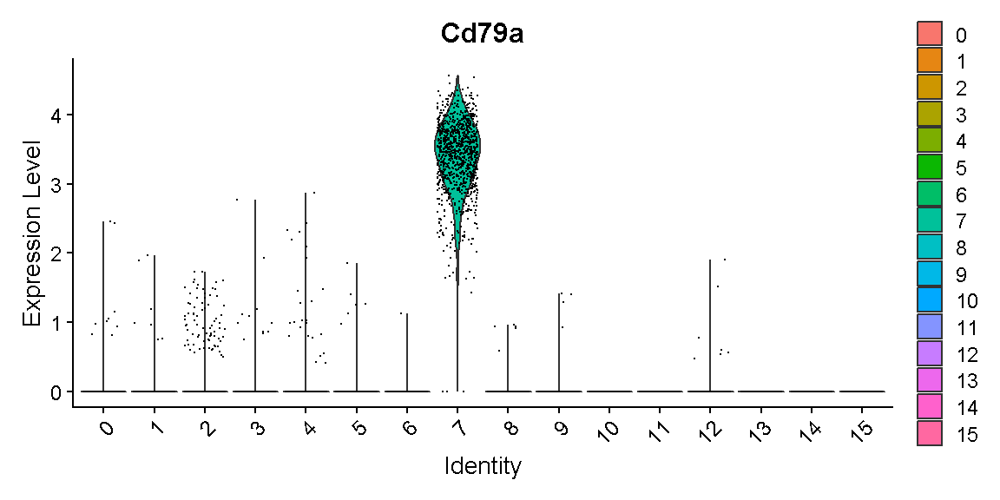
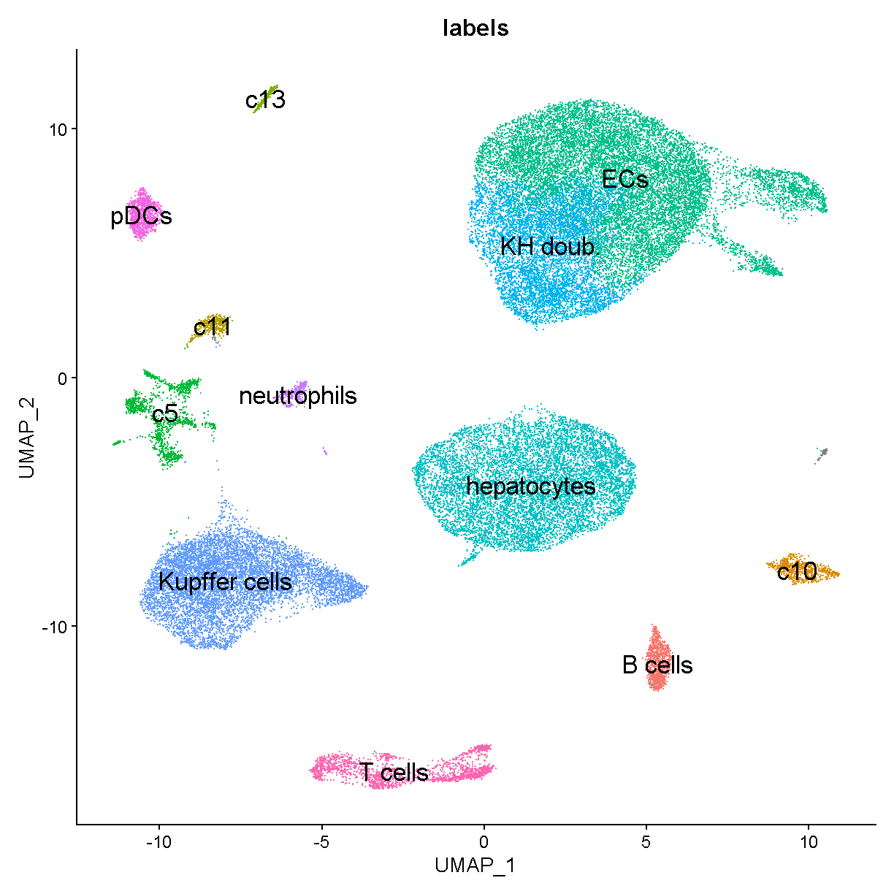
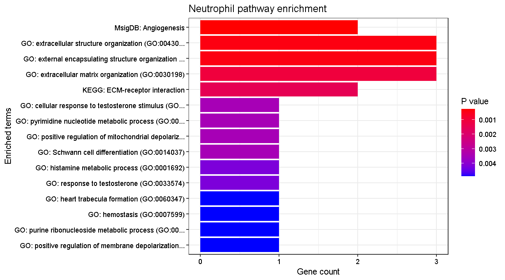

## Read Data from Previous Lesson

    liver <- readRDS(file.path(data_dir, 'lesson05.rds'))

{: .language-r}

## Batch correction

In bulk RNA-Seq experiments, it is usually vital that we apply a
correction for samples profiled in different batches. In single cell
RNA-Seq experiments the situation is a bit more nuanced. We certainly
want to take into consideration if our samples have been profiled in
different batches, but the point at which we do so can vary.

Consider this example. Distinguishing between cell types is a robust
process, in fact we can do a fairly good job distinguishing major cell
types with just a few dozen genes. We might expect that batch effects
are small enough that they would not strongly impede our ability to
identify cell types. We could do clustering and cell type
identification, then when we are doing differential expression testing
we could include a covariate for batch. This is an example where we
would be appropriately considering batch, but not at *every* step in the
analysis.

In contrast, in these liver data, we are going to show an example of why
batch correction earlier in the analytical process can be helpful. The
reason this section is included in the lesson on “biology-driven”
analyses is that we will bring in some understanding of biology to show
a specific example of cells that were separated (in UMAP space and in
different clusters) by an unknown batch-related factor when they should
have been clustering together as the same cell type.

We don’t know much about when these liver samples were profiled and what
differences in the mice, equipment, or operators there could have been.
There are 9 mice that were profiled in the data we are looking at. Let’s
start by looking at whether specific cell clusters in our clustering +
UMAP are derived largely from one or a few samples.

    table(liver$sample, liver$seurat_clusters)

{: .language-r}

           
               0    1    2    3    4    5    6    7    8    9   10   11   12   13
      CS144   73    9    1   20  866    4    2 1739   78    7  135  860   35    0
      CS48     2    0   12    0    0   49 2026    2    0    0    8    0    0    0
      CS52     1    0    1    0    0 3815  941    0    1    5   46    0   86   24
      CS53     0    0    1 4294    4    5    8    0  657 1161    0    0    8  632
      CS88  3854  218 1154    0    4    8    1    1    5    0  207    0    4    0
      CS89   152  116  381    2  691    0    0    0  200    0   13    1  155    0
      CS92  3589  111  980    1    4   10    6    2    1    0  195    0    4    0
      CS96   346 4298 1965    0    3    0    1    0    4    0  310    0    3    0
      CS97   107  276  309   10 2322    0    1    0  576    1   20    1  434    0
           
              14   15   16   17   18   19   20   21   22
      CS144  275   74   51    0   34   87   31  162   12
      CS48     0    0    5    0    0   10    0    0    0
      CS52     0    0   35    0    0   71    0    1    8
      CS53     0    2    0  402  161    0   51    1    0
      CS88     0    0  125    0    0   39    2    0   24
      CS89   125  143    6    0   57    4   75   57    3
      CS92     0    0  105    0    0   36    1    0   16
      CS96     0    0  197    0    1   73    2    0   37
      CS97   246  330    9    0  141    7  153   90    1

{: .output}

Notice cluster 13. Most of the cells are derived from mouse CS53. Let’s
look into this a little further. First we plot the cells in UMAP space
colored by mouse of origin, demonstrating some fairly clear batch
effects – indicated by

-   cell clusters that contain dots of only one or a few colors
-   clusters of different colors that are near each other but not
    overlapping

<!-- -->

    UMAPPlot(liver, group.by = 'sample', pt.size = 0.1)

{: .language-r}

Digging into cluster 13, let’s see what genes this cluster expresses

    markers13 <- FindMarkers(liver, '13', only.pos = TRUE, logfc.threshold = 1,
                             max.cells.per.ident = 500)
    head(markers13, 6)

{: .language-r}

                  p_val avg_log2FC pct.1 pct.2     p_val_adj
    Cd79a 1.522095e-182   4.872052 0.998 0.011 3.612083e-178
    Ighm  9.665832e-180   4.590161 0.998 0.088 2.293798e-175
    Cd79b 4.198574e-177   4.266749 0.989 0.060 9.963636e-173
    Ebf1  2.315879e-175   3.988633 0.968 0.010 5.495813e-171
    Igkc  1.606549e-172   6.285021 0.974 0.058 3.812501e-168
    Iglc2 3.423270e-164   4.173198 0.939 0.015 8.123761e-160

{: .output}

We’ll talk in detail about the information in this type of table later.
For now, just be aware that these are genes that are expressed much more
highly in cluster 13 than in the other cells.

Look at the genes we are finding. These genes are expressed in almost
all cells of cluster 13 (column `pct.1`) and in few of the cells in
other clusters (column `pct.2`). An immunologist would likely recognize
these as B cell genes. The gene Cd79a is very frequently captured well
in single cell transcriptomics and is highly specific to B cells. Let’s
look at where Cd79a is expressed.

    VlnPlot(liver, 'Cd79a')

{: .language-r}

Expression of this gene is very clearly **ON** in clusters 13 and 21,
and **OFF** in all other clusters. Let’s look at where clusters 13 and
21 are:

    FeaturePlot(liver, "Cd79a", cols = c('lightgrey', 'red'), 
                label = TRUE, label.size = 6)

{: .language-r}

Interesting. Clusters 13 and 21 are right next to each other. Recall
that we saw that cluster 13 cells are largely derived from a single
mouse. Looking at cluster 21:

    table(liver$sample[liver$seurat_clusters == '21'])

{: .language-r}

    CS144  CS52  CS53  CS89  CS97 
      162     1     1    57    90 

{: .output}

we can see that this cluster contains cells from several mice. Both
clusters 13 and 21 are B cells – you can verify this on your own by
looking at expression of other B cell marker genes. It is unlikely that
there would be heterogeneous types of B cells that segregate almost
perfectly between different batches. Rather, it seems that there is some
batch-driven pattern in gene expression that is causing these cells to
cluster separately when they should cluster together.

In the liver cell atlas paper [Guilliams et
al](https://www.cell.com/cell/fulltext/S0092-8674(21)01481-1) from which
we obtained these data, the authors applied a batch correction across
samples. They used a method called harmony. We will run harmony on the
subset of data that we are working with. We expect that a successful
batch correction algorithm will bring the cells in clusters 13 and 21
together into a single cluster.

Harmony is an algorithm that projects cells into a shared
low-dimensional embedding. In an iterative process, harmony learns
cell-specific linear adjustment factors in order to integrate datasets
in a way that favors clusters containing cells from multiple datasets.
At the same time, the method has features that allow it to maintain
separation of cell clusters that are unique to particular datasets. The
harmony method is described in [Korsunsky et
al. 2019](https://www.nature.com/articles/s41592-019-0619-0) and has a
website at [this link](https://portals.broadinstitute.org/harmony/). The
following animation, available from [this
link](https://slowkow.com/notes/harmony-animation/) in a beautiful and
comprehensive workup by [Kamil Slowikowski](https://slowkow.com/), shows
in a visual manner how cells from different donors are integrated
together

<!--  -->

Let’s run harmony on the liver data. Harmony itself returns a
low-dimensional embedding of the cells, much like the reduced
dimensional embedding of cells that we previously produced in PC-space.
Recall that we performed clustering and projection to two dimensions
with UMAP all using the PCA dimension reduction. We will now redo those
steps but use the *harmony* reduction instead. Note that harmony has
several parameters that could be tweaked. The most important may be
theta. Higher values of theta force more mixing across batches. We will
use the same values of each parameter that the authors of the liver cell
atlas used – their code is available at [this
link](https://github.com/guilliottslab/scripts_GuilliamsEtAll_Cell2022/blob/main/3b_Harmony.R).

After we run harmony using the same parameters the authors used, we will
look at the harmony components and decide how many to use – in a way
analogous to deciding how many PCs to use for UMAP and clustering.

    # Store old UMAP and old clusters
    liver$before_harmony_clusters <- liver$seurat_clusters
    liver@misc$noharmony_umap <- liver@reductions$umap

    # Run harmony
    liver <- RunHarmony(liver, 'sample', assay.use='RNA',
               theta=1, dims.use=1:40, max.iter.harmony=100)
    ElbowPlot(liver, reduction = 'harmony', ndims = 40)

{: .language-r}

Let’s again pick 24 dimensions, just like we looked at 24 dimensions in
PC space.

    liver <- FindNeighbors(liver, reduction='harmony', dims=1:24) %>%
        FindClusters(verbose=FALSE, resolution=0.3) %>%
        RunUMAP(dims=1:24, reduction='harmony')

{: .language-r}

    Computing nearest neighbor graph

{: .output}

    Computing SNN

{: .output}

    Warning: The default method for RunUMAP has changed from calling Python UMAP via reticulate to the R-native UWOT using the cosine metric
    To use Python UMAP via reticulate, set umap.method to 'umap-learn' and metric to 'correlation'
    This message will be shown once per session

{: .warning}

    06:57:35 UMAP embedding parameters a = 0.9922 b = 1.112

{: .output}

    06:57:35 Read 44253 rows and found 24 numeric columns

{: .output}

    06:57:35 Using Annoy for neighbor search, n_neighbors = 30

{: .output}

    06:57:35 Building Annoy index with metric = cosine, n_trees = 50

{: .output}

    0%   10   20   30   40   50   60   70   80   90   100%

{: .output}

    [----|----|----|----|----|----|----|----|----|----|

{: .output}

    **************************************************|
    06:57:38 Writing NN index file to temp file /var/folders/42/vng3302d5jn562sj58fjzszwhbfnwc/T//RtmpwErIQn/file5a9116164cfb
    06:57:38 Searching Annoy index using 1 thread, search_k = 3000
    06:57:48 Annoy recall = 100%
    06:57:48 Commencing smooth kNN distance calibration using 1 thread with target n_neighbors = 30
    06:57:51 Initializing from normalized Laplacian + noise (using irlba)
    06:58:01 Commencing optimization for 200 epochs, with 1893512 positive edges
    06:58:23 Optimization finished

{: .output}

    liver$after_harmony_clusters <- liver$seurat_clusters

{: .language-r}

Now let’s see where the cells from the former clusters 13 and 21 appear
in our new clustering.

    table(liver$before_harmony_clusters, 
          liver$after_harmony_clusters)[c('13', '21'), ]

{: .language-r}

        
           0   1   2   3   4   5   6   7   8   9  10  11  12  13  14  15
      13   0   0   0   0   0   0   0 656   0   0   0   0   0   0   0   0
      21   0   0   0   0   0   1   0 310   0   0   0   0   0   0   0   0

{: .output}

These cells are *all* in the new cluster 8. This cluster exclusively
expresses the B cell gene Cd79a, suggesting that the harmony batch
correction has accomplished the task that we had hoped.

    FeaturePlot(liver, 'Cd79a', cols = c('lightgrey', 'red'), label = T, 
                label.size = 6)

{: .language-r}

    VlnPlot(liver, 'Cd79a')

{: .language-r}

We will work with the harmony clusters from this point forward. In a
real analysis we should spend more time trying different parameters and
verifying that our results are robust to a variety of different choices.
We might also examine other cell clusters that were specific to one
batch in an effort to determine whether they are like this B cell
example and *should* be better aligned between batches, or whether the
cells are truly unique to that batch and *should not* be aligned with
cells present in other batches.

## Finding marker genes

Now we will find marker genes for our clusters. Finding marker genes
takes a while so we will downsample our data to speed up the process.
The `downsample` argument to the `subset()` function means that Seurat
will take a random 300 (maximum) cells from each cluster in our
`liver_mini` object. Even with the downsampled data this marker-finding
will take a few minutes.

    liver_mini <- subset(liver, downsample = 300)
    markers <- FindAllMarkers(liver_mini, only.pos = TRUE, 
        logfc.threshold = log2(1.25), min.pct = 0.2) 

{: .language-r}

These cluster marker genes are very useful. By definition, the marker
genes vary in expression between the cells in our dataset. Therefore
each gene is helping to capture some aspect of the cellular
heterogeneity found within the liver tissue we profiled.

The most important task we will carry out using our marker genes is the
identification of cell type labels for each cluster. One approach to
obtaining cell type labels is to use an automated method like `SingleR`,
which was introduced in [Aran et
al. 2019](https://doi.org/10.1038/s41590-018-0276-y) and has a companion
Bioconductor package
[here](https://bioconductor.org/packages/release/bioc/html/SingleR.html).
This method &gt; performs unbiased cell type recognition from
single-cell RNA sequencing &gt; data, by leveraging reference
transcriptomic datasets of pure cell &gt; types to infer the cell of
origin of each single cell independently.

A method like `SingleR` is a great option for taking a first look at
your data and getting a sanity check for what cell types are present.
However, we find that the reference cell type data are often
insufficient to categorize the full cellular diversity in many datasets.
An automated method might be a great way to initially identify T cells,
macrophages, or fibroblasts – but might struggle with categorizing more
detailed subsets like inflammatory macrophages or activated fibroblasts.

The “classic” way to identify cell types in your scRNA-Seq data is by
looking at the marker genes and manually labelling each cell type. This
manual method has been used ever since the first single cell
transcriptomic studies of tissue cellular heterogeneity. There are both
advantages and disadvantages to the manual approach. The advantages
include:

-   The ability to utilize considerable subjective judgement – after
    all, you should be familiar with the tissue you are looking at and
    you can label cells with arbitrary levels of precision and
    descriptiveness
-   The possibility to identify cells that are not well represented in
    existing data/databases like that used by `SingleR`

Disadvantages include:

-   This method can be slow and tedious
-   Your biological knowledge of the tissue might cause you to mislabel
    cells

We will show an example of this type of cell type identification below.

One could also integrate your data with other existing datasets that
have cell labels, and do label transfer. There is more information on
this topic in lesson 7 where you will have the opportunity to
(potentially) try out this approach on your own data. This is a very
useful approach that is likely to become increasingly useful as the
scientific community accumulates more and more scRNA-Seq datasets.

## Identifying cell types

Let’s plot the expression of some of the major cell type markers. Look
at the data.frame `markers` for a summary of the markers we found above.
We’ll massage the `markers` data.frame into a more tidy format:

    old_markers <- markers
    markers <- as_tibble(markers) %>% 
      select(cluster, gene, avg_log2FC, pct.1, pct.2, p_val_adj)
    head(markers, 6)

{: .language-r}

    # A tibble: 6 × 6
      cluster gene   avg_log2FC pct.1 pct.2 p_val_adj
      <fct>   <chr>       <dbl> <dbl> <dbl>     <dbl>
    1 0       Oit3         2.40 0.99  0.176 2.08e-268
    2 0       Cyp4b1       2.15 0.977 0.168 7.00e-256
    3 0       Flt4         2.21 0.96  0.169 4.69e-255
    4 0       Stab2        2.50 0.987 0.194 1.60e-253
    5 0       Adam23       2.17 0.927 0.15  1.70e-245
    6 0       Cldn5        2.21 0.973 0.165 1.49e-241

{: .output}

In the `markers` tibble, the columns have the following meanings:

-   cluster – the cluster in which expression of the marker gene is
    enriched
-   gene – the gene that has high expression in this cluster
-   avg\_log2FC – the log2 fold change difference in expression of the
    gene between this cluster compared to *all* the rest of the cells
-   pct.1 – the fraction of cells in this cluster that express the gene
    (expression is just quantified as a nonzero count for this gene)
-   pct.2 – the fraction of cells *not* in this cluster (i.e. all other
    cells) that express the gene
-   p\_val\_adj – a multiple testing corrected p-value (Bonferroni
    corrected) for the marker indicating the significance of expression
    enrichment in this cluster compared to all other cells

You should be aware of one weakness of finding cell types using this
approach. As mentioned above, this marker gene-finding function compares
expression of a gene in cluster X to expression of the gene in all other
cells. But what if a gene is highly expressed in cluster X and in some
other tiny cluster, cluster Y? If we compare cluster X to all other
cells, it will look like the gene is specific to cluster X, when really
the gene is specific to both clusters X and Y. One could modify the
marker gene-finding function to compare all clusters in a pairwise
fashion and then unify the results in order to get around this issue.
Dan Skelly has some code available
[here](https://gist.github.com/daskelly/09c1d2ae8dc3b1de1fe2ec2dbd0dd44d)
that implements such an approach in the Seurat framework, should you
wish to try it. For this course we will not get into such a level of
detail.

Let’s look at the top 3 markers for each cluster:

    group_by(markers, cluster) %>% arrange(desc(avg_log2FC)) %>%
      mutate(rank = 1:n()) %>%
      filter(rank <= 3) %>%
      pivot_wider(-c(avg_log2FC, pct.1, pct.2, p_val_adj), 
                  names_from = 'rank', values_from = 'gene') %>%
      arrange(cluster)

{: .language-r}

    # A tibble: 16 × 4
    # Groups:   cluster [16]
       cluster `1`     `2`    `3`     
       <fct>   <chr>   <chr>  <chr>   
     1 0       Clec4g  Kdr    Dnase1l3
     2 1       Fabp1   Aldob  Gnmt    
     3 2       Kdr     Clec4g Dnase1l3
     4 3       Clec4f  Cd5l   Vsig4   
     5 4       Ccl5    Gzma   Nkg7    
     6 5       Lyz2    S100a4 Ccr2    
     7 6       Ly6a    Efnb1  Tm4sf1  
     8 7       Igkc    Cd79a  Cd79b   
     9 8       Siglech Ly6d   Klk1    
    10 9       Cd5l    Wfdc17 Lgmn    
    11 10      Dcn     Ecm1   Colec11 
    12 11      Cst3    Naaa   H2-Ab1  
    13 12      Rspo3   Fabp4  Vwf     
    14 13      Spp1    Clu    Tm4sf4  
    15 14      S100a9  S100a8 Il1b    
    16 15      Cd5l    C1qa   Slc40a1 

{: .output}

Recognizing these genes might be a big challenge if you are not used to
looking at single cell gene expression. Let’s check out expression of
the very top genes in each cell cluster:

    top_markers <- group_by(markers, cluster) %>% 
      arrange(desc(avg_log2FC)) %>%
      top_n(1, avg_log2FC) %>% pull(gene)
    VlnPlot(liver, features = top_markers, stack = TRUE, flip = TRUE)

{: .language-r}

What does this tell us? Well, there are some genes here that are quite
specific to one cluster (e.g. S100a9, Spp1, Ccl5, Siglech), but there
are a few markers that are not very good markers at all (e.g. Fabp1,
Cst3) and some that are not very specific (e.g. Clec4f, Cd5l, Kdr,
Clec4g).

Let’s look at one of these last kinds of markers – Kdr. Our violin plot
above shows that this gene is expressed in clusters 0, 2, 6, and 12. If
we look at a UMAP plot

    UMAPPlot(liver, label = TRUE, label.size = 6) + NoLegend()

{: .language-r}

we see that these clusters are smaller bits of a large cloud of points
in UMAP space. This is probably a relatively heterogenous cell type or
or a continuum of cells (e.g. differentiating cells or cells being
activated by some stimulus). Nevertheless it is fairly clear that these
cells all express Kdr:

    FeaturePlot(liver, "Kdr", cols = c('lightgrey', 'red'))

{: .language-r}

If we do some digging, we see that Kdr encodes [vascular endothelial
growth factor receptor 2](https://www.uniprot.org/uniprotkb/P35968). In
the liver, we would expect endothelial cells to be fairly abundant.
Therefore we can already say with relatively high confidence that
clusters 0, 2, 6, and 12 are endothelial cells.

Looking again at the violin plot above, there are some genes that are
often seen in scRNA-Seq data and are excellent markers:

-   *S100a9* is a marker for neutrophils (or the broader category of
    granulocytes)
-   *Ccl5* (which encodes RANTES) is a marker for T cells. The T cell
    cluster might also include some other related immune cell types
    (natural killer \[NK\] cells and innate lymphoid cells \[ILCs\])
-   *Siglech* is a marker for plasmacytoid dendritic cells

We have now identified (at least tentative) cell types for clusters 0,
2, 4, 6, 9, 12, and 14.

Let’s turn to those markers that seemed to be expressed across all or
almost all cell types (recall Cst3 and Fabp1). Let’s focus on cluster 1.
This is a pretty large cluster. In our violin plot cluster 1 is marked
only by Fabp1, which is much higher in cluster 1 than in any other
cluster, but still has high background in ALL clusters.

Doing a bit of sleuthing, we find that Fabp1 is expressed in
hepatocytes. For example, [this
reference](https://www.ncbi.nlm.nih.gov/pmc/articles/PMC4655993/) says
that Fabp1 is found abundantly in the cytoplasm of hepatocytes. It also
makes sense that cluster 1 is hepatocytes because this cluster is large
and we expect a lot of hepatocytes in the liver.

However, why do we see high background levels of Fabp1? The reason might
be due to ambient RNA. If a liver cell lyses and releases its contents
into the “soup”, the cell’s RNA molecules could tag along for the ride
in any droplet with any other cell type. This ambient RNA would act as
noise in the transcriptome of each cell. The problem of ambient RNA can
vary considerably between samples. A recent paper by [Caglayan et
al](https://pubmed.ncbi.nlm.nih.gov/36240767/) gives a nice case study
and examines the phenomenology of ambient RNA in single nucleus RNA-Seq.
There are several methods to correct for high levels of ambient RNA,
with [CellBender](https://cellbender.readthedocs.io/en/latest/) showing
good performance in multiple studies.

To examine whether these data show evidence of a hepatocyte ambient RNA
signature, we start by looking at our non-specific marker Fabp1:

    FeaturePlot(liver, "Fabp1", cols = c('lightgrey', 'red'))

{: .language-r}

This seems consistent with our expectations based on what we know about
ambient RNA. Let’s look at another hepatocyte marker:

    FeaturePlot(liver, "Serpina1a", cols = c('lightgrey', 'red'))

{: .language-r}

Very similar. We tentatively conclude that this dataset has a noticeable
amount of hepatocyte ambient RNA contributing to all cell
transcriptomes. Let’s label cluster 1 as hepatocytes.

Because of *Fabp1* and other noisy markers in our cluster-specific gene
expression data.frame, we’ll try filtering our markers to grab only
those that are not expressed too highly (on average) in all the other
cells:

    specific_markers <- group_by(markers, cluster) %>% 
      arrange(desc(avg_log2FC)) %>%
      filter(pct.2 < 0.2) %>%
      arrange(cluster) %>%
      top_n(1, avg_log2FC) %>% pull(gene)
    VlnPlot(liver, features = specific_markers, stack = TRUE, flip = TRUE)

{: .language-r}

This looks better – the markers are more specific. We do have a marker
for the hepatocytes (cluster 1) that looks better than before. However,
this gene – *Inmt* – does not seem to be a very good hepatocyte marker
according to the literature. Thus our filter to remove non-specific
markers may have gotten rid of most of the strongly hepatocyte-specific
gene expression.

In this violin plot we do have some instances where a marker seems to be
specific to two or three cell clusters (e.g. Vsig4, Stab2, etc).

Stab2 is marking the endothelial cells we already identified (or at
least some of them). Let’s look at Vsig4:

    FeaturePlot(liver, "Vsig4", cols = c('lightgrey', 'red'), label = TRUE,
                label.size = 6)

{: .language-r}

This is marking clusters 3, 8, and 15. Clusters 3 and 8 are very near
each other. Vsig4 is an immune protein (V-set and immunoglobulin domain
containing 4). The protein [is
expressed](https://www.proteinatlas.org/ENSG00000155659-VSIG4/tissue)
selectively in – among other cell types – Kupffer cells, which are the
macrophages of the liver. Clusters 3 and 8 may be Kupffer cells. Let’s
check a famous macrophage marker, F4/80 (gene name Adgre1):

    FeaturePlot(liver, "Adgre1", cols = c('lightgrey', 'red'), label = TRUE,
                label.size = 6)

{: .language-r}

Cluster 15 expresses *Adgre1* but is near the hepatocyte cluster we just
discussed. In fact it is located between the hepatocyte and Kupffer cell
clusters. Cluster 15 might represent hepatocyte-Kupffer cell doublets.
Consistent with this theory, cluster 15 has intermediate expression of
Kupffer cell-specific *Adgre1* and hepatocyte-specific *Fabp1*.

    VlnPlot(liver, c("Adgre1", "Fabp1"), idents = c('3', '15', '1'), sort = T)

{: .language-r}

Let’s store our labels and look at what remains unidentified.

    labels <- tibble(cluster_num = unique(liver$after_harmony_clusters)) %>%
      mutate(cluster_num = as.character(cluster_num)) %>%
      mutate(cluster_name = case_when(
        cluster_num %in% c('0', '2', '6', '12') ~ 'ECs',   # endothelial cells
        cluster_num == '1' ~ 'hepatocytes',
        cluster_num %in% c('3', '8') ~ 'Kupffer cells',
        cluster_num == '4' ~ 'T cells',
        cluster_num == '9' ~ 'pDCs',               # plasmacytoid dendritic cells
        cluster_num == '14' ~ 'neutrophils',
        cluster_num == '15' ~ 'KH doub.',          # Kupffer-hepatocyte doublets
        TRUE ~ cluster_num))

    liver$labels <- deframe(labels)[as.character(liver$after_harmony_clusters)]
    UMAPPlot(liver, label = TRUE, label.size = 6, group.by = 'labels') + NoLegend()

{: .language-r}

> Exercise – have students identify cell types Might direct them to the
> Panglao database at <https://panglaodb.se/index.html> They could ask:
> is it an immune cell? If yes it likely expresses CD45 (Ptprc)

## Differential expression

Looking for differential expression can be thought of as a problem that
is related to finding cell type marker genes. Marker genes are, by
definition, genes that vary significantly between cell types. Often we
are most interested in the expression of genes that specifically mark
particular cell types that we are interested in, but there can also be
value in using broader markers (e.g. CD45 - encoded by the gene *Ptprc*
- marks all immune cells).

In scRNA-Seq, differential expression usually refers to differences
*within* a given cell type rather than *between* cell types. For
example, maybe we administer a drug and wish to see how gene expression
of control group hepatocytes differs from treatment group hepatocytes.

Because the liver dataset we are working with is a *cell atlas*, there
is no convenient experimental factor to use in our differential
expression comparison. Nevertheless, we will illustrate how a
differential expression test could look by making up a fake experimental
factor.

    libraries <- unique(liver$sample)
    treatment_group <- setNames(c(rep('control', 5), rep('drug', 4)), libraries)
    liver$trt <- treatment_group[liver$sample]

    hepatocytes <- subset(liver, labels == "hepatocytes")
    Idents(hepatocytes) <- "trt"
    UMAPPlot(hepatocytes, split.by = 'trt', group.by = 'labels', label = T,
             label.size = 6)

{: .language-r}

We will look for differential expression between the control and drug
administration groups defined by this fake drug/control factor. The
differentially expressed genes (DEGs) can inform our understanding of
how the drug affects the biology of cells in the tissue profiled. One
quick and easy way to look for DEGs is to use the marker gene-finding
function in Seurat, because as discussed above the problem of
differential expression is related to finding cell type marker genes.

    deg1 <- FindMarkers(hepatocytes, ident.1 = 'drug', ident.2 = 'control',
                        logfc.threshold = 0.2, only.pos = FALSE)

{: .language-r}

However this approach is not ideal. It may work OK if we only have on
mouse sample from each treatment group, with thousands of cells profiled
per mouse. However, when we have multiple mice, we are failing to take
into account the fact that cells from a single mouse are not fully
independent. For example, if cells from one mouse are contributing the
majority of drug-treated hepatocyte cells, and this one mouse is an
outlier that happened to have only minimal response to the drug, then we
might be fooled into thinking that the drug does not perturb hepatocytes
when in actuality the response is minimal only in that particular mouse.

Let’s look at our results:

    head(deg1, 10)

{: .language-r}

                     p_val avg_log2FC pct.1 pct.2     p_val_adj
    Uox       0.000000e+00 -0.8535298 0.955 0.981  0.000000e+00
    Cyp3a11   0.000000e+00 -2.4063893 0.278 0.643  0.000000e+00
    Rpl36al   0.000000e+00 -0.8487476 0.701 0.898  0.000000e+00
    Gm42418   0.000000e+00  1.7097734 0.979 0.974  0.000000e+00
    AY036118  0.000000e+00  1.5513296 0.811 0.421  0.000000e+00
    Malat1    0.000000e+00  1.2907213 0.750 0.342  0.000000e+00
    Gstm1    6.966145e-290 -0.8142940 0.952 0.977 1.653136e-285
    Car3     7.153127e-268 -0.7219298 0.978 0.994 1.697508e-263
    Nme2     5.294664e-261 -1.0555592 0.046 0.338 1.256477e-256
    C3       4.252427e-251  0.8984725 0.909 0.717 1.009143e-246

{: .output}

Wow! We have a lot of genes with apparently very strong statistically
significant differences between the control and drug administered
groups. Does this make sense? No, we just made up the control and drug
groups! In fact, the results above are an indication of the caution that
should be applied when applying a test that does not consider biological
replicates. What are we finding here? The second top gene, *Cyp3a11*, is
a cytochrome P450-family gene and its transcript is higher in the fake
control mice than the fake drug treated mice. Maybe there is some
biological meaning that could be extracted from this if we had more
detailed information on the conditions under which the fake control and
fake drug administered mouse groups were reared.

Nevertheless, let’s consider a more statistically robust approach to
differential expression in scRNA-Seq. This approach is to collapse all
cells from each biological replicate to form a “pseudobulk” sample. Then
one can use tools developed for bulk RNA-Seq samples (e.g. DESeq2 or
edgeR) to identify DEGs. This could look like the following:

    # Make pseudobulks.
    cts <- GetAssayData(hepatocytes, 'counts')
    pseudobulk <- aggregate(t(cts), hepatocytes$sample, fun = 'sum') %>% t()
    dim(pseudobulk)

{: .language-r}

    [1] 23731     9

{: .output}

    head(pseudobulk, 6)

{: .language-r}

    6 x 9 sparse Matrix of class "dgCMatrix"
            CS144 CS48 CS52 CS53 CS88 CS89 CS92 CS96 CS97
    Xkr4        .    .    .    .    .    .    .    .    .
    Rp1         .    .    .    .    .    .    .    .    .
    Sox17      11    1    5    .   11    2    7   34    .
    Gm37323     .    .    .    .    .    .    .    .    .
    Mrpl15    811 3053 1480   11 1595  228 1367 2752  203
    Lypla1    456 2157  826    3  622  164  536 1068  209

{: .output}

    # Run DESeq2
    pseudobulk_metadata <- hepatocytes[[c("sample", "trt")]] %>%
      as_tibble() %>% distinct() %>% as.data.frame() %>%
      column_to_rownames('sample') %>%
      mutate(trt = as.factor(trt))
    pseudobulk_metadata <- pseudobulk_metadata[colnames(pseudobulk), , drop = F]
    dds <- DESeqDataSetFromMatrix(pseudobulk, 
                                  colData = pseudobulk_metadata, 
                                  design = ~ trt)

{: .language-r}

    converting counts to integer mode

{: .output}

    trt <- DESeq(dds, test = "LRT", reduced = ~ 1)

{: .language-r}

    estimating size factors

{: .output}

    estimating dispersions

{: .output}

    gene-wise dispersion estimates

{: .output}

    mean-dispersion relationship

{: .output}

    -- note: fitType='parametric', but the dispersion trend was not well captured by the
       function: y = a/x + b, and a local regression fit was automatically substituted.
       specify fitType='local' or 'mean' to avoid this message next time.

{: .output}

    final dispersion estimates

{: .output}

    fitting model and testing

{: .output}

    res1 <- results(trt)
    head(res1)

{: .language-r}

    log2 fold change (MLE): trt drug vs control 
    LRT p-value: '~ trt' vs '~ 1' 
    DataFrame with 6 rows and 6 columns
             baseMean log2FoldChange     lfcSE      stat    pvalue      padj
            <numeric>      <numeric> <numeric> <numeric> <numeric> <numeric>
    Xkr4      0.00000             NA        NA        NA        NA        NA
    Rp1       0.00000             NA        NA        NA        NA        NA
    Sox17     3.90444      0.8938840  1.266125  0.691011  0.405821  0.974534
    Gm37323   0.00000             NA        NA        NA        NA        NA
    Mrpl15  621.89476      0.0606093  0.243247  0.160019  0.689139  1.000000
    Lypla1  336.56032     -0.0468563  0.254556  0.318102  0.572750  0.977402

{: .output}

    sum(!is.na(res1$padj) & res1$padj < 0.05)

{: .language-r}

    [1] 0

{: .output}

No genes are significantly differentially expressed using this
pseudobulk + DESeq2 approach.

## Pathway enrichment

We may wish to look for enrichment of biological pathways in a list of
genes. Here we will show one example of completing this task. There are
many ways to do enrichment tests, and they are typically not conducted
in a way that is unique to single cell data thus you have a wide range
of options.

Here we will test for enrichment of biological function using our
neutrophil markers (our original cluster 14). We could do this with any
cell type but we pick neutrophils in the hope that they give a clear and
interpretable answer. We will query three databases: KEGG, Gene Ontology
biological process, and MSigDB Hallmark pathways:

    db_names <- c("KEGG"='KEGG_2019_Mouse',
                  "GO"='GO_Biological_Process_2021',
                  "MsigDB"='MSigDB_Hallmark_2020')
    genes <- filter(markers, cluster == '14') %>%
      top_n(100, avg_log2FC) %>% pull(gene)
    enrich_genes <- enrichr(genes, databases = db_names)

{: .language-r}

    Uploading data to Enrichr... Done.
      Querying KEGG_2019_Mouse... Done.
      Querying GO_Biological_Process_2021... Done.
      Querying MSigDB_Hallmark_2020... Done.
    Parsing results... Done.

{: .output}

    names(enrich_genes) <- names(db_names)
    e <- bind_rows(enrich_genes, .id = 'database') %>%
      mutate(Term = paste0(database, ': ', Term))
    plotEnrich(e, title = "Neutrophil pathway enrichment", 
               showTerms = 15, numChar = 50)

{: .language-r}

OK, these results look appropriate for neutrophil biological function!
