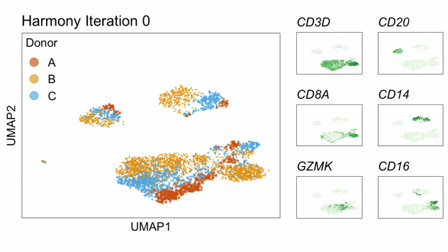
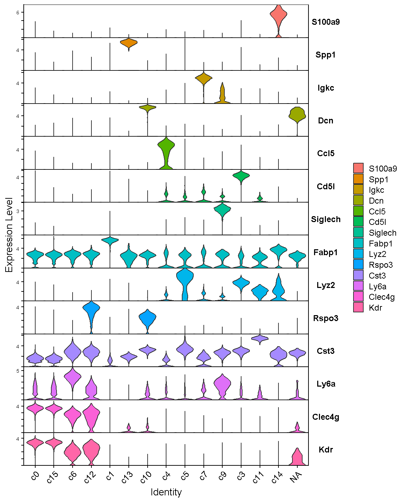
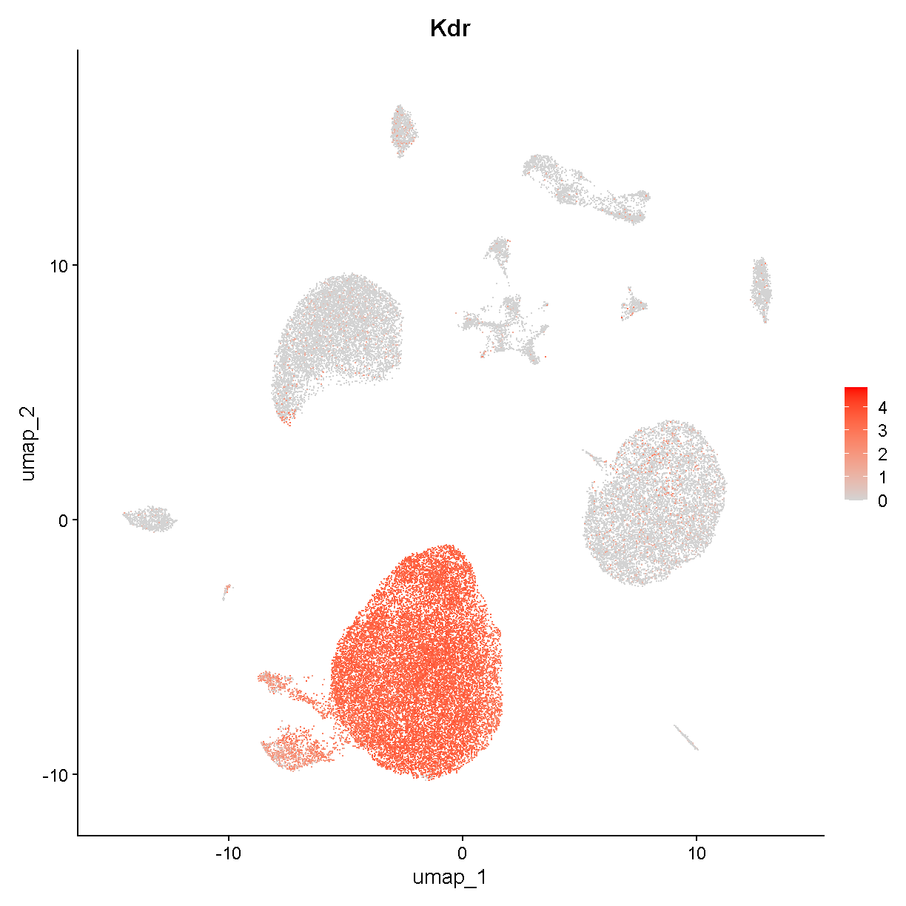
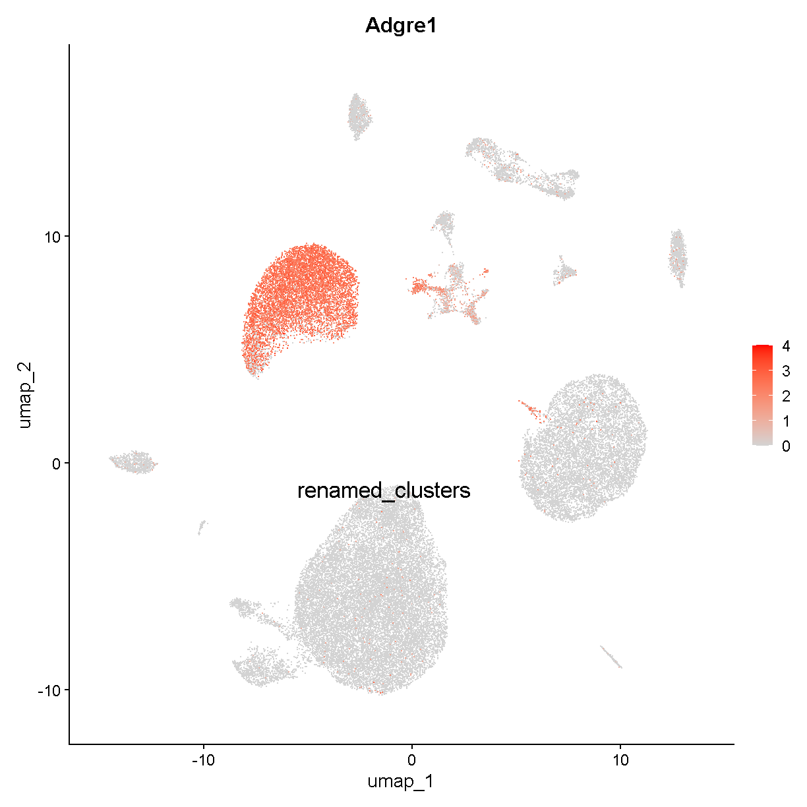
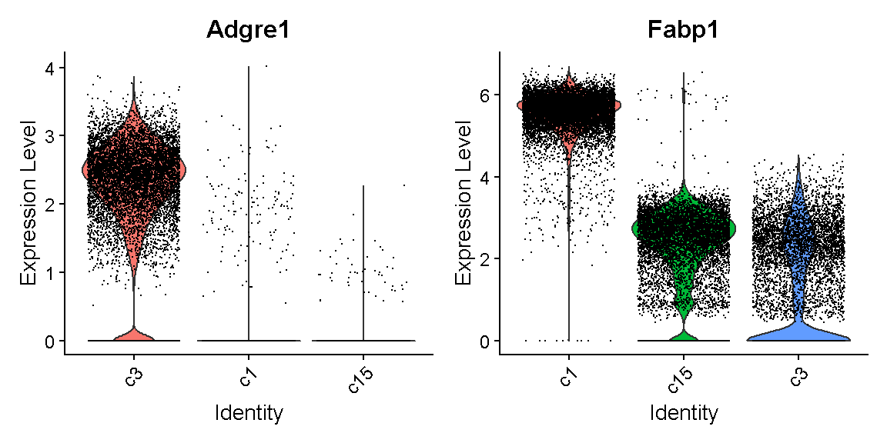

---
# Please do not edit this file directly; it is auto generated.
# Instead, please edit 06-Biology-Driven-Analyses.md in _episodes_rmd/
source: Rmd
title: "Biology Driven Analyses of scRNA-Seq"
teaching: 120
exercises: 10
questions:
- "What are some scRNA-Seq analyses that might provide me with biological insight?"
objectives:
- "Gain an understanding of some of the important caveats for identifying major cell types in scRNA-Seq."
- "Understand the ability (and limitations) of scRNA-Seq data for quantifying differences in gene expression."
- "Have basic ability to be able to conduct enrichment analyses of gene expression in scRNA-Seq."
keypoints:
- "Identifying cell types is a major objective in scRNA-Seq and can be present challenges that are unique to each dataset."
- "Statistically minded experimental design enables you to perform differential gene expression analyses that are likely to result in meaningful biological results."

---

~~~
# set a seed for reproducibility in case any randomness used below
set.seed(1418)
~~~
{: .language-r}

## Read Data from Previous Lesson

~~~
liver <- readRDS(file.path(data_dir, 'lesson05.rds'))
~~~
{: .language-r}

## Batch correction

In bulk RNA-Seq experiments, it is usually vital that we apply a
correction for samples profiled in different batches. In single cell
RNA-Seq experiments the situation is a bit more nuanced. We certainly
want to take into consideration if our samples have been profiled in
different batches, but the point at which we do so can vary.

Consider this example. 
Distinguishing between cell types is a robust process, in fact
we can do a fairly good job distinguishing major cell types
with just a few dozen genes.
We might expect that batch effects are small enough that they would
not strongly impede our ability to identify cell types.
We could do clustering and cell type identification, then when
we are doing differential expression testing we could include a covariate
for batch.
This is an example where we would be appropriately considering batch,
but not at *every* step in the analysis.

In contrast, in these liver data, we are going to show an 
example of why batch correction earlier in the analytical
process can be helpful.
The reason this section is included in the lesson on
"biology-driven" analyses is that we will bring in some understanding
of biology to show a specific example of cells that were separated
(in UMAP space and in different clusters)
by an unknown batch-related factor when they should have been 
clustering together as the same cell type.

We don't know much about when these liver samples were profiled
and what differences in the mice, equipment, or operators there 
could have been. 
There are 9 mice that were profiled
in the data we are looking at.
Let's start by looking at whether specific cell clusters in our 
clustering + UMAP are derived largely from one or a few samples.

~~~
table(liver$sample, liver$seurat_clusters)
~~~
{: .language-r}

~~~
       
           0    1    2    3    4    5    6    7    8    9   10   11   12   13
  CS144   66   10    1   20    4  736    2 1747   77    8  990  135   35    0
  CS48     3    0   10    0   49    0 2028    2    0    0    0    7    0    0
  CS52     1    0    1    0 3815    0  941    0    1    5    0   46   86   24
  CS53     0    0    1 4284    4   21    8    0  650 1159    1    0    8  632
  CS88  3840  235 1154    0    8    4    1    1    5    0    0  206    4    0
  CS89   148  119  381    2    0  691    0    0  200    0    1   13  155    0
  CS92  3601  115  981    1    9    4    5    0    1    0    0  181    4    0
  CS96   299 4342 1965    0    0    3    1    0    4    0    0  312    3    0
  CS97    95  287  310   10    0 2321    1    0  575    1    3   20  434    0
       
          14   15   16   17   18   19   20   21   22
  CS144  274   74   51    0   33   87   31  162   12
  CS48     0    0    5    0    0   10    0    0    0
  CS52     0    0   35    0    0   71    0    1    8
  CS53     2    2    0  402  161    0   51    1    0
  CS88     0    0  123    0    0   39    2    0   24
  CS89   126  143    6    0   57    4   75   57    3
  CS92     0    0  105    0    0   36    1    0   17
  CS96     0    0  198    0    1   73    2    0   37
  CS97   246  330    9    0  141    7  153   90    1
~~~
{: .output}

Notice cluster 13. Most of the cells are derived from mouse CS53.
Let's look into this a little further.
First we plot the cells in UMAP space colored by mouse of origin,
demonstrating some fairly clear batch effects -- indicated by

 * cell clusters that contain dots of only one or a few colors
 * clusters of different colors that are near each other but not overlapping

~~~
UMAPPlot(liver, group.by = 'sample', pt.size = 0.1)
~~~
{: .language-r}

plot of chunk sample_effects

Let's see which genes are expressed in cluster 13.

~~~
markers13 <- FindMarkers(liver, '13', only.pos = TRUE, logfc.threshold = 1,
                         max.cells.per.ident = 500)
head(markers13, 6)
~~~
{: .language-r}

~~~
              p_val avg_log2FC pct.1 pct.2     p_val_adj
Cd79a 1.522138e-182   4.872144 0.998 0.011 3.062541e-178
Ighm  9.697775e-180   4.590252 0.998 0.088 1.951192e-175
Cd79b 4.198563e-177   4.266849 0.989 0.060 8.447508e-173
Ebf1  2.315879e-175   3.988742 0.968 0.010 4.659549e-171
Igkc  1.606549e-172   6.285070 0.974 0.058 3.232376e-168
Iglc2 3.423234e-164   4.173284 0.939 0.015 6.887546e-160
~~~
{: .output}

We'll talk in detail about the information in this type of table later.
For now, just be aware that these are genes that are expressed much more
highly in cluster 13 than in the other cells.

Look at the genes we are finding. These genes are expressed in almost
all cells of cluster 13 (column `pct.1`) and in few of the cells in other
clusters (column `pct.2`). 
An immunologist would likely recognize these as B cell genes. The gene 
Cd79a is very frequently captured well in single cell transcriptomics and
is highly specific to B cells. Let's look at where Cd79a is expressed.

~~~
VlnPlot(liver, 'Cd79a')
~~~
{: .language-r}

plot of chunk cd79a_vln

Expression of this gene is very clearly **ON** in clusters 13 and 21, 
and **OFF** in all other clusters. Let's look at where clusters 13 and 21
are:

~~~
FeaturePlot(liver, "Cd79a", cols = c('lightgrey', 'red'), 
            label = TRUE, label.size = 6)
~~~
{: .language-r}

plot of chunk cd79a_fp

Interesting. Clusters 13 and 21 are near each other. Recall that
we saw that cluster 13 cells are largely derived from a single mouse.
Looking at cluster 21:

~~~
table(liver$sample[liver$seurat_clusters == '21'])
~~~
{: .language-r}

~~~

CS144  CS52  CS53  CS89  CS97 
  162     1     1    57    90 
~~~
{: .output}

we can see that this cluster contains cells from several mice. 
Both clusters 13 and 21 are B cells -- you can verify this on your own by 
looking at expression of other B cell marker genes. 
It is unlikely that there would be heterogeneous types of B cells that
segregate almost perfectly between different batches. Rather, it seems that
there is some batch-driven pattern in gene expression that is causing
these cells to cluster separately when they should cluster 
together.

In the liver cell atlas paper 
[Guilliams et al](https://www.cell.com/cell/fulltext/S0092-8674(21)01481-1)
from which we obtained these data, the authors applied a batch
correction across samples. They used a method called harmony. 
We will run harmony on the subset of data that we are working with. 
We expect that a successful batch correction algorithm will bring the cells
in clusters 13 and 21 together into a single cluster.

Harmony is an algorithm that projects cells into a shared low-dimensional embedding.
In an iterative process, harmony learns cell-specific linear adjustment
factors in order to integrate datasets in a way that favors clusters 
containing cells from multiple datasets. At the same time, the method has
features that allow it to maintain separation of cell clusters that are
unique to particular datasets. 
The harmony method is described in 
[Korsunsky et al. 2019](https://www.nature.com/articles/s41592-019-0619-0)
and has a website at [this link](https://portals.broadinstitute.org/harmony/).
The following animation, available from 
[this link](https://slowkow.com/notes/harmony-animation/)
in a beautiful and comprehensive workup by 
[Kamil Slowikowski](https://slowkow.com/), shows in a visual manner
how cells from different donors are integrated together 

<!--  -->

Let's run harmony on the liver data. Harmony itself returns a
low-dimensional embedding of the cells, much like the reduced dimensional
embedding of cells that we previously produced in PC-space.
Recall that we performed clustering and projection to two dimensions with 
UMAP all using the PCA dimension reduction. We will now redo those 
steps but use the *harmony* reduction instead.
Note that harmony has several parameters that could be tweaked. The most
important may be theta. Higher values of theta force more mixing across 
batches. We will use the same values of each parameter that the authors
of the liver cell atlas used -- their code is available at 
[this link](https://github.com/guilliottslab/scripts_GuilliamsEtAll_Cell2022/blob/main/3b_Harmony.R).

After we run harmony using the same parameters the authors used, we will
look at the harmony components and decide how many to use -- in a way
analogous to deciding how many PCs to use for UMAP and clustering.

~~~
# Store old UMAP and old clusters
liver$before_harmony_clusters <- liver$seurat_clusters
liver@misc$noharmony_umap <- liver@reductions$umap

# Run harmony
liver <- RunHarmony(liver, 'sample', assay.use='RNA',
           theta=1, dims.use=1:40, max.iter.harmony=100)
ElbowPlot(liver, reduction = 'harmony', ndims = 40)
~~~
{: .language-r}

plot of chunk harmony

Let's again pick 24 dimensions, just like we looked at 24 dimensions
in PC space.

~~~
liver <- FindNeighbors(liver, reduction = 'harmony', dims = 1:24) %>%
         FindClusters(verbose = FALSE, resolution = 0.3) %>%
         RunUMAP(dims = 1:24, reduction = 'harmony')
~~~
{: .language-r}

~~~
Computing nearest neighbor graph
~~~
{: .output}

~~~
Computing SNN
~~~
{: .output}

~~~
08:34:02 UMAP embedding parameters a = 0.9922 b = 1.112
~~~
{: .output}

~~~
08:34:02 Read 44253 rows and found 24 numeric columns
~~~
{: .output}

~~~
08:34:02 Using Annoy for neighbor search, n_neighbors = 30
~~~
{: .output}

~~~
08:34:02 Building Annoy index with metric = cosine, n_trees = 50
~~~
{: .output}

~~~
0%   10   20   30   40   50   60   70   80   90   100%
~~~
{: .output}

~~~
[----|----|----|----|----|----|----|----|----|----|
~~~
{: .output}

~~~
**************************************************|
08:34:06 Writing NN index file to temp file C:\Users\c-dgatti\AppData\Local\Temp\RtmpOIVInV\fileb68034cb94e
08:34:06 Searching Annoy index using 1 thread, search_k = 3000
08:34:16 Annoy recall = 100%
08:34:17 Commencing smooth kNN distance calibration using 1 thread with target n_neighbors = 30
08:34:19 Initializing from normalized Laplacian + noise (using irlba)
08:34:29 Commencing optimization for 200 epochs, with 1888866 positive edges
08:35:06 Optimization finished
~~~
{: .output}

~~~
liver$after_harmony_clusters <- liver$seurat_clusters
~~~
{: .language-r}

Now let's see where the cells from the former
clusters 13 and 21 appear in our new clustering.

~~~
table(liver$before_harmony_clusters, 
      liver$after_harmony_clusters)[c('13', '21'), ]
~~~
{: .language-r}

~~~
    
       0   1   2   3   4   5   6   7   8   9  10  11  12  13  14
  13   0   0   0   0   0   0 656   0   0   0   0   0   0   0   0
  21   0   0   0   0   0   0 311   0   0   0   0   0   0   0   0
~~~
{: .output}

These cells are nearly *all* in one new cluster. This cluster
exclusively expresses the B cell gene Cd79a, suggesting that the
harmony batch correction has accomplished the task that we had hoped.

~~~
FeaturePlot(liver, 'Cd79a', cols = c('lightgrey', 'red'), label = T, 
            label.size = 6)
~~~
{: .language-r}

plot of chunk c8

~~~
VlnPlot(liver, 'Cd79a')
~~~
{: .language-r}

plot of chunk c9

We will work with the harmony clusters from this point forward.
In a real analysis we should spend more time trying different
parameters and verifying that our results are robust to a variety of
different choices. We might also examine other cell clusters that 
were specific to one batch in an effort to determine whether they
are like this B cell example and *should* be better aligned between 
batches, or whether the cells are truly unique to that batch and 
*should not* be aligned with cells present in other batches.

Next we take a step specific to this lesson that would not normally
be a part of your single cell data analysis. 
While developing
the course content we found some variability in the numbers
assigned to clusters. This may be due to minor variations in
package versions, because we do set a seed for random number 
reproducibility. In the next chunk we rename clusters to ensure
that we are all working with a common cluster numbering system.
Don't worry about how we got this list of genes for now.

~~~
genes <- c('Socs3', 'Gnmt', 'Timd4', 'Ms4a4b', 'S100a4',
           'Adgrg6', 'Cd79a', 'Dck', 'Siglech', 'Dcn', 
           'Wdfy4', 'Vwf', 'Spp1', 'Hdc')
Idents(liver) <- 'after_harmony_clusters'
a <- AverageExpression(liver, features = genes)[['RNA']]
highest_clu <- unname(colnames(a))[apply(a, 1, which.max)]

cluster_converter <- setNames(paste0('c', c(0:1, 3:14)), highest_clu)
remaining_clusters <- setdiff(as.character(unique(Idents(liver))),
                              highest_clu)
a <- AverageExpression(subset(liver, idents = remaining_clusters),
                       features = c("Lyve1", "Cd5l"))[['RNA']]
highest_clu <- unname(colnames(a))[apply(a, 1, which.max)]
cluster_converter[highest_clu] <- c('c2', 'c15')

liver$renamed_clusters <- cluster_converter[as.character(liver$after_harmony_clusters)]
Idents(liver) <- 'renamed_clusters'
~~~
{: .language-r}

## Finding marker genes 

Now we will find marker genes for our clusters. Finding marker genes takes a
while so we will downsample our data to speed up the process.
The `downsample` argument to the `subset()` function means that Seurat
will take a random 300 (maximum) cells from each cluster in our
`liver_mini` object.
Even with the downsampled data this marker-finding will take a few minutes.

~~~
liver_mini <- subset(liver, downsample = 300)
markers <- FindAllMarkers(liver_mini, only.pos = TRUE, 
                          logfc.threshold	= log2(1.25), min.pct = 0.2) 
~~~
{: .language-r}

These cluster marker genes are very useful. By definition, the 
marker genes vary in expression between the cells in our dataset.
Therefore each gene is helping to capture some aspect of the 
cellular heterogeneity found within the liver tissue we profiled.

The most important task we will carry out using our marker genes is
the identification of cell type labels for each cluster.
One approach to obtaining cell type labels is to use an automated
method like `SingleR`, which was introduced in 
[Aran et al. 2019](https://doi.org/10.1038/s41590-018-0276-y)
and has a companion Bioconductor package
[here](https://bioconductor.org/packages/release/bioc/html/SingleR.html).
This method 
> performs unbiased cell type recognition from single-cell RNA sequencing 
> data, by leveraging reference transcriptomic datasets of pure cell 
> types to infer the cell of origin of each single cell independently.

A method like `SingleR` is a great option for taking a first look at your
data and getting a sanity check for what cell types are present.
However, we find that the reference cell type data are often insufficient
to categorize the full cellular diversity in many datasets. 
An automated method might be a great way to initially identify 
T cells, macrophages, or fibroblasts -- but might struggle with 
categorizing more detailed subsets like inflammatory macrophages or
activated fibroblasts.

The "classic" way to identify cell types in your scRNA-Seq data
is by looking at the marker genes and manually labelling each cell type.
This manual method has been used ever since the first single cell 
transcriptomic studies of tissue cellular heterogeneity. 
There are both advantages and disadvantages to the manual approach.
The advantages include:

 * The ability to utilize considerable subjective judgement -- after all, you
 should be familiar with the tissue you are looking at and you can label
 cells with arbitrary levels of precision and descriptiveness
 * The possibility to identify cells that are not well represented in 
 existing data/databases like that used by `SingleR`
 
Disadvantages include:

 * This method can be slow and tedious;
 * Your biological knowledge of the tissue might cause you to mislabel cells.

We will show an example of this type of cell type identification
below.

One could also integrate your data with other existing datasets
that have cell labels, and do label transfer. There is more information
on this topic in lesson 7 where you will have the opportunity to
(potentially) try out this approach on your own data.
This is a very useful approach that is likely to become 
increasingly useful as the scientific community accumulates more
and more scRNA-Seq datasets.

## Identifying cell types

Let's plot the expression of some of the major cell type markers. Look at the 
data.frame `markers` for a summary of the markers we found above. We'll massage 
the `markers` data.frame into a more tidy format:

~~~
old_markers <- markers
markers <- as_tibble(markers) %>% 
              select(cluster, gene, avg_log2FC, pct.1, pct.2, p_val_adj)
head(markers, 6)
~~~
{: .language-r}

~~~
# A tibble: 6 × 6
  cluster gene    avg_log2FC pct.1 pct.2 p_val_adj
  <fct>   <chr>        <dbl> <dbl> <dbl>     <dbl>
1 c0      Stab2         2.40 0.987 0.218 2.21e-222
2 c0      Oit3          2.20 0.98  0.202 3.36e-218
3 c0      Flt4          2.12 0.967 0.202 2.86e-213
4 c0      Cyp4b1        2.16 0.953 0.197 1.43e-210
5 c0      Adam23        2.07 0.93  0.176 7.22e-210
6 c0      Fam167b       2.24 0.98  0.225 2.53e-205
~~~
{: .output}

In the `markers` tibble, the columns have the following meanings:

 * cluster -- the cluster in which expression of the marker gene is enriched
 * gene -- the gene that has high expression in this cluster
 * avg_log2FC -- the log2 fold change difference in expression of the gene
 between this cluster compared to *all* the rest of the cells
 * pct.1 -- the fraction of cells in this cluster that express the gene 
 (expression is just quantified as a nonzero count for this gene)
 * pct.2 -- the fraction of cells *not* in this cluster (i.e. all other cells)
 that express the gene 
 * p_val_adj -- a multiple testing corrected p-value (Bonferroni 
 corrected) for the marker indicating
 the significance of expression enrichment in this cluster compared to all
 other cells
 
You should be aware of one weakness of finding cell types using this approach. 
As mentioned above, this marker gene-finding function compares expression
of a gene in cluster X to expression of the gene in all other cells. But 
what if a gene is highly expressed in cluster X and in some other tiny 
cluster, cluster Y? If we compare cluster X to all other cells, it will look 
like the gene is specific to cluster X, when really the gene is
specific to both clusters X and Y. One could modify the marker gene-finding
function to compare all clusters in a pairwise fashion and then unify
the results in order to get around this issue.
Dan Skelly has some code available 
[here](https://gist.github.com/daskelly/09c1d2ae8dc3b1de1fe2ec2dbd0dd44d)
that implements such an approach in the Seurat framework, should you
wish to try it.

In this course, we will not get into this level of detail.

Let's look at the top 3 markers for each cluster:

~~~
group_by(markers, cluster) %>% 
  top_n(3, avg_log2FC) %>%
  mutate(rank = 1:n()) %>%
  pivot_wider(-c(avg_log2FC, pct.1, pct.2, p_val_adj), 
              names_from = 'rank', values_from = 'gene') %>%
  arrange(cluster)
~~~
{: .language-r}

~~~
Warning: Specifying the `id_cols` argument by position was deprecated in tidyr 1.3.0.
ℹ Please explicitly name `id_cols`, like `id_cols = -c(avg_log2FC, pct.1,
  pct.2, p_val_adj)`.
Call `lifecycle::last_lifecycle_warnings()` to see where this warning was
generated.
~~~
{: .warning}

~~~
# A tibble: 14 × 4
# Groups:   cluster [14]
   cluster `1`     `2`      `3`   
   <fct>   <chr>   <chr>    <chr> 
 1 c0      Bmp2    Clec4g   Fcgr2b
 2 c15     Kdr     Dnase1l3 Clec4g
 3 c6      Ednrb   Efnb1    Ly6a  
 4 c12     Rspo3   Fabp4    Vwf   
 5 c1      Gnmt    Aldob    Fabp1 
 6 c13     Spp1    Tm4sf4   Clu   
 7 c10     Dcn     Colec11  Ecm1  
 8 c4      Ccl5    Nkg7     Gzma  
 9 c5      S100a4  Chil3    Lyz2  
10 c7      Igkc    Cd79a    Cd79b 
11 c9      Siglech Klk1     Ccr9  
12 c3      Cd5l    Clec4f   C1qa  
13 c11     Naaa    H2-Ab1   Cst3  
14 c14     S100a9  S100a8   Il1b  
~~~
{: .output}

Recognizing these genes might be a big challenge if you are not used to looking 
at single cell gene expression. Let's check out expression of the very top genes
in each cell cluster:

~~~
top_markers <- group_by(markers, cluster) %>% 
                 arrange(desc(avg_log2FC)) %>%
                 top_n(1, avg_log2FC) %>% pull(gene)
VlnPlot(liver, features = top_markers, stack = TRUE, flip = TRUE)
~~~
{: .language-r}

plot of chunk top_markers2

What does this tell us? Well, there are some genes here that are quite specific 
to one cluster (e.g. S100a9, Spp1, Ccl5, Siglech), but there are a few markers 
that are not very good markers at all (e.g. Fabp1, Cst3) and some that are not 
very specific (e.g. Clec4f, Cd5l, Kdr, Clec4g).

Let's look at one of these last kinds of markers -- *Kdr*. Our violin plot above
shows that this gene is expressed in clusters c0, c6, c12, and c2.
If we look at a UMAP plot

~~~
UMAPPlot(liver, label = TRUE, label.size = 6) + NoLegend()
~~~
{: .language-r}

plot of chunk expr

we see that these clusters are smaller bits of a large cloud of points
in UMAP space. This is probably a relatively heterogenous cell type or
or a continuum of cells (e.g. differentiating cells or cells being
activated by some stimulus). Nevertheless it is fairly clear that
these cells all express Kdr:

~~~
FeaturePlot(liver, features = "Kdr", cols = c('lightgrey', 'red'))
~~~
{: .language-r}

plot of chunk expr2

If we do some digging, we see that Kdr encodes
[vascular endothelial growth factor receptor 2](https://www.uniprot.org/uniprotkb/P35968).
In the liver, we would expect endothelial cells to be fairly 
abundant. Therefore we can already say with relatively high
confidence that clusters c0, c2, c6, and c12 are endothelial cells.

Looking again at the violin plot above, there are some genes that
are often seen in scRNA-Seq data and are excellent markers:

 * *S100a9* is a marker for neutrophils (or the broader category of granulocytes) - c14
 * *Ccl5* (which encodes RANTES) is a marker for T cells. The T cell cluster might also include some other related immune cell types (natural killer [NK] cells and innate lymphoid cells [ILCs]) - c4
 * *Siglech* is a marker for plasmacytoid dendritic cells - c9

We have now identified (at least tentative) cell types for clusters
c0, c2, c4, c6, c9, c12, and c14. 

Let's turn to those markers that seemed to be expressed across
all or almost all cell types (recall Cst3 and Fabp1). 
Let's focus on cluster c1. This is a pretty large cluster.
In our violin plot cluster c1 is marked only by Fabp1, which is much
higher in cluster c1 than in any other cluster, but still has high background
in ALL clusters. 

Doing a bit of sleuthing, we find that Fabp1 is expressed in
hepatocytes. For example,
[this reference](https://www.ncbi.nlm.nih.gov/pmc/articles/PMC4655993/) 
says that Fabp1 is found abundantly in the cytoplasm of hepatocytes.
It also makes sense that cluster c1 is hepatocytes because this cluster 
is large and we expect a lot of hepatocytes in the liver.

However, why do we see high background levels of Fabp1?
The reason might be due to ambient RNA. If a liver cell lyses and releases 
its contents into the "soup", the cell's RNA molecules could tag along
for the ride in any droplet with any other cell type.
This ambient RNA would act as noise in the transcriptome of
each cell. The problem of ambient RNA can vary considerably between
samples. A recent paper by 
[Caglayan et al](https://pubmed.ncbi.nlm.nih.gov/36240767/) gives a nice
case study and examines the phenomenology of ambient RNA in single
nucleus RNA-Seq.
There are several methods to correct for high levels of
ambient RNA, with [CellBender](https://cellbender.readthedocs.io/en/latest/)
showing good performance in multiple studies. 
We will not apply an ambient RNA correction for this course.

To examine whether these data show evidence of a hepatocyte
ambient RNA signature, we start by looking at our non-specific marker
Fabp1:

~~~
FeaturePlot(liver, "Fabp1", cols = c('lightgrey', 'red'),
            label = TRUE, label.size = 6)
~~~
{: .language-r}

plot of chunk expr3

This seems consistent with our expectations based on what we know about
ambient RNA. Let's look at another hepatocyte marker:

~~~
FeaturePlot(liver, "Serpina1a", cols = c('lightgrey', 'red'),
            label = TRUE, label.size = 6)
~~~
{: .language-r}

plot of chunk expr4

Very similar. We tentatively conclude that this dataset has a noticeable
amount of hepatocyte ambient RNA contributing to all cell transcriptomes.
Let's label cluster c1 as hepatocytes.

Because of *Fabp1* and other noisy markers in our cluster-specific
gene expression data.frame, we'll try filtering our markers to grab only
those that are not expressed too highly (on average) in
all the other cells:

~~~
specific_markers <- group_by(markers, cluster) %>% 
  arrange(desc(avg_log2FC)) %>%
  filter(pct.2 < 0.2) %>%
  arrange(cluster) %>%
  top_n(1, avg_log2FC) %>% pull(gene)
VlnPlot(liver, features = specific_markers, stack = TRUE, flip = TRUE)
~~~
{: .language-r}

plot of chunk sp_markers

This looks better -- the markers are more specific.
We do have a marker for the hepatocytes (cluster c1) that looks better
than before. However, this gene -- *Inmt* -- does not seem to be a very
good hepatocyte marker according to the literature. Thus our filter
to remove non-specific markers may have gotten rid of most of the 
strongly hepatocyte-specific gene expression. 

In this violin plot we do have
some instances where a marker seems to be specific to two or three cell
clusters (e.g. Vsig4, Stab2, etc).

Stab2 is marking the endothelial cells we already identified (or at least
some of them). Let's look at Vsig4:

~~~
FeaturePlot(liver, "Vsig4", cols = c('lightgrey', 'red'), label = TRUE,
            label.size = 6)
~~~
{: .language-r}

plot of chunk vsig4

This is marking clusters c3, c8, and c15.
Clusters c3 and c8 are very near each other. Vsig4 is an immune
protein (V-set and immunoglobulin domain containing 4).
The protein
[is expressed](https://www.proteinatlas.org/ENSG00000155659-VSIG4/tissue)
selectively in -- among other cell types -- Kupffer cells,
which are the resident macrophages in the liver. Clusters c3 and c8 may be
Kupffer cells. Let's check a famous macrophage marker,
F4/80 (gene name Adgre1):

~~~
FeaturePlot(liver, "Adgre1", cols = c('lightgrey', 'red'), label = TRUE,
            label.size = 6)
~~~
{: .language-r}

plot of chunk adgre1

Cluster c15 expresses *Adgre1* but is near the hepatocyte cluster
we just discussed. In fact it is located between the hepatocyte and
Kupffer cell clusters. Cluster c15 might represent hepatocyte-Kupffer cell
doublets. Consistent with this theory, cluster c15 has intermediate expression
of Kupffer cell-specific *Adgre1* and hepatocyte-specific *Fabp1*.

~~~
VlnPlot(liver, c("Adgre1", "Fabp1"), idents = c('c3', 'c15', 'c1'), sort = T)
~~~
{: .language-r}

plot of chunk doublets

Let's store our labels and look at what remains unidentified.

~~~
labels <- tibble(cluster_num = unique(liver$renamed_clusters)) %>%
          mutate(cluster_num = as.character(cluster_num)) %>%
          mutate(cluster_name = case_when(
                 cluster_num %in% c('c0', 'c2', 'c6', 'c12') ~ 'ECs',   # endothelial cells
                 cluster_num == 'c1' ~ 'hepatocytes',
                 cluster_num %in% c('c3', 'c8') ~ 'Kupffer cells',
                 cluster_num == 'c4'  ~ 'T cells',
                 cluster_num == 'c7'  ~ 'B cells',
                 cluster_num == 'c9'  ~ 'pDCs',               # plasmacytoid dendritic cells
                 cluster_num == 'c14' ~ 'neutrophils',
                 cluster_num == 'c15' ~ 'KH doub.',          # Kupffer-hepatocyte doublets
                 TRUE ~ cluster_num))

liver$labels <- deframe(labels)[as.character(liver$renamed_clusters)]
UMAPPlot(liver, label = TRUE, label.size = 6, group.by = 'labels') + NoLegend()
~~~
{: .language-r}

plot of chunk labelling

> ## Challenge 1
> We have identified the cell types for several large clusters. But there are
> still several unlabelled clusters. We will divide the class into groups,
> each of which will determine the cell type for one of the remaining clusters.
> How should you do this? If you have a background in liver it
> may be as simple as looking for genes you recognize as being 
> involved in the tissue's biology. More likely you are not a liver
> expert. Try doing a simple Google search. You could Google 
> "*gene* cell type" or "liver *gene*". Look at the results
> and see if you get any clues to the cell type.
> This might include interpreting the results in light of the
> biological functions of different cells in the tissue
> (for example, the role of neutrophils in inflammation).
> You can also ask simple questions about broad cell classifications.
> For example, if it expresses CD45 (gene name Ptprc), the cell is likely
> an immune cell of some kind.
> You might also try going to 
> https://panglaodb.se/search.html and selecting "Mouse" in the "Species"
> box, then searching for genes that appear as marker genes in each cluster.
>
> > ## Solution to Challenge 1
> > 
> > Cluster c5: Cx3cr1, Monocytes and Monocyte-derived cells  
> > Cluster c10: Dcn, Fibroblasts and/or Hepatic Stellate cells 
> > Cluster c11: Xcr1+ Dendritic Cells (cDC1)  
> > Cluster c13: Spp1, Cholangiocytes  
> {: .solution}
{: .challenge}

Make sure that you update the `liver` object with the cell cluster 
annotations in the solution to the challenge above.

## Comparing cell types to original paper

The research group that generated this data published cell type annotation for 
each cell. We will read in this annotation an compare it with ours.

Read in the author's metadata.

~~~
metadata <- read_csv(file.path(data_dir, 'mouseStSt_invivo', 'annot_metadata.csv'),
                    show_col_types = FALSE)
~~~
{: .language-r}

Next, extract the cell-types from the `liver` object.

~~~
labels <- data.frame(cell  = names(liver$labels),
                     label = liver$labels)
~~~
{: .language-r}

And finally, join the author's annotation with our annotation.

~~~
annot <- left_join(labels, metadata, by = 'cell') %>% 
           dplyr::rename(our_annot = label)
~~~
{: .language-r}

Next, we will count the number of times that each pair of cell types occurs in
the author's annotation and our annotation.

~~~
annot %>% 
  dplyr::count(our_annot, annot) %>% 
  pivot_wider(names_from = our_annot, values_from = n)
~~~
{: .language-r}

~~~
# A tibble: 17 × 14
   annot              `B cells`   ECs `KH doub.` `Kupffer cells` `T cells`  cCD1
   <chr>                  <int> <int>      <int>           <int>     <int> <int>
 1 B cells                  966     1         NA              NA        NA    NA
 2 cDC2s                      1    NA         NA               1        NA     1
 3 Basophils                 NA     1         NA              NA        NA    NA
 4 Endothelial cells         NA 13199       7024               5         1    NA
 5 Kupffer cells             NA    50          3            8019         1    NA
 6 Hepatocytes               NA    NA         33               1        NA    NA
 7 T cells                   NA    NA          1              NA      1221    NA
 8 ILC1s                     NA    NA         NA               1       386    NA
 9 Monocytes & Monoc…        NA    NA         NA              11        NA    NA
10 cDC1s                     NA    NA         NA              17        NA   397
11 NK cells                  NA    NA         NA              NA       214    NA
12 Cholangiocytes            NA    NA         NA              NA        NA    NA
13 HsPCs                     NA    NA         NA              NA        NA    NA
14 Fibroblasts               NA    NA         NA              NA        NA    NA
15 Mig. cDCs                 NA    NA         NA              NA        NA    NA
16 Neutrophils               NA    NA         NA              NA        NA    NA
17 pDCs                      NA    NA         NA              NA        NA    NA
# ℹ 7 more variables: cholangiocytes <int>, `fibroblast/stellate` <int>,
#   hepatocytes <int>, monocytes <int>, neutrophils <int>, pDCs <int>,
#   `NA` <int>
~~~
{: .output}

Many of the annotations that we found match what the authors found! This is
encouraging and provides a measure of reproducibility in the analysis.

## Differential expression 

Looking for differential expression can be thought of as a problem that
is related to finding cell type marker genes. Marker genes are, by definition,
genes that vary significantly between cell types. Often we are most interested
in the expression of genes that specifically mark particular cell types 
that we are interested in, but there can also be value in using broader
markers (e.g. CD45 - encoded by the gene *Ptprc* - marks all immune cells).

In scRNA-Seq, differential expression usually refers to differences
*within* a given cell type rather than *between* cell types.
For example, maybe we administer a drug and wish to see how gene 
expression of control group hepatocytes differs from
treatment group hepatocytes.

Because the liver dataset we are working with is a *cell atlas*, there is
no convenient experimental factor to use in our differential expression
comparison. Nevertheless, we will illustrate how a differential expression
test could look by making up a fake experimental factor.

~~~
libraries <- unique(liver$sample)
treatment_group <- setNames(c(rep('control', 5), rep('drug', 4)), libraries)
liver$trt <- treatment_group[liver$sample]

hepatocytes <- subset(liver, labels == "hepatocytes")
Idents(hepatocytes) <- "trt"
UMAPPlot(hepatocytes, split.by = 'trt', group.by = 'labels', label = T,
         label.size = 6)
~~~
{: .language-r}

plot of chunk fake

We will look for differential expression between the 
control and drug administration groups defined
by this fake drug/control factor.
The differentially expressed genes (DEGs) can inform our understanding
of how the drug affects the biology of cells in the tissue profiled.
One quick and easy way to look for DEGs is to 
use the marker gene-finding function in Seurat, because as discussed above
the problem of differential expression is related to finding cell type 
marker genes. 

~~~
deg1 <- FindMarkers(hepatocytes, ident.1 = 'drug', ident.2 = 'control',
                    logfc.threshold = 0.2, only.pos = FALSE)
~~~
{: .language-r}

However this approach is not ideal. It may work OK if we only have on
mouse sample from each treatment group, with thousands of cells profiled
per mouse. However, when we have multiple mice, we are failing to 
take into account
the fact that cells from a single mouse are not fully independent.
For example, if cells from one mouse are contributing the 
majority of drug-treated hepatocyte cells, and this one mouse is an outlier
that happened to have only minimal response to the drug, then we might
be fooled into thinking that the drug does not perturb hepatocytes
when in actuality the response is minimal only in 
*that one particular* mouse.

Let's look at our results:

~~~
head(deg1, 10)
~~~
{: .language-r}

~~~
                 p_val avg_log2FC pct.1 pct.2     p_val_adj
Uox       0.000000e+00 -0.8652363 0.945 0.979  0.000000e+00
Cyp3a11   0.000000e+00 -2.4008095 0.277 0.639  0.000000e+00
Rpl36al   0.000000e+00 -0.8525591 0.694 0.894  0.000000e+00
Gm42418   0.000000e+00  1.7124392 0.979 0.974  0.000000e+00
AY036118  0.000000e+00  1.5352999 0.802 0.420  0.000000e+00
Malat1    0.000000e+00  1.5791718 0.754 0.345  0.000000e+00
Gstm1    8.364152e-296 -0.8261183 0.942 0.974 1.682867e-291
Car3     5.461599e-274 -0.7365477 0.970 0.993 1.098874e-269
Nme2     8.273329e-265 -1.0541126 0.045 0.336 1.664594e-260
C3       2.847997e-250  0.8925926 0.908 0.718 5.730171e-246
~~~
{: .output}

Wow! We have a lot of genes with apparently very strong statistically
significant differences between the control and drug administered
groups. Does this make sense? No, we just made up the control and drug
groups!
In fact, the results above are an indication of the caution that should be
applied when applying a test that does not consider biological
replicates.
What are we finding here? The second top gene, *Cyp3a11*, is 
a cytochrome P450-family gene and its transcript is higher in the 
fake control mice than the fake drug treated mice. Maybe there is some
biological meaning that could be extracted from this if we had more
detailed information on the conditions under which the fake control and
fake drug administered mouse groups were reared.

Nevertheless, let's consider a more statistically robust approach
to differential expression in scRNA-Seq. 
This approach is to collapse all cells from
each biological replicate to form a "pseudobulk" sample. Then one can
use tools developed for bulk RNA-Seq samples (e.g. DESeq2 or edgeR)
to identify DEGs.
This could look like the following:

~~~
# Make pseudobulks.
pseudobulk <- AggregateExpression(hepatocytes, slot = 'counts', 
                                  group.by = 'sample', assays = 'RNA')[['RNA']]
dim(pseudobulk)
~~~
{: .language-r}

~~~
[1] 20120     9
~~~
{: .output}

~~~
head(pseudobulk, 6)
~~~
{: .language-r}

~~~
        CS144 CS48 CS52 CS53 CS88 CS89 CS92 CS96 CS97
Xkr4        0    0    0    0    0    0    0    0    0
Rp1         0    0    0    0    0    0    0    0    0
Sox17      11    1    5    0   11    2    7   34    0
Mrpl15    814 3063 1480   11 1595  230 1367 2752  208
Lypla1    461 2157  826    3  622  168  536 1067  221
Gm37988     1    8    8    0    1    0    2    3    1
~~~
{: .output}

~~~
# Run DESeq2
pseudobulk_metadata <- hepatocytes[[c("sample", "trt")]] %>%
  as_tibble() %>% distinct() %>% as.data.frame() %>%
  column_to_rownames('sample') %>%
  mutate(trt = as.factor(trt))
pseudobulk_metadata <- pseudobulk_metadata[colnames(pseudobulk), , drop = F]
dds <- DESeqDataSetFromMatrix(pseudobulk, 
                              colData = pseudobulk_metadata, 
                              design = ~ trt)
~~~
{: .language-r}

~~~
converting counts to integer mode
~~~
{: .output}

~~~
trt <- DESeq(dds, test = "LRT", reduced = ~ 1)
~~~
{: .language-r}

~~~
estimating size factors
~~~
{: .output}

~~~
estimating dispersions
~~~
{: .output}

~~~
gene-wise dispersion estimates
~~~
{: .output}

~~~
mean-dispersion relationship
~~~
{: .output}

~~~
final dispersion estimates
~~~
{: .output}

~~~
fitting model and testing
~~~
{: .output}

~~~
res1 <- results(trt)
head(res1)
~~~
{: .language-r}

~~~
log2 fold change (MLE): trt drug vs control 
LRT p-value: '~ trt' vs '~ 1' 
DataFrame with 6 rows and 6 columns
         baseMean log2FoldChange     lfcSE      stat    pvalue      padj
        <numeric>      <numeric> <numeric> <numeric> <numeric> <numeric>
Xkr4      0.00000             NA        NA        NA        NA        NA
Rp1       0.00000             NA        NA        NA        NA        NA
Sox17     3.81366      0.8261690  1.356465 0.5676508  0.451194         1
Mrpl15  621.75572      0.0187515  0.251184 0.0516965  0.820137         1
Lypla1  332.75953     -0.0731363  0.258894 0.3508414  0.553637         1
Gm37988   1.17811     -0.9242890  1.756322 0.0606601  0.805456         1
~~~
{: .output}

~~~
sum(!is.na(res1$padj) & res1$padj < 0.05)
~~~
{: .language-r}

~~~
[1] 0
~~~
{: .output}

No genes are significantly differentially expressed using this 
pseudobulk + DESeq2 approach.

## Pathway enrichment 

We may wish to look for enrichment of biological pathways 
in a list of genes. Here we will show one example of completing this 
task. There are many ways to do enrichment tests, and they are
typically not conducted in a way that is unique to single cell data
thus you have a wide range of options.

Here we will test for enrichment of biological function using our
neutrophil markers (our original cluster c14). 
We could do this with any cell type but we
pick neutrophils in the hope that they give a clear and interpretable
answer. We will query three databases: KEGG, Gene Ontology biological 
process, and MSigDB Hallmark pathways:

~~~
db_names <- c("KEGG"='KEGG_2019_Mouse',
              "GO"='GO_Biological_Process_2021',
              "MsigDB"='MSigDB_Hallmark_2020')
genes <- filter(markers, cluster == 'c14') %>%
  top_n(100, avg_log2FC) %>% pull(gene)
enrich_genes <- enrichr(genes, databases = db_names)
~~~
{: .language-r}

~~~
Uploading data to Enrichr... Done.
  Querying KEGG_2019_Mouse... Done.
  Querying GO_Biological_Process_2021... Done.
  Querying MSigDB_Hallmark_2020... Done.
Parsing results... Done.
~~~
{: .output}

~~~
names(enrich_genes) <- names(db_names)
e <- bind_rows(enrich_genes, .id = 'database') %>%
  mutate(Term = paste0(database, ': ', Term))
plotEnrich(e, title = "Neutrophil pathway enrichment", 
           showTerms = 15, numChar = 50)
~~~
{: .language-r}

plot of chunk pway

OK, these results look appropriate for neutrophil biological function!

### Session Info

~~~
sessionInfo()
~~~
{: .language-r}

~~~
R version 4.2.3 (2023-03-15 ucrt)
Platform: x86_64-w64-mingw32/x64 (64-bit)
Running under: Windows 10 x64 (build 19045)

Matrix products: default

locale:
[1] LC_COLLATE=English_United States.utf8 
[2] LC_CTYPE=en_US.UTF-8                  
[3] LC_MONETARY=English_United States.utf8
[4] LC_NUMERIC=C                          
[5] LC_TIME=English_United States.utf8    

attached base packages:
[1] stats4    stats     graphics  grDevices utils     datasets  methods  
[8] base     

other attached packages:
 [1] enrichR_3.2                 DESeq2_1.38.3              
 [3] SummarizedExperiment_1.28.0 Biobase_2.58.0             
 [5] MatrixGenerics_1.10.0       matrixStats_1.0.0          
 [7] GenomicRanges_1.50.2        GenomeInfoDb_1.34.9        
 [9] IRanges_2.32.0              S4Vectors_0.36.2           
[11] BiocGenerics_0.44.0         harmony_1.0.1              
[13] Rcpp_1.0.11                 SeuratObject_4.1.4         
[15] Seurat_4.4.0                lubridate_1.9.2            
[17] forcats_1.0.0               stringr_1.5.0              
[19] dplyr_1.1.3                 purrr_1.0.2                
[21] readr_2.1.4                 tidyr_1.3.0                
[23] tibble_3.2.1                ggplot2_3.4.3              
[25] tidyverse_2.0.0             knitr_1.44                 

loaded via a namespace (and not attached):
  [1] plyr_1.8.8             igraph_1.5.1           lazyeval_0.2.2        
  [4] sp_2.0-0               splines_4.2.3          BiocParallel_1.32.6   
  [7] listenv_0.9.0          scattermore_1.2        digest_0.6.33         
 [10] htmltools_0.5.6        fansi_1.0.4            memoise_2.0.1         
 [13] magrittr_2.0.3         tensor_1.5             cluster_2.1.4         
 [16] ROCR_1.0-11            limma_3.54.2           tzdb_0.4.0            
 [19] Biostrings_2.66.0      globals_0.16.2         annotate_1.76.0       
 [22] vroom_1.6.3            timechange_0.2.0       spatstat.sparse_3.0-2 
 [25] colorspace_2.1-0       blob_1.2.4             ggrepel_0.9.3         
 [28] WriteXLS_6.4.0         xfun_0.40              crayon_1.5.2          
 [31] RCurl_1.98-1.12        jsonlite_1.8.7         progressr_0.14.0      
 [34] spatstat.data_3.0-1    survival_3.5-5         zoo_1.8-12            
 [37] glue_1.6.2             polyclip_1.10-6        gtable_0.3.4          
 [40] zlibbioc_1.44.0        XVector_0.38.0         leiden_0.4.3          
 [43] DelayedArray_0.24.0    future.apply_1.11.0    abind_1.4-5           
 [46] scales_1.2.1           DBI_1.1.3              spatstat.random_3.1-6 
 [49] miniUI_0.1.1.1         viridisLite_0.4.2      xtable_1.8-4          
 [52] reticulate_1.32.0      bit_4.0.5              htmlwidgets_1.6.2     
 [55] httr_1.4.7             RColorBrewer_1.1-3     ellipsis_0.3.2        
 [58] ica_1.0-3              farver_2.1.1           pkgconfig_2.0.3       
 [61] XML_3.99-0.14          uwot_0.1.16            deldir_1.0-9          
 [64] locfit_1.5-9.8         utf8_1.2.3             labeling_0.4.3        
 [67] tidyselect_1.2.0       rlang_1.1.1            reshape2_1.4.4        
 [70] later_1.3.1            AnnotationDbi_1.60.2   cachem_1.0.8          
 [73] munsell_0.5.0          tools_4.2.3            cli_3.6.1             
 [76] generics_0.1.3         RSQLite_2.3.1          ggridges_0.5.4        
 [79] evaluate_0.22          fastmap_1.1.1          goftest_1.2-3         
 [82] RhpcBLASctl_0.23-42    bit64_4.0.5            fitdistrplus_1.1-11   
 [85] RANN_2.6.1             KEGGREST_1.38.0        pbapply_1.7-2         
 [88] future_1.33.0          nlme_3.1-162           mime_0.12             
 [91] compiler_4.2.3         curl_5.0.2             plotly_4.10.2         
 [94] png_0.1-8              spatstat.utils_3.0-3   geneplotter_1.76.0    
 [97] stringi_1.7.12         lattice_0.21-8         Matrix_1.6-1.1        
[100] vctrs_0.6.3            pillar_1.9.0           lifecycle_1.0.3       
[103] spatstat.geom_3.2-5    lmtest_0.9-40          RcppAnnoy_0.0.21      
[106] data.table_1.14.8      cowplot_1.1.1          bitops_1.0-7          
[109] irlba_2.3.5.1          httpuv_1.6.11          patchwork_1.1.3       
[112] R6_2.5.1               promises_1.2.1         KernSmooth_2.23-22    
[115] gridExtra_2.3          parallelly_1.36.0      codetools_0.2-19      
[118] MASS_7.3-60            rjson_0.2.21           withr_2.5.1           
[121] sctransform_0.4.0      GenomeInfoDbData_1.2.9 parallel_4.2.3        
[124] hms_1.1.3              grid_4.2.3             Rtsne_0.16            
[127] spatstat.explore_3.2-3 shiny_1.7.5           
~~~
{: .output}
