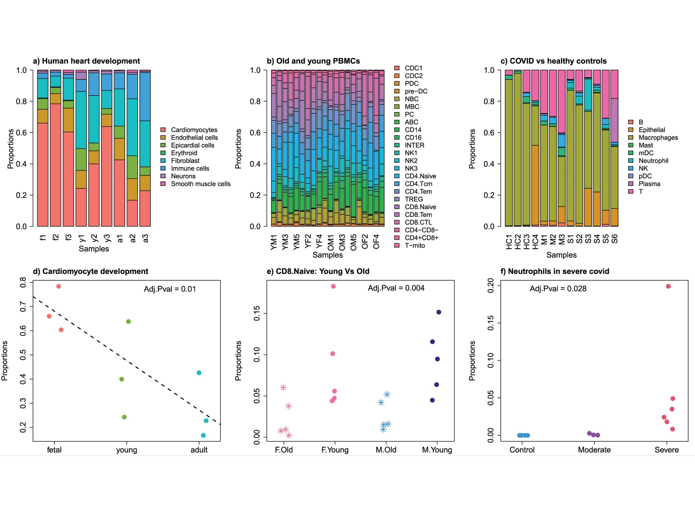
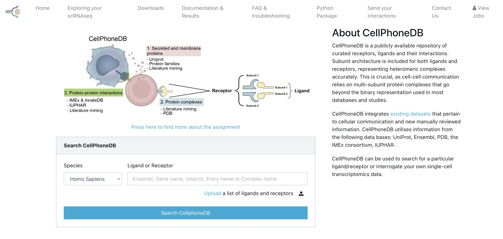
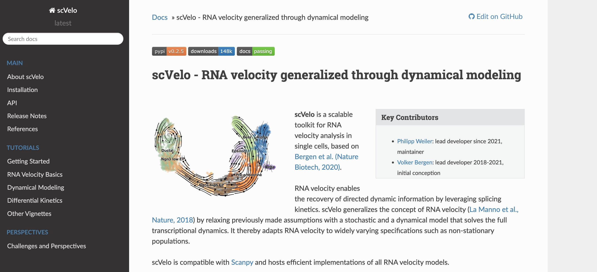
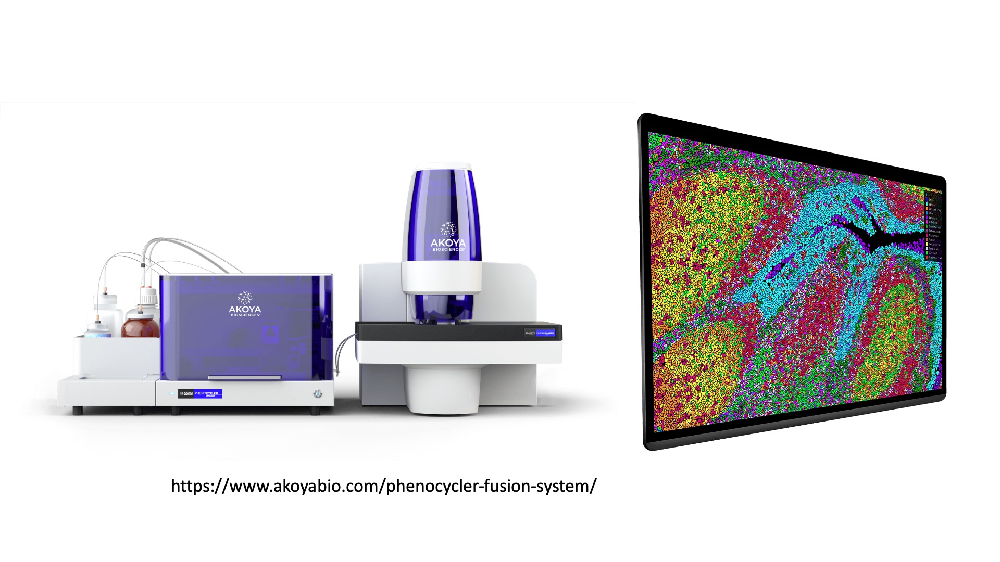

---
# Please do not edit this file directly; it is auto generated.
# Instead, please edit 08-Future-Directions.md in _episodes_rmd/
source: Rmd
title: "Future Directions"
teaching: 30
exercises: 0
questions:
- "What are some important concepts from the single cell field that we did not have time to discuss in this course?"
- "What are some interesting future research directions in areas related to single cell transcriptomics?"
objectives:
- "Discuss some of the complexities of inferring cell composition from scRNA-Seq."
- "Explain what the concept of pseudotime is."
- "Be able to give an example of what could be learned from analyzing cell-cell communication."
- "Give examples of multimodal cell profiling and how it could help you understand a biological system."
- "List examples of spatial profiling technologies that are beginning to become more widely available."
keypoints:
- "There exists a rich suite of concepts and methods for working with scRNA-Seq data that goes beyond cell type identification and into inference about how cells are changing and interacting with each other."
- "Multimodal datasets and spatially resolved technologies will be key to future inquiry in single cell and related fields."
---

## Topics not covered in detail in this course

There are a number of important topics in the field of single cell analysis
that we have not had the time to cover in this course. In this lesson we
will give a brief overview of some of these topics. We hope to give you
enough of a background to begin your own research. We will point you to 
one or a few resources or references
that we feel are useful within the section on each 
topic.

### Differences in cell composition

Single cell transcriptomics is a very powerful method for identifying
differences in tissue cell composition. This sort of question was 
usually addressed using methods like flow cytometry in the past, but flow
cytometry requires knowing what you want to look for before you can
quantify it. In scRNA-Seq we can take an entirely unbiased view of cell
composition, and we can define cell subsets with more subtle changes in
gene expression as opposed to only looking at broad classes of cell types
with "On/Off" changes in cell surface receptor protein expression.

Nevertheless, there are many complexities to understanding tissue cell
composition using scRNA-Seq. Typically we quantify on the order of 
thousands of cells per biological specimen in scRNA-Seq. Therefore, 
quantification of cell types can be subject to significant variability due to
statistical sampling alone, especially for rare cell types.
Moreover, it is possible -- and maybe even likely -- that 
cell types are variably susceptible to lysis or death during the cell
preparation process. Finally, there are difficulties that
are largely mathematical in nature. Tissue cell composition
measurements are inherently composed of a number of different cell types
that sum up to the whole tissue. When one cell type decreases in
abundance, other cell types must increase (at least on a relative basis). 
This type of data is called _compositional_ data and requires
special transformations in order to model changes in a
statistically rigorous manner.

Most single cell investigators use simple methods to look at changes
in cell composition such as ANOVA or t-tests. 
The 
[propeller](https://academic.oup.com/bioinformatics/article/38/20/4720/6675456)
method is a nice and simple option and available in an
easy-to-use R package. This figure is taken from Phipson et al 2022
and shows an example of applying
propeller to several different datasets:

[scCODA](https://www.nature.com/articles/s41467-021-27150-6) is a
more complicated approach that uses a Bayesian model incorporating
the compositional nature of the data. While the scCODA model is impressively
comprehensive and rigorous, the software is more
difficult to run and the output more difficult to interpret.

### Cell-cell communication 

An analysis of possible cell-cell communication is one output that
can be inferred from scRNA-Seq data. The basic idea is that we can 
use databases of known receptor-ligand interactions in order to 
predict cells that interact. Specifically, if cell type A expresses ligand X,
and cell type B expresses the cognate receptor for ligand X, we can infer
the possibility of communication between these two cell types.
Of course scRNA-Seq data is not telling us whether that 
receptor-ligand link is actually *active* at any particular moment in time,
but it may be useful to understand which cells are communicating
most/least and how lines of communication change in, say, a 
drug-treated vs control condition.

Many groups have developed analytical methods and tools for
exploring the cell-cell communication landscape. 
The best tools are able to draw on large databases of receptor-ligand
interactions and to properly consider interactions that involve
multiple subunit receptor-ligand complexes.
One major tool for carrying out analysis of cell-cell communication
is [CellPhoneDB](https://www.cellphonedb.org/)
published by 
[Efremova et al. 2020](https://www.nature.com/articles/s41596-020-0292-x).
This tool is widely used and has a web portal as well as a python
package:

Another option is [CellChat](http://www.cellchat.org/),
published by 
[Jin et al. 2021](https://www.nature.com/articles/s41467-021-21246-9)
which has an accompanying R package.

### Pseudotime and RNA velocity

Cells of various types differentiate from progenitor cells in ways
that are as diverse as the cells themselves. Moreover, 
cells can change state -- for example, in response to external
cues. When cells transit between developmental or functional states,
the cell's transcriptome is altered as some genes are turned on and
others are turned off. In many cases the precise ordering of these
intermediate
changes is difficult or impossible to study as the cells cannot be
cleanly isolated. 
However, profiling a collection of cells that is changing state
using scRNA-Seq can address this problem. Such a collection will
have cells at different stages of the change in state. If we can 
reconstruct the "transcriptional trajectory" connecting 
states, it will allow us to better understand the transition.

Pseudotime is the position of a cell along such a
trajectory. Pseudotime is not necessarily equivalent to some
real timescale, but 
rather is "a latent (unobserved) dimension which measures the cells’ 
progress through [a cellular] transition" 
[Reid and Wernisch 2016](https://doi.org/10.1093%2Fbioinformatics%2Fbtw372). 
[Monocle](https://cole-trapnell-lab.github.io/monocle3/) is the software
package that introduced the concept of pseudotime and 
popularized the use of algorithms for reconstructing cellular
trajectories using scRNA-Seq. As the Monocle documentation puts it:

> Monocle uses an algorithm to learn the sequence of gene expression 
> changes each cell must go through as part of a dynamic biological 
> process. Once it has learned the overall "trajectory" of gene 
> expression changes, Monocle can place each cell at its proper position 
> in the trajectory. You can then use Monocle's differential analysis 
> toolkit to find genes regulated over the course of the trajectory ...
> If there are multiple outcomes for the process, Monocle will reconstruct 
> a "branched" trajectory. These branches correspond to cellular "decisions",
> and Monocle provides powerful tools for identifying the genes affected 
> by them and involved in making them.

In addition to Monocle 
there are many, many algorithms and software packages for inferring 
pseudotime. For a very nice list check out
[Anthony Gitter's github list](https://github.com/agitter/single-cell-pseudotime).

A very clever technique that is somewhat related
to pseudotime is called RNA velocity.
RNA velocity was introcduced by 
[La Manno et al. 2018](https://www.nature.com/articles/s41586-018-0414-6).
They defined RNA velocity as the time derivative
of a cell's gene expression state. RNA velocity uses the 
ratio of unspliced versus spliced RNAs in a cell to estimate
whether a gene's expression is currently increasing
(unspliced > spliced) or decreasing (spliced > unspliced).
[scvelo](https://scvelo.readthedocs.io/) is a beautifully engineered
toolkit that
generalizes RNA velocity by relaxing previous model assumptions with a
stochastic and a dynamical model that solves the full transcriptional dynamics. 
See [Bergen et al. 2020](https://doi.org/10.1038/s41587-020-0591-3) for
more details.

Pseudotime/trajectory analysis and RNA velocity are related but distinct
methods. Trajectory analysis attempts to build a continuous transcriptional
gradient representing a path between groups of cells, but does not
automatically infer a direction. In contrast, RNA velocity also deals with
transitions between cellular states, but explicitly considers the
directionality of the transitions.

## Very large datasets

Not long ago it was very impressive to profile thousands of cells.
Today larger labs are fairly routinely profiling around a million cells!
From an analytical perspective, these very large datasets must be thought 
of differently than smaller datasets. Very large datasets may often
cause memory or disk space errors if one tries to use conventional methods
to analyze them (e.g. the methods we have shown earlier in this course).

Here are two possible solutions:

 1. Be clever in your analysis. Reduce dimensionality of subunits of your data
 (e.g. samples) using something like PCA, and integrate in this 
 reduced-dimensional subspace, which will be less computationally intensive
 than trying to operate on all data simultaneously. For example, see the 
 section on reciprocal PCA at 
 [this link](https://satijalab.org/seurat/archive/v3.2/integration.html)
 2. Combine very similar cells into mini-bulk samples in order to 
 drastically reduce the number of cells. Methods available to do this include
 Metacells [Ben-Kiki et al. 2022](https://genomebiology.biomedcentral.com/articles/10.1186/s13059-022-02667-1) 
 and SuperCell [Bilous et al. 2022](https://bmcbioinformatics.biomedcentral.com/articles/10.1186/s12859-022-04861-1).

## Multimodal molecular profiling

An important area of future inquiry in the single cell arena is the extension
to so-called *multi-modal* profiling. This simply means profiling cells
using not just transcriptomics, but via multiple data modalities. Some 
common examples of multimodal profiling include:

 * single cell transcriptomics + single nucleus ATAC-Seq (chromatin accessibility)
 * single cell transcriptomics + single cell surface protein quantification (CITE-Seq)
 * single cell transcriptomics + immune repertoire profiling 
 

(Image courtesy of 10X Genomics webpage)

There is already a large literature on these topics. 
[Zhu et al. 2020](https://www.nature.com/articles/s41592-019-0691-5)
wrote a nice commentary piece discussing methods and tools
available for multimodel analysis in single cell genomics
[Hao et al 2021](https://doi.org/10.1016%2Fj.cell.2021.04.048)
published a landmark paper that developed methods for integrating across
different data modalities and implementing these methods in version
4 of the Seurat package.

## Spatial profiling 

Spatial profiling methods are an interesting and rapidly growing
area of research and technology. 
These approaches are not always truly single cell biology and
in many cases blend the ethos of single cell genomics with approaches
traditionally used in fields like pathology.
Nevertheless we mention them here because these technologies are 
revealing previously inaccessible information about the molecular properties
of cells in their native tissue context, and the future 
holds promise for increasingly more accurate and powerful technologies.

10X Genomics offers the 
[Visium platform](https://www.10xgenomics.com/products/spatial-gene-expression).
This platform currently profiles
a slice of tissue that is 6.5mm square using 5,000 spots each 50um in diameter.
These spots are large enough that they are not truly single cell, 
rather each spot typically captures between 1-10 cells. Thus in some
ways the data from each spot can be thought of as a "mini" bulk RNA-Seq.
Nevertheless it can be very useful to assay gene expression in this spatially
resolved manner. 10X also will soon (end of 2022) offer the 
[Xenium In Situ platform](https://www.10xgenomics.com/platforms/xenium)
which can profile hundreds of RNA targets with subcellular resolution.

Another spatial profiling option is 
[Nanostring's GeoMx Digital Spatial Profiler](https://nanostring.com/products/geomx-digital-spatial-profiler/geomx-dsp-overview/).
This is a high-plex protein and RNA platform that uses indexing
oligonucleotides assigned to targets of interest. This allows measuring
hundreds of potential protein and RNA biomarkers.

A final spatial profiling option is the 
[PhenoCycler system from Akoya Biosciences](https://www.akoyabio.com/phenocycler/).
This system (formerly known as CODEX) is a commercial implementation
of a device that was pioneered in an academic lab
(protocol reviewed in [ref](https://pubmed.ncbi.nlm.nih.gov/34215862/)).
The system allows profiling of millions of cells across a whole slide
with single-cell resolution. This system originally profiled 
dozens of proteins but has expanded to include the capability to
capture 100+ protein and RNA biomarkers.

(Images courtesy of Akoya Biosciences webpage)

For each of these instruments tissue can be prepared in a variety
of ways. In many cases the techology is moving towards profiling of
Formalin-Fixed Paraffin-Embedded (FFPE) samples. The technological
landscape is sure to change quickly and the future is bright for 
spatial profiling!
