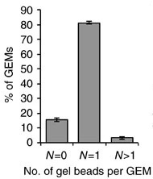
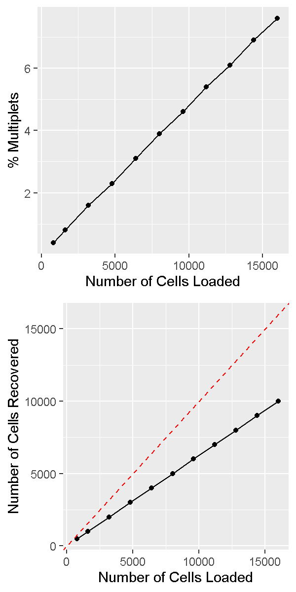
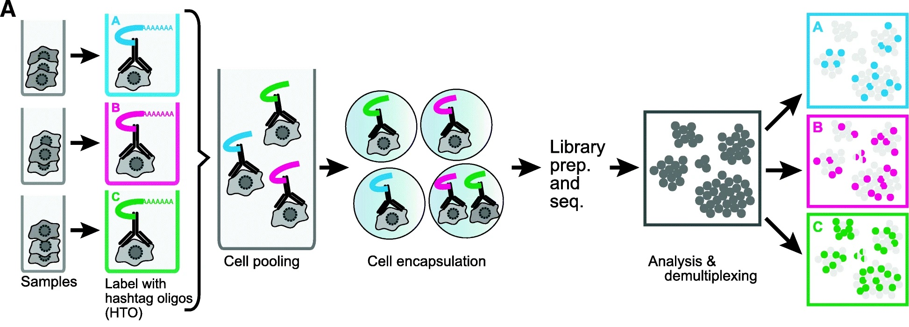
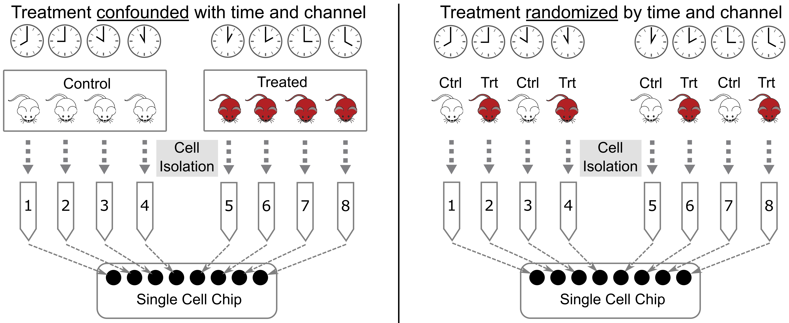

```{r, include=FALSE}
source("../bin/chunk-options.R")
knitr_fig_path("02-")
```

In this lesson we will discuss several key factors you should keep in mind 
when designing and executing your single cell study. Single cell 
transcriptomics is in many ways more customizable than bulk transcriptomics. 
This can be an advantage but can also complicate study design.

To begin, we note that you should be aware of the distinction between 
cells *loaded* vs cells *captured*. In a 10X scRNA-Seq study
you prepare a cell suspension and decide how many cells should be loaded 
onto the 10X Chromium instrument. The cells flow through the microfluidics
into oil-water emulsion droplets, but not all cells are captured.
Typically somewhere between 50-70% of cells are captured. 10X provides
estimates for the capture rates of samples profiled using their 
3' gene expression kit 
[here](https://kb.10xgenomics.com/hc/en-us/articles/360001378811-What-is-the-maximum-number-of-cells-that-can-be-profiled-).

## Doublets/multiplets - a ubiquitous property of droplet single cell assays

In droplet single cell transcriptomics, a key reason the technology "works" is 
because most droplets contain at most one cell. After all, if droplets 
contained more than one cell the technology would no longer be profiling 
single cells! However, due to the nature of the cell loading of droplets (which 
can be modeled accurately using Poisson statistics), even in a perfect 
experiment it is inevitable that some droplets will contain more than one cell. 
These are called *multiplets* -- or doublets, since the vast majority of 
multiple-cell droplets contain two cells. The initial paper describing the 
10X technology, published in 2017, showed the following histogram:



It is important to realize that the doublet rate is not fixed but rather 
depends on the number of cells *loaded* into the 10X Chromium machine. 
The more cells are loaded, the higher the doublet rate. The figure below shows 
the relationship between the number of cells loaded and the doublet rate. 
This figure is derived from the 10X User Guide for their 
Chromium Next GEM Single Cell 3ʹ Reagent Kits v3.1 product,
but the basic trends should hold across other versions of this product as well.



In a future lesson we will discuss software options for trying to identify and 
remove doublets prior to drawing biological conclusions from data. 
Unfortunately this process is not always straightforward and we are usually 
forced to accept the reality that we likely cannot remove *all* doublets from 
our data.  


## How to decide on the parameters of the experiment

There are a number of parameters in a typical scRNA-Seq experiment that are 
customizable according to the particular details of each study. 

### Number of cells

A typical number of captured cells (target cell number) would be 6,000-8,000 
cells on a standard 10X Chromium, or 16,000-20,000 cells on the higher 
throughput Chromium X.
At these cell capture numbers, the doublet rates are expected to stay
relatively low (the JAX Single Cell Biology Laboratory estimates
empirical doublet rates of 0.9% and 0.4% per 1,000 cells for 
Chromium and Chromium X, respectively).
At these doublet rates we would expect to obtain less than 100 doublets in
standard experiments.
One may also choose to "overload" or "super load" the Chromium instrument.
In this strategy we load more than the typical number of cells,
they flow through the instrument more quickly than usual, and more
droplets end up with multiple cells.
Therefore our data contains more multiplets; however we also obtain more
total cells. If we are in a setting where we can tolerate a higher
doublet rate this may be an efficient way of profiling more 
cells.

### Sequencing depth

There is no fixed rule for how deeply we should sequence in our scRNA-Seq
experiment. Moreover, the depth of sequencing will vary significantly between
cells no matter what we choose.

Nevertheless, a reasonable rule of thumb would be to sequence to a depth of 
approximately 50,000 - 75,000 reads per cell.
If we are profiling cells that have relatively few genes expressed,
such as lymphocytes, we might target a sequencing depth closer to 
25,000 - 50,000 reads per cell. If we are profiling cells that express many 
genes, such as stem cells, we might go significantly higher, to 
100,000 or even 200,000 reads per cell.

### Number of samples

It is generally more economical to run at least a few scRNA-Seq samples
than to run just one or two. For example, JAX's Single Cell Biology
Laboratory gives a substantial per-library discount for running 3+ 
samples as opposed to one or two samples. This is because the chip
used to run samples through Chromium has 8 (or 16) channels which cannot
be reused.  

The most efficient way to organize your experiment is to design it to be run 
in batches of 8.  


## Biological replication  

Proper biological replication is the cornerstone of a statistically 
well-powered experiment. This is recognized across nearly all of biology. 
In the early days of single cell RNA-Seq, the main focus of many investigations 
was demonstrating the technology and often biological replication was missing. 
As scRNA-Seq has matured, it has become increasingly important to 
include biological replication in order to have confidence that our findings 
are statistically robust.

Note that the tens of thousands of cells sequenced in a typical sample do 
*not* constitute biological replication. In order to show a biologically 
meaningful change in cell composition, the emergence of a particular cell 
subset, or difference in gene expression we need samples harvested from 
multiple individuals.

In a strict sense, biological replication would entail independently rearing 
multiple genetically identical animals, subjecting them to identical conditions, 
and harvesting cells in an identical manner. This is one strength of working in 
the mouse that we can leverage at JAX. However, there are also instances where 
we can obtain useful biological replication without meeting these 
strict requirements. For example, a disease study in humans may profile 
single cells collected from affected and unaffected individuals, and could 
provide insights as long as the groups are not systematically different. 
Turning to the mouse, a fine-grained time course may not require biological 
replication at every time point because -- depending on the questions 
investigators wish to ask -- cells from different individual mice collected 
at different time points might be analyzed together to attain robust results.

How many biological replicates should one collect? This question is difficult 
to answer with a "one size fits all" approach but we recommend an 
*absolute minimum* of three biological replicates per experimental group. 
More is almost always better, but there are obviously trade offs with respect 
to budget and the time it takes to harvest samples. There are many studies 
that have attempted to model the power of single cell RNA-Seq experiments, 
including differential gene expression and differences in cell composition. 
We will not discuss these studies in detail in this course, but some may be 
useful for your own work:  

 * Schmid et al. 2021. scPower accelerates and optimizes the design of 
 multi-sample single cell transcriptomic 
 studies. <https://doi.org/10.1038/s41467-021-26779-7>
 * Svensson et al. 2017. Power analysis of single-cell RNA-sequencing 
 experiments. <https://doi.org/10.1038/nmeth.4220>
 * Davis et al. 2019. SCOPIT: sample size calculations for single-cell 
 sequencing experiments. <https://doi.org/10.1186/s12859-019-3167-9>
 * Zimmerman et al. 2021. Hierarchicell: an R-package for estimating power 
 for tests of differential expression with single-cell 
 data. <https://doi.org/10.1186%2Fs12864-021-07635-w>
 * Vieth et al. 2017. powsimR: power analysis for bulk and single cell 
 RNA-seq experiments. <https://doi.org/10.1093/bioinformatics/btx435j>
 * Su et al. 2020. Simulation, power evaluation and sample size 
 recommendation for single-cell 
 RNA-seq. <https://doi.org/10.1093/bioinformatics/btaa607>


## Pooling options  

Given the relatively high expense of each scRNA-Seq sample and the importance 
of proper biological replication laid out above, the opportunity to pool samples 
and run them together is a powerful tool in the single cell researcher's 
toolkit. 
In pooled single cell genomics, there are two primary methods of tracking 
the sample to which each individual cell belongs. First, one can attach a 
unique barcode ("hashtag") to all cells of each sample, typically using an 
oligonucleotide-tagged antibody to a ubiquitous cell surface protein or an 
alternative (e.g. lipid-reactive) reagent.  



(Figure from [Smibert et al. 2018](https://pubmed.ncbi.nlm.nih.gov/30567574/))
This approach was pioneered by 
[Smibert et al](https://pubmed.ncbi.nlm.nih.gov/30567574/). The hashtag is 
read out in a dedicated library processing step and used to demultiplex samples 
based on knowledge of the pre-pooling barcoding strategy. This is the basis of 
the techniques known as "cell hashing", "lipid hashing", and the recently 
introduced 10X Genomics CellPlex multiplexing system. The hashtagging approach 
is accurate, however it is important to note that the extra experimental steps 
may impose obstacles. Hashtagged multiplexing requires extra sample preparation 
steps for barcoding, which can affect the viability and quality of cell 
preparations, may be less effective for certain tissues and cell types, and 
the increased sample handling may itself impose a significant burden in large 
projects.

A second, alternative, approach is to use natural genetic variation as a 
built-in barcode and demultiplex cells using SNVs and indels unique to each 
sample. 

> DMG: (Figure?). 

This approach was pioneered by 
[Kang et al.](https://www.nature.com/articles/nbt.4042). 
In contrast to the hashtagging approach, genetic demultiplexing requires 
no special reagents or additional steps, and can be used for any tissue or 
cell type. However, the genetic demultiplexing approach requires that the 
samples being pooled are sufficiently genetically distinct for them to be 
distinguishable using transcribed genetic variation. This condition is 
typically met in human studies or in studies of genetically diverse mice. 
Of course, this approach would not suffice for a study of a single inbred 
mouse strain profiled under multiple conditions.
One advantage of genetic demultiplexing is that we can use the genetic 
information to filter out any mixed background doublets, allowing us to
obtain data that contains fewer doublets than we would otherwise
expect.  


## Avoid Confounding Batch with Experimental Variables

When designing an experiment, it is tempting to lay samples out in some order 
that is easy to remember. If you are performing a dose-response experiment, 
you might order your samples from the lowest dose to the highest dose. If you 
are assaying transcript levels in different tissues, you might sort the 
samples by tissue. However, if you maintain this order, you risk confounding 
RNA-Seq batches with your experimental batches. This is called "confounding" 
and it makes it impossible to statistically disentangle the batch effect 
from your experimental question.

Let's look at an example. Suppose that you have analyzed cells from kidney, 
liver, spleen, and heart. In the lab, you would process each tissue type 
independently because each tissue is distinct. If you maintain the tissues 
separately as you perform library preparation and sequencing, you will be 
unable to determine whether the differences that you observe are due to 
tissue differences or RNA-Seq batch differences. 

In order to reduce the effect of batch structure on your experiment is it 
crucial to employ **randomization**. This involves randomizing tissues across 
library preparation and sequencing batches. The figure below shows examples of 
poor and good batch design. In the left panel, the library from each tissue is 
placed in a separate flow cell. This means that, if there are differences 
between flow cells, there will be no way to distinguish or correct these 
differences. On the right, we show the recommended flow cell design. The 
library from each tissue should be distributed evenly across each flow cell. 
The reads for each tissue can be combined from each flow cell using the cell 
barcodes after sequencing.



> ## Recommended Reading
>
> Luecken MD, Theis FJ (2019) Current best practices in single-cell RNA-seq analysis: a tutorial.
Mol Syst Biol [link](https://pubmed.ncbi.nlm.nih.gov/31217225/)
>
> Andrews TS, Kiselev VY, McCarthy D, Hemberg M (2021) Tutorial: guidelines for the computational analysis of single-cell RNA sequencing data. Nat Protoc [link](https://pubmed.ncbi.nlm.nih.gov/33288955/)
>
{: .checklist }

## Session Info

```{r session_info}
sessionInfo()
```
